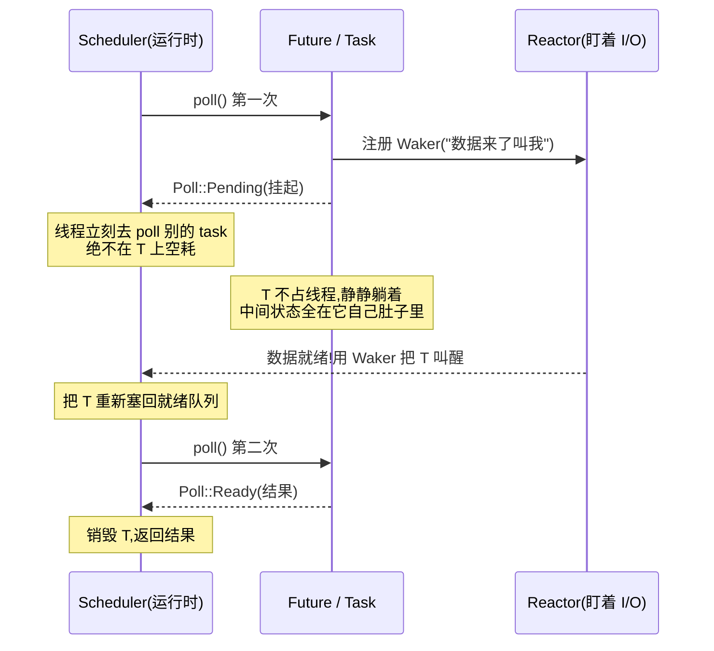

# 第 2 章 · Future 与 poll 模型

> **核心问题**:为什么 Rust 的异步非得是"状态机 + 轮询",而不是大家更熟悉的"回调(callback)"?`Future::poll` 这个签名古里古怪的 trait 方法,到底立下了一条什么契约?为什么听上去很笨的"轮询(poll)",反而是高效的?一个 Future 在 `poll` 里说"我还没好(`Pending`)",它**靠什么记住自己做到哪一步了**,又是怎么被"挂起"而不占着线程的?
>
> 这一章我们不碰调度器、不碰 reactor,只死盯**被调度的对象本身**——一个 `Future` 到底长什么样、怎么被驱动。
>
> **读完本章你会明白**:
> - 为什么是"轮询"而不是"回调":回调地狱(callback hell)和"线程阻塞干等"两条反面路径,各自撞墙在哪,而"poll + 挂起 + 被叫醒"是怎么把两面墙都躲掉的。
> - `Future::poll` 的契约——为什么 `poll` 必须是**无阻塞、快进快出**的,返回 `Pending` 时**必须保证有人会再叫醒它**,这是整条 async 链条上的第一道法律。
> - 为什么 Future **必须自带状态**(状态机),否则"轮询"会丢进度——这一条直接把读者推向第 3 章(编译器怎么把 `async fn` 变成状态机)。
> - "轮询"为什么反而高效:不是空转瞎问,而是"不 ready 就走、ready 了才被叫回来干一下",`Pending` 时线程立刻去干别的。

---

## 章首·一句话点破

> **`Future` 就是一张"做到哪一步了、下次接着做"的折叠小纸条;`poll` 是运行时拍拍它问"现在能往下走吗"。回答只有两种:能(把结果给你)——或者不能(那我先去干别的,你等的那事好了,会有人把我叫回来再问你一次)。**

这是**结论**。这一章倒过来拆:先看"不这么干会怎样"——从回调地狱和线程干等着两头堵说起,看为什么 Rust 偏偏选了这条听上去最笨的"轮询"路;再把 `Future` trait 那行签名掰开,看清它定的契约凭什么高效又正确;最后落到"挂起时进度存哪",给第 3 章铺路。

第 0 章末尾留了个钩子:**"`Future::poll` 到底是什么?一个 `async fn` 怎么变成可被反复 poll 的东西?"** 这一章回答前半句。

---

## 一、先看反面:为什么不是回调,也不是"阻塞干等"

要理解 Rust 为什么选"状态机 + 轮询",得先看清另外两条路各自死在哪。这非常关键——`Future::poll` 的整个设计,就是**为了同时躲开这两条路的坑**。

### 反面一:回调地狱(callback hell)

最直觉的异步思路是回调(callback):你想等一个 I/O,就**注册一个函数**,等数据来了让系统调它。

```c
// 简化示意,非源码原文:Node.js / libuv 风格的回调
read_socket(fd, [](data) {
    parse(data, [](req) {
        query_db(req, [](rows) {
            write_socket(fd, build_resp(rows), []() {
                // 终于写完了
            });
        });
    });
});
```

> **不这样会怎样**:缩进像楼梯一样越走越深,控制流被撕成碎片。你**没法用正常的 `if`/`for`/`return`/`?` 错误传播**去写异步逻辑——因为"下一步"不是下一行,而是另一个嵌套的闭包。一个简单的 try/catch,在回调里要拆成每个回调各自判错、层层往上抛。这叫**控制流反转(inversion of control)**:本来由调用者决定"先做什么后做什么",现在反过来了,被调用者(底层事件循环)在某个未来时刻替你调你的回调。这玩意儿有个专门的名字,叫 **callback hell(回调地狱)** 或 **pyramid of doom(末日金字塔)**。

JavaScript 世界被它折磨了十年,最后造出 `Promise` 和 `async/await` 才逃出来。Rust 从一开始就吸取教训:**异步代码必须长得像同步代码**——该 `if` 就 `if`,该 `return` 就 `return`,该 `?` 就 `?`。

### 反面二:阻塞干等(thread-per-connection)

另一条路是第 0 章拆过的:**一个连接一个线程,线程在 `read` 上阻塞着等**。

```rust
// 简化示意,非源码原文:同步阻塞
let mut buf = [0u8; 1024];
let n = socket.read(&mut buf)?;   // 线程在这卡住,直到数据来
process(&buf[..n]);
```

> **不这样会怎样**:线程在等的时候**完全占着不撒手**。第 0 章已经讲透:线程贵(8MB 栈)、切换贵、99% 时间在傻等,万级并发就崩(C10K)。这条路的死穴是"等待 = 占用线程"。

### 两条路,夹出一个需求

| 反面 | 死穴 | 想要的 |
|------|------|--------|
| 回调地狱 | 控制流被撕碎,写起来是地狱 | **异步代码长得像同步**(顺序、可 if/for/return) |
| 阻塞干等 | 等待 = 占线程,万级并发崩 | **等待时不占线程**,线程能去干别的 |

把这两条需求叠起来,就得到 Rust 的答案:

> **我们需要一种"看起来像同步顺序代码、但执行时会在等待点主动让出线程"的东西。**

它"长得像同步代码"——所以它必须是一个普通的 Rust 值,有类型,能被传参、能 `if`、能 `?`,而不是一坨嵌套闭包。它"执行时会让出"——所以它不能像同步函数那样"一路跑到底",而是**被外部反复地、一小段一小段地驱动**。

这个"被反复小段驱动"的机制,就叫 **poll**;那个"看起来像同步代码、其实能被分段驱动"的值,就叫 **Future**。

---

## 二、Future trait:一行签名,立下一部法律

现在看 Rust 标准库对 `Future` 的定义。注意——**它定义在 Rust 标准库(`core::future::Future`),不在 tokio 仓库**。这是 Rust 的精妙分工:语言只定"最小契约",库(运行时)负责真正去驱动它(第 0 章讲过这个解耦)。

```rust
// 标准库定义(简化展示,完整定义见 rustdoc)
pub trait Future {
    type Output;
    fn poll(self: Pin<&mut Self>, cx: &mut Context<'_>) -> Poll<Self::Output>;
}
```

([`std::future::Future` —— 标准库定义](https://doc.rust-lang.org/std/future/trait.Future.html))

外加它的返回类型 `Poll`,也在标准库:

```rust
// 标准库定义
pub enum Poll<T> {
    Ready(T),
    Pending,
}
```

([`std::task::Poll` —— 标准库定义](https://doc.rust-lang.org/std/task/enum.Poll.html))

就这两段。整个 async Rust 的大厦,都立在这两部法律上。我们一句一句拆。

### `poll`:不是"你问我答",是"运行时推你一把"

`poll` 的字面意思是"轮询/询问",但这个名字**极具误导性**,是初学者最大的误解来源。

> **最大的误解**:"poll 是不是运行时每隔几毫秒来问一次'你好了吗'?"
>
> **真相**:不是。poll 不是定时巡检,poll 是**一次"尝试往下推"**。运行时把 Future 拿过来,调一次 `poll`,意思是:"**你现在能往下走吗?能走就把结果给我;不能就走开,我(线程)去干别的。**"

这两者的区别是本质的:

- 定时巡检(忙等 / busy polling):CPU 一直在那转着问"好了没好了没",**纯浪费**。这恰恰是 async 要消灭的东西。
- poll 模型:**只在"可能能往下走"的时候才 poll 一次**(第一次 spawn 进来时、被唤醒时);poll 完如果还没好,**线程立刻去干别的**,绝不空转。

> **比喻回到餐厅**:`poll` 不是服务员每隔 10 秒跑去问每桌"菜好了吗"(那是傻巡桌,服务员腿都跑断了)。`poll` 是:**厨房喊一声"3 号桌菜好了",经理才拍一下负责 3 号桌的服务员"去上菜"**。服务员平时要么在干活,要么在打盹,**绝不会主动去挨桌问**。决定"什么时候该 poll"的,是"被叫醒"这个事件,而不是定时器。

### `Poll::Ready(T)`:做完了,这是结果

`poll` 返回 `Ready(v)`,意思是"我做完了,最终结果是 `v`"。**这是一锤子买卖**:

> **钉死这件事(契约一)**:一旦一个 Future 的 `poll` 返回过一次 `Ready`,就**绝不能再被 poll**。再 poll 它是未定义行为(undefined behavior)。Future 就是一张"用完即弃"的票,出结果那一刻,它的生命周期就结束了。

tokio 在源码里也守这条:运行时拿到 `Ready` 后,立刻 `return` 出循环,把这个 Future 销毁掉(后面章节会看到 task 怎么在 `Ready` 后做清理)。

### `Poll::Pending`:还没好,我先把线程让出去

`poll` 返回 `Pending`,意思是"我现在没法往下走了——我在等某样东西(数据、锁、定时器),那样东西还没来"。

**返回 `Pending` 的那一刻,就是任务"挂起"的瞬间。** 但这里有个铁的契约,是整个 async 体系能转起来的关键,必须死死记住:

> **钉死这件事(契约二,法律级)**:`poll` 返回 `Pending` 时,**必须保证**:将来它等的那样东西就绪了,会有人通过 `Context` 里那个 `Waker` 把它**重新唤醒**(re-awoken)。换句话说,**"返回 Pending" 和 "已登记好怎么被叫醒" 是同一件事的两面**,缺一不可。

这条不是建议,是**法律**。标准库 `Poll` 文档原文:

> Represents that a value is not ready yet. When a function returns `Pending`, the function must also ensure that the current task is scheduled to be awoken when progress can be made.

([`Poll::Pending` 文档](https://doc.rust-lang.org/std/task/enum.Poll.html))

翻译成大白话:**你不能光说"我没好"就拍拍屁股走人,你走之前必须留下一个"等我好了怎么叫我"的安排。** 否则这个 Future 就永远沉睡,再没人 poll 它——这就是传说中的"任务永久挂起",async bug 里最阴的一种。

> **比喻**:服务员去问 3 号桌"现在能上菜吗",厨房说"还没好"。服务员**不能**就这么走了再也不回来——他得在传菜口那边**留个心眼("3 号桌的菜好了叫我")**,然后去服务别桌。这个"留个心眼",在代码里就是往 `Waker` 上登记。`Waker` 本身怎么实现的,是第 4 章的大戏,本章只点到这里:**挂起 = 返回 Pending + 把 Waker 留好**。

### 为什么把 `poll` 设计成"问一次就走",而不是"阻塞到好"?

> **不这样会怎样**:如果 `poll` 可以阻塞(等数据来了再返回),那它就退化成了反面二——一个 Future 阻塞,占着的就是它身后那个跑它的 OS 线程。async "等待不占线程"的全部意义就没了。

所以 `poll` 被硬性要求:**绝不阻塞,要么立刻给结果,要么立刻让出**。它必须"快进快出":要么发现数据已经到了(Ready),要么发现没到、登记好 Waker 就立刻返回 Pending。这给了 async 一个看似反直觉、实则强大的性质:

> **一个 worker 线程,可以成千上万次地 poll 不同的 Future,中间从不阻塞、从不傻等——它永远在"有进展就推进、没进展就换下一个"。** 这才是"一根线程驱动百万并发"得以实现的地基。

### 小结:poll 契约的三个要点

1. **无阻塞**:`poll` 要么立刻 Ready,要么立刻 Pending,绝不卡住线程。
2. **Pending 必留 Waker**:返回 Pending 前,必须确保"条件就绪时有人会唤醒我"。
3. **Ready 后不可再 poll**:出结果即终结。

记住这三条,后面 tokio 的一切(reactor 注册、task 状态机、取消逻辑)都是在**守住**这三条。

---

## 三、poll 的两态契约为什么高效:一张图看清"轮询 + 挂起 + 唤醒"

光说契约太干。我们用一张时序图,把"poll → Pending(挂起) → 事件就绪 → 唤醒 → 再 poll → Ready"这条完整链路画出来,看清它**为什么高效**——高效就高效在"Pending 那段时间,线程根本不在场"。



关键看图中间那段"挂起"区:**T 在 Pending 到被唤醒之间,可能隔了几毫秒、几秒甚至几分钟,这整段时间里 worker 线程一行代码都没为 T 跑——线程早跑别的 task 去了。** 这就是"等待从占用里解放"最微观的样子:不是"等待消失了",而是"等待的代价不再由线程承担,而是由一个轻量的 Waker 登记兜着"。

> **对比三态**:
> - **阻塞干等**(反面二):挂起那段时间,线程**死死钉在那**(在 `read` 里卡着)。
> - **回调**(反面一):挂起那段时间,状态被**撕碎到一堆闭包**里,层层嵌套。
> - **poll + 状态机**(Rust 的选择):挂起那段时间,状态**完整地存在 Future 自己肚子里**(一张折叠小纸条),线程**干干净净地走了**;回来了再 poll 一次,从纸条上记的位置接着往下走。

第三种,正是 Rust 要的。

---

## 四、但是——挂起时,进度存在哪?Future 必须自带状态

这一节是本章承上启下的命门,直接把读者推向第 3 章。

回到那张时序图,问一个致命的问题:

> **poll 第一次返回 Pending 时,这个 Future"做到哪一步了",存在哪?**

考虑一个稍微复杂的 Future:它要"先读一个字节,再读一个字节,再把两个字节拼起来返回"。第一次 poll 时,它读了第一个字节,但第二个还没来,返回 Pending。第二次 poll(被唤醒后),它**必须记得"我已经读了第一个字节"**,才能接着读第二个——而不是从头再读一遍。

如果 Future 是个**无状态**的函数(每次 poll 都从头跑),那"轮询"就成了笑话:每次都白干。所以——

> **钉死这件事**:Future **必须自带状态**——它是个**有内存、记得自己进度**的东西,不是个纯函数。第一次 poll 干到一半返回,它的中间状态(读了哪些字节、解析到哪、临时变量)全得**存在它自己这块内存里**;第二次 poll 从这块内存里把进度捞出来,接着往下。

这,就是为什么 Future 在 Rust 里**是个值(value)**,有类型、占内存,而不是一个单纯的函数。也正因如此,它必须**被分配在某处**(栈上或堆上),并且**不能被随便移动**(中间状态里可能藏着自己指自己的指针——这引出第 3 章的 `Pin`)。

> **比喻回到餐厅**:订单不是一句话"上菜",而是**一张折叠好的小纸条**,上面密密麻麻记着:"3 号桌,点了 A+B,厨房已出 A,等 B,出了就一起端上"。服务员**每次被叫号接手这张订单,都是从纸条上读到哪了、接着做**——而不是把这张订单从头再问一遍客人。这张"自带进度的小纸条",就是 Future 的状态机。

### tokio 源码里的佐证:`MaybeDone`——一个手写的三态状态机

光说抽象,不信?我们看 tokio 源码里一个**真实存在、手写的** Future 状态机——`MaybeDone`。它是一个组合器(combinator):把任意 Future 包一层,记下"做没做完、做完了结果是什么"。

```rust
// tokio/src/future/maybe_done.rs(摘录,简化注释)
pin_project! {
    pub enum MaybeDone<Fut: Future> {
        Future { #[pin] future: Fut },   // 还没做完,内层 future 还在
        Done { output: Fut::Output },     // 做完了,结果存这
        Gone,                             // 结果被取走了,空壳
    }
}

impl<Fut: Future> Future for MaybeDone<Fut> {
    type Output = ();

    fn poll(mut self: Pin<&mut Self>, cx: &mut Context<'_>) -> Poll<Self::Output> {
        let output = match self.as_mut().project() {
            MaybeDoneProj::Future { future } => ready!(future.poll(cx)),
            MaybeDoneProj::Done { .. } => return Poll::Ready(()),
            MaybeDoneProj::Gone => panic!("MaybeDone polled after value taken"),
        };
        self.set(MaybeDone::Done { output });   // 状态机迁移:Future → Done
        Poll::Ready(())
    }
}
```

([tokio/src/future/maybe_done.rs:14-72](../tokio/tokio/src/future/maybe_done.rs#L14-L72))

看这段代码,你会发现:`MaybeDone` 就是一个**三态状态机**——`Future` 态、`Done` 态、`Gone` 态。每次 `poll`,它根据当前状态决定干啥;一旦内层 future 出结果,它**把自己从 `Future` 态迁移到 `Done` 态**,把结果**存在自己肚子里**(枚举的 `output` 字段)。

这就是"Future 自带状态"的活样本。**注意一个伏笔**:`MaybeDone` 用了 `pin_project`——为什么?因为状态机迁移要保证"迁移后内存还在原地、内部指针不失效"。这正是第 3 章 `Pin` 要解决的问题,这里先埋下,不展开。

> **钉死这件事(本章最重要的承上启下)**:`MaybeDone` 是**人肉手写**的状态机。你写 `async fn`,编译器干的就是这件事——**自动**把你的 `async fn` 编译成一个类似 `MaybeDone` 这样的状态机:每个 `.await` 点是一个状态,每个状态记着"做到哪了、临时变量是什么"。这就是为什么 `async fn` 看起来像同步代码(因为有 `if`/`for`/`return`),执行起来却像状态机(因为编译器把它**翻**成了状态机)。**怎么翻的,翻完长什么样,翻出来为什么必须 `Pin`——全是第 3 章的戏。** 本章只立住一个认知:**Future = 状态机,这不是设计选择,是"轮询不丢进度"的唯一出路。**

---

## 技巧精解:poll 两态契约——为什么"轮询"反而最高效

这一节是本章的硬核。我们挑全书最基础、也最容易被误解的一个技巧来拆透:**为什么 `Future::poll` 的"两态契约(Ready / Pending)"+ "Pending 必留 Waker",组合起来是异步世界里最高效的设计**,而朴素的两条替代路各撞什么墙。

### 反面对比一:朴素"忙等轮询"(busy poll)

最朴素的"轮询",是字面意义的轮询:运行时开个循环,**每隔几微秒就 poll 每个 Future 一次**,问"好了吗"。

```rust
// 简化示意,非源码原文:错误的忙等轮询
loop {
    for future in &mut all_futures {
        let _ = future.poll(&mut cx);   // 不管有没有事件,挨个 poll
    }
}
```

> **不这样会怎样**:CPU 在那 100% 占着,疯狂地 poll 一堆"还没好"的 Future,绝大多数 poll 都是白调一次——返回 Pending、什么也没干。一万个 Future,每个每秒被 poll 一百万次,99.99% 的 CPU 全烧在"问没好、没好、没好"上。这就是第 0 章说的"忙等"在异步层的样子。**性能比同步阻塞还烂**——至少同步阻塞会让出 CPU。

Rust 的契约是怎么躲掉这个的?靠**契约二:Pending 必留 Waker**。它把"什么时候再 poll"这个决策权,**从"定时器"移交给了"事件本身"**:

- Future 返回 Pending 时,顺手登记好"我等的东西好了,通过 Waker 叫我"。
- 运行时**绝不在没被唤醒的情况下瞎 poll**——它要么 poll 有事干的 Future,要么把线程 park(睡眠)掉、等被 unpark。
- 等 Future 等的事件真的就绪(网卡数据到了、定时器到点了),那个事件源**通过 Waker 主动叫醒** Future,运行时这才 poll 它一次。

结果:**每一次 poll 都是有意义的**(要么推进、要么出结果),没有一次 poll 是空转。这就是为什么"轮询"听上去笨,实际却高效——它**不是定时巡检,是事件驱动下的一次性推进**。

> **钉死这件事**:Rust 异步的高效,不在"poll"这个词,在"poll + Waker"这个组合——poll 给了"无阻塞、立刻给结论"的能力,Waker 给了"条件好了才回来"的精确触发。少了 Waker,poll 就退化成忙等;少了 poll,Waker 不知道该驱动谁。两者咬合,才有"等待不占线程"。

### 反面对比二:朴素"无状态轮询"(stateless poll)

第二条朴素路,是承认"要轮询",但**不要求 Future 自带状态**——每次 poll,Future 都从零开始算。

```rust
// 简化示意,非源码原文:错误的无状态 future
struct StatelessRead { fd: i32 }
impl Future for StatelessRead {
    fn poll(&mut self, cx: &mut Context<'_>) -> Poll<Bytes> {
        // 每次都从头尝试读全部数据
        let data = read_all_at_once(self.fd)?;   // 假设有这么个调用
        Poll::Ready(data)
    }
}
```

> **不这样会怎样**:这个 Future 只能处理"一次性就能读完"的简单情况。一旦逻辑复杂一点——"先读 2 字节长度,再按长度读 N 字节,然后校验"——它就**没法工作**。第一次 poll,它读了前 2 字节,长度是 100;但后面 100 字节还没来,它返回 Pending。第二次 poll,**它又从头开始**,试图读 2 字节长度——可流的下一个字节已经是数据了,不是长度!**进度丢了,逻辑全错。**

所以 Future **必须自带状态**:它得记住"我已经读了 2 字节长度,长度是 100,正等后面 100 字节",第二次 poll 从这个状态接着读。**这就是 Future = 状态机的根本原因。**

而 Rust 怎么让你"无痛地"写出一个自带状态的 Future?——这就是 `async fn` 的全部魔法:**编译器把你的 `async fn` 翻译成一个状态机**,每个 `.await` 是一个状态切换点,所有局部变量都变成状态机字段。

```rust
// 你写的(看起来像同步代码)
async fn read_message(sock: &TcpStream) -> Msg {
    let mut len_buf = [0u8; 2];
    sock.read_exact(&mut len_buf).await?;      // await 点 1
    let len = u16::from_be_bytes(len_buf) as usize;
    let mut data = vec![0u8; len];
    sock.read_exact(&mut data).await?;          // await 点 2
    Msg::parse(&data)
}

// 编译器翻出来的(大致是这样,简化示意)
enum ReadMessage<'a> {
    S0 { sock: &'a TcpStream, len_buf: [u8; 2] },
    S1 { sock: &'a TcpStream, len: usize, data: Vec<u8> },
    S2(Done),
}
impl<'a> Future for ReadMessage<'a> {
    type Output = Result<Msg, io::Error>;
    fn poll(mut self: Pin<&mut Self>, cx: &mut Context<'_>) -> Poll<Self::Output> {
        loop {
            match &mut self {
                S0 { sock, len_buf } => {
                    ready!(sock.read_exact(len_buf).poll(cx))?;   // 卡这就返回 Pending
                    let len = u16::from_be_bytes(*len_buf) as usize;
                    *self = S1 { sock, len, data: vec![0u8; len] };  // 状态迁移
                }
                S1 { sock, data } => {
                    ready!(sock.read_exact(data).poll(cx))?;
                    let msg = Msg::parse(data);
                    *self = S2(Done);
                    return Poll::Ready(Ok(msg));
                }
                S2(_) => unreachable!(),
            }
        }
    }
}
```

> **不这样会怎样(反面对比的另一面)**:如果没有编译器帮你翻,你就得像 `MaybeDone` 那样**手写状态机**——一个稍复杂的异步逻辑,手写状态机是几十上百行 enum + match,人肉维护状态迁移,极容易写错(漏迁移、错迁移、临时变量忘存)。这正是 callback hell 之外的另一种地狱:**手写状态机地狱**。`async fn` 的全部价值,就是**让你用顺序代码的语法,写出状态机的效果**——编译器替你扛下"翻状态机"这件脏活。

> **钉死这件事**:`Future::poll` 的两态契约 + "Future 必须自带状态",逼出了两件事:① 运行时靠 Waker 精确触发 poll,不空转(高效);② Future 必须是状态机(正确)。而 `async fn` 让你**写得像同步、跑得像状态机**。这三者(poll 契约 / 状态机 / async-await)是一个咬合的齿轮组,缺一个都转不起来。本章立住了前两个(poll 契约 + 必须是状态机),第三个(async 怎么翻状态机)是下一章。

### 一个 sound 性的小补充:为什么 `poll` 的签名是 `Pin<&mut Self>`?

留心 `poll` 的签名:`fn poll(self: Pin<&mut Self>, cx: &mut Context<'_>) -> Poll<Self::Output>`。注意第一个参数不是 `&mut self`,而是 **`Pin<&mut Self>`**。

为什么?因为前面说的"Future 自带状态"——状态机里**可能藏着自引用指针**(某个字段是个指针,指向同一个状态机里的另一个字段)。如果允许 `&mut Self`,调用者就能把这个 Future `mem::swap` 走、挪到别处——自引用指针就变成了**野指针**,指向已经失效的旧地址,UB。

`Pin` 是个 wrapper,它在类型层立下承诺:**被 pin 住的东西,不能被移动**(除非它自己声明 `Unpin`)。这就把"状态机里的自引用指针"这个 sound 性炸弹,在类型系统层面拆掉了。

> 这是 `Pin` 的**唯一**动机。它不是设计者故弄玄虚,是 async 状态机**自引用**这个性质逼出来的。`Pin` 的完整拆解(`Pin`/`Unpin`/`!Unpin`/`Pin::new_unchecked` 为什么 unsafe)是第 3 章的重头戏,本章只让你记住:**poll 签名里的 Pin,是为了让状态机能安全地自引用**。

---

## 章末小结

### 用"餐厅服务员"比喻回顾本章

1. **订单是一张折叠小纸条,记着做到哪一步**——这就是 `Future`:一个自带状态、记得自己进度的值。运行时每次接手,都是从纸条上读到哪了、接着做,而不是从头再来。
2. **服务员不主动挨桌巡问"好了吗"**——这就是 `poll` 不是"定时轮询"。`poll` 是**被叫号才去推一下**:运行时只在"可能能往下走"的时刻(刚进来时、被唤醒时)poll 一次,poll 完没好就立刻让出,绝不空转。
3. **服务员被厨房叫号"3 号菜好了",才去服务 3 号桌**——这就是 Waker:`poll` 返回 `Pending` 前,在传菜口留了"3 号好了叫我"的安排,事件就绪时厨房(reactor)通过这个安排把服务员叫回来。
4. **服务员从来不会傻站在一桌旁等菜**——这就是 `poll` 必须无阻塞:要么立刻上菜(Ready),要么立刻走人去别桌(Pending),绝不卡住。

### 本章在全书主线中的位置

记住全书的二分法:**调度执行(让就绪的任务跑) vs 事件唤醒(让等待的任务不空耗、就绪了再叫)**。

这一章服务的是**调度执行**那一面的**地基**——我们立起了**被调度的对象本身**长什么样:

- `Future` 是个自带状态的值,`poll` 是运行时驱动它的唯一入口。
- `Poll` 两态契约:`Ready`(终结,不可再 poll)、`Pending`(挂起,但必须留 Waker)。
- 一个 worker 线程可以反复 poll 成千上万个 Future,中间从不阻塞,因为它"有进展就推、没进展就走"。

后面第 3 章讲编译器怎么把 `async fn` 翻成这种状态机;第 4 章讲 Waker 怎么实现(把"挂起的任务"叫回来);第 5 章讲 `Future` 怎么被包成可调度单元(task)。**这一章,是那条链条的第一环。**

### 五个"为什么"清单

1. **为什么异步是"状态机 + 轮询"而不是回调?**:回调把控制流撕碎、缩进成金字塔(callback hell);阻塞干等则让等待占死线程。poll + 状态机让异步代码**长得像同步顺序代码**,执行时又能**在等待点让出线程**,同时躲开两条路的坑。
2. **`Future::poll` 的契约是什么?**:① 无阻塞,要么立刻 `Ready(T)`,要么立刻 `Pending`;② 返回 `Pending` **必须**保证条件就绪时有人通过 Waker 重新唤醒它;③ 一旦返回过 `Ready`,绝不可再被 poll。
3. **为什么"轮询"反而高效?**:不是定时巡检(那是忙等、纯烧 CPU),而是"事件驱动下的一次性推进"——靠 Waker 把"什么时候该 poll"的决策权从定时器交给事件本身,每次 poll 都有意义,挂起那段时间线程早去干别的了。
4. **挂起时,Future 的进度存在哪?**:存在 **Future 自己肚子里**——它必须是个**自带状态的状态机**,否则每次 poll 都从头来、丢进度。tokio 的 `MaybeDone` 就是手写状态机的活样本。
5. **为什么 `poll` 第一个参数是 `Pin<&mut Self>`?**:因为状态机里**可能藏着自引用指针**(字段指向同状态机的另一字段),允许移动会让它变野指针 UB。`Pin` 在类型层承诺"不可移动",把这个 sound 性炸弹拆掉。完整拆解留给第 3 章。

### 想继续深入,该往哪钻

- **看标准库定义**(本章引用的源头):
  - [`std::future::Future` trait](https://doc.rust-lang.org/std/future/trait.Future.html) —— poll 契约的法律原文。
  - [`std::task::Poll` enum](https://doc.rust-lang.org/std/task/enum.Poll.html) —— `Pending` 的"必须保证被唤醒"那条契约,白纸黑字。
  - [`std::task::Context` / `Waker`](https://doc.rust-lang.org/std/task/struct.Waker.html) —— 本章只点到,Waker 的实现在第 4 章详拆。
- **看 tokio 怎么落地 poll 契约**(本章佐证):
  - [`tokio/src/runtime/park.rs` 的 `block_on`](../tokio/tokio/src/runtime/park.rs#L274-L290) —— 一个最简的"反复 poll 直到 Ready、Pending 就 park"循环,是 poll 契约最直白的演示。
  - [`tokio/src/runtime/scheduler/current_thread/mod.rs` 的 `block_on`](../tokio/tokio/src/runtime/scheduler/current_thread/mod.rs#L767-L820) —— 真实运行时里"poll + 调度别的 task + 没活了 park"的完整循环(`'outer` 循环 + `coop::budget`)。
  - [`tokio/src/future/maybe_done.rs`](../tokio/tokio/src/future/maybe_done.rs#L14-L72) —— 一个手写的三态状态机 Future,看清"Future = 状态机"长啥样。
  - [`tokio/src/util/wake.rs`](../tokio/tokio/src/util/wake.rs) —— tokio 自己的 `Wake` trait + vtable,是 Waker 怎么接进来的伏笔(第 4 章详讲)。
- **亲手感受"Future 不 poll 就不跑"**:写个 `async fn hello() { println!("hi"); }`,在 `fn main()` 里只构造它不 await——"hi"不会打印;得 `block_on(hello())` 或 `spawn` 进运行时,它才被 poll、才执行。这一下就理解了第 0 章那句"async 自己不会跑"。
- **下一站**:`Future` 是状态机,这章讲清了。可你写的是 `async fn`,没人手写状态机啊——**编译器到底把 `async fn` 翻译成了什么?`.await` 那行代码到底发生了什么?为什么翻完的状态机必须 `Pin`?** 翻开 **第 3 章 · async/await 的真相:编译器怎么把一个 async 函数变成状态机**——我们从 `.await` 的展开看起。
