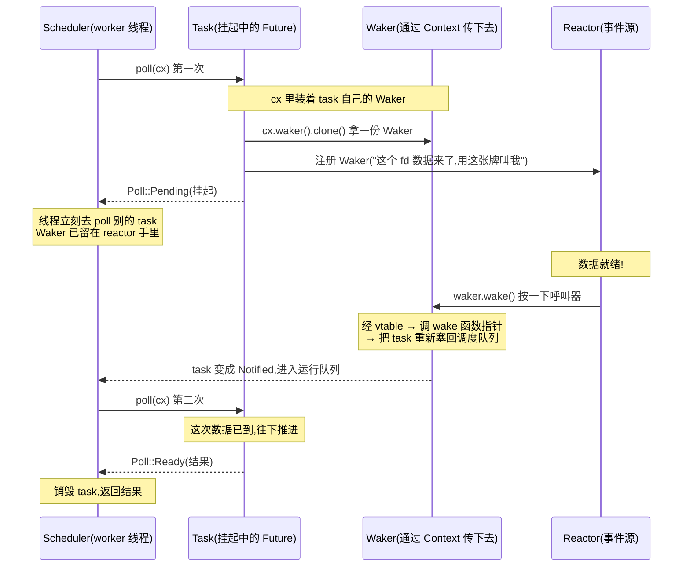

# 第 4 章 · Waker:谁唤醒挂起的任务

> **核心问题**:一个 Future 在 `poll` 里说"我没好(`Pending`)",它**凭什么能被重新叫醒**?谁、用什么机制、在事件就绪时把它拉回调度队列?第 2 章那条"`Pending` 必须留 Waker"的法律,落到代码里到底是个什么东西——`Waker` 这个值凭什么能被 `clone`、能跨线程 `Send`、能在 reactor 和 task 之间到处传?
>
> 这一章我们不碰 reactor 的内部、不碰 epoll,只死盯**那座连接"挂起"和"被叫醒"的桥**——`Waker`。它是前 3 章一直偏"调度执行"那一面之后,正式点亮"事件唤醒"那一面的第一个角色。
>
> **读完本章你会明白**:
> - 一个挂起的 task,**凭什么**能被事件源精确地、不空耗地叫回来——不是靠轮询、不是靠全局表,而是靠一个**值(Waker)** 把"叫醒谁、怎么叫"的全部信息揣在身上。
> - `Waker` 在标准库里到底长什么样:它底层是一个 **fat pointer(两根指针)**——一根 data 指针指向真正的唤醒目标,一根 vtable 指针指向四个函数(clone/wake/wake_by_ref/drop)。这种"类型擦除 + vtable"的布局,为什么是 Rust 异步能"一个统一的 `Waker` 类型装下任意唤醒源"的关键。
> - 为什么 data 指针背后必须藏着**引用计数**:一个 task 可能被 reactor、timer、Notify 同时登记唤醒,Waker 必须能被**廉价地 `clone`**(几纳秒、零分配)、最后一个人 `drop` 时才真正释放——这套语义靠原子加减一个计数器实现,且**为什么 sound**(relaxed/AcqRel 的取舍)。
> - Waker 从**起点**(poll 时,运行时把 task 自己的 Waker 通过 `Context` 喂给 Future)到**终点**(事件源调 `wake`,经 vtable 触发 `schedule`,把 task 重新塞回调度队列)的完整源码链路。
>
> **如果一读觉得太难**:先只记住三件事——① `Waker` 就是一张"叫号牌",上面写着"叫醒哪个 task、怎么叫";② 一个 task 挂起时,会在吧台留一张牌(其实是很多张,因为牌可以 `clone`),谁手里有牌就能在事件就绪时按一下;③ 按一下牌的本质,是调一个函数指针,它会把 task 重新塞回调度队列。vtable + 引用计数的细节看不懂可以先跳过,等读完第 5 章 task 的状态位打包再回来。

---

## 章首·一句话点破

> **`Waker` 是一张"叫号牌":一张小小的、可以复印(clone)的值,牌面背后只揣两样东西——"叫醒谁"(一个 data 指针,指向带引用计数的 task)、"怎么叫"(一张 vtable,四个函数指针)。谁手里攥着牌,谁就能在事件就绪时按一下,牌会沿着这两样东西找到对应的 task,把它重新塞回调度队列。**

这是**结论**。这一章倒过来拆:先看"没有 Waker 会怎样"——从"傻轮询"和"全局 task 注册表"两条反面路看起,搞清楚它们各自撞墙在哪;再把 `Waker` 在标准库里的真实长相(fat pointer + vtable)掰开,看清它凭什么这么小、这么便宜、又能装下任意唤醒源;最后跟到 tokio 源码里,看 Waker 怎么从 poll 的起点(`Context::from_waker`)一直流到唤醒的终点(`scheduler.schedule(Notified(task))`)。

第 3 章结尾留了个钩子:"`.await` 在底层做的事,本质上就是把外层的 Waker 往下传一层";"Waker 本身是个什么数据结构,凭什么一个值能携带唤醒某个 task 的全部信息"。这一章一口气回答。

---

## 一、先看反面:没有 Waker,任务怎么被叫醒?

要理解 `Waker` 凭什么长那样,得先看清"不这么干会怎样"。这一节是本章的地基——`Waker` 的整个设计,就是**为了同时躲开下面三条路的坑**。

### 反面一:傻轮询(忙等)

最朴素的想法:运行时维护一个"所有 task"的列表,每隔几微秒把它们**全部 poll 一遍**,问"你现在能往下走了吗"。

```rust
// 简化示意,非源码原文:错误的忙等轮询
loop {
    for task in &all_tasks {
        let _ = task.poll(&mut cx);   // 不管有没有事件,挨个 poll
    }
}
```

> **不这样会怎样**:第 2 章的"技巧精解"已经拆过一次——CPU 100% 占着,疯狂 poll 一万个"还在等"的 task,99.99% 的 poll 是白调,纯烧 CPU。这就是 async 要消灭的"忙等",在任务调度层的样子。**这条路死在"不知道该什么时候 poll"**。

### 反面二:全局 task 注册表 + 事件源查表

既然不能傻轮询,那就**事件源主动找上门**——reactor 盯着 epoll,数据来了,它得知道"哪个 task 在等这个 socket"。最直觉的做法:维护一张**全局表**,key 是 socket fd,value 是 task id。

```rust
// 简化示意,非源码原文:全局 task 注册表
static WAITERS: Mutex<HashMap<Fd, Vec<TaskId>>> = Mutex::new(HashMap::new());

fn on_event(fd: Fd) {
    let ids = WAITERS.lock().unwrap().remove(&fd).unwrap_or_default();
    for id in ids {
        SCHEDULER.push_back(id);   // 把 task 重新塞回调度队列
    }
}
```

> **不这样会怎样**:这条路乍看可行,细想全是坑:
> - **生命周期谁来管**:task 可能已经 drop 了(被 cancel、被 abort),你这张全局表里还留着它的 id,事件来了 push 一个已经死了的 task,就是 use-after-free。要避免就得给 task 加弱引用(`Weak<Task>`)、或者运行时维护一张"活 task"的表——**运行时成了 task 生命周期的唯一权威**,task 想死都得跟运行时报备,耦合极重。
> - **多种事件源怎么统一**:reactor 等的是 fd,timer 等的是"到点",`Notify` 等的是"别人喊一声",`oneshot` 等的是"对端发值"。每种事件源的"key"都不同,你要为每种都建一张表吗?那 async 的所有组合器(`select!`、`join!`、`Fuse`)都得各自跟这些表打交道,**组合性崩塌**。
> - **跨线程同步开销**:全局表是共享状态,每次"登记一个等待"和"事件来了查一次"都要加锁。一万个 task 在等,锁竞争就把"用极少线程扛大并发"的红利吃光了。

这条路死在**"事件源和 task 之间隔了一张全局共享表"**——这张表既是性能瓶颈,又是耦合点,还是生命周期噩梦。

### 反面三:回调函数指针

第三条路:既然要"事件来了知道叫谁",那就让 task 在挂起时,**把"事件来了该干啥"的一个回调函数指针**留下来。

```rust
// 简化示意,非源码原文:回调函数指针
fn register_wait(fd: Fd, callback: fn()) {
    REACTOR.add(fd, callback);   // 事件来了,reactor 调 callback()
}
```

> **不这样会怎样**:这条路碰到的,正是第 2 章"反面一·回调地狱"的同一个坑——**控制流反转**。`fn()` 是个裸函数指针,它没法携带"哪个 task、怎么重新调度"的具体信息(裸 `fn()` 没有 captured state);要携带就得用闭包 `FnBox` / `Box<dyn FnOnce()>`,可一 boxed 闭包就是一次堆分配,百万并发下分配开销惊人。而且**闭包没法 clone**——一个 task 可能在多个事件源上同时等待(比如 `select!` 里同时等 A 和 B),它得留两份"事件来了叫我"的安排,两份必须是独立的(谁先来谁叫,不能互相踩),裸函数指针做不到。

这条路死在**"回调函数没法廉价地 clone、没法携带足够信息、没法跨多种事件源统一"**。

### 三条反面,夹出一个需求

把三条路的死穴摆在一起:

| 反面 | 死穴 | 想要的 |
|------|------|--------|
| 傻轮询 | 不知道何时该 poll | **事件源主动通知**(谁好了谁叫) |
| 全局注册表 | 全局共享表 = 锁 + 生命周期噩梦 + 组合性差 | **每个 task 自己带着"怎么叫醒我"的安排**(无全局状态) |
| 回调函数指针 | 不能 clone、不能携带状态、堆分配 | 一个**可以廉价 clone、跨线程传递、携带唤醒信息**的值 |

三条夹出一个清晰的结论:

> **我们需要一个"值",它小小一张、能揣着"叫醒哪个 task + 怎么叫"的全部信息;它能被廉价地 `clone`(因为一个 task 会被多处等待);它能跨线程 `Send`(因为 reactor 和 task 跑在不同线程);事件源只要拿到这个值,就能在事件就绪时按一下,值自己会找到 task、把它重新塞回调度队列——全程不碰任何全局表、不加任何锁。**

这个"值",就是 `Waker`。

> **比喻回到餐厅**:服务员去 3 号桌问"菜好了吗",厨房说"还没"。服务员**不能**就这么走了再也不回来——他得在传菜口**留一张呼叫器**。这个呼叫器是个小东西(一个值),上面绑着"3 号桌 + 我(服务员)的工号"。呼叫器可以**复印**(clone)——传菜口留一张,前台收银台留一张,厨房各窗口都能领一张;哪边先出菜,哪边按一下呼叫器,**光信号沿着呼叫器找到对应的工号**,服务员被叫回来。**整个餐厅没有一本"谁在等哪桌菜"的中央台账**,全靠这些可复印的小呼叫器。这张呼叫器,就是 `Waker`。

---

## 二、Waker 的契约:它必须能做到什么

在拆 `Waker` 的内部布局之前,先把它的**契约**钉死——这套契约,是从上面三条反面夹出来的。任何 `Waker` 的实现(标准库的、tokio 的、embassy 的)都必须满足:

1. **能 clone**:克隆一个 `Waker`,得到另一个**功能等价**的 `Waker`——两者任意一个被 `wake`,都能叫醒同一个 task。clone 必须**便宜**(几十纳秒、零堆分配),因为一个 task 经常在多处等待(reactor 一处、timer 一处、`select!` 又一处)。
2. **能 wake**:`waker.wake()`(消耗 `Waker`)或 `waker.wake_by_ref()`(不消耗),**最终保证**对应的 task 被重新塞回调度队列。多次 wake 同一个 task 是合法的——运行时会去重(`NOTIFIED` 位),不会真的重复调度。
3. **能 drop**:不需要的 `Waker` 可以被 drop,**最后一个 drop 的人**负责清理底层资源(释放引用计数)。
4. **Send + Sync**:一个 `Waker` 可以跨线程传递、可以被多线程同时持有(因为 reactor 在自己的线程上拿 Waker,task 在 worker 线程上)。
5. **`will_wake` 可比**:两个 `Waker` 可以判断"叫醒的是不是同一个 task"(reactor 注册前会查重,避免重复登记)。

> **钉死这件事**:这五条契约里,1、2、3 三条是命脉——**clone + wake + drop 的语义,本质上就是"引用计数"的语义**。clone 加一,wake 调度,drop 减一;最后一个人 drop,底层 task 的引用计数归零,task 才允许被释放。**Waker 不是凭空能做到 clone/wake/drop 的,它的底层必然是一个带引用计数的对象**——这一点,会在本章的"技巧精解"里拆透。

契约讲清楚了,现在看标准库怎么把这套契约落到一个**具体的数据类型**上。

---

## 三、Waker 在标准库里长什么样:fat pointer + vtable

`Waker` 定义在 **Rust 标准库**(`std::task`),不在 tokio 仓库。这是和 `Future`、`Poll` 一脉相承的解耦:**语言只定最小契约,运行时负责真正去实现**。

但有个微妙之处——`Waker` 这个**安全(safe)的类型**,它内部到底装了什么?它怎么做到"装下任意唤醒源"(tokio 的、embassy 的、自己写的),却对外暴露一个统一的类型?答案藏在它的底层实现里。

### 表层:`Waker` 是个不透明的 struct

标准库对外的 `Waker` 是这样:

```rust
// 标准库定义(简化展示,完整定义见 rustdoc)
pub struct Waker { /* 不透明的内部字段 */ }

impl Waker {
    pub fn wake(self);
    pub fn wake_by_ref(&self);
    pub fn clone(&self) -> Waker;
    pub fn will_wake(&self, other: &Waker) -> bool;
    pub unsafe fn from_raw(waker: RawWaker) -> Waker;
}
```

([`std::task::Waker` —— 标准库定义](https://doc.rust-lang.org/std/task/struct.Waker.html))

注意三个细节:

1. **`Waker` 实现了 `Clone`、`Send`、`Sync`**——这三个 trait bound 是契约的"类型层落地"。一个 `Waker` 能 clone、能跨线程传、能被多线程同时持有,编译器在类型层就给你保证。
2. **构造 `Waker` 的唯一 safe 入口没有**——你必须用 `unsafe fn from_raw(RawWaker)`。意思是:**标准库不替你实现任何唤醒逻辑**,你得自己提供一个 `RawWaker`(底层两个裸指针),然后包成 `Waker`。运行时(tokio)负责写这段 unsafe,用户写 async 代码完全不碰。
3. **`Waker` 是个不透明的 wrapper**——它的字段对外不可见,你只能通过 `wake`/`clone`/`will_wake` 这些方法操作它。这种"不透明"是刻意的:它把"底层用什么唤醒机制"这件事**类型擦除**掉了,所有 `Waker` 在类型层长得一模一样,不管底下是 `Arc<Task>` 还是嵌入式里的裸指针。

### 里层:RawWaker = 两根裸指针

`Waker` 的真相藏在 `RawWaker` 里:

```rust
// 标准库定义(简化展示)
pub struct RawWaker {
    data: *const (),       // 指向真正的唤醒目标(带引用计数的对象)
    vtable: &'static RawWakerVTable,   // 指向四个函数的虚表
}

pub struct RawWakerVTable {
    clone:      unsafe fn(*const ()) -> RawWaker,
    wake:       unsafe fn(*const ()),
    wake_by_ref:unsafe fn(*const ()),
    drop:       unsafe fn(*const ()),
}
```

([`std::task::RawWaker` —— 标准库定义](https://doc.rust-lang.org/std/task/struct.RawWaker.html)、[`std::task::RawWakerVTable` —— 标准库定义](https://doc.rust-lang.org/std/task/struct.RawWakerVTable.html))

**这就是 `Waker` 的全部内部结构——两根指针。** 在 Rust 里,这种"一个值由两根指针组成"的布局,有个专门的名字:**fat pointer(胖指针)**。你熟悉的 `&[T]`(切片引用)、`&dyn Trait`(trait object 引用)都是 fat pointer——一根指针指数据,一根指针指"元信息"(长度 / vtable)。`Waker` 是同一个套路。

### fat pointer 的内存布局:一张图看懂

```
   一个 Waker 值(在栈上或寄存器里,占 16 字节 = 两个 usize)
   ┌───────────────────────────────────┐
   │  data:    *const ()               │ ──┐
   ├───────────────────────────────────┤  │  两根指针
   │  vtable:  &'static RawWakerVTable │ ─┐│
   └───────────────────────────────────┘ ││
                                         ││
            ┌────────────────────────────┘│
            ↓                             ↓
   ┌────────────────────────────┐   ┌─────────────────────────────────┐
   │  RawWakerVTable (静态只读)  │   │  真正的唤醒目标(堆上)            │
   │  ──────────────────────    │   │  ──────────────────────────      │
   │  clone:      函数指针 ──────┼──→│  ref_count: AtomicUsize ──┐     │
   │  wake:       函数指针       │   │  ... task 的其他字段 ...  │     │
   │  wake_by_ref:函数指针       │   └──────────────────────────│─────┘
   │  drop:       函数指针       │                              │
   └────────────────────────────┘                              ↓
                                                    这块内存由最后一个
                                                    drop Waker 的人释放
```

这张图要记住三件事:

1. **`Waker` 本身极小**——就两个 `usize`(16 字节,64 位机器上)。clone 一个 `Waker`,只是把这两个 `usize` 拷一份、再给 data 背后的 ref_count 加一,**不分配堆内存**。这就是"Waker 能廉价 clone"的物理根源。
2. **vtable 是静态的、共享的**——同一类 Waker(tokio task 的 Waker)共用同一张 vtable。`Waker::clone` 调的是 `vtable.clone`(那个函数指针),不是某个 hardcoded 的函数。这给了"不同运行时有不同唤醒实现"的统一接口。
3. **data 背后藏的是带引用计数的对象**——`*const ()` 是个类型擦除的裸指针,它指向的真实类型,在 tokio 里是 `Header`(task 的头部,ref_count 打包在它的 state 字段高位);在通用 `ArcWake` 场景里是 `Arc<T>`。**这个"引用计数"是 Waker 能 clone/drop 的命脉**。

> **钉死这件事**:`Waker` 的全部魔法,就在"data 指针 + vtable 指针"这两根指针上。vtable 解决"怎么叫"(多态:不同运行时不同实现),data 解决"叫谁"(具体目标)。两者一拼,就得到一个**类型擦除、可 clone、可跨线程、可精确唤醒**的值。这套设计是 Rust 把"trait object 的虚表机制"用在系统级原语上的范例——和 `dyn Trait` 的 vtable 是同一个套路,只是这里把虚表做成了"两根裸指针 + 四个函数"的极简形态。

### `Waker::from_raw` 为什么是 unsafe

标准库把 `Waker::from_raw` 标成 `unsafe`,是因为它对传入的 `RawWaker` 有**严格契约**:

- `data` 必须指向一个**有效、带正确引用计数**的对象;
- vtable 的四个函数,必须**正确管理**这个引用计数(clone 加一、drop 减一、最后归零释放);
- vtable 的四个函数,必须**线程安全**(可被任意线程任意时刻调用)。

> **不这样会怎样(反面)**:如果你 `Waker::from_raw(RawWaker::new(dangling_ptr, some_vtable))`,传一个野指针——后续 clone/wake/drop 全是 UB。Rust 把这道口子标 unsafe,**把义务落在"构造 Waker 的人"头上**:你得保证你给的 data 和 vtable 配套、引用计数正确、线程安全。运行时(tokio)承担这个义务,用户代码完全不碰。这正是第 3 章 Pin 那套"unsafe 关在边界、内部全 safe"的同构设计——`Waker::from_raw` 是边界,之后所有 `waker.wake()` / `waker.clone()` 都是 safe 的。

---

## 四、Waker 怎么用:poll 起点 → 挂起 → 唤醒终点

布局讲清了,现在看 Waker 在一次完整生命周期里**怎么流动**。这一节用一张时序图把全链路画出来,然后跟到 tokio 源码,看每个环节的代码。

### 唤醒的完整时序



这张图的关键,在中间那段"Waker 已留在 reactor 手里"——**task 挂起的那段时间,Waker 是独立的、可被任意线程持有的值**。它不依赖 task 还活着(因为引用计数),不依赖 scheduler 知道这件事(因为 vtable 自带调度逻辑),不依赖任何全局表。**Waker 是一座自给自足的桥**。

### 起点:poll 时怎么把 Waker 喂给 Future

链路的起点,是运行时 poll 一个 task 时,把 task **自己的** Waker 包装成 `Context`,喂给 Future。这段代码在 tokio 的 `Harness::poll_inner`:

```rust
// tokio/src/runtime/task/harness.rs(摘录)
fn poll_inner(&self) -> PollFuture {
    use super::state::{TransitionToIdle, TransitionToRunning};

    match self.state().transition_to_running() {
        TransitionToRunning::Success => {
            // ... 状态转换成功,准备 poll

            let header_ptr = self.header_ptr();
            let waker_ref = waker_ref::<S>(&header_ptr);          // ① 造出 task 自己的 Waker
            let cx = Context::from_waker(&waker_ref);             // ② 包成 Context
            let res = poll_future(self.core(), cx);               // ③ 喂给 Future

            if res == Poll::Ready(()) {
                return PollFuture::Complete;
            }
            // ... 处理 Pending 后的状态转换
        }
        // ... 其他状态分支
    }
}
```

([tokio/src/runtime/task/harness.rs:193-232](../tokio/tokio/src/runtime/task/harness.rs#L193-L232))

三个动作,逐句拆:

**① `waker_ref::<S>(&header_ptr)`**——这是构造 Waker 的地方。它把 task 的 `Header` 指针,配上 task 的 vtable,包成一个 `Waker`(细节下一节拆)。注意这里**没有堆分配**——Waker 是直接从 Header 的地址构造的,Header 本身已经在堆上(task spawn 时一次性分配),Waker 只是"借用"了它的地址。这就是 tokio 的关键优化:**Waker 的构造和 clone 都是零堆分配**。

**② `Context::from_waker(&waker_ref)`**——`Context` 是个轻量包装(`Context<'a>` 内部就一个 `&'a Waker`),它的唯一作用是**在 `Future::poll` 的签名里携带 Waker**。为什么 `poll` 的第二个参数是 `&mut Context` 而不是直接 `&Waker`?历史原因(早期标准库想在 Context 里塞更多东西),现在 Context 的主要价值就是"装 Waker"。`cx.waker()` 拿到的,就是刚才构造的那个 Waker。

**③ `poll_future(self.core(), cx)`**——把这个 `cx` 喂给 Future 的 `poll`。Future 内部走到 `.await` 点,会**把 cx 透传给内层**(第 3 章末尾讲过:`.await` 在底层就是"poll 内层时传同一个 cx")。最终,最底层那个真正等 I/O 的 Future(比如 `tokio::io::AsyncFd` 的 Future),会拿到这个 cx,从里面 `cx.waker().clone()` 出一份 Waker,**注册到 reactor**。

> **钉死这件事**:Waker 的起点是运行时构造的,然后**一路透传**到最底层的 Future。中间所有的 `.await` 都不"新建"Waker,只把外层的传下去。所以一个 task 不管嵌套多深的 async 调用,它**所有 `.await` 注册到 reactor 的 Waker,都是同一个**——都指向这个 task 自己。这就是为什么"事件源只要按一下 Waker,就能精确叫醒这个 task"——`Waker` 把"叫醒谁"的信息,从源头一路带到了事件源手里。

### 中间:Future 怎么"留 Waker"

Future 在 `poll` 返回 `Pending` 之前,必须**把 Waker 留给事件源**。这一步的具体样子,取决于事件源类型:

- **I/O 事件**(socket 可读):Future 调 `cx.waker().clone()`,把 Waker 存进 reactor 的注册表(第 11 章详拆 slab + token)。
- **时间事件**(`sleep`):Future 调 `cx.waker().clone()`,把 Waker 存进 timer 的层级时间轮(第 14 章)。
- **同步原语**(`Notify`、`oneshot`):Future 调 `cx.waker().clone()`,把 Waker 存进这些原语的内部等待队列(第 15-17 章)。

**它们做的都是同一件事:把一份 Waker(可 clone,所以可以留多份)交给一个事件源,让事件源在事件就绪时调 `waker.wake()`**。

```rust
// 简化示意,非源码原文:Future poll 返回 Pending 前留 Waker 的典型样子
fn poll(self: Pin<&mut Self>, cx: &mut Context<'_>) -> Poll<Output> {
    if self.has_data() {
        Poll::Ready(self.take_data())
    } else {
        // 关键:留一份 Waker 给事件源
        let waker = cx.waker().clone();          // clone 一份(零分配,只加引用计数)
        self.reactor_slot.set(Some(waker));       // 塞进事件源的等待槽
        Poll::Pending                             // 然后才返回 Pending
    }
}
```

> **钉死这件事**:第 2 章那条"`Pending` 必须留 Waker"的法律,在代码里就长这样——**返回 Pending 之前,从 cx 里 clone 出 Waker,交给事件源**。注意是 `clone()`——Waker 是按引用计数语义 clone 的,clone 后两份 Waker 都有效、都能叫醒同一个 task。这是"一个 task 能在多个事件源上同时等待"(`select!` 同时等 A 和 B)的物理基础。

### 终点:wake 怎么把 task 塞回调度队列

事件就绪时,事件源调 `waker.wake()`(或 `wake_by_ref()`)。这是链路的终点——Waker 沿着它的 vtable,调到那个 `wake` 函数指针,函数指针把 task 重新塞回调度队列。

这一段是本章最硬核的源码。看 tokio task 自己的 waker 实现:

```rust
// tokio/src/runtime/task/waker.rs(摘录)
static WAKER_VTABLE: RawWakerVTable =
    RawWakerVTable::new(clone_waker, wake_by_val, wake_by_ref, drop_waker);

fn raw_waker(header: NonNull<Header>) -> RawWaker {
    let ptr = header.as_ptr() as *const ();
    RawWaker::new(ptr, &WAKER_V_TABLE)
}

// 构造 task 的 Waker(借引用,不增减计数)
pub(super) fn waker_ref<S>(header: &NonNull<Header>) -> WakerRef<'_, S>
where
    S: Schedule,
{
    let waker = unsafe { ManuallyDrop::new(Waker::from_raw(raw_waker(*header))) };
    WakerRef { waker, _p: PhantomData }
}
```

([tokio/src/runtime/task/waker.rs:118-124, 16-34](../tokio/tokio/src/runtime/task/waker.rs#L118-L124))

注意三个细节:

1. **`WAKER_V_TABLE` 是个 `static`**——所有 tokio task 共用同一张 vtable。这是合理的:同一个运行时里所有 task 的唤醒机制都一样(都是"塞回这个运行时的调度器"),没必要每个 task 一张。
2. **`raw_waker` 直接用 Header 的地址做 data 指针**——不分配新内存,Waker 直接"指向"task 自己。这就是 Waker 构造零分配的秘密。
3. **`waker_ref` 用 `ManuallyDrop` 包住 Waker**——这是个**精妙的设计**:它构造出来的 Waker **不拥有引用计数**(因为它只是"借"了 Header 的地址,没增计数),所以 drop 它时**不能**真的调 vtable 的 drop(那会减计数、甚至释放 task)。`ManuallyDrop` 把 Drop 抑制掉。这种"借出来的 Waker"用在 poll 的入口(运行时自己 poll task 时,不需要再增计数,因为它本来就持有一份引用)。

现在看 vtable 里那个 `wake_by_val` 函数指针,它就是 `waker.wake()` 真正调到的东西:

```rust
// tokio/src/runtime/task/waker.rs(摘录)
unsafe fn wake_by_val(ptr: *const ()) {
    // Safety: `ptr` was created from a `Header` pointer in function `waker_ref`.
    let ptr = unsafe { NonNull::new_unchecked(ptr as *mut Header) };
    let raw = unsafe { RawTask::from_raw(ptr) };
    raw.wake_by_val();    // 委托给 RawTask
}
```

([tokio/src/runtime/task/waker.rs:93-103](../tokio/tokio/src/runtime/task/waker.rs#L93-L103))

`raw.wake_by_val()` 又走到 `Harness::wake_by_val`,这才是唤醒的真正终点:

```rust
// tokio/src/runtime/task/harness.rs(摘录)
/// This call consumes a ref-count and notifies the task.
pub(super) fn wake_by_val(&self) {
    use super::state::TransitionToNotifiedByVal;

    match self.state().transition_to_notified_by_val() {
        TransitionToNotifiedByVal::Submit => {
            // 状态转换说"该提交了",于是把 task 重新塞进调度器
            self.schedule();                         // ← 唤醒的终点!

            // schedule 调用结束,释放自己持有的那份引用计数
            self.drop_reference();
        }
        TransitionToNotifiedByVal::Dealloc => {
            self.dealloc();
        }
        TransitionToNotifiedByVal::DoNothing => {}
    }
}
```

([tokio/src/runtime/task/harness.rs:63-91](../tokio/tokio/src/runtime/task/harness.rs#L63-L91))

而 `self.schedule()` 又通过 vtable 走到 `raw.rs`:

```rust
// tokio/src/runtime/task/raw.rs(摘录)
pub(super) fn schedule(self) {
    let vtable = self.header().vtable;
    unsafe { (vtable.schedule)(self.ptr) }
}

unsafe fn schedule<S: Schedule>(ptr: NonNull<Header>) {
    use crate::runtime::task::{Notified, Task};

    let scheduler = Header::get_scheduler::<S>(ptr);
    scheduler
        .as_ref()
        .schedule(Notified(Task::from_raw(ptr.cast())));    // ← 把 task 包成 Notified 塞进调度器
}
```

([tokio/src/runtime/task/raw.rs:276-279, 346-353](../tokio/tokio/src/runtime/task/raw.rs#L276-L279))

`Schedule` trait 是这一切的终点:

```rust
// tokio/src/runtime/task/mod.rs(摘录)
pub(crate) trait Schedule: Sync + Sized + 'static {
    /// The task has completed work and is ready to be released.
    fn release(&self, task: &Task<Self>) -> Option<Task<Self>>;

    /// Schedule the task
    fn schedule(&self, task: Notified<Self>);
    // ... yield_now 等
}
```

([tokio/src/runtime/task/mod.rs:293-310](../tokio/tokio/src/runtime/task/mod.rs#L293-L310))

> **钉死这件事(唤醒的全链路)**:把上面四段代码串起来,`waker.wake()` 真正干的事是——
> 1. `Waker::wake` → 经 vtable 调 `wake_by_val(ptr)`(waker.rs L93);
> 2. → `RawTask::wake_by_val()` → `Harness::wake_by_val`(harness.rs L68);
> 3. → `state.transition_to_notified_by_val()`(状态机迁移:把 task 标记成"该调度了",第 5 章详拆这个状态字);
> 4. → 若 `Submit` → `self.schedule()`(raw.rs L276)→ `scheduler.schedule(Notified(task))`(mod.rs L302);
> 5. 调度器收到一个 `Notified<Task>`,把它塞进运行队列(本地队列或全局 injector,第 7 章详拆);
> 6. 某个空闲的 worker 线程拿到这个 task,再次 poll 它。
>
> **从"按一下呼叫器"到"task 重新被 poll",中间经过 6 步,但全程无锁、无堆分配(除了塞进队列的那次,而队列本身是无锁的 Chase-Lev deque)**。这就是 tokio 能扛百万并发的微观基础。

---

## 五、两套 Waker 实现:task 专属 vs 通用 ArcWake

讲到这里,你可能在 tokio 源码里发现**两套** Waker 的实现,会困惑——这里说清楚。

tokio 里有**两个不同的"造 Waker"的地方**:

1. **`runtime/task/waker.rs`**——task **自己的** Waker。data 指针是 `Header`(task 的头部),引用计数打包在 `Header.state` 的 `AtomicUsize` 高位(第 5 章的"状态位打包"技巧)。这套是**为 task 量身定做**的,目标是零分配、零额外开销。
2. **`util/wake.rs`**——**通用**的 `Wake`/`ArcWake` trait + `waker_ref`。data 指针是 `Arc<T>`,引用计数就是 `Arc` 自己的强引用计数。这套是给"非 task 的唤醒源"用的(比如 reactor 自己的 `io_driver`、`Notify` 内部的 waker、测试用的 mock waker)。

两套都遵守同样的契约(fat pointer + vtable + 引用计数),只是底层对象不同。看通用那套:

```rust
// tokio/src/util/wake.rs(摘录)
pub(crate) trait Wake: Send + Sync + Sized + 'static {
    fn wake(arc_self: Arc<Self>);
    fn wake_by_ref(arc_self: &Arc<Self>);
}

pub(crate) fn waker_ref<W: Wake>(wake: &Arc<W>) -> WakerRef<'_> {
    let ptr = Arc::as_ptr(wake).cast::<()>();
    let waker = unsafe { Waker::from_raw(RawWaker::new(ptr, waker_vtable::<W>())) };
    WakerRef { waker: ManuallyDrop::new(waker), _p: PhantomData }
}

fn waker_vtable<W: Wake>() -> &'static RawWakerVTable {
    &RawWakerVTable::new(
        clone_arc_raw::<W>,
        wake_arc_raw::<W>,
        wake_by_ref_arc_raw::<W>,
        drop_arc_raw::<W>,
    )
}

unsafe fn clone_arc_raw<T: Wake>(data: *const ()) -> RawWaker {
    unsafe { Arc::<T>::increment_strong_count(data as *const T); }   // 加计数
    RawWaker::new(data, waker_vtable::<T>())
}

unsafe fn wake_arc_raw<T: Wake>(data: *const ()) {
    let arc: Arc<T> = unsafe { Arc::from_raw(data as *const T) };    // 接管计数
    Wake::wake(arc);
}

unsafe fn wake_by_ref_arc_raw<T: Wake>(data: *const ()) {
    // ManuallyDrop 不动计数,只是借来用
    let arc = ManuallyDrop::new(unsafe { Arc::<T>::from_raw(data.cast()) });
    Wake::wake_by_ref(&arc);
}

unsafe fn drop_arc_raw<T: Wake>(data: *const ()) {
    drop(unsafe { Arc::<T>::from_raw(data.cast()) });                // 减计数
}
```

([tokio/src/util/wake.rs:9-78](../tokio/tokio/src/util/wake.rs#L9-L78))

这套是"通用 vtable + `Arc` 引用计数"的教科书实现。它清晰、可复用——任何 `Send + Sync + 'static` 的类型,只要 impl `Wake` trait(定义怎么被唤醒),就能被 `waker_ref` 包成一个标准 `Waker`。

> **钉死这件事**:tokio 有两套 Waker,但**底层机制完全一样**——都是 fat pointer + vtable + 引用计数。task 专属那套是把引用计数**打包进自己的状态字**(为了和 task 的其他状态位共用一个 AtomicUsize,极致优化);通用那套是直接用 `Arc`。理解了任一套,就理解了 Waker 的全部。本章的"技巧精解"会以 task 专属那套为主拆透(因为它是真实的、tokio 性能致胜的实现),通用那套作为"vtable 范式"的清晰参照。

---

## 技巧精解:RawWaker 的 vtable + 引用计数布局

这一节是本章的硬核,把 `RawWaker` 的"fat pointer + vtable + 引用计数"这套布局彻底拆透,配反面对比,让妙处显形。这是本章总纲钦定的主角技巧。

### 技巧一:为什么用 fat pointer + vtable(而不是其他形态)

我们要解决的核心问题是:**一个统一的 `Waker` 类型,怎么装下任意唤醒源**(tokio task 的、embassy task 的、自己写的 mock 的)。

最直觉的几种"统一类型"方案,各有死穴:

#### 反面对比 A:用 `Box<dyn FnOnce()>` 装回调

```rust
// 简化示意,非源码原文:用 boxed 闭包做 Waker
pub struct Waker(Box<dyn FnOnce() + Send + Sync>);

impl Waker {
    pub fn wake(self) { (self.0)(); }
    pub fn clone(&self) -> Waker { /* ??? */ }
}
```

> **不这样会怎样**:三个死穴——
> - **`FnOnce` 不能 clone**:`Box<dyn FnOnce()>` 是个一次性闭包,你没法 clone 它(闭包捕获的状态可能不可复制)。可 Waker 必须 clone——这条路直接撞死。
> - **每次构造一次堆分配**:每个 `Waker` 都要 `Box::new(closure)`,百万并发就是百万次堆分配,且堆分配本身有锁(`Box` 走全局分配器)。**和 tokio "零分配"的目标正面冲突**。
> - **唤醒时还要再分配**:wake 后想"再留一份 Waker"(典型场景:`select!` 里 A 先好了叫醒 task,但 B 的 Waker 还得留着以备后用),又得 Box 一次。

#### 反面对比 B:用 enum dispatch

```rust
// 简化示意,非源码原文:用 enum 做 Waker
pub enum Waker {
    TokioTask(*const TokioHeader),
    EmbassyTask(*const EmbassyTask),
    Mock(Arc<MockWaker>),
}

impl Waker {
    pub fn wake(self) {
        match self {
            Waker::TokioTask(ptr) => unsafe { tokio_wake(ptr) },
            Waker::EmbassyTask(ptr) => unsafe { embassy_wake(ptr) },
            Waker::Mock(arc) => arc.wake(),
        }
    }
}
```

> **不这样会怎样**:死穴在于**运行时必须知道所有可能的 Waker 类型**——`std::task::Waker` 是标准库定义的,它不可能 `match` 出 tokio / embassy / 你自己写的运行时。**enum dispatch 要求编译时枚举所有变体**,可标准库定义 `Waker` 时,这些运行时还不存在(或者根本是第三方库)。这条路在架构上就走不通——标准库不能依赖具体的运行时实现。

而且 enum 的 `clone` 也是问题:`TokioTask(*const Header)` 是裸指针,clone 它得手动加引用计数;每种变体的引用计数语义都不同(有的用 Arc,有的用打包的 AtomicUsize),enum 的统一 `clone` 方法里要写一大坨 match——**多态的复杂度,被强行塞回了运行时分支**。

#### 正解:fat pointer + vtable——"trait object 的极简形态"

`RawWaker` 的"两根指针 + 一张四个函数的虚表",其实是 **trait object(`dyn Trait`)的极简形态**。`&dyn Trait` 也是两根指针:一根 data,一根 vtable。区别在于——

- `&dyn Trait` 的 vtable,除了方法,还塞了 type id、size、align、drop 等元信息,体积大;
- `RawWakerVTable` 极简,**只有四个函数指针**(clone/wake/wake_by_ref/drop),32 字节,且全部静态。

这种极简有几个直接好处:

1. **类型擦除**:标准库的 `Waker` 不需要知道底下是什么——它只知道"我有一根 data 指针,一张 vtable,clone/wake/drop 分别调 vtable 里那三个函数"。**任何运行时都能塞进这个壳子**。这就是标准库能定义 `Waker`、而具体实现留给运行时的根本原因。
2. **零开销**:`waker.wake()` 编译后就是"加载 vtable 里的函数指针 + 调用它",和直接调函数指针一样快(一次间接跳转)。没有 enum 的 match,没有 boxed closure 的解引用。
3. **静态共享**:同一个运行时的所有 task 共用一张 vtable(`WAKER_V_TABLE` 是 `static`),vtable 的内存开销摊到所有 task 上,几乎为零。

> **钉死这件事(fat pointer + vtable 的精妙)**:`Waker` 选择"fat pointer + vtable",不是设计者故弄玄虚,是**类型擦除 + 零开销 + 多态**这三件事同时要满足的唯一解。enum dispatch 做不到"标准库定义、第三方实现";boxed closure 做不到 clone;而 fat pointer + vtable 把"多态"藏在 vtable 里,把"具体"藏在 data 里,两者一拼,就得到一个**标准库能定义、运行时能定制、用户能零成本使用**的 Waker。这正是 Rust 把 `dyn Trait` 那套机制用在系统级原语上的范例。

### 技巧二:引用计数为什么必须藏在 data 里

vtable 解决了"怎么叫",但**还没解决"clone / drop / 一个 task 被多处等待"**这件事。这就是引用计数的戏。

#### 一个 task 为什么会被多处持有 Waker

考虑一个常见的并发场景:

```rust
// 简化示意:select! 同时等 A 和 B
tokio::select! {
    _ = task_a() => { /* ... */ },
    _ = task_b() => { /* ... */ },
}
```

`select!` 展开后,会**同时**给 `task_a` 和 `task_b` 的 Future poll 一次,各自**注册一份 Waker**(因为它们各自等不同的事件)。这两份 Waker,叫醒的是**同一个外层 task**——谁先到,谁叫醒,另一个失效。

这意味着:**同一个 task,可能同时有 N 份 Waker 流落在各处**(reactor 一份、timer 一份、select 的另一分支一份……)。这些 Waker 必须:

- 各自**独立有效**(任何一个 wake 都能叫醒 task);
- **最后一个 drop 时**才真正释放底层资源(早了 → use-after-free;晚了 → 内存泄漏);
- clone 必须**极便宜**(因为每次 poll 都可能 clone 一份)。

这套语义,就是**引用计数(reference counting)**的标准定义。所以 Waker 的 data 指针背后,**必然是一个带引用计数的对象**。

#### tokio 怎么把引用计数藏进 task 的状态字

tokio task 专属的 Waker,data 指针指向 `Header`,而 `Header.state` 是一个 `AtomicUsize`,**引用计数就打包在这个 usize 的高位**。看 state.rs 的常量定义:

```rust
// tokio/src/runtime/task/state.rs(摘录)
/// Flag tracking if the task has been pushed into a run queue.
const NOTIFIED: usize = 0b100;
const JOIN_INTEREST: usize = 0b1_000;
const JOIN_WAKER: usize = 0b10_000;
const CANCELLED: usize = 0b100_000;

/// All bits.
const STATE_MASK: usize = LIFECYCLE_MASK | NOTIFIED | JOIN_INTEREST | JOIN_WAKER | CANCELLED;

/// Bits used by the ref count portion of the state.
const REF_COUNT_MASK: usize = !STATE_MASK;

/// Number of positions to shift the ref count.
const REF_COUNT_SHIFT: usize = REF_COUNT_MASK.count_zeros() as usize;

/// One ref count.
const REF_ONE: usize = 1 << REF_COUNT_SHIFT;
```

([tokio/src/runtime/task/state.rs:28-49](../tokio/tokio/src/runtime/task/state.rs#L28-L49))

这段代码干的事——**一个 `AtomicUsize`,低位塞状态标志(RUNNING/COMPLETE/NOTIFIED/JOIN_INTEREST/JOIN_WAKER/CANCELLED 六个 bit),高位塞引用计数**(剩下的几十个 bit)。`REF_ONE` 就是"引用计数加一"对应的那个 usize 值。

Waker 的 clone/drop 在 vtable 里是这样实现的:

```rust
// tokio/src/runtime/task/waker.rs(摘录)
unsafe fn clone_waker(ptr: *const ()) -> RawWaker {
    let header = unsafe { NonNull::new_unchecked(ptr as *mut Header) };
    unsafe { header.as_ref() }.state.ref_inc();    // 引用计数 +1
    raw_waker(header)
}

unsafe fn drop_waker(ptr: *const ()) {
    let ptr = unsafe { NonNull::new_unchecked(ptr as *mut Header) };
    let raw = unsafe { RawTask::from_raw(ptr) };
    raw.drop_reference();    // 引用计数 -1,若归零则 dealloc
}
```

([tokio/src/runtime/task/waker.rs:70-91](../tokio/tokio/src/runtime/task/waker.rs#L70-L91))

而 `ref_inc` / `ref_dec` 长这样:

```rust
// tokio/src/runtime/task/state.rs(摘录)
pub(super) fn ref_inc(&self) {
    use std::sync::atomic::Ordering::Relaxed;
    // 引用计数增加用 Relaxed 排序——见下文解释
    let prev = self.val.fetch_add(REF_ONE, Relaxed);
    if prev > isize::MAX as usize {
        std::process::abort();   // 溢出保护
    }
}

/// Returns `true` if the task should be released.
pub(super) fn ref_dec(&self) -> bool {
    let prev = Snapshot(self.val.fetch_sub(REF_ONE, AcqRel));
    assert!(prev.ref_count() >= 1);
    prev.ref_count() == 1     // 归零返回 true,调用者 dealloc
}
```

([tokio/src/runtime/task/state.rs:476-511](../tokio/tokio/src/runtime/task/state.rs#L476-L511))

#### 为什么 ref_inc 用 Relaxed,ref_dec 用 AcqRel

这是本章最微妙的 sound 性细节,值得专门讲清楚(它呼应总纲"每个原子技巧要讲清为什么 sound")。

**`ref_inc`(引用计数加一)用 `Relaxed`**——这是引用计数的经典 sound 性定理。tokio 源码注释引用了 Boost 文档的论证:

> Increasing the reference counter can always be done with memory_order_relaxed: New references to an object can only be formed from an existing reference, and passing an existing reference from one thread to another must already provide any required synchronization.

翻译成大白话:**你能拿到一个 Waker(`ref_inc`),前提是已经有人把一个 Waker 传给你了**——这个"传给你"的动作(send 通过 channel、return 通过函数),本身已经建立了 happens-before 关系(`Send` 的 channel、`Arc` 的 clone 都自带同步)。所以 ref_inc 不需要额外的内存屏障,**Relaxed 就够**——它只保证"这个 fetch_add 是原子的"(不会撕裂),不保证和其他操作的全局顺序。

**`ref_dec`(引用计数减一)用 `AcqRel`**——这一步要小心得多,因为**它要决定"要不要 dealloc"**。如果是最后一个 drop(ref_count 从 1 到 0),那它**必须看到**之前所有持有这个 task 的人对 task 内存的所有写入(poll 写的状态、Future 写的输出),否则 dealloc 时把这些写入丢掉,就是数据丢失。`AcqRel` 保证:

- `Acquire`(读端):确保这次 fetch_sub 之前的所有写入(其他线程对 task 的写),在"判断 ref_count==1"之前全部可见;
- `Release`(写端):确保这次 fetch_sub 之后,如果有其他线程要 dealloc,它能看见之前所有对 task 的写入。

> **钉死这件事(Waker 引用计数的 sound 性)**:`ref_inc` 用 Relaxed、`ref_dec` 用 AcqRel——这个看似不对称的取舍,是**引用计数 sound 性的经典论证**。加计数不需要排序(因为传递引用本身已经同步),减计数需要 AcqRel(因为减到零的那个人要负责 dealloc,它必须"看见" task 的全部历史)。tokio 把 Boost 文档的论证搬进了注释,这是无锁引用计数"为什么 sound"的标准证明。第 5 章拆 task 状态位打包时还会再碰到这套排序取舍。

#### 反面对比:如果不用引用计数会怎样

```rust
// 简化示意,非源码原文:不用引用计数的 Waker
pub struct Waker { task_ptr: *const Task }   // 裸指针,无计数

impl Drop for Waker {
    fn drop(&mut self) {
        unsafe { dealloc(self.task_ptr); }   // 每个 Waker drop 都 dealloc???
    }
}
```

> **不这样会怎样(两个致命 bug)**:
> - **use-after-free**:clone 一个 Waker(得到两份),第一份 drop 时 dealloc 了 task——第二份还攥在 reactor 手里,事件来了它调 `wake`,访问已释放的 task,**野指针 UB**。
> - **双重唤醒/双重释放**:两份 Waker 各自 wake 各自 drop,wake 可能触发两次 schedule,drop 可能触发两次 dealloc——状态全乱。
>
> 引用计数就是治这两个 bug 的唯一出路:**clone 加一,drop 减一,最后归零的人 dealloc**。它把"何时释放"的决策,精确地落在"最后一个持有者"头上,既不早(没人 drop 就不释放),也不晚(最后一个 drop 立刻释放)。

#### 引用计数为什么支持"多处等待 / 重复唤醒"

回扣前面那个"`select!` 同时等 A 和 B"的场景:

- A 和 B 各自 clone 出一份 Waker(ref_count = 3:task 自己一份、A 一份、B 一份);
- A 的事件先来,A 的 Waker 调 `wake()` → task 被调度 → poll → 这次能推进,返回 Ready(或者继续 Pending,又 clone 新 Waker);
- 与此同时,B 的 Waker 还攥在 B 的 reactor 槽里——它**仍然有效**(因为 ref_count 没归零),将来 B 的事件来了也能叫醒 task;
- 如果 select 结束,B 的 Waker 被 drop → ref_count 减一,最终归零时 task 被释放。

**这一切都不需要任何全局协调**,每个 Waker 只管自己的引用计数。这就是"一个 task 能被多处等待、被重复唤醒、且不丢不重"的物理基础。

> **钉死这件事(Waker 引用计数布局的全部价值)**:`Waker` 把"叫醒哪个 task"(data 指针)+ "怎么叫"(vtable)+ "何时释放"(引用计数藏 data 里)三件事,**全部塞进一个 16 字节的 fat pointer 里**。它小到能像 `usize` 一样传递和拷贝,却又能精确驱动一个 task 的整个生命周期(从被唤醒到被释放)。这是 Rust 系统级编程"用类型 + 引用计数把生命周期关进笼子"的范例——和 `Arc`、`Box` 同源,但比它们更紧凑(因为 vtable 是静态共享的)。

---

## 章末小结

### 用"餐厅服务员"比喻回顾本章

1. **服务员去 3 号桌问"菜好了吗",厨房说"还没",服务员不能就这么走了**——这就是 `poll` 返回 `Pending` 时,**必须留一份 Waker 给事件源**(第 2 章那条法律)。留下的不是一句话,而是一个**值**(Waker)。
2. **服务员在吧台留一张呼叫器**——这个呼叫器就是 `Waker`:一个 16 字节的 fat pointer,牌面背后揣着"叫醒哪个 task"(data 指针,指向 task 的 Header)+ "怎么叫"(vtable,四个函数指针)。
3. **呼叫器可以复印**(clone)——传菜口留一张,前台留一张,厨房各窗口都能领一张。哪边先出菜,哪边按一下,**光信号沿同一张牌找到对应的工号**。复印的本质,是引用计数加一;**最后一个人扔掉呼叫器**(drop),引用计数归零,呼叫器(及它绑定的 task 的引用)才真正释放。
4. **厨房按一下呼叫器,服务员就被叫回来**——这就是 `waker.wake()`:经 vtable 的函数指针,把 task 状态迁移成 Notified,再 `scheduler.schedule(Notified(task))` 塞回运行队列。**从按铃到服务员回来,全程无锁、无堆分配**。
5. **整个餐厅没有一本"谁在等哪桌菜"的中央台账**——这是 Waker 设计最大的胜利:**它把"等待关系的记录",从全局共享表,转移成了每个 task 自带的、可复印的小呼叫器**。没有锁竞争,没有生命周期噩梦,没有组合性灾难。

### 本章在全书主线中的位置

记住全书的二分法:**调度执行(让就绪的任务跑) vs 事件唤醒(让等待的任务不空耗、就绪了再叫)**。

- 第 2、3 章主要服务**调度执行**那一面的地基——我们立起了"被调度的对象(Future)"长什么样:状态机 + poll 契约 + Pin。
- **这一章,正式点亮"事件唤醒"那一面**——而 `Waker`,就是连接"挂起"和"被叫醒"的那座桥。它是事件唤醒的**载体**:没有它,挂起的 task 就是死的(永远没人 poll 它第二次);有了它,任何事件源(reactor / timer / sync 原语)都能精确、廉价、无锁地把 task 叫回来。

后面三件大事,都建立在 Waker 之上:

- 第 5 章(Task)会拆 task 怎么把"Waker 的 data 指针 + 引用计数"和"调度状态 + 取消标志"**全部打包进一个 AtomicUsize**——你会看到本章讲的"ref_inc/ref_dec/NOTIFIED"是怎么和 task 的 RUNNING/COMPLETE/CANCELLED 共用一个状态字的。
- 第 3 篇(reactor)会拆事件源怎么**接收并存储 Waker**(注册表 slab + token 映射),以及"事件来了怎么找到对应的 Waker"。
- 第 4 篇(timer)、第 5 篇(sync 原语)会拆不同类型的事件源,各自怎么"留 Waker、按 Waker"。

### 五个"为什么"清单

1. **为什么 Waker 是个值,而不是全局注册表?**:全局注册表 = 共享状态,锁竞争 + 生命周期噩梦 + 组合性差。Waker 把"叫醒谁 + 怎么叫"全部揣进一个 16 字节的值里,事件源只要拿到这个值就能叫醒,**全程不碰全局状态**。这是从"中央台账"到"可复印呼叫器"的范式跃迁。
2. **Waker 在标准库里长什么样?**:`RawWaker` 是个 **fat pointer**——一根 data 指针(指向带引用计数的唤醒目标)+ 一根 vtable 指针(指向 clone/wake/wake_by_ref/drop 四个函数)。这种"两根指针"是 trait object(`dyn Trait`)的极简形态,让标准库能定义 `Waker`、运行时能定制实现、用户能零成本使用。
3. **Waker 凭什么能 clone / Send / 多处持有?**:因为 data 指针背后藏着**引用计数**(tokio task 打包进 `AtomicUsize` 高位,通用 `ArcWake` 用 `Arc`)。clone 加一、drop 减一、最后归零的人 dealloc。这套语义支持"一个 task 被多处等待、被重复唤醒、且不丢不重"。
4. **`Waker::wake()` 真正干了什么?**:经 vtable 调 `wake_by_val(ptr)` → 状态迁移成 Notified → 若该提交,`scheduler.schedule(Notified(task))` 把 task 塞回运行队列。**从按一下呼叫器到 task 重新被 poll,全程无锁、无堆分配**。
5. **`ref_inc` 为什么用 Relaxed,`ref_dec` 为什么用 AcqRel?**:加计数不需要排序(传递引用本身已建立同步),所以 Relaxed 够;减计数若到零要负责 dealloc,**它必须看见 task 的全部历史**,所以 AcqRel。这是引用计数 sound 性的经典论证,tokio 源码注释里引了 Boost 文档。

### 想继续深入,该往哪钻

- **标准库源头(本章引用的法律原文)**:
  - [`std::task::Waker`](https://doc.rust-lang.org/std/task/struct.Waker.html) —— Waker 的契约、所有方法说明。**重点读它的 module-level 文档**,那里把"为什么 Waker 这么设计"讲得比任何教程都透。
  - [`std::task::RawWaker`](https://doc.rust-lang.org/std/task/struct.RawWaker.html) 和 [`std::task::RawWakerVTable`](https://doc.rust-lang.org/std/task/struct.RawWakerVTable.html) —— fat pointer + vtable 的真实定义。
  - [`std::task::Context`](https://doc.rust-lang.org/std/task/struct.Context.html) —— `poll` 第二个参数,内部装 Waker 的容器。
- **tokio 源码佐证(本章引用的真实代码)**:
  - [`tokio/src/runtime/task/waker.rs`](../tokio/tokio/src/runtime/task/waker.rs) —— task 专属 Waker 的 vtable(`WAKER_V_TABLE` static)+ 四个 unsafe 函数。本章的核心源码。
  - [`tokio/src/runtime/task/harness.rs`](../tokio/tokio/src/runtime/task/harness.rs) —— `poll_inner`(L193,Waker 起点)+ `wake_by_val`/`wake_by_ref`(L68/L96,Waker 终点)。**这一份文件,串起了 Waker 的完整生命周期**。
  - [`tokio/src/runtime/task/raw.rs`](../tokio/tokio/src/runtime/task/raw.rs) —— `schedule`(L276,经 vtable 调到 `Schedule::schedule`)。
  - [`tokio/src/runtime/task/mod.rs`](../tokio/tokio/src/runtime/task/mod.rs) —— `Schedule` trait 定义(L293),唤醒的终点接口。
  - [`tokio/src/runtime/task/state.rs`](../tokio/tokio/src/runtime/task/state.rs) —— 引用计数 + 状态位打包(`ref_inc`/`ref_dec` L476-511,常量 L28-49)。第 5 章会详拆这套状态字。
  - [`tokio/src/util/wake.rs`](../tokio/tokio/src/util/wake.rs) —— 通用 `Wake`/`ArcWake` + vtable 范式,作为"标准 vtable 套路"的清晰参照。
- **`loom` 测试参考计数正确性**:tokio 在 `tokio/src/runtime/task/state.rs` 的注释里引了 Boost 文档论证 ref_inc 的 Relaxed 安全性;`loom` 测试(附录 B)用来验证这种无锁引用计数在所有线程交错下都正确。想深入无锁引用计数的 sound 性证明,看 [`std::sync::Arc` 的源码注释](https://doc.rust-lang.org/src/std/sync/arc.rs.html)——它和 tokio 的 ref_inc/ref_dec 是同一套论证。
- **下一站**:Waker 把"挂起的 task 怎么被叫醒"这件事讲透了,可我们一直在说"task"——**一个 task 到底是什么?它和 Future 是什么关系?spawn 之后发生了什么?task 的 `Header`/`Core`/`Stage` 怎么组装、状态位怎么打包?** 翻开 **第 5 章 · Task:Future 怎么变成可调度单元**——你会看到 task 怎么把"Waker 的 data 指针 + 引用计数 + 调度状态 + 取消标志 + JoinHandle"全部塞进一个堆分配的连续内存块,用**一个 `AtomicUsize` 的状态字**做无锁状态机——本章讲到的 ref_inc/ref_dec/NOTIFIED,都在那个状态字里。

---

> Waker 这座桥,从"挂起"走到"被叫醒"。可一个 task 之所以能挂起、能被叫醒、能被反复 poll、还能被 abort、能被 JoinHandle 等——它的全部状态(运行/挂起/完成/取消)、它的引用计数(谁还攥着它)、它的输出(给 JoinHandle 取)、它的 Future(给 poll 用)——是怎么**组装成一个对象**的?`tokio::spawn` 之后,内存里到底发生了什么?翻开 **第 5 章 · Task:Future 怎么变成可调度单元**——我们从 task 的内存布局看起。
