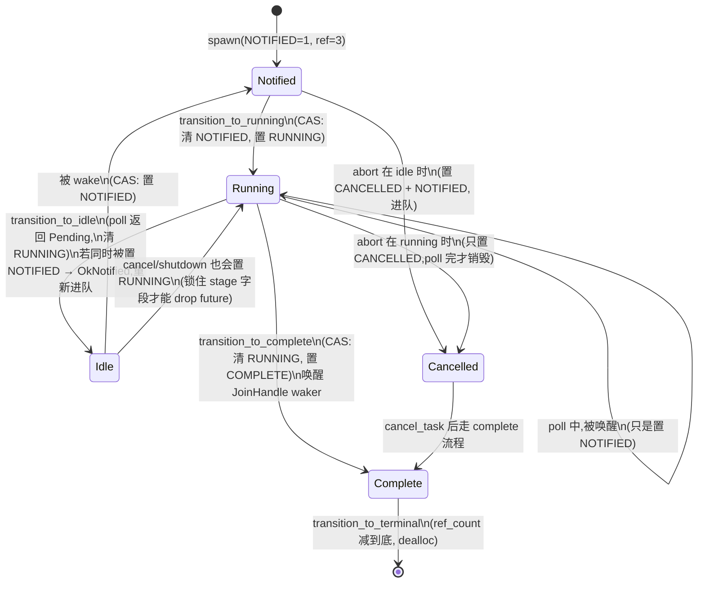

# 第 5 章 · Task:Future 怎么变成可调度单元

> **核心问题**:`tokio::spawn(future)` 这一行之后,内存里到底发生了什么?一个孤零零的 `Future`(第 3 章立的状态机、被 Pin 焊在堆上),是怎么被**包**成一个调度器能排队、能唤醒、能跟踪生命周期、能被 `JoinHandle` 等结果的 `Task` 的?task 在堆上长什么样?那个被第 4 章预告过、塞进一个 `AtomicUsize` 的"状态字",到底把哪些位塞了进去、凭什么塞得下?
>
> 这一章是**第 1 篇(地基)的收束章**。前四章攒下的三件套——Future(poll 契约 + 自引用状态机)、Pin(把 Future 焊死在堆地址)、Waker(fat pointer + vtable + 引用计数)——在这里被**组装成一个完整的、可被运行时驱动的调度单元**。读完这一章,你手里终于有了一个能在运行时里跑起来的 task,第 2 篇(调度器心脏)的开机条件才齐备。
>
> **读完本章你会明白**:
> - `spawn` 之后,task 怎么被**一次性堆分配**出来,以及为什么是"一次"——把 `Header` + `Core`(含 Future + output)+ `Trailer` 全塞进一个连续内存块,不是设计洁癖,是**缓存局部性 + 减少分配次数 + 裸指针固定偏移定位**三件事逼出来的。
> - task 在堆上的**字节级布局**长什么样:`Header`(热数据:state + vtable + queue_next + owner_id)在前,`Core`(scheduler + task_id + stage)居中,`Trailer`(冷数据:join waker + 链表指针)垫后,三者按 `#[repr(C)]` 顺序排布。
> - 那个被第 4 章反复预告的**状态字**到底长什么样:一个 `AtomicUsize`,低位塞 `RUNNING`/`COMPLETE`/`NOTIFIED`/`JOIN_INTEREST`/`JOIN_WAKER`/`CANCELLED` 六个状态 bit,高位塞**引用计数**——凭什么能塞、以及为什么**必须**塞进同一个字(反面:塞不进 → 撕裂的中间态 → 双重调度 / 丢唤醒 / use-after-free)。
> - `JoinHandle` 是怎么回事:它和 task 共享同一块堆内存,靠引用计数维持生命周期;它的 `abort`、`is_finished`、`await` 都是怎么落到状态字上的。
> - 为什么 tokio 把"task 在 poll 一半被取消"、"两次唤醒合并成一次调度"、"task 完成那一刻同时唤醒 JoinHandle"这些**必须原子**的操作,统统靠**对状态字做一次 CAS(比较并交换)**实现。
>
> **如果一读觉得太难**:先只记住三件事——① `spawn` = 把 Future 装进一个**一次堆分配**的 `Cell`(Header 在前、Core 居中、Trailer 垫后),并造出三个引用(`Task` + `Notified` + `JoinHandle`);② task 的全部生命周期(调度中/正在 poll/做完/取消)和引用计数,**打包进 `Header.state` 这一个 `AtomicUsize`**;③ 调度器对 task 的每一次状态迁移,都是**对这个状态字做一次 CAS**——成功了才有权操作 task,失败了就重试。状态字位段布局的细节看不懂可以先跳过,但要带一个直觉离开:**一个字塞两件事(状态 + 引用计数),是为了让"原子地迁移状态 + 增减引用"成为可能**。

---

## 章首·一句话点破

> **task 就是一张完整的订单卡:顶部印着订单状态(被排队 / 正在做 / 做完 / 取消)+ 一张"谁能派这张单"的联系表(schedule handle)+ 一摞"谁还攥着这张单"的计数(引用计数),下面夹着订单内容(Future 状态机 + output)。服务员(调度器)只看顶部的状态位就知道下一步怎么办,从来不用翻整张卡;状态位和计数压在一起,是因为"改状态"和"记账"必须同时发生——一次原子改一个字,绝不让中间状态漏出去。**

这是**结论**。这一章倒过来拆:先看 `tokio::spawn(future)` 这一行的完整链路——从一个 Future 变成三个引用(`Task`/`Notified`/`JoinHandle`),看清"包成 task"到底包了什么;再把堆上的 `Cell` 字节布局掰开(Header/Core/Trailer 三段、`#[repr(C)]`、缓存行对齐),看清 tokio 为什么把整个 task 塞进一次堆分配;最后落到那个状态字上,逐位拆解,看清"状态位 + 引用计数"为什么必须打包、凭什么用一次 CAS 就能完成所有状态迁移。

第 4 章结尾留了钩子:"task 怎么把 Waker 的 data 指针 + 引用计数 + 调度状态 + 取消标志**全部打包进一个 AtomicUsize**","ref_inc/ref_dec/NOTIFIED 是怎么和 RUNNING/COMPLETE/CANCELLED 共用一个状态字的"。本章一口气回答。前四章讲透的(poll 契约、Pin、Waker vtable、ref_inc/ref_dec 的原子排序),本章一句带过、只回扣,不重讲。

---

## 一、`spawn` 到底干了什么:从 Future 到三个引用

我们先不碰内存布局、不碰状态字,只盯一件事:**你写下 `tokio::spawn(my_future)` 这一行,从源码最外层一路追进去,发生了什么?**

### 第一层:`Runtime::spawn` 和 `Handle::spawn`

最外层的 `spawn`,定义在 `Runtime` 上:

```rust
// tokio/src/runtime/runtime.rs(摘录)
pub fn spawn<F>(&self, future: F) -> JoinHandle<F::Output>
where
    F: Future + Send + 'static,
    F::Output: Send + 'static,
{
    let fut_size = mem::size_of::<F>();
    if fut_size > BOX_FUTURE_THRESHOLD {
        self.spawn_named(Box::pin(future), SpawnMeta::new_unnamed(fut_size))
    } else {
        self.spawn_named(future, SpawnMeta::new_unnamed(fut_size))
    }
}
```

([tokio/src/runtime/runtime.rs:239-252](../tokio/tokio/src/runtime/runtime.rs#L239-L252))

这里有个**容易被忽略的小细节**,值得先点透:tokio 会量一下你这个 Future 的体积(`mem::size_of::<F>()`),如果**超过阈值**(`BOX_FUTURE_THRESHOLD`,debug=2048、release=16384 字节,见 [runtime/mod.rs:628](../tokio/tokio/src/runtime/mod.rs#L628)),就**先 `Box::pin` 一下**再 spawn。

> **不这样会怎样(反面)**:Future 是个状态机,体积等于"所有跨 await 字段的总和"。一个稍复杂的 async fn,状态机几百字节很正常,几千字节也不稀奇。`spawn` 最终要把它装进堆上的 task 里(下面会看到一次堆分配装下整个 task)。如果 Future 本身体积巨大,它在 `spawn` 入口被构造、再被 `move` 进 task 的过程中,会在栈上搬来搬去——大对象在栈上反复 move,有**栈溢出**风险(tokio 注释明说"prevent stack overflow caused by a large-sized Future")。先 `Box::pin` 一下,等于把 Future 提前请上堆,只搬一个瘦指针,就躲过了栈搬家的风险。这是 tokio 对"巨大状态机"的安全阀。日常 Future 体积不大,走 `else` 分支,直接进 task。

接下来 `spawn_named` 调 `self.inner.spawn(future, id, ...)`,进到 scheduler 层(`Handle`)。

### 第二层:`Handle::spawn` —— bind + schedule

scheduler 层(multi-thread 模式为例)的 spawn,核心就两个动作:

```rust
// tokio/src/runtime/scheduler/multi_thread/handle.rs(摘录)
#[track_caller]
pub(super) fn bind_new_task<T>(
    me: &Arc<Self>,
    future: T,
    id: task::Id,
    spawned_at: SpawnLocation,
) -> JoinHandle<T::Output>
where
    T: Future + Send + 'static,
    T::Output: Send + 'static,
{
    let (handle, notified) = me.shared.owned.bind(future, me.clone(), id, spawned_at);
    me.task_hooks.spawn(&TaskMeta { id, spawned_at, _phantom: Default::default() });
    me.schedule_option_task_without_yield(notified);
    handle
}
```

([tokio/src/runtime/scheduler/multi_thread/handle.rs:80-102](../tokio/tokio/src/runtime/scheduler/multi_thread/handle.rs#L80-L102))

读这段代码,要抓住三个动作:

1. **`bind(future, me.clone(), id, ...)`** —— 这是"把 Future 装进 task"的真正入口。`me.shared.owned` 是一个 `OwnedTasks`(运行时持有的"所有 task 的列表")。`bind` 内部调 `task::new_task(...)`,返回**一对**:`(JoinHandle, Notified)`。前者还给调用者,后者要送进调度器。
2. **`task_hooks.spawn(...)`** —— 钩子(用于 metrics、tracing),不是本章重点。
3. **`schedule_option_task_without_yield(notified)`** —— 把那个 `Notified` 塞进运行队列。一个刚 spawn 的 task,初始状态就是"该被调度了",所以它的 `Notified` 引用必须立刻进队,等待 worker 来 poll。

> **钉死这件事**:`spawn` 干了两件事——**① 造出 task(把 Future 装进堆上的 Cell)**;**② 把 task 的 `Notified` 引用送进调度队列**。前者是本章的主战场(内存布局、状态字),后者是第 7 章(work-stealing 调度器)的主战场。本章只盯前者。

### 第三层:`task::new_task` —— 一个 Future,变出三个引用

`bind` 内部调 `new_task`,这是 task 模块的"总装车间":

```rust
// tokio/src/runtime/task/mod.rs(摘录)
/// This is the constructor for a new task. Three references to the task are
/// created. The first task reference is usually put into an `OwnedTasks`
/// immediately. The Notified is sent to the scheduler as an ordinary
/// notification.
fn new_task<T, S>(
    task: T,
    scheduler: S,
    id: Id,
    spawned_at: SpawnLocation,
) -> (Task<S>, Notified<S>, JoinHandle<T::Output>)
where
    S: Schedule,
    T: Future + 'static,
    T::Output: 'static,
{
    let raw = RawTask::new::<T, S>(task, scheduler, id, spawned_at);
    let task = Task { raw, _p: PhantomData };
    let notified = Notified(Task { raw, _p: PhantomData });
    let join = JoinHandle::new(raw);

    (task, notified, join)
}
```

([tokio/src/runtime/task/mod.rs:318-351](../tokio/tokio/src/runtime/task/mod.rs#L318-L351))

这段代码的信息密度极高,值得逐句拆:

**① `RawTask::new::<T, S>(...)`** —— 这是**真正分配堆内存**的地方(下一节详拆)。返回一个 `RawTask`,它内部就是一根指向堆上 `Cell` 的裸指针(就是个地址)。`T`(Future 的具体类型)和 `S`(scheduler 的具体类型)在这里被**烙进**这个 task,后续整个生命周期都不再擦除类型——它们决定了 `Cell` 的大小、vtable 的内容、poll/dealloc 走哪个函数。

**② 三个引用同时诞生** —— 注意 `Task`、`Notified`、`JoinHandle` 三个值,**内部都攥着同一根 `raw` 指针**(指向同一块堆内存)。它们不是三个 task,而是**同一个 task 的三种身份**:

```
                  ┌──────────────────────────────────┐
                  │      堆上的 Cell(唯一一份)        │
                  │  Header | Core(Future+output) | Trailer │
                  └─────────────▲────────────────────┘
                                │  raw(同一根指针)
              ┌─────────────────┼─────────────────┐
              │                 │                 │
        ┌─────┴─────┐     ┌─────┴─────┐     ┌─────┴──────┐
        │  Task<S>  │     │ Notified<S>│    │JoinHandle<T>│
        │  存进      │     │  送进调度  │    │  还给用户   │
        │ OwnedTasks │     │   队列     │    │             │
        └───────────┘     └───────────┘     └────────────┘
              │                 │                 │
              └─── 共享同一个 ref_count(初始 = 3) ───┘
```

**③ "初始三引用"与 `INITIAL_STATE`** —— 三个引用同时诞生,意味着 task 一出世就**被三处持有**。这必须从一开始就反映在引用计数里(否则任意一处 drop 时计数错乱,要么提前释放、要么泄漏)。看 state.rs 里 task 的初值:

```rust
// tokio/src/runtime/task/state.rs(摘录)
/// State a task is initialized with.
///
/// A task is initialized with three references:
///
///  * A reference that will be stored in an `OwnedTasks` or `LocalOwnedTasks`.
///  * A reference that will be sent to the scheduler as an ordinary notification.
///  * A reference for the `JoinHandle`.
///
/// As the task starts with a `JoinHandle`, `JOIN_INTEREST` is set.
/// As the task starts with a `Notified`, `NOTIFIED` is set.
const INITIAL_STATE: usize = (REF_ONE * 3) | JOIN_INTEREST | NOTIFIED;
```

([tokio/src/runtime/task/state.rs:51-61](../tokio/tokio/src/runtime/task/state.rs#L51-L61))

task 一出世,状态字里就**预先埋好**了三件事:引用计数 = 3、`JOIN_INTEREST = 1`(因为有 JoinHandle)、`NOTIFIED = 1`(因为要进调度队列)。这三件事**不是后填的,是构造时就一起算好的**——因为状态字是原子的,初值必须一次性、原子的"对"。

> **钉死这件事(承接第 4 章)**:第 4 章我们说"Waker 的 clone/drop 本质是引用计数加减",并把 `ref_inc`/`ref_dec` 拎出来讲了原子排序(Relaxed vs AcqRel)。那一章的 `ref_count` 在哪?**就在这个状态字的高位**。task 出世时 `INITIAL_STATE` 写进去的 `REF_ONE * 3`,就是"初始三引用"。本章下半截会完整拆这个状态字,把第 4 章只引了的 `ref_inc/ref_dec` 还原到它真正的家。

### 这三种引用各管什么?

到这里,你可能要问:为什么 task 要有**三种身份**?直接一个 `Task` 不行吗?不行——它们各自**独占**访问 task 的不同字段,职责严格不重叠。看 mod.rs 顶部的注释:

```
//!  * `OwnedTask` - tasks stored in an `OwnedTasks` or `LocalOwnedTasks` are of this
//!    reference type.
//!  * `JoinHandle` - each task has a `JoinHandle` that allows access to the output
//!    of the task.
//!  * `Waker` - every waker for a task has this reference type. There can be any
//!    number of waker references.
//!  * `Notified` - tracks whether the task is notified.
```

([tokio/src/runtime/task/mod.rs:10-24](../tokio/tokio/src/runtime/task/mod.rs#L10-L24))

翻译成大白话:

- **`Task<S>`**:运行时(`OwnedTasks` 列表)持有的引用。**独占访问** task 的 `owned` 字段(链表指针)。
- **`Notified<S>`**:**待调度**的引用。它被塞进运行队列,**独占访问** `queue_next` 字段(队列里的下一张 task 指针)。一个 task 同一时刻最多**一个** `Notified` 在队列里(靠 `NOTIFIED` 位去重,后面拆)。
- **`JoinHandle<T>`**:还给用户的引用。它**独占访问** task 的 output(等任务做完拿结果)和 join waker(用户 await 它时存的 Waker)。
- **`Waker`**:第 4 章的主角。**任意数量**——一个 task 可能同时被 reactor、timer、Notify 各持有一份 Waker。

> **比喻回到餐厅**:一张订单卡,被复印几份**不同颜色的副本**,分别发给不同的人——
> - **原件(`Task`)**:订餐台存档,夹在"今日所有订单"的本子里(`OwnedTasks`);
> - **派单联(`Notified`)**:送进派单队列,等着服务员来取,谁取走谁负责 poll;
> - **回执联(`JoinHandle`)**:交给下单的客人,客人等菜好了凭它取餐;
> - **呼叫器(`Waker`)**:复印好多份,厨房、吧台、催单闹钟各发一个。
>
> 四种副本**指向同一张原始订单卡**(同一块堆内存),原始订单卡的"还活着多少人"计数,记的就是这四种副本的总数。任何一份副本被销毁(扔进垃圾桶),计数减一;最后一份被扔掉,原始订单卡才允许销毁。这套"计数",就是状态字高位的 ref_count。

到这里,`spawn` 的全貌清楚了:**Future 装进堆上的 Cell,变出三份引用(`Task` + `Notified` + `JoinHandle`),`Notified` 进队列,`JoinHandle` 还给用户。** 接下来的问题就集中在一件事——**那块堆上的 Cell,长什么样?**

---

## 二、task 在堆上长什么样:`Header` + `Core` + `Trailer` 一次堆分配

这一节是本章的主菜之一。我们要把 task 在堆上的内存,**字节级**地拆开,看清 tokio 为什么这么布局。

### `Cell`:task 的整体容器

task 的真实身份,是一个叫 `Cell` 的结构体(完整名称是 `Cell<T: Future, S>`)。看它的定义:

```rust
// tokio/src/runtime/task/core.rs(摘录,缓存行对齐的 cfg 省略)
#[repr(C)]
pub(super) struct Cell<T: Future, S> {
    /// Hot task state data
    pub(super) header: Header,

    /// Either the future or output, depending on the execution stage.
    pub(super) core: Core<T, S>,

    /// Cold data
    pub(super) trailer: Trailer,
}
```

([tokio/src/runtime/task/core.rs:126-135](../tokio/tokio/src/runtime/task/core.rs#L126-L135))

注意三个细节:

1. **`#[repr(C)]`** —— 强制按 C 的字段顺序排布(后一个字段紧跟前一个,不重排)。Rust 默认会重排字段以节省 padding,但 tokio **不要**重排——它要**精确控制** Header 在最前、Core 居中、Trailer 垫后,因为整个 task 都靠"Header 在偏移 0"这个不变量做裸指针定位。
2. **三大段**:`Header`(热数据,被频繁读写)、`Core`(Future + output,体量最大)、`Trailer`(冷数据,只在 spawn 和 shutdown 时碰)。
3. **缓存行对齐**(被我省略的几十行 `#[repr(align(128))]` / `align(64)` 等 cfg)——`Cell` 整体按 128 字节(x86_64/aarch64/powerpc64)或 64 字节(其他多数架构)对齐。这是**防 false sharing**(两个 task 落在同一缓存行,互相把对方的缓存行弹掉)的典型技巧。这个技巧本书后面(尤其第 7 章的 Chase-Lev 队列、第 9 章的 budget)还会反复出现,本章先记住"task 顶部对齐到缓存行边界"。

而 `Cell` 在 `spawn` 时怎么造出来?**一次 `Box::new`**:

```rust
// tokio/src/runtime/task/raw.rs(摘录)
impl RawTask {
    pub(super) fn new<T, S>(
        task: T,
        scheduler: S,
        id: Id,
        _spawned_at: super::SpawnLocation,
    ) -> RawTask
    where
        T: Future,
        S: Schedule,
    {
        let ptr = Box::into_raw(Cell::<_, S>::new(
            task, scheduler, State::new(), id,
            #[cfg(tokio_unstable)] _spawned_at.0,
        ));
        let ptr = unsafe { NonNull::new_unchecked(ptr.cast()) };
        RawTask { ptr }
    }
    // ...
}
```

([tokio/src/runtime/task/raw.rs:210-232](../tokio/tokio/src/runtime/task/raw.rs#L210-L232))

`Cell::new` 内部(见 [core.rs:227-319](../tokio/tokio/src/runtime/task/core.rs#L227-L319))做了一件事:`Box::new(Cell { trailer, header, core })`——**一次性把 Header + Core + Trailer 全部塞进一个 Box**。`Box::into_raw` 把这个 Box 的指针吐出来,从此这块堆内存的地址固定不变(堆不会自己移动),task 的整个生命周期都靠这一根指针定位。

> **钉死这件事(承接第 3 章)**:第 3 章我们说 tokio 把 Future "堆分配在一个固定地址上,以满足 Pin 契约"。具体是哪一次堆分配?**就是这一次**。整个 task(Header + Core + Trailer)**共用这一次** `Box::new`,Future 不再单独 Box。这就是为什么 `Core::poll` 里那句 `Pin::new_unchecked(future)` 是 sound 的——Future 所在的地址 = task 这块堆内存里某个固定偏移,堆地址不变,Future 地址就不变,Pin 契约满足。

### 三大段各自装了什么

现在逐段拆。

#### `Header`:热数据,排最前

```rust
// tokio/src/runtime/task/core.rs(摘录)
#[repr(C)]
pub(crate) struct Header {
    /// Task state.
    pub(super) state: State,                                       // ← 那个状态字!
    /// Pointer to next task, used with the injection queue.
    pub(super) queue_next: UnsafeCell<Option<NonNull<Header>>>,    // ← 队列里的"下一张"
    /// Table of function pointers for executing actions on the task.
    pub(super) vtable: &'static Vtable,                            // ← task 的虚表
    /// list id
    pub(super) owner_id: UnsafeCell<Option<NonZeroU64>>,           // ← 属于哪个 OwnedTasks
    #[cfg(all(tokio_unstable, feature = "tracing"))]
    pub(super) tracing_id: Option<tracing::Id>,
}
```

([tokio/src/runtime/task/core.rs:167-194](../tokio/tokio/src/runtime/task/core.rs#L167-L194))

Header 装 4 个字段,全是**被高频读写**的:

- **`state: State`** —— 本章下半截的主角,一个 `AtomicUsize`,打包了"状态 + 引用计数"。
- **`queue_next`** —— task 在调度队列里的"下一个"指针(第 7 章 injector 队列用)。一个 task 同时只在一个队列里,所以这字段**独占访问**(由 `Notified` 引用持有,见 [mod.rs:64](../tokio/tokio/src/runtime/task/mod.rs#L64))。
- **`vtable: &'static Vtable`** —— task 的虚表,装了 poll/schedule/dealloc/try_read_output 等函数指针(下面详拆)。注意是 `&'static`,说明它指向一个**静态常量**——同一类 task(`<T, S>` 组合相同)共用同一张 vtable。
- **`owner_id`** —— 这个 task 属于哪个 `OwnedTasks`(运行时的"所有 task 列表")。task 一旦绑到某个列表,这个 id 永不更改,任何线程可以**不加同步**地读它(注释明说,见 L182-188)。

> **为什么 Header 在最前?** core.rs 顶部那条注释直接回答:
>
> > It is critical for `Header` to be the first field as the task structure will be referenced by both *mut Cell and *mut Header.
>
> ([core.rs:37-39](../tokio/tokio/src/runtime/task/core.rs#L37-L39))
>
> 整个运行时里,task 是被**裸指针**传来传去的,而绝大多数指针的类型是 `*mut Header`(不是 `*mut Cell<T, S>`)——因为运行时**不能**知道每个 task 的具体 `T`/`S`(类型擦除)。Header 在偏移 0,意味着 `*mut Cell` 和 `*mut Header` 是**同一个地址**,cast 一下就能用。这是 task 能被"类型擦除"地在运行时各处流转的物理基础。

`Header` 有多大?core.rs 自己写了个测试:

```rust
#[test]
#[cfg(not(loom))]
fn header_lte_cache_line() {
    assert!(std::mem::size_of::<Header>() <= 8 * std::mem::size_of::<*const ()>());
}
```

([tokio/src/runtime/task/core.rs:567-571](../tokio/tokio/src/runtime/task/core.rs#L567-L571))

64 位机器上,`Header ≤ 8 个指针 = 64 字节`,正好塞进一个缓存行(x86)或半个缓存行(ARM 大核)。这是**刻意**的:Header 是热数据,把它压在缓存行里,每次访问 header 不用跨缓存行——一次 cache line read 就把整个 header 拿到。

#### `Core`:Future 和 output 的家,体量最大

```rust
// tokio/src/runtime/task/core.rs(摘录)
#[repr(C)]
pub(super) struct Core<T: Future, S> {
    /// Scheduler used to drive this future.
    pub(super) scheduler: S,
    /// The task's ID, used for populating `JoinError`s.
    pub(super) task_id: Id,
    #[cfg(tokio_unstable)]
    pub(super) spawned_at: &'static Location<'static>,
    /// Either the future or the output.
    pub(super) stage: CoreStage<T>,
}

pub(super) struct CoreStage<T: Future> {
    stage: UnsafeCell<Stage<T>>,
}

/// Either the future or the output.
#[repr(C)]
pub(super) enum Stage<T: Future> {
    Running(T),                       // 还在跑,future 在这
    Finished(super::Result<T::Output>),// 做完了,结果存这
    Consumed,                         // 结果被取走了,空壳
}
```

([tokio/src/runtime/task/core.rs:147-164, 221-225](../tokio/tokio/src/runtime/task/core.rs#L147-L164))

Core 装三件东西:

- **`scheduler: S`** —— task 的"派单联系人",`S: Schedule`(下面专讲)。决定 task 被唤醒后塞进哪个运行队列。
- **`task_id: Id`** —— task 的唯一 id(用于 metrics、JoinError、tokio-console)。
- **`stage: CoreStage<T>`** —— 包着 `UnsafeCell<Stage<T>>`。这是 Future 和 output 共用的字段:`Running(T)` 时存 Future,做完迁移到 `Finished(output)`,JoinHandle 取走 output 后变 `Consumed`。**三种状态共用同一块内存**(enum 的内存布局),不是三个字段。

第 3 章我们看过 `Core::poll` 怎么从这个 `stage` 里把 Future 拿出来、`Pin::new_unchecked` 包成 Pin 再 poll(见 [core.rs:362-384](../tokio/tokio/src/runtime/task/core.rs#L362-L384))。这里只回扣一句:**`UnsafeCell` + RUNNING 位 + Pin::new_unchecked 三件套,把"独占访问 + 地址固定"两件事做齐**——`UnsafeCell` 给了 `&self` 下 mutate 的能力,RUNNING 位保证同一时刻只有一个线程在 mutate,堆地址固定满足 Pin 契约。这就是 unsafe 在这里 sound 的全部理由。

#### `Trailer`:冷数据,垫后

```rust
// tokio/src/runtime/task/core.rs(摘录)
/// Cold data is stored after the future. Data is considered cold if it is only
/// used during creation or shutdown of the task.
pub(super) struct Trailer {
    /// Pointers for the linked list in the `OwnedTasks` that owns this task.
    pub(super) owned: linked_list::Pointers<Header>,
    /// Consumer task waiting on completion of this task.
    pub(super) waker: UnsafeCell<Option<Waker>>,
    /// Optional hooks needed in the harness.
    pub(super) hooks: TaskHarnessScheduleHooks,
}
```

([tokio/src/runtime/task/core.rs:201-209](../tokio/tokio/src/runtime/task/core.rs#L201-L209))

Trailer 装**只在 spawn 和 shutdown 才碰**的冷数据:

- **`owned: Pointers<Header>`** —— `OwnedTasks` 是个双向链表,这两个指针(prev/next)把 task 串进链表。task 在"所有 task 列表"里的位置。
- **`waker: UnsafeCell<Option<Waker>>`** —— **JoinHandle 的 waker**。注意不是 task 自己的 Waker(task 自己的 Waker 在第 4 章,是别的线程按一下把 task 叫醒的);这个是**用户 `await join_handle` 时,JoinHandle 存进来的 Waker**——task 做完了用它叫醒那个等待结果的 task。两个 Waker 容易混,务必分清。
- **`hooks`** —— task 终止钩子(可选)。

### 为什么三段不分开堆分配?——单次分配的三重红利

到这里你可能会问:既然 Header、Core、Trailer 三段职责不同,为什么不**分开**堆分配——Header 一个 Box、Future 一个 Box(本来 Pin 也要 Box)、Trailer 一个 Box?合起来不就三个 Box 吗?

> **不这样会怎样(反面,致命)**:三个 Box,撞三堵墙——
>
> **墙一:分配次数翻三倍。** `spawn` 是热路径,百万并发的场景下每秒可能 spawn 几万、几十万次。每次 spawn 走三次堆分配(三次 `malloc`/`GlobalAlloc`),三次堆释放。堆分配有锁(全局分配器),有碎片,有 size class 查找。**三次堆分配 = 一次堆分配开销的至少三倍**,对一个追求"百万并发"的运行时,这是不可接受的开销。
>
> **墙二:缓存局部性崩塌。** 三个 Box 散落在堆的不同位置,poll 一次 task 要三次 cache miss(分别取 Header、Core、Trailer)。一次 cache miss 几纳秒到几十纳秒,百万 task 累加起来,开销惊人。三段连续放一个 Box,poll 时 Header 进缓存行(Header ≤ 64B,正好一个缓存行),Core 紧跟其后——一次预取(prefetcher 拉 128 字节)就能把 Header + Core 头部全带进缓存。**这正是 core.rs 顶部那段缓存行对齐注释的用意**。
>
> **墙三:裸指针定位退化成间接寻址。** task 在运行时里是靠 `*mut Header` 裸指针流转的(类型擦除)。如果 Header、Core、Trailer 分开,指针只能指向 Header,从 Header 找 Core、找 Trailer 得**额外存两根指针**(Header 里加 `core_ptr`、`trailer_ptr` 字段)——每次找 Core 多一次内存访问(间接寻址)。三段连续排布,Core = Header + 固定偏移,Trailer = Header + 另一个固定偏移,**编译期算好偏移,运行时 `header_ptr + offset` 直接定位**——一次加法,无额外访存。

> **钉死这件事**:**一次堆分配装下整个 task**,不是设计洁癖,是**减少分配次数 + 缓存局部性 + 裸指针固定偏移定位**三件事同时要的产物。tokio 把这三段按 `#[repr(C)]` 顺序排布,Header 在偏移 0(让 `*mut Cell == *mut Header`),Trailer 的偏移**编译期**算出来存进 vtable(下面看 vtable 的 `trailer_offset` 字段),运行时按偏移一步到位。这是 Rust 系统级代码"用内存布局换性能"的典范。

### 一张图看清 task 在堆上的字节布局

把上面所有信息汇成一张 ASCII 框图。这是本章的核心图之一,对标数据库系列画 B+tree 页面布局的风格:

```
   task 在堆上的 Cell(一次 Box::new 装下,地址 = Header 地址,固定不变)
   ┌──────────────────────────────────────────────────────────────────────┐
   │  Header  (offset 0,热数据,≤ 64 字节压进缓存行)                          │
   │  ┌──────────────────────────────────────────────────────────────┐    │
   │  │ state: AtomicUsize        ← 状态字!低位=状态 bit,高位=ref_count   │    │
   │  │ queue_next: Option<NonNull<Header>>  ← 队列里的"下一张"           │    │
   │  │ vtable: &'static Vtable   ← task 的虚表(poll/schedule/dealloc) │    │
   │  │ owner_id: Option<NonZeroU64>  ← 属于哪个 OwnedTasks            │    │
   │  └──────────────────────────────────────────────────────────────┘    │
   ├──────────────────────────────────────────────────────────────────────┤
   │  Core<T, S>  (居中,体量最大,含 Future)                                 │
   │  ┌──────────────────────────────────────────────────────────────┐    │
   │  │ scheduler: S              ← task 的"派单联系人"                  │    │
   │  │ task_id: Id                                                   │    │
   │  │ stage: UnsafeCell<Stage<T>> ← Future / output / Consumed 共用  │    │
   │  │   ├─ Running(T)        ← poll 之前,Future 在这(被 Pin 焊死)     │    │
   │  │   ├─ Finished(output)  ← poll 完成,output 在这                  │    │
   │  │   └─ Consumed          ← JoinHandle 取走 output 后               │    │
   │  └──────────────────────────────────────────────────────────────┘    │
   ├──────────────────────────────────────────────────────────────────────┤
   │  Trailer  (垫后,冷数据,只在 spawn/shutdown 碰)                         │
   │  ┌──────────────────────────────────────────────────────────────┐    │
   │  │ owned: Pointers<Header>  ← OwnedTasks 链表的 prev/next         │    │
   │  │ waker: Option<Waker>     ← JoinHandle 的 waker(等结果的 task)    │    │
   │  │ hooks: TaskHarnessScheduleHooks                                │    │
   │  └──────────────────────────────────────────────────────────────┘    │
   └──────────────────────────────────────────────────────────────────────┘

   三种引用(都攥着指向 Header 的同一根裸指针):
       Task<S>(存 OwnedTasks) | Notified<S>(进调度队列) | JoinHandle<T>(给用户)
   + 任意数量的 Waker(reactor/timer/Notify 各一份,见第 4 章)
   → 共用 Header.state 高位的 ref_count,初始 = 3
```

### vtable:为什么 task 也要一张虚表

回扣第 4 章——`Waker` 用 vtable 做"类型擦除 + 多态"。task **也是同一个套路**:运行时拿到的指针是 `*mut Header`,但它**不知道**这个 task 的 `T`(Future 类型)和 `S`(scheduler 类型)是什么。要 poll 它、要 dealloc 它,只能靠虚表:

```rust
// tokio/src/runtime/task/raw.rs(摘录)
pub(super) struct Vtable {
    /// Polls the future.
    pub(super) poll: unsafe fn(NonNull<Header>),
    /// Schedules the task for execution on the runtime.
    pub(super) schedule: unsafe fn(NonNull<Header>),
    /// Deallocates the memory.
    pub(super) dealloc: unsafe fn(NonNull<Header>),
    /// Reads the task output, if complete.
    pub(super) try_read_output: unsafe fn(NonNull<Header>, *mut (), &Waker),
    /// The join handle has been dropped.
    pub(super) drop_join_handle_slow: unsafe fn(NonNull<Header>),
    /// An abort handle has been dropped.
    pub(super) drop_abort_handle: unsafe fn(NonNull<Header>),
    /// Scheduler is being shutdown.
    pub(super) shutdown: unsafe fn(NonNull<Header>),
    /// The number of bytes that the `trailer` field is offset from the header.
    pub(super) trailer_offset: usize,
    /// The number of bytes that the `scheduler` field is offset from the header.
    pub(super) scheduler_offset: usize,
    /// The number of bytes that the `id` field is offset from the header.
    pub(super) id_offset: usize,
    // ...
}
```

([tokio/src/runtime/task/raw.rs:24-58](../tokio/tokio/src/runtime/task/raw.rs#L24-L58))

注意这张 vtable 不光装了**函数指针**(poll/schedule/dealloc/...),还装了**字段偏移量**(trailer_offset、scheduler_offset、id_offset)。后者是为什么?——因为运行时只知道 Header 在偏移 0,要从 Header 找到 scheduler、找到 id、找到 trailer,**得知道偏移**。而 `T`、`S` 不同,`Core<T, S>` 的大小不同(里面装着 `scheduler: S`,S 大小变了 Core 就变了),所以 trailer 的位置也变。tokio 的做法是:在 spawn 时**编译期**算好这些偏移(`OffsetHelper` 那一坨 `const fn`,见 [raw.rs:83-118](../tokio/tokio/src/runtime/task/raw.rs#L83-L118)),塞进这张 task 的 vtable,运行时按 vtable 里的偏移一步定位。

> **钉死这件事**:task 的 vtable 比 `Waker` 的 vtable 复杂——它不光是"四个函数指针",还塞了"字段偏移量"。这套"vtable + 偏移"的设计,让运行时**只需一根 `*mut Header` 指针 + 一张 vtable**,就能对类型擦除的 task 做所有操作(poll、schedule、dealloc、取 output、找 scheduler、找 id、找 trailer)。这是 Rust 把"trait object 的虚表机制"用在最底层 task 容器上的范例——和第 4 章的 Waker vtable 是同一套思想,只是这里多塞了几个 offset。

vtable 怎么用?看个最典型的:`RawTask::poll`。

```rust
// tokio/src/runtime/task/raw.rs(摘录)
/// Safety: mutual exclusion is required to call this function.
pub(crate) fn poll(self) {
    let vtable = self.header().vtable;
    unsafe { (vtable.poll)(self.ptr) }
}

unsafe fn poll<T: Future, S: Schedule>(ptr: NonNull<Header>) {
    let harness = Harness::<T, S>::from_raw(ptr);
    harness.poll();
}
```

([tokio/src/runtime/task/raw.rs:271-274, 341-344](../tokio/tokio/src/runtime/task/raw.rs#L271-L344))

`self.header().vtable` 拿到那张 vtable,`vtable.poll` 是个函数指针——运行时**不知道**它具体是哪个函数,只知道"调它,task 就被 poll 一次"。实际调到的是 `poll::<T, S>` 那个泛型单态化后的函数,它知道具体的 `T`/`S`,能正确地构造 `Harness<T, S>`,然后调真正的 `Harness::poll`。

### `Schedule` trait:task 怎么找到"派单联系人"

最后看 `Schedule` trait——它定义了 task 被唤醒后,塞回哪个调度器:

```rust
// tokio/src/runtime/task/mod.rs(摘录)
pub(crate) trait Schedule: Sync + Sized + 'static {
    /// The task has completed work and is ready to be released. The scheduler
    /// should release it immediately and return it. The task module will batch
    /// the ref-dec with setting other options.
    ///
    /// If the scheduler has already released the task, then None is returned.
    fn release(&self, task: &Task<Self>) -> Option<Task<Self>>;

    /// Schedule the task
    fn schedule(&self, task: Notified<Self>);

    fn hooks(&self) -> TaskHarnessScheduleHooks;

    /// Schedule the task to run in the near future, yielding the thread to
    /// other tasks.
    fn yield_now(&self, task: Notified<Self>) {
        self.schedule(task);
    }

    /// Polling the task resulted in a panic. Should the runtime shutdown?
    fn unhandled_panic(&self) {
        // By default, do nothing. This maintains the 1.0 behavior.
    }
}
```

([tokio/src/runtime/task/mod.rs:293-316](../tokio/tokio/src/runtime/task/mod.rs#L293-L316))

`Schedule` 是 task 与"具体调度器实现"解耦的接口。tokio 的两种调度器(current-thread、multi-thread)各自 `impl Schedule for Arc<Handle>`(见 [multi_thread/handle.rs:105](../tokio/tokio/src/runtime/scheduler/multi_thread/handle.rs#L105))。task 的 `Core.scheduler: S` 持有这个具体实现,第 4 章 `Waker::wake` 走到 `scheduler.schedule(Notified(task))`(见 [raw.rs:346-353](../tokio/tokio/src/runtime/task/raw.rs#L346-L353))就是把 task 塞回**这个**调度器的运行队列。

> **钉死这件事(承上启下)**:task 的 `Core.scheduler` 字段,就是 task 持有的"派单联系人"。第 4 章讲 `Waker::wake` 怎么把 task 塞回调度器——靠的就是这个字段。task 自己**自带调度器引用**,这是 tokio "task 在被唤醒后能自动回到正确的运行队列"的关键。具体怎么塞进队列(local run queue / injector)、worker 怎么取出来 poll——全是第 7 章的戏。本章只记住:**task 通过 `Schedule` trait 知道自己归谁管**。

---

## 三、状态字:一个 `AtomicUsize` 怎么塞下"状态 + 引用计数"

到这里,task 的内存布局清楚了。接下来本章最硬核的内容——那个被第 4 章预告过、被反复点名的**状态字**。

### 状态字的位段布局

直接看 state.rs 顶部的常量定义:

```rust
// tokio/src/runtime/task/state.rs(摘录)
use crate::loom::sync::atomic::AtomicUsize;

pub(super) struct State {
    val: AtomicUsize,
}

/// The task is currently being run.
const RUNNING: usize = 0b0001;          // bit 0

/// The task is complete.
/// Once this bit is set, it is never unset.
const COMPLETE: usize = 0b0010;          // bit 1

/// Extracts the task's lifecycle value from the state.
const LIFECYCLE_MASK: usize = 0b11;      // bit 0~1:生命周期

/// Flag tracking if the task has been pushed into a run queue.
const NOTIFIED: usize = 0b100;           // bit 2

/// The join handle is still around.
const JOIN_INTEREST: usize = 0b1_000;    // bit 3

/// A join handle waker has been set.
const JOIN_WAKER: usize = 0b10_000;      // bit 4

/// The task has been forcibly cancelled.
const CANCELLED: usize = 0b100_000;      // bit 5

/// All bits.
const STATE_MASK: usize = LIFECYCLE_MASK | NOTIFIED | JOIN_INTEREST | JOIN_WAKER | CANCELLED;
                                        // = 0b111111 (bit 0~5)

/// Bits used by the ref count portion of the state.
const REF_COUNT_MASK: usize = !STATE_MASK;   // bit 6 及以上,全部留给 ref_count

/// Number of positions to shift the ref count.
const REF_COUNT_SHIFT: usize = REF_COUNT_MASK.count_zeros() as usize;

/// One ref count.
const REF_ONE: usize = 1 << REF_COUNT_SHIFT;   // ref_count 加一对应的 usize 增量
```

([tokio/src/runtime/task/state.rs:6-49](../tokio/tokio/src/runtime/task/state.rs#L6-L49))

这段常量定义,把一个 `AtomicUsize`(64 位机器上 64 bit)切成两段:

```
   State.val: AtomicUsize  (64 位)
   ┌──────────────────────────────────────────────────────────────────┐
   │ bit 63                                          6  5  4  3  2  1  0│
   │ ├─────────────────── ref_count ──────────────┤  C  J  J  N  L  L│
   │ │                                              │  A  W  I  O  I  I│
   │ │                                              │  N  K  │  T  F  F│
   │ │                                              │  C  │  │  I  E  E│
   │ │                                              │  L  │  │  F  │  ││
   │ │                                              │  D  │  │  D  │  ││
   └───────────────────────────────────────────────┴──┴──┴──┴──┴──┴──┘
       高位:REF_COUNT_MASK = !STATE_MASK(bit 6~63)        bit 0~5:STATE_MASK

   bit 0~1 (LIFECYCLE_MASK):  00 = idle, 01 = running, 10 = complete
   bit 2   NOTIFIED:          1 = 已进队,等待被 poll
   bit 3   JOIN_INTEREST:     1 = 有 JoinHandle 还活着
   bit 4   JOIN_WAKER:        1 = JoinHandle 已存了 waker(访问控制位,见 mod.rs 注释 L80-108)
   bit 5   CANCELLED:         1 = task 被强行取消(abort / shutdown)
   bit 6+  ref_count:         引用计数,初始 = 3(Task + Notified + JoinHandle 各 1)
```

逐位解读:

- **LIFECYCLE(bit 0~1)** —— task 的"主状态",三态:`idle`(00,挂起中,不在跑)、`running`(01,正在被 poll)、`complete`(10,做完了)。注意 complete 一旦置位**永不回退**(注释 L21:"Once this bit is set, it is never unset")。RUNNING 位其实是个**锁**——"谁能 poll 这个 task"的锁(mod.rs 注释 L37:"This bit functions as a lock around the task")。
- **NOTIFIED(bit 2)** —— task 是否在运行队列里、等待被 poll。"已进队"的标志。这一位是**去重**的关键——多次唤醒同一个 task,只让它进队一次(下面拆)。
- **JOIN_INTEREST(bit 3)** —— 有没有 JoinHandle 还活着。task 完成时,运行时要据此决定"要不要保留 output 给 JoinHandle 取"。
- **JOIN_WAKER(bit 4)** —— JoinHandle 的 waker 访问控制位(复杂,本章不深拆,看 mod.rs 注释 L75-108 的 7 条规则)。本质是个"谁能改 join waker 字段"的锁。
- **CANCELLED(bit 5)** —— task 被取消。一旦置位,task 下次 poll 会被立刻销毁(第 21 章详拆取消传播)。
- **ref_count(bit 6~63)** —— 引用计数。58 位,能装下天文数字的引用,实际不会溢出(state.rs 在 `ref_inc` 里做了 `> isize::MAX` 就 abort 的保护,见 [L494-496](../tokio/tokio/src/runtime/task/state.rs#L494-L496))。

> **钉死这件事**:一个 `AtomicUsize`,**低位 6 bit 装 6 个状态标志,高位装引用计数**。一个字,装下了 task 的全部生命周期 + 谁还攥着它的计数。这不是炫技,这是**唯一**能让"原子地改状态 + 增减引用计数"成为可能的设计——下面用反面对比讲清为什么。

### 为什么必须打包进一个字——反面:多个原子变量的撕裂

这是本章最关键的"为什么"。理解它,你才理解 tokio task 整套无锁设计的根。

考虑一个最典型的场景:**task 被 poll 完,返回 `Ready`。这一刻要同时发生两件事**——

1. 把 LIFECYCLE 从 `running` 迁移到 `complete`;
2. 如果有 JoinHandle 还活着(`JOIN_INTEREST = 1`)且它之前存了 waker(`JOIN_WAKER = 1`),**唤醒**那个 waker(让等结果的 task 知道"我好了")。

这两件事**必须原子**——"标记 complete"和"唤醒 JoinHandle"之间,绝不能让别的线程看到中间状态。否则:

> **不这样会怎样(反面,致命)**:假设我们用**多个独立的原子变量**分别存——
>
> ```rust
> // 简化示意,非源码原文:反面,用多个独立原子变量
> struct Task {
>     lifecycle: AtomicU8,      // running / complete
>     notified:  AtomicBool,    // 是否在队列
>     cancelled: AtomicBool,    // 是否取消
>     join_int:  AtomicBool,
>     ref_count: AtomicUsize,
> }
> ```
>
> 现在完成 task 要做:"把 lifecycle 从 running 改成 complete" + "如果 join_int 为真且存了 waker,唤醒它"。**这是两次独立的原子操作**(`lifecycle.store(COMPLETE)` 然后 `wake_join_waker()`)。两次操作之间,**别的线程能看到中间状态**——
>
> - worker 线程 A 正在 poll task,准备完成它:`lifecycle = COMPLETE`,然后正要 `wake_join()`。
> - 同一瞬间,worker 线程 B(持有 JoinHandle 的 task)正在 `await join_handle`,它看到 `lifecycle == COMPLETE`,**立刻**去取 output——可 A 还没唤醒它,B 取完就走了。**B 没被叫醒就拿走了结果**——这看似没问题,实际上撞了更深的坑:如果 B 是被自己的 reactor 提前唤醒的(不是因为 task 完成才醒),它取走 output 后 `forget` 了 task,而 A 这边的 wake_join 触发到了一个**已经被取走 output 的 task**——双重释放 / 触发 panic。
>
> 这叫**撕裂的中间态(torn state)**:多个相关状态被拆到多个原子变量,无法原子地一起迁移,中间状态漏出去,导致**双重调度、丢唤醒、use-after-free**。
>
> 更具体的几个撞墙场景:
>
> - **双重调度**:`notified = true` 和 `lifecycle = idle` 分两个原子变量。线程 A 把 notified 设 true(以为 task 该被调度),线程 B 同时把 lifecycle 从 running 改 idle——中间出现 `notified=true & lifecycle=running`,A 以为该调度,B 以为 task 还在跑,**两个线程都以为自己是负责 schedule 的那个**,task 被塞进队列两次 → 双重 poll → UB(违反 poll 契约:同一时刻只能一个线程 poll)。
> - **丢唤醒**:`notified` 和 `ref_count` 分开。线程 A 把 notified 设 true,正要 ref_count + 1(为新的 Notified 引用),这时线程 B 把 ref_count 减到 0(以为是最后一个引用)→ dealloc → A 的 "+1" 加到了已释放内存上 → UB,且**唤醒丢了**(task 没被 schedule)。
> - **use-after-free**:同上,ref_count 减到 0 释放后,A 还在操作 task 字段 → 野指针。

这三个 bug,每一个都足以让整个运行时在并发下随机崩溃。它们的**共同根源**就是:**相关状态必须一起改,但多个独立原子变量给不了"一起改"的能力**。

> **所以这样设计**:把"状态 + 引用计数"**全部塞进一个 `AtomicUsize`**。一个字,一次原子操作(RMW,read-modify-write),就能**同时**改多个 bit。`transition_to_complete` 不是"先改 lifecycle 再唤醒",而是"一次 CAS 把 RUNNING 清掉、把 COMPLETE 置上"——这一刻,状态迁移完成,且对外**不可分割**(其他线程要么看到迁移前的状态,要么看到迁移后的状态,绝看不到中间)。引用计数的增减同理,一次 RMW 改高位,不影响低位的状态 bit。

这是 tokio task 整套无锁设计的**根**。所有"看似复杂的"状态迁移函数(下面要讲的 `transition_to_running`、`transition_to_idle`、`transition_to_complete` 等),本质都是"**对状态字做一次 CAS,在一个原子操作里同时改状态 + 改引用计数**"。理解了这一点,后面看任何 transition 函数都不慌。

### 状态机:task 的生命周期迁移

把状态字抽象成一张状态图(本章 mermaid 图之一):



这张图的关键,在每个迁移都是一个**对状态字的 CAS**——成功才有权操作 task 的其他字段(stage、output、waker),失败就重试或放弃。我们逐一拆几个最关键的迁移函数,看清 CAS 怎么写、为什么这么写。

### `transition_to_running`:抢到 poll 的锁

worker 线程从队列取出一个 `Notified`,要 poll 它。第一步:**抢 RUNNING 位**(因为 RUNNING 位是个锁)。

```rust
// tokio/src/runtime/task/state.rs(摘录)
/// Attempts to transition the lifecycle to `Running`. This sets the
/// notified bit to false so notifications during the poll can be detected.
pub(super) fn transition_to_running(&self) -> TransitionToRunning {
    self.fetch_update_action(|mut next| {
        let action;
        assert!(next.is_notified());      // 入口必须是 Notified

        if !next.is_idle() {
            // task 正在跑(别人抢到了)或已完成,放弃 poll
            next.ref_dec();               // 消耗掉这份 Notified 的引用
            if next.ref_count() == 0 {
                action = TransitionToRunning::Dealloc;
            } else {
                action = TransitionToRunning::Failed;
            }
        } else {
            // 成功抢到锁
            next.set_running();           // 置 RUNNING
            next.unset_notified();        // 清 NOTIFIED —— 关键!

            if next.is_cancelled() {
                action = TransitionToRunning::Cancelled;
            } else {
                action = TransitionToRunning::Success;
            }
        }
        (action, Some(next))
    })
}
```

([tokio/src/runtime/task/state.rs:117-145](../tokio/tokio/src/runtime/task/state.rs#L117-L145))

读这段,要抓两个关键:

**① 为什么抢到锁后要 `unset_notified()`?** —— 注释明说:"so notifications during the poll can be detected"。设想 worker A 正在 poll task X,poll 期间,reactor 因为某个事件就绪,**又唤醒**了 task X(把 NOTIFIED 重新置 1)。这时 A 的 poll 还没结束。等 A 的 poll 返回 `Pending`,A 要决定:"task X 该不该重新进队?"——**看 NOTIFIED**!如果 NOTIFIED 在 poll 期间被重新置上,说明"我 poll 期间又被叫了一次,该重新进队";如果 NOTIFIED 没被置,说明"没人叫过我,我就此挂起"。这套机制能工作的前提是:**A 进入 poll 时 NOTIFIED 必须是 0**(否则 A poll 完看到 NOTIFIED=1,分不清是"poll 期间被叫的"还是"还没清的"旧值)。所以抢到 RUNNING 锁的那一刻,**同时清掉 NOTIFIED**——这两件事必须**原子**(一次 CAS),否则 poll 期间的唤醒会丢。

> **比喻回到餐厅**:服务员 A 接到 3 号订单去服务。**接单的瞬间**,要把 3 号订单从"待派单"队列里**取下来**(清 NOTIFIED)。这样,如果在 A 服务 3 号期间,厨房又喊"3 号再来一份",这个新通知能被正确登记(重新置 NOTIFIED),A 服务完返回时一看:"哦,3 号又来活了,我再排进队列"。如果 A 接单时不取下来,这个"接单"动作和新通知会**混淆**——A 不知道"我是不是 poll 期间被叫的"。

**② CAS 失败怎么办?** —— `fetch_update_action`(下面会拆)是个**自旋重试**循环:CAS 失败(别的线程改了状态字),重新读、重新算、再 CAS。这保证:无论多少线程并发迁移,**状态字的修改是全序的**(state.rs 顶部注释:"All transitions are performed via RMW operations. This establishes an unambiguous modification order",见 [L98-99](../tokio/tokio/src/runtime/task/state.rs#L98-L99))。这就是无锁状态机的根本保证。

### `transition_to_idle`:poll 返回 Pending,让出

```rust
// tokio/src/runtime/task/state.rs(摘录)
pub(super) fn transition_to_idle(&self) -> TransitionToIdle {
    self.fetch_update_action(|curr| {
        assert!(curr.is_running());       // 入口必须是 Running

        if curr.is_cancelled() {
            return (TransitionToIdle::Cancelled, None);   // poll 期间被取消
        }

        let mut next = curr;
        let action;
        next.unset_running();             // 清 RUNNING —— 释放锁

        if !next.is_notified() {
            // poll 期间没人唤醒我,task 就此挂起
            next.ref_dec();               // 消耗掉当初进队时的那份 Notified 引用
            if next.ref_count() == 0 {
                action = TransitionToIdle::OkDealloc;
            } else {
                action = TransitionToIdle::Ok;
            }
        } else {
            // poll 期间又被唤醒了!该重新进队
            next.ref_inc();               // 为新的 Notified 加一个引用
            action = TransitionToIdle::OkNotified;
        }

        (action, Some(next))
    })
}
```

([tokio/src/runtime/task/state.rs:151-181](../tokio/tokio/src/runtime/task/state.rs#L151-L181))

这段最妙的是那个 `if !next.is_notified()` 分支——它**正是前面"清 NOTIFIED"那个设计的回报**:

- poll 期间没人唤醒我(`NOTIFIED` 还是 0):task 真的挂起了,**消耗**当初进队时的那份 Notified 引用(`ref_dec`)。如果 ref_count 减到 0,意味着这个 task 已经没人持有了(JoinHandle 也 drop 了),就地 dealloc。
- poll 期间被唤醒了(`NOTIFIED` 被重新置 1):task 不该真挂起,要重新进队。但**重新进队需要一份新的 Notified 引用**(进队的 Notified 是个独立的引用)——所以这里 `ref_inc()`,给新 Notified 加引用,`OkNotified` 告诉调用者"你去 schedule 这个新 Notified"。

> **钉死这件事**:`transition_to_idle` 是"poll 返回 Pending 后,task 命运的决策点"。它**一次 CAS 同时**做了三件事——清 RUNNING(释放锁)、判断 NOTIFIED(是否被并发唤醒)、增减 ref_count(为 Notified 计数)。这三件事**任何一个**单独做,都会撞前面"反面"里说的撕裂/双重调度/丢唤醒 bug。塞进一个字、一次 CAS,才安全。这是状态字打包的全部价值。

### `transition_to_complete`:poll 返回 Ready,完成

```rust
// tokio/src/runtime/task/state.rs(摘录)
/// Transitions the task from `Running` -> `Complete`.
pub(super) fn transition_to_complete(&self) -> Snapshot {
    const DELTA: usize = RUNNING | COMPLETE;

    let prev = Snapshot(self.val.fetch_xor(DELTA, AcqRel));
    assert!(prev.is_running());
    assert!(!prev.is_complete());

    Snapshot(prev.0 ^ DELTA)
}
```

([tokio/src/runtime/task/state.rs:184-192](../tokio/tokio/src/runtime/task/state.rs#L184-L192))

这段用了 `fetch_xor`(异或)而不是 `fetch_update`——**为什么?** 因为 RUNNING 和 COMPLETE 两个 bit 的迁移是**确定的**:从 running(`RUNNING=1, COMPLETE=0`)到 complete(`RUNNING=0, COMPLETE=1`)。`RUNNING | COMPLETE = 0b11`,`fetch_xor(0b11)` 正好把这两个 bit 同时翻转——一次原子操作完成两 bit 迁移。比 `fetch_update`(读-改-写循环)更轻、更快。这是无锁代码"用位运算省一次 CAS 重试"的典型小技巧。

> **钉死这件事**:完成 task 后,真正的"唤醒 JoinHandle waker"在哪?在 `Harness::complete`(见 [harness.rs:331-388](../tokio/tokio/src/runtime/task/harness.rs#L331-L388)),它先 `transition_to_complete`(原子迁移状态),然后**判断 snapshot**:`if snapshot.is_join_waker_set() { self.trailer().wake_join(); ... }`。这里**有一个时序窗口**:transition_to_complete 之后、wake_join 之前,JoinHandle 的 task 可能被 poll,它看到 `COMPLETE=1`,**自己取走 output**(走 `can_read_output` 那条路,见 [harness.rs:420-462](../tokio/tokio/src/runtime/task/harness.rs#L420-L462))。两边的协调靠 `JOIN_WAKER` 位的访问规则(mod.rs 注释 L75-108 那 7 条)——这是 task 模块里最绕的一段,本章不深拆(它的细节可以等读到第 21 章取消/shutdown 时再回来)。你只要记住:**整套协调都是"靠状态字的 bit + 一次 CAS"完成的,绝无锁**。

### `transition_to_notified_by_val`:被唤醒,进队

这是 `Waker::wake`(第 4 章)真正调到的状态迁移函数。看它怎么用 CAS 实现"去重"和"按需调度":

```rust
// tokio/src/runtime/task/state.rs(摘录)
pub(super) fn transition_to_notified_by_val(&self) -> TransitionToNotifiedByVal {
    self.fetch_update_action(|mut snapshot| {
        let action;

        if snapshot.is_running() {
            // task 正在被 poll —— 标记 NOTIFIED,但不进队
            // (正在 poll 的线程 poll 完会自己看 NOTIFIED 决定要不要重排)
            snapshot.set_notified();
            snapshot.ref_dec();      // 消耗掉这份 wake 的引用
            assert!(snapshot.ref_count() > 0);
            action = TransitionToNotifiedByVal::DoNothing;
        } else if snapshot.is_complete() || snapshot.is_notified() {
            // task 已完成 或 已在队列里 —— 重复唤醒,直接消耗引用
            snapshot.ref_dec();
            if snapshot.ref_count() == 0 {
                action = TransitionToNotifiedByVal::Dealloc;
            } else {
                action = TransitionToNotifiedByVal::DoNothing;
            }
        } else {
            // task 是 idle 且不在队列 —— 真正进队
            snapshot.set_notified();
            snapshot.ref_inc();      // 为新的 Notified 加引用
            action = TransitionToNotifiedByVal::Submit;
        }

        (action, Some(snapshot))
    })
}
```

([tokio/src/runtime/task/state.rs:215-250](../tokio/tokio/src/runtime/task/state.rs#L215-L250))

读这段,要看出**三个分支各干什么**:

- **task 在跑**:`set_notified()`,但**不**进队(进队由正在 poll 的线程 poll 完后决定)。这是 `transition_to_idle` 那个"poll 期间被唤醒"判断的另一头——这边置上,那边读取。
- **task 已完成或已进队**:**去重**——重复唤醒不重复进队。这正是"一个 task 同一时刻最多一个 Notified 在队列"的保证。注意这里**消耗掉**这份 wake 的引用(`ref_dec`),因为 wake 的语义就是"消耗一个引用,换取一次 schedule 尝试",既然没真 schedule,引用就该消耗掉。
- **task idle 且不在队**:真正进队。`ref_inc` 为新的 Notified 加引用,`Submit` 告诉调用者"你去 schedule"。

> **钉死这件事**:这套"NOTIFIED 去重"机制,是 tokio 能扛百万并发的关键之一。一个 task 在等 I/O,可能被 reactor 的多个事件(同一个 fd 多次就绪)反复唤醒——如果没有去重,task 会被塞进队列几百次,worker 线程 poll 它几百次,绝大部分 poll 是无意义的(第一个 poll 就把数据读完了,后面的 poll 都返回 Pending)。有了 NOTIFIED 位去重,**不管被唤醒多少次,一个 task 同一时刻在队列里最多一份**。这套机制靠的就是"状态字的 NOTIFIED bit + 一次 CAS"——置 NOTIFIED 和判断"是否已在队"是原子的,不可能两个线程都成功置位。

### `fetch_update_action`:自旋重试的 CAS 循环

最后看所有 transition 函数都依赖的那个底层原语——`fetch_update_action`:

```rust
// tokio/src/runtime/task/state.rs(摘录)
fn fetch_update_action<F, T>(&self, mut f: F) -> T
where
    F: FnMut(Snapshot) -> (T, Option<Snapshot>),
{
    let mut curr = self.load();

    loop {
        let (output, next) = f(curr);
        let next = match next {
            Some(next) => next,
            None => return output,          // f 返回 None 表示"不用改",直接返回
        };

        let res = self.val.compare_exchange(curr.0, next.0, AcqRel, Acquire);

        match res {
            Ok(_) => return output,         // CAS 成功,迁移完成
            Err(actual) => curr = Snapshot(actual),  // CAS 失败,重读,重试
        }
    }
}
```

([tokio/src/runtime/task/state.rs:513-533](../tokio/tokio/src/runtime/task/state.rs#L513-L533))

这是一个标准的 CAS 自旋循环:

1. 读当前状态 `curr`;
2. 闭包 `f` 根据 `curr` 算出"要迁移到的 next 状态"和"返回值";
3. `compare_exchange(curr, next, AcqRel, Acquire)` 尝试原子替换;
4. 成功 → 返回;失败(别人抢先改了)→ 重读、重试。

> **钉死这件事(承接第 4 章的原子排序)**:第 4 章我们说 `ref_inc` 用 Relaxed、`ref_dec` 用 AcqRel。这里 `compare_exchange` 用 `AcqRel`(成功路径)+ `Acquire`(失败路径)。**为什么 CAS 要 AcqRel?**——成功路径:`Release` 保证"我这次改之前,对 task 其他字段的写(output、waker)对后续读到这个状态的线程可见";`Acquire` 保证"我看到的状态字,带着之前所有持有者的写"。失败路径只需 `Acquire`(看到最新值即可,没有要 publish 的写)。这套排序保证:**状态字的每一次成功迁移,都伴随着一个 happens-before 关系的建立**——读到这个状态的线程,能看到迁移前后所有对 task 字段的写。没有这个保证,"worker A poll 完写完 output,worker B 取 output"就会读到垃圾。**这是无锁状态机为什么 sound 的内存模型根基**。

---

## 四、JoinHandle:用户和 task 之间的那条线

讲完状态字,最后一块拼图是 `JoinHandle`。它在第 1 章被提到过("spawn 返回 JoinHandle"),这里补全它和 task 的关系。

### JoinHandle 是 task 的"第四种引用"——以 Future 的身份

回看 spawn 返回的三种引用:`Task`、`Notified`、`JoinHandle`。前两个归运行时管,`JoinHandle` 归用户。从代码看,它就是个壳:

```rust
// tokio/src/runtime/task/join.rs(摘录)
pub struct JoinHandle<T> {
    raw: RawTask,       // 和 Task/Notified 一样,攥着同一根指针
    _p: PhantomData<T>,
}

impl<T> JoinHandle<T> {
    pub(super) fn new(raw: RawTask) -> JoinHandle<T> {
        JoinHandle { raw, _p: PhantomData }
    }
    // ...
}
```

([tokio/src/runtime/task/join.rs:163-181](../tokio/tokio/src/runtime/task/join.rs#L163-L181))

它和 `Task`、`Notified` 一样,内部就是一根 `RawTask`(指向 Header 的裸指针)。但它的"职责"和前两者不同——它是**用户用来等 task 结果**的句柄。妙的是,`JoinHandle` 自己就**实现了 `Future`**:

```rust
// tokio/src/runtime/task/join.rs(摘录)
impl<T> Future for JoinHandle<T> {
    type Output = super::Result<T>;     // Result<T, JoinError>

    fn poll(self: Pin<&mut Self>, cx: &mut Context<'_>) -> Poll<Self::Output> {
        ready!(crate::trace::trace_leaf());
        let mut ret = Poll::Pending;

        // Keep track of task budget
        let coop = ready!(crate::task::coop::poll_proceed(cx));

        // Try to read the task output. If the task is not yet complete, the
        // waker is stored and is notified once the task does complete.
        unsafe {
            self.raw.try_read_output(&mut ret, cx.waker());
        }

        if ret.is_ready() {
            coop.made_progress();
        }

        ret
    }
}
```

([tokio/src/runtime/task/join.rs:324-355](../tokio/tokio/src/runtime/task/join.rs#L324-L355))

**关键在这一句:`self.raw.try_read_output(&mut ret, cx.waker())`**。`JoinHandle` 的 `poll` 干的事:

- 如果 task 没完成(`try_read_output` 返回 false)→ 把 `cx.waker()` 存进 `Trailer.waker` 字段(就是前面说的那个"JoinHandle 的 waker"),返回 `Pending`;
- 如果 task 完成了(`try_read_output` 返回 true,顺便把 output 填进 `ret`)→ 返回 `Ready(output)`。

`try_read_output` 内部走 `can_read_output`(见 [harness.rs:420-462](../tokio/tokio/src/runtime/task/harness.rs#L420-L462)),它干两件事:**判断 task 是否 COMPLETE**;**若没完成,把当前 Waker 存进 Trailer,等 task 完成时被叫醒**。

> **钉死这件事**:`JoinHandle` 是个 Future,它的 `poll` 就是"看 task 完没完,没完就留个 Waker 等被叫醒"。这套机制和第 4 章讲的"Waker 留给事件源"是**同构**的——只不过这里"事件源"是 task 自己(task 完成就是事件),`Trailer.waker` 就是"等 task 完成的那个 Waker"。task 在 `transition_to_complete` 后,`Harness::complete` 会调 `trailer.wake_join()`,把这个 waker 按一下——等结果的 task 被叫醒,再次 poll JoinHandle,这次看到 COMPLETE,取走 output。

### `abort` / `is_finished` / Drop

JoinHandle 还提供几个方法,都落到状态字上:

```rust
// tokio/src/runtime/task/join.rs(摘录)
impl<T> JoinHandle<T> {
    /// Abort the task associated with the handle.
    pub fn abort(&self) {
        self.raw.remote_abort();    // 走 transition_to_notified_and_cancel
    }

    /// Checks if the task associated with this `JoinHandle` has finished.
    pub fn is_finished(&self) -> bool {
        let state = self.raw.header().state.load();
        state.is_complete()         // 就看 COMPLETE 位
    }

    /// Returns a new `AbortHandle` that can be used to remotely abort this task.
    pub fn abort_handle(&self) -> AbortHandle {
        self.raw.ref_inc();         // 加一个引用
        AbortHandle::new(self.raw)
    }
}

impl<T> Drop for JoinHandle<T> {
    fn drop(&mut self) {
        if self.raw.state().drop_join_handle_fast().is_ok() {
            return;     // 快路径:还没人 poll 过 JoinHandle,直接 CAS 清掉 JOIN_INTEREST + 减引用
        }
        self.raw.drop_join_handle_slow();   // 慢路径:有人 poll 过,要清理 waker
    }
}
```

([tokio/src/runtime/task/join.rs:227-229, 258-261, 307-310, 357-365](../tokio/tokio/src/runtime/task/join.rs#L227-L365))

逐个看:

- **`abort()`** —— 调 `remote_abort`,走 `transition_to_notified_and_cancel`(见 [state.rs:303-333](../tokio/tokio/src/runtime/task/state.rs#L303-L333)):**一次 CAS 同时**置 `CANCELLED` + 置 `NOTIFIED`(并加引用)+ 决定要不要进队。task 下次被 poll 时,`transition_to_running` 会看到 `CANCELLED`,返回 `Cancelled`,走 cancel 流程(把 future drop 掉,存 `JoinError::cancelled` 进 output)。**第 21 章会详拆取消传播**。
- **`is_finished()`** —— 一句 `state.is_complete()`,就**读**状态字的 COMPLETE 位。零开销。
- **`abort_handle()`** —— 创建一个 `AbortHandle`(也能 abort),代价是 `ref_inc` 加一个引用(AbortHandle 自己持有一份)。这就是为什么 AbortHandle 不会让 task 提前 dealloc。
- **`Drop`** —— JoinHandle 被 drop 时,要走完整的"取消 join 兴趣"流程:`drop_join_handle_fast` 是**快路径**,用一次 CAS 试图直接把 `INITIAL_STATE` 改成"(扣掉 JoinHandle 的引用) + 清掉 JOIN_INTEREST"——只在"JoinHandle 从未被 poll 过"时成功(因为 poll 会置 JOIN_WAKER,改 INITIAL_STATE);失败走 `drop_join_handle_slow`,清理 Trailer.waker,再走 ref_dec。

> **钉死这件事(第 1 篇收束的重要伏笔)**:`abort` 是用户取消 task 的入口。task 的取消不是"立刻杀线程",而是**置 CANCELLED 位 + 让 task 重新进队**,等 worker 再次 poll 它时,在 `transition_to_running` 看到 CANCELLED,**才**走销毁流程。这就是为什么 tokio 是**协作式调度**(第 0 章讲过)——取消也不能"硬抢",只能在 task 下次被 poll 时让它"自愿"销毁。这套机制靠的就是"状态字的 CANCELLED bit + CAS + worker 在 transition_to_running 检查"。完整的取消传播(panic、嵌套 spawn、shutdown)是第 21 章的戏。

---

## 技巧精解:状态位打包 + 单次堆分配布局

这一节是本章的硬核,把"状态位打包"和"Header/Cell 内存布局"这两个总纲钦定的技巧彻底拆透,配反面对比,让妙处显形。

### 技巧一:状态位打包——一个 `AtomicUsize` 装下"状态 + 引用计数"

#### 这套设计在解决什么问题

task 在并发环境下的状态迁移,有一类**根本需求**:**多个相关状态,必须原子地一起迁移**。例子前面散着讲过几个,这里集中列:

| 操作 | 必须同时发生的状态变更 |
|------|----------------------|
| task 完成 | `RUNNING → 0`,`COMPLETE → 1`;若 `JOIN_WAKER=1` 则唤醒 join waker |
| task 被 poll 完返回 Pending | `RUNNING → 0`;若 `NOTIFIED=1` 则 ref_count + 1(为新的 Notified);否则 ref_count - 1 |
| task 被唤醒 | `NOTIFIED → 1`(若 idle);ref_count + 1(为新的 Notified);判断是否要 schedule |
| task 被 abort | `CANCELLED → 1`;`NOTIFIED → 1`(若 idle);ref_count + 1(若要 schedule) |
| JoinHandle drop | `JOIN_INTEREST → 0`;`JOIN_WAKER → 0`(若 task 没完成);ref_count - 1 |

每一行,都是**两个或更多状态 + 引用计数**必须**一起改**。任何一个拆开,就是前面"反面"里说的撕裂中间态、双重调度、丢唤醒、use-after-free。

#### 反面对比 A:多个独立原子变量(撕裂中间态)

```rust
// 简化示意,非源码原文:反面,用多个独立原子变量
struct BadTask {
    lifecycle: AtomicU8,      // 00/01/10
    notified:  AtomicBool,
    cancelled: AtomicBool,
    join_int:  AtomicBool,
    join_wak:  AtomicBool,
    ref_count: AtomicUsize,
}
```

> **不这样会怎样**:如前所述,完成 task 要做 `lifecycle = COMPLETE` + (条件唤醒 waker),**两次独立原子操作**,中间状态漏出去。worker A 改完 lifecycle 还没唤醒,worker B 看到 COMPLETE 就取 output——双重取 / 提前取 / 取到一半被覆盖。再比如唤醒:`notified = true` 和 `ref_count += 1` 拆开,中间出现 "notified=true 但 ref_count 还没加" 的状态,另一线程把 ref_count 减到 0 释放了 task——野指针。
>
> 有人说"那加锁啊"。**加锁 = 在热路径上加 mutex**——每次 poll、每次唤醒、每次 ref_inc/drop 都要 lock/unlock,百万并发下锁竞争爆炸,直接撞死 tokio "用极少线程扛大并发"的初衷。无锁是唯一出路,而无锁要正确,就必须把相关状态塞进一个原子字。

#### 反面对比 B:每个状态一个 `AtomicUsize`(更糟)

有人想:那我用更大的原子变量,每个状态一个 `AtomicUsize`(8 字节),能不能"几个一起改"?

> **不这样会怎样**:Rust 标准库的原子类型**最大就是 `AtomicUsize`(64 位)**。要"几个 AtomicUsize 一起改",只能:① 用 `AtomicU128`(不稳定、平台支持不全、开销大);② 自己用 mutex 包起来(回退到反面 A 的锁)。两条路都比"塞进一个 usize"差。而且即使有 AtomicU128,也装不下"6 个状态 bit + 引用计数 + 未来可能扩展的位"——一个 usize 的位空间(64 bit)远远富余。

#### 正解:位段打包,一次 RMW

tokio 的做法:**6 个状态 bit 打包进低位,引用计数打包进高位,共享一个 `AtomicUsize`**。每一次状态迁移,都是**对这个字做一次原子 RMW(read-modify-write)**——`compare_exchange` 或 `fetch_xor` 或 `fetch_sub`。一次 RMW,**同时**改任意多个 bit。

关键常量再回顾一遍(位段划分):

```
   64 位 AtomicUsize:
   bit:  63                                    6  5       4          3            2       1..0
        ├──────────── ref_count(58 位)────────┤CANCELLED JOIN_WAKER JOIN_INTEREST NOTIFIED LIFECYCLE
        └─ REF_COUNT_MASK = !STATE_MASK ────────┘ └────────── STATE_MASK = 0b111111 ──────────┘
```

`REF_ONE = 1 << 6`(因为 REF_COUNT_SHIFT = 6),所以"引用计数 + 1"对应的 usize 增量是 64(0b1_000_000)。`ref_inc` 是 `fetch_add(64, Relaxed)`,`ref_dec` 是 `fetch_sub(64, AcqRel)`。这些操作**只动高位,不碰低位状态 bit**——所以 ref_inc/ref_dec 可以和状态迁移"在同一个字上"操作,互不干扰(因为操作的位段不重叠)。

而状态迁移(置 NOTIFIED、清 RUNNING 等)操作的是**低位 6 bit**,通过 `compare_exchange` 整字替换——它**同时**也可以改高位(增减 ref_count)。这就是为什么 `transition_to_idle` 能"一次 CAS 同时清 RUNNING + 判断 NOTIFIED + 增减 ref_count"——**因为它们都在同一个字里**。

#### 一个具体的"位运算写法"细节:`fetch_xor` 完成两 bit 翻转

前面看过 `transition_to_complete` 用 `fetch_xor(RUNNING | COMPLETE, AcqRel)`——为什么不用 `fetch_update`?

```rust
// 正解:fetch_xor 一次翻转 RUNNING(0b01) 和 COMPLETE(0b10) 两个 bit
const DELTA: usize = RUNNING | COMPLETE;   // = 0b11
let prev = self.val.fetch_xor(DELTA, AcqRel);  // RUNNING: 1→0, COMPLETE: 0→1
```

`fetch_xor(0b11)` 把 bit 0 和 bit 1 同时翻转。从 running(`0b01`)到 complete(`0b10`),正好就是这两个 bit 翻转。**一次原子操作,确定地完成迁移,不可能失败,不需要重试循环**。比 `fetch_update`(可能 CAS 失败重试)更省。

这是无锁代码"用位运算省一次 CAS 重试"的小技巧——**当迁移是"确定的位翻转"时,用 xor/and/or 等位运算,比 compare_exchange 更优**(无重试、无竞争退化)。tokio 在状态迁移里能用到 `fetch_xor` 的地方就用 `fetch_xor`(transition_to_complete),能用 `fetch_and` 的就用(unset_waker_after_complete,见 [state.rs:469-474](../tokio/tokio/src/runtime/task/state.rs#L469-L474)),只有需要"读-判断-改"的复杂迁移才退到 `fetch_update`。

> **钉死这件事(状态位打包的全部价值)**:把"6 个状态 bit + 引用计数"塞进一个 `AtomicUsize`,核心收益**不是省内存**(省的那几个字节对百万 task 来说也就几 MB),而是**让"原子地迁移多个相关状态"成为可能**。这是无锁状态机的物理基础——没有它,要么撕裂中间态(多原子变量),要么退化成锁(mutex)。tokio 选第三条路:**位段打包 + 一次 RMW**。这套设计是 Rust 系统级代码"用位运算 + 原子操作替代锁"的典范,后面第 7 章(Chase-Lev 队列的 head/tail)、第 13 章(时间轮的位段定位)还会反复见到同一套思路。

### 技巧二:`Cell` 的单次堆分配布局——`#[repr(C)]` + Header 在偏移 0

#### 这套设计在解决什么问题

task 在运行时里被**类型擦除**地流转——绝大多数地方拿到的指针是 `*mut Header`,不知道 task 的 `T`(Future 类型)、`S`(scheduler 类型)。但运行时要能 poll 它、 dealloc 它、找它的 scheduler、找它的 id、找它的 trailer。**怎么从一个 `*mut Header` 找到这一切?**

#### 反面对比:多次堆分配(三堵墙)

前面讲过,三次堆分配撞三堵墙:**分配次数翻倍**、**缓存局部性崩塌**、**裸指针定位退化成间接寻址**。这里再补一个更具体的反面:

```rust
// 简化示意,非源码原文:反面,三次堆分配
struct BadTask {
    header: Box<Header>,
    core:   Box<CoreStuff>,    // Future + output 在这,单独 Box
    trailer: Box<Trailer>,
}

impl BadTask {
    fn poll(&self) {
        // 要 poll,得从 header 跳到 core
        let core = self.core.as_ref();      // 一次额外访存(解 Box)
        // poll core 里的 future
        // ...
    }
}
```

> **不这样会怎样**:每次 poll,从 Header 找 Core 要一次额外访存(`self.core` 字段里存的是 `Box<CoreStuff>` 的指针,要 deref 一次)。百万 task,每个 task 平均 poll 几百次,这就是**几亿次额外的指针解引用 + cache miss**。每次 cache miss 在现代 CPU 上是几十到几百纳秒——百万 task 累加,直接吃掉可观的吞吐。
>
> 更糟的是 dealloc:三个 Box 要 drop 三次,每次走一遍全局分配器的 free。**free 也有锁**(全局分配器的内部锁),百万 task 释放就是百万次锁竞争。

#### 正解:一次堆分配 + `#[repr(C)]` 顺序排布 + 固定偏移定位

tokio 的做法:`Box::new(Cell { header, core, trailer })`,**一次堆分配装下全部**。然后:

- **Header 在偏移 0**(`#[repr(C)]` + 第一个字段)——`*mut Cell == *mut Header`,cast 一下直接用。
- **Core 的偏移** = `size_of::<Header>()` 加 padding——编译期可算。
- **Trailer 的偏移** = Header 偏移 + Core 大小 + padding——因为 `T`/`S` 不同 Core 大小不同,**编译期算好塞进 vtable**(`trailer_offset` 字段)。
- **scheduler、id 等字段的偏移**——同样塞进 vtable(`scheduler_offset`、`id_offset`)。

从 `*mut Header` 找 scheduler,就是 `header_ptr + vtable.scheduler_offset`,**一次加法,无额外访存**。找 trailer、找 id 同理。这是为什么 Header 的 vtable 里要塞 offset 字段——**让"从 Header 找任意字段"变成纯算术,不依赖额外指针**。

`#[repr(C)]` 在这里的作用:**保证字段顺序固定**,从而偏移**编译期可算**。如果用 Rust 默认布局(编译器可能重排字段以省 padding),偏移就不可预测,vtable 里塞不了固定 offset。所以 tokio 显式 `#[repr(C)]`——**牺牲一点点 padding,换来"偏移编译期已知"**。

#### 缓存行对齐:防 false sharing

`Cell` 顶部那一长串 `#[repr(align(128))]` / `align(64)` 等 cfg,是**缓存行对齐**。每个 task 的起始地址都对齐到缓存行边界(或半个缓存行),这样**两个相邻 task 不会落在同一个缓存行**——一个 task 被频繁读写,不会把"恰好和它在同一缓存行的另一个 task"的缓存行弹掉(false sharing)。

> **比喻回到餐厅**:每张订单卡都印在**固定尺寸的硬纸板**上(对齐到缓存行),纸板大小恰好让两张卡片不会共占一个抽屉(缓存行)。服务员拿一张订单卡,顺便能把同抽屉的相关信息一次性拿到(预取);两张订单卡的写写画画,不会互相把对方的缓存刷掉。

这是 Rust 系统级代码"用对齐换缓存友好"的标准技巧。本书后面(第 7 章 Chase-Lev 队列的原子变量对齐、第 9 章 budget 计数器)还会反复见到。

#### sound 性小结:为什么这套布局的 unsafe 是 sound 的

task 模块用了大量 unsafe,集中在 `RawTask`、`Harness`、`Header` 几处。它们的 sound 性靠三个不变量保证:

1. **状态字的 RUNNING 位是 stage 字段的锁** —— 谁抢到 RUNNING,谁独占访问 stage(Future/output)。所以 `UnsafeCell<Stage<T>>` 的 mutate 安全。
2. **Header 在偏移 0 + vtable 塞 offset** —— 任何 `*mut Header` 都能正确算出其他字段的地址,不会算错偏移。
3. **堆地址固定** —— task 一旦 `Box::into_raw`,地址永不变,Future 在其中固定偏移处永远不动,满足 Pin 契约(第 3 章已证)。

三者合起来,task 模块的所有 unsafe 都是 sound 的。这些不变量**写在 mod.rs 顶部那段超长的 `Safety` 注释里**(L125-179),是整个 task 模块的"正确性宪法"。tokio 还用 **`loom`**(并发模型测试,附录 B)对这套无锁代码做穷举式的线程交错测试,验证各种竞态下都正确。

> **钉死本章最重要的一个 sound 性洞见**:**tokio task 模块的所有 unsafe,本质都在解决一件事——"在 Rust 借用检查器看不到的地方,用状态字的位 + CAS 保证独占访问"**。Rust 的 `&mut T` 安全,靠的是"同一时刻只有一个 `&mut`"的静态保证;task 跨线程流转,静态保证失效,但**运行时**可以用"状态字的 RUNNING 位"做等价的独占保证。这就是 `UnsafeCell` + RUNNING 位这套设计 sound 的根——**用运行时原子操作,补上静态借用检查的缺口**。这也是为什么 tokio 的 unsafe 都集中在 task 的几个核心文件,而不是散落各处——**危险的边界被精确地关在笼子里,内部全是 safe 抽象**(`Task`/`Notified`/`JoinHandle` 对外的 API 全是 safe 的)。

---

## 章末小结

### 用"餐厅服务员"比喻回顾本章

1. **`tokio::spawn(future)` 就是"客人下单 + 派单"** —— 你交一个 Future,运行时把它装进一张完整的订单卡(Cell),变出三份副本(原件存档 `Task` + 派单联 `Notified` 进队列 + 回执联 `JoinHandle` 给客人),`Notified` 立刻进派单队列等服务员取。**Future 不是直接被调度的,它得先被包成 task**。
2. **订单卡顶部印着状态 + 计数(Header)**,中间夹着订单内容 Future / output(Core),底部是冷数据回执 waker 等(Trailer)——**一张卡(一次堆分配)装下全部**,而不是分成三张小卡片(三次堆分配)。分三张会撞"分配贵 + 缓存 miss + 间接寻址"三堵墙。
3. **订单卡顶部那个状态字,是个数字** —— 低位 6 个 bit 是 6 个状态旗(在跑/做完/在队里/有人等结果/有人留了 waker/被取消),高位是"还有几份副本没扔"的计数。**服务员只看顶部数字就知道这张卡的命运**,不用翻整张卡。
4. **改状态 + 记账,必须一起改** —— "标记完成"和"通知等结果的客人"必须同时发生,否则中间状态漏出去,会出现"客人以为好了来取餐,可菜还没上"的混乱。tokio 的办法:**把状态和计数塞进同一个数字,改一次就原子地都改了**。这是无锁状态机的物理基础。
5. **JoinHandle 是客人手里的回执联**,它自己也是个 Future:客人 `await` 它,就是"看菜好没好,没好就留个联系方式等叫"。菜好了(task 完成),task 顶部的状态字被原子地改成"complete",同时按一下客人留的 waker,客人被叫醒,取走菜。

### 本章在全书主线中的位置 + 第 1 篇收束

记住全书的二分法:**调度执行(让就绪的任务跑) vs 事件唤醒(让等待的任务不空耗、就绪了再叫)**。

本章服务的是**调度执行**那一面——更具体说,是**"调度器操作的基本单元"**这一面。task 是调度器的一切操作对象:调度器把 task 进队、出队、poll、唤醒、取消,全是基于 task 这个对象的。**没有 task,调度器没有东西可调度**。

而这一章,是**第 1 篇(地基:任务到底是什么)的收束章**。把第 1 篇四章串起来,你手里终于有了"一个能被运行时驱动的完整 task":

| 章 | 立起的东西 | 一句话 |
|----|----------|------|
| 第 2 章 | Future + poll 契约 | Future 是自带状态的状态机,poll 是运行时驱动它的唯一入口 |
| 第 3 章 | async/await + Pin | `async fn` 被编译器翻成状态机;状态机自引用,必须 Pin 焊在堆上 |
| 第 4 章 | Waker + vtable + 引用计数 | 挂起的 task 靠 Waker 被叫醒,Waker 是个 fat pointer,引用计数藏 data 里 |
| **第 5 章(本章)** | **Task:把前三件组装成可调度单元** | **Future 装进堆上的 Cell,自带 schedule handle + 状态字 + JoinHandle;状态字用位段打包实现无锁状态机** |

前四章合起来,你完成了从"什么是异步"到"一个 task 长什么样、怎么被运行时操作"的完整认知链:**Future(poll 契约)→ async/await(编译器生成状态机 + Pin)→ Waker(挂起/唤醒的桥)→ Task(组装成调度单元)**。一个能被运行时驱动的 task,完整地出现在你脑子里——它有内存布局、有状态字、有 JoinHandle,可以 spawn、可以 poll、可以挂起、可以唤醒、可以取消、可以等待结果。

但这个 task **自己不会跑**。它需要有人——**运行时(Runtime)**——把它塞进队列、有 worker 线程去取它 poll、有 reactor 盯着 I/O、有 timer 盯着时间、有 park/unpark 让线程睡眠唤醒。这一切,就是第 2 篇(Runtime 心脏:调度器)的开机条件。

### 五个"为什么"清单

1. **`tokio::spawn` 之后发生了什么?**:Future 被**一次堆分配**装进 `Cell`(Header + Core + Trailer 三段),变出**三份引用**(`Task` 存 OwnedTasks、`Notified` 进调度队列、`JoinHandle` 给用户),`Notified` 立刻进队等 worker poll。三者共享同一块堆内存,共用状态字高位的引用计数(初始 = 3)。
2. **task 在堆上长什么样?**:`Cell` 用 `#[repr(C)]` 顺序排布——`Header`(state + vtable + queue_next + owner_id,热数据,压进缓存行)在前、`Core`(scheduler + task_id + stage=Future/output)居中、`Trailer`(冷数据:join waker + 链表指针)垫后。**一次堆分配装下全部**,缓存局部性好、裸指针定位靠固定偏移(无需间接寻址)。
3. **状态字为什么要把"状态 + 引用计数"塞进一个 `AtomicUsize`?**:因为"改状态 + 增减引用计数"必须**原子地一起发生**(完成 task 要同时迁移 lifecycle 和唤醒 waker;唤醒要同时置 NOTIFIED 和 ref_count+1)。多个独立原子变量给不了"一起改",会出现撕裂中间态、双重调度、丢唤醒、use-after-free。塞进一个字,一次 RMW 就能同时改任意多个 bit。这是无锁状态机的物理基础。
4. **`fetch_xor` / `fetch_and` / `compare_exchange` 在状态迁移里各扮演什么角色?**:`fetch_xor` 用于"确定的位翻转"(如 `transition_to_complete` 翻转 RUNNING 和 COMPLETE 两 bit,一次原子,不重试);`fetch_and` 用于"清某位"(如 `unset_waker_after_complete`);`compare_exchange`(经 `fetch_update_action`)用于"读-判断-改"的复杂迁移(如 `transition_to_running` / `transition_to_idle`),CAS 失败自旋重试。能用位运算的就不用 CAS(省一次重试)。
5. **JoinHandle 和 task 是什么关系?它怎么知道 task 完成了?**:JoinHandle 是 task 的"第四种引用"(用户持有),内部和 Task/Notified 一样攥着 `RawTask`。它**实现了 `Future`**,poll 它就是"看 task 的 COMPLETE 位,没完成就留个 waker 在 Trailer 等被叫醒"。task 完成(`transition_to_complete` + `Harness::complete`)会原子置 COMPLETE 并按 Trailer 里那个 waker——等结果的 task 被叫醒,再 poll JoinHandle,这次取到 output。

### 想继续深入,该往哪钻

- **本章引用的核心源码(按重要度排)**:
  - [`tokio/src/runtime/task/state.rs`](../tokio/tokio/src/runtime/task/state.rs) —— **本章灵魂**。状态字常量(L17-49)、`INITIAL_STATE`(L61)、所有 transition 函数(L117-511)、`fetch_update_action` CAS 循环(L513-533)。这一份文件,把"无锁状态机"写到了极致。
  - [`tokio/src/runtime/task/core.rs`](../tokio/tokio/src/runtime/task/core.rs) —— `Cell`(L126-135,布局)、`Header`(L167-194)、`Core`/`CoreStage`/`Stage`(L137-225)、`Cell::new`(L227-319,一次堆分配)、`Core::poll`(L362-384,Pin::new_unchecked 落地)。
  - [`tokio/src/runtime/task/mod.rs`](../tokio/tokio/src/runtime/task/mod.rs) —— **先读顶部那段 L1-179 的注释**,它是整个 task 模块的"正确性宪法"(状态位定义、字段访问规则、JOIN_WAKER 7 条规则、Safety 论证)。然后看 `new_task`(L318-351)、`Schedule` trait(L293-316)、`Task`/`Notified`/`JoinHandle` 的关系。
  - [`tokio/src/runtime/task/raw.rs`](../tokio/tokio/src/runtime/task/raw.rs) —— `RawTask`(L18-22)、`Vtable`(L24-58,**注意里面塞了 offset 字段**)、`vtable()`(L61-76)、`OffsetHelper`(L83-118,编译期算偏移)、`RawTask::new`(L211-232,堆分配入口)、底层 unsafe 函数(L341-385)。
  - [`tokio/src/runtime/task/harness.rs`](../tokio/tokio/src/runtime/task/harness.rs) —— `poll` / `poll_inner`(L153-232)、`complete`(L331-388)、`can_read_output`(L420-462,JoinHandle 取 output 的协调)、`drop_join_handle_slow`(L287-326)。
  - [`tokio/src/runtime/task/join.rs`](../tokio/tokio/src/runtime/task/join.rs) —— `JoinHandle`(L163-166)、`abort`/`is_finished`/`abort_handle`(L227-310)、`impl Future`(L324-355)、Drop(L357-365)。
  - [`tokio/src/runtime/task/waker.rs`](../tokio/tokio/src/runtime/task/waker.rs) —— task 自己的 Waker 实现,`WAKER_V_TABLE` static(L118-119),四个 unsafe 函数(L70-116)。第 4 章详讲过,这里回扣。
  - spawn 入口链路:[runtime.rs:239](../tokio/tokio/src/runtime/runtime.rs#L239)、[handle.rs:197](../tokio/tokio/src/runtime/handle.rs#L197) 与 [handle.rs:379](../tokio/tokio/src/runtime/handle.rs#L379)、[scheduler/multi_thread/handle.rs:80](../tokio/tokio/src/runtime/scheduler/multi_thread/handle.rs#L80)。
- **用 `loom` 验证状态机的正确性**:tokio 在 `tokio/tests/loom_*.rs` 里有一大批 loom 测试,专门穷举 task 状态迁移在各种线程交错下的正确性。想深入"无锁状态机为什么 sound",看 [`loom` 文档](https://docs.rs/loom) 和 tokio 的 loom 测试用例。附录 B 会详讲这套工具。
- **用 `tokio-console` 观察 task**:运行时观测工具,可以实时看到每个 task 的状态(running/idle)、运行时长、是否被 cancel。装上 `console-subscriber`,在程序里 `console_subscriber::init()`,然后用 `tokio-console` 连上看。**亲手 spawn 几十万个 task,用 console 看它们的状态字迁移**,对本章的理解极有帮助。
- **下一站**:task 这个"调度器操作的基本单元"立起来了,可它**自己不会跑**。运行时需要——worker 线程从队列取 task、poll 它、没活时 park、有活时被 unpark;reactor 要把 I/O 事件回灌队列;timer 要把到点的 task 叫醒。这套把 task **真正驱动起来**的机器,就是**运行时(Runtime)**。翻开 **第 6 章 · Runtime 全貌:scheduler + reactor + timer 三件套**——我们看这三个部件怎么拼在一个 `Runtime` 里、怎么在一个 worker 循环里交替工作,把 task 从"被 spawn"一路推到"完成"。第 1 篇攒下的 task,在第 2 篇里终于**跑起来**。

---

> 一个 task,被组装成了一个完整的调度单元:堆上的 Cell 装着 Future,顶部状态字记录着它的一生,JoinHandle 牵着用户的手。可它**还是不会自己跑**——它需要运行时把它塞进队列、有 worker 来 poll、有 reactor 在它挂起时叫醒它。翻开 **第 6 章 · Runtime 全貌:scheduler + reactor + timer 三件套**——第 1 篇攒下的 task,在第 2 篇里终于跑起来。
