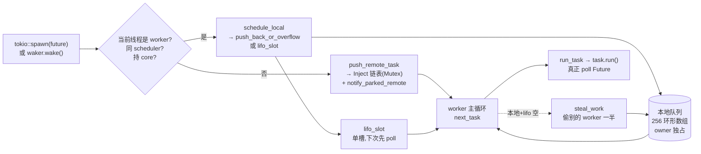

# 第 7 章 · work-stealing 调度器:偷工作的艺术

> **核心问题**:第 6 章我们把 worker 主循环立起来了——一个 `while` 循环,四拍:**tick → maintenance(推进 driver)→ 取 task poll → 没活就 park**。可这个循环的 ③ 拍"取 task",里头大有文章。一个 task 从被 `tokio::spawn` 到被某个 worker 真正 `poll`,中间走了哪些队列、谁决定它落在哪个 worker、本地队列和全局队列(injector)各自干嘛、为什么 tokio 要搞一套**不是教科书 Chase-Lev** 的定制无锁队列?
>
> 这一章我们钻进 multi-thread 调度器的**内部**,盯三件事:**① 一个 task 怎么进队**(本地队列 / injector,谁塞、塞哪)、**② worker 怎么出队**(自己的队列怎么 pop、空了怎么偷别人的)、**③ 那个无锁队列是怎么做到 owner 端 push/pop 和别人 steal 不加锁又正确的**。第三件是本章技巧精解的主角,也是全书最硬的 Rust 系统级代码之一。
>
> **读完本章你会明白**:
> - 一个 task 从 `spawn` 到被 `poll` 的**完整路径**:`spawn` → `Handle::schedule_task` →(判断当前线程是不是 worker)→ 本地队列 / injector → worker 主循环 `next_task` 取出来 → `run_task` poll。以及"为什么从外部线程 spawn 的 task 必走 injector"。
> - **本地队列(local run queue)**和**全局队列(injector)**的分工:本地队列是"worker 私有的快通道"、容量 256 的固定环形数组,无锁;injector 是"谁都来取的慢通道"、`Mutex` + 侵入式单链表。前者快但只服务自己,后者慢但能跨线程。
> - **work-stealing 的策略**:worker 本地空了,**随机挑一个 victim**(别的 worker),从它队列里**偷一半**(128 个)。为什么偷一半而不是一个?(摊薄 CAS 开销 + 缓存友好 + 让 victim 自己继续干活。)为什么随机起点?(避免所有 worker 都偷同一个 victim 形成热点。)
> - **tokio 的无锁队列不是 Chase-Lev**:教科书 Chase-Lev 是"单 head + 单 tail,steal 间靠 CAS 竞争"。tokio 用的是"**一个原子字里打包两个 head(steal head + real head)+ 一个独立 tail**",靠"steal head != real head"标志位**串行化并发 steal**(同一时刻只允许一个 stealer)。为什么这么改?——简化正确性证明、ABA 安全,代价是 steal 吞吐受限(但 tokio 的场景能接受)。
> - **overflow 的兜底**:本地队列 256 个满了怎么办?——**把后半 128 个 + 新 task 一起搬进 injector**(半数搬迁)。这套设计配合"从 injector 取回的 task 只落本地前半"的不变量,避免了"搬出去又被立刻搬回来"的死循环。
>
> **如果一读觉得太难**:先只记住三件事——① 一个 task 被 spawn,要么进 worker 的本地队列(如果是 worker 自己 spawn 的)、要么进 injector 全局队列(外部线程 spawn 的);② worker 本地空了,**随机挑一个同事,从他的队列偷一半**(128 个),偷不到再退回 injector 取;③ tokio 的队列是个**固定容量 256 的环形数组**,用一个原子字管理"谁在偷"和"head 在哪",**不是** Chase-Lev 那种纯单 head 设计。偷一半、overflow 搬迁、双 head 打包的细节看不懂可以先跳过,但要把"work-stealing = 本地优先 + 偷一半 + injector 兜底"这个直觉带走。

---

## 章首·一句话点破

> **调度器是一个餐厅派单系统:每个服务员(worker)手边有一摞自己的订单(本地队列,最多 256 张),前台还有一本谁都来取的总订单本(injector);服务员优先处理自己那摞,自己那摞空了就扭头看看同事——挑一个看起来忙的同事,从他手边那摞里**抽走一半**订单到自己这摞(偷一半,不是一张,因为抽一张和抽一半的代价差不多,但抽一半能让被偷的同事少被打扰好几次);同事们的订单摞靠一个精巧的无锁结构管理,服务员取自己的订单(owner pop)和同事来偷(steal)可以**同时进行不冲突**,靠的是"两个 head(谁在偷 + 真正的队头)塞进一个原子字"——这套设计不是教科书 Chase-Lev,是 tokio 自己定制的。**

这是**结论**。这一章倒过来拆:先看一个 task 从 spawn 到 poll 的完整路径,看清"本地队列 / injector / 偷工作"三个角色各在哪一步登场;再钻进本地队列的内部,看清那个"两个 head 打包 + 半数搬迁 + overflow 兜底"的定制无锁队列;最后落到 work-stealing 的全局策略上,看清"随机 victim + 偷一半 + 半数搜索门槛"这套组合拳为什么能避免缓存颠簸和偷空。

第 6 章结尾留了钩子:"主循环 ③ 拍的'取'里大有文章。" 这一章回答那个"取"。

---

## 一、task 从 spawn 到 poll:三段路径

先不碰队列内部,只追一个 task 在 multi-thread runtime 里从被 spawn 到被 poll 的完整路径。这是本章的地图。

### 1.1 第一段:spawn → schedule_task

第 5 章我们追过 `spawn` 到 `Handle::bind_new_task`,最后调 `me.schedule_option_task_without_yield(notified)`。那个 `schedule` 真正落到 multi-thread 的 `Handle` 上,走的是:

```rust
// tokio/src/runtime/scheduler/multi_thread/handle.rs(摘录)
fn schedule(&self, task: Notified<Self>) {
    self.schedule_task(task, false);
}
fn yield_now(&self, task: Notified<Self>) {
    self.schedule_task(task, true);   // is_yield=true
}
```

([tokio/src/runtime/scheduler/multi_thread/handle.rs:110-113](../tokio/tokio/src/runtime/scheduler/multi_thread/handle.rs#L110-L113))

`schedule_task` 是 multi-thread 调度器的**派单总入口**。看它的实现:

```rust
// tokio/src/runtime/scheduler/multi_thread/worker.rs(摘录)
pub(super) fn schedule_task(&self, task: Notified, is_yield: bool) {
    with_current(|maybe_cx| {
        if let Some(cx) = maybe_cx {
            // Make sure the task is part of the **current** scheduler.
            if self.ptr_eq(&cx.worker.handle) {
                // And the current thread still holds a core
                if let Some(core) = cx.core.borrow_mut().as_mut() {
                    self.schedule_local(core, task, is_yield);
                    return;
                }
            }
        }
        // Otherwise, use the inject queue.
        self.push_remote_task(task);
        self.notify_parked_remote();
    });
}
```

([tokio/src/runtime/scheduler/multi_thread/worker.rs:1327-1344](../tokio/tokio/src/runtime/scheduler/multi_thread/worker.rs#L1327-L1344))

读这段,**抓那个 `if-else` 分支**——它决定了 task 走哪条路:

- **快路径(本地队列)**:当前线程**是 worker**(`with_current` 拿得到 worker context)、**且属于同一个 scheduler**(`ptr_eq`)、**且还持有 core**(没被 shutdown / 换出)→ 调 `schedule_local`,task 进这个 worker 的**本地队列**(或 LIFO slot,第 8 章详拆)。
- **慢路径(injector)**:其他所有情况——外部线程(主线程、blocking_pool 线程)、跨 scheduler、worker 不持有 core → 调 `push_remote_task`(task 进 injector 全局队列)+ `notify_parked_remote`(叫醒一个睡着的 worker)。

> **钉死这件事**:这个分支揭示了一个根本设计——**worker 自己唤醒的 task,优先塞回自己的本地队列**(快,无锁);**外部线程唤醒的 task,只能塞 injector**(慢,要锁,但能跨线程)。这就是为什么 tokio 的 task 有"局部性"——一个 task 在 worker A 上 await 挂起,reactor 唤醒它时,如果恰好是 worker A 在 poll reactor(抢到了 driver 锁),它就回到 A 的本地队列,**A 的 cache 还热**,立刻接着 poll。这种"唤醒就近回原 worker"的设计,是 tokio 多线程性能的关键之一。

### 1.2 第二段:push_remote_task / schedule_local

两个落点,看各自的实现:

**injector 落点**(`push_remote_task`):

```rust
// tokio/src/runtime/scheduler/multi_thread/worker.rs(摘录)
fn push_remote_task(&self, task: Notified) {
    self.shared.scheduler_metrics.inc_remote_schedule_count();
    let mut synced = self.shared.synced.lock();
    unsafe { self.shared.inject.push(&mut synced.inject, task); }
}
```

([tokio/src/runtime/scheduler/multi_thread/worker.rs:1393-1397](../tokio/tokio/src/runtime/scheduler/multi_thread/worker.rs#L1393-L1397))

 injector 是 `Mutex<Synced>` + 侵入式单链表(`Synced` 里有 `head`/`tail` 两个 `RawTask` 指针,task 自带 `queue_next` 字段)。push 拿锁、链表尾插。注意 `Inject` 还有个 `len: AtomicUsize` 字段,**专门给 `is_empty()` 做 fast-path 判空**(空队列不抢锁):

```rust
// tokio/src/runtime/scheduler/inject/shared.rs(摘录)
pub(crate) struct Shared<T: 'static> {
    /// Number of pending tasks in the queue. This helps prevent unnecessary
    /// locking in the hot path.
    pub(super) len: AtomicUsize,
    _p: PhantomData<T>,
}
```

([tokio/src/runtime/scheduler/inject/shared.rs:9-15](../tokio/tokio/src/runtime/scheduler/inject/shared.rs#L9-L15))

注释明说 `len` 是"避免热路径抢锁"。worker 取 task 时先 `inject.is_empty()`(原子读 len),空就立刻返回不抢锁;只有非空才 lock + pop。

**本地队列落点**(`schedule_local`):

```rust
// tokio/src/runtime/scheduler/multi_thread/worker.rs(摘录)
fn schedule_local(&self, core: &mut Core, task: Notified, is_yield: bool) {
    core.stats.inc_local_schedule_count();

    // Spawning from the worker thread. If scheduling a "yield" then the
    // task must always be pushed to the back of the queue, enabling other
    // tasks to be executed. If **not** a yield, then there is more
    // flexibility and the task may go to the front of the queue.
    let should_notify = if is_yield || !core.lifo_enabled {
        core.run_queue.push_back_or_overflow(task, self, &mut core.stats);
        true
    } else {
        // Push to the LIFO slot
        let prev = core.lifo_slot.take();
        let ret = prev.is_some();
        if let Some(prev) = prev {
            core.run_queue.push_back_or_overflow(prev, self, &mut core.stats);
        }
        core.lifo_slot = Some(task);
        ret
    };

    if should_notify && core.park.is_some() {
        self.notify_parked_local();
    }
}
```

([tokio/src/runtime/scheduler/multi_thread/worker.rs:1353-1385](../tokio/tokio/src/runtime/scheduler/multi_thread/worker.rs#L1353-L1385))

读这段,**抓那个 lifo_slot 的分支**(第 8 章主角,本章先认个脸):

- 如果是 `yield_now`(任务主动让出)或 lifo 被禁用 → 走 `push_back_or_overflow`(塞本地队列尾部,满了 overflow)。
- 否则 → 新 task 进 `lifo_slot`(单槽,**下次第一个被 poll**),原 lifo_slot 里的 task 被"挤"进 `run_queue`(走 push_back_or_overflow)。这就是 tokio 的 **LIFO 优化**——刚被唤醒的任务(通常 cache 还热)优先跑,本章先知道有这么个东西,第 8 章详拆。

无论哪条分支,真正"塞本地队列"的入口都是 `push_back_or_overflow`——本章技巧精解的主角之一。

### 1.3 第三段:worker 取 task → poll

worker 主循环的 ③ 拍,入口是 `Core::next_task`:

```rust
// tokio/src/runtime/scheduler/multi_thread/worker.rs(摘录)
fn next_task(&mut self, worker: &Worker) -> Option<Notified> {
    if self.tick % self.global_queue_interval == 0 {
        self.tune_global_queue_interval(worker);
        worker.handle.next_remote_task()
            .or_else(|| self.next_local_task())
    } else {
        let maybe_task = self.next_local_task();
        if maybe_task.is_some() { return maybe_task; }
        if worker.inject().is_empty() { return None; }
        // 批量从 injector 取,塞本地队列前半
        let cap = usize::min(self.run_queue.remaining_slots(), self.run_queue.max_capacity() / 2);
        let n = usize::min(worker.inject().len() / worker.handle.shared.remotes.len() + 1, cap);
        let n = usize::max(1, n);
        let mut synced = worker.handle.shared.synced.lock();
        let mut tasks = unsafe { worker.inject().pop_n(&mut synced.inject, n) };
        let ret = tasks.next();          // 第一个直接返回
        self.run_queue.push_back(tasks); // 其余塞本地队列前半
        ret
    }
}
```

([tokio/src/runtime/scheduler/multi_thread/worker.rs:1062-1130](../tokio/tokio/src/runtime/scheduler/multi_thread/worker.rs#L1062-L1130))

这段的逻辑分两路,**由"是不是该看全局队列"决定**(`tick % global_queue_interval == 0`):

- **该看全局队列**(每隔 `global_queue_interval` 拍,默认随机化在 61 附近):先 `next_remote_task`(从 injector 取一个),取不到再 `next_local_task`(从本地队列 pop)。
- **不该看全局队列**(大多数拍):先 `next_local_task`(本地队列优先),本地空了再判断 injector——如果 injector 有货,**批量取一批**(n 个,塞本地队列前半)。

注意那个 `cap = max_capacity / 2 = 128`——从 injector 取回的 task **只落本地队列前半**。这是配合 overflow 搬迁的关键不变量(下一节详拆):**本地队列溢出时搬的是后半 128 个**,如果取回的 task 落在后半,会被立刻搬回 injector 形成死循环。所以"取回落前半、溢出搬走后半",两者咬合,避免了"刚取回又被搬走"。

`next_local_task` 的实现简短但关键:

```rust
// tokio/src/runtime/scheduler/multi_thread/worker.rs(摘录)
fn next_local_task(&mut self) -> Option<Notified> {
    self.lifo_slot.take().or_else(|| self.run_queue.pop())
}
```

([tokio/src/runtime/scheduler/multi_thread/worker.rs:1132-1134](../tokio/tokio/src/runtime/scheduler/multi_thread/worker.rs#L1132-L1134))

**先看 lifo_slot,再 pop 本地队列**。lifo_slot 里的 task 是"刚被唤醒的",优先 poll(cache 热)。本地队列空、lifo_slot 也空,`next_task` 返回 None,主循环进 ④ 拍——`steal_work` 或 park。

### 1.4 一张图:task 的完整流转

把上面三段拼起来,一个 task 在 multi-thread runtime 里的完整流转长这样:



> **钉死这件事**:task 的流转分**两条进队路径**(本地队列 / injector)和**两条出队路径**(本地 pop / 偷别人的)。worker 优先消费自己的本地队列(快、无锁、cache 热),空了才去偷或看 injector。这种"本地优先"是 work-stealing 调度器的**核心思想**——它的目标不是"公平地把 task 均摊到所有 worker",而是"**让每个 worker 尽量自给自足,只在失衡时才偷**"。本地队列是自给自足的菜园,偷工作是菜园空了去邻居家的应急。

---

## 二、本地队列:固定容量环形数组 + 双 head 打包

现在钻进本地队列(`Local` / `Inner`)的内部。这是本章技巧精解的主战场。

### 2.1 数据结构:不是 Chase-Lev

先看结构定义:

```rust
// tokio/src/runtime/scheduler/multi_thread/queue.rs(摘录)
pub(crate) struct Inner<T: 'static> {
    /// Concurrently updated by many threads.
    ///
    /// Contains two `UnsignedShort` values. The `LSB` byte is the "real" head of
    /// the queue. The `UnsignedShort` in the `MSB` is set by a stealer in process
    /// of stealing values. It represents the first value being stolen in the
    /// batch. The `UnsignedShort` indices are intentionally wider than strictly
    /// required for buffer indexing in order to provide ABA mitigation and make
    /// it possible to distinguish between full and empty buffers.
    ///
    /// When both `UnsignedShort` values are the same, there is no active
    /// stealer.
    ///
    /// Tracking an in-progress stealer prevents a wrapping scenario.
    head: AtomicUnsignedLong,

    /// Only updated by producer thread but read by many threads.
    tail: AtomicUnsignedShort,

    /// Elements
    buffer: Box<[UnsafeCell<MaybeUninit<task::Notified<T>>>; LOCAL_QUEUE_CAPACITY]>,
}
```

([tokio/src/runtime/scheduler/multi_thread/queue.rs:36-57](../tokio/tokio/src/runtime/scheduler/multi_thread/queue.rs#L36-L57))

这段注释是本章的灵魂。逐句拆:

**① "Contains two `UnsignedShort` values"** —— `head` 字段是个 `AtomicUnsignedLong`(64 位机器上是 `AtomicU64`),**里面装了两个 `u32`**(高 32 位 + 低 32 位)。

**② "The `LSB` byte is the 'real' head of the queue"** —— **低 32 位**是"真正的队头"(`real` head),owner pop 从这里取,代表"队列里下一个该被消费的位置"。

**③ "The `UnsignedShort` in the `MSB` is set by a stealer in process of stealing values"** —— **高 32 位**是"stealer 的占位"(`steal` head),stealer 开始偷时把它设成"我正偷到哪",偷完恢复成等于 real head。

**④ "When both values are the same, there is no active stealer"** —— `steal == real` 说明没有 stealer 在偷,队列"干净";`steal != real` 说明有 stealer 正在偷,**其他 stealer 看到这个状态就立刻退出**。

**⑤ "intentionally wider than strictly required ... ABA mitigation"** —— 这两个 `u32` 比实际索引需要的位数(8 位就够了,256 容量)宽得多,**专门用来防 ABA 问题**(下面详拆)。

`tail` 是个独立的 `AtomicUnsignedShort`(`AtomicU32`),**只有 owner 写**,但别的线程会读(stealer 要读 tail 算"队列里有多少 task 可偷")。

`buffer` 是**固定容量 256** 的环形数组,每个槽是个 `UnsafeCell<MaybeUninit<Notified>>`——`UnsafeCell` 因为多线程并发读写、`MaybeUninit` 因为槽位可能未初始化(没填过 task)。

容量常量:

```rust
// tokio/src/runtime/scheduler/multi_thread/queue.rs(摘录)
#[cfg(not(loom))]
const LOCAL_QUEUE_CAPACITY: usize = 256;
#[cfg(loom)]
const LOCAL_QUEUE_CAPACITY: usize = 4;

const MASK: usize = LOCAL_QUEUE_CAPACITY - 1;   // = 255
```

([tokio/src/runtime/scheduler/multi_thread/queue.rs:62-71](../tokio/tokio/src/runtime/scheduler/multi_thread/queue.rs#L62-L71))

`MASK = 255` 用来把单调递增的索引折回环形槽位:`idx = pos & MASK`(等效于 `pos % 256`,但位运算更快)。loom 测试时容量降到 4,好穷举各种状态。

#### 为什么不是 Chase-Lev

这里**必须**澄清,因为很多读者(甚至读过一些博客的)会以为 tokio 用的是 Chase-Lev deque。它**不是**。两者的关键差别:

```
   Chase-Lev deque(教科书设计):
   ┌─────────────────────────────────────────┐
   │  head: AtomicUsize  (stealer 改,多 stealer CAS 竞争)  │
   │  tail: AtomicUsize  (owner 改)                        │
   │  buffer: 环形数组                                      │
   └─────────────────────────────────────────┘
   特点:多个 stealer 同时 CAS head,失败的退避重试。
        高并发 steal 吞吐好,但正确性证明复杂(ABA、空满区分)。

   tokio deque(定制设计):
   ┌─────────────────────────────────────────┐
   │  head: AtomicU64                                      │
   │    ├─ 低32: real head(owner 改)                        │
   │    └─ 高32: steal head(stealer 改,同时只一个 stealer) │
   │  tail: AtomicU32  (owner 改)                          │
   │  buffer: 环形数组(容量 256)                           │
   └─────────────────────────────────────────┘
   特点:用 "steal != real" 标志位**串行化 steal**——同时只允许一个
        stealer 偷(其他看到标志位就退出)。简化正确性、ABA 安全,
        代价是 steal 吞吐受限(但 tokio 场景能接受)。
```

> **不这样会怎样(如果用 Chase-Lev)**:Chase-Lev 的经典坑是 **ABA 问题**——stealer A 读 head=5,正要 CAS(5→6),被抢;owner pop 了好几次又 push 回来,head 又变成 5;stealer A 的 CAS(5→6)错误地成功,偷到了**已经被消费过的槽位**。教科书 Chase-Lev 靠"让索引单调递增不回卷"来缓解,但仍要小心处理。tokio 用"双 head + 标志位"直接绕开了这个坑——**同时只有一个 stealer,根本不存在 A 的 CAS 被 B 的操作干扰的情况**(stealer 之间是串行的)。代价是 steal 不能并行,但 tokio 的场景里:worker 数量 = CPU 核数(通常 8~64),steal 频率不高(本地队列够大、偷一半),串行 steal 的代价可接受。
>
> 这是 tokio 一个值得讲的工程权衡:**牺牲理论上的 steal 并行度,换取实现的简单和正确性的强保证**。Rust 系统级代码特别看重"正确性能用 loom 穷举验证",而 Chase-Lev 的正确性证明极复杂,loom 测试起来也痛苦。tokio 的简化设计让 loom 能轻松覆盖所有状态。

### 2.2 owner push:`push_back_or_overflow`

看 owner 怎么往队列里塞 task。入口是 `push_back_or_overflow`(上面 schedule_local 调的):

```rust
// tokio/src/runtime/scheduler/multi_thread/queue.rs(摘录)
pub(crate) fn push_back_or_overflow<O: Overflow<T>>(
    &mut self,
    mut task: task::Notified<T>,
    overflow: &O,
    stats: &mut Stats,
) {
    let tail = loop {
        let head = self.inner.head.load(Acquire);
        let (steal, real) = unpack(head);
        // safety: this is the **only** thread that updates this cell.
        let tail = unsafe { self.inner.tail.unsync_load() };

        if tail.wrapping_sub(steal) < LOCAL_QUEUE_CAPACITY as UnsignedShort {
            // There is capacity for the task
            break tail;
        } else if steal != real {
            // Concurrently stealing, this will free up capacity, so only
            // push the task onto the inject queue
            overflow.push(task);
            return;
        } else {
            // Push the current task and half of the queue into the inject queue.
            match self.push_overflow(task, real, tail, overflow, stats) {
                Ok(_) => return,
                Err(v) => { task = v; }  // Lost the race, try again
            }
        }
    };
    self.push_back_finish(task, tail);
}
```

([tokio/src/runtime/scheduler/multi_thread/queue.rs:188-223](../tokio/tokio/src/runtime/scheduler/multi_thread/queue.rs#L188-L223))

这段有三个分支,**精确对应三种队列状态**:

**① 有容量**:`tail - steal < 256` → break 出循环,调 `push_back_finish` 塞进去。注意判容量用的是 `steal` 不是 `real`——因为"正在被偷走的"也算占着位置,不能重复塞。

**② 满了 + 有人正在偷**(`steal != real`):**只把当前 task 塞 injector**(`overflow.push`),不触发半数搬迁。为什么?——因为 stealer 正在偷走一批,马上会腾出位置,等它偷完就好了。如果此时再搬迁,会和 stealer 抢同一批 task,冲突。

**③ 满了 + 没人偷**(`steal == real`):调 `push_overflow` 做**半数搬迁**——把后半 128 个 + 新 task 一起搬进 injector。这是兜底机制,下面详拆。

> **钉死这件事**:`push_back_or_overflow` 的三个分支,本质是"队列满时怎么办"的三种策略。tokio 选的不是"阻塞等"(违背 async 哲学),也不是"无限扩容"(环形数组是定长的,扩容要重新分配),而是**"溢出到 injector"**——本地队列保持固定容量(256),溢出的部分进全局队列,等其他 worker / 自己从 injector 取回。这种"固定本地 + 全局兜底"的两级结构,是 tokio 调度器能扛海量并发的关键之一。

#### `unsync_load`:为什么 tail 可以非原子读

注意这行:`let tail = unsafe { self.inner.tail.unsync_load() };`——`unsync_load` 是个**非原子读**。这看着吓人(tail 是 `AtomicU32`,怎么能非原子读?),但它是 sound 的,因为:

> **`Local` 的契约**(queue.rs L28):`Local` 是 producer handle,**只能从单个线程使用**("May only be used from a single thread")。`tail` 字段的 doc 也明说:"Only updated by producer thread"。也就是说,**只有 owner 这一个线程写 tail**。既然只有一个 writer,owner 自己读自己写的值,**非原子读完全安全**——这就跟读普通 `u32` 一样,不需要原子指令(原子指令有 cache line 同步开销)。
>
> 这是无锁代码里"用类型契约换性能"的典范:**`Local` 类型在 API 层强制单线程使用**(它的方法都吃 `&mut self`,而 `&mut` 本身就排他),内部就能放开了用非原子读,省掉每次 push 的原子开销。其他线程要读 tail 怎么办?——走 `Steal` 类型(多线程读),那里用 `load(Acquire)` 原子读。**两种 handle,两种访问方式,靠类型隔离**。

### 2.3 owner pop:`Local::pop`(FIFO)

看 owner 怎么从自己队列取 task:

```rust
// tokio/src/runtime/scheduler/multi_thread/queue.rs(摘录)
/// Pops a task from the local queue.
pub(crate) fn pop(&mut self) -> Option<task::Notified<T>> {
    let mut head = self.inner.head.load(Acquire);

    let idx = loop {
        let (steal, real) = unpack(head);
        // safety: this is the **only** thread that updates this cell.
        let tail = unsafe { self.inner.tail.unsync_load() };

        if real == tail {
            // queue is empty
            return None;
        }

        let next_real = real.wrapping_add(1);

        // If `steal == real` there are no concurrent stealers. Both `steal`
        // and `real` are updated.
        let next = if steal == real {
            pack(next_real, next_real)
        } else {
            assert_ne!(steal, next_real);
            pack(steal, next_real)
        };

        // Attempt to claim a task.
        let res = self.inner.head
            .compare_exchange_weak(head, next, AcqRel, Acquire);
        match res {
            Ok(_) => break real as usize & MASK,
            Err(actual) => head = actual,
        }
    };
    Some(self.inner.buffer[idx].with(|ptr| unsafe { ptr::read(ptr).assume_init() }))
}
```

([tokio/src/runtime/scheduler/multi_thread/queue.rs:361-399](../tokio/tokio/src/runtime/scheduler/multi_thread/queue.rs#L361-L399))

**先纠正一个常见误解**:`pop` 是 **FIFO**(从 real head 端取),**不是 LIFO**。tokio 的 LIFO 行为来自外层的 `lifo_slot`(单槽),队列本身是 FIFO。这点很重要,下面 steal 也是从 head 端偷(队列同侧),所以"队列头"是"最先该被消费"的位置。

读这段 CAS 循环,**抓 `next` 的构造**:

```rust
let next = if steal == real {
    pack(next_real, next_real)    // 无并发 stealer:两个 head 一起推进
} else {
    assert_ne!(steal, next_real);
    pack(steal, next_real)        // 有 stealer:只推 real,steal 不动
};
```

- **没有并发 stealer**(`steal == real`):pop 推进 real head,**同时把 steal head 也推进到同一位置**(保持 `steal == real`,表示"仍然没有 stealer")。一次 CAS 改两个 u32。
- **有并发 stealer**(`steal != real`):pop **只推进 real**,steal 保持不动。这样 pop 和 steal 在队列两端各自工作,**不撞同一个槽位**——stealer 偷的是从 steal head 开始的一段,owner pop 的是 real head 那一个,两段不重叠(由 `assert_ne!(steal, next_real)` 保证 pop 不会追上 steal)。

`compare_exchange_weak(head, next, AcqRel, Acquire)` 抢这个槽位。失败(说明 stealer 改了 steal head)就重读 head 重试。CAS 成功后 `ptr::read` 把槽位里的 task 取出来(单 owner + 已 claim,安全)。

> **钉死这件事**:pop 的 CAS 有两种"next"构造,体现了"双 head 设计"的精髓——**steal head 和 real head 可以独立推进,也能一起推进,看有没有并发 stealer**。这种灵活性让 owner pop 和 stealer **真正并行**:stealer 从 steal head 端批量搬走 task(owner 看不到也碰不到),owner 从 real head 端继续 pop,两者在队列里操作的是**不重叠的区间**,只共享 head 这个原子字(靠 CAS 协调)。这就是为什么"两个 head 打包进一个原子字"能实现 lock-free 的 owner/stealer 并行。

### 2.4 半数搬迁:`push_overflow`

回到 push 的分支 ③——满了且没人偷时的兜底。看 `push_overflow`:

```rust
// tokio/src/runtime/scheduler/multi_thread/queue.rs(摘录,关键部分)
#[inline(never)]
fn push_overflow<O: Overflow<T>>(
    &mut self, task: task::Notified<T>,
    head: UnsignedShort, tail: UnsignedShort,
    overflow: &O, stats: &mut Stats,
) -> Result<(), task::Notified<T>> {
    /// How many elements are we taking from the local queue.
    /// one less than the number pushed to inject (also inserts `task`).
    const NUM_TASKS_TAKEN: UnsignedShort = (LOCAL_QUEUE_CAPACITY / 2) as UnsignedShort;
    // = 128

    assert_eq!(tail.wrapping_sub(head) as usize, LOCAL_QUEUE_CAPACITY,
        "queue is not full; tail = {tail}; head = {head}");

    // Claim all tasks. CAS 把 head 从 (head, head) 改成 (tail, tail)
    if self.inner.head
        .compare_exchange_weak(pack(head, head), pack(tail, tail), Release, Relaxed)
        .is_err()
    {
        return Err(task);  // Lost the race
    }

    // Add back the first half of tasks.
    self.inner.tail.store(tail.wrapping_add(NUM_TASKS_TAKEN), Release);

    // ... BatchTaskIter 迭代器:从 head+NUM_TASKS_TAKEN 起读后半 128 个 task ...

    let batch_iter = BatchTaskIter {
        buffer: &self.inner.buffer,
        head: head.wrapping_add(NUM_TASKS_TAKEN) as UnsignedLong,
        i: 0,
    };
    overflow.push_batch(batch_iter.chain(std::iter::once(task)));
    stats.incr_overflow_count();
    Ok(())
}
```

([tokio/src/runtime/scheduler/multi_thread/queue.rs:252-358](../tokio/tokio/src/runtime/scheduler/multi_thread/queue.rs#L252-L358),关键部分摘录)

这段是本章的高潮。逐句拆:

**① `NUM_TASKS_TAKEN = 128`** —— 容量的一半。

**② `assert!(tail - head == 256)`** —— 入口断言队列确实满了。这是 debug 检查,确认进入 overflow 路径的前提成立。

**③ 关键 CAS**:`compare_exchange_weak(pack(head, head), pack(tail, tail), Release, Relaxed)` —— 一次性把 `steal` 和 `real` 两个 head 都从 `head` 推到 `tail`。这个 CAS 干什么?——**宣称"整队都被我独占"**:推到 tail 意味着"real head 已经追上 tail",队列对外看起来是空的(其他线程读 head 看到 real==tail,以为没东西)。同时 `steal == real == tail`,也没 stealer。这一刻,owner 独占了整队。

**④ `tail.store(tail + 128, Release)`** —— 这一步最绕。`tail + 128`?tail 不是刚才还是"队列尾"吗?——是的,但这里 owner 要**把前 128 个 task 留下来**(从 head 到 head+128),让队列看起来"还有 128 个"。所以把 tail 推到 head+128+128 = tail+128(因为 tail = head+256)。这样队列对外呈现:[head, head+128) 这 128 个 task 还在,后面 128 个被搬走。

**⑤ 读后半 + 推 injector**:`BatchTaskIter` 从 `head + 128` 起读 128 个 task(此时已被前面 CAS 独占,安全 `ptr::read`),加上新 task,`overflow.push_batch` 推进 injector。

> **为什么搬后半而不是前半?** 注释(L300-L306)解释:"从 injector 取回的 task 总是落在前半"。回想 `next_task` 里 `cap = max_capacity/2 = 128` 的限制——从 injector 取回的 task 只塞前半。所以**前半是"刚从 injector 取回的 task 的家",后半是"会被 overflow 搬走的牺牲品"**。这样保证了"取回的 task 不会被立刻搬回 injector"——咬合的两个不变量。
>
> **钉死这件事**:`push_overflow` 是 tokio 队列"满了怎么办"的兜底机制。它的精妙在于:用一个 CAS 把整个队列**临时私有化**(head 推到 tail),然后**保留前半、搬走后半 + 新 task**。这套"半数搬迁"策略比"满了就扩容"好——固定容量保证了缓存友好(256 个槽 = 几 KB,正好几个 cache line),扩容要重新分配 + 拷贝,代价大;也比"满了就阻塞"好——overflow 到 injector 让别的 worker 能立刻接手,不阻塞当前 worker。这是无锁队列"用全局兜底保本地固定容量"的标准做法。

---

## 三、work-stealing:偷工作的策略

本地队列内部讲清了,现在看 worker 怎么偷别人。主循环 ④ 拍的 `steal_work`:

```rust
// tokio/src/runtime/scheduler/multi_thread/worker.rs(摘录)
/// Function responsible for stealing tasks from another worker
///
/// Note: Only if less than half the workers are searching for tasks to steal
/// a new worker will actually try to steal. The idea is to make sure not all
/// workers will be trying to steal at the same time.
fn steal_work(&mut self, worker: &Worker) -> Option<Notified> {
    if !self.transition_to_searching(worker) {
        return None;
    }

    let num = worker.handle.shared.remotes.len();
    // Start from a random worker
    let start = self.rand.fastrand_n(num as u32) as usize;

    for i in 0..num {
        let i = (start + i) % num;
        // Don't steal from ourself! We know we don't have work.
        if i == worker.index { continue; }
        let target = &worker.handle.shared.remotes[i];
        if let Some(task) = target.steal
            .steal_into(&mut self.run_queue, &mut self.stats)
        {
            return Some(task);
        }
    }

    // Fallback on checking the global queue
    worker.handle.next_remote_task()
}
```

([tokio/src/runtime/scheduler/multi_thread/worker.rs:1138-1169](../tokio/tokio/src/runtime/scheduler/multi_thread/worker.rs#L1138-L1169))

读这段,**抓三个策略**:

**策略一:半数搜索门槛**(`transition_to_searching`)。注释明说:"Only if less than half the workers are searching ... a new worker will actually try to steal."。源码在 `Idle::transition_worker_to_searching`:

```rust
// tokio/src/runtime/scheduler/multi_thread/idle.rs(摘录)
pub(super) fn transition_worker_to_searching(&self) -> bool {
    let state = State::load(&self.state, SeqCst);
    if 2 * state.num_searching() >= self.num_workers {
        return false;
    }
    State::inc_num_searching(&self.state, SeqCst);
    true
}
```

([tokio/src/runtime/scheduler/multi_thread/idle.rs:104-115](../tokio/tokio/src/runtime/scheduler/multi_thread/idle.rs#L104-L115))

**只有"搜索中的 worker 数 < 总数的一半",才允许新 worker 加入搜索**。为什么?——**防止所有 worker 同时偷造成缓存颠簸**。设想 8 核机器,8 个 worker 同时本地空了,都去偷——它们会去抢别的 worker 的 head 原子字,8 个核同时 CAS 同一个 cache line,cache line 在核之间疯狂传递(thrashing),性能塌方。tokio 的对策:**最多让一半 worker 偷**,另一半直接 park(等被叫醒)。这样偷的并发度被限制,cache 颠簸可控。

**策略二:随机起点**(`fastrand_n(num)`)。从随机选的 victim 开始,轮询一圈 `(start + i) % num`,跳过自己。**随机化避免所有 worker 都从 worker 0 开始偷形成热点**——如果都从 0 开始,worker 0 的队列会被瞬间掏空,而 worker 7 没人理。随机起点让偷的负载天然分散。

**策略三:偷不到兜底 injector**(`next_remote_task`)。所有 victim 都偷空了,fallback 到全局队列取。这保证 injector 里的 task 一定能被某个 worker 取到。

### 3.1 偷一半:`Steal::steal_into`

看真正的偷取逻辑。外层 `steal_into`:

```rust
// tokio/src/runtime/scheduler/multi_thread/queue.rs(摘录)
/// Steals half the tasks from self and place them into `dst`.
pub(crate) fn steal_into(
    &self, dst: &mut Local<T>, dst_stats: &mut Stats,
) -> Option<task::Notified<T>> {
    let dst_tail = unsafe { dst.inner.tail.unsync_load() };

    // To the caller, `dst` may **look** empty but still have values
    // contained in the buffer. If another thread is concurrently stealing
    // from `dst` there may not be enough capacity to steal.
    let (steal, _) = unpack(dst.inner.head.load(Acquire));

    if dst_tail.wrapping_sub(steal) > LOCAL_QUEUE_CAPACITY as UnsignedShort / 2 {
        // we *could* try to steal less here, but for simplicity, we're just going to abort.
        return None;
    }

    // Steal the tasks into `dst`'s buffer. This does not yet expose the tasks in `dst`.
    let mut n = self.steal_into2(dst, dst_tail);
    if n == 0 { return None; }

    dst_stats.incr_steal_count(n as u16);
    dst_stats.incr_steal_operations();

    // We are returning a task here
    n -= 1;
    let ret_pos = dst_tail.wrapping_add(n);
    let ret_idx = ret_pos as usize & MASK;
    let ret = dst.inner.buffer[ret_idx]
        .with(|ptr| unsafe { ptr::read((*ptr).as_ptr()) });

    if n == 0 {
        // The `dst` queue is empty, but a single task was stolen
        return Some(ret);
    }
    // Make the stolen items available to consumers
    dst.inner.tail.store(dst_tail.wrapping_add(n), Release);
    Some(ret)
}
```

([tokio/src/runtime/scheduler/multi_thread/queue.rs:417-468](../tokio/tokio/src/runtime/scheduler/multi_thread/queue.rs#L417-L468))

抓两个关键:

**① 目标队列容量检查**:`dst_tail - steal > 128` 就放弃。注释明说"we're just going to abort"——如果目标队列(自己的本地队列)已经超过半满,就不偷了,避免把自己撑爆。这是"偷一半"策略的**反向约束**:不只看 victim 有多少可偷,也看自己有多少容量接。

**② 两阶段暴露**:steal_into2 先把偷来的 task 写进 dst 的 buffer,**但不更新 dst.tail**(对其他线程不可见);最后才 `dst.tail.store(dst_tail + n, Release)` 一次性发布。返回的 task 从末尾取(`ret_pos = dst_tail + n - 1`),所以即便只偷到 1 个也能正确返回而不必更新 tail。这个两阶段是为了"原子地暴露一批 task"——要么全暴露,要么都不暴露,不会出现"暴露一半"。

核心 CAS 在 `steal_into2`:

```rust
// tokio/src/runtime/scheduler/multi_thread/queue.rs(摘录,关键部分)
fn steal_into2(&self, dst: &mut Local<T>, dst_tail: UnsignedShort) -> UnsignedShort {
    let mut prev_packed = self.0.head.load(Acquire);
    let mut next_packed;

    let n = loop {
        let (src_head_steal, src_head_real) = unpack(prev_packed);
        let src_tail = self.0.tail.load(Acquire);

        // If these two do not match, another thread is concurrently stealing.
        if src_head_steal != src_head_real { return 0; }

        // Number of available tasks to steal
        let n = src_tail.wrapping_sub(src_head_real);
        let n = n - n / 2;   // ← 偷一半

        if n == 0 { return 0; }

        // Update the real head index to acquire the tasks.
        let steal_to = src_head_real.wrapping_add(n);
        assert_ne!(src_head_steal, steal_to);
        next_packed = pack(src_head_steal, steal_to);

        // Claim all those tasks. By doing this, no other thread is able
        // to steal from this queue until the current thread completes.
        let res = self.0.head
            .compare_exchange_weak(prev_packed, next_packed, AcqRel, Acquire);
        match res {
            Ok(_) => break n,
            Err(actual) => prev_packed = actual,
        }
    };

    // ... 拷贝 n 个 task 从 src 到 dst(无原子,已独占)...

    // Update `src_head_steal` to match `src_head_real` signalling that the
    // stealing routine is complete.
    loop {
        let head = unpack(prev_packed).1;
        next_packed = pack(head, head);
        let res = self.0.head
            .compare_exchange_weak(prev_packed, next_packed, AcqRel, Acquire);
        match res {
            Ok(_) => return n,
            Err(actual) => prev_packed = actual,
        }
    }
}
```

([tokio/src/runtime/scheduler/multi_thread/queue.rs:472-562](../tokio/tokio/src/runtime/scheduler/multi_thread/queue.rs#L472-L562),关键部分摘录)

这是本章最复杂的函数,但只要抓**三个原子操作**就懂:

**操作一:容量检查 + 看到"有人在偷"就退出**(L482-484):
```rust
if src_head_steal != src_head_real { return 0; }
```
读 head,如果 `steal != real`,说明已经有别的 stealer 在偷这个队列,**立刻 return 0**。这就是"串行化 steal"——同一时刻只有一个 stealer 能偷一个队列。

**操作二:第一个 CAS,设 stealer 占位**(L503-508):
```rust
let steal_to = src_head_real.wrapping_add(n);
next_packed = pack(src_head_steal, steal_to);  // 注意 src_head_steal 还是原值
// CAS:pack(src_head_steal, src_head_real) → pack(src_head_steal, steal_to)
compare_exchange_weak(prev_packed, next_packed, AcqRel, Acquire)
```
这个 CAS **只推进 real head**(从 `src_head_real` 到 `steal_to = src_head_real + n`),steal head **不动**。CAS 成功后,`steal != real`(`steal = src_head_real`,`real = src_head_real + n`),**其他 stealer 看到这个状态立刻退出**——独占。同时 owner 的 pop 仍可继续(它从 real 端 pop,会推进 real,但 steal 不动,两者不冲突)。

**操作三:拷贝完后,第二个 CAS 释放占位**(L548-557):
```rust
loop {
    let head = unpack(prev_packed).1;       // 读当前 real
    next_packed = pack(head, head);          // 让 steal 追平 real
    compare_exchange_weak(prev_packed, next_packed, AcqRel, Acquire)
    // 失败 → actual 重试
}
```
偷完后,把 steal head 追平 real head(`pack(head, head)`),宣布"我偷完了",释放对队列的 stealer 独占。其他 stealer 现在可以来偷了。

中间 L514-534 的拷贝循环**无原子操作**——因为 src 那段 [src_head_real, steal_to) 已被第一个 CAS 独占(其他 stealer 进不来,owner pop 不会进这段——它从 real 端,real 已经被推进到 steal_to 之后),dst 是 owner 私有。所以拷贝是纯内存操作,无竞争。

> **钉死这件事**:steal_into2 的三段式(**检查 → CAS 占位 → 拷贝 → CAS 释放**)是"双 head 设计"的完整展示。它的精妙在于:**steal head 既是"独占标志"(steal != real 时独占),又是"进度指针"(steal 到哪了)**。一个字段两种用途,靠 CAS 原子切换。这套设计让"同时只一个 stealer"这个串行化约束,完全靠 head 字段的位状态表达,不需要额外的锁或标志位。这就是为什么 tokio 没用 Chase-Lev——它的"双 head"是更巧妙的"串行化 + 进度跟踪"一体化设计。

### 3.2 偷一半为什么不是偷一个

回到策略问题:**为什么偷一半(128 个),不偷一个?**

> **不这样会怎样(如果偷一个)**:worker A 空了,从 B 偷一个 task。A poll 完这一个,又空了,再去 B 偷一个……如此反复。每次偷 = 一次跨核 CAS(改 B 的 head 原子字)+ 一次跨核 cache miss(读 B 的 buffer)。如果 A 长期空、B 长期满,A 会变成"偷取狂魔",每秒几万次跨核操作,把 B 所在核的 cache line 打爆。
>
> 偷一半,一次 CAS + 一次 cache miss 把 128 个 task 搬过来,A 接下来能自己 poll 128 次(无跨核),期间 B 不被打扰。**摊薄了跨核开销**。这跟"批量比单个高效"是同一个道理(批处理摊薄固定开销)。
>
> **那为什么不偷全部?** 偷全部 = 把 B 掏空,B 自己接下来就空了,又得去偷别人——颠簸。偷一半是平衡:**A 拿到足够多的活自给自足,B 还剩一半能继续干**,两者都舒服。

这是 work-stealing 调度器的经典权衡("偷一半"由 MIT 的 Cilk 首创,tokio 沿用)。它体现了 work-stealing 的核心理念:**偷是补救失衡的手段,不是常规操作**。理想状态下,每个 worker 自给自足(本地队列不断),只在偶发失衡时才偷,而且一偷就偷够本。

---

## 技巧精解:双 head 打包 + 半数搬迁 + Overflow 兜底

这一节把本章三个最硬核的技巧拆透。

### 技巧一:双 head 打包进一个原子字——串行化 steal + 进度跟踪一体化

#### 这套设计在解决什么

无锁 work-stealing deque 的核心难点是:**owner 和多个 stealer 并发操作队列,如何不加锁又正确**。具体三个需求:

1. owner push/pop 不阻塞。
2. 多个 stealer 并发偷,不冲突。
3. owner 和 stealer 并发,不冲突(同一槽位不被两人取)。

#### 反面对比 A:单 head(Chase-Lev)

```rust
// 简化示意,非源码原文:Chase-Lev
struct ChaseLev {
    head: AtomicUsize,    // stealer 改
    tail: AtomicUsize,    // owner 改
    buffer: [UnsafeCell<Task>; 256],
}
```

> **不这样会怎样**:Chase-Lev 让多个 stealer 直接 CAS head 竞争——失败的退避重试。问题:
> - **ABA 风险**:stealer A 读 head=5,被抢;owner 连续 push/pop,head 又回到 5;A 的 CAS(5→6)误成功。Chase-Lev 用"单调递增索引 + 容量翻倍"缓解,但正确性证明复杂。
> - **steal 间竞争**:N 个 stealer 同时 CAS head,失败的浪费 CPU,cache line 在核间颠簸。
> - **loom 难测**:状态空间大,穷举测试痛苦。

#### 反面对比 B:每个 stealer 一把锁

> **不这样会怎样**:每来一个 stealer 就 lock 一下队列,串行偷。问题:**steal 变成阻塞操作**——stealer A 拿着锁偷,B 来了得等 A 释放。这违背 work-stealing "偷要快"的要求(偷本身不能成为瓶颈)。

#### 正解:双 head 打包 + 串行化 steal

tokio 把 head 拆成两个 u32(steal + real)塞进一个 AtomicU64:

```
   head: AtomicU64
   ┌─────────────────────────────────────────────────────────┐
   │  高 32 位: steal head(stealer 占位/进度)                 │
   │  低 32 位: real head(owner pop 推进、stealer 偷时推进)    │
   └─────────────────────────────────────────────────────────┘

   状态机(由 steal 和 real 的相等性决定):
   ┌──────────────────────────────────────────────────────┐
   │ steal == real  →  无 stealer,队列"干净"                │
   │                  owner pop: 两个 head 一起推进           │
   │                  stealer 进入: 设 steal = real,real += n │
   │                                                       │
   │ steal != real  →  有 stealer 正在偷(独占)              │
   │                  其他 stealer: 看到 → 立刻退出(return 0)│
   │                  owner pop: 只推 real,steal 不动         │
   │                  (pop 和 steal 在队列两端,不撞)         │
   └──────────────────────────────────────────────────────┘
```

**精妙之处**:

- **"steal != real"既表示"有 stealer",又表示"steal 到了 real 这么远"**——一个位状态,两种语义。
- **owner pop 在有 stealer 时只推 real**,保证不撞 stealer 正在偷的区间;在没 stealer 时两个 head 一起推,保持"干净"状态。
- **ABA 安全**:steal head 和 real head 都是单调递增(`wrapping_add`,64 位机器上 u32 要 2^32 次操作才回卷,实际不可能),不存在"head 回到原值导致 CAS 误成功"。而且**同时只一个 stealer**,根本没有"A 的 CAS 被 B 干扰"的情况。
- **loom 友好**:状态空间小(steal/real 相等/不等两种大状态),穷举测试覆盖容易。

> **钉死这件事**:tokio 的双 head 设计是"**用串行化换简单性**"的典范。它放弃了 Chase-Lev 的"多 stealer 并行偷"能力(同时只允许一个 stealer),换来的是:ABA 自然免疫、正确性证明简单、loom 可穷举。这个权衡在 tokio 的场景里划算——worker 数 = CPU 核数(8~64),steal 频率不高(本地队列够大、偷一半),串行 steal 的吞吐瓶颈不会触顶。如果换成"百万 stealer"的场景,Chase-Lev 可能更优,但 tokio 不在那场景。**工程上的"最优"永远是"在具体场景下的最优",不是理论上的最优**。

### 技巧二:半数搬迁(overflow)——固定容量 + 全局兜底

#### 这套设计在解决什么

本地队列容量固定(256),满了怎么办?三种选择:

1. 阻塞等(违背 async)。
2. 扩容(重新分配 + 拷贝,大对象昂贵)。
3. 溢出到全局队列(tokio 的选择)。

#### 反面对比:扩容

```rust
// 简化示意,非源码原文:反面,满了扩容
struct BadQueue {
    buffer: Vec<UnsafeCell<Task>>,   // 动态数组
    cap: AtomicUsize,
}
// push 满了 → buffer = bigger_vec; copy all; (所有线程都要同步看到新 buffer)
```

> **不这样会怎样**:扩容要求"所有线程看到新 buffer 的地址",这要么用 `Arc` 切换(原子指针 + 旧 buffer 等 stealer 退出后 drop,复杂),要么用锁(阻塞)。而且 256→512→1024 的扩容,在突发大量 task 时频繁触发,每次都拷贝,代价大。更糟的是,扩容后的 buffer 不再固定大小,缓存局部性下降(预取器不知道边界)。

#### 正解:固定 256 + overflow 半数搬迁

tokio 的做法:**buffer 永远 256,满了把后半 128 个搬进 injector**。优点:

- **固定容量**:256 = 几 KB,正好几个 cache line;预取器友好;内存布局稳定。
- **搬迁是摊薄开销**:只有在"本地真的满了"才搬,而且一次搬 128 个(批处理),摊到每个 task 的搬迁成本极低。
- **全局兜底**:injector 是无界链表(`Mutex<Synced>`),能装任意多溢出的 task,不会丢。

关键不变量(防死循环):

> **从 injector 取回的 task 只落本地前半(`next_task` 里 cap = 128);overflow 搬迁的是后半。** 两者咬合——取回的 task 落前半,前半不会被 overflow 搬走;overflow 搬走的是后半,后半不会被 `next_task` 直接取(它取前半)。所以"取回又被搬走"的死循环不存在。

> **钉死这件事**:固定容量 + overflow 是 tokio 在"缓存友好"(固定 256)和"无界容量"(injector 兜底)之间的优雅折中。这种"本地固定小队列 + 全局无界大队列"的两级结构,是 work-stealing 调度器的标配(Java 的 ForkJoinPool、Go 的 GMP 模型都是类似思路)。tokio 的特色是"半数搬迁"——一次搬一半,既给 injector 喂够货(让别的 worker 能取到),又给本地留一半(自己能继续干)。

### 技巧三:`unsync_load`——用类型契约换原子开销

#### 这套设计在解决什么

`tail` 是 `AtomicU32`,但 owner 读它时用 `unsync_load`(非原子读)。为什么能这么做?

#### 关键:`Local` 类型的单线程契约

```rust
// tokio/src/runtime/scheduler/multi_thread/queue.rs(摘录)
/// Producer handle. May only be used from a single thread.
pub(crate) struct Local<T: 'static> {
    inner: Arc<Inner<T>>,
}
```

([tokio/src/runtime/scheduler/multi_thread/queue.rs:28-31](../tokio/tokio/src/runtime/scheduler/multi_thread/queue.rs#L28-L31))

注释明说 "May only be used from a single thread"。`Local` 的方法都吃 `&mut self`,而 `&mut` 在 Rust 里**排他**——编译器保证同一时刻只有一个线程持有 `&mut Local`。所以 `Local` 的方法体里访问 `tail`,**只有一个线程在写**(`push_back` 写)+ **同一个线程读**(`pop` / `push_back_or_overflow` 读)。单线程内,自己读自己写的值,**非原子读完全安全**——就像读普通 `u32`,不需要原子指令。

> **不这样会怎样(如果用原子读)**:`tail.load(Acquire)` 在 x86 上要发 `MFENCE` 或 `LOCK` 前缀(虽然 Acquire 在 x86 上是 no-op,但编译器仍可能插入屏障),在 ARM 上要 `dmb ish`。每次 push/pop 多几纳秒,百万 task 累加,开销可见。tokio 用 `unsync_load` 把这个开销省了。
>
> **sound 性**:`unsync_load` 是 unsafe,因为编译器不知道"真的只有一个线程访问"。tokio 在 `Local` 的 API 层(单线程契约)+ `&mut self`(编译期排他)双重保证下,这个 unsafe 是 sound 的。这是 Rust "用类型系统把 unsafe 关进笼子"的范例:**unsafe 标在 `unsync_load` 内部,但 sound 性由 `Local` 的类型契约 + `&mut self` 在外部保证**。

> **钉死这件事**:`unsync_load` 体现了 tokio "在类型契约允许的地方,勇敢地省原子开销"的风格。这是 Rust 系统级代码的典型优化——**不是无脑用最强的原子操作,而是根据访问模式选最轻的**。本书第 5 章 task 状态字的 ref_inc 用 Relaxed、ref_dec 用 AcqRel(第 4 章详拆),也是同一个思路:**排序需求看具体场景,不一刀切**。

---

## 章末小结

### 用"餐厅服务员"比喻回顾本章

1. **每个服务员手边一摞自己的订单(本地队列)** —— 固定 256 张的环形数组,无锁,服务员**独占**。push(pop)在自己这摞上,快得飞起。满了(256 张)就把**后半 128 张 + 新订单**搬到前台总订单本(injector)。
2. **前台总订单本(injector)** —— 谁都来取的链表,`Mutex` + `AtomicUsize len`(len 用来空队列不抢锁)。外部线程(主线程、blocking pool)spawn 的 task 走这;worker 本地溢出了也走这。
3. **派单总入口 `schedule_task`** 看当前线程:**是 worker 且持 core → 塞本地队列(快);否则 → 塞 injector + 叫醒一个睡着的同事**。
4. **取订单 `next_task`** 优先自己那摞(`next_local_task`,FIFO + lifo_slot);自己空了,**随机挑一个同事,从他手边那摞偷一半**(128 张)——偷一半是为了"一偷够本、少打扰同事";随机起点是为了"别所有服务员都偷同一个"。
5. **本地队列的管理靠"两个 head 塞进一个原子字"** —— 一个 head 记"真正的队头",另一个 head 记"谁在偷到哪了"。两个相等表示"没人在偷",不等表示"有同事正在偷一摞(独占)"。**这套不是 Chase-Lev**,是 tokio 定制的——放弃了"多人同时偷"换"实现简单 + ABA 安全"。
6. **半数搜索门槛** —— 同时最多一半服务员去偷,另一半直接打盹。防止"8 个服务员同时偷同一个"把缓存打爆。

### 本章在全书主线中的位置

记住全书的二分法:**调度执行(让就绪的任务跑) vs 事件唤醒(让等待的任务不空耗、就绪了再叫)**。

本章服务的是**调度执行**那一面——更具体说,是**"调度器内部怎么管理 task 队列、怎么把 task 派给 worker"**这一面。task 在第 5 章被造出来(`spawn` → 堆上的 Cell),它的"被排队、被取、被偷"全在这一章。worker 主循环的 ③ 拍(`next_task`)和 ④ 拍(`steal_work`),就是本章拆的两件事。

本章把 multi-thread 调度器的内部讲透了,但**留了两个钩子给后面**:

- **LIFO slot**:`schedule_local` 里那个"刚唤醒的 task 优先跑"的单槽,本章只点到,第 8 章详拆(它是 current-thread vs multi-thread 对比的重要差异点)。
- **budget**:`run_task` 里包的 `coop::budget`,本章完全没碰,第 9 章主角(它逼 task 让出,是协作式调度的兜底)。

而 current-thread 模式没有 work-stealing、没有本地队列(只有一个全局队列),它的调度器是 multi-thread 的"简化版"——第 8 章对比两模式时会说清。

### 五个"为什么"清单

1. **一个 task 从 spawn 到被 poll 走了哪些路?**:`spawn` → `Handle::schedule_task` → 判断当前线程:**是 worker 且持 core → `schedule_local`(进本地队列或 lifo_slot)**;**否则 → `push_remote_task`(进 injector)+ notify_parked_remote**。worker 主循环 `next_task` 取出来 → `run_task` → `task.run()`(poll Future)。
2. **本地队列和 injector 各干什么?**:本地队列是 worker 私有的快通道,256 容量环形数组,无锁,只服务 owner 自己;injector 是全局慢通道,`Mutex` + 侵入式单链表 + `AtomicUsize len`,谁都来取,跨线程/外部线程的 task 必走这。worker 优先本地,空了才看 injector 或偷别人。
3. **tokio 的本地队列为什么不是 Chase-Lev?**:Chase-Lev 是"单 head + 单 tail,多 stealer CAS 竞争",ABA 风险大、正确性复杂、loom 难测。tokio 用"双 head(steal + real)塞进一个 AtomicU64 + 独立 tail",靠 `steal != real` 标志位**串行化 steal**(同时只一个 stealer)。代价是 steal 不能并行,但 tokio 场景(worker 数 = 核数、steal 不频繁)能接受;收益是 ABA 自然免疫、loom 可穷举、实现简单。
4. **为什么偷一半不偷一个?**:偷一个 = 每偷一次一次跨核 CAS + cache miss,worker 长期空时会变"偷取狂魔"打爆 victim 的 cache。偷一半 = 一次开销搬 128 个,接下来 worker 自给自足 poll 一阵,期间不打扰 victim。但也不偷全部(会让 victim 立刻空、又得去偷,颠簸)。半数是"两者都舒服"的平衡,源自 MIT Cilk。
5. **本地队列满了怎么办?**:固定容量 256 不扩容,走 **overflow 半数搬迁**——把后半 128 个 + 新 task 一起搬进 injector。关键不变量:**从 injector 取回的 task 只落本地前半**(next_task cap=128),overflow 搬走的是后半,两者咬合,避免"取回又被搬走"死循环。这种"固定本地 + 全局兜底"是 work-stealing 调度器标配。

### 想继续深入,该往哪钻

- **本章引用的核心源码(按重要度排)**:
  - [`tokio/src/runtime/scheduler/multi_thread/queue.rs`](../tokio/tokio/src/runtime/scheduler/multi_thread/queue.rs) —— **本章灵魂**。`Inner` 结构 + head 字段的设计注释(L36-57,必读)、`Local`/`Steal` handle(L28-34)、`LOCAL_QUEUE_CAPACITY=256`(L62-71)、`pack`/`unpack`(L585-597)、`push_back`(L139-180)、`push_back_or_overflow`(L188-223)、`push_overflow`(L252-358,半数搬迁)、`pop`(L361-399)、`steal_into`(L417-468)、`steal_into2`(L472-562,三段式 CAS)。**这一份文件,是无锁 work-stealing queue 的极致实现**。
  - [`tokio/src/runtime/scheduler/multi_thread/worker.rs`](../tokio/tokio/src/runtime/scheduler/multi_thread/worker.rs) —— `next_task`(L1062-1130)、`next_local_task`(L1132-1134,lifo_slot 优先)、`steal_work`(L1138-1169,随机 victim + 偷一半)、`schedule_task`(L1327-1344,本地/injector 分支)、`schedule_local`(L1353-1385,lifo_slot 交互)、`push_remote_task`/`next_remote_task`(L1387-1405)、`notify_parked_local`/`notify_parked_remote`(L1441-1457)、`Overflow for Handle`(L1520-1533)。
  - [`tokio/src/runtime/scheduler/multi_thread/idle.rs`](../tokio/tokio/src/runtime/scheduler/multi_thread/idle.rs) —— `Idle`/`Synced` 结构(L9-24)、状态位段(L26-31,UNPARK_SHIFT=16)、`transition_worker_to_searching`(L104-115,半数门槛)、`worker_to_notify`(L51-82,叫醒策略)、`dec_num_searching`(L181-184)。
  - [`tokio/src/runtime/scheduler/inject/shared.rs`](../tokio/tokio/src/runtime/scheduler/inject/shared.rs) + [`synced.rs`](../tokio/tokio/src/runtime/scheduler/inject/synced.rs) + [`inject.rs`](../tokio/tokio/src/runtime/scheduler/inject.rs) —— injector 全局队列:`Inject`(inject.rs L21-26)、`Shared`(shared.rs L9-15,len 原子)、`Synced`(synced.rs L8-17,链表 head/tail)、`push`/`pop_n`(shared.rs L68-120)。
  - [`tokio/src/runtime/scheduler/multi_thread/handle.rs`](../tokio/tokio/src/runtime/scheduler/multi_thread/handle.rs) —— `schedule`/`yield_now`(L110-113,派单入口)。
- **用 `loom` 验证队列正确性**:tokio 在 `tokio/src/runtime/scheduler/multi_thread/queue.rs` 的 `#[cfg(test)]` 模块里有一大批 loom 测试(`loom_local.rs`、`loom_steal.rs` 等),穷举 push/pop/steal 各种交错。想真正理解"双 head 设计为什么 sound",读这些测试用例,它们把所有竞态都列出来了。loom 容量故意设为 4(常量 LOCAL_QUEUE_CAPACITY 的 loom cfg),就是为了穷举。
- **用 `tokio-console` 观察 work-stealing**:`tokio-console` 能看到每个 worker 的 steal 次数、本地队列长度、injector 长度。跑一个"故意不均衡"的 workload(比如只有 worker 0 上 spawn 大量 task),看其他 worker 怎么偷,直观感受 work-stealing。
- **对比其他 work-stealing 实现**:Java 的 `ForkJoinPool`(双端队列 + 偷一半,Chase-Lev 变种)、Go 的 GMP(本地 P 的 runnext slot + 全局 schedt.runq,跟 tokio 的 lifo_slot + injector 同源思路)。读它们的源码,会发现"本地优先 + 偷一半 + 全局兜底"是工业界共识,tokio 的"双 head"是它独树一帜的简化。
- **下一站**:multi-thread 调度器的内部讲透了——本地队列、injector、偷工作、双 head 无锁队列。可 tokio 还有**另一种模式**:`current_thread`(单线程)。它为什么存在?省了什么、丢了什么?两种模式在 LIFO slot、driver 独占/共享上的差别是什么?翻开 **第 8 章 · current-thread vs multi-thread:两种运行时模式的取舍**——我们对比两模式,讲清 LIFO slot、injector、driver 独占这些设计在两模式下的不同表现。

---

> work-stealing 讲透了:本地队列无锁(双 head 打包)、injector 全局兜底、偷一半、随机 victim、半数搜索门槛。可这套是 multi-thread 的戏——tokio 还有个 current-thread 模式,它没 work-stealing、没本地队列,为什么还要存在?两种模式到底差在哪?翻开 **第 8 章 · current-thread vs multi-thread:两种运行时模式的取舍**。
