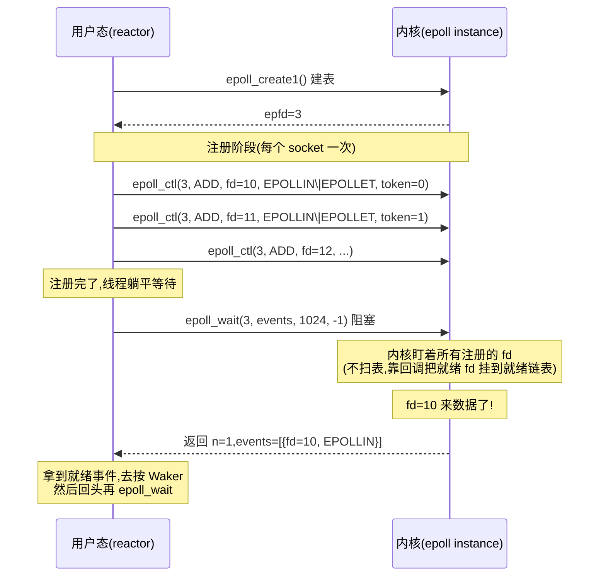

# 第 10 章 · mio 与 epoll:事件驱动的底座

> **核心问题**:第 4 章讲透了 Waker——挂起的 task 凭一张可复印的"呼叫器"被叫醒。可那张呼叫器按下去之后,**事件到底从哪儿来**?谁在那一头盯着成千上万个 socket、能在"数据来了"的瞬间按下呼叫器?答案是 OS 内核里的**多路复用**机制:Linux 的 **epoll**、BSD/macOS 的 **kqueue**、Windows 的 **IOCP**。一个 OS 线程,凭什么能**同时**盯住十万个 socket 而不把它们一个个轮询一遍?epoll 这个名字(tokio/mio 一切 I/O 的底座)到底在做什么?为什么 mio 选了 **edge-triggered(边缘触发)**,不选听上去更省心的 level-triggered(水平触发)?
>
> 这一章我们只盯一件事:**那一声"3 号菜好了"是从哪个系统里喊出来的、怎么喊出来的**。读完本章,你脑子里要能放出一张图:一根 worker 线程,蹲在 `epoll_wait` 上睡着了,内核在某个 socket 有数据的瞬间把它踹醒、把"哪个 fd、什么事件"塞给它,它拿到这批事件转头去按 Waker。
>
> **读完本章你会明白**:
> - 为什么"一根线程同时等十万个 socket"不是魔法,而是 OS 多路复用机制(epoll/kqueue/IOCP)提供的**系统调用**——它的模型是"先注册兴趣、再批量等事件",而不是"挨个 read 看哪个不堵"。
> - epoll 的三件套(`epoll_create1` / `epoll_ctl` / `epoll_wait`)分别在干什么、为什么这个组合能"O(1) 等到事件、O(就绪数) 返回"。
> - mio 怎么把 epoll/kqueue/IOCP 三套截然不同的系统调用,封装成一个统一的 `Poll` / `Registry` / `Token` 接口,让 tokio 只需要对着一个抽象写代码。
> - **edge-triggered vs level-triggered** 这个总纲钦定的核心技巧:为什么 mio 在 epoll 上硬塞 `EPOLLET`、在 kqueue 上硬塞 `EV_CLEAR`,而不选听上去更稳的 level-triggered——以及这个选择逼出来的那条铁律:**"读到 EAGAIN 才能 stop"**。
>
> **如果一读觉得太难**:先只记住三件事——① "epoll 就是 OS 给你的一张大表,你把想等的 fd 全注册进去,然后一个 syscall 同时等它们";② "epoll_wait 一次能返回一批就绪事件,不是一个一个问";③ "mio 选了 edge-triggered,意思是'状态一变就喊你一次、之后不再催',所以你得自己把数据读干净,不然就会漏事件"。这三个点是后面第 11、12 章的地基,看不懂内核细节先记这三条。

---

## 章首·一句话点破

> **epoll 是 OS 给用户态的一台"自动叫号机":你把所有想等的 socket 编上号(Token)、告诉它"这几个我等可读、那几个我等可写",然后你往 `epoll_wait` 里一躺;哪个 socket 状态变了,内核就踹醒你一次、把"几号、变了啥"塞给你。你拿着这批号码,转头去按对应的呼叫器(Waker)。mio,就是把这台叫号机在 Linux/macOS/Windows 三种长相各异的实现,封装成一个统一形状的 Rust crate。**

这是**结论**。这一章倒过来拆:先从"没有 epoll 会怎样"看起——看一遍遍 `read` 每个 socket 是怎么把 CPU 烧光的,看 select/poll 这俩老古董是怎么卡在 O(n) 上的;再把 epoll 的三个 syscall 掰开,看清它凭什么 O(1) 等事件;然后落到 mio 源码,看它怎么用一层极薄的抽象盖住 epoll/kqueue/IOCP 三套底;最后拆"为什么选 edge-triggered"——这一节是本章的硬骨头,也是 tokio 整个 reactor 设计的命脉。

第 4 章结尾留了个钩子:Waker 被按下去之后,事件从哪儿来。这一章回答:**从 epoll 来**。

---

## 一、先看反面:不用多路复用,一根线程怎么盯海量 socket

要理解 epoll 凭什么长那样,得先看清"不这么干会怎样"。这一节是本章的地基——epoll 的整个设计,就是**为了同时躲开下面三条路的坑**。

### 反面一:阻塞式挨个 read(== thread-per-connection)

最朴素的"盯一堆 socket":一个线程,一个 for 循环,挨个 `read`。

```c
// 简化示意,非源码原文:朴素的阻塞轮询
while (1) {
    for (int i = 0; i < n_sockets; i++) {
        int n = read(sockets[i], buf, sizeof buf);   // 卡在这!
        handle(buf, n);
    }
}
```

> **不这样会怎样**:第 0 章拆过这条路的死穴——`read` 在没数据时**阻塞**,于是第一个 socket 没数据,整个线程就钉死在那,后面 99999 个 socket 连看一眼的机会都没有。**你"串行地"等海量 socket,等于只等了第一个。**

这条路死在**"阻塞"和"挨个"水火不容**——只要你阻塞,就排除了"挨个"的可能性。

### 反面二:非阻塞挨个 read(== 忙轮询,纯烧 CPU)

既然阻塞不行,那就把所有 socket 设成**非阻塞**(`O_NONBLOCK`),没数据就立刻返回 `EAGAIN`,然后挨个问一遍。

```c
// 简化示意,非源码原文:非阻塞忙轮询
while (1) {
    for (int i = 0; i < n_sockets; i++) {
        int n = read(sockets[i], buf, sizeof buf);
        if (n == -1 && errno == EAGAIN) continue;   // 这个没数据,问下一个
        handle(buf, n);
    }
}
```

> **不这样会怎样**:这回到了第 2 章"反面·忙等轮询"在 syscall 层的样子——**CPU 100% 占着,疯狂地问十万个 socket "有数据吗",99999 个回答 EAGAIN,只有一个真有数据**。一秒钟把这个循环跑一百万次,99.9999% 的 syscall 是白调的。CPU 全烧在"问、没、问、没"上,真正干活的极少。而且每个 `read` syscall 都要**陷入内核**——一次 syscall 几百纳秒,十万个 socket 跑一遍就是几十毫秒,根本追不上数据的真实到达速度。

这条路死在**"不知道哪个 socket 有数据,只能挨个问"**——问的代价是 syscall,问十万个就是十万个 syscall。

### 反面三:老的 select/poll——O(n) 扫描,扛不住十万并发

OS 早就意识到这个问题,上世纪就给了 `select`(BSD 1983)和 `poll`(SVR3)。它们允许你**一次 syscall 同时检查多个 fd**:

```c
// 简化示意,非源码原文:POSIX select
fd_set readfds;
FD_ZERO(&readfds);
for (int i = 0; i < n_sockets; i++) FD_SET(sockets[i], &readfds);
select(max_fd + 1, &readfds, NULL, NULL, NULL);   // 阻塞到至少一个就绪
for (int i = 0; i < n_sockets; i++) {
    if (FD_ISSET(sockets[i], &readfds)) handle(sockets[i]);
}
```

> **不这样会怎样**:听起来不错——一次 syscall 等所有 fd,不用忙轮询了。但 select/poll 有两个致命问题:
>
> 1. **每次调用都要把"全部 fd 列表"重新传进内核**。十万个 fd,每次 syscall 都要把这十万个 fd 从用户态拷到内核态——光这次拷贝就是几十 MB 的内存搬运。然后内核**挨个**扫这十万个 fd,看哪个就绪。**等待是 O(1) 的(有事件就醒),但检查是 O(总 fd 数) 的**。十万个 fd 里只有 10 个就绪,内核也得扫完十万次。
> 2. **返回后,用户态还得再扫一遍**——`FD_ISSET` 一个个查,这十万次又是 O(n)。**一次 select 调用,O(n) 出现两次**(一次内核扫描,一次用户态扫描),十万个 fd 就是二十万次操作。

| 反面 | 死穴 | 想要的 |
|------|------|--------|
| 阻塞挨个 read | 阻塞和"挨个"互斥,只等了第一个 | 不阻塞、能同时等多个 |
| 非阻塞忙轮询 | 不知道谁有数据,CPU 全烧在问上 | OS 主动告诉你"谁有数据",别问 |
| select/poll | 每次扫描 O(总 fd 数),拷贝整张表 | 只关心"就绪的 fd",扫描代价 O(就绪数) |

### 三条反面,夹出一个需求

把三条路的死穴摆一起,需求呼之欲出:

> **我们要一种"先把所有想等的 fd 注册一次,之后每次等待只返回'就绪的那批',代价 O(就绪数) 而不是 O(总 fd 数),并且不拷贝整张表"的机制。**

这就是 epoll(以及 kqueue、IOCP)的使命。

> **比喻回到餐厅**:你不想让服务员挨桌问"菜好了吗"(忙轮询),也不想服务员被一桌卡死(阻塞挨个),更不想餐厅经理每次都把所有订单重新读一遍(select/poll 的 O(n))。你想要的,是一套**呼叫系统**:
> - 每张订单在创建时,**领一个呼叫器**(注册 fd),告诉呼叫系统"这单好了按一下";
> - 服务员平时在传菜口**睡觉**(线程 park 在 epoll_wait 上);
> - 任何一桌菜好了,呼叫系统**主动**把服务员叫醒、**塞给他一张"今天哪些桌好了"的小纸条**(就绪事件列表);
> - 服务员照着纸条,挨个去上菜(按 Waker),不用问别的桌。
>
> 这套呼叫系统,在 OS 内核里,就叫 epoll(Linux)/ kqueue(BSD/macOS)/ IOCP(Windows)。tokio 的 reactor,就是用 mio 这层薄封装,把这套呼叫系统接进了 async 世界。

---

## 二、epoll 的三件套:为什么这个组合能 O(1) 等事件

epoll 在 Linux 内核里,本质是**一个内核对象(在内核里维护的一张就绪检测表)+ 三个 syscall**。这三个 syscall 各司其职,合起来完成了"注册一次、批量等待"的全部需求。

### 三件套

| syscall | 作用 | 调用频率 |
|---------|------|----------|
| `epoll_create1(flags)` | 在内核里**建一张表**(epoll instance),返回一个 fd 代表它 | 整个进程生命周期调一次 |
| `epoll_ctl(epfd, op, fd, event)` | 往这张表里**增/删/改**一个监听项:"fd=42,我等它的可读" | 每个 socket 注册/注销时调一次 |
| `epoll_wait(epfd, events, maxevents, timeout)` | **蹲在这张表上**,有事件(或超时)就返回一批就绪事件 | reactor 主循环里反复调 |



### 为什么 epoll 不像 select 那样 O(n) 扫描

这是 epoll 设计最妙的地方,值得专门讲清。

select/poll 的模型是"**用户告诉内核一个 fd 列表,内核挨个检查**"——内核**不知道**哪些 fd 你关心,每次都得重新扫一遍。所以代价 O(总 fd 数)。

epoll 的模型是"**内核维护一张长期存在的关心表**,每个注册的 fd 在内核里都有一个对应的 epitem,挂在这张表上"。关键在于,**内核不是靠扫描这张表发现就绪的**——它靠**回调**:

- 每个 socket 在内核里本来就是一个 `struct file`,有自己的等待队列;
- `epoll_ctl(ADD)` 时,内核给这个 socket 的等待队列**挂上一个回调函数**(`ep_poll_callback`);
- 当这个 socket 有数据到达(网卡中断 → 协议栈把数据塞进 socket 接收缓冲区 → 唤醒这个 socket 的等待队列),**回调函数被自动触发**,把这个 socket 对应的 epitem **塞进 epoll instance 的"就绪链表"**;
- `epoll_wait` 做的事极其简单:**看就绪链表是不是空**,空就睡,非空就把链表上的 epitem 拷到用户态、清空链表、返回。

> **钉死这件事(epoll 为什么 O(1))**:`epoll_wait` 不扫所有 fd,它只看**就绪链表**。链表上有几个就返回几个,代价是 O(就绪数)。十万个 fd 里只有 10 个就绪,`epoll_wait` 只处理这 10 个,**完全不知道另外 99990 个的存在**。而"哪个 fd 该进就绪链表"是**靠 socket 自己的回调**主动挂进去的——所以 epoll 的等待代价和总 fd 数无关。这正是 epoll 击败 select/poll 的物理根源。

这个"用回调代替扫描"的设计,是 Linux 2.6(2002 年)引入 epoll 的核心创新。它让"一根线程盯十万 fd"从理论上的灾难,变成现实中 CPU 占用几乎为零的常规操作。

> **补一句**:kqueue(BSD/macOS)用类似机制(每个 kevent 也是一个长期存在的监听项),IOCP(Windows)则是"completion"模型(你提交 read 请求,内核做完了通知你),三者模型不同但目标一致。mio 把这三者封进一个抽象,后文拆。

### epoll_event:内核塞给你的"就绪小纸条"

`epoll_wait` 返回的每个事件,长这样(C struct):

```c
struct epoll_event {
    uint32_t events;   // 就绪的事件位:EPOLLIN / EPOLLOUT / EPOLLERR / ...
    uint64_t data;     // 你注册时塞进去的那个 u64——Token 就藏在这
} __attribute__((packed));
```

注意第二个字段 `data`——这是个"用户自定义数据",你 `epoll_ctl(ADD)` 时塞进去什么,事件来了内核就原样还给你什么。**这就是 mio `Token` 的物理载体**:你把 `Token(0x1234)` 注册进去,事件来了你拿到一个 `epoll_event`,它的 `data` 就是 `0x1234`,你立刻知道"是哪个 socket 好了"。

> **钉死这件事(Token 的本质)**:epoll 不返回"哪个 fd 就绪",它返回的是"**你当初注册时绑的那个 u64**"。这给了用户态一个自由度——这个 u64 你想当什么用都行。mio 的选择是:**把它当一个小整数 token,作为用户态"fd → 等待者"映射表的下标**。这一节先点到"事件里带一个用户给的 u64",下一章详拆"tokio 怎么用这个 u64 + slab 做 O(1) 映射回 task"。

---

## 三、mio:把 epoll/kqueue/IOCP 三套长相,封装成一张统一面孔

epoll(Linux)、kqueue(BSD/macOS)、IOCP(Windows)是三套**模型都不同**的系统调用:

- epoll/kqueue 是 **readiness(就绪)** 模型:"fd 好了告诉你,你自己去 read";
- IOCP 是 **completion(完成)** 模型:"你先提交 read 请求,我做完了连数据一起告诉你"。

这俩模型的 API 形态、参数语义、事件结构全不一样。可 tokio 不能为每个 OS 写一套 reactor——它需要一套**跨平台**的抽象。这套抽象,就是 **mio**(tokio 的 I/O 底层依赖,独立仓库 `tokio-rs/mio`,当前版本 1.2.1)。

> **餐厅比喻的延伸**:不同餐厅的后厨通讯系统不一样——有的用对讲机(epoll),有的用 LED 屏(kqueue),有的服务员得自己跑去窗口取(IOCP)。但服务员(reactor)只想要一个统一接口:"**给我一份'今天哪些桌好了'的清单**"。mio 就是那个把各种后厨系统翻译成统一清单的**前台翻译**。

### mio 的核心三件套:`Poll` / `Registry` / `Token`

mio 暴露给上层的 API 极简,就三个核心类型:

```rust
// mio/src/poll.rs(摘录)
pub struct Poll {
    registry: Registry,
}

pub struct Registry {
    selector: sys::Selector,
    // ...
}
```

([mio/src/poll.rs:269-279](../mio/src/poll.rs#L269-L279))

- **`Poll`**:一个 epoll/kqueue/IOCP 实例的句柄。`Poll::new()` 在底层调 `epoll_create1`(Linux)或 `kqueue()`(BSD/macOS),建一张内核表。整个 reactor 生命周期里只有一个 `Poll`。
- **`Registry`**:`Poll` 的"注册台"——你想让某个 fd 被监听,就 `registry.register(&mut source, token, interest)`。底层调 `epoll_ctl`。
- **`Token(usize)`**:一个用户自定义的小整数,绑在 fd 上。事件来了,`Event::token()` 给你这个数,你拿它映射回等待者。

```rust
// mio/src/token.rs(摘录)
#[derive(Copy, Clone, Debug, PartialEq, Eq, PartialOrd, Ord, Hash)]
pub struct Token(pub usize);
```

([mio/src/token.rs:145-147](../mio/src/token.rs#L145-L147))

为什么 `Token` 是个 `pub usize`?因为它的全部价值就是**当数组下标**。mio 不知道你这个 token 指向什么(那是用户态的事),它只负责"你给我什么、事件来了我还你什么"。具体"token → 哪个 task 在等"的映射,是 tokio 在上层用 slab 做的(下一章详拆)。

### `Poll::poll`:reactor 主循环的入口

`Poll::poll` 是 reactor 的心脏——它阻塞在 `epoll_wait` 上,等一批事件回来:

```rust
// mio/src/poll.rs(摘录)
pub fn poll(&mut self, events: &mut Events, timeout: Option<Duration>) -> io::Result<()> {
    self.registry.selector.select(events.sys(), timeout)
}
```

([mio/src/poll.rs:440-442](../mio/src/poll.rs#L440-L442))

就一行——`Poll::poll` 几乎是个 passthrough(透传),真正干活的是 `selector.select`。而 `selector` 是 `sys::Selector`,这是个**平台相关的类型别名**:在 Linux 上它是 `sys::unix::selector::epoll::Selector`,在 macOS 上是 `sys::unix::selector::kqueue::Selector`,在 Windows 上是 `sys::windows::Selector`。mio 用 Rust 的 `cfg` 把这三者无缝切换,上层代码完全感知不到。

### 平台分支:`sys` 模块的 cfg 派发

看 mio 怎么用 cfg 做平台派发:

```rust
// mio/src/sys/mod.rs(摘录,简化展示分支逻辑)
#[cfg(unix)]
mod unix;          // Linux/Android 走 epoll, BSD/macOS 走 kqueue
#[cfg(windows)]
mod windows;       // IOCP
```

([mio/src/sys/mod.rs](../mio/src/sys/mod.rs))

在 `sys/unix/selector/` 目录下,mio 又用一层 cfg 把 epoll 和 kqueue 切开:Linux/Android 编译 `epoll.rs`,BSD 家族编译 `kqueue.rs`。两个文件里都定义了一个 `struct Selector`、都有 `new` / `register` / `reregister` / `deregister` / `select` 五个同名方法——**这就是 Rust 的 cfg 派发**:上层代码写 `selector.select(...)`,编译时根据目标平台把它编译成 epoll 的 `select` 还是 kqueue 的 `select`。

> **钉死这件事(mio 的抽象层次)**:mio 是一层**极薄**的抽象。它不是"在 epoll 之上造一个新的更高级的 API",而是"把 epoll/kqueue/IOCP 三套 syscall,翻译成一套命名一致、语义对齐的 Rust trait/struct"。它的 `Poll::poll` 几乎直接转发给 `epoll_wait`;它的 `Registry::register` 几乎直接转发给 `epoll_ctl`。mio 自己**几乎不持有运行时状态**(就一个 fd),所有复杂性都在 OS 内核里。这种"薄到几乎透明"的抽象,是 mio 能在百万并发下零开销的关键——它不引入任何额外的锁、队列、分配。

### 一张表看清 mio 的三个平台后端

```
                   mio::Poll / Registry / Token  (统一抽象)
                          │
            ┌─────────────┼─────────────┐
            ↓             ↓             ↓
       ┌─────────┐   ┌─────────┐   ┌─────────┐
       │ epoll   │   │ kqueue  │   │ IOCP    │
       │ (Linux) │   │(BSD/mac)│   │(Windows)│
       └─────────┘   └─────────┘   └─────────┘
            │             │             │
   epoll_create1      kqueue()    CreateIoCompletionPort
   epoll_ctl          kevent()    GetQueuedCompletionStatusEx
   epoll_wait         kevent()    PostQueuedCompletionStatus
            │             │             │
       EPOLLET         EV_CLEAR     (completion)
       (edge)          (edge)       (无 trigger 概念)
            │             │
            └──────┬──────┘
                   ↓
         token 藏在 epoll_event.data / kevent.udata
         (都是用户给的 u64 / intptr_t)
```

注意表格最下面:epoll 的 `EPOLLET` 和 kqueue 的 `EV_CLEAR` **是 mio 硬塞进去的**——这就是下一节要拆的 edge-triggered 选择。IOCP 没有 trigger 概念(completion 模型不需要),所以那格是空的。

---

## 四、源码精读:mio 怎么调 epoll

光说抽象不够,我们跟到 mio 的 epoll 后端源码,看每个 syscall 怎么落地。这是本章最具体的源码部分。

### `Selector::new`:建 epoll 实例

```rust
// mio/src/sys/unix/selector/epoll.rs(摘录)
pub struct Selector {
    #[cfg(debug_assertions)]
    id: usize,
    ep: OwnedFd,           // epoll 实例的 fd
}

impl Selector {
    pub fn new() -> io::Result<Selector> {
        // SAFETY: `epoll_create1(2)` ensures the fd is valid.
        let ep = unsafe {
            OwnedFd::from_raw_fd(syscall!(epoll_create1(libc::EPOLL_CLOEXEC))?)
        };
        Ok(Selector {
            #[cfg(debug_assertions)]
            id: NEXT_ID.fetch_add(1, Ordering::Relaxed),
            ep,
        })
    }
}
```

([mio/src/sys/unix/selector/epoll.rs:19-35](../mio/src/sys/unix/selector/epoll.rs#L19-L35))

几个细节值得拆:

1. **`ep: OwnedFd`**——mio 用 `OwnedFd`(Rust 1.63+ 的标准库类型)来持有 epoll 的 fd。`OwnedFd` 在 drop 时自动 `close(fd)`,这用 Rust 的类型系统保证了"epoll 实例不会泄漏 fd"——一个典型的 RAII 包装。这是 mio 把 unsafe syscall 关进类型笼子的范例。
2. **`EPOLL_CLOEXEC`**——`exec` 子进程时自动关掉这个 fd,防止泄漏给子进程。这是系统编程的标准 hygiene。
3. **`syscall!(...)` 宏**——mio 自己的宏,封装"调 libc 函数、检查返回值、`EINTR` 时重试"。系统调用都长一个样(返回 `-1` 表示出错、`errno` 带错误码),这个宏把样板代码消除掉。
4. **`debug_assertions` 下的 `id`**——只在 debug 构建里给每个 Selector 一个唯一 id,用来在跨 Poll 检测时报告"你把这个 source 注册到了错误的 Poll 上"。release 构建里这个字段不存在,零开销。这是 Rust 条件编译做"debug 工具零 release 成本"的范例。

### `Selector::select`:`epoll_wait` 的薄包装

```rust
// mio/src/sys/unix/selector/epoll.rs(摘录)
pub fn select(&self, events: &mut Events, timeout: Option<Duration>) -> io::Result<()> {
    let timeout = timeout
        .map(|to| {
            // `Duration::as_millis` truncates, so round up. This avoids
            // turning sub-millisecond timeouts into a zero timeout.
            libc::c_int::try_from(
                to.checked_add(Duration::from_nanos(999_999))
                    .unwrap_or(to)
                    .as_millis(),
            )
            .unwrap_or(libc::c_int::MAX)
        })
        .unwrap_or(-1);     // -1 = 永远等到有事件

    events.clear();
    syscall!(epoll_wait(
        self.ep.as_raw_fd(),
        events.as_mut_ptr(),
        events.capacity() as i32,
        timeout,
    ))
    .map(|n_events| {
        // This is safe because `epoll_wait` ensures that `n_events` are assigned.
        unsafe { events.set_len(n_events as usize) };
    })
}
```

([mio/src/sys/unix/selector/epoll.rs:46-74](../mio/src/sys/unix/selector/epoll.rs#L46-L74))

逐段拆:

**timeout 处理**:`Option<Duration>` → `c_int`。`None` 映射成 `-1`(epoll_wait 见到 -1 就无限等),`Some(d)` 映射成毫秒数。注意那个 `checked_add(Duration::from_nanos(999_999))`——这是**向上取整**。为什么?因为 `as_millis()` 是向下截断,一个 1.5ms 的 timeout 会被截成 1ms,而一个 0.5ms 的会被截成 0ms——`epoll_wait` 看到 0 就立刻返回(非阻塞),完全不是用户想要的"等 0.5ms"。mio 加 999999 纳秒(约 1ms)再截断,保证 "用户要等 d,d 小于 1ms 也至少等 1ms"。

**events 复用**:`events: &mut Events` 是调用者传进来的、可复用的缓冲区(`Vec<epoll_event>`)。`events.clear()` + `events.set_len(n_events)` 这套是 `Vec` 的 unsafe API——`set_len` 假设底层的 `epoll_wait` 已经把前 `n_events` 个元素填好了。这是 Rust 里"用 Vec 当 syscall 的输出缓冲"的标准 unsafe 模式:**只要 syscall 真的填了那么多字节,`set_len` 就是 sound 的**。mio 的注释 `// This is safe because epoll_wait ensures that n_events are assigned` 就是在论证这个 sound 性。

> **钉死一件事(为什么复用 events 缓冲)**:reactor 主循环每秒可能调 `epoll_wait` 几万次,每次返回一批事件。如果每次都 `Vec::new()` 分配一个新缓冲,就是几万次堆分配——而堆分配在多线程下要走全局分配器的锁,代价不小。mio 让调用者**传一个 `&mut Events` 进来复用**,`Vec::with_capacity(1024)` 一次,之后每次 `clear()` + `set_len()` 重用同一块内存。**这是 mio 在 reactor 热路径上零分配的关键技巧之一。**

### `Selector::register`:`epoll_ctl` 的薄包装 + Token 怎么塞进去

```rust
// mio/src/sys/unix/selector/epoll.rs(摘录)
pub fn register(&self, fd: RawFd, token: Token, interests: Interest) -> io::Result<()> {
    let mut event = libc::epoll_event {
        events: interests_to_epoll(interests),
        u64: usize::from(token) as u64,        // ← Token 塞进 data 字段!
        #[cfg(target_os = "redox")]
        _pad: 0,
    };

    let ep = self.ep.as_raw_fd();
    syscall!(epoll_ctl(ep, libc::EPOLL_CTL_ADD, fd, &mut event)).map(|_| ())
}
```

([mio/src/sys/unix/selector/epoll.rs:76-86](../mio/src/sys/unix/selector/epoll.rs#L76-L86))

这一段最关键的是第二行:`u64: usize::from(token) as u64`。**Token 是怎么从用户态流到内核、再流回来的?就在这里**:

- 注册时:`token.0`(一个 usize)转成 u64,塞进 `epoll_event.u64`;
- 内核把这个 `epoll_event` 存进它那张表;
- 事件来了,内核把同一个 `epoll_event` 拷回用户态;
- 用户态拿到 `event.u64`,转回 `Token`——就是 [`sys::event::token`](../mio/src/sys/unix/selector/epoll.rs#L156-L158) 干的事:

```rust
// mio/src/sys/unix/selector/epoll.rs(摘录)
pub fn token(event: &Event) -> Token {
    Token(event.u64 as usize)
}
```

([mio/src/sys/unix/selector/epoll.rs:156-158](../mio/src/sys/unix/selector/epoll.rs#L156-L158))

> **钉死这件事(Token 的完整旅程)**:`Token` 是一个 `pub usize`,它从 `registry.register(source, Token(42), ...)` 出发 → mio 把它塞进 `epoll_event.u64` → `epoll_ctl` 告诉内核"fd=10 绑这个 u64" → 内核存着 → 数据来了,内核把同一个 u64 还回来 → mio `Event::token()` 取出来 → 上层拿到 `Token(42)` → 知道"是 42 号在等"。**Token 全程没有被内核"理解",它只是一个不透明的 u64 passenger**。这个"不透明乘客"的设计,是 epoll 给用户态的最大自由度——你想塞什么塞什么,mio 塞 token,别的库可以塞 fd、塞指针、塞任意业务 id。

### `interests_to_epoll`:Interest 位图 → epoll 事件位

最后一个细节,看 mio 的 `Interest` 怎么翻译成 epoll 的事件位:

```rust
// mio/src/sys/unix/selector/epoll.rs(摘录)
fn interests_to_epoll(interests: Interest) -> u32 {
    let mut kind = EPOLLET;                    // ← 永远塞 EPOLLET!

    if interests.is_readable() {
        kind = kind | EPOLLIN | EPOLLRDHUP;
    }

    if interests.is_writable() {
        kind |= EPOLLOUT;
    }

    if interests.is_priority() {
        kind |= EPOLLPRI;
    }

    kind as u32
}
```

([mio/src/sys/unix/selector/epoll.rs:129-145](../mio/src/sys/unix/selector/epoll.rs#L129-L145))

**第一行 `let mut kind = EPOLLET;`**——这一行是本章技巧精解的主角。`EPOLLET` 就是"edge-triggered"那个 flag,mio 在**每一个**注册里都硬塞它。这一行的存在,意味着 mio 永远不会用 level-triggered——它铁了心走 edge。

为什么这么选?这正是下面"技巧精解"的全部主题。

---

## 技巧精解:edge-triggered vs level-triggered——为什么 mio 铁了心选 edge

这一节是本章的硬核,把 epoll 的两种触发模式彻底拆透,配反面对比,让 mio 选 edge 的妙处显形。这是本章总纲钦定的主角技巧。

### 先把两种 trigger 说清楚

epoll 监听一个 fd 时,有两种"什么时候告诉你"的模式:

#### level-triggered(水平触发,LT)

"只要 fd **处于**就绪状态,就一直告诉你"。

具体说:socket 接收缓冲区里**还有数据没读完**,每次 `epoll_wait` 都会返回这个 fd 的 `EPOLLIN` 事件——直到你把数据读完、缓冲区空了,它才不返回。

> **比喻**:服务员每次回传菜口,只要"3 号桌的菜还摆在传菜口没端走",传菜口就**反复**喊"3 号好了 3 号好了",直到你把菜端走。

#### edge-triggered(边缘触发,ET)

"只在 fd **从不就绪变成就绪**的那一刻,告诉你**一次**"。

具体说:socket 接收缓冲区**从空变成非空**的那一瞬间(网卡把数据塞进来的那一刻),触发一次 `EPOLLIN`;之后即使你**没读完**(缓冲区还有数据),`epoll_wait` 也不会再为这个 fd 返回事件——**它只通知"状态变了"这一次**。

> **比喻**:服务员每次回传菜口,**只有"3 号桌的菜刚摆上来的那一瞬间"喊一次**"3 号好了",之后菜就算一直在那摆着、没人端,他也不再喊。你想知道还有没有菜,得自己去看。

### 为什么这个差别致命

两种模式,差别看不大,但**用法完全不同**——这正是初学者最容易踩坑的地方。

#### level-triggered 的陷阱:看着省心,实则催命

level-triggered 听上去特别省心:"只要还有数据,你就一直告诉我"——那我就算没读完,下次 `epoll_wait` 还会再告诉我,不用着急。可这恰恰是它的死穴:

> **不这样会怎样(LT 的反面)**:
> - **每次 `epoll_wait` 都会重新返回"还没处理的 fd"**:你有一个 socket,你只读了一半(比如缓冲区有 8KB 数据,你的 buf 只能装 4KB,读完 4KB 还剩 4KB),**没读完的部分让这个 fd 永远处于"就绪"状态**。于是下一次 `epoll_wait` 又会返回它——你又得处理它一次。如果同时有很多这种"半读"状态的 socket,`epoll_wait` 每次都把它们全返回一遍,**即使你这次根本没空处理它们**。这是"**惊群 / 重复唤醒**"的开销:reactor 反复被叫起来,处理一堆"我已经知道但我现在没空干"的事件。
> - **更阴的坑——thundering herd**:在多线程 reactor 里(level-triggered 的多线程 epoll),一个 socket 就绪,所有在 `epoll_wait` 上睡觉的线程**都可能被同时唤醒**(因为状态没变之前,每次 wait 都会返回它)。10 个 worker 线程全醒,9 个抢不到那个 socket 干瞪眼——这就是经典的 thundering herd(惊群)。Linux 后来加了 `EPOLLEXCLUSIVE` 缓解这个,但根本问题还在。

#### edge-triggered 的陷阱:看着高效,实则漏事件

edge-triggered 听上去高效("只通知一次,不重复"),但它有自己的死穴:

> **不这样会怎样(ET 的反面)**:
> - **如果你不读完,就再也收不到事件**:socket 来了 8KB 数据,触发一次 `EPOLLIN`,你只读了 4KB(剩 4KB 在缓冲区)。**之后,这个 fd 不会再触发事件了**——因为它的状态没有"从空到非空"的变化(一直非空)。于是剩下的 4KB 数据**永远躺在内核缓冲区里**,你的应用层再也收不到通知,**数据卡住、连接看起来"假死"**。这是 edge-triggered 最经典的 bug。
> - **怎么办**:铁律是"**收到 edge 事件后,必须循环 read 直到返回 `EAGAIN`**"——把缓冲区彻底读空,确保下次有新数据来时,状态会再次"从空到非空",才会再触发事件。

#### 两种模式的根本取舍

| 维度 | level-triggered | edge-triggered |
|------|-----------------|----------------|
| 通知时机 | 状态处于就绪就一直通知 | 状态变化的那一瞬间通知一次 |
| 不读完的后果 | 下次 wait 还会通知你 | 再也不通知,数据卡住 |
| 必须做的事 | 可以慢慢读、读一半歇会 | **必须循环读到 EAGAIN** |
| 重复唤醒开销 | 大(惊群、半读 socket 反复唤醒) | 小(状态变了才通知一次) |
| 适合的编程模型 | 简单/reactor 不想操心 | reactor 严格"读完"语义 |

### mio 为什么选 edge-triggered

看完两种模式的取舍,mio(以及 tokio、libuv、nginx、Redis)几乎都选 edge-triggered,原因有三个,从重到轻:

#### 理由一:edge 让 reactor 的"事件量"和"就绪量"严格对齐

level-triggered 下,一个"半读"的 socket 会让 `epoll_wait` 每次都返回它,**事件量 ≥ 就绪量**(甚至远大于)。reactor 被反复唤醒处理同一批"没干完的活",这是纯浪费。

edge-triggered 下,一个 fd 一次状态变化只触发一次事件——**事件量 = 状态变化次数**。reactor 被唤醒一次,就处理一次,处理完接着睡,绝不重复唤醒。

> **钉死这件事**:百万并发下,"被反复唤醒处理同一批没干完的活"是 reactor 性能塌方的根源。edge-triggered 用"只通知一次"把这件事从根上杜绝了。tokio 的 reactor 在 `epoll_wait` 返回一批事件后,**只处理这一批**,处理完就 park;绝不会陷入"level-triggered 半读 socket 反复叫醒"的泥潭。

#### 理由二:edge 配合"循环读到 EAGAIN"天然正确

edge-triggered 逼出来的铁律——"读到 EAGAIN 才停"——其实是一个**非常健康**的编程习惯,它强制 reactor 把数据"彻底搬走"。而 tokio 在上层(`AsyncFd` + readiness 模型)把这条铁律封装好了:**用户态永远看到的是"读到 EAGAIN 就让出"的抽象,不会直接踩 edge 的坑**。第 11 章会详拆这个封装。

换句话说:**edge 的"陷阱"在 mio/tokio 这层抽象里被堵死了**,用户拿到的是 edge 的"高效"而不用承担 edge 的"复杂"。这正是 mio 选 edge 的根本底气——它知道自己上层会包好。

#### 理由三:edge 减少多线程 reactor 的锁竞争

这一点更微妙。tokio 多线程 runtime 里,**所有 worker 线程共用一个 reactor**(共用一个 epoll fd)。如果用 level-triggered,一个 socket 就绪,可能在多个 worker 线程的 `epoll_wait` 上同时触发返回——多个线程同时拿到这个 socket 的事件,要靠锁去协调"谁处理"。这是 thundering herd 的本质。

edge-triggered 下,一个状态变化只触发一次事件——**只在一个线程的 `epoll_wait` 上返回**。从源头消除了多线程争抢同一个事件的可能。tokio 的多线程 reactor 因此可以做到"事件分发几乎无锁"。

> **钉死这件事(edge vs level 的选择本质)**:mio 选 edge,不是因为 edge"更先进",而是因为 edge 的"只通知一次"特性,**和 tokio 的 reactor 模型(批量取事件、上层封装读到 EAGAIN、多线程共用一个 epoll)严丝合缝**。level-triggered 的"重复通知"特性,在百万并发下会放大成性能塌方(惊群、空转);edge-triggered 把这件事从源头杜绝。代价是 mio/tokio 必须严格做到"收到事件后把数据读干净",这是它在上层(`AsyncFd` + readiness,第 11 章)用类型和流程保证的。**用户用 tokio 永远踩不到 edge 的坑,只享受 edge 的快**——这是抽象的胜利。

### 一个 sound 性的补充:kqueue 上 EV_CLEAR 是怎么对应的

mio 在 kqueue 上做的是完全对应的事:

```rust
// mio/src/sys/unix/selector/kqueue.rs(摘录)
pub fn register(&self, fd: RawFd, token: Token, interests: Interest) -> io::Result<()> {
    let flags = libc::EV_CLEAR | libc::EV_RECEIPT | libc::EV_ADD;     // ← EV_CLEAR!
    // ...
    let mut changes: [MaybeUninit<libc::kevent>; 2] = ...
    // ...
}
```

([mio/src/sys/unix/selector/kqueue.rs:126-128](../mio/src/sys/unix/selector/kqueue.rs#L126-L128))

`EV_CLEAR` 就是 kqueue 上的"edge-triggered"——BSD/macOS 把这个 flag 叫"clear"模式,意思是"触发后清空状态,除非状态再变化,否则不再触发"。语义和 epoll 的 `EPOLLET` 完全一致。mio 在两个平台上都硬塞这个 flag,保证跨平台行为一致。

注意 kqueue 的 register 还塞了 `EV_RECEIPT`——这是个 kqueue 特有的 flag,意思是"注册的同时立刻给我返回一个事件,告诉我注册成功了没"(用来捕获注册错误,比如 EPIPE)。这是 kqueue API 比 epoll 略啰嗦的地方(epoll 注册失败直接看 syscall 返回值),mio 用 `kevent_register` 帮你处理了。

### 反面对比总结:如果 mio 选 level 会怎样

```rust
// 简化示意,非源码原文:如果 mio 选 level
fn interests_to_epoll(interests: Interest) -> u32 {
    let mut kind = 0;    // 不塞 EPOLLET → 默认 level-triggered
    if interests.is_readable() { kind |= EPOLLIN; }
    if interests.is_writable() { kind |= EPOLLOUT; }
    kind as u32
}
```

> **不这样会怎样(假想 mio 选 level)**:
> - tokio 的 reactor 会在每次 `epoll_wait` 都收到一堆"半读 socket"的重复事件,事件量爆炸;
> - 多线程 reactor 遭遇 thundering herd,锁竞争飙升;
> - tokio 不得不为每个 socket 维护"上次处理到哪了"的状态,把"读到 EAGAIN"的事在框架层重做一遍——**复杂度没有减少,只是搬了家**。
>
> 既然复杂度无论如何要处理,mio 干脆选 edge,把"读到 EAGAIN"作为契约的一部分明文写进文档([mio/src/poll.rs:108-115](../mio/src/poll.rs#L108-L115) 那段 "Draining readiness" 文档),让上层一次做对。**这是把复杂度放在最合适的地方的范例**——edge 的"读到 EAGAIN"在 readiness 模型里是天然的(本来就不知道有没有数据,试到 EAGAIN 是正解),而 level 的"重复唤醒"在任何模型里都是纯负担。

---

## 章末小结

### 用"餐厅服务员"比喻回顾本章

1. **服务员不想挨桌问"菜好了吗",也不想被一桌卡死**——这就是 async runtime 不能用"阻塞 read 挨个"或"非阻塞忙轮询"的原因。两条路都是死路,前者阻塞了"挨个",后者烧光了 CPU。
2. **餐厅装了一套呼叫系统(epoll)**——每张订单在创建时领一个呼叫器(`epoll_ctl` 注册),服务员平时在传菜口睡觉(`epoll_wait` 阻塞),哪个菜好了系统主动叫他、塞给他一张"今天哪些桌好了"的清单(就绪事件列表)。这套系统的精妙在于:**它靠 socket 自己的回调挂就绪链表,不靠扫描**——所以服务员等十万个订单和等一个订单,代价是一样的(O(就绪数),不是 O(总 fd 数))。
3. **不同餐厅的后厨系统不一样**(epoll/kqueue/IOCP)——但服务员只想要一份统一格式的清单。mio 就是那个前台翻译,把三套系统封装成 `Poll` / `Registry` / `Token` 一套统一 API,上层(tokio)完全感知不到平台差异。
4. **每张订单上的呼叫器有个编号(Token)**——注册时你给它一个 `Token(42)`,事件来了系统还你这个 `Token(42)`。Token 全程是个不透明的乘客,内核不"理解"它,只负责原样还给你。
5. **这套呼叫系统只在"菜刚好的那一瞬间"喊一次,不反复催**——这就是 edge-triggered。它避免了 level-triggered 的"半读订单反复叫醒服务员"和"多个服务员被一个订单同时叫醒"(thundering herd)。代价是服务员必须把端上来的菜彻底端走(读到 EAGAIN),不然下次再也不喊了——mio/tokio 在上层用 readiness 模型把这条铁律封进了类型,用户踩不到坑。

### 本章在全书主线中的位置

记住全书的二分法:**调度执行(让就绪的任务跑) vs 事件唤醒(让等待的任务不空耗、就绪了再叫)**。

这一章,把"事件唤醒"那一面的**最底层**点亮了:

- 第 4 章讲透了 Waker——**挂起的 task 凭一张可复印的呼叫器被叫醒**;
- 这一章回答了"呼叫器按下去之后,**事件从哪儿来**"——**从 epoll 来**。mio 把 epoll/kqueue/IOCP 封装成 `Poll::poll`,reactor 蹲在它上面等事件,事件来了拿 `Token` 去按 Waker。
- 第 11 章会拆 tokio 怎么用 mio 这层 API,把"一个裸 fd"包成"可 await 的 AsyncFd",以及用 **slab + token 映射**把海量 fd 和 task 对应起来;
- 第 12 章会拆 reactor 拿到就绪事件后,怎么**批量 wake** 对应的 task、把它们塞回调度器——把第 3 篇 reactor 和第 2 篇 scheduler 缝起来。

### 五个"为什么"清单

1. **为什么"一根线程能盯十万 socket"?**:因为 epoll 不是"挨个 read",而是"先注册一次,之后批量等事件"。`epoll_wait` 不扫描所有 fd,它只看内核维护的"就绪链表"——链表上有几个就返回几个,代价 O(就绪数)。而哪个 fd 该进链表,是**靠 socket 自己的回调**主动挂进去的,所以等待代价和总 fd 数无关。
2. **epoll 的三件套分别在干什么?**:`epoll_create1` 建一张内核表(整个 reactor 生命周期一次);`epoll_ctl` 往表里增删改监听项(每个 socket 注册时一次);`epoll_wait` 蹲在表上等就绪事件(reactor 主循环反复调)。这套组合让"注册一次、批量等待、O(就绪数)返回"成为可能。
3. **mio 是什么、为什么需要它?**:epoll/kqueue/IOCP 三套 syscall 模型不同(readiness vs completion)、API 形态不同,mio 把它们封装成一个统一的 `Poll`/`Registry`/`Token` 抽象。mio 是一层**极薄**的抽象——`Poll::poll` 几乎直接转发给 `epoll_wait`,自己几乎不持有运行时状态,所有复杂性都在 OS 内核里。这种薄抽象是 mio 零开销的关键。
4. **Token 到底是什么、它在 epoll 里怎么用?**:Token 就是个 `pub usize`,注册时塞进 `epoll_event.u64`,事件来了内核原样还给你,你转回 Token。**Token 全程是不透明的乘客**——内核不"理解"它,只负责传递。它的价值在于"做用户态映射表的下标"(下一章详拆 slab)。
5. **为什么 mio 选 edge-triggered 而不是 level?**:edge"只在状态变化时通知一次",杜绝了 level 的"半读 socket 反复唤醒"和"thundering herd 多线程惊群"——这两件事在百万并发下会放大成性能塌方。代价是必须"读到 EAGAIN",但 mio/tokio 在上层用 readiness 模型把这条铁律封进了类型,用户踩不到坑,只享受 edge 的快。这是"把复杂度放在最合适的地方"的范例。

### 想继续深入,该往哪钻

- **mio 源码(本章引用的核心)**:
  - [mio/src/poll.rs](../mio/src/poll.rs) —— `Poll` / `Registry` 的定义(L269-279)、`Poll::poll`(L440-442)的 passthrough。**mio 公共 API 的全部表面**。
  - [mio/src/sys/unix/selector/epoll.rs](../mio/src/sys/unix/selector/epoll.rs) —— Linux epoll 后端:`Selector::new`(L26-35,epoll_create1)、`select`(L46-74,epoll_wait + 复用 events 缓冲)、`register`(L76-86,Token 塞 u64)、`interests_to_epoll`(L129-145,**永远塞 EPOLLET**)。本章 epoll 部分的全部源码。
  - [mio/src/sys/unix/selector/kqueue.rs](../mio/src/sys/unix/selector/kqueue.rs) —— BSD/macOS kqueue 后端:`register`(L126-128,**永远塞 EV_CLEAR**)。和 epoll 对比着看,理解"edge 在两个平台上的对应物"。
  - [mio/src/token.rs](../mio/src/token.rs) —— `Token(pub usize)` 的定义(L145-147),以及一段完整的 token 用法示例(L1-145 的 doc 注释)。
  - [mio/src/interest.rs](../mio/src/interest.rs) —— `Interest(NonZeroU8)` 的位图定义(L17-25),`READABLE | WRITABLE` 的 `BitOr` 实现。
- **epoll 的内核实现**(想往内核钻):看 Linux 内核源码 `fs/eventpoll.c`,重点找 `ep_insert`(注册时给 socket 挂回调)、`ep_poll_callback`(socket 就绪时把 epitem 挂到就绪链表)、`ep_send_events`(`epoll_wait` 把就绪链表拷到用户态)。这是"用回调代替扫描"的物理实现。
- **epoll 的 man page**:`man 7 epoll` —— edge vs level 触发的官方解释,以及"必须读到 EAGAIN"的明文契约。
- **下一站**:mio 把 epoll/kqueue/IOCP 封装好了,可它只给你"一批 `Event`(Token + readiness 位)"——你拿到 `Token(42)`,**怎么知道是哪个 task 在等 Token(42)?怎么把"一个裸 fd"包成可以 `await` 的东西?** 翻开 **第 11 章 · readiness 模型与 AsyncFd:把裸 fd 包成可 await 的 Future**——你会看到 tokio 怎么用一张 **slab + token 映射表**,把海量 fd 和等待中的 task 精确对应起来,并用 `AsyncFd` 把"等 fd 就绪"暴露成 `async fn`。

---

> epoll 把"事件从哪儿来"讲清了——一根 worker 线程蹲在 `epoll_wait` 上,内核塞给它一批 `Event`(Token + readiness)。可拿到 `Token(42)`,tokio 怎么知道"是哪个 task 在等 Token(42)"?又怎么把一个**裸 fd** 包成可以 `.await` 的 Future,让用户写 `socket.readable().await?` 就能等它就绪?翻开 **第 11 章 · readiness 模型与 AsyncFd**——tokio 在 mio 之上的那层精巧封装,从一张 slab 说起。
