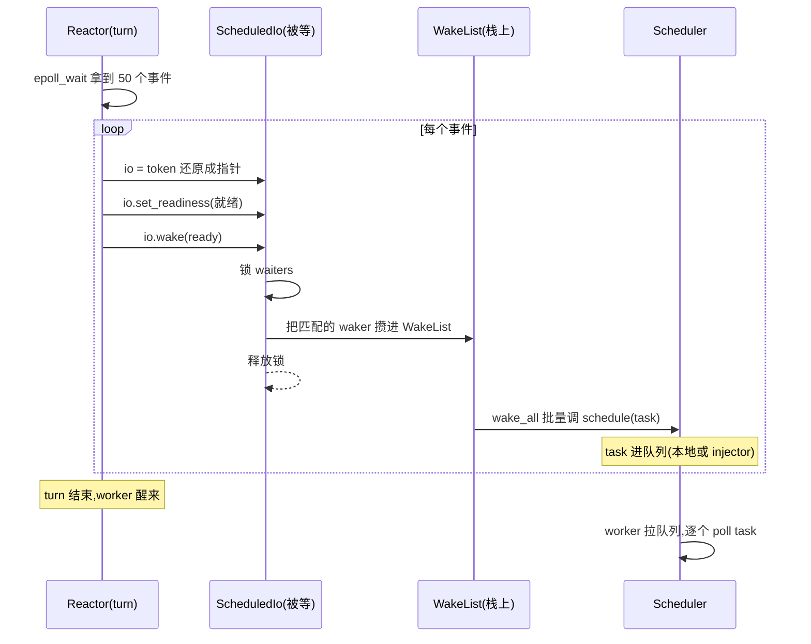
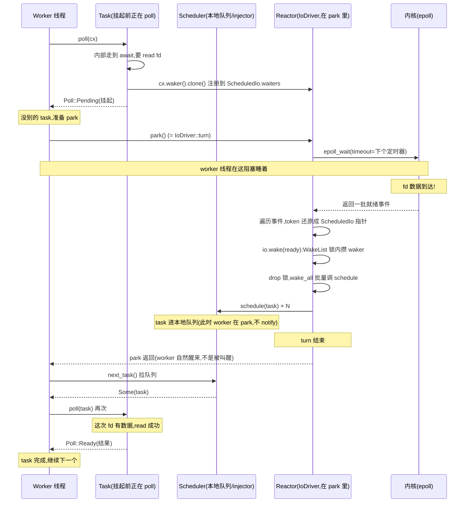

# 第 12 章 · reactor 与 scheduler 的握手:事件怎么回灌调度队列

> **核心问题**:第 10 章讲 epoll 怎么把事件吐出来,第 11 章讲 tokio 怎么用 ScheduledIo 把事件映射回等待者、用 `wake` 按响它们的 Waker。可 `waker.wake()` 这一按之后,**task 怎么真的回到调度队列、被某个 worker 线程重新捡起来 poll?** 第 4 章拆 Waker 时讲过终点是 `scheduler.schedule(Notified(task))`——可这一句在多线程 runtime 里到底怎么落地?reactor 一次 `epoll_wait` 拿到 50 个就绪事件,会同时 wake 50 个 task,这 50 次 wake **能不能合并、要不要 50 次加锁、要不要叫醒 50 个 worker 线程**?还有个根本的疑问:第 2 篇拆 scheduler 时它好像是个独立机器,第 3 篇拆 reactor 又是个独立机器——**这两个机器怎么缝在一起,在一个 worker 线程上轮流运转?**
>
> 这一章是第 3 篇的收束章,把第 3 篇(reactor)和第 2 篇(scheduler)缝合。读完本章,你脑子里要能放出一张完整的事件驱动循环图:worker 线程没活干 → park(走进 reactor 的 `epoll_wait`)→ 事件来了 → reactor 批量 wake → task 进调度队列 → worker 醒来 → 从队列拉 task poll → task 又 await 让出 → 没活再 park……如此循环。
>
> **读完本章你会明白**:
> - **driver 三明治**:顶层 Driver 其实是 `TimeDriver` 套 `IoDriver` 套 `mio::Poll` 的层层包装——worker 线程的 `park` 一调,会顺着这条链算出"最早定时器到点没"、然后用那个时间当 timeout 调 `epoll_wait`,一次 park 同时等 I/O 和 timer。
> - reactor 一次 `epoll_wait` 拿到一批事件后,**不是逐个 wake、逐个加锁**,而是用 `WakeList`(一个 32 容量的栈上数组)先把 Waker 攒一批,锁外批量 `wake_all`——把"唤醒 N 个 task"的锁竞争从 N 次压到 N/32 次。
> - 第 4 章那个 `waker.wake()` 经 vtable 落到 `Handle::schedule_task`,在这里有个**精巧的分流**:从 worker 线程自己 wake 的 task 走本地队列(LIFO slot,缓存友好),从 reactor/别的线程 wake 的 task 走全局 injector 队列——而且**本地 wake 不立刻 unpark worker,而是攒到 park 结束一起处理**(源码注释明说"notifications often come in batches")。
> - 一个完整的"task 等 I/O → 让出 → 被唤醒 → 回到队列 → 被 poll"的全链路时序,把第 1~3 篇的 Future/Waker/Task/scheduler/reactor 五个角色串成一条闭环。
>
> **如果一读觉得太难**:先只记住三件事——① worker 没活就 park,park 内部就是去 `epoll_wait` 等事件(顺便等 timer);② reactor 拿到一批事件后**批量** wake(不是逐个),用 `WakeList` 攒 32 个一批减少锁竞争;③ wake 最终调 `scheduler.schedule(task)`,task 进队列、worker 被 unpark、worker 醒来 poll task。这三步就是 reactor 和 scheduler 的全部握手。

---

## 章首·一句话点破

> **reactor 和 scheduler 的握手,是一条"批量取事件 → 批量按 Waker → 批量回灌队列"的流水线:reactor 一次 epoll_wait 拿一批事件,在锁内把对应的 Waker 攒进一个 32 容量的栈上数组,锁外一次性 wake_all;每个 wake 经 vtable 落到 scheduler.schedule(task),task 进本地队列或全局 injector,worker 在 park 结束时被 unpark、醒来拉 task poll——于是"等 I/O 的 task"无缝地变回了"就绪的 task",第 3 篇 reactor 和第 2 篇 scheduler 缝合成一个完整的事件驱动循环。**

这是**结论**。这一章倒过来拆:先看"两个机器怎么在一个 worker 线程上轮流运转"(driver 三明治);再拆 reactor 拿到事件后**怎么批量 wake**(主角技巧:WakeList 的反面对比);然后跟到 wake 的终点 `schedule_task`,看它怎么用"本地队列 vs 全局 injector"+"延迟 unpark"把回灌优化到极致;最后用一张完整时序图把第 1~3 篇五角色串成闭环。

第 11 章结尾留了个钩子:"wake 之后,task 怎么回调度队列?"这一章一口气回答,并把第 3 篇收束。

---

## 一、先看清两个机器怎么在一个线程上轮流运转:driver 三明治

要理解 reactor 和 scheduler 怎么握手,得先看清它们**怎么在同一个 worker 线程上共存**。很多人以为 reactor 和 scheduler 是两个线程、两个独立循环——错了。**在 tokio 多线程 runtime 里,每个 worker 线程同时背着 scheduler 和 reactor(以及 timer),它们靠"park 切换"轮流运转**。

### scheduler 的主循环:有活干活,没活 park

第 2 篇拆过 worker 的主循环,这里只回顾关键骨架:

```rust
// tokio/src/runtime/scheduler/multi_thread/worker.rs(摘录,简化展示 run 循环)
fn run(&self, mut core: Box<Core>) -> RunResult {
    loop {
        if let Some(task) = core.next_task(&self.worker) {
            // 有活:poll task
            core = self.run_task(task, core)?;
        } else {
            // 没活:park(走进 reactor/timer 等)
            core = self.park(core);
        }
    }
}
```

([tokio/src/runtime/scheduler/multi_thread/worker.rs:561-627](../tokio/tokio/src/runtime/scheduler/multi_thread/worker.rs#L561-L627),简化展示)

关键就两句:**有 task 就 poll,没 task 就 park**。"park"这个词,第 2 篇讲过——它就是"让 worker 线程睡眠,直到被 unpark"。但 park 内部具体干了什么?**它走进了 reactor**。

### park 内部:driver 三明治

worker 的 `park` 调用的是 `self.worker.handle.driver.park(...)`(见 [worker.rs:871-873](../tokio/tokio/src/runtime/scheduler/multi_thread/worker.rs#L871-L873))。这个 `driver` 是什么?看顶层 `Driver` 的定义:

```rust
// tokio/src/runtime/driver.rs(摘录)
#[derive(Debug)]
pub(crate) struct Driver {
    inner: TimeDriver,
}
```

([tokio/src/runtime/driver.rs:15-18](../tokio/tokio/src/runtime/driver.rs#L15-L18))

顶层 `Driver` 里只有一个字段 `inner: TimeDriver`——**它套了一层 TimeDriver**。再看 TimeDriver:

```rust
// tokio/src/runtime/time/mod.rs(摘录)
pub(crate) struct Driver {
    park: IoStack,        // ← 又套了一层,底下是 IoDriver
    // ...
}
```

([tokio/src/runtime/time/mod.rs](../tokio/tokio/src/runtime/time/mod.rs))

`TimeDriver` 又套了 `IoStack`(底层是 `IoDriver`)。于是 worker 调 `Driver::park` 时,调用链是:

```
Driver::park (顶层)
    └→ TimeDriver::park_internal
         ├→ 算出"最早定时器到点时间"(从时间轮查)
         ├→ 用这个时间当 timeout,调 IoDriver::park_timeout
         │      └→ IoDriver::turn (= epoll_wait,等 I/O 事件)
         └→ 醒来后,处理到点的定时器(process)
```

看 `TimeDriver::park_internal` 的真实代码,这条链一清二楚:

```rust
// tokio/src/runtime/time/mod.rs(摘录)
fn park_internal(&mut self, rt_handle: &driver::Handle, limit: Option<Duration>) {
    let handle = rt_handle.time();
    let mut lock = handle.inner.lock();
    // ...
    let next_wake = lock.wheel.next_expiration_time();   // ① 算最早定时器
    // ...
    drop(lock);

    match next_wake {
        Some(when) => {
            // ...
            let mut duration = handle.time_source.tick_to_duration(when.saturating_sub(now));
            if duration > Duration::from_millis(0) {
                // ...
                self.park_thread_timeout(rt_handle, duration);    // ② 用 duration 调底下的 IoDriver
            } else {
                self.park.park_timeout(rt_handle, Duration::from_secs(0));
            }
        }
        None => {
            // 没定时器,无限等 I/O
            self.park.park(rt_handle);
        }
    }

    // Process pending timers after waking up
    handle.process(rt_handle.clock());                          // ③ 醒来后处理到点定时器
}
```

([tokio/src/runtime/time/mod.rs:213-256](../tokio/tokio/src/runtime/time/mod.rs#L213-L256))

而 `self.park.park_timeout` 最终调到 `IoDriver::park_timeout`,它就是 `turn`:

```rust
// tokio/src/runtime/io/driver.rs(摘录)
pub(crate) fn park(&mut self, rt_handle: &driver::Handle) {
    let handle = rt_handle.io();
    self.turn(handle, None);
}

pub(crate) fn park_timeout(&mut self, rt_handle: &driver::Handle, duration: Duration) {
    let handle = rt_handle.io();
    self.turn(handle, Some(duration));
}
```

([tokio/src/runtime/io/driver.rs:152-160](../tokio/tokio/src/runtime/io/driver.rs#L152-L160))

`turn` 就是第 10、11 章拆过的那个——`epoll_wait` + 批量 wake。

> **钉死这件事(driver 三明治)**:worker 线程的 `park`,顺着 `Driver → TimeDriver → IoDriver → epoll_wait` 一路下沉。它一次 park **同时等三件事**:① I/O 事件(epoll_wait 监着)、② 定时器到点(timeout 用最早定时器时间)、③ 别的线程 unpark 它(mio::Waker 写一个特殊 token)。这三件事哪个先来,worker 都会被唤醒、park 返回,然后回到 scheduler 主循环拉 task poll。**这就是 reactor 和 scheduler 怎么"在一个线程上轮流运转"的真相——它们不是一个线程跑两个循环,而是 scheduler 主循环在"没活"时调 park,park 内部跑 reactor;reactor 拿到事件 wake 了 task,task 进队列,park 返回,scheduler 主循环继续拉 task**。两者靠 park 串联,无缝切换。

### 一张图看清 driver 三明治

```
   worker 线程的主循环(scheduler)
   ┌──────────────────────────────────────┐
   │  loop {                              │
   │    if let Some(task) = next_task() { │
   │      poll(task)        ← 有活:调度   │
   │    } else {                          │
   │      park()           ← 没活:进reactor│
   │    }                                 │
   │  }                                   │
   └─────────────┬────────────────────────┘
                 │ park()
                 ↓
   ┌──────────────────────────────────────┐
   │  Driver(顶层)                        │
   │  └→ TimeDriver::park_internal        │
   │       ├─ 算最早定时器到点时间         │
   │       ├─ 用 duration 当 timeout       │
   │       │   └→ IoDriver::turn          │
   │       │        ├─ epoll_wait(等待)    │ ← reactor 在这
   │       │        ├─ 拿到一批事件        │
   │       │        └─ 批量 wake task      │ ← task 回灌队列
   │       └─ process(处理到点定时器)     │ ← timer 也在 wake task
   └──────────────────────────────────────┘
                 │ park 返回
                 ↓
   worker 醒来,继续 scheduler 主循环拉 task poll
```

这张图是本章的纲领——**park 是 scheduler 和 reactor/timer 的唯一交界**,reactor 在 park 内部运行,wake 出来的 task 进 scheduler 的队列,park 返回后 scheduler 接力处理。

---

## 二、reactor 拿到事件后:怎么批量 wake(主角技巧)

park 进入了 reactor,reactor 调 `epoll_wait` 拿到一批事件。现在的问题:这一批事件怎么 wake 对应的 task?这是本章的主角技巧——**批量 wake**。

### 反面:逐个 wake、逐个加锁

最朴素的实现:遍历事件,每个事件 wake 一个 task。

```rust
// 简化示意,非源码原文:逐个 wake
for event in events.iter() {
    let io = token_to_scheduled_io(event.token());
    let waker = io.take_waker();      // 加锁,取 waker
    waker.wake();                     // 调 schedule(可能再加锁)
}
```

> **不这样会怎样(三个问题)**:
> - **锁竞争放大 N 倍**:每个事件的 wake 都要① 锁 `ScheduledIo.waiters` 取 waker、② 调 `schedule` 又可能锁调度队列。50 个事件 = 50 次 waiters 锁 + 50 次调度队列锁。在多核 reactor 下,这些锁竞争会拖慢整个 wake 路径。
> - **惊群可能**:如果 wake 时立刻 unpark worker,50 个 wake 可能叫醒 50 个 worker 线程(每个 wake 都 unpark 一次)——而真正需要的可能只是少数几个 worker。这就是 thundering herd。
> - **缓存颠簸**:50 次零散的锁操作,每次都让缓存行失效,远不如"攒一批、一次性处理"缓存友好。

### 正解:WakeList——攒 32 个一批,锁外批量 wake

tokio 用 `ScheduledIo::wake` 的源码,体现的就是"先在锁内把 Waker 攒进 WakeList,锁外批量 wake"的思路。看真实代码:

```rust
// tokio/src/runtime/io/scheduled_io.rs(摘录)
pub(super) fn wake(&self, ready: Ready) {
    let mut wakers = WakeList::new();

    let mut waiters = self.waiters.lock();                  // ① 加锁

    // check for AsyncRead slot
    if ready.is_readable() {
        if let Some(waker) = waiters.reader.take() {
            wakers.push(waker);                             // ② 攒进 WakeList
        }
    }
    // check for AsyncWrite slot
    if ready.is_writable() {
        if let Some(waker) = waiters.writer.take() {
            wakers.push(waker);
        }
    }

    'outer: loop {
        let mut iter = waiters.list.drain_filter(|w| ready.satisfies(w.interest));

        while wakers.can_push() {                           // WakeList 容量 32
            match iter.next() {
                Some(waiter) => {
                    let waiter = unsafe { &mut *waiter.as_ptr() };
                    if let Some(waker) = waiter.waker.take() {
                        waiter.is_ready = true;
                        wakers.push(waker);                 // ③ 继续攒
                    }
                }
                None => break 'outer,
            }
        }

        drop(waiters);                                      // ④ 锁外!
        wakers.wake_all();                                  // ⑤ 批量 wake

        // Acquire the lock again.
        waiters = self.waiters.lock();                      // 没攒完,再锁,继续
    }

    // Release the lock before notifying
    drop(waiters);
    wakers.wake_all();
}
```

([tokio/src/runtime/io/scheduled_io.rs:235-295](../tokio/tokio/src/runtime/io/scheduled_io.rs#L235-L295))

逐段拆这套精巧设计:

**① 加锁一次,锁内只做"取 Waker":**wake 进入时锁 `waiters`,在锁内做的事是"把 reader/waker/list 里匹配的 Waker 取出来",**只动 Waker 不调 wake**。这一步是必须加锁的(防止别人同时改 waiters 链表),但**锁内不做 wake 这种重活**——wake 可能触发调度、可能锁调度队列,锁内调它会拖长临界区。

**② 把 Waker 攒进 WakeList:**取出来的 Waker 不立刻 wake,而是 `wakers.push(waker)`——塞进一个栈上的、固定容量 32 的数组。

**④ 锁外 wake_all:**当 WakeList 攒满 32 个(或链表遍历完),`drop(waiters)` **先释放锁**,然后 `wakers.wake_all()` 在**锁外**批量调每个 Waker 的 wake。这一步是关键——**wake 在锁外,意味着别的线程想动这个 ScheduledIo 的 waiters 不会被阻塞**,锁的临界区被压到最短。

**⑤ 循环:**如果 waiters 链表里的 Waker 比 WakeList 容量多(超过 32 个等待者),`drop` 锁、`wake_all` 后,**重新加锁继续取下一批**。这是为了用固定容量的 WakeList 处理任意数量的等待者。

### WakeList 本身:零分配的栈上批量容器

`WakeList` 是这套设计的物理基础,看它的实现:

```rust
// tokio/src/util/wake_list.rs(摘录)
const NUM_WAKERS: usize = 32;

pub(crate) struct WakeList {
    inner: [MaybeUninit<Waker>; NUM_WAKERS],
    curr: usize,
}

impl WakeList {
    pub(crate) fn wake_all(&mut self) {
        // ... 用 DropGuard 保证 panic 安全,逐个 waker.wake() ...
        while !ptr::eq(guard.start, guard.end) {
            let waker = unsafe { ptr::read(guard.start) };
            guard.start = unsafe { guard.start.add(1) };
            waker.wake();
        }
    }
}
```

([tokio/src/util/wake_list.rs:1-90](../tokio/tokio/src/util/wake_list.rs))

几个关键点:

- **`[MaybeUninit<Waker>; 32]`**——栈上数组,容量固定 32,`MaybeUninit` 因为未填的 slot 不需要初始化(避免 32 次 Waker 的 default 构造开销)。**零堆分配**——整个 WakeList 就在 reactor 的栈帧上。
- **为什么是 32**:这是个权衡。太大 → 栈帧变大、一次 wake_all 时间变长(可能延迟别的 worker);太小 → 循环次数多、锁次数多。32 是 tokio 选的经验值,在"攒够一批"和"不过度延迟"之间平衡。
- **panic 安全的 DropGuard**:`wake_all` 用 `DropGuard` 包住——如果某个 `waker.wake()` panic 了(不应该,但理论上可能),DropGuard 的 drop 会把剩下没 wake 的 Waker 正确 drop 掉(释放引用计数),不会泄漏。这是 Rust 在 unsafe 代码里做 panic 安全的标准模式。

> **钉死这件事(WakeList 的全部价值)**:`WakeList` 把"唤醒 N 个 task"这件事,从"N 次锁操作"变成"⌈N/32⌉ 次锁操作 + N 次锁外 wake"。它用一个**零分配的栈上数组**,在锁内快速攒 Waker,在锁外批量 wake——既缩短了锁的临界区(并发性能),又减少了 wake 的零散调用(缓存友好)。这是 tokio reactor 在高并发(一次 epoll_wait 返回几十上百事件)下的核心优化,**没有它,reactor 的 wake 路径会成为整个 runtime 的瓶颈**。

### 批量 wake 的时序



注意时序图里"释放锁"和"wake_all"的先后——**锁释放后才 wake**,这是把锁竞争压到最低的物理实现。

---

## 三、wake 的终点:schedule_task 怎么分流回灌调度队列

`WakeList::wake_all` 里调的 `waker.wake()`,经第 4 章拆过的 vtable,落到 `Handle::schedule_task`(多线程 runtime)。这一段拆 schedule 的落地——它怎么把 task 塞进队列、怎么决定叫不叫醒 worker。

### schedule_task:本地队列 vs 全局 injector 的分流

```rust
// tokio/src/runtime/scheduler/multi_thread/worker.rs(摘录)
pub(super) fn schedule_task(&self, task: Notified, is_yield: bool) {
    with_current(|maybe_cx| {
        if let Some(cx) = maybe_cx {
            // Make sure the task is part of the **current** scheduler.
            if self.ptr_eq(&cx.worker.handle) {
                // And the current thread still holds a core
                if let Some(core) = cx.core.borrow_mut().as_mut() {
                    self.schedule_local(core, task, is_yield);    // ← 本地路径
                    return;
                }
            }
        }

        // Otherwise, use the inject queue.
        self.push_remote_task(task);                              // ← 全局路径
        self.notify_parked_remote();
    });
}
```

([tokio/src/runtime/scheduler/multi_thread/worker.rs:1327-1344](../tokio/tokio/src/runtime/scheduler/multi_thread/worker.rs#L1327-L1344))

这一段是个**精巧的分流**——它判断"当前线程是不是 worker、是不是同一个 runtime":

- **本地路径**(`schedule_local`):如果 wake 是从 worker 线程自己发出的(比如 task 在 poll 时直接 `waker.wake()` 自己,或者 tokio 内部的某些 sync 原语),task 直接进**当前 worker 的本地队列**。本地队列是 Chase-Lev 无锁双端队列(第 7 章拆),worker 自己 push 是 owner 端,无竞争,极快。
- **全局路径**(`push_remote_task` + `notify_parked_remote`):如果 wake 是从 reactor 或别的线程发出的(典型场景:reactor 在 worker A 的 park 里 wake 了属于 worker B 的 task——其实更常见是 reactor wake 后,worker 自己没在 poll 所以走不到本地),task 进**全局 injector 队列**,然后 notify 一个空闲的 worker。

> **比喻回到餐厅**:服务员 A 在跑订单时,自己手里刚 wake 了一个新订单——直接塞自己手边那摞(本地队列),不用绕前台。但如果 wake 来自厨房(reactor),这个订单该给谁干不一定,先扔前台总订单本(injector),前台喊一声哪个服务员闲着来取。

### 本地路径的精妙:LIFO slot + 延迟 notify

看 `schedule_local` 的真实代码,里面藏了两个优化:

```rust
// tokio/src/runtime/scheduler/multi_thread/worker.rs(摘录)
fn schedule_local(&self, core: &mut Core, task: Notified, is_yield: bool) {
    core.stats.inc_local_schedule_count();

    let should_notify = if is_yield || !core.lifo_enabled {
        core.run_queue.push_back_or_overflow(task, self, &mut core.stats);   // 普通入队
        true
    } else {
        // Push to the LIFO slot
        let prev = core.lifo_slot.take();                                      // ① LIFO slot
        let ret = prev.is_some();

        if let Some(prev) = prev {
            core.run_queue.push_back_or_overflow(prev, self, &mut core.stats);
        }

        core.lifo_slot = Some(task);                                            // 新 task 进 LIFO slot

        ret
    };

    // Only notify if not currently parked. If `park` is `None`, then the
    // scheduling is from a resource driver. As notifications often come in
    // batches, the notification is delayed until the park is complete.
    if should_notify && core.park.is_some() {                                  // ② 延迟 notify
        self.notify_parked_local();
    }
}
```

([tokio/src/runtime/scheduler/multi_thread/worker.rs:1353-1385](../tokio/tokio/src/runtime/scheduler/multi_thread/worker.rs#L1353-L1385))

**① LIFO slot**:本地 wake 的 task,不是 push 进 run_queue 的尾部(FIFO),而是塞进一个**单 slot 的 LIFO 位**(`core.lifo_slot`)。下次 worker 从队列拉 task 时,**先拉 LIFO slot**。这是个缓存优化——刚 wake 的 task 的数据大概率还在当前 CPU 的 cache 里(因为它刚被处理),立刻 poll 它命中率最高。LIFO slot 是个单 slot(不是栈),所以连续 wake 多个 task 时,旧的会被挤进 run_queue,新的留在 LIFO。

**② 延迟 notify(本章的关键)**:看那段注释——"If `park` is `None`, then the scheduling is from a resource driver. As notifications often come in batches, the notification is delayed until the park is complete."

这是本章的灵魂一句。翻译过来:

> **如果 wake 是从 resource driver(reactor/timer)发的,此时 worker 正在 park 里(它的 `core.park` 是 None,因为 park 把它 take 走了),不要立刻 unpark 它——因为 reactor 一次 epoll_wait 会 wake 一批 task,你 unpark 一次它就要醒一次,50 个 wake 就是 50 次 unpark。让它把整批 wake 收完(park 结束),一次性醒来处理。**

这是 tokio 对"批量 wake"在调度端的延续——reactor 端用 WakeList 批量调 schedule,schedule 端发现"自己正在 park(被 driver 调)"就**不立刻叫醒自己**,攒着,等 park 自然返回。50 个 wake 只触发 0 次显式 unpark(worker 醒来是因为 epoll_wait 本身返回了,不是被叫醒的)。

> **钉死这件事(延迟 notify 的精髓)**:reactor 在 park 内部 wake 一批 task,这些 wake 都走"本地路径"——但此时 worker 的 `core.park` 是 None(它正在 park 里),所以 `should_notify` 的判断 `core.park.is_some()` 为 false,**不调 notify_parked_local**。worker 不会被反复 unpark,它会在 `epoll_wait` 返回后自然醒来,醒来发现队列里攒了一堆 task,逐个 poll。**这是 tokio 把"批量 wake"贯穿到调度端的极致——50 个 wake 变成 0 次显式 unpark,只在 park 自然返回后一次性消化整批**。

### 全局路径:injector + notify 一个空闲 worker

如果 wake 不是本地的(reactor 在 worker A 的 park 里,wake 的 task 之前是 worker B 在跑——虽然实际上 task 不绑定 worker,但 wake 时当前线程不是持有 core 的 worker),走全局路径:

```rust
// tokio/src/runtime/scheduler/multi_thread/worker.rs(摘录)
fn push_remote_task(&self, task: Notified) {
    self.shared.scheduler_metrics.inc_remote_schedule_count();
    let mut synced = self.shared.synced.lock();
    // safety: passing in correct `idle::Synced`
    unsafe { self.shared.inject.push(&mut synced.inject, task) };
    self.shared.synced.notify_one(&self.shared, &mut synced);
}

fn notify_parked_remote(&self) {
    if let Some(index) = self.shared.idle.worker_to_notify(&self.shared) {
        self.shared.remotes[index].unpark.unpark(&self.driver);   // ← 叫醒一个空闲 worker
    }
}
```

([tokio/src/runtime/scheduler/multi_thread/worker.rs:1397-1404, 1453-1457](../tokio/tokio/src/runtime/scheduler/multi_thread/worker.rs#L1397-L1457))

`worker_to_notify` 从 idle 状态里挑**一个**正在 park 的 worker(不挑忙的,不挑所有),只叫醒它一个。这就是 tokio 防 thundering herd 的关键——**叫醒一个,不是叫醒所有**。被叫醒的 worker 醒来,从 injector 拉这个 task, poll 它。

注意 `notify_parked_remote` 用的 unpark 句柄是 `self.driver`——也就是说,叫醒 worker 的方式是**往它的 driver(reactor)写一个 wakeup token**(`mio::Waker`)。worker 在 `epoll_wait` 里收到这个 token,park 返回。**worker 的"被叫醒",物理上就是它的 reactor 收到一个 wakeup 事件**——这又回到了"reactor 和 scheduler 靠 park 串联"那条线。

---

## 四、完整闭环:从"task 等 I/O"到"task 被 poll"的全链路

讲透了 driver 三明治、批量 wake、schedule 分流,现在用一张完整时序图,把第 1~3 篇的 Future / Waker / Task / scheduler / reactor 五个角色串成一条闭环。这是本章的收束。

### 一张图看完一次完整的"等 I/O → 让出 → 唤醒 → 重 poll"



这张图每个环节都对应前面章节拆过的机制:

- **T 注册 Waker 到 ScheduledIo**(第 11 章):`cx.waker().clone()` 存进 `waiters` 链表或 reader/writer 槽;
- **W park → epoll_wait**(第 10 章 + 本章 driver 三明治):worker 在 reactor 里睡着,内核盯 fd;
- **K 返回事件**(第 10 章):epoll_wait 返回就绪 fd 的 token(指针编码);
- **R wake 批量**(本章):token 还原指针,WakeList 攒 waker,锁外 wake_all;
- **Sch schedule**(本章 + 第 4 章):wake 经 vtable 落到 schedule_task,本地路径进队列,延迟 notify;
- **W 醒来 poll**(第 2 篇 + 本章):park 自然返回,scheduler 拉队列,poll task,这次能推进。

> **钉死这件事(闭环的全部)**:一个 task 从"等 I/O 让出"到"被唤醒重新 poll",经过的每一步都是前面章节拆过的机制——Waker 注册(11 章)、epoll_wait(10 章)、token 指针(11 章)、WakeList 批量(本章)、schedule 分流(本章)、driver 三明治(本章)。**这五步首尾相连,就是一个完整的事件驱动循环**。tokio 之所以能用极少线程驱动百万并发,就是因为这个循环运转得够快、够省——快在批量 wake + 锁外 wake + 本地队列无锁,省在 park + 延迟 notify + 叫醒一个 worker。

---

## 技巧精解:批量 wake——为什么是"攒 32 个一批",以及反面对比

这一节是本章的硬核,把"批量 wake"这个总纲钦定的主角技巧彻底拆透。它表面看是个小优化,实际上决定了 reactor 在高并发下能不能扛住。

### 反面对比一:逐个 wake,锁内调 schedule

```rust
// 简化示意,非源码原文:逐个 wake,锁内 schedule
fn wake(&self, ready: Ready) {
    let mut waiters = self.waiters.lock();
    for w in waiters.list.drain_filter(|w| ready.satisfies(w.interest)) {
        if let Some(waker) = w.waker.take() {
            waker.wake();    // ← 锁内调 wake!wake 又锁调度队列!
        }
    }
    drop(waiters);
}
```

> **不这样会怎样**:两个嵌套锁问题——`waiters` 锁内调 `waker.wake()`,wake 又调 `schedule`,schedule 又要锁调度队列(`synced` 或本地队列的原子操作)。**锁的嵌套是并发 bug 的温床**——一旦 schedule 路径里某个操作反过来要动这个 ScheduledIo(完全可能:某个 task 被 wake 后立刻又想注册到同一个 fd),就是死锁。即使不死锁,waiters 锁被持有整个 wake 过程,别的线程想动这个 ScheduledIo(比如另一个 task 想注册 interest)全被阻塞。

tokio 的解法是把"取 waker"和"wake waker"**严格分离**:锁内只取 waker 攒进 WakeList,锁释放后才 wake。**临界区里只有"读链表 + 攒数组"这种纯内存操作,没有任何可能再锁别的锁**。这是无锁编程里"缩短临界区"的教科书实践。

### 反面对比二:用 Vec<Waker>(堆分配)

```rust
// 简化示意,非源码原文:用 Vec 做批量
fn wake(&self, ready: Ready) {
    let mut wakers = Vec::new();    // ← 堆分配!
    {
        let mut waiters = self.waiters.lock();
        for w in waiters.list.drain_filter(...) {
            if let Some(waker) = w.waker.take() {
                wakers.push(waker);
            }
        }
    }
    for waker in wakers {
        waker.wake();
    }
}
```

> **不这样会怎样**:`Vec::new()` 走全局分配器,在多线程下全局分配器有锁——reactor 主循环每秒可能 wake 几万次,就是几万次分配器锁竞争。而且 Vec 扩容还会反复分配/拷贝。这把 reactor 的热路径变成了分配器瓶颈。

tokio 的 `WakeList` 用**栈上固定数组**`[MaybeUninit<Waker>; 32]`——零堆分配,数组就在 `wake` 函数的栈帧上,函数返回自动回收。`MaybeUninit` 避免未用 slot 的 Waker 初始化开销。这是"热路径零分配"的标准 Rust 模式,和第 10 章 mio 复用 events 缓冲、第 11 章 ScheduledIo 缓存行对齐是同一类系统级优化哲学。

### 反面对比三:立刻 unpark,每个 wake 都叫一次 worker

```rust
// 简化示意,非源码原文:每个 wake 都 unpark
fn schedule_local(&self, core: &mut Core, task: Notified) {
    core.lifo_slot = Some(task);
    self.notify_parked_local();    // ← 每个 wake 都叫!即使自己在 park 里
}
```

> **不这样会怎样**:reactor 在 worker 的 park 里 wake 50 个 task,每个 wake 都 `notify_parked_local`——但 worker 正在 park(`core.park` 是 None),notify 会写一个 wakeup token 给 driver。50 个 wake = 50 个 token 写 + 可能 50 次 epoll_wait 被打断重启。**惊群 + epoll 反复唤醒**,吞吐塌方。

tokio 的解法是 schedule_local 里那句 `if should_notify && core.park.is_some()`——**只有 worker 不在 park 里(`core.park` 是 Some,即 park 句柄还在 worker 手里)才 notify**。reactor 在 worker 的 park 里发的 wake,`core.park` 是 None,不 notify,**攒着等 park 自然返回**。这一句判断,把 N 次 unpark 压成 0 次。

### 为什么是 32 这个数

WakeList 容量选 32,不是拍脑袋。这是个权衡:

- **太大(比如 1024)**:栈帧变大(每个 Waker 16 字节,1024 个 = 16KB 栈,对 worker 默认 2MB 栈不算什么,但累积起来影响 cache);一次 wake_all 要顺序调 1024 次 wake,中间不能被打断,可能延迟别的 worker 的 wake。
- **太小(比如 4)**:一批攒不下几个就要锁一次,锁次数没降下来,优化失效。50 个 wake 要锁 13 次。
- **32**:`wake_all` 顺序调 32 次 wake 大约几微秒,延迟可控;50 个 wake 只需锁 2 次,优化显著。这是 tokio 工程化的经验值。

> **钉死这件事(批量 wake 的设计本质)**:`WakeList` + 锁外 wake + 延迟 notify,三件事合起来,把"reactor 一次 wake N 个 task"的代价,从 O(N) 次锁操作 + O(N) 次 unpark,压到 O(N/32) 次锁操作 + 0 次显式 unpark。在百万并发、一次 epoll_wait 返回上百事件的场景下,这个优化决定了 reactor 不会成为瓶颈。**这是 tokio 工程化的典范——不是某个天才算法,而是一连串"缩短临界区、零分配、攒批处理"的扎实工程**。

---

## 章末小结

### 用"餐厅服务员"比喻回顾本章(也是第 3 篇的总回顾)

1. **服务员没活时,不傻站,而是去"前台呼叫系统"那儿靠着打盹**——这就是 worker park。park 不是真的睡觉不管事,它走进 reactor 的 `epoll_wait`,**同时盯着所有订单的菜**和**闹钟(timer)**,任何一个事件来都把他叫醒。这一套叫"driver 三明治"——顶层 Driver 套 TimeDriver 套 IoDriver,worker 一次 park 同时等 I/O 和 timer。
2. **厨房一次喊好几个号,服务员不会一个一个去回应,而是攒一批叫号、统一处理**——这就是批量 wake。reactor 一次 `epoll_wait` 拿到 50 个事件,不是 50 次锁、50 次调度,而是用 WakeList(栈上 32 容量的数组)在锁内攒 Waker、锁外一次性 wake_all。**50 个事件,2 次锁,N 次锁外 wake**。
3. **服务员自己手里刚 wake 的订单,直接塞自己手边那摞(LIFO slot,缓存友好);厨房喊的订单,扔前台总本(injector),叫一个闲服务员来取**——这就是 schedule_task 的本地/全局分流。本地 wake 进本地队列(无锁 Chase-Lev),全局 wake 进 injector + notify 一个空闲 worker。
4. **服务员在呼叫系统那儿靠着时,厨房喊号不会反复推他——他等呼叫系统自然结束(下一轮 epoll_wait 返回)再统一处理**——这就是延迟 notify。reactor 在 worker 的 park 里发的 wake,不立刻 unpark worker(源码注释:"notifications often come in batches"),攒到 park 自然返回。**50 个 wake,0 次显式 unpark**。
5. **整套循环:服务员 poll 订单 → 订单等菜让出 → 服务员没活去 park → 厨房喊号批量 wake → 订单回到前台本子 → 服务员自然醒来 → 拉订单继续 poll**——这就是 reactor 和 scheduler 的完整握手,把第 3 篇(reactor)和第 2 篇(scheduler)缝合成一个事件驱动循环。

### 本章(也是第 3 篇)在全书主线中的位置

记住全书的二分法:**调度执行(让就绪的任务跑) vs 事件唤醒(让等待的任务不空耗、就绪了再叫)**。

第 3 篇三章,把"事件唤醒"那一面**从底到顶**完整点亮了:

- **第 10 章(底座)**:epoll/kqueue 怎么提供"一根线程盯海量 fd"的系统调用,mio 怎么封装跨平台接口,为什么选 edge-triggered;
- **第 11 章(中间层)**:tokio 怎么用 ScheduledIo + 指针编码 token,把海量 fd 和等待中的 task 对应起来,AsyncFd 怎么把 readiness 暴露成 async API,edge 的铁律怎么被封进 guard 类型;
- **第 12 章(衔接,本章)**:reactor 拿到事件后怎么批量 wake、wake 怎么经 vtable 落到 schedule、schedule 怎么分流本地/全局、worker 怎么靠 park 和 reactor 串联——**把 reactor 和 scheduler 缝成一个闭环**。

这一章是"衔接"那一面——它既不是纯调度执行,也不是纯事件唤醒,而是**两者之间的桥**。没有这座桥,reactor wake 的 task 永远进不了 scheduler,scheduler 拉的 task 永远是死的(没人 wake 它们)。**这座桥建起来,tokio 才真正成为一个能运转的事件驱动 runtime**。

### 五个"为什么"清单

1. **reactor 和 scheduler 怎么在一个 worker 线程上共存?**:不是两个独立循环,而是 scheduler 主循环在"没活"时调 park,park 顺着 `Driver → TimeDriver → IoDriver → epoll_wait` 下沉进 reactor;reactor 在 park 内部运行,wake 出来的 task 进 scheduler 队列,park 返回后 scheduler 接力 poll。这套叫"driver 三明治",park 是 reactor 和 scheduler 的唯一交界。
2. **为什么 reactor 要批量 wake 而不是逐个?**:逐个 wake 会放大锁竞争(N 次 waiters 锁 + N 次调度队列锁)、引发惊群(N 次 unpark)、缓存颠簸。tokio 用 WakeList(栈上 32 容量数组)在锁内攒 Waker,锁外批量 wake_all——把 N 次锁操作压到 N/32 次,临界区只含纯内存操作。
3. **WakeList 为什么是栈上固定 32 容量,不用 Vec?**:Vec 走全局分配器(多线程有锁),reactor 热路径零分配是硬要求;栈上数组零分配,函数返回自动回收。容量 32 是"攒够一批"和"wake_all 延迟可控"的权衡经验值。
4. **schedule_task 为什么分本地/全局两条路径?**:本地路径(从 worker 自己线程发的 wake)走本地 Chase-Lev 队列(owner 端无锁)+ LIFO slot(缓存友好);全局路径(从 reactor/别的线程发的 wake)走 injector + notify 一个空闲 worker(防惊群)。两条路径针对不同来源的 wake 做了极致优化。
5. **为什么 reactor 在 worker park 里发的 wake,不立刻 unpark worker?**:因为 reactor 一次 epoll_wait 会 wake 一批 task(源码注释:"notifications often come in batches"),立刻 unpark 就是 N 次显式唤醒。tokio 判断 `core.park.is_some()`,worker 在 park 里时 park 句柄被 take 走(是 None),不 notify——攒着等 epoll_wait 自然返回,worker 一次性消化整批。N 个 wake → 0 次显式 unpark。

### 想继续深入,该往哪钻

- **tokio 源码(本章引用的核心)**:
  - [tokio/src/runtime/driver.rs](../tokio/tokio/src/runtime/driver.rs) —— 顶层 Driver(L15-18)、`Driver::park`/`park_timeout`(L66-72)。driver 三明治的顶层。
  - [tokio/src/runtime/time/mod.rs](../tokio/tokio/src/runtime/time/mod.rs) —— `TimeDriver::park_internal`(L213-256),算定时器 + 调 IoDriver + 醒来 process 定时器。三层包装的中间层。
  - [tokio/src/runtime/io/driver.rs](../tokio/tokio/src/runtime/io/driver.rs) —— `IoDriver::park`/`turn`(L152-160, L179-239)。三层包装的底层,reactor 心脏。
  - [tokio/src/runtime/io/scheduled_io.rs](../tokio/tokio/src/runtime/io/scheduled_io.rs) —— `ScheduledIo::wake`(L235-295),**批量 wake 的全部源码**——WakeList 锁内攒、锁外 wake_all。
  - [tokio/src/util/wake_list.rs](../tokio/tokio/src/util/wake_list.rs) —— `WakeList` 整个文件,零分配栈上批量容器 + panic 安全的 DropGuard。
  - [tokio/src/runtime/scheduler/multi_thread/worker.rs](../tokio/tokio/src/runtime/scheduler/multi_thread/worker.rs) —— `schedule_task`(L1327-1344,本地/全局分流)、`schedule_local`(L1353-1385,LIFO slot + 延迟 notify)、`push_remote_task`(L1397-1404)、`notify_parked_remote`(L1453-1457)。**本章 schedule 落地的全部**。
- **第 4 章的伏笔回收**:第 4 章拆 Waker 时讲到终点是 `scheduler.schedule(Notified(task))`,本章拆了这个 `schedule` 在多线程 runtime 里的真实落地。如果想再看一遍 vtable 那条链(`wake_by_val → transition_to_notified → schedule`),回 [tokio/src/runtime/task/harness.rs](../tokio/tokio/src/runtime/task/harness.rs#L63-L91) 的 `wake_by_val`。
- **`loom` 测试**:`ScheduledIo::wake` + `WakeList` + `schedule_task` 的并发交错,tokio 有 loom 测试覆盖。想看清"多个 worker 同时 wake 同一个 fd、同时被 notify"为什么不会死锁、不会丢 wake,看 tokio tests 下的 loom 用例。
- **`tokio-console`**:运行时观测工具,能实时看到每个 task 的状态(运行/就绪/等待)、每个 worker 在干什么。想直观感受"reactor wake → task 进队列 → worker poll"这条循环,跑一个高并发 server 用 tokio-console 观察。
- **下一站(第 4 篇)**:第 3 篇讲透了"I/O 等待怎么不占线程"——靠 epoll + ScheduledIo + Waker。可"I/O 事件"只是一种事件,**还有一种事件是"时间到了"**——`sleep(5s)`、`timeout`、定时任务。这些"时间事件"怎么管?成千上万个定时器,凭什么不用最小堆(那是 O(log n))、而用**层级时间轮**(O(1) 插入/到期)?翻开 **第 13 章 · 层级时间轮:成千上万个定时器怎么管**——你会看到 tokio 的 timer 怎么用位运算直接定位"几号槽",以及它怎么和本章的 reactor 在同一个 park 循环里(本章的 TimeDriver 那一层)协同推进。

---

> reactor 和 scheduler 的握手讲透了——批量 wake、锁外 schedule、延迟 notify、driver 三明治,四件事把第 3 篇 reactor 和第 2 篇 scheduler 缝成一个事件驱动循环。可"等待"的另一半还没碰——**时间**。一个 `sleep(5秒)`,凭什么 5 秒后 task 被叫醒?成千上万个 sleep 怎么管?翻开 **第 13 章 · 层级时间轮**——从"时间也是一种事件"说起,把"等待"的另一面也点亮。
