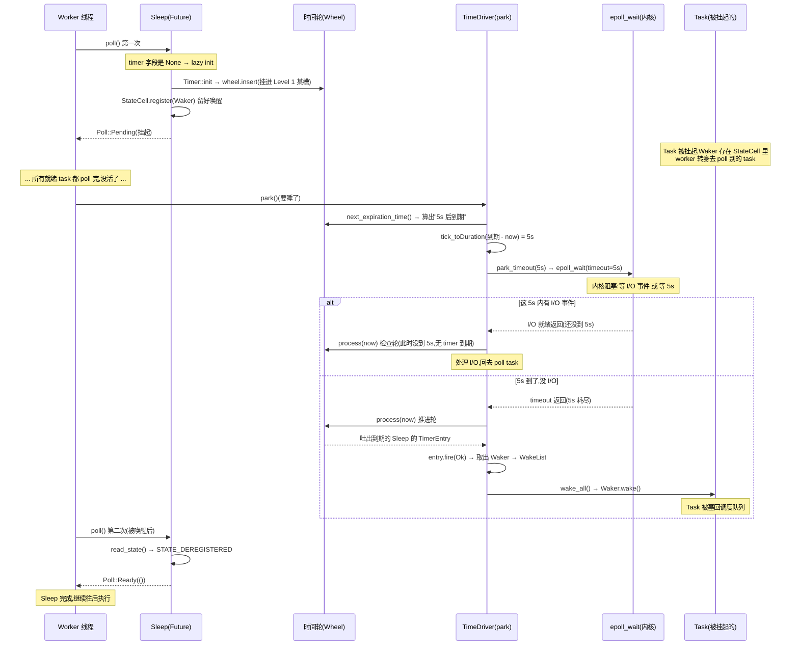

# 第 14 章 · sleep 的实现与驱动

> **核心问题**:你写下 `tokio::time::sleep(Duration::from_secs(5)).await`,这一行代码到底变成了什么?那个"5 秒后醒来"的承诺,怎么变成一个可以被反复 `poll` 的 `Future`?更关键的是——**第 13 章那套层级时间轮,谁来拨动它?** 时间不会自己走,`elapsed` 不会自己涨,**到底是谁,在什么时刻,把"当前时间"喂给时间轮、让它吐出到期的定时器、把挂起的 task 叫醒?**
>
> 这一章我们把 timer 这件套的另一半讲完:**从 `sleep` 这个 API,一路追到时间轮被驱动的那一行代码**。重点是一个被反复点名的精妙设计——**timer 和 I/O reactor 共用同一次 `epoll_wait` 的超时参数**,在同一个阻塞点被一起推进,无需额外线程。
>
> **读完本章你会明白**:
> - `sleep(dur)` 怎么变成一个可 await 的 `Future`:它内部是一个 `Sleep` 状态机,持有一个 `TimerEntry`(第 13 章那个侵入式链表节点的"前端"),首次 `poll` 时把自己挂进时间轮。
> - 时间轮**不是被一个专门的定时器线程**驱动的,而是被 worker 线程"顺手"驱动的:worker 没活干要 park(睡眠)时,park 之前先问时间轮"下一个定时器多久后到期",把那个时间当成 `epoll_wait` 的 timeout——**等 I/O 和等时间,用同一个阻塞点**。
> - 为什么不为 timer 单独开线程、不用 `setitimer`/信号——这两条路各自的代价。
> - 一个 `sleep` 从被 await、挂起、到被唤醒的**完整时序**,以及它与第 4 章 `Waker` 契约(`Pending` 必留 Waker)的咬合。
>
> 难度提示:本章涉及 runtime 的"驱动链"(park → TimeDriver → IoStack → epoll),第一次读容易被层层包装绕晕。

> **如果一读觉得太难**:先只记住三件事——① `sleep` 内部是一个 `Sleep` Future,首次 poll 时把一个 `TimerEntry` 挂进第 13 章的时间轮;② 时间轮是 worker 线程 park(睡眠)时**顺手**驱动的——park 前算"最近定时器多久到期",把它当 epoll_wait 的超时;③ 到点后时间轮 fire 定时器,调它登记的 Waker,把 task 重新塞回调度队列。三条串起来,就是"时间事件"的唤醒闭环。

---

## 章首·一句话点破

> **`sleep` 不是"开个线程等 5 秒",而是"在时间轮上预约一个 5 秒后的格子,然后把 task 挂起、让出线程";5 秒后,worker 线程在 park 醒来时顺手拨动时间轮,轮子发现这格到期了,调 task 留下的 Waker 把它叫醒。至于"worker 凭什么 5 秒后准时醒来"——它睡之前,就把"5 秒"这个数喂给了 `epoll_wait` 当超时。等 I/O 和等时间,是同一次睡眠。**

这是**结论**。这一章倒过来拆:先看 `sleep` 这个 API 内部是个什么 Future,再看它怎么挂进轮、挂起后 Waker 怎么留,最后追到时间轮被驱动的那行代码——我们会看到 `TimeDriver::park` 怎么把"最近到期时间"一路透传成 `epoll_wait` 的 timeout 参数。

第 4 章讲 `Waker` 时立下了一条法律:**`Future::poll` 返回 `Pending`,必须保证条件就绪时有人通过 Waker 把它重新唤醒**。timer 是这条法律的执行者之一——reactor 执行"I/O 就绪"的唤醒,timer 执行"到点"的唤醒。第 13 章讲了 timer 内部的数据结构(时间轮),本章讲 timer 怎么和 Waker、和 reactor、和 park 链咬合成一条完整的唤醒链。

---

## 一、`sleep` 是个什么 Future

先看 `sleep` 这个函数本身。它极其简单——计算一个 deadline,造一个 `Sleep`:

```rust
pub fn sleep(duration: Duration) -> Sleep {
    let location = trace::caller_location();

    match Instant::now().checked_add(duration) {
        Some(deadline) => Sleep::new_timeout(deadline, location),
        None => Sleep::new_timeout(Instant::far_future(), location),
    }
}
```

([tokio/src/time/sleep.rs:123-130](../tokio/tokio/src/time/sleep.rs#L123-L130))

`sleep` 不做任何"等待",它只是返回一个 `Sleep` 结构体。真正的等待发生在 `.await` 触发的 `poll` 里。这呼应第 2 章:`Future` 是个值,不 poll 不跑。

`Sleep` 这个 Future 长什么样?看它的字段:

```rust
pin_project! {
    #[project(!Unpin)]
    #[derive(Debug)]
    pub struct Sleep {
        deadline: Instant,
        driver: scheduler::Handle,
        inner: Inner,
        #[pin]
        timer: Option<Timer>,
    }
}
```

([tokio/src/time/sleep.rs:220-232](../tokio/tokio/src/time/sleep.rs#L220-L232))

四个字段,逐个看:

1. **`deadline: Instant`** —— 用户要等的那个绝对时刻(`now + duration`)。
2. **`driver: scheduler::Handle`** —— 一个指向 runtime 的句柄。`Sleep` 靠它才能找到时间轮、才能把 timer 挂进去。**这就是为什么 `sleep` 必须在 runtime 上下文里调用**——脱离 runtime,没有 driver,`Sleep::new_timeout` 里那行 `handle.driver().time()` 会直接 panic(sleep.rs 文档里那条 "panics if there is no current timer set")。
3. **`inner: Inner`** —— tracing 相关的簿记,非主线,略。
4. **`timer: Option<Timer>`** —— **核心字段**。注意它是 `Option`:刚创建时是 `None`,**首次 `poll` 时才被填上**。这个延迟初始化(lazy init)是有讲究的,下面细说。

### `Timer`:Sleep 和时间轮之间的桥梁

`Timer` 不是 `Sleep` 自己造的小状态机,它是 runtime 提供的一个类型,本质上是第 13 章那个侵入式链表节点(`TimerEntry` / `TimerShared`)的包装。看 `runtime/mod.rs`:

```rust
#[derive(Debug)]
pub(crate) enum Timer {
    Traditional(time::TimerEntry),
    #[cfg(all(tokio_unstable, feature = "rt-multi-thread"))]
    Alternative(time_alt::Timer),
}
```

([tokio/src/runtime/mod.rs:452-458](../tokio/tokio/src/runtime/mod.rs#L452-L458))

默认走 `Traditional`,即 `time::TimerEntry`——就是第 13 章那个 `TimerShared` 的前端封装。`TimerEntry` 内部持有一个 `TimerShared`(链表节点 + 状态字 `StateCell`),它就是会被挂进时间轮槽位里的那个东西。

> **钉死这件事(Sleep 的三层结构)**:`Sleep`(用户看到的 Future)→ 内部持有一个 `Timer`(`runtime` 的枚举)→ 内部是 `TimerEntry` → 内部是 `TimerShared`(第 13 章的侵入式链表节点 + `StateCell` 状态字)。三层包装,各司其职:`Sleep` 负责"是个 Future、能被 poll";`TimerEntry` 负责"被 pin 住、能挂进轮";`TimerShared` 负责"轮里的链表节点 + 原子状态"。`Sleep` poll 时,把活儿委托给最内层的 `StateCell`。

---

## 二、`Sleep::poll`:挂进轮、留好 Waker、返回 Pending

现在看 `Sleep` 的核心——它的 `poll`。`Future` trait 的 `poll` 实现最终调到 `poll_elapsed`:

```rust
fn poll_elapsed(self: Pin<&mut Self>, cx: &mut task::Context<'_>) -> Poll<Result<(), Error>> {
    // ... (coop budget 簿记,见第 9 章)

    let mut this = self.project();
    let timer = match this.timer.as_mut().as_pin_mut() {
        Some(timer) => timer,
        None => {
            // 首次 poll:lazy init —— 现在才造 Timer、挂进时间轮
            let handle = this.driver;
            let timer = Timer::new(handle.clone(), *this.deadline);
            this.timer.set(Some(timer));
            let mut timer = this.timer.as_pin_mut().unwrap();
            timer.as_mut().init(*this.deadline);   // 挂进轮
            timer
        }
    };

    let result = timer.poll_elapsed(cx).map(/* ... */);
    // ...
    return result;
}
```

([tokio/src/time/sleep.rs:391-442](../tokio/tokio/src/time/sleep.rs#L391-L442),简化展示)

读这段,要看清两件事:

#### 1. Lazy init:首次 poll 才挂进轮

`timer` 字段一开始是 `None`。**只有第一次 `poll` 进来时,才真正 `Timer::new` + `init`,把定时器挂进时间轮。** 为什么不构造 `Sleep` 时就挂?

> **不这样会怎样**:如果构造 `Sleep` 时就挂进轮,可用户可能根本没 await 它(`let s = sleep(5s);` 然后丢掉)——那就白白在轮里占了个位、到期还白白 fire 一次。lazy init 保证**只有真正被 poll(即被 await 或 spawn)的 Sleep 才占用时间轮资源**。这是"用的时候才付费"的工程习惯,也呼应第 2 章"Future 不 poll 就不跑"。

`Timer::init` 干的事,是把 `TimerEntry` 挂进时间轮。它最终调到 `Handle::reregister`,而 `reregister` 内部调 `lock.wheel.insert(entry)`——就是第 13 章那个 `Wheel::insert`,用 `level_for` / `slot_for` 算出槽位,链表头插。

#### 2. `poll_elapsed`:注册 Waker,返回 Pending

挂进轮之后,调 `timer.poll_elapsed(cx)`,它委托给 `TimerEntry::poll_elapsed`,再到 `StateCell::poll`:

```rust
fn poll(&self, waker: &Waker) -> Poll<TimerResult> {
    // We must register first. This ensures that either `fire` will
    // observe the new waker, or we will observe a racing fire ...
    self.waker.register_by_ref(waker);

    self.read_state()
}

fn read_state(&self) -> Poll<TimerResult> {
    let cur_state = self.state.load(Ordering::Acquire);

    if cur_state == STATE_DEREGISTERED {
        // 已被 fire,取结果
        Poll::Ready(unsafe { self.result.with(|p| *p) })
    } else {
        Poll::Pending
    }
}
```

([tokio/src/runtime/time/entry.rs:142-162](../tokio/tokio/src/runtime/time/entry.rs#L142-L162))

**这就是 Waker 契约的落地**:`poll` 先 `register_by_ref(waker)` 把当前 task 的 Waker 存进 `StateCell.waker`(一个 `AtomicWaker`,第 17 章细讲),再读状态。如果状态还是"已注册但没到点"(不是 `STATE_DEREGISTERED`),返回 `Pending`。

> **钉死这件事(为什么先 register 再 read_state)**:注释点破了——`register` 和 `read_state` 的顺序**绝不能反**。如果先读状态再 register,会有竞态:读完发现"没到点",正要 register 的瞬间,timer 刚好被 fire(调了旧的、空的 waker),于是这次 register 写下的新 waker 再也没人调——**task 永久挂起**。先 register 再 read,保证要么 fire 能看到新 waker,要么 poll 能看到 fire 已经写好的状态,两者必居其一。这是第 4 章 Waker 契约("Pending 必留 Waker")在并发场景下的**正确性根基**——一个顺序之差,就是 bug 和正确的分水岭。

到这里,`Sleep` 的 poll 流程清楚了:**首次 poll → 造 TimerEntry 挂进轮 → 注册 Waker → 返回 Pending**(假设没到点)。task 就此挂起,worker 线程转身去 poll 别的 task。

> **比喻回到餐厅**:服务员接到一张"5 分钟后催 5 号桌"的订单。他不是傻站 5 分钟,而是**在那个"5 分钟后"的格子里挂一张写着"5 号桌、叫我"的小纸条(Waker)**,然后立刻去服务别桌。5 分钟后格子被翻到,纸条被取出来,服务员被叫回来催 5 号桌。**挂纸条 = 注册 Waker;纸条被取 = Waker 被调**。

---

## 三、时间轮谁来拨动:park 链与 timeout 透传

现在到本章最关键的部分:**`Sleep` 把 Waker 留在轮里挂起了,可谁来"到点"把 Waker 调起来?** 第 13 章的时间轮是个被动的数据结构,它不会自己转。`elapsed` 不会自己涨——必须有谁把"当前时间"喂给它。

答案在 runtime 的"驱动链"里。tokio 的 worker 线程,在没活干时,会调一个 `park`(睡眠)。这个 `park` 不是简单的"线程睡死",而是一层层包起来的驱动链,**最外层是 `TimeDriver`,它在 park 之前会把"最近定时器多久到期"算出来,一路透传成最底层 `epoll_wait` 的 timeout**。

### 驱动链的形状:层层包装的 park

先看这条链是怎么搭起来的。`runtime/driver.rs` 里,整个 runtime 的 `Driver` 是这样组装的:

```rust
pub(crate) struct Driver {
    inner: TimeDriver,
}
```

([tokio/src/runtime/driver.rs:15-18](../tokio/tokio/src/runtime/driver.rs#L15-L18))

`Driver.inner` 是 `TimeDriver`,而 `TimeDriver` 内部又持有一个 `time::Driver`,后者持有一个 `park: IoStack`。从外到内:

```
runtime::Driver                      (最外层,worker 调它的 park)
  └─ TimeDriver::Enabled { driver: time::Driver }
       └─ time::Driver { park: IoStack }     ← 时间驱动,夹在中间
            └─ IoStack::Enabled(ProcessDriver)
                 └─ SignalDriver
                      └─ IoDriver (epoll/kqueue)   ← 最底层,真正 sleep
```

这条链上每一层都实现了 `park` / `park_timeout`,**每一层的 `park` 都是"先做自己的事,再委托给内层"**。`time::Driver::park` 做的事,就是本章的主角——**算出最近定时器的到期时间,把它当 timeout 喂给内层**。

### `time::Driver::park_internal`:把"最近到期"变成 timeout

看 `runtime/time/mod.rs` 里 `park_internal` 的核心:

```rust
fn park_internal(&mut self, rt_handle: &driver::Handle, limit: Option<Duration>) {
    let handle = rt_handle.time();
    let mut lock = handle.inner.lock();
    assert!(!handle.is_shutdown());

    // ① 问时间轮:下一个定时器多久后到期?
    let next_wake = lock.wheel.next_expiration_time();
    lock.next_wake = next_wake.map(|t| NonZeroU64::new(t).unwrap_or_else(|| NonZeroU64::new(1).unwrap()));
    drop(lock);

    match next_wake {
        Some(when) => {
            let now = handle.time_source.now(rt_handle.clock());
            // ② 把"到期 tick"换算成"还要等多久"的 Duration
            let mut duration = handle
                .time_source
                .tick_to_duration(when.saturating_sub(now));

            if duration > Duration::from_millis(0) {
                if let Some(limit) = limit {
                    duration = std::cmp::min(limit, duration);   // 和调用方给的上限取小
                }
                // ③ 把这个 duration 当 timeout,委托给内层(IoStack → ... → epoll_wait)
                self.park_thread_timeout(rt_handle, duration);
            } else {
                // 已到期或快到期:用 0 超时(立即返回)轮询
                self.park.park_timeout(rt_handle, Duration::from_secs(0));
            }
        }
        None => {
            // 没有任何定时器:要么无限等,要么用调用方的 limit
            if let Some(duration) = limit {
                self.park_thread_timeout(rt_handle, duration);
            } else {
                self.park.park(rt_handle);   // 真正无限阻塞,等 I/O 或被 unpark
            }
        }
    }

    // ④ 醒来后:推进时间轮,fire 到期的定时器
    handle.process(rt_handle.clock());
}
```

([tokio/src/runtime/time/mod.rs:213-256](../tokio/tokio/src/runtime/time/mod.rs#L213-L256),注释为本章所加)

这是本章最值得逐行读的代码。四步:

**① 问轮**:`lock.wheel.next_expiration_time()` —— 第 13 章那个 `next_expiration`(用 `occupied` 位图找下一个非空槽)。这一步是 O(1)。

**② 换算**:`tick_to_duration(when - now)` —— 把"到期 tick"减去"当前 tick",得到"还要等多久"的 `Duration`。注意 `now` 是从 `Clock` 现取的(`Instant::now()`),是**真实墙上时间**。

**③ 透传 timeout**:`self.park_thread_timeout(rt_handle, duration)` —— 这个 duration 被一路传下去:`time::Driver` → `IoStack` → `ProcessDriver` → `SignalDriver` → `IoDriver`。最底层的 `IoDriver::park_timeout(duration)` 干的事,就是把 `duration` 当 `epoll_wait(timeout = duration)` 的参数!**于是 `epoll_wait` 要么因为 I/O 事件返回,要么因为 timer 到期(duration 耗尽)返回——两者用同一个阻塞点。**

**④ 醒来后 fire**:`handle.process(rt_handle.clock())` —— 不管是被 I/O 叫醒还是被 timer 到期叫醒,醒来第一件事都是"推进时间轮":把当前的 `now` 喂给轮,让轮吐出所有到期的 `TimerEntry`,逐个 fire、调 Waker。

> **钉死这件事(timer 和 reactor 共用同一个阻塞点)**:第 13 章的时间轮 + 本章的 timeout 透传,合起来就是 tokio timer 的全部驱动机制:**worker park 时,把"最近定时器的到期时间"当成 `epoll_wait` 的超时**。`epoll_wait` 这一次系统调用,**同时承担了"等 I/O"和"等时间"两件事**——有 I/O 事件就因 I/O 返回,没有就因 timer 到期返回。没有任何一个专门的"timer 线程"在轮询,也没有 `setitimer` 信号。**一个阻塞点,驱动两类事件。**

### 为什么共用一个阻塞点这么重要

这看起来是个小细节,实则是 tokio 性能和简洁性的关键支柱之一。我们看反例。

#### 反例一:为 timer 单独开一个线程

最直觉的做法:**专门开一个线程,死循环里 `sleep(最近到期时间)`、到点了去 fire 定时器**。

```rust
// 简化示意,非源码原文:专用 timer 线程
fn timer_thread(wheel: Arc<Mutex<Wheel>>) {
    loop {
        let next = wheel.lock().next_expiration_time();
        let dur = next.map(|t| t - now()).unwrap_or(FOREVER);
        std::thread::sleep(dur);        // 这个线程一直占着
        wheel.lock().process(now());     // fire 到期的
    }
}
```

> **不这样会怎样**:
> - **多一个线程的固定开销**:哪怕你的程序只有一个 task、一个 `sleep`,这个 timer 线程也常驻。栈 8MB(第 0 章讲过线程贵)、调度开销。
> - **跨线程同步开销**:timer 线程和 worker 线程共享时间轮,每次 `lock()` 都要跨线程争用(哪怕用更细的锁)。timer fire 时要调 Waker,而 Waker 最终要把 task 塞回某个 worker 的本地队列——**跨线程的 task 投递**,cache 不友好。
> - **唤醒精度问题**:`std::thread::sleep` 本身有调度抖动,timer 线程被 OS 抢占时,timer 会延迟。
>
> 对比 tokio 的做法:**timer 没有专用线程**,它寄生在 worker 的 park 里。worker 反正要 park(没活干就得睡),park 之前顺手算个 timeout,park 醒来顺手 process 一下轮——**零额外线程,零额外阻塞点**。

#### 反例二:用 `setitimer` / 信号(SIGALRM)

另一种 Unix 老办法:用 `setitimer` 让内核每隔固定时间发一个 `SIGALRM` 信号,信号处理函数里推进时间轮。Linux 早期的 `glibc` sleep、很多网络库都用过。

> **不这样会怎样**:
> - **信号是异步中断**,会在任意指令处打断 worker 线程。在信号处理函数里碰非异步信号安全(async-signal-safe)的东西(比如大部分 libc 函数、锁)是未定义行为。**时间轮的 fire 要调 Waker、要碰锁——在信号处理函数里干这些,是踩雷乐园。**
> - **信号会被合并**:如果连续发了多个 SIGALRM,内核可能合并成一个,丢失精度。
> - **多线程下信号路由混乱**:信号发给哪个线程?发给主线程?随机一个?每个平台行为不同,跨平台噩梦。
> - **和 epoll 抢占**:信号会打断 `epoll_wait`(`EINTR`),要处理这个错误码,逻辑变复杂。
>
> tokio 一个都没踩——它用 `epoll_wait` 的 timeout 参数,完全是**同步、可预期、跨平台一致**的。没有信号、没有异步中断,所有 timer 逻辑都在 worker 线程的正常执行流里。

> **钉死这件事(为什么是 `epoll_wait` 的 timeout)**:把 timer 的"到点"编码进 `epoll_wait` 的 timeout 参数,有三重红利——① **零额外线程**(寄生在 worker 的 park 上);② **零异步中断**(没有信号,全部同步代码);③ **跨平台一致**(epoll/kqueue/io_uring/Windows IOCP 都有 timeout 参数,语义统一)。这是 tokio 在"等 I/O"和"等时间"两件事上,找到的**最小公倍数**。

### 醒来后:`process` 推进轮、fire 定时器、调 Waker

park 醒来后的第 ④ 步 `handle.process(clock)`,是唤醒链的收尾。看它内部:

```rust
pub(self) fn process_at_time(&self, mut now: u64) {
    let mut waker_list = WakeList::new();
    let mut lock = self.inner.lock();

    // ... 处理"时间倒流"(VM bug)...

    while let Some(entry) = lock.wheel.poll(now) {     // 轮子吐出到期的 entry
        debug_assert!(unsafe { entry.is_pending() });

        // fire 这个 entry:写结果、把状态置为 STATE_DEREGISTERED、取出之前 register 的 Waker
        if let Some(waker) = unsafe { entry.fire(Ok(())) } {
            waker_list.push(waker);

            if !waker_list.can_push() {
                // 攒够一批:先释放锁再 wake,避免死锁
                drop(lock);
                waker_list.wake_all();
                lock = self.inner.lock();
            }
        }
    }

    // 更新 next_wake
    lock.next_wake = lock.wheel.poll_at().map(/* ... */);
    drop(lock);

    waker_list.wake_all();    // 唤醒所有到期的 task
}
```

([tokio/src/runtime/time/mod.rs:296-337](../tokio/tokio/src/runtime/time/mod.rs#L296-L337),简化展示)

两个细节值得点出:

1. **`WakeList` 攒批唤醒**:fire 时**不立刻调 `waker.wake()`**,而是先把 Waker 攒进一个本地的 `WakeList`(栈上数组),攒满或处理完后**一次性 `wake_all`**。为什么?因为 `waker.wake()` 可能把 task 塞回调度队列、甚至触发调度——如果在持有 driver 锁的时候干这事,极易死锁(被唤醒的 task 又想来碰时间轮)。**先攒着、释放锁、再唤醒**,是经典的"持锁时不调外部代码"原则。源码注释也明说了:`To avoid deadlock, we must do this with the lock temporarily dropped`。
2. **`entry.fire(Ok(()))`** 就是第 13 章 `StateCell::fire`:写结果、把状态原子地置成 `STATE_DEREGISTERED`、`take_waker()` 取出之前 `poll` 时 register 的 Waker。**这一取一调,就是"时间事件唤醒"的物理实现**——从第 4 章的 Waker 抽象,一路落到这里的一行 `waker.wake()`。

> **钉死这件事(唤醒闭环)**:`Sleep::poll` 时 register 的 Waker,被存在 `StateCell.waker` 里;时间轮 fire 这个 entry 时,`take_waker()` 把它取出来,塞进 `WakeList`,锁释放后 `wake_all()` 一调——**task 被重新塞回调度队列,worker 下次轮到它就再 poll 一次,这次 `Sleep::poll` 读到 `STATE_DEREGISTERED`,返回 `Ready(())`**。从"挂起"到"唤醒",整条链闭合。这就是"事件唤醒"在时间层的完整闭环。

---

## 四、完整时序:一个 `sleep(5s)` 的生与死

把前面三节串起来,用一个时序图把 `sleep(5s)` 从被 await 到被唤醒的全过程画清楚。



这张图把第 1~4 篇讲过的几乎所有概念都串起来了:`Future::poll`(第 2 章)、`Pin`(第 3 章,`Sleep` 是 `!Unpin`)、`Waker` 契约(第 4 章)、scheduler 重新捡起 task(第 2 篇)、reactor 的事件驱动(第 3 篇)、时间轮(第 13 章)。**timer 这件套,是把这些零件咬合成一条完整唤醒链的最后一环**。

> **对照第 3 篇 reactor**:`sleep` 的唤醒链,和 I/O 的唤醒链**结构完全对称**——都是"poll 时注册一个等待 → 返回 Pending → 某个驱动源就绪时调 Waker → task 被重新调度"。区别只在"驱动源":I/O 的驱动源是 `epoll_wait` 返回的 I/O 事件,sleep 的驱动源是 `epoll_wait` 的 timeout 耗尽。**两者的 Waker 注册、唤醒、重调度机制,是同一套**。这就是为什么本书把 I/O 事件(第 3 篇)和时间事件(第 4 篇)都归在"事件唤醒"这一面——它们在机制上同源。

---

## 技巧精解:timer 与 reactor 共用一个阻塞点

本章的硬核技巧,是把"timer 驱动"和"I/O 驱动"统一进**同一个 `epoll_wait`**这件事。我们单独拆透它为什么这么设计,以及反例的代价。

### 设计的本质:把"两类等待"映射到"一次阻塞调用"的两个返回路径

`epoll_wait(epfd, events, maxevents, timeout)` 这个系统调用,有且仅有两种返回路径:

1. **有 I/O 事件就绪** → 立即返回,`events` 里填好就绪的 fd。
2. **timeout 耗尽** → 返回,`events` 为空(或只有部分事件)。

tokio 的精妙之处在于:**它把第 2 条路径(timer 到期)直接拿来当 timer 的驱动源**。timer 不需要任何额外的系统调用、额外的线程、额外的信号——它只需要在调 `epoll_wait` 之前,把"最近定时器的到期时间"算成 timeout 参数塞进去。

```
        一次 park_internal 的执行流(简化):

        ┌─────────────────────────────────────────────┐
        │  ① next_wake = wheel.next_expiration_time() │  ← O(1) 问轮
        ├─────────────────────────────────────────────┤
        │  ② duration = tick_to_duration(next-now)    │  ← 换算成 Duration
        ├─────────────────────────────────────────────┤
        │  ③ epoll_wait(timeout = duration)           │  ← 唯一的阻塞点
        │      │                                      │
        │      ├── I/O 事件 ──→ 处理 I/O              │  路径 A
        │      └── timeout ───→ 处理 timer            │  路径 B
        ├─────────────────────────────────────────────┤
        │  ④ wheel.process(now) → fire 到期 timer     │  ← 不管哪条路径都执行
        └─────────────────────────────────────────────┘
```

注意第 ④ 步:**不管 park 是因 I/O 还是因 timeout 返回,醒来后都会执行 `process(now)`**。为什么?因为时间在 park 期间一直在流逝——哪怕是被 I/O 提前叫醒的,这段时间里也可能有定时器到期了(比如 park 算的 timeout 是 5s,结果 3s 时来了 I/O,但这 3s 里可能有个 2s 的 timer 到期了)。所以每次醒来都重新校准时间、检查轮。这一步是 O(到期数),不是 O(n)。

### 反面对比一:两条独立的等待路径

假设不用这个统一设计,而是**I/O 用 epoll_wait(无限 timeout),timer 用单独线程**:

> **不这样会怎样**:
> - worker park 时调 `epoll_wait(timeout=-1)`(无限等),只管 I/O。
> - 单独的 timer 线程 `std::thread::sleep` 到点,然后 fire 定时器、调 Waker。
> - **两条等待路径,各自独立**。
>
> 代价立即显现:
> 1. **多一个常驻线程**(栈、调度开销,第 0 章讲过线程贵)。
> 2. **timer 线程 fire 时调 Waker,Waker 把 task 塞回 worker 的本地队列——跨线程投递**,要碰 worker 的锁或 injector 队列,cache 颠簸。
> 3. **worker 在 `epoll_wait(-1)` 里睡死时,如果此刻 timer 到期,timer 线程得额外 unpark worker**(否则 worker 不知道有 task 该跑了)。**unpark 又是一次跨线程唤醒**(futex/eventfd),开销叠加。
> 4. 两个线程的时间感知不一致(timer 线程的 `Instant::now` 和 worker 的可能因 CPU 频率/NUMA 有微小差异),timer 精度受影响。
>
> tokio 的统一设计把这些全免了:**timer fire 发生在 worker 自己的执行流里**,Waker.wake 就是塞回自己的本地队列(单线程内,无锁、cache 友好);**没有跨线程 unpark**,worker 醒来是 epoll_wait 自己 timeout 的,天然同步。

### 反面对比二:timer 用 setitimer 信号

另一条老路是 `setitimer` + `SIGALRM`:

> **不这样会怎样**:信号是异步中断,会在任意指令处打断 worker。在信号处理函数里:
> - 不能调非异步信号安全的函数(绝大多数 libc、所有 std::Mutex 都不行)。**时间轮 fire 要调 Waker、要碰锁——全是禁区。**
> - 信号会被合并,精度丢失。
> - 跨线程信号路由不统一。
> - 信号会打断 `epoll_wait`(`EINTR`),必须处理这个错误码,逻辑复杂化。
>
> 信号这条路,在"安全"和"可移植"两个维度上都是雷区。tokio 用 timeout 参数,**完全避开信号**,所有 timer 代码都是普通同步代码,跑在 worker 的正常执行流里,可读、可测、可移植。

### 一个微妙之处:`next_wake` 的缓存

回头看 `park_internal`,它把算出的 `next_wake` 存进了 `InnerState.next_wake` 字段:

```rust
struct InnerState {
    /// The earliest time at which we promise to wake up without unparking.
    next_wake: Option<NonZeroU64>,
    wheel: wheel::Wheel,
}
```

([tokio/src/runtime/time/mod.rs:130-136](../tokio/tokio/src/runtime/time/mod.rs#L130-L136))

这个缓存的 `next_wake` 有个关键用途:**当别的线程插入了一个更早到期的定时器时,它能判断要不要把正在 park 的 worker 提前叫醒**。看 `Handle::reregister`(插入/重置定时器时调用):

```rust
match unsafe { lock.wheel.insert(entry) } {
    Ok(when) => {
        if lock.next_wake.map(|next_wake| when < next_wake.get()).unwrap_or(true) {
            unpark.unpark();   // 新定时器比当前 park 的 timeout 更早 → 叫醒 worker 重算
        }
        // ...
    }
    // ...
}
```

([tokio/src/runtime/time/mod.rs:424-432](../tokio/tokio/src/runtime/time/mod.rs#L424-L432))

这是一个**优化**:worker 已经按"5s 后到期"park 了,这时另一个线程插入了一个"100ms 后到期"的定时器。如果不叫醒 worker,这个 100ms 的定时器会迟到(要等 5s 后 worker 醒来才发现)。所以 `reregister` 检查"新定时器是否早于 `next_wake`",是的话就 `unpark`——把 worker 从 epoll_wait 里提前踹出来,让它重新算 timeout(这次算出 100ms)、重新 park。**这是把"动态插入早定时器"和"避免无谓唤醒"平衡起来的标准技巧**。

> **钉死这件事(`next_wake` 缓存的红利)**:`next_wake` 是 timer 驱动机制里不起眼但关键的一环。它让 worker 在 park 时能"承诺一个最长睡眠时间",同时允许新插入的更早定时器把这个承诺作废。没有它,要么"worker 频繁醒来重算 timeout"(浪费 CPU),要么"早定时器被延迟 fire"(不正确)。一个 `Option<NonZeroU64>` 字段,把这对矛盾化解。

---

## 章末小结

### 用"餐厅服务员"比喻回顾本章

1. **服务员接到"5 分钟后催 5 号桌"的订单,不是傻站 5 分钟**——他在"5 分钟后"那个格子里挂一张写着"5 号桌、叫我"的小纸条(`Sleep` poll 时 register Waker),然后立刻去服务别桌(task 挂起,worker 让出)。
2. **服务员没活干要靠着吧台打盹时,睡前先看一眼催单墙**——"最近的催单还有多久?"(park 前算 `next_wake`)。他设了个闹钟(把 timeout 喂给 epoll_wait),**这个闹钟和"等厨房喊菜好了"用的是同一个睡眠**——要么厨房先喊(I/O 事件),要么闹钟先响(timer 到期)。
3. **闹钟一响(或厨房一喊),服务员醒来第一件事是翻催单墙**——把到期的格子里的纸条全取出来(`wheel.process`),按纸条上写的去催对应的桌(`Waker.wake` 把 task 叫醒)。
4. **整个餐厅没有一个"专门盯闹钟"的服务员**(没有 timer 线程),也没有"每小时敲一次钟"的广播(没有 setitimer 信号)。**催单靠的就是服务员自己打盹时设的那个闹钟——和等厨房喊菜共用同一次睡眠。**

### 本章在全书主线中的位置

记住全书的二分法:**调度执行(让就绪的任务跑) vs 事件唤醒(让等待的任务不空耗、就绪了再叫)**。

第 4 篇两章,服务的都是**事件唤醒**那一面——而且都是"**时间事件**"这一支。第 13 章讲时间轮(数据结构:海量定时器怎么存、怎么 O(1) 找到期),第 14 章讲 sleep 与驱动(运行机制:挂起的定时器怎么被推进、怎么被唤醒)。

合起来,第 4 篇完成了"事件唤醒"在时间维度的闭环:

- **I/O 事件**(第 3 篇):reactor 盯着 socket,数据来了通过 Waker 叫醒 task。
- **时间事件**(第 4 篇):timer 盯着时间轮,到点了通过 Waker 叫醒 task。
- **两者共用同一个 `epoll_wait` 阻塞点**(本章核心),共用同一套 Waker / 调度机制(第 1 篇 + 第 2 篇)。

到此,"等待"的两大类——等 I/O、等时间——都讲透了:它们在机制上同源(都是"poll 时注册等待 → 返回 Pending → 驱动源就绪时调 Waker"),区别只在驱动源(epoll 事件 vs timeout)。

### 五个"为什么"清单

1. **`sleep(dur)` 是个什么 Future?**:它是个 `Sleep` 状态机,持有一个 `Option<Timer>`(首次 poll 才 lazy init)。`Timer` 内部是 `TimerEntry` → `TimerShared`(第 13 章的侵入式链表节点)。poll 时把 entry 挂进时间轮、register Waker、返回 Pending。
2. **为什么首次 poll 才挂进轮(lazy init)?**:避免"造了 Sleep 却没 await"白白占用时间轮资源、白白 fire。呼应第 2 章"Future 不 poll 就不跑"。
3. **时间轮谁来拨动?**:不是专用线程、不是信号,而是 **worker 自己 park 时顺手驱动**——park 前算"最近定时器多久到期",把它当 `epoll_wait` 的 timeout;醒来后 `wheel.process(now)` 推进轮、fire 到期的。**timer 和 I/O reactor 共用同一次阻塞点**。
4. **为什么共用一个阻塞点这么重要?**:零额外线程(寄生在 worker park 上)、零异步中断(没有信号,全同步代码)、跨平台一致(epoll/kqueue/IOCP 都有 timeout 参数)。反例(专用线程、setitimer 信号)各自有线程开销、跨线程同步、信号安全、跨平台等一堆问题。
5. **`Sleep::poll` 里为什么先 register Waker 再读状态??:**顺序绝不能反。先 register 后读,保证要么 fire 能看到新 waker、要么 poll 能看到 fire 写好的状态,两者必居其一;反过来会有"fire 调了空 waker、poll 又没看到 fire"的竞态,导致 task 永久挂起。这是 Waker 契约("Pending 必留 Waker")在并发下的正确性根基。

### 想继续深入,该往哪钻

- **看 sleep 的完整源码**:[tokio/src/time/sleep.rs](../tokio/tokio/src/time/sleep.rs) —— `Sleep` 结构(L220)、`poll_elapsed`(L391)的 lazy init + register Waker;`Sleep::reset`(L344)是 `interval` / 重置定时器的基础。
- **看时间驱动的核心**:[tokio/src/runtime/time/mod.rs](../tokio/tokio/src/runtime/time/mod.rs) —— `park_internal`(L213,timeout 透传的总机关)、`process_at_time`(L296,醒来后 fire 定时器 + WakeList 攒批唤醒)、`reregister`(L398,插入早定时器时的 unpark 优化)。
- **看驱动链怎么搭起来**:[tokio/src/runtime/driver.rs](../tokio/tokio/src/runtime/driver.rs) —— `Driver`(L16)→ `TimeDriver`(L293)→ `IoStack` 的层层包装,看清"`epoll_wait` 在最底层、timer 夹在中间"的结构。
- **用 `tokio-console` 观察 timer**:`tokio-console` 能看到每个 task 在等什么资源,包括 `Sleep`。写一个 `sleep(1s).await` 的 task,在 console 里能看到它"waiting on Sleep",1 秒后变成 ready——亲眼看见本章讲的唤醒链在跑。
- **用 test-util 的 fake clock 验证**:tokio 的 `test-util` feature 提供了**可暂停、可手动推进的时钟**(`time::pause()` / `time::advance()`)。它内部就是把本章讲的 `Clock` 换成一个可控版本,park 时不再真睡 epoll_wait,而是直接推进 fake clock 触发 process。用它写测试,能在不真等 5 秒的情况下验证 timer 行为——这也是理解本章机制的最佳实验场。
- **下一站**:到此,"事件唤醒"讲完了 I/O(第 3 篇)和时间(第 4 篇)两支。但还有一种"唤醒"我们没讲——**任务之间主动协作的唤醒**:一个 task 等另一个 task 给它发信号、等一把锁、等 channel 里有数据。这些是 `tokio::sync` 模块(async Mutex / channel / Notify / Semaphore)的领地。翻开 **第 5 篇 · 并发原语:sync 模块**,从 **第 15 章 · async Mutex / RwLock** 开始——我们会看到"sync 原语的唤醒"和本章的"timer 唤醒"在机制上同源(都是 Waker),但解决的是完全不同的问题(任务间协作,而非等外部事件)。

---

> sleep 讲完了,timer 这件套也就讲完了。第 3 篇的 reactor 管"I/O 事件",第 4 篇的 timer 管"时间事件",两者共用同一个 `epoll_wait` 阻塞点、同一套 Waker 机制——这是"事件唤醒"的全貌。可还有一种唤醒我们没碰:**任务之间主动通知彼此**——一个 task 等另一个 task 的信号、等一把锁、等 channel 里的消息。这是 `tokio::sync` 的世界。翻开 **第 5 篇 · 并发原语**,从 **第 15 章 · async Mutex / RwLock** 开始。
