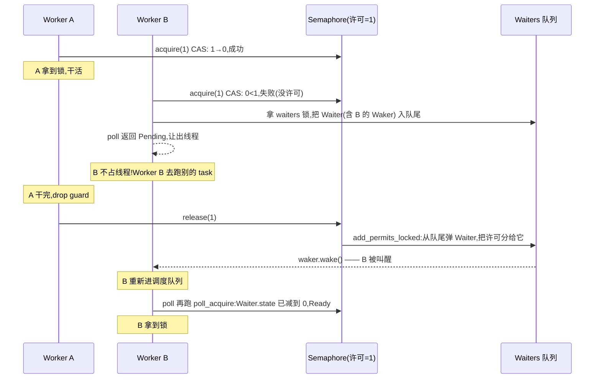

# 第 15 章 · async Mutex / RwLock

> **核心问题**:为什么 async 代码里不能随手用 `std::sync::Mutex`?`tokio::sync::Mutex` 凭什么能让一个任务"等锁时不占线程"——锁这一刻还在执行流里,下一刻它怎么就"挂起"了,锁一释放又怎么"被叫醒"?它和标准库那个"线程阻塞"的 Mutex,在并发模型上到底差在哪一层?同一个 `tokio::sync::Mutex`,内部其实只用了一个**信号量**,怎么既变出 Mutex 又变出 RwLock?
>
> 这是**第 5 篇·并发原语:sync 模块**的开篇。第 1 篇讲透的"Waker 怎么把挂起的 task 叫醒"、第 2 篇讲的"协作式调度、任务必须自觉让出线程",在这里终于落到第一个具体的协作场景——**任务之间抢锁**。本章我们盯死一个问题:**当 A 任务占着锁、B 任务要这把锁时,B 怎么"不占线程地等"?**
>
> **读完本章你会明白**:
> - 为什么在 async 代码里直接用 `std::sync::Mutex` 会"炸"——不是编译报错,是运行时**把整个 worker 线程、连同线程上其他几百个任务一起饿死**。什么时候 std Mutex 反而是更好的选择(tokio 自己的文档这么说,但很少人讲清为什么)。
> - async Mutex 怎么把"等锁"翻译成"等一个信号量许可",再翻译成"Future 返回 Pending + 把 Waker 排进队列"——这一条翻译链,把第 1 篇的 poll/Waker 落到 sync 原语上。
> - `Mutex::lock()` 为什么是个 `async fn`(它返回的 Future 内部是什么),`MutexGuard::drop` 为什么不需要 `async`(释放锁是同步的、立刻唤醒队首)。
> - **tokio 的 Mutex 和 RwLock 共用同一个底层信号量**——RwLock 的"读用 1 个许可、写用 MAX_READS 个许可"是个干净到发指的复用,你读完会拍大腿。
> - 等待者队列怎么做到**公平(FIFO)**,为什么 tokio 选 FIFO 而不是 std Mutex 的"非公平抢";以及那个把"无锁快路径 + 争用入队"两段揉在一起的精妙实现。
>
> **如果一读觉得太难**:先只记住三件事——① async Mutex **本质是一个许可数 = 1 的 Semaphore**(包了一层 guard);② `lock().await` 里的 `.await`,就是"抢许可抢不到时挂起、被叫醒再抢",**这就是它'不占线程'的全部秘密**;③ `MutexGuard::drop` 不需要 async,因为释放 = 归还许可 = 唤醒队首,这一切是同步的。源码里那个"先 CAS 抢、抢不到拿锁入队"的双路径,看不懂可以先放,先抓住"许可数 = 1 的信号量"这一个心智模型。

---

## 章首·一句话点破

> **async Mutex 就是一个"许可数 = 1 的信号量",外面套一层 `MutexGuard`。`lock().await` 翻译成"抢那唯一一个许可"——抢到,guard 给你;抢不到,把 Waker 排进等待队列、返回 Pending、把线程让出去。** `MutexGuard::drop` 不需要 `.await`,因为它干的事就是"归还许可",归还的同时顺便叫醒队首那个等的人——这是同步的,几十纳秒就完。它和 `std::sync::Mutex` 的根本差别不在"加锁本身",而在**"抢不到时怎么办"**:std 版让**线程**阻塞,async 版让**任务**挂起。一字之差,把"等锁"从"占用一整根 worker"里解放出来。

这是**结论**。本章倒过来拆:先看"async 代码里直接用 std Mutex"会撞什么墙——这个坑踩过的人极多,值得专门讲透;再把 `Mutex::lock().await` 翻译链一步步拆开,看清它如何把"等锁"变成"等许可 + 挂起 + 被叫醒";然后落到 tokio 源码,看 Mutex 和 RwLock 怎么**复用同一个**信号量实现,最后技巧精解里把"无锁快路径 + 争用入队"这条双路径拆透。

第 4 章(Waker)讲过"挂起的 task 靠 Waker 被叫醒",第 5 章(Task)讲过"协作式调度、任务必须自觉让出线程",第 9 章讲过 budget——这些是本章的前置,只一句回扣,不重讲。

---

## 一、先看反面:async 代码里直接用 std Mutex 会怎样

要理解 tokio 为什么专门做一套 async Mutex,得先看清"不这么做"的代价。这是 async Rust 里**最容易踩、最隐蔽**的坑之一。

### 坑一:守卫跨 await 点 = 阻塞整个 worker

最典型的踩坑代码长这样:

```rust
// 简化示意,非源码原文:踩坑代码
use std::sync::Mutex;

async fn bad_use(m: Arc<Mutex<DbConn>>, req: Request) -> Response {
    let conn = m.lock().unwrap();        // 拿到 std MutexGuard
    let rows = conn.query(req.sql()).await;   // ← 致命:guard 跨过 .await
    drop(conn);
    rows
}
```

看起来人畜无害,可这一行 `conn.query(req.sql()).await` 是个炸弹。`query` 是个 async 操作,它内部会 await——多半在等数据库回包。这个 await 期间,`conn` 这个 `MutexGuard` 还活着,**锁没释放**。

> **不这样会怎样**:这一刻,如果别的任务也要拿这把锁(`m.lock()`),它会被 std Mutex 阻塞——而 std Mutex 的阻塞是**OS 线程级**的。阻塞的是谁?是当前这个 worker 线程。worker 线程被阻塞,意味着**这个 worker 本地队列里所有其他 task,全部卡死**。

把这个场景翻译成餐厅:

> **比喻回到餐厅**:服务员 A 接到 3 号桌的订单,要去数据库那边取菜。可数据库的"取菜窗口"被一把锁管着(代表那个共享的 `DbConn`),A 拿到锁,然后**站在窗口边等数据库做菜**(.await)。这一站,A 这个人(worker 线程)就**钉死在窗口边了**——经理喊"A 去 5 号桌!",A 听不见,他正在 `std Mutex` 里阻塞;前台喊"A 这个催单到点了!",A 也听不见。**A 手里那摞本地订单(本地队列里其他几百个 task),一个都跑不动**,因为 A 这个工人不在线了。

这跟第 0 章讲的"thread-per-connection 的崩点三:阻塞 = 纯浪费"是同一个病根,只是从"线程"挪到了"worker 线程"。一根 worker 线程上可能挂着几百上千个 task,一个 std Mutex 的阻塞,**把这一根线程上的全部并发量抹平**——tokio "用极少线程扛大并发"的红利,瞬间归零。

### 坑二:即使不跨 await,也可能死锁

就算你极其小心地"加锁→干活→drop→才 await",std Mutex 在 async 代码里仍然是个雷:

```rust
// 简化示意,非源码原文:看似安全,实则仍可能死锁
async fn maybe_deadlock(m: Arc<std::sync::Mutex<Data>>) {
    {
        let g = m.lock().unwrap();
        g.process();    // 同步函数,看起来没 await
        // 如果 process() 内部间接调用了某个 spawn 的任务,而那个任务也要这把锁……
        // 或者 process() 调用了 block_on / tokio::task::yield_now……
    }
    // g drop 之后才到 await
    other_async().await;
}
```

> **不这样会怎样**:你看似守卫没跨 await,但 `process()` 里如果**间接**进入了运行时(比如它内部 `spawn_blocking` 又 `await`,或者通过回调进入了别的 async 代码),那个新进入的 task 也可能要这把锁。当前 task 还占着锁没 drop,新 task 阻塞等锁——可新 task 跑的就是当前这根 worker,它一阻塞,当前 task 永远没机会走到 drop。**死锁**。

async 代码的执行流是**多段**的(poll 一段、挂起、再 poll 一段),std Mutex 设计于"一段到底"的同步世界,它对"守卫跨执行段"没有任何防御。一旦守卫和别的 async 操作在时间上交叠,死锁和饿死就像定时炸弹。

### 那为什么 tokio 文档又说"优先用 std Mutex"?

读 tokio `Mutex` 的 rustdoc,你会看到一句让很多人困惑的话:

> Contrary to popular belief, it is ok and often preferred to use the ordinary `Mutex` from the standard library in asynchronous code.

([tokio/src/sync/mutex.rs:24-36](../tokio/tokio/src/sync/mutex.rs#L24-L36))

这跟上面说的"踩坑"是不是矛盾?**不矛盾**——tokio 说的是:**如果你能保证 guard 不跨 await 点**(锁进来、同步干活、drop、再 await),std Mutex 反而更便宜。原因是:

- **std Mutex 的"无竞争"快路径只是一次 `lock` 原子操作,几十纳秒,极快**;
- **tokio Mutex 因为是异步的,每次 `lock().await` 至少构造一个 Future、走一次状态机**,有额外开销;
- 数据竞争(锁只保护内存数据、临界区纯 CPU)场景下,锁持有时间是纳秒到微秒级,**根本不会让任务挂起**——这种场景下,std Mutex 的"阻塞"根本不会发生(无竞争就直接拿到锁了),async Mutex 的开销纯属浪费。

那什么时候**必须**用 async Mutex?**tokio 文档自己给了答案**(同上 L27-36):

> The primary use case for the async mutex is to provide shared mutable access to IO resources such as a database connection.

翻译:**async Mutex 的主战场,是"锁要保护 IO 资源,而 IO 操作本身是 async 的"**——比如一把锁保护一个数据库连接,你要在持锁期间 `conn.query().await`。这种场景下 guard 必然跨 await,std Mutex 会饿死整根 worker,只有 async Mutex 能"等查询时把线程让出去"。

> **钉死这件事**:**std Mutex vs async Mutex 的选择,不在"锁保护的是数据还是 IO",而在"守卫会不会跨 await 点"**。会跨(典型:持锁期间 await) → 必须 async Mutex;不跨(典型:同步干活、马上 drop) → std Mutex 更便宜。这是个工程取舍,不是宗教。

### 三个反面,夹出需求

| 反面 | 病根 | 想要的 |
|------|------|--------|
| std Mutex 守卫跨 await | .await 期间 worker 阻塞,同线程所有 task 饿死 | "等锁时**让任务挂起**,而不是让**线程阻塞**" |
| std Mutex 间接死锁 | sync 锁对"跨执行段"无防御 | 锁的等待要能和 async 调度协作 |
| async Mutex 滥用 | 无竞争场景下 Future 状态机开销浪费 | 只在"持锁跨 await"时才用 async |

三条夹出本章的核心问题:**怎么造一把"等锁时让任务挂起、不占线程,锁一好被叫醒"的 Mutex?** 答案藏在第 1 篇那条"`Pending` 必留 Waker"的法律里——把"等锁"翻译成"等一个事件",事件源是"有人释放了锁"。

---

## 二、把"等锁"翻译成"等许可":async Mutex 的核心心智模型

现在看 tokio 的 `Mutex` 长什么样。先看它的定义(本章源码引用都以 tokio@1.52.3 / commit `7892f60` 为准):

```rust
// tokio/src/sync/mutex.rs(摘录)
pub struct Mutex<T: ?Sized> {
    #[cfg(all(tokio_unstable, feature = "tracing"))]
    resource_span: tracing::Span,
    s: semaphore::Semaphore,     // ← 一把信号量!
    c: UnsafeCell<T>,            // ← 实际数据
}
```

([tokio/src/sync/mutex.rs:133-138](../tokio/tokio/src/sync/mutex.rs#L133-L138))

**就两个字段:一个信号量,一个数据**。Mutex 的全部"锁"语义,落在那个 `s: semaphore::Semaphore` 上——而这里的 `semaphore::Semaphore` 是 `crate::sync::batch_semaphore::Semaphore`(见文件顶部 `use crate::sync::batch_semaphore as semaphore;`,[mutex.rs:3](../tokio/tokio/src/sync/mutex.rs#L3))。所以一把 async Mutex,**本质上就是一把许可数 = 1 的信号量**,外加一层"独占访问数据"的包装。

`Mutex::new` 把信号量初始化成"1 个许可":

```rust
// tokio/src/sync/mutex.rs(摘录)
pub fn new(t: T) -> Self {
    // ... tracing 省略
    let s = semaphore::Semaphore::new(1);   // ← 关键:许可数 = 1
    Self {
        c: UnsafeCell::new(t),
        s,
        // ...
    }
}
```

([tokio/src/sync/mutex.rs:338-367](../tokio/tokio/src/sync/mutex.rs#L338-L367))

**"1 个许可"= 最多一个人拿到 = 互斥锁**。这是把 Mutex 翻译成信号量的全部魔法。接下来 `lock()` 就是"抢那一个许可":

```rust
// tokio/src/sync/mutex.rs(摘录,去掉 tracing)
pub async fn lock(&self) -> MutexGuard<'_, T> {
    let acquire_fut = async {
        self.acquire().await;             // ← 抢许可
        MutexGuard {
            lock: self,
        }
    };
    let guard = acquire_fut.await;
    guard
}
```

([tokio/src/sync/mutex.rs:434-466](../tokio/tokio/src/sync/mutex.rs#L434-L466))

而 `self.acquire()`(同文件内部)就是 `self.s.acquire(1)`——从信号量抢 1 个许可。这,就是 async Mutex 把"等锁"翻译成的样子:

> **async Mutex = "许可数 = 1 的信号量";`lock().await` = "抢一个许可,抢不到就挂起、被叫醒再抢"**。

### 这条翻译链,为什么能"不占线程"

关键在那个 `.await`。把 `lock()` 拆细:

1. **调 `self.s.acquire(1).await`**——这是个 Future。
2. **第一次 poll 这个 Future**:`Semaphore::poll_acquire` 先做"无锁快路径"(下文详拆),原子地 CAS 减许可。如果当前许可 ≥ 1,CAS 成功,**许可 - 1,Future 返回 `Ready(Ok(()))`,锁拿到**。整个过程纳秒级,没挂起。
3. **如果许可 = 0(锁被人占着)**:CAS 失败,`poll_acquire` 进入慢路径——拿 `waiters` 这把 `Mutex`(保护等待队列),把当前 task 的 `Waiter`(含 Waker)塞进链表尾部,**返回 `Poll::Pending`**。
4. **返回 `Pending` 的瞬间,任务挂起、worker 线程立刻去 poll 别的 task**——这是第 2 章那条法律:"Pending 必留 Waker"。这里留的 Waker,在 `Waiter.waker` 字段里。
5. **占着锁的人 drop guard**:`MutexGuard::drop` → 调 `s.release(1)` → `Semaphore::release` → `add_permits_locked` → **从等待队列尾部弹出一个 Waiter,把它的 Waker `wake`**。
6. **被 wake 的 task 重新进调度队列**,某个 worker 取出来再 poll 它,这次 `poll_acquire` 重新跑——这次许可已经分配给它了(`Waiter.state` 减到 0 表示"够了"),Future 返回 `Ready`,锁拿到。

> **比喻回到餐厅**:服务员 B 想接 3 号桌,可 3 号桌那个唯一的"接桌牌"(许可)被服务员 A 拿走了。B 不是**站在传菜口傻等**(std Mutex 的做法——阻塞线程),而是**在吧台留个呼叫器**(把 Waker 排进等待队列),然后**转身去服务 5 号桌**(让出线程)。A 服务完 3 号桌、把接桌牌归还(`release`),牌会自动**叫醒吧台那个呼叫器**(wake 队首 Waker),B 被叫回来,**拿到接桌牌**,继续服务 3 号桌。

这套机制,把"等锁"从"占用一整根 worker 线程",挪到了"占用一个 Waiter 节点(几十字节)+ 一个 Waker"。锁等待期间,worker 在跑别的 task,**线程没空耗**。这正是第 5 篇"协作 / 事件唤醒"二分法在 sync 原语上的第一次落地。

### `MutexGuard::drop` 为什么不需要 `async`

一个常被忽视的细节:`Mutex::lock` 是 `async fn`,但 `MutexGuard::drop`(释放锁)是同步的 `Drop::drop`,**不是 async**。为什么?

> **不这样会怎样(反面)**:假设释放锁也做成 async:`drop_async(guard).await`。drop 一旦能 await,就意味着"释放锁"这个动作**自己可能挂起**。可释放锁是要"叫醒等的人"的——如果它挂起了,等的人怎么被叫醒?死锁。

而且,释放锁这件事**根本不需要等待任何东西**。释放 = 把许可加回去(一次原子 add)+ 把队首 Waker 叫醒(一次 `waker.wake()`)。两步都是同步的、纳秒级的、不可能失败的。tokio 把它做成同步 `Drop`,完全正确。

看 guard 的定义:

```rust
// tokio/src/sync/mutex.rs(摘录)
pub struct MutexGuard<'a, T: ?Sized> {
    #[cfg(all(tokio_unstable, feature = "tracing"))]
    resource_span: tracing::Span,
    lock: &'a Mutex<T>,
}
```

([tokio/src/sync/mutex.rs:149-157](../tokio/tokio/src/sync/mutex.rs#L149-L157))

guard 持有一个对 `Mutex` 的引用(`lock: &'a Mutex<T>`)。drop 时,通过这个引用调到信号量的 `release`:

```rust
// tokio/src/sync/mutex.rs(简化示意,非源码原文)
impl<'a, T: ?Sized> Drop for MutexGuard<'a, T> {
    fn drop(&mut self) {
        // 归还许可,顺便唤醒等待队列
        self.lock.s.release(1);
    }
}
```

(实际实现见 [mutex.rs:964-979](../tokio/tokio/src/sync/mutex.rs#L964-L979) 附近的 `unlock_and_relock` 路径,以及 `Semaphore::release`,[batch_semaphore.rs:231-238](../tokio/tokio/src/sync/batch_semaphore.rs#L231-L238))

> **钉死这件事**:`lock().await` 必须是 async(因为可能挂起),`guard.drop()` 必须是 sync(因为释放锁只需要归还许可 + 唤醒队首,两步同步、纳秒级)。这是 async Mutex 设计里**最重要的对称破缺**:抢锁慢(可能等),放锁快(立刻完成)。这条不对称决定了 async Mutex 的全部 API 形态。

### 一张时序图看清"acquire → 挂起 → 唤醒"



图里最关键的是中间那段"B 不占线程"——`B poll 返回 Pending` 之后到 `waker.wake()` 之前,worker B 在跑别的 task。**这就是 async Mutex 把"等锁"从"占用线程"里解放出来的全部秘密**。

---

## 三、底座信号量:无锁快路径 + 争用入队

心智模型清楚了,现在落到源码看那个 `Semaphore` 到底怎么实现"无锁快路径 + 争用入队"。这是本章技巧精解的主角,先在这里把它的全貌立起来。

### Semaphore 的内存布局

```rust
// tokio/src/sync/batch_semaphore.rs(摘录)
//! The semaphore is implemented using an intrusive linked list of waiters. An
//! atomic counter tracks the number of available permits. If the semaphore does
//! not contain the required number of permits, the task attempting to acquire
//! permits places its waker at the end of a queue.

pub(crate) struct Semaphore {
    waiters: Mutex<Waitlist>,       // 等待者队列(被一把 std Mutex 保护)
    permits: AtomicUsize,           // ← 关键:许可数(原子)
    // ...
}

struct Waitlist {
    queue: LinkedList<Waiter, <Waiter as linked_list::Link>::Target>,
    closed: bool,
}

struct Waiter {
    state: AtomicUsize,             // 还需要多少许可(0 = 够了,该出队)
    waker: UnsafeCell<Option<Waker>>,   // task 的 Waker
    pointers: linked_list::Pointers<Waiter>,  // 侵入式链表指针
    _p: PhantomPinned,              // !Unpin(因为 Waker 节点要被 pin 在 Future 里)
}
```

([tokio/src/sync/batch_semaphore.rs:1-112](../tokio/tokio/src/sync/batch_semaphore.rs#L1-L112))

三个要点:

1. **`permits: AtomicUsize`** —— 许可数,原子变量。**无锁快路径只动它**。
2. **`waiters: Mutex<Waitlist>`** —— 等待队列,被一把普通 `std::sync::Mutex` 保护。注意:tokio 在 sync 原语内部,**用 std 的 Mutex** 保护等待队列——这是合理的,因为这把锁只锁"操作等待队列"那一小段(入队/出队),临界区极短,不会跨 await。
3. **`Waiter` 是侵入式链表节点**——它直接长在 Future(`Acquire`)内部,不单独堆分配。这是个经典的无锁/低分配技巧(第 16 章 mpsc 还会看到更极致的版本)。

`permits` 这个 `AtomicUsize` 还藏了个小技巧——**最低位是 CLOSED 标志,真正的许可数在高位**:

```rust
// tokio/src/sync/batch_semaphore.rs(摘录)
pub(crate) const MAX_PERMITS: usize = usize::MAX >> 3;
const CLOSED: usize = 1;
// 最低位留给 CLOSED 标志
const PERMIT_SHIFT: usize = 1;
```

([tokio/src/sync/batch_semaphore.rs:122-135](../tokio/tokio/src/sync/batch_semaphore.rs#L122-L135))

所以 `permits >> 1` 才是真正的许可数,`permits & 1 == 1` 表示信号量被关闭。一个 `AtomicUsize` 同时装"许可数 + closed 标志",和第 5 章 task 状态字打包是同一个套路——**一个原子字同时改多个语义位,避免撕裂中间态**。

### 快路径:CAS 抢许可,无锁

`poll_acquire` 一进来,先做快路径——**不拿等待队列锁,直接 CAS `permits`**:

```rust
// tokio/src/sync/batch_semaphore.rs(摘录,简化)
fn poll_acquire(
    &self,
    cx: &mut Context<'_>,
    num_permits: usize,
    node: Pin<&mut Waiter>,
    queued: bool,
) -> Poll<Result<(), AcquireError>> {
    let mut curr = self.permits.load(Acquire);
    let mut waiters = loop {
        if curr & Self::CLOSED > 0 {
            return Poll::Ready(Err(AcquireError::closed()));
        }

        let (next, acq) = if curr >= num_permits << Self::PERMIT_SHIFT {
            // 够!CAS 减许可
            (curr - (num_permits << Self::PERMIT_SHIFT), num_permits)
        } else {
            // 不够,慢路径
            // ...
        };

        match self.permits.compare_exchange(curr, next, AcqRel, Acquire) {
            Ok(_) => {
                // 抢到了!
                return Poll::Ready(Ok(()));
            }
            Err(actual) => curr = actual,    // CAS 失败,重读,重试
        }
    };
    // ... 慢路径(下文讲)
}
```

([tokio/src/sync/batch_semaphore.rs:397-473](../tokio/tokio/src/sync/batch_semaphore.rs#L397-L473),简化展示)

快路径的逻辑:**一个 `compare_exchange` 自旋循环**——读 `permits`、判断够不够、够就 CAS 减、失败就重读重试。**全程无锁**——没有拿 `waiters` 那把 std Mutex,没有触碰等待队列,纯粹原子操作。这个快路径是 tokio 信号量的性能命脉:**无竞争时,acquire 就是一次成功的 CAS,十几纳秒**。

> **不这样会怎样(反面)**:如果 acquire 一上来就拿 `waiters.lock()`,每次抢锁都要进入临界区——无竞争场景下也是几百纳秒的锁开销,百万并发 acquire 会把这把 std Mutex 打爆。快路径的精妙在于:**只争一个原子字**,争赢了就拿到锁、根本不碰等待队列。等待队列只在"真的有人排队"时才被触碰。

### 慢路径:抢不到,入队挂起

快路径不够用(`curr < num_permits`)时,进慢路径:

```rust
// tokio/src/sync/batch_semaphore.rs(摘录,简化,接续上面)
        // 快路径不够用,要拿等待队列锁了
        if remaining > 0 && lock.is_none() {
            lock = Some(self.waiters.lock());   // ← 拿 std Mutex 保护等待队列
        }
        // ... 再 CAS 一次把能拿的许可拿走(可能拿到部分)
        // break 出循环,持有 waiters 锁

    if waiters.closed {
        return Poll::Ready(Err(AcquireError::closed()));
    }

    // 把 Waker 存进 Waiter 节点
    node.waker.with_mut(|waker| {
        let waker = unsafe { &mut *waker };
        if waker.as_ref().map_or(true, |w| !w.will_wake(cx.waker())) {
            old_waker = waker.replace(cx.waker().clone());   // ← 关键:留 Waker!
        }
    });

    // 如果还没入队,塞进队尾
    if !queued {
        let node = unsafe { NonNull::new_unchecked(...) };
        waiters.queue.push_front(node);    // ← 入队尾
    }
    drop(waiters);
    drop(old_waker);

    Poll::Pending    // ← 返回 Pending,挂起
}
```

([tokio/src/sync/batch_semaphore.rs:434-522](../tokio/tokio/src/sync/batch_semaphore.rs#L434-L522),简化展示)

慢路径的四个动作:**① 拿 `waiters` 锁**;**② 把当前 task 的 Waker 塞进 `Waiter.waker`**(第 2 章那条"Pending 必留 Waker"的法律在这里落地);**③ 把 Waiter 节点 push 进链表尾部**(FIFO,保证公平);**④ 释放 `waiters` 锁,返回 `Pending`**。

这里有一个**关键的顺序**——注释里写得很明白:

> We need to do this _before_ the CAS that sets the new value of the semaphore's `permits` counter. Otherwise, if we subtract the permits and then acquire the lock, we might miss additional permits being added while waiting for the lock.
> ([batch_semaphore.rs:434-442](../tokio/tokio/src/sync/batch_semaphore.rs#L434-L442))

意思是:**先拿 `waiters` 锁,再做那个 CAS**。为什么?因为 `release`(归还许可)也是先拿 `waiters` 锁、再分发许可。如果 acquire 先 CAS 减许可、再拿锁,中间有个时间窗——别的线程 release 把许可加回来,可它拿不到 `waiters` 锁(acquire 还没拿),它就以为"没人等,许可还给 `permits` 字段就行";而 acquire 这边 CAS 已经把许可减走了,根本不知道有人归还过。**许可会丢,等的人永远不会被叫醒**。先拿锁再 CAS,把 release 也卡在锁外,这个窗口就关上了。

> **钉死这件事(慢路径的顺序)**:acquire 慢路径**必须先拿 `waiters` 锁,再 CAS `permits`**。这保证"判断许可不够"和"登记等待"是一个临界区,中间不会有 release 漏进去。这是无锁代码里典型的"先拿辅助锁再动原子字"的顺序约束——看似只是顺序,实则关乎正确性。

### release:归还许可,唤醒队首

释放锁(`MutexGuard::drop`)走 `Semaphore::release`:

```rust
// tokio/src/sync/batch_semaphore.rs(摘录)
pub(crate) fn release(&self, added: usize) {
    if added == 0 {
        return;
    }
    self.add_permits_locked(added, self.waiters.lock());
}

fn add_permits_locked(&self, mut rem: usize, mut waiters: MutexGuard<'_, Waitlist>) {
    let mut wakers = WakeList::new();
    let mut lock = Some(waiters);
    let mut is_empty = false;
    while rem > 0 {
        let mut waiters = lock.take().unwrap_or_else(|| self.waiters.lock());
        'inner: while wakers.can_push() {
            match waiters.queue.last() {     // 看队首(链表 last 是队首,FIFO)
                Some(waiter) => {
                    if !waiter.assign_permits(&mut rem) {
                        break 'inner;        // 队首还不够,本批停止
                    }
                }
                None => {
                    is_empty = true;         // 队列空了
                    break 'inner;
                }
            };
            let mut waiter = waiters.queue.pop_back().unwrap();   // 弹出队首
            if let Some(waker) = unsafe { waiter.as_mut().waker.with_mut(|w| (*w).take()) } {
                wakers.push(waker);          // 收集要唤醒的 Waker
            }
        }

        if rem > 0 && is_empty {
            // 队列空了还有剩许可,还回 permits 字段
            self.permits.fetch_add(rem << Self::PERMIT_SHIFT, Release);
            rem = 0;
        }

        drop(waiters);                  // ← 关键:先释放锁
        wakers.wake_all();              // 再唤醒(避免 wake 触发重入 acquire 时锁还没放)
    }
}
```

([tokio/src/sync/batch_semaphore.rs:231-370](../tokio/tokio/src/sync/batch_semaphore.rs#L231-L370),简化展示)

读这段,抓三个关键设计:

**① `assign_permits`:把许可"分配"给队首 Waiter,而不是直接加回 `permits`**。`Waiter.state` 存的是"这个等待者还需要多少许可"。`release` 不是简单把许可加回 `permits`,而是**精准投递**给队首 Waiter——把它的 `state` 减一减,减到 0 就表示"它要的够了,该被唤醒"。这个设计保证**公平性**(FIFO):先来的等待者优先拿到许可,不会饿死。

**② 先 `drop(waiters)` 释放锁,再 `wakers.wake_all()`**。这是另一个顺序约束——**唤醒必须在锁外**。为什么?因为 `wake()` 会让被唤醒的 task 立刻重新进调度队列,某个 worker 可能立刻 poll 它,它一进来又要拿 `waiters` 锁——如果此时 `release` 还攥着锁,就死锁了(或者无谓的阻塞)。先放锁再 wake,把临界区缩到最小。

**③ `WakeList` 批量唤醒**。`wakers` 是个本地小数组,把一次 `release` 要唤醒的 Waker 先收集起来,出锁后批量 `wake_all`。这是个小优化——避免每个 wake 都单独进出锁。

> **钉死这件事(release 的三个关键)**:① **精准投递许可给队首**,保证 FIFO 公平;② **先放锁再 wake**,避免 wake 的重入死锁;③ **批量唤醒**,减少锁进出的次数。这三件事加起来,让 release 在高并发下既正确又快。

---

## 四、RwLock:用同一个信号量,实现"读共享 / 写独占"

讲完 Mutex,看 RwLock。`tokio::sync::RwLock` 的源码会让你拍案叫绝——**它和 Mutex 共用同一个 `Semaphore`**,只是"读锁 acquire 1 个许可,写锁 acquire MAX_READS 个许可"。

```rust
// tokio/src/sync/rwlock.rs(摘录)
pub struct RwLock<T: ?Sized> {
    #[cfg(all(tokio_unstable, feature = "tracing"))]
    resource_span: tracing::Span,
    //semaphore to coordinate read and write access to T
    s: Semaphore,                // ← 同一个信号量!
    //inner data T
    c: UnsafeCell<T>,
    // ...
}
```

([tokio/src/sync/rwlock.rs:87-99](../tokio/tokio/src/sync/rwlock.rs#L87-L99))

`MAX_READS` 是个常量,在 32 位以上平台是 `u32::MAX >> 3`(约 5 亿):

```rust
// tokio/src/sync/rwlock.rs(摘录)
#[cfg(any(target_pointer_width = "64", target_pointer_width = "32"))]
const MAX_READS: u32 = u32::MAX >> 3;
```

([tokio/src/sync/rwlock.rs:24-27](../tokio/tokio/src/sync/rwlock.rs#L24-L27))

`RwLock::new` 把信号量初始化成 `MAX_READS` 个许可:

```rust
// tokio/src/sync/rwlock.rs(摘录)
pub fn new(value: T) -> RwLock<T> {
    // ... tracing 省略
    let s = Semaphore::new(MAX_READS as usize);   // ← 关键:许可数 = MAX_READS
    RwLock {
        c: UnsafeCell::new(value),
        s,
        // ...
    }
}
```

([tokio/src/sync/rwlock.rs:203-249](../tokio/tokio/src/sync/rwlock.rs#L203-L249))

然后看 `read` 和 `write`:

```rust
// tokio/src/sync/rwlock.rs(摘录,简化)
pub async fn read(&self) -> RwLockReadGuard<'_, T> {
    self.s.acquire(1).await.unwrap_or_else(|_| unreachable!());   // ← 抢 1 个许可
    RwLockReadGuard { s: &self.s, data: self.c.get(), marker: PhantomData }
}

pub async fn write(&self) -> RwLockWriteGuard<'_, T> {
    self.s.acquire(MAX_READS as usize).await.unwrap_or_else(|_| unreachable!());  // ← 抢 MAX_READS 个许可!
    RwLockWriteGuard { s: &self.s, data: self.c.get(), marker: PhantomData }
}
```

([tokio/src/sync/rwlock.rs:436-451, 780-816](../tokio/tokio/src/sync/rwlock.rs#L436-L816),简化展示)

**就这么几行,RwLock 的全部语义就建立了**。怎么做到的?

- **读锁抢 1 个许可**——所以最多 `MAX_READS` 个读者能同时拿到(因为信号量初始有 `MAX_READS` 个许可),它们各自消耗 1 个。
- **写锁抢 MAX_READS 个许可**——意味着写者要拿到锁,**必须独占全部许可**。只要有一个读者在(消耗了 1 个许可),`MAX_READS` 就凑不齐,写者就得等。
- 写者拿到锁的瞬间,信号量许可 = 0,任何新读者(要 1 个许可)也凑不齐,被挡在门外。**写者独占**。

读者 drop guard 归还 1 个许可;写者 drop guard 归还 `MAX_READS` 个许可。归还触发 release,唤醒队首——队首可能是等写的(要 `MAX_READS`),也可能是等读的(要 1 个)。`assign_permits` 精准投递:许可够队首的需求就唤醒它,不够就停。这就天然实现了**"写着不会被读者饿死"**(因为写者在队首,只要许可攒够 `MAX_READS` 就一定被唤醒,不会插队),也实现了**"读者并发"**(多个读者各拿 1 个)。

> **钉死这件事(RwLock 的复用)**:tokio 的 RwLock 不是从零写的——它**复用 Mutex 的信号量**,只改了两个常量:**许可总数 = MAX_READS**,**写锁要 MAX_READS 个许可**。一行 `acquire(1)` vs `acquire(MAX_READS)`,就分出了读和写。这是"用许可数表达互斥语义"的极致复用——把"读写锁"这种看似复杂的东西,翻译成"信号量的许可数",瞬间清晰。batch_semaphore.rs 文件顶部那段注释(`Because waiters are enqueued at the back ... writers will not be starved by readers`,[batch_semaphore.rs:12-17](../tokio/tokio/src/sync/batch_semaphore.rs#L12-L17))说的就是这件事——FIFO 队列 + 多许可 acquire,天然防写者饿死。

### RwLock vs Mutex:何时用哪个

跟 std 一样,async RwLock 的取舍是:

- **读多写少**(配置、缓存、路由表)→ RwLock,多个读并发。
- **读少写多 / 临界区短** → Mutex 更简单、更快(信号量许可数少,CAS 路径更短)。

不过 tokio 文档同样提醒:**async RwLock 的开销比 std RwLock 大**,只在"持锁跨 await"时才用。和 Mutex 的取舍是同一个道理。

---

## 五、关于"公平性":为什么 tokio 选 FIFO

最后讲一个常被忽略但很重要的设计选择。`std::sync::Mutex` 是**非公平**的——一个新来的线程,只要锁刚好空闲,可以直接抢,不用排队。tokio 的 async Mutex / Semaphore 是**严格 FIFO** 的——文件顶部注释明说:

> Tokio's Mutex operates on a guaranteed FIFO basis. This means that the order in which tasks call the `lock` method is the exact order in which they will acquire the lock.
> ([mutex.rs:20-22](../tokio/tokio/src/sync/mutex.rs#L20-L22))

> Because waiters are enqueued at the back of the linked list and dequeued from the front, the semaphore is fair.
> ([batch_semaphore.rs:11-17](../tokio/tokio/src/sync/batch_semaphore.rs#L11-L17))

为什么选 FIFO?有得有失:

- **得**:严格公平,**没有任何 task 会被饿死**。这对 async 场景特别重要——一个 task 等 100ms 在 async 里已经是很久,如果它被反复插队,可能永远拿不到锁,体验崩塌。
- **失**:每次 acquire 都要走"先 CAS、CAS 失败拿锁入队"的流程,**新来的 task 不能"插队"**——即使锁刚释放、恰好它要来抢,也得乖乖排到队尾。在高并发短临界区场景,这比 std Mutex 的非公平抢**稍微慢一点**(更多任务走慢路径)。

tokio 选 FIFO,是因为 async 场景的**延迟敏感性**和**协作式调度**本质——任务之间的"自觉"很重要,锁的公平性是其中一环。这跟 std 选非公平的取舍(吞吐优先、允许少量饿死)是两套哲学。

> **钉死这件事**:**async Mutex/RwLock 是 FIFO 公平的**,实现上靠"等待者链表从尾部入队、从头部出队"。这保证没有 task 被饿死,代价是吞吐略低于非公平锁。tokio 在 sync 原语上选公平,是它"协作式 / 防饿死"哲学的延续(呼应第 9 章 budget 的设计动机)。

---

## 技巧精解:无锁快路径 + 争用入队,以及许可数表达互斥

这一节把本章两个最硬核的技巧拆透,配反面对比。

### 技巧一:双路径——快路径无锁 CAS,慢路径才入队

#### 解决的问题

acquire 是热路径——百万并发下,信号量每秒可能被 acquire 上千万次。绝大多数 acquire 在"无竞争"或"低竞争"场景下,**许可够、没人排队**。这种场景下,如果每次 acquire 都要拿等待队列锁(`waiters.lock()`),开销不可接受。

#### tokio 的做法

**双路径**:

- **快路径**(`poll_acquire` 开头):不拿 `waiters` 锁,**只 CAS `permits`**。CAS 成功,直接 `Ready`,十几纳秒,纯原子操作。
- **慢路径**(CAS 不够用时):才拿 `waiters` 锁,把 Waiter 入队、留 Waker、返回 Pending。

关键代码再贴一次(精简):

```rust
// 快路径:纯原子
let mut curr = self.permits.load(Acquire);
loop {
    if curr >= needed {
        let next = curr - needed;
        match self.permits.compare_exchange(curr, next, AcqRel, Acquire) {
            Ok(_) => return Poll::Ready(Ok(())),    // 抢到,走人
            Err(actual) => curr = actual,
        }
    } else {
        // 不够,转慢路径
        lock = Some(self.waiters.lock());           // 才拿锁
        break;
    }
}
// 慢路径:入队、留 Waker、Pending
```

([tokio/src/sync/batch_semaphore.rs:412-522](../tokio/tokio/src/sync/batch_semaphore.rs#L412-L522),简化示意)

#### 反面对比 A:全程加锁(每次都进临界区)

```rust
// 简化示意,非源码原文:反面,每次 acquire 都进临界区
fn acquire(&self) {
    let mut waiters = self.waiters.lock();          // 每次都拿锁
    if waiters.permits > 0 {
        waiters.permits -= 1;                        // 在锁里改许可
        return;
    }
    // 入队 ...
}
```

> **不这样会怎样**:百万并发 acquire,**每次都进 `waiters.lock()` 临界区**。std Mutex 在低竞争下虽然快,但百万级争用下,这把锁就是单点瓶颈——所有 acquire 串行化在这把锁上,吞吐直接打爆。这等于把 async "扛大并发"的红利,在 sync 原语这一层送回去了一半。

#### 反面对比 B:全程无锁(纯 CAS)

```rust
// 简化示意,非源码原文:反面,慢路径也想纯 CAS
fn acquire(&self) {
    loop {
        let curr = self.permits.load(Acquire);
        if curr >= 1 {
            // 快路径 CAS
            if self.permits.compare_exchange(curr, curr - 1, AcqRel, Acquire).is_ok() {
                return;
            }
        } else {
            // 慢路径:也想纯 CAS 把 Waiter 入队???
            // 但等待队列是个链表,链表入队无法靠单个 CAS 完成
            // (要改 tail 指针,还要把新节点的 prev 接上)
        }
    }
}
```

> **不这样会怎样**:等待队列是个**双向链表**,入队要同时改"前驱节点的 next 指针"和"链表 tail 指针"——这两步**没法用单个 CAS 原子完成**。要么用更复杂的无锁链表(Michael-Scott 队列之类),代码复杂度爆炸、ABA 问题频发;要么接受"用一把 std Mutex 保护链表"的简单方案。tokio 选后者——**链表操作用 std Mutex 保护,许可数用原子 CAS**——这是工程上的最优解:**简单、正确、性能足够**(因为慢路径只在真有竞争时才走,频率低)。

> **钉死这件事(双路径的本质)**:**双路径的本质是"分而治之"——把高频的'无竞争'路径做成纯原子(快),把低频的'有竞争'路径退回带锁的简单实现(慢但正确)**。这是 tokio sync 原语、也是几乎所有高性能并发原语的通用套路。第 16 章 mpsc 的"快路径 try_push / 慢路径入队"、第 17 章 Notify 的"快路径 CAS state / 慢路径拿锁唤醒"都是同一个模式。

### 技巧二:用许可数表达互斥语义

#### Mutex = 许可数 1,RwLock = 读 1 / 写 MAX_READS

这个技巧前面讲过了,这里集中拆透它"为什么妙"。**Mutex 和 RwLock 本质上是同一个东西的不同配置**:

| | Mutex | RwLock |
|---|---|---|
| 信号量初始许可 | 1 | MAX_READS |
| 抢锁需要的许可 | 1 | 读:1;写:MAX_READS |
| 互斥性来源 | 只 1 个许可,自然只能 1 人拿 | 写要全部许可,必独占;读只要 1 个,可共享 |
| 公平性 | FIFO | FIFO(且写不饿死) |

**这一表格的最后一行,是这套设计最妙的地方**:**RwLock 天然防写者饿死**,不需要任何额外代码。为什么?因为信号量的 FIFO 队列 + `assign_permits` 精准投递——一个写者排进队列后,只要累计归还的许可达到 `MAX_READS`,它就一定被唤醒(因为队首是它,`assign_permits` 把所有归还的许可投递给它)。读者归还的许可不会"插队"给新读者,因为新读者要排在写者后面。

> **不这样会怎样(反面)**:如果 RwLock 用"两个独立的锁——一个读锁计数 + 一个写锁"的传统设计,要专门写代码防写者饿死(典型做法:写者到来时挡住新读者,等当前读者都释放完才让写者进)。这套"writer preference"逻辑复杂、容易出 bug、且会降低读吞吐。tokio 的做法——**所有锁语义都翻译成"信号量许可"**——根本不需要写"writer preference",公平性自然从 FIFO 队列里冒出来。

#### 反面对比:从零写 RwLock

```rust
// 简化示意,非源码原文:反面,从零写 RwLock
struct BadRwLock<T> {
    state: AtomicUsize,    // 高位=读者数,低位=写者标志
    write_waiters: Mutex<Vec<Waker>>,
    read_waiters: Mutex<Vec<Waker>>,
    data: UnsafeCell<T>,
}

impl BadRwLock {
    async fn read(&self) {
        // 先尝试 CAS 加读者数
        // 失败:判断是不是有写者(看低位)
        // 有写者:入读等待队列,挂起
        // 写者释放:要叫醒所有等读的 + 一个等写的
        // 写者到来时要挡住新读者:这又要 CAS 改另一个'writer_pending' 标志
        // ...
    }
}
```

> **不这样会怎样**:状态字段一多,状态迁移就多,每条迁移都要正确处理"读者数、写者标志、写者等待标志"的组合——竞态窗口成倍增加,bug 也成倍增加。tokio 的做法——**把所有锁语义压扁成"许可数"**——把 RwLock 复杂度从"两个锁 + 几个标志位"降到"一个信号量 + 两个常量",代码量、bug 面、心智负担全面下降。

> **钉死这件事(许可数表达互斥)**:**把锁的语义翻译成信号量的许可数**,是 tokio sync 模块最漂亮的一次抽象复用。它把 Mutex、RwLock、Semaphore 三种原语统一在同一个底层实现(`batch_semaphore`)上,**只改许可数和 acquire 的数量**就表达出全部互斥语义。这种"找到正确的抽象,让多件事自然变成一件事的不同配置",是系统级代码里最值得学习的设计品味。

### 一个 sound 性的小补充:为什么 `UnsafeCell` 安全

最后补一个常被问的点:`Mutex<T>` 的 `c: UnsafeCell<T>`,凭什么安全?——明明多个 task 会拿 `&Mutex<T>`,然后通过 `MutexGuard` 拿到 `&mut T`,这不违反 Rust 的别名规则吗?

> **答案**:`MutexGuard` 只在**持锁**(抢到了许可)时才构造,drop 时立刻释放。同一时刻只有一个人能持锁(许可数 = 1),所以同一时刻只有一个 `MutexGuard` 存在,**只有一个 `&mut T`**。Rust 的别名规则被"运行时的许可数"保证了——不是静态保证,是运行时保证。这就是为什么 `Mutex` 能对外暴露 safe API:它把 `UnsafeCell` 的危险关在"持锁"这个不变量背后,而持锁这件事被信号量的原子操作严格保证。
>
> 第 5 章讲 task 的 `UnsafeCell<Stage<T>>` + `RUNNING` 位是同一个套路——**用运行时原子操作补上静态借用检查的缺口**。tokio 的 unsafe 都集中在"边界",内部抽象对用户全 safe。

---

## 章末小结

### 用"餐厅服务员"比喻回顾本章

1. **服务员 B 想接 3 号桌,可 3 号桌的"接桌牌"被 A 拿走了**(锁被人占)。B **不站在传菜口傻等**(那是 std Mutex 的做法——阻塞 worker 线程),而是**在吧台留个呼叫器**(Waker 入等待队列),然后**转身去服务 5 号桌**(.await 让出线程)。**B 等锁期间不占线程,这就是 async Mutex 的全部秘密**。
2. **接桌牌是个"许可数 = 1"的信号量**(Mutex 的本质);read 牌是"许可数 = MAX_READS"的信号量,read 用 1 个、write 用 MAX_READS 个——**同一个信号量,改两个常量,变成 RwLock**。
3. **抢接桌牌**:服务员瞄一眼牌子够不够(`AtomicUsize` CAS),够就拿走,十几纳秒(快路径);不够,在签到本上(`waiters` 链表)排个队,留个呼叫器(Waker),转身去干别的(慢路径)。**绝大多数抢牌走快路径,纯原子,无锁**。
4. **A 干完归还接桌牌**:翻签到本的队首,把牌精准投给那个人(`assign_permits`),按他留的呼叫器(`wake`),他被叫回来拿牌。**先合上签到本(放锁)再按呼叫器(wake),免得按完铃那人冲回来发现签到本还开着、自己拿不到**。
5. **签到本是 FIFO**:先来先服务,**没人会被饿死**。哪怕有一堆服务员都只接 1 号桌(读者),只要有个要接全部桌子的(写者),他排到队首就一定能凑齐牌。**公平性免费送,不用专门写防饿死代码**。

### 本章在全书主线中的位置

记住全书的二分法:**调度执行(让就绪的任务跑) vs 事件唤醒(让等待的任务不空耗、就绪了再叫)**。

这一章服务的是**事件唤醒**那一面——更具体说,是**任务之间的事件源**。async Mutex / RwLock 把"等锁"翻译成"等一个许可被释放"的事件:**等的人留 Waker、挂起、不占线程;释放的人 wake 队首 Waker、把锁等的人叫回来**。这是第 4 章 Waker 落到 sync 原语上的第一个具体场景——和第 3 篇 reactor(I/O 事件源)、第 4 篇 timer(时间事件源)是同构的,只是这里事件源是**"另一个 task 释放了锁"**。

而本章的"无锁快路径 + 争用入队"双路径,是后面第 16 章(channel)、第 17 章(Notify / Semaphore)的通用套路——**所有 tokio sync 原语都用同一套设计哲学**。理解本章,第 16、17 章的源码读起来就轻车熟路。

### 五个"为什么"清单

1. **为什么 async 代码里不能直接用 `std::sync::Mutex`?**:std Mutex 的等待是 OS 线程级阻塞——guard 跨 await 点时,worker 线程被钉死,同线程上几百个 task 全饿死。tokio "用极少线程扛大并发"的红利归零。**只在"guard 不跨 await"的纯数据竞争场景,才优先用 std Mutex**(它无竞争快路径更快);持锁跨 await(典型:持锁期间 await IO)必须用 async Mutex。
2. **async Mutex 怎么"等锁时不占线程"?**:`lock().await` 内部是 `acquire(1).await`——抢许可,抢不到就把 Waker 排进 `waiters` 链表、返回 Pending。Pending 那一刻任务挂起,worker 立刻去 poll 别的 task。许可被释放时(release),从队首弹 Waiter、wake 它的 Waker,任务重新进队列被 poll,这次拿到锁。**等锁的代价是几十字节 Waiter 节点,不是一整根线程**。
3. **`lock()` 是 async,为什么 `MutexGuard::drop` 是 sync?**:抢锁可能挂起(要 await);放锁不需要等任何东西——只是归还许可(原子 add)+ 唤醒队首(wake)。两步同步、纳秒级、不可能失败。如果 drop 也 async,会出现"释放挂起、等的人永远不被叫醒"的死锁。
4. **为什么 RwLock 能复用 Mutex 的信号量?**:RwLock 把信号量初始成 `MAX_READS` 个许可,read 抢 1 个(可共享)、write 抢 `MAX_READS` 个(必独占)。**一行 acquire 数量的差别,分出读和写**。FIFO 队列 + 多许可 acquire 天然防写者饿死,不需要额外的 writer-preference 逻辑。
5. **为什么 `Mutex<T>` 里用 `UnsafeCell<T>` 是 sound 的?**:同一时刻只有持锁的人(抢到许可)能构造 `MutexGuard`,只有一个 guard → 只有一个 `&mut T`。Rust 别名规则不是静态保证的,而是被"信号量许可数 = 1"这个运行时不变量保证的。**用运行时原子操作补上静态借用检查的缺口**,和第 5 章 task 的 `UnsafeCell<Stage>` + RUNNING 位是同一套。

### 想继续深入,该往哪钻

- **本章核心源码**:
  - [`tokio/src/sync/mutex.rs`](../tokio/tokio/src/sync/mutex.rs) —— Mutex 定义(L133-138)、`new`(L338)、`lock`(L434)、`MutexGuard::drop` 路径。本章心智模型的源头。
  - [`tokio/src/sync/rwlock.rs`](../tokio/tokio/src/sync/rwlock.rs) —— RwLock 定义(L87-99)、`MAX_READS`(L24-27)、`new`(L203)、`read`(L436)、`write`(L780)。看清"许可数表达互斥"的复用。
  - [`tokio/src/sync/batch_semaphore.rs`](../tokio/tokio/src/sync/batch_semaphore.rs) —— **本章灵魂**。`Semaphore` 结构(L35-41)、`Waiter`(L78-112)、CLOSED 标志位打包(L122-135)、`poll_acquire`(L397-522,快路径 + 慢路径全在这)、`release`/`add_permits_locked`(L231-370)、`assign_permits`(L548-572)。这一份文件 Mutex / RwLock / Semaphore 共用,是 tokio sync 模块的心脏。
  - [`tokio/src/sync/semaphore.rs`](../tokio/tokio/src/sync/semaphore.rs) —— 公共 `Semaphore` API(L398-400),是 `batch_semaphore` 的薄包装。第 17 章会详拆它的 `SemaphorePermit`。
- **`loom` 验证**:tokio 在 `tokio/src/sync/batch_semaphore.rs` 顶部用了 `loom::sync::Mutex` / `loom::cell::UnsafeCell`(L18-24)——这是 loom 模拟并发,验证无锁快路径在各种线程交错下都正确。想深入这套无锁设计的正确性,看 loom 测试用例(附录 B)。
- **亲手对比 std vs async Mutex**:写个程序 spawn 一千个 task,每个 `loop { let g = m.lock().await; *g += 1; tokio::task::yield_now().await; }`——先试 async Mutex(正常),再换 std Mutex 配 `let g = m.lock().unwrap(); ... g; ... yield_now().await;`(注意 guard 跨 yield)——后者会让吞吐断崖式下跌甚至死锁。这一下就理解本章的"反面"。
- **下一站**:本章讲的是"任务之间**互斥访问**"——一把锁、一个人持。但任务之间还有一种更常见的协作:**传消息**。A 任务干完一段,把结果丢给 B 任务接着干,中间用一根"管子"传——这就是 channel。channel 比 Mutex 更贴近"事件驱动"的本质:**发一条消息,就是一次事件**。翻开 **第 16 章 · channel:mpsc / oneshot / broadcast**——我们看 tokio 三种 channel 各为哪种场景,有界 mpsc 怎么做背压,以及那个把"无锁链表 + slot 复用 + close 语义"揉在一起的总纲钦定主角技巧。

---

> async Mutex 把"等锁"从"占用线程"里解放了出来——任务挂起、留个 Waker、被叫醒再抢。可任务之间的协作不止"抢锁",更常见的是**传消息**:A 干完,丢给 B;B 干完,丢给 C。这根"传消息的管子",就是 channel。翻开 **第 16 章 · channel:mpsc / oneshot / broadcast**。
