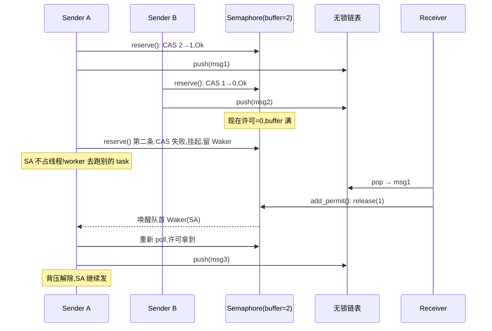

# 第 16 章 · channel:mpsc / oneshot / broadcast

> **核心问题**:任务之间除了抢锁,还要**传消息**——A 干完一段、把结果丢给 B 接着干。这一根"传消息的管子"叫 channel。tokio 给了三种:mpsc(多发送方一接收方)、oneshot(一发一收)、broadcast(一发多收)。它们各自为哪种场景?**有界 mpsc 的"背压(backpressure)"是怎么做出来的**——发送方比接收方快时,凭什么能让发送方"自觉慢下来"?发送 / 接收在"对端还没准备好"时,怎么做到**不占线程**?channel 关闭(close / 对端 drop)时,等待者怎么被通知?
>
> 这是**第 5 篇·并发原语:sync 模块**的中段。承接第 15 章(async Mutex 把"等锁"翻译成"等许可"),本章把"等消息"翻译成同一种"事件唤醒":**等的人留 Waker、挂起、不占线程;消息来了(或对端关了),把 Waker 叫醒**。channel 比 Mutex 更贴近"事件驱动"的本质——**发一条消息,就是一次事件**。
>
> **读完本章你会明白**:
> - 三种 channel 各自的场景边界:**mpsc**(流水线、工作池)、**oneshot**(一次性结果回传、`spawn().await`)、**broadcast**(广播、事件分发)。选错 channel,代码能跑但别扭、低效、甚至错。
> - **背压**到底是什么——不是个玄学词,而是**"有界 mpsc = 一把许可数 = buffer 的信号量 + 一条无锁链表"**:发送方先抢许可(抢不到挂起),才能写消息。这条机制让"快的发送方"自动被"慢的接收方" throttling,**天然的流量控制**,不需要任何额外代码。
> - 总纲钦定的主角技巧:**有界 mpsc 的"无锁链表 + slot 复用 + close 语义"**——发送端怎么靠 `AtomicUsize` 的 `tail_position.fetch_add` 无锁分配唯一 slot 索引、写值、置 ready 位;接收端怎么按序读、把 block 还回去复用;close 怎么靠一个 `TX_CLOSED` 位传播唤醒所有等待者。
> - 为什么 oneshot 可以**完全无锁、一个 AtomicUsize 装下整个状态机**(EMPTY/VALUE_SENT/CLOSED/几个 WAKER 位),以及它和 mpsc 的设计取舍差别。
> - broadcast 的环形 buffer 怎么靠"`Slot.rem` 引用计数 = 还有多少接收者没看"自动回收消息,慢的接收者怎么被"lagged"——这套"覆盖式广播"和 mpsc 的"传递式流水线"是两种截然不同的语义。
>
> **如果一读觉得太难**:先只记住三件事——① **有界 mpsc = 信号量(buffer) + 无锁链表**,信号量做背压(满了 sender 挂起)、链表做实际传值;② **oneshot = 单值 + 一个状态字**,状态字里塞了"值发了吗 / 关了吗 / 双方留没留 waker";③ **broadcast = 环形 buffer + 每个 slot 一个引用计数**,慢的接收者会被覆盖、收到 `Lagged` 错误。无锁链表 / slot 复用 / 位运算 close 这些技巧的细节看不懂可以先放,抓住"channel 是任务间的事件源,发消息 = 触发事件"这一个心智模型。

---

## 章首·一句话点破

> **channel 就是任务之间的一根管子,管子两端各有一个"事件源":发送端的事件是"对端把消息收走了 / 对端关了",接收端的事件是"管子里有新消息了 / 发送端全关了"。** 有界 mpsc 在管子上加了个"许可数 = buffer"的阀门(信号量):发送方先抢许可才能塞消息,塞满了(没许可)就挂起——这就是背压。oneshot 是"一次性、单值"的极简 channel,一个 `AtomicUsize` 装下全部状态。broadcast 是"一发多收"的环形喇叭,慢的听众会被新的播报覆盖。三者本质都是**事件源 + Waker 等待者队列**,和第 15 章的 Mutex 同构。

这是**结论**。本章倒过来拆:先讲清三种 channel 的**场景边界**(为什么需要三种而不是一种),再落到总纲钦定的主角——**有界 mpsc 的无锁链表 + slot 复用 + close**,逐行拆源码;然后看 oneshot 怎么用一个状态字做完所有事,broadcast 怎么用环形 buffer + 引用计数做广播;最后技巧精解把"无锁链表的 slot 复用 + close 位传播"这两个最硬核的技巧拆透。

第 15 章结尾留了钩子:"任务之间还有一种更常见的协作:传消息"。这一章回答。

---

## 一、三种 channel 各为哪种场景

tokio 在 `sync` 模块暴露三种 channel,各有定位。**先搞清楚什么场景用什么**,比直接读源码重要——用错 channel 是 tokio 代码里最常见的"能跑但不优雅"。

### mpsc:多发送方,一接收方

`mpsc` = multiple producer, single consumer。`tokio::sync::mpsc::channel(buffer)` 返回 `(Sender, Receiver)`,**Sender 可以 clone 出多份**(多个 task 往里发),**Receiver 只能有一个**(只能一个 task 从里取)。

```rust
// 简化示意,非源码原文:典型 mpsc 用法——工作池
let (tx, mut rx) = tokio::sync::mpsc::channel(100);

// 多个 worker task 往同一个 channel 发
for i in 0..4 {
    let tx = tx.clone();
    tokio::spawn(async move {
        tx.send(work(i)).await.unwrap();
    });
}
drop(tx);   // 原 tx 也 drop,只剩 clone 的——全部 drop 才算"发送端关了"

// 单个 collector task 从 channel 取
tokio::spawn(async move {
    while let Some(item) = rx.recv().await {
        handle(item);
    }
});
```

> **比喻回到餐厅**:mpsc 是"**多个服务员把新订单塞进同一个传菜口篮子**"(多个 Sender),篮子另一头**只有一个上菜员**(Receiver)从篮子里取。这是流水线、工作池、fan-in 的标准结构——多对一汇聚。

`mpsc::channel(buffer)` 的 `buffer` 是**有界容量**。还有个 `mpsc::unbounded_channel()` 是无界的(警告:无界 = 没有 backpressure,生产者过快会内存爆炸,只在确知速率受控时用)。本章聚焦**有界 mpsc**,因为它的背压技巧是总纲钦定的主角。

### oneshot:一发,一收

`oneshot` 顾名思义:**只能发一条**。`tokio::sync::oneshot::channel()` 返回 `(Sender, Receiver)`,**Sender 不能 clone**,而且 `Sender::send` 是 `fn`(不是 `async fn`)、消耗 self(发完就没了)。Receiver 是个 `Future`,await 它就是"等那条唯一的消息"。

```rust
// 简化示意,非源码原文:典型 oneshot 用法
let (tx, rx) = tokio::sync::oneshot::channel();

tokio::spawn(async move {
    let result = compute().await;
    tx.send(result).unwrap();   // 发一次
});

let result = rx.await.unwrap();  // 等那一次
```

oneshot 最常见的场景是 **`tokio::spawn(future).await` 的底层**——`spawn` 返回 `JoinHandle`,它内部就是一根 oneshot(任务做完,通过 oneshot 把结果送回给等 `JoinHandle` 的人,第 5 章讲过 `Trailer.waker` 那套;oneshot 是同构的更通用版本)。其他场景:HTTP 请求 / 响应(每对 req-resp 一个 oneshot)、RPC 的"问一句等一句"、解析器把"解析结果"送回 lexer。

> **比喻回到餐厅**:oneshot 是"**客人点一道菜,服务员把小票递给厨房,厨房做完从一个小窗口递出来——这一次性的传递**"。一个小窗口对应一张小票,小票送进去了,厨房从同一个窗口把菜递出来,然后这个窗口就关了。**严格一次性**。

### broadcast:一发,多收

`broadcast` = 一发多收。`tokio::sync::broadcast::channel(capacity)` 返回 `(Sender, Receiver)`,**Sender 可以 `subscribe()` 出多个 Receiver**,每个 Receiver 独立维护自己"读到哪了",**所有人都看到所有消息**(除非它太慢被覆盖)。

```rust
// 简化示意,非源码原文:典型 broadcast 用法
let tx = tokio::sync::broadcast::channel(16).0;
let mut rx1 = tx.subscribe();
let mut rx2 = tx.subscribe();

tokio::spawn(async move {
    tx.send(event).unwrap();   // 一次 send,rx1 和 rx2 都会收到
});

tokio::spawn(async move {
    while let Ok(ev) = rx1.recv().await { handle_a(ev); }
});
tokio::spawn(async move {
    while let Ok(ev) = rx2.recv().await { handle_b(ev); }
});
```

broadcast 的典型场景:**事件分发**(配置变更广播到所有 worker)、**Pub/Sub**、**关闭信号**(`tokio_util::sync::CancellationToken` 底层就是 broadcast)、**日志 / metrics 流**。

但 broadcast 有个独特语义:**慢的 Receiver 会被"覆盖"**。如果 buffer 容量是 16,Receiver 没及时收,新的 send 把旧的覆盖了——这个 Receiver 下次 `recv` 会收到一个 `RecvError::Lagged(n)`,意思是"你漏了 n 条,位置已对齐到当前"。这是 broadcast 和 mpsc 的根本差别:**mpsc 严格不丢(满了 sender 挂起),broadcast 允许丢(满了覆盖慢的接收者)**。

> **比喻回到餐厅**:broadcast 是"**餐厅经理在大堂装了个广播喇叭,每播一条新优惠,在场的所有服务员都听见**"。可如果一个服务员正在处理 5 号桌的复杂订单、耳朵没顾上听广播,等他回头来听——**广播里早播了 5 条新的了,前面几条已经被覆盖**,他只能听到最新的。经理给他个"你错过了 4 条"(Lagged),让他自己决定怎么办。

### 三种 channel 的对比一张表

| | mpsc | oneshot | broadcast |
|---|---|---|---|
| 发送方数 | 多(cloneable) | 一(不 clone) | 一(可 downgrade) |
| 接收方数 | **一** | 一 | **多**(subscribe) |
| 消息数 | 任意多条 | **一条** | 任意多条 |
| 是否有界 | 有界(`channel(buffer)`) / 无界 | (无,本来就一条) | 有界环形 buffer |
| 慢接收方 | **背压**(sender 挂起) | (只有一个,不存在慢) | **被覆盖**(Lagged 错误) |
| 典型场景 | 流水线、工作池、fan-in | spawn 结果回传、req-resp | 事件分发、Pub/Sub、取消信号 |

> **钉死这件事**:选 channel 的逻辑——**多对一汇聚** → mpsc;**一对一一次性** → oneshot;**一对多广播** → broadcast。**不需要"丢消息"就别用 broadcast**(它的 Lagged 语义容易出 bug);**不需要背压 / 能保证速率受控**才用 unbounded mpsc(否则内存爆炸)。本章剩下的篇幅,把这三种的内部实现逐个拆透。

---

## 二、有界 mpsc 的全貌:信号量 + 无锁链表

有界 mpsc 是本章主角。它的全貌用一句话:**一把许可数 = buffer 的信号量(背压)+ 一条无锁链表(传值)**。

### Chan 结构:把信号量和链表装在一个 `Arc` 里

```rust
// tokio/src/sync/mpsc/chan.rs(摘录)
pub(super) struct Chan<T, S> {
    /// Handle to the push half of the lock-free list.
    tx: CachePadded<list::Tx<T>>,              // ← 无锁链表的发送端

    /// Receiver waker. Notified when a value is pushed into the channel.
    rx_waker: CachePadded<AtomicWaker>,        // ← 接收方的 Waker

    /// Notifies all tasks listening for the receiver being dropped.
    notify_rx_closed: Notify,                  // ← rx drop 时通知所有 sender

    /// Coordinates access to channel's capacity.
    semaphore: S,                              // ← 信号量(背压)

    /// Tracks the number of outstanding sender handles.
    tx_count: AtomicUsize,                     // ← sender 计数(归零=关闭)

    /// Tracks the number of outstanding weak sender handles.
    tx_weak_count: AtomicUsize,

    /// Only accessed by `Rx` handle.
    rx_fields: UnsafeCell<RxFields<T>>,        // ← 接收端独占(链表的 Rx)
}
```

([tokio/src/sync/mpsc/chan.rs:52-75](../tokio/tokio/src/sync/mpsc/chan.rs#L52-L75))

读这个结构,要抓四个核心:

1. **`tx: list::Tx<T>`** —— 无锁链表的发送端。多个 sender 共享,靠原子操作 push 消息。**这是真正"传值"的地方**。
2. **`semaphore: S`** —— 一个信号量(`S` 在有界 channel 里是 `bounded::Semaphore`,内含 `batch_semaphore::Semaphore`),许可数 = buffer。**这是"背压"的地方**。
3. **`rx_waker: AtomicWaker`** —— 接收方的 Waker。消息推入时唤醒它。**这是接收方"等消息"的事件源**。
4. **`tx_count: AtomicUsize`** —— sender 计数。每个 Sender clone 加一,drop 减一,**减到 0 表示"发送端全关了",这时 receiver 应该收到 `None`(返回 None 表示 channel 关闭)**。

**注意一个关键点:链表本身没有"容量限制"**——它是个无界链表,理论上可以一直 push。**容量限制完全由 `semaphore` 提供**。这是个极其干净的设计:**链表负责传值(无锁、快),信号量负责限流(背压、挂起)**。两者解耦,各司其职。

### `send` 的两步:抢许可 → 写链表

`Sender::send` 的源码极简:

```rust
// tokio/src/sync/mpsc/bounded.rs(摘录)
pub async fn send(&self, value: T) -> Result<(), SendError<T>> {
    match self.reserve().await {       // ← 第一步:抢许可
        Ok(permit) => {
            permit.send(value);        // ← 第二步:写链表
            Ok(())
        }
        Err(_) => Err(SendError(value)),
    }
}
```

([tokio/src/sync/mpsc/bounded.rs:816-824](../tokio/tokio/src/sync/mpsc/bounded.rs#L816-L824))

**两步**:`reserve()` 抢许可(信号量 acquire 1),抢到了得到一个 `Permit`(代表"你有一张票了,可以写");`permit.send(value)` 才真正把值写进链表。

为什么拆两步?**为了 cancel safety**。如果合并成一步(`send(value).await`),万一 await 期间被 cancel,可能"许可抢到了但值没写进链表"——许可白白消耗一个,channel 容量缩水,这是 bug。拆成 `reserve().await` + `permit.send(value)` 后,**`reserve` 是 cancel safe 的**(cancel 时归还许可),`Permit` 拿到后 `send(value)` 是同步的(不可能 cancel),这条流水线整体 cancel safe。这是个非常细的工程考量,文档里专门提醒过([bounded.rs:779-815](../tokio/tokio/src/sync/mpsc/bounded.rs#L779-L815))。

`reserve().await` 内部就是 `self.chan.semaphore().semaphore.acquire(1).await`(同 [bounded.rs:1278](../tokio/tokio/src/sync/mpsc/bounded.rs#L1278) 的 `reserve_many` 实现走的是同一路径)——**第 15 章讲透的那个 `batch_semaphore::Semaphore::acquire`**。许可够 → CAS 减、立刻返回;许可不够 → 把 Waker 入等待队列、返回 Pending、让出线程。

> **背压就这样诞生**:buffer 满了(许可耗光),sender `reserve().await` 挂起,**不占线程**。receiver 收一条消息,`recv` 内部 pop 后调 `semaphore.add_permit()`(归还 1 个许可,见 [chan.rs:303-306](../tokio/tokio/src/sync/mpsc/chan.rs#L303-L306))——这个归还触发 `release`,唤醒队首等许可的 sender。sender 被叫醒,许可拿到,继续 `permit.send(value)`。**慢的接收方自然拖慢快的发送方,无任何额外代码**。

### `recv`:pop 链表 + 唤醒 sender

接收方的 `recv` 走 `Rx::recv`:

```rust
// tokio/src/sync/mpsc/chan.rs(摘录,简化)
pub(crate) fn recv(&mut self, cx: &mut Context<'_>) -> Poll<Option<T>> {
    self.inner.rx_fields.with_mut(|rx_fields_ptr| {
        let rx_fields = unsafe { &mut *rx_fields_ptr };
        macro_rules! try_recv {
            () => {
                match rx_fields.list.pop(&self.inner.tx) {
                    Some(Read::Value(value)) => {
                        self.inner.semaphore.add_permit();    // ← 关键:归还许可
                        return Ready(Some(value));
                    }
                    Some(Read::Closed) => {
                        return Ready(None);                   // ← channel 关了
                    }
                    None => {} // fall through,挂起等
                }
            };
        }
        // ... try_recv / 注册 rx_waker / Pending
    })
}
```

([tokio/src/sync/mpsc/chan.rs:289-318](../tokio/tokio/src/sync/mpsc/chan.rs#L289-L318),简化展示)

接收方的关键三件事:**① 从链表 pop 一条消息**(`list.pop`);**② 调 `semaphore.add_permit()` 归还许可**(这一步直接触发背压的解除——可能唤醒一个挂起的 sender);**③ 如果链表空且没关,注册 `rx_waker`、返回 Pending**(等下一条消息)。

> **钉死这件事(背压的回路)**:sender 抢许可 → 写链表;receiver pop 链表 → 还许可。许可的流动方向 = 消息的流动方向反过来。**buffer 满时 sender 挂起,receiver 取走一条 → 还一个许可 → sender 被叫醒继续写**。这套机制完全靠第 15 章的信号量实现,mpsc 只是把"还许可"挂在 `recv` 的尾巴上。这是 tokio sync 模块**最漂亮的一次复用**:背压不是新机制,只是信号量的一个应用。

### 一张图看清"sender 挂起 / 唤醒"的回路



图里最关键的是中间"SA 不占线程"那一段——**buffer 满 → sender 挂起 → receiver 收一条 → sender 被叫醒**,这条回路完全靠信号量和无锁链表的协作。

---

## 三、技巧精解主角:无锁链表 + slot 复用 + close 位传播

这一节是本章的灵魂,拆透总纲钦定的主角技巧。先看链表怎么做到无锁,再看 slot 怎么复用(避免反复分配),最后看 close 怎么靠一个 bit 传播。

### 链表的分块结构:Block(32 slot)+ 单链表

tokio 的无锁链表不是朴素的"一个节点一条消息",而是**分块(block)链表**——每个 Block 装多条消息(默认 32 条,见 `BLOCK_CAP`),Block 之间用 `next` 指针串成单链表。

```rust
// tokio/src/sync/mpsc/mod.rs(摘录)
#[cfg(any(target_pointer_width = "64", target_pointer_width = "32"))]
pub(crate) const BLOCK_CAP: usize = 32;
#[cfg(target_pointer_width = "16")]
pub(crate) const BLOCK_CAP: usize = 16;
```

([tokio/src/sync/mpsc/mod.rs:140-146](../tokio/tokio/src/sync/mpsc/mod.rs#L140-L146))

```rust
// tokio/src/sync/mpsc/block.rs(摘录)
pub(crate) struct Block<T> {
    header: BlockHeader<T>,
    values: Values<T>,                  // 32 个槽,连续数组(缓存友好)
}

struct BlockHeader<T> {
    start_index: usize,                 // 这个 block 的起始全局索引
    next: AtomicPtr<Block<T>>,          // 单链表的 next
    ready_slots: AtomicUsize,           // ← 关键:位图,每个 slot 一个 ready 位
    observed_tail_position: UnsafeCell<usize>,
}

#[repr(transparent)]
struct Values<T>([UnsafeCell<MaybeUninit<T>>; BLOCK_CAP]);

const RELEASED: usize = 1 << BLOCK_CAP;       // bit 32:block 被释放过
const TX_CLOSED: usize = RELEASED << 1;       // bit 33:发送端关闭
const READY_MASK: usize = RELEASED - 1;       // bit 0~31:32 个 slot 的 ready 位
```

([tokio/src/sync/mpsc/block.rs:13-68](../tokio/tokio/src/sync/mpsc/block.rs#L13-L68))

这是个**信息密度极高**的设计:

1. **每个 Block 装 32 条消息**——`Values` 是个 `[UnsafeCell<MaybeUninit<T>>; 32]` 连续数组。**连续数组 = 缓存友好**(一次 cache line read 拿一坨)。
2. **`ready_slots` 是个 32-bit 位图**——每个 slot 对应一个 ready 位(0=还没写、1=写好了)。**额外两位**:`RELEASED`(bit 32,这个 block 已被 receiver 标记可释放)、`TX_CLOSED`(bit 33,发送端关了)。**一个 `AtomicUsize` 装下"32 个 slot 的就绪状态 + 两个标志位"**——和第 5 章 task 状态字是同一个套路,信息塞进一个原子字,避免撕裂中间态。
3. **Block 之间靠 `next: AtomicPtr` 串成单链表**——链表能无限增长,无需预分配。

### sender 怎么无锁写:fetch_add 拿全局唯一索引

看 `Tx::push`,这是发送方写消息的核心:

```rust
// tokio/src/sync/mpsc/list.rs(摘录)
impl<T> Tx<T> {
    pub(crate) fn push(&self, value: T) {
        // First, claim a slot for the value. `Acquire` is used here to
        // synchronize with the `fetch_add` in `reclaim_blocks`.
        let slot_index = self.tail_position.fetch_add(1, Acquire);   // ← 关键 1

        // Load the current block and write the value
        let block = self.find_block(slot_index);                     // ← 关键 2

        unsafe {
            block.as_ref().write(slot_index, value);                 // ← 关键 3
        }
    }
}
```

([tokio/src/sync/mpsc/list.rs:72-86](../tokio/tokio/src/sync/mpsc/list.rs#L72-L86))

三步,逐句拆:

**① `tail_position.fetch_add(1, Acquire)`** —— 这是**整个无锁设计的命脉**。`tail_position` 是个 `AtomicUsize`,代表"下一个该写的全局索引"。多个 sender 同时 push,**每个 sender 的 `fetch_add(1)` 都会得到一个不同的、唯一的索引**——这是原子操作保证的(fetch_add 是 RMW,不可重入)。所以即使 100 个 sender 并发 push,它们各自拿到 0、1、2、...、99 这些不重复的索引,**不需要任何锁**。

**② `find_block(slot_index)`** —— 把全局索引换算成"哪个 Block + Block 内偏移"。`slot_index / 32` 是 Block 编号(走 `next` 链表找到),`slot_index % 32` 是 Block 内偏移。如果对应 Block 还不存在,`find_block` 会沿 `next` 走、必要时 `block.grow()` 分配新 Block 接到链表尾。

**③ `block.write(slot_index, value)`** —— 把值写进 Block 的对应 slot,然后**置 ready 位**:

```rust
// tokio/src/sync/mpsc/block.rs(摘录)
pub(crate) unsafe fn write(&self, slot_index: usize, value: T) {
    let slot_offset = offset(slot_index);
    self.values[slot_offset].with_mut(|ptr| {
        unsafe { ptr::write(ptr, MaybeUninit::new(value)); }     // 写值
    });
    // Release the value. After this point, the slot ref may no longer
    // be used. It is possible for the receiver to free the memory at
    // any point.
    self.set_ready(slot_offset);                                 // 置 ready 位
}
```

([tokio/src/sync/mpsc/block.rs:201-216](../tokio/tokio/src/sync/mpsc/block.rs#L201-L216))

写完值,**置 ready 位**(在 `ready_slots` 位图里把对应 bit 置 1)。这一步是 `Release` 排序的原子或操作——它告诉 receiver"这个 slot 写好了,你可以读了"。

> **钉死这件事(无锁写)**:**整个 sender 端的并发,靠一个 `AtomicUsize::fetch_add` 解决**——每个 sender 拿到唯一的 slot 索引,各自写各自的 slot、置各自的 ready 位。**多个 sender 之间完全无锁**(只争一次 fetch_add,原子操作),不会互相阻塞。这是 mpsc "multiple producer" 的物理基础——M 个发送方并发写,性能不退化。

### receiver 怎么读 + slot 复用

receiver 单线程读(只有一个 Receiver),不需要无锁,但有个**关键的优化:slot 复用**。

```rust
// tokio/src/sync/mpsc/block.rs(摘录)
pub(crate) unsafe fn read(&self, slot_index: usize) -> Option<Read<T>> {
    let offset = offset(slot_index);
    let ready_bits = self.header.ready_slots.load(Acquire);

    if !is_ready(ready_bits, offset) {
        if is_tx_closed(ready_bits) {
            return Some(Read::Closed);                    // ← 发送端关了
        }
        return None;                                      // ← 还没写好
    }

    // Get the value
    let value = self.values[offset].with(|ptr| unsafe { ptr::read(ptr) });
    Some(Read::Value(unsafe { value.assume_init() }))
}
```

([tokio/src/sync/mpsc/block.rs:152-175](../tokio/tokio/src/sync/mpsc/block.rs#L152-L175))

receiver 读 slot:看 ready 位,**没置 → 还没写好(返回 None,告诉上层该挂起等);置了但 `TX_CLOSED` 也置了 → 发送端关了(返回 `Read::Closed`,上层据此返回 `None` 给用户表示 channel 关闭);置了 → 读值,返回 `Read::Value`**。

读完一个 Block 的所有 slot,receiver 会**把整个 Block 归还**——不是 free 掉,而是**塞回 sender 端的"空闲 Block 池"**(`free_head`),让 sender 下次 `grow` 时直接复用,不用再分配。这就是 `reclaim` / `free_blocks` 那一坨代码干的事(见 [block.rs:232-236](../tokio/tokio/src/sync/mpsc/block.rs#L232-L236) 的 `reclaim`、[list.rs:429](../tokio/tokio/src/sync/mpsc/list.rs#L429) 的 `free_blocks`):

```rust
// tokio/src/sync/mpsc/block.rs(摘录)
pub(crate) unsafe fn reclaim(&mut self) {
    self.header.start_index = 0;
    self.header.next = AtomicPtr::new(ptr::null_mut());
    self.header.ready_slots = AtomicUsize::new(0);
}
```

([tokio/src/sync/mpsc/block.rs:232-236](../tokio/tokio/src/sync/mpsc/block.rs#L232-L236))

> **钉死这件事(slot 复用)**:Block 不是"用一次扔一次"——receiver 把读空的 Block **塞回空闲池**,sender 下次接着用。**channel 长时间运行,Block 的分配次数 = 并发度的几倍,而不是消息数的几倍**。这是 mpsc 高吞吐的关键之一:百万消息跑下去,可能只分配了几十个 Block,反复复用。**和第 5 章 task 的"一次堆分配装下整个 task"是同一种"少分配"哲学**。

### close 怎么传播:一个 bit,唤醒所有等待者

最后看 close 语义。channel 关闭有两个方向:

- **发送端关了**(所有 Sender drop,`tx_count` 减到 0)→ receiver 应该收到 `None`。
- **接收端关了**(Receiver drop,或显式 `Receiver::close`)→ 所有正在 `reserve().await` 挂起的 sender 应该收到 `SendError`。

**发送端关闭的传播**:`Tx::close` 干的事——`fetch_add(1)` 占一个 slot 索引(就像 push 一条"幽灵消息"),然后**在那个 slot 所在的 Block 上置 `TX_CLOSED` 位**:

```rust
// tokio/src/sync/mpsc/list.rs(摘录)
pub(crate) fn close(&self) {
    let slot_index = self.tail_position.fetch_add(1, Acquire);
    let block = self.find_block(slot_index);
    unsafe { block.as_ref().tx_close() }
}

// tokio/src/sync/mpsc/block.rs(摘录)
pub(crate) unsafe fn tx_close(&self) {
    self.header.ready_slots.fetch_or(TX_CLOSED, Release);    // ← 置 TX_CLOSED 位
}
```

([tokio/src/sync/mpsc/list.rs:92-100](../tokio/tokio/src/sync/mpsc/list.rs#L92-L100)、[block.rs:218-221](../tokio/tokio/src/sync/mpsc/block.rs#L218-L221))

receiver 下次 `read` 到这个 Block,看到 `TX_CLOSED` 位,返回 `Read::Closed`,上层据此返回 `None` 给用户。**整个关闭传播,靠一个 bit + receiver 下次读到时检查**——不需要给 receiver 发信号、不需要唤醒任何 receiver(receiver 反正要 `recv().await` 主动来读,读到就自然发现关了)。

但这里有个细节:**如果 receiver 正在 `recv().await` 挂起中(链表空),谁来叫醒它**?答案是 sender drop 时(每个 Sender drop 时,如果 `tx_count` 减到 0)会调 `wake_rx`([chan.rs:230-236](../tokio/tokio/src/sync/mpsc/chan.rs#L230-L236)),按 `rx_waker` 把 receiver 叫醒。receiver 被叫醒,重新 poll,这次 `pop` 拿到 `Read::Closed`(或拿到剩余消息后下次拿到 Closed),返回 `None`。

**接收端关闭的传播**:Receiver drop 时调 `Rx::close`(见 [chan.rs:246-259](../tokio/tokio/src/sync/mpsc/chan.rs#L246-L259)),它干两件事:**① 关闭信号量**(`semaphore.close()`,见 [batch_semaphore.rs:242-259](../tokio/tokio/src/sync/batch_semaphore.rs#L242-L259),`close` 把 `CLOSED` 位置 1、把所有等待许可的 sender Waker 全部 wake);**② `notify_rx_closed.notify_waiters()`**——唤醒所有监听"rx 关了"事件的 sender(典型用法是 `Sender::closed().await`,sender 等到 rx 关了就停止生产)。

信号量的 `close` 实现特别干净:

```rust
// tokio/src/sync/batch_semaphore.rs(摘录)
pub(crate) fn close(&self) {
    let mut waiters = self.waiters.lock();
    self.permits.fetch_or(Self::CLOSED, Release);   // ← 置 CLOSED 位
    waiters.closed = true;
    while let Some(mut waiter) = waiters.queue.pop_back() {
        let waker = unsafe { waiter.as_mut().waker.with_mut(|waker| (*waker).take()) };
        if let Some(waker) = waker {
            waker.wake();                            // ← 唤醒所有等许可的 sender
        }
    }
}
```

([tokio/src/sync/batch_semaphore.rs:242-259](../tokio/tokio/src/sync/batch_semaphore.rs#L242-L259))

> **钉死这件事(close 的位传播)**:channel 关闭的传播,靠**两个位**:`TX_CLOSED`(在 Block 的 ready_slots 位图里,告诉 receiver"发送端关了")和 `CLOSED`(在信号量的 permits 字段里,告诉 sender"接收端关了")。**关一个 channel,本质就是置这两个位 + 唤醒等待者**。这套设计极简、极对称——双向关闭各靠一个 bit,各自唤醒各方向的等待者。这是"用位运算表达状态语义"的典范,呼应第 5 章 task 状态字。

### 一张图看清 mpsc 的内存布局

```
   有界 mpsc channel 的内存布局(简化,所有部分都在一个 Arc<Chan> 里):

   ┌────────────────────────── Arc<Chan<T, Semaphore>> ───────────────────────────┐
   │                                                                              │
   │  semaphore: Semaphore(buffer=2)        ← 背压阀门(许可数=buffer)              │
   │  ┌──────────────────────────────────┐                                        │
   │  │ permits: AtomicUsize = 0b_??_0   │  ← 高位=许可数,低位=CLOSED 标志          │
   │  │ waiters: Mutex<Waitlist>         │  ← 满时 sender 挂在这                   │
   │  └──────────────────────────────────┘                                        │
   │                                                                              │
   │  tx: list::Tx (发送端,多 sender 共享)                                           │
   │  ┌──────────────────────────────────────────────────────────────────┐        │
   │  │ tail_position: AtomicUsize = 5  (已分配到索引 5,下个 sender 拿 5)  │        │
   │  │ block_tail: AtomicPtr<Block>    ──┐                               │        │
   │  └────────────────────────────────────┘                               │        │
   │                                        ↓                               │        │
   │  单链表(每 Block 32 个 slot,缓存友好):                                     │        │
   │  ┌──────────┐    next    ┌──────────┐    next    ┌──────────┐          │        │
   │  │ Block 0  │ ─────────→ │ Block 32 │ ─────────→ │ Block 64 │ ─→ null  │        │
   │  │ start=0  │            │ start=32 │            │ start=64 │          │        │
   │  │ ready_   │            │ ready_   │            │ ready_   │          │        │
   │  │ slots=   │            │ slots=   │            │ slots=   │          │        │
   │  │ 0b111..  │            │ 0b11..   │            │ 0b0..    │          │        │
   │  │          │            │          │            │          │          │        │
   │  │ [msg0]   │ ready      │ [msg32]  │ ready      │ [      ] │ not ready│        │
   │  │ [msg1]   │ ready      │ [msg33]  │ ready      │ [      ] │ not ready│        │
   │  │ [   ]    │ not ready  │ [    ]   │ not ready  │ ...      │          │        │
   │  │ ...      │            │ ...      │            │          │          │        │
   │  │ [msg31]  │ ready      │ [    ]   │            │          │          │        │
   │  │          │            │          │            │          │          │        │
   │  │ bit 32=  │            │ bit 33=  │            │          │          │        │
   │  │ RELEASED │            │TX_CLOSED │ ← 最后一个 sender drop 时,在这置位       │
   │  └──────────┘            └──────────┘            └──────────┘          │        │
   │                                        ↑                               │        │
   │  rx_fields: UnsafeCell<RxFields>  (接收端独占)                                │
   │  ┌──────────────────────────────────┐                                        │
   │  │ list: list::Rx (head=Block 0)    │  ← receiver 从这开始读,读完归还 Block   │
   │  │ rx_closed: bool                  │                                        │
   │  └──────────────────────────────────┘                                        │
   │                                                                              │
   │  rx_waker: AtomicWaker    ← receiver 等消息时留 Waker,sender push 时唤醒     │
   │  tx_count: AtomicUsize    ← sender 计数,减到 0 = 发送端全关                   │
   │  notify_rx_closed: Notify ← rx drop 时通知所有 sender                         │
   └──────────────────────────────────────────────────────────────────────────────┘

   背压回路:sender 抢许可 → 写链表 → receiver pop 链表 → 还许可 → 唤醒 sender
```

---

## 四、oneshot:一个 `AtomicUsize` 装下整个状态机

讲完主角 mpsc,oneshot 是个漂亮的对照——**它极简,一个 `AtomicUsize` 装下所有状态**。

### Inner 结构

```rust
// tokio/src/sync/oneshot.rs(摘录)
struct Inner<T> {
    /// Manages the state of the inner cell.
    state: AtomicUsize,                    // ← 全部状态在这一个字里

    /// The value. This is set by `Sender` and read by `Receiver`.
    value: UnsafeCell<Option<T>>,          // ← 实际的值

    /// The task to notify when the receiver drops without consuming the value.
    tx_task: Task,                         // ← sender 的 Waker(rx 关了通知它)

    /// The task to notify when the value is sent.
    rx_task: Task,                         // ← receiver 的 Waker(值发来通知它)
}
```

([tokio/src/sync/oneshot.rs:386-409](../tokio/tokio/src/sync/oneshot.rs#L386-L409))

`Inner` 只四个字段:**state(状态字)、value(值)、两个 Waker 槽(sender 的和 receiver 的)**。所有并发控制,全在那个 `state: AtomicUsize` 上。

### state 字的位段

```rust
// tokio/src/sync/oneshot.rs(摘录)
const RX_TASK_SET: usize = 0b00001;     // bit 0:receiver 留了 Waker
const VALUE_SENT:   usize = 0b00010;    // bit 1:值已发送(也控制 UnsafeCell 访问权)
const CLOSED:       usize = 0b00100;    // bit 2:channel 关了
const TX_TASK_SET:  usize = 0b01000;    // bit 3:sender 留了 Waker
```

([tokio/src/sync/oneshot.rs:1486-1503](../tokio/tokio/src/sync/oneshot.rs#L1486-L1503))

四个 bit,各管一件事。注释里特别强调 `VALUE_SENT` 的 dual 角色:

> This bit controls which side of the channel is permitted to access the `UnsafeCell`. If it is set, the `UnsafeCell` may ONLY be accessed by the receiver. If this bit is NOT set, the `UnsafeCell` may ONLY be accessed by the sender.
> ([oneshot.rs:1487-1495](../tokio/tokio/src/sync/oneshot.rs#L1487-L1495))

**`VALUE_SENT` 既是"值已发送"标志,又是 UnsafeCell 的访问权锁**——置 1 之前,sender 有权写;置 1 之后,receiver 有权读。一个 bit 做两件事,信息密度极高。

### 关键操作都是位运算

看几个核心操作,全是位运算:

**`Receiver::poll_recv`** —— 等 value:

```rust
// 简化示意,非源码原文
fn poll_recv(&self, cx) -> Poll<Result<T, RecvError>> {
    let mut state = State::load(&self.state, Acquire);
    loop {
        if state.is_complete() {                        // VALUE_SENT 置了
            // 拿值
            return Ready(Ok(unsafe { (*self.value.get()).take().unwrap() }));
        }
        if state.is_closed() {                          // CLOSED 置了
            return Ready(Err(RecvError::Closed));
        }
        // 还没好,留 Waker(CAS 置 RX_TASK_SET)
        match State::set_rx_task(&self.state) { ... }
    }
}
```

**`Sender::send`** —— 发值,核心是 `set_complete`:

```rust
// tokio/src/sync/oneshot.rs(摘录)
fn set_complete(cell: &AtomicUsize) -> State {
    // This method is a compare-and-swap loop rather than a fetch_or like
    // other `set_$WHATEVER` methods on `State`. This is because we must
    // check if the state has been closed before setting the `VALUE_SENT` bit.
    let mut state = cell.load(Relaxed);
    loop {
        if State(state).is_closed() {
            break;                                      // 关了就别置 VALUE_SENT
        }
        match cell.compare_exchange_weak(
            state,
            state | VALUE_SENT,                         // CAS 置 VALUE_SENT
            AcqRel, Acquire,
        ) {
            Ok(_) => break,
            Err(actual) => state = actual,
        }
    }
    State(state)
}
```

([tokio/src/sync/oneshot.rs:1514-1547](../tokio/tokio/src/sync/oneshot.rs#L1514-L1547))

注意这个细节:**`set_complete` 用 CAS 自旋而不是 `fetch_or`**,因为要先检查"是否已 CLOSED"。如果直接 `fetch_or(VALUE_SENT)`,可能在 CLOSED 状态下也置上 VALUE_SENT,导致 sender 和 receiver 同时访问 UnsafeCell(数据竞争)。CAS 自旋允许"读-检查-改"——只在没 CLOSED 时才置 VALUE_SENT。**注释明说**:

> We don't want to set both the `VALUE_SENT` bit if the `CLOSED` bit is already set, because `VALUE_SENT` will tell the receiver that it's okay to access the inner `UnsafeCell`. ... if a `poll_recv` ... is occurring concurrently, both threads may try to access the `UnsafeCell` if we were to set the `VALUE_SENT` bit on a closed channel.
> ([oneshot.rs:1514-1527](../tokio/tokio/src/sync/oneshot.rs#L1514-L1527))

> **钉死这件事(oneshot 的极简)**:**一个 `AtomicUsize`,4 个 bit,装下了 oneshot 的全部并发控制**——发送 / 接收 / 关闭 / 双方 Waker 状态。所有操作都是位运算 + CAS。**为什么 oneshot 能这么简?因为它本质是"一次性、单值"**——没有队列、没有多 sender、没有 buffer 容量问题。它能做到的极简,正是它语义简单的回报。和 mpsc 的"链表 + 信号量"对比,你能看到:**复杂度总是和语义复杂度匹配**——oneshot 一个字够了,mpsc 必须一条链表 + 一把信号量。

---

## 五、broadcast:环形 buffer + 每 slot 引用计数

最后看 broadcast。它的设计和 mpsc 截然不同——**环形 buffer(固定大小)+ 每个 slot 一个引用计数(自动回收)**。

### Shared 结构

```rust
// tokio/src/sync/broadcast.rs(摘录)
struct Shared<T> {
    buffer: Box<[Mutex<Slot<T>>]>,        // ← 固定大小的环形 buffer
    mask: usize,                          // 位掩码,pos & mask = buffer 索引
    tail: Mutex<Tail>,                    // 发送位置 + 等待者队列
    num_tx: AtomicUsize,                  // sender 计数
    num_weak_tx: AtomicUsize,
    notify_last_rx_drop: Notify,
}

struct Tail {
    pos: u64,                             // ← 下一个写入位置(u64,永不溢出实际)
    rx_cnt: usize,                        // 当前 receiver 数量
    closed: bool,
    waiters: LinkedList<Waiter, ...>,     // receiver 等待者链表
}

struct Slot<T> {
    rem: AtomicUsize,                     // ← 关键:还有多少 receiver 没看这条
    pos: u64,                             // 这条消息的位置(校验用)
    val: Option<T>,                       // 实际值
}
```

([tokio/src/sync/broadcast.rs:340-394](../tokio/tokio/src/sync/broadcast.rs#L340-L394))

broadcast 的核心是 **`Slot.rem: AtomicUsize`**——每条消息发送时,`rem = rx_cnt`(当前所有 receiver 数量);每有一个 receiver 读到这条消息,`rem` 减一;**减到 0 时,这条消息的值被 drop**(自动回收)。

### send:写 slot,设 rem

```rust
// tokio/src/sync/broadcast.rs(摘录,简化)
pub fn send(&self, value: T) -> Result<usize, SendError<T>> {
    let mut tail = self.shared.tail.lock();
    if tail.rx_cnt == 0 {
        return Err(SendError(value));                 // 没有 receiver,报错
    }

    let pos = tail.pos;
    let rem = tail.rx_cnt;
    let idx = (pos & self.shared.mask as u64) as usize;
    tail.pos = tail.pos.wrapping_add(1);

    let mut slot = self.shared.buffer[idx].lock();
    slot.pos = pos;
    slot.rem.with_mut(|v| *v = rem);                  // ← 关键:rem = 当前 receiver 数
    slot.val = Some(value);
    drop(slot);

    self.shared.notify_rx(tail);                      // 唤醒所有等消息的 receiver
    Ok(rem)
}
```

([tokio/src/sync/broadcast.rs:629-665](../tokio/tokio/src/sync/broadcast.rs#L629-L665),简化展示)

发送时,在环形 buffer 的 `pos & mask` 位置写值,**`rem` 设成当前 receiver 数**。如果 buffer 满了(下一个 pos 覆盖了 receiver 还没读的位置),那个 receiver 下次 `recv` 会发现自己的 `next_id` 落后于当前 `tail.pos`——返回 `RecvError::Lagged(差了多少条)`,然后把自己的 `next_id` 对齐到最新。**这就是 broadcast 的"覆盖"语义**。

### recv:读 slot,递减 rem

receiver 各自维护一个 `next_id`(自己下一条该读的位置)。`recv` 时:

```rust
// 简化示意,非源码原文
fn recv(&mut self) -> Result<T, RecvError> {
    let tail = self.shared.tail.lock();
    if self.next_id == tail.pos {
        // 没新消息,挂起等
        return Pending;
    }
    if self.next_id < tail.pos - capacity {
        // 太慢,被覆盖了
        let n = tail.pos - capacity - self.next_id;
        self.next_id = tail.pos - capacity;
        return Err(RecvError::Lagged(n));
    }
    let idx = (self.next_id & mask) as usize;
    drop(tail);
    let slot = self.shared.buffer[idx].lock();
    let value = slot.val.clone();         // T: Clone
    slot.rem.fetch_sub(1, ...);           // ← 关键:rem - 1
    if slot.rem.load() == 0 {
        slot.val = None;                  // 减到 0,丢值
    }
    self.next_id += 1;
    Ok(value)
}
```

(实际 recv 在 [broadcast.rs:963](../tokio/tokio/src/sync/broadcast.rs#L963) 附近,这里是简化示意)

> **钉死这件事(broadcast 的自动回收)**:**每条消息的 `rem` 从 `rx_cnt` 减到 0,自动 drop**——这是 broadcast 的内存管理核心。不需要 GC、不需要引用计数通道、不需要复杂的回收逻辑——**一个原子减法,减到 0 自然释放**。这套机制让 broadcast 能支持任意多 receiver,内存开销恒定(只和 capacity × receiver 数相关,不随消息总数增长)。代价是:**慢的 receiver 会被覆盖**,收到 `Lagged`——这是 broadcast 故意放弃"严格不丢"换来的可扩展性。

### 三种 channel 的实现对比一张表

| | mpsc(有界) | oneshot | broadcast |
|---|---|---|---|
| 核心数据结构 | 分块链表(Block × 32 slot) | 单 UnsafeCell<Option<T>> | 环形 buffer(Slot × capacity) |
| 并发控制 | 信号量(buffer 个许可)+ 链表无锁 | 单个 `AtomicUsize`(4 bit) | tail 锁 + 每 slot 引用计数 |
| 慢接收方 | **背压**(sender 挂起) | (只有一个 receiver) | **覆盖**(Lagged) |
| 关闭传播 | `TX_CLOSED` 位 + 信号量 `CLOSED` 位 | `CLOSED` 位 | `tail.closed` + `rx_cnt` 计数 |
| 内存复用 | Block 复用(空闲池) | (一次性) | slot 循环写(覆盖) |

---

## 技巧精解:无锁链表 + slot 复用,以及 close 的位传播

这一节把本章两个最硬核的技巧拆透,配反面对比。

### 技巧一:`fetch_add` 分配全局唯一索引,无锁写

#### 解决的问题

M 个 sender 并发往 channel 里塞消息,怎么保证**每个消息写进唯一的 slot、互不踩踏**?

#### 反面对比 A:全局锁

```rust
// 简化示意,非源码原文:反面,用全局锁
fn push(&self, value: T) {
    let mut tail = self.tail_lock.lock();      // 每次都进锁
    let slot = tail.next_slot;
    tail.next_slot += 1;
    self.slots[slot] = value;
}
```

> **不这样会怎样**:M 个 sender 串行化在一把锁上,百万并发直接打爆。**这是最朴素也最慢的方案**。

#### 反面对比 B:每条消息一个独立节点 + Michael-Scott 无锁链表

经典的 Michael-Scott 无锁队列是"每节点一个值,通过 CAS 把节点接到 tail"。这条路也行,但每条消息要**单独分配一个节点**(Box),百万消息百万次堆分配。

> **不这样会怎样**:堆分配有锁(全局分配器),百万消息百万次锁竞争。而且每条消息一个节点,缓存局部性差(节点散落在堆各处)。**性能不及 tokio 的分块方案**。

#### 正解:分块 + fetch_add 分配 slot 索引

tokio 的做法(前面拆过):**Block 装 32 slot,所有 sender 共享一个 `tail_position: AtomicUsize`,`fetch_add(1)` 各拿唯一索引**。

这套设计的精妙之处:

1. **`fetch_add` 是 RMW,原子地"读-加-写"**——100 个 sender 同时 fetch_add,得到 100 个不重复的值,**无锁**。
2. **分块降低分配次数**——每 32 条消息才分配一个 Block,百万消息只分配 3 万次。**而且 Block 可复用**(receiver 读完归还),实际分配次数远低于此。
3. **每个 slot 的 ready 位独立**——sender A 写 slot 5、置 bit 5,sender B 写 slot 6、置 bit 6,receiver 检查 bit 5 看到 A 写好、检查 bit 6 看到 B 写好。**互不阻塞,完全并发**。

> **钉死这件事(无锁写的物理基础)**:**`fetch_add(1)` 是 mpsc 无锁设计的命脉**。它把"M 个发送方抢一个写入位置"这个看似需要锁的问题,简化成"一次原子加法"。这是无锁编程里最经典的模式之一——**用原子 RMW 操作做唯一资源分配**。第 17 章 Notify 的状态字、第 7 章(预告)Chase-Lev 队列的 head/tail,都是同一个套路。

### 技巧二:close 的位传播——双向各靠一个 bit

#### 解决的问题

channel 有两个方向的关闭:**发送端关了**(通知 receiver 返回 None)、**接收端关了**(通知挂起的 sender 返回 Err)。怎么用最少的状态表达这两个方向?

#### 反面对比:用枚举 + 锁

```rust
// 简化示意,非源码原文:反面,用枚举
enum ChannelState {
    Open,
    TxHalfClosed,
    RxHalfClosed,
    Closed,
}

fn close_tx(&self) {
    let mut state = self.state_lock.lock();
    self.state = match self.state {
        Open => TxHalfClosed,
        RxHalfClosed => Closed,
        other => other,
    };
}
```

> **不这样会怎样**:每次 close / 检查 close 都进锁。**而且状态机迁移复杂**(四种状态、迁移规则),容易写错。最关键的是——**两边的关闭可以并发**(sender 关的同时 receiver 也关),枚举的状态迁移在这种并发下要么加锁(慢),要么写成无锁状态机(复杂)。

#### 正解:两个独立的 bit,各管一个方向

tokio 的做法:**两个位,各自独立,互不耦合**。

- `TX_CLOSED`(在 Block 的 `ready_slots` 位图里 bit 33)——**发送端关了**。receiver 读到这个 bit 就知道。
- `CLOSED`(在信号量的 `permits` 字段里 bit 0)——**接收端关了**。sender 抢许可时(`poll_acquire`)一进来就检查这个 bit,置了就返回 `Err`。

两个位**完全独立**,各自用 `fetch_or` 置位(原子操作),不需要协调。两个方向的关闭可以任意并发、任意顺序,都不会撕裂中间态。

#### 关闭传播的唤醒路径

光置位还不够——挂起的等待者要被叫醒。

- **接收端关 → 唤醒所有挂起的 sender**:`Receiver::close` → `semaphore.close()` → `while let Some(waiter) = queue.pop() { waiter.waker.wake() }`。一次唤醒所有等许可的 sender。
- **发送端关 → 唤醒 receiver**:`Sender::drop`(最后一个)→ `wake_rx()` → 按存储的 `rx_waker` 唤醒 receiver(只有一个 receiver,所以一次唤醒一个)。

> **钉死这件事(close 位传播)**:**两个独立 bit + 各自唤醒各方向的等待者**,这是 channel 关闭语义的最优实现。**位运算置位(原子,不可能撕裂)+ 显式唤醒(在挂起的等待者上)**,两步分开,既无锁又简单。和 oneshot 的"一个状态字 4 个 bit"是同一个套路——**用位运算表达独立的状态维度,避免锁、避免状态机爆炸**。

### 一个 sound 性补充:`UnsafeCell` + ready 位为什么 sound

mpsc 大量用了 `UnsafeCell`(Block 的 values、Chan 的 rx_fields),凭什么安全?

- **Block.values[offset] 的写入**(sender 写):同一时刻只有一个 sender 写这个 offset(`fetch_add` 保证了唯一索引)。
- **Block.values[offset] 的读取**(receiver 读):receiver 是单线程(只有一个 Receiver),且**只在 ready 位置了之后才读**(Release-Acquire 同步:sender 写完置 ready 位用 Release,receiver 读 ready 位用 Acquire,建立了 happens-before)。
- **何时不再被写**:ready 位一置,sender 就保证不再碰这个 slot(注释明说 "After this point, the slot ref may no longer be used. It is possible for the receiver to free the memory at any point",[block.rs:212-215](../tokio/tokio/src/sync/mpsc/block.rs#L212-L215))。所以 receiver 读完后可以放心 reclaim 这个 slot,不会和 sender 撞。

这套"唯一索引 + ready 位 Release/Acquire 同步 + ready 后 sender 不再碰"的三重保证,让 mpsc 的所有 `UnsafeCell` 都 sound。**和第 5 章 task 的"RUNNING 位是 stage 字段的锁"是同一类设计**——用原子位 + 明确的所有权转移规则,补上借用检查器的缺口。

---

## 章末小结

### 用"餐厅服务员"比喻回顾本章

1. **channel 是任务之间传消息的管子**——管子两端各有一个"事件源":发送端"对端收走了 / 对端关了",接收端"有新消息 / 发送端关了"。**等的人留 Waker 挂起、不占线程,事件来了被叫醒**——和第 15 章的 Mutex 同构,只是事件源不同。
2. **有界 mpsc 是一根带阀门的管子**——阀门就是"许可数 = buffer 的信号量"。发送方先抢许可、才能塞消息;管子满了(没许可),发送方挂起。**这就是背压:慢的接收方自动拖慢快的发送方,无需任何额外代码**。
3. **管子里实际传消息的是一条分块无锁链表**:每个 Block 32 个 slot,所有 sender 靠一个 `AtomicUsize::fetch_add` 拿唯一索引,**完全无锁并发写**。Block 读完归还复用,**百万消息只分配几十个 Block**。
4. **oneshot 是个极简的一次性窗口**:一个 `AtomicUsize` 装下"值发了吗 / 关了吗 / 双方留没留 waker"4 个 bit。所有操作位运算 + CAS,**因为语义简单(一发一收一次性),所以实现极简**。
5. **broadcast 是个环形喇叭**:固定大小环形 buffer,每条消息带个"还有几个 receiver 没看"的引用计数,减到 0 自动丢值。慢的听众被新的播报覆盖,收到 `Lagged`——**这是 broadcast 故意放弃"不丢"换可扩展性的代价**。
6. **关一根管子,靠两个位**:发送端关靠 Block 位图的 `TX_CLOSED` bit,接收端关靠信号量的 `CLOSED` bit。两个位各自独立 `fetch_or` 置位,各自唤醒各方向的等待者——**无锁、简单、对称**。

### 本章在全书主线中的位置

记住全书的二分法:**调度执行(让就绪的任务跑) vs 事件唤醒(让等待的任务不空耗、就绪了再叫)**。

这一章服务的是**事件唤醒**那一面——和第 15 章 Mutex 一样,**channel 是任务之间的事件源**。"有新消息"、"channel 关了",都是事件。等的人挂起、留 Waker;事件来了 wake。**这是第 4 章 Waker 落到 sync 原语上的第二次大规模应用**(第 15 章是第一次)。

而本章的几个关键技巧——`fetch_add` 无锁分配、位运算状态字、slot 复用、双路径(close 用位 + 显式 wake),都是 tokio sync 模块的通用套路。**理解本章,第 17 章(Notify / Semaphore)会非常轻松**——Notify 的"无锁计数不丢事件"是 `fetch_add` + 状态字的又一个范例。

### 五个"为什么"清单

1. **有界 mpsc 怎么做背压?**:有界 mpsc = `Semaphore(buffer)` + 无锁链表。`send` 先 `reserve().await`(信号量 acquire 1 个许可),许可不够(buffer 满)就挂起。receiver `recv` pop 一条后调 `add_permit()` 还 1 个许可,触发 `release` 唤醒队首 sender。**慢的接收方自动拖慢发送方,完全靠信号量**。
2. **mpsc 的链表怎么做到无锁?**:所有 sender 共享一个 `AtomicUsize tail_position`,每次 `fetch_add(1)` 拿一个全局唯一的 slot 索引(原子 RMW,不可能重)。每个 sender 写自己分配到的 slot、置对应的 ready 位(在 Block 的 `ready_slots` 位图里)。**多 sender 完全并发,无锁**。
3. **slot 怎么复用?**:每个 Block 装 32 个 slot,receiver 读完一个 Block 的所有 slot 后,把整个 Block `reclaim`(重置 ready 位、start_index)塞回 sender 端的空闲池。sender 下次 `grow` 链表时复用空闲 Block。**百万消息可能只分配几十个 Block,反复用**。
4. **channel 关闭怎么传播给等待者?**:发送端关(所有 Sender drop)→ 在最后一个 Block 上置 `TX_CLOSED` 位 + 调 `wake_rx` 唤醒 receiver;receiver 读到 `TX_CLOSED` 返回 `None`。接收端关(Receiver drop 或 close)→ 调 `semaphore.close()` 置信号量的 `CLOSED` 位 + 唤醒所有等许可的 sender;sender `poll_acquire` 一进来检查 `CLOSED` 位,置了返回 `Err`。**两个方向各靠一个 bit,独立、原子、无锁**。
5. **oneshot 和 broadcast 为什么设计和 mpsc 完全不同?**:**复杂度匹配语义复杂度**。oneshot 是"一发一收一次性",一个 `AtomicUsize` 4 个 bit 够了。broadcast 是"一发多收 + 允许覆盖慢的",需要环形 buffer + 每 slot 引用计数自动回收。mpsc 是"多发一收 + 严格不丢 + 背压",需要分块链表 + 信号量。**没有"通用最优"的 channel,只有"匹配语义"的设计**。

### 想继续深入,该往哪钻

- **本章核心源码**:
  - [`tokio/src/sync/mpsc/chan.rs`](../tokio/tokio/src/sync/mpsc/chan.rs) —— `Chan` 结构(L52-75,信号量 + 链表的组合)、`recv`(L289-318,pop + 还许可)、`close`(L246-259,rx 关闭传播)。
  - [`tokio/src/sync/mpsc/list.rs`](../tokio/tokio/src/sync/mpsc/list.rs) —— `Tx::push`(L72-86,无锁写)、`Tx::close`(L92-100,置 TX_CLOSED)、`find_block` / `reclaim_block` / `free_blocks`(链表管理与 slot 复用)。
  - [`tokio/src/sync/mpsc/block.rs`](../tokio/tokio/src/sync/mpsc/block.rs) —— `Block` 结构(L13-22)、`ready_slots` 位图 + `RELEASED` / `TX_CLOSED` 常量(L57-68)、`write`(L201-216,写值置 ready)、`read`(L152-175,读值检 ready / TX_CLOSED)、`reclaim`(L232-236,slot 复用)。
  - [`tokio/src/sync/mpsc/bounded.rs`](../tokio/tokio/src/sync/mpsc/bounded.rs) —— `channel`(L159-171,初始化)、`send`(L816-824,reserve + permit.send)、`Semaphore`(L176-179,信号量 + bound)。
  - [`tokio/src/sync/oneshot.rs`](../tokio/tokio/src/sync/oneshot.rs) —— `Inner`(L386-409)、状态字常量(L1486-1503)、`set_complete`(L1514-1547,VALUE_SENT 的 CAS 自旋)。
  - [`tokio/src/sync/broadcast.rs`](../tokio/tokio/src/sync/broadcast.rs) —— `Shared` / `Slot`(L340-394,环形 buffer + rem 引用计数)、`send`(L629-665,写 slot 设 rem)、recv 路径(L963 附近)。
- **`loom` 验证**:tokio 的 mpsc 有专门的 `loom` 测试(在 `tokio/src/sync/mpsc/` 顶部的 loom cfg),穷举各种 sender / receiver 并发交错,验证无锁链表、close 传播的正确性。想深入"mpsc 为什么在各种竞态下都对",看 loom 测试用例(附录 B)。
- **亲手对比有界 vs 无界**:写个程序 spawn 一个 sender task 死循环 `tx.send(i).await`、不收消息,先试 `mpsc::channel(100)`(有界,sender 在第 100 条后挂起,内存稳定),再换 `mpsc::unbounded_channel()`(无界,sender 一直发,内存涨爆 OOM)。这一下就理解"背压"的价值。
- **用 `tokio-console` 观察 channel**:tokio-console 能看到 task 在等什么(等 mpsc::Receiver::recv、等 mpsc::Sender::send)。装上 `console-subscriber`,跑一个生产者消费者程序,看 sender 在 buffer 满时被标记为 Idle(挂起),receiver 收一条后 sender 被重新激活——**亲眼看见背压**。
- **下一站**:本章讲了任务之间的"传消息"——有界 mpsc 做背压、oneshot 做一次性、broadcast 做广播。但任务之间还有一种更轻量的协作:**纯粹的"通知"**——A 不发数据给 B,只是"拍一下" B 说"该你了";以及"限流"——控制同时能跑多少 task(许可牌)。翻开 **第 17 章 · Notify 与 Semaphore**——Notify 怎么做到"先 notify 后 wait 也不丢",Semaphore 怎么变成限流器。第 5 篇在这里收束。

---

> channel 把任务之间"传消息"变成了"事件驱动"——发消息就是触发事件,等消息就是挂起等事件。可任务之间最轻量的协作其实是**纯粹的"通知"**——不传数据,只拍一下肩膀。翻开 **第 17 章 · Notify 与 Semaphore**,第 5 篇在这里收束。
