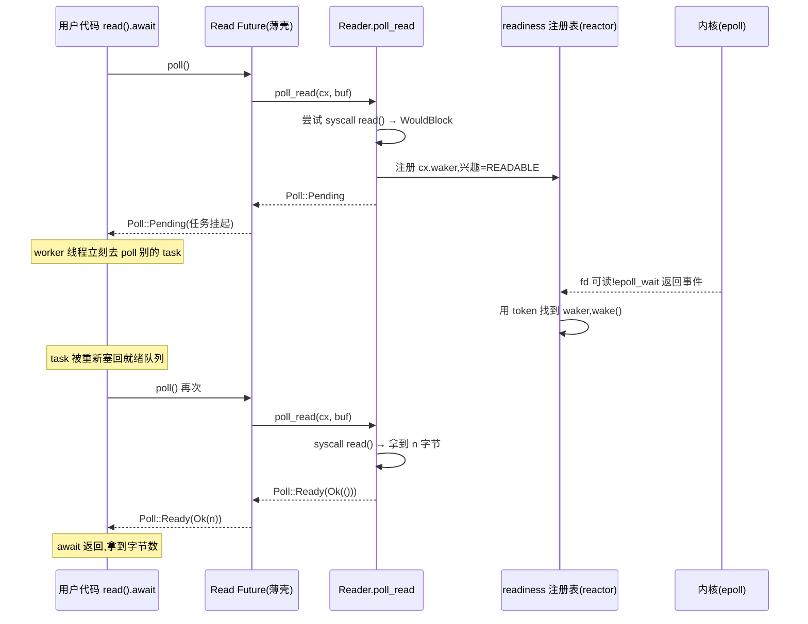

# 第 18 章 · AsyncRead / AsyncWrite

> **核心问题**:把"读 / 写字节流"这套阻塞 API(`std::io::Read` / `Write`)poll 化,到底要改什么?`poll_read` / `poll_write` 返回 `Poll<Result<...>>` 意味着什么?它们和 `Future` 是什么关系——既然 `read().await` 用的也是 `Future`,为什么不干脆让 `AsyncRead` 直接 `impl Future`?
>
> 这一章我们不碰具体 socket(TcpStream 是下一章)。只死盯一件事:**怎么把一条字节流抽象成"可以被反复 poll、每次要么读到字节、要么交出线程"的东西**。这是网络 I/O 这一篇的地基,readiness 模型先在 trait 层落地,下一章才落到真实的 TCP socket。
>
> **读完本章你会明白**:
> - 为什么 `AsyncRead::poll_read` 不是 `Read::read` 的简单包装,而是一种**完全不同的契约**——它把"读到 `WouldBlock` 时怎么办"这一步,从"返回错误"翻成了"**注册 Waker、返回 Pending**",这一翻,字节流才真正"等待时不占线程"。
> - 为什么是 `poll_read`(可反复调、可取消、可 `select`),而不是一个单体 `read().await` 的 `Future` trait object——`poll` 化带来零成本抽象和流式组合能力,这是单体 Future 给不了的。
> - 为什么 `poll_read` 的返回值是 `Poll<io::Result<()>>`,而读到的字节数藏在 `ReadBuf` 里——这个"结果类型与数据分离"的设计,是为了避开自引用、守住 `Pin` 的 sound 性。
> - `AsyncReadExt` 的 `read` / `read_exact` 这些大家熟的 `async` 方法,只是包了一层 `poll_read` 的**薄 Future 壳**——揭穿这层壳,你会看到 trait 是 poll 化的、Future 是它的衍生品,而不是反过来。

---

## 章首·一句话点破

> **`AsyncRead` 不是"读字节"的异步版,而是"把一条字节流切成无数段可推进的进度":每一次 `poll_read`,要么抓一把字节给你(Ready),要么说"现在没货、货到了我叫你"(Pending + 注册 Waker)。它和 `Future` 同源(都用 `Poll`、都靠 `Waker`),但它是"流"的契约——可以反复 poll、永不"完结",直到 EOF。**

这是**结论**。这一章倒过来拆:先看阻塞 `Read` 在哪撞墙、为什么要 poll 化;再把 `AsyncRead` trait 的签名掰开,看清它和 `Future` 的同与异;最后揭穿 `AsyncReadExt` 的魔法——那些 `async fn` 方法只是 `poll_read` 的薄壳,`poll` 才是地基。

> 第 1 篇(P1-02)已经立住了 `Future::poll` 的契约:`Poll::Ready(T)` / `Poll::Pending`(且 Pending 必留 Waker)。这一章不重复那条契约,而是把它**往下挪一层**:从"一个任务"的 poll,落到"一条字节流"的 poll。读完这章你会发现,`AsyncRead::poll_read` 那行签名,就是 `Future::poll` 的精神在字节流上的复刻——只是多了"永不完结、可重复推进"这一层。

---

## 一、先看反面:阻塞 `Read` 为什么撑不住

理解 `AsyncRead` 的设计,得先看清它要替换的 `std::io::Read` 到底卡在哪。

```rust
// 标准库的阻塞读(简化示意,非源码原文)
pub trait Read {
    fn read(&mut self, buf: &mut [u8]) -> io::Result<usize>;
}
```

这个 trait 极其朴素:**你给我一块 buffer,我往里填字节,告诉你填了多少;填不满是因为没数据了(EOF)。** 它有一个隐含约定——**当数据没来时,`read` 会卡住调用它的线程,直到数据来**。

> **比喻回到餐厅**:`Read::read` 是这样下单的:服务员去厨房,把订单递进去,然后**站在传菜口一动不动**,直到菜端出来才走。这桌的菜没好,服务员绝不转头去别的桌。第 0 章拆过的"一桌一个服务员(thread-per-connection)"模型,根子就在这个 trait 上——它把"等"焊死在了"占着线程"上。

第 0 章已经把它的三个崩点(线程贵、切换贵、阻塞=浪费)讲透。这里只问一句话:**如果我们想用 async(任务在 await 让出线程)来读写,这个 `Read` trait 能直接用吗?**

### 反面试一下:直接在 async 函数里调 `std::fs::read`

```rust
// 简化示意,非源码原文:在 async 里调阻塞 API 的灾难
async fn handle_conn(stream: std::net::TcpStream) {
    let mut buf = [0u8; 1024];
    let n = (&stream).read(&mut buf).unwrap();   // 阻塞!
    process(&buf[..n]).await;
}
```

> **不这样会怎样**:看上去这是个 `async fn`,应该能让出线程。但 `(&stream).read(&mut buf)` 是 `std::io::Read` 的方法,**它内部是个阻塞系统调用**(`read(2)`)。一旦执行到这里,跑这个 task 的 worker 线程**整条卡死**在内核里——它既不让出(因为没 `.await`),也不去 poll 别的 task,就那么钉着。如果这个连接的对端迟迟不发数据,这一整个 worker 就废了。

这就是为什么 tokio 不能直接用 `std::io::Read`/`Write`:**它的契约里没有"让出线程"这一档**。它只有两态——要么读到数据(`Ok(n)`),要么报错(`Err`)。中间那个"数据还没来、但也没出错、晚点再来"的状态,**在阻塞 API 里没有对应物**,只能靠线程傻站着表达。

> **钉死这件事**:阻塞 `Read` 的根本缺陷,不是它"慢",而是它的**返回值类型**装不下"稍后再试"这个状态。`io::Result<usize>` 只有"成功读了 n 字节"和"出错"两种;它没法说"我现在读不了,但你别等,数据好了我叫你"。要表达这第三态,就得改返回类型——这正是 `AsyncRead` 干的事。

---

## 二、`AsyncRead` trait:把"稍后再试"升格为一等公民

现在看 tokio 怎么改这个契约。打开 [tokio/src/io/async_read.rs](../tokio/tokio/src/io/async_read.rs#L44-L60):

```rust
pub trait AsyncRead {
    fn poll_read(
        self: Pin<&mut Self>,
        cx: &mut Context<'_>,
        buf: &mut ReadBuf<'_>,
    ) -> Poll<io::Result<()>>;
}
```

就这一行方法签名,信息密度极大。我们把它和 `Read::read` 并排对比,逐字段拆:

| | `Read::read` | `AsyncRead::poll_read` |
|---|---|---|
| `self` 类型 | `&mut self` | `Pin<&mut Self>` |
| 额外参数 | 无 | `cx: &mut Context<'_>`(携带 Waker) |
| buffer | `&mut [u8]` | `&mut ReadBuf<'_>` |
| 返回 | `io::Result<usize>`(读了几字节) | `Poll<io::Result<()>>`(成功与否,字节数在 buf 里) |

四个差异,每一个都对应一个"为什么"。

### 差异一:返回值从 `Result<usize>` 变成 `Poll<Result<()>>`

这是**最核心**的改动。多出来的 `Poll` 外壳,正是 P1-02 立下的两态契约在字节流上的复刻:

- `Poll::Ready(Ok(()))`:读到东西了(或 EOF),字节已经填进 `buf`。
- `Poll::Pending`:现在读不了,数据没来——**但我已经把 Waker 留好了(`cx` 那个参数就是干这个的),数据来了会有人叫你重新 poll 我**。
- `Poll::Ready(Err(e))`:真出错了(连接断了之类)。

注意那个**关键的翻译**:`std::io::Read` 在数据没来时返回的是 `Err(WouldBlock)`(对非阻塞 socket 而言),这是个**错误**。而 `AsyncRead` 把同一个"数据没来"的事实,翻成了 `Poll::Pending`——**不是错误,是正常的"挂起"**。

> **不这样会怎样(反面)**:假设 `poll_read` 在数据没来时返回 `Poll::Ready(Err(WouldBlock))`,把它当错误。那调用方拿到这个错误,要么当成真错(逻辑全错——这只是"稍后再试",不是连接断了),要么得自己写一套"看到 WouldBlock 就重新 await"的循环。更糟的是,这个 `Err(WouldBlock)` **没有携带任何"数据好了怎么叫我"的信息**——调用方只能靠忙等轮询,退化成第 0 章说的 CPU 空转。
>
> tokio 的选择是:**把 `WouldBlock` 这个"错误"吞掉,翻译成"挂起 + 注册 Waker"**。`Pending` 不再是失败,而是一份正式的"我在等、别催、好了我叫你"的承诺。这一翻,字节流的读操作才真正接入了 poll 模型,才有了"等待不占线程"。

async_read.rs 的文档对这条契约写得明明白白:

> `Poll::Pending` means that no data was read into the buffer provided. The I/O object is not currently readable but may become readable in the future. Most importantly, **the current future's task is scheduled to get unparked when the object is readable**.

([async_read.rs 文档注释](../tokio/tokio/src/io/async_read.rs#L24-L29))

翻译过来:`Pending` 不是单纯的"读不到",它是"读不到 + 已经安排好了'可读了就唤醒当前 task'"。和 `Future::poll` 的契约二(Pending 必留 Waker)是**同一条法律**。

### 差异二:`self` 从 `&mut self` 变成 `Pin<&mut Self>`

为什么是 `Pin`?P1-02 讲过:`Future` 因为是状态机、内部可能自引用,所以 `poll` 的签名要 `Pin<&mut Self>` 防止被移动。`AsyncRead` 同理——`AsyncRead` 的实现者往往也是个状态机(比如内部维护"读到一半的 buffer"的 reader),`Pin` 保证它不被移走、自引用不失效。

> **钉死这件事**:`AsyncRead::poll_read` 用 `Pin<&mut Self>`,不是为了好看,是**和 `Future::poll` 保持同一套 sound 性约定**。一个类型可以同时实现 `AsyncRead` 又是某个 Future 的内部状态,`Pin` 让这两套体系能共存而不出 UB。第 3 章会拆透 `Pin`,这里只记住"它和 Future 是一家人"。

### 差异三:多了 `cx: &mut Context<'_>`

这个参数就是 P1-04(Waker 那章)的主角。`Context` 内部就装着一个 `Waker`——当前这个 task 的"叫号器"。`poll_read` 在返回 `Pending` 前,要从 `cx` 里取出 `Waker`,塞给底层的 readiness 注册表(reactor),让 reactor 在 fd 可读时调用 `waker.wake()`。

这一步,**是 `AsyncRead` 和阻塞 `Read` 最本质的区别**:阻塞 `Read` 不需要 Waker,因为它傻站就行;`AsyncRead` 必须留 Waker,因为它要让出线程、靠 Waker 被叫回来。

> **比喻回到餐厅**:阻塞 `Read` 的服务员把订单递进厨房,就站在传菜口——他不需要留联系方式,因为他不离开。`AsyncRead` 的服务员不一样,他**转头去服务别桌了**,所以必须在传菜口留个联系方式("3 号桌菜好了叫我"),厨房(reactor)菜好了就按这个联系方式叫他。这个"联系方式",在代码里就是 `cx` 里的 `Waker`。

### 差异四:buffer 从 `&mut [u8]` 变成 `&mut ReadBuf<'_>`,返回值不再带字节数

这是个**反直觉但精妙**的设计。阻塞 `Read::read` 用 `Ok(n)` 直接告诉你"读了 n 字节",很自然。`poll_read` 偏偏把字节数**从返回值里挪到了 `ReadBuf` 里**——返回 `Ready(Ok(()))` 时,你去查 `buf.filled().len()` 才知道读了几字节。

为什么?因为 `ReadBuf` 不只是个 `&mut [u8]` 的马甲。它是个"双游标"结构,分了**已填充(filled)、已初始化(initialized)、未初始化**三段。看它的定义 [tokio/src/io/read_buf.rs:23-27](../tokio/tokio/src/io/read_buf.rs#L23-L27):

```rust
pub struct ReadBuf<'a> {
    buf: &'a mut [MaybeUninit<u8>],
    filled: usize,
    initialized: usize,
}
```

文档里那张图最清楚:

```text
[             capacity              ]
[ filled |         unfilled         ]
[    initialized    | uninitialized ]
```

([read_buf.rs 文档注释](../tokio/tokio/src/io/read_buf.rs#L12-L18))

它解决的是两个阻塞 `Read` 解决不了的问题:

1. **支持读未初始化内存**:很多高性能 I/O(syscall `read` 到一块没填过的栈 buffer)想直接读到 `MaybeUninit<u8>`,避免"先 memset 清零、再覆盖"的浪费。`&mut [u8]` 强制要求"这块内存已经初始化",堵死了这条路;`ReadBuf` 用 `MaybeUninit<u8>` + 双游标,允许实现者**只把真正读到的字节标为 initialized**,其余的可以保持未初始化。这是 async I/O 在性能上抠出来的一刀。

2. **守住 `Pin` 的 sound 性**:如果 `poll_read` 返回 `Poll<Result<usize>>`,字节数在返回值里,那实现者就得在"填了 buf"和"返回字节数"之间协调——一旦 buf 是个自引用结构,这个协调很容易写出 UB。把字节数塞进 `ReadBuf` 自己的 `filled` 游标里,**让"数据"和"读了多少"同处一个对象**,实现者只动一个对象,自引用的风险被收窄。

> **钉死这件事**:`poll_read` 的签名是 Rust async I/O 设计里**最克制**的一处——四个差异(`Poll` 外壳 / `Pin` / `Context` / `ReadBuf`)每一个都有明确的"为什么",没有一个是为难而难。它们合起来,把"读字节"从"会卡线程的阻塞操作"翻译成了"可以反复 poll、可挂起、可唤醒的进度推进",这正是 readiness 模型在 trait 层的落地。

---

## 三、`AsyncWrite`:同一套思路的镜像

`AsyncRead` 搞懂了,`AsyncWrite` 是它的镜像,几乎不用单独讲。看 [async_write.rs:39-56](../tokio/tokio/src/io/async_write.rs#L39-L56):

```rust
pub trait AsyncWrite {
    fn poll_write(
        self: Pin<&mut Self>,
        cx: &mut Context<'_>,
        buf: &[u8],
    ) -> Poll<io::Result<usize>>;

    fn poll_flush(self: Pin<&mut Self>, cx: &mut Context<'_>) -> Poll<io::Result<()>>;

    fn poll_shutdown(self: Pin<&mut Self>, cx: &mut Context<'_>) -> Poll<io::Result<()>>;

    fn poll_write_vectored(...) -> Poll<io::Result<usize>> { /* 默认实现 */ }
    fn is_write_vectored(&self) -> bool { false }
}
```

四个方法,套路和 `AsyncRead` 一模一样:`Pin<&mut Self>` + `Context` + `Poll<io::Result<...>>`。`poll_write` 在发送 buffer 满、写不进去时返回 `Pending`(并注册"可写了叫我"),不是报错。

注意两个 `AsyncRead` 没有的方法:

- **`poll_flush`**:把内部缓冲区的数据真正冲到对端。很多 writer(TLS、BufWriter)会在内存里攒一批再发,`flush` 强制发出去。它也可以 `Pending`——发不完就挂起、可写了再继续。
- **`poll_shutdown`**:优雅关闭写半边。TCP 是全双工的,可以"只关写、留着读"。`shutdown` 干的就是这件事,而且它可能涉及协议层的握手(TLS 的 close_notify),所以本身也可能是异步的、会 `Pending`。

> **比喻回到餐厅**:`AsyncWrite` 是服务员"把订单送进厨房"(`write`),"催厨房把已下单的菜赶紧做"(`flush`),"通知厨房这桌不再加菜了"(`shutdown`)。每一件都可能要等厨房响应——厨房忙不过来(发送 buffer 满),服务员就把这事挂起、转头干别的。

> **钉死这件事**:`AsyncRead` 和 `AsyncWrite` 是一对孪生 trait,共享同一套设计哲学:`Pin` + `Context` + `Poll`,把阻塞 I/O 翻成 readiness 模型。后面 tokio 里一切网络类型(TcpStream、UnixStream、tls 的 stream),都通过实现这两个 trait 接入 async 世界。这一对 trait,就是 async Rust 的"字节流接口"。

---

## 四、为什么不直接 `impl Future for AsyncRead`?

读到这里你可能有个尖锐的问题:`Future::poll` 返回 `Poll<Output>`,`AsyncRead::poll_read` 也返回 `Poll<...>`——它们这么像,为什么不直接让 `AsyncRead` `impl Future`,然后用一个 `read().await` 就完了?为什么要单独搞一个 `poll_read` 方法?

这是个**触及设计本质**的问题,值得专门拆。答案在两件事上:**流 vs 单体**,和**零成本抽象**。

### 理由一:字节流是"流",不是"单体 Future"

`Future` 的契约是**一次性**的(P1-02 的契约一):poll 出 `Ready` 就终结、不能再 poll。它表达的是"一个将来会有一次结果的计算"。

但字节流不是这样。一条 TCP 连接,你可能要读一万次、写一万次——它是个**源源不断的流**,**永不被"读完一次就终结"**。如果 `AsyncRead` 是 `impl Future<Output = Bytes>`,那它就只能说"我将来给你一批字节"——给完就完了,没法再给下一批。这把"流"硬掰成了"一次性事件"。

> **不这样会怎样(反面)**:假设非要让 reader `impl Future`,每次读都得**构造一个新的 Future**(`reader.read_chunk().await`),读 100 次就构造 100 个 Future 对象,每个都要分配、都要带状态机、都要 Pin。而 `poll_read` 的设计是:**同一个 reader 对象,可以被反复 poll 一万次,根本不需要构造新 Future**——它本身就是"可重复推进"的。这是"流"和"单体事件"的本质区别。

`poll_read` 把"读一次"这件事,从"创建一个 Future 对象"降级成了"调用一个方法"。流式读取一万次,就是调一万次 `poll_read`,**没有任何对象分配**。

### 理由二:零成本抽象 + 流式组合

`poll_read` 还带来一个巨大的好处:**可组合**。看看 tokio 源码里那些组合器是怎么用 `poll_read` 的——`read_exact`(读满整个 buffer 才返回)、`read_until`(读到分隔符)、`read_line`(读到换行)。它们都是**在外面包一层、内部循环调 `poll_read`**。看 `read_exact` 的实现 [tokio/src/io/util/read_exact.rs:53-68](../tokio/tokio/src/io/util/read_exact.rs#L53-L68):

```rust
fn poll(self: Pin<&mut Self>, cx: &mut Context<'_>) -> Poll<io::Result<usize>> {
    let me = self.project();

    loop {
        // if our buffer is empty, then we need to read some data to continue.
        let rem = me.buf.remaining();
        if rem != 0 {
            ready!(Pin::new(&mut *me.reader).poll_read(cx, me.buf))?;
            if me.buf.remaining() == rem {
                return Err(eof()).into();
            }
        } else {
            return Poll::Ready(Ok(me.buf.capacity()));
        }
    }
}
```

注意这个 `loop`:它反复调底层 reader 的 `poll_read`,每次 `poll_read` 返回 `Pending`,整个 `read_exact` 的 poll 也立刻 `Pending`(靠 `ready!` 宏);等底层 reader 可读被唤醒,`read_exact` 再被 poll,`loop` 继续。**整个过程,只是方法调用,没有任何 Future 对象的创建销毁**——直到 buffer 填满或 EOF,才 `Ready`。

这就是"流式组合"的力量:把"读满 N 字节"这种**组合语义**,写成对 `poll_read` 的循环包装。如果 `AsyncRead` 是单体 Future,这种组合就得每个组合器都重新设计 Future 状态机,代价巨大。

### 理由三:可取消、可 `select`

`poll_read` 是个方法,可以在任何时候、任何 task 里被调一次就走——这意味着**字节流的读操作天然可取消**。你 `read_exact(&mut buf).await`,如果中途想取消(比如超时了),直接 drop 那个 Future 就行,底层 reader 不受影响,下次还能接着读。

而单体 Future 的取消语义要复杂得多——一个"代表整条流"的 Future,drop 它意味着什么?关流?还是只放弃当前进度?语义模糊。`poll_read` 把"读一次"做成独立方法,取消的粒度天然就是"一次读",干净利落。

> **钉死这件事(本章设计哲学的钉子)**:`AsyncRead` 没有 `impl Future`,是因为它要表达的是**流**——可反复推进、可组合、可取消。`poll_read` 是"流式 poll"的入口,而 `Future` 是"单体 poll"的入口,两者职责不同。读者手写的 `reader.read(&mut buf).await` 那种 `.await`,只是 `AsyncReadExt` 在 `poll_read` 外面包了一层**薄 Future 壳**——下一节就揭穿它。

---

## 五、揭穿魔法:`read().await` 只是 `poll_read` 的薄壳

很多人写 tokio 代码,满屏都是 `stream.read(&mut buf).await?`,以为 `.await` 背后有什么深奥魔法。其实没有。我们看 `AsyncReadExt::read` 返回的那个 Future,到底长什么样 [tokio/src/io/util/read.rs:43-55](../tokio/tokio/src/io/util/read.rs#L43-L55):

```rust
impl<R> Future for Read<'_, R>
where
    R: AsyncRead + Unpin + ?Sized,
{
    type Output = io::Result<usize>;

    fn poll(self: Pin<&mut Self>, cx: &mut Context<'_>) -> Poll<io::Result<usize>> {
        let me = self.project();
        let mut buf = ReadBuf::new(me.buf);
        ready!(Pin::new(me.reader).poll_read(cx, &mut buf))?;
        Poll::Ready(Ok(buf.filled().len()))
    }
}
```

**就这么几行**。这个 `Read<'a, R>` Future 做的全部事情:

1. 把借来的 `&mut [u8]` 包成 `ReadBuf`。
2. 调一次底层 reader 的 `poll_read`。
3. `poll_read` 返回 `Pending`?——`ready!` 宏帮它把这个 `Pending` 直接透传出去(它自己什么都没干,只是等)。
4. `poll_read` 返回 `Ready(Ok(()))`?——查 `buf.filled().len()`,把字节数包成 `Ready(Ok(n))` 返回。

也就是说,**`stream.read(&mut buf).await` 的全部行为,就是"poll 一次 `poll_read`,把结果翻译一下"**。它甚至没有循环——读不到就 `Pending`,读到就 `Ready`,**一次 `.await` 就是一次 `poll_read`**。读不满 buffer?——那得用 `read_exact`(它内部有 `loop`,见上一节)。

> **钉死这件事**:`AsyncReadExt` 的所有 `async` 方法(`read`、`read_exact`、`read_to_end`、`read_until`、`lines`……),**全部是 `poll_read` 的包装 Future**。trait 的真身是 `poll_read`,`Future` 是衍生品。这个层级关系一旦看穿,你就再也不会被 tokio 满屏的 `.await` 唬住——它们底下全是同一个东西:`poll_read`。

### 一张时序图:从 `read().await` 到 readiness 唤醒

把整个链路串起来,看清一次"读到数据"的全过程:



看图中间那段"挂起":从 `Pending` 到被唤醒,worker 线程**一行代码都没为这个读操作跑**——它早去 poll 别的 task 了。这就是 P1-02 的 "Pending 必留 Waker" 契约在字节流上落地后的样子。**第 3 篇讲的 reactor / AsyncFd,就是图里那个"注册表 + token 映射"那一步**;这一章只到 `poll_read` 返回 `Pending` 为止,下一章(TcpStream)会把"非阻塞 socket + readiness 注册"完整落地。

---

## 技巧精解:poll_read 的 Pending 语义——把 WouldBlock 翻译成"挂起 + 注册"

这一节是本章硬核。我们拆全书 I/O 链条上**最容易被忽视、却最关键**的一个翻译技巧:`poll_read` 内部怎么把内核返回的 `WouldBlock`,干净利落地翻成 `Poll::Pending` + Waker 注册。这个翻译做得对不对,直接决定"等待不占线程"能不能兑现。

### 反面对比一:朴素翻译——把 WouldBlock 当错误往上抛

最朴素的写法,是直接把底层 syscall 的 `Err(WouldBlock)` 当作 `poll_read` 的 `Ready(Err)` 返回:

```rust
// 简化示意,非源码原文:错误的翻译
fn poll_read(self: Pin<&mut Self>, cx: &mut Context<'_>, buf: &mut ReadBuf<'_>) -> Poll<io::Result<()>> {
    match self.fd.read(buf) {
        Ok(n) => Poll::Ready(Ok(())),
        Err(e) => Poll::Ready(Err(e)),   // WouldBlock 也走这里,当错误!
    }
}
```

> **不这样会怎样**:调用方拿到 `Poll::Ready(Err(WouldBlock))`,以为"读失败了"。它要么当成真错(连接其实没断),要么写个"看到 WouldBlock 就重试"的循环——但**这个循环不知道什么时候重试**,只能靠 `tokio::time::sleep(很短).await` 之类忙等,把 CPU 烧爆。更糟的是,这个错误**根本没注册 Waker**,reactor 永远不知道要叫醒谁,任务就这么被遗忘了——典型的"任务永久挂起"bug。

这个反面的死穴,是它**丢掉了 readiness 模型最关键的"稍后叫我"语义**。`WouldBlock` 在内核那里,本意是"现在没数据、但你回头再问我",是一份**待续的承诺**;朴素翻译把它压扁成"出错",承诺就丢了。

### 反面对比二:朴素翻译——poll_read 自己内部忙等

另一种朴素写法,知道"要重试",但在 `poll_read` 内部自己重试:

```rust
// 简化示意,非源码原文:错误的忙等翻译
fn poll_read(self: Pin<&mut Self>, cx: &mut Context<'_>, buf: &mut ReadBuf<'_>) -> Poll<io::Result<()>> {
    loop {
        match self.fd.read(buf) {
            Ok(n) => return Poll::Ready(Ok(())),
            Err(WouldBlock) => continue,   // 卡在这死循环!
            Err(e) => return Poll::Ready(Err(e)),
        }
    }
}
```

> **不这样会怎样**:`poll_read` 内部一个死循环,疯狂调 `read` syscall,99.99% 都是 `WouldBlock`,纯烧 CPU。更可怕的是,**这个 `loop` 占着 worker 线程不放**——同线程上其他所有 task 都被饿死,连 reactor 自己都没机会跑(reactor 也跑在这些 worker 上)。整个 runtime 死锁式卡死。这就是把"poll"理解成字面意义的"轮询"会撞的墙。

### 正确翻译:tokio 的 try_io / poll_io 三段式

tokio 的正确翻译,藏在 [runtime/io/registration.rs:162-181](../tokio/tokio/src/runtime/io/registration.rs#L162-L181) 的 `poll_io` 里(下一章 TcpStream 会用它):

```rust
fn poll_io<R>(
    &self,
    cx: &mut Context<'_>,
    direction: Direction,
    mut f: impl FnMut() -> io::Result<R>,
) -> Poll<io::Result<R>> {
    loop {
        let ev = ready!(self.poll_ready(cx, direction))?;   // ① 等 readiness

        match f() {                                           // ② 真正读/写
            Ok(ret) => {
                return Poll::Ready(Ok(ret));
            }
            Err(ref e) if e.kind() == io::ErrorKind::WouldBlock => {
                self.clear_readiness(ev);                     // ③ 清掉,回 loop 顶再等
            }
            Err(e) => return Poll::Ready(Err(e)),
        }
    }
}
```

三段式,每一句都有讲究:

**① `ready!(self.poll_ready(cx, direction))`**:先**等 readiness**——这一步内部,如果 fd 还没就绪,就把 `cx.waker()` 注册到 ScheduledIo 的等待槽里(下一章详拆),返回 `Pending`;就绪了才往下走。注意:它**不碰 fd**,只查"现在能不能尝试"。这一步是 readiness 模型的核心——**先确认"有戏"再动手**,绝不在没把握时瞎试 syscall。

**② `f()`**:readiness 说"可读了",这才**真正调一次** `read` syscall(`f` 就是那个调用)。多数情况这次能读到数据,直接 `Ready(Ok)`。

**③ `clear_readiness(ev)` + 回 loop**:如果 readiness 报了"可读",但 syscall 还是 `WouldBlock`——这叫**假就绪(spurious wakeup)**,epoll 在 edge-triggered 下偶尔会发生,或者多个 task 抢同一个 fd。这时 tokio 不慌:**清掉这次的 readiness 标记**(因为这次的事件已经消费了),然后回 `loop` 顶重新 `poll_ready`——这又是一次"等 readiness"。注意这个 `loop` **不是忙等**:它每次回到 `poll_ready`,如果 fd 还没新事件,就 `Pending` 挂起、让出线程,绝不会空转。

### 这个三段式的妙处:三个反面被同时躲掉

把三段式和两个反面摆一起,妙处就显形了:

| | 错误一(当错误抛) | 错误二(内部忙等) | tokio 三段式 |
|---|---|---|---|
| `WouldBlock` 时 | 丢 Waker,任务遗忘 | 内部死循环烧 CPU | 清 readiness,回 `poll_ready` 挂起 |
| 是否注册 Waker | 否 | 否 | 是(`poll_ready` 内部注册) |
| 是否占线程 | 否(但任务没了) | 是(死循环) | 否(`Pending` 让出) |
| CPU 占用 | 0(但功能坏了) | 100% | 0(挂起时不跑) |

tokio 的三段式,把"等待"和"操作"**彻底分开**:`poll_ready` 负责"等"(可以挂起、注册 Waker),`f()` 负责"做"(一次 syscall,要么成、要么 `WouldBlock`)。这两步**不混淆**,所以"等"能干净地让出线程,"做"能干脆地一次到位。`WouldBlock` 这条横在中间的状态,被 `clear_readiness + loop` 接住,既不当错误抛、也不死循环,而是**优雅地"重新等"**。

> **钉死这件事**:`poll_read` 的 Pending 语义,本质是**把内核的 `WouldBlock` 翻译成"挂起 + 注册 Waker + 等下次 readiness"**。这个翻译的正确做法,是 tokio 的"先等 readiness、再操作、假就绪就重来"三段式。它把两个反面(丢 Waker / 内部忙等)同时躲掉,这才是 readiness 模型在 trait 层之下、真实运转的样子。**下一章讲 TcpStream 时,你会看到这三段式在真实 socket 上原样落地**——accept 靠读就绪、connect 靠写就绪,套路完全一样。

### 一个 sound 性补充:`ReadBuf` 为什么用 `MaybeUninit`

留心 `ReadBuf` 内部是 `&'a mut [MaybeUninit<u8>]`,不是 `&'a mut [u8]`。`MaybeUninit` 在 Rust 里是处理"未初始化内存"的标准武器——它告诉编译器"这块内存可能没初始化,别假设它有有效值"。

为什么 `ReadBuf` 要用 `MaybeUninit`?因为底层 syscall `read` 可以直接往一块**没初始化的栈 buffer** 里写数据,省掉"先 memset 清零再覆盖"的浪费。如果用 `&mut [u8]`,Rust 的类型系统强制要求这块内存**已经初始化**(否则 `&mut [u8]` 的存在本身就有 UB 风险),这条路就被堵死了。

`ReadBuf` 用 `MaybeUninit` + 双游标(`filled` / `initialized`),允许实现者只把**真正读到的字节**标记为 initialized,其余的可以保持未初始化。看 [read_buf.rs:23-27](../tokio/tokio/src/io/read_buf.rs#L23-L27) 的字段、和 [read_buf.rs:215-217](../tokio/tokio/src/io/read_buf.rs#L215-L217)(poll_evented.rs 里 `unsafe { buf.assume_init(n) }`)的用法——实现者读完 n 字节,调 `assume_init(n)` 告诉 `ReadBuf`"这 n 字节是合法的"。这是个**有界 unsafe**:`n` 是 syscall 真实返回的字节数,不是猜的。这一刀,把 async I/O 在热路径上的 memset 开销省掉了。

> 这是 `MaybeUninit` 在系统编程里的典型用法:**在 unsafe 边界(syscall 返回值)上,把"未初始化"安全地升级为"已初始化"**。tokio 在这里把 unsafe 关进了笼子——`ReadBuf` 对外只暴露 `&[u8]`(保证已初始化),内部的 `MaybeUninit` 不外泄。第 3 章讲 `Pin` 时还会看到类似的"把 unsafe 关进类型系统"的设计。

---

## 章末小结

### 用"餐厅服务员"比喻回顾本章

1. **`std::io::Read` 的服务员,把订单送进厨房就站在传菜口不动**——这是阻塞模型,根子在 `read` 的返回值装不下"稍后再试"。万级并发就崩(第 0 章讲过)。
2. **`AsyncRead::poll_read` 的服务员不一样**:他下单后**转头去服务别桌**(返回 `Pending`、让出线程),但在传菜口留了"3 号菜好了叫我"(`cx.waker()` 注册)。厨房(reactor)菜好了按这个叫他,他再回来端菜(被 poll、读到字节、返回 `Ready`)。这就是 readiness 模型在字节流上的落地。
3. **关键翻译**:`WouldBlock` 在阻塞 API 里是"错误",在 `poll_read` 里被翻成 `Pending` + Waker 注册——这是"等待不占线程"的开关。
4. **`AsyncRead` 不 `impl Future`**,因为字节流是"流"(可反复推进、可组合、可取消),而 `Future` 是"单体"(出 `Ready` 就终结)。`poll_read` 是流式 poll 的入口,`Future` 是单体 poll 的入口。读者用的 `read().await`,只是 `poll_read` 外面套了一层薄壳 Future。

### 本章在全书主线中的位置

记住全书的二分法:**调度执行(让就绪的任务跑) vs 事件唤醒(让等待的任务不空耗、就绪了再叫)**。

这一章服务的是**事件唤醒**那一面的**接口层**:我们把 readiness 模型,从 P1-02 的"`Future::poll` 返回 Pending"那一条抽象法律,**往下挪到了"字节流"这个具体领域**,落成了 `AsyncRead` / `AsyncWrite` 两个 trait。它们把"读/写字节"翻译成了"可挂起、可唤醒、可重复推进"的进度推进。

但这一章**只立住了接口契约**——`poll_read` 怎么知道一个 fd 可读?它怎么把 Waker 注册进 reactor?reactor 又怎么在 fd 真的可读时唤醒 task?这些**机制层面**的细节,这一章只点到"注册 Waker"为止(图里那个灰色框)。下一章把这些机制,在真实的 TCP socket 上**完整落地**。

### 五个"为什么"清单

1. **为什么不能直接用 `std::io::Read`?**:它的返回值 `Result<usize>` 装不下"数据没来、稍后再试"这第三态,只能靠线程傻站表达。在 async 里直接调阻塞 `read`,会把整个 worker 线程钉死在内核里,既不让出也不 poll 别人。
2. **`AsyncRead::poll_read` 的契约是什么?**:返回 `Poll<io::Result<()>>`——`Ready(Ok)` 表示读到了(字节数在 `ReadBuf` 里)、`Pending` 表示数据没来**且已注册 Waker**(数据好了会被唤醒重 poll)、`Ready(Err)` 表示真出错。和 `Future::poll` 的契约同源,只是多了"流"的反复推进性。
3. **为什么是 `poll_read`(方法)而不是 `impl Future`(trait)?**:字节流是"流"(可反复 poll、永不终结),`Future` 是"单体"(出 `Ready` 就完结)。`poll_read` 让流可以被反复推进、可组合(`read_exact`/`read_until` 都是它的循环包装)、可取消(drop Future 不影响底层 reader)。零成本抽象。
4. **`WouldBlock` 为什么不能当错误抛?**:它是内核说"现在没数据、稍后再问"的待续承诺,当错误抛就丢了这份承诺——任务要么误判连接断了,要么靠忙等重试烧 CPU,而且**没注册 Waker**,reactor 永远不知道叫醒谁。tokio 把它翻译成 `Pending` + Waker 注册 + `clear_readiness + loop`,三段式干净接住。
5. **`ReadBuf` 为什么用 `MaybeUninit`?**:为了支持"直接把 syscall 读到未初始化的栈 buffer",省掉 memset 开销。双游标(filled / initialized)让实现者只把真正读到的字节标为 initialized,`MaybeUninit` 的 unsafe 被关在 `assume_init(n)` 这个有界边界里。

### 想继续深入,该往哪钻

- **看 trait 定义源头**:
  - [`AsyncRead` trait](../tokio/tokio/src/io/async_read.rs#L44-L60) / [`AsyncWrite` trait](../tokio/tokio/src/io/async_write.rs#L39-L56) / [`AsyncBufRead` trait](../tokio/tokio/src/io/async_buf_read.rs#L23-L62) —— 三个 poll 化的字节流 trait,签名一字不差。
  - [`ReadBuf`](../tokio/tokio/src/io/read_buf.rs#L23-L27) —— 双游标 buffer,看那张"filled / initialized / uninitialized"分区图。
- **看薄壳 Future 怎么包 `poll_read`**:
  - [`Read` Future](../tokio/tokio/src/io/util/read.rs#L43-L55) —— `read().await` 的全部秘密:一次 `poll_read` + 翻译结果。
  - [`ReadExact` Future](../tokio/tokio/src/io/util/read_exact.rs#L53-L68) —— `read_exact().await` 内部那个 `loop { poll_read }`,看流式组合怎么落地。
- **看 `WouldBlock` 翻译成 `Pending` 的三段式**:[`Registration::poll_io`](../tokio/tokio/src/runtime/io/registration.rs#L162-L181) —— 本章技巧精解的主角。
- **亲手感受**:写个 `async fn`,在里头故意 `std::thread::sleep` 或调阻塞 `read`——用 `tokio-console` 看,会发现一个 task 把整个 worker 占住,其他 task 全卡住。这一下就理解"async 里调阻塞 API 的灾难"。
- **下一站**:trait 契约立住了。可 `poll_read` 内部到底怎么知道"fd 可读了"?Waker 怎么塞进 reactor、reactor 又怎么在 fd 可读时唤醒 task?翻开 **第 19 章 · TcpListener / TcpStream 的异步实现**——我们把这一切,在真实的 TCP socket 上完整落地:accept 靠读就绪、connect 靠写就绪,非阻塞 socket + readiness 注册,readiness 模型在网络上落齐。

---

> `AsyncRead` / `AsyncWrite` 把字节流 poll 化了,但 `poll_read` 里那句"注册 Waker 等 readiness",这一章只是点到。真实的 socket 怎么变成可 await 的?accept / connect / read / write 在 readiness 模型下到底怎么落地?翻开 **第 19 章 · TcpListener / TcpStream 的异步实现**——第 6 篇收束在这里。
