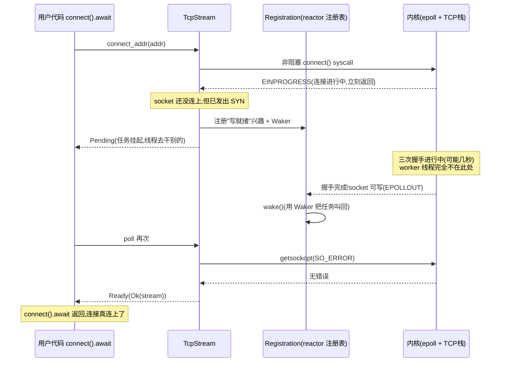

# 第 19 章 · TcpListener / TcpStream 的异步实现

> **核心问题**:`accept` / `connect` / `read` / `write` 这四件事,在 readiness 模型下到底怎么落地?一个普通的 OS socket,怎么变成一个可以 `.await` 的东西?connect 这种"发起要几秒、才出结果"的操作,凭什么不卡住线程?
>
> 第 18 章我们立住了字节流的 poll 契约(`AsyncRead::poll_read`),但当时那句"注册 Waker 等 readiness"是一笔带过的灰色框。这一章把那个框**完整拆开**:在真实的 TCP socket 上,非阻塞 + readiness 注册 + 唤醒重试,怎么一环扣一环地跑起来。
>
> **读完本章你会明白**:
> - 为什么 socket 必须**先设成非阻塞**(`O_NONBLOCK`),才有资格进 readiness 模型——这一步把"等"从"卡 syscall"翻成"syscall 立刻返回 `WouldBlock`",是后面一切的前提。
> - `accept` 怎么落地:先试一次,`WouldBlock` 就用 `Registration` 注册"读就绪"兴趣、挂起;有新连接了被唤醒,再 `accept` 拿连接。这一套和 `poll_read` 是**同一个三段式**(第 18 章技巧精解)。
> - `connect` 为什么特殊:非阻塞 connect 立即返回 `EINPROGRESS`,然后**等"写就绪"**——Linux 内核在三次握手完成时,会把 socket 标为可写,这一刻 connect 才算"成功";用 `take_socket_error` 查证是否真连上。
> - tokio 怎么用一个 `ScheduledIo` 结构,把"fd 的 readiness 状态 + 等待的 Waker"打包进**一个无锁的 `AtomicUsize`**,做到海量 fd 的 readiness 高效管理——这一段是第 3 篇注册表技巧的具象。

---

## 章首·一句话点破

> **把 socket 设成非阻塞,它就再也不会"卡住线程"——所有"等"都变成了 syscall 立刻返回 `WouldBlock`。剩下的只是:把"`WouldBlock` 之后什么时候再来试"这件事,交给 reactor 的 readiness 通知——读就绪叫你来 accept / read,写就绪叫你来 connect / write。socket 就这么变成了可 `.await` 的东西。**

这是**结论**。这一章倒过来拆:先看为什么"非阻塞"是 readiness 模型的入场券;再把 `accept` / `connect` 在源码里逐行追下去,看清注册 / 挂起 / 唤醒 / 重试的完整循环;最后看一眼承载这一切的 `ScheduledIo` 是怎么用无锁原子字做到高效的。

> 衔接第 18 章:那一章我们讲透了 `AsyncRead::poll_read` 的契约——`WouldBlock` 被翻成 `Pending` + Waker 注册。这一章把那个翻译,在真实的 TCP socket 上**实地走一遍**。你会发现,`accept` / `connect` / `read` / `write` 用的是**同一套三段式套路**,只是注册的兴趣方向不同(accept / read 等读就绪,connect / write 等写就绪)。

---

## 一、非阻塞 socket:readiness 模型的入场券

在动手追 `accept` / `connect` 之前,必须先讲清楚一件事:**tokio 里所有 socket,底层全都是非阻塞的**。这不是优化选项,是**前提条件**。

看 tokio 的 `TcpListener::from_std` 文档 [listener.rs:196-217](../tokio/tokio/src/net/tcp/listener.rs#L196-L217),里面有一行黑体警告:

> The caller is responsible for ensuring that the listener is in non-blocking mode. Otherwise all I/O operations on the listener will block the thread, which will cause unexpected behavior.

翻译:你必须保证 socket 是非阻塞的,否则一切 I/O 操作都会阻塞线程,行为不可预期。tokio 的 `bind` / `connect` 内部会**自动**把 socket 设成非阻塞(mio 在 `mio::net::TcpListener::bind` / `TcpStream::connect` 里设的),所以正常路径不用操心;但如果你从 `std::net::TcpListener::from_std` 接管一个 std 的 socket,**必须自己 `set_nonblocking(true)`**,否则会出错。

### 为什么必须非阻塞?

回想第 18 章那张时序图:`poll_read` 返回 `Pending` 之后,worker 线程立刻去 poll 别的 task。挂起期间,reactor 在盯着这个 fd。等 fd 可读了,reactor 唤醒 task,task 被 re-poll,这次 `poll_read` 内部去调一次 `read` syscall 拿数据。

**问题**:如果这个 socket 是阻塞的,这最后一次 `read` 会怎样?

> **不这样会怎样(反面)**:socket 阻塞,那 reactor 报了"可读"、task 来调 `read`,但**就在 task 调 `read` 那一瞬间,另一个 task 也读了同一个 buffer**(假就绪 / 多读端竞争),数据被别人抢走了。这个 `read` 拿不到数据,会**卡住线程**——因为它阻塞。于是整个 worker 钉死在这个 `read` 上,reactor 都没机会跑(reactor 跑在这些 worker 上)。runtime 死锁。

所以:**只有 socket 是非阻塞的,readiness 模型才能跑通**。非阻塞 socket 的 `read`,数据没来时**立刻返回 `Err(WouldBlock)`**,绝不卡线程。这样 reactor 报"可读"但实际没数据(假就绪),`read` 也只是返回 `WouldBlock`,tokio 三段式接住它(第 18 章),回 loop 重新等——一切正常。

非阻塞把"等"这件事,从**内核里的阻塞睡眠**,翻成了**用户态的"立刻返回 + 稍后再试"**。这是 readiness 模型把"等待不占线程"兑现的物理基础。

> **比喻回到餐厅**:阻塞 socket 的服务员,等菜时**整个人卡在传菜口**(syscall 在内核里睡眠)。非阻塞 socket 的服务员,问一句"菜好了吗",厨房说"没好",他**立刻转身走人**(syscall 立刻返回 `WouldBlock`)——好,这下他能去服务别桌了。厨房(reactor)在菜真好了的时候喊他一声,他再回来问一次。**非阻塞是"问完就走"的能力,readiness 是"菜好了主动喊"的能力**,两者缺一不可。

`AsyncFd` 的文档把这条说得很直白 [async_fd.rs:14-16](../tokio/tokio/src/io/async_fd.rs#L14-L16):

> The file descriptor must be of a type that can be used with the OS polling facilities (ie, `poll`, `epoll`, `kqueue`, etc), such as a network socket or pipe, and the file descriptor must have the nonblocking mode set to true.

> **钉死这件事**:非阻塞 socket 是 readiness 模型的入场券。没有它,假就绪一来就死锁;有了它,`WouldBlock` 只是"稍后再试"的信号,被 tokio 三段式优雅接住。tokio 的 `bind` / `connect` 自动设非阻塞,`from_std` 强制要求你已设非阻塞——这不是矫情,是生死线。

---

## 二、`accept`:先试一次,`WouldBlock` 就挂起等读就绪

现在追 `TcpListener::accept` 的源码。看 [listener.rs:162-171](../tokio/tokio/src/net/tcp/listener.rs#L162-L171):

```rust
pub async fn accept(&self) -> io::Result<(TcpStream, SocketAddr)> {
    let (mio, addr) = self
        .io
        .registration()
        .async_io(Interest::READABLE, || self.io.accept())
        .await?;

    let stream = TcpStream::new(mio)?;
    Ok((stream, addr))
}
```

这几行信息量很大。拆开看:

- `self.io` 是一个 `PollEvented<mio::net::TcpListener>`——tokio 把 mio 的 listener 包了一层,挂上了 reactor 注册表(`PollEvented` 内部的 `Registration`)。
- `self.io.registration()` 拿到那个 `Registration`(注册表句柄)。
- `.async_io(Interest::READABLE, || self.io.accept())` 是关键——它是个 async 函数,接收**两个参数:兴趣(READABLE)、操作(一个闭包,调 `self.io.accept()`)**。它的语义是:"**等这个 listener 可读了,再执行这个 accept 闭包;闭包返回 `WouldBlock` 就重新等**"。
- `.await` 把它接到 task 上。

`async_io` 内部就是我们第 18 章技巧精解讲过的那个三段式。看 [registration.rs:214 起](../tokio/tokio/src/runtime/io/registration.rs#L214)的 `async_io`:

```rust
pub(crate) async fn async_io<R>(
    &self,
    interest: Interest,
    mut f: impl FnMut() -> io::Result<R>,
) -> io::Result<R> {
    // (简化示意,非源码原文,核心循环如下)
    loop {
        // ① 等 readiness
        let ev = self.readiness(interest).await?;

        // ② 真正做操作
        match f() {
            Ok(ret) => return Ok(ret),
            Err(ref e) if e.kind() == io::ErrorKind::WouldBlock => {
                // ③ 假就绪 / 没准备好,清掉 readiness,回 loop 重新等
                self.clear_readiness(ev);
            }
            Err(e) => return Err(e),
        }
    }
}
```

三段式,和 `poll_io` 是一对(async 版 / poll 版)。它完美对应第 18 章讲的那张表:

1. **等 readiness**:`self.readiness(Interest::READABLE).await`——这个 `await` 是关键,它**内部就是 `Pending` + 注册 Waker** 的魔法发生处(下一节讲它怎么注册)。listener 还没新连接,这个 `await` 挂起,任务交出线程。
2. **做操作**:`f()` 调 `self.io.accept()`——这是真正的 syscall `accept`。非阻塞 listener 如果没新连接,返回 `WouldBlock`(而不是卡住)。
3. **假就绪就重来**:`WouldBlock` 时 `clear_readiness` + 回 loop——重新进 `readiness().await`,如果还没事件,继续挂起。

### `poll_accept` 版本:三段式看得更清

`accept` 的 async 版用了 `async_io`,把循环藏在 `.await` 里。tokio 还提供 `poll_accept`([listener.rs:179-194](../tokio/tokio/src/net/tcp/listener.rs#L179-L194)),把三段式**手写摊开**,更直观:

```rust
pub fn poll_accept(&self, cx: &mut Context<'_>) -> Poll<io::Result<(TcpStream, SocketAddr)>> {
    loop {
        let ev = ready!(self.io.registration().poll_read_ready(cx))?;   // ① 等

        match self.io.accept() {                                         // ② 做
            Ok((io, addr)) => {
                let io = TcpStream::new(io)?;
                return Poll::Ready(Ok((io, addr)));
            }
            Err(ref e) if e.kind() == io::ErrorKind::WouldBlock => {
                self.io.registration().clear_readiness(ev);              // ③ 重来
            }
            Err(e) => return Poll::Ready(Err(e)),
        }
    }
}
```

`poll_accept` 把 `ready!` 宏、`accept` 调用、`clear_readiness` 三步**裸露在源码里**,一眼看穿。注意 `ready!` 宏——它把 `Poll::Pending` 直接透传出函数(等价于 `let ev = match ... { Pending => return Pending }`)。也就是说,`poll_read_ready` 返回 `Pending` 时,整个 `poll_accept` 也返回 `Pending`——任务挂起。

### 为什么 accept 等的是"读就绪"?

这是个常被忽视但关键的设计:`TcpListener` 是用来 `accept` 新连接的,它为什么注册的是**读就绪**(`Interest::READABLE`)?

答案在内核语义:在 Linux 上,listener fd 上"有新连接待 accept"这件事,**内核用"fd 可读"来通知**。换句话说,listener 在 epoll 里也是个普通 fd,它的"可读"事件含义是"内部 accept 队列非空"——有新连接等着你 accept。所以 tokio 用 `Interest::READABLE` 监听 listener,语义和"监听 socket 是否可读数据"一致。

> **钉死这件事**:`accept` 的 readiness 模型落地,就是三段式:① 等 listener 读就绪(挂起、注册 Waker);② 真正 `accept`(拿新连接,或 `WouldBlock`);③ `WouldBlock` 就清 readiness 回 loop。这一套和第 18 章 `poll_read` 的三段式**一字不差**,只是兴趣方向是"读"——因为新连接到达这件事,内核用"listener 可读"通知。

---

## 三、`connect`:发起立刻返回,等"写就绪"才算连上

`accept` 是被动等连接进来,`connect` 是主动出去连别人。它比 `accept` 棘手得多,因为**connect 本身可能要几秒**(网络握手、对端慢、对端不可达)。这几秒里怎么不卡线程?这是 readiness 模型最精彩的应用之一。

看 `TcpStream::connect_addr` → `connect_mio` 的源码 [stream.rs:139-160](../tokio/tokio/src/net/tcp/stream.rs#L139-L160):

```rust
async fn connect_addr(addr: SocketAddr) -> io::Result<TcpStream> {
    let sys = mio::net::TcpStream::connect(addr)?;   // ① 非阻塞 connect,立刻返回
    TcpStream::connect_mio(sys).await
}

pub(crate) async fn connect_mio(sys: mio::net::TcpStream) -> io::Result<TcpStream> {
    let stream = TcpStream::new(sys)?;

    // Once we've connected, wait for the stream to be writable as
    // that's when the actual connection has been initiated. Once we're
    // writable we check for `take_socket_error` to see if the connect
    // actually hit an error or not.
    //
    // If all that succeeded then we ship everything on up.
    poll_fn(|cx| stream.io.registration().poll_write_ready(cx)).await?;   // ② 等写就绪

    if let Some(e) = stream.io.take_error()? {                            // ③ 查是否真连上
        return Err(e);
    }

    Ok(stream)
}
```

三步,每一步都踩在非阻塞 connect 的内核语义上。我们拆。

### 第 ① 步:`mio::net::TcpStream::connect` 立刻返回

`mio::net::TcpStream::connect(addr)` 内部调用 libc 的 `connect(2)` syscall,但**因为 socket 是非阻塞的**,这次调用**不会等握手完成**:

- 如果是本地连接、对端立刻接,可能握手当场完成,`connect` 返回 `Ok`。
- 如果握手需要时间(绝大多数情况),`connect` **立刻返回 `Err(EINPROGRESS)`**——意思是"连接正在进行中,你别等了,回头来查"。
- 如果对端不可达,`connect` 也可能立刻返回 `Err(ECONNREFUSED)`(本地就拒绝)或别的错误。

mio 在内部把 `EINPROGRESS` 翻译成 `Ok`(因为"进行中"不是错误,是预期内的中间状态),所以 tokio 这里拿到的是 `Ok(sys)`——一个**连接尚未完成的 socket**。

> **不这样会怎样(反面)**:如果 socket 是阻塞的,这次 `connect` 会**卡住几秒**——典型的同步 TCP 握手等待。这一个 task 卡几秒,worker 线程就被钉几秒。第 0 章的同步 thread-per-connection 模型,卡的就是这一步。tokio 的非阻塞 connect 把这几秒,从"占用线程"翻成了"挂起、等通知"。

### 第 ② 步:等"写就绪"

```rust
poll_fn(|cx| stream.io.registration().poll_write_ready(cx)).await?;
```

这一行是 connect 异步化的精髓。它把"connect 完成了吗"这件事,**翻译成"这个 socket 可写了吗"**。

为什么是"写就绪"?这是 Linux / Unix 内核的 TCP 实现约定:**非阻塞 socket 上正在进行的 connect,当三次握手完成(或失败)时,内核会把该 socket 标为"可写"**(EPOLLOUT 事件)。换句话说,connect 的"完成"信号,在 readiness 模型里就是"写就绪"。

`poll_write_ready(cx)` 内部:如果 socket 还没可写(连接还在进行中),把 `cx.waker()` 注册到 reactor,挂起任务(`Pending`);socket 可写了(连接完成了),reactor 唤醒 task,`poll_write_ready` 返回 `Ready(Ok)`。

> **比喻回到餐厅**:connect 像服务员"下单给厨房、厨房开始做"。服务员不会站在厨房门口等几秒菜好(阻塞),而是下单完转身走人(`EINPROGRESS`),在传菜口留一句"3 号菜好了叫我"。厨房菜好了(连接完成),按下"3 号"的叫号器——这个叫号信号,在内核 TCP 里就是"socket 可写"。服务员被叫回,再去端菜(查 connect 结果)。

### 第 ③ 步:`take_socket_error` 查证是否真连上

```rust
if let Some(e) = stream.io.take_error()? {
    return Err(e);
}
Ok(stream)
```

这一步**很多人不理解为什么必要**。socket 可写了,connect 不就成功了吗?——不。在 TCP 里,connect 可能**失败**(对端拒绝、超时、网络不可达),而失败的信号**也是"socket 可写"**——内核不区分"握手成功"和"握手失败",统一用"socket 状态变了、来查一下"通知。所以可写之后,**必须查一下 `SO_ERROR`**,看是真连上还是出错了。

`take_socket_error` 内部调 `getsockopt(SO_ERROR)`,拿到 connect 的真实结果:无错误 = 真连上;有错误 = 连接失败,把错误返回。这一步堵住了 connect 的"假成功"——光看可写就当连上,是 bug。

### connect 完整时序



看图中间那段"握手进行中":worker 线程**完全不在这里**,它早去跑别的 task 了。这几秒(甚至几十秒)的等待,被一个 Waker + reactor 的 readiness 通知兜住了。这就是第 0 章那句"把等待从占用里解放"在 connect 上最漂亮的样子。

> **钉死这件事**:connect 的 readiness 落地是**三步**——① 非阻塞 `connect()` 立刻返回 `EINPROGRESS`;② `poll_write_ready().await` 等握手完成(内核用"socket 可写"通知);③ `take_socket_error` 查证真连上。三步合起来,把"等几秒握手"从"占用线程"翻成"挂起、等写就绪"。这一套是 connect 异步化的标准姿势,任何非阻塞 socket 编程都这么写,tokio 只是把它包装成了优雅的 `.await`。

---

## 四、`read` / `write`:三段式在数据传输上的复用

`accept` / `connect` 是建立连接,真正的数据传输靠 `read` / `write`。它们怎么落地?答案是:**完全是同一个三段式**,只是分别注册读就绪 / 写就绪。

看 `PollEvented::poll_read` 的简化核心([poll_evented.rs 摘录,简化示意](../tokio/tokio/src/io/poll_evented.rs#L175-L227)):

```rust
pub(crate) fn poll_read<'a>(&'a self, cx: &mut Context<'_>, buf: &mut ReadBuf<'_>) -> Poll<io::Result<()>>
where &'a E: io::Read + 'a,
{
    loop {
        let evt = ready!(self.registration.poll_read_ready(cx))?;   // ① 等读就绪

        match self.io.as_ref().unwrap().read(buf.unfilled_mut()) {   // ② 真正 read
            Ok(n) => {
                // (edge-triggered 优化:部分读要清 readiness)
                if 0 < n && n < len {
                    self.registration.clear_readiness(evt);
                }
                unsafe { buf.assume_init(n) };
                buf.advance(n);
                return Poll::Ready(Ok(()));
            },
            Err(e) if e.kind() == io::ErrorKind::WouldBlock => {
                self.registration.clear_readiness(evt);              // ③ 重来
            }
            Err(e) => return Poll::Ready(Err(e)),
        }
    }
}
```

`poll_write` 结构完全对称([poll_evented.rs:229-277](../tokio/tokio/src/io/poll_evented.rs#L229-L277)),只是 `poll_read_ready` 换成 `poll_write_ready`。**这就是第 18 章 `AsyncRead::poll_read` 契约的具体实现**:TcpStream 实现 `AsyncRead`,它的 `poll_read` 转发给 `PollEvented::poll_read`,后者跑这个三段式。

### 一个 edge-triggered 的小优化

注意 poll_read 里这段注释"if 0 < n && n < len { clear_readiness }"——只读了一部分(没填满 buffer),就**主动清掉 readiness**。为什么?

tokio 在 edge-triggered 模式下(Linux epoll 默认),readiness 事件只在状态**翻转**(不可读 → 可读)时通知一次。如果你只读了一部分,socket buffer 里**还有数据**,状态还是"可读"——下次 readiness 不会再通知(因为没翻转)。这时如果不清 readiness,`loop` 顶的 `poll_read_ready` 会**立刻返回 Ready**(因为上次的 readiness 标记还在),你又 read 一点,又只读一部分……虽然能跑,但 readiness 标记的语义就被滥用了。

tokio 选择**主动清掉**:只读了一部分,说明 buffer 可能被读空了(下次得重新等通知),清 readiness 更安全。这是 edge-triggered 模型下一个**为了正确性牺牲一点点性能**(下次得多等一次 readiness)的取舍。源码注释明确指向了 issue #5866(Windows 等_level-triggered_平台不加这段会出 bug)。

> **钉死这件事**:`read` / `write` 的 readiness 落地,和 `accept` / `connect` 是**同一个三段式**(等 readiness → 操作 → 假就绪就重来),只是兴趣方向不同。至此,`accept` / `connect` / `read` / `write` 四个核心 I/O 操作,在 readiness 模型下全部落齐——它们用同一套套路,只是"等什么就绪"和"做什么操作"两个变量在变。

---

## 五、`ScheduledIo`:把 readiness 状态 + Waker 塞进一个原子字

讲到这里,你可能会问:那"注册 Waker、等 readiness"这一步,**底层数据结构是怎么做的**?tokio 怎么管理成千上万个 socket 的 readiness 状态和它们的等待者?这一节简短看一下承载这一切的核心结构 `ScheduledIo`——它是第 3 篇"注册表 slab + token 映射"技巧在源码里的具象。

看 [scheduled_io.rs:101-122](../tokio/tokio/src/runtime/io/scheduled_io.rs#L101-L122):

```rust
#[repr(align(64))]    // 缓存行对齐!
pub(crate) struct ScheduledIo {
    pub(super) linked_list_pointers: UnsafeCell<linked_list::Pointers<Self>>,

    /// Packs the resource's readiness and I/O driver latest tick.
    readiness: AtomicUsize,   // 打包了 readiness + tick + shutdown

    waiters: Mutex<Waiters>,
}

struct Waiters {
    list: WaitList,
    reader: Option<Waker>,    // 等读就绪的那个 task 的 Waker
    writer: Option<Waker>,    // 等写就绪的那个 task 的 Waker
}
```

这个结构里有三个值得拆的设计:

### 设计一:`AtomicUsize` 打包三段信息

`readiness` 这一个 `AtomicUsize`,打包了**三个东西**(看 [scheduled_io.rs:164-174](../tokio/tokio/src/runtime/io/scheduled_io.rs#L164-L174) 的注释):

```text
| shutdown | driver tick | readiness |
|----------+-------------+-----------|
|   1 bit  |   15 bits   |  16 bits  |
```

- **readiness(16 位)**:这个 fd 当前就绪了哪些事件(可读、可写、错误、hup)。每一位对应一种 readiness 类型。
- **driver tick(15 位)**:一个"代"号,用来识别 readiness 事件是不是过期的(防止"假就绪重试"时用到旧事件)。
- **shutdown(1 位)**:reactor 是否已关闭。

把这三样压在一个 `AtomicUsize` 里,有什么好处?**所有对 readiness 的读 / 改 / 查,都是一次原子操作**,不需要锁。比如 `set_readiness`([scheduled_io.rs:209-226](../tokio/tokio/src/runtime/io/scheduled_io.rs#L209-L226))用 `fetch_update` 一次原子地"读旧值 → 算新值 → 写新值",期间不阻塞任何别的线程:

```rust
pub(super) fn set_readiness(&self, tick_op: Tick, f: impl Fn(Ready) -> Ready) {
    let _ = self.readiness.fetch_update(AcqRel, Acquire, |curr| {
        // ...
        let ready = Ready::from_usize(READINESS.unpack(curr));
        Some(TICK.pack(new_tick, f(ready).as_usize()))
    });
}
```

> **不这样会怎样(反面)**:如果 readiness 状态用普通字段 + `Mutex`,那么 reactor 每收到一个 epoll 事件,都要**锁住这个 fd 的 ScheduledIo** 才能更新 readiness——而同时 task 端 `poll_read_ready` 也要锁同一个 ScheduledIo 查 readiness。两个线程抢一把锁,在万级并发下锁竞争爆炸。无锁原子字把这个争用降到一次 `fetch_update`,几乎零开销。

### 设计二:`reader` / `writer` 两个 Waker slot

`Waiters` 里有两个**单独的 Waker 字段**:`reader`(等读就绪的 task)和 `writer`(等写就绪的 task)。为什么只有各一个,而不是一个 list?

因为**同一个 socket 的读端、写端,各只允许一个 task 同时等**(`PollEvented` 文档明确写了这个约束)。这样一个 socket 最多两个等待者(一个等读、一个等写),用两个 `Option<Waker>` 就够,不需要链表。reactor 收到事件时,`wake()` 函数([scheduled_io.rs:238-288](../tokio/tokio/src/runtime/io/scheduled_io.rs#L238-L288))就是"如果可读了就 wake `reader`,如果可写了就 wake `writer`",O(1)。

```rust
pub(super) fn wake(&self, ready: Ready) {
    let mut wakers = WakeList::new();
    let mut waiters = self.waiters.lock();

    if ready.is_readable() {
        if let Some(waker) = waiters.reader.take() {
            wakers.push(waker);   // 可读了,叫醒 reader
        }
    }
    if ready.is_writable() {
        if let Some(waker) = waiters.writer.take() {
            wakers.push(waker);   // 可写了,叫醒 writer
        }
    }
    // ... 还有 list 里额外的等待者(用 ready().await 这种) ...
    drop(waiters);
    wakers.wake_all();
}
```

> **钉死这件事**:`reader` / `writer` 双 slot 设计,是对"socket 读写各一个等待者"这个**实际约束**的精准利用。tokio 没有傻乎乎给每个 socket 配一个 Waker 链表——它观察到"一个 socket 同一时刻至多一个 reader + 一个 writer 在等",就用两个 `Option<Waker>` 搞定,O(1) 注册、O(1) 唤醒。这是"无锁优先 + 数据结构匹配实际约束"的典范。

### 设计三:`#[repr(align(64))]` 缓存行对齐

注意 struct 上那个 `#[repr(align(64))]`。64 字节是常见 CPU 的缓存行(cache line)大小。这个对齐保证**一个 `ScheduledIo` 独占自己的缓存行**(它本身约 80 字节,占两行,但起点对齐)。

> **不这样会怎样(反面)**:如果不对齐,两个 `ScheduledIo` 可能挤在同一缓存行里(伪共享,false sharing)。reactor 线程在更新 socket A 的 readiness(原子写),会**连带把 socket B 所在那一行整个失效**——socket B 所在 CPU 核下次访问 B 要重新从内存加载。万级并发下,这种伪共享让缓存命中率塌方。`align(64)` 把每个 `ScheduledIo` 钉在自己的缓存行,**避免了跨 fd 的伪共享**。第 5 章(task Header)也用了同样的技巧——缓存行对齐是系统级并发代码的标配。

---

## 技巧精解:非阻塞 socket + readiness 的标准三段式

这一节把本章所有技巧收束到一处。我们挑全书 I/O 落地的**主角技巧**——"非阻塞 socket + readiness 注册 + 唤醒重试"三段式——单独拆透,配真实源码 + 两个反面对比,让 readiness 模型的妙处显形。

### 三段式的标准形态

无论是 `accept` / `connect` / `read` / `write`,落到 readiness 模型都是这三步:

```text
loop {
    1. 等 readiness(挂起、注册 Waker)
    2. 做操作(syscall,非阻塞)
    3. WouldBlock / 部分完成 → 清 readiness,回 1
}
```

源码里这三个函数([registration.rs](../tokio/tokio/src/runtime/io/registration.rs))、`poll_io` / `async_io` / `try_io`,本质都在跑这个循环。区别只在:① 注册什么兴趣(READABLE / WRITABLE);② 做什么操作(accept / connect / read / write);③ 是否循环(单次操作 vs 流式)。

### 反面对比一:阻塞 socket 的灾难

最朴素的反面,是不设非阻塞、直接用 readiness:

```rust
// 简化示意,非源码原文:阻塞 socket + readiness 的灾难
loop {
    readiness.await?;        // 等可读
    let n = sock.read(buf)?; // 阻塞!如果假就绪,卡死
}
```

> **不这样会怎样**:epoll 报"可读",但可能是**假就绪**(多 reader 竞争、edge-triggered 时序问题)。sock 是阻塞的,这次 `read` 数据没来,**卡住整个线程**——`read` 不会返回 `WouldBlock`,它在内核里睡眠等数据。worker 钉死,reactor 也跑不了(reactor 在 worker 上),runtime 死锁。

所以非阻塞是**入场券**——没有它,readiness 模型立刻崩溃。`O_NONBLOCK` / `set_nonblocking(true)` 是第一步。

### 反面对比二:纯轮询的 CPU 浪费

另一个反面,是非阻塞了,但**不用 readiness、纯轮询**:

```rust
// 简化示意,非源码原文:非阻塞但纯轮询,烧 CPU
loop {
    match sock.read(buf) {
        Ok(n) => return Ok(n),
        Err(WouldBlock) => continue,   // 立刻再试!纯烧 CPU
        Err(e) => return Err(e),
    }
}
```

> **不这样会怎样**:数据没来,`read` 返回 `WouldBlock`,`continue` 立刻再 `read`——一秒钟调几百万次 syscall,99.99% 都是 `WouldBlock`。CPU 100% 占着,纯浪费。这在嵌入式 / 老式网络库里见过,叫**忙轮询(busy polling)**,是 readiness 模型要消灭的东西。

readiness 模型的解法是:不要立刻重试,**挂起、让 reactor 在真有事件时叫你**。这一步靠 `Pending` + Waker 注册——task 让出线程,reactor 在 epoll 事件到来时 wake 它。CPU 占用从 100% 降到接近 0(挂起期间)。

### 三段式的精妙:同时躲掉两个反面

把三段式和两个反面摆一起,妙处显形:

| | 反面一(阻塞 socket) | 反面二(纯轮询) | tokio 三段式 |
|---|---|---|---|
| socket 模式 | 阻塞 | 非阻塞 | 非阻塞 |
| 数据没来时 | 卡死线程 | 立刻重试烧 CPU | 挂起 + 注册 Waker,让出线程 |
| 数据来了时 | (早就卡死) | 终于读到 | reactor 唤醒,re-poll,读到 |
| CPU 占用 | 卡死(0 进度) | 100%(无意义) | 0(挂起) → 瞬间 100%(真干活) |

tokio 三段式同时躲掉两个反面:**非阻塞**(躲反面一)+ readiness 通知(躲反面二)。两者咬合,才有"等待不占线程、有事件立刻醒"的 readiness 模型。`accept` / `connect` / `read` / `write` 全部落在这套套路上,这一章把它们在 TCP 上落齐。

> **钉死这件事(第 6 篇的总钉子)**:tokio 的网络 I/O 全部建立在"**非阻塞 socket + readiness 通知**"这一对基础上。非阻塞保证 syscall 立刻返回、不卡线程;readiness 保证只在"有事"时才唤醒 task、不空转。`accept` / `connect` / `read` / `write` 的源码,无非是这个三段式在四个操作上的复用。一旦看穿这一点,你就能举一反三——UnixStream、UdpSocket、tls 的 stream、任何 readiness 模型下的 I/O,都是这套套路。

### 一个 sound 性补充:edge-triggered 下的"`WouldBlock` 之后必须重新等"

tokio 用 epoll 时是 **edge-triggered**(第 3 篇会详拆)。edge-triggered 有个特性:**状态翻转才通知一次**。这逼出一个 sound 性约定——`AsyncFd` 文档明确写了([async_fd.rs:44-48](../tokio/tokio/src/io/async_fd.rs#L44-L48)):

> On some platforms, the readiness detecting mechanism relies on edge-triggered notifications. This means that the OS will only notify Tokio when the file descriptor transitions from not-ready to ready. **For this to work you should first try to read or write and only poll for readiness if that fails with an error of `std::io::ErrorKind::WouldBlock`.**

翻译:edge-triggered 下,**你应该先试一次 read/write,失败了再等 readiness**。为什么?因为如果你"等 readiness 再读",但 socket 一开始就处于可读状态(buffer 有数据),edge-triggered 不会通知(状态没翻转),你会**永远等不到事件**——死锁。

tokio 的 `async_io` / `poll_io` 三段式,是先等 readiness(`readiness().await`)再操作。这看似违背了"先试再等"的约定?——其实不然。tokio 内部有个**tick 机制**:`ScheduledIo` 的 readiness 字段会记住"上次收到的事件",`readiness()` 会先查这个标记——如果标记显示就绪,**立刻返回**(不等新事件);只有标记显示未就绪,才挂起等新事件。这样既享受了 edge-triggered 的高效(只在翻转时通知),又躲过了"漏通知"的坑(靠 tick + readiness 标记补)。

`ScheduledIo` 里那个 `driver tick` 字段(15 位),就是干这个的——它让"假就绪重试"能识别"这个 readiness 是新事件还是旧事件",防止用过期事件重试。这是 edge-triggered 下保证正确性的关键无锁技巧,第 3 篇详拆。

---

## 章末小结

### 用"餐厅服务员"比喻回顾本章

1. **非阻塞 socket 的服务员**:问厨房"菜好了吗",没好就**立刻转身走人**(`WouldBlock`,syscall 立刻返回),绝不站在传菜口干等。这是 readiness 模型的入场券——没有"转身走人"的能力,假就绪一来就死锁。
2. **`accept`**:服务员在传菜口等"有新客到"的信号(读就绪),没信号就让出、去服务别桌;信号来了,他去迎新客(accept)。
3. **`connect`**:服务员下单给厨房(`EINPROGRESS`,连接发起中)、转身走人;厨房菜做好了(写就绪,握手完成),按叫号器叫他;他回来还要查一眼"是真做好了还是搞砸了"(`take_socket_error`)。
4. **`read` / `write`**:服务员端菜回来(read)、送订单进去(write),buffer 空了 / 满了就等"可读 / 可写"信号,套路和 accept 完全一样。
5. **背后**:`ScheduledIo` 用一个原子字记录每个 socket 的 readiness 状态,用两个 Waker slot 记等读 / 等写的 task;reactor 收到 epoll 事件,一次原子更新 + 一次 wake,唤醒对应的 task。

### 本章在全书主线中的位置

记住全书的二分法:**调度执行(让就绪的任务跑) vs 事件唤醒(让等待的任务不空耗、就绪了再叫)**。

这一章服务的是**事件唤醒**那一面的**机制落地**:第 18 章立住了 trait 契约(`poll_read` 翻译 `WouldBlock` 为 `Pending`),这一章在真实的 TCP socket 上把那个翻译**完整跑通**——非阻塞 socket 保证 syscall 不卡线程,readiness 注册 + 唤醒保证只在有事时叫 task。`accept` / `connect` / `read` / `write` 四件 I/O 大事,在 readiness 模型下全部落齐。

至此,第 6 篇(网络 I/O)收束。从第 3 篇(mio / epoll / AsyncFd)到这一章,readiness 模型完成了从"底层事件源"到"trait 契约"再到"真实 socket 落地"的完整链条:**epoll 报事件 → ScheduledIo 更新 readiness → wake 对应 Waker → task re-poll → poll_read/accept/connect 完成操作**。这条链条,就是 tokio 处理一切网络 I/O 的主干。

### 五个"为什么"清单

1. **为什么 socket 必须非阻塞?**:阻塞 socket 在假就绪时会让 `read`/`accept` 卡死线程,reactor 都跑不了,runtime 死锁。非阻塞保证 syscall 立刻返回 `WouldBlock`,被三段式接住。`O_NONBLOCK` / `set_nonblocking(true)` 是 readiness 模型的入场券。
2. **`accept` 怎么落地?**:三段式——等 listener 读就绪(新连接到达,内核用"listener 可读"通知)→ `accept` syscall 拿连接 → `WouldBlock` 就清 readiness 重来。源码在 `poll_accept` 里裸露三步。
3. **`connect` 为什么等写就绪?**:非阻塞 connect 立刻返回 `EINPROGRESS`,握手在内核异步进行;Linux 内核约定"握手完成(成功或失败)时把 socket 标为可写(EPOLLOUT)"。所以等"写就绪"就是在等握手完成。可写之后还要 `take_socket_error` 查证——因为失败也是"可写",得区分。
4. **`ScheduledIo` 为什么用 `AtomicUsize` 打包 readiness?**:把 readiness / tick / shutdown 三段信息压在一个原子字里,所有更新都是无锁原子操作,避开 `Mutex` 争用。`reader` / `writer` 双 Waker slot 匹配"一个 socket 至多一个 reader + 一个 writer"的实际约束,O(1) 注册唤醒。`align(64)` 防伪共享。
5. **edge-triggered 下为什么"先试再等"?**:edge-triggered 只在状态翻转时通知,如果一开始就处于可读状态、不通知,纯"等再读"会永远等不到。tokio 用 tick + readiness 标记补:先查标记(可能已就绪、直接返回),未就绪才挂起新等。这躲过了 edge-triggered 的漏通知坑。

### 想继续深入,该往哪钻

- **看 accept / connect / read / write 的真实落地**:
  - [`TcpListener::accept` / `poll_accept`](../tokio/tokio/src/net/tcp/listener.rs#L162-L194) —— accept 三段式(async 版 + poll 版)。
  - [`TcpStream::connect_mio`](../tokio/tokio/src/net/tcp/stream.rs#L144-L160) —— connect 三步:非阻塞 connect + 等写就绪 + take_error。
  - [`PollEvented::poll_read` / `poll_write`](../tokio/tokio/src/io/poll_evented.rs#L175-L277) —— read / write 的三段式 + edge-triggered 部分读清 readiness 的优化。
- **看 readiness 注册 / 唤醒的核心机制**:
  - [`Registration::async_io` / `poll_io`](../tokio/tokio/src/runtime/io/registration.rs#L162-L226) —— 三段式的统一入口。
  - [`ScheduledIo` 结构](../tokio/tokio/src/runtime/io/scheduled_io.rs#L101-L122) / [`set_readiness`](../tokio/tokio/src/runtime/io/scheduled_io.rs#L209-L226) / [`wake`](../tokio/tokio/src/runtime/io/scheduled_io.rs#L238-L288) / [`poll_readiness`](../tokio/tokio/src/runtime/io/scheduled_io.rs#L305-L340) —— 无锁 readiness 状态字 + 双 Waker slot。
  - [`AsyncFd` 文档](../tokio/tokio/src/io/async_fd.rs#L1-L70) —— "必须非阻塞"+"edge-triggered 下先试再等"两条铁律的白纸黑字。
- **亲手感受**:写个 echo server,用 `tokio::spawn` 给每个连接开一个 task 处理;用 `tokio-console` 看,会发现少量 worker 线程驱动几百几千个 task,read 等数据时 task 全部挂起、worker 几乎空闲——这就是 readiness 模型兑现的样子。再故意把 socket 设回阻塞(从 std 接管不设非阻塞),观察 runtime 死锁。
- **下一站**:第 6 篇收束,readiness 模型在网络上落齐。可 tokio 还有很多"进阶真相"没拆:`spawn` 之后到底发生了什么?`block_on` 怎么在当前线程跑一个 future 而不打扰 scheduler?`select!` 那个宏展开后是什么?drop 一个 task 又会发生什么?翻开 **第 7 篇 · 进阶真相:spawn / block_on / select / 取消与 shutdown**——我们从 `spawn` 的完整路径看起。

---

> 第 6 篇在这里收束:`AsyncRead`/`AsyncWrite` 把字节流 poll 化,`TcpListener`/`TcpStream` 把 readiness 模型在真实 socket 上落齐。tokio 怎么用少量线程扛海量并发,到这里你看清了主干。但还有一层"进阶真相":`spawn`、`block_on`、`select!`、取消——它们表面是 API,底下藏着不少没拆的机制。翻开 **第 7 篇**,把这些最后的迷雾拨开。
