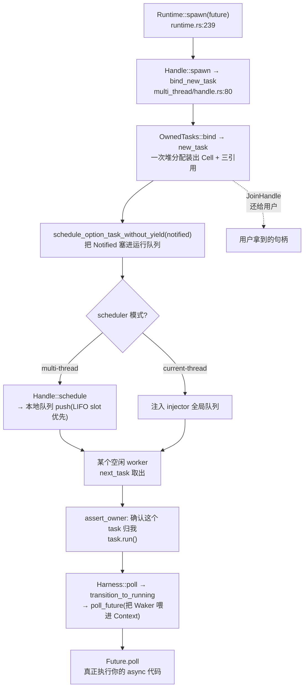

# 第 20 章 · spawn / block_on / select 的真相

> **核心问题**:`tokio::spawn`、`block_on`、`select!` 是读者天天写的三行代码,可它们各自到底干了什么?`spawn(future)` 之后,这个 future 是怎么一路变成被 worker 线程 poll 的 task 的(第 1 篇我们追过 spawn 的"装 task"一半,可"塞进队列被 worker 捡起来"那一半还没接上)?`block_on` 凭什么能在一个**没有 spawn** 的 `fn main` 里把 async 跑起来,而且它在 multi-thread 运行时上跑的时候,worker 线程池还在转——它**怎么做到不打扰 scheduler** 的?`select!` 这个宏,你写它的时候像在写"多路分支选择",可宏展开后到底是个什么怪物?
>
> 这一章是**第 7 篇(进阶真相)的开篇**,也是全书 21 章里最"衔接"的一章——它把读者从第 1 篇立起来的 task、第 2 篇立起来的 runtime、第 5 篇立起来的 sync 原语,重新串到这三个天天用的入口上,让前 19 章攒下的认知第一次"落到键盘上"。
>
> **读完本章你会明白**:
> - `tokio::spawn(future)` 的**完整路径**:从 `Runtime::spawn` 一路追到 worker 线程的 `task.run()`,看清第 1 篇只追了一半(`new_task` 装出 `Cell` + 三引用)的"另一半"——`Notified` 怎么进队、worker 怎么取出来 poll,以及 spawn 为什么是"即发即走"的。
> - `block_on` 为什么**有两副面孔**:在 current-thread 运行时上,它是"poll 这个 future + 顺带 drive 整个调度器和 reactor"的小循环(也就是 runtime 真正的"心脏");在 multi-thread 运行时上,它却**不打扰 worker 线程池**,只把当前线程 park 起来等 future 完成——这两副面孔背后是同一个"为什么"。
> - `select!` 展开后根本不是什么"选择",而是一个 **`poll_fn` + 一个 futures 元组 + 一个 disabled 位掩码 + 一个随机起点**——第一个分支 Ready 就 return、其余分支随 future 一起出作用域被 drop(就是被取消)。以及为什么"漏 drop 分支 future"会泄漏。
> - 为什么 `block_on` 里嵌套 `block_on` 是灾难,以及 `block_in_place` 是怎么救场的。
>
> **如果一读觉得太难**:先只记住三件事——① `spawn` = 装成 task(第 1 篇讲过)+ 塞进队列(本章接上)+ worker 捡起来 poll;② `block_on` 不把 future 变成 task,它**直接在当前线程 poll 这个 future**,顺带把 reactor/timer 推一下;③ `select!` 展开成一个临时组合 future,第一个 Ready 走分支,其余 drop(取消)。三个入口的细节看不懂可以先跳过,但要把这三句结论带走。

---

## 章首·一句话点破

> **`spawn` 是把订单送进派单队列(从此它归 scheduler 管);`block_on` 是服务员自己临时上手伺候这一单(不进派单队列,不打扰别的服务员);`select!` 是手里同时拿几份呼叫器、哪份先响就办哪份、剩下的全撕掉。三个入口,对应 async 运行时里"调度执行"这条线的三个不同切面。**

这是**结论**。这一章倒过来拆:先追 `spawn` 的完整后半程(第 1 篇只追了"装 task"),看清 task 怎么从 spawn 点被一路推到 worker 的 poll;再拆 `block_on` 为什么"不打扰 scheduler",看清它和 spawn 走的是两条截然不同的路;最后把 `select!` 宏展开,看清那个看似神奇的"多路选择"其实是个朴素的 `poll_fn` 循环。

第 1 篇结尾留了钩子:"task 这个调度单元立起来了,可它自己不会跑——运行时要把它塞进队列、有 worker 来 poll"。第 2 篇(P2-06~09)讲了 worker 怎么 poll、怎么 work-stealing、怎么让出。本章不重讲那些,只把"spawn 之后那半程"和"block_on/select 这两个入口"补齐,把全书的技术线收回到读者键盘上。

---

## 一、spawn 的完整路径:从一行代码到 worker 的 poll

第 1 篇第 5 章(P1-05)我们追过 `tokio::spawn` 的**前半程**:`Runtime::spawn` → `Handle::spawn` → `bind_new_task` → `OwnedTasks::bind` → `task::new_task` → `RawTask::new`——一句话,**Future 被一次堆分配装进 `Cell`(Header + Core + Trailer),变出三份引用(`Task` + `Notified` + `JoinHandle`)**。那一章停在 `bind_new_task` 的第三步:`schedule_option_task_without_yield(notified)`——"把那个 `Notified` 塞进运行队列"。**这后半程,正是本章要接上的。**

### 从 `Runtime::spawn` 到 worker 取出 task

先把整条链路画出来,然后逐段讲。注意这张图右半边(队列 → worker → poll)是第 2 篇的领地,本章只点关键节点,不展开 work-stealing 细节。



前半程(C 之前)第 5 章讲透了,本章一句话带过。重点看后半程:`Notified` 怎么进队、worker 怎么取出来 poll。

### `schedule_option_task_without_yield`:Notified 进队

`bind_new_task` 拿到 `Notified` 后,调 `schedule_option_task_without_yield`(见 [worker.rs:1347](../tokio/tokio/src/runtime/scheduler/multi_thread/worker.rs#L1347))。名字里的 "without yield" 是个伏笔——它和 `yield_now` 走的是同一个 `schedule_task`,但 spawn 不需要让出当前线程(刚 spawn 完,当前 task 还有活要干)。这条链路最终落到 `Shared::schedule_task`([worker.rs:1327](../tokio/tokio/src/runtime/scheduler/multi_thread/worker.rs#L1327))——

```rust
// tokio/src/runtime/scheduler/multi_thread/worker.rs(摘录,简化)
pub(super) fn schedule_task(&self, task: Notified, is_yield: bool) {
    // ... 判断当前线程是不是 worker、LIFO slot、本地队列 vs injector
}
```

`schedule_task` 内部会判断:**当前线程是不是 worker?如果是,优先 push 进它自己的本地运行队列(local run queue,LIFO slot 优先);如果不是(比如主线程 `tokio::spawn`),push 进全局 injector 队列**。

> **比喻回到餐厅**:`schedule_option_task_without_yield` 就是"服务员把派单联撕一张,塞进派单队列"。如果撕单的这个服务员本来就在岗(当前线程是 worker),那这张单优先塞进**他自己手边那摞订单**(本地队列,而且刚塞的会最先被取——LIFO slot,第 8 章细讲这个优化);如果撕单的是经理或客人(当前线程不是 worker),那就塞进**前台那本谁都来取的总订单本**(injector 全局队列)。
>
> 不管塞进哪,这张派单联从此就**归调度器管**了——spawn 的调用方拿到 `JoinHandle` 转身就走,不再管这个 task 怎么被调度。这就是 spawn "**即发即走**"(fire and forget)的特性:你 spawn 完,task 就交给 runtime 了,你只能通过 JoinHandle 等结果或 abort 它。

### worker 怎么取出来 poll:第 2 篇的活,本章只点关键节点

worker 线程的主循环(第 2 篇 P2-06/07 详拆)大致是这样:

```rust
// 简化示意,非源码原文:worker 主循环
loop {
    // 1. 找一个就绪的 task:先看本地队列,空了去偷别人的(injector/work-stealing)
    let task = next_task(&context);          // 拿到一个 Notified
    // 2. 确认这个 task 归我(AssertOwner)
    let task = context.handle.shared.owned.assert_owner(task);
    // 3. 跑它
    task.run();                              // → Harness::poll → poll_future
}
```

`task.run()` 走到 `Harness::poll` → `poll_inner`(第 4 章讲 Waker 起点时贴过,见 [harness.rs:193-232](../tokio/tokio/src/runtime/task/harness.rs#L193-L232))。三件事:**① 抢 RUNNING 位**(`transition_to_running`);**② 造 task 自己的 Waker,包成 Context,喂给 Future.poll**;**③ 根据 poll 返回值,走 transition_to_idle 或 transition_to_complete**。

> **钉死这件事(承接第 1 篇)**:第 5 章我们立了 task 的内存布局、状态字、引用计数。本章补上的是:**task 从 spawn 到被 poll 的完整链路**。spawn 装出 task + 塞进队列;worker 从队列取出 task;`task.run()` 用 `transition_to_running` 抢锁(就是状态字的 RUNNING 位)、用 RUNNING 位独占访问 stage 字段(才能 mutate Future)、poll 完用 `transition_to_idle`/`transition_to_complete` 释放锁并决定下一步。**整条链路上,task 的状态字是唯一的协调点**——所有 worker、所有 Waker、所有 schedule 调用,都靠对状态字的一次 CAS 来协调。这就是第 5 章那个"无锁状态机"在 spawn 后半程的活的样子。

### spawn 为什么是"即发即走"

注意 spawn 的一个关键性质,它直接决定了 tokio 的编程模型:

> **`spawn` 返回的时刻,task 还一行代码都没跑。** 它只是被**塞进了队列**,等某个 worker 空下来去 poll 它。spawn 是 `O(1)` 的(一次堆分配 + 一次 push 队列),不会阻塞调用方。

这意味着:

```rust
let h1 = tokio::spawn(task_a());   // 这一刻 task_a 还没跑
let h2 = tokio::spawn(task_b());   // 这一刻 task_b 也没跑
// h1 和 h2 谁先跑、跑多少,取决于 worker 什么时候取到它们
```

如果你需要"spawn 完立刻让出当前线程、让被 spawn 的 task 先跑",你得显式 `tokio::task::yield_now().await`——这就是 spawn 不自动 yield 的设计选择(自动 yield 会让 spawn 变贵,而大多数场景不需要)。

> **不这样会怎样(反面)**:如果 spawn 内部自动 yield,那 spawn 一次就等于一次线程让出 + 一次重新调度——百万 spawn 就是百万次调度抖动。tokio 选择"spawn 只入队、不 yield",把"要不要让出"的决定权留给用户(`yield_now` 是显式的)。这是"快路径尽量快"的典型取舍。

spawn 的完整路径讲完了。一句话:**Future 装进 task,Notified 进队,worker 取出 poll,全程靠状态字协调,spawn 本身即发即走。** 接下来看一个和 spawn 截然不同的入口——`block_on`。

---

## 二、block_on 的真相:不打扰 scheduler 的两副面孔

`block_on` 是 runtime 的"发令枪",也是初学者最容易误解的入口。误解在哪?——很多人以为 `block_on(future)` 等于"把 future spawn 进 runtime 然后等它完成"。**错。** `block_on` 根本**不把 future 变成 task**。它是完全另一条路。

### block_on 不 spawn task,它直接在当前线程 poll

这是 `block_on` 和 `spawn` 最本质的区别。先看 current-thread 运行时上 `block_on` 的真身([current_thread/mod.rs:769](../tokio/tokio/src/runtime/scheduler/current_thread/mod.rs#L769)):

```rust
// tokio/src/runtime/scheduler/current_thread/mod.rs(摘录)
fn block_on<F: Future>(self, future: F) -> F::Output {
    let ret = self.enter(|mut core, context| {
        let waker = Handle::waker_ref(&context.handle);          // ① 造一个 waker
        let mut cx = std::task::Context::from_waker(&waker);
        pin!(future);

        'outer: loop {
            let handle = &context.handle;

            if handle.reset_woken() {
                // ② poll 那个传进来的 future
                let (c, res) = context.enter(core, || {
                    crate::task::coop::budget(|| future.as_mut().poll(&mut cx))
                });
                core = c;
                if let Ready(v) = res {
                    return (core, Some(v));                       // future 完成,返回
                }
            }

            for _ in 0..handle.shared.config.event_interval {
                // ③ 顺带 drive 调度器:poll 其它被 spawn 进来的 task
                core.tick();
                let task = core.next_task(handle);
                let task = match entry {
                    Some(task) => task,
                    None => {
                        // 没活了:park(睡眠,被 reactor/timer 唤醒)
                        core = if context.has_pending_work(&core) {
                            context.park_yield(core, handle)
                        } else {
                            context.park(core, handle)
                        };
                        continue 'outer;
                    }
                };
                // 跑这个 task
                let (c, ()) = context.run_task(core, || task.run());
                core = c;
            }

            // ④ 顺带 drive reactor:yield 给 driver,让 I/O/timer 事件被处理
            core = context.park_yield(core, handle);
        }
    });
    // ...
}
```

读这段代码,要抓住一个反直觉的事实:**`block_on` 传入的那个 `future`,被直接 `future.as_mut().poll(&mut cx)`——它没有被 spawn,没有被装进 task,它就是被当前线程直接 poll。** 同时,这个循环**还顺带干了 scheduler 和 reactor 的活**:poll 完传入的 future,转头去 poll 那些被 spawn 进来的 task(`core.tick()` + `next_task` + `task.run()`),没活了就 park 让 reactor/timer 推一下。

> **钉死这件事**:在 current-thread 运行时上,**`block_on` 的那个循环,就是 runtime 的"心脏"**。它一个人干了三件事:① poll 传入的 future(用户的主 future);② poll 所有被 spawn 进来的 task;③ 没活时 park,顺带让 reactor/timer 处理 I/O 和定时事件。**整个 current-thread runtime,就靠 `block_on` 这一个循环驱动**。这就是为什么 current-thread runtime 必须有 `block_on` —— 没有 `block_on`,就没有循环,task 永远不会被 poll。

### 关键:传入的 future 和被 spawn 的 task 走的是两条不同的路

这是理解 `block_on` 的命门。把上面那个循环的两条路分开看:

| | 传入 `block_on` 的 future | 被 `spawn` 进来的 task |
|---|---|---|
| **怎么 poll** | 直接 `future.poll(cx)`,**不经过 scheduler** | 从运行队列取出,经 `assert_owner` + `transition_to_running` + `Harness::poll` |
| **有没有自己的 Waker** | 有,用 `Handle::waker_ref` 造一个**绑定到当前线程**的 waker | 有,task 自己的 waker(第 4 章) |
| **怎么被重新唤醒** | 它返回 Pending 后,靠"绑到当前线程的 waker"把当前线程 unpark,然后循环再 poll 它一次 | 靠 task 自己的 waker,把 task 重新塞进运行队列 |
| **是否进运行队列** | **不进**——它就活在 `block_on` 循环里,每次循环 poll 一次 | **进**——被 spawn 时塞进队列,被唤醒时重新塞进队列 |

> **比喻回到餐厅**:`block_on` 的传入 future 是**服务员自己上手伺候的一单**(他亲手 poll,不进派单队列);被 spawn 的 task 是**派给别的服务员/排队等的单**(进派单队列,谁空谁取)。服务员一边伺候自己手里这单(每次循环 poll 一次),一边抽空取派单队列里的单来干(`core.tick()`)。**两条路,一个循环里交替干。**

### multi-thread 上的 block_on:完全不同的另一副面孔

current-thread 的 `block_on` 是"心脏循环",可 multi-thread runtime 上 `block_on` 长得完全不一样。看 [multi_thread/mod.rs:87](../tokio/tokio/src/runtime/scheduler/multi_thread/mod.rs#L87):

```rust
// tokio/src/runtime/scheduler/multi_thread/mod.rs(摘录)
pub(crate) fn block_on<F>(&self, handle: &scheduler::Handle, future: F) -> F::Output
where F: Future,
{
    crate::runtime::context::enter_runtime(handle, true, |blocking| {
        blocking.block_on(future).expect("failed to park thread")
    })
}
```

它委托给 `BlockingRegionGuard::block_on`([context/blocking.rs:59](../tokio/tokio/src/runtime/context/blocking.rs#L59)),再委托给 `CachedParkThread::block_on`([park.rs:274](../tokio/tokio/src/runtime/park.rs#L274)):

```rust
// tokio/src/runtime/park.rs(摘录)
pub(crate) fn block_on<F: Future>(&mut self, f: F) -> Result<F::Output, AccessError> {
    let waker = self.waker()?;
    let mut cx = Context::from_waker(&waker);
    pin!(f);

    loop {
        if let Ready(v) = crate::task::coop::budget(|| f.as_mut().poll(&mut cx)) {
            return Ok(v);
        }
        self.park();          // ← 关键:poll 完没好,就 park 当前线程
    }
}
```

**就这么多。** 这个循环干的事:`poll` 一次传入的 future,没好就 `park`(把当前线程睡眠),被 unpark 后再 poll。**它不 poll 别的 task,不 drive reactor,不碰 worker 线程池。**

> **钉死这件事(multi-thread block_on 的两副面孔)**:在 multi-thread runtime 上,`block_on` 把传入的 future **直接在当前线程 poll**,**完全不碰 worker 线程池**。worker 线程池在它自己的循环里独立运转(poll 被 spawn 的 task、drive reactor),`block_on` 只是"借用当前线程,反复 poll 这个 future,park 等待"。future 返回 Pending 时,靠"绑定到当前线程的 waker"把当前线程 unpark——这个 waker 走的是 `ParkThread` 那套(第 4 章讲过的通用 `ArcWake` vtable),不是 task 的 waker。
>
> 这就是 `block_on` "**不打扰 scheduler**" 的真相:**它不通过调度器,它直接 poll;它不唤醒别的 worker,它只 park/unpark 自己所在的这一根线程。**

### 为什么 block_on 要这么设计

理解了"两副面孔",自然要问:**为什么 `block_on` 不走 spawn 那条路?** 答案藏在一个根本约束里——

> **`block_on` 是 runtime 的入口,而入口必须存在"运行时还没跑起来之前"。**

考虑 `#[tokio::main]`。这个宏展开后(见 [tokio-macros/src/entry.rs:519](../tokio/tokio-macros/src/entry.rs#L519)),长这样:

```rust
// 简化示意,非源码原文:#[tokio::main] 展开后
fn main() {
    let body = async { /* 你的 async main 体 */ };
    tokio::runtime::Builder::new_multi_thread()
        .enable_all()
        .build()
        .expect("Failed building the Runtime")
        .block_on(body);           // ← 主线程在这里 block_on
}
```

主线程是**普通 OS 线程**,不是 worker。在 multi-thread runtime 里,worker 线程池是 `build()` 时**另外**起的一组线程,主线程不在池里。主线程要做的事是:"把 runtime 起来,然后**阻塞**在 `block_on` 上,直到我的 async main 完成"。如果 `block_on` 走 spawn 那条路(把 future 变成 task 塞进队列),会撞上一个鸡生蛋的问题:

> **不这样会怎样(反面)**:`block_on` 如果 spawn task,那它就要靠某个 worker 去取这个 task 来 poll。可是**主线程在 `block_on` 里是要"等 future 完成才返回"的**——它得阻塞。如果它阻塞着等 worker poll 它的 task,而 worker 又在等它的 `block_on` 让出……死锁或多余的调度跳转。更糟的是,current-thread runtime 根本**没有 worker 线程池**——只有主线程一个,如果不"主线程直接 poll",那这个 future 永远没人 poll。
>
> 所以 `block_on` 必须:**当前线程亲自下场 poll,不绕道调度器。** current-thread 上,这个 poll 循环顺带把整个 runtime(调度 + reactor + timer)跑起来;multi-thread 上,worker 线程池已经自己跑着了,主线程只管 poll 自己的 future,顺便 park 等。两副面孔,同一个"为什么":**入口不能用调度器,因为入口就是用来启动一切的。**

### 嵌套 block_on:灾难与 block_in_place

理解了 `block_on` 阻塞当前线程,就理解了一个经典陷阱——**嵌套 `block_on`**。

```rust
// 灾难示例(简化示意,非源码原文)
tokio::spawn(async {
    let result = some_other_future().await;
    // 在 task 内部又调 block_on
    tokio::task::spawn_blocking(|| {
        rt.block_on(another_future());   // ← 在 worker 线程上 block_on
    }).await;
});
```

multi-thread 上,**在 worker 线程内部直接 `block_on` 会死锁或严重退化**:worker 线程被 `block_on` 占住,而 `block_on` 的 future 可能正等着**这个 worker** 去跑别的 task——可这个 worker 已经被 block_on 占住了,别的 task 排队等死。tokio 的检测器会在这种情况下 panic("Cannot block the current thread from within a runtime.",见 [context/blocking.rs](../tokio/tokio/src/runtime/context/blocking.rs) 里 `DisallowBlockInPlaceGuard` 的逻辑)。

tokio 给的出路是 `block_in_place`:它告诉 runtime"我要在这根线程上做阻塞操作,请你把这根 worker 从 work-stealing 池里**摘出来**、降级成一个临时阻塞线程",这样别的 worker 可以接管它的 task。这是 `block_on` 嵌套场景下唯一的合规逃生口。

> **钉死这件事**:**`block_on` 是 runtime 的入口,不是 runtime 内部用的工具。** 在 task 内部要"同步等一个 future",用 `join_handle.await`,不要 `block_on`。非要同步阻塞,用 `spawn_blocking` + `block_in_place`。这条规则背后的根本原因,就是 `block_on` 会占住当前线程——而 worker 线程被占住等于"runtime 少了一只手"。

block_on 讲完了。一句话:**入口专用,直接 poll,不进队列;current-thread 上兼当心脏,multi-thread 上不打扰 worker 池。** 最后看第三个天天用的入口——`select!`。

---

## 三、select! 的真相:展开后是一个 poll_fn + futures 元组

`tokio::select!` 是读者写 async 代码最常用的宏之一,没有之一。它长这样:

```rust
tokio::select! {
    val = branch_a() => { println!("a 完成: {val}"); }
    _   = branch_b() => { println!("b 完成"); }
}
```

写起来像"多路分支选择",可它展开后是个什么?——**不是分支选择,是一个临时拼出来的组合 future,谁先 Ready 走谁的 handler,其余的 drop。**

### select! 展开后的骨架

宏的实现核心在 [macros/select.rs:605-751](../tokio/tokio/src/macros/select.rs#L605-L751)。把上面那个 `select!` 大致展开(省略 disabled/precondition 处理,保留主干),长这样:

```rust
// 简化示意,非源码原文:select! 展开后的骨架(去掉 biased/disabled 细节)
{
    // ① 把所有分支的 future 求值,放进一个元组
    let mut futures = ( branch_a(), branch_b() );
    let mut futures = &mut futures;       // 借一份引用,见源码 L657 的 soundness 注释

    // ② 用 poll_fn 拼一个临时 future
    let output = poll_fn(|cx| {
        // ③ 随机选一个起点(默认,公平性),从这里开始轮询
        let start = random_start();
        let mut is_pending = false;

        for i in 0..BRANCHES {
            let branch = (start + i) % BRANCHES;     // 轮转着 poll
            match branch {
                0 => {
                    let (_, fut) = (&mut *futures).0 / &mut futures.0;
                    let mut fut = unsafe { Pin::new_unchecked(fut) };
                    match Future::poll(fut, cx) {
                        Poll::Ready(out) => {
                            // ④ 这个分支好了,return!整个 poll_fn 立刻 Ready
                            return Poll::Ready(Out::0(out));
                        }
                        Poll::Pending => { is_pending = true; }
                    }
                }
                1 => { /* 同上,poll futures.1 */ }
                _ => unreachable!(),
            }
        }

        if is_pending { Poll::Pending }
        else { Poll::Ready(Out::Disabled) }     // 全部分支 disabled
    }).await;                                       // ← ⑤ await 这个组合 future

    // ⑥ match 出来的 Out,走对应 handler
    match output {
        Out::0(val) => { println!("a 完成: {val}"); }
        Out::1(_)   => { println!("b 完成"); }
        Out::Disabled => { panic!("all branches disabled"); }
    }
}
```

逐点拆,要看出 `select!` 的几个**反直觉真相**:

**① select! 不是并发执行,是"并发轮询"。** 所有分支的 future **都被求值**(`branch_a()`、`branch_b()` 都被调了一次,产生 future),然后放进一个元组。但**它们不是在多个线程上跑**——它们都被**当前这一个 task** 反复 poll。tokio 文档(L52-58)原话:**"By running all async expressions on the current task, the expressions are able to run concurrently but not in parallel."** 一个 task,一个线程,轮流 poll 几个 future。

**② 关键是 `poll_fn` + 一个 `for` 循环。** `select!` 展开后,核心就是一个 `poll_fn` 闭包,里面 `for i in 0..BRANCHES` 把每个分支 future poll 一遍。**谁先返回 `Ready`,整个 `poll_fn` 立刻 `return Poll::Ready`**——其它分支这次 poll 到一半的状态都留在它们各自的 future 里(它们是带状态的状态机,第 2 章讲过),等 `select!` 整体返回后**随元组一起出作用域被 drop**。

**③ 随机起点 = 公平性。** 源码 L673 的 `let start = $start;`——默认模式下 `$start` 是个伪随机数(见宏参数处理),`biased;` 模式下是 0。为什么随机?因为如果每次都从分支 0 开始 poll,在一个 `loop { select!{...} }` 里,分支 0 总是被先 poll,**一旦它持续 Ready,分支 1 永远饿死**。随机起点给了"轮流优先"的公平性。`biased;` 模式则让你自己保证公平(文档 L75-81 警告了这点)。

> **钉死这件事**:`select!` 的公平性靠"随机起点"。在 `loop { select!{...} }` 这种典型用法里,如果你想优先处理某个分支(比如 shutdown token),要么放最前面 + `biased;`,要么接受默认的随机公平。这个细节平时不显,在"高吞吐 stream + shutdown"场景下会变成 bug。

### select! 展开后的 enum 状态机:Out

`select!` 还生成了一个临时 enum,用来在 `poll_fn` 和 `match` 之间传"哪个分支完成了"。源码里这个 enum 叫 `Out`,由 [select_priv_declare_output_enum](../tokio/tokio/src/lib.rs#L654) 生成(它实际是个 proc-macro,见 [tokio-macros/src/lib.rs:658](../tokio/tokio-macros/src/lib.rs#L658))。展开后大致长这样:

```
   select! 展开后,在 __tokio_select_util 模块里生成的 enum Out:
   ┌──────────────────────────────────────────┐
   │  enum Out<...> {                          │
   │      0(<分支0 的 Output 类型>),           │  ← 分支 0 Ready 时装它的结果
   │      1(<分支1 的 Output 类型>),           │  ← 分支 1 Ready 时装它的结果
   │      ...                                  │
   │      Disabled,                            │  ← 所有分支都 disabled
   │  }                                        │
   └──────────────────────────────────────────┘

   poll_fn 返回 Out::0(out) → match Out::0(val) => handler_0(val)
   poll_fn 返回 Out::1(out) → match Out::1(_)  => handler_1(_)
   poll_fn 返回 Out::Disabled => match 走 else 分支(没 else 就 panic)
```

这个 `Out` enum 就是 select! 的"状态机"——它**只在 select! 这一次求值期间存在**,`match` 完就销毁。和第 2 章那个 `MaybeDone` 三态状态机是同一个套路:**人肉(这里是宏肉)生成的状态机**,记录"哪个分支完成了、结果是什么"。

> **钉死这件事**:`select!` 的"状态"非常轻——它不是个跨 await 的长生命周期状态机,它就是这一次 select! 求值期间的临时容器。真正"带跨 await 状态"的,是各个分支自己的 future(它们在 select! 之外被构造,带着各自的状态机进 select!)。select! 只负责"轮流 poll 它们、第一个 Ready 就走"。

### 反面:手写 select 会撞什么墙

理解了 select! 的展开,就理解了"为什么要有这个宏"——手写一遍上面的 `poll_fn + 元组 + Out enum + match`,繁琐且易错。具体的坑:

> **不这样会怎样(反面,手写 select)**:
>
> - **漏 drop 分支 future → 泄漏**。手写时,如果分支 0 Ready 了,你 `return` 走 handler_0,可**分支 1 的 future 还攥在你手里**——你得显式 `drop(futures.1)`,否则它和它持有的资源(socket、buffer、Waker 注册)都不会释放。宏生成的代码里,futures 元组在 `poll_fn` 闭包外层声明(`let mut futures = (...)`,L641),`poll_fn` 借它的引用——**整个 `select!` 表达式结束(futures 出作用域),元组连带所有分支 future 一起 drop**。宏替你管了 drop,手写容易漏。
>
> - **忘了"第一个 Ready 就 return" → 多个分支同时 Ready 时行为不定**。手写循环 poll,如果你不"第一个 Ready 就 break",而是 poll 完所有分支再决定,可能同时处理多个 Ready 的分支(违反 select! 语义)。宏的 `return Poll::Ready(...)` 强制"第一个就停"。
>
> - **忘了留 Waker → 永久挂起**。手写时,如果所有分支都 Pending,你得保证至少有一个分支留了 Waker(否则这个组合 future 永远不会再被 poll)。宏靠 `poll_fn`——只要任一分支 future 内部遵守了第 2 章那条"Pending 必留 Waker"的法律,组合 future 就会被唤醒。手写容易在组合层把 Waker 弄丢。
>
> - **公平性忘了处理 → 饥饿**。手写循环固定从分支 0 开始,loop 里分支 0 持续 Ready 就饿死别的。宏的随机起点天然解决。

宏的价值,就是把这些坑全填平:`poll_fn` 管 Waker、`return` 管"第一个 Ready"、作用域 drop 管"取消其余分支"、随机起点管公平。**`select!` 不是魔法,是把一组容易出错的并发模式包成了一个声明式的宏。**

### 一个常被忽略的真相:select! 的"取消"= drop 其余分支

最后点透 select! 和下一章(取消与 shutdown)的衔接:

> **`select!` 在第一个分支 Ready 后,会 drop 其余所有分支的 future。这就是"取消"——只不过是在 future 层面,而不是 task 层面。**

```rust
tokio::select! {
    _ = tokio::time::sleep(Duration::from_secs(60)) => { /* 60 秒到了 */ }
    _ = some_async_work() => { /* 工作先完成了 */ }
}
// 如果 some_async_work 先 Ready,sleep 的 future 在这里被 drop —— sleep 被"取消"了
```

这个"取消"靠的是 **future 的 Drop**——sleep 的 future 一 drop,它在 timer 时间轮里的注册(第 4 篇 P4-14)就被清理,timer 不会再为它操心。这是 future 层的取消,**不涉及 task 状态字**(因为 select! 的分支 future 不是独立 task,它们就在当前 task 里)。

下一章讲 task 层的取消(`abort`、shutdown)——那是另一套机制,靠的是 task 状态字的 CANCELLED 位。但两者**同源**:都是"协作式取消"——不是强行 kill,而是"通知它该停了 + 在合适的 poll 点让它自我了断"。select! 的"取消"在 future 重新被 poll 之前不会真的执行任何逻辑(它就是 drop,不 poll 了);task 的 abort 则是"置 CANCELLED 位,下次 poll 时在 `transition_to_running` 看到,走 cancel_task"。

> **衔接**:select! 的取消(future 层)是下一章 task 取消(task 层)的"小一号版本"。两者共同的灵魂:**Rust 的取消从来不是"硬抢",而是"在某个检查点协作地停"。** 这个灵魂,从第 0 章(协作式调度)一路贯穿到全书收尾。

---

## 技巧精解:block_on 不打扰 scheduler + select! 的 poll_fn 展开

这一节是本章的硬核,把两个总纲钦定的技巧拆透。

### 技巧一:block_on 怎么做到"不打扰 scheduler"

#### 这套设计在解决什么问题

`block_on` 要解决一个看似矛盾的需求:**在 multi-thread runtime 上,既要让"用户的主 future"跑起来(被反复 poll),又不能让主线程去抢 worker 线程池的活,也不能让 worker 去管主 future。** 主线程和 worker 池,要各干各的,互不打扰。

#### 反面对比 A:block_on 走 spawn 那条路

最直觉的设计:"把传入的 future spawn 成 task,然后等它的 JoinHandle"。

```rust
// 简化示意,非源码原文:反面,block_on 走 spawn
pub fn block_on<F: Future>(&self, future: F) -> F::Output {
    let handle = self.spawn(future);        // spawn 成 task
    self.wait_until_done(handle)            // 阻塞等 JoinHandle
}
```

> **不这样会怎样**:三个坑——
> - **current-thread runtime 直接死锁**:current-thread 没有独立的 worker 线程,只有主线程。主线程 spawn 完 task,task 进了运行队列,可**谁去 poll 它?** 主线程在 `wait_until_done` 里阻塞,没人 poll 队列,task 永远不动。**死锁**。这就是为什么 current-thread 的 `block_on` **必须**是"主线程亲自 poll"的小循环——没有别的线程能代劳。
> - **multi-thread runtime 上浪费一次调度跳转**:spawn 一个 task、塞进队列、worker 取出来 poll、完成、唤醒 JoinHandle、主线程被 unpark、取 output——这一连串调度跳转全是多余的,因为主线程完全可以自己 poll。每次 block_on 都走这条路,启动开销白白增加。
> - **Waker 语义变复杂**:spawn 出去的 task 有自己的 waker(绑 task),而 block_on 的 future 需要的是"绑当前线程"的 waker(因为要 unpark 当前线程)。两套 waker 混在一起,协调成本高。

#### 反面对比 B:block_on 用一个独立线程跑 future

```rust
// 简化示意,非源码原文:反面,起一个独立线程
pub fn block_on<F: Future>(&self, future: F) -> F::Output {
    let (tx, rx) = oneshot::channel();
    thread::spawn(move || {
        let v = run_future_to_completion(future);   // 独立线程跑
        let _ = tx.send(v);
    });
    rx.recv().unwrap()
}
```

> **不这样会怎样**:浪费一根 OS 线程(8MB 栈),而且这根线程上的 future 想用 tokio 的 reactor/timer/sync 原语,又得把自己挂回 runtime 的调度体系——等于绕了一大圈。block_on 的目标是"轻量入口",起独立线程和这个目标正面冲突。

#### 正解:当前线程亲自 poll,绑定线程级 waker

tokio 的做法([park.rs:274-290](../tokio/tokio/src/runtime/park.rs#L274-L290)):

```rust
pub(crate) fn block_on<F: Future>(&mut self, f: F) -> Result<F::Output, AccessError> {
    let waker = self.waker()?;                    // ① 绑定当前线程的 waker
    let mut cx = Context::from_waker(&waker);
    pin!(f);
    loop {
        if let Ready(v) = crate::task::coop::budget(|| f.as_mut().poll(&mut cx)) {
            return Ok(v);                          // ② 直接 poll,完成就返回
        }
        self.park();                               // ③ 没好就 park 等被唤醒
    }
}
```

三个动作,核心是第 ① 步——**`self.waker()` 造的是一个"绑定到当前线程"的 waker**。这个 waker 的 `wake()` 做的事是"unpark 当前线程"(见 [park.rs:317 的 `unparker_to_raw_waker`](../tokio/tokio/src/runtime/park.rs#L317))——它不是 task waker(不会把任何 task 塞进队列),它是**线程 waker**(只会让当前线程从 park 中醒来)。

所以 future 返回 Pending 时,它内部 clone 的 Waker,实际指向"当前线程"。某个事件源(reactor、timer)就绪时,调这个 Waker.wake(),**当前线程被 unpark**,循环再 poll 一次 future。**全程没有 task 进队列,没有 worker 被调度,没有 task 状态字被改**——这就是"不打扰 scheduler"的物理实现。

> **钉死这件事(block_on 不打扰 scheduler 的根)**:`block_on` 用的是**线程级 waker**(wake = unpark 当前线程),不是 **task waker**(wake = 把 task 塞进队列)。这一字之差,决定了 block_on 的 future 走的是"poll → park → unpark → poll"的极简循环,完全不经过调度器。current-thread 上这个循环顺带 drive 整个 runtime(因为没有别的线程能干);multi-thread 上 worker 池自己跑着,这个循环只管自己那一根线程。**两副面孔,同一个 waker 技巧。**

#### sound 性补充:这个线程级 waker 凭什么 sound

`ParkThread` 的 waker 是个 `Arc<Inner>` 包出来的(第 4 章的通用 `ArcWake` 套路,见 [park.rs:303-313](../tokio/tokio/src/runtime/park.rs#L303-L313))。`Inner` 里有个 `AtomicBool`/condvar 之类的 park 机制(细节看 [park.rs](../tokio/tokio/src/runtime/park.rs))。这个 waker 的 sound 性靠两件事:① `Arc` 的引用计数(第 4 章讲过 ref_inc Relaxed、ref_dec AcqRel);② park/unpark 本身是线程安全的(std 的 thread parking 是 `Send + Sync`)。**和 task waker 用同一套 vtable + 引用计数机制,只是底层对象从 `Header`(task)换成了 `Inner`(park 线程)**。这是第 4 章"两套 Waker"那一节的延伸——block_on 的 waker 是"非 task 唤醒源"用通用 `ArcWake` 的范例。

### 技巧二:select! 的 poll_fn 展开——一个组合 future 怎么做到"第一个 Ready 就走"

#### 这套设计在解决什么问题

select! 要解决的是:**用最少的代码,在当前 task 上"并发"轮询多个 future,第一个完成就走对应 handler,其余取消。** 而且要做到:**不丢唤醒、不泄漏、有公平性、可禁用分支(if precondition)**。

#### 反面对比:朴素手写(前面讲过的坑)

前面"反面"已展开,这里再压缩一句:朴素手写要同时管 ① 多个 future 的存储 ② 谁先 Ready 的判断 ③ 其余 future 的 drop ④ Waker 的传递 ⑤ 公平性——每一项都容易错。

#### 正解:poll_fn + 元组 + disabled 位掩码 + 随机起点

tokio select! 的展开([macros/select.rs:605-751](../tokio/tokio/src/macros/select.rs#L605-L751))用了四个技巧咬合:

**① `poll_fn` 当组合 future 的容器。** `poll_fn(|cx| {...})` 把一个闭包包成一个 Future(标准库 `std::future::poll_fn`)。select! 把"轮询所有分支"的逻辑塞进这个闭包。`poll_fn` 的妙处是:**它替你管 Waker 的传递**——闭包拿到的 `cx` 就是外层的 Context,你 poll 子 future 时传同一个 `cx`,子 future clone 出来的 Waker 就指向"当前 task"。**select! 不需要自己造 Waker,它复用外层的。**

**② 分支 future 存元组,借引用进闭包。** 源码 L641-657:

```rust
let futures_init = ($( $fut, )+);           // 求值所有分支 future,放元组
let mut futures = (&mut IntoFuture::into_future(...), ...);   // 转成 Future 元组
let mut futures = &mut futures;             // 借引用!soundness 关键
```

为什么借引用?源码 L653-657 的注释讲了一个 soundness 细节:如果不借引用,闭包会"拥有"这些 future,而 `poll_fn` 闭包的生命周期管理在某些边界情况下会出问题(参见那个 internals.rust-lang.org 链接的"PollFn soundness trouble")。借引用把所有权留在闭包外层,**整个 select! 表达式结束时,外层的 futures 元组出作用域,所有分支 future 一起 drop**——这就是"取消其余分支"的自动实现。

**③ disabled 位掩码管"分支禁用"。** 源码 L622:`let mut disabled: Mask = Default::default();`。每个分支有个 `if precondition`,precondition 为 false 时,把对应 bit 置 1。轮询时跳过 disabled 的分支(L691-694)。这个位掩码还管"分支 Ready 后禁用"(L716):一个分支 Ready 走完 handler,它就被 disable——配合"全 disabled 就走 else/panic"的兜底(L738-739)。

**④ 随机起点管公平。** 源码 L673:`let start = $start;`,默认是伪随机数。轮询时 `(start + i) % BRANCHES`(L679)轮转着 poll——避免固定顺序导致的饥饿。

四个技巧咬合,得到一个简洁又正确的组合 future。**没有任何 task 状态字的参与**(因为这是 future 层的组合,不是 task 层),全靠 Rust 的 Future poll 契约 + Drop 语义。

#### 一个 sound 性细节:Pin::new_unchecked 为什么 sound

源码 L702:`let mut fut = unsafe { Pin::new_unchecked(fut) };`。这是个 unsafe,凭什么 sound?

> 源码 L643-644 的注释讲了:**"Nothing must be moved out of `futures`"**。这些 future 存在元组里,元组存在栈上(其实是 select! 所在的 async fn 的状态机字段里,等价于"被 Pin 焊住的栈位置"),整个 select! 表达式期间不会移动。所以 `Pin::new_unchecked` 是 sound 的——前提是 future 不被 move 出元组。借引用(`&mut futures`)正好保证了这点:**闭包只有可变引用,没法 move 走 future**。
>
> 这是第 3 章"自引用状态机必须 Pin"的法律在宏里的落地。宏替你做了 Pin 的 soundness 保证——你写 select!,不用关心 Pin,宏内部用 unsafe 把它做对。这正是"unsafe 关进笼子"的范例:宏的边界外全是 safe(用户写 select! 不碰 unsafe),宏内部集中处理这一个 unsafe 点。

---

## 章末小结

### 用"餐厅服务员"比喻回顾本章

1. **`tokio::spawn` 是"客人下单 + 派单"** —— 你交一个 Future,运行时把它装成 task(第 5 章讲过),变出派单联 `Notified` 塞进运行队列。从这一刻起,**这张订单归调度器管**——主线程拿到 `JoinHandle` 转身就走,worker 空了会去取它 poll。spawn 是"即发即走":返回时 task 一行还没跑。
2. **`block_on` 是"服务员自己上手伺候这一单"** —— 传入的 future **不进派单队列**,服务员(当前线程)亲手反复 poll 它。current-thread 餐厅里,这个服务员一边伺候手里这单,一边抽空取派单队列里的别的单(他就是这家餐厅唯一的服务员,小循环就是餐厅的心脏);multi-thread 餐厅里,别的服务员(worker 池)自己忙着,这个服务员只管手里这一单,没活就靠吧台打个盹(park),被呼叫器叫醒(unpark)再 poll。**两种餐厅,同一个"亲手 poll + 线程级 waker"的技巧。**
3. **`select!` 是"手里同时拿几份呼叫器,哪份先响办哪份"** —— 展开后是个临时的组合 future,服务员(当前线程)轮流拍几下每份呼叫器(poll 每个分支 future),哪份先响(第一个 Ready),就办哪份(handler),**剩下的呼叫器全撕掉**(分支 future 出作用域被 drop = 取消)。
4. **嵌套 block_on 是灾难** —— 服务员被一张单占死,可别的单还指望他来取,会饿死。要同步等,用 `spawn_blocking` + `block_in_place`,把这位服务员临时"摘出"work-stealing 池。

### 本章在全书主线中的位置

记住全书的二分法:**调度执行(让就绪的任务跑) vs 事件唤醒(让等待的任务不空耗、就绪了再叫)**。

本章是**衔接章**——它把读者天天用的三个入口接回全书主线:

- **`spawn`** 服务"调度执行"那一面:它把 future 变成 task 送进调度器的队列,从此 task 由调度器接管。spawn 的后半程(进队 → worker 取 → poll)是第 2 篇(P2-06~09)的活,本章把"第 1 篇的 task 装配"和"第 2 篇的 worker 调度"在这一个入口上**缝合**起来。
- **`block_on`** 横跨两面:current-thread 上它是 runtime 心脏(调度执行 + 事件唤醒都在它的循环里交替);multi-thread 上它退化为"只管自己的 future",把调度执行让给 worker 池。**它是入口,不是内部工具**——这一条约束,逼出了"不打扰 scheduler"的设计。
- **`select!`** 服务"事件唤醒"那一面的组合:它把多个 future 的"等待"捏成一个,任一就绪就推进——这是事件驱动在 future 层的组合器。下一章的 task 取消,正是 select! 的"future 层取消"在 task 层的对应。

三个入口,把全书 19 章的技术线第一次**落到键盘上**:你写 `spawn`,背后是第 1 篇的 task + 第 2 篇的调度器;你写 `block_on`,背后是 runtime 入口的 waker 技巧;你写 `select!`,背后是 poll 契约 + Drop 语义 + 公平性。

### 五个"为什么"清单

1. **`tokio::spawn` 之后,task 是怎么被 poll 的?**:spawn 装出 task(第 5 章)+ 塞进运行队列(`schedule_option_task_without_yield`);worker 主循环 `next_task` 取出 → `assert_owner` 确认归属 → `task.run()` → `Harness::poll` → `transition_to_running` 抢锁 → `poll_future` 喂 Waker 给 Future.poll。整条链路靠 task 状态字协调,spawn 即发即走(返回时 task 没跑)。
2. **`block_on` 为什么不打扰 scheduler?**:因为它用**线程级 waker**(wake = unpark 当前线程),不是 task waker(wake = 把 task 塞队列)。传入的 future 直接 `future.poll(cx)`,不进队列、不变 task。current-thread 上这个 poll 循环顺带 drive 整个 runtime;multi-thread 上只管当前线程,worker 池独立运转。
3. **current-thread 和 multi-thread 的 block_on 为什么长得不一样?**:同一个"为什么"(入口不能用调度器,因为入口是启动一切的),但 current-thread 没有别的线程能 poll task,所以 block_on 循环必须兼当"runtime 心脏"(poll 传入 future + poll 别的 task + drive reactor);multi-thread 有 worker 池代劳,block_on 退化成极简的"poll + park"循环。
4. **`select!` 展开后是什么?**:`poll_fn` 闭包 + futures 元组 + disabled 位掩码 + 随机起点。闭包里 `for` 循环轮转 poll 每个分支,第一个 Ready 就 `return Poll::Ready(Out::N(out))`,其余分支随元组出作用域被 drop(取消)。生成的临时 `Out` enum 是"哪个分支完成了"的状态机,只活在这一次 select! 求值期间。
5. **为什么不能在 task 内部嵌套 block_on?**:block_on 会占住当前线程;在 worker 线程上 block_on,worker 被占住等于 runtime 少一只手,可能死锁或严重退化。tokio 检测到会 panic。要同步阻塞,用 `spawn_blocking` + `block_in_place`(后者把 worker 临时摘出 work-stealing 池)。

### 想继续深入,该往哪钻

- **本章引用的核心源码**:
  - spawn 后半程:[runtime.rs:239](../tokio/tokio/src/runtime/runtime.rs#L239)(`Runtime::spawn`)、[multi_thread/handle.rs:80](../tokio/tokio/src/runtime/scheduler/multi_thread/handle.rs#L80)(`bind_new_task` + `schedule_option_task_without_yield`)、[multi_thread/handle.rs 的 `Shared::schedule_task`](../tokio/tokio/src/runtime/scheduler/multi_thread/handle.rs)(本地队列 vs injector)。
  - block_on 三副面孔:[runtime.rs:340](../tokio/tokio/src/runtime/runtime.rs#L340)(`Runtime::block_on` 分发)、[current_thread/mod.rs:769](../tokio/tokio/src/runtime/scheduler/current_thread/mod.rs#L769)(心脏循环)、[multi_thread/mod.rs:87](../tokio/tokio/src/runtime/scheduler/multi_thread/mod.rs#L87) → [context/blocking.rs:59](../tokio/tokio/src/runtime/context/blocking.rs#L59) → [park.rs:274](../tokio/tokio/src/runtime/park.rs#L274)(极简 poll+park 循环)。
  - select! 宏:[macros/select.rs:605-751](../tokio/tokio/src/macros/select.rs#L605-L751)(展开主体)、[tokio-macros/src/lib.rs:658](../tokio/tokio-macros/src/lib.rs#L658)(`select_priv_declare_output_enum` proc-macro)。
  - `#[tokio::main]`:[tokio-macros/src/entry.rs:519](../tokio/tokio-macros/src/entry.rs#L519)。
- **用 `cargo expand` 看宏展开**:在你的项目里 `cargo install cargo-expand`,然后 `cargo expand ::main` 或 `cargo expand ::some_fn`,可以肉眼看到 `select!` 和 `#[tokio::main]` 展开后的真实代码。**这是理解宏最直接的工具**,比读宏源码还直观。
- **用 `tokio-console` 观察 spawn/block_on**:跑一个有大量 spawn 的程序,用 console 看每个 task 的状态(running/idle)、运行时长。你会直观看到"spawn 即发即走"——task 进队列后状态变化的全过程。
- **下一站**:三个入口讲完了,可有一个读者天天碰到却没想透的问题——**取消**。`select!` 取消的是 future(drop),那 drop 一个 task、abort 一个 task、runtime shutdown,分别发生什么?task 怎么"被取消"——是立刻杀线程吗(显然不是,第 0 章讲过协作式调度)?CancellationToken 又是怎么做到"一个 token cancel,所有 .cancelled().await 立刻就绪"的?翻开 **第 21 章 · 取消与 shutdown**——全书最后一章,我们把取消的真相讲透,并把全书主线收束。
