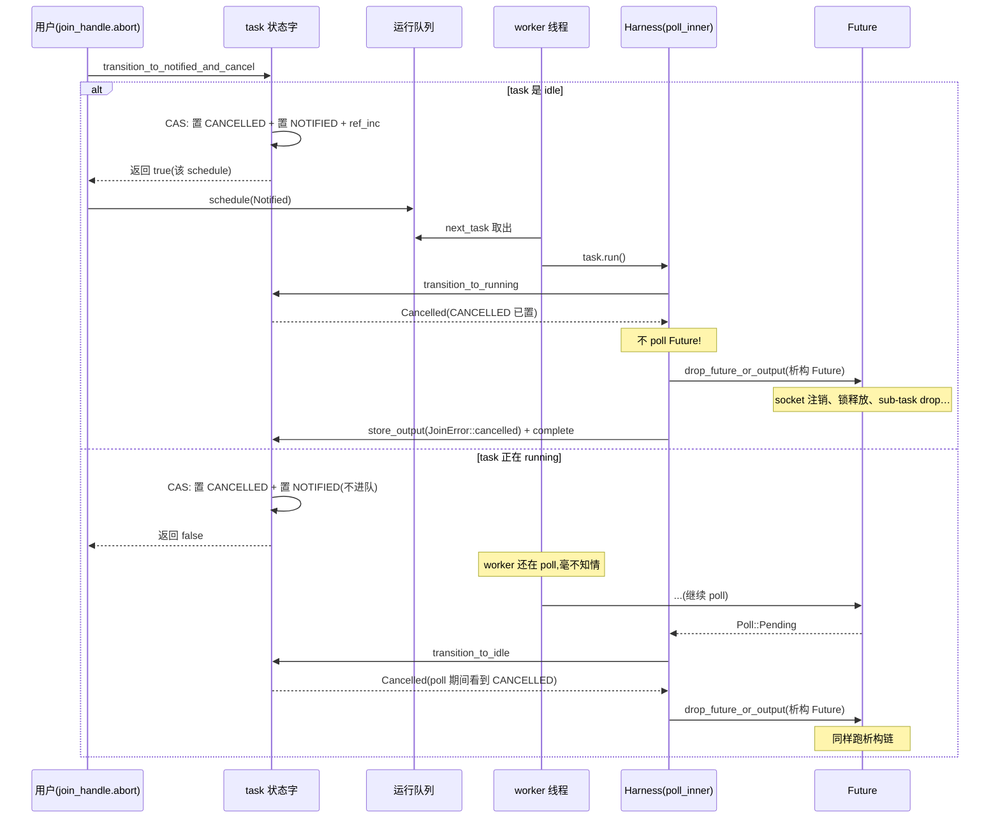
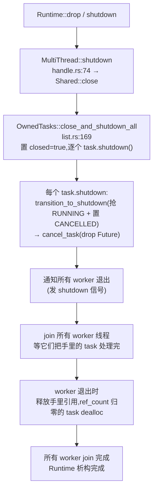

# 第 21 章 · 取消与 shutdown

> **核心问题**:你写 `drop(join_handle)`、或 `join_handle.abort()`、或 runtime 跑到结尾自然 drop——这些时刻,task 到底发生了什么?取消是"立刻杀线程"吗(显然不是,第 0 章讲过 tokio 是协作式调度)?那它怎么"被取消"——在哪个点被检查、怎么自我了断?`Runtime` 整个 shutdown 时,成千上万个还在跑的 task、挂在 reactor 上的 task、sleep 中的 task,怎么被**一个不漏**地收尾?而 `CancellationToken` 这个用户层原语,凭什么能做到"一个 token 被 cancel,所有 `.cancelled().await` 立刻就绪"——它和 task 的 abort 是什么关系?
>
> 这一章是**全书最后一章**,也是第 7 篇的收束。它把全书最隐晦的一条线——"协作式"——从抽象口号落成具体机制:取消靠协作(task 在 poll 点被检查),shutdown 靠引用计数与队列排空。讲完这章,全书从"为什么需要异步运行时"到"运行时怎么收尾",形成闭环。
>
> **读完本章你会明白**:
> - task 的**释放时机由引用计数决定**(JoinHandle / OwnedTasks / Waker / 调度各持一引用,回扣第 4、5 章)——为什么"光 drop JoinHandle 不一定能立刻释放 task",以及 abort 怎么强制推进这个时机。
> - `abort` 的真相:它**不是**立刻杀线程,而是**置 CANCELLED 位 + 让 task 重新进队**,等 worker 下次 poll 它时,在 `transition_to_running` 看到 CANCELLED,走 `cancel_task`(drop Future + 存 `JoinError::cancelled`)。这是一次"协作式自杀"。
> - `CancellationToken` 的真相:它**底层就是一个 `tokio::sync::Notify`**(第 5 篇 P5-17 讲过)。`cancel()` = 置标志位 + `notify_waiters()`(唤醒所有等待者);`cancelled().await` = 一个包了 `Notified` 的 Future,先查标志位、再 poll Notified。和 task 的 abort 没有直接关系——它是用户层的"取消信号",要靠 task 自己在每个 await 点配合检查。
> - `Runtime` 的 graceful shutdown:逐 worker 通知退出 → `OwnedTasks::close_and_shutdown_all` 把 closed 标志置位 + 逐个 `task.shutdown()`(置 CANCELLED + 抢 RUNNING + cancel_task)→ 等所有 worker join。靠的是引用计数 + 队列排空,**没有一个 task 被强杀线程**。
> - 为什么"协作式调度的命门"是取消:一个**不 await 的 task 永远无法被取消**(它不在 poll 点,检查不到 CANCELLED)——这呼应第 0 章的协作式调度、第 9 章的 budget,是同一件事的不同切面。强行 kill 线程式的取消会泄漏资源(Drop 不跑、锁不释放),这就是为什么 tokio 死守协作式。
>
> **如果一读觉得太难**:先只记住三件事——① task 何时释放,看引用计数(谁还攥着它);② abort 不是杀线程,是置 CANCELLED 位让 task 下次 poll 时自杀;③ shutdown 是逐个 task 协作地取消 + 引用计数归零后回收,不是一把火烧光。CancellationToken 是另一套独立的、用户层的"取消信号",底层是 Notify,和 task abort 没直接关系。

---

## 章首·一句话点破

> **tokio 里没有任何一个 task 是被"杀线程"取消的。所有取消——无论是 drop、abort 还是 shutdown——本质都是同一件事:置一个标志位(CANCELLED),让 task 在它下一次被 poll 的点上,自己把自己了断(Drop Future)。这叫协作式取消。引用计数决定它什么时候真正消失,Waker/Notify 决定它什么时候被叫醒去自杀。**

这是**结论**。这一章倒过来拆:先从最朴素的"`drop` 一个 task 会怎样"看起,引出"引用计数驱动生命周期"这条根;再拆 `abort` 怎么把 CANCELLED 位"塞"进 task 的状态字、让它在下次 poll 时自杀;然后讲 `CancellationToken` 这套用户层的、和 task 无关的取消信号;最后落到 `Runtime` shutdown 怎么把成千上万个 task 一个不漏地收尾。章末,全书收束。

第 20 章结尾留了钩子:"select! 取消的是 future(drop),那 drop 一个 task、abort 一个 task、runtime shutdown 分别发生什么?CancellationToken 怎么做到一呼百应?" 本章一口气回答,并合上全书。

---

## 一、先看根:引用计数驱动 task 的生命周期

要理解取消,得先理解 task **什么时候才算"死"**。而这件事,完全由**引用计数**决定——这是第 4 章(Waker 的引用计数)、第 5 章(状态字高位打包的 ref_count)埋下的伏笔,本章把它们收回来。

### task 被谁攥着:四种引用

第 5 章讲过,task 出世时有**三份引用**(共享同一块堆内存、共用状态字高位的 ref_count,初始 = 3):

```
   task 的引用计数归属(回扣第 5 章):
   ┌──────────────────────────────────────────────────────────────┐
   │  堆上的 Cell(Header.state 高位 = ref_count)                  │
   └────▲─────────────▲─────────────────▲────────────────────▲───┘
        │             │                 │                    │
   ┌────┴────┐   ┌────┴─────┐     ┌─────┴──────┐       ┌─────┴─────┐
   │ Task<S> │   │Notified<S>│     │JoinHandle │       │  Waker    │
   │存Owned- │   │ 进运行队列 │     │  给用户    │       │(任意数量) │
   │  Tasks  │   │ (临时)    │     │            │       │reactor/   │
   │         │   │           │     │            │       │timer/Notify│
   └─────────┘   └───────────┘     └────────────┘       └───────────┘
        │             │                 │                    │
        └── 每一份 drop 都让 ref_count -1;归零时 dealloc ──────────┘
```

四种引用里,**`Notified` 是临时的**(只在 task 进队列期间存在,poll 完或唤醒合并时就消耗掉),**`Waker` 是任意数量的**(reactor、timer、Notify 各持一份)。`Task`(OwnedTasks 列表)和 `JoinHandle` 各一份,是稳定的持有者。

> **钉死这件事(承接第 4、5 章)**:task 何时被 dealloc?**当且仅当 ref_count 归零**——也就是这四种引用**全部**释放。任何一个还攥着,task 就还活着。这就是为什么"光 drop JoinHandle 不一定能立刻释放 task":如果你 drop 了 JoinHandle,但 task 还在运行队列里(有 Notified)、或还挂在 reactor 上(有 Waker)、或还在 OwnedTasks 列表里(有 Task),ref_count 都不会归零,task 不会 dealloc。

### 一个微妙的点:drop JoinHandle ≠ 取消 task

很多人误以为"drop JoinHandle 就取消了 task"。**错。** drop JoinHandle 只是把 `JOIN_INTEREST` 位清掉、ref_count 减一——task 该跑还在跑,跑完结果直接丢(没人等了)。看 [join.rs 的 Drop](../tokio/tokio/src/runtime/task/join.rs#L357):

```rust
// tokio/src/runtime/task/join.rs(摘录)
impl<T> Drop for JoinHandle<T> {
    fn drop(&mut self) {
        if self.raw.state().drop_join_handle_fast().is_ok() {
            return;     // 快路径:JoinHandle 从未被 poll,一次 CAS 清 JOIN_INTEREST + 减引用
        }
        self.raw.drop_join_handle_slow();   // 慢路径:有人 poll 过,要清 join waker
    }
}
```

注意这条**只清 JOIN_INTEREST、只减引用,不动 CANCELLED 位**。task 的生命周期不受影响——它该被 poll 还是被 poll,跑完照样 `transition_to_complete`,只不过 output 没人取(存进 stage 然后被遗弃)。

> **钉死这件事**:drop JoinHandle 是"我不再关心结果",不是"取消 task"。要**真正取消** task,得显式 `abort()`——那是动 CANCELLED 位。这两件事常被混淆,是 async Rust 里一个隐蔽的认知陷阱。

理解了"引用计数决定 task 何时死",就能理解取消的真正难题:**怎么让一个还活着的 task,在被若干引用攥着的情况下,主动停下来?** 这就是 abort 要解决的。

---

## 二、abort 的真相:置 CANCELLED 位,让 task 在 poll 点自杀

`JoinHandle::abort()`(或 `AbortHandle::abort()`)是用户取消 task 的显式入口。它的源码极其简短([harness.rs:118](../tokio/tokio/src/runtime/task/harness.rs#L118)):

```rust
// tokio/src/runtime/task/harness.rs(摘录)
pub(super) fn remote_abort(&self) {
    if self.state().transition_to_notified_and_cancel() {
        // transition 创建了一份新的引用计数,我们把它变成 Notified 交给调度器
        self.schedule();
    }
}
```

就两步:**① 对状态字做一次 CAS**(`transition_to_notified_and_cancel`);**② 若 CAS 说"该提交了",`schedule()` 把 task 塞回运行队列**。看似平淡,但这两步里藏着 abort 的全部精髓。

### `transition_to_notified_and_cancel`:一次 CAS 同时置 CANCELLED + 决定要不要进队

这是 abort 的核心。看 [state.rs:303](../tokio/tokio/src/runtime/task/state.rs#L303):

```rust
// tokio/src/runtime/task/state.rs(摘录)
pub(super) fn transition_to_notified_and_cancel(&self) -> bool {
    self.fetch_update_action(|mut snapshot| {
        if snapshot.is_cancelled() || snapshot.is_complete() {
            // 已取消 或 已完成:abort 是 no-op
            (false, None)
        } else if snapshot.is_running() {
            // task 正在被 poll:置 CANCELLED + 置 NOTIFIED
            // (正在 poll 的线程 poll 完会看到 CANCELLED,自己 cancel)
            snapshot.set_notified();
            snapshot.set_cancelled();
            (false, Some(snapshot))
        } else {
            // task 是 idle:置 CANCELLED,若没在队列则置 NOTIFIED + 加引用 → 进队
            snapshot.set_cancelled();
            if !snapshot.is_notified() {
                snapshot.set_notified();
                snapshot.ref_inc();        // 为新的 Notified 加引用
                (true, Some(snapshot))     // 返回 true → 调用者去 schedule
            } else {
                (false, Some(snapshot))
            }
        }
    })
}
```

三个分支,对应 task 的三种状态。注意一个贯穿全书的设计原则再次现身:**所有状态变更都在一次 CAS 里完成**——置 CANCELLED、置 NOTIFIED、增减 ref_count,全部塞进对一个状态字的 `fetch_update_action`(第 5 章拆过这个 CAS 自旋循环)。这是无锁状态机正确性的物理基础,任何一个拆开都是撕裂中间态。

读懂这三个分支,就懂了 abort 的"协作"本质:

**分支一:task 已取消或已完成** → no-op。abort 是幂等的,重复 abort 不出问题。

**分支二:task 正在被某个 worker poll**(RUNNING=1)→ **置 CANCELLED,但不进队**。为什么?因为**正在 poll 的那个 worker,poll 完返回时会在 `transition_to_running`/`transition_to_idle` 检查 CANCELLED**(下面马上看),它自己会处理。abort 只要"打个标记"就行。这里同时置了 NOTIFIED 是个优化(注释 L313-315 说:"让 wake_by_ref 在某些情况下省一次 CAS"),不是必需的。

> **比喻回到餐厅**:服务员正在伺候 3 号桌(正在 poll),经理要取消这单。经理**不冲上去抢**——他只在订单卡上盖个"取消"章(置 CANCELLED),然后等服务员伺候完这轮回来一看订单卡,"哦,取消了",他自己把这单撕掉。**经理不抢,服务员自觉。** 这就是协作式。

**分支三:task 是 idle**(挂起中,等某个事件)→ **置 CANCELLED + 让它重新进队**。为什么必须进队?因为 idle 的 task **不在任何 worker 手里**,没人会"自然地"poll 到它。abort 必须主动把它从挂起状态拉回运行队列,让某个 worker 捡起来 poll 它一次——而那一次 poll,就是它"自杀"的时刻。

> **钉死这件事(abort 的协作本质)**:abort **不杀线程、不打断正在跑的 poll**。它只做两件事:① 置 CANCELLED 位;② 如果 task 是 idle,把它重新塞进队列(让它有机会被 poll 到)。**真正的"取消"发生在 task 下次被 poll 时,由 task 自己(准确说是 `Harness`)执行**。一个正在跑 CPU 密集循环、不在任何 await 点的 task,abort 对它**完全无效**——它不进 poll,CANCELLED 位永远没机会被检查。这就是协作式取消的命门,也是第 0 章"协作式调度"和第 9 章"budget 让出"的同一个根。

### 自杀的时刻:`transition_to_running` 看到 CANCELLED

task 被 worker 取出、要 poll 它时,第一步是 `transition_to_running` 抢锁(第 5 章拆过,[state.rs:117](../tokio/tokio/src/runtime/task/state.rs#L117))。这一步会检查 CANCELLED:

```rust
// tokio/src/runtime/task/state.rs(摘录,见 L117-145)
pub(super) fn transition_to_running(&self) -> TransitionToRunning {
    self.fetch_update_action(|mut next| {
        // ...
        if !next.is_idle() {
            // 别人在跑或已完成,放弃 poll
            // ...
        } else {
            next.set_running();
            next.unset_notified();
            if next.is_cancelled() {                      // ← 关键检查!
                action = TransitionToRunning::Cancelled;  // 告诉调用者:别 poll,直接 cancel
            } else {
                action = TransitionToRunning::Success;
            }
        }
        (action, Some(next))
    })
}
```

`Harness::poll_inner`(第 4 章讲 Waker 起点时贴过,[harness.rs:193-232](../tokio/tokio/src/runtime/task/harness.rs#L193-L232))拿到这个返回值,如果是 `Cancelled`,**根本不 poll Future**,直接走 cancel 路径:

```rust
// tokio/src/runtime/task/harness.rs(摘录,见 L225-227)
TransitionToRunning::Cancelled => {
    cancel_task(self.core());
    // ...
}
```

`cancel_task` 就是"自杀"动作([harness.rs:500-507](../tokio/tokio/src/runtime/task/harness.rs#L500-L507)):

```rust
// tokio/src/runtime/task/harness.rs(摘录)
fn cancel_task<T: Future, S: Schedule>(core: &Core<T, S>) {
    // 在 panic guard 下 drop future
    let res = panic::catch_unwind(panic::AssertUnwindSafe(|| {
        core.drop_future_or_output();        // ← drop 掉 Future!
    }));
    core.store_output(Err(panic_result_to_join_error(core.task_id, res)));  // 存 JoinError::cancelled
}
```

**这就是 task 的"自杀":drop 掉它的 Future。** Future 一 drop,它持有的所有资源(socket、buffer、嵌套的 sub-task 的 JoinHandle、锁……)全部释放——靠的是 Rust 的 Drop 语义,层层析构。然后存一个 `JoinError::cancelled` 进 stage(让 JoinHandle 知道"这个 task 是被取消的,不是正常完成")。

> **钉死这件事(取消的物理实现)**:task 的"取消"= `drop_future_or_output`——把 Future 析构掉。Future 的析构会触发它内部所有字段的析构(`AsyncFd` 注销 reactor 注册、`sleep` 从时间轮摘除、`MutexGuard` 释放锁……)。**这套析构是 Rust 的 Drop 语义在 async 层的延伸**——和同步代码里 `drop` 一个 `MutexGuard` 释放锁是一回事。tokio 的取消能"不泄漏资源",靠的就是这条:取消 = drop Future = 析构链自动跑。如果 tokio 改成"杀线程式取消"(像某些语言那样直接终止线程),Drop 就不会跑——锁不释放、socket 不关闭、内存泄漏。**这就是为什么 tokio 死守协作式取消:只有让 Future 自己被 drop,析构链才完整。**

### poll 一半被 abort:transition_to_idle 也会检查

分支二(task 正在跑时被 abort)留下了个尾巴:**正在 poll 的 worker,poll 完怎么处理 CANCELLED?** 答案在 `transition_to_idle`([state.rs:151-181](../tokio/tokio/src/runtime/task/state.rs#L151-L181))——poll 返回 Pending 时,清 RUNNING 位前会先看 CANCELLED:

```rust
// tokio/src/runtime/task/state.rs(摘录)
pub(super) fn transition_to_idle(&self) -> TransitionToIdle {
    self.fetch_update_action(|curr| {
        assert!(curr.is_running());
        if curr.is_cancelled() {
            return (TransitionToIdle::Cancelled, None);   // ← poll 期间被取消!
        }
        // ... 正常的 idle 处理
    })
}
```

`Harness::poll_inner` 拿到 `TransitionToIdle::Cancelled`,同样走 `cancel_task`(见 [harness.rs:218-221](../tokio/tokio/src/runtime/task/harness.rs#L218-L221))。所以**无论 task 在 poll 之前被 abort(分支三,进队后被取出),还是 poll 之中被 abort(分支二,poll 完返回 Pending 时检查),最终都汇聚到 `cancel_task` 这一个点**——置 CANCELLED 的时机不同,但自杀的动作一样。

### 一张图看清 abort 的完整时序



这张图的关键在两条分支**汇聚到同一个 `drop_future_or_output`**——无论 abort 在什么时机,task 的"死法"只有一个:**被某个 worker poll 时,看到 CANCELLED,drop 掉 Future**。这是协作式取消的统一收口。

---

## 三、CancellationToken:用户层的取消信号,底层就是 Notify

`JoinHandle::abort()` 是 task 层的取消——它直接动 task 的状态字。可现实里,我们经常要的是**用户层**的取消:一个"取消信号",能被多个 task 监听,谁监听了就能在合适的 await 点退出。这就是 `CancellationToken`(在 `tokio-util` crate,不在主仓 tokio)。

它长这样:

```rust
let token = CancellationToken::new();
let child = token.child_token();        // 子 token:父 cancel 则子 cancel,反之不行

tokio::spawn({
    let token = token.clone();           // clone 出一份(共享取消状态)
    async move {
        loop {
            tokio::select! {
                _ = token.cancelled() => {       // 监听取消
                    println!("被取消,退出");
                    return;
                }
                _ = do_some_work() => { /* ... */ }
            }
        }
    }
});

tokio::time::sleep(Duration::from_secs(5)).await;
token.cancel();        // 一呼百应:所有 clone、所有 child 的 cancelled() 全部就绪
```

`token.cancel()` 一调,所有持着这个 token(或其 clone、或其 child)的 task,只要在 `await token.cancelled()` 那一点,立刻被唤醒、`cancelled()` 返回 Ready。**一呼百应。** 怎么做到的?

### CancellationToken 的底层:就是个 tokio::sync::Notify

看源码([tokio-util/src/sync/cancellation_token.rs:57-59](../tokio/tokio-util/src/sync/cancellation_token.rs#L57-L59)):

```rust
// tokio-util/src/sync/cancellation_token.rs(摘录)
pub struct CancellationToken {
    inner: Arc<tree_node::TreeNode>,
}
```

`inner` 是个 `Arc<TreeNode>`。TreeNode 内部(见 [tree_node.rs](../tokio/tokio-util/src/sync/cancellation_token/tree_node.rs))核心是一个 `is_cancelled: bool` 标志 + 一个 `tokio::sync::Notify`(就是第 5 篇 P5-17 讲的那个 Notify)。**CancellationToken 就是"一个 bool 标志 + 一个 Notify"的封装。**

`cancelled()` 返回一个 Future,内部包着 `Notify::notified()`([cancellation_token.rs:243-248](../tokio/tokio-util/src/sync/cancellation_token.rs#L243-L248)):

```rust
// tokio-util/src/sync/cancellation_token.rs(摘录)
pub fn cancelled(&self) -> WaitForCancellationFuture<'_> {
    WaitForCancellationFuture {
        cancellation_token: self,
        future: self.inner.notified(),     // ← 底层就是 Notify::notified()
    }
}
```

`cancel()` 做两件事([tree_node.rs:297-356](../tokio/tokio-util/src/sync/cancellation_token/tree_node.rs#L297-L356)的核心):

```rust
// tokio-util/src/sync/cancellation_token/tree_node.rs(简化)
pub(crate) fn cancel(node: &Arc<TreeNode>) {
    let mut locked_node = node.inner.lock().unwrap();
    if locked_node.is_cancelled { return; }       // 已 cancel,no-op
    // ... 处理 children(收养孙子 / 取消子节点)
    locked_node.is_cancelled = true;              // ① 置标志位
    drop(locked_node);
    node.waker.notify_waiters();                  // ② 唤醒所有等待者!
}
```

**就两步:① 置 `is_cancelled = true`;② `notify_waiters()`(底层是 `Notify::notify_waiters`,唤醒所有在这个 Notify 上等待的 task)。** 一呼百应的"百应",就是 `Notify::notify_waiters`——第 5 篇讲过,Notify 内部维护一个等待者队列,`notify_waiters` 把它们全部唤醒。

### cancelled().await 的 poll:先查标志位,再 poll Notify

那 `cancelled()` 这个 Future,怎么保证"不丢唤醒"?看它的 poll([cancellation_token.rs:346-367](../tokio/tokio-util/src/sync/cancellation_token.rs#L346-L367)):

```rust
// tokio-util/src/sync/cancellation_token.rs(摘录)
impl<'a> Future for WaitForCancellationFuture<'a> {
    type Output = ();

    fn poll(self: Pin<&mut Self>, cx: &mut Context<'_>) -> Poll<()> {
        let mut this = self.project();
        loop {
            if this.cancellation_token.is_cancelled() {       // ① 先查标志位
                return Poll::Ready(());
            }
            // No wakeups can be lost here because there is always a call to
            // is_cancelled between the creation of the future and the call to
            // poll, and the code that sets the cancelled flag does so before
            // waking the Notified.
            if this.future.as_mut().poll(cx).is_pending() {   // ② 再 poll Notified
                return Poll::Pending;
            }
            this.future.set(this.cancellation_token.inner.notified());  // ③ 重新注册
        }
    }
}
```

这个 poll 的顺序极其讲究,源码注释 L356-359 那段是 sound 性证明:**"先查 is_cancelled,再 poll Notified"——而且 `cancel()` 是"先置 is_cancelled,再 notify_waiters"。** 这个顺序保证了不丢唤醒:

- 如果 `cancel()` 在 `is_cancelled()` 查询**之前**发生:`is_cancelled()` 返回 true,直接 Ready。✓
- 如果 `cancel()` 在 `is_cancelled()` 查询**之后**、`poll(Notified)` **之前**发生:由于 `cancel()` 先置标志位再 notify,而 `poll(Notified)` 内部会注册 Waker——如果 notify 在 poll 注册 Waker 之前,Notify 的实现保证"已 notify 的不会丢"(第 5 篇 P5-17 讲过 Notify 的不丢语义)。✓
- 如果 `cancel()` 在 `poll(Notified)` **之后**发生:Waker 已注册,notify 会唤醒这个 task,下次 poll 再查 `is_cancelled()` 返回 true。✓

> **钉死这件事(CancellationToken 不丢唤醒的根)**:它**没有自己造任何唤醒机制**,完全搭在 `tokio::sync::Notify` 上。Notify 的不丢语义(P5-17)+ "先查标志位再 poll Notified"的顺序,合起来保证 cancellation 信号不丢。这就是为什么 CancellationToken 能做到"一呼百应且不漏"——它复用了第 5 篇立起来的整套事件唤醒机制。**CancellationToken 是第 5 篇(sync 原语)在"取消"这个场景下的应用,不是新发明。**

### CancellationToken 和 task abort 的关系:没关系

这是一个关键澄清。**CancellationToken 和 `JoinHandle::abort()` 是两套完全独立的机制,互不调用。**

- `abort()` 是 task 层的取消:动 task 状态字的 CANCELLED 位,worker 下次 poll 时 `cancel_task`(drop Future)。**它对 task 是强制的**——task 不需要配合,只要它还会被 poll 到,就一定会被取消。
- `CancellationToken` 是用户层的取消信号:底层是 Notify,通过 Waker 唤醒监听的 task。**它对 task 是协作的**——task 必须自己 `await token.cancelled()`(通常配在 `select!` 里),否则信号来了它也不知道。

两者唯一的交集是:**用户经常把 CancellationToken 配合 `select!` 用,实现"协作式取消"**——

```rust
loop {
    tokio::select! {
        _ = token.cancelled() => return,    // 收到取消信号,主动退出
        msg = rx.recv() => { handle(msg); }
    }
}
```

这种用法里,token.cancel() 不会 drop 任何 Future,它只是把 `cancelled()` 唤醒成 Ready,select! 走那个分支,然后用户的代码 `return`——task 自己结束了。**整个过程中,task 状态字的 CANCELLED 位一动没动。** task 的"结束"是它自己 `return` 退出 async block,然后正常 `transition_to_complete`。

> **比喻回到餐厅**:`abort()` 是经理直接在订单卡上盖"取消"章,服务员下次看到就撕掉(强制,task 不配合也会被撕);`CancellationToken` 是经理发一个"取消牌"挂在前台,服务员**自己**得养成习惯每跑一单就看一眼前台有没有取消牌(协作,task 不看就不知道)。两者都能达到"取消"的效果,但机制完全不同。`CancellationToken` 更灵活(能精细控制"在哪一点退出"、"退出前做哪些清理"),但要求 task 自觉配合;`abort()` 更粗暴(直接 drop Future),但对"不自觉的 task"也有效(只要它还会被 poll)。

### 一个常被混淆的点:CancellationToken 不能取消"不 await 的 task"

回扣本章最核心的洞见:**协作式取消的命门**。CancellationToken 靠 `await cancelled()`——如果一个 task 写成:

```rust
// 灾难示例(简化示意)
tokio::spawn(async move {
    let token = token.clone();
    loop {
        // 死循环算东西,从不 await
        do_cpu_heavy_work();
        // token.cancelled() 从来没被 await!
    }
});
```

这个 task **永远无法被 CancellationToken 取消**(也不会被 abort 取消,因为它不在 await 点,poll 不会返回)。它独占一个 worker 线程,直到 runtime 结束。这就是第 0 章"协作式调度"、第 9 章"budget 让出"、本章"协作式取消"——**三者是同一个根的不同切面**:tokio 没有任何"硬抢"机制,一切靠 task 在 await/poll 点自觉配合。

> **钉死这件事(全书最深的洞见之一)**:**tokio 里,一个不 await 的 task 是无法被取消的。** 无论是 abort(置 CANCELLED 位,但 task 不 poll 就检查不到)、CancellationToken(靠 await cancelled(),task 不 await 就收不到)、还是 budget(第 9 章,靠 poll 计数,task 不 poll 就不扣)——全部失效。这是协作式调度的根本约束,从第 0 章贯穿到全书结尾。要"取消"一个这样的 task,唯一办法是把它拆开,在循环里塞 `yield_now().await` 或 `token.cancelled()` 检查点。**Rust async 把"取消的时机"完全交给了用户**,这是它"轻"(协作式)的代价。

---

## 四、Runtime 的 graceful shutdown:逐 worker 退出 + 逐 task 取消

最后看 runtime 怎么收尾。当 `Runtime` 被 drop(或显式 `shutdown`),成千上万个 task——有的在跑、有的挂在 reactor、有的在 sleep——怎么被一个不漏地清理?

### shutdown 的总体策略:协作地取消 + 引用计数回收

`Runtime` 的 shutdown 不是"杀光所有 worker 线程"(那会丢资源、Drop 不跑),而是:



逐个看关键节点。

### OwnedTasks::close_and_shutdown_all:关闭大门 + 逐个取消

入口在 [list.rs:169](../tokio/tokio/src/runtime/task/list.rs#L169)(multi-thread 用分片版本):

```rust
// tokio/src/runtime/scheduler/multi_thread/list.rs(简化,见 L169-)
pub(crate) fn close_and_shutdown_all(&self, start: usize)
where S: Schedule,
{
    self.closed.store(true, Ordering::Release);     // ① 关门:此后 bind 进来的 task 立刻被 shutdown
    for i in start..self.get_shard_size() + start {
        loop {
            let task = self.list.pop_back(i);
            match task {
                Some(task) => {
                    task.shutdown();                 // ② 逐个取消
                }
                None => break,
            }
        }
    }
}
```

两个动作:**① 置 `closed` 标志**——这是个原子 bool,之后任何想 `bind` 进这个 OwnedTasks 的 task(即 spawn),都会在 [bind_inner](../tokio/tokio/src/runtime/task/list.rs#L142-L146) 里看到 closed,直接被 `task.shutdown()`(等于 spawn 即取消)。**② 遍历所有已绑定的 task,逐个 `task.shutdown()`**。

> **钉死这件事(closed 标志的作用)**:它防止 shutdown 过程中"有新 task spawn 进来"造成的竞态。没有这个标志,shutdown 遍历完一批 task,正好有新 task spawn 进来,这个新 task 就成了漏网之鱼。closed 标志是个"关门信号",一关上,后续所有 spawn 都立刻走 shutdown 路径。这是 shutdown "一个不漏"的关键一环。

### task.shutdown:抢 RUNNING + 置 CANCELLED + cancel_task

每个 task 的 `shutdown`([harness.rs:240-251](../tokio/tokio/src/runtime/task/harness.rs#L240-L251)):

```rust
// tokio/src/runtime/task/harness.rs(摘录)
pub(super) fn shutdown(self) {
    if !self.state().transition_to_shutdown() {
        // task 并发地在跑(别的 worker 正 poll 它)——不用管,那个 worker poll 完会看到 CANCELLED
        self.drop_reference();
        return;
    }
    // 抢到 RUNNING(transition_to_shutdown 成功),有权限 drop future
    cancel_task(self.core());
    self.complete();
}
```

`transition_to_shutdown`([state.rs:338-356](../tokio/tokio/src/runtime/task/state.rs#L338-L356))干两件事:**如果 task 是 idle,置 RUNNING(抢锁);无论是否 idle,置 CANCELLED。** 返回 true 表示"我抢到了锁,可以 cancel 了"。

注意这里又出现了 abort 里那个"两种情况"的分叉:

- **task 是 idle**:shutdown 抢到 RUNNING,直接 `cancel_task`(drop Future)。干净利落。
- **task 正在别的 worker 上跑**:shutdown 抢不到 RUNNING(transition_to_shutdown 返回 false),只置了 CANCELLED 位就返回。**正在 poll 的那个 worker,poll 完返回时会在 `transition_to_idle` 看到 CANCELLED,自己 cancel**——和 abort 分支二一模一样。

所以 shutdown 和 abort 的底层机制是**同一个**:都是"置 CANCELLED + 等合适的 poll 点 cancel_task"。区别只在触发时机和范围——abort 是单个 task,shutdown 是所有 task + 关闭 OwnedTasks 大门 + join worker。

### join worker:等它们把手里的活干完

shutdown 把所有 task 标记为 CANCELLED 后,还要等 worker 线程**把手里的 task 处理完**(包括那些"正在跑"的 task,poll 完看到 CANCELLED 自己 cancel)。这一步靠 join 所有 worker 线程([multi_thread/handle.rs 的 `Shared::close` 及后续](../tokio/tokio/src/runtime/scheduler/multi_thread/handle.rs#L74))。

worker 的退出逻辑(第 2 篇讲过 worker 主循环)大致是:收到 shutdown 信号 → 不再从队列取新 task → 把手里正在 poll 的 task 处理完(包括看到 CANCELLED 的 cancel)→ 退出循环 → 线程结束。Runtime `join` 这些线程,等它们全部退出。

> **钉死这件事(shutdown 的协作本质)**:shutdown **不杀线程**。它发"该退了"的信号,worker 收到后**把自己的活干完**才退。这又是协作式——强行杀 worker 线程会让正在 poll 的 task 的 Drop 不跑(资源泄漏)。tokio 选择"发信号 + 等",代价是 shutdown 不是瞬时的(要等正在跑的 task poll 完),换来的是**资源不泄漏、Drop 链完整**。

### shutdown 完成后:引用计数归零,task dealloc

shutdown join 完所有 worker,此时:
- 所有 task 都被 `cancel_task`(Future 已 drop);
- OwnedTasks 列表里的 Task 引用,在 `close_and_shutdown_all` 遍历时随 task 处理释放;
- worker 线程退出时,它们持有的本地队列引用、手里正在处理的 task 引用,全部释放;
- reactor/timer 上的 Waker,随 Future drop 而注销(因为 cancel_task drop 了 Future,Future 析构时从 reactor/timer 摘除自己)。

当**所有四种引用**(Task + Notified + JoinHandle + Waker)都释放,每个 task 的 ref_count 归零,`dealloc` 触发([harness.rs:253](../tokio/tokio/src/runtime/task/harness.rs#L253)),task 的堆内存释放。**至此,Runtime 干干净净地结束,没有一个字节泄漏。**

> **钉死这件事(shutdown 的完整闭环)**:shutdown = **逐个 task 协作取消**(置 CANCELLED + cancel_task drop Future) + **关门防止新 task**(closed 标志) + **join worker 等它们收尾** + **引用计数归零后 dealloc**。四步,每一步都是协作式的——没有一处是"强杀线程"。这套机制能让成千上万个 task 在 runtime 结束时被一个不漏地清理,靠的是第 4、5 章立起来的"引用计数驱动生命周期"——引用计数归零,task 才真正消失。

---

## 技巧精解:引用计数驱动 task 生命周期 + abort/CancellationToken 的协作式取消

这一节是本章的硬核,把"引用计数驱动生命周期"和"协作式取消"两个总纲钦定的技巧彻底拆透。

### 技巧一:引用计数——task 释放时机的唯一裁决者

#### 这套设计在解决什么问题

task 在运行时里被**多方持有**:OwnedTasks 列表一份、JoinHandle 一份、运行队列临时一份(Notified)、reactor/timer/Notify 任意数量份(Waker)。这些持有者**生命周期各不相同**——JoinHandle 可能立刻 drop,OwnedTasks 持续整个 runtime,Waker 随事件来去。**task 的堆内存什么时候释放,必须精确落在"最后一个持有者释放"那一刻**——早了 use-after-free,晚了内存泄漏。

#### 反面对比 A:全局注册表 + 手动生命周期管理

```rust
// 简化示意,非源码原文:反面,全局表管 task 生命周期
static TASKS: Mutex<HashMap<TaskId, Box<Task>>> = Mutex::new(HashMap::new());

fn release_task(id: TaskId) {
    let mut tasks = TASKS.lock().unwrap();
    tasks.remove(&id);    // 谁来调?什么时候调?
}
```

> **不这样会怎样**:三个死穴——
> - **谁来调 release**:每个持有者 drop 时都要记得调,漏一个就泄漏;多调一次就 double-free。**手动生命周期管理在多方持有下注定出错**。
> - **锁竞争**:每次持有/释放都锁全局表,百万并发下锁就是瓶颈。
> - **跨线程协调噩梦**:reactor 在自己线程上持有 Waker,worker 在自己线程上持有 task,它们怎么协调"是不是最后一个"?没有原子操作,只能加更重的锁。

#### 反面对比 B:每个持有者独立析构,无协调

```rust
// 简化示意,非源码原文:反面,各自析构无协调
impl Drop for Waker { fn drop(&mut self) { /* 不知道是不是最后一个,直接 drop task? */ } }
```

> **不这样会怎样**:第一个 drop 的人把 task 释放了,其它持有者手里全是野指针——use-after-free。或者谁都不敢释放,永远泄漏。**没有"最后一个"的概念,释放时机无法决定。**

#### 正解:引用计数——clone 加一,drop 减一,归零者 dealloc

tokio 的做法(第 4、5 章立过):**把引用计数打包进 task 状态字的高位**(一个 `AtomicUsize`,低位状态 bit,高位 ref_count)。每种引用 clone 时 `ref_inc`(Relaxed),drop 时 `ref_dec`(AcqRel),`ref_dec` 返回 true 表示"归零了,该 dealloc"。**释放时机的决策,完全交给原子计数,无需任何全局协调。**

```rust
// tokio/src/runtime/task/state.rs(回扣第 5 章)
pub(super) fn ref_inc(&self) {
    let prev = self.val.fetch_add(REF_ONE, Relaxed);   // 加一,Relaxed(第 4 章证过 sound)
    if prev > isize::MAX as usize { std::process::abort(); }
}

pub(super) fn ref_dec(&self) -> bool {
    let prev = Snapshot(self.val.fetch_sub(REF_ONE, AcqRel));  // 减一,AcqRel
    assert!(prev.ref_count() >= 1);
    prev.ref_count() == 1     // 归零返回 true → 调用者 dealloc
}
```

这套机制的美妙之处:**每个持有者只管自己的 clone/drop,完全不用知道还有谁持有**。引用计数自动裁决"是不是最后一个"。这是 `Arc` 的标准套路,但 tokio 把它**打包进状态字**,和状态 bit 共用一个原子操作——于是"改状态 + 增减引用"能一次 CAS 完成(第 5 章拆过)。

> **钉死这件事(引用计数驱动生命周期的全部价值)**:task 的"何时死",**不取决于任何单一持有者的决定,而取决于所有持有者的集体释放**。这套机制让 task 能在多方持有、跨线程流转、生命周期不一的情况下,**精确地在最后一个持有者释放时回收**——无锁、无全局表、无手动协调。这是第 4 章(Waker 引用计数)、第 5 章(状态字打包)在"生命周期"这个主题上的合流。abort 和 shutdown 之所以能"推进 task 的死亡",本质都是**改变引用计数归属**(abort 强制让 task 走 cancel → Future drop → Waker 注销 → ref_count 下降);shutdown 关闭 OwnedTasks → Task 引用释放 → ref_count 下降。**引用计数是 task 生死的唯一裁决者。**

### 技巧二:协作式取消——为什么 tokio 死守"不杀线程"

#### 这套设计在解决什么问题

取消一个正在运行的并发单元,有两种范式:**抢占式**(强杀线程/进程,如 POSIX 的 pthread_cancel、Java 的 Thread.stop)和**协作式**(发信号,让目标在自己合适的点退出)。tokio 选了协作式,而且贯彻到所有取消场景(abort、CancellationToken、shutdown)。为什么?

#### 反面对比:抢占式取消(杀线程)

```rust
// 简化示意,非源码原文:抢占式取消(假想的 tokio)
fn abort(&self) {
    kill_thread(self.worker_thread);   // 强杀正在 poll 这个 task 的线程
}
```

> **不这样会怎样(三个致命问题)**:
> - **Drop 不跑**:线程被强杀,栈上的局部变量(`MutexGuard`、`AsyncFd`、buffer)析构链不执行。**锁永久不释放**(死锁)、socket 不关闭(fd 泄漏)、堆内存泄漏。这是抢占式取消最致命的缺陷——**资源泄漏**。
> - **数据结构撕裂**:task 正 poll 到一半,Future 的状态机停在某个中间态(读了半个消息、写了一半 buffer),线程被杀,状态机永远停在中间态。如果别的 task 还能看到这个 task 的部分输出(比如通过共享 channel),就读到垃圾。
> - **worker 线程是共享资源**:一个 worker 线程同时 poll 多个 task,杀线程会**误杀同线程上所有其它 task**——它们没做错任何事,却陪着葬。这彻底破坏了"task 之间互相隔离"的契约。
>
> Java 当年正是因为 `Thread.stop` 的这些缺陷,在 JDK 1.2 就把它 deprecated 了。tokio 从第一天就吸取教训:**绝不做抢占式取消**。

#### 正解:协作式取消——置标志位,等 poll 点检查

tokio 的所有取消(abort、shutdown)都是同一套:**置 CANCELLED 位(状态字的一个 bit),让 task 在下次被 poll 时,由 `Harness` 检查并执行 `cancel_task`(drop Future)。**

这套机制的关键性质:

1. **Drop 一定跑**:`cancel_task` 是 `drop_future_or_output`,**正常的 Rust 析构**——Future 的所有字段析构链完整执行(锁释放、socket 关闭、内存回收)。**资源不泄漏**。
2. **状态一致**:cancel 发生在 poll 的边界(transition_to_running 看到 CANCELLED,或 transition_to_idle 看到 CANCELLED),不是 poll 中间——Future 要么完整跑完一轮,要么根本没跑这轮,**没有中间态泄露**。
3. **不影响别的 task**:CANCELLED 位是**单个 task** 的状态字里的 bit,只影响这个 task。同 worker 上其它 task 毫发无损。
4. **代价**:不能取消"不 poll 的 task"——一个死循环 task 永远检查不到 CANCELLED。这是协作式的命门。

> **钉死这件事(协作式取消的全部价值与代价)**:tokio 选协作式取消,**换来的是 Drop 链完整 + 状态一致 + task 隔离**——这些是"不泄漏资源、不破坏数据"的根本保证。代价是"不能取消不 poll 的 task"。这个代价不是设计缺陷,是**协作式调度(第 0 章)的根本约束在取消场景的体现**——tokio 整个体系(让出靠 budget、唤醒靠 Waker、取消靠 CANCELLED 位)都建立在"task 在 poll 点自觉配合"之上。**这套一致性,是 tokio 设计哲学最深刻的一笔。**

#### 协作式取消的"配合"要求:CancellationToken 的设计哲学

CancellationToken 把"协作"推到了极致——它**不依赖 task 状态字**(和 abort 不同),完全靠**用户在代码里主动 await**。这意味着:

- 用户必须**在每个想响应取消的点上**,显式 `select! { _ = token.cancelled() => ..., _ = work() => ... }`。
- 用户必须**保证 task 经常 await**(否则连 cancelled() 都 poll 不到)。
- 用户必须**保证取消是安全的**(cancelled() 分支退出时,自己处理完清理——比如 flush 一半的 buffer 要不要保留?这是用户的"取消安全"责任,cancellation_token.rs 文档 L90-112 列了一长串 cancellation-safe 的方法)。

这套设计把"取消的时机和方式"完全交给用户——tokio 只提供"信号"(CancellationToken)和"强制 drop"(abort)两个工具,什么时候用哪个、怎么配合,用户自己决定。**这是 Rust 一贯的"把权力和责任交给用户"哲学在取消场景的体现。**

> **一个对比**:Go 的 `context.Context` 也是协作式取消,但 Go 有 runtime 抢占(goroutine 可以被强抢),所以 Go 的"不响应 context 的 goroutine"最终还是会被调度走。Rust/tokio 没有这个后手——一个不 await 的 task 真的能独占 worker。这是 Rust "无 runtime 抢占"换取"轻量"的代价,从第 0 章贯穿到这里。

---

## 章末小结:全书收束

### 用"餐厅服务员"比喻回顾本章

1. **订单什么时候真正消失,看"还有谁攥着它"** —— 引用计数(OwnedTasks 一份、JoinHandle 一份、Waker 任意份)归零,订单卡才销毁。光扔掉回执联(JoinHandle)不取消订单,只是"我不再关心菜好没好"。
2. **`abort` 是经理在订单卡上盖"取消"章** —— 不抢服务员手里的活,只在卡上盖个章(CANCELLED 位)。服务员下次接手这张卡(transition_to_running),看到章,自己把卡撕掉(cancel_task = drop Future)。如果卡正被服务员拿着(poll 中),服务员伺候完这轮(transition_to_idle)看到章,照样撕。**经理不抢,服务员自觉。**
3. **`CancellationToken` 是经理挂在前台的"取消牌"** —— 和订单卡无关,是另一套信号系统。服务员**自己**得养成习惯,每跑一单看一眼前台有没有牌(`await token.cancelled()`)。经理把牌一挂(cancel = 置标志 + notify_waiters),所有养成习惯的服务员立刻看到。**这是协作,不养成习惯的服务员永远看不到牌。**
4. **餐厅打烊(shutdown)是逐桌收尾** —— 经理先把大门关上(closed 标志,新来的客人立刻被拒),然后挨桌盖"取消"章(逐个 task.shutdown),等每个服务员把手里的桌伺候完(join worker),所有订单卡的引用都释放干净,餐厅干干净净关门。**没有一个服务员被强行赶走,都是把手里的活干完才走。**
5. **不 await 的服务员无法被取消** —— 一个闷头算账、从不抬头看前台的服务员,经理盖多少章、挂多少牌他都不知道。他独占一个收银台直到天荒地老。这是协作式的命门,从第 0 章到本章,同一个根。

### 本章在全书主线中的位置 + 全书收束

记住全书的二分法:**调度执行(让就绪的任务跑) vs 事件唤醒(让等待的任务不空耗、就绪了再叫)**。

本章服务的是**协作**这一面——更具体说,是"协作式调度"在**取消**和**收尾**场景的落地。取消靠协作(task 在 poll 点检查 CANCELLED),shutdown 靠引用计数(各方释放后归零 dealloc) + 队列排空(close 大门 + 逐个取消)。

而这一章,是**全书 21 章的收束章**。把全书主线一路回扣:

| 章 | 立起的东西 | 收束时的回响 |
|----|----------|------|
| 第 0 章 | 为什么需要异步运行时:把"等待"从"占用线程"解放;协作式调度 | 协作式取消是协作式调度的延伸——同一个根 |
| 第 1 篇(P1-02~05) | Future/poll 契约、async/await 状态机、Pin、Waker vtable、Task 状态字 | task 的引用计数、状态字 CANCELLED 位,本章是它们的最终应用 |
| 第 2 篇(P2-06~09) | Runtime 心脏、work-stealing、current vs multi-thread、budget 让出 | shutdown 关 worker + join,和 budget 一样都是"协作地停" |
| 第 3 篇(P3-10~12) | mio/epoll、readiness、reactor↔scheduler 握手 | task 被 drop 时,Future 析构从 reactor 摘除自己——取消不泄漏 I/O 注册 |
| 第 4 篇(P4-13~14) | 层级时间轮、sleep | task 被 drop 时,sleep 从时间轮摘除——取消不泄漏定时器 |
| 第 5 篇(P5-15~17) | async Mutex/RwLock、channel、Notify/Semaphore | **CancellationToken 底层就是 Notify**——本章是第 5 篇在"取消"场景的应用 |
| 第 6 篇(P6-18~19) | AsyncRead/Write、TcpListener/Stream | 取消时这些 Future 的 Drop 注销 reactor 注册——协作式取消保 I/O 资源不漏 |
| 第 7 篇(P7-20~21) | spawn/block_on/select 真相、取消与 shutdown | **三件套入口 + 收尾闭环,全书合龙** |

**全书一句话主线,最后一次回响**:

> **如何用极少的 OS 线程,高效驱动成千上万个并发任务?——核心是把"等待"从"占用线程"里解放出来。**

这条主线,在 21 章里长成了完整的机器:

- **把等待解放**:async/await 让 task 在 await 点让出线程(第 0~1 篇);
- **让就绪的跑**:scheduler 排队、work-stealing、budget 让出,把就绪的 task 喂给极少的 worker(第 2 篇);
- **让等待的被叫醒**:reactor(I/O)、timer(时间)、sync 原语(notify),靠 Waker 把挂起的 task 精确唤醒(第 3~5 篇);
- **读写收发**:AsyncRead/Write 把字节流 poll 化,TcpListener/Stream 在 readiness 模型下落地(第 6 篇);
- **入口与收尾**:spawn/block_on/select 是三个入口(第 20 章),abort/shutdown/CancellationToken 是收尾(第 21 章)。

而贯穿这整台机器的**五条哲学**(呼应附录 A):

1. **把等待从占用解放**——async 的全部意义,线程不再为等待买单。
2. **调度执行 vs 事件唤醒**——任何机制,要么在"让就绪的跑",要么在"让等待的被叫醒",要么在两者衔接处。
3. **协作式而非抢占式**——task 自觉让出(budget)、自觉检查取消(CANCELLED/cancelled)、worker 自觉收尾(shutdown)。无硬抢,换来轻量,代价是"不自觉的 task 无法被治"。
4. **无锁优先**——状态字位打包、Chase-Lev 队列、Waker 引用计数,能用原子操作就不用锁。
5. **把 unsafe 关进笼子**——所有 unsafe 集中在 task/waker/io 几个核心文件的边界,内部靠"状态字的位 + CAS"补上静态借用检查的缺口,对外全是 safe API。Rust 的类型系统 + tokio 的运行时不变量,合起来守住 sound 性。

这五条,是 tokio 这台机器的设计宪法,也是读完这本书你应该带走的东西——不是几个 API,而是**能在脑子里放映出 tokio 运转全过程**的认知。

### 五个"为什么"清单

1. **task 什么时候真正被释放?**:当且仅当它的引用计数(ref_count,状态字高位)归零——也就是 Task(OwnedTasks)、JoinHandle、Notified、Waker 这四种引用全部释放。引用计数是 task 生死的唯一裁决者,光 drop JoinHandle 不释放 task(只清 JOIN_INTEREST + 减一引用)。
2. **`abort()` 是怎么取消 task 的?**:不是杀线程。是 `transition_to_notified_and_cancel`:一次 CAS 置 CANCELLED 位(+ 若 idle 则置 NOTIFIED + 加引用让它进队)。task 下次被 worker poll 时,`transition_to_running` 看到 CANCELLED,返回 `Cancelled`,`Harness` 走 `cancel_task`(drop_future_or_output + 存 JoinError::cancelled)。poll 期间被 abort 的,在 `transition_to_idle` 看到 CANCELLED,同样走 cancel_task。
3. **为什么 tokio 不做"杀线程式取消"?**:三个致命问题——Drop 不跑(锁/socket/内存泄漏)、状态机撕裂(读到半个数据)、误杀同 worker 上别的 task。tokio 死守协作式取消(drop Future 让析构链完整跑),换来资源不泄漏 + 状态一致 + task 隔离。代价是"不 poll 的 task 无法取消"。
4. **CancellationToken 怎么做到一呼百应?**:底层就是 `tokio::sync::Notify` + 一个 `is_cancelled: bool`。`cancel()` = 置标志位 + `notify_waiters()`(唤醒所有等待者);`cancelled()` = 包了 `Notify::notified()` 的 Future,poll 时先查标志位再 poll Notified(顺序保证不丢唤醒)。它和 task 的 abort 没关系——是用户层的取消信号,要靠 task 自己 await 配合。
5. **Runtime shutdown 怎么一个不漏地收尾?**:四步——① OwnedTasks 置 closed 标志(关门,新 spawn 立刻被 shutdown);② 逐个 `task.shutdown()`(transition_to_shutdown 抢 RUNNING + 置 CANCELLED + cancel_task);③ 通知所有 worker 退出,join 等它们把手里 task 处理完;④ 所有引用释放,ref_count 归零的 task dealloc。全程协作式,无强杀线程,资源不泄漏。

### 想继续深入,该往哪钻

- **本章引用的核心源码**:
  - 引用计数:[state.rs](../tokio/tokio/src/runtime/task/state.rs) 的 `ref_inc`(L476)/`ref_dec`(L503)/`INITIAL_STATE`(L61)。第 4、5 章详拆过,本章回扣。
  - abort:[harness.rs:118](../tokio/tokio/src/runtime/task/harness.rs#L118)(`remote_abort`)、[state.rs:303](../tokio/tokio/src/runtime/task/state.rs#L303)(`transition_to_notified_and_cancel`)、[harness.rs:500](../tokio/tokio/src/runtime/task/harness.rs#L500)(`cancel_task`)、[state.rs:117](../tokio/tokio/src/runtime/task/state.rs#L117)(`transition_to_running` 检查 CANCELLED)。
  - shutdown:[list.rs:169](../tokio/tokio/src/runtime/task/list.rs#L169)(`close_and_shutdown_all`)、[harness.rs:240](../tokio/tokio/src/runtime/task/harness.rs#L240)(`task.shutdown`)、[state.rs:338](../tokio/tokio/src/runtime/task/state.rs#L338)(`transition_to_shutdown`)、[multi_thread/handle.rs:74](../tokio/tokio/src/runtime/scheduler/multi_thread/handle.rs#L74)(`Handle::shutdown`)。
  - CancellationToken:[tokio-util/src/sync/cancellation_token.rs](../tokio/tokio-util/src/sync/cancellation_token.rs)(主文件)、[tree_node.rs](../tokio/tokio-util/src/sync/cancellation_token/tree_node.rs)(`cancel`/`is_cancelled`/树形结构)。**注意它在 tokio-util crate,不在主仓 tokio**。
- **用 `loom` 验证取消的正确性**:tokio 在 `tokio/tests/loom_*.rs` 里有大量针对 abort/shutdown 的 loom 测试,穷举各种线程交错下"取消是否干净、引用计数是否正确、有无 double-free"。想深入"无锁取消为什么 sound",看这些测试。
- **用 `tokio-console` 观察 task 取消**:跑一个有大量 abort 的程序,console 里能实时看到 task 从 running → cancelled → 销毁的全过程。亲手 abort 几千个 task,观察它们的引用计数下降和 dealloc,对本章理解极有帮助。
- **Cancellation safety 文档**:`select!` 文档([macros/select.rs:90-150](../tokio/tokio/src/macros/select.rs#L90-L150))有一长串"哪些方法 cancellation-safe、哪些不"的清单。结合本章"取消 = drop Future",理解为什么 `read_exact` 不 cancel-safe(它内部跨 await 记了进度,drop 时进度丢失)而 `read` cancel-safe(每次 read 是独立的)。
- **全书读完**:你已经从"为什么需要异步运行时"走到了"运行时怎么收尾",21 章合龙。如果想继续深入,附录 A(全景脉络)把这五条哲学再串一遍,附录 B(源码阅读路线与工具)给你 `cargo expand`、`tokio-console`、`loom` 三件套的进阶用法。**最好的下一步,是挑一个 tokio 的子系统(比如 timer 的层级时间轮、或 work-stealing 的 Chase-Lev 队列),自己读一遍源码,用本书的方法(动机 + 技巧双线)拆透它**——这是把"读过源码"变成"看懂源码"的最终一步。

---

> 21 章,从一根线程到百万并发,从"为什么需要异步运行时"到"运行时怎么收尾"。整本书的主线——**把等待从占用解放 → 调度执行 vs 事件唤醒 → 协作式 → 无锁优先 → 把 unsafe 关进笼子**——在 cancel 和 shutdown 这里合龙:取消靠协作(task 在 poll 点检查),收尾靠引用计数(归零 dealloc),全程无强杀,Drop 链完整。tokio 这台机器,从 spawn 到 shutdown,每一个齿轮的设计动机和实现技巧,你都该能在脑子里放映出来了。**这不是终点,而是你拆任何复杂系统(内核、数据库、容器、其它运行时)的方法论起点——动机优先、技巧拆透、反面显形。** 翻开附录 A,把这五条哲学再刻进脑子里。
