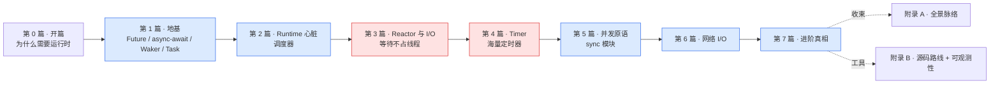

# 《Tokio 设计与实现深入浅出:从一根线程到百万并发》—— 目录与导读

> 一本写给"用过 async Rust、甚至读过 tokio 源码,却总觉得一知半解"的人的小书。
>
> **一句话主旨**:如何用极少的 OS 线程,高效驱动成千上万个并发任务?——核心是把"等待"从"占用线程"里解放出来。
>
> **二分法**(迷路时回到它):**调度执行**(让就绪的任务跑) vs **事件唤醒**(让等待的任务不空耗、就绪了再叫)。
>
> **主比喻**:少数服务员(OS 线程)穿梭服务海量订单(task);某桌等菜时服务员不傻站、转头服务别桌(await 让出);厨房喊"3 号菜好了"(I/O 唤醒)、闹钟响"5 号催单到点"(timer 唤醒)。

每章一行:**一句话钩子** —— 技巧标签 —— 二分法归属(`调度` / `唤醒` / `衔接` / `协作`)。

---

## 全书结构总览

旅程:从"一根 OS 线程只会阻塞着干等",一路走到"少量线程驱动百万并发"。每篇都是这条路上的一个驿站——读完你能在脑子里放映出 tokio 运转的全过程。

---

## 第 0 篇 · 开篇:为什么需要异步运行时

- [P0-01 · 第一性原理:为什么需要异步运行时](P0-01-第一性原理-为什么需要异步运行时.md) —— 一个请求开一个线程为什么万级就崩?async 凭什么把"等待"从"占用"解放,又为什么必须有个运行时兜着三件脏活? —— 协作式调度伏笔 —— `总览`

## 第 1 篇 · 地基:任务到底是什么

> 这一篇立起"被调度的对象"。Future、Waker、Task 是后面一切的基础,**建议顺序读**。

- [P1-02 · Future 与 poll 模型](P1-02-Future与poll模型.md) —— Future 是一张"做到哪一步、下次接着做"的折叠小纸条;poll 是运行时拍拍它问"现在能往下走吗"。为什么听上去很笨的"轮询"反而最高效? —— poll 两态契约 —— `调度`
- [P1-03 · async/await 的真相](P1-03-async-await的真相.md) —— async fn 是语法糖,编译器替你翻成一个状态机;翻出来的东西会自引用,所以 Rust 必须造个 `Pin` 把它焊死在堆上。 —— 自引用状态机 + Pin/Unpin —— `调度`
- [P1-04 · Waker:谁唤醒挂起的任务](P1-04-Waker-谁唤醒挂起的任务.md) —— 一个 Future poll 返回 Pending 挂起了,凭什么能被重新叫醒?Waker 底层是个 fat pointer + vtable + 引用计数。 —— RawWaker vtable + 引用计数布局 —— `唤醒`
- [P1-05 · Task:Future 怎么变成可调度单元](P1-05-Task-Future变成调度单元.md) —— spawn 之后一个 Future 怎么变成调度器能排队、能唤醒、能跟踪生命周期的 Task?一个 `AtomicUsize` 打包了它的一生。 —— task 状态位打包 + Header 布局 —— `调度`

## 第 2 篇 · Runtime:少量线程如何驱动海量任务(全书心脏)

- [P2-06 · Runtime 全貌:scheduler + reactor + timer 三件套](P2-06-Runtime全貌-三件套.md) —— 一个 Runtime 怎么把三件套拼成一个 worker 循环?线程没活时怎么打盹、被叫一声就醒。 —— 三态原子 + Condvar + driver 锁切换 —— `衔接`
- [P2-07 · work-stealing 调度器:偷工作的艺术](P2-07-work-stealing调度器-偷工作的艺术.md) —— 本地队列、全局队列、偷工作——少量 worker 怎么合力扛住海量 task? —— 双 head 打包的无锁队列 + 半数搬迁 —— `调度`
- [P2-08 · current-thread vs multi-thread](P2-08-current-thread与multi-thread.md) —— 单线程模式为什么存在?LIFO slot 怎么用"刚唤醒的优先跑"换缓存命中。 —— LIFO slot + injector —— `调度`
- [P2-09 · 协作式让出与 budget](P2-09-协作式让出与budget.md) —— 一个 task 一直占着线程不让怎么办?budget 给每个 task 约 128 次 poll 配额,扣光就强制让出。 —— thread_local budget + 乐观扣减回滚 —— `调度`

## 第 3 篇 · Reactor 与 I/O:等待不占线程

- [P3-10 · mio 与 epoll:事件驱动的底座](P3-10-mio与epoll-事件驱动底座.md) —— 一个线程的 `epoll_wait` 怎么同时等成千上万个 socket?为什么 mio 铁了心选 edge-triggered。 —— edge vs level-triggered —— `唤醒`
- [P3-11 · readiness 模型与 AsyncFd](P3-11-readiness模型与AsyncFd.md) —— "准备好读了再读"——海量 fd 怎么用一个小整数 token 一跳回等它的 task? —— 注册表 slab + token 指针编码 —— `唤醒`
- [P3-12 · reactor 与 scheduler 的握手](P3-12-reactor与scheduler的握手.md) —— I/O 就绪了,reactor 怎么把这批事件批量灌回调度队列? —— 批量 wake(WakeList) —— `衔接`

## 第 4 篇 · Timer:成千上万个定时器怎么管

- [P4-13 · 层级时间轮](P4-13-层级时间轮.md) —— 成千上万个 sleep,为什么不用最小堆而用层级时间轮? —— 位运算直接定位槽,O(1) 插入与到期 —— `唤醒`
- [P4-14 · sleep 的实现与驱动](P4-14-sleep的实现与驱动.md) —— sleep 怎么变成可 await 的 Future?定时器谁来拨——它和 I/O reactor 共用同一个 `epoll_wait` 阻塞点。 —— timer 随 reactor 推进 —— `唤醒`

## 第 5 篇 · 并发原语:sync 模块

- [P5-15 · async Mutex / RwLock](P5-15-async-Mutex与RwLock.md) —— 为什么不能直接用 `std::sync::Mutex`(会阻塞整个 worker)?async 锁怎么"等锁时不占线程"。 —— 无锁快路径 + 争用入队 —— `协作`
- [P5-16 · channel:mpsc / oneshot / broadcast](P5-16-channel-mpsc与oneshot与broadcast.md) —— 三种 channel 各管哪种场景?有界 mpsc 的背压怎么做。 —— `fetch_add` 无锁链表 + close 位传播 —— `协作`
- [P5-17 · Notify 与 Semaphore](P5-17-Notify与Semaphore.md) —— Notify 怎么做到"已到的事件不丢"?Semaphore 怎么限流。 —— Notify 无锁计数 —— `协作`

## 第 6 篇 · 网络 I/O

- [P6-18 · AsyncRead / AsyncWrite](P6-18-AsyncRead与AsyncWrite.md) —— 怎么把阻塞的 `read`/`write` 翻译成 `poll_read`/`poll_write` 的 Pending? —— poll_read 的 Pending 语义 —— `唤醒`
- [P6-19 · TcpListener / TcpStream 的异步实现](P6-19-TcpListener与TcpStream的异步实现.md) —— accept / connect / read / write 在 readiness 模型下怎么落地? —— 非阻塞 socket + readiness 三段式 —— `唤醒`

## 第 7 篇 · 进阶真相

- [P7-20 · spawn / block_on / select 的真相](P7-20-spawn与block_on与select的真相.md) —— 你天天用的三个入口,底层到底干了什么:block_on 怎么不打扰 scheduler,select! 展开后是什么。 —— block_on 不打扰 scheduler + select! 展开 —— `衔接`
- [P7-21 · 取消与 shutdown](P7-21-取消与shutdown.md) —— drop / abort 一个 task 发生什么(取消怎么传播)?Runtime 的 graceful shutdown 怎么干净收尾? —— 引用计数驱动生命周期 + abort/CancellationToken —— `协作`

## 附录

- [附录 A · 全景脉络](附录A-全景脉络.md) —— 把全书收束成 5 条贯穿哲学 + 全景脉络图 + 餐厅服务员心智模型对照表。读完合上书该带走什么。
- [附录 B · 源码阅读路线与可观测性](附录B-源码阅读路线与可观测性.md) —— 读 tokio 源码的最佳路线(阅读地图)+ tokio-console / tracing / runtime_metrics / task hooks / loom 五件套写透。

---

## 推荐阅读路线

**主线(推荐)**:P0-01 → 第 1 篇全(P1-02~05)→ 第 2 篇全(P2-06~09)→ 第 3 篇 → 第 4 篇 → 第 5 篇 → 第 6 篇 → 第 7 篇 → 附录 A。这是"从阻塞到百万并发"的完整旅程,章节按依赖精心排序,顺着读最省力。

按目标速查:

| 你的目标 | 读这几章 |
|------|------|
| 只想懂 async 基础(Future / await 到底是什么) | P0-01 → P1-02 → P1-03 → P1-04 → P1-05 |
| 只想懂调度器(性能与并发的心脏) | P1-05 → P2-06 → P2-07 → P2-08 → P2-09 |
| 只想懂 I/O 与事件驱动 | P1-04(Waker)→ P3-10 → P3-11 → P3-12 → P6-19 |
| 只想懂定时器 | P1-04 → P4-13 → P4-14 |
| 只想懂任务间协作 | P1-04 → P5-15 → P5-16 → P5-17 |
| 想动手排查线上问题 | 附录 B(可观测性:tokio-console / runtime metrics) |
| 想读 tokio 源码 | 附录 B 第一节(源码阅读地图)+ 跟着本书章节逐个啃源码 |

> 一个提醒:第 1 篇四章(Future → async/await → Waker → Task)有严格依赖,Waker 依赖 Future、Task 依赖 Waker,**不要跳着读这一篇**;其余各篇内部也建议按章序,但篇间相对独立,可按兴趣穿插。

---

## 配套文件

- [全书规划-总纲](全书规划-总纲.md) —— 主线、二分法、餐厅服务员比喻对照表、分篇分章、源码策略、写作约定。
- [_章节写作提示词](_章节写作提示词.md) —— 写作执行手册(铁律、四段式、技巧精解、自检清单)。
- 源码(本地 clone):`../tokio/`(1.52.3 @ 7892f60,crate 在 `tokio/tokio/src/`)、`../mio/`(1.2.1)。本书所有源码引用均经 Grep/Read 核实行号,钉死在这两个版本。

---

> 这本书讲的不是"tokio 的 API 怎么用",而是"它凭什么这么设计、源码里那些 `unsafe` / 原子位 / `Pin` 到底在干什么"。读完,你该能在脑子里放映出 tokio 运转的全过程——一个 task 怎么被 spawn、被 poll、在 await 点让出、被 reactor 唤醒、被调度器重新捡起,以及每一步底下用了什么巧妙的手段。
