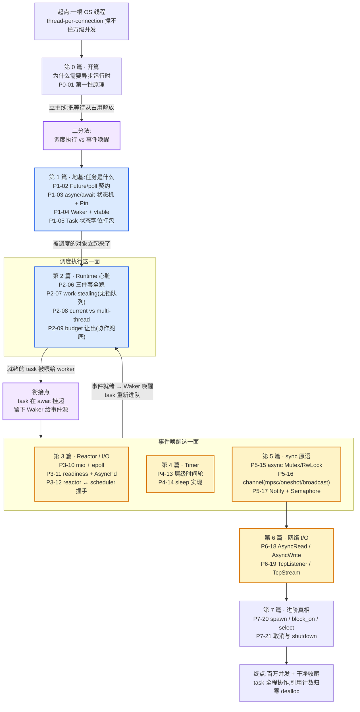

# 附录 A · 全景脉络:tokio 这台机器的设计宪法

> 21 章走完,从"为什么需要异步运行时"到"运行时怎么收尾",一根线程终于长成了驱动百万并发的机器。附录要做的,不是再讲新机制,而是**收束**:把全书 21 章几千行源码、几百个技巧,蒸馏成五条贯穿始终的设计哲学,给读者一张合上书后还能带走的"心智地图"。
>
> 任何复杂系统读完都有两种状态。一种是"我读过了",合上书脑子里只剩一堆 API 名词和零散的源码片段,过两个月忘个精光;另一种是"我看懂了",合上书后脑子里留下几条**可推演的原则**,日后遇到任何没见过的机制,能拿这几条原则推出个八九不离十。这份附录,就是想让你停在第二种状态。
>
> 附录不必每节四段式,但保留"为什么这条哲学对、不这样会怎样"的思辨深度。

---

## 一、五条哲学:tokio 的设计宪法

通读全书 21 章,你会发现无数看似各自为战的机制——状态字位打包、`Pin`、Chase-Lev 队列、budget、reactor slab、时间轮位运算、CancellationToken——**全都能归到同几条根上**。这几条根,就是 tokio 这台机器的设计宪法。我把它们收成五条。

### 哲学一:把"等待"从"占用线程"里解放

**一句话点破**:异步的全部意义,不是让代码跑得更快,而是让"等待 I/O、等时间、等锁"这件事,不再绑死一个昂贵的 OS 线程。

**哪几章体现它**:
- 第 1 章(P0-01):从"一桌配一个服务员"的崩点(线程贵、切换贵、阻塞=浪费)推出"运行时三件套",这条哲学就是全书的第一性原理。
- 第 2、3 章(P1-02、P1-03):Future/poll 契约 + async/await 状态机,是"等待时可让出"的语言层支撑。
- 第 4 章(P1-04):Waker 是"让出后被叫回来"的桥,没有它,挂起的 task 永远不会被重新调度。
- 第 10~14 章(P3、P4 篇):reactor 盯 I/O,timer 盯时间,都是"把等待的事就绪时精确叫醒"。
- 第 15~17 章(P5 篇):async Mutex、channel、Notify,把"等锁、等消息、等信号"也解放出来。

**不坚持它会怎样**:回到同步世界——一个连接一个线程,8MB 栈、上下文切换、99% 时间在阻塞干等。10 万并发就是 800GB 栈,模型在数量级上就输了。这是 C10K 的根本病灶,也是整个 async 运动兴起的理由。**丢了这条,后面 20 章一个字都不用写**——没有它,async 没有意义。

> **餐厅回扣**:服务员不该站在客人桌边看客人慢悠悠看菜单。让订单"等"的时候,服务员得能转头去服务别桌。这条哲学是开这家餐厅的全部理由。

### 哲学二:协作式而非抢占式——任务自觉让出,budget 兜底

**一句话点破**:tokio 不能像 OS 那样靠时钟中断硬抢一个跑飞的 task,所以它选了另一条路——**逼任务自觉**:在 await 点让出、在 poll 点检查 CANCELLED、用 budget 给每个 task 发一张 128 次的"刷卡配额"防霸占。

**哪几章体现它**:
- 第 1 章(P0-01)末尾的"技巧精解":协作式是横贯全书的地基,从根上预告了 task 设计、budget、await 的形态。
- 第 9 章(P2-09):budget 机制——thread_local + `poll_proceed` + `RestoreOnPending` 的乐观扣减回滚,把"协作"落成"几乎无法逃避的软抢断"。128 这个数是"摊销调度开销 + 不饿死别人 + 深 task 能做点事"三约束的交集。
- 第 21 章(P7-21):取消和 shutdown 全程协作。`abort` 是置 CANCELLED 位 + 让 task 在下次 poll 时"自杀";shutdown 是关门 + 逐个置 CANCELLED + join worker。**没有一个 task 是被杀线程取消的**。
- 第 8 章(P2-08):LIFO slot 的 3 次上限是和 budget 正交的另一层"防横向贪婪"机制。

**不坚持它会怎样**:硬要改抢占式,只有两条路。一是给每个 task 配一个真正的 OS 线程(才能被时钟中断抢),那 async "用极少线程扛海量并发"的全部意义就没了,10 万 task = 10 万线程,栈撑爆。二是用 SIGALRM 信号在用户态打断,可信号打断的可能是 task 中间持有锁的任意指令,强行切走撕裂数据结构,跟 async 的状态机模型也不兼容。**两条路都死,所以协作式不是"选择",是 async 能存在的物理前提**。

这条哲学的命门也明明白白:**一个不 await 的 task(死循环算 CPU、永远不 await 的逻辑)无法被取消、无法被 budget 制约、无法被 schedule 走**。它独占整个 worker 直到天荒地老。这是协作式的代价,不是 bug。tokio 把这个代价明晃晃地摆出来,把逃生舱(`unconstrained`、`consume_budget`)也交给用户——**默认安全,逃生舱可选,这是好的默认值设计**。

> **餐厅回扣**:经理不能硬抢服务员手里的订单(那是抢劫),只能给每人发张 128 次的配额卡(budget)、在订单卡上盖"取消"章(CANCELLED)、打烊时挨桌收尾(shutdown)。服务员要是个闷头算账从不抬头的,经理拿他没辙——这就是协作式的命门。

### 哲学三:无锁优先——能用原子位打包和无锁队列,就绝不上锁

**一句话点破**:tokio 的热路径(每秒可能跑几百万次的状态迁移、入队出队、引用计数)上,**绝不能有锁竞争**。办法是把相关状态塞进一个原子字(一次 RMW 同时改多个 bit),把队列做成无锁结构,把引用计数做成 fetch_add/fetch_sub。

**哪几章体现它**:
- 第 5 章(P1-05):**task 状态字位打包**——一个 `AtomicUsize`,低位 6 bit 装 6 个状态标志(RUNNING/COMPLETE/NOTIFIED/JOIN_INTEREST/JOIN_WAKER/CANCELLED),高位装引用计数。一次 CAS 同时迁移多个状态、同时增减引用。这是全书最硬核的技巧之一。
- 第 5 章:`fetch_xor` 翻转 RUNNING 和 COMPLETE 两 bit 完成完成态迁移(无重试、不竞争退化)——"用位运算省一次 CAS"的小技巧。
- 第 4 章(P1-04):Waker 的引用计数(`ref_inc` 用 Relaxed,`ref_dec` 用 AcqRel),用原子计数替代全局生命周期表。
- 第 7 章(P2-07):work-stealing 的本地运行队列(双 head 无锁环形数组),worker 自己 push/pop、别人 steal,无锁。
- 第 13 章(P4-13):层级时间轮的位段定位——用整数的不同位段直接定位"几号槽",O(1) 插入和到期。
- 第 17 章(P5-17):`Notify` 的无锁计数,保证"已到的事件不丢"。
- 第 21 章(P7-21):abort 的 `transition_to_notified_and_cancel`,一次 CAS 同时置 CANCELLED + 置 NOTIFIED + 加引用,无撕裂。

**不坚持它会怎样**:三个致命退化——

第一,**撕裂中间态(torn state)**。把"标记完成 + 唤醒 JoinHandle waker"拆到两个独立原子变量,worker A 改完 lifecycle 还没唤醒,worker B 看到 COMPLETE 就取 output,双重取、提前取、读到一半被覆盖。把"置 NOTIFIED + ref_count+1"拆开,中间出现 "NOTIFIED=true 但 ref_count 还没加",另一线程把 ref_count 减到 0 释放了 task——野指针。这三个 bug 每一个都能让运行时在并发下随机崩溃。

第二,**锁竞争爆炸**。百万并发的热路径加 mutex,每次 poll、每次唤醒、每次引用加减都 lock/unlock,锁就是瓶颈。tokio "用极少线程扛大并发"的初衷被自己的锁勒死。

第三,**AtomicU128 也救不了**。即使平台支持 AtomicU128,它也装不下"6 个状态 bit + 引用计数 + 未来扩展位",一个 usize 的 64 位位空间远远富余。塞进一个 usize 是**位段富余、操作原子、开销最小**三者交集的唯一解。

> **钉死这件事**:状态位打包的核心收益**不是省内存**(省的那几字节对百万 task 也就是几 MB),而是**让"原子地迁移多个相关状态"成为可能**。这是无锁状态机的物理基础——没有它,要么撕裂中间态(多原子变量),要么退化成锁(mutex)。tokio 选第三条路:**位段打包 + 一次 RMW**。

> **餐厅回扣**:订单卡顶部那个"状态字"——服务员看一眼就知道这张卡在哪、被谁攥着几次,改的时候一次盖戳改完所有标记,不让任何中间状态漏出去。

### 哲学四:靠 Rust 类型系统把 unsafe 关进笼子

**一句话点破**:tokio 源码里有一批 `unsafe`——`UnsafeCell`、`Pin::new_unchecked`、裸指针 `*mut Header`、跨线程的类型擦除。但这些 unsafe **全部集中在几个核心文件**(task 的 `core.rs`/`harness.rs`/`raw.rs`、io 的 `AsyncFd`、waker 的 vtable)的边界上,内部全是 safe 抽象,对外暴露的 API(`spawn`、`JoinHandle::await`、`channel::send`)全是 safe Rust。

**哪几章体现它**:
- 第 3 章(P1-03):`Pin`——为什么自引用状态机必须 Pin 焊在堆上,移动会野指针。`Pin::new_unchecked` 是 task 模块的核心 unsafe,它 sound 的根是"堆地址永不变,Future 在固定偏移处永远不动"。
- 第 4 章(P1-04):`RawWaker` 的 vtable + fat pointer——一个 fat pointer 同时携带虚表与数据,引用计数藏在 data 里。
- 第 5 章(P1-05):task 的 sound 性三不变量——**RUNNING 位是 stage 字段的锁**(谁抢到谁独占 mutate)、**Header 在偏移 0 + vtable 塞 offset**(裸指针偏移定位不会算错)、**堆地址固定**(满足 Pin 契约)。三者合起来,task 模块所有 unsafe 都是 sound 的。
- 第 5 章:`PhantomData<*mut ()>` 标记 `RestoreOnPending` 拒绝 Send/Sync——用类型系统防止用户把 guard 送错线程。
- 第 21 章(P7-21):协作式取消的 sound 性——drop Future 让析构链完整跑,锁释放、socket 关闭、内存回收,资源不泄漏。这靠的是 Rust 的 Drop 语义在 async 层的延伸。

**不坚持它会怎样**:

第一,**unsafe 散落各处**。如果每个模块都自己造 unsafe,验证成本爆炸,每一处都要单独证明 sound,实际结果是没有一处能被信任。tokio 把危险集中到几个核心文件,内部用"状态字的位 + CAS"补上静态借用检查的缺口——**用运行时原子操作补静态借用检查的漏洞**。

第二,**借用检查失效就放弃**。task 跨线程流转,静态借用检查天然失效(`&mut T` 的"同一时刻只有一个 `&mut`"在跨线程场景下编译期无法证明)。如果因此就放弃 Rust 的安全保证,改用 C 风格的裸指针,那 tokio 就成了"用 Rust 语法写的 C 代码",失去了 Rust 的全部价值。tokio 的做法是:**在编译期检查失效的地方,用运行时的不变量(RUNNING 位当锁、原子操作保证独占)重建等价的安全保证**。这是 Rust 系统**编程"在 unsafe 边界上重建安全"的典范**。

第三,**对外暴露 unsafe API**。如果用户调 `spawn` 也要操心 unsafe,async Rust 永远进不了主流。tokio 把所有 unsafe 藏在内部,对外只给 safe API——用户写 `tokio::spawn(future)`、`.await`、`rx.recv().await`,一行 unsafe 都不见。**这是 Rust 生态"unsafe 是实现细节,不是接口契约"哲学的体现**。

> **餐厅回扣**:厨房里那一摞高温油锅、电动切菜机是 unsafe 的(用错会烫伤、断指),但餐厅把它们关在厨房内部,服务员和客人看到的都是"端上来的菜",从不直接接触这些机器。tokio 把 unsafe 关在几个核心文件的"厨房"里,你用的全是"端上来"的 safe API。

### 哲学五:可观测性是一等设计目标——光能跑不够,还得能看懂

**一句话点破**(本书新增的第五条):tokio 不止"能跑百万并发",它下大力气做 `tokio-console`(实时观测每个 task 的状态、poll 时长、waker 来源)、`tracing`(结构化日志 + span 上下文)、`runtime_metrics`(运行时内部计数器)、`loom`(并发模型穷举测试,验证无锁代码正确)。**可观测性不是事后补丁,是和调度器、reactor 同级的一等设计目标**。

这条哲学在前 21 章里若隐若现——状态字里专留 `task_id`、`spawned_at` 字段给 console 用;`budget_forced_yield_count` 是 metric;`loom` 反复被提到("这套无锁代码靠 loom 穷举验证 sound")。但因为它横切全书、又没专门一章讲,容易被读者当成"附加工具"忽略。附录要把它抬到和前四条并列的位置。

**哪几章体现它**:
- 第 5 章(P1-05):`Header` 里专留 `owner_id`、`task_id`,以及在 `tokio_unstable` feature 下的 `spawned_at: &'static Location`——这些字段**不影响 task 跑**,只为 `tokio-console` 能显示"这个 task 在哪被 spawn、跑了多久、处于什么状态"。
- 第 6 章(P2-06):runtime 的 `task_hooks`(spawn/terminate 钩子)是 metrics 和 tracing 的接入点。
- 第 9 章(P2-09):`inc_budget_forced_yield_count()` 这个 metric 让你能观测"哪个 task 被强制让出"。
- 第 7 章(P2-07):work-stealing 的 steal 次数、队列溢出次数,都是 runtime_metrics 暴露的指标。
- 第 5、9、21 章反复提到的 **`loom`**——tokio 的无锁代码(状态字 CAS、队列、引用计数)靠 loom 做穷举式线程交错测试,**这是无锁代码能被信任的根**。没有 loom,前面那套无锁设计就是"凭直觉写、赌它对"。
- 第 5 章:`loom_*.rs` 测试用例,以及 mod.rs 顶部那段超长 `Safety` 注释——它和 loom 测试互为印证,一个讲清楚不变量,一个穷举验证不变量没被破坏。

**不坚持它会怎样**:

第一,**"读过源码还一知半解"的读者永远看不懂**。这本书的写作初衷就是治这个病——而治病的良药,一半在源码(动机 + 技巧),另一半就在观测工具。状态字位打包再精妙,你看不见它在跑,它就只是源码里的几行常量定义。装上 `console-subscriber`,spawn 几十万个 task,用 `tokio-console` 连上看——你会亲眼看到 task 从 Notified 到 Running 到 Idle 的迁移,看到 waker 被 clone/drop,看到 budget 被扣到 0 的 forced yield。**这一刻,前面 20 章的抽象全部落成了可触摸的运行时**。

第二,**生产事故无法排查**。百万并发的服务,某个 task 卡住了、某个 worker 饿死了、某个 channel 堵了——没有观测,你只能瞎猜。tokio 的整套可观测栈(console + tracing + metrics)就是为生产设计的:实时看 task 状态、看 poll 时长分布、看 waker 来源、看 steal 次数。**没有它,tokio 就是个黑盒,出问题只能重启**。

第三,**无锁代码没人敢信**。前四条哲学(尤其无锁优先)落到代码里全是原子操作 + CAS + 位运算,这种代码"看起来对"和"实际对"差着十万八千里——线程交错的空间是天文数字,人脑根本枚举不完。`loom` 用受控的线程调度穷举各种交错,把"看起来对"变成"被穷举验证过"。**没有 loom,tokio 的无锁设计就是悬崖边的舞蹈,谁也不敢用**。

这条哲学的精髓:**可观测性不是装饰,是理解运行时、解开"读了源码还一知半解"这把锁的钥匙**。附录 B 会详讲 `tokio-console`、`loom`、`tracing` 三件套的用法——本附录只把它抬到设计哲学的高度。

> **餐厅回扣**:厨房装摄像头、服务员配对讲机、经理看实时大屏——不是为了好看,是为了"哪桌慢了立刻知道、哪个服务员卡住了立刻协调、出问题能复盘"。tokio 的可观测栈,就是这家餐厅的监控系统。

---

## 二、全景脉络图:从一根线程到百万并发的旅程

把 7 篇 21 章串成一条旅程。每个驿站落在"调度执行 vs 事件唤醒"二分法的哪一面,图上标得一清二楚。

**怎么读这张图**:

1. **主线从上到下**:第 0 章立第一性原理 → 第 1 篇立起被调度的对象(task) → 第 2 篇把就绪的 task 跑起来(调度执行) → 第 3~5 篇把等待的 task 在事件就绪时唤醒(事件唤醒) → 第 6 篇把字节读写落地 → 第 7 篇收尾闭环。
2. **调度执行 vs 事件唤醒是循环**:不是"先做完一面再做另一面",而是**两个齿轮一直在咬合**——task 在 await 挂起(调度让出)→ 把 Waker 留给事件源(衔接)→ 事件就绪时按 Waker(事件唤醒)→ task 重新进队(回到调度执行)。运行时的每一次心跳,都是这两面交替。
3. **衔接点是全书枢纽**:`HANDOFF` 那个节点——"task 在 await 挂起,留下 Waker 给事件源"——是调度执行和事件唤醒的接口。Waker 是全书最重要的一座桥(第 4 章主角),没有它,挂起的 task 永远不会被叫回来。
4. **任何迷路,回到这张图**:读到某一章不知道它在干嘛,问一句"它在服务调度执行、还是事件唤醒、还是两者衔接",答案立刻清楚。

---

## 三、最后一次回扣:餐厅服务员心智模型完整对照表

全书用一个比喻贯穿到底——**餐厅服务员**。读者合上书后,长期留在脑子里的不应该是源码行号,而应该是这个可推演的心智模型。下面这张表把全书散落的所有比喻角色收成一张完整对照,带回去,长期受用。

| 餐厅角色 | tokio 概念 | 关键性质 | 出场章节 |
|---------|-----------|---------|---------|
| **服务员**(人数少,和核数相当) | OS worker 线程 | 极少,却要服务海量订单;挂了订单陪葬 | 全书 |
| **客人的订单**(海量,几十万) | task(异步任务) | 本身极轻(几百字节),靠服务员穿梭服务 | 全书 |
| **一桌配一个专属服务员**(反面) | thread-per-connection(同步阻塞) | 线程贵、切换贵、阻塞=浪费,万级并发崩 | P0-01 |
| **订单"等菜"时服务员不傻站、转头服务别桌** | await 让出(协作式调度) | 任务在等时释放线程;线程跑别的 task | P0-01~P1-05 |
| **订单本身**(折叠小纸条,记录做到哪步) | task = Future 状态机 + 调度壳 | 一张卡装下全部状态 + Future + output | P1-03、P1-05 |
| **订单卡顶部印的状态 + 计数** | 状态字(AtomicUsize) | 低位 6 个状态旗,高位引用计数,服务员看一眼就知道卡的命运 | P1-05 |
| **订单卡被复印几份不同颜色副本** | Task / Notified / JoinHandle / Waker 四种引用 | 指向同一块堆内存,共用引用计数 | P1-05 |
| **客人手里的回执联** | JoinHandle | 自己也是 Future:看菜好没好,没好留个联系方式等叫 | P1-05 |
| **餐厅经理**(分配谁接哪单) | scheduler(调度器) | 决定下一个 worker poll 哪个 task | P2-06~P2-08 |
| **服务员手边那摞自己的订单** | 本地运行队列(local run queue) | 无锁环形数组,worker 自己 push/pop | P2-07 |
| **前台那本"谁都来取"的总订单本** | 全局运行队列(injector) | 外部 spawn / 跨 worker 的兜底 | P2-07~P2-08 |
| **忙不过来的服务员,把订单转给闲的同事** | work-stealing(偷工作) | 偷一半,平衡负载 | P2-07 |
| **刚叫号的订单优先接**(插队到队首) | LIFO slot | 提高缓存命中,但 3 次上限防 ping-pong | P2-08 |
| **服务员没活时靠着吧台打盹、被叫一声就醒** | park / unpark(线程睡眠与唤醒) | 三态原子防丢唤醒 | P2-06、P3-10 |
| **服务员手里的配额卡(128 次)** | budget(coop budget) | 每用一次 tokio 资源刷一次,刷光让出 | P2-09 |
| **没取到菜不算刷卡** | RestoreOnPending(乐观扣减回滚) | 只有真做了事才确认消费 | P2-09 |
| **厨房喊"3 号桌菜好了"** | reactor / I/O 事件唤醒 | 盯 socket,数据来了精确叫 task | P3-10~P3-12 |
| **催单闹钟响"5 号桌到点了"** | timer 唤醒 | 盯 sleep/超时,到点叫 task | P4-13~P4-14 |
| **催单本用转盘式格子,直接转到位**(不用从头翻) | 层级时间轮(位段定位) | O(1) 插入/到期,不用最小堆 | P4-13 |
| **取餐窗口的"叫号牌"系统** | readiness 模型 + slab + token | 海量 fd 用小整数 token 映射回 task | P3-11 |
| **服务员等传菜口有空位才递单** | async Mutex / RwLock(无锁 fast path) | 等锁时不占线程,争用时入队挂起 | P5-15 |
| **厨房到服务员的传菜带** | channel(mpsc / oneshot / broadcast) | 有界 mpsc 有背压 | P5-16 |
| **前台的对讲机"叫某某服务员"** | Notify(无锁计数不丢事件) | 一呼百应,已到的事件不丢 | P5-17 |
| **客人想点单又能随时取消,挂个取消牌** | CancellationToken(底层就是 Notify) | 协作式,服务员自己得看牌 | P7-21 |
| **经理在订单卡上盖"取消"章** | abort(置 CANCELLED 位) | 强制但协作,服务员下次接单看到章自己撕 | P7-21 |
| **餐厅打烊**(挨桌收尾,关门,等服务员交接完) | Runtime shutdown | 逐个 task 取消,关门防新单,join worker | P7-21 |
| **订单卡在最后一个副本被扔掉时销毁** | 引用计数归零 dealloc | task 生死的唯一裁决者 | P1-05、P7-21 |
| **厨房装摄像头、服务员配对讲机、经理看大屏** | tokio-console / tracing / runtime_metrics / loom | 不是装饰,是理解运行时的钥匙(哲学五) | 附录 A、B |

**怎么用这张表**:遇到任何 tokio 的机制,先问"它在餐厅里对应什么角色"。一旦对应上,这个机制的关键性质就从比喻里自然推出来——LIFO slot 是"插队",所以它提高缓存命中(刚叫号的订单服务员手还热乎);budget 是"配额卡",所以它防霸占但管不到不刷卡的纯 CPU 循环;abort 是"盖取消章",所以它对正在 poll 的 task 不抢、对不 poll 的 task 无效。**比喻不是装饰,是可推演的压缩知识**。

---

## 四、读完这本书,你该带走什么

合上这本书,你不该带走一份 API 清单——API 会变,tokio 也确实在演进(`1.47.1` 到 `1.52.3` 已经重构了多处)。你应该带走的是一套**思维方式**,它在你脑子里能长期留存,而且能推演到任何没见过的场景。

### 带走一:遇到任何 async 问题,回到二分法 + 五条哲学

读源码遇到看不懂的机制,你的第一反应不该是"这是什么 API",而该是问自己三句:

1. **它在服务"调度执行"还是"事件唤醒"?** ——如果它让就绪的 task 跑起来,它是调度这一面(队列、stealing、budget、LIFO slot);如果它让等待的 task 被叫醒,它是唤醒这一面(reactor、timer、Notify、Waker)。
2. **它涉及哪条哲学?** ——如果是无锁代码,问"为什么必须无锁、塞进一个原子字解决了什么撕裂";如果是 unsafe,问"它的不变量在哪、靠什么补静态借用检查的缺口";如果是协作式机制,问"它怎么逼 task 自觉、不自觉会怎样"。
3. **不这样设计会怎样?** ——这是本书最反复用的一招。每个精妙的技巧,反面对比都能让它的妙处显形:不用位打包就撕裂中间态;不用 Pin 就野指针;不做协作式取消就 Drop 不跑资源泄漏;不装 console 就生产事故只能瞎猜。

这三问,能让你从"这源码我看不懂"走到"这设计有它的道理,我能推出来"。

### 带走二:动机优先、技巧拆透、反面显形

这本书的方法论(也是《Linux 内核》《数据库内核》《容器》同系列共用的)是三条:

- **动机优先**:先讲它解决什么本质问题,不这样会怎样。API 是表层,动机是底层。读源码先读动机。
- **技巧拆透**:tokio 源码里充斥高级技巧(状态字位打包、Chase-Lev 队列、Pin、缓存行对齐、层级时间轮),读者"一知半解"的缺口**不在动机**(好懂),**在技巧**(看不懂)。每个技巧都要拆到"用了什么手段、为什么这个手段妙、不这么写撞什么墙"。
- **反面显形**:每个精妙设计,反面对比让妙处显形。"多个独立原子变量 → 撕裂中间态"、"分三次堆分配 → 三堵墙"、"杀线程式取消 → Drop 不跑 + 状态机撕裂"——反面一摆,正解的必要性不言自明。

这套方法论不只能用来读 tokio。它能用来读任何复杂系统——内核的调度器、数据库的 MVCC、容器的 cgroup、其它运行时(Go runtime、Java Loom、async-std)。**动机优先,技巧拆透,反面显形,这是从"读过源码"到"看懂源码"的通用钥匙**。

### 带走三:能在脑子里放映 tokio 运转全过程

读一本书的最高境界,是合上书后能在脑子里"放映"它描绘的机器。tokio 这台机器的放映,大致是这样:

> 你写下 `tokio::spawn(my_future)`。运行时量了一下 Future 大小,小的直接进 task,大的先 `Box::pin`。一次堆分配,Header + Core + Trailer 三段连续排布,Header 在偏移 0,缓存行对齐。三种引用同时诞生(Task 存进 OwnedTasks 列表、Notified 进运行队列、JoinHandle 还给你),状态字被原子地写成"ref_count=3 | JOIN_INTEREST | NOTIFIED"。
>
> 某个 worker 从队列取出这个 Notified,`coop::budget(|| task.run())` 把线程的 budget 重置成 128,`transition_to_running` 抢到 RUNNING 锁(同时清掉 NOTIFIED),通过 vtable 调到泛型单态化的 `Harness::poll`,从 Core.stage 把 Future 拿出来、`Pin::new_unchecked` 包一下(堆地址固定,Pin 契约满足),真正 poll 它。
>
> Future 是个状态机,poll 推进一步,到 await 点,内层返回 `Pending`,把 Waker 留给事件源(socket 注册到 reactor 的 slab、sleep 进时间轮的槽、Notify 排进等待者队列)。`transition_to_idle` 一次 CAS 清 RUNNING,task 挂起。worker 接着取下一个 task,继续穿梭服务。
>
> 几毫秒后,socket 数据到了。epoll 返回,reactor 用 slab 里的 token 找到对应 task,clone 它的 Waker、`wake_by_ref`。Waker 内部走 vtable,`transition_to_notified_by_val` 一次 CAS:task 是 idle 且不在队列,置 NOTIFIED + ref_inc + Submit。task 重新进队(进 LIFO slot,缓存还热)。worker 下次 poll 它,poll 内部的 `poll_proceed` 扣 budget(扣成功,真读到数据就 `made_progress` 确认;扣光就 Pending 让出),Future 推进到下一个 await 点。
>
> 某个 task 做完了。`transition_to_complete` 用 `fetch_xor` 一次原子翻转 RUNNING 和 COMPLETE 两 bit,然后看 JOIN_WAKER 位,按一下 JoinHandle 留下的 waker,等结果的 task 被叫醒,再 poll JoinHandle 取走 output。
>
> 你 drop 了 Runtime。shutdown 开始:OwnedTasks 置 closed 标志(关门),逐个 `task.shutdown`(置 CANCELLED + 抢 RUNNING + `cancel_task` drop Future),通知 worker 退出,join 等它们把手里的活干完。每个 task 的 Future 被 drop,析构链完整跑(socket 从 reactor 注销、sleep 从时间轮摘除、MutexGuard 释放锁、嵌套 JoinHandle 的引用计数减一)。所有引用释放,ref_count 归零,task dealloc。Runtime 干干净净结束,没有一个 task 被杀线程,没有一个字节泄漏。

这段放映里,每一步都对应五条哲学的某个侧面:把等待解放(await 让出 + Waker)、协作式(budget + cancel 在 poll 点)、无锁优先(状态字 CAS + fetch_xor + 引用计数)、unsafe 关笼子(Pin::new_unchecked + vtable + Header 偏移)、可观测(全程 task_id 和 metric 在记录)。**放映得出来,这本书就读通了**。

### 带走四:这是你拆下一个复杂系统的起点

tokio 不是孤岛。它用的每条哲学——把等待从占用解放(C10K 的解药)、协作式而非抢占式(无 runtime 抢断的代价)、无锁优先(原子位打包 + CAS)、unsafe 关笼子(运行时不变量补静态检查)、可观测一等(观测驱动理解)——都是**系统级软件设计的通用模式**。

- **Linux 内核的调度器**也面对"协作 vs 抢占"(内核是抢占式的,但有些路径不能被抢,靠 preempt_count 标志),也用无锁原语(rcu、per-cpu 计数器),也靠 type system 隔离 unsafe(Rust-for-Linux 的整个动机)。
- **数据库的 MVCC** 也靠版本号做无锁的"快照隔离"(类似引用计数),也把"事务回滚"做成协作式(在合适的点回滚,不撕裂数据)。
- **容器的 cgroup / runtime** 也面对"如何隔离、如何观测、如何协作地停掉一个进程"。
- **其它运行时**(Go runtime 的 GMP 调度、Java Loom 的虚拟线程、async-std)是同一类问题的不同解,各有取舍——理解 tokio 后再读它们,你会一眼看出"为什么 Go 有抢占而 tokio 没有(内核态 vs 用户态)"、"为什么 Loom 用 JVM 内部抢占(有 JVM 这个特权层)"。

读完 tokio,你手里有了一套**拆复杂系统的通用方法论**:动机优先、技巧拆透、反面显形、二分法归类、哲学收束。下一个系统(内核、数据库、容器、别的运行时)再用这套方法论拆一遍,你的"系统级软件直觉"就长出来了。

---

## 附录 A 的最后一句话

21 章,从一根线程到百万并发。这台机器的设计宪法是五条:

1. **把等待从占用线程里解放**——async 的全部意义。
2. **协作式而非抢占式**——任务自觉让出 + budget 兜底。
3. **无锁优先**——原子位打包 + 无锁队列 + 无锁计数。
4. **靠 Rust 类型系统把 unsafe 关进笼子**——运行时不变量补静态检查。
5. **可观测性是一等设计目标**——光能跑不够,还得能看懂。

合上这本书,这五条该刻在你脑子里。日后遇到任何 async 问题——某个 task 卡住了、某个 worker 饿死了、某个无锁代码看不懂了——回到这五条问一遍,八九不离十能推出个所以然。**这不是终点,是你拆任何复杂系统的方法论起点**。

翻开附录 B,带上 `cargo expand`、`tokio-console`、`loom` 三件套,亲手把这台机器跑起来、看起来、测起来——那是把"读过"变成"看懂"的最终一步。
