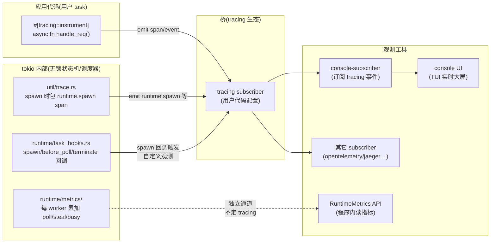
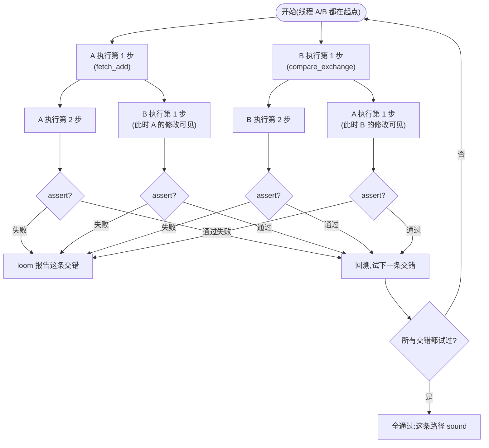

# 附录 B · 源码阅读路线与可观测性

> **核心问题**:全书 21 章读下来,你应该已经能"在脑子里放映 tokio 运转的全过程"。但真要动手去读那几十万行源码,从哪进门?怎么不被海量文件淹没?更现实的问题是:线上跑着几十万个 task,有一个 task 卡了 30 秒,你怎么定位是哪一个?为什么是它?它在等什么?又凭什么你相信 tokio 那些无锁代码(`AtomicUsize` 状态字、Chase-Lev 队列、Waker 引用计数)在所有可能的线程交错下都不出 race?
>
> 这个附录分三块回答:**① 一条"按本书 7 篇顺序"的源码阅读路线 + 阅读地图**;② **tokio 的可观测性体系**(重点,这是 tokio 区别于"能跑就行"的运行时的工程成熟度——tokio-console、tracing、runtime metrics、task hooks 全是为观测/调试服务,而且大多在 unstable 旗子下,说明它们是"专门为生产级排障"准备的,不是顺手做);③ **loom 并发模型测试**——tokio 怎么敢说自己那些无锁代码正确。
>
> 这一章不是正文章节,所以结构更松,但它承载了全书最后一公里:**从"读懂源码"到"用源码做工程排障"**。读到这里的人,正好需要这个。

---

## 章首·一句话点破

> **tokio 不是把代码跑起来就完事的运行时——它把自己内部每个 task 的生老病死、每次调度、每次偷工作、每次 park,都做成了可观测的数据,并提供了一整套工具让你能"对着运行时做手术"。这套"把自己的内脏亮出来给人看"的工程姿态,加上 loom 这种把"无锁代码可能的所有交错"穷举测试的底气,才是 tokio 区别于玩具运行时的成熟度。**

这是结论。这个附录倒过来拆:先给你一张"源码该怎么读"的地图,再一块一块拆 tokio 的四个可观测性工具(console / tracing / metrics / hooks),最后用 loom 收尾——讲它怎么用"模型检查"思路保证无锁代码正确。

---

## 一、源码阅读路线:按"从阻塞到百万并发"这条旅程读

### 1.1 为什么不按"目录平铺"读?

tokio 主仓(`tokio/tokio/src/`)有几十个目录、几百个文件。如果照目录树平铺(`runtime/`、`task/`、`io/`、`time/`、`sync/`、`net/`、`macros/`……)读,你会陷入一个常见陷阱:**每个文件单独看好像都懂,但拼不出"一个 task 从 spawn 到跑完"的完整路径。** 这正是全书用"从阻塞到百万并发"这条旅程当骨架、而不是按模块平铺的原因——源码阅读也该顺着这条旅程。

> **比喻回到餐厅**:给你一本餐厅操作手册,如果按"前厅、后厨、仓库、收银台"分区讲,你学完还是不知道"一个客人进来从落座到结账离开,服务员在哪几个地方穿梭"。但如果给你一张"客人旅程图",顺着它把沿途经过的每个房间都走一遍,你就在脑子里建起了完整地图。读 tokio 源码也一样——顺着 task 的旅程读。

### 1.2 一条推荐的阅读路径

跟着本书 7 篇走,每篇对应一组"核心源码文件"。建议的顺序:

1. **先读入口**(P0):`#[tokio::main]` 怎么展开成 `block_on` → `Runtime` 怎么把三件套装起来。建立"运行时是个什么东西"的整体感。
2. **再读被调度的对象**(P1):`Future` / async-await / `Waker` / `Task`。这块是地基,不读懂 task 内部,后面 scheduler 在调度什么都是空谈。
3. **读 runtime 心脏**(P2):`worker.rs` 主循环、`queue.rs` 无锁队列、budget。这是全书最硬的地方。
4. **读"事件唤醒"两面**(P3、P4):`io/driver.rs` reactor + `time/wheel/` 时间轮。这两块把"等待不占线程"的另一半补齐。
5. **读并发原语**(P5):`sync/` 模块。这里是 task 之间怎么协作。
6. **读网络 I/O**(P6):`net/` 和 `AsyncRead/Write`。把"读写字节"poll 化。
7. **读入口与收尾**(P7):`spawn`/`block_on`/`select` 真相 + 取消与 shutdown。闭环。

每篇对应的**关键源码文件**,见下面的阅读地图。

### 1.3 阅读地图:文件 → 讲了什么 → 在第几章

> 下表的路径都相对 `../tokio/tokio/src/`。tokio 源码版本以全书约定为准:`1.52.3`(`commit 7892f60`)。

| 文件(相对 `tokio/src/`) | 讲了什么 | 第几章 |

| --- | --- | --- |

| `runtime/runtime.rs` | `Runtime` 句柄:`pub struct Runtime`(L97)、`spawn`(L239)、`block_on`(L340)。运行时的对外总入口 | P0-01、P2-06 |

| `runtime/builder.rs` | 运行时构建器:`pub struct Builder`(L55,链式配置 worker 数、是否启用 io/time 驱动)。配出 `Runtime` | P2-06 |

| `task/spawn.rs` | 全局 `tokio::spawn` 的实现:`pub fn spawn`(L174),内部走 `spawn_inner`(L186)→ `util::trace::task`(包 tracing span)→ 调度器提交 | P1-05、P7-20 |

| `task/builder.rs` | `task::Builder`(`#[cfg(tokio_unstable)]`):带 `name`(L73)的 spawn,生成的 task 在 console 里能看出名字 | 本附录二.4 |

| `runtime/task/harness.rs` | task 执行骨架:`poll_inner`(L193)驱动 Future、`cancel_task`(L500)处理取消、`shutdown`(L240)处理 runtime 收尾 | P1-05、P7-21 |

| `runtime/task/state.rs` | task 原子状态机:`pub struct State`(L6)、`INITIAL_STATE`(L61,引用计数+状态位打包)、`transition_to_notified_and_cancel`(L303)、`transition_to_running`(L117) | P1-05、P7-21 |

| `runtime/task/core.rs` | task 的 `Core`:`tracing_id`(L193,task 持有的 tracing::Id,console 关联用的衔接点)、`get_tracing_id`(L534) | 本附录二.2 |

| `runtime/scheduler/multi_thread/worker.rs` | 多线程 worker 主循环:`Context::run`(L561),做取 task、poll、偷工作、park | P2-07 |

| `runtime/scheduler/multi_thread/queue.rs` | Chase-Lev 无锁本地队列:`LOCAL_QUEUE_CAPACITY = 256`(L63,loom 下缩到 4,L69)、push/pop/steal | P2-07、本附录三 |

| `runtime/scheduler/multi_thread/handle.rs` | 多线程调度器的 `Handle`,`shutdown`(L74)入口 | P7-21 |

| `runtime/scheduler/multi_thread/list.rs` | `OwnedTasks`(分片),`close_and_shutdown_all`(L169)是 shutdown 的关键 | P7-21 |

| `runtime/time/wheel/mod.rs` | 层级时间轮:`pub(crate) struct Wheel`(L22)、`poll`(L141)、`next_expiration`(L168) | P4-13 |

| `runtime/io/driver.rs` | IO reactor(mio 驱动):`pub(crate) struct Driver`(L25)、`turn`(L179)一次 epoll 轮询 | P3-10、P3-12 |

| `sync/notify.rs` | `Notify`(L202):异步版条件变量,基于 waker 集合唤醒。CancellationToken 底层就是它 | P5-17、P7-21 |

| `sync/mpsc/list.rs` | mpsc channel 的链表节点:`Tx`(L12)、`Rx`(L22) | P5-16 |

| `macros/select.rs` | `select!` 宏(`macro_rules! select`,L554) | P7-20 |

| `runtime/metrics/runtime.rs` | `RuntimeMetrics`(L19):`num_workers`(L48)、`worker_poll_count`(L820)、`worker_steal_count`(L733)、`worker_local_queue_depth`(L397) | 本附录二.3 |

| `runtime/metrics/worker.rs` | `WorkerMetrics`(L18,`#[repr(align(128))]` 缓存行对齐):每个 worker 独立累加、读取无锁 | 本附录二.3 |

| `runtime/metrics/scheduler.rs` | `SchedulerMetrics`:`budget_forced_yield_count`(L13,budget 强制让出次数,调度器级指标) | 本附录二.3 |

| `runtime/task_hooks.rs` | `TaskHooks`(L40)/`TaskMeta`(L75)/`TaskCallback`(L83):task spawn / before_poll / after_poll / terminate 回调注入点 | 本附录二.4 |

| `util/trace.rs` | tracing 插桩辅助:`SpawnMeta`(L4)、`task`(L62,spawn 时把 Future 用 `tracing::trace_span!("runtime.spawn", ...)` 包成 `Instrumented`) | 本附录二.2 |

| `loom/mod.rs` | loom 抽象层:正常构建走 `std`,loom 测试构建走 `mocked`(L6) | 本附录三 |

| `runtime/tests/loom_*.rs` | loom 测试:multi_thread / current_thread / join_set / oneshot / blocking / local,穷举线程交错验证 scheduler | 本附录三 |

| `sync/tests/loom_*.rs` | loom 测试:mpsc / notify / broadcast / rwlock / semaphore_batch / atomic_waker / oneshot / watch / list / set_once | 本附录三 |

> **路径里几个容易踩的坑**:
> - IO reactor 在 **`runtime/io/`**,不在顶层 `io/`(顶层 `io/` 是面向用户的 `AsyncRead`/`AsyncWrite` trait)。
> - 时间轮在 **`runtime/time/wheel/`**,不在顶层 `time/wheel/`(`time/` 顶层是 `sleep`/`interval` 等用户 API)。
> - `#[tokio::main]` 宏**不在主仓**,在外部 crate `tokio-macros/src/entry.rs`(L582),主仓 `lib.rs:675` 用 `pub use tokio_macros::main_rt as main;` 重新导出。

### 1.4 三个"读源码"的实操技巧

**技巧一:从 `#[tokio::main]` 宏展开一路追进 runtime**。这是建立"运行时怎么跑起来"最快的方式。开一个最小项目,加 `tokio = { version = "1.52", features = ["full"] }`,写:

```rust
#[tokio::main]
async fn main() {
    println!("hello");
}
```

然后 `cargo expand`(装 `cargo-expand`)看宏展开。你会看到 `#[tokio::main]` 被展开成:

```rust
// (宏展开后,简化示意,非源码原文)
fn main() {
    tokio::runtime::Builder::new_multi_thread()
        .enable_all()
        .build()
        .unwrap()
        .block_on(async { println!("hello"); })
}
```

顺着 `Builder::new_multi_thread`(`runtime/builder.rs`)→ `build` → `block_on`(`runtime/runtime.rs:340`)一路点进去,你就把"运行时怎么被装起来、怎么跑循环"看完了。**这是 5 分钟能建立的、最直白的 runtime 全貌。**

**技巧二:`cargo doc --open` + rust-analyzer 跳转**。tokio 内部大量是 `pub(crate)`,普通 `cargo doc` 默认文档不显示。要看内部 API,直接 `cd ../tokio/tokio && cargo doc --no-deps --document-private-items --open`,会生成包含 `pub(crate)` 的完整文档。配合 VSCode + rust-analyzer,"Go to Definition"能从任何调用点直接跳到源码定义——读 tokio 源码 90% 靠这个跳转。

**技巧三:跟着 `tests/` 反推"怎么用"**。tokio 的 `tokio/tests/` 下有一堆集成测试(`buffered.rs`、`coop_budget.rs`、`dump.rs`、`fs.rs` 等),每个都是"某个 API 该怎么用"的真实例子。读不懂某个 API 的语义时,先看它的测试怎么写的——比读文档直白。

> **钉死这件事(读源码的方法论)**:不要照目录树平铺读。选**一条旅程**(spawn 一个 task,看它从生到死),顺着它经过的每个文件跳进去读。地图上面那张,就是这条旅程沿途的驿站。

---

## 二、可观测性:tokio 把自己亮出来给人看

> 这一块是本附录的重点,也是 tokio 区别于"能跑就行"的运行时最明显的工程成熟度。tokio 在可观测性上下了**极大**的功夫,这从它的 feature flag 体系就能看出来:`tokio_unstable`(`--cfg tokio_unstable`)这一面旗子底下,藏着 `task::Builder`、`runtime metrics`、`task hooks` 这些**专门为观测和调试服务**的不稳定 API——它们不影响性能(关掉就是零开销),但开了就让运行时变成"可被手术的活体"。这一节把四个工具拆透。

### 2.0 先看全貌:可观测性数据流

四个工具不是孤岛,它们拼成一条完整的数据流。理解了这条流,就理解了为什么 tokio 要同时做这四样:



关键点:**tracing 是中枢**——应用层 `#[instrument]`、tokio 内部 spawn/poll 插桩、task hooks 回调,都汇成 tracing 事件流;`console-subscriber` 是其中一个"专用 subscriber",它订阅 tracing 事件,喂给 `console` UI;**runtime metrics 走独立通道**(不走 tracing,直接原子计数),由程序内 `RuntimeMetrics` API 读取。两个通道、四个工具,合起来覆盖了"task 级实时观测"和"运行时级聚合指标"两面。

下面逐个拆。

### 2.1 tokio-console:运行时实时监控大屏

#### 为什么需要它

读过全书你应该有这个体感:**async 代码出了问题,极难排**。一个 task 卡住,可能是因为:

- **误用阻塞调用**:在 async 代码里塞了 `std::sync::Mutex`(锁被别人持着,当前 task 在 await 点阻塞了**整个 worker 线程**,同 worker 上所有 task 全陪葬);
- **长 poll**:一个 task 在 await 之间夹了超长 CPU 计算(比如一个一秒钟的循环),它霸占 worker;
- **waker 丢失**:某个 future 的 `poll` 返回 `Pending` 但**忘记注册 Waker**,导致这个 task 永远不会被再唤醒——它"死"在队列外了,但程序没崩;
- **资源泄漏**:一个 task 持有 fd / timer 不释放,fd 数悄悄涨到上限。

这些问题的共同特征:**它们都不报错,只是"慢"或"卡"**。同步代码里你能 attach gdb 看线程栈,但 async task 不是线程,gdb 看不到"哪个 task 在等什么"。这就是 tokio-console 存在的理由。

> **比喻回到餐厅**:tokio-console 就是**餐厅经理的实时监控大屏**。每个服务员(worker)、每张订单(task)的状态、每张订单卡了多久、为什么卡(在等哪道菜、还是服务员在偷懒摸鱼),都在大屏上一目了然。哪个服务员摸鱼(长 poll)、哪张订单永远喊不应(waker 丢失)、哪个服务员被一张订单黏住了(阻塞调用),大屏一眼看出。

#### 怎么接入

tokio-console 是一个**独立的 crate**(`console` + `console-subscriber`),**不在主仓 tokio 里**。所以本附录只讲用法和原理,不标它的源码行号——你本地 `../tokio/` 下没有它的源码。

接入三步:

**第一步**:在应用的 `Cargo.toml` 里加 `console-subscriber`:

```toml
[dependencies]
tokio = { version = "1.52", features = ["full", "tracing"] }   # 必须开 tracing feature
console-subscriber = "0.4"
```

> 注意 `tokio` 必须开 `tracing` feature,而且构建时加 `RUSTFLAGS="--cfg tokio_unstable"`——tokio 的 tracing 插桩在 `tokio_unstable` 旗子底下(见后面 2.2)。`console-subscriber` 自己也只在 `tokio_unstable` 下完整工作。

**第二步**:在 `main` 里安装 `console-subscriber` 作为 tracing subscriber,并 spawn console 服务端:

```rust
// (简化示意,非源码原文)
fn main() {
    console_subscriber::init();   // 安装 subscriber + 起 console 服务端(默认 127.0.0.1:6669)

    tokio::runtime::Builder::new_multi_thread()
        .enable_all()
        .build()
        .unwrap()
        .block_on(async {
            // ... 你的应用 task
        });
}
```

**第三步**:跑起来,然后另开终端 `cargo install tokio-console && tokio-console`,连上本机 6669 端口,就看到实时 TUI。

#### UI 能看到什么

console UI 是一个类似 `htop` 的 TUI,主要面板:

- **Tasks 面板**:列每个 task 的 ID、名字(用 `task::Builder::name` 起的,见 2.4)、当前状态(`running` / `idle` / 等待中)、总 poll 次数、**自上次被 poll 以来的时长**(`busy` 或 `idle`)、`wakeups`(被唤醒次数)、`self_wakes`、`total_duration`。按 `busy` 时长排序,卡住的 task 一眼可见。
- **Resources 面板**:tokio 内部跟踪的资源——`TokioIo`(网络 fd)、`TokioTimer`(定时器),每个资源被哪个 task 持有、当前状态。一眼看出"哪个 task 没关 socket"。
- **Details 视图**:选中一个 task 按回车,看它的**完整 tracing span 调用链**(spawn 时的 location、每次 poll 的耗时分布直方图、它在哪些 span 里花了多久)。

#### 三个典型排障场景

**场景一:一个 task 卡住整条流水线**。流水线是 `task A → channel → task B → channel → task C`,你看到 C 收不到数据,但 A、B 都没报错。打开 console,按 `busy` 排序,发现 task B 的 `busy` 时长一直在涨(它一直 running)。选中 B 看 details,它的 poll 直方图里有一条"超长 poll"——它在某个 await 点卡了很久。点开 span,定位到具体源码行。**原来 B 在 await 一个 `std::sync::Mutex` 的 lock**(误用同步锁)——锁被别的 task 持着,B 在 await 点把**整个 worker 线程**阻塞了。把 `std::sync::Mutex` 换成 `tokio::sync::Mutex`,问题解决。

> **钉死这件事**:async 代码里**永远不要用 `std::sync::Mutex` 跨 await 持有**(短时间的、不跨 await 的临界区可以用)。同步 Mutex 被别人持着,`lock()` 会**阻塞线程**,而 async task 阻塞线程 = 同 worker 上所有 task 都被拖死——这违反了协作式调度的前提(第 0 章)。同理,`std::fs::read`、`std::net::TcpStream::read`、`thread::sleep` 这些阻塞调用都不能裸用在 async 代码里,要用 `tokio::fs`、`tokio::net`、`tokio::time::sleep`(它们内部要么 offload 到 blocking pool,要么基于 readiness 模型)。console 就是抓这些"误用阻塞调用"的利器。

**场景二:waker 丢失,task 永不唤醒**。你 spawn 了一万个 task,其中几个永远不返回也不报错。console 里看这些 task,它们的状态是 `idle`,`wakeups` 是 0,**自上次 poll 以来已经几小时没动过**。这说明它们的 Waker 没被正确注册——某个 future 的 `poll` 返回 `Pending`,但**没把 `cx.waker()` 传给真正该唤醒它的事件源**。比如手写了一个 `Future`,内部忘了在某个分支里 `register(cx.waker())`。修复:`poll` 返回 `Pending` 之前,必须保证有地方会在将来调用 `waker.wake()`,否则这个 task 就是"孤儿"。

> **钉死这件事(Waker 的契约,回扣第 4 章)**:`Future::poll` 返回 `Pending` 时,**调用者(调度器)期望"Waker 会在将来某刻被 wake"**。如果你返回 `Pending` 却没安排 wake,task 就永远不会被再次 poll——这不是 bug 报错,是"悄无声息的死"。console 的 `wakeups` 和 `idle` 时长,是揪这种 bug 的唯一手段。

**场景三:资源泄漏(fd / timer)**。线上 fd 数悄悄涨到上限,程序开始拒绝新连接。console 的 Resources 面板里,`TokioIo` 数量在涨——某个 task 持有 socket 没 drop。通常是 `JoinHandle` 被 drop 但 task 还在跑、或 task 被 abort 但 abort 时机不对(第 21 章讲过协作式取消的命门)。看每个 resource 持有者是哪个 task,定位到具体那个没释放的 task。

#### 原理:console 怎么拿到 task 数据的

console-subscriber 是一个 tracing subscriber,它**订阅 tokio 内部 emit 的 `runtime.spawn` / `runtime.resource` 等 span**。tokio 内部在 spawn 时,用 `util::trace.rs` 的 `task()` 函数,把 Future 用一个名为 `runtime.spawn` 的 span 包裹(`Instrumented<F>`,见 `util/trace.rs:62`):

```rust
// tokio/src/util/trace.rs(摘录,L62-86)
pub(crate) fn task<F>(task: F, kind: &'static str, meta: SpawnMeta<'_>, id: u64)
    -> Instrumented<F>
{
    fn get_span(kind: &'static str, spawn_meta: SpawnMeta<'_>, id: u64, task_size: usize)
        -> tracing::Span
    {
        // ...
        tracing::trace_span!(
            target: "tokio::task",
            parent: None,
            "runtime.spawn",
            %kind,
            task.name = %spawn_meta.name.unwrap_or_default(),
            task.id = id,
            loc.file = spawn_meta.spawned_at.0.file(),
            loc.line = spawn_meta.spawned_at.0.line(),
            loc.col = spawn_meta.spawned_at.0.column(),
        )
    }
    use tracing::instrument::Instrument;
    let span = get_span(kind, meta, id, mem::size_of::<F>());
    task.instrument(span)
}
```

`console-subscriber` 订阅 `target: "tokio::task"` 的 span,就拿到了"每个 task 的 id、name、spawn 位置"。每次 task 被 poll,span 进入;poll 完返回,span 退出——这些 enter/exit 事件被 subscriber 累计,就成了 console 里的"poll 次数、busy 时长"。

而 task 和 console 之间的**身份关联**,靠的是 `tracing::Id`——tokio 给每个 task 的 `Header` 持一个 `Option<tracing::Id>`(`runtime/task/core.rs:193`),并提供 `get_tracing_id`(L534):

```rust
// tokio/src/runtime/task/core.rs(摘录,L193, L534-535)
    pub(super) tracing_id: Option<tracing::Id>,
    // ...
    pub(super) unsafe fn get_tracing_id(me: &NonNull<Header>) -> Option<&tracing::Id> {
        me.as_ref().tracing_id.as_ref()
    }
```

这个 `tracing_id` 只在 `all(tokio_unstable, feature = "tracing")` 下存在——所以 console 必须 `--cfg tokio_unstable` 才能完整工作。**这就是 tokio 为 console 留的衔接点:不是专门的 hook,而是标准的 tracing span + tracing::Id**。tokio 没有为 console 造任何私有 API,完全搭在 tracing 生态上——这是优雅的设计。

### 2.2 tracing 集成:tokio 内部怎么插桩

#### 为什么内部要插桩

tracing 是 Rust 生态的事实标准结构化日志/追踪库,它的核心抽象是 **span**(有开始结束的作用域,带结构化字段)和 **event**(瞬时点)。tokio 内部用 tracing 插桩,有两个目的:

1. **让外部 subscriber(console、opentelemetry、普通 fmt)能拿到 task 内部事件**——前面 console 那节已经看到。
2. **把应用层的 `#[instrument]` 和 runtime 内部事件关联成完整调用链**——你给每个 handler 加 `#[tracing::instrument]`,tokio 内部的 `runtime.spawn` span 是它的父 span,于是从 "HTTP request → handler → 内部 spawn 的子 task → 子 task 的 await 点" 形成一条完整的 span 树,在 jaeger 里就是一条完整 trace。

#### tokio 内部插桩的位置

插桩集中在 `util/trace.rs`(以及 `macros/trace.rs`、`future/trace.rs`)。核心是 `task` / `blocking_task` / `async_op` 这几个函数(注意:不是某些资料里说的 `trace_leaf`,这个函数在源码里**不存在**)。spawn 时的入口已经在 2.1 贴过(`task/spawn.rs:186` → `util::trace::task`)。

tracing 插桩整体由 `feature = "tracing"` 控制,部分字段(name、original_size)还需 `all(tokio_unstable, feature = "tracing")`(`util/trace.rs:7,10`)。**这意味着不开 `tracing` feature 时,这些插桩代码在编译期就被宏 `cfg_trace!`(`util/trace.rs:50`)抹掉——零开销**。

#### 一个具体的插桩例子

`SpawnMeta` 携带 spawn 的元信息(`util/trace.rs:4`):

```rust
// tokio/src/util/trace.rs(摘录,L4-18)
    #[derive(Copy, Clone)]
    pub(crate) struct SpawnMeta<'a> {
        #[cfg(all(tokio_unstable, feature = "tracing"))]
        pub(crate) name: Option<&'a str>,
        #[cfg(all(tokio_unstable, feature = "tracing"))]
        pub(crate) original_size: usize,
        pub(crate) spawned_at: crate::runtime::task::SpawnLocation,
        _pd: PhantomData<&'a ()>,
    }
```

注意 `spawned_at` 是**无条件存在**的——tokio 在 spawn 时记录调用位置(`Location`,Rust 1.46+ 的 `track_caller`),即使没开 tracing 也记着(给 panic backtrace 用);`name` / `original_size` 才是 unstable 旗子下额外带的。**这种"基础字段无开销、扩展字段 gated"的设计,是 tokio 在性能和可观测性之间精确取舍的体现**——核心路径零开销,观测能力按需付费。

#### 应用层和 runtime 事件怎么拼成完整调用链

假设你写:

```rust
#[tracing::instrument(skip(self))]
async fn handle_request(&self, req: Request) -> Response {
    let data = self.db.query(&req.id).await;   // tokio 内部会有 io span
    tokio::spawn(process_background(data));    // tokio emit runtime.spawn span
    // ...
}
```

`#[instrument]` 把 `handle_request` 包成一个 span `handle_request`。它被 runtime poll 时,tokio 内部的 `runtime.spawn` span 是它的父 span(因为 task 是被 spawn 出来的)。`db.query` 内部的网络 I/O 会进 tokio 的 `async_op` span。结果就是一条 span 链:

```
runtime.spawn(task.id=42)
└── handle_request(req.id="abc")
    └── async_op(op="read", fd=7)
```

在 jaeger(配 `tracing-opentelemetry`)或 console 里,这条链就是 task 从生到死的完整轨迹。**用户只需要在自己的关键函数加 `#[instrument]`,runtime 内部的 span 是自动的**——这是 tokio 把内部事件"开放给 tracing 生态"的红利。

> **钉死这件事(tracing 集成的全部价值)**:tokio 内部的 tracing 插桩,把"task 在 runtime 里发生了什么"和"应用代码里发生了什么"缝在同一条 span 链上。**不需要在应用代码里手动写"我现在被 poll 了"——tokio 自动 emit**。这是 tokio 把可观测性当一等设计目标的具体落地:它不是"事后加了点 log",而是从 spawn 开始就把每个 task 的生命事件做成结构化数据。

### 2.3 runtime metrics:运行时级聚合指标

#### 为什么需要它(和 console 互补)

console 是**实时、task 级、详情**的——你能看每一个 task。但有时候你要的不是单个 task,而是**聚合指标**:整个 runtime 每个 worker 平均 busy 多久?偷工作(steal)发生得多频繁?有没有 worker 长期空闲、有没有 worker 长期过忙?budget 强制让出发生过几次?这些"运行时整体健康度"指标,console 不擅长(它不擅长聚合),runtime metrics 来补。

> **比喻回到餐厅**:console 是经理的实时大屏(看每张订单),runtime metrics 是餐厅的**日报表**(今天 8 个服务员各自忙了多久、互相帮忙(偷工作)了几次、谁长时间打盹)。大屏用来抓当前的卡点,报表用来调长期配置(是不是 worker 太少、是不是任务分布不均)。

#### 怎么开启

runtime metrics **不是 Cargo feature flag**(它不在 `Cargo.toml` 的 feature 列表里),它是内部模块,要暴露 `RuntimeMetrics` 公共 API 需要两个东西:

1. 构建 tokio 时 `RUSTFLAGS="--cfg tokio_unstable"`(整个 unstable 旗子);
2. 应用代码通过 `runtime.handle().metrics()` 拿 `RuntimeMetrics`。

```rust
// (简化示意,非源码原文)
let runtime = tokio::runtime::Builder::new_multi_thread()
    .enable_all()
    .build()
    .unwrap();

let handle = runtime.handle();
let metrics = handle.metrics();   // 需要 tokio_unstable

// 起一个后台 task 周期打印指标
let metrics_clone = metrics.clone();
tokio::spawn(async move {
    loop {
        tokio::time::sleep(std::time::Duration::from_secs(5)).await;
        for worker in 0..metrics_clone.num_workers() {
            println!(
                "worker {}: poll={}, steal={}, busy={:?}, local_q={}",
                worker,
                metrics_clone.worker_poll_count(worker),
                metrics_clone.worker_steal_count(worker),
                metrics_clone.worker_total_busy_duration(worker),
                metrics_clone.worker_local_queue_depth(worker),
            );
        }
        println!("budget_forced_yields={}", metrics_clone.budget_forced_yield_count());
    }
});
```

#### 读哪些指标,排查什么

`RuntimeMetrics`(`runtime/metrics/runtime.rs:19`)提供了几十个方法。核心几个,以及它们排查什么:

| 方法 | 文件:行号 | 排查什么 |
| --- | --- | --- |
| `num_workers`(L48) | runtime/metrics/runtime.rs | 配置 sanity check |
| `worker_poll_count`(L820) | runtime/metrics/runtime.rs | 哪个 worker 干活少(负载不均) |
| `worker_steal_count`(L733) | runtime/metrics/runtime.rs | 偷工作是否过频(队列分配不合理、task 太集中) |
| `worker_local_queue_depth`(L397) | runtime/metrics/runtime.rs | 哪个 worker 队列堆积(它会成为瓶颈) |
| `worker_total_busy_duration`(L141) | runtime/metrics/runtime.rs | worker 长期过忙 / 长期空闲 |
| `worker_noop_count`(L687) | runtime/metrics/runtime.rs | worker 取不到 task 的次数(太多 = worker 数过剩) |
| `budget_forced_yield_count`(L644) | runtime/metrics/runtime.rs | 有 task 跑超 128 次 poll 被强制让出(说明有 task 接近霸占) |
| `num_alive_tasks`(L74) | runtime/metrics/runtime.rs | task 数异常增长(泄漏) |
| `global_queue_depth`(L100) | runtime/metrics/runtime.rs | 全局队列堆积(spawn 太集中到全局) |
| `poll_count_histogram_*`(L440 等) | runtime/metrics/runtime.rs | poll 耗时分布(长 tail 说明有重 poll) |

典型排查:

- **负载不均**:`worker_poll_count` 各 worker 差异巨大 → 可能 spawn 的 task 用了某个特定 worker 的本地队列(比如 `tokio::spawn_local`),或者 work-stealing 没充分生效。看 `worker_steal_count`——偷工作少的 worker 是不是在堆积。
- **偷工作过频**:`worker_steal_count` 总数很大,但每个 worker 的 `worker_local_queue_depth` 都不高 → task 颗粒太细,频繁跨 worker 偷,cache 颠簸。考虑用 `tokio::task::yield_now` 合并、或加大 task 颗粒。
- **worker 长期空闲**:`worker_busy_duration` 某 worker 一直 0 → 它压根没被分到 task,可能 worker 数开多了(物理核少但开了 16 worker)。
- **worker 长期过忙 + 频繁 budget yield**:`worker_busy_duration` 高 + `budget_forced_yield_count` 涨 → 有 task 长期 CPU 密集(违反 async 的"该让出让出"原则,第 9 章),该把它 `spawn_blocking` 丢到 blocking pool。

#### 设计:为什么 metrics 模块如此分工

runtime metrics 模块分三个文件,各司其职,这个分工本身就是个值得拆的设计:

- **`runtime/metrics/worker.rs`**:`WorkerMetrics`(L18),**每个 worker 一份**。`#[repr(align(128))]` 缓存行对齐——避免多个 worker 的计数器挤在同一缓存行(false sharing,第 5 章 task 状态字也是这个套路)。每个 worker 自己累加自己的指标。
- **`runtime/metrics/scheduler.rs`**:`SchedulerMetrics`(L13),**调度器级**的指标,如 `budget_forced_yield_count`——不属于单个 worker,是整个调度器共享的。
- **`runtime/metrics/runtime.rs`**:`RuntimeMetrics`(L19),**对外公共 API**,按 worker 索引读 `WorkerMetrics`,或读 `SchedulerMetrics`。

```rust
// tokio/src/runtime/metrics/worker.rs(摘录,L18-)
#[derive(Debug, Default)]
#[repr(align(128))]   // ← 缓存行对齐,避免 false sharing
pub(crate) struct WorkerMetrics {
    pub(crate) busy_duration_total: MetricAtomicU64,
    pub(crate) queue_depth: MetricAtomicUsize,
    thread_id: Mutex<Option<ThreadId>>,
    pub(crate) park_count: MetricAtomicU64,
    // ...
    #[cfg(tokio_unstable)]
    pub(crate) steal_count: MetricAtomicU64,
    #[cfg(tokio_unstable)]
    pub(crate) poll_count: MetricAtomicU64,
    // ...
}
```

读取时,`runtime.rs` 直接 `load(Relaxed)`:

```rust
// tokio/src/runtime/metrics/runtime.rs(摘录,L820-826)
        pub fn worker_poll_count(&self, worker: usize) -> u64 {
            self.handle
                .inner
                .worker_metrics(worker)
                .poll_count
                .load(Relaxed)
        }
```

**关键点:写的人是 worker 自己(单线程写),读的人是任意线程,无锁**——所以用 `Relaxed` 就够了,不需要 `Acquire`/`Release`(因为没有"写完要被别的线程看到一致快照"的要求,差个一两次 poll 计数无所谓)。这套无锁采集,就是下一节"技巧精解"要拆的。

### 2.4 task hooks / task::Builder:把观测注入到 task 生命周期

#### 为什么需要它

tracing 插桩(2.2)是 tokio **预定义的**观测点(spawn 时记什么、poll 时记什么)。但有时候你想插**自定义**的观测——比如:

- 每个 task spawn 时,自动给它打个自定义标签(租户 ID、请求 ID);
- 每个 task 被 poll 前后,记一笔自定义 metric(比如某类 task 的 poll 总耗时);
- task 终止时,触发自定义清理。

这就是 **task hooks** 和 **task::Builder** 的作用——它们是 tokio 给你留的"在 task 生命周期的固定点上,注入你自己代码"的扩展点。两者都在 `tokio_unstable` 旗子底下。

#### task::Builder:命名 spawn

`task::Builder`(`task/builder.rs:61`):

```rust
// tokio/src/task/builder.rs(摘录,L61-)
#[derive(Default, Debug)]
#[cfg_attr(docsrs, doc(cfg(all(tokio_unstable, feature = "tracing"))))]
pub struct Builder<'a> {
    name: Option<&'a str>,
}

impl<'a> Builder<'a> {
    pub fn new() -> Self { Self::default() }

    /// Assigns a name to the task which will be spawned.
    pub fn name(&self, name: &'a str) -> Self {
        Self { name: Some(name) }
    }
    // ... spawn / spawn_on / spawn_local / spawn_blocking 等
}
```

用法:

```rust
// (简化示意,非源码原文)
let handle = tokio::task::Builder::new()
    .name("db-query-worker")
    .spawn(async move { db.query(id).await })
    .unwrap();
```

`name` 经 `SpawnMeta` 传到 `util::trace.rs` 的 `task()` 函数,最终成为 `runtime.spawn` span 的 `task.name` 字段(2.1 贴过)。**这就是 console UI 里 task 名字的来源**——没起名的 task,name 字段是空。给关键 task 起名,console 排障效率天差地别。

> 注意:`Builder` 的 `name` 字段实际只在 `all(tokio_unstable, feature = "tracing")` 下生效(`builder.rs:62` 的 doc gate)。不开 unstable + tracing,起的名字会被忽略。

#### task hooks:在生命事件上挂回调

hooks 的真实路径是 **`runtime/task_hooks.rs`**(不是某些资料说的 `task/hooks.rs`,那个不存在)。核心定义:

```rust
// tokio/src/runtime/task_hooks.rs(摘录,L40-83)
#[derive(Clone)]
pub(crate) struct TaskHooks {
    pub(crate) task_spawn_callback: Option<TaskCallback>,
    pub(crate) task_terminate_callback: Option<TaskCallback>,
    #[cfg(tokio_unstable)]
    pub(crate) before_poll_callback: Option<TaskCallback>,
    #[cfg(tokio_unstable)]
    pub(crate) after_poll_callback: Option<TaskCallback>,
}

#[allow(missing_debug_implementations)]
#[cfg_attr(not(tokio_unstable), allow(unreachable_pub))]
pub struct TaskMeta<'a> {
    pub(crate) id: super::task::Id,
    #[cfg_attr(not(tokio_unstable), allow(unreachable_pub, dead_code))]
    pub(crate) spawned_at: crate::runtime::task::SpawnLocation,
    pub(crate) _phantom: PhantomData<&'a ()>,
}

impl<'a> TaskMeta<'a> {
    pub fn id(&self) -> super::task::Id { self.id }
    // ...
}

/// Runs on specific task events
pub(crate) type TaskCallback = std::sync::Arc<dyn Fn(&TaskMeta<'_>) + Send + Sync>;
```

**四个回调点**:`task_spawn_callback`(spawn 时)、`task_terminate_callback`(终止时)、`before_poll_callback`(poll 前,unstable)、`after_poll_callback`(poll 后,unstable)。每个回调收一个 `&TaskMeta`,能拿到 task id、spawn location。

注入方式是经 `runtime::Builder` 配置(注意:不是 `add_hook` 方法——源码里没有这个方法名)。`Builder` 持有 `Option<TaskCallback>`,通过 `on_task_spawn` / `on_task_terminate` / `on_before_poll` / `on_after_poll` 链式方法设置(在 `runtime/builder.rs` 和 `runtime/config.rs`)。

典型用法——记录每类 task 的 poll 耗时直方图:

```rust
// (简化示意,非源码原文)
use std::sync::Arc;
use std::time::Instant;

let histogram = Arc::new(Mutex::new(Histogram::new()));

let runtime = tokio::runtime::Builder::new_multi_thread()
    .enable_all()
    .on_before_poll({
        let h = histogram.clone();
        Arc::new(move |_meta: &tokio::runtime::TaskMeta| {
            // 记录开始时间到 thread-local
        })
    })
    .on_after_poll({
        let h = histogram.clone();
        Arc::new(move |_meta| {
            // 计算耗时,记入 histogram
        })
    })
    .build()
    .unwrap();
```

> **钉死这件事(task hooks 的价值)**:它把"在 task 生命周期的固定点插自定义观测"这件事,**做成了 Builder 配置项**——你不用 fork tokio、不用改 spawn 实现,就能把自定义 metric / 日志 / 标签挂进去。这是 tokio "可观测性是一等设计目标"的硬证据:它不仅自己提供了 console / metrics,还给你留了**通用的扩展点**,让你接自己的监控系统(Prometheus、Datadog…)。**一个运行时如果只让你用它的 console,那叫封闭;留了 hook 让你自己接,才叫生态。**

### 2.5 收束:为什么说 tokio 把可观测性当一等设计目标

读完上面四个工具,你应该看到一条清晰的设计线:

1. **tracing 是中枢**:tokio 内部所有事件(spawn、poll、resource)都 emit tracing span。这是**给整个 tracing 生态**的接口——console、opentelemetry、jaeger、自写 subscriber 都能消费。
2. **console-subscriber 是第一个专用消费者**:它搭在 tracing 上,把 task 级实时观测做成开箱即用的 TUI。
3. **runtime metrics 是另一条通道**:聚合指标不走 tracing(避免每个指标都变成 span 事件,开销大),走自己的原子计数。
4. **task hooks 是通用扩展点**:不满意上面的,自己挂回调。

四个工具,覆盖了从"task 级实时详情"到"runtime 级聚合指标"、从"开箱即用"到"自定义扩展"的全部象限。而且**大部分在 `tokio_unstable` 旗子底下**——这是一个明确的工程姿态:**这些是为生产级排障准备的,我们承诺它们的存在,但不承诺 API 稳定**。换言之,tokio 团队宁可把 API 标 unstable 也要提供这套观测能力,说明他们把"运维可观测"看得比"API 锁定"更重。

> **钉死这件事(tokio 的工程成熟度)**:很多运行时(尤其玩具级的)能跑起来就完事,出问题只能靠加 log、复现、抓栈。tokio 不一样——它从第一天就把"task 在内部发生了什么"做成结构化数据、提供专用工具、留通用扩展点。**这不是"事后补丁",是从设计根上就把可观测性当一等目标**。这种姿态,是 tokio 区别于"能跑就行"的运行时的核心标志之一,也是它能在生产大规模部署的底气。

---

## 技巧精解:runtime_metrics 的无锁采集

附录也要有这个密度。挑 runtime metrics 的无锁采集来拆——它是个看似平凡、实则巧妙的设计,而且能呼应全书多处出现的"无锁优先"哲学(状态字位打包、Chase-Lev 队列、Waker 引用计数都是同一思路的不同切面)。

### 这套技巧在解决什么问题

runtime metrics 要统计**每个 worker 的几十个指标**(poll 次数、steal 次数、busy 时长、queue depth……),这些指标在**两个角色之间共享**:

- **写的人**:worker 自己的线程。worker 跑 task 时 poll 一次,`poll_count += 1`;偷一次工作,`steal_count += 1`……都是 worker 线程自己在写**自己的**指标。
- **读的人**:任意线程。一个后台采集 task 可能读所有 worker 的指标做聚合,或者 console-subscriber 周期读。读的人**根本不固定**。

这是个经典的多读单写场景。朴素方案有三个,各有什么问题?

### 反面对比 A:加 Mutex

```rust
// (简化示意,非源码原文:反面,加锁)
struct WorkerMetrics {
    poll_count: Mutex<u64>,
    steal_count: Mutex<u64>,
    // ... 几十个 Mutex
}
```

> **不这样会怎样**:
> - **锁开销**:每次 poll +1 都要锁/解锁,百万 task × 几十指标 = 千万次锁。async 运行时的核心路径(每次 poll)上锁,等于亲手把"协作式调度的轻量"抹掉。
> - **锁竞争**:虽然单 worker 写自己的,但如果有多个读线程(console、metrics、用户自定义 hook)同时读,锁竞争不可避免。
> - **几十个锁字段**:每个指标一个 Mutex,内存浪费,锁管理复杂。

### 反面对比 B:`RwLock<u64>`

读多写少,用读写锁?仍然不行——读的人仍然要走原子 CAS(RwLock 内部也是原子),而且 `RwLock` 的开销比裸原子大。指标采集这种"差个一两次无所谓"的场景,读写锁是杀鸡用牛刀。

### 反面对比 C:`AtomicU64` + `SeqCst`

```rust
// (简化示意,非源码原文:反面,顺序一致性)
struct WorkerMetrics {
    poll_count: AtomicU64,
}
// 写:poll_count.fetch_add(1, SeqCst)
// 读:poll_count.load(SeqCst)
```

这个方案其实**能用**,但 `SeqCst`(顺序一致性)是最贵的内存序——它要在所有 CPU 核之间插内存屏障,保证全局顺序。对 metrics 这种"我不在乎你这个 +1 是不是立刻被所有核看到一致,差一两个无所谓"的场景,`SeqCst` 是浪费。

### 正解:单线程写 + `Relaxed` 读写的 `MetricAtomicU64`

tokio 的做法(`runtime/metrics/worker.rs`):

1. **每个 worker 一份 `WorkerMetrics`**,worker 线程独占地写**自己的**那份(单写者)。
2. **`#[repr(align(128))]`** 缓存行对齐,避免多个 worker 的 `WorkerMetrics` 字段挤在同一缓存行(false sharing)——这是第 5 章 task 状态字同款套路。
3. **读写都用 `Relaxed`**——最弱的内存序,不做任何额外屏障。

```rust
// tokio/src/runtime/metrics/worker.rs(摘录,L18-)
#[derive(Debug, Default)]
#[repr(align(128))]                          // ← 缓存行对齐
pub(crate) struct WorkerMetrics {
    pub(crate) busy_duration_total: MetricAtomicU64,
    // ...
    #[cfg(tokio_unstable)]
    pub(crate) poll_count: MetricAtomicU64,  // ← 写:Relaxed;读:Relaxed
}

// tokio/src/runtime/metrics/runtime.rs(摘录,L820-826)
        pub fn worker_poll_count(&self, worker: usize) -> u64 {
            self.handle
                .inner
                .worker_metrics(worker)
                .poll_count
                .load(Relaxed)              // ← 读也 Relaxed
        }
```

### 为什么 `Relaxed` 在这里是 sound 的

这是最容易被误解的点——很多人觉得"指标这么重要,怎么能用最弱的 Relaxed,不怕读到脏数据吗?"。要拆透:

1. **单写者**:`poll_count` 只有这个 worker 自己的线程写(`fetch_add`/`store`),没有别的线程并发写。**单写者下,写的原子性由 CPU 保证**(对齐的 64 位写本来就是原子的),不存在"撕裂值"。
2. **读者不在乎一致性快照**:metrics 的语义是"大概这个 worker 已经 poll 了多少次",**差一两次完全无所谓**。你读 `poll_count` 的瞬间,worker 可能又 poll 了两次,你读到的是旧值——但这是**可接受的最终一致**,不是 bug。
3. **`Relaxed` 的语义**:`Relaxed` 只保证"这次原子操作本身是原子的",不保证它和别的原子操作之间的顺序。对单变量累加,这就是全部需求——`fetch_add(1, Relaxed)` 保证 +1 原子完成,`load(Relaxed)` 保证读到某个时刻的值,**不需要和别的变量协调顺序**。

> **不这样会怎样(用 `Acquire`/`Release`)**:如果改成 `Release` 写、`Acquire` 读,正确性没提升(单变量不需要 release/acquire 协调),但每次读写要插 `dmb`/`mfence` 之类的内存屏障。在一个 worker 一秒钟可能 poll 几十万次的高频路径上,这个屏障开销 × 几十指标 = 显著的吞吐下降。**用 `SeqCst` 更糟——全局屏障 × 几十指标 × 几十万次 poll = 性能塌方。**

> **钉死这件事(无锁 metrics 采集的全部价值)**:`MetricAtomicU64` + `align(128)` + `Relaxed`,这套组合把"worker 自己高频写、任意线程低频读"的指标采集,做到了**零额外开销**——单变量原子操作本来就是 CPU 原生支持的最便宜指令(`lock incq` 之类),`Relaxed` 不加屏障,缓存行对齐避免 false sharing。**这套设计是"无锁优先"哲学(状态字位打包、Chase-Lev 队列、Waker 引用计数)在指标采集这个场景的又一次落地**。tokio 的每个高频路径,几乎都遵循同一套思路:**能用单变量原子 + 单写者 + Relaxed,绝不上锁;能 align 缓存行,绝不 false sharing**。这是 Rust + tokio 把"零开销抽象"做到极致的体现。

### 一个延伸:批量提交(`batch.rs`)

更进一步,tokio 还有个 `runtime/metrics/batch.rs`——某些路径上,worker 不会每次 poll 都 `fetch_add`(那也是一次原子操作),而是**在 thread-local 里累加,累积到一定量再批量 `store` 到共享的 WorkerMetrics**:

```rust
// tokio/src/runtime/metrics/batch.rs(摘录,L143-)
                worker.steal_count.store(self.steal_count, Relaxed);
                // ...
                worker.poll_count.store(self.poll_count, Relaxed);
```

这是把"高频路径的原子操作"再降一档——thread-local 加是普通整数加(无原子),只在 flush 时做一次原子 `store`。**这是"零开销"的极致追求**:tokio 团队连"每次 poll 一次原子加"都嫌贵,改成了"thread-local 累加 + 批量原子提交"。对 metrics 这种最终一致的场景,这是教科书级的优化。

---

## 三、loom:用模型检查保证无锁代码正确

> 这是本附录的收尾,也是全书"无锁优先"哲学的**信任根基**。tokio 的状态字位打包、Chase-Lev 队列、Waker 引用计数,全靠 loom 这种工具验证正确——否则光靠人读、靠普通并发测试,根本发现不了 race。

### 3.1 为什么无锁代码光靠"读 + 普通测试"不够

回扣全书多次出现的技巧:**状态字位打包**(`State` 一个 `AtomicUsize` 塞 ref_count + scheduled + running + cancelled)、**Chase-Lev 队列**、**Waker 引用计数**。这些代码的正确性,建立在**"在所有可能的线程交错下,CAS 都能保持状态一致"**这个保证上。

问题是:**"所有可能的线程交错"是个天文数字**。两个线程,每个跑 10 步原子操作,可能的交错就有 $\binom{20}{10} \approx 18$ 万种;三个线程、几十步,就爆炸到无法枚举。普通并发测试是怎么做的?**开几个线程跑几万次,靠 OS 调度器随机出某种交错,赌它能撞出 race**。

> **不这样会怎样(普通并发测试的命门)**:race 是**概率性**的。某条 race 可能十万次跑出现一次,你测试跑了一千次没撞上,就以为没事。CI 上没复现,上线后在某个特定负载下炸了——典型的"测试通过,生产崩"。这种 bug 极难调试,因为本地复现不出来。**普通并发测试,本质是"靠运气撞 race",对无锁代码的正确性保证约等于零。**

`loom` 就是来治这个病的。它是个 Rust 的**并发模型检查器**(model checker),思路不是"跑很多次赌能撞",而是**"穷举所有可能的线程交错"**。

### 3.2 loom 的原理:枚举交错执行

loom 把多线程并发执行,建模成一棵"交错树"。每个原子操作(在 loom 下被替换成 loom 自己的 mock 实现)是一个**分支点**——CPU 可以选择让线程 A 继续跑、也可以让线程 B 继续。loom **系统地遍历所有分支**(用 DFS),每个分支跑一遍,检查 assertion。如果**任何一条**交错下出问题,loom 报出来。



loom 的关键技术(简化):

1. **mock 原子操作**:`AtomicUsize` 在 loom 下被替换成 loom 自己的实现(`loom/sync/atomic.rs`),它不真的用 CPU 原子指令,而是用一个全局"虚拟内存"模型 + 顺序检查。
2. **抢占点(Preemption point)**:在每个原子操作后,loom 决定"让当前线程继续跑几步,还是切换到另一个线程"。它系统地枚举所有切换选择。
3. **状态去重**:很多交错会到达等价状态,loom 用"state hashing"去重,避免重复探索。配合 `LOOM_MAX_PREEMPTIONS` 限制抢占次数(每个线程最多被打断几次),把状态空间压到可枚举。
4. **assert + panic** = 测试失败。loom 跑每条交错,任何一条下 `assert!` 失败或 panic,loom 报告"这条交错下出错了",并打印执行轨迹。

> **钉死这件事(loom 的价值)**:loom 把"无锁代码 race"从**概率性的、可能撞可能不撞的运气问题**,变成**确定性的、可枚举的检查问题**。一个 loom 测试通过,意味着"在所有被枚举的线程交错下,这段代码的 assert 都成立"——这是**比"跑十万次没出问题"强得多的保证**。tokio 敢说自己的状态字位打包、Chase-Lev 队列正确,底气就来自这些 loom 测试。

### 3.3 tokio 怎么用 loom

#### loom 抽象层

tokio 在 `tokio/src/loom/mod.rs` 有一个抽象层,在**正常构建**和**loom 测试构建**之间切换:

```rust
// tokio/src/loom/mod.rs(摘录,L1-11)
//! This module abstracts over `loom` and `std::sync` depending on whether we
//! are running tests or not.

#![allow(unused)]

#[cfg(not(all(test, loom)))]
mod std;                        // 正常构建:用 std::sync::atomic 等
#[cfg(not(all(test, loom)))]
pub(crate) use self::std::*;

#[cfg(all(test, loom))]
mod mocked;                     // loom 测试构建:用 loom::sync::atomic 等
#[cfg(all(test, loom))]
pub(crate) use self::mocked::*;
```

tokio 内部代码统一 `use crate::loom::sync::atomic::AtomicU64`,在正常构建下它就是 `std::sync::atomic::AtomicU64`(零开销),在 loom 测试构建下它变成 `loom::sync::atomic::AtomicU64`(mock 版)。**这种"一套代码,两套原子操作后端"的设计,让 tokio 既能跑生产,又能跑 loom 测试,而源码无需改动**——这是 tokio 把 loom 集成进核心的精妙处。

#### loom 测试在哪里

loom 测试**不在** `tokio/tokio/tests/` 那个集成测试目录(那里没有 loom 测试),而在 **`tokio/src/` 内部的 `tests/` 模块**里:

- `runtime/tests/`:`loom_multi_thread.rs`、`loom_current_thread.rs`、`loom_join_set.rs`、`loom_oneshot.rs`、`loom_blocking.rs`、`loom_local.rs`(跑 scheduler 的完整交错)。
- `sync/tests/`:`loom_mpsc.rs`、`loom_notify.rs`、`loom_broadcast.rs`、`loom_rwlock.rs`、`loom_semaphore_batch.rs`、`loom_atomic_waker.rs`、`loom_oneshot.rs`、`loom_watch.rs`、`loom_list.rs`、`loom_set_once.rs`(跑每个 sync 原语)。

挑 `runtime/tests/loom_multi_thread.rs` 开头看:

```rust
// tokio/src/runtime/tests/loom_multi_thread.rs(摘录,L1-22)
mod queue;
mod shutdown;
mod yield_now;

/// Full runtime loom tests. These are heavy tests and take significant time to
/// run on CI.
///
/// Use `LOOM_MAX_PREEMPTIONS=1` to do a "quick" run as a smoke test.

use crate::runtime::tests::loom_oneshot as oneshot;
use crate::runtime::{self, Runtime};
use crate::{spawn, task};
use tokio_test::assert_ok;

use loom::sync::atomic::{AtomicBool, AtomicUsize};
use loom::sync::Arc;

use pin_project_lite::pin_project;
use std::future::{poll_fn, Future};
use std::pin::Pin;
use std::sync::atomic::Ordering::{Relaxed, SeqCst};
```

loom 测试用 `loom::sync::atomic`、`loom::sync::Arc` 替代 std 版本,在 `loom::model(|| { ... })` 闭包里跑被测代码,loom 自动枚举所有交错。

> 注意注释:**"These are heavy tests and take significant time to run on CI"**——loom 测试很慢(状态空间大),CI 上跑要很久。这就是为什么 tokio 把队列容量缩到 4(见下一节),压缩状态空间。

#### 状态空间压缩:LOCAL_QUEUE_CAPACITY 缩到 4

看 `runtime/scheduler/multi_thread/queue.rs`:

```rust
// tokio/src/runtime/scheduler/multi_thread/queue.rs(摘录,L63-69)
const LOCAL_QUEUE_CAPACITY: usize = 256;

// Shrink the size of the local queue when using loom. This shouldn't impact
// logic, but allows loom to test more edge cases in a reasonable a mount of
// time.
#[cfg(loom)]
const LOCAL_QUEUE_CAPACITY: usize = 4;
```

这是个值得反复品味的设计:**生产环境队列 256(为了吞吐),loom 测试下缩到 4(为了状态空间可枚举)**。为什么能这么干?因为 loom 测试关心的是**"push / pop / steal 之间的交错逻辑"**——容量是 256 还是 4,逻辑上是同一套(都是环形数组 + head/tail 原子),只是边界条件不同。容量 4 足以覆盖所有"队列空、半满、满、steal 撞上 pop"的交错模式,而把状态空间从天文数字压到 loom 可枚举的范围。

> **钉死这件事(loom 状态空间压缩的智慧)**:loom 的瓶颈是状态空间爆炸。tokio 的应对是——**在 loom 构建下,把数据结构的容量缩到"足以覆盖所有逻辑分支,但又不至于让状态爆炸"的最小值**。这种"用 cfg(loom) 缩放参数"的技巧,贯穿 tokio 的所有 loom 测试(不止 queue,很多地方都有类似的缩放)。**它的前提是"容量大小不影响逻辑正确性,只影响性能"——所以缩容量不损失正确性覆盖,只换来可枚举性**。这是个看似简单、实则需要对所测代码的逻辑边界有极深理解才能做的取舍。

#### Cargo.toml 的 loom 依赖

```toml
# tokio/Cargo.toml(摘录,L168-169)
[target.'cfg(loom)'.dev-dependencies]
loom = { version = "0.7", features = ["futures", "checkpoint"] }
```

loom 只在 `cfg(loom)` 下作为 dev-dependency 引入——正常构建根本不带它,生产二进制零开销。跑 loom 测试用 `RUSTFLAGS="--cfg loom" cargo test --test loom_*` 之类(具体看 tokio 的 CI 脚本)。

### 3.4 收束:loom 是 tokio"无锁优先"哲学的信任根基

回扣全书多次强调的一条哲学——**无锁优先**(状态字位打包、Chase-Lev 队列、Waker 引用计数)。这套哲学的代价是**正确性极难保证**——无锁代码出了 race,人脑根本想不到。tokio 怎么敢这么自信地用无锁?

**答案就在 loom**。tokio 的每个核心无锁数据结构,都有配套的 loom 测试穷举交错:

- 状态字位打包 → `loom_multi_thread.rs` / `loom_current_thread.rs` 测 task 状态机;
- Chase-Lev 队列 → `queue.rs` 自己的 loom 测试 + 容量缩到 4;
- Waker 引用计数 → `loom_oneshot.rs` / 各种 task 生命周期的 loom 测试;
- sync 原语 → `sync/tests/loom_*.rs` 一整套。

loom 通过,意味着这些代码在"所有被枚举的线程交错下"都正确。**这是无锁代码能上生产的唯一可靠保证**——不是"我读了觉得对",也不是"我跑了几万次没炸",而是"我用模型检查器穷举了"。

> **钉死这件事(loom 对 tokio 的意义)**:loom 不是"测试工具",是**tokio 工程信任链的关键一环**。没有 loom,tokio 的"无锁优先"哲学就是空中楼阁——你写了无锁代码,凭什么信它正确?loom 把"无锁正确性"从"靠人脑 + 靠运气"提升到"靠模型检查穷举",这才让 tokio 敢把无锁用在所有核心路径。**所以读完本书,你要带走的不仅是"tokio 用了无锁技巧",还有"它用 loom 验证了这些技巧正确"——这两者合起来,才是 tokio 工程成熟度的完整图景。**

---

## 附录末小结

### 用"餐厅服务员"比喻回顾本附录

1. **源码阅读地图 = 餐厅平面图** —— 不要照"前厅/后厨/仓库"分区读,顺着"客人从落座到结账"这条旅程读,沿途经过的每个房间就是地图上的驿站。tokio 源码也一样,顺着"task 从 spawn 到 shutdown"这条旅程读,每个文件就是驿站。
2. **tokio-console = 餐厅经理的实时监控大屏** —— 哪张订单卡住、哪个服务员摸鱼、哪张订单永远喊不应,大屏一眼看出。抓"误用阻塞调用""waker 丢失""资源泄漏"这些静默 bug 的利器。
3. **tracing = 餐厅的对讲机系统** —— tokio 内部 emit 事件,应用层 `#[instrument]` 也 emit 事件,两者拼成一条完整调用链。对讲机是中枢,console、jaeger、opentelemetry 都是终端。
4. **runtime metrics = 餐厅的日报表** —— 不看单张订单,看聚合:每个服务员忙多久、互相帮忙(偷工作)几次、谁长期打盹。调长期配置(线程数、task 分布)的依据。
5. **task hooks = 经理给前厅留的便签条** —— 想在 spawn / poll / terminate 这些固定点上插自己的话(自定义 metric、标签),挂在便签条上,不用改 spawn 实现。
6. **loom = 餐厅的"所有可能情况"模拟器** —— 服务员之间可能的每一次撞单、每一次抢同一张订单,都模拟一遍,确认流程不会出乱子。这是"流程正确"的信任根基。

### 一句话收束

> **tokio 不只是把代码跑起来,它把自己内部的一切都做成了可观测、可调试、可验证的数据——tracing 让事件结构化、console 让 task 实时可观测、metrics 让运行时可度量、hooks 让观测可扩展、loom 让无锁代码可信任。这套"把内脏亮出来给人看 + 把正确性证明给人看"的工程姿态,是 tokio 区别于玩具运行时的成熟度,也是它能扛起生产百万并发的底气。**

### 三个"为什么"清单(附录收束)

1. **为什么不照目录平铺读源码?** —— tokio 模块高度耦合,平铺读会"每个文件都懂,但拼不出完整路径"。顺着"task 从 spawn 到 shutdown"这条旅程读,沿途文件串成完整地图。
2. **为什么 tokio 把这么多观测能力做成 unstable?** —— 因为它们是**为生产排障准备的**,tokio 承诺它们的存在(不删),但不承诺 API 锁定(可演进)。这种"宁可 unstable 也要提供"的姿态,说明观测被当一等设计目标。
3. **为什么 loom 对 tokio 这么关键?** —— 无锁代码正确性靠人读和普通测试保证不了(race 是概率性的),loom 用模型检查穷举所有交错,把"正确性"从概率问题变成确定性问题。这是 tokio "无锁优先"哲学的信任根基。

### 想继续深入,该往哪钻

- **tokio-console 实操**:照本附录 2.1 的步骤,给一个 demo 程序接 console,故意写一个 `std::sync::Mutex` 跨 await 的 bug,看 console 怎么揪出来。亲手跑一遍,比读十遍文档管用。
- **runtime metrics 接 Prometheus**:tokio 生态有 `tokio-metrics` crate(独立 crate),它包装 `RuntimeMetrics`,提供 Prometheus exporter。把它接进你的服务,看 dashboard 里 worker poll/steal/busy 的实时曲线。
- **写一个自己的 task hook**:照 2.4 的模板,写一个"记录每类 task spawn 数量"的 hook,接到自己的 metric 系统。体会 tokio 留的扩展点。
- **跑一个 loom 测试**:`cd ../tokio/tokio && RUSTFLAGS="--cfg loom" cargo test --test loom_multi_thread`,亲眼看 loom 跑(慢,但震撼)。然后挑一个 `sync/tests/loom_notify.rs`,读它的源码,理解"怎么把并发代码写成 loom 测试"。
- **loom 进阶**:读 loom 自己的文档(`docs.rs/loom`),理解 `LOOM_MAX_PREEMPTIONS`、state hashing、`loom::model` 的细节。想给无锁代码写测试的人,这是必修。

---

> 至此,全书正文(21 章)+ 附录 A(全景脉络)+ 附录 B(本附录)全部合龙。从"为什么需要异步运行时"到"运行时怎么收尾",从"读源码的方法论"到"运行时怎么被观测、无锁代码怎么被验证",整条链路闭环。**最好的下一步,是合上书,挑一个 tokio 子系统(层级时间轮、Chase-Lev 队列、reactor、或本附录的可观测性),自己用本书的方法(动机 + 技巧双线 + 反面显形 + loom 验证)拆一遍——把"读过"变成"看懂",这是任何复杂系统的最终一步。**
