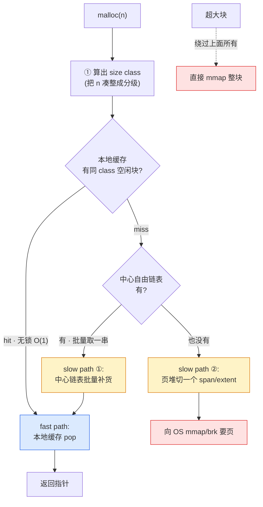
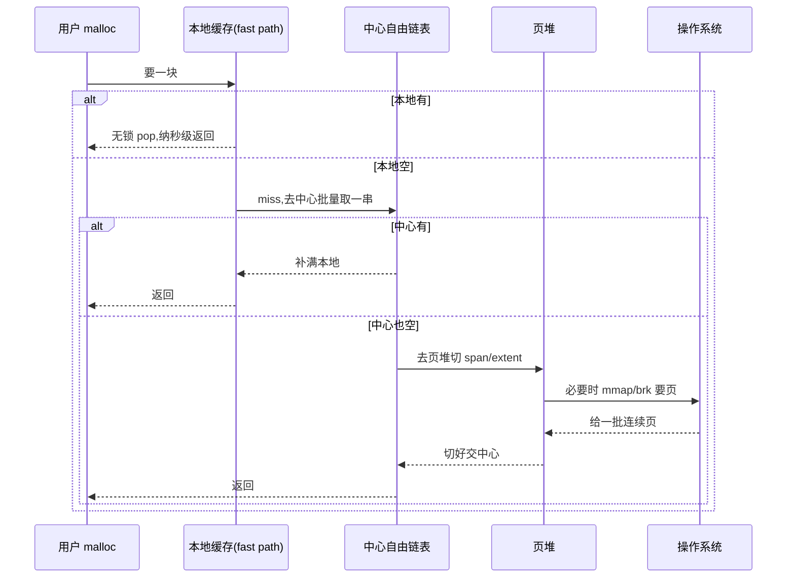

# 第一章 · 第一性原理:为什么 glibc malloc 不够用

> 篇:P0 开篇
> 主线呼应:这一章是全书的**总览与定调**。内存分配器的全部精妙,源于两个绕不开的事实——操作系统给的内存是**按页**(4KB)批发的、且每次索取都要付**系统调用**的代价;而一个程序一秒钟可能 `malloc` 上百万次。这一组矛盾,逼出了"三层快慢道"这整套架构。读懂这一章,你就拿到了全书剩余 20 章的钥匙:后面每一个组件(size class、线程缓存、自由链表、中心链表、页堆、per-CPU、huge page),都是为了让这条"本地秒拿 → 中心补货 → 页堆批发"的路走得又快又省而出现的。

## 核心问题

**一个程序要一块内存,为什么不直接问操作系统要,而要让 tcmalloc / jemalloc / mimalloc 这些"中间商"赚一道?甚至,连 glibc 自带的 ptmalloc 都被嫌不够,非得自己换一个?**

读完本章你会明白:

1. **物理真相**:操作系统给的内存是按**页**(4KB)批发的,而且每次索取(`mmap`/`brk`)都要付一次**系统调用**的代价——一秒百万次 `malloc` 全走这条路,会被 syscall 拖垮。
2. **baseline 的墙**:glibc ptmalloc 用 arena + chunk + bins 把"每次问 OS"的问题解决了,但它的**全局 arena 锁**在高并发下成了瓶颈、它的**碎片**也压不住——这正是新一代分配器要攻克的。
3. **三层快慢道**:本地缓存(无锁,O(1))→ 中心自由链表(按大小分级,批量)→ 页堆(整批向 OS 要/还),每一层各司其职。
4. **快 vs 省的张力**:fast path 要"快"(无锁、纳秒级),slow path 要"省"(低碎片、低占用、归还 OS),两者天然拉扯,每个设计都在权衡。
5. **全书的二分法**:**局部缓存**(线程/CPU 私有,无锁 fast path)vs **中心堆**(全局共享,slow path)——全书 20 章都落在这两面。

---

## 1.1 一句话点破

> **操作系统只会"按页批发内存",一次 `mmap`/`brk` 就是一次系统调用,贵且粗。而程序一秒可能要一百万块、大小不一的内存。分配器的工作,就是在这中间当一个聪明的"批发转零售"的中间商:先整批向 OS 进货(页堆),在中心仓库按型号分拣(中心自由链表 + size class),再给每个线程/CPU 备好手边的小货柜(本地缓存),让绝大多数 `malloc` 只是一次无锁的"伸手就拿"。**

这是结论,不是理由。本章倒过来拆:先看操作系统给的内存到底怎么回事,再看"每次直接问 OS"为什么不行,再看 glibc 自带的 ptmalloc 解决了什么、又卡在哪,最后看新一代分配器的三层快慢道怎么把"又快又省"做成。

---

## 1.2 物理真相:操作系统按页批发内存

一切要从"程序怎么拿到内存"说起。

用户态程序不能直接碰物理内存,所有内存都得经过操作系统。在 Linux 上,拿到一块新的虚拟内存,主要靠两个系统调用:

- **`brk`/`sbrk`**:把进程的 data segment(数据段)顶端往上推,在堆区扩张出一块连续内存。它只能往一个方向长,适合"小块、顺序"的堆分配。
- **`mmap`**:在进程地址空间里映射一块新的内存(匿名映射 `MAP_ANONYMOUS`),位置可以任意,大小可以很大。大块分配通常走它。

这两个系统调用,有三个绕不开的共性,它们是后面所有故事的根:

**第一,最小批发单位是"页"(page)。** 操作系统管理内存以页为单位,典型一页 **4KB**。你想要 16 字节,系统不会真的只给你 16 字节——它至少以页为单位映射。当然,分配器会在这页里塞很多个小对象,但"页"是 OS 和分配器打交道的最小货币。

**第二,每一次索取都是一次系统调用,要付用户态 ↔ 内核态切换的代价。** 一次 `mmap`/`brk` 要陷入内核、修改页表、可能还要触发缺页异常,开销在**微秒级**(几百纳秒到几微秒,取决于是否要实际分配物理页)。

**第三,频繁 syscall 会拖垮高并发程序。** 一个繁忙的服务器一秒可能 `malloc` 上百万次。如果每一次都走 `mmap`,那就是一秒百万次系统调用——CPU 大量时间耗在内核态切换上,这是不可接受的。

> **钉死这件事**:操作系统给的内存是"**按页批发、每次付 syscall 代价**"的。一次 `malloc` 绝不能直接对应一次 `mmap`。所有分配器的第一个职责,就是**把"向 OS 批发"和"向用户零售"在频率上彻底解耦**——攒一大批慢慢卖,卖光再去进。

| 事实 | 数量级 | 后果 |
|------|--------|------|
| OS 最小批发单位(页) | 4KB | 小对象得在页里挤着放,需要"按大小切分" |
| 一次 `mmap`/`brk` 代价 | 数百 ns ~ 数 µs(syscall + 可能的缺页) | 高频 malloc 不能每次都问 OS |
| 繁忙服务 malloc 频率 | ~百万次/秒 | 必须用缓存把绝大多数 malloc 挡在 syscall 之外 |

记住这张表。后面四套分配器的每一个决策,都能回扣到"它在帮我们把零售和批发解耦、把 syscall 挡在千里之外"。

---

## 1.3 朴素方案 A:每次 `malloc` 直接问 OS 要,行不行?

既然 `mmap` 能给我任意大小的内存,最朴素的做法是:**`malloc(17)` 就 `mmap` 一块 17 字节(实际凑整到页,4KB),`malloc(99)` 再 `mmap` 一块……** 写起来简单,内存也"现要现拿、不用不占"。

听起来不错,一问就破:

- **syscall 灾难**:每次 `malloc` 一次 `mmap`,一秒百万次 malloc = 一秒百万次系统调用。CPU 直接被内核态切换榨干。
- **内存浪费**:你要 17 字节,`mmap` 最少给一页 4KB。那 4079 字节白占(直到你下次再要)。碎片爆炸。
- **`free` 怎么还**:还 17 字节?OS 最小也按页回收。你 free 了一个对象,它所在的页上可能还有别的对象活着,这页就没法还。内存只进不出,RSS 节节攀升。

> **不这样会怎样**:每次直接问 OS,把"要内存"这件高频小事,变成了昂贵的系统调用 + 按页的浪费。这条路在高频程序里**第一天就崩**。

这条路当然没人真的这么走。但它点出了分配器必须解决的第一件事:**在用户态囤积一批内存,让绝大多数 `malloc`/`free` 不碰 OS**。这就是"缓存"的由来。

---

## 1.4 baseline:ptmalloc 的做法,以及它卡在哪

glibc 自带的 **ptmalloc**(就在 `malloc/malloc.c` 这一个 ~6500 行的巨石文件里,在线源:[malloc.c](https://github.com/glibc/glibc/blob/main/malloc/malloc.c))就是这么个"用户态囤积"的实践者,它是绝大多数 Linux 程序默认的 `malloc`。我们把它当**baseline**:看它解决了什么、又卡在哪——后者正是 tcmalloc / jemalloc 要补的。

ptmalloc 的核心设计(后续章节会逐一对照):

1. **arena(竞技场)**:一片被一把锁保护的大块堆。主线程用 `main_arena`;多线程时,ptmalloc 会**动态创建额外的 arena**(默认上限 `8 × ncpu`),让不同线程用不同 arena,把锁争用摊开。
2. **chunk(块)**:malloc 返回的每一块都带一个小 header(记录大小和前后邻居),空闲时,header 后面的字段被复用成链表指针(`fd`/`bk`)。
3. **bins(桶)**:空闲 chunk 按大小分门别类放进不同的"桶":**fastbin**(小块,LIFO 单链表)、**smallbin**(中等,双向链表)、**largebin**(大块,按大小分组的双向链表)、**unsorted bin**(刚释放、还没归类的)。
4. **consolidate(合并)**:相邻的空闲 chunk 会被合并成大的,减少外部碎片。
5. **tcache(per-thread cache)**:glibc 2.26 才加的——每个线程一个小型无锁缓存,先从 tcache 拿,miss 了才去 arena。

ptmalloc 把方案 A 的"每次问 OS"问题解决得很好:`malloc` 先查 tcache、再查 bins,绝大多数情况不碰 `mmap`/`brk`。那它为什么还被嫌?

> **不这样会怎样**(ptmalloc 的三道墙):

- **墙一:arena 锁在高并发下仍是瓶颈。** arena 数量有上限(`8 × ncpu`),当线程数远超核数(比如几千个线程的服务),大量线程挤在少量 arena 上抢同一把 `mutex`。ptmalloc 的 `malloc`/`free` 在争用时是**真的会阻塞**的——这正是 tcmalloc/jemalloc 要用"per-CPU / per-thread 无锁 fast path"消灭的东西。
- **墙二:碎片压不住。** ptmalloc 的合并(consolidate)是被动的、不彻底的(只在特定时机触发),长期运行的服务容易出现外部碎片——RSS 居高不下,还不出 OS。tcmalloc 的 huge page filler、jemalloc 的 decay purge,就是为治这个病而生。
- **墙三:tcache 是"后加的"。** glibc 的 tcache 直到 2.26(2017)才引入,设计相对简单(每线程固定数量的小桶)。而 tcmalloc/jemalloc 从一开始就把"线程缓存"当成架构核心,层次更深、策略更细(批量取还、transfer cache、按 size class 精细分级)。

> **钉死这件事**:ptmalloc 没有错,它是"用户态囤积 + 多 arena + bins"的经典实现,解决了方案 A 的 syscall 灾难。但它在**高并发锁争用**和**碎片**上不够好。tcmalloc / jemalloc / mimalloc 这一代分配器的全部努力,就是把这两道墙推倒。

---

## 1.5 三层快慢道:新一代分配器的答案

既要把 syscall 挡在千里之外(ptmalloc 做到了),又要消灭锁争用、压住碎片(ptmalloc 没做好),新一代分配器给出的答案,是一个**层次分明的"三层快慢道"**:



这条降级链,是全书的地基。每一层都对应一个明确的职责:

1. **本地缓存(fast path,要"快")**:每个线程(或 CPU 核)一份私有缓存,里面是按 size class 分好的空闲块。`malloc` 绝大多数情况下在这里**一击命中**:pop 一个块出来,**无锁、O(1)、纳秒级**。这是分配器的速度担当。
2. **中心自由链表(slow path ①,要"批量")**:本地缓存空了,去中心链表**一次拿一串**(批量),填满本地缓存再慢慢发。中心链表按 size class 组织,多个线程共享,但因为是"批量取一串",平摊下来锁争用很轻。
3. **页堆(slow path ②,要"省")**:中心链表也空了,去页堆切一块**连续的页**(tcmalloc 叫 span、jemalloc 叫 extent、mimalloc 叫 segment 里的 page)。页堆负责向 OS 整批进货、管理大块、合并碎片、归还空闲页。
4. **超大块(旁路)**:申请一大块(远超最大 size class),三层都不划算,直接 `mmap` 一整块、单独管理,释放时直接 `munmap`。

> **不这样会怎样**:如果只有一层(本地缓存),线程占的内存不还,内存占用爆炸;如果只有两层(本地 + 页堆),每次 miss 都要切页,粒度太粗、缓存命中率低。**三层的好处是,每一层都把"频率"往下压一个数量级**——本地缓存命中是纳秒级(最频繁)、中心批量取是偶尔(中频)、向 OS 要页是罕见(低频)。频率逐层下降,syscall 被挡在最底层。

四套分配器,层次完全对应,只是每层的实现招数不同(后续章节逐一拆):

| 层 | tcmalloc | jemalloc | mimalloc | ptmalloc(baseline) |
|----|----------|----------|----------|----------|
| **本地缓存**(fast path) | `CpuCache`(per-CPU,新版)/ `ThreadCache`(legacy) | `tcache`(`cache_bin`) | thread-local `heap` 的 page free list | `tcache`(2.26+) |
| **中心自由链表** | `central_freelist` + `transfer_cache` | arena 的 `bin` | `segment` 里的 `page` | `fastbin`/`smallbin`/`largebin` |
| **页堆** | `page_allocator`(`span` + `pagemap`) | `extent`/`pa` + `emap`(`rtree`) | `segment`/`arena`(`mmap`) | top chunk + `brk`/`mmap` |
| **超大块** | huge 路径(`mmap`) | `large`(直接 `extent`) | 直接大 `mmap` | `mmap`(`DEFAULT_MMAP_THRESHOLD` ~128KB) |

这张表先扫一眼有个印象即可,每个格子后面都有专章拆透。

> **打个比方**(只在理解三层心智时点一下):这像一个三级仓库——**工人手边的小货柜**(本地缓存,随用随拿,不跟人抢)→ **车间的中转货架**(中心自由链表,按型号补货给货柜)→ **总仓库**(页堆,整箱向供应商 mmp 进货,空了整箱退)。绝大多数拿取在手边货柜完成(快),偶尔去中转货架补货(批量),很少去总仓库进货(批发)。这个比方后面我们基本不再用——讲到具体数据结构时,都直球讲。

---

## 1.6 看源码怎么印证:三层不是画饼

上面讲的是"道理"。现在落到四套的源码,看一次 `malloc` 是不是真的字面走了这条降级链。

### tcmalloc:fast path 就是 `AllocateFast`

google/tcmalloc 新版的入口,小块分配的 fast path 在 [tcmalloc.cc:1184-1205](../tcmalloc/tcmalloc/tcmalloc.cc#L1184-L1205)。我们看核心几行:

```cpp
// tcmalloc.cc:1184 —— 小块分配的 fast/slow 分流
template <typename Policy>
ABSL_ATTRIBUTE_NOINLINE static typename Policy::pointer_type
alloc_small_sampled_hooks_or_perthread(size_t size, size_t size_class,
                                       Policy policy, size_t weight) {
  ...
  void* res;
  // 先试 fast path:CPU 缓存里直接拿
  if (ABSL_PREDICT_TRUE(weight == 0) ||
      (res = tc_globals.cpu_cache().AllocateFast(size_class)) == nullptr) {  // L1198
    // fast path miss,走 slow path
    if (UsePerCpuCache(tc_globals)) {                                         // L1199
      res = tc_globals.cpu_cache().AllocateSlow(size_class);                  // L1200 —— per-CPU:去中心链表补货
    } else {
      res = ThreadCache::GetCache()->Allocate(size_class);                    // L1202 —— legacy:线程缓存
    }
    ...
  }
```

这段是三层快慢道的字面实现。**第 1198 行 `cpu_cache().AllocateFast(size_class)` 就是 fast path**——先试图从 CPU 本地缓存无锁地拿一块;拿不到(`== nullptr`),才走 slow path。slow path 里,**第 1199 行 `UsePerCpuCache(tc_globals)` 是新版的核心开关**:开了 per-CPU,就 `AllocateSlow`(第 1200 行,去中心自由链表批量补货);没开,退回 legacy 的 `ThreadCache::GetCache()->Allocate`(第 1202 行)。

注意 `AllocateFast` 和 `AllocateSlow` 的命名——fast / slow 直白点破了"快慢道"。第 12 章我们会拆 `AllocateFast` 怎么靠 **rseq(restartable sequences)** 做到 per-CPU 无锁;这一章只要记住:**tcmalloc 的新版,fast path 是按 CPU 核缓存的,不是按线程**。这是它相对 ptmalloc/jemalloc 的代差。

大块则另走一条路 [do_malloc_pages](../tcmalloc/tcmalloc/tcmalloc.cc#L624)(`tcmalloc.cc:624`),直接切页——对应上面流程图的"超大块/页堆"旁路。

### jemalloc:入口直接 `imalloc_fastpath`

jemalloc 的 `malloc` 入口在 [jemalloc.c:805-812](../jemalloc/src/jemalloc.c#L805-L812),薄得几乎只有一行:

```c
// jemalloc.c:805 —— je_malloc
JEMALLOC_ATTR(malloc) JEMALLOC_ALLOC_SIZE(1) je_malloc(size_t size) {
    LOG("core.malloc.entry", "size: %zu", size);
    void *ret = imalloc_fastpath(size, &malloc_default);   // L808 —— 直接走 fast path(tcache)
    LOG("core.malloc.exit", "result: %p", ret);
    return ret;
}
```

**第 808 行 `imalloc_fastpath(size, &malloc_default)` 就是 fast path**——它试图从线程的 tcache 里无锁地拿。函数名里的 `fastpath` 三个字,直接挑明了意图。miss 了才会落到 `imalloc`(走 arena 的 bin,即中心自由链表)。第 11 章我们拆 jemalloc 的多 arena 怎么把锁争用摊开。

### mimalloc:default heap 就是 thread-local

mimalloc 的入口更直接,[alloc.c:203-209](../mimalloc/src/alloc.c#L203-L209):

```c
// alloc.c:203 —— mi_malloc 转给"默认堆"
mi_decl_restrict void* mi_heap_malloc(mi_heap_t* heap, size_t size) {
    return _mi_heap_malloc_zero(heap, size, false);          // L204
}
mi_decl_restrict void* mi_malloc(size_t size) {
    return mi_heap_malloc(mi_prim_get_default_heap(), size); // L207-208 —— 默认堆 = 当前线程的堆
}
```

**`mi_prim_get_default_heap()`(第 208 行)拿的是当前线程的默认堆**——一个 thread-local 的 `mi_heap_t`。`mi_malloc` 转给 `mi_heap_malloc`,从该堆的 page free list 里拿(本地缓存 fast path)。mimalloc 的设计特别干净:**每个线程一个 heap,heap 里挂着若干 segment,segment 里是按 page 组织的 free list**——本地缓存就是 heap 自己。

### ptmalloc(baseline):走 arena + bins

ptmalloc(glibc)的入口是 `__libc_malloc`,它把具体活计转交给 `_int_malloc`,走的是 **tcache → arena 的 bins(fastbin/smallbin/largebin)→ 必要时 `mmap`/`brk`**。逻辑上也是三层(tcache / bins / OS),但它的 tcache 是"后加的、固定的",bins 是全局争用的——这正是它在新一代分配器面前露怯的地方。源码见 [malloc.c](https://github.com/glibc/glibc/blob/main/malloc/malloc.c)(在线)。

> **钉死这件事**:四套分配器的 `malloc` 入口,**字面上都是"先走本地无锁 fast path,miss 了降级到中心链表 / 页堆"**。tcmalloc 是 `AllocateFast`/`AllocateSlow`(per-Cpu)、jemalloc 是 `imalloc_fastpath`、mimalloc 是 default heap、ptmalloc 是 tcache → bins。道理和代码一一对应,没有黑盒。

---

## 1.7 立起全书的二分法

讲到这里,全书的二分法已经呼之欲出。四套分配器的每一个机制,都可以归到这两面之一:

> **局部缓存(线程/CPU 私有,无锁 fast path,要"快") vs 中心堆(全局共享,slow path,管页/合并/归还,要"省")。**

- **局部这一面(fast path)**:本地缓存(tcmalloc 的 CpuCache / jemalloc 的 tcache / mimalloc 的 heap-local)、自由链表的 O(1) pop/push。这些都要"快":无锁、不争用、纳秒级。
- **中心这一面(slow path)**:中心自由链表(central freelist / arena bin)、页堆(page allocator / extent / segment)、大块 `mmap`、合并(coalesce)、`madvise` 归还、huge page filler。这些都要"省":批量、低碎片、及时还给系统。

往后读任何一章,如果看不懂某个机制在干嘛,回到这个二分法问一句:"这是在让**线程本地分配更快**(局部),还是在让**全局内存更省更整齐**(中心)?"答案会立刻帮你定位。

一次 `malloc`,从前台(fast path)走到后台(slow path),长这样:



这本书接下来,就是沿着这张图,一个驿站一个驿站地走完。第 1 篇讲三层快慢道的共通地基(P1-02 size class → P1-06 中心链表),第 2 篇讲页堆怎么向 OS 要内存(P2-07~09),第 3 篇讲多核怎么不让锁成瓶颈(P3-10~12,全书性能核心),第 4 篇讲碎片怎么治理、内存怎么归还(P4-13~15,重头戏),第 5 篇讲工程化(P5-16~18),第 6~7 篇收束。

---

## 1.8 技巧精解:快与省的张力——三层各拿什么换什么

这一章是定调章,我们把全书会反复回扣的"快与省的张力"立清楚。这是分配器最核心的权衡,理解了它,你就理解了为什么要有线程缓存、为什么要有 size class、为什么要有 huge page filler。

分配器的目标可以浓缩成两个:**快**(分配/释放延迟低、高并发不争用)和**省**(碎片低、内存占用低、及时归还 OS)。问题在于,这两个目标**天然拉扯**:

| 想要"快"会怎么做 | 代价(牺牲了"省") |
|------------------|-------------------|
| 每个线程/CPU 一份本地缓存,无锁 | 每份缓存都囤一些块,**总占用变高**(N 个线程 × 每份囤货) |
| 本地缓存的块"借了不急着还" | 归还 OS 滞后,**RSS 居高不下** |
| size class 把大小凑整(少查表) | 凑整带来**内部碎片**(要 17B 给 32B) |
| 不在 fast path 做合并、不做统计 | 碎片没人收、内存看不见,**外部碎片 + 不可观测** |

反过来:

| 想要"省"会怎么做 | 代价(牺牲了"快") |
|------------------|-------------------|
| 积极合并相邻空闲块、归还 OS | 合并要扫邻居、归还要 `madvise` syscall,**慢** |
| 把缓存里的块尽快退回中心 | 退回要走锁、下次又要重新补货,**fast path miss 变多** |
| 用大页压缩碎片 | 大页管理复杂、填充策略要算,**slow path 变重** |

> **所以这样设计**:既然"快"和"省"拉扯,分配器的解法就是**把两者放到不同的层、用不同的频率去做**——

- **fast path(本地缓存)只管"快"**:无锁、O(1)、不合并、不统计、不归还。它的 KPI 是延迟。代价是它囤的块不还——但这没关系,因为还有中心层兜底。
- **slow path(中心链表 + 页堆)管"省"**:批量取还(平摊锁)、合并碎片、`madvise` 归还、用大页。它的 KPI 是占用和碎片。它慢一点没关系,因为它**频率低**——fast path 命中率在 99% 以上,slow path 很少被触发。

这就是三层快慢道的本质:**不是三层做同一件事,而是"快"和"省"分工到不同层,各按各的频率运转**。fast path 高频、只做最便宜的无锁操作;slow path 低频、可以做昂贵的整理。

> **反面对比**:假设我们设计一个"只有本地缓存、不归还"的分配器会怎样?分配延迟确实拉满(永远本地命中、永远无锁),但——
> - 内存占用:N 个线程各囤一份,且只进不出,RSS 随时间无限增长。
> - 碎片:释放的块不合并、不归还,外部碎片爆炸。
> - 多核:线程死亡后它的囤货没法被别人复用,浪费。
>
> 这就是"只要快、不要省"的结局。反过来"只要省、不要快"(每次都认真合并、归还、查全局)则会让 fast path 变重,延迟劣化。**三层快慢道,就是在这两个极端之间,用"分层 + 分频率"找到的平衡点。**

> **钉死这件事**:分配器不是在"快"和"省"之间二选一,而是**把快交给高频的 fast path、把省交给低频的 slow path**,让两者各得其所。全书剩余 20 章,本质上都在讲"怎么让 fast path 更快、让 slow path 更省、以及两者怎么平滑衔接"。

---

## 章末小结

这一章是全书的**总览与定调**,我们没有钻进任何一行复杂的实现,但立起了贯穿全书的四个东西:

1. **一个物理事实**:操作系统按页批发内存、每次索取付 syscall 代价——分配器的第一职责是把"批发"和"零售"在频率上解耦。
2. **一个 baseline**:ptmalloc 解决了"每次问 OS"的灾难(arena + bins + tcache),但卡在**高并发锁争用**和**碎片**上。
3. **一条主线 + 一个二分法**:主线是"三层快慢道让 malloc 又快又省";二分法是"**局部缓存**(fast path,快)vs **中心堆**(slow path,省)"。迷路时回到它们。
4. **一个张力**:快与省天然拉扯,三层快慢道的本质是用"分层 + 分频率"让两者分工——fast path 高频只管快,slow path 低频只管省。

### 五个"为什么"清单

1. **为什么不能每次 malloc 都直接问 OS?** OS 按页批发(4KB),且每次 `mmap`/`brk` 是系统调用(µs 级)。一秒百万次 malloc 全走 syscall 会被拖垮,且按页浪费。
2. **为什么 glibc 自带的 ptmalloc 还被嫌?** 它解决了 syscall 灾难,但 arena 锁在高并发(线程数 ≫ arena 数)仍争用、碎片压不住、tcache 是后加的。
3. **为什么要把分配分成三层?** 把"快"(本地缓存无锁)和"省"(中心批量 + 页堆归还)分工到不同层、按不同频率运转——fast path 高频只做最便宜的操作,slow path 低频做昂贵的整理。
4. **fast path 凭什么纳秒级?** 它从线程/CPU 私有的本地缓存里 pop 一个块,**无锁、O(1)**,不合并、不统计、不碰 OS。代价是它囤的块不还——由中心层兜底。
5. **"快"和"省"为什么是张力?** 想快就要本地囤货不还(占用高、碎片不收);想省就要合并、归还(慢)。三层快慢道用"分频率"平衡:fast path 管快,slow path 管省。

### 想继续深入往哪钻

- 本章点到的"三层快慢道"是全书地基,第 1 篇(P1-02 size class → P1-06 中心链表)逐层拆透,建议顺序读。
- 想立刻看一眼真实的 fast path,读 [tcmalloc.cc:1184-1205](../tcmalloc/tcmalloc/tcmalloc.cc#L1184-L1205) 的 `AllocateFast`/`AllocateSlow`、[jemalloc.c:805-812](../jemalloc/src/jemalloc.c#L805-L812) 的 `imalloc_fastpath`。
- 想自己动手感受分配器差异,可以用 `LD_PRELOAD` 把程序的 `malloc` 换成 jemalloc/tcmalloc,对比 RSS 和延迟(附录 B 有实战)。
- ptmalloc 的经典实现细节(arena 怎么动态开、bins 怎么组织),看在线 [malloc.c](https://github.com/glibc/glibc/blob/main/malloc/malloc.c) 的 `_int_malloc`/`_int_free`/`consolidate`。

### 引出下一章

我们立起了三层快慢道和"局部缓存 vs 中心堆"的二分法。但真要走进"一次 malloc"的第一步,有一个基础概念必须先卸掉包袱:为什么分配器不按你申请的大小原样分配,而是把所有大小**凑整成几十个"分级"(size class)**?这个"凑整"看起来在浪费内存,为什么反而是分配器快起来的前提?下一章,我们从 size class 讲起,正式进入第 1 篇:三层快慢道的共通地基。
