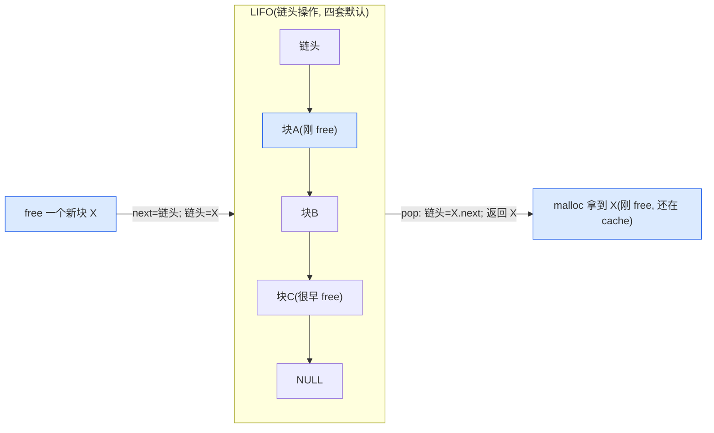

# 第四章 · 自由链表:用释放块本身串链

> 篇:P1 共通地基
> 主线呼应:这一章是"三层快慢道"在数据结构层面的**第一块基石**。上一章讲完 size class(把任意大小凑整成分级)和**对齐**,我们手里已经有一摞摞大小相同、对齐规整的空闲块——每个 class 一摞,等着被分发。但**一摞空闲块怎么管起来,才能让 push/pop 都是 O(1)、还几乎不花 metadata**?这就是自由链表(free list)要解决的问题。它的核心一招,是把"链表节点的 next 指针"**藏进释放块自己的头几个字节**——同一块内存,在用户手里是数据、在分配器手里是链表节点,身份切换不花一分钱。这一招简单到一句话能讲完,却撑起了 tcmalloc/jemalloc/mimalloc/ptmalloc 四套分配器的 fast path。读懂它,你就读懂了"为什么 free 之后那块内存没有立刻还给 OS,也没有立刻消失"——它只是悄悄挂进了一条链表,等着下次 malloc 把它摘下来。

## 核心问题

**一堆空闲块,怎么用 O(1) 的时间 push 进去、O(1) 的时间 pop 出来,还几乎不额外占空间?更关键的是,链表节点本身住在哪里——能不能不另外开一片 metadata 内存?**

读完本章你会明白:

1. **链表节点住在释放块里**:一个块被 `free` 之后,它头几个字节就从"用户数据"变成"链表的 next 指针"。同一块内存身兼二职,身份切换不花一分钱。前提是块已释放,用户不再用,头几个字节可以被分配器复用。
2. **push/pop 都是 O(1)**:把块接到链头(push)、从链头摘下来(pop),各只是一次指针赋值,没有任何遍历。这是 fast path 纳秒级的前提。
3. **LIFO vs FIFO 的取舍**:链头插入是 LIFO(后进先出,缓存更友好,因为刚释放的块还在 cache 里);FIFO 能让分配延迟更平滑,但要走到链尾,通常不划算。四套默认都走 LIFO。
4. **无锁(单线程)与原子 push(跨线程)**:线程本地 free list 的 push/pop 是纯指针操作,根本不上锁;真正争用的地方——把块从线程本地推给全局共享结构——靠 CAS 把块原子地接到共享链头,失败重试。
5. **四套对照**:tcmalloc 的 `SLL_Push`/`SLL_Pop`(把 next 直接写到块首)、jemalloc 的 `cache_bin` 栈数组(指针存在独立缓冲里,不藏块里,避免缓存依赖)、mimalloc 的 `mi_block_t`(`next` 字段会被随机 key 异或编码,防 UAF 利用)、ptmalloc 的 chunk `fd` 字段(2.32 起 Safe-Linking 编码)。

> **如果一读觉得太难**:先只记住三件事——① 释放块的头几个字节被分配器复用成链表的 `next` 指针,所以挂链表几乎不花 metadata;② push/pop 都只是改链头一个指针,O(1);③ 多线程往共享链表推块时用 CAS,本地线程内根本不锁。这三条就够你读懂后面所有章节的 free list 出现处。

---

## 4.1 一句话点破

> **释放掉的内存块自己就是链表节点——它的头几个字节被分配器拿来当 `next` 指针用。push 就是"把块的 next 指向当前链头,然后链头改成这个块";pop 就是反过来。这套机制让空闲块管理 O(1)、零额外 metadata,是分配器 fast path 的物理基础。**

这是结论,不是理由。本章倒过来拆:先看朴素方案为什么不行,再看"next 藏块里"为什么 sound,然后看 push/pop 怎么落到源码,再看四套分配器在同一招上的微妙差异(谁藏了、谁编码了、谁干脆不藏),最后讲跨线程怎么把这一招用到共享链表上。

---

## 4.2 朴素方案为什么不行:为每个空闲块单独开一个节点

我们先把问题摆清楚。一个线程本地缓存(ThreadCache / tcache / per-CPU slab,后面三章会逐个拆),里面是**按 size class 分好类的、一堆同大小的空闲块**。比如 class 3(8 字节对齐,实际 32 字节)那一摞,可能挂着几百个空闲块。分配器要做的操作只有两种:

- `malloc` 一个 class 3 的块:从这摞里**拿一个出来**(pop)。
- `free` 一个 class 3 的块:把它**放回这摞**(push)。

朴素方案是**每个空闲块配一个独立的链表节点**:

```
struct FreeNode {
    void*     block;       // 指向真正那个空闲块
    FreeNode* next;        // 串成链
};
```

每次 free:先 `malloc` 一个 `FreeNode`(或者从 node 池拿),填好 `block`,再串进链。每次 malloc:从链头摘一个 `FreeNode`,取出它的 `block`,把 `FreeNode` 还回 node 池。

听起来很自然,一推就破:

> **不这样会怎样(朴素方案的四面墙)**:

- **墙一:空间翻倍。** 每个 `FreeNode` 至少 16 字节(一个指针 8B + 一个 next 指针 8B)。一个 32 字节的 class,现在每个空闲块要配 16 字节的 node metadata,**额外开销 50%**。class 越小,比例越惨——class 1(8 字节)直接 200% 开销。这与分配器"省"的目标直接打架。
- **墙二:两次访存。** 拿块要先碰 `FreeNode`(读 `block` 字段),再碰块本身。多一次缓存行加载,fast path 直接劣化。分配器死守的"fast path 纳秒级",第一个朴素选择就破了。
- **墙三:节点本身也得管理。** `FreeNode` 从哪来?要么再开一个分配器(套娃),要么用池(池本身又是一套 free list)。复杂度和开销滚雪球。
- **墙四:缓存不友好。** `FreeNode` 数组和空闲块数组是两片内存,遍历链时要在两片之间来回跳,cache line 反复 miss。

> **钉死这件事**:朴素方案的根病是——**链表节点和块本身被当成两个东西**。一旦合并成一个,四面墙全倒。

---

## 4.3 关键一招:把 next 藏进释放块的头几个字节

合并成一个的做法,字面意义就是一句:**让空闲块自己当链表节点**。

一个块,在用户手里时,它的头几个字节装的是用户数据;一旦被 `free`,用户承诺不再碰这块内存了(再用就是 use-after-free,UB),分配器就**名正言顺地复用它的头几个字节,装一个 `next` 指针**,指向链表里的下一个空闲块。

```
空闲块如何同时充当链表节点:

  ┌── 用户视角(in-use)─────────────┐
  │  user_data_0  user_data_1  ...  │  ← 用户读写这里
  └─────────────────────────────────┘

  ┌── 分配器视角(freed, 挂在 free list)──┐
  │   next 指针   │   (用户旧数据...)     │  ← 头一个字装 next
  └───────────────┴───────────────────────┘
        │
        └── 指向链表里的下一个空闲块(也可能为 NULL 表示链尾)
```

push 就是:**把要 free 的块的 next 设成当前链头,然后把链头改成这个块**。

pop 就是:**取出链头块,把链头改成它的 next,把块交给用户**。

这俩操作各自就**一两次指针赋值**,没有任何遍历,也不碰除块本身之外的任何内存。O(1)、零额外 metadata(链头指针本身要存,但每个 class 只有一个,几字节而已)。

> **所以这样设计**:"next 藏块里"一举消灭了朴素方案的四堵墙——没有独立 node,空间零额外;只碰块本身,一次访存;没有 node 池,无套娃;遍历链时只在块数组里跳,缓存更友好。

### 为什么 sound(关键正确性)

这一招看起来"野":把用户的数据区当指针用,真的安全吗?三个层面保证它 sound:

1. **块已 freed,用户承诺不再用**。C/C++ 标准(以及 API 文档)明确规定,`free(p)` 之后 `p` 指向的内存的使用权交还分配器,**继续读写 `p` 是 UB**。所以分配器在 `p` 的头几个字节写 `next`,绝不会和用户的数据访问冲突——用户根本无权访问。
2. **块的 `next` 字段写入,发生在用户最后一次访问之后**(用户先 free,分配器才写 next);**块的 `next` 字段读取,发生在用户下一次访问之前**(分配器先 pop 出来交给用户,用户才拿到指针)。从用户角度看,`next` 的生命周期完全嵌在两次用户访问之间,没有交叠。
3. **块必须够大,装得下至少一个指针**。一个 class 至少要 8 字节(64 位系统上一个指针的大小),这是分配器的硬约束——**没有哪个 size class 会小于指针大小**(对齐章节已讲,最小 class 通常就是 `sizeof(void*) = 8`)。所以 next 字段永远有地方放。

> **钉死这件事**:`next` 藏块里不是 hack,是建立在"块已释放、用户不再用"这个契约之上的合法复用。它和"用 `union` 把同一片内存按不同身份访问"是同一种套路,只不过这里身份切换的时机由"在用 / 释放"这个状态决定。

### LIFO:链头插入就是缓存友好

注意到 push 是"插到链头",pop 是"从链头取"——这是 **LIFO(后进先出)**。这个选择不是随意的,而是有性能理由:

- 刚 free 的块,通常还在 **CPU cache** 里(用户的 `free` 调用刚写过它的元数据,或者它的内容刚被使用过)。把它直接挂到链头,下次 `malloc` 立刻 pop 它出来,**还在 cache 里**,几乎零额外延迟。
- 如果改成 FIFO(先进先出),要从链尾取,意味着要遍历到链尾,或者维护一个尾指针;而且取到的是很久以前 free 的块,大概率已经 evict 出 cache 了,**每次 pop 都是一次 cache miss**。

所以四套分配器,凡是单线程本地 free list,默认全是 LIFO。tcmalloc 的 `SLL_Push`/`SLL_Pop` 就是链头操作,mimalloc 的 `local_free` 也是链头,ptmalloc 的 fastbin/tcache 也是 LIFO。



> **不这样会怎样**:如果用 FIFO,你要么维护一个尾指针(多一次写、多一个 metadata 字段),要么遍历到尾(O(n));更重要的是,pop 出的总是"很久以前"的块,几乎必然 cache 冷,fast path 直接拖慢。FIFO 的唯一好处是分配延迟更可预测(每个块都"轮一遍"),但代价是平均延迟变高——分配器选了低平均延迟、放弃了一点可预测性。

---

## 4.4 看源码:tcmalloc 的 `SLL_Push`/`SLL_Pop`,把 next 直接写到块首

我们看 tcmalloc 里这一招最朴素的实现。在 [tcmalloc/internal/linked_list.h](../tcmalloc/tcmalloc/internal/linked_list.h) 里,有一组 inline 函数,是 tcmalloc 整套 free list 的物理基础:

```cpp
// tcmalloc/internal/linked_list.h:33-58
inline void* SLL_Next(void* t) {
  return *(reinterpret_cast<void**>(t));           // L34:把块的首字当 next 指针读出来
}

inline void SLL_SetNext(void* t, void* n) {
  *(reinterpret_cast<void**>(t)) = n;              // L37-38:把 n 写到块的首字
}

inline void SLL_Push(void** list, void* element) {
  SLL_SetNext(element, *list);                      // L42:新块的 next = 当前链头
  *list = element;                                   // L43:链头 = 新块
}

inline void* SLL_Pop(void** list) {
  void* result = *list;                             // L47:链头就是要弹的块
  void* next = SLL_Next(*list);                     // L48:读它的 next
  *list = next;                                      // L49:链头后移
  ...
  return result;
}
```

就这五行,撑起了 tcmalloc 线程本地 `ThreadCache` 的全部 push/pop。注意几件事:

- **`SLL_Next` 就是 `*(void**)t`**——把块地址当 `void**` 解引用。它字面意义就是"块首字节就是 next 指针"。这里没有任何节点结构、没有任何分配,纯指针戏法。
- **`SLL_Push` 是教科书 LIFO push**:新块的 next 设为当前链头,然后链头指向新块。两次指针赋值,O(1)。
- **`SLL_Pop` 是它的逆操作**:取出链头,读其 next,链头后移,返回原链头。

包装它们的 `LinkedList` 类([linked_list.h:61-127](../tcmalloc/tcmalloc/internal/linked_list.h#L61-L127))只是加了 `length_` 计数:

```cpp
// tcmalloc/internal/linked_list.h:81-104 (见 [linked_list.h](../tcmalloc/tcmalloc/internal/linked_list.h#L81-L104))
void ABSL_ATTRIBUTE_ALWAYS_INLINE Push(void* ptr) {
  SLL_Push(&list_, ptr);
  length_++;                                         // 多维护一个计数
}

bool ABSL_ATTRIBUTE_ALWAYS_INLINE TryPop(void** ret) {
  void* obj = list_;
  if (ABSL_PREDICT_FALSE(obj == nullptr)) return false;   // 空链表, fast path miss
  void* next = SLL_Next(obj);
  list_ = next;
  length_--;
  *ret = obj;
  return true;
}
```

`ThreadCache` 把这个 `LinkedList` 包成 `FreeList`,然后**每个 size class 一份**:

```cpp
// tcmalloc/thread_cache.h:82-126 (见 [thread_cache.h](../tcmalloc/tcmalloc/thread_cache.h#L82-L126))
class FreeList : public LinkedList {
 private:
  uint32_t lowater_;          // 低水位(给 Scavenge 用, 判断什么时候该还一些给中心)
  uint32_t max_length_;       // 动态最大长度
  uint32_t length_overages_;  // 超额次数
  ...
};

// tcmalloc/thread_cache.h:201
FreeList list_[kNumClasses];  // 按 size-class 索引的数组
```

每个 size class 一条独立链,互相不干扰。`Allocate`/`Deallocate` 就是查表选链、push/pop:

```cpp
// tcmalloc/thread_cache.h:225-245 (见 [thread_cache.h](../tcmalloc/tcmalloc/thread_cache.h#L225-L245))
inline void* ThreadCache::Allocate(size_t size_class) {
  const size_t allocated_size = tc_globals.sizemap().class_to_size(size_class);
  FreeList* list = &list_[size_class];
  void* ret;
  if (ABSL_PREDICT_TRUE(list->TryPop(&ret))) {     // L231:fast path, 链头 pop 一个
    size_ -= allocated_size;
    return ret;
  }
  return FetchFromTransferCache(size_class, allocated_size);   // miss 了去中心补货
}

inline void ThreadCache::Deallocate(void* ptr, size_t size_class) {
  FreeList* list = &list_[size_class];
  ...
  list->Push(ptr);                                  // L245:链头 push 回去
  ...
}
```

第 231 行 `list->TryPop(&ret)` 就是 fast path——一次 `SLL_Pop`、纯指针、无锁、纳秒级。miss 了才走 `FetchFromTransferCache`(下一章和 P1-06 会拆)。

> **钉死这件事**:tcmalloc 的 `ThreadCache::Allocate`/`Deallocate`,字面就是 `SLL_Pop`/`SLL_Push`。`SLL_Next` 就是 `*(void**)t`,把块首字节当 next。这一招贯穿整个分配器——下面我们会看到,central freelist、per-CPU slab、甚至 mimalloc 和 ptmalloc 的 free list,本质上都是这一招的变体。

---

## 4.5 四套对照:同一招,四个变体

`next 藏块里`这一招,四套分配器都用了,但具体实现各有微妙。我们并排看:

| 维度 | tcmalloc | jemalloc | mimalloc | ptmalloc(baseline) |
|------|----------|----------|----------|---------------------|
| **线程本地 fast path 用的是不是侵入式链表** | 是(`SLL_Push`/`SLL_Pop`,next 写块首) | **否**(用独立指针栈数组 `cache_bin_t.stack_head`) | 是(`local_free`,next 藏块首) | 是(tcache `entries`,fd 藏块首) |
| **next 指针是否编码** | 不编码(明文) | 不适用(指针在独立栈里) | **编码**(异或 `keys[2]`,glibc 2.32 思路同源) | **编码**(Safe-Linking,2.32+ `PROTECT_PTR`) |
| **中心层(共享)的 free list** | `Span` 内的"压缩链表"(2 字节索引,多个塞进块内数组) | slab 用 **bitmap**(完全不用链表);extent 层用环形双向链表 `qr` | page 的 `free`/`thread_delayed_free` | fastbin / smallbin(`fd`/`bk`) |
| **LIFO 还是 FIFO** | LIFO(链头) | LIFO(栈顶,数组末尾方向) | LIFO(`local_free` 链头) | LIFO(fastbin/tcache 链头) |
| **跨线程往共享链推** | per-CPU slab 用 rseq(详见第 12 章);central_freelist 用 SpinLock 保护 | arena bin 用 `malloc_mutex` 保护 | **CAS 接到 `thread_delayed_free` 链头** | tcache 是线程私有,无需跨线程推 |

我们逐个挑最有特色的拆。

### tcmalloc:center 层的"压缩链表"——2 字节索引代替 8 字节指针

`tcmalloc` 的中心层(`Span`)用的是这一招的**升级版**。它不存指针,而是存 **2 字节的对象索引**(对象在 span 内的偏移除以常数):

```cpp
// tcmalloc/span.h:294-299 (见 [span.h](../tcmalloc/tcmalloc/span.h#L294-L299))
// For available objects stored as a compressed linked list, the index of
// the first object in recorded in freelist_.
struct {
  uint16_t embed_count_;
  uint16_t freelist_;          // 2 字节索引, 而不是 8 字节指针
};
```

更妙的是,span 把**整个链表的多个索引塞进第一个对象的内部**(像一个小数组),减少 cache miss:

```cpp
// tcmalloc/span.h:464-480 (见 [span.h](../tcmalloc/tcmalloc/span.h#L464-L480))
for (void* ptr : batch) {
  const ObjIdx idx = PtrToIdx(ptr, size);
  if (ABSL_PREDICT_TRUE(freelist_ != kListEnd) &&
      ABSL_PREDICT_TRUE(embed_count_ != size / sizeof(ObjIdx) - 1)) {
    // Push onto the first object on freelist.
    ObjIdx* __restrict host = IdxToPtr(freelist_, size, start);
    embed_count_++;
    host[embed_count_] = idx;                       // 把索引塞进第一个对象的数组里
  } else {
    // 第一个对象塞满了, 把新对象推到链头
    *reinterpret_cast<ObjIdx*>(ptr) = freelist_;
    freelist_ = idx;
    embed_count_ = 0;
  }
}
```

注释说得直白([span.cc:108-142](../tcmalloc/tcmalloc/span.cc#L108-L142)):

> *We could use the free objects as linked list nodes and form a stack, but since the free objects are not likely to be cache-hot the chain of dependent misses is very cache-unfriendly.*

也就是说,tcmalloc 在中心层**意识到了朴素侵入式链表的弱点**(链式 cache miss),于是把它**数组化**——一个对象里塞一串索引,push/pop 都是连续内存访问,cache 友好。这就是"next 藏块里"的进化版:**next 不是单个指针,而是一串 2 字节索引,塞进块的头几个字**。

> **钉死这件事**:tcmalloc 在线程本地用最朴素的 8 字节 `next`(`SLL_Push`/`SLL_Pop`);到中心层,因为空闲块数量大、cache miss 代价高,升级成"2 字节索引 + 数组打包"。同一招的两个版本,分别服务"极致快的 fast path"和"批量高效的 center"。

### jemalloc:tcache 用独立指针栈,刻意不藏块里

`jemalloc` 在线程本地缓存(`tcache` 的 `cache_bin_t`)做了一个**反直觉**的选择:**不把 next 藏块里**。它给每个 cache bin 开一片独立的指针数组当栈,`stack_head` 指向当前栈顶(见 [cache_bin.h](../jemalloc/include/jemalloc/internal/cache_bin.h#L88-L130)):

```cpp
// jemalloc/include/jemalloc/internal/cache_bin.h:88-130
typedef struct cache_bin_s cache_bin_t;
struct cache_bin_s {
	/*
	 * The stack grows down.  Whenever the bin is nonempty, the head points
	 * to the first item.
	 */
	void **stack_head;          // 栈顶指针(指向数组里一个槽)
	...
};
```

alloc 是从栈顶取一个指针出来(见 [cache_bin.h:381-425](../jemalloc/include/jemalloc/internal/cache_bin.h#L381-L425)):

```cpp
// jemalloc/include/jemalloc/internal/cache_bin.h:381-425
JEMALLOC_ALWAYS_INLINE void *
cache_bin_alloc_impl(cache_bin_t *bin, bool *success, bool adjust_low_water) {
	...
	void          *ret = *bin->stack_head;             // L395:栈顶读一个指针
	cache_bin_sz_t low_bits = (cache_bin_sz_t)(uintptr_t)bin->stack_head;
	void         **new_head = bin->stack_head + 1;     // 栈顶下移一格
	if (likely(low_bits != bin->low_bits_low_water)) {
		bin->stack_head = new_head;
		*success = true;
		return ret;
	}
	...
}
```

为什么 jemalloc 不学 tcmalloc 把 next 藏块里?因为**jemalloc 的 cache 容量更大**(每个 bin 可以缓存几百上千个对象),如果用侵入式链表,每次 pop 都得**碰一个被释放过的块**,那个块很可能已经 cache cold。而独立指针数组是一片连续内存,**栈顶附近那几个槽大概率还在 cache 里**,pop 只要碰这一片,延迟更稳。

代价是:这块栈数组本身**占了额外内存**(每个 `cache_bin_t` 配 `ncached_max * sizeof(void*)` 字节的栈)。这是 jemalloc 用"多一点空间"换"更稳的 fast path 延迟"的一个明确取舍。

> **不这样会怎样**:如果 jemalloc 在大容量 tcache 里也用侵入式链表,pop 一个块就要读那个块的首字(next),而那个块大概率早就 evict 出 cache 了——每次 pop 一次 cache miss,fast path 名存实亡。独立数组把"链表本身的元数据"聚拢到一片热内存里,代价是额外那块栈。

jemalloc 的侵入式链表出现在**别处**:extent 层(管理大块连续内存的 extent)用 [qr.h](../jemalloc/include/jemalloc/internal/qr.h) 的环形双向链表(`qre_next`/`qre_prev` 嵌进 `extent_t` 内部);而**对象层**的空闲管理,jemalloc 干脆用 **bitmap**([slab_data.h](../jemalloc/include/jemalloc/internal/slab_data.h)),完全绕开链表。bitmap 一个 bit 代表一个 region 是否空闲,既不占对象内存、又支持 O(1) 找空位。

> **钉死这件事**:jemalloc 用了三套不同的空闲管理:**对象层用 bitmap**(无链表)、**线程缓存用独立指针栈**(链表节点不藏块里)、**extent 层用环形双向侵入链表**(`qr`)。三个选择各有理由,体现的是"同一招不一定要到处用"——具体场景看哪一种访问模式更 cache 友好。

### mimalloc:next 藏块里,但被随机 key 编码

`mimalloc` 的 free list 是教科书式的"next 藏块里",但它给 next 加了一层**编码**——这是一个**安全**维度上的考量,而非性能。块的结构异常简洁([types.h:238-248](../mimalloc/include/mimalloc/types.h#L238-L248)):

```c
// mimalloc/include/mimalloc/types.h:238-248
// The free lists use encoded next fields
// (Only actually encodes when MI_ENCODED_FREELIST is defined.)
typedef uintptr_t  mi_encoded_t;

// free lists contain blocks
typedef struct mi_block_s {
  mi_encoded_t next;
} mi_block_t;
```

整个 `mi_block_t` 就是一个 `next` 字段。`next` 是 `uintptr_t`,不是 `void*`——因为它的位模式会被**异或编码**。page 里存两个随机 key([types.h:335-345](../mimalloc/include/mimalloc/types.h#L335-L345)):

```c
// mimalloc/include/mimalloc/types.h:335-345
mi_block_t*           free;              // 可分配的空闲链表
mi_block_t*           local_free;        // 本线程延迟 free 的链表
uint16_t              used;
...
#if (MI_ENCODE_FREELIST || MI_PADDING)
uintptr_t             keys[2];           // 两个随机 key 用来编码 next
#endif
```

push 是经典的 LIFO,只是 `next` 用 `mi_block_set_next` 编码([free.c:45-47](../mimalloc/src/free.c#L45-L47)):

```c
// mimalloc/src/free.c:45-47
// actual free: push on the local free list
mi_block_set_next(page, block, page->local_free);    // L46:block.next = 当前链头(编码后)
page->local_free = block;                            // L47:链头 = block
```

这两行,和 tcmalloc 的 `SLL_Push` 在结构上**一模一样**——只是 `set_next` 多了一层异或。`keys[2]` 在 page 初始化时填随机值([page.c:726-727](../mimalloc/src/page.c#L726-L727)):

```c
// mimalloc/src/page.c:726-727
page->keys[0] = _mi_heap_random_next(heap);
page->keys[1] = _mi_heap_random_next(heap);
```

为什么 mimalloc 要编码 next?因为不编码的 free list 有一个经典安全弱点:**攻击者只要能写到一个 free 块的头几个字节**(比如通过 UAF 或堆溢出),就能伪造一个任意的 `next` 指针,让下一次 `malloc` 返回任意地址(经典的 tcache/fastbin poisoning 攻击)。编码之后,攻击者还得先泄露 key 才能伪造有效 next,大幅抬高攻击门槛。这个思路,ptmalloc 从 glibc 2.32 起也用了(Safe-Linking),后面会讲。

mimalloc 还有一招独门:**free list 在**初次构建**时做随机化布局**,让块的链接顺序不等于它在内存里的物理顺序,进一步防 UAF 利用:

```c
// mimalloc/src/page.c:600-620 (节选)
uintptr_t rnd = _mi_random_shuffle(r|1);
for (size_t i = 1; i < extend; i++) {
  const size_t round = i%MI_INTPTR_SIZE;
  if (round == 0) rnd = _mi_random_shuffle(rnd);
  size_t next = ((rnd >> 8*round) & (slice_count-1));     // 随机选下一个 slice
  while (counts[next]==0) { next++; if (next==slice_count) next = 0; }
  counts[next]--;
  mi_block_t* const block = blocks[current];
  blocks[current] = (mi_block_t*)((uint8_t*)block + bsize);
  mi_block_set_next(page, block, blocks[next]);           // 把当前块链到随机选的 next
  current = next;
}
mi_block_set_next(page, blocks[current], page->free);     // 链尾接到原 free
page->free = free_start;
```

> **钉死这件事**:mimalloc 是"next 藏块里 + 随机 key 异或 + 链表布局随机化"三件套。性能上和 tcmalloc 的朴素版几乎等价(set_next 多一次异或,纳秒级),安全上却堵掉了 fastbin poisoning 这一类经典堆攻击。这是"新秀"分配器对当代威胁模型的回应。

### ptmalloc(baseline):chunk 的 fd 字段,glibc 2.32 起也编码

`ptmalloc`(glibc)是这一招的**最早大规模实践者**。它的核心数据结构是 `malloc_chunk`,一个 chunk 在被使用时和被释放时**字段含义不同**——这就是"同一块内存身兼二职"的祖师爷:

```
一个 ptmalloc chunk 的双重身份:

  ┌── in-use chunk ────────────────────────────┐
  │ prev_size │ size │  user_data ............ │  ← 用户数据区
  └───────────┴──────┴─────────────────────────┘

  ┌── freed chunk ─────────────────────────────┐
  │ prev_size │ size │ fd │ bk │ (大块还有更多)│  ← fd/bk 复用 user_data 头部
  └───────────┴──────┴────┴─────────────────────┘
```

- `prev_size`:物理前一个 chunk 的大小(用于合并)。
- `size`:本 chunk 大小,低位几个 bit 是 flag(PREV_INUSE、IS_MMAPPED、NON_MAIN_ARENA)。
- **`fd`(forward)和 `bk`(back)**:空闲时,它们复用 `user_data` 的头几个字节,串成 bin 的链表。

**fastbin 和 tcache 是单向链表(只用 `fd`)**,LIFO;**smallbin / largebin 是双向链表(用 `fd`+`bk`)**。源码在 [malloc/malloc.c](https://github.com/glibc/glibc/blob/main/malloc/malloc.c) 的 `tcache_put`、`_int_free`、`_int_malloc` 里。`tcache_put` 把 freed chunk 接到 tcache 链头(用 `PROTECT_PTR` 编码 next):

```c
// glibc malloc/malloc.c 的 tcache_put(简化示意, 非源码原文)
static __always_inline void
tcache_put(mchunkptr chunk, size_t tc_idx) {
  tcache_entry *e = (tcache_entry *) chunk2mem(chunk);
  e->key = tcache_key;                                  // 标记"我在 tcache 里", 防 double-free
  e->next = PROTECT_PTR(&e->next, tcache->entries[tc_idx]);  // next 异或编码后写入
  tcache->entries[tc_idx] = e;                           // 链头 = 新块(LIFO)
}
```

`PROTECT_PTR(pos, ptr)` 定义为 `((ptr) ^ ((size_t)pos >> 12))`,即把 next 异或上"块地址的高位右移 12 位"。这是 glibc 2.32 引入的 **Safe-Linking**,思路和 mimalloc 的 `keys` 异或编码**同源**——都是为了防止攻击者凭一个堆指针写权限就能伪造 next。

> **不这样会怎样**:2.32 之前,glibc 的 fastbin/tcache fd 是**明文指针**。攻击者只要能往一个 free chunk 的 `fd` 位置写一个目标地址(常见于 UAF + 堆溢出),下一次 malloc 就会从那条链上 pop 出那个伪造地址,返回一个指向栈/任意内存的指针——经典的"tcache poisoning"和"fastbin dup"。Safe-Linking 把这条利用路径堵了一大半(攻击者得先泄露 key)。

`fd`/`bk` 复用 `user_data`,和 tcmalloc 的 `next` 藏块首、mimalloc 的 `mi_block_t.next`,**本质完全一样**:都是"块被 free 后,头几个字节归分配器,用来串链表"。ptmalloc 是 baseline 不是因为它做得差,而是因为它在这一招上**做得最早、但后来者在它之上加了编码、加了线程缓存、加了 per-CPU**。

---

## 4.6 技巧精解:无锁单线程 push/pop + 跨线程的 CAS 接链头

这一节我们挑两个最硬核的技巧拆透:① **单线程内的 push/pop 凭什么无锁**(为什么不需要任何同步原语);② **跨线程把块推到共享链表,用 CAS 接链头,凭什么 sound**(为什么不会丢块、不会撕裂)。

### 技巧一:单线程 free list 完全无锁

我们回头再看 tcmalloc 的 `SLL_Push`/`SLL_Pop`。注意一个事实:**这俩函数里没有任何 `lock`、`atomic`、`memory barrier`**——就是纯粹的指针读写。为什么这样合法?

因为**整个 `ThreadCache` 是线程私有的**(下一章 P1-05 会拆 TLS 怎么做到)。从 `thread_local ThreadCache* thread_local_data_` 拿到的 cache,只有当前线程会碰它。两个并发线程 `malloc` 时,各自走各自的 cache,**根本不共享 `list_` 数组**——自然就不需要任何同步。

```cpp
// tcmalloc/thread_cache.h:168-169 —— 整个 ThreadCache 是 thread_local 的
// (见 [thread_cache.h](../tcmalloc/tcmalloc/thread_cache.h#L168-L169))
ABSL_CONST_INIT static thread_local ThreadCache* thread_local_data_
    ABSL_ATTRIBUTE_INITIAL_EXEC;
```

注释说得直白([thread_cache.h:155-159](../tcmalloc/tcmalloc/thread_cache.h#L155-L159)):

> *If TLS is available, we also store a copy of the per-thread object in a `__thread` variable since `__thread` variables are faster to read than `pthread_getspecific()`.*

`__thread`(GCC 扩展,等价于 C++11 `thread_local`)拿到的指针是线程私有存储,**读它就是一条 mov 指令**(initial-exec 模型下尤其快)。所以 fast path 的完整开销是:

1. 读 `thread_local_data_`(一条 mov)
2. 算 `size_class`,索引到 `list_[size_class]`(几次算术)
3. `TryPop`:`*(void**)t` 读 next、改链头(几次 mov)

**全程无锁、无原子、无 barrier**,纯指针。这就是 fast path 纳秒级的物理基础。

> **反面对比**:如果 fast path 要拿一把全局锁(像早期 ptmalloc 在没 tcache 时那样直接抢 `arena->mutex`),两件事会崩:① 锁本身就是几十纳秒的原子操作 + 可能的内核态 park;② 多核争用时大量时间花在锁上,**核越多越慢**。这就是为什么 ptmalloc 后来(2.26)也加了 tcache——把"无锁 fast path"这招补上。tcmalloc/jemalloc 从第一天就是这架构。

> **钉死这件事**:free list 的 push/pop 之所以无锁,**不是因为锁不重要,而是因为整个链表是线程私有的**。一旦链表要被多线程共享(下面这种情况),无锁就不够了,得上 CAS。

### 技巧二:跨线程把块推到共享链头,用 CAS

当一个线程 `free` 了一个块,这个块**不属于自己 page**(比如另一个线程在某 page 上 malloc 出来的块,流到当前线程被 free),怎么把这个块"还"给原 page?

mimalloc 的做法是:**把这个块接到 page 的 `thread_delayed_free` 链头,用 CAS**。看 [free.c:262-268](../mimalloc/src/free.c#L262-L268):

```c
// mimalloc/src/free.c:262-268 —— 跨线程把块推到 page 的 delayed free 链
mi_heap_t* const heap = (mi_heap_t*)(mi_atomic_load_acquire(&page->xheap));
if (heap != NULL) {
  mi_block_t* dfree = mi_atomic_load_ptr_relaxed(mi_block_t, &heap->thread_delayed_free);
  do {
    mi_block_set_nextx(heap, block, dfree, heap->keys);      // L266:先在新块里写好 next = 当前链头
  } while (!mi_atomic_cas_ptr_weak_release(mi_block_t, &heap->thread_delayed_free, &dfree, block));  // L267:CAS 把链头换成新块
}
```

这是一个经典的 **lock-free push** 模式,分三步:

1. **读当前链头** `dfree = load(thread_delayed_free)`。
2. **本地组装**:把新块的 next 设成 `dfree`。注意这一步**只改本地内存**(新块还不在链上,别的线程看不到)。
3. **CAS 把链头换成新块**:`compare_exchange(thread_delayed_free, &dfree, block)`。如果 `thread_delayed_free` 还是 `dfree`(没被别人改过),就把它换成 `block`,操作成功;否则 `dfree` 被刷新成最新值,**重试整个 do-while**。

这套为什么 sound,有几个关键点:

- **CAS 保证原子性**:`compare_exchange_weak` 在一条指令里完成"读+比较+写",中间不会有别的线程插入。如果两个线程同时想推块,CAS 只会让一个赢,另一个的 `dfree` 失效、自动重试。**绝不会两个块互相覆盖、丢块**。
- **next 是先在本地写好的**:第 266 行 `set_nextx` 改的是 `block` 自己的字段(还不在共享链上),不构成数据竞争。只有第 267 行的 CAS 是真正改共享内存。
- **release 内存序**:CAS 用 `_release` 序,保证"先写好的 next"在 CAS 成功时对别的线程可见。也就是说,任何线程看到链头变成 `block` 时,也一定能看到 `block->next` 的正确值——不会出现"链头是 block,但 next 还是旧值"的撕裂。
- **编码 + CAS 不冲突**:`set_nextx` 用 `keys` 异或编码 next,CAS 操作的是"块整体"(实际上 CAS 比较的是 `thread_delayed_free` 指针,不碰块内部)。两件事正交。
- **weak CAS 允许伪失败**:`_weak` 版本允许 CAS 在值确实匹配时也偶发失败(在某些 CPU 架构上),`do-while` 会重试,不影响正确性,只可能略多一点开销——但 `weak` 在循环里通常比 `strong` 更高效。

CAS 失败重试的代价是有限的:**最坏情况是所有线程都在抢同一个链头,但 free 这种操作通常不会全压在同一个 page 上**,所以实际争用很轻。mimalloc 用这一招,把"跨线程 free"做成了无锁 push + 拥有线程的批量 collect(下面看)。

#### 拥有线程怎么消费这条 CAS-built 链

CAS 推上去的块,最终由**拥有这个 page 的线程**(或一个 collect 时机)统一摘下来,append 到自己的本地链。看 [page.c:204-245](../mimalloc/src/page.c#L204-L245):

```c
// mimalloc/src/page.c:204-245
static void _mi_page_thread_free_collect(mi_page_t *page) {
  mi_block_t* head;
  mi_thread_free_t tfreex;
  mi_thread_free_t tfree = mi_atomic_load_relaxed(&page->xthread_free);
  do {
    head = mi_tf_block(tfree);
    tfreex = mi_tf_set_block(tfree, NULL);
  } while (!mi_atomic_cas_weak_acq_rel(&page->xthread_free, &tfree, tfreex));   // L212:整链摘下来, 链头置 NULL

  if (head == NULL) return;

  // 走到链尾
  size_t count = 1;
  mi_block_t* tail = head;
  mi_block_t* next;
  while ((next = mi_block_next(page, tail)) != NULL && count <= max_count) {
    count++; tail = next;
  }

  // 把整条链 append 到 local_free 的尾巴(L237-239)
  mi_block_set_next(page, tail, page->local_free);   // 链尾的 next = 原 local_free
  page->local_free = head;                            // local_free = 摘下来的整链头
  ...
}
```

这套设计妙在分工清晰:

- **跨线程推送**(CAS 接链头):每个其他线程 free 时,无锁 CAS push 一块到共享链头,争用极轻。
- **拥有线程收集**(整链摘下,append 到本地):拥有线程一次性 CAS 把整条共享链摘空,然后**本地**地 append 到自己的 `local_free`(本地操作,无锁)。频率低,平摊开销低。

> **反面对比**:如果跨线程 free 走"加锁 + push"的传统路子(像 ptmalloc 早期 arena 锁),每块 free 都要抢锁;高并发下数千个线程 free 到同一 page,锁成了热点。CAS + 批量收集这招,把"高频的单块 push"做成无锁,把"低频的整批 collect"留作加锁/原子操作,频率匹配得正好。

> **钉死这件事**:跨线程 free list push 的本质是 **"本地组装 next + CAS 换链头 + 失败重试"**。这套模式 sound 的三个支柱是:① CAS 的原子性(防丢块);② next 先在本地写好、再 release-CAS(防撕裂);③ weak CAS + 循环(允许伪失败,语义不变)。它和"单线程无锁 push"形成完整光谱:链表私有 → 无锁;链表共享 → CAS;锁粒度从"无"到"一次 CAS",争用从"零"到"轻"。

---

## 4.7 朴素的代价:把"`next` 藏块里"反过来看

我们前面用"朴素方案四面墙"反衬了"next 藏块里"的妙处。但任何招都有代价,这一招也不例外。我们诚实把它列出来,免得读者以为它是银弹:

| "next 藏块里"的代价 | 具体表现 | 谁来兜底 |
|--------------------|----------|----------|
| **UAF 把 next 暴露给攻击者** | 用户继续读写已 free 的块,能读到/改到 next 指针 | 编码(mimalloc `keys`、ptmalloc Safe-Linking);guarded page(第 19 章) |
| **块必须 ≥ 一个指针大小** | 没有"4 字节 class"(64 位系统上) | size class 设计时硬下界 8 字节(P1-02) |
| **链式 cache miss** | 遍历链表时,每跳一次都可能 miss | tcmalloc center 层用"数组化压缩链表";jemalloc tcache 用独立指针栈 |
| **debug 难** | 用户数据区被 next 覆盖,UAF 抓现场难 | debug 模式下用独立 free list 节点或填充 canary |

这就是为什么四套分配器在**不同层**做了不同选择:tcmalloc 在 fast path 用朴素版、在 center 层数组化;jemalloc 干脆在 tcache 用独立数组绕开它;mimalloc/ptmalloc 加了编码。**"next 藏块里"是好招,但好招在不同场景下需要不同的护具**。

---

## 章末小结

这一章是"三层快慢道"数据结构层面的第一块基石。我们没有讲任何"线程缓存"或"中心链表"的协作(那是下两章的事),只讲了一件事:**一堆同大小的空闲块,怎么用 O(1) 管起来,还几乎不花 metadata**。答案就是那句点破的话——**让释放块自己当链表节点,把 next 藏进它的头几个字节**。

四套分配器在同一个驿站做了不同选择,但都站在这一招的延长线上:

1. **tcmalloc**:线程本地用朴素 8 字节 `next`(`SLL_Push`/`SLL_Pop`);center 层升级成"2 字节索引数组化"。
2. **jemalloc**:tcache 刻意用独立指针栈(不藏块里,防链式 cache miss);对象层用 bitmap;extent 层用环形双向链表。
3. **mimalloc**:`mi_block_t.next` 异或随机 key 编码 + 链表布局随机化(安全)。
4. **ptmalloc**:chunk 的 `fd`/`bk` 复用 user_data(祖师爷);glibc 2.32+ Safe-Linking 编码 next。

无锁单线程 push/pop(链表私有)+ CAS 跨线程 push(链表共享),构成了 fast path 无锁和 slow path 低争用的完整光谱。

### 回扣二分法

这一章完全落在**局部缓存**这一面。自由链表是线程/CPU 本地缓存的**数据结构基础**——fast path 之所以纳秒级,根子上是因为 free list 的 push/pop 是 O(1) 的纯指针操作。中心堆那一面(中心 free list、页堆)也用 free list,但它们面临争用,会用锁或批量策略包住它(下一章 P1-05、P1-06 展开)。

### 五个"为什么"清单

1. **为什么不为每个空闲块单独开一个链表节点?** 因为节点本身要占内存(空间翻倍)、要多碰一次内存(cache miss)、还要管理(node 池套娃)。把节点和块合并成一个,四堵墙全倒。
2. **为什么把 next 藏进释放块的头几个字节是 sound 的?** 三个支柱:块已 freed、用户承诺不再用(标准规定);next 的写入在用户最后访问之后、读取在用户下次访问之前;块至少 ≥ 一个指针大小(size class 的硬下界)。
3. **为什么 push/pop 都是 O(1)?** push 就是"新块.next = 链头; 链头 = 新块",pop 就是"取链头; 链头 = 链头.next",各一两次指针赋值,无遍历。
4. **为什么默认 LIFO 而不是 FIFO?** LIFO 取的是刚 free 的块,它还在 cache 里,pop 几乎零额外延迟;FIFO 要维护尾指针/遍历到尾,且取的是 cache cold 的老块。
5. **为什么跨线程推块要 CAS 而不是直接写?** 直接写共享链头会数据竞争(丢块、撕裂)。CAS 保证"链头还是我以为的样子,才换"——本地先组装 next,再用 release-CAS 换链头,失败重试,既原子又防撕裂。

### 想继续深入往哪钻

- 直接读 tcmalloc 的 [linked_list.h:33-127](../tcmalloc/tcmalloc/internal/linked_list.h#L33-L127) 的 `SLL_*` 和 `LinkedList`,这是整套 free list 的物理基础,30 行读完。
- 看 mimalloc 的跨线程 CAS push,[free.c:262-268](../mimalloc/src/free.c#L262-L268) 和拥有线程批量 collect [page.c:204-245](../mimalloc/src/page.c#L204-L245),两段合起来就是"无锁 push + 批量 collect"的完整图景。
- 想 hash 加深"为什么 sound"的直觉:读 ptmalloc 的 chunk 结构(在线 [malloc.c](https://github.com/glibc/glibc/blob/main/malloc/malloc.c) 里 `struct malloc_chunk` 的注释段,作者花了几百行讲 fd/bk 复用规则),对照 glibc 2.32 的 Safe-Linking commit。
- 想动手感受编码的效果:把 mimalloc 的 `MI_ENCODE_FREELIST` 关掉重编一版,跑一个简单的 UAF 程序,对比能不能直接读到 next。

### 引出下一章

自由链表给了我们一个 O(1)、零 metadata 的"空闲块仓库"。但这个仓库**挂在谁的下面**,才是真正决定 fast path 是否无锁的关键。如果链表是全局共享的,那即使 push/pop 是 O(1),每次还是要抢锁,fast path 名不副实。**真正让 fast path 纳秒级的,是给每个线程/CPU 一份私有的 free list**——线程私有,自然无锁。下一章我们就拆:**线程本地缓存(thread cache)**,讲 TLS/tsd 怎么把一份 free list 绑到每个线程头上,cache 满了/空了怎么和中心层衔接。进入第 5 章。
