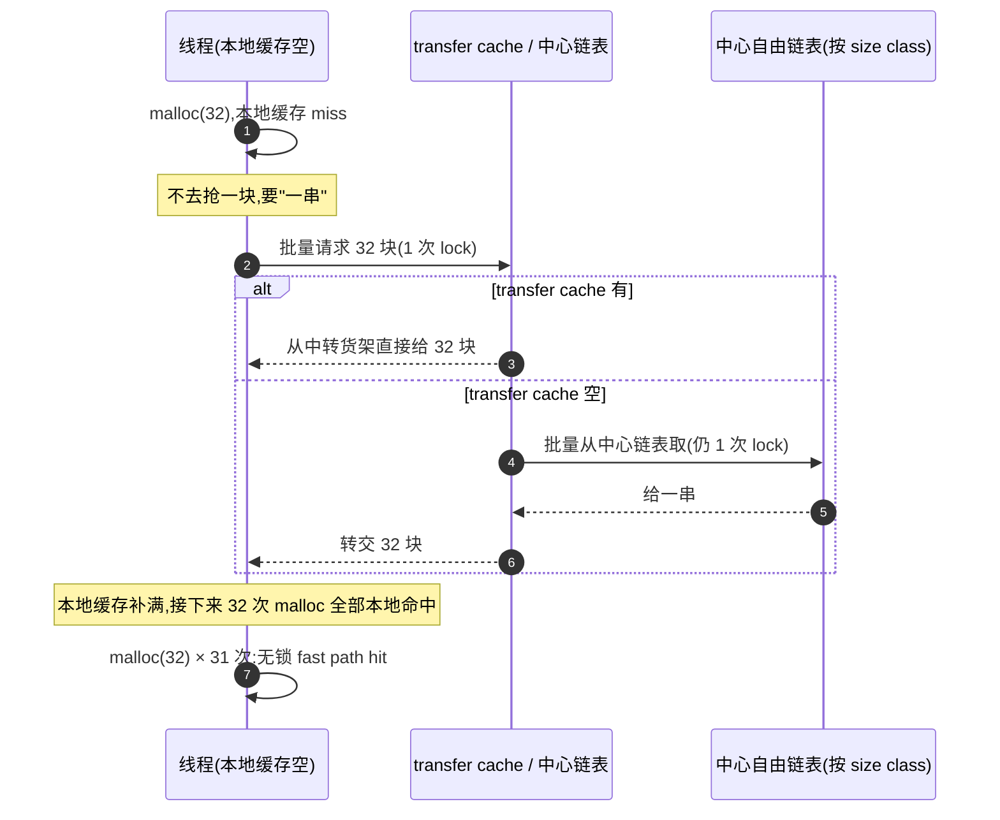

# 第六章 · 中心自由链表与 transfer cache:cache miss 后的批量取还

> 篇:P1 共通地基
> 主线呼应:上一章我们把 fast path 讲透了——每个线程/CPU 手边一份私有缓存,`malloc`/`free` 在那里**无锁、O(1)、纳秒级**地命中。但 fast path 只是个小货柜,装满了会溢、卖空了得补。这一章讲的是**衔接层**:当 fast path miss(本地缓存空了),去哪补货;当 fast path 满(本地缓存塞不下),把货退到哪。这一来一回,如果每次都一块一块地搬、都去抢同一把锁,那 fast path 省下的时间会全赔回去。所以这一层的关键词是**批量**:一次搬一串(几十块),把锁开销摊到每一块上;以及**直接流转**:一个线程退还的块,让另一个线程不经过页堆就直接拿走。这就是中心自由链表 + transfer cache 存在意义——它是 fast path 和 slow path 之间的桥,把"高频无锁"和"低频全局"两种节奏平滑接起来。

## 核心问题

**线程本地缓存空了(或满了)之后,怎么办?如果每次只去中心拿一块、退一块,锁争用会让 fast path 的优势荡然无存——那中心这一层到底是怎么把"被一堆线程高频访问"这件事,做得几乎不争用?**

读完本章你会明白:

1. **批量是中心层的灵魂**:一次向中心链表取/还一串(常是 32 量级),把一次锁的开销**摊到几十块**上,平均到每块的锁成本被压到原来几十之一。
2. **中心自由链表按 size class 组织**:每个 size class 一条中心链表、一把锁,天然按型号分流,不同 size class 的线程互不干扰。
3. **transfer cache 是"直接流转"的缓存层**:一个线程退还的一串块,先停在 transfer cache,另一个线程来取时直接从这里拿走,**不必退到页堆再切页**——这把"线程间流转"做成了 O(1) 的本地操作。
4. **tcmalloc 的 transfer cache 是栈式 LIFO** + `low_water_mark` 驱动的回收:刚回收的优先给出(缓存友好),长期没人要的批量退回中心链表。
5. **四套的对照**:tcmalloc(transfer cache + central freelist)、jemalloc(bin + cache_bin 的 fill/flush)、mimalloc(page 内 free list + 跨线程 delayed free)、ptmalloc(fastbin→smallbin 的批量迁移)——同一个"批量衔接"问题,四套给出了不同粒度的答案。

> **如果一读觉得太难**:先只记住三件事——① 中心层是"批发层",一次搬一串(不是一块),这是它不卡的根;② transfer cache 是线程间的"中转货架",让一个线程的垃圾直接成为另一个线程的宝贝;③ 中心层 miss(自己也空了)才下沉到页堆(下一章)。抓住这三点,本章就通了。

---

## 6.1 一句话点破

> **本地缓存是零售柜台,中心自由链表是按型号分区的批发仓库;两者之间不能一块一块地搬(锁会被抢爆),得**一次搬一串**,把一次锁的开销摊薄到一整批上。transfer cache 再在这条搬运路上加一个**中转货架**:一个线程退还的整串块,在货架上等一下,另一个线程来取时直接端走,根本不必退到页堆——这就是"线程间直接流转"的力量。**

这是结论,不是理由。本章倒过来拆:先看"miss 一次只去中心拿一块"为什么不行,再看批量是怎么把锁开销摊薄的,再看 transfer cache 怎么把"退"和"取"这两条本来相反的流直接接上,最后四套对照。

---

## 6.2 miss 一次只去中心拿一块,会怎样

上一章我们立起了 fast path:线程本地缓存(tcache / per-CPU cache / mimalloc 的 heap-local page)里 pop 一块,无锁、纳秒级。但本地缓存是**有容量上限的小货柜**——

- 某个 size class 的本地缓存卖空了(比如线程一直在 `malloc(32)`,32 字节这一格被掏空),下一个 `malloc(32)` 就 miss;
- 某个 size class 的本地缓存塞满了(比如线程一直在 `free(32)`,退还的块把这格塞爆),下一个 `free(32)` 也"miss"(没地方放)。

miss 之后必须去**中心层**补货或退货。那最朴素的方案是什么?

**朴素方案:miss 一次,去中心拿一块;多一块,去中心退一块。**

听起来天经地义,一算就崩。中心自由链表是**全局共享的**(同一 size class 的所有线程共用一条中心链表、一把锁)。如果每个线程 miss 一次都去抢这把锁、只取一块:

```
线程 A: lock → pop 1 块 → unlock
线程 B: lock → pop 1 块 → unlock
线程 C: lock → pop 1 块 → unlock
... (几十个线程同时在抢同一把锁)
```

锁是**串行化**的——同一时刻只有一个线程能持有它。几十个线程抢一把锁,大部分时间花在**等锁**和**缓存行失效**(锁变量在核之间来回弹)上。我们上一章千辛万苦把 fast path 做成无锁纳秒级,结果 miss 一次去中心抢锁要几百纳秒甚至微秒——fast path 省下的钱全赔回去了。

> **不这样会怎样**:做个粗算。假设一个 size class 的中心链表锁,在 32 核机器上被 32 个线程同时抢。一次 lock/unlock(无争用)约 20~40ns,但**有争用**时一次锁操作常涨到几百纳秒甚至 1µs(因为要等对方释放、要刷新对方的缓存行)。如果每个线程每次 miss 都去抢这把锁拿一块,锁争用会让中心层成为**新瓶颈**——和 ptmalloc 的 arena 锁一个量级,白瞎了 fast path。

这就是为什么所有现代分配器在这一层都不约而同地选择了同一个策略:**批量**。

---

## 6.3 批量:把一次锁的开销摊到一整批上

> **所以这样设计**:miss 之后,不是去中心拿一块,而是**一次拿一串**(几十块),把本地缓存补到半满;退货也不是一块一块退,而是一次退一串。这一串有多大?通常是 size class 相关的一个常数,叫 **`num_objects_to_move`**(tcmalloc 的术语,jemalloc 叫 `ncached_max`,ptmalloc 里 fastbin 是单链但 `malloc_consolidate` 一次搬空一整条)。

这个"一次搬一串"为什么这么关键?用一张表算清:

| 方案 | miss 一次的锁操作 | 拿到的块 | 平均每块的锁成本 |
|------|------------------|----------|------------------|
| 拿一块 | 1 次 lock/unlock | 1 块 | 1×(几百 ns) |
| 拿一串(32 块) | 1 次 lock/unlock | 32 块 | **1/32×**(十几 ns) |

**一次锁的开销被 32 块平摊**,平均每块的锁成本从几百纳秒压到十几纳秒——和 fast path 的无锁 pop 在同一数量级。这就是"批量"的魔力:它没有让锁变快,而是**让锁出现的频率降了一个数量级**。本地缓存补满一次,能撑过接下来几十次 `malloc` 的 fast path hit,锁在下几十次分配里**根本不出现**。



> **钉死这件事**:中心层的批量,不是"优化",是**必需**。没有批量,fast path 省下的时间会被中心锁的争用吃光。批量的本质,是**把"高频访问全局资源"这件事的频率强行压低一个数量级**——本地缓存命中是纳秒级(最频繁),批量补货是偶尔(中频,几十次分配才一次),页堆切页是罕见(低频)。频率逐层下降,锁争用逐层减轻。这正是三层快慢道"分频率"哲学的体现。

那这个"一串"到底多大?它是怎么定的?

### 一串多大:`num_objects_to_move`

tcmalloc 给每个 size class 算一个**批量大小** `num_objects_to_move`,存在 sizemap 里。看源码:[sizemap.cc:160-166](../tcmalloc/tcmalloc/sizemap.cc#L160-L166):

```cpp
// sizemap.cc:160 —— 初始化每个 size class 的 num_objects_to_move
num_objects_to_move_[0] = 0;
...
num_objects_to_move_[curr] = size_classes[c].num_to_move;  // L166
```

这个值通常在 **2 ~ 32** 之间(tcmalloc 经典 size class 表里常见值是 32 量级,小块更大、大块更小)。定多大是个权衡:

- **太大**:一次搬太多,本地缓存要装更多(占内存),且如果线程只用一两块就退出,剩下的全浪费(占用膨胀);
- **太小**:批量摊薄锁的效果打折,锁争用又冒头。

tcmalloc 的经验值是**让一次批量大致对应"一段连续的缓存行友好访问"**——既够大能摊薄锁,又不太大不至于让本地缓存膨胀。jemalloc 走类似的思路(后面会看到 `ncached_max >> lg_fill_div`),ptmalloc 的 fastbin 是单链表(一次取一块),但它有 `malloc_consolidate` 把整条 fastbin 一次性清空——也是一种"批量"。

---

## 6.4 中心自由链表:按 size class 分区,一把锁护一条

讲到这里,中心自由链表的轮廓清楚了:**全局共享**,但**按 size class 分区**——每个 size class 一条独立链表、一把独立锁。这样一个 size class 的争用不会污染另一个 size class:

```
size class 0  (8B)   ──→  [中心链表 0]  锁 0
size class 1  (16B)  ──→  [中心链表 1]  锁 1
size class 2  (32B)  ──→  [中心链表 2]  锁 2
...
size class N  (...)   ──→  [中心链表 N]  锁 N
```

线程要 32 字节的块,只去锁 2 那排队,跟要 64 字节的线程(锁 3)**完全不抢锁**。这是天然的**按型号分流**,把锁争用摊到了几十个 size class 上。

我们看 tcmalloc 的 `CentralFreeList` 是怎么组织的——[central_freelist.h:145](../tcmalloc/tcmalloc/central_freelist.h#L145):

```cpp
// central_freelist.h:145 —— 每个 size class 一个 CentralFreeList 实例
class CentralFreeList {
  ...
  // 按 span 的"活跃度"分桶,索引空闲 span(HintedTrackerLists)
  HintedTrackerLists<Span, kNumListsTotal> nonempty_ ABSL_GUARDED_BY(lock_);
  ...
};
```

注意它护着一把锁(`lock_`),里面装的是 **span**(连续页,下一章详讲)的列表 `nonempty_`,每个 span 内部又有自己的对象自由链表。`CentralFreeList` 是**按 size class 实例化**的——tcmalloc 全局有 ~88 个 size class,就有 ~88 个 `CentralFreeList` 实例,各把各的锁。

### RemoveRange:批量从中心链表取一串

线程 miss 后,transfer cache 会调 `CentralFreeList::RemoveRange(batch)`,一次取 `batch.size()` 块(就是 `num_objects_to_move`)。看实现 [central_freelist.h:601-671](../tcmalloc/tcmalloc/central_freelist.h#L601-L671):

```cpp
// central_freelist.h:601 —— 从中心链表批量取
template <class Forwarder>
inline int CentralFreeList<Forwarder>::RemoveRange(absl::Span<void*> batch) {
  TC_ASSERT(!batch.empty());
  int result = 0;

  if (ABSL_PREDICT_FALSE(objects_per_span_ == 1)) {
    // 一个 span 只放一个对象(大块),跳过中心链表直接要 span
    Span* span = AllocateSpan();
    if (ABSL_PREDICT_TRUE(span != nullptr)) {
      batch[0] = span->start_address();
      result = 1;
    }
  } else {
    size_t num_spans = 0;
    CentralFreeListLockHolder h(lock_);                    // L619 —— 持锁

    do {
      num_spans++;
      Span* span = FirstNonEmptySpan();                    // L623 —— 找一个非空 span
      if (ABSL_PREDICT_FALSE(!span)) {
        result += Populate(batch.subspan(result));          // L625 —— 中心也空,去页堆切(下一章)
        break;
      }
      // 从这个 span 的自由链表里批量 pop
      int here = span->FreelistPopBatch(batch.subspan(result), object_size);  // L632
      TC_CHECK_GT(here, 0, "Failed to make progress.  Freelist corrupted?");
      ...
      result += here;
    } while (result < batch.size());                       // L660 —— 不够继续从下一个 span 取
    ...
  }
  ...
  return result;
}
```

两个细节:

1. **第 619 行 `CentralFreeListLockHolder h(lock_)`**——整个批量取的过程,**只持一次锁**。无论这次要取多少块(1 块还是 32 块),锁的获取/释放只有一次。这就是"批量摊薄锁"的字面实现。
2. **第 632 行 `FreelistPopBatch`**——从单个 span 的自由链表里**批量 pop**,而不是一块一块 pop。这进一步减少了 span 内部的操作开销。
3. **第 625 行 `Populate`**——如果中心链表也空了(`FirstNonEmptySpan()` 返回 null),下沉到页堆切新 span。这就是下一章要讲的"中心 miss → 页堆"。注意 `Populate` 之前会 `lock_.unlock()`(见 [central_freelist.h:679](../tcmalloc/tcmalloc/central_freelist.h#L679)),因为页堆有自己的锁,不能嵌套持锁(否则死锁风险)。

### InsertRange:批量退回中心链表

回收是对称的——`free` 把块攒在本地缓存,攒到一批,一次性退回中心。`CentralFreeList::InsertRange(batch)` 在 [central_freelist.h:519-583](../tcmalloc/tcmalloc/central_freelist.h#L519-L583):

```cpp
// central_freelist.h:519 —— 批量退回中心链表
template <class Forwarder>
inline void CentralFreeList<Forwarder>::InsertRange(absl::Span<void*> batch) {
  TC_CHECK(!batch.empty());
  TC_CHECK_LE(batch.size(), kMaxObjectsToMove);

  Span* spans[kMaxObjectsToMove];
  // 先在锁外把对象映射到所属 span(减少临界区)
  forwarder_.MapObjectsToSpans(batch, spans, size_class_);    // L529
  ...
  Span** free_spans = spans;
  int free_count = 0;

  {
    CentralFreeListLockHolder h(lock_);                        // L560 —— 持锁
    for (int i = 0; i < batch.size(); ++i) {
      // 把每块推回它所属 span 的自由链表
      Span* span = ReleaseToSpans(b, spans[i], object_size, size_reciprocal);  // L568
      if (ABSL_PREDICT_FALSE(span)) {                          // span 满了,整个归还页堆
        free_spans[free_count] = span;
        free_count++;
      }
    }
    ...
  }

  if (ABSL_PREDICT_FALSE(free_count)) {
    DeallocateSpans(absl::MakeSpan(free_spans, free_count));   // L581 —— 退满的 span 给页堆
  }
}
```

注意一个**性能技巧**:[central_freelist.h:529](../tcmalloc/tcmalloc/central_freelist.h#L529) 的 `MapObjectsToSpans` 在**锁外**执行——把"指针 → 所属 span"的反查(下一章 pagemap 详讲)放到锁外做,锁内只做轻量的链表 push。这把临界区压到最短,锁争用更轻。这是分配器代码里反复出现的模式:**锁外做能做的,锁内只做必须的**。

> **钉死这件事**:`CentralFreeList::RemoveRange`/`InsertRange` 是中心层的"批发进出"接口,它们的共同特征是 **一次持锁、批量搬运**。这一层把锁争用从"每块一次"压到"每批一次",批大小 `num_objects_to_move` 通常 32 量级,锁开销被摊到原来的 1/32。

---

## 6.5 transfer cache:让一个线程的退货成为另一个线程的现货

中心自由链表解决了"批量补货/退货"的问题,但还有一个低效点:**退和取走了两趟冤枉路**。

想象这个场景:

- 线程 A 一直在 `free(32)`,本地缓存塞满后,批量退了 32 块给中心链表——这 32 块被推回各自的 span;
- 线程 B 一直在 `malloc(32)`,本地缓存空了,去中心链表批量取——又从 span 里 pop 出来。

问题是,A 退的这 32 块,**刚刚就是 B 想要的**。但它们走了 **A → 中心链表(span)→ B** 这条路,中间隔着 span 的 push/pop 开销。能不能让 A 退的这串,**直接被 B 拿走**,根本不进 span?

这就是 **transfer cache(中转缓存)** 的用武之地。它在中心自由链表之上再叠一层"中转货架":

```
线程 A free 攒满 ──→  transfer cache(中转货架)  ──→ 线程 B malloc 批量取
                        (按 size class 一格)
                         ↑ miss 才下沉 ↓
                   CentralFreeList(中心链表 / span)
```

- 线程 A 退一串:先扔到 transfer cache 的对应格子;
- 线程 B 来取一串:先看 transfer cache 的格子,**有就直接端走**(命中),根本不碰 `CentralFreeList`;
- 只有 transfer cache 也空了,才下沉到 `CentralFreeList`(中心链表 → span);
- 只有 transfer cache 也满了,才把多余的一串下推到 `CentralFreeList`。

> **点睛比喻**(只在讲"线程间流转"时点一次):中心自由链表是按型号分区的**批发仓库**,transfer cache 是仓库门口的**中转货架**。工人 A 退一箱零件,先搁在货架上;工人 B 来领一箱,直接从货架上端走——**零件根本不必进仓库又出仓库**。只有货架空了 B 才进仓库找,货架满了 A 才往仓库里塞。这个货架让"线程间流转"变成 O(1) 的本地操作,绕开了仓库(中心链表)的锁。

我们看 tcmalloc transfer cache 的源码(新版在 `transfer_cache_internals.h`,经典版在 `transfer_cache.h`)。先看它的核心数据结构和批量接口 [transfer_cache_internals.h:79-83](../tcmalloc/tcmalloc/transfer_cache_internals.h#L79-L83):

```cpp
// transfer_cache_internals.h:79 —— TransferCache 缓存 size class 的批量流转
// TransferCache is used to cache transfers of
// sizemap.num_objects_to_move(size_class) back and forth between
// thread caches and the central cache for a given size class.
template <typename CentralFreeList, typename TransferCacheManager>
class TransferCache {
  ...
};
```

它对每个 size class 维护一个**槽位数组** `slots_`,以及一个记录已用槽数的 `info.used`(原子读,锁内写)。InsertRange(线程退一串)和 RemoveRange(线程取一串)的 fast path 都是这个数组的栈式操作。看 InsertRange [transfer_cache_internals.h:152-180](../tcmalloc/tcmalloc/transfer_cache_internals.h#L152-L180):

```cpp
// transfer_cache_internals.h:152 —— 往 transfer cache 推一串(线程批量 free)
void InsertRange(int size_class, absl::Span<void* absl_nonnull> batch)
    ABSL_LOCKS_EXCLUDED(lock_) {
  const int N = batch.size();
  ...
  auto info = slot_info_.load(std::memory_order_relaxed);
  if (info.capacity > info.used) {                    // L157 —— fast path:有空槽
    AllocationGuardSpinLockHolder h(lock_);
    info = slot_info_.load(std::memory_order_relaxed);
    int got = std::min(N, info.capacity - info.used);
    if (got > 0) {
      info.used += got;                               // L164 —— 栈顶往上推
      SetSlotInfo(info);
      void** entry = GetSlot(info.used - got);        // L166 —— 放到 [used-got, used)
      memcpy(entry, batch.data(), sizeof(void*) * got);  // L167
      insert_hits_.LossyAdd(1);
      if (got == N) {
        return;                                       // L170 —— 全装下,直接返回(命中!)
      }
      batch = {batch.data() + got, batch.size() - got};
    }
  }
  // fast path miss(装不下),下沉到 CentralFreeList
  insert_misses_.LossyAdd(1);
  freelist().InsertRange(batch);                      // L179
}
```

RemoveRange 是对称的 [transfer_cache_internals.h:184-209](../tcmalloc/tcmalloc/transfer_cache_internals.h#L184-L209):

```cpp
// transfer_cache_internals.h:184 —— 从 transfer cache 取一串(线程批量 malloc)
[[nodiscard]] int RemoveRange(int size_class, const absl::Span<void*> batch)
    ABSL_LOCKS_EXCLUDED(lock_) {
  ...
  auto info = slot_info_.load(std::memory_order_relaxed);
  if (info.used) {                                    // L189 —— fast path:货架上有
    AllocationGuardSpinLockHolder h(lock_);
    info = slot_info_.load(std::memory_order_relaxed);
    int got = std::min<int>(batch.size(), info.used);
    if (got) {
      info.used -= got;                               // L195 —— 栈顶往下收
      SetSlotInfo(info);
      void** entry = GetSlot(info.used);              // L197 —— 从 [used, used+got) 取
      memcpy(batch.data(), entry, sizeof(void*) * got);  // L198
      ...
      low_water_mark_ = std::min(low_water_mark_, info.used);  // L201 —— 记录低水位
      return got;                                     // L202 —— 命中,直接给!
    }
  }
  // fast path miss(货架空),下沉到 CentralFreeList
  remove_misses_.LossyAdd(1);
  return freelist().RemoveRange(batch);               // L208
}
```

两个关键观察:

1. **栈式 LIFO 语义**:InsertRange 把 batch 放到 `slots_[used..used+N]`(栈顶往上),RemoveRange 从 `slots_[used-N..used]` 取(栈顶往下)。这意味着**刚被某个线程推入的块,会最先被下一个线程取走**——这是 LIFO(Last In First Out)。LIFO 的好处是**缓存友好**:刚推入的块还在 CPU cache 里,马上被取走用,热乎着;如果是 FIFO,块可能在 cache 里被挤出去了,取走时还要重新从内存读。
2. **fast path 命中时,锁是 SpinLock 且临界区极短**(一次 `memcpy` 几十字节)。因为 transfer cache 是**按 size class 一格**的,同一 size class 的争用分散到了 transfer cache 的 SpinLock + 后面的 sharded transfer cache(见 6.7)。transfer cache 这一层把"线程间流转"做成了**一次极短的 SpinLock + memcpy**,绕开了 `CentralFreeList` 那把更重的锁。

> **不这样会怎样**:假设没有 transfer cache,线程 A 退的 32 块全推回 `CentralFreeList` 的 span(持 `CentralFreeList::lock_`),线程 B 再从 span pop(又持 `CentralFreeList::lock_`)。两个线程抢同一把较重的锁,且 span 的 push/pop 有额外开销(更新 span 的 bitmap、allocated 计数等)。有了 transfer cache,A 和 B 大概率走的是 transfer cache 的 SpinLock(更轻、临界区更短),`CentralFreeList::lock_` 根本不被碰——争用被"吸收"在 transfer cache 这一层。

### `low_water_mark`:让"长期没人要的"退回去

transfer cache 有个妙设计:`low_water_mark_`(低水位)。每次 RemoveRange 命中,会更新它 [transfer_cache_internals.h:201](../tcmalloc/tcmalloc/transfer_cache_internals.h#L201):

```cpp
low_water_mark_ = std::min(low_water_mark_, info.used);
```

它记录的是"自上次清理以来,transfer cache 里最少剩了多少块"。如果一个 size class 的 transfer cache 一直被取走很多、推入很少,那 `low_water_mark` 会很低——说明**有积压**(线程退的比取的多,长期没人要)。这时 `TryPlunder`([transfer_cache_internals.h:214-244](../tcmalloc/tcmalloc/transfer_cache_internals.h#L214-L244))会把低于低水位的块**批量退回 `CentralFreeList`**,腾出 transfer cache 的槽位(也释放内存压力):

```cpp
// transfer_cache_internals.h:214 —— 清理长期不用的积压(简化示意)
void TryPlunder(int size_class) ABSL_LOCKS_EXCLUDED(lock_) {
  ...
  int to_return = low_water_mark_;                    // L218 —— 要退回的就是低水位以下
  ...
  while (true) {
    const int B = Manager::num_objects_to_move(size_class);
    const size_t num_to_move = std::min({B, info.used, to_return});  // L228
    if (num_to_move == 0) break;
    // 从栈底搬一串到 CentralFreeList
    ...
    freelist().InsertRange({buf, num_to_move});       // L240
    ...
  }
}
```

这是一个**自适应清理**:transfer cache 不是只进不出的黑洞,它通过 `low_water_mark` 识别"哪些块真的没人要",把积压退回中心层(再由中心层退回页堆,最终 `madvise` 给 OS)。这把"线程间流转的快"和"内存不积压的省"平衡起来——本章的 transfer cache 服务"快",`low_water_mark` + `TryPlunder` 服务"省"。

---

## 6.6 四套对照:同一个"批量衔接"问题,四种答法

中心层 + 批量衔接是所有现代分配器的共通结构,但四套的实现路径不同。一张表先扫全局:

| 维度 | tcmalloc | jemalloc | mimalloc | ptmalloc(baseline) |
|------|----------|----------|----------|----------|
| **中心层叫法** | `CentralFreeList`(每 size class 一个) | arena 的 `bin`(每 size class 一个) | segment 里的 `page` | arena 的 `fastbin`/`smallbin` |
| **批量取的单位** | `num_objects_to_move`(2~32) | `ncached_max >> lg_fill_div` | 一个 page 的整条 free list | fastbin 单链(consolidate 一次清空) |
| **中转流转层** | **transfer cache**(栈式 LIFO + sharded) | **cache_bin 的 fill/flush**(无独立中转层) | **delayed free list**(跨线程原子累积) | **无**(退直接进 fastbin) |
| **批量退回触发** | 本地缓存满 + `TryPlunder` | `cache_bin` 满(low_water 驱动 flush) | page 用尽 / heap collect | fastbin 计数达阈值 → consolidate |
| **下沉到页堆** | `CentralFreeList::Populate` → span | `arena_slab_alloc` → extent/pa | `mi_page_queue_find_free_ex` → 新 segment | top chunk 扩展 / `sysmalloc` |

下面挨个拆。

### tcmalloc:transfer cache 是显式的一层

tcmalloc 是把 transfer cache 做成**显式独立层**的典范。本地缓存(per-CPU `CpuCache`,新版)miss 后,先问 transfer cache;transfer cache miss 才问 `CentralFreeList`;`CentralFreeList` 也空才 `Populate` 切 span(下一章)。三层各一把锁,逐层 fallback:

```
CpuCache miss ──→ transfer cache(轻 SpinLock + 栈式数组)
                     │ miss
                     ▼
                  CentralFreeList(锁 + nonempty_ span 列表)
                     │ miss (FirstNonEmptySpan null)
                     ▼
                  Populate → page_allocator.New()(页堆,下一章)
```

transfer cache 的入口在 [transfer_cache.h:438-443](../tcmalloc/tcmalloc/transfer_cache.h#L438-L443):

```cpp
// transfer_cache.h:438 —— TransferCacheManager 转发给对应 size class 的 TransferCache
void InsertRange(int size_class, absl::Span<void*> batch) {
  cache_[size_class].tc.InsertRange(size_class, batch);   // L439
}
[[nodiscard]] int RemoveRange(int size_class, absl::Span<void*> batch) {
  return cache_[size_class].tc.RemoveRange(size_class, batch);  // L443
}
```

每个 size class 一个 `TransferCache` 实例(`cache_[size_class]`),各把各的 SpinLock,互不干扰。

### jemalloc:bin 是中心层,cache_bin 的 fill/flush 做批量

jemalloc 的中心层是 arena 的 **`bin`**——每个 arena、每个 size class 一个 `bin`,各一把锁。它**没有 tcmalloc 那种独立的 transfer cache 层**,而是把"批量衔接"做在 tcache 的 `cache_bin` 的 **fill(回填)** 和 **flush(冲洗)** 操作里。

`cache_bin` 是 jemalloc 的线程本地缓存单元(对应 tcmalloc 的 CpuCache 里的一格),内部是一个**向下生长的栈**(`stack_head` 往低地址推)。当 `cache_bin` 空(malloc miss),调 `tcache_alloc_small_hard` 批量回填,看 [tcache.c:577-610](../jemalloc/src/tcache.c#L577-L610):

```c
// tcache.c:577 —— cache_bin 空了,向 arena 的 bin 批量回填
void *
tcache_alloc_small_hard(tsdn_t *tsdn, arena_t *arena, tcache_t *tcache,
    cache_bin_t *cache_bin, szind_t binind, bool *tcache_success) {
  ...
  // 批量大小 = ncached_max >> lg_fill_div(默认回填一半)
  cache_bin_sz_t nfill = cache_bin_ncached_max_get(cache_bin)
      >> tcache_nfill_small_lg_div_get(tcache_slow, binind);   // L586-587
  if (nfill == 0) {
    nfill = 1;
  }
  ...
  // 向 arena 的 bin 批量取(底层是 arena_ptr_array_fill_small,从 slab 拿)
  cache_bin_sz_t filled = arena_ptr_array_fill_small(tsdn, arena, binind,
      &ptrs, /* nfill_min */ nfill_min, /* nfill_max */ nfill_max,
      cache_bin->tstats);                                      // L598-600
  cache_bin_finish_fill(cache_bin, &ptrs, filled);             // L601
  ...
  ret = cache_bin_alloc(cache_bin, tcache_success);            // L607
  return ret;
}
```

注意第 586 行的批量大小算法 **`ncached_max >> lg_fill_div`**——`ncached_max` 是这一格 `cache_bin` 的最大容量,右移 `lg_fill_div` 位(默认除 2)就是要回填的数量。这是个**自适应批量**:jemalloc 会根据这一格的"命中/积压"情况动态调 `lg_fill_div`([tcache.c:184-200](../jemalloc/src/tcache.c#L184-L200) 的 `tcache_nfill_small_gc_update`),用得多就多填、用得少就少填——和 tcmalloc 的 `low_water_mark` 异曲同工,都是为了"批量摊薄锁"和"别让积压占内存"两手抓。

回填底层是 `arena_ptr_array_fill_small`([arena.c:954](../jemalloc/src/arena.c#L954)),它从 arena bin 的 **slab**(一种专门放小对象的 extent)里批量取指针——slab 内部用 bitmap 管理空闲槽位。jemalloc 的 slab ≈ tcmalloc 的"装小对象的 span"。

flush(退回)是对称的:`cache_bin` 满了,调 `tcache_bin_flush_bottom`([tcache.c:612-643](../jemalloc/src/tcache.c#L612-L643)),把栈底(最老)的一批指针批量退回 arena bin。这里有个 jemalloc 特有的设计——`cache_bin` 也维护**low_water**([cache_bin.h:343-377](../jemalloc/include/jemalloc/internal/cache_bin.h#L343-L377)),决定 flush 多少:低水位以下的才退(那些"长期没被用到"的),保留近期用过的。和 tcmalloc 的 `low_water_mark` 思路一致。

> **关键区别**:tcmalloc 有**独立的 transfer cache 层**,显式做"线程间直接流转";jemalloc **没有独立中转层**,而是让 `cache_bin` 的 fill 直接打 arena bin、flush 直接退 arena bin,通过"每个 arena 每 size class 一个 bin"的多路分流 + 自适应批量大小来控制争用。两种思路都能把锁争用压下去,tcmalloc 的 transfer cache 在"一个 size class 内线程很多"时更优(中转货架吸收流转),jemalloc 的多 arena 分流在"线程数很多"时更优(摊到多个 arena)。

### mimalloc:page 的 free list + delayed free

mimalloc 走的是**更简**的路:它没有 tcmalloc 那种独立 transfer cache,也没有 jemalloc 那种多 arena 分流。它的中心层就是 **segment 里的 page**——每个 page 属于一个 size class(由 `block_size` 决定),内部有一条**对象自由链表**。

线程的本地堆(`mi_heap_t`)为每个 size class 维护一个 **page queue**(page 链表),fast path 从队首 page 的自由链表 pop。当队首 page 空了,slow path 入口是 [_mi_malloc_generic](../mimalloc/src/page.c#L1021),它调 `mi_find_page` 找一个有空闲块的 page,核心是 `mi_page_queue_find_free_ex`([page.c:783](../mimalloc/src/page.c#L783)):

```c
// page.c:783 —— 在 page queue 里找一个有空闲块的 page(简化示意)
static mi_page_t* mi_page_queue_find_free_ex(mi_heap_t* heap, mi_page_queue_t* pq,
                                              bool first_try) {
  ...
  // 遍历 queue 里的 page,找到第一个有现货的
  for (each page in pq) {
    _mi_page_free_collect(page, false);    // L802 —— 先把"延迟 free"的块收集进自由链表
    if (page 有空闲) return page;
  }
  // 都没有,分配新 page(下沉到 segment,下一章)
  ...
}
```

注意第 802 行 `_mi_page_free_collect`——这是 mimalloc 的一个特色:别的线程 free 的块,不直接进这个 page 的自由链表(那样要抢 page 锁),而是扔进 page 的 **`thread_free` 延迟链**(原子操作),等这个 page 的归属线程下次访问时**批量收集**(`_mi_page_free_collect`)。这就是 mimalloc 的"**delayed free**"机制——它替代了 tcmalloc transfer cache 的角色,让跨线程 free 不抢锁、本地线程访问时一次性收割。看 `_mi_page_free_collect` 在 [page.c:247](../mimalloc/src/page.c#L247):

```c
// page.c:247 —— 把跨线程延迟 free 的块收集进自由链表(简化示意)
void _mi_page_free_collect(mi_page_t* page, bool force) {
  // 原子地把 thread_free 链整个 swap 出来
  mi_block_t* ts = _mi_atomic_swap(&page->thread_free, NULL);
  // 把这些块 push 进 page 的本地自由链表
  while (ts) {
    next = ts->next;
    mi_block_push(&page->free, ts);
    ts = next;
  }
}
```

这是一种**无锁累积 + 批量收割**的模式:跨线程 free 是原子 swap 进延迟链(O(1),无锁),本地线程收集时一次性把整条链端进自由链表(批量)。和 tcmalloc 的 transfer cache 解决的是同一个问题——"跨线程流转不抢锁",只是手段不同(tcmalloc 是共享中转货架,mimalloc 是单向延迟链 + 本地收割)。

### ptmalloc(baseline):fastbin→smallbin 的批量迁移

ptmalloc 的中心层是 arena 的 **bins**,按大小分**fastbin / smallbin / largebin / unsorted bin**。它的 fastbin 是单链表(一次取一块),但有个关键的**批量迁移**机制——当一次 `malloc` 的请求落在大块区间、或 fastbin 积压到一定程度,`_int_malloc` 会调 `malloc_consolidate`,**一次性把所有 fastbin 清空**,把里面的 chunk 合并、归入 smallbin/unsorted bin。看在线源 [malloc.c](https://github.com/glibc/glibc/blob/main/malloc/malloc.c) 的 `_int_malloc`(fastbin→smallbin 迁移段):

```c
// malloc.c:_int_malloc —— fastbin miss 后,合并并迁移(在线源,简化示意)
// 如果请求是小块,先查 fastbin(单链 pop 一块)
// fastbin 空,查 smallbin
// smallbin 也空,malloc_consolidate 把所有 fastbin 一次性清空、合并、归入 unsorted/smallbin
//   ↓
// 然后扫 unsorted bin,把 chunk 归入正确的 smallbin/largebin
```

`malloc_consolidate` 是 ptmalloc 的"批量"——它一次处理**整条 fastbin**(几十块),把这批 chunk 合并、归类。这和 tcmalloc 的"一次取 `num_objects_to_move` 块"在精神上是一致的(都是把高频小操作攒成低频批量),但 ptmalloc 的批量是**被动的**(只有特定条件触发 consolidate),而 tcmalloc/jemalloc 是**主动的**(每次 miss 都批量)。这也是 ptmalloc 作为 baseline 露怯的地方——它的 fastbin 默认是"一块一块取",批量只在 consolidate 时发生,日常分配的锁争用更频繁。

> **四套横评小结**:
> - **tcmalloc**:显式 transfer cache 层(栈式 LIFO + low_water_mark),线程间流转最优;
> - **jemalloc**:无独立中转层,靠多 arena 分流 + cache_bin 自适应批量(`lg_fill_div`);
> - **mimalloc**:无中转层,delayed free 原子链 + 本地批量收割,设计最简;
> - **ptmalloc**:fastbin 单链 + 被动 consolidate 批量,日常粒度最粗(baseline 反衬)。

---

## 6.7 技巧精解:批量怎么把锁摊薄 + transfer cache 的 LIFO 栈

这一章最硬的两个技巧:**① 批量摊薄锁开销**、**② transfer cache 的栈式 LIFO + low_water_mark 自适应清理**。我们分别配真实源码和反面对比拆透。

### 技巧一:批量 = 用一次锁搬 N 块,锁成本变 1/N

这个技巧的精髓不在"取 N 块"(那只是数组操作),而在 **锁的临界区只进入一次**。看 tcmalloc `CentralFreeList::RemoveRange` 的锁结构 [central_freelist.h:619-660](../tcmalloc/tcmalloc/central_freelist.h#L619-L660):

```cpp
CentralFreeListLockHolder h(lock_);                    // L619 —— 进锁(一次)
do {
  Span* span = FirstNonEmptySpan();
  ...
  int here = span->FreelistPopBatch(batch.subspan(result), object_size);  // L632
  result += here;
} while (result < batch.size());                       // L660 —— 循环取够 batch.size() 块
// h 析构,出锁(一次)
```

**整个 do-while 循环都在一次锁持有期内**。无论 `batch.size()` 是 8 块还是 32 块,锁的 lock/unlock 只发生一次。这就是"批量摊薄锁"的字面含义。

> **反面对比**:如果朴素地写——每次 miss 只取一块:

```cpp
// 朴素写法(反例,非源码)
void* RemoveOne() {
  CentralFreeListLockHolder h(lock_);     // 每次都进锁
  Span* span = FirstNonEmptySpan();
  return span->FreelistPop();              // 只 pop 一块
}                                          // 出锁
```

每块都要一次 lock/unlock。32 个线程并发,32 次 lock/unlock 抢一把锁,锁争用爆炸。对比批量版:32 块共用一次 lock/unlock,锁争用频率降 32 倍。**这就是批量的全部魔力——它没让锁变快,而是让锁被请求的频率降了一个数量级**。

这个技巧的关键约束是:**批量大小要选得刚好**。tcmalloc 用 `num_objects_to_move`(sizemap 里 size class 相关的常数,2~32),太小摊薄不够,太大本地缓存膨胀。jemalloc 用 `ncached_max >> lg_fill_div`,还动态调 `lg_fill_div`。选这个数是分配器调优的核心经验之一。

### 技巧二:transfer cache 的栈式 LIFO + low_water_mark

transfer cache 的 `slots_` 数组被当成**栈**来用:InsertRange 推入栈顶(`used` 增),RemoveRange 从栈顶取(`used` 减)。看这两处的对称操作 [transfer_cache_internals.h:164-198](../tcmalloc/tcmalloc/transfer_cache_internals.h#L164-L198):

```
InsertRange(推入 batch):
  slots_[used .. used+N]  ← batch        // 推到栈顶上方
  used += N

RemoveRange(取出 batch):
  batch ← slots_[used-N .. used]         // 从栈顶取
  used -= N

         栈方向(地址增高)  ↓
   ┌────┬────┬────┬────┬────┬────┐
   │ b1 │ b2 │ b3 │ b4 │ b5 │ b6 │   ← slots_ 数组
   └────┴────┴────┴────┴────┴────┘
                      ↑
                     used(栈顶)
   活跃区:[0, used),空闲区:[used, capacity)

   线程 A free 一串 → 推入 [used, used+N] → used += N(新块在栈顶)
   线程 B malloc 一串 → 从 [used-N, used) 取 → used -= N(刚推入的先被取走)
```

**栈式 LIFO 的好处是缓存友好**:线程 A 刚 `free` 的块,它的 cacheline 还热乎着(刚被 A 写过),线程 B 立刻 `malloc` 拿走,直接命中 cache。如果用 FIFO(先进先出),A 推入的块要等所有更早的块都被取走才轮到它,这时它的 cacheline 早被挤出去了,B 取走时要重新从内存读——慢一截。tcmalloc 在源码注释里也点明这一点 [transfer_cache.h:159](../tcmalloc/tcmalloc/transfer_cache.h#L159):

> "On platforms with less than three cache domains, the traditional LIFO transfer cache should suffice."

"traditional LIFO transfer cache"——LIFO 是 transfer cache 的经典策略,新版只在多 cache domain(NUMA)时才换成 sharded 版本(下面讲)。

> **反面对比**:如果 transfer cache 用 FIFO(队列,从另一端取):

```
FIFO(反例):
   push 端 → [b1, b2, b3, b4, b5] ← pop 端
   A 推入 b6 → [b1...b5, b6]      (b6 在队尾)
   B 取出   → b1(队首)            (b6 还在队尾,要等 b1-b5 都被取走才轮到 b6)
   问题:b6 的 cacheline 早就冷了,B 拿到时是 cache miss
```

LIFO 把"刚生产的"优先给"马上要消费的",缓存命中率更高。这是 transfer cache 选 LIFO 而非 FIFO 的根本理由。

**`low_water_mark` 解决 LIFO 的副作用**:LIFO 有个副作用——栈底的老块可能长期没人取(因为总从栈顶取),积压占内存。`low_water_mark` 记录"自上次清理以来的最低 used 值",`TryPlunder` 把低于低水位的块批量退回 `CentralFreeList`(再退页堆)。这是一个**自适应清理**:用得勤的 size class(used 一直高)不清理,用得少的(used 经常掉到很低)就清理积压。这平衡了"流转快"(LIFO)和"不积压"(plunder)。

### 进阶:sharded transfer cache(NUMA 友好)

新版 tcmalloc 还有个**sharded transfer cache**([transfer_cache.h:75-167](../tcmalloc/tcmalloc/transfer_cache.h#L75-L167)),在多 NUMA 节点(`l3_count > 1`)时启用。它把 transfer cache **按 L3 cache domain 分片**(`ShardedTransferCacheManagerBase`),每个分片一把锁,线程按当前 CPU 选分片:

```cpp
// transfer_cache.h:104 —— 按 L3 cache domain 数分片
static unsigned NumShards() { return CacheTopology::Instance().l3_count(); }
// transfer_cache.h:106 —— 按当前 CPU 选分片
static unsigned CpuShard(int cpu) { ... }
```

为什么?在 NUMA 机器上,一个全局 transfer cache 会让跨 NUMA 节点的线程抢同一把锁、且块的 cacheline 在节点间弹来弹去(贵)。分片后,每个 NUMA 节点有自己的 transfer cache,线程优先从本节点的分片取/退,**块和锁都局部化到节点内**。这是"批量摊薄锁"的进阶版——不仅把锁摊薄到每批,还把锁本身**按物理拓扑分片**,让锁争用和缓存一致性开销都最小化。注释 [transfer_cache.h:152-159](../tcmalloc/tcmalloc/transfer_cache.h#L152-L159) 说得很直白:只有多 cache domain 才值得用 sharded 版本,单节点用传统 LIFO transfer cache 就够了。

> **钉死这两个技巧**:① 批量 = 锁的临界区只进一次,搬 N 块,锁成本变 1/N——这是中心层不卡的根;② transfer cache 用栈式 LIFO 让"刚回收的优先给出"(缓存友好),用 `low_water_mark` + `TryPlunder` 把积压自适应退回——这是流转快和不积压的平衡。两个技巧合起来,把"一堆线程高频访问全局中心资源"这件本该灾难的事,做成了几乎不争用。

---

## 章末小结

这一章我们走完了 fast path miss 之后的那段路——**中心自由链表 + transfer cache**,它是 fast path(局部无锁)和 slow path(页堆批发)之间的**衔接层**。核心就两件事:**批量**(一次搬一串,把锁开销摊到每块)和**直接流转**(transfer cache 让一个线程的退货直接成为另一个线程的现货)。

> **点睛比喻回顾**:如果 fast path 是工人手边的零件盒(无秒拿),页堆是总仓库(整箱进货),那这一章讲的中心自由链表就是**车间中转货架**——工人补货/退货都先到这里,按型号分格,一次搬一串;transfer cache 是货架最前面的**快取层**,让一个工人刚搁下的零件,下一个工人直接端走,根本不必往货架深处翻。这个货架让"线程间流转"绕开了总仓库(页堆)的重锁。

本章服务二分法的**衔接**那一面——它既不完全属于"局部缓存"(它是全局共享的),也不完全属于"中心堆"(它的 transfer cache 在做准局部的流转)。它是两者之间的**桥**,把"高频无锁"和"低频全局"两种节奏平滑接起来。迷路时记住:这一层存在的全部理由,是**让 fast path miss 不要太疼**——批量让 miss 的代价被摊薄,transfer cache 让 miss 经常根本不必走到页堆。

### 五个"为什么"清单

1. **为什么 fast path miss 不能一块一块去中心拿?** 中心自由链表是全局共享的,每个 size class 一把锁。每次只拿一块 = 每次都抢锁,锁争用会让 fast path 省下的时间全赔光(几十个线程抢一把锁,锁开销涨到几百纳秒甚至微秒)。
2. **为什么中心层要"批量"?** 批量让一次 lock/unlock 搬运 N 块(常是 32 量级),锁成本被摊到原来的 1/N。它没让锁变快,而是让锁被请求的**频率**降了一个数量级。tcmalloc 的 `num_objects_to_move`、jemalloc 的 `ncached_max >> lg_fill_div`、ptmalloc 的 `malloc_consolidate` 都是批量。
3. **transfer cache 解决了什么?** 没有它,线程 A 退的块要进 `CentralFreeList` 的 span(持锁),线程 B 再从 span 取(又持锁)——两趟冤枉路抢同一把锁。transfer cache 是个"中转货架",A 退的串先放这,B 来取时直接端走,**根本不碰 `CentralFreeList`**。这把线程间流转做成了 O(1) 的本地操作。
4. **transfer cache 为什么是 LIFO?** LIFO(栈式)让"刚回收的"优先给出——这些块的 cacheline 还热乎着(刚被退回的线程写过),取走的线程立刻命中 cache。FIFO 会让块在队列里等到 cacheline 冷掉,慢一截。tcmalloc 用 `slots_` 数组当栈实现 LIFO。
5. **`low_water_mark` 干嘛的?** 防止 transfer cache 变成"只进不出的黑洞"。它记录最低 used 值,`TryPlunder` 把长期没人要的积压(低于低水位的)批量退回 `CentralFreeList` → 页堆 → OS。这平衡了"流转快"(LIFO 多留)和"不积压"(plunder 退回)。jemalloc 的 cache_bin low_water 异曲同工。

### 想继续深入往哪钻

- **tcmalloc transfer cache**:读 [transfer_cache_internals.h:79-340](../tcmalloc/tcmalloc/transfer_cache_internals.h#L79-L340) 的 `TransferCache` 模板,重点看 `InsertRange`/`RemoveRange`/`TryPlunder` 三个方法和 `low_water_mark_` 的用法;sharded 版本读 [transfer_cache.h:75-418](../tcmalloc/tcmalloc/transfer_cache.h#L75-L418)。
- **tcmalloc central freelist**:读 [central_freelist.h:145-380](../tcmalloc/tcmalloc/central_freelist.h#L145-L380) 的 `CentralFreeList` 类,重点看 `nonempty_`(HintedTrackerLists)怎么按 span 活跃度分桶索引——这是个减少锁内扫描的优化。
- **jemalloc**:读 [tcache.c:577-610](../jemalloc/src/tcache.c#L577-L610) 的 `tcache_alloc_small_hard`(回填)、[tcache.c:612-643](../jemalloc/src/tcache.c#L612-L643) 的 `tcache_bin_flush_bottom`(退回),以及 [cache_bin.h](../jemalloc/include/jemalloc/internal/cache_bin.h) 的 low_water 机制(343-377 行)。
- **mimalloc**:读 [page.c:247](../mimalloc/src/page.c#L247) 的 `_mi_page_free_collect`(delayed free 收割)、[page.c:783](../mimalloc/src/page.c#L783) 的 `mi_page_queue_find_free_ex`(找有空闲的 page),感受"无独立中转层"的设计。
- **ptmalloc**:读在线 [malloc.c](https://github.com/glibc/glibc/blob/main/malloc/malloc.c) 的 `_int_malloc`(fastbin→smallbin→`malloc_consolidate`→unsorted 扫描)和 `malloc_consolidate`,看它"被动批量"和 tcmalloc/jemalloc"主动批量"的区别。
- **调参感受**:tcmalloc 的 `--tcmalloc_max_transfer_cache_overhead`、jemalloc 的 `lg_tcache_max` / `lg_tcache_flush_small_div`(见 [tcache.c:69](../jemalloc/src/tcache.c#L69)),可以调批量大小和 flush 策略,实测对吞吐和 RSS 的影响。

### 引出下一章

中心自由链表也不是凭空有块可取——`CentralFreeList::RemoveRange` 在 `FirstNonEmptySpan()` 返回 null 时(中心也空了),会调 `Populate`,**去页堆切一个新的 span**(连续 N 页)。这个 span 是怎么从 OS 要来的、怎么按页管理、怎么被 `free(p)` 时通过指针反查到?这就是下一章的主题——**页、span、extent:内存按页管理**。我们从中心链表的下沉点(`Populate` → `AllocateSpan` → `page_allocator.New`)接过去,正式进入第 2 篇:页堆,批量向系统要内存。
