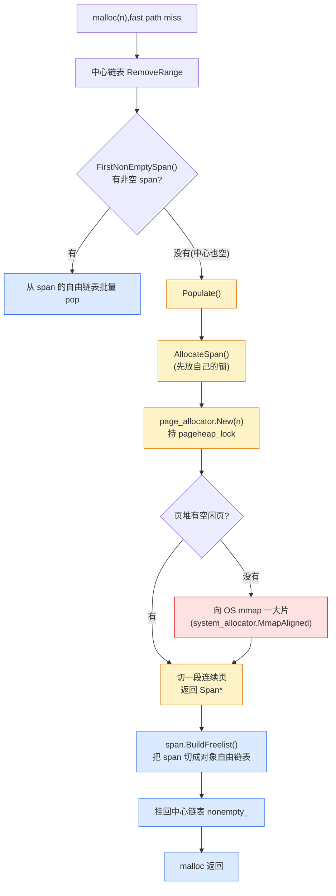

# 第七章 · 页、span、extent:内存按页管理

> 篇:P2 页堆:批量向系统要内存
> 主线呼应:上一章讲完了**衔接层**——中心自由链表 + transfer cache。当 fast path(本地缓存)miss,中心链表会**一次搬一串**(批量),把锁开销摊薄。但中心链表也不是凭空有货:`CentralFreeList::RemoveRange` 在 `FirstNonEmptySpan()` 返回空时(中心自己也空了),会调 `Populate`,**去页堆切一个新的 span**(连续 N 页)。从这一章起,我们正式进入 slow path 的下半段——**页堆**:它负责向 OS **整批进货**(mmap)、把大块内存切成可分配单位、管合并、管归还。这一章先解决第一个问题:**怎么把"一整批连续页"建模成一个可分配单位**——tcmalloc 叫它 `Span`,jemalloc 叫它 `edata_t`(extent),mimalloc 叫它 segment 里的 page(由连续 slice 组成)。这个建模的精妙之处在于:**一个对象记两个数(起点 + 长度),切分和合并就都成了 O(1) 的纯算术**。

## 核心问题

**中心链表空了,得去页堆要"一整批连续页"。但 OS 给的内存是一大片(几 MB),怎么把它组织成"可分配单位"——既能整块给大请求,又能切成小块塞进中心链表?而且 `free(p)` 时,只给一个指针,怎么知道这块内存归哪个单位管、有多大?**

读完本章你会明白:

1. **为什么是"连续页 + 长度"建模**:用 `(起始页, 页数)` 两个数,就能把任意大小的一块连续内存表达成一个对象;切分(Split)是 `(p, n) → (p, k) + (p+k, n-k)`,合并(Join/Merge)是相邻两个 `(p,n)` + `(p+n, m) → (p, n+m)`,**全是 O(1) 的整数算术,不碰任何位图**。
2. **四套各自叫什么、怎么存**:tcmalloc 的 `Span`(`first_page_` 位域 + `num_pages`)、jemalloc 的 `edata_t`(`e_addr` + `e_size_esn` + `e_bits` 里的 state)、mimalloc 的 `mi_segment_t` 切成 `slices[]`、ptmalloc 的 chunk(每块带 header)对照。
3. **为什么不用位图**(朴素方案的死穴):如果"每页一个独立对象"或"每页一个 bit 标记归属",metadata 会爆炸、反查会变慢、合并要扫整张表——这些痛点逼出了"连续页 + 长度"这个简洁抽象。
4. **新版 tcmalloc 的演化**:经典 PageHeap 在 span 粒度做 Split/Merge;新版 **HPAA**(HugePageAwareAllocator)把切并粒度**上移到 huge page(2MB)**——`HugeRange` 的 `Split`/`Join` 仍是 O(1) 纯函数,概念没变,只是管理单位更大,为了治碎片和 TLB。这是当代分配器的一个**代差**。
5. **`free(p)` 怎么反查**:本章点到为止——靠 pagemap(tcmalloc)/radix tree(jemalloc)/地址掩码(mimalloc),**下一章 P2-08 专讲**。

> **如果一读觉得太难**:先只记住三件事——① 一个 span/extent 就是"起点 + 长度"两个数,这是页堆所有花活的地基;② 切分和合并都是改这两个数的 O(1) 操作,不扫表、不动位图;③ 中心链表空了就下沉到页堆切一个 span(`Populate` → `AllocateSpan` → `page_allocator.New`),这是 fast path → slow path 的降级终点。抓住这三点,本章就通了。

---

## 7.1 一句话点破

> **页堆是分配器的"总仓库",向 OS 整批进货(mmap 几 MB 起步),然后把这些连续内存切成可分配的"大单位"——一个 `Span` / `edata_t` / segment page。这个大单位的核心建模极其简洁:就**两个数**(起点 + 长度)。因为只用了两个数,切分是 `(p,n) → (p,k)+(p+k,n-k)`,合并是 `(p,n)+(p+n,m) → (p,n+m)`,**全是 O(1) 的算术**;`free(p)` 时用一个 pagemap/rtree 把指针反查回这个单位,就知道它属于谁。整套页堆的设计,都建立在这个"两数建模"的简洁性上。**

这是结论,不是理由。本章倒过来拆:先看"中心链表空了,下沉到哪",再回答"OS 给的整片内存怎么组织成可分配单位",再拆"为什么是两数建模而不是位图",再拆"切分/合并的 O(1) 算术",最后四套对照。

---

## 7.2 下沉点:从中心链表空了,走到页堆

上一章末尾我们停在 `Populate`——当 `CentralFreeList::RemoveRange` 发现自己一个非空 span 都没有(`FirstNonEmptySpan()` 返回 null),就会调 `Populate` 去页堆切一个新 span。我们先把这个下沉点看清楚,它就是 fast path → slow path 降级链的**终点站**。

tcmalloc 的 `Populate` 在 [central_freelist.h:673-685](../tcmalloc/tcmalloc/central_freelist.h#L673-L685)(header-only 模板):

```cpp
// central_freelist.h:673 —— 中心链表空了,去页堆切 span
template <class Forwarder>
inline int CentralFreeList<Forwarder>::Populate(absl::Span<void*> batch) {
  // 在操作页堆前,先释放中心链表的锁(避免嵌套持锁导致死锁)
  lock_.unlock();

  Span* span = AllocateSpan();           // :681 —— 去页堆切一个新 span
  if (ABSL_PREDICT_FALSE(span == nullptr)) {
    lock_.lock();
    return 0;
  }
  ...
  int result = span->BuildFreelist(object_size_, objects_per_span_, batch, ...);  // :688
  ...
}
```

注意两个细节:**第 681 行 `AllocateSpan()` 是"去页堆要 span"的入口**;它**先 `lock_.unlock()` 再调**(注释 `// Release central list lock while operating on pageheap`)——因为页堆有自己的全局锁 `pageheap_lock`,如果嵌套持锁,锁顺序不一致会死锁。这是分配器代码里反复出现的纪律:**调下层前先放自己的锁**。

`AllocateSpan` 自己也是薄薄一层转发 [central_freelist.h:712-719](../tcmalloc/tcmalloc/central_freelist.h#L712-L719):

```cpp
// central_freelist.h:712 —— AllocateSpan 转发给 forwarder(最终到 page_allocator)
template <class Forwarder>
Span* CentralFreeList<Forwarder>::AllocateSpan() {
  Span* span =
      forwarder_.AllocateSpan(size_class_, objects_per_span_, pages_per_span_);
  ...
}
```

`forwarder_.AllocateSpan` 最终调到全局的 `PageAllocator::New`——这就是页堆的入口。`PageAllocator::New` 的签名在 [page_allocator.h:57-58](../tcmalloc/tcmalloc/page_allocator.h#L57-L58):

```cpp
// page_allocator.h:57 —— 页堆入口:要一段连续 n 页
Span* absl_nullable New(Length n, SpanAllocInfo span_alloc_info,
                        MemoryTag tag) ABSL_LOCKS_EXCLUDED(pageheap_lock);
```

注意第一个参数 `Length n`——它要的是**"连续 n 页"**。页堆的职责,就是回答一个问题:**"给我一段长度为 n 的连续页"**。怎么回答?要么从手头已有的空闲块里切一段(切分),要么没有就向 OS mmap 一大片再切。无论哪种,底层都在操作一个"连续页 + 长度"的对象——这就是 `Span`。



> **钉死这件事**:`Populate` → `AllocateSpan` → `page_allocator.New` 这条链,是 fast path miss 之后降级到页堆的字面路径。页堆拿到的请求只有一个语义:**给我连续 n 页**。从这一刻起,我们离开"对象级"的世界(size class、对象自由链表),进入"页级"的世界(span、extent、连续页管理)。对象级的世界要"快"(无锁、纳秒),页级的世界要"省"(批量、低碎片、能合并归还)——这正是二分法的"中心堆"那一面。

---

## 7.3 页:OS 的最小货币,分配器的最小管理单位

在讲 span 之前,得先卸一个最基础的概念:**页(page)**。

第一章我们提过,操作系统按页管理内存,典型一页 **4KB**。它是 OS 和分配器之间的"最小货币"——你 `mmap` 至少按页给,`madvise` 至少按页还。但在分配器内部,页还有第二重身份:**它是页堆的最小记账单位**。分配器不直接管"字节",它管"页号"。

### 页号(PageId):把地址整除页大小

tcmalloc 用一个 `PageId` 类型表示页号——就是地址右移页 shift 得到的整数。看 [pages.h:118-129](../tcmalloc/tcmalloc/pages.h#L118-L129):

```cpp
// pages.h:118 —— PageId:一个页号
// A single aligned page.
class PageId {
 public:
  constexpr explicit PageId(uintptr_t pn) : pn_(pn) {}
  ...
  // Address of the first byte of this page.
  void* start_addr() const {
    return reinterpret_cast<void*>(pn_ << kPageShift);
  }
 private:
  uintptr_t pn_;
};
```

一个 `PageId` 就是地址右移 `kPageShift` 位后的整数(`pn_`)。`start_addr()` 把它左移回来还原成地址。**整除页大小 = 右移页 shift**,这是后面所有"O(1) 算术"的地基。

页大小 `kPageShift` 在 [common.h:121-166](../tcmalloc/tcmalloc/common.h#L121-L166) 定义,默认是 **13**(8KB 页):

```cpp
// common.h:154(默认分支)—— 页大小 = 2^13 = 8KB
inline constexpr size_t kPageShift = 13;
// common.h:210
inline constexpr size_t kPageSize = 1 << kPageShift;
```

> **小知识**:tcmalloc 默认页是 **8KB**,不是 OS 的 4KB。这是个有意的选择——更大的页意味着一个 span 能装更多对象(对象自由链表更长)、pagemap 索引更省(页号位更少),代价是小块的内部碎片略高。tcmalloc 还支持 32KB / 256KB 页(由 `TCMALLOC_PAGE_SHIFT` 宏选),用于大内存机器。注意 tcmalloc 的"页"是它**自己的管理单位**,不等于硬件页(4KB)或 huge page(2MB);向 OS mmap 时,8KB 的页本质上是 2 个硬件页,但分配器内部一律按 8KB 页号记账。

### 长度(Length):连续几页

页堆要的不是"一页",是"连续 n 页"。tcmalloc 用 `Length` 类型表示 [pages.h:38-102](../tcmalloc/tcmalloc/pages.h#L38-L102):

```cpp
// pages.h:38 —— Length:连续页的长度
// Type that can hold the length of a run of pages.
class Length {
 public:
  size_t in_bytes() const { return n_ * kPageSize; }   // pages.h:48
 private:
  uintptr_t n_;
};
```

`Length` 也是个整数,就是"几个页"。`in_bytes()` 把它乘回字节数。

> **所以这样设计**:页号 `PageId`(地址右移页 shift)+ 长度 `Length`(几个页),构成了分配器管理内存的**坐标系**。地址空间被切成一个个页号,一段连续内存就是 `(起始页号, 长度)`。后面所有数据结构(Span、pagemap、rtree)都在这个坐标系里操作。这个"页号化"的抽象,**把"地址"这个连续的、不好分块的量,变成了"页号"这个离散的、好分块的整数**——是后续 O(1) 切并的前提。

---

## 7.4 span:连续页的建模——一个对象,两个数

现在到了本章的核心:**怎么把"一段连续页"封装成一个可分配、可切分、可合并的单位**。

最自然的想法:**写一个结构体,记住这段内存的起点和长度**。这就是 span。

tcmalloc 的 `Span` 类,源码注释开门见山 [span.h:68](../tcmalloc/tcmalloc/span.h#L68):

```cpp
// span.h:68 —— Span 的定义
// Information kept for a span (a contiguous run of pages).
class Span;
```

"a contiguous run of pages"——**连续页的一段**。一个 span 就是这么个东西:**它代表从 `first_page_` 开始、长度为 `num_pages` 的一段连续页**。

我们看 Span 实际怎么存这两个数。新版 tcmalloc 为了省内存,把这两个数**压成位域**(bit field)塞进一个 cacheline,[span.h:312-353](../tcmalloc/tcmalloc/span.h#L312-L353):

```cpp
// span.h:312 —— Span 的核心建模(简化,保留关键字段)
class Span final : public SpanList::Elem {
  ...
  uint64_t first_page_ : kMaxPageIdBits;   // :312 —— 起始页号

  struct LargeOrSampledState {
    uint64_t num_pages;                     // :320 —— 大 span/采样 span 的页数
    SampledAllocation* sampled_allocation;
  };
  struct SmallSpanState {
    uint64_t num_pages : kMaxNumPageBits;   // :326 —— 小 span 的页数(位域)
    union { ObjIdx cache[...]; Bitmap<...> bitmap{}; };  // 对象自由链表(快照)
    uint64_t alloc_time;
  };
  union {
    LargeOrSampledState large_or_sampled_state_;   // :347
    SmallSpanState small_span_state_;              // :353
  };
};
```

两个关键观察:

1. **`first_page_`(起始页号)+ `num_pages`(页数)就是 span 的全部身份**。其他字段(`cache`、`bitmap`、`allocated_` 等)都是 span 被中心链表拿去装小对象时,顺带缓存的对象自由链表快照(上一章 `FreelistPopBatch` 就是从这 pop 的)。**span 的"页"身份只需要两个数**。
2. **位域压缩**:为了把一个 span 塞进一个 cacheline(64 字节),tcmalloc 把 `first_page_` 压成 `kMaxPageIdBits` 位、`num_pages` 压成 `kMaxNumPageBits`(6 位,见 span.h:247)位。小 span 走 `SmallSpanState`(6 位够,因为小 span ≤ 63 页),大 span(>63 页,如大块分配)走 `LargeOrSampledState`(用完整的 64 位 `num_pages`)。这是个**省内存的优化**——一个 span 只占一个 cacheline,pagemap 反查时一次缓存行命中。

> **钉死这件事**:一个 span,**它的"连续页"身份就两个数:`first_page_`(起点)和 `num_pages`(长度)**。一切页堆操作——切分、合并、归还、反查——都在这两个数上做文章。这就是"连续页 + 长度"建模的全部精髓。

### span 的三种状态

span.h 的注释还交代了 span 的三种状态 [span.h:69-80](../tcmalloc/tcmalloc/span.h#L69-L80):

- **SMALL_OBJECT**:这个 span 装了**多个小对象**(被 CentralFreeList 持有,内部是对象自由链表)。
- **LARGE_OBJECT**:这个 span 装了**一个大对象**(整段连续页给一次大 `malloc`,如 `malloc(1MB)`)。
- **SAMPLED**:这个 span 装了一个**被采样的对象**(profiling 用,第 18 章详讲)。

为什么 span 要分这三种状态?因为**同一个 span,在不同状态下,它的"内容"不一样**——SMALL_OBJECT 时里面是几十个小对象的自由链表(用 `cache`/`bitmap` 管),LARGE_OBJECT 时里面就一个大对象(不需要自由链表,`num_pages` 直接当大小)。union 复用内存,位域精确控制位宽,把这三个角色塞进同一个 64 字节结构体。这是 C++ 系统编程里"一个结构多角色"的经典手法。

> **点睛比喻**(只在讲"总仓库整箱进出"时点一次,后面不再用):页堆是分配器的**总仓库**,OS 是它的**供应商**。一个 span 就是一**整箱货**(连续 N 页)——供应商(mmap)整车送来,仓库管理员按箱管理(`first_page_`, `num_pages`)。需要大件(大 `malloc`)?直接给一整箱(LARGE_OBJECT span)。需要小件?把一整箱拆成一格一格的小零件(SMALL_OBJECT span 的对象自由链表),送到车间中转货架(中心链表)。退回来的零散零件凑成一整箱了?合并(Join),凑够归还标准了?整箱退给供应商(`madvise`)。这个"整箱"心智,就是 span 的角色。这个比喻本章用完即停,下一节回到直球。

---

## 7.5 切分与合并:O(1) 算术的精髓

现在到了本章最硬的技巧:**为什么 span 的切分(Split)和合并(Merge/Join)都是 O(1)?**

答案就一句话:**因为 span 只用两个数建模,切分/合并只是改这两个数的算术**。

### 切分:把 (p, n) 变成 (p, k) + (p+k, n-k)

假设页堆有一个空闲 span `(first_page=p, num_pages=n)`,中心链表要一段长度为 `k` 的(n > k)。怎么切?**就在第 k 页那里切一刀**:

```
切分前:一个 span (p, n),覆盖页 [p, p+n)
  ┌─────────────────────────────────────────────┐
  │ 页 p   p+1   p+2  ...              p+n-1    │
  └─────────────────────────────────────────────┘
   ←──────────────── num_pages = n ────────────→

切分后:两个 span (p, k) 和 (p+k, n-k)
  ┌──────────────────────┐┌─────────────────────┐
  │ 页 p ... p+k-1       ││ 页 p+k ... p+n-1    │
  └──────────────────────┘└─────────────────────┘
   ←── num_pages = k ──→ ←── num_pages = n-k ──→
   (给中心链表)            (留在页堆空闲)
```

切分操作就是:**新建一个 span,`first_page=p`、`num_pages=k`(给出去);原 span 改成 `first_page=p+k`、`num_pages=n-k`(留下来)**。两个赋值,O(1)。没有位图要扫,没有"找边界"的搜索——边界就是简单的整数加法。

### 合并:把相邻的 (p, n) 和 (p+n, m) 变成 (p, n+m)

合并是切分的逆操作。当两个**物理相邻**的空闲 span 要合并——前一个结尾正好是后一个开头——就是把它们拼回一个:

```
合并前:两个相邻空闲 span (p, n) 和 (p+n, m)
  ┌──────────────────────┐┌─────────────────────┐
  │ 页 p ... p+n-1       ││ 页 p+n ... p+n+m-1  │
  └──────────────────────┘└─────────────────────┘
   ←── num_pages = n ──→ ←── num_pages = m ──→

合并后:一个 span (p, n+m)
  ┌─────────────────────────────────────────────┐
  │ 页 p ... p+n+m-1                            │
  └─────────────────────────────────────────────┘
   ←──────────── num_pages = n+m ─────────────→
```

合并操作就是:**前一个 span 的 `num_pages` 加上后一个的,删掉后一个 span 对象**。一个加法,O(1)。

> **关键前提**:合并要求两个 span **物理相邻**(前一个的 `first_page + num_pages` 正好等于后一个的 `first_page`)。怎么知道两个 span 相邻?靠 pagemap/rtree 反查"前一个页/后一个页属于哪个 span"——下一章专讲。这里只要记住:**一旦能 O(1) 反查到邻居,合并本身就是 O(1) 的算术**。

### 看真实代码:HugeRange 的 Split / Join 是 O(1) 纯函数

那么真实源码里,这个 O(1) 算术长什么样?这里要诚实讲一个**新版 tcmalloc 的演化**:经典 tcmalloc 的 `PageHeap` 在 **span 粒度**做 Split/Merge(老版本有 `Span::Split`/`PageHeap::Merge`);但新版 tcmalloc 采用 **HPAA(HugePageAwareAllocator)** 架构(第 15 章详讲),把"切并"的主要战场**上移到了 huge page(2MB)粒度**——它管的是 `HugeRange`(连续几个 huge page),而不是单个 span。span 在 HPAA 里更多是"已切好的成品",切分/合并的算术发生在更上层。

这个演化的好处是:**O(1) 切并的精髓不变,但管理单位更大**,更利于治碎片和 TLB(一个大 huge page 切来切去,碎片压缩在 2MB 内,不会污染整片地址空间)。我们看 `HugeRange` 的真实定义和它的 Split/Join——这正是"两个数建模 + O(1) 算术"的当代实现 [huge_pages.h:313-365](../tcmalloc/tcmalloc/huge_pages.h#L313-L365):

```cpp
// huge_pages.h:313 —— HugeRange:连续几个 huge page(2MB 粒度的 span)
// A set of contiguous huge pages.
struct HugeRange {
  constexpr HugeRange(HugePage p, HugeLength len) : first(p), n(len) {}

  void* start_addr() const { return first.start_addr(); }
  void* end_addr() const { return (first + n).start_addr(); }
  ...
  // True iff r is our immediate successor (i.e. this + r is one large range.)
  bool precedes(HugeRange r) const { return end_addr() == r.start_addr(); }   // :355

  HugePage first;   // :363 —— 起点(一个 huge page)
  HugeLength n;     // :364 —— 长度(几个 huge page)
};
```

注意 `HugeRange` 也是**两个数**:`first`(起点 huge page)+ `n`(长度,几个 huge page)。和 `Span` 的 `(first_page_, num_pages)` 完全同构,只是粒度是 2MB 而不是 8KB。然后看它的 Split 和 Join [huge_pages.h:373-389](../tcmalloc/tcmalloc/huge_pages.h#L373-L389):

```cpp
// huge_pages.h:373 —— Join:合并两个相邻 HugeRange(O(1) 算术)
// REQUIRES: a and b are disjoint but adjacent (in that order)
inline HugeRange Join(HugeRange a, HugeRange b) {
  TC_CHECK(a.precedes(b));                 // 断言:相邻(b 紧接 a 之后)
  return {a.start(), a.len() + b.len()};   // 长度相加,起点不变
}

// huge_pages.h:381 —— Split:切分一个 HugeRange(O(1) 算术)
// REQUIRES r.len() >= n
// Splits r into two ranges, one of length n.  The other is either the rest
// of the space (if any) or Nil.
inline std::pair<HugeRange, HugeRange> Split(HugeRange r, HugeLength n) {
  TC_ASSERT_GE(r.len(), n);
  if (r.len() > n) {
    return {HugeRange::Make(r.start(), n),              // 前半:起点不变,长度 n
            HugeRange::Make(r.start() + n, r.len() - n)};  // 后半:起点 +n,长度 len-n
  } else {
    return {r, HugeRange::Nil()};
  }
}
```

这两个函数就是上面 ASCII 图的字面实现:

- **`Join(a, b)`**:`{a.start(), a.len() + b.len()}`——起点取 a 的,长度相加。一行算术。
- **`Split(r, n)`**:`{HugeRange{r.start(), n}, HugeRange{r.start()+n, r.len()-n}}`——前半起点不变长度 n,后半起点 +n 长度 len-n。两行算术。

**没有任何位图操作,没有任何扫描**。这就是"两个数建模 → O(1) 切并"的源码真相。Span 粒度的切并在新版 HPAA 里上移了,但**这个算术的本质(起点 + 长度,O(1) 切并)在新版代码里依然字面存在**,只是换成了 HugeRange 这个更大的"连续页"单位。

> **钉死这件事**:`Span`/`HugeRange` 的"两个数建模"不是装饰,是页堆 O(1) 切并的**根因**。只要管理单位只用"起点 + 长度"两个数表达,切分就是加法拆分,合并就是加法拼接,都是 O(1)。任何偏离这个建模的设计(如位图、独立页对象),都会让切并退化成扫描。

---

## 7.6 反面对比:如果不用"两数建模",会撞什么墙?

讲清一个技巧最好的办法,是看"不这么写会怎样"。我们做个反面对比:假设页堆不用 span 这种"连续页 + 长度"的对象,而是用**最朴素的"每页独立"**建模,会怎样?

### 反例 A:每页一个独立对象

最朴素的想法:既然 OS 按页给内存,那就**每页一个 metadata 对象**——记录这页空闲/占用、属于哪个 size class、装了多少对象。

听起来直观,一算就崩:

- **metadata 爆炸**:一个 64GB 的进程地址空间 = 1600 万页(4KB 页)。每页一个 metadata 对象(哪怕只 16 字节),就是 256MB 的纯管理开销——**还没分配一个字节,user memory 就先吃掉 0.4%**。
- **切分/合并变慢**:要切一段 100 页的 span?扫 100 个页对象确认它们连续空闲。要合并?扫相邻页对象。**O(n) 扫描**——和 span 的 O(1) 算术差了一个数量级。
- **大块管理灾难**:一个大 `malloc`(比如 1MB,256 页)要么管 256 个页对象(碎片化),要么还得另开一套"大块"管理(等于又把 span 发明了一遍)。

### 反例 B:用位图(bitmap)标记每页归属

第二个朴素想法:用一个**位图**,每一位对应一页,标记它属于哪个分配单位。这是很多简化分配器(教学用的)会用的方案。

问题:

- **反查变慢**:`free(p)` 时,要从位图查出 p 属于哪个 span。但位图只能告诉你"这一页是空闲/占用",**查不出"这段连续页的起点和长度"**——还得扫相邻位、找边界。**反查 O(n)**。
- **合并要扫整段**:释放一段 span,要把相邻的位都清零,得知道边界在哪——又得扫。
- **位图本身不省**:1600 万页 = 2MB 位图(每页 1 bit),看似不大,但**还得配一套 span 元数据**才能记"这段连续页归谁",位图并没替代 span,只是多了一层。

### 反例 C:每个 span 存"前后邻居指针"(侵入式双向链表)

第三种思路:每个 span 存 `prev`/`next` 指针,串成"按地址排序"的双向链表,合并时找邻居。

这其实就是 ptmalloc chunk 的做法(chunk header 里有 `fd`/`bk`,见后)。它**可行,但有代价**:

- **每个 span 多两个指针**:64 位系统上多 16 字节。如果 span 很多(小对象多),这是一笔不小的开销。
- **维护地址排序有成本**:链表要按地址排,插入/删除是 O(log n) 或 O(n)(取决于用平衡树还是普通链表)。tcmalloc 的做法是用 pagemap 直接按页号反查邻居(下一章),**根本不需要在 span 里存邻居指针**——pagemap 充当了那个"O(1) 的邻居索引"。

> **不这样会怎样**:任何不采用"两数建模"的方案,都会撞上**三堵墙**之一——metadata 爆炸(每页独立)、切并退化成扫描(位图)、或元数据冗余(邻居指针)。tcmalloc 的 `Span(first_page_, num_pages)`、jemalloc 的 `edata_t(e_addr, e_size_esn)`、mimalloc 的 slice_count,本质上都是**同一个"两数建模"的不同实例化**。这个抽象是页堆能 O(1) 切并、能 O(1) 反查、能省 metadata 的**共同地基**。

> **所以这样设计**:span/extent 用"起点 + 长度"两个数,把"连续内存"这件事抽象成一个**可比较、可拼接、可切分的整数对**。切分是整数拆分,合并是整数相加,反查靠外部索引(pagemap/rtree/地址掩码)。整个页堆的所有操作——分配、释放、合并、归还——都在这个简洁的算术模型上运转。这是分配器**用最少的元数据,换来 O(1) 的切并**的精髓。

---

## 7.7 四套对照:同一个"连续页"问题,四种实例化

页管理是所有分配器的共通结构,但四套的实现路径和术语不同。一张表先扫全局:

| 维度 | tcmalloc | jemalloc | mimalloc | ptmalloc(baseline) |
|------|----------|----------|----------|----------|
| **管理单位** | `Span`(连续 N 页) | `edata_t`(extent,连续页) | segment 切成 `slices[]`,连续 slice 组成 page | chunk(每块带 header) |
| **建模字段** | `first_page_`(页号)+ `num_pages` | `e_addr`(地址)+ `e_size_esn`(size 打包)+ `e_bits`(state 位域) | `mi_segment_t.slices[]` + 每 slice 的 `slice_count` | chunk header 的 `prev_size`/`size` 字段 |
| **页大小** | 8KB 默认(`kPageShift=13`,common.h:154) | 配置生成(`LG_PAGE`,典型 12=4KB,pages.h:14) | segment 32MB,slice 64KB(types.h:178/173) | OS 页 4KB,chunk 内部按 size 切 |
| **切分/合并** | `HugeRange::Split`/`Join`(O(1) 纯函数,huge_pages.h:381/373) | `extent_split_impl`/`extent_merge_impl`/`extent_coalesce`(extent.c:1342/1411/906) | segment 内 slice 分配/释放(`mi_segment_span_allocate`,segment.c:744) | `unlink` + `consolidate`(被动合并) |
| **向 OS 要内存** | `system_allocator.MmapAligned`(mmap,system_allocator.h:512-613) | `extent_alloc_mmap` → `pages_map`(extent_mmap.c:20) | `mi_segment_os_alloc` → `_mi_arena_alloc_aligned` → `_mi_prim_alloc`(segment.c:845) | `sysmalloc`:`sbrk` 扩 top chunk,或 `mmap` 大块 |
| **指针反查** | pagemap(`PageMap::GetDescriptor`,pagemap.h:572) | emap + rtree(`emap_edata_lookup`,emap.h:229) | 地址掩码(`_mi_ptr_segment`,internal.h:527) | chunk header 的 `prev_size` 回溯 |

下面挨个拆四套的真实实现。

### tcmalloc:`Span` + `HugeRange` 双层

tcmalloc 的页管理是**双层**的:

- **`Span`**(8KB 页粒度):装小对象、大对象的"成品"单位,被 `CentralFreeList` 或大块分配持有。它的"连续页"身份由 `first_page_` + `num_pages` 表达(span.h:312/326)。
- **`HugeRange`**(2MB huge page 粒度):HPAA 架构下,页堆**向 OS 进货**和**全局碎片治理**的单位。`HugeRange::Split`/`Join`(huge_pages.h:381/373)是 O(1) 切并的字面实现。

这两层不是割裂的——一个 `HugeRange` 被切成若干 `Span`,Span 再被中心链表切成小对象。HPAA 的设计哲学是:**大粒度(HugeRange)管全局碎片和 TLB,小粒度(Span)管对象分配**。这比经典 PageHeap(只有 Span 一层)更利于治碎片(详见第 15 章)。

向 OS 要内存的真正 syscall 在 [system_allocator.h:512-613](../tcmalloc/tcmalloc/internal/system_allocator.h#L512-L613) 的 `MmapAlignedLocked`:

```cpp
// system_allocator.h:560 —— 真正的 mmap 系统调用(简化)
for (int i = 0; i < 1000; ++i) {
  hint = reinterpret_cast<void*>(next_addr);
  int flags = MAP_PRIVATE | MAP_ANONYMOUS | map_fixed_noreplace_flag;
  void* result = mmap(hint, size, PROT_NONE, flags, -1, 0);   // :560
  ...
}
```

注意它用 `MAP_FIXED_NOREPLACE`(Linux 4.17+)尝试在指定 hint 地址 mmap,失败就换地址重试(最多 1000 次)——这是为了**控制地址布局**,让不同 MemoryTag(normal/sampled/cold)的内存落在不同地址区间,利于隔离和采样。归还用 `madvise(MADV_DONTNEED)` 或 `MADV_REMOVE`([system_allocator.h:616](../tcmalloc/tcmalloc/internal/system_allocator.h#L616) 的 `Release`),第 14 章详讲。

### jemalloc:`edata_t`(extent)+ emap

jemalloc 的"连续页"单位叫 **extent**,新版(5.x+)重命名为 **`edata_t`**。看它的定义 [edata.h:99-103](../jemalloc/include/jemalloc/internal/edata.h#L99-L103):

```c
// edata.h:99 —— edata_t:连续页跨度
/* Extent (span of pages).  Use accessor functions for e_* fields. */
typedef struct edata_s edata_t;
struct edata_s {
```

注释直说:"Extent (span of pages)"——和 tcmalloc 的 Span 是**同一个概念**。它的核心字段(edata.h:234/244/159):

```c
struct edata_s {
  ...
  void *e_addr;            // :234 —— 这段内存的基地址(连续页起点)
  size_t e_size_esn;       // :244 —— size + serial number 打包(size 用 EDATA_SIZE_MASK 取)
  uint64_t e_bits;         // :159 —— 位域打包 state/arena_ind/slab/szind 等 13 个标记
  uint64_t e_sn;           // :262 —— 序列号
};
```

jemalloc 的建模同样是**"起点 + 长度"**:`e_addr`(起点)+ `e_size_esn` 里的 size(长度)。state(状态)不是独立字段,而是 `e_bits` 位域里的一个 3-bit 子区(edata.h:195-199),取值有四种(edata.h:36-39):

```c
// edata.h:35 —— extent 的四种状态
enum extent_state_e {
  extent_state_active = 0,    // 正在使用
  extent_state_dirty = 1,     // 空闲且脏(可立即复用)
  extent_state_muzzy = 2,     // 空闲且被 MADV_FREE 标记(惰性归还)
  extent_state_retained = 3,  // 已 MADV_DONTNEED 归还给 OS
};
```

这四种状态对应 jemalloc 的**分层归还策略**(第 14 章详讲):active → dirty → muzzy → retained,逐步把内存还给 OS。

切分/合并的真实函数在 [extent.c](../jemalloc/src/extent.c):

- `extent_split_impl`(extent.c:1342):把一个 extent 切成两段——**就是改 `e_addr`/`e_size_esn` 的算术**,和 `HugeRange::Split` 同构。
- `extent_merge_impl`(extent.c:1411):把相邻两个 extent 合并——`e_size_esn` 相加。
- `extent_coalesce`(extent.c:906):合并时找邻居、拼成大 extent,内部调 `extent_merge_impl`(extent.c:911)。

大块分配走 `large_malloc`([large.c:18](../jemalloc/src/large.c#L18)),内部转 `large_palloc`([large.c:24](../jemalloc/src/large.c#L24)),它直接要一个 extent 装一个大对象——**和 tcmalloc 的 LARGE_OBJECT span 同构**。

jemalloc 向 OS 要内存的链路是 5 层:`pa_alloc`(pa.c:116)→ `pac_alloc`(pac.c:132)→ `extent_alloc_wrapper`(extent.c:1143)→ `ehooks_alloc` → `extent_alloc_mmap`(extent_mmap.c:20)→ `pages_map`(真正的 mmap 封装)。这条链看着长,是因为 jemalloc 把"分配策略(PA)"、"回收缓存(PAC)"、"extent 操作"、"hook"、"mmap"分了五层,每层可替换(hook 机制支持自定义后端,比如用 `arena` 创建的固定内存池)。

### mimalloc:segment + slice(连续 slice = page)

mimalloc 走的是**第三条路**:它用一个大 segment(32MB,types.h:178)作为"总仓库单位",然后**把 segment 切成最多 512 个等长的 slice**(64KB,types.h:173),连续若干 slice 组成一个 page。

这个设计有个微妙之处:**mimalloc 的"page"不是定长的**,而是"连续 slice 的组合"。看 `mi_segment_t` 的定义 [types.h:465-501](../mimalloc/include/mimalloc/types.h#L465-L501):

```c
// types.h:465 —— mi_segment_t(简化,保留关键字段)
typedef struct mi_segment_s mi_segment_t;
struct mi_segment_s {
  ...
  size_t segment_size;                          // :470 —— 这个 segment 的大小(常量)
  size_t used;                                  // :486 —— "count of pages in use"
  size_t segment_slices;                        // :492 —— 总 slice 数(巨大 segment 可能不同)
  size_t slice_entries;                         // :497 —— slices[] 数组的条目数(≤512)
  mi_slice_t slices[MI_SLICES_PER_SEGMENT+1];   // :500 —— 切 page 的数组(slice = page 的别名)
};
```

而每个 slice(也就是 page,types.h:403 是别名)有 `slice_count` 字段表示它由几个 slice 组成([types.h:322](../mimalloc/include/mimalloc/types.h#L322)):

```c
// types.h:322 —— mi_page_t(= mi_slice_t)的 slice_count
uint32_t slice_count;   // slices in this page (0 if not a page)
```

所以 mimalloc 的"连续页 + 长度"建模是:**一个 page = 连续 `slice_count` 个 slice,起点是它在 segment->slices[] 数组里的位置**。这和 Span/HugeRange 的"起点 + 长度"完全同构,只是用数组下标代替页号。

切 page 的入口是 [_mi_segment_page_alloc](../mimalloc/src/segment.c#L1662)(segment.c:1662):

```c
// segment.c:1662 —— 从 segment 切一个新 page(按 block_size 分派粒度)
mi_page_t* _mi_segment_page_alloc(mi_heap_t* heap, size_t block_size,
                                   size_t page_alignment, mi_segments_tld_t* tld) {
  if (block_size <= MI_SMALL_OBJ_SIZE_MAX)
    return mi_segments_page_alloc(heap, MI_PAGE_SMALL, ...);   // :1671 —— 小对象用小 page
  else if (block_size <= MI_MEDIUM_OBJ_SIZE_MAX)
    return mi_segments_page_alloc(heap, MI_PAGE_MEDIUM, ...);  // :1674 —— 中等用中 page
  else if (block_size <= MI_LARGE_OBJ_SIZE_MAX)
    return mi_segments_page_alloc(heap, MI_PAGE_LARGE, ...);   // :1677 —— 大对象用大 page
  else
    return mi_segment_huge_page_alloc(...);                    // :1680 —— 超大用整个 segment
}
```

mimalloc 按 block_size 分派不同的 page 粒度——小对象用 64KB 的小 page,中等用 512KB 的中 page,大对象用大 page,超大直接独占一个 segment。这把"连续页 + 长度"的建模用得**很细**——同一套机制,不同的页大小,适配不同的对象大小。

mimalloc 最巧的设计在**指针反查**:它**根本不用 pagemap**。因为 segment 按 `MI_SEGMENT_SIZE`(32MB)对齐,任意指针 `p` 所属的 segment 就是 `(p-1) & ~MI_SEGMENT_MASK`——**一次位掩码,O(1),零额外内存**。看 [internal.h:527-534](../mimalloc/include/mimalloc/internal.h#L527-L534):

```c
// internal.h:527 —— 指针 → segment,纯位掩码,无查找表
static inline mi_segment_t* _mi_ptr_segment(const void* p) {
  // we align one byte before p
  mi_segment_t* const segment = (mi_segment_t*)(((uintptr_t)p - 1) & ~MI_SEGMENT_MASK);
  return segment;
}
```

这是 mimalloc 相对 tcmalloc/jemalloc 的一个**独到技巧**——用**强制对齐**换掉了**查找表**。代价是:segment 必须按 32MB 对齐(mmap 时要小心 alignment),且 segment 大小固定(灵活性差)。但好处巨大:`free(p)` 的 fast path 不查任何表,一次位运算定位 segment,再算 slice 下标([internal.h:563-574](../mimalloc/include/mimalloc/internal.h#L563-L574) 的 `_mi_segment_page_of`),整个反查 O(1) 且零元数据。这是"用约束换简洁"的典范。

### ptmalloc(baseline):chunk header + top chunk + brk/mmap

ptmalloc 是 baseline,它的页管理和前三套**根本不同**:它不用"连续页 + 长度"的对象抽象,而是**每块内存自带 header**(记录大小和前后邻居),靠 header 链接成 bins。

ptmalloc 的"管理单位"是 **chunk**——每块 malloc 返回的内存,前面都有一个小 header(典型 8 或 16 字节),记录 `prev_size`(前一块大小)和 `size`(本块大小,含几位标志位)。空闲时,header 后面的字段被复用成链表指针 `fd`/`bk`(forward/backward)。这套设计的细节我们第 4 章(自由链表)和第 13 章(合并)会详讲,这里只看它在"页管理"层面的两个关键点:

- **top chunk**:每个 arena 有一块"堆顶"的空闲 chunk,叫 top chunk。malloc 时,如果 bins 里找不到合适的,就从 top chunk **切**一块下来(切分 = 改 top 的大小字段)。top chunk 不够大了,就调 `sysmalloc` 扩张。
- **`sysmalloc` 向 OS 要内存**:主 arena 用 `sbrk`(把 data segment 顶端往上推,扩张 top chunk);非主 arena 或大块用 `mmap`。在线源 [malloc.c](https://github.com/glibc/glibc/blob/main/malloc/malloc.c) 的 `sysmalloc` 函数。大块(超过 `DEFAULT_MMAP_THRESHOLD`,默认 ~128KB)直接 `mmap` 一整块、单独管理、释放时 `munmap`——这对应第 9 章的大块路径。

ptmalloc 和前三套的**根本区别**:前三套是"先有页堆(一大片连续内存),再切成管理单位";ptmalloc 是"**每块内存自带 header,靠 header 互相找邻居**"。ptmalloc 的合并(`unlink` + `consolidate`)靠 chunk header 里的 `prev_size` 回溯前一块、靠 bins 找后一块——**可行,但元数据冗余**(每块都带 header),且合并是**被动的**(只在特定时机 consolidate,不像 jemalloc extent_coalesce 那样主动)。这是 ptmalloc 作为 baseline 露怯的地方之一。

> **四套横评小结**:
> - **tcmalloc**:Span(8KB 页)+ HugeRange(2MB)双层,`first_page_`+`num_pages` 建模,O(1) 切并在 HugeRange 粒度(huge_pages.h:381);
> - **jemalloc**:edata_t(extent),`e_addr`+`e_size_esn`+`e_bits` state,extent_split_impl/merge_impl/coalesce,O(1) 切并 + 分层归还(dirty/muzzy/retained);
> - **mimalloc**:segment(32MB)切 slices[](64KB),连续 slice 组成 page,**用对齐换掉 pagemap**,指针反查纯位掩码(O(1) 零元数据);
> - **ptmalloc**:chunk 自带 header + top chunk + `sysmalloc`(sbrk/mmap),合并靠 `prev_size` 回溯、bins 找邻居,**元数据冗余 + 被动合并**(baseline 反衬)。

---

## 7.8 技巧精解:两个数建模 + O(1) 切并,以及"为什么不用位图"

这一章最硬的两个技巧:**① "起点 + 长度"两数建模**、**② 这个建模让切分/合并成了 O(1) 算术**。我们配真实源码和反面对比拆透。

### 技巧一:用 (起点, 长度) 而不是位图——反查、切并、metadata 三杀

这个技巧的精髓,是**用最少的字段(两个)表达"连续内存"**,而不是用位图(每页一 bit)或独立页对象(每页一 struct)。

我们对比三种方案的"做四件事"的开销:

| 操作 | 两数建模 (Span/edata) | 位图 (每页 1 bit) | 独立页对象 (每页 struct) |
|------|----------------------|------------------|--------------------------|
| **切分一段** | 改两个数,O(1) | 找边界扫位图,O(n) | 扫页对象,O(n) |
| **合并相邻** | 长度相加,O(1) | 清位 + 找边界,O(n) | 扫页对象,O(n) |
| **`free(p)` 反查** | pagemap/rtree/掩码 O(1) | 扫位图找归属 span,O(?) | 查页对象,O(1) 但元数据大 |
| **metadata 开销** | 每 span 一个对象(~64B) | 位图(1 bit/页)+ span 对象 | 每页一个对象(~16B/页) |

**两数建模在三件事上都是 O(1)**,而位图/独立页对象至少在切并上退化成 O(n)。这就是为什么 tcmalloc、jemalloc、mimalloc **都不约而同地选择了"两数建模"**——它不是最优的某一项,而是**四项的综合最优**。

看 tcmalloc `HugeRange` 的字段就懂了 [huge_pages.h:363-364](../tcmalloc/tcmalloc/huge_pages.h#L363-L364):

```cpp
HugePage first;    // 起点
HugeLength n;      // 长度
```

就这两个字段。jemalloc `edata_t` 的核心字段(edata.h:234/244):

```c
void *e_addr;          // 起点
size_t e_size_esn;     // 长度(打包了 size + serial)
```

也是两个数。mimalloc 用的是 slice 数组下标 + slice_count(types.h:322/500),本质也是"位置 + 长度"。**四套(除 ptmalloc 外)的建模字段都是两个数**,这不是巧合,是这个问题的**最优解**。

> **反面对比**:假设 jemalloc 用位图管理 extent——一个 64GB 进程,1600 万页,位图 2MB。要切一段 100 页的 extent?得在位图里找到连续 100 个"空闲"位——**最坏 O(n) 扫描**。要合并两个相邻 extent?得确认它们之间没有间隙——**又得扫位图**。位图看似省内存,实际让切并从 O(1) 退化成 O(n),在高频分配里是灾难。两数建模用"多存一个 span 对象(64B)"的代价,换来切并的 O(1),这笔交易极其划算。

### 技巧二:切分 = 整数拆分,合并 = 整数相加,O(1) 算术

这个技巧是前一个的直接推论:**既然只用两个数,切分/合并就只是改这两个数的算术**。我们看 `HugeRange::Split` 的完整实现(huge_pages.h:381-389):

```cpp
inline std::pair<HugeRange, HugeRange> Split(HugeRange r, HugeLength n) {
  TC_ASSERT_GE(r.len(), n);
  if (r.len() > n) {
    return {HugeRange::Make(r.start(), n),              // 前半:起点不变,长度 n
            HugeRange::Make(r.start() + n, r.len() - n)};  // 后半:起点+n,长度 len-n
  } else {
    return {r, HugeRange::Nil()};
  }
}
```

**两个 `HugeRange::Make`,四个算术运算**(两次加法、两次减法),完事。没有循环、没有扫描、没有内存分配(返回值是 pair,栈上构造)。这就是 O(1) 的字面含义——**操作次数与 span 大小无关**,切 1 页和切 1000 页都是这四个运算。

合并 `Join`(huge_pages.h:373-376)更简单:

```cpp
inline HugeRange Join(HugeRange a, HugeRange b) {
  TC_CHECK(a.precedes(b));                 // 断言相邻
  return {a.start(), a.len() + b.len()};   // 起点不变,长度相加
}
```

**一个加法**。注意 `TC_CHECK(a.precedes(b))`——这个"相邻"判断也是 O(1) 的(huge_pages.h:355:`a.end_addr() == b.start_addr()`,一次地址比较)。所以整个合并流程是:**反查邻居(O(1),下一章)→ 判相邻(O(1))→ 长度相加(O(1))**。

jemalloc 的 `extent_split_impl`(extent.c:1342)和 `extent_merge_impl`(extent.c:1411)原理完全相同——改 `e_addr`/`e_size_esn` 的算术。源码看着长一点,是因为 jemalloc 还要更新 emap(rtree)的映射、处理 state 转换、加锁,但**核心的"切"和"合"两个数,就是 O(1) 算术**。

> **钉死这两个技巧**:① "起点 + 长度"两数建模,让 span/extent 用最少的元数据(每段一个对象)表达连续内存,在切分、合并、反查、metadata 四个维度上综合最优——位图和独立页对象都至少在一个维度退化;② 切分是 `(p,n) → (p,k)+(p+k,n-k)` 的整数拆分,合并是 `(p,n)+(p+n,m) → (p,n+m)` 的整数相加,**全是 O(1) 算术,与 span 大小无关**。这两个技巧合起来,把"管理一大片连续内存"这件本可能很复杂的事,做成了几个加减法——这就是页堆能又快又省的根基。

---

## 章末小结

这一章我们走完了 fast path → slow path 降级链的**终点站**——页堆。从 `Populate` → `AllocateSpan` → `page_allocator.New` 接过来,我们离开了"对象级"的世界(size class、对象自由链表),进入了"页级"的世界。这一章的核心就一件事:**怎么把"一整批连续页"建模成一个可分配、可切分、可合并的单位**——答案是 span / extent / segment page,它的全部身份就是**两个数:起点 + 长度**。

> **点睛比喻回顾**(本章用完即收):如果中心链表是车间中转货架,那页堆就是**总仓库**——向 OS(mmap)整箱进货,管理员按箱(`Span`/`HugeRange`/`edata_t`)管理,每箱就贴两个标签(起点 + 长度)。需要大件?整箱给(LARGE_OBJECT span)。需要小件?拆箱(Split)成小零件送货架。零散退回的零件凑满整箱?合并(Join/Merge)。凑够归还标准?整箱退给供应商(`madvise`)。这套"整箱"心智,就是页堆的角色。下一章起回到直球,不再用这个比喻。

本章服务二分法的**中心堆**那一面——它是 slow path 的下半段,管"向 OS 批发进货、切分合并、归还"。它的 KPI 是"省"(低碎片、低占用、及时归还),不是"快"(快是 fast path 的事)。页堆的所有设计——两数建模、O(1) 切并、分层归还——都在服务"省"。迷路时记住:**页堆是分配器的后勤,它不追求单次分配快,它追求的是"长期运行内存不膨胀、碎片不爆炸"**。

### 五个"为什么"清单

1. **为什么 fast path miss 要一路下沉到页堆?** 中心链表不是凭空有货,它的块来自页堆切 span。当中心链表也空了(`FirstNonEmptySpan()` 返回 null),必须去页堆切新 span(`Populate` → `AllocateSpan` → `page_allocator.New`)。这是降级链的终点,页堆再空就向 OS mmap。
2. **为什么用"起点 + 长度"两个数建模 span,而不是位图?** 两数建模在切分、合并、反查、metadata 四个维度上综合最优;位图在切并上退化成 O(n) 扫描,独立页对象让 metadata 爆炸。tcmalloc 的 `Span(first_page_, num_pages)`、jemalloc 的 `edata_t(e_addr, e_size_esn)`、mimalloc 的 slice_count,本质都是"起点 + 长度"。
3. **切分/合并凭什么 O(1)?** 因为只用两个数。切分是 `(p,n) → (p,k)+(p+k,n-k)` 的整数拆分,合并是 `(p,n)+(p+n,m) → (p,n+m)` 的整数相加——几个加减法,与 span 大小无关。看 `HugeRange::Split`/`Join`(huge_pages.h:381/373)的字面实现。
4. **合并怎么知道两个 span 相邻?** 靠 pagemap(tcmalloc)/rtree(jemalloc)/地址掩码(mimalloc)反查"前一个页/后一个页属于哪个 span"。一旦 O(1) 反查到邻居,判相邻(`end_addr == next.start_addr`)和合并本身都是 O(1)。反查机制是下一章的主题。
5. **新版 tcmalloc 为什么把切并上移到 huge page 粒度?** 经典 PageHeap 在 span(8KB 页)粒度切并;新版 HPAA 把主战场上移到 `HugeRange`(2MB huge page),span 更多是"已切好的成品"。这是为了**治碎片**(大粒度管理,碎片压缩在 2MB 内)和**降 TLB miss**(用大页)。切并的 O(1) 算术本质不变,只是管理单位更大。这是当代分配器的代差,第 15 章详讲。

### 想继续深入往哪钻

- **tcmalloc Span** :读 [span.h:68-354](../tcmalloc/tcmalloc/span.h#L68-L354) 的 `Span` 类完整定义,重点看 `first_page_`/`num_pages` 位域(span.h:312/326)、三种状态(SMALL/LARGE/SAMPLED,span.h:69-80);看 [span.cc:169-241](../tcmalloc/tcmalloc/span.cc#L169-L241) 的 `BuildFreelist`(span 怎么切成对象自由链表)。
- **tcmalloc HugeRange**:读 [huge_pages.h:313-389](../tcmalloc/tcmalloc/huge_pages.h#L313-L389) 的 `HugeRange` 结构和 `Split`/`Join` 纯函数,感受 O(1) 切并的字面实现;HPAA 架构第 15 章详讲。
- **tcmalloc 页堆入口**:读 [page_allocator.h:47-196](../tcmalloc/tcmalloc/page_allocator.h#L47-L196) 的 `PageAllocator` 类(`New`/`Delete` 接口),以及 [system_allocator.h:512-613](../tcmalloc/tcmalloc/internal/system_allocator.h#L512-L613) 的 `MmapAlignedLocked`(真正 mmap 的地方)。
- **jemalloc edata/extent**:读 [edata.h:99-262](../jemalloc/include/jemalloc/internal/edata.h#L99-L262) 的 `edata_t` 结构(`e_addr`/`e_size_esn`/`e_bits`),[extent.c:906](../jemalloc/src/extent.c#L906) 的 `extent_coalesce`、[extent.c:1342](../jemalloc/src/extent.c#L1342) 的 `extent_split_impl`、[extent.c:1411](../jemalloc/src/extent.c#L1411) 的 `extent_merge_impl`。
- **mimalloc segment/slice**:读 [types.h:465-501](../mimalloc/include/mimalloc/types.h#L465-L501) 的 `mi_segment_t`(注意 `slices[]` 不是 `pages[]`)、[types.h:320-356](../mimalloc/include/mimalloc/types.h#L320-L356) 的 `mi_page_t`(`slice_count`/`free`/`block_size`),[segment.c:1662](../mimalloc/src/segment.c#L1662) 的 `_mi_segment_page_alloc`(切 page 入口),[internal.h:527-534](../mimalloc/include/mimalloc/internal.h#L527-L534) 的 `_mi_ptr_segment`(位掩码反查)。
- **ptmalloc**:读在线 [malloc.c](https://github.com/glibc/glibc/blob/main/malloc/malloc.c) 的 `sysmalloc`(sbrk/mmap 扩张)、`top` chunk 的处理、`_int_free` 的合并逻辑,对比它"chunk 自带 header"和前三套"两数建模"的区别。
- **调参感受**:tcmalloc 的 `TCMALLOC_PAGE_SHIFT`(改页大小,8/13/15/18)、jemalloc 的 `lg_dirty_mult` / `lg_extent` 系列(影响 extent 归还策略,第 14 章)、mimalloc 的 `MIMALLOC_PAGE_SIZE`(改 segment/page 大小),可实测对碎片和 RSS 的影响。

### 引出下一章

这一章我们讲了"怎么把连续页建模成可分配单位",但留下了一个关键的悬念没拆透:**`free(p)` 时,只给一个指针 `p`,怎么 O(1) 知道它属于哪个 span/extent、是哪个 size class?** mimalloc 用地址掩码(本章点到)巧妙地绕开了查找表,但 tcmalloc 和 jemalloc 没法这么做(tcmalloc 页是 8KB 不是 32MB 对齐,jemalloc 的 extent 大小不固定)。它们各自发明了一套**指针 → 所属 span/extent** 的反查数据结构:tcmalloc 的**放射状 pagemap**(用页号直接索引的多级数组,空间换时间)、jemalloc 的 **radix tree**(`rtree`,省内存但多级)。同一个"指针反查"问题,两种截然不同的答案,取舍在哪?下一章 **P2-08 · pagemap 与 rtree:指针 → 所属 span 的 O(1) 反查**,我们从 `free(p)` 的第一步接过去。
