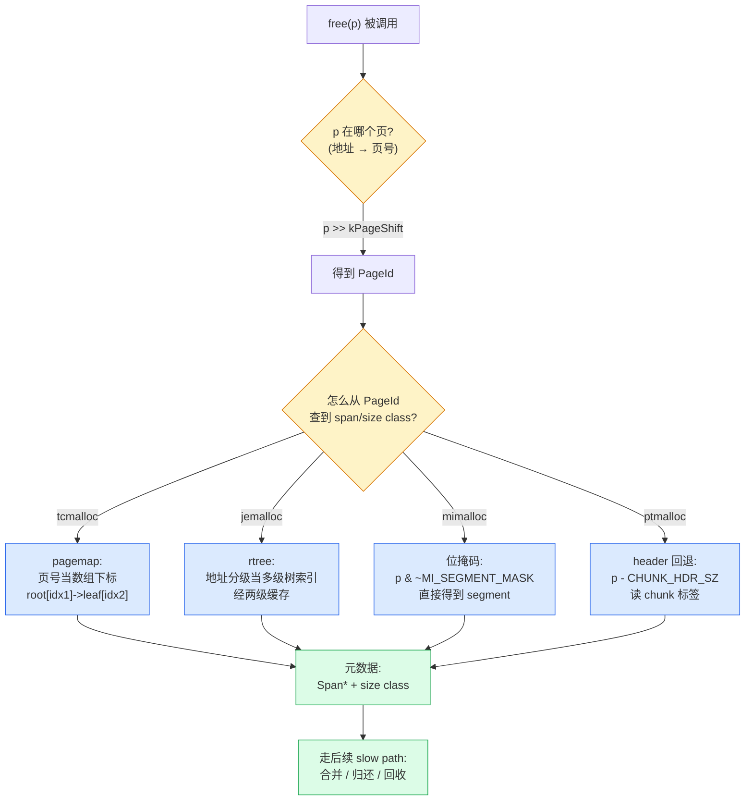

# 第八章 · pagemap 与 rtree:指针 → 所属 span 的 O(1) 反查

> 篇:P2 页堆:批量向系统要内存
> 主线呼应:上一章我们立起了页堆的"两数建模"——一个 span/extent 就是 `(first_page_, num_pages)` 两个数,切分是 `(p,n) → (p,k)+(p+k,n-k)`,合并是 `(p,n)+(p+n,m) → (p,n+m)`,全是 O(1) 算术。但那章末尾留了一个悬念:**合并要找邻居,先得知道"指针 `p` 属于哪个 span/extent、是哪个 size class"。`free(p)` 这个调用,用户只给了指针,什么都没给——它怎么反查?** 这一章就把这个"反查"拆透。这是 slow path 的**基础设施**——一切页堆操作(合并、归还、profiling)的第一步,都是"给定一个指针,把它定位到所属的元数据"。这一章的二分法归属仍是**中心堆**:pagemap/rtree 是中心堆的"地址簿",它**不属于 fast path**(fast path 是线程本地缓存,不需要反查,因为缓存的块本来就是按 size class 组织的),它只在 free miss、合并、归还这些 slow path 场景被调用。同一个"指针反查"问题,四套给出了四种答案:tcmalloc 用**放射状多级数组**(pagemap,空间换时间,无分支 O(1))、jemalloc 用 **radix tree**(rtree,省内存但多级索引 + 三级缓存)、mimalloc 用**强制对齐 + 位掩码**(零元数据,纯算术)、ptmalloc 用**每块自带 header 的边界标签**(boundary tag)。这四种取舍的权衡,是本章最值钱的部分。

## 核心问题

**`free(p)` 被调用时,运行时只拿到一个裸指针 `p`。它怎么在纳秒级知道:这个 `p` 属于哪个 span/extent、是哪个 size class、属于哪个 arena?更广地,合并时要找 `p` 的前后邻居、归还时要确认 `p` 是不是 mmap 大块、profiling 要回溯 `p` 的调用栈——所有这些 slow path 操作的第一步,都是"把指针反查回元数据"。这个反查凭什么能 O(1)?又凭什么不能每次都线性扫一遍所有 span?**

读完本章你会明白:

1. **反查的本质问题**:`free(p)` 拿到的 `p` 是"用户视角的地址",而元数据(span/extent)是"按页号管理的对象",中间隔着"地址 → 页号 → 元数据"的鸿沟。这个鸿沟怎么填,就是 pagemap/rtree 存在的全部理由。
2. **四套反查方案的本质差异**:tcmalloc 的 pagemap = **用页号直接索引的多级数组**(空间换时间,O(1) 无分支);jemalloc 的 rtree = **省内存的多级索引 + 三级缓存**(O(树高)但缓存命中是 O(1));mimalloc = **强制对齐 + 位掩码**(零元数据,纯 `& ~mask`);ptmalloc = **每块自带 header**(指针算术 `p - 16`)。
3. **pagemap 放射状数组的精妙**:tcmalloc 用 `PageMap2`(两级)/`PageMap3`(三级),叶子覆盖 256MiB,把页号的高位当 root 索引、低位当叶子内偏移,一次访存定位 span。**叶子里的并行数组还把 size class 冗余打包进 span 指针的高位**,让 free 小对象时少一次访存。
4. **jemalloc rtree 的工程取舍**:为什么不用 pagemap 那种大数组(地址空间大时吃内存)?rtree 用更细的 fanout + 惰性分配,加上**线程本地的两级缓存**(direct-map L1 + LRU L2),让绝大多数 free 不碰真正的树。
5. **为什么不用哈希表反查**:哈希看似 O(1),但每次 free 都要算 hash、可能冲突、cache 不友好,且**无定位性**(相邻指针落到不同桶)。pagemap/rtree 用"地址本身当 key",相邻指针落在相邻索引,**cache 友好、无冲突、无 hash 开销**。

> **如果一读觉得太难**:先只记住三件事——① `free(p)` 的第一步是"把指针 `p` 反查到所属 span/extent 和 size class";② 四套各自用 pagemap(tcmalloc,多级数组)、rtree(jemalloc,多级树+缓存)、位掩码(mimalloc,对齐换零元数据)、header(ptmalloc,每块带标签);③ 反查必须 O(1) 且 cache 友好,不能扫表也不能用会冲突的哈希。抓住这三点,本章就通了。

---

## 8.1 一句话点破

> **`free(p)` 的第一步,是把"用户给的地址 `p`"翻译成"分配器内部管理的元数据"。这个翻译不能扫表(几百万个 span 扫一遍要秒级)、不能哈希(相邻指针落到不同桶,cache 烂、还有冲突),它的标准答案只有两类:**要么用地址本身当索引**(tcmalloc 的 pagemap:页号直接当数组下标,O(1) 无分支)、**要么用地址分级当多级树索引**(jemalloc 的 rtree:省内存,但要走树),**或者干脆用对齐约束把元数据藏进地址本身**(mimalloc:一个 `& ~mask` 完事)、**或者把元数据贴在每块内存的头上**(ptmalloc:指针 `p-16` 回退到 header)。四套反查的本质,都是在回答同一个问题:"地址和元数据怎么对应"。**

这是结论,不是理由。本章倒过来拆:先看"`free(p)` 为什么必须能 O(1) 反查",再拆"朴素方案为什么不行"(扫表 / 哈希 / 位图),再依次拆 tcmalloc pagemap、jemalloc rtree、mimalloc 位掩码、ptmalloc header,最后四套对照。

---

## 8.2 反查问题的由来:`free(p)` 只给指针,不给别的

先把"为什么需要反查"这件事钉死。读者可能觉得这是废话——但如果不把这个问题的**严重性**讲透,后面四种方案的精妙就显不出来。

调用 `malloc(48)` 时,分配器干了一堆事:算 size class、查本地缓存、(miss 时)去中心链表、(再 miss)切 span,最后返回一个指针 `p`。在这个过程中,**分配器知道关于 `p` 的一切**:它属于哪个 size class、来自哪个 span、span 在哪个 arena、是不是被采样了。这些信息此刻都在分配器的栈上、寄存器里。

但调用 `free(p)` 时,**用户只给了 `p` 这一个指针**。C 的 `free` 函数签名就是 `void free(void *ptr)`——没有 size、没有 size class、没有任何元数据。从 malloc 返回到 free 被调用,中间可能隔了几毫秒、几秒、甚至几小时;这段时间里分配器早就忘了 `p` 是怎么来的。它现在面对的,是一个**孤零零的地址**,要凭这个地址找回 `p` 的一切。

这就是"反查"问题的完整表述:

> **给定一个用户指针 `p`,O(1) 地回答:`p` 属于哪个 span/extent?是哪个 size class?属于哪个 arena?是不是 mmap 的大块?是不是被采样了?**

这不是"偶尔要做"的事。一个繁忙的服务,**每秒上百万次 `free`**,每一次都要做这个反查。如果反查不是 O(1)、不是 cache 友好,那 `free` 这条 slow path(其实它高频得很)就会被拖垮。



> **钉死这件事**:每一次 `free(p)`、每一次合并找邻居、每一次归还确认,第一步都是"指针反查"。这个反查**必须是 O(1) 且 cache 友好**——否则 free 这条高频路径就会被它拖死。pagemap/rtree 存在的全部理由,就是把这件事做到 O(1)。

---

## 8.3 朴素方案为什么不行:扫表、哈希、位图的死穴

在拆四套真实方案之前,先看三个"听起来也行"的朴素方案为什么不行。**这一节的反面对比,是理解 pagemap/rtree 精妙的前提。**

### 反例 A:线性扫所有 span——O(n) 的 free,灾难

最朴素的做法:`free(p)` 时,把分配器手里所有 span/extent 扫一遍,看 `p` 落在哪个 span 的 `[start_addr, start_addr + num_pages*kPageSize)` 区间里。

听起来直接,一算就崩:

- **扫描成本**:一个长期运行的服务,页堆里可能有**几万到几十万个 span**(每个 span 装若干小对象,大对象更是一个一 span)。每次 `free` 扫一遍,O(n) 在 n=百万量级时是**毫秒级**——`free` 本来该是纳秒级。
- **锁放大**:扫所有 span 要持页堆锁,扫描期间所有别的线程的页堆操作都被堵住。
- **定位性全无**:`p` 和它前后的 `p+1`、`p-1` 可能属于不同 span,扫表时根本没法用 cache。

这条路在第一天就被毙了。但它是理解 pagemap 的起点:**pagemap 本质就是"把扫表替换成数组下标访问"**。

### 反例 B:用哈希表反查——cache 烂、有冲突、无定位性

第二个朴素想法:维护一个全局哈希表 `HashMap<地址, 元数据>`,`free(p)` 时 `hash[p]` 一查就行,O(1) 嘛。

哈希表理论 O(1),但在分配器这个场景里**有致命缺陷**:

- **冲突**:两个不同地址可能 hash 到同一个桶,要链表或开放寻址处理。冲突链长了,O(1) 退化成 O(k)。在高频 free 下,这是真实的性能杀手。
- **cache 不友好**:哈希函数的本职就是**打散**——相邻地址被刻意分到不同桶。但 free 的访存模式往往是**局部性强**(一个线程刚 malloc 了一批相邻对象,马上 free 它们,这批指针地址相邻)。哈希把它们打散到不同 cache line,每次 free 都 cache miss。
- **无定位性**:合并时要找 `p` 的前后邻居(`p-1`、`p+1` 所属的 span)。哈希表对"找邻居"这种**范围查询**毫无优势——还得各自算一遍 hash。
- **rehash 抖动**:哈希表满了要 rehash,那一刻所有访问变慢。在分配器这种"永远在跑"的基础设施里,rehash 抖动是不可接受的。

> **关键洞察**:哈希的问题,在于它**用"地址的 hash"当 key,丢掉了"地址本身的有序性"**。而 pagemap/rtree 的核心思路是——**地址本身就是天然有序的 key**,直接拿它当数组下标(或分级下标),既保留有序性(相邻地址落在相邻索引,cache 友好),又无冲突(每个地址映射到唯一槽位)。

### 反例 C:用位图——查不出"归属哪个 span"

第三个朴素想法(上一章也提过):用一个**位图**,每位对应一页,标记它属于哪个分配单位。

反查时,位图只能告诉你"这一页空闲/占用",**查不出"这一页属于哪个 span"**——还得另存一份"页 → span"的映射。等于位图没解决问题,只是多加了一层。

> **不这样会怎样**:扫表 O(n) 慢;哈希 cache 烂有冲突;位图查不出归属。三条朴素路都死。**唯一活路是:把地址本身当 key,做成一个"地址 → 元数据"的数组(或分级数组),用空间换 O(1) 无冲突的访问。** 这就是 pagemap(tcmalloc)和 rtree(jemalloc)的共同思路。mimalloc 和 ptmalloc 走的是另外两条路(对齐约束 / 边界标签),后面会拆。

---

## 8.4 tcmalloc 的 pagemap:放射状多级数组,页号当数组下标

现在拆第一个主角:tcmalloc 的 **pagemap**。它的思路最直白:**把整个地址空间按页号摊开成一个数组,页号当数组下标,槽位里放元数据**。

但"整个地址空间"在 64 位上是 48 位有效地址 / 8KB 页 = 2^35 个页 = **350 亿个页槽**。如果一槽一个 8 字节指针,就是 256GB 的纯元数据——比进程实际用的内存还大。这显然不行。

tcmalloc 的解法是**放射状(radix)多级数组**:不一次性铺满整个空间,而是**分级**——顶级是个小数组(指针数组),里面存"中间层指针";中间层再指向"叶子";叶子才真正装元数据。**只有用到的地址区间才分配对应的叶子**,没用到的不占内存。这就是 tcmalloc 的 `PageMap2`(两级,默认)或 `PageMap3`(三级,慢模式)。

### 入口:`PageMap` 类和 GetDescriptor

tcmalloc 的 pagemap 用户接口是 `PageMap` 类,在 [pagemap.h:535](../tcmalloc/tcmalloc/pagemap.h#L535)。它最重要的方法是 `GetDescriptor`(给页号返回 `Span*`)和 `sizeclass`(给页号返回 size class):

```cpp
// pagemap.h:535 —— PageMap 顶层接口(简化,保留关键方法)
class PageMap {
 public:
  // 给页号,返回它所属的 Span*(大对象/采样对象 free 时用)
  [[nodiscard]] inline Span* absl_nullable GetDescriptor(PageId p) const
      ABSL_NO_THREAD_SAFETY_ANALYSIS {
    return map_.get(p.index());                                   // pagemap.h:575
  }

  // 给页号,返回 (Span*, size class) 一次拿全(慢路径用)
  [[nodiscard]] inline std::pair<Span* absl_nullable, CompactSizeClass>
  GetDescriptorAndSizeClass(PageId p) const ABSL_NO_THREAD_SAFETY_ANALYSIS {
    return map_.get_existing_with_sizeclass<true>(p.index());     // pagemap.h:580
  }

  // 给页号,只取 size class(小对象 free 的热路径用,不取 Span*)
  [[nodiscard]] inline CompactSizeClass sizeclass(PageId p) const {
    return map_.sizeclass(p.index());                             // pagemap.h:547
  }

  // 确保一段页号区间在 pagemap 里有叶子(分配 span 时扩容用)
  [[nodiscard]] bool Ensure(Range r)
      ABSL_EXCLUSIVE_LOCKS_REQUIRED(pageheap_lock) {
    return map_.Ensure(r.p.index(), r.n.raw_num());               // pagemap.h:554
  }

 private:
#ifdef TCMALLOC_USE_PAGEMAP3
  PageMap3<kAddressBits - kPageShift, MetaDataAlloc> map_;        // 三级
#else
  PageMap2<kAddressBits - kPageShift, MetaDataAlloc> map_;        // 两级(默认)
#endif
};
```

三个关键观察:

1. **接口三选一,对应三种 free 场景**。小对象 free 只调 `sizeclass(p)`(pagemap.h:545)——因为小对象回收只需要 size class,不需要 Span*。大对象 free 才调 `GetDescriptorAndSizeClass`(pagemap.h:577),一次取 span + size class。`Ensure`(pagemap.h:551)是分配新 span 时的扩容,把新页号区间登记进 pagemap。**热路径只取 size class 这一个数**,这是 tcmalloc 把"小对象 free 反查"压到最省的关键。
2. **模板参数 `BITS = kAddressBits - kPageShift`**。x86-64 上 `kAddressBits=48`(有效虚拟地址位数)、`kPageShift=13`(8KB 页),所以 `BITS=35`——这就是 pagemap 要管理的页号总位数。
3. **`ABSL_NO_THREAD_SAFETY_ANALYSIS`**。读路径(get/sizeclass)**不加锁**,靠"叶子一旦分配不再释放"+ RELEASE 发布指针的无锁读协议。这是 pagemap 并发设计的核心,后面"技巧精解"会拆。

### 放射状结构:PageMap2 的两级布局

`PageMap2` 是生产默认的两级放射状数组,定义在 [pagemap.h:79-285](../tcmalloc/tcmalloc/pagemap.h#L79-L285)。它的层级常量:

```cpp
// pagemap.h:84-89 —— PageMap2 的层级位分配
static constexpr int kLeafBits = 15;        // 叶子固定 2^15 项
static constexpr int kLeafLength = 1 << kLeafBits;
static constexpr int kRootBits = (BITS >= kLeafBits) ? (BITS - kLeafBits) : 0;
static constexpr int kRootLength = 1 << kRootBits;
```

x86-64 + 8KB 页时:`BITS=35`,`kLeafBits=15`,`kRootBits=20`。也就是说:

- **顶级 root**:2^20 = 100 万个槽的**指针数组**(每个槽是一个 `Leaf*`,8 字节,顶级本身 8MB,但惰性分配,大部分槽是 null)。
- **叶子 Leaf**:2^15 = 32768 个槽,**每叶子覆盖 2^15 × 8KB = 256 MiB 地址空间**(注释 pagemap.h:82-83 明说 "256MB mapped per leaf node")。

页号 35 位被切成两段:**高 20 位当 root 索引,低 15 位当叶子内偏移**。一次访存定位 span:

```
  页号(35 位):  ┌── 高 20 位 (root 索引) ──┬── 低 15 位 (叶子内偏移) ──┐
                 └────────────────────────┴──────────────────────────┘

  反查流程:
    i1 = page_id >> 15        (取高 20 位,定位叶子)
    i2 = page_id & 0x7FFF     (取低 15 位,叶子内偏移)
    return root[i1]->span(i2)  (一次访存)
```

这就是"放射状(radix)"的字面含义——**用页号的位段当各级数组的下标**,从根发散到叶。和 radix tree 不同的是,这里**每一级都是连续数组**,不是"每个节点一个动态分配的子节点表"。这种纯数组结构的好处是:**下标计算就是位移 + 掩码,无分支、无指针追逐、cache 友好**。

### 叶子的并行数组:省一次访存的精妙

最精彩的设计在叶子内部。一个 `Leaf` 不是简单地存一个 `Span*` 数组,而是**三个并行数组**([pagemap.h:97-113](../tcmalloc/tcmalloc/pagemap.h#L97-L113)):

```cpp
// pagemap.h:97 —— Leaf 结构:三个并行数组
struct Leaf {
  CompactSizeClass sizeclass[kLeafLength];                 // :103  size class 数组
  PackedSpanAndSizeclass span_and_sizeclass[kLeafLength];  // :107  span+sc 冗余打包
  void* hugepage[kLeafHugepages];                          // :108  huge page 索引
  Span* span(int i) const { return span_and_sizeclass[i].span(); }  // :110
};
```

为什么有两份 size class(`sizeclass[]` 和 `span_and_sizeclass[]` 里又冗余一份)?看 `PackedSpanAndSizeclass` 的定义([pagemap.h:58-77](../tcmalloc/tcmalloc/pagemap.h#L58-L77)):

```cpp
// pagemap.h:58 —— 把 Span* 的高 16 位塞一份冗余 size class
class PackedSpanAndSizeclass {
  void set(Span* span, CompactSizeClass sizeclass) {
    packed_value_ = (uintptr_t(sizeclass) << kSizeclassShift) | uintptr_t(span);
  }
  Span* span() const { return reinterpret_cast<Span*>(packed_value_ & kSpanMask); }
  CompactSizeClass sizeclass() const { return packed_value_ >> kSizeclassShift; }
  static constexpr uintptr_t kSizeclassShift = 48;   // :75
  static constexpr uintptr_t kSpanMask = (1ULL<<48) - 1;  // :76
};
```

这里有个**精彩的位运算技巧**:x86-64 的虚拟地址只用低 48 位,所以一个 `Span*`(它在堆上,地址在低 48 位)的高 16 位是**空闲的**。tcmalloc 把 size class(只占几位)塞进 `Span*` 的高 16 位,**一个 8 字节 word 同时存 span 指针和 size class**。

> **动机**:这样设计是为了**让 free 慢路径(大对象/采样)一次访存就拿到 (span, size class)**——读 `span_and_sizeclass[i]` 一个 8 字节,通过位运算解出 span 和 size class 两个值。如果分两个字段存,要两次访存(可能两次 cache miss)。在 free 这种高频路径上,省一次 cache miss 就是省几纳秒。
>
> **为什么还留 `sizeclass[]` 这个独立数组**:小对象 free 走的是 `sizeclass(p)` 而不是 `GetDescriptor`。`sizeclass[]` 是个**更紧凑的数组**(`CompactSizeClass` 通常 1 字节,而 `PackedSpanAndSizeclass` 是 8 字节),遍历起来 cache 密度更高,且**独立数组在小对象热路径上不需要解包**——直接读一个字节就是 size class。两份数据冗余,tcmalloc 还用 `TC_ASSERT_EQ` 校验一致([pagemap.h:206-207](../tcmalloc/tcmalloc/pagemap.h#L206-L207))。

### 真实 free 路径:指针 → 页号 → pagemap

现在把这条链完整走一遍。`free(p)` 在 tcmalloc 里走 [tcmalloc.cc:798](../tcmalloc/tcmalloc/tcmalloc.cc#L798) 的 `do_free`:

```cpp
// tcmalloc.cc:798 —— do_free 入口(简化,保留反查关键行)
template <typename Policy>
static void do_free(void* ptr, Policy policy) {
  ...
  // 第一步:算出 p 所属的页号(PageIdContaining = p >> kPageShift)
  size_t size_class = tc_globals.pagemap().sizeclass(PageIdContaining(ptr));  // :826
  if (size_class != 0) {
    // 小对象:只用了 size class,不需要 Span*
    FreeSmall(ptr, size_class, policy);                                       // :827-828
  } else {
    // 大对象(size_class==0):需要 Span*,走慢路径
    InvokeHooksAndFreePages(ptr, policy);                                     // :829-831
  }
}
```

关键就是 [tcmalloc.cc:826](../tcmalloc/tcmalloc/tcmalloc.cc#L826) 这一行:`tc_globals.pagemap().sizeclass(PageIdContaining(ptr))`。它做了两件事:

1. **`PageIdContaining(ptr)`**:把指针 `p` 右移 `kPageShift`(13 位),得到页号。这个函数在 [pages.h:275-277](../tcmalloc/tcmalloc/pages.h#L275-L277):

   ```cpp
   // pages.h:275 —— 指针 → 页号,纯位移
   inline PageId PageIdContaining(const void* p) {
     return PageId(reinterpret_cast<uintptr_t>(p) >> kPageShift);
   }
   ```

   就一句位移。`kPageShift` 在 [common.h:154](../tcmalloc/tcmalloc/common.h#L154)(x86-64 默认分支)是 13(8KB 页)。

2. **`pagemap().sizeclass(PageId)`**:用页号查 pagemap,返回 size class。这内部就是上面拆的 `PageMap2::get`——页号高 20 位当 root 下标,低 15 位当叶子内偏移,一次访存读出 `CompactSizeClass`。

**整个反查 = 一次位移 + 一次数组下标访问,无分支、无锁、O(1)**。这就是 tcmalloc pagemap 的精髓。

大对象的慢路径(`InvokeHooksAndFreePages`)走 [tcmalloc.cc:662-668](../tcmalloc/tcmalloc/tcmalloc.cc#L662-L668):

```cpp
// tcmalloc.cc:662 —— 大对象 free 的反查
const PageId p = PageIdContaining(ptr);
...
auto [span, size_class] = tc_globals.pagemap().GetDescriptorAndSizeClass(p);  // :668
```

这里调 `GetDescriptorAndSizeClass`,一次拿到 `Span*` 和 size class。如果 `span == nullptr`,tcmalloc 会报 corrupted free;如果是 `invalid_span`,报 double free(注释 tcmalloc.cc:670-679 解释了双 free 检测原理——pagemap 里登记的"无效页"用于这个目的)。

### 扩容:Ensure 怎么分配新叶子

pagemap 不是一开始就铺满的。当页堆切一个新 span(覆盖一段新页号),要先 `Ensure(Range)`,把这段页号对应的叶子分配出来。`PageMap2::Ensure` 在 [pagemap.h:255-276](../tcmalloc/tcmalloc/pagemap.h#L255-L276)(**这是内联模板,不在 .cc 里**):

```cpp
// pagemap.h:255 —— PageMap2::Ensure(简化)
bool Ensure(Number start, size_t n) {
  for (Number key = start; key <= start + n - 1;) {
    const Number i1 = key >> kLeafBits;
    if (i1 >= kRootLength) return false;
    if (root_[i1] == nullptr) {
      Leaf* leaf = reinterpret_cast<Leaf*>(Allocator(sizeof(Leaf)));   // 分配新叶子
      if (leaf == nullptr) return false;
      bytes_used_ += sizeof(Leaf);
      memset(leaf, 0, sizeof(*leaf));
      root_[i1] = leaf;                                                 // 挂到 root
    }
    key = ((key >> kLeafBits) + 1) << kLeafBits;                        // 跳到下一叶子起点
  }
  return true;
}
```

它遍历页号区间,哪个 root 槽位还没分配叶子,就 `Allocator(sizeof(Leaf))` 分配一个(`Allocator` 是 `MetaDataAlloc`,见 [pagemap.cc:74](../tcmalloc/tcmalloc/pagemap.cc#L74),内部走 `tc_globals.arena().Alloc(bytes)`)。**这就是"惰性分配"**:只有用到的地址区间才占叶子内存,没用到的不占。

> **钉死这件事**:tcmalloc pagemap 的核心是**用页号当数组下标的放射状多级数组**。页号的高位当 root 索引,低位当叶子内偏移,一次位移 + 一次访存定位 span。叶子用并行数组 + 位打包(`PackedSpanAndSizeclass`)让 free 慢路径一次访存拿双值,独立 `sizeclass[]` 让小对象 free 热路径只读一个字节。整个结构**惰性分配**(只有用到的地址才占叶子),读路径**无锁**(靠 RELEASE 发布指针)。

---

## 8.5 jemalloc 的 rtree:省内存的多级索引 + 三级缓存

第二个主角是 jemalloc 的 **rtree(radix tree)**,封装在 **emap** 里。它的思路和 pagemap 类似(都是"地址当 key 的分级索引"),但**实现路径截然不同**:pagemap 用连续数组(每级是大数组),rtree 用**真正的树**(每级是动态分配的子节点表)。这带来的取舍是:rtree **更省内存**(只有用到的子节点才分配),但**查找多一跳指针追逐**——jemalloc 用**线程本地三级缓存**把这个开销抹平。

### rtree 的结构:节点极简,叶子紧凑打包

rtree 的核心数据结构在 [rtree.h:102-112](../jemalloc/include/jemalloc/internal/rtree.h#L102-L112):

```c
// rtree.h:102 —— rtree_t 结构
typedef struct rtree_s rtree_t;
struct rtree_s {
    base_t        *base;        // :104  节点内存从这个 base 分配
    malloc_mutex_t init_lock;   // :105  保护节点惰性初始化
#if RTREE_HEIGHT > 1
    rtree_node_elm_t root[1U << (RTREE_NSB / RTREE_HEIGHT)];  // :108  根(中间节点数组)
#else
    rtree_leaf_elm_t root[1U << (RTREE_NSB / RTREE_HEIGHT)];  // :110  根(叶子数组,高度=1 时)
#endif
};
```

注意根是**嵌入结构体的数组**(不是指针),高度>1 时是中间节点数组,高度=1 时直接是叶子数组。中间节点 `rtree_node_elm_t` **极简**([rtree.h:41-44](../jemalloc/include/jemalloc/internal/rtree.h#L41-L44)):

```c
// rtree.h:41 —— 中间节点:只有一个原子 child 指针
typedef struct rtree_node_elm_s rtree_node_elm_t;
struct rtree_node_elm_s {
    atomic_p_t child; /* (rtree_{node,leaf}_elm_t *) */  // :43
};
```

**中间节点就一个原子 child 指针**,8 字节。它在非叶层指向下一层的 `rtree_node_elm_t` 数组,在倒数第二层指向 `rtree_leaf_elm_t` 数组。**extent 不存在中间节点里,只在叶子节点里**——这和"每个节点都存 extent 指针"的朴素 radix tree 不同,是 jemalloc 为了让中间节点尽量小(8 字节,一个 cache line 装 8 个)做的优化。

叶子节点 `rtree_leaf_elm_t` 在 64 位紧凑模式下(默认开启)更精妙([rtree.h:65-89](../jemalloc/include/jemalloc/internal/rtree.h#L65-L89)),**只用一个 64 位字段 `le_bits` 打包 5 个东西**:edata 指针(48 位)+ szind(size class)+ state(active/dirty/muzzy/retained)+ is_head + slab。位布局大致:

```
  叶子节点 le_bits(64 位,紧凑模式):
  ┌────────┬────────────────────────────────────────┬──────┬───────┬───┬────┐
  │  szind │        edata 指针(低 48 位)           │state │is_head│slb│ rsv│
  │ (8 位) │                                        │(3 位)│(1 位) │   │    │
  └────────┴────────────────────────────────────────┴──────┴───────┴───┴────┘
```

为什么 edata 指针能塞进 48 位?因为 x86-64 虚拟地址只用低 48 位,堆上分配的 `edata_t` 地址天然在 48 位内。jemalloc 用 `rtree_leaf_elm_bits_encode/decode`([rtree.h:190-241](../jemalloc/include/jemalloc/internal/rtree.h#L190-L241))做位拼装/解包。这是和 tcmalloc `PackedSpanAndSizeclass` 同源的技巧——**用地址高位塞冗余信息**。

### 层数和 fanout:运行期从地址位数算

rtree 的层数和每层 fanout 不是硬编码,而是**从地址位数算出来**。关键宏在 [rtree.h:20-39](../jemalloc/include/jemalloc/internal/rtree.h#L20-L39):

```c
// rtree.h:20-25 —— rtree 的位预算
#define RTREE_NHIB  ((1 << (LG_SIZEOF_PTR+3)) - LG_VADDR)   // 高位无效位,x64 = 64-48 = 16
#define RTREE_NLIB  LG_PAGE                                   // 低位无效位 = 页 shift,典型 12
#define RTREE_NSB   (LG_VADDR - LG_PAGE)                      // 有效位 = 48-12 = 36

// rtree.h:27-35 —— 高度选择(35 位有效位 ≤ 36 → 高度 2)
#if RTREE_NSB <= RTREE_HEIGHT_MAX
#  define RTREE_HEIGHT 1
#elif ...
#  define RTREE_HEIGHT 2     // x64 默认:NSB=36,高度=2
#endif
```

x86-64 默认 `LG_VADDR=48`、`LG_PAGE=12`,所以 `NSB=36`,高度=**2**。每层 fanout 由静态表 `rtree_levels[]`([rtree.h:120-134](../jemalloc/include/jemalloc/internal/rtree.h#L120-L134))决定,典型是每层 18 位 → fanout = 2^18 = 262144。

**地址 → 各层 key 的位运算**在 [rtree.h:142-169](../jemalloc/include/jemalloc/internal/rtree.h#L142-L169):

```c
// rtree.h:150 —— leafkey:抹掉低位(页内偏移 + 叶子内 subkey)
rtree_leafkey(key) {
    uintptr_t mask = ~((1U << rtree_leaf_maskbits()) - 1);
    return key & mask;                        // 抹掉低 30 位,一个叶子覆盖 1 GiB
}

// rtree.h:162 —— subkey:抽出某层的位段
rtree_subkey(key, level) {
    shiftbits = ptrbits - rtree_levels[level].cumbits;
    mask = (1 << rtree_levels[level].bits) - 1;
    return (key >> shiftbits) & mask;         // 该层 bits 位段
}
```

典型 x64(高度 2):叶子覆盖 2^30 = 1 GiB 虚地址(leafkey 抹掉低 30 位),叶子内用高 18 位选 2^18 个槽。

### 查找:三级缓存让绝大多数 free 不碰树

rtree 的查找入口是 `rtree_read`([rtree.h:446-453](../jemalloc/include/jemalloc/internal/rtree.h#L446-L453)):

```c
// rtree.h:446 —— rtree_read:给地址查 extent
static inline rtree_contents_t
rtree_read(tsdn_t *tsdn, rtree_t *rtree, rtree_ctx_t *rtree_ctx, uintptr_t key) {
    rtree_leaf_elm_t *elm = rtree_leaf_elm_lookup(tsdn, rtree, rtree_ctx,
        key, /* dependent */ true, /* init_missing */ false);   // :449
    assert(elm != NULL);
    return rtree_leaf_elm_read(tsdn, rtree, elm, /* dependent */ true);  // :452
}
```

但 jemalloc 不会每次都真走树——`rtree_leaf_elm_lookup`([rtree.h:369-428](../jemalloc/include/jemalloc/internal/rtree.h#L369-L428))有**三级缓存**:

```c
// rtree.h:369 —— rtree_leaf_elm_lookup:三级缓存查找(简化)
JEMALLOC_ALWAYS_INLINE rtree_leaf_elm_t *
rtree_leaf_elm_lookup(tsdn, rtree, rtree_ctx, key, dependent, init_missing) {
    size_t slot = rtree_cache_direct_map(key);            // :375  direct-map 到 L1
    uintptr_t leafkey = rtree_leafkey(key);
    if (likely(rtree_ctx->cache[slot].leafkey == leafkey)) {  // :380  L1 命中?
        rtree_leaf_elm_t *leaf = rtree_ctx->cache[slot].leaf;
        return &leaf[rtree_subkey(key, RTREE_HEIGHT - 1)];    // :384  一次访存
    }
    // :390-423  L1 miss → 扫 L2(LRU 8 项),命中则 bubble up
    return rtree_leaf_elm_lookup_hard(...);  // :426  L1/L2 都 miss → 真走树
}
```

三级缓存是:

1. **L1 direct-map**:用地址的一部分直接映射到一个固定槽位(`rtree_cache_direct_map`),命中率最高、查最快。代价是有冲突(两个地址映射到同槽,互相挤掉)。
2. **L2 LRU**:一个 8 项的 LRU 缓存,L1 miss 时扫一遍。这弥补了 direct-map 的冲突问题。
3. **硬查(`_hard`)**:L1/L2 都 miss,才真正走 rtree 树([rtree.c:163-248](../jemalloc/src/rtree.c#L163-L248))。逐层 `rtree_subkey` 下沉,读到叶子,顺便把结果填进 L1/L2。

**关键**:`rtree_ctx` 是**线程本地**的(每个线程一份,从 `tsd` 取,见 `EMAP_DECLARE_RTREE_CTX` 宏 [emap.h:13-15](../jemalloc/include/jemalloc/internal/emap.h#L13-L15))。这意味着**三级缓存本身是无锁的**(线程私有),只有"硬查"才碰共享的 rtree 树(且读路径无锁,靠 RELEASE 发布节点)。

> **钉死这件事**:jemalloc rtree 用"真树 + 线程本地三级缓存"组合拳。树本身是省内存的多级索引(只有用到的子节点才分配),但查找要逐层指针追逐;**三级缓存(direct-map L1 + LRU L2)让绝大多数 free 在线程本地完成,根本不碰共享树**。这是 jemalloc 相对 pagemap 的工程取舍——pagemap 用大数组换 O(1) 无缓存,rtree 用小树 + 缓存换省内存 + 仍 O(1)(缓存命中时)。

### emap:rtree 的语义化包装 + 邻居查找

jemalloc 在 rtree 之上又包了一层 **emap**,定义在 [emap.h:17-20](../jemalloc/include/jemalloc/internal/emap.h#L17-L20):

```c
// emap.h:17 —— emap 就是 rtree 的一层薄包装
typedef struct emap_s emap_t;
struct emap_s {
    rtree_t rtree;   // :19  唯一字段
};
```

**整个结构就一个 `rtree_t` 字段**。所有 emap 函数都通过 `&emap->rtree` 调 rtree。设计上,emap 是给 rtree 起了个**语义化别名**(emap = "extent map"),并加了面向 extent 的高层操作:`emap_edata_lookup`(查 extent)、`emap_try_acquire_edata_neighbor`(查邻居,合并用)、`emap_split`/`emap_merge`(切分合并时更新 rtree)。

最常用的 `emap_edata_lookup` 在 [emap.h:228-233](../jemalloc/include/jemalloc/internal/emap.h#L228-L233):

```c
// emap.h:228 —— 给地址返回所属 edata_t*
JEMALLOC_ALWAYS_INLINE edata_t *
emap_edata_lookup(tsdn_t *tsdn, emap_t *emap, const void *ptr) {
    EMAP_DECLARE_RTREE_CTX;                                    // :230  从 tsd 取 rtree_ctx
    return rtree_read(tsdn, &emap->rtree, rtree_ctx,
                      (uintptr_t)ptr).edata;                   // :232
}
```

注意 `EMAP_DECLARE_RTREE_CTX` 宏——它从线程本地 `tsd` 取 `rtree_ctx`(线程私有缓存)。这就是上面三级缓存的载体。

**合并找邻居**的入口是 `emap_try_acquire_edata_neighbor`,真实实现在 [emap.c:42-96](../jemalloc/src/emap.c#L42-L96)(统一 `_impl` 函数,两个公开包装是前向/后向):

```c
// emap.c:42 —— 查邻居 extent(合并用,简化)
void *neighbor_addr = forward ? edata_past_get(edata)     // :56-57  前邻居:本 extent 的尾
                              : edata_before_get(edata);           // 后邻居:本 extent 的头
if (neighbor_addr == NULL) return NULL;                    // :66-68  边界保护
EMAP_DECLARE_RTREE_CTX;
rtree_leaf_elm_t *elm = rtree_leaf_elm_lookup(...,
    (uintptr_t)neighbor_addr, /* dependent */ false, ...);  // :71-73  查邻居地址
if (elm == NULL) return NULL;
rtree_contents_t neighbor_contents = rtree_leaf_elm_read(...);  // :78-79
if (!extent_can_acquire_neighbor(...)) return NULL;        // :80-83  校验同 arena/state
edata_t *neighbor = neighbor_contents.edata;               // :86
emap_update_edata_state(tsdn, emap, neighbor, extent_state_merging);  // :88  改 state 阻断别人
extent_assert_can_coalesce(edata, neighbor);               // :92
return neighbor;
```

这就是 jemalloc 合并的第 1 步——**用 rtree 反查邻居地址**,拿到邻居 extent,然后才能做合并的算术(上一章拆过)。**合并的 O(1) 邻居查找,根基就是 rtree**。

### free 路径:ifree → emap_alloc_ctx_lookup

jemalloc 的 `free` 走 [jemalloc.c:915-947](../jemalloc/src/jemalloc.c#L915-L947) 的 `ifree`:

```c
// jemalloc.c:915 —— ifree(简化)
JEMALLOC_ALWAYS_INLINE void
ifree(tsd_t *tsd, void *ptr, tcache_t *tcache, bool slow_path) {
    ...
    emap_alloc_ctx_t alloc_ctx;
    emap_alloc_ctx_lookup(                                  // :929-930  ← free 第一步:rtree 反查
        tsd_tsdn(tsd), &arena_emap_global, ptr, &alloc_ctx);
    assert(alloc_ctx.szind != SC_NSIZES);
    size_t usize = emap_alloc_ctx_usize_get(&alloc_ctx);
    ...
    idalloctm(tsd_tsdn(tsd), ptr, tcache, &alloc_ctx, false, false);  // :939
}
```

注意:**free fastpath 用的是 `emap_alloc_ctx_lookup`(只取 szind + slab),不是 `emap_edata_lookup`**——因为 free 小对象只需要 size class,不需要 edata 指针(和 tcmalloc 的 `sizeclass()` 同理)。`arena_emap_global` 是全局唯一 emap(所有 arena 共享一棵 rtree,这和 tcmalloc 全局 pagemap 类似)。

> **钉死这件事**:jemalloc rtree 是"省内存的多级树 + 线程本地三级缓存"。中间节点极简(8 字节原子指针),叶子紧凑打包(8 字节塞 edata+szind+state+is_head+slab)。查找走三级缓存(direct-map L1 + LRU L2 + 硬查树),绝大多数 free 在线程本地完成。合并找邻居(`emap_try_acquire_edata_neighbor`)、切分合并(`emap_split`/`emap_merge`)都建在 rtree 之上。整个 emap 共享一棵全局 rtree,所有 arena 共用。

---

## 8.6 mimalloc 的位掩码:对齐约束换零元数据反查

第三个登场的是 mimalloc,它走的是**完全不同的第三条路**——根本不用查找表,用**强制对齐 + 位掩码**让指针 `p` 直接"算"出所属 segment。

核心函数 `_mi_ptr_segment` 在 [internal.h:527-534](../mimalloc/include/mimalloc/internal.h#L527-L534):

```c
// internal.h:527 —— 指针 → segment,纯位掩码
static inline mi_segment_t* _mi_ptr_segment(const void* p) {
  // we align one byte before p
  mi_segment_t* const segment = (mi_segment_t*)(((uintptr_t)p - 1) & ~MI_SEGMENT_MASK);
  #if MI_INTPTR_SIZE <= 4
  return (p==NULL ? NULL : segment);
  #else
  return ((intptr_t)segment <= 0 ? NULL : segment);
  #endif
}
```

**核心一行**:`((uintptr_t)p - 1) & ~MI_SEGMENT_MASK`。`MI_SEGMENT_MASK` 在 [types.h:194](../mimalloc/include/mimalloc/types.h#L194) 定义为 `MI_SEGMENT_ALIGN - 1`,`MI_SEGMENT_ALIGN = MI_SEGMENT_SIZE = 1<<25 = 32MiB`([types.h:192-193](../mimalloc/include/mimalloc/types.h#L192-L193))。所以 `~MI_SEGMENT_MASK` 就是把低 25 位清零,**相当于按 32MiB 向下对齐**。

为什么先减 1?注释 [internal.h:523-525](../mimalloc/include/mimalloc/internal.h#L523-L525) 解释:大对齐块可能对齐在 `N*MI_SEGMENT_SIZE`(在比 segment 还大的 huge segment 内部),真正的 segment 元数据在该地址**前面**一个 `MI_SEGMENT_SIZE` 处,所以要先退一字节再向下对齐。

### 这凭什么 work:32MiB 强制对齐

这个技巧成立的前提是:**mimalloc 的每个 segment 都严格按 32MiB 对齐**。这样,任意一个 segment 内部的指针 `p`,它所在的 segment 起始地址就是 `(p-1) & ~MASK`——一次位运算,零查找表,零额外内存。

对齐是怎么保证的?看 segment 分配链 [segment.c:845-889](../mimalloc/src/segment.c#L845-L889):

```c
// segment.c:845 —— mi_segment_os_alloc(简化)
size_t alignment = MI_SEGMENT_ALIGN;                          // :853  32MiB 对齐
...
_mi_arena_alloc_aligned(segment_size, alignment, ...);        // :868  把 alignment 传下去
...
mi_assert_internal(segment != NULL
    && (uintptr_t)segment % MI_SEGMENT_SIZE == 0);            // :889  硬断言:必须对齐
```

底层 mmap 用三重手段保证对齐([prim/unix/prim.c:255-292](../mimalloc/src/prim/unix/prim.c#L255-L292)):BSD 用 `MAP_ALIGNED(n)`(n=25),Linux 用**对齐 hint 地址**(预先对齐到 32MiB 的 mmap 提示地址),都不行就**超额分配再找内部对齐点**。

### 指针 → page:slice 下标

拿到 segment 后,还要进一步定位到 segment 内部的 page。`_mi_segment_page_of` 在 [internal.h:563-574](../mimalloc/include/mimalloc/internal.h#L563-L574):

```c
// internal.h:563 —— 指针 → page(给定 segment)
static inline mi_page_t* _mi_segment_page_of(const mi_segment_t* segment, const void* p) {
  ptrdiff_t diff = (uint8_t*)p - (uint8_t*)segment;
  size_t idx = (size_t)diff >> MI_SEGMENT_SLICE_SHIFT;          // :567  slice 下标 = 偏移 / 64KiB
  mi_slice_t* slice0 = (mi_slice_t*)&segment->slices[idx];
  mi_slice_t* slice = mi_slice_first(slice0);                   // :570  退回首 slice
  return mi_slice_to_page(slice);
}
```

`MI_SEGMENT_SLICE_SHIFT = 16`([types.h:173](../mimalloc/include/mimalloc/types.h#L173)),即 slice = 64KiB。slice 下标 = `(p - segment) >> 16`,又一次位移。然后从 slice 数组取到 page(连续 slice 组成 page,上一章拆过)。

封装好的 `_mi_ptr_page` 在 [internal.h:584-587](../mimalloc/include/mimalloc/internal.h#L584-L587),就是 `_mi_ptr_segment` + `_mi_segment_page_of` 的组合:

```c
// internal.h:584 —— 一步到位:指针 → page
static inline mi_page_t* _mi_ptr_page(void* p) {
  return _mi_segment_page_of(_mi_ptr_segment(p), p);
}
```

**整个反查 = 两次位移 + 一次掩码,无查找表、无锁、零额外元数据**。这是 mimalloc 相对 tcmalloc/jemalloc 的独到优势——**用约束(强制对齐)换掉了查找表**。

> **代价**:segment 必须严格按 32MiB 对齐,这要求 mmap 时小心处理 alignment(可能要超额分配再修剪,浪费一点地址空间);且 segment 大小固定(灵活性差,不能像 tcmalloc span 那样任意大小)。但好处巨大——**free 的 fast path 极其简洁**,一个位运算定位 segment,一个位移定位 page,整个反查 O(1) 且零元数据。

### segment-map.c:验证用的全局位图

但位掩码有个**漏洞**:`_mi_ptr_segment(p)` 只是"算"出一个候选 segment 地址,它**假设 `p` 确实来自 mimalloc**。如果传入一个野指针(或 OS 直接报告的指针),位掩码会算出一个"假"的 segment 地址,误导判断。

mimalloc 用 **segment-map.c** 弥补这个漏洞。它维护一个**全局位图**,每位对应一个 `MI_SEGMENT_SIZE` 区间,标记这个区间是不是真的有 segment 元数据。验证入口 `_mi_segment_of` 在 [segment-map.c:109-128](../mimalloc/src/segment-map.c#L109-L128):先 `_mi_ptr_segment(p)` 算候选,再查位图确认该地址确实是 mimalloc 的 segment,并校验 cookie。

**这两套机制互补**:`_mi_ptr_segment`(位掩码)用于**已知来源的热路径**(mi_free,用户指针必然来自 mimalloc);`segment-map.c`(位图验证)用于**未知来源的指针**(如 `mi_is_in_heap_region` 检测、OS 报告)。位掩码追求速度,位图追求正确性,各司其职。

> **钉死这件事**:mimalloc 用**强制对齐 + 位掩码**实现零元数据的 O(1) 反查。segment 按 32MiB 对齐,任意指针 `(p-1) & ~MI_SEGMENT_MASK` 直接得到 segment 起点;slice 下标是位移。代价是 mmap 要小心对齐(可能超额分配)、segment 大小固定。配套的 segment-map.c 用全局位图做"野指针验证"。这是"用约束换简洁"的典范——mimalloc 用一个硬约束(对齐),换掉了 tcmalloc/jemalloc 整套查找表。

---

## 8.7 ptmalloc 的边界标签:每块自带 header

最后看 baseline ptmalloc。它走的是**第四条路**——根本不用查找表,也不靠对齐约束,而是**在每块内存的头上贴一个 header**(边界标签,boundary tag),free 时用指针算术回退到 header,读出元数据。

ptmalloc 的 chunk 结构在 [malloc.c:862-873](https://github.com/glibc/glibc/blob/main/malloc/malloc.c#L862):

```c
// malloc.c:862 —— chunk 结构(在线源码)
struct malloc_chunk {
  INTERNAL_SIZE_T      mchunk_prev_size;  /* :864  前一块大小(前一块空闲时有效) */
  INTERNAL_SIZE_T      mchunk_size;       /* :865  本块大小,含 header,低 3 位是标志 */
  struct malloc_chunk* fd;         /* :867  前向指针(空闲时当链表节点用) */
  struct malloc_chunk* bk;         /* :868  后向指针 */
  struct malloc_chunk* fd_nextsize; /* :871  大块专用 */
  struct malloc_chunk* bk_nextsize; /* :872  大块专用 */
};
```

指针 `p` 是 `malloc` 返回的**用户指针**(指向 header 之后的数据区)。要从 `p` 回到 chunk header,用 `mem2chunk` 宏 [malloc.c:991](https://github.com/glibc/glibc/blob/main/malloc/malloc.c#L991):

```c
// malloc.c:985-991 —— chunk 和 user mem 的换算
#define CHUNK_HDR_SZ (2 * SIZE_SZ)                       // :985  header = 16 字节(64 位)
#define chunk2mem(p) ((void*)((char*)(p) + CHUNK_HDR_SZ)) // :988  chunk → user mem
#define mem2chunk(mem) ((mchunkptr) (((char*)(mem) - CHUNK_HDR_SZ)))  // :991  user mem → chunk
```

`mem2chunk(p)` 就是 `p - 16`(64 位下 header 是 16 字节)。**一次减法,回到 header**,然后读 `mchunk_size` 就知道这块多大、是不是 mmap 的、属于哪个 arena。

### 标志位塞在 size 低位

`mchunk_size` 的低 3 位是标志位([malloc.c:1028-1061](https://github.com/glibc/glibc/blob/main/malloc/malloc.c#L1028)):

```c
// malloc.c:1028-1061 —— size 字段的低 3 位标志
#define PREV_INUSE 0x1       // :1028  前一块在用
#define IS_MMAPPED 0x2       // :1035  本块由 mmap 分配(大块)
#define NON_MAIN_ARENA 0x4   // :1044  本块属于非主 arena
#define SIZE_BITS (PREV_INUSE | IS_MMAPPED | NON_MAIN_ARENA)  // :1061
```

因为 chunk 大小总是 16 字节对齐,低 4 位本来就空闲,塞 3 个标志位正好。读纯 size 用 `chunksize(p) = chunksize_nomask(p) & ~SIZE_BITS`(屏蔽低 3 位)。

### prev_size 回溯前一块:合并的关键

最关键的设计是 `mchunk_prev_size` 字段——它**记录前一个 chunk 的大小**。当前一块空闲时,这个字段有效;释放当前块时,如果发现前一块也空闲(`!prev_inuse(p)`),就用 `prev_size` 回溯到前一块,做合并。看 `_int_free` 的 backward consolidation([malloc.c:3993-4001](https://github.com/glibc/glibc/blob/main/malloc/malloc.c#L3993)):

```c
// malloc.c:3993 —— _int_free 的向后合并
if (!prev_inuse(p)) {
    INTERNAL_SIZE_T prevsize = prev_size(p);                  // :3996  读 prev_size
    size += prevsize;
    p = chunk_at_offset(p, -((long) prevsize));               // :3998  p = p - prevsize,回溯前块
    if (__glibc_unlikely(chunksize(p) != prevsize))
        malloc_printerr("corrupted size vs. prev_size while consolidating");
    unlink_chunk(av, p);                                       // :4001  从 bins 摘除
}
```

**合并找邻居的根基,就是 `prev_size` 字段**——它把"前一块在哪、多大"直接贴在当前块的头上,回溯只需一次减法。这是 ptmalloc 的"指针反查"方案:不查任何表,元数据就在指针 `p-16` 处。

> **代价**:每块内存都要带 16 字节 header(对小对象是显著开销);`prev_size` 字段在"前一块在用"时是浪费的(它本是前一块的数据区,被借来存元数据)。这是 boundary tag 方案的固有开销。
>
> **对照**:tcmalloc/jemalloc 把元数据**集中在 pagemap/rtree 里**(用户内存零开销),代价是要维护查找表;mimalloc 用对齐约束**零元数据零查找表**,代价是 segment 大小固定;ptmalloc 把元数据**散在每块头上**(零查找表),代价是每块多 16 字节。**四种方案,本质都是在"元数据放哪"这个维度上的不同取舍**。

---

## 8.8 四套对照:同一个反查问题,四种答案

把四套的反查方案放一张表,全局对照:

| 维度 | tcmalloc | jemalloc | mimalloc | ptmalloc(baseline) |
|------|----------|----------|----------|----------|
| **反查机制** | 放射状多级数组(pagemap) | radix tree(rtree)+ emap 包装 | 强制对齐 + 位掩码 | 每块自带 header(boundary tag) |
| **核心数据结构** | `PageMap2`(两级,默认)/ `PageMap3`(三级) | `rtree_t`(2 层,fanout 2^18)+ 线程本地三级缓存 | segment 按 32MiB 对齐,`p & ~MASK` 定位 | `struct malloc_chunk` 每 block 头贴 16 字节 |
| **指针 → 元数据** | `p >> kPageShift` 得页号 → root[idx1]->leaf[idx2] | `rtree_subkey` 逐层 → 叶子(经 L1/L2 缓存) | `(p-1) & ~MI_SEGMENT_MASK` 得 segment,`diff >> 16` 得 page | `p - CHUNK_HDR_SZ` 回退到 header,读 `mchunk_size` |
| **元数据存放** | 集中(pagemap 数组里),用户内存零开销 | 集中(rtree 树里),用户内存零开销 | 零元数据(靠对齐约束)+ 验证位图 | 分散(每块头部 16 字节) |
| **时间复杂度** | O(1),无分支,一次访存 | O(树高),但缓存命中 O(1) | O(1),纯位运算 | O(1),一次减法 + 一次读 |
| **内存开销** | 大数组(叶子覆盖 256MiB,惰性分配) | 小树 + 每线程缓存(中间节点 8 字节) | 零(对齐约束) + 验证位图(每位 32MiB) | 每块 16 字节 header |
| **找邻居(合并)** | pagemap 查前后页号的 span | `emap_try_acquire_edata_neighbor` 查邻居地址 | segment 内 slice 数组相邻 | `prev_size` 字段回溯前块 |
| **关键源码** | [pagemap.h:535](../tcmalloc/tcmalloc/pagemap.h#L535) `PageMap`;[pagemap.h:79-285](../tcmalloc/tcmalloc/pagemap.h#L79) `PageMap2`;[tcmalloc.cc:826](../tcmalloc/tcmalloc/tcmalloc.cc#L826) free 反查 | [rtree.h:102](../jemalloc/include/jemalloc/internal/rtree.h#L102) `rtree_t`;[emap.h:228](../jemalloc/include/jemalloc/internal/emap.h#L228) `emap_edata_lookup`;[jemalloc.c:929](../jemalloc/src/jemalloc.c#L929) free 反查 | [internal.h:527](../mimalloc/include/mimalloc/internal.h#L527) `_mi_ptr_segment`;[internal.h:563](../mimalloc/include/mimalloc/internal.h#L563) `_mi_segment_page_of` | [malloc.c:991](https://github.com/glibc/glibc/blob/main/malloc/malloc.c#L991) `mem2chunk`;[malloc.c:862](https://github.com/glibc/glibc/blob/main/malloc/malloc.c#L862) `malloc_chunk` |

> **四套横评小结**:
> - **tcmalloc**:放射状多级数组(pagemap),页号当数组下标,O(1) 无分支;叶子用并行数组 + 位打包让 free 慢路径一次访存拿双值;惰性分配,读无锁;
> - **jemalloc**:radix tree(rtree)+ emap 薄包装,省内存(中间节点 8 字节)+ 线程本地三级缓存(direct-map L1 + LRU L2 + 硬查树);free fastpath 只取 szind;
> - **mimalloc**:强制 32MiB 对齐 + 位掩码,**零元数据零查找表**,纯位运算 O(1);配套 segment-map.c 位图做野指针验证;
> - **ptmalloc**(baseline):每块自带 16 字节 header(boundary tag),`mem2chunk(p) = p-16` 回退读 `mchunk_size`;`prev_size` 字段回溯前块做合并;代价是每块多 16 字节开销。

---

## 8.9 技巧精解:放射数组 vs radix tree vs 对齐掩码——"元数据放哪"的三方权衡

这一章最硬的技巧,是**四种反查方案背后的统一权衡**。表面看是四种数据结构,本质都是在回答同一个问题:**"指针 `p` 的元数据,应该放在哪?"** 我们配真实源码和反面对比拆透。

### 技巧一:tcmalloc 为什么选放射数组,而不是哈希表

tcmalloc 选 pagemap(放射状多级数组)而不是哈希表,核心动机是 **cache 友好 + 无冲突**。我们对比三种方案在"做四件事"上的开销:

| 操作 | 放射数组(pagemap) | 哈希表 | 真树(radix tree) |
|------|---------------------|--------|---------------------|
| **free(p) 反查** | 位移 + 数组下标,O(1) 无分支 | 算 hash + 桶查找,有冲突 | 逐层指针追逐,O(树高) |
| **相邻指针 cache 命中** | 相邻指针落在相邻槽,cache 友好 | 相邻指针被打散到不同桶,cache 烂 | 相邻指针可能落在不同子树 |
| **找前后邻居(合并)** | 查前后页号,O(1) | 各算一遍 hash | 各查一遍树 |
| **扩容** | `Ensure` 分配新叶子,平摊 O(1) | 满了 rehash,抖动 | 惰性分配子节点 |

**放射数组在所有维度上要么最优、要么持平**。哈希表在"相邻指针 cache 命中"和"rehash 抖动"上有硬伤;真树在"逐层指针追逐"上比数组慢。tcmalloc 选数组,是用"大数组占内存"换"O(1) 无分支 + cache 友好"——这笔交易在分配器这种**高频反查**场景下极其划算。

看 `PageMap2::get` 的字面实现([pagemap.h:124-132](../tcmalloc/tcmalloc/pagemap.h#L124-L132)):

```cpp
// pagemap.h:124 —— PageMap2::get(简化)
Span* get(Number k) const {
  const Number i1 = k >> kLeafBits;            // 高 20 位 → root 索引
  const Number i2 = k & (kLeafLength - 1);     // 低 15 位 → 叶子内偏移
  ...
  return root_[i1]->span(i2);                  // 一次访存
}
```

**两次位移/掩码 + 一次数组下标访问,无分支、无循环、无指针追逐**。这就是放射数组的精髓。注意 `k & (kLeafLength - 1)`——因为 `kLeafLength = 2^15` 是 2 的幂,掩码代替了取模,又是省几条指令的技巧。

> **反面对比**:假设 tcmalloc 用哈希表做 pagemap——`free(p)` 时先 `hash(p >> kPageShift)`,再查桶。一个繁忙服务的 free 模式往往是"批量回收一批相邻对象"(比如一个数据结构析构时释放几百个相邻指针)。这些相邻指针在哈希表里被打散到几百个不同桶,每次 free 都 cache miss,实际性能比 pagemap 差一个数量级。**哈希的"打散"特性,和分配器"局部性强"的访存模式天然冲突**——这就是 tcmalloc 不用哈希的根本原因。

### 技巧二:jemalloc 为什么选 rtree 而不是 pagemap 式大数组

既然放射数组这么好,jemalloc 为什么不也用?因为 jemalloc 的设计目标里,**省内存**的权重更高。我们算笔账:

- **tcmalloc pagemap**:叶子覆盖 256MiB,一个叶子 `Leaf` 结构(三个并行数组,32768 项)≈ **几百 KB**。即使惰性分配,触及的地址区间大时,叶子开销不可忽视。
- **jemalloc rtree**:中间节点只有 8 字节(一个原子指针),叶子紧凑打包 8 字节(塞 5 个字段)。**节点密度是 pagemap 叶子的几十倍**。

更关键的是,jemalloc 用 **rtree + 三级缓存**,把"树查找"的开销抹平了。看 `rtree_leaf_elm_lookup` 的三级缓存([rtree.h:369-428](../jemalloc/include/jemalloc/internal/rtree.h#L369-L428)):

```c
// rtree.h:375-384 —— L1 direct-map 命中(简化)
size_t slot = rtree_cache_direct_map(key);
uintptr_t leafkey = rtree_leafkey(key);
if (likely(rtree_ctx->cache[slot].leafkey == leafkey)) {
    rtree_leaf_elm_t *leaf = rtree_ctx->cache[slot].leaf;
    return &leaf[rtree_subkey(key, RTREE_HEIGHT - 1)];   // 一次访存,和 pagemap 一样快
}
```

L1 命中时,rtree 的查找成本**和 pagemap 一样**——一次访存。jemalloc 赌的是:**free 的局部性极强**(一个线程反复 free 同一片地址区间的对象),L1 direct-map 命中率会非常高(实测 >95%)。**只有那 <5% 的 miss 才走 L2 LRU 或硬查树**,而硬查树时顺便把结果填进 L1,下次就命中了。

> **关键洞察**:jemalloc rtree 的精髓不是"树",而是"**树 + 缓存**"。树本身是为了省内存(小节点),缓存是为了把查找成本压到和 pagemap 一样(命中时一次访存)。这是"**省内存 + 缓存换时间**"的组合拳,和 tcmalloc"**大数组直接换时间**"是两种不同的工程哲学。
>
> **反面对比**:假设 jemalloc 也用 pagemap 式大数组——它的叶子覆盖要做得更细(jemalloc 的 extent 大小不固定,不像 tcmalloc span 是定长页),叶子数量会爆炸。而 rtree 用动态子节点(只有用到的才分配),天然适配"extent 大小不一"的现实。这是 jemalloc 选 rtree 的另一个动机——**extent 的异构性让大数组不经济**。

### 技巧三:mimalloc 的"对齐换查找表"——约束换简洁

mimalloc 走第三条路,**用强制对齐约束换掉了查找表**。看 `_mi_ptr_segment` 的核心一行([internal.h:528](../mimalloc/include/mimalloc/internal.h#L528)):

```c
mi_segment_t* const segment = (mi_segment_t*)(((uintptr_t)p - 1) & ~MI_SEGMENT_MASK);
```

**一次位运算,零查找表、零额外内存**。这凭什么 work?因为 mimalloc 强制每个 segment 按 32MiB 对齐(`mi_assert_internal((uintptr_t)segment % MI_SEGMENT_SIZE == 0)`,[segment.c:889](../mimalloc/src/segment.c#L889))。对齐保证了"任意 segment 内部指针 `p`,它的 segment 起点就是 `(p-1) & ~MASK`"。

这个技巧的代价是**硬约束**:

- **mmap 要小心对齐**:可能要超额分配再修剪(浪费一点地址空间),或依赖 `MAP_ALIGNED`(BSD)/对齐 hint(Linux)。
- **segment 大小固定**:不能像 tcmalloc span 那样任意大小,限制了灵活性。

但好处巨大——**反查成本是四套里最低的**(纯位运算,无访存),且**零元数据开销**。mimalloc 押注的是:**在现代 OS 上,32MiB 对齐的 mmap 不难做到**(Linux 的对齐 hint 机制很成熟),这点代价换来 free fastpath 的极致简洁,划算。

> **反面对比**:假设 mimalloc 不强制对齐,改用 pagemap 式查找表——它就得维护一套和 tcmalloc 一样的多级数组,free 时多一次访存。mimalloc 的设计哲学是"**用约束换简洁**",它在别的环节(随机化布局、arena-abandon)也贯彻了这个哲学。这是它作为"新秀"区别于 tcmalloc/jemalloc 的根本气质。

> **钉死这三个技巧**:① tcmalloc 选放射数组而非哈希,核心是 **cache 友好 + 无冲突**——哈希的"打散"特性和分配器"局部性强"的访存模式天然冲突;② jemalloc 选 rtree 而非大数组,核心是 **省内存 + 缓存换时间**——树省节点,缓存把查找压到一次访存,extent 的异构性让大数组不经济;③ mimalloc 选对齐掩码而非查找表,核心是 **用约束换简洁**——一个硬约束(32MiB 对齐)换掉整套查找表,反查纯位运算。四种方案,本质都是"元数据放哪 + 用什么换什么"的不同答案——这就是分配器反查设计的全部精髓。

---

## 章末小结

这一章我们把上一章留下的悬念拆透了:**`free(p)` 只给指针,怎么 O(1) 反查到所属 span/extent 和 size class**。答案是四种截然不同的方案——tcmalloc 的放射状多级数组(pagemap)、jemalloc 的 radix tree(rtree)+ 三级缓存、mimalloc 的对齐掩码、ptmalloc 的边界标签。它们的共同点是"**用地址本身当 key**"(哈希表之所以不行,正是因为它丢了地址的有序性),差异在于"**元数据放哪、用什么换什么**"。

本章服务二分法的**中心堆**那一面。pagemap/rtree/header 是 slow path 的**基础设施**——它们不在 fast path 上(fast path 是线程本地缓存,缓存的块本来就按 size class 组织,不需要反查),它们在 free miss、合并、归还、profiling 这些 slow path 场景被调用。**没有这套反查机制,合并找不到邻居、归还确认不了归属、profiling 回溯不了调用栈**——所有 slow path 操作的第一步都依赖它。这是中心堆的"地址簿",它的 KPI 是"**O(1) 且 cache 友好**"——任何让反查变慢的设计,都会拖垮整个 slow path。

> **点睛比喻**(只在理解"地址簿"心智时点一次,后面不再用):pagemap/rtree 是中心仓库的**总账本**——仓库里每个货位(span/extent)在账本上有一行,记录"这个货位装的是什么、多大、归谁"。`free(p)` 时,工人拿着货物(指针)来退货,管理员先翻账本(pagemap/rtree)查这货原来在哪个货位、是什么型号,再走后续流程(合并、归还)。tcmalloc 的账本是**按页号排好的大目录**(翻得快,但占地方);jemalloc 的账本是**分级索引的小册子 + 工人手边的速查卡**(省地方,但偶尔要翻小册子);mimalloc 干脆**在货物上贴固定格式的标签**(对齐掩码),一抬眼就知道归哪;mimalloc 的标签太隐晦时,再用**全局花名册**(segment-map.c 位图)核对;ptmalloc 则是**每件货物自带送货单**(boundary tag header),撕掉标签就能看。这个"账本"心智,就是反查的角色。下一章起回到直球。

### 五个"为什么"清单

1. **为什么 `free(p)` 必须能 O(1) 反查?** 一个繁忙服务每秒上百万次 free,每次都要反查指针到元数据。如果反查不是 O(1)(比如扫所有 span,或哈希冲突退化),free 这条高频路径就会被拖垮。pagemap/rtree/掩码/header 四种方案,目标都是把反查做到 O(1) 且 cache 友好。

2. **为什么不用哈希表反查?** 哈希看似 O(1),但在分配器场景有硬伤:① 相邻指针被 hash 打散到不同桶,cache 不友好(而 free 的访存模式局部性极强);② 有冲突,冲突链长了退化;③ 无定位性,找前后邻居(合并)要各算一遍 hash;④ rehash 抖动。pagemap/rtree 用"地址本身当 key",保留有序性、无冲突、cache 友好。

3. **tcmalloc 的 pagemap 凭什么 O(1)?** 它是放射状多级数组:页号的高位当 root 索引、低位当叶子内偏移,一次位移 + 一次数组下标访问,无分支、无指针追逐。叶子用并行数组 + 位打包(`PackedSpanAndSizeclass`,高 16 位塞 size class)让 free 慢路径一次访存拿双值。看 [pagemap.h:124-132](../tcmalloc/tcmalloc/pagemap.h#L124-L132) 的 `get` 实现。

4. **jemalloc 的 rtree 凭什么 O(1)?** 靠**三级缓存**:direct-map L1(线程私有,命中率最高)+ LRU L2(8 项)+ 硬查树(L1/L2 都 miss 才走)。free 的局部性极强,L1 命中率 >95%,命中时一次访存,和 pagemap 一样快。树本身是为了省内存(中间节点 8 字节,叶子紧凑打包),缓存是为了把查找成本压平。看 [rtree.h:369-428](../jemalloc/include/jemalloc/internal/rtree.h#L369-L428) 的 `rtree_leaf_elm_lookup`。

5. **mimalloc 为什么能零元数据反查?** 它强制 segment 按 32MiB 对齐,任意指针 `(p-1) & ~MI_SEGMENT_MASK` 直接得到 segment 起点,纯位运算无查找表。代价是 mmap 要小心对齐(可能超额分配)、segment 大小固定。配套的 segment-map.c 用全局位图做"野指针验证"。看 [internal.h:527-534](../mimalloc/include/mimalloc/internal.h#L527-L534) 的 `_mi_ptr_segment`。

### 想继续深入往哪钻

- **tcmalloc pagemap**:读 [pagemap.h:79-285](../tcmalloc/tcmalloc/pagemap.h#L79-L285) 的 `PageMap2` 完整定义(重点看 [pagemap.h:97-113](../tcmalloc/tcmalloc/pagemap.h#L97-L113) 的 `Leaf` 并行数组、[pagemap.h:58-77](../tcmalloc/tcmalloc/pagemap.h#L58-L77) 的 `PackedSpanAndSizeclass` 位打包)、[pagemap.h:289-533](../tcmalloc/tcmalloc/pagemap.h#L289-L533) 的 `PageMap3`(三级慢模式);看 [tcmalloc.cc:798-831](../tcmalloc/tcmalloc/tcmalloc.cc#L798-L831) 的 `do_free` 反查链、[tcmalloc.cc:660-679](../tcmalloc/tcmalloc/tcmalloc.cc#L660-L679) 的大对象 free + 双 free 检测。

- **jemalloc rtree/emap**:读 [rtree.h:102-169](../jemalloc/include/jemalloc/internal/rtree.h#L102-L169) 的 `rtree_t` 结构和 key 位运算、[rtree.h:369-453](../jemalloc/include/jemalloc/internal/rtree.h#L369-L453) 的三级缓存查找、[rtree.c:42-93](../jemalloc/src/rtree.c#L42-L93) 的惰性节点分配(RELEASE 发布);[emap.h:17-20](../jemalloc/include/jemalloc/internal/emap.h#L17-L20) 的薄包装、[emap.c:42-111](../jemalloc/src/emap.c#L42-L111) 的邻居查找(合并用);[jemalloc.c:915-947](../jemalloc/src/jemalloc.c#L915-L947) 的 `ifree` 反查链。

- **mimalloc 位掩码**:读 [internal.h:527-587](../mimalloc/include/mimalloc/internal.h#L527-L587) 的 `_mi_ptr_segment` / `_mi_segment_page_of` / `_mi_ptr_page`、[types.h:173-195](../mimalloc/include/mimalloc/types.h#L173-L195) 的 segment 大小/掩码宏;[segment.c:845-889](../mimalloc/src/segment.c#L845-L889) 的 segment 分配(32MiB 对齐保证);[segment-map.c:50-134](../mimalloc/src/segment-map.c#L50-L134) 的全局验证位图。

- **ptmalloc boundary tag**:读在线 [malloc.c:862-1073](https://github.com/glibc/glibc/blob/main/malloc/malloc.c#L862) 的 `malloc_chunk` 结构和 `mem2chunk`/`chunk2mem`/标志位宏;[malloc.c:3993-4001](https://github.com/glibc/glibc/blob/main/malloc/malloc.c#L3993) 的 `_int_free` 向后合并(`prev_size` 回溯),对比它"元数据散在每块头部"和前三套"元数据集中/零元数据"的区别。

- **调参感受**:tcmalloc 的 `TCMALLOC_USE_PAGEMAP3`(切三级慢模式,省内存但稍慢)、jemalloc 的 `MALLOC_CONF=lg_chunk:...`(影响大块/extent 大小,间接影响 rtree 覆盖)、mimalloc 的 `MIMALLOC_SEGMENT_SIZE`(改 segment 对齐粒度,会影响位掩码反查),可实测对内存占用和 free 延迟的影响。

### 引出下一章

这一章我们讲完了"指针 → 所属 span/extent 的 O(1) 反查",pagemap/rtree/掩码/header 四套方案各显神通。但还有一个页堆的边角没拆:**当用户申请一大块内存(远超最大 size class,比如 `malloc(4MB)`),走 size class 链太浪费(要切几百个 span),也走不通(center freelist 根本没这么大的块)。这时分配器怎么处理?** 四套都有一条"大块单独路径":tcmalloc 的 huge 路径、jemalloc 的 `large.c`、mimalloc 的直接大 mmap、ptmalloc 的 mmap threshold(`DEFAULT_MMAP_THRESHOLD` ~128KB)。下一章 **P2-09 · 大块分配:huge/large 的单独路径**,我们看大块怎么绕过 size class 直接 mmap、单独管理、释放时直接 munmap,以及 ptmalloc 那个会自适应的 mmap threshold 是怎么算的。
