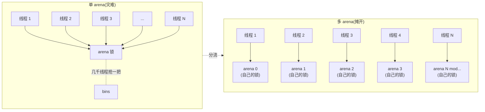
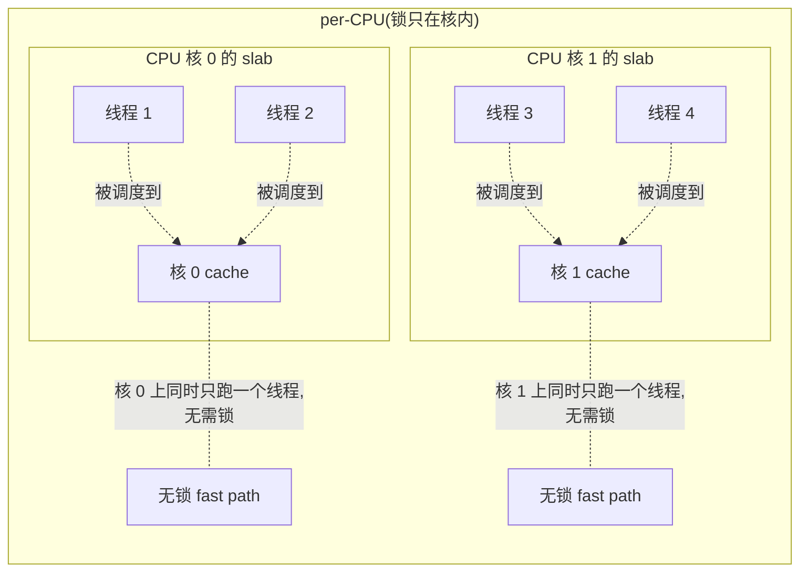

# 第十章 · 争用从哪来、三种解法

> 篇:P3 · 多核并发(不让锁成瓶颈)
> 主线呼应:前两章(P1-05、P1-06)我们立起了 fast path——每线程/CPU 手边一份私有缓存,`malloc`/`free` 在那里**无锁、O(1)、纳秒级**地命中;中心自由链表 + transfer cache 在本地缓存 miss 时**批量取还**,把一次锁的开销摊到几十块上。一切看起来都被锁治住了。但 P1-06 里我们悄悄留下了一个没回答的问题:**那些"锁"到底加在哪、谁在抢、抢起来有多疼**?这一章就是第 3 篇的**总纲章**:把"锁争用"这件事系统化——它从哪来、它的物理根源是什么、新一代分配器用哪三种根本不同的招数治它。读完这一章,你才真正看懂为什么后面 P3-11(jemalloc 的多 arena)和 P3-12(tcmalloc 的 per-CPU)会走上两条分叉的路。

## 核心问题

**P1-05 和 P1-06 已经告诉我们:fast path 用线程私有缓存甩掉了锁、中心层用批量把锁开销摊薄。那"锁争用"为什么还是分配器的头号性能命题?争用到底从哪冒出来——是哪些线程在抢哪把锁?新一代分配器(tcmalloc / jemalloc / mimalloc)相对 baseline ptmalloc,到底用什么三招把"几千个线程抢一把 arena 锁"的灾难拆解掉?**

读完本章你会明白:

1. **争用的根源不是"有锁",而是"多线程抢同一把锁"**:一把锁单线程下纳秒级,一旦被两个以上的核同时争抢,就要付"等锁 + 缓存行弹来弹去"的代价——争用次数随线程数指数级恶化。
2. **三种根本解法**:① **多 arena 把线程分流**(把一把锁变成 N 把,ptmalloc/jemalloc 走这条路)、② **per-CPU 让锁只在核内**(tcmalloc 新版独门,靠 rseq 让锁天然不跨核)、③ **fast path 彻底无锁**(四套都做,靠 tcache/heap 把 99% 的 malloc 挡在锁外)。三种不是互斥,而是叠加。
3. **为什么 ptmalloc 的"多 arena"仍不够**:它的 arena 数上限 `8 × ncpu`,几千个线程挤几十个 arena,锁争用没摊干净;而且它的 fast path(tcache)是后加的、容量小,miss 率高,中心锁被打得频。
4. **锁的内存模型代价**:不只是"等"——一把被争用的 `mutex`,会把锁变量在多个 CPU 的缓存行之间来回 invalidate(false sharing + cache-line ping-pong),实际代价是**微秒级**。
5. **三种解法各自治的是"争用的哪一面"**:多 arena 治"争用密度"(摊开)、per-CPU 治"跨核争用"(锁不跨核)、无锁 fast path 治"争用频率"(99% 不进锁)。理解了这三面,就理解了 P3-11、P3-12 为何分道扬镳。

> **如果一读觉得太难**:先只记住三件事——① 锁争用的根是"多核抢同一把锁",抢得越凶代价越大;② 三种解法是多 arena(摊)、per-CPU(锁只在核内)、无锁 fast path(99% 不进锁);③ ptmalloc 之所以被嫌,是它 arena 数有上限(8×ncpu)、tcache 又弱,高并发下中心锁仍被抢爆。抓住这三点,本章就通了。

---

## 10.1 一句话点破

> **锁争用的本质,不是"有锁",而是"多核同时抢同一把锁"——锁变量会在几个核的缓存行之间弹来弹去(原子写互斥),抢得越凶、核越多,代价越大。要治它,有且只有三种根本招数:① 把线程分流到多个 arena,把一把锁摊成 N 把(ptmalloc/jemalloc);② 让锁只在 CPU 核内存在,根本不跨核(tcmalloc per-CPU,靠 rseq);③ 用线程/CPU 私有缓存,让 99% 的 malloc 根本不进锁(四套都做)。这三种不是互斥——四套现代分配器都是把它们**叠加**,只是侧重点不同。**

这是结论,不是理由。本章倒过来拆:先看"一把锁"在被多核争用时,物理上到底发生什么、为什么不是"快一点"、而是"微秒级塌方";再看为什么"多 arena"是朴素且有效的第一招,ptmalloc 用了它却还不够;再看 per-CPU 这一招为什么是代差;最后落到 fast path 这把"挡在锁前的墙"。

---

## 10.2 争用的物理根源:一把锁被多核抢时,真正发生了什么

要治"争用",得先看清"争用"长什么样。我们回到 P1-05 留下的那条"加了锁的 free list":

```c
// 朴素方案:一条全局共享的 free list + 一把 mutex
pthread_mutex_lock(&freelist_lock);     // ① 抢锁
void* p = freelist_head;                // ② 读 head
freelist_head = freelist_head->next;    // ③ 写 head
pthread_mutex_unlock(&freelist_lock);   // ④ 放锁
```

单线程下,这是一段再普通不过的代码——`lock`/`unlock` 各几十纳秒,中间 pop 三条指令,加起来百纳秒以内。问题在于,`mutex` 的实现是用**一个原子变量**(典型是 futex 的 `lock` 字节)做的"占位标记":谁拿到谁持有,别人要等。多个核同时来抢时,会发生三件事,每件都要付钱:

**第一,原子写互斥。** `lock` 字段的更新是 `atomic exchange`(或 CAS),它带一个 `LOCK #` 前缀,会在硬件总线上**串行化**这条指令——同一时刻,整个内存子系统只允许一个核做这条原子写。换句话说,N 个核同时来抢,本质上是在一根独木桥上排队,N 个原子写排成一条串行链,谁也跑不快。

**第二,缓存行弹来弹去(cache-line ping-pong)。** `mutex` 那个 `lock` 字节所在的那 64 字节缓存行,谁的核拿到锁,这行就**独占**(Exclusive/Modified 态)在这核的 L1;另一个核要抢,就要把这行从对方 L1 **invalidate** 掉、再读到自己的 L1。锁在 A、B、C 三个核之间来回跳,这行缓存也跟着在它们的 L1 之间来回飞——每飞一次,是几十到上百纳秒的 inter-core 通信。

**第三,等锁期间的额外开销。** 真正的 `pthread_mutex_lock` 在抢不到时,会先**自旋**一小段(spin,试图等对方快放),自旋不到才 `syscall(futex, FUTEX_WAIT)` 把自己挂起——而一次 futex 系统调用是**微秒级**的(陷入内核、调度、切换上下文)。

> **钉死这件事**:一把被争用的 mutex,**慢的不是"加锁这条指令",而是这把锁的缓存行被多个核来回抢、来回 invalidate**。无争用一次 lock/unlock ~30ns,有争用一次轻则几百纳秒(缓存行弹来弹去),重则微秒级(进了 futex 等待队列)。**争用次数随"抢同一把锁的核数"近似平方级恶化**——2 个核争用已经几十纳秒,32 个核争用直接进微秒。

用一张表把"无争用"和"有争用"的差别钉死:

| 场景 | 一次 lock/unlock 的代价 | 根因 |
|------|------------------------|------|
| 单线程 / 无争用 | ~20-40ns | 一条原子指令,缓存行就在本核 |
| 2 核轻争用 | ~100-300ns | 缓存行在两核 L1 间弹一两次 |
| 多核重争用(自旋能拿到) | ~500ns-1µs | 缓存行在多核间反复弹,自旋烧 CPU |
| 多核重争用(自旋失败) | 数 µs | 进 futex syscall,内核调度挂起唤醒 |

这就是为什么 P1-05 千辛万苦把 fast path 做成**无锁**,P1-06 又用批量把中心锁的开销摊薄——中心层那把锁一旦被多核重争用,fast path 省下的纳秒全赔回去。**"治争用"不是让锁变快,是让锁被抢的次数和被抢的范围都降下来。**

---

## 10.3 治争用的第一招:多 arena——把一把锁摊成 N 把

既然"争用的根是多核抢同一把锁",最朴素、最有效的第一招就是:**别只用一把锁,开 N 把**。把线程分流到不同的 arena(竞技场),每个 arena 一套自己的 bins、自己的锁,不同 arena 的线程互不干扰。



> **不这样会怎样**:假设一个 32 核机器上跑 200 个线程,只有一个 arena、一把 bins 锁。每个 `malloc`/`free` 在中心层(本地缓存 miss 时)都要抢这把锁。200 个线程抢 1 把锁,争用密度极高,大量 CPU 时间花在 futex 等待队列里。开成 8 个 arena,每个 arena 平均 25 个线程,争用密度直接降到 1/64(锁被抢的概率随线程数平方下降)。开成 32 个 arena,平均每个 arena 6 个线程,几乎不争用。

这就是 ptmalloc 和 jemalloc 都用的招。它的本质是**把争用摊开**——锁的总数变多,每把锁的争用密度下降。

### ptmalloc:多 arena 的开创者,但天花板低

ptmalloc 是这条路的**开创者**,但也是"治得不彻底"的典型。它的逻辑(在线 [malloc.c](https://github.com/glibc/glibc/blob/main/malloc/malloc.c),实现在 arena.c 部分)大致是:

1. **主线程用 `main_arena`**:进程启动就有一个,主线程的所有分配都走它。
2. **多线程时动态开 arena**:一个新线程第一次 `malloc` 时,如果它还没有 arena,ptmalloc 会先去 arena 的 free list(`get_free_list`)找一个被释放的 arena;没有就尝试新建一个(`_int_new_arena`)。
3. **arena 数量有上限**:这个上限叫 `narenas_limit`,它的计算公式是 `NARENAS * ncpu`,其中 `NARENAS` 宏是常量 **8**(在 glibc 源码里 `#define NARENAS 8`)。所以 32 核机器上,arena 上限是 256 个——听起来不少。
4. **超上限就复用**:如果 arena 数已经到上限,新线程再来就只能 `reused_arena()`——在已有 arena 链表里循环找一个当前没被锁住的(或抢一次试试),把锁抢过来用。

> **钉死这件事**:ptmalloc 的 arena 上限是 `8 × ncpu`,看起来不少,但它的两个弱点在高并发下立刻露怯:**第一,上限是 8×ncpu,几千个线程的服务会把它打满**——打满后所有线程都挤在这有限几个 arena 上,`reused_arena` 的循环遍历本身也要抢 `list_lock`(一个全局锁),争用没摊干净。**第二,ptmalloc 的 fast path(tcache)是 glibc 2.26(2017)才后加的,容量小(默认每个 size class 只缓存 7 个小对象)**——tcache miss 率高,miss 了就要去 arena 抢锁。这两条叠加,ptmalloc 在"几千线程 + 高频小对象分配"的服务里,arena 锁仍是头号瓶颈。

### jemalloc:多 arena 的进阶版,默认 4×ncpu

jemalloc 把这一招做得更精细。它在初始化时就算好 arena 数量,看 [jemalloc_init.c:445-463](../jemalloc/src/jemalloc_init.c#L445-L463) 的 `malloc_narenas_default`:

```c
// jemalloc_init.c:445 —— 默认 arena 数量计算
static unsigned
malloc_narenas_default(void) {
    assert(ncpus > 0);
    /*
     * For SMP systems, create more than one arena per CPU by default.
     */
    if (ncpus > 1) {
        fxp_t    fxp_ncpus = FXP_INIT_INT(ncpus);
        fxp_t    goal = fxp_mul(fxp_ncpus, opt_narenas_ratio);   // L454 —— ncpus × ratio
        uint32_t int_goal = fxp_round_nearest(goal);
        if (int_goal == 0) { return 1; }
        return int_goal;
    } else {
        return 1;
    }
}
```

注意 **第 454 行 `fxp_mul(fxp_ncpus, opt_narenas_ratio)`**——`opt_narenas_ratio` 这个默认值,看 [jemalloc.c:188](../jemalloc/src/jemalloc.c#L188):

```c
// jemalloc.c:187-188 —— 默认 arena 比例
unsigned opt_narenas = 0;
fxp_t    opt_narenas_ratio = FXP_INIT_INT(4);     // 默认 ratio = 4
```

**`opt_narenas_ratio` 默认值是 4**——所以 jemalloc 默认开 **`4 × ncpus`** 个 arena。为什么是 4 而不是 1 或 ncpus?这是 P3-11 要详讲的权衡(简而言之:4× 比 ncpus× 更能容纳线程数 > 核数的场景,比更高的倍数又能省内存)。这里只要记住:**jemalloc 默认 4×ncpu,ptmalloc 默认 8×ncpu,数量级相当,但 jemalloc 的 fast path(tcache)更深、bin 锁更细,所以同样的 arena 数,jemalloc 的争用更轻**。

线程怎么分配到 arena?jemalloc 不是简单 round-robin,而是**按线程数最少优先**(least-loaded),看 [arenas_management.c:226-340](../jemalloc/src/arenas_management.c#L226-L340) 的 `arena_choose_hard`(每个线程第一次分配时调一次,之后绑定):

```c
// arenas_management.c:259 —— 选线程数最少的 arena
for (i = 1; i < narenas_auto; i++) {
    if (arena_get(tsd_tsdn(tsd), i, false) != NULL) {
        /* Choose the first arena that has the lowest number of threads assigned to it. */
        for (j = 0; j < 2; j++) {
            if (arena_nthreads_get(arena_get(tsd_tsdn(tsd), i, false), !!j)
                < arena_nthreads_get(arena_get(tsd_tsdn(tsd), choose[j], false), !!j)) {
                choose[j] = i;
            }
        }
    } else if (first_null == narenas_auto) {
        /* 没初始化的 arena 优先用(懒创建) */
        first_null = i;
    }
}
```

这段比 ptmalloc 的 `reused_arena`(纯遍历找一个能抢到锁的)更聪明:**它会优先用没初始化的 arena(`first_null`),其次选线程数最少的**——这样 arena 利用率更均衡,避免"一个 arena 挤爆、另一个空着"。

### 多 arena 的本质:摊争用,治不了跨核

> **所以这样设计**:多 arena 这一招的本质,是**把一把锁摊成 N 把**,让锁被抢的密度从"全线程抢 1 把"降到"N 分之一线程抢 1 把"。争用密度近似随线程数平方下降,N 每翻一倍,单把锁的争用降 4 倍。这是 ptmalloc 和 jemalloc 共同的"地基"。

但它有天花板,这条天花板由"arena 数 ≤ 核数 × 常数"决定:**线程数远超核数时(几千线程的服务),arena 数打不满,线程还要挤**。更要命的是,多 arena **治不了"跨核争用"本身**——一个 arena 的锁,仍然可能被调度在不同核上的线程抢(线程 A 在核 0、线程 B 在核 3,都用 arena 5,锁的缓存行在核 0 和核 3 的 L1 之间弹)。要治这个,得用第二招。

---

## 10.4 治争用的第二招:per-CPU——让锁只在核内

第二招是 tcmalloc 新版的**代差**,也是 P3-12 要深拆的重头戏。这里先把它和第一招的本质区别立清楚。

多 arena 的天花板是"线程和核不是一回事"——一个线程可能这秒在核 0、下秒被调度到核 3,但它的 arena 是绑死的(arena 5)。arena 5 的锁,就被核 0 和核 3 上的线程同时抢,锁缓存行照样跨核飞。

**per-CPU 反过来想:既然"跨核争用"的根是"锁不认核",那干脆让锁认核**——给每个 CPU 核一份**独立的** cache,线程被调度到哪核,就用那核的 cache;同核的线程天然串行(一个核同时只能跑一个线程),所以同一核的 cache 操作**不需要锁**。



这个"同核串行所以无锁"的洞察,听起来简单,实现起来极难——难点在"我怎么知道现在在哪核、而且这个核的 cache 不会被别的核同时改"。tcmalloc 用的是 Linux 的 **rseq(restartable sequences)**:一段被内核监视的代码,如果它在执行**中途被抢占**(中断、调度走),内核会**重启**这段代码(或跳到 abort handler)。这样,代码可以写"读当前核号 → 改本核的 slab",如果中途被调度走,内核把这段废掉重跑,保证不会"读到核 0、写到核 1"的撕裂。

看 tcmalloc 的开关:[cpu_cache.h:2821-2831](../tcmalloc/tcmalloc/cpu_cache.h#L2821-L2831) 的 `UsePerCpuCache`:

```cpp
// cpu_cache.h:2821 —— per-CPU 是否启用
template <typename State>
inline bool UsePerCpuCache(State& state) {
  // We expect a fast path of per-CPU caches being active and the thread being
  // registered with rseq.
  if (ABSL_PREDICT_FALSE(!state.CpuCacheActive())) {
    return false;
  }
  if (ABSL_PREDICT_TRUE(subtle::percpu::IsFastNoInit())) {   // L2829 —— rseq 已注册?
    return true;
  }
  // When rseq is not registered, use this transition edge to shutdown the
  // thread cache for this thread.
  ...
}
```

**第 2829 行 `subtle::percpu::IsFastNoInit()`**——这是 rseq 是否成功注册的探测。rseq 注册成功,per-CPU 才能用;注册失败(老内核、不支持 rseq),tcmalloc 退回 legacy 的 per-thread `ThreadCache`。这就是为什么 [tcmalloc.cc:1199](../tcmalloc/tcmalloc/tcmalloc.cc#L1199) 在 fast path miss 后要判断 `UsePerCpuCache`——开了走 per-CPU 的 `AllocateSlow`,没开退回 `ThreadCache::GetCache()->Allocate`。

> **钉死这件事**:per-CPU 这一招的本质,是**让锁认核**——同核线程天然串行,所以同核的 cache 操作不需要锁。实现靠 rseq:被抢占时内核重启这段代码,保证"读核号 → 改本核 cache"不会撕裂。**这一招治的是"跨核争用"本身**——因为同核串行,锁缓存行根本不会跨核飞。这是 tcmalloc 新版相对 ptmalloc/jemalloc 的代差,P3-12 详拆。

### 为什么 per-CPU 比多 arena 更彻底

用一个对比表把多 arena 和 per-CPU 的区别钉死:

| 维度 | 多 arena(ptmalloc/jemalloc) | per-CPU(tcmalloc 新版) |
|------|------------------------------|------------------------|
| **锁的分布** | 按 arena 分,N 把锁 | 按 CPU 核分,每核一份 cache |
| **线程绑定的对象** | arena(可能跨核) | CPU 核(随调度变) |
| **同对象多线程争用** | 仍可能(同 arena 的线程在不同核) | 不可能(同核串行) |
| **依赖** | 无特殊内核支持 | rseq(Linux 4.18+) |
| **内存开销** | N 个 arena 各自囤货 | 每核一份 cache,核数固定 |
| **线程数 ≫ 核数时** | arena 打满,仍争用 | 天然按核摊,不争用 |

per-CPU 的杀手锏在最后一行:**当线程数远超核数(典型服务,几千线程 vs 几十核),多 arena 的锁会被打满,per-CPU 不会**——因为 per-CPU 的并发单元是"核",核数是固定的几十个,而多 arena 的并发单元是"arena",arena 数有上限且远小于线程数。这就是为什么 tcmalloc 新版在高并发服务里能比 jemalloc 还稳——它的 fast path 天然按物理核摊开。

---

## 10.5 治争用的第三招:无锁 fast path——把 99% 的 malloc 挡在锁外

第一招(多 arena)和第二招(per-CPU)都在治"中心锁的争用"。第三招更狠:**让中心锁根本不被大多数 malloc 触发**。

这就是 P1-05、P1-06 已经讲透的 fast path——每个线程(CPU)一份私有缓存,`malloc`/`free` 在这里**无锁 pop/push**,命中率在 99% 以上。中心锁只有在 fast path miss 时才被碰一下,而且因为批量取还(P1-06),一次 miss 拿几十块回来,锁被碰的频率进一步压到"几十次分配才一次"。

> **所以这样设计**:三种解法不是互斥,而是**叠加**。看四套分配器实际怎么组合:

| 解法 | tcmalloc | jemalloc | mimalloc | ptmalloc |
|------|----------|----------|----------|----------|
| ① 多 arena 分流 | (transfer cache 中心层按 size class 分锁,不走 arena) | **是**,默认 4×ncpu 个 arena,线程绑定 | (不走 arena,走 thread-local heap) | **是**,默认 8×ncpu,动态开 |
| ② per-CPU | **是**,核心创新,靠 rseq | 实验性(`opt_percpu_arena`,可选) | 否 | 否 |
| ③ 无锁 fast path | `CpuCache`/`ThreadCache` | `tcache`(`cache_bin`) | thread-local `heap` | `tcache`(2.26+) |

这张表是本章的总览,也是 P3-11、P3-12 的入口。几个要点:

- **tcmalloc 是"per-CPU + 无锁 fast path"为主**,中心层(transfer cache / central freelist)按 size class 一把锁,不靠 arena 分流。它的策略是:**fast path 用 per-CPU 彻底治跨核争用,中心锁用批量摊薄,不需要 arena 这一层**。
- **jemalloc 是"多 arena + 无锁 fast path"为主**,per-CPU 是可选实验特性。它的策略是:**用 arena 把线程分流(治争用密度),每个 arena 内每 size class 一把 bin 锁(再细分),fast path 是 tcache**。
- **mimalloc 走的是"thread-local heap + 跨线程 delayed free"**,它的并发模型最特别——下一节细讲。
- **ptmalloc 是"多 arena + 弱 fast path"**,arena 上限 8×ncpu,tcache 后加且容量小,所以它在高并发下中心锁最疼。

### mimalloc 的特别之处:thread-local heap + 延迟释放

mimalloc 没有多 arena(至少不是它的并发主轴),它的并发模型靠**每个线程一个 thread-local heap**——`mi_malloc` 拿的就是 `mi_prim_get_default_heap()`(P0-01 见过,在 [alloc.c:207](../mimalloc/src/alloc.c#L207)),这是当前线程私有的 `mi_heap_t`。本线程的 `malloc`/`free` 操作这个 heap 的 page free list,**完全无锁**。

但有个问题:`free` 时,块可能不属于当前线程的 heap(线程 A 分配的块,线程 B 释放了)。直接跨线程改 A 的 free list 要锁,mimalloc 不上锁,而是用**延迟释放列表**(`thread_delayed_free`)——B 把块 CAS 到 A 的 heap 的一个延迟链表头([page.c:212](../mimalloc/src/page.c#L212) 的 `mi_atomic_cas_weak_acq_rel`),等 A 下次分配时自己处理(`_mi_heap_delayed_free_all`)。这样跨线程 free 也是无锁的(一次 CAS),真正的 free 由拥有者线程自己做。

看 [page.c:169-191](../mimalloc/src/page.c#L169-L191) 的 `_mi_page_try_use_delayed_free`:

```c
// page.c:169 —— 尝试设置 page 的 delayed free 状态(原子 CAS)
bool _mi_page_try_use_delayed_free(mi_page_t* page, mi_delayed_t delay, bool override_never) {
    ...
    mi_thread_free_t tfreex;
    mi_thread_free_t tfree = mi_atomic_load_relaxed(&page->xthread_free);
    do {
        if (tfree.delayed == MI_DELAYED_FREEING) { return false; }   // 别人正在释放,重试
        ...
        tfreex = tfree;
        tfreex.delayed = delay;
    } while (!mi_atomic_cas_weak_release(&page->xthread_free, &tfree, tfreex));  // L191
    ...
}
```

**第 191 行 `mi_atomic_cas_weak_release(&page->xthread_free, &tfree, tfreex)`**——一次原子 CAS 把"这个 page 是否允许延迟释放"的状态改掉。这就是 mimalloc 跨线程并发的核心:它不上锁,而是**把跨线程操作降到一次原子 CAS**,再让拥有者线程稍后批量处理。这是"无锁 fast path"思路的极致——连跨线程的边界都尽量不锁。

> **钉死这件事**:mimalloc 的并发模型是"thread-local heap(本线程完全无锁)+ 跨线程 delayed free(一次 CAS 入延迟列表,拥有者线程稍后处理)"。它没有多 arena、没有 per-CPU,但靠"heap 私有 + 延迟",把跨线程争用压到最低。这是"无锁 fast path"这一招的另一种极致实现。

---

## 10.6 中心锁的细分:从"一把大锁"到"按 size class 一把"

讲到这里,你可能有个疑问:前面说"多 arena 摊开",但 jemalloc 即使在**单个 arena 内部**,锁也不是一把。它把锁按"职责"和"size class"进一步细分——这是治争用的另一个维度:**锁的粒度**。

一个 jemalloc arena 内,有三类锁,各自独立,看 [arena.h:83-136](../jemalloc/include/jemalloc/internal/arena.h#L83-L136) 的 `struct arena_s`:

```c
// arena.h:83 —— arena 结构(简化,只列锁相关字段)
struct arena_s {
    ...
    /* 每个 size class 一个 bin,每个 bin 自己一把锁 */
    bin_t bins[...];   // bin_t 内含 malloc_mutex_t lock(见 bin.h:25)
    ...
    malloc_mutex_t large_mtx;               // L136 —— 大块分配的锁(独立)
    ...
    malloc_mutex_t cache_bin_array_descriptor_ql_mtx;  // L120 —— 统计链表的锁(独立)
    ...
};
```

而每个 `bin_t` 自己又有锁,看 [bin.h:22-25](../jemalloc/include/jemalloc/internal/bin.h#L22-L25):

```c
// bin.h:22 —— 每个 size class 一个 bin,自己一把锁
typedef struct bin_s bin_t;
struct bin_s {
    /* All operations on bin_t fields require lock ownership. */
    malloc_mutex_t lock;     // L25 —— 这个 bin 的专属锁
    ...
};
```

> **所以这样设计**:jemalloc 的锁是**三层细分**:① arena 之间分流(线程绑定到不同 arena,arena 间无共享锁);② 单个 arena 内,**每个 size class 一个 bin、一把 bin 锁**——分配 32 字节的线程和分配 64 字节的线程,抢的是**不同的锁**;③ 大块(`large_mtx`)、统计(`cache_bin_array_descriptor_ql_mtx`)各有独立锁。这样,即使一个 arena 上绑了很多线程,只要它们分配的 size class 不同,就不互相干扰。锁的粒度越细,争用密度越低。

tcmalloc 的中心层也做了类似细分——它不走 arena,但 [central_freelist.h](../tcmalloc/tcmalloc/central_freelist.h) 里每个 size class 一个 `CentralFreeList`,每个 `CentralFreeList` 自己一把 `absl::base_internal::SpinLock`(看 [central_freelist.h:271](../tcmalloc/tcmalloc/central_freelist.h#L271) 的 `absl::base_internal::SpinLock lock_;`)。`SpinLock` 比 `pthread_mutex` 轻(纯自旋,不进 futex,适合"持有时间极短"的场景),配合批量取还,中心锁的争用被压得很低。

> **钉死这件事**:"治争用"除了"开多个 arena / per-CPU",还有第三条路:**把锁的粒度做细**。四套都在做:tcmalloc 是"每 size class 一个 `CentralFreeList` + `SpinLock`"、jemalloc 是"每 arena × 每 size class 一个 `bin` 锁"、mimalloc 是"每线程一个 heap(几乎不共享)"、ptmalloc 是"每 arena 一把 `mutex`(粒度最粗,这也是它慢的原因之一)"。

---

## 10.7 锁的正确性:witness——jemalloc 怎么保证不锁死

讲了一堆"治争用"(性能),不能忘了锁的另一个面——**正确性**:多把锁并存时,怎么保证不死锁?

死锁的经典配方是"锁顺序不一致"——线程 A 先锁 X 再锁 Y,线程 B 先锁 Y 再锁 X,两个同时跑到中间就死锁。分配器内部有很多锁(arena、bin、large、extent、rtree、base……),它们之间存在"必须按某顺序加锁"的约束。jemalloc 用一个叫 **witness** 的机制在 debug build 下检查这个约束——每把锁带一个 `rank`(等级),加锁时 witness 检查"当前线程已持有的锁里,有没有比这把锁 rank 更高的",有就报错(因为意味着锁顺序反了)。

看 [witness.h:12-79](../jemalloc/include/jemalloc/internal/witness.h#L12-L79) 的 `enum witness_rank_e`:

```c
// witness.h:12 —— 锁的等级(witness 用于 debug build 检查锁顺序)
enum witness_rank_e {
    WITNESS_RANK_OMIT,
    WITNESS_RANK_MIN,
    WITNESS_RANK_INIT = WITNESS_RANK_MIN,
    WITNESS_RANK_CTL,
    WITNESS_RANK_TCACHES,
    WITNESS_RANK_ARENAS,              // arena 全局列表锁
    ...
    WITNESS_RANK_CORE,
    WITNESS_RANK_DECAY = WITNESS_RANK_CORE,
    ...
    WITNESS_RANK_RTREE,
    WITNESS_RANK_BASE,
    WITNESS_RANK_ARENA_LARGE,         // arena 的大块锁
    ...
    WITNESS_RANK_LEAF = 0x1000,       // 叶子锁(rank 最高,最后加)
    WITNESS_RANK_BIN = WITNESS_RANK_LEAF,         // bin 锁是叶子
    WITNESS_RANK_ARENA_STATS = WITNESS_RANK_LEAF,
    ...
};
```

每个 rank 对应一类锁,值越大表示"越后加"(LEAF = 0x1000 是叶子,最后加)。这个枚举**字面就是 jemalloc 锁的获取顺序**——`WITNESS_RANK_ARENAS`(全局列表)→ `WITNESS_RANK_RTREE`(radix tree)→ `WITNESS_RANK_BIN`(bin 锁,叶子)。任何 jemalloc 代码加锁时,只要按这个 rank 从小到大,就不会死锁;反过来,debug build 里如果代码违反这个顺序,witness 立刻 assert 失败。

> **不这样会怎样**:没有 witness 这类机制,一个有几十把锁的分配器(jemalloc 内部),任何一处锁顺序写反,就是**偶发死锁**——生产环境上很难复现、极难调试。witness 把"锁顺序"这个隐式约束**显式化**:每把锁带 rank,加锁时检查,违反就立刻炸。这是 debug build 的"防呆",也是 jemalloc 这种锁密集型代码能保持正确性的工程基建。

> **钉死这件事**:"治争用"是性能,但锁本身的正确性不能丢。jemalloc 用 witness(rank-based 锁顺序检查)在 debug build 防死锁,tcmalloc 用 absl 的 `SpinLock` 配合 RAII holder(`SpinLockHolder`)防遗忘 unlock。这是分配器"并发"这一面的另一只手——P5-17 fork 章会详讲 fork 时怎么在 prefork 抢所有锁(也是靠 witness 的全 rank 遍历)。

---

## 10.8 技巧精解:三解法的本质对比——一把锁 vs N 把锁 vs 锁只在核内

本章是第 3 篇的总纲,我们把三种解法的本质拆透,作为后面 P3-11、P3-12 的入口。

### 三种解法各自治的是"争用的哪一面"

"争用"不是一个单一概念,它有三个可量化的面:

1. **争用密度**(contention density):一把锁被多少线程抢。N 个线程抢 1 把,密度是 N;抢 N 把,密度是 1。
2. **争用频率**(contention frequency):这把锁被触发的频率。每次 malloc 都进锁,频率高;99% 不进锁,频率低。
3. **跨核争用**(cross-core contention):抢同一把锁的线程是否分布在不同核——同核串行不争用,跨核才争用。

三种解法,各自治其中一面:

| 解法 | 治哪一面 | 机制 | 代表 |
|------|---------|------|------|
| ① 多 arena | **争用密度**(把一把摊成 N 把) | 线程分流到不同 arena,每 arena 自己锁 | ptmalloc、jemalloc |
| ② per-CPU | **跨核争用**(让锁只在核内) | 按 CPU 核缓存,同核串行无锁,靠 rseq | tcmalloc 新版 |
| ③ 无锁 fast path | **争用频率**(99% 不进锁) | 线程/CPU 私有缓存,本地 pop/push | 四套都做 |

用 ASCII 把三种对比画清楚:

```
解法①:多 arena(把一把锁摊成 N 把)
                ┌─────────────────────────────────┐
  几千个线程 ──▶│ arena 0(锁)│ arena 1(锁)│ ... │  ← 锁数变多,每把密度降
                └─────────────────────────────────┘
  问题:线程可能跨核,arena 锁缓存行仍跨核飞

解法②:per-CPU(锁只在核内)
       核 0           核 1           核 2
       ┌──────┐      ┌──────┐      ┌──────┐
  T1──▶│核 0  │      │核 1  │◀──T3 │核 2  │◀──T5
  T2──▶│cache │      │cache │◀──T4 │cache │◀──T6
       │(无锁)│      │(无锁)│      │(无锁)│
       └──────┘      └──────┘      └──────┘
  同核串行,锁缓存行不跨核——彻底治跨核争用

解法③:无锁 fast path(99% 不进锁)
  malloc ──▶ 本地缓存 hit?(99%)
              │ yes → 无锁 pop,返回(根本不碰任何锁)
              │ no(1%) → 才进中心锁(批量摊薄)
```

### 反面对比:单 arena 一把大锁在高并发下的塌方

为了看清这三种解法为什么是"必需",我们做个反面对比——假设有一个"单 arena、一把大锁、没有 fast path"的朴素分配器(其实这就是 ptmalloc 早期版本的缩影),在 32 核机器上跑 1000 个线程会怎样:

```
朴素方案:1 个 arena + 1 把 mutex + 无 tcache

时间轴(每条 | 是一次 malloc 的锁操作):
核 0:  |──lock──pop──unlock──|    |──lock──pop──unlock──|
核 1:        |──(等锁)────────lock──pop──unlock──|
核 2:             |──(等锁,进 futex)────...──|
核 3:                  |──(等锁)──...──|
...
核 31:                              |──(等锁)──...──|
                                  ▲
                          锁被一个人独占时,其他 31 个核都在等
                          锁缓存行在 32 个核的 L1 间疯狂弹跳
                          futex 等待队列越来越长
```

这个场景下,实测的 `malloc` 延迟会从单线程的几十纳秒,**劣化到几百微秒**(因为大量线程进了 futex 等待队列,要被内核调度唤醒)。CPU 利用率看起来 100%,但大部分是在自旋空转或在内核里等锁——实际吞吐可能比单线程还低(锁的 serialization overhead)。

> **不这样会怎样**(三种解法叠加后的对比):同样 32 核 1000 线程,用 tcmalloc(per-CPU + fast path + size-class 细分锁):
> - 99% 的 malloc 在 per-CPU cache 里无锁命中,根本不进任何锁(争用频率 = 1%);
> - 1% miss 的去中心 `CentralFreeList`,每 size class 一把 `SpinLock`,锁密度极低(争用密度 = 几乎 0);
> - per-CPU 保证同核串行,锁缓存行不跨核(无跨核争用)。
>
> 实测的 `malloc` 延迟稳定在**几十纳秒**,和单线程几乎无差别。这就是三种解法叠加的力量——不是"快一点",是"在高并发下不塌"。

> **钉死这件事**:三种解法不是"三选一",而是**三个正交维度的叠加**——密度(多 arena)、频率(fast path)、跨核(per-CPU)。一个分配器把它们都做到,才能在几千线程的服务里稳如单线程。ptmalloc 只做到"多 arena",jemalloc 做到"多 arena + fast path + 锁细分",tcmalloc 做到"per-CPU + fast path + 锁细分",mimalloc 做到"thread-local heap + delayed free"。这就是为什么它们的性能在高并发下阶梯式拉开。

---

## 章末小结

这一章是第 3 篇的**总纲**,我们没有钻进任何一行复杂的实现(那些留给 P3-11、P3-12),但立起了三件贯穿全篇的东西:

1. **争用的物理根源**:锁争用慢的不是"加锁这条指令",是**锁变量在多核 L1 间弹来弹去**(原子写互斥 + 缓存行 ping-pong + futex 等待)。争用密度随抢同一把锁的核数近似平方恶化。
2. **三种根本解法**:① **多 arena**(把一把锁摊成 N 把,治争用密度,ptmalloc/jemalloc)、② **per-CPU**(让锁只在核内,治跨核争用,tcmalloc 新版独门,靠 rseq)、③ **无锁 fast path**(把 99% 的 malloc 挡在锁外,治争用频率,四套都做)。三者**正交叠加**。
3. **为什么 ptmalloc 是 baseline**:它的 arena 上限 8×ncpu,几千线程会打满;它的 fast path(tcache)是 2.26 才后加的、容量小,miss 率高;它的锁粒度粗(每 arena 一把 mutex)。这三条叠加,让它在高并发服务里中心锁最疼。

> **打个比方**(只在反直觉处点一下):多 arena 像是"把一个总收银台拆成 N 个窗口",排队的人分流了,但每个窗口前还是可能排长队、且排队的人来自不同楼层(跨核);per-CPU 像是"每个楼层自己的小卖部",同楼层的人串行买(同核串行),根本不需要排队;无锁 fast path 像是"每个工位自己备一个零件盒",99% 的拿取在工位完成,根本不去收银台。三层叠起来,就是"几千人同时要零件,但收银台几乎没人排队"。

回扣全书的二分法:这一章讲的"治争用",**全部服务于"局部缓存"这一面(fast path 的"快")**——多 arena、per-CPU、锁细分,都是为了让 fast path miss 后的中心层不卡。中心堆的"省"(合并、归还、大页)留给第 4 篇。记住:第 3 篇是 fast path 的"防御纵深"——本地缓存挡不住的,中心层接力,中心层不能被锁拖死。

### 五个"为什么"清单

1. **为什么一把被多核争用的 mutex 会慢到微秒?** 不是"加锁这条指令"慢,是**锁的缓存行在多核 L1 间弹来弹去**(原子写互斥) + 自旋失败时**进 futex syscall**(内核调度挂起唤醒)。无争用 ~30ns,重争用进 µs。
2. **为什么 ptmalloc 的"多 arena"在高并发下还不够?** arena 上限是 `8 × ncpu`(NARENAS=8),几千个线程的服务会把它打满,打满后 `reused_arena` 复用,锁密度没摊干净;而且 tcache 弱(miss 率高),中心锁被打得频。
3. **为什么 jemalloc 默认开 4×ncpu 个 arena?** 4× 是经验值——比 1×/ncpus× 更能容纳"线程数 > 核数"的场景(典型服务),比更高倍数又能省内存(每 arena 囤一份 cache)。线程绑定按 least-loaded(线程数最少优先),比 ptmalloc 的纯遍历复用更均衡。P3-11 详讲。
4. **为什么 per-CPU 能彻底治跨核争用?** 因为同核同时只跑一个线程(物理串行),同核的 cache 操作**天然不需要锁**;锁缓存行不会跨核飞。难点是"被抢占时怎么不撕裂"——靠 Linux rseq,内核在被抢占时重启这段代码。P3-12 详拆。
5. **为什么三种解法是叠加而非互斥?** 它们治的是争用的**三个正交维度**:多 arena 治密度、per-CPU 治跨核、fast path 治频率。一个分配器要稳如单线程,三个维度都得治——所以 tcmalloc/jemalloc 都是"多招并用",只是侧重不同。

### 想继续深入往哪钻

- **本章是 P3-11、P3-12 的总纲**。想立刻看多 arena 怎么落地,读 [arenas_management.c:226-340](../jemalloc/src/arenas_management.c#L226-L340) 的 `arena_choose_hard`(线程怎么被分流到 arena)、[jemalloc_init.c:445-463](../jemalloc/src/jemalloc_init.c#L445-L463) 的 `malloc_narenas_default`(4×ncpu 怎么算出来)。
- 想看 per-CPU 的开关,读 [cpu_cache.h:2821-2831](../tcmalloc/tcmalloc/cpu_cache.h#L2821-L2831) 的 `UsePerCpuCache`、[tcmalloc.cc:1199](../tcmalloc/tcmalloc/tcmalloc.cc#L1199) 的 `UsePerCpuCache` 分支。rseq 的细拆留给 P3-12。
- 想理解锁的粒度,读 [central_freelist.h:271](../tcmalloc/tcmalloc/central_freelist.h#L271) 的 `absl::base_internal::SpinLock lock_;`、[bin.h:22-25](../jemalloc/include/jemalloc/internal/bin.h#L22-L25) 的 `bin_t` 每 size class 一把锁。
- 想看锁正确性的防护,读 [witness.h:12-79](../jemalloc/include/jemalloc/internal/witness.h#L12-L79) 的 `witness_rank_e` 枚举(锁的获取顺序)、[mutex.h:264-268](../jemalloc/include/jemalloc/internal/mutex.h#L264-L268) 的 `malloc_mutex_lock`(先 trylock 再 slow path)。
- 想感受 ptmalloc 的朴素,看在线 [malloc.c](https://github.com/glibc/glibc/blob/main/malloc/malloc.c) 的 `arena_get2` / `reused_arena` / `_int_new_arena`(动态开 arena)、`__libc_lock_lock`(每 arena 一把 mutex)。

### 引出下一章

我们立起了"争用从哪来、三种解法"。接下来,第 11 章走进**多 arena 的进阶版**——jemalloc 的 arena 与 bin:它默认 4×ncpu 个 arena 怎么算、线程怎么绑定(least-loaded)、每个 arena 内每个 size class 一把 bin 锁怎么再细分、extent 操作的锁怎么分离、witness 怎么保证不死锁。这是"解法①"的工程化深拆。第 12 章再走"解法②"——tcmalloc 的 per-CPU cache:靠 rseq 怎么做到被抢占时安全回退、为什么这是 tcmalloc 新版相对 jemalloc 的代差。两条路在 P3 这一篇分叉,你会在第 12 章末尾看到它们各自的代价。
