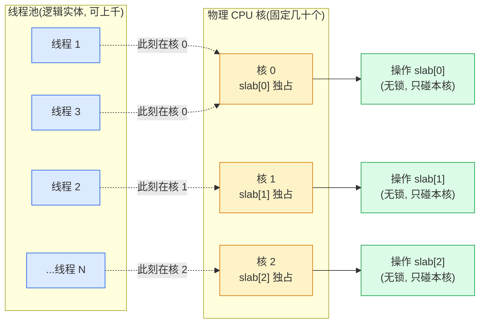
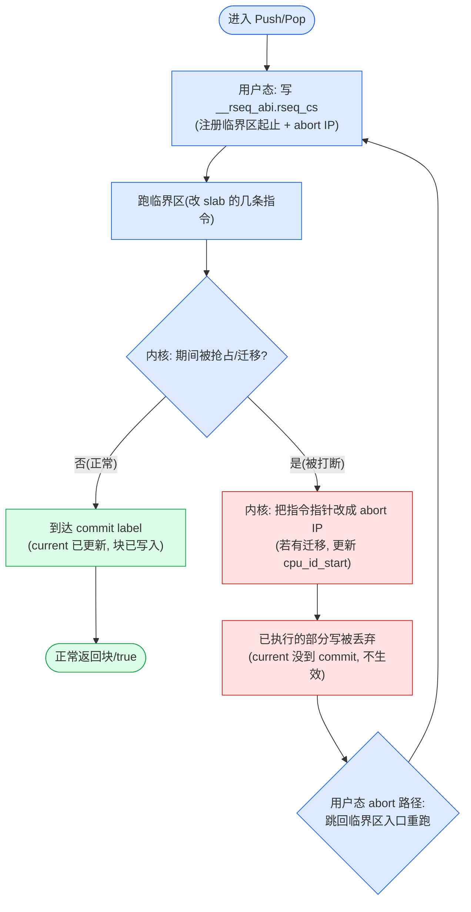

# 第十二章 · tcmalloc 的 per-CPU cache

> 篇:P3 · 多核并发(不让锁成瓶颈)
> 主线呼应:P3-10 把"锁争用"立成了第 3 篇的总命题,并给出三种解法:多 arena、per-CPU、无锁 fast path。P3-11 拆透了"解法①"——jemalloc 的多 arena 方案。这一章是"解法②"的工程化深拆,也是**第 3 篇的技术高峰**:专拆 tcmalloc 新版的 per-CPU cache。它的核心动作只有一个——**不再按"线程"缓存,而是按"CPU 核"缓存**,线程被调度到哪核,就用哪核的 cache。这个看似简单的改动,要把"无锁 per-CPU 操作在被抢占时仍然安全"这件极难的事做成,靠的是 Linux 内核的 **rseq(restartable sequences)**。读完这一章,你会理解为什么 tcmalloc 新版敢把锁的粒度推到"物理核"这一极限、它凭什么 sound、以及它和 jemalloc 多 arena 的代差到底在哪条线上。本章收束第 3 篇——两条治争用的路在这里分叉,你会在章末看到它们各自的代价,以及为什么"per-CPU"成了当代分配器的方向。

## 核心问题

**第 11 章我们看到,jemalloc 用"多 arena × 每 size class 一把 bin 锁"把锁争用压到了极低。但这条路有个天花板——它治不了"跨核争用"本身:绑在同一个 arena 上的线程可能被调度到不同的物理核上,它们抢同一把 bin 锁时,锁的缓存行仍会在核间弹来弹去(cache line bouncing),一次抢锁就是一次跨核同步。tcmalloc 新版走了另一条路:既然争用的根源是"锁跨核",那就**让锁根本不跨核**——每个 CPU 核一份私有 cache(一份 slab),线程被调度到哪核,就操作哪核的 slab,fast path 上**没有任何一把锁被两个核同时碰**。问题来了:线程可以在任意时刻被抢占、被迁移到另一个核,这种"中途换核"会让正在改 slab 的操作半途而废、数据结构撕裂。怎么做到无锁又不撕裂?靠 Linux 的 **rseq(restartable sequences)**:内核在线程进入临界区时记一个序列号,若临界区被抢占/迁移打断,内核把序列号标脏,用户态读到"被打断"就重做。这是 tcmalloc 相对 jemalloc 的代差——它把 fast path 的锁彻底消灭了,代价是把正确性托付给了内核的 rseq 机制。**

读完本章你会明白:

1. **per-CPU 的动机:线程数 ≫ 核数时,per-thread cache 浪费且迁移贵**。一个几百线程的服务跑在几十核上,per-thread cache 要开几百份(每份囤一批块,总占用飙升);线程在核间迁移时,它在本核的 cache 内容失去 cache 局部性,还会和别的核的 cache 抢同一缓存行(false sharing)。per-CPU 只按物理核开 cache,核数固定(几十份),线程被调度到哪核就用哪核的 cache,天然摊开、天然避免 false sharing。
2. **难点:线程被抢占/迁移时,正在改 slab 的操作会撕裂数据结构**。比如"读 current 指针 → 拿槽里的块 → current 减一"这三步,若在第二步被抢占并迁移到另一核,另一个核的线程也在改同一个 current,数据就乱了。无锁也救不了——原子 CAS 解决不了"操作语义上要原子地完成三步"。
3. **rseq 的解法:restartable sequences**。Linux 4.18+ 提供 `rseq` 系统调用:线程注册一个 `__rseq_abi` 结构,进入临界区前把"临界区起止地址"写进 `__rseq_abi.rseq_cs`;内核在线程被抢占/迁移/信号打断时,把 `__rseq_abi` 标脏(写一个 abort IP)。用户态读完临界区后检查"有没有被打断",被打断就跳到 abort 路径重做。tcmalloc 的 Push/Pop 就是用一段内联汇编包住"改 slab"的几条指令,配 rseq 的 prologue/epilogue,做到"要么完整跑完,要么完全没跑过"。
4. **为什么 sound**:每个核的 slab 只被"当前跑在该核上的那个线程"修改,rseq 保证这个修改要么完整、要么不存在;别的核的线程改的是别的核的 slab,物理上碰不到同一块内存。所以 per-CPU slab 的操作不需要锁、不需要 CAS——它是"靠 rseq 把临界区做成原子的",而临界区只碰本核的数据。这是 tcmalloc fast path 纳秒级且无争用的根。
5. **与 jemalloc 多 arena 的代差**:jemalloc 的 bin 锁是"逻辑锁"(锁一个 arena 的一个 size class),锁仍可能被跨核争用;tcmalloc 的 per-CPU slab 是"物理隔离"(每个核独占一份),fast path 上根本没有锁这个概念。前者治"逻辑争用密度",后者治"物理跨核 bouncing"。代价是 tcmalloc 把自己绑死在 Linux + rseq 上(非 Linux 退化为 legacy thread cache),而 jemalloc 是纯用户态、跨平台。

> **如果一读觉得太难**:先只记住五件事——① tcmalloc 按"CPU 核"缓存,不按线程,核数固定几十份,线程被调度到哪核就用哪核的 cache;② fast path(`AllocateFast`/`DeallocateFast`)无锁、无 CAS,只读写本核 slab;③ 难点是线程被抢占会撕裂操作,靠 Linux rseq 解决——临界区被内核打断就重做,要么完整要么不存在;④ tcmalloc 把 `__rseq_abi` 和缓存的 slab 指针塞进同一个缓存行,用"最高位标记缓存有效"的技巧让 fast path 只读一次 TLS;⑤ 这是 tcmalloc 相对 jemalloc 的代差——锁彻底不跨核。抓住这五点,本章就通了。

---

## 12.1 一句话点破

> **jemalloc 的多 arena 把锁按"逻辑维度"摊开(横向按 arena、纵向按 size class),锁的总数多了、每把锁的争用密度低了,但锁本身仍是跨核的——绑在同一 arena 的线程若被调度到不同核,抢同一把 bin 锁时缓存行仍会在核间弹。tcmalloc 的 per-CPU cache 走了更狠的一步:把 cache 按"物理核"摊开,每个核一份独占 slab,fast path 上根本没有"锁"这个概念——线程被调度到核 N,就只读写核 N 的 slab,别的核的线程物理上碰不到它。这把"跨核争用"从根上消灭了。代价是:线程可以在任意时刻被抢占/迁移,正在改 slab 的操作会半途撕裂,必须靠 Linux rseq(restartable sequences)做到"临界区要么完整跑完、要么完全没跑过"。rseq 是这一章的命脉,也是 tcmalloc 新版相对 jemalloc 的代差所在。**

这是结论,不是理由。本章倒过来拆:先看 per-thread cache 在"线程数 ≫ 核数"时的三道墙(浪费、迁移代价、false sharing),再看 per-CPU 怎么把它们一并解掉;然后进入硬骨头——线程被抢占怎么办,rseq 怎么把"无锁 per-CPU 操作"做 sound;接着拆 tcmalloc 的 slab 内存布局(current/end header + 指针槽 + 哨兵)和 rseq 汇编临界区(`__rseq_abi` 重叠布局、cached slabs bit、Push/Pop 的几条指令);最后是 legacy thread cache 对照、四套横评、收束第 3 篇。

---

## 12.2 per-thread cache 的三道墙:为什么从"线程"升级到"CPU"

第 5 章讲过,fast path 必须无锁,经典做法是给每个线程一份私有缓存(tcache / ThreadCache)。这条路用了二十年,在"线程数 ≈ 核数"时很好。但当代服务的线程数常常远超核数——一个 32 核的机器跑几百甚至上千个线程(RPC 框架的线程池、Go runtime 之外的 C++ 服务、数据库连接池)。这时 per-thread cache 撞上三道墙。

### 墙一:总占用爆炸(线程数 × 每份囤货)

每个线程的 cache 为了让 fast path 命中率高,都要囤一批块(每个 size class 几个到几十个)。一个 88 个 size class 的 tcmalloc,假设平均每 class 囤 8 个块、平均块 64 字节,一份 cache 就要囤 `88 × 8 × 64 ≈ 45 KB`。1000 个线程就是 **45 MB** 纯缓存囤货,而且这些块"借了不急着还",RSS 居高不下。

> **不这样会怎样**(朴素 per-thread,1000 线程):每线程 45 KB,总囤货 45 MB。更要命的是这些块分散在 1000 份 cache 里,任何一个线程释放的块都很难被另一个线程复用(它们在不同的 cache 里),中心层回收压力大,外部碎片也高。

### 墙二:线程迁移的代价(本核的 cache 局部性丢失)

线程不是固定在一个核上跑的——内核调度器会根据负载把线程在核间迁移。一个线程在核 0 上分配了一堆块(进了核 0 的 L1/L2 cache),下一毫秒被迁到核 5,它再访问这些块就是 cache miss(核 5 的 cache 里没有)。频繁迁移时,per-thread cache 的局部性优势被迁移吃掉。

更糟的是 cache 数据结构本身的局部性:ThreadCache 对象是 thread-local 的,它跟着线程走。线程在核 0 时,ThreadCache 的 hot 字段(size_、list_ 头)进了核 0 的 cache;迁到核 5 后再访问,要从核 0 的 cache 把这些行搬过来(或者重新从内存读)。每次迁移都是一次"cache 重建"。

### 墙三:false sharing(两个线程的 cache 落同一缓存行)

这是最阴险的一道墙。两个线程各自一份 ThreadCache,如果它们的 hot 字段(比如 size_)恰好落在同一个 64 字节的缓存行里(分配器分配 ThreadCache 时没做缓存行对齐),那么线程 A 改自己的 size_,会让核 0 上缓存了这一行的副本 invalidate;线程 B 在核 5 上改自己的 size_,又让核 5 的副本 invalidate。两个线程看似各改各的字段(逻辑无共享),物理上却为同一缓存行反复打架——这就是 false sharing,会让 fast path 从纳秒级退化到几十纳秒(cache line bouncing 的代价)。

> **钉死这件事**:per-thread cache 的三道墙——总占用爆炸(线程数 × 囤货)、迁移丢失局部性、false sharing(缓存行跨核弹)——都在"线程数 ≫ 核数"时集中爆发。根因是:线程是逻辑实体(可以有上千个),核是物理实体(只有几十个),per-thread 把 cache 按逻辑实体组织,自然被逻辑实体的数量和流动性拖累。

### per-CPU:把 cache 按物理核组织

tcmalloc 新版的解法,一句话:**把 cache 按"物理 CPU 核"组织,不按线程**。一个机器有 N 个核,就开 N 份 cache(叫做 per-CPU slab),每核一份。线程被调度到核 i,就用核 i 的 slab;下一毫秒被迁到核 j,就用核 j 的 slab。线程本身没有专属 cache——它"借用"当前所在核的 cache。

这个改动把三道墙一并解掉:

- **墙一(总占用)解掉**:cache 份数 = 核数(几十份),不再随线程数增长。1000 线程在 32 核机器上,仍只有 32 份 cache,总囤货 = 32 × 每份,可控。
- **墙二(迁移局部性)解掉**:cache 是 per-CPU 的,跟着核走,不跟着线程走。线程迁到核 j,直接用核 j 的 slab——核 j 的 slab 一直在核 j 上被各种线程访问,它的 hot 字段常驻核 j 的 L1/L2。线程换核反而立刻拿到"已经在 cache 里"的数据。
- **墙三(false sharing)解掉**:每核一份 slab,物理上独占(分配时按缓存行对齐),不同核的 slab 落在不同缓存行。两个线程即使分配同一个 size class,只要它们在不同核上,改的是不同核的 slab,不共享缓存行。

用一张图把"线程 → 被调度到核 → 用该核 slab"画清楚:



注意一个反直觉点:**多个线程可以"同时"在同一个核上**——但同一个物理核同一时刻只能跑一个线程(忽略 SMT/超线程),所以"在核 0 上"的线程 1 和线程 3 是**分时**共享核 0 的 slab,它们不会真正并发地改 slab[0]。这是 per-CPU 无锁成立的前提之一(详见 12.4 的 sound 性论证)。

> **钉死这件事**:per-CPU cache 的核心 insight 是——**线程是逻辑实体(可上千、会迁移),核是物理实体(固定几十、不动)**。把 cache 按物理核组织,就甩掉了"逻辑实体的数量和流动性"带来的三道墙。代价是引入一个新难题:线程被抢占/迁移时,正在改 slab 的操作怎么办。这个难题就是 rseq 要解决的。

### 源码印证:UsePerCpuCache 这个总开关

tcmalloc 的入口在小块分配的 fast/slow 分流处([tcmalloc.cc:1196-1204](../tcmalloc/tcmalloc/tcmalloc.cc#L1196-L1204)):

```cpp
// tcmalloc.cc:1196 —— 小块分配的 fast/slow 分流
void* res;
// If we are here because of sampling, try AllocateFast first.
if (ABSL_PREDICT_TRUE(weight == 0) ||
    (res = tc_globals.cpu_cache().AllocateFast(size_class)) == nullptr) {  // L1198
  if (UsePerCpuCache(tc_globals)) {                                         // L1199
    res = tc_globals.cpu_cache().AllocateSlow(size_class);                  // L1200 —— per-CPU: 缓存 miss 去中心补货
  } else {
    res = ThreadCache::GetCache()->Allocate(size_class);                    // L1202 —— legacy: 线程缓存
  }
  if (ABSL_PREDICT_FALSE(res == nullptr)) return policy.handle_oom(size);
}
```

**第 1198 行 `cpu_cache().AllocateFast(size_class)`** 就是 per-CPU fast path——它从"当前核的 slab"里 pop 一块(详见 12.5 的 `TcmallocSlab::Pop`)。**第 1199 行 `UsePerCpuCache(tc_globals)`** 是总开关:开了 per-CPU,miss 后走 `AllocateSlow`(去中心 transfer cache 批量补货);没开(老内核不支持 rseq,或显式关掉),退回 legacy 的 `ThreadCache::GetCache()->Allocate`(per-thread)。

`UsePerCpuCache` 本身在 [cpu_cache.h:2822-2831](../tcmalloc/tcmalloc/cpu_cache.h#L2822-L2831):

```cpp
// cpu_cache.h:2822 —— per-CPU 是否启用的快路径判断
inline bool UsePerCpuCache(State& state) {
  // We expect a fast path of per-CPU caches being active and the thread being
  // registered with rseq.
  if (ABSL_PREDICT_FALSE(!state.CpuCacheActive())) {
    return false;
  }
  if (ABSL_PREDICT_TRUE(subtle::percpu::IsFastNoInit())) {
    return true;
  }
  // When rseq is not registered, use this transition edge to shutdown the
  // thread cache for this thread.
  ...
}
```

两个条件:**① `CpuCacheActive()`——全局开关**(配置/初始化层面决定要不要用 per-CPU);**② `percpu::IsFastNoInit()`——本线程的 rseq 是否已注册成功**。第 12.6 节会拆 `IsFast` 怎么靠 `__rseq_abi.cpu_id` 判断本线程有没有和内核注册过 rseq。注意 `ABSL_PREDICT_TRUE(IsFastNoInit())`——绝大多数情况下 per-CPU 是开的,这里是无锁的 fast path 判断。

> **钉死这件事**:tcmalloc 的 per-CPU 是个**运行时开关**,不是写死的。它能优雅退化:`UsePerCpuCache` 检查全局开关 + 本线程 rseq 是否注册成功,任一不满足就退回 legacy `ThreadCache`(per-thread)。这意味着 tcmalloc 在不支持 rseq 的内核(老 Linux、macOS、Windows)上自动退化为 per-thread,代码同一份。

---

## 12.3 难点浮现:线程被抢占,操作会撕裂

per-CPU 的好处讲清楚了,现在直面它的命门。**线程可以在任意时刻被抢占、被迁移到另一个核**。这在多核系统上是常态——时钟中断、I/O 等待、更高优先级线程抢占,都会让当前线程"中途下台"。如果线程正在改 slab 的中途被抢走,会发生什么?

### 一个会撕裂的朴素 per-CPU Pop

假设我们天真地用普通 C++ 写 per-CPU 的 Pop(从当前核 slab 拿一块),不靠任何同步原语:

```cpp
// 朴素(错误!)的 per-CPU Pop,演示撕裂
void* PopNaive(int cpu, size_t size_class) {
  Slab* slab = &slabs[cpu];              // 拿当前核的 slab
  uint16_t cur = slab->current[size_class];   // ① 读当前指针
  void* obj = slab->slots[cur - 1];      // ② 拿槽里的块
  slab->current[size_class] = cur - 1;   // ③ current 减一
  return obj;
}
```

这三步看起来无害,但在 per-CPU 无锁的前提下,会出两种致命的撕裂:

**撕裂场景 A:抢占后两个核改同一个 current**。线程 T1 在核 0 上执行,读到 `cur = 5`,正准备执行②。此时被时钟中断抢占,调度器把 T1 挂起,让线程 T2 上核 0。T2 也来 Pop,读到 `cur = 5`(因为 T1 还没改③),执行②拿到 `slots[4]`,执行③把 current 改成 4。然后 T1 被唤醒——但唤醒时它可能被调度到了核 5(不是核 0!)。T1 继续执行②③:它手里的 `cur` 还是 5,于是它写 `slots[4]` 拿到的块(和 T2 拿的是**同一个**!),然后把"核 5 的 slab 的 current"改成 4——**但核 5 的 current 本来可能是别的值,被 T1 错改了**。结果:同一个块被发两次(双重分配),核 5 的 slab 状态被破坏。

**撕裂场景 B:current 的读改写不原子**。即使没有迁移,在核 0 上,T1 读 `cur=5`,被抢占(没迁移,只是时间片用完);T2 上核 0,读 `cur=5`,改成 4;T1 恢复(还在核 0),用它手里过时的 `cur=5` 改成 4——结果**两次 Pop 只让 current 减了一次**(T2 的减被 T1 覆盖),`slots[4]` 这个槽被认为"还有块"但实际已经被 T2 拿走了。

### 为什么"原子 CAS"救不了

第一反应可能是:用 `compare_exchange` 把③改成原子的"读改写"。但这救不了:

```cpp
// 用 CAS 也不够
uint16_t cur = slab->current[size_class].load();
void* obj = slab->slots[cur - 1];      // ①② 拿块(基于 cur)
// 在这一步之间,别的线程可能改了 current!
uint16_t expected = cur;
slab->current[size_class].compare_exchange_strong(expected, cur - 1);  // ③ CAS
```

问题在于:**`obj` 是基于旧的 `cur` 拿的**。如果 CAS 之间 current 被别的核改了,CAS 会失败——但 `obj` 已经从 `slots[cur-1]` 里读出来了。重试的话,要用新的 `cur` 重新读 `obj`。但还有更微妙的:**在①②和③之间,这个槽 `slots[cur-1]` 可能已经被另一个线程拿走、改写了内容**(比如填了哨兵、或者别的块)。所以 CAS 只保证了 `current` 这个计数器的原子更新,保证不了"`obj` 真的是当前应该弹出的那个块"——中间任何被打断,语义都已经错了。

更根本的是:**per-CPU 的卖点就是无锁、无 CAS**(CAS 在高并发下仍有争用,且本核改 current 时若别的核也改,缓存行仍会弹)。如果每个 Pop 都要 CAS,per-CPU 相对 per-thread 的优势就没了——还不如回去用 per-thread cache + 锁。

> **不这样会怎样**(朴素 per-CPU 无同步):撕裂场景 A(双重分配 + 错改别核 slab)和 B(current 覆盖)会在抢占频繁时**随机出现**,表现为"同一块被 free 两次"(double free)、"内存破坏"、极难复现的崩溃。这是 per-CPU 无锁方案必须从根上消灭的问题。

### 我们需要什么:临界区要么完整、要么不存在

朴素 per-CPU 撕裂的根因是:Pop 的三步(读 current、拿块、写 current)在语义上是一个**不可分割的临界区**,但抢占让它可以被从中间切开。我们需要的是:**要么这三步完整地跑完(中间不被打断),要么完全没跑过(被打断了就当没发生,重做)**。

这就是 "restartable sequences"(rseq)的语义——**用户态把一段代码标记为"临界区",内核保证它要么完整执行、要么在被抢占/迁移时把它"重启"(让用户态从头再来)**。rseq 不是锁,不是 CAS,它是一种"和内核协作的原子性保证":用户态声明"我要做一段不可分割的操作",内核在线程被抢占时把控制权交回用户态的 abort 路径,用户态自己决定重试。

> **钉死这件事**:per-CPU 无锁的命门是"线程被抢占会撕裂临界区"。原子 CAS 救不了——它只保护单个变量的读改写,保护不了"基于旧值读块、再更新计数"这种跨多步的语义原子性。我们需要的是"整段临界区要么完整、要么不存在",这正是 Linux rseq 提供的语义。下一节拆 rseq 怎么做到。

---

## 12.4 rseq:让无锁 per-CPU 操作 sound

rseq(restartable sequences)是 Linux 4.18(2018)引入的系统调用,专门为"per-CPU 无锁数据结构"设计。tcmalloc 是它的头号用户之一。这一节是全章最硬的部分,把 rseq 的机制、tcmalloc 怎么用它、为什么 sound,逐一拆透。

### rseq 的核心机制:__rseq_abi 与序列号

每个线程注册 rseq 时,内核给这个线程绑定一个 `struct kernel_rseq __rseq_abi`(thread-local)。这个结构有几个关键字段:

- **`cpu_id_start` / `cpu_id`**:内核实时更新的"当前 CPU 核号"。线程每被调度上 CPU,内核就把这个字段写成当前核号;线程被迁移,内核立刻更新。
- **`rseq_cs`**:用户态写的"当前临界区描述符"指针——指向一段 `{临界区起始 IP, 临界区结束 IP, abort IP}`。

rseq 的工作流程(用户态 + 内核协作):

1. **用户态进入临界区前**,把临界区的起止地址写进 `__rseq_abi.rseq_cs`(告诉内核"我接下来要跑这段代码,请盯着我")。
2. **用户态跑临界区**(改 per-CPU 数据,比如 slab 的 current)。
3. **正常情况**:临界区完整跑完,用户态清空 `rseq_cs`,继续往下走。
4. **被抢占/迁移的情况**:内核在把线程挂起(或迁移到别的核)之前,检查 `rseq_cs` 是否非空。若非空(说明线程正在临界区里),内核**把执行流强行跳到 abort IP**——也就是说,临界区没有"跑完",而是从 abort IP 重新开始。同时,内核已经把 `cpu_id_start` 更新成新核号(如果迁移了)。

关键点:**abort IP 必须是临界区起点之前**(通常就是临界区入口)。这样"跳到 abort IP"等价于"重头跑这段临界区"。从用户态看,这段代码"好像被重启了"。因为 per-CPU 数据的修改要么完整、要么没发生(中断点之后的修改没执行),数据结构不会停留在"半改"状态——这就是 sound 的基础。

用一张 ASCII 图把 rseq 的时序画清楚:

```
线程 T1 在核 0 上, 要 Pop 一块(临界区 = 改 slab[0].current)

时间轴 ──────────────────────────────────────────────────────►

  [用户态]                      [内核]                 [用户态]
  写 rseq_cs (指向临界区)         |
  进入临界区:                     |
    读 current = 5        ──────►| (内核盯梢)
    读 slots[4] → obj            |
    ★ 时钟中断到这里 ★            |
                          ◄──────| 抢占 T1
                                  | 检查 rseq_cs 非空?
                                  |   是 → 不让 T1 "跑完"
                                  |   把 T1 的指令指针改成 abort IP
                                  |   (若有迁移) 更新 cpu_id_start = 新核号
                          ──────►| 
  跳到 abort IP(= 临界区入口) ◄────┘
  重头跑: 写 rseq_cs
    读 current(此时是新的核的 slab 的 current!)
    ...要么完整跑完, 要么又被打断重来
  
  最终: 临界区要么完整跑完(current 减一, obj 返回)
        要么反复被打断(但每次都从头来, 永远不会"半改")
```

把 rseq 的两条路径(正常完成 vs 被抢占重启)用状态图画清楚:



注意一个微妙点:**rseq 不保证临界区一定能跑完**。如果线程特别倒霉、连续被抢占,它会反复重启。但实际上,临界区只有几条指令(纳秒级),被连续打断的概率极低——这是 rseq "乐观"的一面:它假设抢占是稀有事件,正常情况下临界区一气呵成。

### 为什么 rseq 让 per-CPU sound

回到 12.3 的撕裂场景,看 rseq 怎么消灭它们:

- **撕裂 A(抢占后改别核 current)**:线程 T1 在核 0 读到 `cur=5`,被抢占。内核检查到 T1 在临界区,把 T1 跳到 abort IP(从头重跑)。T1 醒来时若在核 5,它重跑会读"核 5 的 current"(不是核 0 的 5!)——它手里的旧 `cur=5` 被丢弃,不会用旧值去改核 5。**rseq 通过"重头跑"保证线程永远用"当前所在核"的最新数据,不会用过时的、属于别的核的数据。**
- **撕裂 B(current 覆盖)**:T1 读 `cur=5` 被抢占,重头跑;T2(在核 0)正常跑完把 current 改成 4;T1 恢复(假设还在核 0),重头跑读 `cur=4`,正确地处理"现在 current 是 4"的状态。**rseq 通过"完整或不存在"保证不会出现"T1 用旧 cur 覆盖 T2 的新值"。**

更根本的 sound 论证:

> **每个核的 slab,在同一时刻只被一个线程修改**。因为一个物理核同一时刻只跑一个线程(忽略 SMT),所以"在核 i 上的线程"是唯一的 slab[i] 修改者。rseq 保证这个修改要么完整、要么不存在。即使线程被抢占(下台),它在下台前要么完整改完、要么没改;被唤醒后若换核了,它改的是新核的 slab,和旧核的 slab 互不干扰。所以**任意时刻,任意一个核的 slab 都处于一致状态**(要么是上一次完整修改后的结果,要么正在被唯一一个线程改)。这就是 per-CPU slab 无锁 sound 的全部秘密。

用一句话浓缩:**per-CPU 的"锁"不是一把数据结构里的锁,而是"物理核的独占性" + "rseq 的原子性保证"——前者保证同一块内存同时只有一个修改者,后者保证修改不会半途而废**。

### rseq 不是万能的:它只保护"不跨核"的操作

sound 论证里有一个前提不能忘:**rseq 只在"临界区只碰 per-CPU 数据"时成立**。如果临界区里碰了**跨核共享的数据**(比如一个全局计数器、一个链表头),rseq 就不 sound 了——因为别的核的线程可能同时改这个共享数据,rseq 管不到它们(它们没有"被同一个核独占"的保证)。

这就是为什么 tcmalloc 的 per-CPU fast path **只碰当前核的 slab**(`slab[cpu_id].current`、`slab[cpu_id].slots`),绝不碰跨核的东西。跨核的操作(中心 transfer cache 的批量取还、统计)走 slow path,那里有正经的锁(central_freelist 的 `SpinLock`)。**fast path 靠 rseq 无锁,slow path 靠锁——这是清晰的分工。**

> **钉死这件事**:rseq 的 sound 性建立在两个前提上:① 临界区只碰"当前核的 per-CPU 数据"(不碰跨核共享的);② 一个物理核同一时刻只有一个线程在改它的 slab。rseq 保证这个修改要么完整要么不存在,所以每个核的 slab 永远处于一致状态。跨核共享的数据(中心链表、统计)不归 rseq 管,走 slow path 的锁。

---

## 12.5 tcmalloc 的 per-CPU slab:内存布局

讲清了 rseq 的原理,现在落到 tcmalloc 的具体实现:它的 per-CPU 数据结构(per-CPU slab)长什么样、Push/Pop 怎么用 rseq 改它。核心文件是 [percpu_tcmalloc.h](../tcmalloc/tcmalloc/internal/percpu_tcmalloc.h) 里的 `TcmallocSlab` 模板。

### 整体布局:N 个核的 slab 拼成一大块连续内存

tcmalloc 把所有核的 slab 拼成**一大块连续的虚拟内存**,每核占固定大小的一片(叫一个"slab region")。布局是:

```
┌─────────────────────────────────────────────────────────────────────┐
│  整块 slabs 内存(用 mmap 分配, 按 EXEC_PAGESIZE 对齐)                │
├──────────────┬──────────────┬──────────────┬─────────┬──────────────┤
│  核 0 的 slab │  核 1 的 slab │  核 2 的 slab │   ...   │ 核 N-1 的 slab│
│  (1<<shift 字节)│(1<<shift 字节)│(1<<shift 字节)│         │              │
└──────────────┴──────────────┴──────────────┴─────────┴──────────────┘
       ↑
       核 i 的 slab 起始地址 = slabs_base + (i << shift)
```

`shift` 是个可配置的位移(典型值让每核 slab 在几 KB 到几十 KB)。核 i 的 slab 起始地址用 `CpuMemoryStart` 算([percpu_tcmalloc.h:1047-1050](../tcmalloc/tcmalloc/internal/percpu_tcmalloc.h#L1047-L1050)):

```cpp
// percpu_tcmalloc.h:1047 —— 核 i 的 slab 起点
inline void* TcmallocSlab::CpuMemoryStart(void* slabs, Shift shift, int cpu) {
  return &static_cast<char*>(slabs)[cpu << ToUint8(shift)];   // base + cpu * (1<<shift)
}
```

**为什么要拼成一大块连续内存,而不是每核单独 malloc?** 因为这样"核 i 的 slab 地址"可以用 `base + (cpu << shift)` 一次算出来(一次加法 + 一次移位),不需要查表。fast path 上每一纳秒都要抠,这种 O(1) 的地址计算很关键。

### 单个核的 slab 内部:Header 区 + 指针槽区

每个核的 slab 内部分两区:

```
单个核的 slab(1<<shift 字节, 例如 32KB):
┌────────────────────────────────┬────────────────────────────────────┐
│  Header 区(每 size class 4 字节)│  指针槽区(每槽 8 字节, 存 void*)     │
├────┬────┬────┬────┬────┬────┬──┼─────┬─────┬─────┬─────┬─────┬─────┬──┤
│ H0 │ H1 │ H2 │ H3 │... │H87│  │ ptr │ ptr │ ptr │ ptr │ ptr │ ptr │  │
└────┴────┴────┴────┴────┴────┴──┴─────┴─────┴─────┴─────┴─────┴─────┴──┘
  ↑   ↑                        ↑     ↑                       
  class0 class1 ...            class0 的槽们              class1 的槽们...
  
  H[i] = { current:16, end:16 }  ← 一个 size class 的"当前指针"和"容量上限"
  
  指针槽区按 size class 顺序排列:
  [class0 的 begin 哨兵][class0 的 cap 个槽][class1 的 begin 哨兵][class1 的 cap 个槽]...
```

**Header 区**:每个 size class 占 4 字节,拆成两个 16 位字段——`current`(当前空闲指针位置,LIFO 栈顶)和 `end`(容量上限)。这个布局来自 [percpu_tcmalloc.h:1052-1059](../tcmalloc/tcmalloc/internal/percpu_tcmalloc.h#L1052-L1059) 的 `GetHeader`:

```cpp
// percpu_tcmalloc.h:1052 —— 取某核某 size class 的 header
inline auto TcmallocSlab::GetHeader(void* slabs, Shift shift, int cpu, size_t size_class)
    -> AtomicHeader* {
  return &static_cast<AtomicHeader*>(CpuMemoryStart(slabs, shift, cpu))[size_class];
}
```

**指针槽区**:按 size class 顺序排列。每个 size class 有 `cap` 个槽(容量,可配),槽里存 `void*`(指向空闲块)。**关键技巧**:每个 size class 的槽区开头,放一个"begin 哨兵"——一个低位被置 1 的特殊指针(`kBeginMark`)。Pop 时,如果读到的槽内容低位是 1,说明已经到了本 size class 的"栈底"(没有更多块了),触发 underflow。

这个哨兵的设置在 [percpu_tcmalloc.h:1145-1154](../tcmalloc/tcmalloc/internal/percpu_tcmalloc.h#L1145-L1154) 的 `InitCpuImpl`:

```cpp
// percpu_tcmalloc.h:1145 —— begin 哨兵的作用
// This item serves both as the marker of slab begin (Pop checks for low bit
// set to understand that it reached begin), and as prefetching stub
// (Pop prefetches the previous element and prefetching an invalid pointer
// is slow, this is a valid pointer for prefetching).
if (!prev_empty) {
  *elems = reinterpret_cast<void*>(reinterpret_cast<uintptr_t>(elems) | kBeginMark);
  ++elems;
}
```

注意注释点出了哨兵的**双重用途**:① 作为"栈底标记"(Pop 检查低位 1 判断 underflow);② 作为 prefetch 的有效地址(Pop 会预取"下一个要弹的块",预取一个无效地址会很慢,所以用哨兵自己当预取目标,它是个有效地址只是不会被真用)。

> **钉死这件事**:tcmalloc 的 per-CPU slab 布局是"Header 区(每 class 4 字节:current/end)+ 指针槽区(每槽 8 字节)"。Header 区让 Push/Pop 用 `header[size_class]` 一次定位到本 class 的栈顶;指针槽区用"begin 哨兵(低位 1)"标记栈底,既做 underflow 检测又做 prefetch 目标。整个布局紧凑到几个缓存行,保证 fast path 的高效。

---

## 12.6 技巧精解:rseq + per-CPU slab 的汇编临界区

这是本章最硬核的部分。tcmalloc 的 `TcmallocSlab::Push`/`Pop` 不是用 C++ 写的,而是**用内联汇编包住几条指令,配 rseq 的 prologue/epilogue 宏**,做到"这几条指令要么完整执行、要么被内核重启"。我们逐段拆 x86-64 版本(aarch64 版本结构相同,指令不同)。

### 技巧一:__rseq_abi 与 tcmalloc_slabs 的重叠布局

rseq 的标准用法是:用户态进入临界区前,把"临界区描述符"写进 `__rseq_abi.rseq_cs`。但 tcmalloc 不满足于此——它做了一个更巧妙的优化:**把"当前核 slab 的缓存地址"和 `__rseq_abi` 塞进同一个缓存行,并且让它们在内存上重叠**。这样 fast path 只需要读一次 TLS(thread-local storage),就能同时拿到"rseq 状态"和"slab 地址"。

这个布局在 [percpu.h:25-32](../tcmalloc/tcmalloc/internal/percpu.h#L25-L32) 定义关键常量:

```cpp
// percpu.h:25 —— tcmalloc_slabs 与 __rseq_abi 的重叠布局常量
// Offset from __rseq_abi to the cached slabs address.
#define TCMALLOC_RSEQ_SLABS_OFFSET -4

// The bit denotes that tcmalloc_rseq.slabs contains valid slabs offset.
#define TCMALLOC_CACHED_SLABS_BIT 63
#define TCMALLOC_CACHED_SLABS_MASK (1ul << TCMALLOC_CACHED_SLABS_BIT)
```

这段的含义需要仔细讲:`__rseq_abi` 是 32 字节对齐的(内核 ABI 要求),它前面紧挨着 4 字节是 `tcmalloc_slabs`(一个 thread_local 的 `uintptr_t`)。也就是说,`tcmalloc_slabs` 的**高 4 字节和 `__rseq_abi.cpu_id_start` 的低 4 字节是同一块内存**(重叠!)。设计意图在 [percpu.h:128-168](../tcmalloc/tcmalloc/internal/percpu.h#L128-L168) 的长注释里讲透:

```
TLS 缓存行的布局(64 字节):
┌─────────────────────────────────────────────────────────────────┐
│ tcmalloc_slabs (8 字节)    │ __rseq_abi (32 字节)               │
│ [低4字节: slab 偏移]       │ [cpu_id_start|cpu_id|rseq_cs|...]  │
│ [高4字节 ←重叠→ cpu_id_start]                                    │
│                                                                  │
│   bit 63 = TCMALLOC_CACHED_SLABS_BIT(标记 slab 缓存是否有效)     │
└─────────────────────────────────────────────────────────────────┘
```

两个关键设计:

1. **`tcmalloc_slabs` 的 bit 63 是"缓存有效位"**。如果这位是 1,说明 `tcmalloc_slabs` 的低位存的是有效的 slab 地址(本线程已经缓存了当前核的 slab);如果是 0,说明缓存失效(线程被迁移了,要重新算 slab 地址)。
2. **高 4 字节和 `cpu_id_start` 重叠**。为什么?因为**内核在线程被迁移时,会更新 `cpu_id_start`**——这等价于"动了 `tcmalloc_slabs` 的高 4 字节"。tcmalloc 在 fast path 里检查 bit 63 时,实际上是在问"自从我上次缓存 slab 地址以来,内核有没有动过这个缓存行(即有没有迁移我)"。如果内核动过(迁移了),bit 63 会被一起改掉(因为内核不知道这是 tcmalloc 的标记位,它只管写 cpu_id_start),于是 fast path 检查失败,走 slow path 重新缓存。**这是把"内核的迁移通知"和"用户态的缓存失效"用同一块内存耦合起来的天才设计——一次内存读,既验证了 slab 缓存有效、又顺便读到了 slab 地址。**

> **反面对比**(朴素方案:每次 Push/Pop 都读 `__rseq_abi.cpu_id_start` 算核号、再查表得 slab 地址):每次 fast path 要做两次 TLS 读 + 一次查表。TLS 读在 x86 上是 `mov %fs:offset`,虽然快(几纳秒)但每百万次 malloc 累积可观。tcmalloc 的重叠布局把这一切压成"读一次 tcmalloc_slabs,检查 bit 63,低位直接是 slab 地址"——单次 TLS 读搞定。

### 技巧二:rseq prologue 宏——临界区的"盯梢"机制

临界区的"盯梢"靠的是把临界区的起止地址写进 `__rseq_abi.rseq_cs`。tcmalloc 用一个巨大的宏 `TCMALLOC_RSEQ_PROLOGUE` 来生成这段"注册临界区"的代码([percpu_tcmalloc.h:488-537](../tcmalloc/tcmalloc/internal/percpu_tcmalloc.h#L488-L537))。这个宏做了四件事(简化示意):

```cpp
// percpu_tcmalloc.h:488 —— TCMALLOC_RSEQ_PROLOGUE 宏(简化示意, 非源码原文)
#define TCMALLOC_RSEQ_PROLOGUE(name)                          \
  /* 1. 在 __rseq_cs 段里生成一个 32 字节的临界区描述符 */          \
  ".pushsection __rseq_cs, \"aw?\"\n"                         \
  "__rseq_cs_" #name "_%=:\n"                                 \
  "  .long 0x0\n"                  /* 版本/标志 */              \
  "  .long 0x0\n"                                              \
  "  .quad 4f\n"                   /* 临界区起始 IP(label 4)*/ \
  "  .quad 5f - 4f\n"              /* 临界区长度(label 5-4)*/  \
  "  .quad 2f\n"                   /* abort IP(label 2)*/      \
  ".popsection\n"                                              \
  /* 2. 在 .text.unlikely 段放 abort 处理: 4字节签名 + 跳回 label 3 */ \
  ".pushsection .text.unlikely, \"ax?\"\n"                     \
  "2:\n" TCMALLOC_RSEQ_JUMP " 3f\n"  /* abort 入口跳回 label 3 */\
  ".popsection\n"                                              \
  /* 3. label 3: 把临界区描述符地址写进 __rseq_abi.rseq_cs */      \
  "3:\n" TCMALLOC_RSEQ_SET_CS(name)                           \
  /* 4. label 4: 临界区真正开始, 用户代码跟在后面 */                 \
  "4:\n"
```

这个宏的精妙之处:

- **`__rseq_cs` 描述符**告诉内核三件事:临界区从哪开始(label 4)、到哪结束(label 5)、被抢占时跳到哪(label 2 = abort IP)。内核在抢占线程时,检查 `rseq_cs` 是否非空,非空就把指令指针改成 abort IP(label 2)。
- **abort 路径(label 2)跳回 label 3**——也就是"重新执行写 rseq_cs + 重跑临界区"。这就是"restartable"的字面含义:被中断了,从 label 3 重头来。
- **label 4 是临界区真正开始**。用户代码(Push/Pop 的那几条指令)跟在 label 4 后面,label 5 是 commit(临界区结束,正常完成)。

注意那个 `TCMALLOC_PERCPU_RSEQ_SIGNATURE`([percpu.h:48](../tcmalloc/tcmalloc/internal/percpu.h#L48),x86 = `0x53053053`)——它放在 abort IP 前 4 字节。内核用它来"验证 abort IP 是合法的"(因为 `rseq_cs` 描述符在用户可写段,内核不能完全信任,所以要求 abort IP 前必须有这个魔数签名)。

### 技巧三:Push 的汇编临界区——读 current、写槽、更新 current

现在看 Push 的实际汇编(x86-64 版本,[percpu_tcmalloc.h:630-687](../tcmalloc/tcmalloc/internal/percpu_tcmalloc.h#L630-L687))。Push 是往当前核 slab 的某 size class 压一个块:

```cpp
// percpu_tcmalloc.h:630 —— TcmallocSlab_Internal_Push(x86-64, 简化示意)
static inline bool TcmallocSlab_Internal_Push(size_t size_class, void* item) {
  uintptr_t scratch, current;
  asm goto(
      TCMALLOC_RSEQ_PROLOGUE(TcmallocSlab_Internal_Push)     // 注册临界区(label 4 在这之后)
      // scratch = tcmalloc_slabs(读 TLS, 拿缓存的 slab 地址)
      "movq %[rseq_slabs_addr], %[scratch]\n"
      // 测试 bit 63(缓存有效?)并清掉它, 同时取出 slab 地址到 scratch
      "btrq $%c[cached_slabs_bit], %[scratch]\n"
      "jnc %l[overflow_label]\n"          // 缓存失效(被迁移了) → overflow(走 slow path)
      // current = scratch->header[size_class].current(读当前栈顶)
      "movzwq (%[scratch], %[size_class], 4), %[current]\n"
      // if (current >= end) goto overflow(满了)
      "cmp 2(%[scratch], %[size_class], 4), %w[current]\n"
      "jae %l[overflow_label]\n"
      // slots[current] = item(把块写进槽)
      "mov %[item], (%[scratch], %[current], 8)\n"
      // current += 1
      "lea 1(%[current]), %[current]\n"
      // header[size_class].current = current(更新栈顶)
      "mov %w[current], (%[scratch], %[size_class], 4)\n"
      // Commit(label 5: 临界区正常结束)
      "5:\n"
      :
      : TCMALLOC_RSEQ_INPUTS, [size_class] "r"(size_class), [item] "r"(item)
      : "cc", "memory"
      : overflow_label
  );
  return true;
overflow_label:
  return false;
}
```

逐行讲这几条指令(这就是整个 Push 的临界区,只有 7 条指令):

1. **`movq %[rseq_slabs_addr], %[scratch]`** —— 读 TLS 里的 `tcmalloc_slabs`(缓存的本核 slab 地址 + bit 63 标记)。
2. **`btrq $bit63, scratch; jnc overflow`** —— 测试并清除 bit 63。如果原来是 0(缓存无效,即线程被迁移了),跳 `overflow_label`(返回 false,由上层走 slow path 重新缓存 slab)。如果原来是 1(缓存有效),scratch 现在是干净的 slab 地址。
3. **`movzwq (scratch + size_class*4), current`** —— 读 `header[size_class]` 的低 16 位(current)。
4. **`cmp 2(scratch + size_class*4), current; jae overflow`** —— 读 `header[size_class]` 的高 16 位(end),和 current 比较。current >= end 说明满了,跳 overflow。
5. **`mov item, (scratch + current*8)`** —— 把块写进 `slots[current]`。
6. **`lea 1(current), current`** —— current 加 1。
7. **`mov current, (scratch + size_class*4)`** —— 把新 current 写回 header。

label 5(commit)之后,临界区正常结束。整个序列由 rseq prologue 注册,内核在 1-7 任何一步之间打断都会跳到 abort(label 2 → label 3)重跑。所以**这 7 步要么全部完成,要么一个都不算**(被打断了,已经写进去的 `slots[current]` 不会被读出来,因为 current 没更新——块"写进去了但 current 没动"是个无害的悬空写,下次 Push 同一个槽会被覆盖)。

> **为什么 sound 再确认一遍**:假设线程在第 5 步(`mov item, slots[current]`)后被抢占。内核检测到 rseq 临界区,跳 abort 重跑。重跑时,线程可能在另一个核,读的是新核的 scratch(新核的 slab 地址)、新核的 current——和被抢占前的状态完全无关。被抢占前写进"旧核 slots[old_current]"的那个 item,**对别的线程不可见**(因为旧核的 current 没更新,Pop 不会读到那个槽;而且那个槽下次会被别的 Push 覆盖)。所以"半完成的写"被安全地丢弃了。这就是 rseq 的"要么完整要么不存在"在 tcmalloc 里的具体兑现。

### 技巧四:Pop 的镜像逻辑

Pop 是 Push 的镜像([percpu_tcmalloc.h:804-879](../tcmalloc/tcmalloc/internal/percpu_tcmalloc.h#L804-L879)):

```cpp
// percpu_tcmalloc.h:804 —— TcmallocSlab::Pop(x86-64, 简化示意)
inline void* TcmallocSlab::Pop(size_t size_class) {
  void* next, *result;
  uintptr_t scratch, current;
  asm goto(
      TCMALLOC_RSEQ_PROLOGUE(TcmallocSlab_Internal_Pop)
      "movq %[rseq_slabs_addr], %[scratch]\n"
      "btrq $%c[cached_slabs_bit], %[scratch]\n"
      "jnc %l[underflow_path]\n"           // 缓存失效 → underflow
      "movzwq (%[scratch], %[size_class], 4), %[current]\n"   // current
      "movq -8(%[scratch], %[current], 8), %[result]\n"        // result = slots[current-1]
      "testb $%c[begin_mark_mask], %b[result]\n"
      "jnz %l[underflow_path]\n"           // 低位是 1(begin 哨兵)→ underflow
      "movq -16(%[scratch], %[current], 8), %[next]\n"         // 预取下一个
      "lea -1(%[current]), %[current]\n"                       // current -= 1
      "movw %w[current], (%[scratch], %[size_class], 4)\n"     // 写回 current
      "5:\n"
      :
      : ...
      : underflow_path
  );
  PrefetchSlabMemory(scratch + (current-2)*8);   // 预取后续
  PrefetchNextObject(next);
  return result;
underflow_path:
  return nullptr;
}
```

注意几个和 Push 不同的点:

- **`movq -8(scratch + current*8), result`** —— 读 `slots[current-1]`(current 指向下一个空位,所以栈顶是 current-1)。
- **`testb begin_mark_mask, result; jnz underflow`** —— 检查读出来的 result 的低位。如果是 1,说明这是 begin 哨兵(本 size class 的栈底,没有真块了),跳 underflow 返回 nullptr。这就是 12.5 讲的"哨兵做 underflow 检测"。
- **`movq -16(...), next; PrefetchNextObject(next)`** —— 预取"再下一个"要弹的块(`slots[current-2]`)。注释([percpu_tcmalloc.h:786-800](../tcmalloc/tcmalloc/internal/percpu_tcmalloc.h#L786-L800))解释:这个预取看似多余,但 trace 分析显示下一块很快会被用到,提前预取(async 填 TLB 和 cache)比用的时候再 stall 更划算。

### 技巧五:slow path 怎么重新缓存 slab

fast path 的 `btrq bit63; jnc overflow/underflow` 在缓存失效时,跳到 `overflow_label`/`underflow_path`,这俩返回 false/nullptr。上层(cpu_cache.h 的 `AllocateSlow`)收到 nullptr 后,走 `CacheCpuSlab` 重新缓存 slab 地址([percpu_tcmalloc.h:998-1006](../tcmalloc/tcmalloc/internal/percpu_tcmalloc.h#L998-L1006)):

```cpp
// percpu_tcmalloc.h:998 —— 重新缓存 slab 地址(fast path)
inline std::pair<int, bool> TcmallocSlab::CacheCpuSlab() {
#if TCMALLOC_INTERNAL_PERCPU_USE_RSEQ
  if (ABSL_PREDICT_FALSE((tcmalloc_slabs & TCMALLOC_CACHED_SLABS_MASK) == 0)) {
    return CacheCpuSlabSlow();    // 缓存确实失效, 走慢路径
  }
  // We already have slab offset cached, so the slab is indeed full/empty.
#endif
  return {VirtualCpu::GetAfterSynchronize(), false};
}
```

如果 `tcmalloc_slabs` 的 bit 63 是 0(缓存失效),走 `CacheCpuSlabSlow`([percpu_tcmalloc.h:1172-1227](../tcmalloc/tcmalloc/internal/percpu_tcmalloc.h#L1172-L1227))。这个函数做的是:读当前核号(`VirtualCpu::Synchronize`,从 `__rseq_abi` 读)、算出本核 slab 起始地址、用 `StoreCurrentCpu`(又一个 rseq 临界区)把它写进 `tcmalloc_slabs` 并置 bit 63。如果在这个过程中又被抢占(`StoreCurrentCpu` 返回 false),for 循环重试。成功后返回核号,上层用这个核号继续分配。

> **钉死这件事**:tcmalloc 的 per-CPU fast path 由五个技巧拼成:① `__rseq_abi` 与 `tcmalloc_slabs` 重叠布局(一次 TLS 读同时拿 rseq 状态和 slab 地址);② `TCMALLOC_RSEQ_PROLOGUE` 宏注册临界区(让内核盯梢);③ Push/Pop 用 7 条汇编指令改 slab(读 current、写槽、更新 current),全程无锁无 CAS;④ begin 哨兵(低位 1)做 underflow 检测 + prefetch 目标;⑤ 缓存失效时 slow path 用 `StoreCurrentCpu`(rseq 临界区)重新缓存 slab 地址。五者叠加,fast path 是真正的"纳秒级、无争用、sound"。

### 技巧六:rseq 怎么注册——syscall(__NR_rseq)

最后讲 rseq 本身怎么"开机"。每个线程第一次用 per-CPU 时,要向内核注册自己的 `__rseq_abi`。这在 [percpu.cc:86-91](../tcmalloc/tcmalloc/internal/percpu.cc#L86-L91):

```cpp
// percpu.cc:86 —— 向内核注册 rseq
#if TCMALLOC_INTERNAL_PERCPU_USE_RSEQ && defined(__NR_rseq)
  return 0 == syscall(__NR_rseq, &__rseq_abi, sizeof(__rseq_abi), 0,
                      TCMALLOC_PERCPU_RSEQ_SIGNATURE);
#endif
```

`syscall(__NR_rseq, &__rseq_abi, sizeof(...), flags, signature)` 告诉内核:"我这个线程的 `__rseq_abi` 在这个地址,以后我被抢占时请按 rseq 协议处理,abort IP 前的签名是 `0x53053053`"。注册成功后,内核就接管了这个线程的"临界区盯梢"。

注册的入口是 `IsFast()`([percpu.h:304-320](../tcmalloc/tcmalloc/internal/percpu.h#L304-L320)):

```cpp
// percpu.h:304 —— 本线程的 rseq 是否就绪
inline bool IsFast() {
  if (!TCMALLOC_INTERNAL_PERCPU_USE_RSEQ) return false;       // 编译期不支持
  int cpu = GetRealCpuUnsafe();                                // 读 __rseq_abi.cpu_id
  if (ABSL_PREDICT_TRUE(cpu >= kCpuIdInitialized)) return true;  // 已注册
  else if (ABSL_PREDICT_FALSE(cpu == kCpuIdUnsupported)) return false;  // 注册失败(老内核)
  else return InitFastPerCpu();                                // 没注册过, 现在注册
}
```

`GetRealCpuUnsafe` 读 `__rseq_abi.cpu_id`:初始值是 `kCpuIdUninitialized`(-1),注册成功后内核把它改成实际核号(≥0)。所以 `IsFast` 通过读这个字段判断"本线程注册过没有"。第一次调用走 `InitFastPerCpu`([percpu.cc:189](../tcmalloc/tcmalloc/internal/percpu.cc#L189))做注册;之后就是 fast path 的 `cpu >= 0` 判断。

注册前还要校验 TLS 布局正确——`InitPerCpu`([percpu.cc:127-183](../tcmalloc/tcmalloc/internal/percpu.cc#L127-L183))检查 `__rseq_abi` 是 32 字节对齐、和 `tcmalloc_slabs` 在同一缓存行、偏移符合 `TCMALLOC_RSEQ_SLABS_OFFSET` 等([percpu.cc:146-161](../tcmalloc/tcmalloc/internal/percpu.cc#L146-L161))。如果布局不对(编译器/链接器改了 TLS 布局),assert 失败——这是 tcmalloc 对自己最隐秘假设的硬性保护。

> **反面对比**(没有 rseq 会怎样):在 macOS、Windows、老 Linux(< 4.18)上,`__NR_rseq` 不存在,`TCMALLOC_INTERNAL_PERCPU_USE_RSEQ` 编译期就是 0。tcmalloc 的 Push/Pop 退化成"永远返回 false"(slab 永远空),`UsePerCpuCache` 永远返回 false,整个 fast path 退化到 legacy `ThreadCache`(per-thread)。这就是 tcmalloc 的优雅退化——同一份代码,有 rseq 走 per-CPU 无锁,没 rseq 走 per-thread 有锁,性能差异显著但功能完整。

---

## 12.7 fast/slow path 的衔接:AllocateFast 与 AllocateSlow

讲透了 rseq 临界区,现在把视角拉高,看一次完整的 `malloc` 在 per-CPU 模式下怎么走 fast/slow path。

### AllocateFast:就是一次 slab Pop

`CpuCache::AllocateFast` 极简([cpu_cache.h:778-782](../tcmalloc/tcmalloc/cpu_cache.h#L778-L782)):

```cpp
// cpu_cache.h:778 —— AllocateFast 就是 slab Pop
inline void* CpuCache::AllocateFast(size_t size_class) {
  TC_ASSERT_GT(size_class, 0);
  return freelist_.Pop(size_class);     // TcmallocSlab::Pop(12.6 技巧四)
}
```

一行——就是上一节拆的 `TcmallocSlab::Pop`。命中时返回块,underflow(空了或缓存失效)时返回 nullptr。

### AllocateSlow:重新缓存 + 批量补货

`AllocateFast` 返回 nullptr 时,上层([tcmalloc.cc:1200](../tcmalloc/tcmalloc/tcmalloc.cc#L1200))调 `AllocateSlow`。`AllocateSlow` 在 [cpu_cache.h:1105-1135](../tcmalloc/tcmalloc/cpu_cache.h#L1105-L1135):

```cpp
// cpu_cache.h:1112 —— AllocateSlow 的核心
void* CpuCache::AllocateSlowNoHooks(size_t size_class) {
  if (BypassCpuCache(size_class)) {
    return forwarder_.sharded_transfer_cache().Pop(size_class);   // 大块绕过
  }
  auto [cpu, cached] = CacheCpuSlab();                            // 重新缓存 slab(若失效)
  if (ABSL_PREDICT_FALSE(cached)) {
    if (ABSL_PREDICT_FALSE(cpu < 0)) {
      // The cpu is stopped.(正在 resize slab)
      void* ptr = nullptr;
      int r = FetchFromBackingCache(size_class, absl::MakeSpan(&ptr, 1));
      return ptr;
    }
    if (void* ret = AllocateFast(size_class)) {                   // 重新缓存后再试一次 fast path
      return ret;
    }
  }
  RecordCacheMissStat(cpu, true);                                 // 记 underflow 统计
  return Refill(cpu, size_class);                                 // 批量补货
}
```

`AllocateSlow` 做三件事:

1. **`CacheCpuSlab()`** —— 检查 slab 缓存是否失效,失效就重新缓存(12.6 技巧五)。返回 `cached=true` 表示"刚刚重新缓存了,值得再试一次 fast path"。
2. **重试 `AllocateFast`** —— 如果刚重新缓存了,再 Pop 一次(很可能命中,因为新核的 slab 可能有块)。
3. **`Refill(cpu, size_class)`** —— 还是不行(本核 slab 真的空了),去中心 transfer cache 批量补货。`Refill` 在 [cpu_cache.h:1148-1178](../tcmalloc/tcmalloc/cpu_cache.h#L1148-L1178):

```cpp
// cpu_cache.h:1148 —— 批量补货
inline void* CpuCache::Refill(int cpu, size_t size_class) {
  const size_t target = UpdateCapacity(cpu, size_class, false);   // 算这次补多少
  size_t total = 0, got;
  void* result = nullptr;
  void* batch[kMaxObjectsToMove];
  do {
    const size_t want = std::min(kMaxObjectsToMove, target - total);
    got = FetchFromBackingCache(size_class, absl::MakeSpan(batch, want));  // 中心批量取
    if (got == 0) break;
    total += got;
    // 第一个块直接返回给调用方
    if (result == nullptr) { result = batch[got - 1]; }
    // 其余的批量 Push 进本核 slab
    freelist_.PushBatch(size_class, batch, got - (result ? 1 : 0));
  } while (got == kMaxObjectsToMove && total < target);
  return result;
}
```

`Refill` 一次从中心 transfer cache 批量取一串块(`FetchFromBackingCache`),第一个直接返回给调用方,剩下的用 `PushBatch`(批量版本的 rseq 临界区)塞进本核 slab。这是 P1-06 讲的"批量取还平摊锁"——中心层的锁(central_freelist 的 SpinLock)虽然存在,但因为一次取一串,平摊到每个块上锁的开销极低。

> **钉死这件事**:per-CPU 模式的 fast/slow 衔接是三层:① `AllocateFast`(slab Pop,rseq 无锁,纳秒级);② miss 后 `AllocateSlow` → `CacheCpuSlab`(重新缓存)+ 再试 fast path;③ 还 miss → `Refill`(中心批量取一串,塞进 slab)。频率上 fast path 占 99%+,slow path 罕见——这和全书的三层快慢道完全对应,只是 fast path 从"per-thread 无锁"升级成了"per-CPU 无锁 + rseq"。

---

## 12.8 legacy 对照:从 ThreadCache 到 CpuCache

tcmalloc 不是一开始就有 per-CPU 的。早期版本(包括 gperftools 那条线)用的是 `ThreadCache`——经典的 per-thread 方案。新版保留了它作 legacy fallback(12.2 讲的优雅退化)。我们对比一下,看清"从 thread 升级到 cpu"到底改了什么。

### ThreadCache::Allocate:per-thread 的 FreeList

`ThreadCache::Allocate` 在 [thread_cache.h:225-237](../tcmalloc/tcmalloc/thread_cache.h#L225-L237):

```cpp
// thread_cache.h:225 —— legacy per-thread 的 fast path
inline void* ThreadCache::Allocate(size_t size_class) {
  const size_t allocated_size = tc_globals.sizemap().class_to_size(size_class);
  FreeList* list = &list_[size_class];                  // 本线程的 FreeList(thread-local)
  void* ret;
  if (ABSL_PREDICT_TRUE(list->TryPop(&ret))) {          // 从 FreeList pop(无锁, 因为是本线程私有)
    size_ -= allocated_size;
    return ret;
  }
  return FetchFromTransferCache(size_class, allocated_size);   // miss, 去中心
}
```

结构和 per-CPU 几乎一样:fast path(`TryPop`)+ miss 后去中心(`FetchFromTransferCache`)。区别在底层数据结构:

- **ThreadCache 的 `FreeList` 是 thread-local 的**——每个线程一份,跟着线程走。无锁是因为"只有本线程碰自己的 FreeList"。
- **CpuCache 的 slab 是 per-CPU 的**——每个核一份,跟着核走。无锁是因为"只有当前在核上的线程碰本核 slab"(靠 rseq 保证原子)。

两者的 fast path 都是纳秒级、无锁。真正的差异在 12.2 讲的三道墙:

| 维度 | ThreadCache(per-thread, legacy) | CpuCache(per-CPU, 新版) |
|------|--------------------------------|------------------------|
| **cache 份数** | = 线程数(可上千) | = 核数(固定几十) |
| **总囤货占用** | 线程数 × 每份(可上百 MB) | 核数 × 每份(可控) |
| **线程迁移影响** | cache 跟着线程走, 迁核后局部性丢失 | cache 跟着核走, 迁核后立刻用新核的 cache(局部性好) |
| **false sharing** | 两个线程的 cache 可能落同缓存行 | 每核 slab 独占缓存行, 不共享 |
| **无锁机制** | TLS 独占(只有本线程碰) | rseq 临界区(每核独占 + 原子性保证) |
| **平台依赖** | 纯用户态, 跨平台 | 依赖 Linux rseq(4.18+), 否则退化 |
| **fast path 复杂度** | 一次 FreeList::TryPop(链表 pop) | 一次 rseq 临界区(7 条汇编) |

> **钉死这件事**:从 ThreadCache 升级到 CpuCache,改的不是"fast path 的结构"(都是 pop + miss 去中心),而是"cache 的归属维度"——从"按线程"换成"按 CPU 核"。这个改动解掉了 per-thread 的三道墙,代价是引入 rseq 依赖。tcmalloc 保留 ThreadCache 作 fallback,在无 rseq 环境自动退化——这是工程上的稳妥。

---

## 12.9 四套横评:并发模型对照

把四套分配器的 fast path 并发模型放一起,看清 per-CPU 在坐标系里的位置。

| 维度 | tcmalloc(新版) | jemalloc | mimalloc | ptmalloc |
|------|---------------|----------|----------|----------|
| **fast path 缓存归属** | **per-CPU slab**(按物理核) | per-thread tcache(`cache_bin`) | per-thread heap(`mi_heap_t`) | per-thread tcache(2.26+) |
| **fast path 无锁机制** | **rseq 临界区**(每核独占 + 原子性) | TLS 独占(本线程私有) | TLS 独占(本线程私有) | TLS 独占(本线程私有) |
| **中心层锁是否跨核** | 中心 transfer cache 用 SpinLock, 但 fast path 完全不碰 | bin 锁跨核(绑同 arena 的线程可能在不同核) | 跨线程 free 走 delayed free(一次 CAS) | arena mutex 跨核(粗粒度) |
| **线程迁移影响** | 无(slab 跟核走) | tcache 跟线程走, 迁核丢局部性 | heap 跟线程走, 迁核丢局部性 | tcache 跟线程走, 迁核丢局部性 |
| **总缓存占用** | 核数 × 每核 slab | 线程数 × 每 tcache | 线程数 × 每 heap | 线程数 × 每 tcache(容量小) |
| **平台依赖** | Linux rseq(否则退化 per-thread) | 纯用户态, 跨平台 | 纯用户态, 跨平台 | 纯用户态, 跨平台 |
| **代表源码** | [cpu_cache.h:778](../tcmalloc/tcmalloc/cpu_cache.h#L778) `AllocateFast`→`Pop` | [tcache.h](../jemalloc/include/jemalloc/internal/tcache.h) `tcache_alloc_small` | [alloc.c:208](../mimalloc/src/alloc.c#L208) `mi_prim_get_default_heap` | [malloc.c](https://github.com/glibc/glibc/blob/main/malloc/malloc.c) `tcache_get` |

几个要点:

- **tcmalloc 是唯一按物理核缓存的**。jemalloc、mimalloc、ptmalloc 的 fast path 都是 per-thread——它们的 cache 跟着线程走,线程数 ≫ 核数时都有 12.2 讲的三道墙(只是程度不同:mimalloc 的 heap 较小、ptmalloc 的 tcache 容量小,占用问题轻些;但迁移局部性和 false sharing 都存在)。
- **jemalloc 的 percpu_arena 是半成品**。第 11 章提过,jemalloc 有个实验性的 `opt_percpu_arena` 模式([arena_inlines.h:128-138](../jemalloc/include/jemalloc/internal/arena_inlines.h#L128-L138)),开了之后 arena 数 = 核数、线程按核动态重绑。但这只是"把 arena 按核分",fast path 的 tcache 仍是 per-thread——它没解决 tcache 的三道墙,只是让中心层(bin 锁)按核分。而且它依赖 `getcpu` 系统调用(贵),工程上不如 tcmalloc 的 rseq 干净。默认关闭。
- **mimalloc 走的是 thread-local heap + delayed free**。它的 fast path 是本线程 heap 的 page free list,无锁;跨线程 free 用一次 CAS 把块挂进"延迟释放列表",本线程下次 malloc 时批量收割。这是一种"用 CAS 换锁"的折中——比 ptmalloc 的 arena mutex 轻,但比 tcmalloc 的 rseq 无锁重(每个跨线程 free 一次 CAS)。mimalloc 没有 per-CPU,但靠"heap 私有 + 延迟"也把跨线程争用压到一次 CAS。
- **ptmalloc 是 baseline**:per-thread tcache(2.26 才加,容量小)+ arena mutex。它的 fast path(tcache)和 jemalloc/mimalloc 一样是 per-thread,但 tcache 弱(miss 率高),miss 后落到 arena mutex(一把大锁,跨核争用最严重)。

> **钉死这件事**:四套分配器的 fast path 并发模型是三条路——per-CPU(tcmalloc,靠 rseq)、per-thread(jemalloc/mimalloc/ptmalloc,靠 TLS 独占)、多 arena 中心层(jemalloc/ptmalloc,治中心锁争用)。tcmalloc 的 per-CPU 是最激进的:它把 fast path 的锁彻底消灭,代价是绑死 Linux rseq。jemalloc 的多 arena 是最稳妥的:纯用户态、跨平台,中心层锁争用靠"多 arena × 多 bin"摊开,但 fast path 仍是 per-thread。两条路各有代价,下一节收束。

---

## 12.10 第 3 篇收束:per-CPU vs 多 arena,各自的代价

第 3 篇(多核并发)到此收束。P3-10 立了三种解法,P3-11 拆了多 arena(jemalloc),P3-12 拆了 per-CPU(tcmalloc)。现在把它们并排,看清各自的代价和适用边界。

### 多 arena(jemalloc)的代价

- **治不了 fast path 的跨核 bouncing**:tcache 是 per-thread 的,线程迁核时 cache 局部性丢失;同一 arena 的线程可能在不同核,bin 锁的缓存行跨核弹(虽然 bin 锁细分让争用密度低,但 bouncing 仍在)。
- **arena 数量是经验值**:`4×ncpu` 是甜点,但在极端场景(线程数远超 4×ncpu,或线程数极少)不是最优。
- **元数据开销**:每个 arena 一份完整元数据(arena_t + bins + pa_shard),4×ncpu 个 arena 在大机器上元数据几十 MB。
- **优势**:纯用户态、跨平台(macOS/BSD/Windows 都跑)、不依赖内核特性、中心层锁争用压得低。

### per-CPU(tcmalloc)的代价

- **平台绑死**:依赖 Linux rseq(4.18+)。macOS、Windows、老 Linux 上自动退化为 per-thread(legacy ThreadCache),失去 per-CPU 优势。
- **rseq 的学习曲线和维护成本**:rseq 临界区是手写汇编(x86/aarch64 各一份),TLS 布局有隐式假设(`__rseq_abi` 与 `tcmalloc_slabs` 重叠、同缓存行),编译器/链接器升级可能破坏布局(靠 `InitPerCpu` 的 assert 兜底)。
- **resize slab 时的 stop-the-world**:tcmalloc 支持运行时调整每核 slab 大小(`ResizeSlabs`),这要把所有核的 slab 都停下来(`FenceAllCpus`,靠 membarrier syscall),期间 per-CPU fast path 失效。这是个低频但真实的代价。
- **优势**:fast path 锁彻底消灭(无锁无 CAS)、总占用只随核数增长、天然避免 false sharing、线程迁移零代价。

### 为什么 per-CPU 是当代方向

尽管 per-CPU 有平台绑死的代价,但它解决了 per-thread 在"线程数 ≫ 核数"这个当代服务典型场景下的根本问题。Google 内部的实践("Beyond malloc efficiency to fleet efficiency",tcmalloc 团队 2019 论文)显示,从 per-thread 升级到 per-CPU,在几千线程的服务上能省下显著的内存(总 cache 占用从"线程数 × 每份"降到"核数 × 每份")并降低延迟(无 false sharing、无迁移代价)。这就是为什么 tcmalloc 新版把 per-CPU 做成默认——它赌的是"Linux rseq 会普及、线程数会继续远超核数"。

jemalloc 也在跟进:它的 `opt_percpu_arena`(默认关)和正在开发的 hpa(huge page aware allocator)都在向"按物理资源组织"靠拢。但 jemalloc 因为要跨平台,没法像 tcmalloc 那样把 rseq 做成默认——这是两条路在工程哲学上的根本分野。

> **打个比方**(只在反直觉处点一下):多 arena 像"把一个公司分成 N 个事业部,每个事业部内部再按产品线分科室"——事业部之间不共享资源,科室之间不抢同一把锁,但员工(线程)跨事业部调动时,他手头的工作(cache)得跟着搬。per-CPU 像"按工位组织工具箱——每个工位(物理核)一个工具箱,员工走到哪个工位就用哪个工位的工具"——员工换工位时不用搬工具(工具箱跟着工位走),但前提是公司得有"工位编号实时广播系统"(rseq)。

回扣全书的二分法:这一章讲的所有机制——per-CPU slab、rseq 临界区、`__rseq_abi` 重叠布局、cached slabs bit——**全部服务于"局部缓存"这一面的极致化**。它们的职责是:让 fast path 从"per-thread 无锁"进一步升级到"per-CPU 无锁 + 锁不跨核",把 fast path 的延迟和争用压到物理极限。中心层的"省"(transfer cache 的批量、central_freelist 的 SpinLock、页堆的合并归还)是第 4 篇的主题——per-CPU fast path miss 后,降级到中心层走的就是第 4 篇要讲的那些机制。

---

## 章末小结

这一章是第 3 篇的技术高峰,也是全书最硬的部分之一。我们没有回避 rseq 这个最难的技巧——把它从"为什么需要"(撕裂场景)到"怎么做到 sound"(物理核独占 + 原子性保证)到"tcmalloc 怎么用"(`__rseq_abi` 重叠布局、Push/Pop 的 7 条汇编、cached slabs bit)逐一拆透。

1. **per-thread cache 在"线程数 ≫ 核数"时撞三道墙**:总占用爆炸(线程数 × 囤货)、迁移丢失局部性、false sharing(缓存行跨核弹)。根因是线程是逻辑实体(可上千、会迁移),核是物理实体(固定几十、不动)。
2. **per-CPU 把 cache 按物理核组织**:每核一份 slab,线程被调度到哪核就用哪核的。三道墙一并解掉——份数随核数(固定)、cache 跟核走(迁移零代价)、每核独占缓存行(无 false sharing)。代价是引入"线程被抢占会撕裂操作"的新难题。
3. **rseq(restartable sequences)解决撕裂**:Linux 4.18+ 的系统调用,让用户态声明"不可分割的临界区",内核在抢占/迁移时把它重启(跳 abort IP 重跑)。tcmalloc 的 Push/Pop 用 rseq prologue 包住 7 条汇编,做到"要么完整跑完、要么完全没跑过"。
4. **sound 的两个前提**:① 临界区只碰当前核的 per-CPU 数据(不碰跨核共享的);② 一个物理核同一时刻只有一个线程改它的 slab。rseq 保证修改要么完整要么不存在,所以每个核的 slab 永远一致。跨核数据(中心链表)走 slow path 的锁。
5. **五个汇编技巧拼成 fast path**:`__rseq_abi`/`tcmalloc_slabs` 重叠布局(一次 TLS 读)、`TCMALLOC_RSEQ_PROLOGUE` 注册临界区、Push/Pop 的 7 条指令(无锁无 CAS)、begin 哨兵(underflow 检测 + prefetch)、`StoreCurrentCpu` 重新缓存 slab。
6. **与 jemalloc 多 arena的代差**:jemalloc 治"逻辑争用密度"(多 arena × 多 bin 摊锁),tcmalloc 治"物理跨核 bouncing"(per-CPU 让锁不跨核)。前者纯用户态跨平台,后者绑死 Linux rseq 但 fast path 锁彻底消灭。两条路在工程哲学上分野——per-CPU 是当代方向(赌 rseq 普及、线程数继续远超核数)。

### 五个"为什么"清单

1. **为什么 tcmalloc 不按线程缓存,而按 CPU 核缓存?** 线程数 ≫ 核数时,per-thread cache 撞三道墙:总占用爆炸(线程数 × 囤货)、迁移丢失局部性(cache 跟线程走)、false sharing(两个线程 cache 落同缓存行)。per-CPU 把 cache 按物理核组织(核数固定几十),三道墙一并解掉。代价是线程被抢占会撕裂操作,靠 rseq 解决。
2. **为什么 per-CPU 无锁不会数据竞争?** 两个前提:① 一个物理核同一时刻只有一个线程改它的 slab(物理核独占性);② rseq 保证这个修改要么完整要么不存在(被抢占就重启)。所以任意核的 slab 永远处于一致状态,不需要锁。别的核的线程改的是别的核的 slab,物理上碰不到。
3. **rseq 凭什么让临界区"要么完整要么不存在"?** 用户态把临界区起止地址写进 `__rseq_abi.rseq_cs`,内核在抢占/迁移线程前检查它:非空就把指令指针改成 abort IP(临界区入口前),让用户态重跑。已执行的部分写(per CPU 数据)要么完整提交(到 commit label)、要么没生效(current 没更新,悬空写被下次覆盖)。
4. **为什么 tcmalloc 把 `__rseq_abi` 和 `tcmalloc_slabs` 塞进同一缓存行还重叠?** fast path 要同时拿"rseq 状态(有没有被迁移)"和"slab 地址"。重叠布局让一次 TLS 读同时拿到两者:`tcmalloc_slabs` 的 bit 63 是缓存有效位(内核迁移线程时改 `cpu_id_start`,等价于动了 bit 63 所在的字节,缓存自动失效)。这把"内核迁移通知"和"用户态缓存失效"用同一块内存耦合,省掉一次 TLS 读。
5. **per-CPU 相对 jemalloc 多 arena 的代差在哪?** jemalloc 治"逻辑争用密度"(多 arena × 多 bin 摊开锁,但 bin 锁仍可能跨核 bouncing);tcmalloc 治"物理跨核 bouncing"(per-CPU 让 fast path 根本没锁,每核 slab 独占)。前者纯用户态跨平台,后者绑死 Linux rseq。代价权衡:tcmalloc 赌 rseq 普及,jemalloc 赌跨平台兼容。当代服务(线程数远超核数、跑在 Linux 上)倾向 per-CPU。

### 想继续深入往哪钻

- **rseq 机制本身**:Linux 内核文档 `Documentation/translations/zh_CN/core-api/rseq.rst`(或英文版 `Documentation/core-api/rseq.rst`)讲 rseq 的设计动机和 ABI。tcmalloc 的 rseq 集成看 [percpu.h](../tcmalloc/tcmalloc/internal/percpu.h)(常量、`IsFast`、`__rseq_abi` 布局)和 [percpu.cc](../tcmalloc/tcmalloc/internal/percpu.cc)(`InitFastPerCpu`、`syscall(__NR_rseq, ...)`)。
- **TcmallocSlab 的汇编临界区**:[percpu_tcmalloc.h:488-537](../tcmalloc/tcmalloc/internal/percpu_tcmalloc.h#L488-L537) 的 `TCMALLOC_RSEQ_PROLOGUE` 宏、[630-687](../tcmalloc/tcmalloc/internal/percpu_tcmalloc.h#L630-L687) 的 Push(x86)、[804-879](../tcmalloc/tcmalloc/internal/percpu_tcmalloc.h#L804-L879) 的 Pop(x86)、[1172-1227](../tcmalloc/tcmalloc/internal/percpu_tcmalloc.h#L1172-L1227) 的 `CacheCpuSlabSlow`。aarch64 版本在 [690-760](../tcmalloc/tcmalloc/internal/percpu_tcmalloc.h#L690-L760)(Push)和 [882-960](../tcmalloc/tcmalloc/internal/percpu_tcmalloc.h#L882-L960)(Pop),结构相同指令不同。
- **slab 内存布局**:[percpu_tcmalloc.h:1047-1169](../tcmalloc/tcmalloc/internal/percpu_tcmalloc.h#L1047-L1169) 的 `CpuMemoryStart`/`GetHeader`/`InitCpuImpl`(Header 区 + 指针槽区 + begin 哨兵的设置)。想看每核 slab 多大、每 size class 容量怎么定,看 [cpu_cache.h](../tcmalloc/tcmalloc/cpu_cache.h) 的 `GetMaxCapacity`/`kMaxCapacity` 相关。
- **fast/slow 衔接**:[cpu_cache.h:768-782](../tcmalloc/tcmalloc/cpu_cache.h#L768-L782) 的 `Allocate`/`AllocateFast`、[1105-1178](../tcmalloc/tcmalloc/cpu_cache.h#L1105-L1178) 的 `AllocateSlow`/`Refill`(批量补货)。中心 transfer cache 是 P1-06 讲过的,这里回扣。
- **jemalloc 的 percpu_arena(对照)**:[arena_inlines.h:128-138](../jemalloc/include/jemalloc/internal/arena_inlines.h#L128-L138) 的 percpu_arena 动态重绑。对比 tcmalloc 的 rseq,理解"为什么 jemalloc 的 percpu_arena 是半成品"(只分 arena 到核,fast path 仍 per-thread;依赖 getcpu 贵;默认关)。
- **实践**:在 Linux 4.18+ 上跑 `LD_PRELOAD` 装 tcmalloc,用 `TCMALLOC_MAX_TOTAL_THREAD_CACHE_BYTES` 调 cache 上限(注意这是 legacy 参数,per-CPU 模式下含义略变)。想验证 per-CPU 是否启用,看 `/proc/<pid>/status` 或 tcmalloc 的 stats 接口。

### 引出下一章

第 3 篇(多核并发)到这里收束。我们拆透了治锁争用的两条路——jemalloc 的多 arena(P3-11)、tcmalloc 的 per-CPU(P3-12)。两条路都服务于"局部缓存"这一面,让 fast path 的锁争用压到极低。但分配器还有另一半——"中心堆"的"省":怎么把碎片压低、怎么把空闲内存及时还给 OS。fast path 越快,线程囤的块越多、越久不还,RSS 越容易高;中心层若不积极合并、归还,外部碎片会爆炸。第 4 篇(碎片治理与内存归还)就是攻这一半。下一章 P4-13,我们从"碎片的两个来源"讲起:内部碎片(size class 凑整)和外部碎片(页堆零散空闲页),以及治外部碎片的第一招——合并(coalesce),靠 pagemap/rtree O(1) 找到相邻空闲 span 合并成大的。
