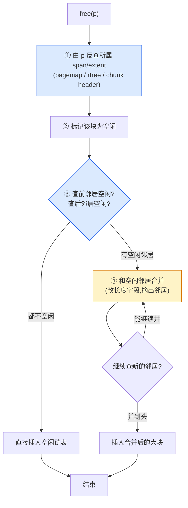

# 第十三章 · 碎片的两个来源与合并

> 篇:P4 碎片治理与内存归还
> 主线呼应:这一篇是全书"省"这一面的重头戏。前面三篇讲的都是"怎么让分配更快"——本地缓存无锁、中心链表批量、per-CPU 把锁摊开。但"快"是有代价的:每份缓存都囤货、释放的块各回各家、页堆被切成一段一段,**占用的内存会变得零碎、还不出去**。这一章我们就把"碎片"这个被前面反复提到、却始终没正面拆的概念彻底讲透——它从哪来、分几种、为什么不能放任不管、四套分配器怎么治。读完这一章,你就能理解为什么新一代分配器(tcmalloc 的 HPAA、jemalloc 的 extent 合并)把"碎片治理"当作它们相对 ptmalloc 的代差之一。

## 核心问题

**"碎片"到底是什么?为什么 ptmalloc 的 `malloc_consolidate` 压不住,而 tcmalloc/jemalloc 得另起炉灶?**

读完本章你会明白:

1. **碎片的两种来源**:**内部碎片**(申请 17B 给了 32B 的 size class,凑整浪费)源于 size class 分级;**外部碎片**(页堆里一堆零散空闲页,凑不成一整块可用)源于释放与切分。两者性质完全不同,治理手段也不同。
2. **合并(coalesce)是治外部碎片的根本招**:释放一块时,顺手把它**物理相邻的空闲邻居**也拿来,合并成一个更大的空闲块。这件事的难点不在"合并"本身,而在**怎么 O(1) 找到那个邻居**。
3. **四套找邻居的不同招数**:ptmalloc 靠 chunk 头部的 `prev_size`/`prev_inuse` 位;tcmalloc 靠放射状 **pagemap**(页号→Span);jemalloc 靠 **radix tree**(`rtree`,指针→extent);mimalloc 靠 segment 内 **slice 数组的指针算术**。每种都把"找邻居"压成了 O(1),但内存开销与适用场景不同。
4. **合并的代价与反面**:合并不是免费的——它要么在 fast path 上加活(释放变慢),要么推迟到 slow path(碎片短暂存在)。完全不合并会怎样?外部碎片爆炸,RSS 居高不下。这正是 ptmalloc 被诟病的地方。

> **如果一读觉得太难**:先只记住三件事——① 碎片分"内部"(凑整浪费)和"外部"(页堆零散)两种,本章重点治后者;② 治外部碎片的招是**释放时和相邻的空闲块合并**;③ 合并的关键技巧是**怎么 O(1) 找到相邻空闲块**——四套用了不同的索引结构(pagemap / rtree / chunk 头 / slice 数组)。其余细节都是这四件事的展开。

---

## 13.1 一句话点破

> **"碎片"不是一个东西,是两个东西。一个是 size class 凑整留下的"内部碎片"——你申请 17B,分配器给你 32B 的盒子,15B 浪费在盒子里,这叫内部;另一个是页堆被切得稀碎、还拼不回去的"外部碎片"——空闲页不少,但都不挨着,凑不成一整块可用,这叫外部。内部碎片是分级(size class)的代价,治它要靠更细的分级或更巧的编码;外部碎片是"切了不拼回去"的代价,治它的招就是**合并(coalesce)**——每次释放都顺手把相邻的空闲邻居吞进来。本章就拆这两件事,重点拆后者。**

这是结论,不是理由。本章倒过来拆:先分清两种碎片的来源,再看为什么不合并会出事,再看合并怎么做到 O(1) 找邻居,最后四套对照。

---

## 13.2 先把"碎片"这个词拆开:它其实是两种东西

读过分配器文档或调过 `MALLOC_CONF` 的人,大概都见过"fragmentation"这个词被笼统地用。但它其实指两种**性质完全不同**的浪费,把它们混为一谈,就读不懂分配器的很多设计。

### 内部碎片:size class 凑整的代价

你在程序里 `malloc(17)`,分配器**不会**真的给你 17 字节——它会按 size class 把 17B 归并到某个分级(比如 32B 这个 class),然后给你一个 32B 的盒子。多出来的 15B,你拿不到、也用不着,就**浪费在盒子里**。这种浪费叫**内部碎片(internal fragmentation)**——内,指的是"在你拿到的这块里头"。

用 ASCII 画一下:

```
   申请 17B,实际拿到 32B 的盒子(size class = 32B)
   ┌─────────────────────────────────┐
   │   你用的 17B    │  浪费的 15B    │   ← 内部碎片
   └─────────────────────────────────┘
   0                17              32
```

内部碎片的大小,由**size class 的粒度**决定。第 2 章(P1-02)讲过,分配器把所有申请大小归并成几十个 class(tcmalloc ~88 个、jemalloc ~40 个),每个 class 是一个固定大小。粒度越细(分级越多),内部碎片越小,但 free list 越多、元数据越大;粒度越粗,反之。这是个**已在第 1 篇做过权衡**的设计,本章不重复——只要记住:**内部碎片是 size class 的固有代价,它和"页堆怎么管"无关。**

### 外部碎片:页堆被切得拼不回去

再看另一种浪费。假设页堆一开始是一整块连续的页,程序不断地 `malloc`/`free` 大小不一的对象,**每个对象占的页各不相同**。一段时间后,有些页的对象全释放了(空闲),有些页还占着活对象(在用)。空闲页零散地夹在用着的页之间——**单个空闲页不少,但它们不挨着**,凑不成一整块大的连续空闲区。下次要分配一个大对象(需要连续多页),明明总空闲内存够,却**分配不出来**。这种浪费叫**外部碎片(external fragmentation)**——外,指的是"页堆里页与页之间的空隙"。

ASCII 画一下:

```
   页堆(每格 = 一页 4KB),一段时间后:
   ┌──┬──┬──┬──┬──┬──┬──┬──┬──┬──┐
   │用│空│用│用│空│用│空│用│用│空│
   └──┴──┴──┴──┴──┴──┴──┴──┴──┴──┘
        ↑     ↑     ↑           ↑
        空闲页零散分布,都不相邻

   总空闲 = 4 页(够一个 16KB 的大块吗?)
   → 不够!因为没有 4 个连续空闲页,最大连续空闲 = 1 页
   → 这就是外部碎片:总量够,但凑不成整块
```

外部碎片的可怕之处在于:**它会让 RSS 居高不下**。空闲页虽然不装对象了,但只要它还归分配器管、还没还给 OS,RSS 就降不下来。长期运行的服务(尤其是 7×24 的 server)最容易踩坑:程序明明不再需要那么多内存,`top` 一看 RSS 还是几 GB——多半是外部碎片在作祟。

> **钉死这件事**:把"碎片"分成两种,是为了对症下药。**内部碎片**是 size class 的代价,治理手段是**更细的分级 / 更巧的编码**(第 2 章已拆)。**外部碎片**是页堆被切碎、拼不回去的代价,治理手段是**合并 + 归还 OS**。本章(以及第 4 篇后两章)治的是**外部碎片**。所以本章接下来讲"碎片",除非特别说明,默认指外部碎片。

### 两种碎片的对比

| 维度 | 内部碎片 | 外部碎片 |
|------|----------|----------|
| **浪费在哪** | 在你拿到的那块**里面**(凑整) | 在页堆里页与页**之间**(零散) |
| **来源** | size class 分级(凑整) | 释放/切分后页不连续 |
| **能否避免** | 不能(分级是必须的,只能减小) | 能减(靠合并),不能消灭 |
| **影响** | 浪费一点字节(单次小) | **RSS 居高、大块分不出**(累积严重) |
| **治理手段** | 更细的 size class / 位运算编码 | **合并(coalesce)** + `madvise` 归还 |
| **对应章节** | 第 2 章(P1-02) | **本章 + 第 14、15 章** |

---

## 13.3 不合并会怎样:外部碎片爆炸

理解了外部碎片是"切了不拼回去",自然要问:**不拼回去会怎样?**

答案是:**外部碎片会**单调累积**,**永远**不会自己好转。设想一个最朴素的分配器——它只管分配和标记空闲,**从不合并相邻的空闲页**:

- 第 1 秒:分配 100 个对象,各占 1 页,页堆满。
- 第 2 秒:释放其中 50 个,但它们**随机**分布在 100 页里。结果:50 个空闲页,夹在 50 个在用页之间,**几乎都不相邻**。
- 第 3 秒:要分配一个需要 2 个连续页的对象。**分配不出来**——因为没有 2 个相邻空闲页。分配器只好**向 OS 再要 2 页**(`mmap`)。
- 第 4 秒:那 50 个零散的空闲页,继续空着、继续占着 RSS,**永远**等不到相邻页也被释放、好凑成一整块还给 OS。

这就是 ptmalloc 在某些场景下被诟病的"RSS 居高不下"的根子之一——它的合并是**被动的、按桶的、不彻底的**(后面会拆),长期运行下,零散空闲 chunk 堆在 `unsorted bin`/`smallbin` 里,触发 `malloc_consolidate` 的时机又少,碎片就慢慢长起来了。

> **不这样会怎样**(反面对比):假设有一个"永不合并"的分配器,外部碎片会怎样?用一个简化的模型算一笔账。假设程序的工作集是"分配 N 个对象、随机释放一半、再分配 N/2 个略大的对象",如此循环。每一轮,由于释放的位置随机,**相邻空闲页的比例随轮次衰减**(类似 birthday problem 的反面)。跑 1000 轮,页堆里可能有 90% 的页是"空闲但不相邻",即**有效利用率只剩 10%**——意味着要撑住同样的工作集,这个分配器要向 OS 要 **10 倍**的内存。这就是"不合并"的代价:不是浪费一点,是**灾难性的膨胀**。
>
> 现实里没人真的写"永不合并"的分配器。但 ptmalloc 的合并触发条件保守(主要在 `malloc` 大块、或 `free` 顶部 chunk 时),在"长寿命 + 高碎片"的工作负载下,实际效果接近"半合并",这正是新一代分配器要补的。

> **所以这样设计**:释放一块时,顺手检查它的**物理前邻居**和**物理后邻居**是不是也空闲;如果是,把它们**合并成一个更大的空闲块**(span/extent/chunk)。这样,空闲区不会越碎越小,反而会**越并越大**——直到能凑成一整页/一整段,可以还给 OS。这就是**合并(coalesce)**。

---

## 13.4 合并的本质:O(1) 找到相邻的空闲邻居

合并的思路简单到一句话:**释放 p 时,看 p 前面那一块和 p 后面那一块是不是空闲,是就并进来**。难点不在"并"——并就是把两个连续区合成一个更大的连续区,改改长度字段的事。**难点在:怎么知道 p 前面那一块、后面那一块,到底是空闲还是在用?而且要 O(1) 知道,不能扫一遍。**

为什么必须 O(1)?因为 `free` 是高频操作(和 `malloc` 一样可能每秒百万次)。如果每次 `free` 都要**线性扫**页堆去找 p 的邻居,`free` 就退化成 O(n),分配器直接不能用。所以,合并的命门是**邻居查找的索引结构**。

四套分配器,给出了**四种不同的 O(1) 邻居查找**解,这是本章技巧精解的重头戏(下一节单独拆)。这里先把它们的共性思路画出来——一次带合并的 `free`,长这样:



第 ① 步"由 p 反查所属 span/extent"——这正是第 8 章(P2-08)讲的 pagemap/rtree 干的事(`free(p)` 只给了指针,要 O(1) 知道 p 属于哪个 span)。第 ③ 步"查前/后邻居空闲吗"——是本章合并新增的索引需求,**它比第 ① 步更进一步**:不仅要查 p 所属的块,还要查 p 的**相邻地址**所属的块。

> **钉死这件事**:合并的"合并"二字是结果,真正的工程难点是**O(1) 邻居查找**。谁能把这件事做得又快、又省内存、又 sound(不会查错、不会数据竞争),谁就能把外部碎片压住。四套分配器在这件事上分歧最大,这正是它们的设计取向差异所在。

---

## 13.5 四套怎么找邻居:对照表先看全局

在进入源码细节前,先把四套的邻居查找招数列一张表,建立全局印象:

| 分配器 | 邻居查找的索引 | O(1) 怎么做到 | 内存开销 | 合并触发时机 |
|--------|----------------|---------------|----------|--------------|
| **tcmalloc**(新版 HPAA) | **pagemap**(放射状 3 级数组,页号→Span)[`pagemap.h`](../tcmalloc/tcmalloc/pagemap.h) | 页号直接索引数组,`map_.get(page_id)` | 较大(每页一个指针) | per-hugepage filler 整合,大页释放时 |
| **jemalloc** | **rtree**(radix tree,指针→extent)+ emap [`emap.c`](../jemalloc/src/emap.c) | 多级 radix,指针高位分级索引 | 较省(按需分配节点) | `extent_try_coalesce`,释放 dirty/muzzy 时(可延迟) |
| **mimalloc** | **segment 内 slice 数组的指针算术** [`segment.c`](../mimalloc/src/segment.c) | slice 是定长数组,`slice + count` 直接算邻居 | 极小(就数组本身) | segment 内 `mi_segment_span_free_coalesce`,释放时 |
| **ptmalloc** | **chunk 头部的 `prev_size` + `prev_inuse` 位** [malloc.c](https://github.com/glibc/glibc/blob/main/malloc/malloc.c) | 看自己头部的位知前邻居,算下一 chunk 头看后邻居 | 几乎为 0(复用 chunk header) | `malloc_consolidate`(被动触发)、`_int_free`(部分场景) |

这张表里有几条关键信息值得先记住:

- **tcmalloc 和 jemalloc 用专门的索引结构**(pagemap / rtree),因为它们的页管理单位(Span / extent)是**独立的元数据对象**,必须有个"指针→对象"的反查表。
- **ptmalloc 不需要额外的索引结构**——它的 chunk 头部本身就记录了邻居信息(`prev_size` 字段 + `prev_inuse` 位),用空间换掉了索引。这是它"老派"但**省元数据**的巧妙之处。
- **mimalloc 最特别**:它的 segment 内部是**定长 slice 数组**,邻居就是"当前 slice 下标 ± slice_count",纯**指针算术**,连查表都省了——代价是合并只在 segment **内部**发生,segment 之间不合并(由 arena 管)。

下面逐一拆它们的源码。

---

## 13.6 tcmalloc:per-hugepage 的整合 + pagemap 反查

新版 tcmalloc(本书所用 7723f74)默认全量启用 **HPAA(huge page aware allocator)**——`page_allocator.cc` 构造函数里 `alg_ = HPAA`([page_allocator.cc:69](../tcmalloc/tcmalloc/page_allocator.cc#L69)),所有的页分配/释放都走 `HugePageAwareAllocator`。所以 tcmalloc 的"合并"不是经典的"span 与 span 合并",而是**以 2MB 大页为单位**的整合:每个大页有一个 `Tracker`,记录它里面哪些页在用、哪些空闲;当一个大页里所有页都空闲了,整个大页可以被释放(还给 `HugeCache`,乃至 `madvise` 给 OS)。

### pagemap:页号 → Span 的 O(1) 反查

不管是 HPAA 还是经典 PageHeap,tcmalloc 都靠一个**放射状 pagemap** 来做"指针/页号 → 所属 Span"的反查。这是合并(以及所有 free 操作)的地基。看 [`pagemap.h:572-575`](../tcmalloc/tcmalloc/pagemap.h#L572-L575):

```cpp
// pagemap.h:572 —— GetDescriptor:由页号 O(1) 拿到所属 Span
[[nodiscard]] inline Span* absl_nullable GetDescriptor(PageId p) const
    ABSL_NO_THREAD_SAFETY_ANALYSIS {
  return map_.get(p.index());
}
```

`map_` 是一个 `PageMap3`(3 级放射数组,见 [`pagemap.h:290`](../tcmalloc/tcmalloc/pagemap.h#L290) 的 `class PageMap3`)。给定一个页号,它通过**页号的高/中/低位分别索引三级数组**,最终在叶子节点拿到 `Span*`。整个查找是**几次数组下标 + 指针解引用**,没有循环、没有锁(注释明说 `No locks required`)——所以是 **O(1)**。

> **技巧点**:为什么是 3 级放射数组,而不是 1 级大数组?1 级数组(直接用页号当索引)会**吃爆内存**——64 位地址空间下,页号可能跨 52 位,一个页号一个指针 = 2^52 × 8B,不可能。3 级放射相当于**稀疏的、按需分配的**多级页表:只有真正用到的页,才在叶子级占一个槽;中间级也只在实际有内存的区域才分配。这样既保住了 O(1)(最多 3 次数组访问),又把元数据压到"实际管理的那部分地址空间"的大小。这是 tcmalloc pagemap 的核心取舍——**O(1) 但要省内存,就分级**。第 8 章(P2-08)会专门拆它和 jemalloc rtree 的取舍。

有了 `GetDescriptor`,tcmalloc 在释放一个 span 时,要找它**相邻的 span**(如果走经典 PageHeap)只需:`GetDescriptor(当前 span 的最后一页 + 1)` 拿后邻居,`GetDescriptor(当前 span 的第一页 - 1)` 拿前邻居。两次 O(1) 查表,邻居就到手。

### HPAA 的"合并":per-hugepage 整合

新版 tcmalloc 走 HPAA,经典 span-to-span 合并不再是主流路径。HPAA 把页堆按 **2MB 大页**组织,每个大页有三种归宿(见 [`huge_page_aware_allocator.h:860-939`](../tcmalloc/tcmalloc/huge_page_aware_allocator.h#L860-L939) 的 `Delete`):① 被 filler 打包(filler 负责把零散的小对象挤进一个大页);② 在 HugeRegion 里(跨大页的大块);③ 直接来自 HugeCache(超大块)。释放时(`Delete`),按来源分别归还。

其中最关键的"碎片整合"发生在 **filler** 里:filler 接收小 span 的释放,把它们**记录到所属大页的 Tracker**;当一个大页的 Tracker 发现"我这页全空了",就调用 [`ReleaseHugepage`](../tcmalloc/tcmalloc/huge_page_aware_allocator.h#L941-L968) 把整个大页释放给 `HugeCache`:

```cpp
// huge_page_aware_allocator.h:941 —— ReleaseHugepage:整大页回收
template <class Forwarder>
inline void HugePageAwareAllocator<Forwarder>::ReleaseHugepage(
    FillerType::Tracker* pt) {
  TC_ASSERT(pt != nullptr);
  TC_ASSERT_EQ(pt->used_pages(), Length(0));   // 必须全空才能整页释放
  ...
  HugeRange r = {pt->location(), NHugePages(1)};
  SetTracker(pt->location(), nullptr);
  if (pt->released()) {
    cache_.ReleaseUnbacked(r);                  // 已经 madvise 过,直接给 unbacked 池
  } else {
    cache_.Release(r);                          // 还能立即复用的,给正常池
  }
  tracker_allocator_.Delete(pt);
}
```

注意 `TC_ASSERT_EQ(pt->used_pages(), Length(0))`——**只有当一个大页里所有页都空闲,才能整页释放**。这就是 HPAA 治外部碎片的核心机制:它**不**做细粒度的 span 合并,而是把碎片**收集到 2MB 大页的粒度**——只要一个大页里所有小对象都被释放了,这个大页就完整可回收。这比细粒度合并**更适合现代硬件**(大页降 TLB miss),也是 tcmalloc 新版相对 ptmalloc 的代差之一。第 15 章(P4-15)会专门拆 filler 怎么"把零散对象挤进少数大页"。

> **不这样会怎样**(反面对比):如果 tcmalloc 不做 per-hugepage 整合,而是像 ptmalloc 那样只在 chunk 层面被动合并,会怎样?答案是:大页里的零散空闲页**永远凑不成整页**,`ReleaseHugepage` 的 `used_pages() == 0` 条件**永远不满足**,大页就一直占着 2MB RSS 不还。这正是 HPAA 设计要避免的——它要主动把活对象**搬走**,把整页腾出来(这是 filler 的活,第 15 章拆)。

---

## 13.7 jemalloc:extent_try_coalesce + rtree 找邻居

jemalloc 的合并路径比 tcmalloc 经典——它的页管理单位是 **extent**(连续 N 页),释放 extent 时,**主动**尝试和相邻的空闲 extent 合并。核心函数是 [`extent_try_coalesce`](../jemalloc/src/extent.c#L996-L1000)(转发到 `extent_try_coalesce_impl`,见 [`extent.c:923-994`](../jemalloc/src/extent.c#L923-L994)):

```c
// extent.c:923 —— extent_try_coalesce_impl:向前向后各试一次合并
static edata_t *
extent_try_coalesce_impl(tsdn_t *tsdn, pac_t *pac, ehooks_t *ehooks,
    ecache_t *ecache, edata_t *edata, size_t max_size, bool *coalesced) {
  ...
  bool again;
  do {
    again = false;

    /* Try to coalesce forward. */
    edata_t *next = emap_try_acquire_edata_neighbor(tsdn, pac->emap,
        edata, EXTENT_PAI_PAC, ecache->state, /* forward */ true);   // L942-943
    ...
    if (next != NULL) {
      ...
      if (!extent_coalesce(tsdn, pac, ehooks, ecache,
              edata, next, true)) {                                  // L952-953
        ...
        again = true;   // 合并成功,可能还能继续并,再循环
      }
    }

    /* Try to coalesce backward. */
    edata_t *prev = emap_try_acquire_edata_neighbor(tsdn, pac->emap,
        edata, EXTENT_PAI_PAC, ecache->state, /* forward */ false);  // L965-966
    ...
    if (prev != NULL) {
      ...
      if (!extent_coalesce(tsdn, pac, ehooks, ecache,
              edata, prev, false)) {                                 // L975-976
        edata = prev;
        ...
        again = true;
      }
    }
  } while (again);   // 一直并到并不动为止
  ...
}
```

这段是 jemalloc 合并的主循环。逻辑很清楚:**先向前找邻居(`forward=true`,即 extent 末尾之后那块),再向后找(`forward=false`,即 extent 起始之前那块);找到一个空闲邻居就 `extent_coalesce` 合并;合并成功后 `again=true`,循环再来一次**(因为合并后新的大 extent 可能又能和新邻居并)。**循环到两边都并不动为止**——这是 jemalloc 的"贪婪合并"策略。

> **技巧点**:为什么用 `do...while(again)` 循环,而不是只并一次?因为合并是**可级联**的——并了 next 之后,新的 extent 的"next"变成了原来 next 的 next,可能也是空闲的,能继续并。如果只并一次,碎片还是压不彻底。循环到失败,保证每次释放都把能并的**全并了**。代价是循环次数可能多(最坏 O(碎片段数)),但 jemalloc 用 `max_size` 参数([`extent.c:944`](../jemalloc/src/extent.c#L944))限制单次合并的最大尺寸,避免合并出过大的 extent(过大的 extent 难以满足对齐需求)。

### rtree:指针 → extent 的 O(1) 反查

循环里那句 `emap_try_acquire_edata_neighbor(..., forward)` 是 jemalloc 找邻居的核心。它内部用 **rtree(radix tree)** 把"邻居的地址"反查成"邻居的 extent"。看 [`emap.c:42-96`](../jemalloc/src/emap.c#L42-L96) 的 `emap_try_acquire_edata_neighbor_impl`:

```c
// emap.c:56 —— 算邻居地址(forward 是 extent 末尾,backward 是 extent 起始前一字节)
void *neighbor_addr = forward ? edata_past_get(edata)
                              : edata_before_get(edata);
...
// emap.c:70-73 —— 用 rtree O(1) 反查这个地址所属的 extent
EMAP_DECLARE_RTREE_CTX;
rtree_leaf_elm_t *elm = rtree_leaf_elm_lookup(tsdn, &emap->rtree,
    rtree_ctx, (uintptr_t)neighbor_addr, /* dependent*/ false,
    /* init_missing */ false);
...
// emap.c:78-83 —— 读出邻居的内容,检查它是不是空闲、能不能并
rtree_contents_t neighbor_contents = rtree_leaf_elm_read(
    tsdn, &emap->rtree, elm, /* dependent */ false);
if (!extent_can_acquire_neighbor(edata, neighbor_contents, pai,
        expected_state, forward, expanding)) {
  return NULL;
}
```

 jemalloc 的 rtree 是一棵**多级 radix tree**:把指针(地址)的高位分级做索引,每一级用一个数组,逐步缩小到叶子节点;叶子节点存 `rtree_contents_t`(里面有 `edata`——即 extent 指针、状态、size class 等)。查找时**按地址位分段下标**,几级数组访问就到叶子——也是 **O(1)**(常数级数,不随内存大小增长)。

> **技巧点**:为什么 jemalloc 用 rtree 而不是像 tcmalloc 那样用放射状 pagemap?核心取舍是**内存开销 vs 查找路径长度**。pagemap 是"每页一个指针",稀疏但**总表项数 = 管理的页数**,在地址空间稀疏使用时也还算省(因为 3 级按需分配)。rtree 更进一步——**只有真正用到的地址范围才在 radix tree 里有节点**,而且节点是**按指针高位分组**的(一个中间节点覆盖一大段地址),所以在"地址空间用得很稀疏"的场景(比如大量 mmap 的零散大块)更省内存。代价是 rtree 查找要**多解几次指针**(多级),且实现比数组复杂。第 8 章会专门拆这两者的取舍。

### 实际合并:`extent_coalesce` → `extent_merge_impl`

找到空闲邻居后,真正的合并动作在 [`extent_coalesce`](../jemalloc/src/extent.c#L906-L920) → [`extent_merge_impl`](../jemalloc/src/extent.c#L1411-L1460):

```c
// extent.c:1411 —— extent_merge_impl:真正把两个 extent 合成一个
extent_merge_impl(tsdn_t *tsdn, pac_t *pac, ehooks_t *ehooks, edata_t *a,
    edata_t *b, bool holding_core_locks) {
  ...
  // 调底层 ehooks_merge(可被用户自定义 hook 拦截,默认实现是 ehooks_default_merge)
  bool err = ehooks_merge(tsdn, ehooks, edata_base_get(a),
      edata_size_get(a), edata_base_get(b), edata_size_get(b),
      edata_committed_get(a));                                        // L1428-1430
  if (err) { return true; }

  // 更新 rtree 映射:把 a 和 b 的叶子节点合并成 a 的
  emap_prepare_t prepare;
  emap_merge_prepare(tsdn, pac->emap, &prepare, a, b);                // L1442

  // a 的尺寸 = a + b;SN 取较小的;zeroed 取与
  edata_size_set(a, edata_size_get(a) + edata_size_get(b));           // L1447
  edata_sn_set(a, (edata_sn_get(a) < edata_sn_get(b)) ? edata_sn_get(a)
                                                      : edata_sn_get(b)); // L1448-1450
  edata_zeroed_set(a, edata_zeroed_get(a) && edata_zeroed_get(b));    // L1451
  ...
  emap_merge_commit(tsdn, pac->emap, &prepare, a, b);                 // L1455
  edata_cache_put(tsdn, pac->edata_cache, b);   // b 的元数据对象还回 edata_cache
  return false;
}
```

注意几个细节:① `ehooks_merge` 是**可被 hook 的**——jemalloc 允许用户自定义 extent 的 split/merge 行为([`ehooks.c:191-236`](../jemalloc/src/ehooks.c#L191-L236) 的 `ehooks_default_merge_impl` 是默认实现),这在 Windows 等不支持任意 merge 的平台上有用(注释 [`ehooks.c:195-202`](../jemalloc/src/ehooks.c#L195-L202) 解释了 `maps_coalesce` 的分支)。② 合并后**b 的元数据对象**(`edata_t`)被还回 `edata_cache` 复用——元数据本身也要省。③ `edata_sn_set` 取较小值——SN(serial number)用于 first-fit 排序,合并后保留较老的 SN,保证老 extent 优先被复用。

> **不这样会怎样**(反面对比):如果 jemalloc 不在释放时主动 `extent_try_coalesce`,只在分配大块时被动扫一遍,会怎样?答案是 dirty/muzzy 队列里会堆满**零散的小 extent**,下次要分配一个稍大的 extent 时,虽然总量够,但没有一个**够大的连续 extent**——只能去 `extent_grow_retained`(向 OS 要新内存,见 [`extent.c:894`](../jemalloc/src/extent.c#L894)),RSS 节节高。这正是 jemalloc 把合并做成"释放时主动"的原因。

---

## 13.8 ptmalloc:chunk 头部的 prev_size + prev_inuse 位

ptmalloc(glibc)是 baseline。它的合并招数和上面两个完全不同——**不用任何额外的索引结构**,而是把邻居信息**直接编码在 chunk 的头部**。这是 Doug Lea 的 dlmalloc 留下来的经典设计,极其省元数据,但代价是 chunk 必须带一个固定大小的 header。

### chunk 的内存布局

ptmalloc 的每个 chunk(无论空闲还是在用)都有一个 header,布局如下:

```
   ptmalloc chunk 的头部(以 64 位为例,size_t = 8B):
   ┌──────────────┬───────────────┬─────────────┐
   │  prev_size   │     size      │  用户数据…  │
   │   (8B)       │   (8B, 低位含 │             │
   │              │    标志位)    │             │
   └──────────────┴───────────────┴─────────────┘
   ↑              ↑               ↑
   前一 chunk    本 chunk         本 chunk 的
   的大小        的大小+标志位     用户区起点

   size 字段的低 3 位是标志位(因为 chunk 按 8/16 对齐,低 3 位用不上):
     bit0  PREV_INUSE : 前一 chunk 是否在用(1=在用,0=空闲)
     bit1  IS_MMAPPED : 本 chunk 是不是 mmap 出来的(走另一条释放路径)
     bit2  NON_MAIN_ARENA : 本 chunk 是否属于非 main_arena
```

关键的两位是 **`prev_size`**(前一 chunk 的大小)和 **`PREV_INUSE`**(前一 chunk 是否在用)。它们让 ptmalloc 能 **O(1)** 知道前邻居:

- **查前邻居空闲吗**:看自己 size 字段的 `PREV_INUSE` 位。`#define prev_inuse(p) ((p)->mchunk_size & PREV_INUSE)`——宏定义见 [malloc.c:1358](https://github.com/glibc/glibc/blob/main/malloc/malloc.c#L1358)(在线 codebrowser 标注行号)。
- **前邻居在哪**:`prev_size` 字段记了前一 chunk 的大小,所以前一 chunk 的起点 = **本 chunk 起点 − prev_size**。一步指针算术就到。
- **查后邻居空闲吗**:后邻居的起点 = 本 chunk 起点 + (size & ~标志位)(即本 chunk 的大小)。到后邻居的头部,看**它的** `PREV_INUSE` 位(指后后邻居是否在用)……不对,应该是看后邻居 size 字段里的标志位。具体说:**后邻居的 size 字段的低位标志**里,有一个位记录"后邻居的下一 chunk(后后邻居)是否在用";而后邻居自己是否在用,**本 chunk 怎么知道?** 答案是 ptmalloc 用了一个巧妙的间接:**本 chunk 的 `PREV_INUSE` 位,是由前一 chunk 在释放时设置的**——即每个 chunk 在释放时,会把它**后一 chunk 的 `PREV_INUSE` 位清零**,通告"我现在空闲了"。所以本 chunk 想知道后邻居是否空闲,看的是**后邻居的 size 字段**里的相关位。

这是 ptmalloc 合并机制最绕的地方,用一张图理清:

```
   本 chunk(p)想知道前邻居、后邻居是否空闲:

       ┌──────────┐   ┌──────────┐   ┌──────────┐
       │ prev chun│   │    p     │   │ next chun│
       │          │   │          │   │          │
       └──────────┘   └──────────┘   └──────────┘
       ↑              ↑ p           ↑ p+size(p)
       │              │
       │ p->prev_size │
       └──────────────┘

   ① 前邻居是否空闲:看 p 的 PREV_INUSE 位(p->mchunk_size & 1)
      → 是 0:前邻居空闲,可以向前合并。前邻居地址 = p - p->prev_size。
   ② 后邻居是否空闲:看后邻居(next chunk,地址 = p + chunksize(p))
      的"它的下一 chunk 是否在用"——其实 ptmalloc 维护的更直接:
      next chunk 的 PREV_INUSE 位记录的是 "next 的前一 chunk(=p)是否在用",
      由 p 在释放时清零。要查 next 自己是否空闲,ptmalloc 走 next 的 size
      间接判断(next 的后一 chunk 的 PREV_INUSE)。
```

这套机制的精妙之处:**所有邻居信息都嵌在 chunk 头部本身**,不需要 pagemap、不需要 rtree、不需要任何额外索引。代价是**每个 chunk 至少多 16B header**(prev_size + size),而且**所有 chunk 必须是"链式相邻"的**(才能靠指针算术找邻居)——这正是 ptmalloc 的 chunk 必须紧挨着排、不能像 span/extent 那样独立管理的原因。

### `unlink_chunk`:从 bin 里摘出邻居

合并的具体动作,是把前/后邻居从它所在的 bin(空闲链表)里**摘出来**,然后改尺寸。摘出的函数是 [`unlink_chunk`](https://github.com/glibc/glibc/blob/main/malloc/malloc.c#L1609)(在线 codebrowser 标注在 L1609):

```c
// malloc.c:1609 —— unlink_chunk:从双向链表里安全摘出一个 chunk(简化示意,非源码原文)
static void
unlink_chunk (mstate av, mchunkptr p) {
  if (chunksize (p) != prev_size (next_chunk (p)))           // 完整性校验
    malloc_printerr ("corrupted size vs. prev_size");

  mchunkptr fd = p->fd;
  mchunkptr bk = p->bk;

  if (__builtin_expect (fd->bk != p || bk->fd != p, 0))      // 双向链表完整性校验
    malloc_printerr ("corrupted double-linked list");

  fd->bk = bk;   // 标准双向链表删除
  bk->fd = fd;
  ...
}
```

`unlink_chunk` 干的事很简单:**标准双向链表删除**。但前面两个 `malloc_printerr` 校验至关重要——它们是**安全防线**。著名的"unlink 攻击"(堆溢出利用)就是攻击者篡改 chunk 的 `fd`/`bk`,让 `unlink` 写入任意地址;ptmalloc 加的 `fd->bk != p || bk->fd != p` 校验就是为了堵这个洞——**只有真正在链表里的 chunk 才能 unlink**,否则报错退出。这是合并机制的一个"安全代价":每次合并多几次校验,换 UB/漏洞防护。

> **技巧点**:`unlink_chunk` 里那句 `chunksize(p) != prev_size(next_chunk(p))` 校验,是 ptmalloc 治"堆元数据腐化"的关键。它的意思是:**本 chunk 的大小,必须等于下一 chunk 头部记的 prev_size**。这两个值本应一致(因为 prev_size 记的就是前一 chunk 的大小),如果不一致,说明 chunk 头部被破坏了(溢出、UAF、双重 free 等)——立刻 `malloc_printerr` 终止,避免破坏扩散。这就是为什么 ptmalloc 即使有性能开销,也要在 unlink 时做这些校验:**正确性/安全性 > 一点速度**。

### `malloc_consolidate`:被动触发的批量合并

ptmalloc 的合并不像 jemalloc 那样**每次释放都主动**,而是分两层:

1. **`_int_free` 里的即时合并**:free 一个非 fastbin chunk 时,会尝试和前/后邻居合并(走 `unlink_chunk`)。但 **fastbin 的 chunk 不合并**(它们是小块,留作快速分配用)。
2. **`malloc_consolidate`:被动批量合并 fastbin**。这个函数会把 fastbin 里所有 chunk 取出来,合并相邻的,挪到 unsorted bin。它**不是每次 free 都调**,而是在特定时机:**malloc 大块时**(smallbin 不够,需要整理 fastbin)、**收到 `mallopt(M_MXFAST, 0)` 时**等。这就是 ptmalloc 合并"被动"的来源——平时不并,攒一波再并。

> **不这样会怎样**:ptmalloc 的被动合并,在"长寿命、低分配压力"的工作负载下会露怯——`malloc_consolidate` 很少被触发,fastbin 和 smallbin 里堆着零散空闲 chunk,RSS 降不下来。这是它在某些 server 场景被诟病"碎片压不住"的根子。新一代分配器(jemalloc 的 decay + 主动 coalesce、tcmalloc 的 HPAA)把合并做成**释放时主动**,正是补这个。

---

## 13.9 mimalloc:segment 内 slice 数组的指针算术

mimalloc 是新秀对照,它的合并招数最特别——**连查表都省了,纯指针算术**。它的页管理单位是 segment(通常 4MB 的一大段)内的 **slice**(定长小块,64KB)。一个 segment 是一个 **slice 数组**,每个 slice 有个 `slice_count`(它占几个 slice)和 `block_size`(为 0 表示空闲)。找邻居,就是**数组下标 ± slice_count**,纯算术。

看 [`segment.c:692-735`](../mimalloc/src/segment.c#L692-L735) 的 `mi_segment_span_free_coalesce`:

```c
// segment.c:692 —— mi_segment_span_free_coalesce:segment 内 span 合并
static mi_slice_t* mi_segment_span_free_coalesce(mi_slice_t* slice,
    mi_segments_tld_t* tld) {
  mi_segment_t* const segment = _mi_ptr_segment(slice);
  ...
  size_t slice_count = slice->slice_count;
  mi_slice_t* next = slice + slice_count;   // 后邻居 = 当前 slice + 它的长度(指针算术!)
  ...
  if (next < mi_segment_slices_end(segment) && next->block_size==0) {  // 后邻居空闲?
    slice_count += next->slice_count;       // 合并:长度相加
    if (!is_abandoned) { mi_segment_span_remove_from_queue(next, tld); }
  }
  if (slice > segment->slices) {
    mi_slice_t* prev = mi_slice_first(slice - 1);   // 前邻居:回退一格找它的起点
    ...
    if (prev->block_size==0) {              // 前邻居空闲?
      slice_count += prev->slice_count;     // 合并
      ...
      slice = prev;
    }
  }
  mi_segment_span_free(segment, mi_slice_index(slice), slice_count, true, tld);
  return slice;
}
```

精妙之处在那两行指针算术:**`next = slice + slice_count`**(后邻居的起点 = 当前 slice 的地址 + 它占的 slice 数 × sizeof(slice))。**这根本不需要任何索引结构**——slice 是 segment 内的**定长数组**,数组下标就是地址偏移,`slice + n` 直接跳到第 n 个 slice。这比 pagemap/rtree **还快**(连查表都没有),也比 ptmalloc 的 chunk header **更直接**(不靠 prev_size 倒推,直接正着算)。

但这个招数有**根本的限制**:它只能在 **segment 内部**合并。mimalloc 的 segment 是 4MB 一大段(可配置),segment **之间**不合并——因为 segment 是独立 mmap 出来的,地址不相邻。所以 mimalloc 的合并粒度上限是 **4MB**(一个 segment),超出就到 arena 层面了(`arena.c` 的 arena 管理,涉及 [`arena-abandon.c`](../mimalloc/src/arena-abandon.c) 的整 segment 抛弃,本书不深挖)。

> **技巧点**:mimalloc 的"slice 数组指针算术"和 ptmalloc 的"chunk header prev_size"思路其实同源——都是**把邻居信息嵌在数据本身**,省掉外部索引。区别是:ptmalloc 用 prev_size **倒推**前邻居(因为 chunk 大小不一),mimalloc 用 slice_count **正算**后邻居(因为 slice 定长,下标即地址)。mimalloc 更简单,但代价是**粒度固定**(slice 64KB),不如 chunk 灵活。这是新秀设计取向的体现:**用固定粒度换极致简单**。

> **不这样会怎样**:如果 mimalloc 不做 segment 内合并,4MB segment 里很快就会被零散 span 切满,新的稍大 span 分不出来,只能**再 mmap 一个新 segment**——segment 数量爆炸,RSS 涨。segment 内合并保证"4MB 内的碎片能拼回去",是 mimalloc 控制碎片的第一道防线。

---

## 13.10 四套合并策略的取舍

把四套并排看,它们的合并策略落在一张表上:

| 维度 | tcmalloc (HPAA) | jemalloc | mimalloc | ptmalloc |
|------|-----------------|----------|----------|----------|
| **页管理单位** | Span(连续页)+ huge page | extent(连续页) | segment 内 slice(定长) | chunk(带 header) |
| **邻居查找索引** | pagemap(3 级放射数组) | rtree(radix tree)+ emap | slice 数组指针算术 | chunk header 的 prev_size + 标志位 |
| **O(1) 查找的实现** | 页号索引数组(3 次访问) | 地址分级下标(多级 radix) | `slice + slice_count`(纯算术) | 看 PREV_INUSE 位 + 指针算术 |
| **元数据开销** | 较大(每页一个指针) | 较省(按需 radix 节点) | 极小(数组本身) | 几乎 0(复用 chunk header) |
| **合并触发** | per-hugepage 整合(大页级) | 释放时主动 `extent_try_coalesce` | 释放时 `mi_segment_span_free_coalesce` | `_int_free` 部分 + `malloc_consolidate`(被动) |
| **合并粒度上限** | 2MB huge page(再大走 HugeCache) | 无硬上限(受 max_size 限制) | 4MB segment | 无硬上限(受 arena 边界) |
| **合并主动性** | 高(filler 主动整合) | **高**(释放即并) | 高(释放即并) | **低**(被动攒波) |
| **独到之处** | 用大页粒度治碎片(为 TLB) | 可 hook、SN first-fit、delay_coalesce | 极简、纯算术 | 安全校验防 unlink 攻击 |

这张表里有几条值得回味的设计取向:

- **tcmalloc 走大页路线**:它不纠结细粒度 span 合并,直接把碎片**收集到 2MB 粒度**——这是为 TLB 服务的(大页降 TLB miss)。代价是细粒度碎片治理交给 filler 的复杂逻辑(第 15 章拆)。
- **jemalloc 走经典路线但做精**:`extent_try_coalesce` 主动、贪婪、可 hook、有 delay_coalesce 模式(延迟合并减少锁争用,见 [`extent.c:175-211`](../jemalloc/src/extent.c#L175-L211))。这是它相对 ptmalloc 的主要优势之一——**释放时主动并,而不是攒波**。
- **mimalloc 走极简路线**:能靠指针算术绝不查表,合并只在 segment 内。这是它"新秀"的取向——**用约束换简单**。
- **ptmalloc 是 baseline**:它的 chunk header 设计**极其省元数据**(连索引都省了),但**被动合并**是它在 server 场景的软肋。

> **打个比方**(只在理解"碎片治理"心智时点一下,本篇用一次):四套分配器都像一个**仓库管理员**,面对"货架上零散空位"这件事。tcmalloc 的管理员说:"我不管零散,我就盯着 2MB 的大箱子,一个箱子空了我就整箱退给供应商。" jemalloc 的管理员说:"我看到一个空位,就顺手把它两边的空位也并进来,凑成一大块。" mimalloc 的管理员说:"我每个货架(segment)自己管自己,货架内空位我靠数格子并,货架之间不并。" ptmalloc 的管理员说:"我平时不并,等攒多了(或老板来催了)再一波并掉。"——四种风格,治的都是同一个"碎片",但取向截然不同。

---

## 13.11 技巧精解:合并的 O(1) 邻居查找,四套怎么把"找邻居"压成常数

本章最硬核的技巧,就是**怎么把"找物理相邻的空闲块"这件事做成 O(1)**。这看似简单(地址相邻嘛,往前/往后一格不就行了?),实则是分配器设计的关键分歧点——**四套给出了四种完全不同的解,每种都藏着一个非平凡的工程取舍**。本节把它们并排拆透,并配反面对比。

### 难题重述

`free(p)` 给了分配器一个指针 p。分配器要合并,必须知道:**p 所属的块(设为 B)的前邻居和后邻居,分别是哪个块、是否空闲?** 难点有三:

1. **p 可能在 B 的中间**(B 是个多页的 span/extent,p 是其中某个对象的指针)。先要由 p 反查 B(`free` 的第 ① 步,第 8 章拆的 pagemap/rtree)。
2. **B 的前/后邻居**,在**物理地址上相邻**——前邻居的末尾 = B 的起点,后邻居的起点 = B 的末尾。但**它们的元数据**存在哪里?
3. **要 O(1)**——不能扫页堆,不能遍历链表。

四套的解,本质都是**预先把"邻居关系"编码进某种结构**,释放时查这个结构即可:

#### 解 A:tcmalloc 的 pagemap(页号 → Span)

tcmalloc 维护一个**放射状 3 级数组**(PageMap3),把"页号"映射到"该页所属的 Span"。找 B 的后邻居:取 B 的最后一页 + 1,`map_.get(那个页号)` ——拿到后邻居的 Span(或 null 表示未分配)。找前邻居:取 B 的第一页 − 1,同理。**两次数组下标访问,O(1)。**

源码实证:[`pagemap.h:572-575`](../tcmalloc/tcmalloc/pagemap.h#L572-L575) 的 `GetDescriptor` → `map_.get(p.index())`;PageMap3 的 3 级结构在 [`pagemap.h:290`](../tcmalloc/tcmalloc/pagemap.h#L290)。

**取舍**:O(1) 但**元数据较大**——每个被管理的页都要在叶子级占一个指针(8B)。64GB 堆、4KB 页 = 1600 万页 × 8B = ~128MB 元数据。tcmalloc 接受这个开销,换查找的极致简单和缓存友好(数组访问比树好)。

#### 解 B:jemalloc 的 rtree(指针 → extent)

jemalloc 维护一棵 **radix tree**,把"地址"映射到"该地址所属的 extent"。找邻居:算邻居地址(B 的末尾 / B 起点前一字节),`rtree_leaf_elm_lookup(邻居地址)` → 叶子节点 → `rtree_leaf_elm_read` 拿邻居 extent。**多级 radix 访问,级数常数,O(1)。**

源码实证:[`emap.c:70-83`](../jemalloc/src/emap.c#L70-L83) 的 `rtree_leaf_elm_lookup` + `rtree_leaf_elm_read`,在 `emap_try_acquire_edata_neighbor_impl` 里。

**取舍**:比 pagemap **省内存**(只有实际用到的地址段才有 radix 节点,中间级共享),但**查找路径长一点**(多级指针解引用,缓存不如数组友好),实现复杂。jemalloc 选它,是因为它常处理"大量零散 mmap 大块"的场景,地址空间稀疏,radix 更划算。

#### 解 C:mimalloc 的 slice 数组算术

mimalloc 的 segment 是个 **slice 数组**(定长元素)。找后邻居:`slice + slice->slice_count`(指针算术,直接跳到后邻居的起点)。找前邻居:`mi_slice_first(slice - 1)`(回退一格,再找它所在 span 的起点)。**纯算术,连查表都没有。**

源码实证:[`segment.c:710-730`](../mimalloc/src/segment.c#L710-L730)。

**取舍**:**最快**(无查表)、**元数据最省**(数组本身就是数据)。但**只能 segment 内合并**——segment 之间地址不相邻,跨 segment 合并做不到。mimalloc 接受这个限制,因为它的 segment 本来就是独立的分配单元。

#### 解 D:ptmalloc 的 chunk header(prev_size + 标志位)

ptmalloc 把邻居信息**嵌在每个 chunk 的头部**:prev_size 字段记前一 chunk 大小,PREV_INUSE 位记前一 chunk 是否在用。找前邻居:看自己 PREV_INUSE 位;前邻居地址 = 自己 − prev_size。找后邻居:后邻居地址 = 自己 + 自己的 size;后邻居是否在用,看后邻居的相关标志位。**两次标志位读取 + 指针算术,O(1)。**

源码实证:[malloc.c:1358](https://github.com/glibc/glibc/blob/main/malloc/malloc.c#L1358) 的 `#define prev_inuse(p)`;摘出邻居用 [malloc.c:1609](https://github.com/glibc/glibc/blob/main/malloc/malloc.c#L1609) 的 `unlink_chunk`。

**取舍**:**元数据几乎为 0**(复用 chunk header,本来就要 header),**无需外部索引**。但**所有 chunk 必须链式相邻**(不能像 span/extent 那样独立管理),且**安全风险高**(fd/bk 可被篡改,需 unlink 校验)。这是 dlmalloc 时代的经典取舍:**极省元数据,换管理灵活性的丧失**。

### 四解并排:同一张表

| 解 | 索引结构 | O(1) 查找 | 元数据开销 | 限制 |
|----|----------|-----------|------------|------|
| **A. tcmalloc pagemap** | 3 级放射数组 | 数组下标 ×3 | 较大(每页 8B) | — |
| **B. jemalloc rtree** | radix tree | 多级指针 | 较省(按需) | 查找路径长 |
| **C. mimalloc slice 算术** | 定长数组 | 指针 + | 极小 | 仅 segment 内 |
| **D. ptmalloc header** | chunk header | 标志位 + 算术 | ~0(复用) | 链式相邻、安全风险 |

### 反面对比:朴素方案会怎样

假设我们**不用任何索引**,每次 `free(p)` 都**线性扫**页堆找邻居:

```c
// 朴素方案(没人这么写,仅反例)
span_t* find_neighbor_linear(addr_t p, bool forward) {
  for (each span s in page_heap) {        // O(页堆里的 span 数)
    if (forward && s->end == p) return s;  // 后邻居
    if (!forward && s->start == p) return s; // 前邻居
  }
  return NULL;
}
```

- **复杂度**:每次 `free` 都 O(N),N = 页堆里的 span/extent 数。一个跑了很久的进程,N 可能上百万——**`free` 退化成毫秒级**,分配器直接废掉。
- **锁**:线性扫必须持有页堆锁,**所有线程的 free 串行化**,并发彻底崩。
- **碎片反而更重**:因为 `free` 太慢,程序要么避免 free(内存涨),要么忍受卡顿。

这就是为什么四套都**不约而同**地把"找邻居"压成 O(1)——**这是合并机制能成立的前提**。没有 O(1) 邻居查找,合并根本不实用,外部碎片就压不住。四种解法,是四个不同的"O(1) 权衡":tcmalloc 用空间换时间(大元数据),jemalloc 用树换稀疏(rtree),mimalloc 用约束换极简(定长 + segment 内),ptmalloc 用 header 嵌入换零额外开销(chunk 标志位)。**没有最优解,只有最适合自己定位的解。**

> **钉死这件事**:合并机制的命门是 O(1) 邻居查找。四套分配器在这件事上的分歧(pagemap / rtree / slice 算术 / chunk header),是它们**最深刻的设计取向差异**之一。理解了这四种解法,你就理解了为什么分配器长成各自的样子——它们不是随意选的数据结构,而是**在"O(1) 邻居查找"这个硬约束下,做出的不同取舍**。

---

## 章末小结

这一章是第 4 篇"碎片治理"的开篇。我们把"碎片"这个笼统的词拆成了两种性质不同的浪费:**内部碎片**(size class 凑整的代价,第 2 章已拆)和**外部碎片**(页堆被切得拼不回去的代价,本章重点)。治外部碎片的招是**合并(coalesce)**——释放时和物理相邻的空闲块并成更大的块。合并的命门是 **O(1) 邻居查找**,四套给出了四种解:tcmalloc 的 pagemap、jemalloc 的 rtree、mimalloc 的 slice 算术、ptmalloc 的 chunk header 标志位。

本章服务的是二分法的**中心堆(slow path)**那一面——合并是 slow path 在"省"上的核心战场。它和 fast path(本地缓存,要"快")是分工关系:fast path 只管快速 pop/push,不做合并(合并慢,会拖累 fast path);合并发生在 slow path 的释放归途(对象从本地缓存退回中心、从中心退回页堆时),按低频率做昂贵的整理。这正是第 1 章(P0-01)立的"分层 + 分频率"的具体体现。

本章也回扣了第 7 章(P2-07)的 span/extent/segment 建模——合并操作的对象就是那些"连续页 + 长度"的页管理单位,合并就是把两个相邻的单位并成一个更大的(改长度字段)。没有第 7 章的建模,合并无从谈起。

### 五个"为什么"清单

1. **为什么"碎片"要分内部和外部两种?** 因为它们来源不同(内部=size class 凑整,外部=页堆切分)、治理手段不同(内部靠更细分级,外部靠合并),混为一谈就读不懂分配器设计。本章及后两章治的是**外部碎片**。
2. **为什么不合并会出事?** 外部碎片会**单调累积**,永不自愈。不合并的分配器在长寿命工作负载下,RSS 可能膨胀到工作集的 10 倍——灾难性。
3. **合并的难点在哪?** 不在"并"(改长度字段而已),在 **O(1) 找到相邻的空闲邻居**。`free` 是高频操作,邻居查找不能退化成 O(n) 线性扫。
4. **四套怎么 O(1) 找邻居?** tcmalloc 用 pagemap(页号→Span 的 3 级放射数组),jemalloc 用 rtree(指针→extent 的 radix tree),mimalloc 用 slice 数组的指针算术,ptmalloc 用 chunk 头部的 prev_size + PREV_INUSE 位。四种解,四种取舍。
5. **ptmalloc 的合并为什么被诟病?** 它不是不合并,而是**被动合并**(`malloc_consolidate` 攒波触发),在低分配压力的长寿命服务里触发少,碎片压不住。新一代分配器(jemalloc 释放时主动 coalesce、tcmalloc HPAA 整合)补的就是这个。

### 想继续深入往哪钻

- **想看 tcmalloc 的 pagemap 实际怎么 3 级索引**:读 [`pagemap.h`](../tcmalloc/tcmalloc/pagemap.h) 的 `class PageMap3`(L290 起)和 `class PageMap`(L535 起),看 `Ensure`/`get` 怎么按页号的高/中/低位分级。第 8 章(P2-08)会专拆。
- **想看 jemalloc 的 rtree 多级结构**:读 [`rtree.h`](../jemalloc/include/jemalloc/internal/rtree.h) 和 [`rtree.c`](../jemalloc/src/rtree.c),重点看 `rtree_leaf_elm_lookup` 怎么按地址位下标。配合 [`emap.c`](../jemalloc/src/emap.c) 的 `emap_try_acquire_edata_neighbor_impl` 看邻居查找。
- **想动手感受合并的差异**:写一个"分配 N 个不同大小对象、随机释放一半、再分配大块"的程序,分别用 ptmalloc / jemalloc / tcmalloc 跑(`LD_PRELOAD`),对比 RSS 曲线。jemalloc/tcmalloc 的 RSS 会明显更稳。
- **想调 jemalloc 的合并行为**:用 `MALLOC_CONF="dirty_decay_ms:0"`(立即合并 dirty)或 `"retain:true"`(保留不还,极端减少 syscall 但 RSS 高),观察碎片与 RSS 的权衡。第 14 章(P4-14)拆 decay。
- **ptmalloc 的合并细节**:读在线 [malloc.c](https://github.com/glibc/glibc/blob/main/malloc/malloc.c) 的 `_int_free`(前/后合并逻辑)、`unlink_chunk`(L1609,带安全校验的链表删除)、`malloc_consolidate`(fastbin 批量整理)。

### 引出下一章

我们讲清了合并怎么把外部碎片"拼回去"。但拼回去的大块空闲内存,**什么时候、用什么方式还给操作系统**?不还 → RSS 居高不下;乱还 → 反复缺页抖动。这里有两个关键决策:① 用 `madvise(MADV_DONTNEED)`(立刻清零还页)还是 `MADV_FREE`(惰性还,内核缺页时回收)?② 什么时候触发归还(jemalloc 的 decay 时间衰减模型)?下一章,我们拆归还 OS 这件事——`madvise` 的两种模式取舍与 jemalloc 的 decay purge 模型。
