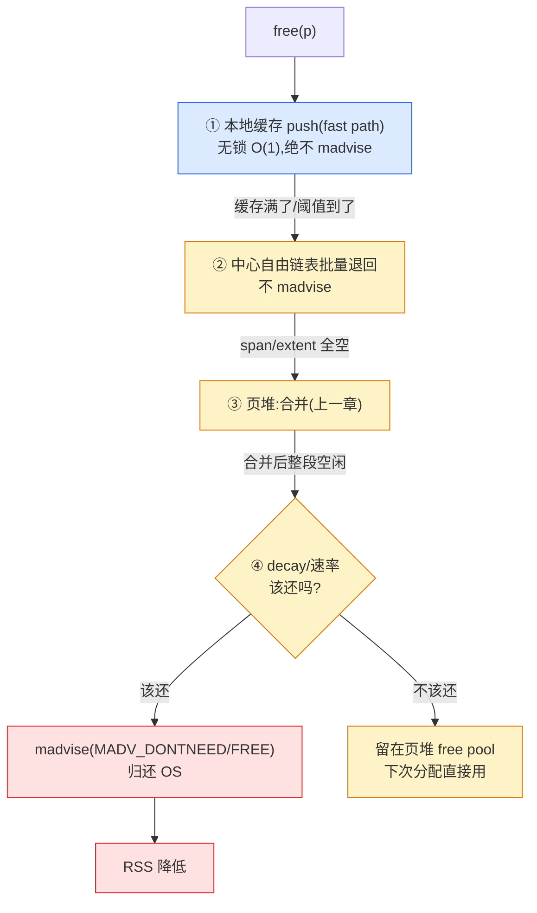

# 第十四章 · 归还 OS:madvise 与 decay purge

> 篇:P4 碎片治理与内存归还
> 主线呼应:上一章(P4-13)讲清了"合并"怎么把外部碎片拼回去。但拼回去的大块空闲内存,**只是回到了分配器自己手里**,操作系统那头还不知道——它在 RSS 里依旧把那些页算作"这个进程占着"。这一章就回答紧接而来的下一个问题:**这些已经空出来的页,什么时候、用什么方式还给操作系统?** 不还,RSS 居高不下,长期运行的服务白白占着几 GB;乱还,反复缺页抖动,一秒百万次 `malloc` 全卡在缺页中断上。这件事在 slow path 的"省"这一面上,和合并并列,是中心堆的两个核心战场之一。读完这一章,你就能看懂 jemalloc 为什么搞一套带 200 个时间步的 smoothstep decay 模型、tcmalloc 为什么把归还做成"按速率泄漏"的后台线程、mimalloc 的 purge 为什么分 reset / decommit 两档、ptmalloc 的 `systrim` 为什么在某些工作负载下被诟病。

## 核心问题

**空闲内存攒够了,什么时候、用什么方式还给 OS?——`madvise(MADV_DONTNEED)`(立刻清零还页)还是 `MADV_FREE`(惰性还,内核内存压力时回收)?触发节奏怎么定才不抖动?**

读完本章你会明白:

1. **归还不是 `munmap`,是 `madvise`**:把一块虚拟内存"还"给 OS,绝大多数情况不是取消映射(那样地址就没了,下次要再 `mmap`,贵),而是用 `madvise` 告诉内核"这片页我暂时不用了,你拿走物理页吧"——虚拟地址保留、映射保留,只是物理页被回收。两种 `madvise` 模式(`MADV_DONTNEED` vs `MADV_FREE`)取舍截然不同。
2. **`MADV_DONTNEED` vs `MADV_FREE` 的取舍**:前者立刻还、下次访问触发缺页清零(延迟确定、可观测,但访问瞬间会有一次 minor fault);后者惰性、内核有内存压力时才真回收(RSS 降得慢但不抖动、访问时若页还在则零开销)。这不是"哪个更好"的二选一,而是**两种不同的延迟-占用权衡**,四套分配器选哪一种,折射出它们的设计取向。
3. **"什么时候还"比"怎么还"更难**:一空闲就还 → 缺页抖动(`free` 后立即 `malloc` 同区域,反复 minor fault);永不还 → RSS 泄漏。jemalloc 的解是 **decay purge**:用一个时间衰减模型(`decay_t`,200 个时间步的 smoothstep backlog),把"该还多少页"算成一个随时间平滑下降的量,定期推算、定期 purge。tcmalloc 的解是**按速率泄漏**:后台线程按 `background_release_rate`(字节/秒)持续归还,辅以自适应 subrelease(看近期需求峰值决定该不该还)。mimalloc 是**固定延迟**:每个空闲页登记一个"purge delay"(默认 10ms),到期才还。
4. **三层快慢道在归还上的分工**:归还永远是 slow path 的活——fast path(本地缓存)绝不做 `madvise`(那是 syscall,微秒级,会毁掉无锁 O(1) 的延迟)。归还发生在对象从本地缓存退回中心、从中心退回页堆、页堆再决定整段还 OS 的降级链最末端。

> **如果一读觉得太难**:先只记住三件事——① 归还不是 `munmap`,是 `madvise`,虚拟地址留着、物理页还给内核;② `madvise` 有两种模式——`MADV_DONTNEED`(立刻还,下次访问缺页清零)和 `MADV_FREE`(惰性还,内存紧张时才真回收),四套分配器选哪一种看取向;③ "什么时候还"用 jemalloc 的 decay 模型最复杂(200 步时间衰减),tcmalloc 最简单(按速率泄漏)。其余细节都是这三件事的展开。

---

## 14.1 一句话点破

> **"还内存给 OS"在 Linux 上绝大多数时候不是 `munmap`(取消映射),而是 `madvise`——告诉内核"这片页我不用了,你拿走物理页吧,虚拟地址我留着"。这里有两个层次的选择:第一层,用 `MADV_DONTNEED`(立刻把物理页收回、页表项清掉,下次访问触发缺页、清零重发)还是 `MADV_FREE`(只是打个标记,内核在内存压力时才真回收,访问时若页还在就零开销)?第二层,什么时候打这个 madvise——一空闲就打(抖动)、永不打(泄漏)、还是按某种节奏打(jemalloc 的 decay 时间衰减、tcmalloc 的按速率泄漏、mimalloc 的固定延迟)?四套分配器在这两层上各做选择,合起来就是本章。**

这是结论,不是理由。本章倒过来拆:先讲为什么"还"几乎只能是 `madvise` 而不是 `munmap`,再看两种 `madvise` 模式在内核里到底各自干什么、代价各是什么,再看"什么时候还"这道更难的题,最后四套对照。

---

## 14.2 为什么"还"几乎只能是 `madvise`,不是 `munmap`

读完上一章,你可能会想:既然一段页(span / extent / segment)全空了,直接 `munmap` 把它取消映射不就彻底还了吗?虚拟地址也释放、物理页也回收、RSS 立刻降,干净利落。

这条路在**超大块**上确实是这么走的——比如 ptmalloc 对超过 `DEFAULT_MMAP_THRESHOLD`(~128KB)的大块,分配时单独 `mmap`,释放时直接 `munmap`;tcmalloc 的 huge 路径、jemalloc 的 large extent 同理。这一类"独立 mmap 出来的大块",地址本来就是临时拿的,`munmap` 彻底干净。

但页堆里**绝大多数空闲内存不能这么干**,原因有三:

**第一,地址布局是分配器精心管着的,`munmap` 会撕烂它。** tcmalloc 的 pagemap、jemalloc 的 rtree,都把"虚拟地址 → 元数据"的映射预先建好了(见第 8 章 P2-08)。`munmap` 取消映射后,这块地址就"不存在"了,下次再 mmap 时,内核可能把它分给别人,元数据映射就乱了。要保住映射,就得用 `madvise`——它**只回收物理页、不动虚拟地址**。

**第二,`munmap` 必须**按整段**取消,粒度太粗。** 一段连续的 span 里,前面是空闲页、后面是活页,你想只还前面那段空闲的——`munmap` 做不到"半段取消半段保留"(它会留下地址洞,而且要求页对齐的整段)。`madvise` 可以对任意页对齐的子段单独打标记,粒度灵活。

**第三,`munmap` 之后下次要重新用,得再 `mmap`,这是完整的 syscall + 页表重建,贵。** 而 `madvise` 之后,虚拟地址还在,只是物理页没了;下次访问触发**缺页中断**(minor fault),内核重新分配一个物理页、清零、接上——比一次完整 `mmap` 便宜(尤其 `MADV_DONTNEED` 模式下,缺页就是简单的 demand zero)。

> **钉死这件事**:**"归还 OS"在 99% 的情况下是 `madvise`,不是 `munmap`。** `madvise` 的精髓是**虚拟地址保留、物理页归还**——它让分配器能"还了又拿回来",地址布局、元数据映射、pagemap/rtree 全不动,只让内核把物理页回收。这是归还机制能反复执行、低代价执行的前提。`munmap` 只留给"整块独立 mmap 的超大块"的彻底释放。

```
   "归还 OS"的两种语义,别搞混:

   ┌──────────────────────────────────────────────────────────┐
   │ munmap(addr, len):取消映射                              │
   │   - 虚拟地址:释放(这段地址不再属于进程)              │
   │   - 物理页:回收                                         │
   │   - 页表项:删除                                         │
   │   - 下次要用:得重新 mmap(syscall + 完整页表重建)     │
   │   - 用于:超大块彻底释放(整段独立 mmap 的)             │
   └──────────────────────────────────────────────────────────┘
   ┌──────────────────────────────────────────────────────────┐
   │ madvise(addr, len, MADV_*):建议内核回收物理页           │
   │   - 虚拟地址:保留(地址还是进程的,映射还在)          │
   │   - 物理页:回收(给内核 free pool)                     │
   │   - 页表项:看模式(DONTNEED 清掉 / FREE 留着待回收)  │
   │   - 下次要用:访问触发缺页(minor fault,便宜)        │
   │   - 用于:页堆里绝大多数的归还(本章主角)              │
   └──────────────────────────────────────────────────────────┘
```

所以接下来讲的"归还",**默认指 `madvise`**。而 `madvise` 又有两种主流模式——`MADV_DONTNEED` 和 `MADV_FREE`——这是本章技巧精解的重头戏(第 14.5 节单独拆)。

---

## 14.3 两种 `madvise`:DONTNEED vs FREE,内核里各干什么

`madvise(2)` 的 man page 列了十几个 `MADV_*` 建议,但分配器归还用的就两种:`MADV_DONTNEED` 和 `MADV_FREE`(Linux 4.5+ 支持,FreeBSD 更早)。它们对"这片页我不用了"的解读截然不同,理解它们的内核行为,是看懂四套分配器取舍的前提。

### `MADV_DONTNEED`:立刻清零还页

`MADV_DONTNEED` 的语义是:**"这片页我现在不要了,你现在就把它的物理页回收掉,页表项也清掉。下次访问这片地址时,给我一块全新的、清零的物理页。"** 关键几点:

- **立刻生效**:内核收到这个 advice,马上(在 `madvise` syscall 返回前)把这些页的物理页放回 free pool、页表项置为"未映射"。`madvise` 返回后,RSS 立刻降。
- **下次访问触发 minor fault + 清零**:进程下次读写这片地址,因为没有映射(页表项被清),触发**缺页异常**(demand zero fault,一种 minor fault)。内核分配一个新物理页,**清零**后接上。
- **数据丢失**:`MADV_DONTNEED` 之后,这片页原来的内容**没了**——下次访问读到的是全零。所以分配器在打 `MADV_DONTNEED` 前,必须确保这块确实没活对象(上一章合并完、整段空的)。
- **延迟确定**:从"打 advice"到"物理页真的被回收",是 `madvise` 这一次 syscall 内完成的。可观测、可预测。

`MADV_DONTNEED` 是分配器归还的"经典款"——glibc ptmalloc、jemalloc 的 forced purge、mimalloc 的 decommit、tcmalloc 的默认都走它。它的好处是**确定、可观测**(RSS 立刻降、下次访问一定清零),代价是**下次访问一定有一次 minor fault**——如果这块很快又被分配器拿去用(虽然物理页是新的,但要走一次缺页),就有那么一点点开销。

### `MADV_FREE`:惰性还,内存压力时才真回收

`MADV_FREE` 是更"软"的语义:**"这片页我暂时不用了,你看着办——如果系统内存充裕,你留着也行(我下次可能还要用);如果内存紧张,你回收它给别的进程。"** 关键几点:

- **不立刻生效**:内核只是把这些页**标记为"可回收"**(在内核里是 `lazyfree` 标志),物理页**暂时还在**,页表项也保留。
- **内存压力时才真回收**:只有当内核需要内存(别的进程要页、或全局回收)时,才会把这些 `MADV_FREE` 的页真正放回 free pool。在那之前,它们继续算在进程 RSS 里。
- **下次访问**有两种情况:
  - **页还在**(还没被回收):访问零开销,页表项还在,直接命中。数据也还在(没被清零),但分配器不该依赖这个(它会重新初始化)。
  - **页已被回收**(内存压力时被内核拿走):访问触发 minor fault,内核给个新物理页(但**不保证清零**,内核可能给一个刚回收的脏页——所以分配器用 `MADV_FREE` 的页前必须自己清零,这是和 `MADV_DONTNEED` 的重要区别)。
- **延迟不确定**:从"打 advice"到"物理页真的被回收",**没有确定时间**——可能立刻(内存紧张),可能永不(系统一直内存充裕)。RSS 降得慢,但**不抖动**。

`MADV_FREE` 的好处是**避免抖动**——如果一块内存反复地"空闲-再用-空闲-再用",`MADV_FREE` 在系统内存充裕时几乎零开销(物理页一直留着,访问不缺页)。代价是**RSS 降不下来**(物理页暂时还在,内核不算它"还了")、**行为不确定**(什么时候真回收看内核心情)。它适合"内存充裕、但偶尔峰值很高、希望峰值之间 RSS 能缓降"的场景。

### 两种模式的对照

| 维度 | `MADV_DONTNEED` | `MADV_FREE` |
|------|----------------|-------------|
| **物理页何时回收** | `madvise` 调用时立刻 | 内核内存压力时(可能永不) |
| **页表项** | 清掉(下次访问缺页) | 保留(下次访问可能命中) |
| **下次访问开销** | 一定有 minor fault(清零页) | 页还在则零开销;被回收则 minor fault |
| **下次访问读到的内容** | 全零(demand zero) | 不保证(页在则旧数据,被回收则可能脏) |
| **RSS 何时降** | 立刻(`madvise` 返回后) | 缓慢(等内核回收) |
| **抖动风险** | 高(频繁还-用会反复缺页) | 低(物理页尽量留着) |
| **延迟确定性** | 确定 | 不确定 |
| **内核支持** | Linux 早期就有 | Linux 4.5+(2016) |
| **典型用户** | ptmalloc(子堆)、jemalloc forced、mimalloc decommit、tcmalloc 默认 | jemalloc lazy、tcmalloc 可选(kFreeAndDontNeed) |

这张表是本章后面所有讨论的基础。读后面四套分配器的选择时,回来看这张表。

> **不这样会怎样**(反面对比):假设我们用一个"伪分配器"——每次 `free` 完,对那块页**立刻 `MADV_DONTNEED`**(一空闲就还)。会发生什么?如果工作负载是"分配-释放-再分配同一区域"(这是服务器最常见的工作模式——连接对象、请求对象的池化复用),那么:① 第一次释放,`MADV_DONTNEED`,物理页回收,RSS 降;② 紧接着下一次 `malloc` 又要这块,触发缺页,内核给新物理页清零;③ 再释放,再 `MADV_DONTNEED`,再回收;④ 再 `malloc`,再缺页……每一次 `malloc`/`free` 循环都伴随一次 minor fault(几微秒),高频工作负载下,这几微秒 × 百万次/秒 = 几秒延迟全花在缺页上。这就是"一空闲就还"的代价——**抖动**。所以四套分配器都**不**在 fast path 上还,也不在每次 free 时还,而是**攒够量、按节奏**还(下一节拆节奏)。

---

## 14.4 "什么时候还"比"怎么还"更难:四套的节奏

理解了两种 `madvise` 模式,真正的难题才浮出水面:**什么时候触发归还?** 这道题比"用哪种 madvise"难得多,因为它面对的是一个**两难**:

- **还得太勤** → 缺页抖动(上面反面例子)。每次 free 都 madvise,等于把"快"的释放操作变成"慢"的 syscall + 缺页。
- **还得太懒** → RSS 居高不下。攒着不还,内存只进不出,长期运行的服务 RSS 节节高,运维来问"为什么这个进程吃了 8 GB?"

四套分配器对这道题给出了**四种不同的节奏**,这是本章最值得品味的部分:

| 分配器 | 还的"节奏"控制 | 触发主体 | 默认 madvise 模式 |
|--------|----------------|----------|-------------------|
| **ptmalloc** | 被动:`top chunk` 超过 `M_TRIM_THRESHOLD`(默认 128KB)时 `systrim` | `free` 末尾(主动)、`malloc_trim`(手动) | `MADV_DONTNEED`(子堆)/ `brk` 收缩(main arena) |
| **jemalloc** | 时间衰减:**decay 模型**(dirty_decay_ms 默认 10s,muzzy 默认 0),200 步 smoothstep | 释放时推算 epoch、后台线程定期 purge | lazy(`MADV_FREE`)/ forced(`MADV_DONTNEED`)两段 |
| **tcmalloc** | 按速率泄漏:`background_release_rate`(默认 0=关)+ 自适应 subrelease | 后台线程(`background.cc`)按字节/秒持续还 | `MADV_DONTNEED`(默认 kDontNeed) |
| **mimalloc** | 固定延迟:每页空闲 `purge_delay`(默认 10ms)到期才还 | segment 级定时检查 | decommit(`MADV_DONTNEED`)/ reset 两档 |

这四种节奏,折射出四种设计取向。下面逐个拆它们的源码。

### 14.4.1 jemalloc:decay 模型——把"该还多少"算成一个随时间衰减的量

jemalloc 的解最复杂,也最有嚼头。它的核心思想是:**不要用"空闲就还"或"满了才还"这种离散的触发,而是维护一个随时间平滑衰减的"应该保留多少页"目标,定期把超出目标的页 purge 掉。** 这个模型叫 **decay**,它的核心数据结构是 `decay_t`。

先看 `decay_t` 长什么样,在 [`include/jemalloc/internal/decay.h:25`](../jemalloc/include/jemalloc/internal/decay.h#L25):

```c
// decay.h:25 —— decay_t:控制一个 ecache(dirty 或 muzzy)该 purge 多少
typedef struct decay_s decay_t;
struct decay_s {
    /* ... */
    nstime_t interval;     // 一个 epoch 的时长 = decay_ms / SMOOTHSTEP_NSTEPS
    nstime_t epoch;        // 当前 epoch 的起点
    nstime_t deadline;     // 下一个 epoch 的截止时间(带 jitter)
    /* 当前 epoch 里,这个 ecache 有多少页"没被 purge 过" */
    size_t  nunpurged;     // decay.h:72
    /* 经过 smoothstep 衰减后,当前"应该保留多少页"的上限 */
    size_t  npages_limit;  // decay.h:65
    /* 过去 SMOOTHSTEP_NSTEPS(=200)个 epoch 里,每个 epoch 新增的页数 */
    size_t  backlog[SMOOTHSTEP_NSTEPS];  // decay.h:82
    /* ... */
};
```

理解 `decay_t` 的关键是三个量:`interval`(时间步长)、`backlog[200]`(过去 200 步的历史)、`npages_limit`(算出来"现在该保留多少页")。它们的关系是:

1. **`decay_ms` 是用户配的"半衰期"**——比如 `dirty_decay_ms = 10000`(10 秒,见 [`src/arena.c:39`](../jemalloc/src/arena.c#L39) 的 `opt_dirty_decay_ms = DIRTY_DECAY_MS_DEFAULT`,而 [`include/jemalloc/internal/arena.h:31`](../jemalloc/include/jemalloc/internal/arena.h#L31) 定义 `DIRTY_DECAY_MS_DEFAULT ZD(10 * 1000)`)。意思是:**一块 dirty 页,如果 10 秒内没被重新用上,就 purge 掉。**
2. **`decay_ms` 被切成 200 个 `interval`**——`interval = decay_ms / 200`(见 [`src/decay.c:34-35`](../jemalloc/src/decay.c#L34-L35) 的 `decay_reinit`)。所以默认配置下,一个 `interval` ≈ 50ms。jemalloc 每 50ms 推进一个时间步。
3. **`backlog[200]` 记录每个时间步新增了多少页**——最新一格在 `backlog[199]`(见 [`src/decay.c:138`](../jemalloc/src/decay.c#L138) 的 `decay->backlog[SMOOTHSTEP_NSTEPS - 1] = npages_delta`)。每过一步,backlog 整体左移一格(老的丢掉)。
4. **`npages_limit` 用 smoothstep 加权和算出来**——把 backlog 的每一格乘一个预定义的衰减系数 `h_steps[i]`(`h_steps` 在 [`src/decay.c:5`](../jemalloc/src/decay.c#L5) 生成,是一条 smoothstep——sigmoid 曲线,从 1 平滑衰减到 0),求和。这个和就是"按衰减,现在**应该保留**多少页"(见 [`src/decay.c:95-109`](../jemalloc/src/decay.c#L95-L109) 的 `decay_backlog_npages_limit`):

```c
// decay.c:95 —— decay_backlog_npages_limit:算"现在该保留多少页"
static size_t
decay_backlog_npages_limit(const decay_t *decay) {
    uint64_t sum = 0;
    for (unsigned i = 0; i < SMOOTHSTEP_NSTEPS; i++) {
        sum += decay->backlog[i] * h_steps[i];   // 每格 × 衰减系数
    }
    size_t npages_limit_backlog = (size_t)(sum >> SMOOTHSTEP_BFP);  // 定点小数还原
    return npages_limit_backlog;
}
```

`SMOOTHSTEP_BFP = 24`([`include/jemalloc/internal/smoothstep.h:28`](../jemalloc/include/jemalloc/internal/smoothstep.h#L28))——`h_steps` 是 24 位定点小数表示的 smoothstep 系数,最后右移 24 位还原成整数。这是经典的定点运算技巧(浮点在分配器热路径里太慢、且不 signal-safe,用定点整数算小数乘法)。

物理意义:**越老的新增页,系数越小(衰减得越多);越新的,系数越大。** 一块新 dirty 页,刚进来时系数接近 1(几乎全保留);过了一个 `decay_ms`(200 步),它的格子被移出 backlog,系数变 0(应该全 purge)。这就是"10 秒衰减"的 smoothstep 实现——**不是硬截断(满 10 秒一刀切),而是平滑衰减(从 1 渐变到 0)**,避免 purge 节奏抖动。

5. **超出 `npages_limit` 的页被 purge**——当 jemalloc 推进 epoch 时(由 `malloc`/`free` 触发的时间检查,或后台线程定期唤醒),它比较当前 ecache 的页数和 `npages_limit`,**超出部分 purge**。看 [`src/pac.c:673`](../jemalloc/src/pac.c#L673) 的 `pac_maybe_decay_purge`:

```c
// pac.c:673 —— pac_maybe_decay_purge:推进 epoch,该 purge 就 purge
bool pac_maybe_decay_purge(tsdn_t *tsdn, pac_t *pac, decay_t *decay,
    pac_decay_stats_t *decay_stats, ecache_t *ecache,
    pac_purge_eagerness_t eagerness) {
    malloc_mutex_assert_owner(tsdn, &decay->mtx);

    /* decay_ms <= 0 是特殊配置:0 = 立即 purge,-1 = 永不 purge */
    ssize_t decay_ms = decay_ms_read(decay);
    if (decay_ms <= 0) {
        if (decay_ms == 0) {
            pac_decay_to_limit(tsdn, pac, decay, decay_stats, ecache,
                /* fully_decay */ false,
                /* npages_limit */ 0, ecache_npages_get(ecache));   // 全 purge
        }
        return false;
    }

    /* 时间到了,推进 epoch,更新 backlog 和 npages_limit */
    bool epoch_advanced;
    pac_decay_decay(tsdn, pac, decay, decay_stats, ecache,
        eagerness, &epoch_advanced);
    /* ... */
    if (eagerness == PAC_PURGE_ALWAYS
        || (epoch_advanced && eagerness == PAC_PURGE_ON_EPOCH_ADVANCE)) {
        size_t npages_limit = decay_npages_limit_get(decay);
        pac_decay_try_purge(tsdn, pac, decay, decay_stats, ecache,
            npages_current, npages_limit);   // 超出 limit 的部分 purge
    }
    /* ... */
}
```

`pac_decay_try_purge` 内部(见 [`src/pac.c:662`](../jemalloc/src/pac.c#L662))就一句:`if (current_npages > npages_limit) pac_decay_to_limit(..., npages_limit, current - npages_limit)`——**只 purge 超出 limit 的页**。limit 是平滑衰减出来的,所以 purge 的量也是平滑的——不会出现"突然 purge 一大堆"的抖动。

#### jemalloc 的两段式:dirty → muzzy → retained

注意 `decay_ms <= 0` 那段——jemalloc 的 purge 不是一步到位,而是**两段式**,中间有个 `muzzy` 状态:

- **dirty**:刚释放、页表项还在、物理页还在,**没有打任何 madvise**。这是"最新鲜"的空闲。
- **muzzy**:对 dirty 打了 `MADV_FREE`(lazy purge,见 [`src/pages.c:482`](../jemalloc/src/pages.c#L482) 的 `pages_purge_lazy`)后,内核标记可回收,但物理页**暂时还在**。这叫 muzzy(jemalloc 的术语,意指"模糊状态"——既不算完全在用,也不算完全归还)。
- **retained**:对 muzzy 打了 `MADV_DONTNEED`(forced purge,见 [`src/pages.c:511`](../jemalloc/src/pages.c#L511) 的 `pages_purge_forced`)后,物理页真的回收了,页表项也清了。

这三段对应三个 ecache(`ecache_dirty` / `ecache_muzzy` / `ecache_retained`),每个有自己的 `decay_t`。看 [`src/pac.c:81-85`](../jemalloc/src/pac.c#L81-L85) 的初始化:

```c
// pac.c:81 —— pac 初始化时建两个 decay:dirty 和 muzzy
if (decay_init(&pac->decay_dirty, cur_time, dirty_decay_ms)) {
    return true;
}
if (decay_init(&pac->decay_muzzy, cur_time, muzzy_decay_ms)) {
    return true;
}
```

默认配置 `dirty_decay_ms = 10000`(10 秒)、`muzzy_decay_ms = 0`([`include/jemalloc/internal/arena.h:31-32`](../jemalloc/include/jemalloc/internal/arena.h#L31-L32))——意思是:**dirty 页攒够 10 秒就 lazy purge 成 muzzy(`MADV_FREE`),muzzy 页立刻(0 ms)forced purge 成 retained(`MADV_DONTNEED`)**。这是个"先软后硬"的节奏:先用 `MADV_FREE` 软归还(不抖动,但 RSS 降得慢),再立刻 `MADV_DONTNEED` 硬归还(RSS 真降)。

> **技巧点**:为什么 jemalloc 默认 muzzy_decay_ms = 0(立刻 forced purge),而不是让 muzzy 也慢慢衰减?因为 muzzy 已经是 `MADV_FREE` 过的——内核已经标记可回收了。如果再让它衰减一段时间,意味着这段时间物理页还可能留着(没被内核回收),RSS 降不下来。jemalloc 的设计取向是**"软归还先抗抖动,但最终要硬归还把 RSS 降下来"**——所以 dirty 阶段软(10 秒衰减抗抖),muzzy 阶段立刻硬(0 秒,马上 `MADV_DONTNEED`)。如果用户想要更激进的 RSS 控制,可以 `MALLOC_CONF="dirty_decay_ms:0"`(立即 purge dirty);想更抗抖,可以 `MALLOC_CONF="muzzy_decay_ms:10000"`(让 muzzy 也衰减 10 秒再硬还)。

#### 后台线程:定期唤醒推进 epoch

decay 模型还有一个问题:**如果一段时间没 `malloc`/`free`,谁来推进 epoch?** jemalloc 用**后台线程**解决——一个专门的线程定期醒来,推进各 arena 的 decay epoch,触发 purge。看 [`src/background_thread.c:195`](../jemalloc/src/background_thread.c#L195) 的最小睡眠间隔:

```c
// background_thread.c:171 —— 最小睡眠间隔 100ms
#define BACKGROUND_THREAD_MIN_INTERVAL_NS (100 * 1000 * 1000)
```

后台线程每次醒来的间隔,由 `decay_ns_until_purge`([`src/decay.c:241`](../jemalloc/src/decay.c#L241))算出来——它根据当前 backlog 和 npages_threshold,**二分搜索**一个合适的睡眠时长(看 [`src/decay.c:280-294`](../jemalloc/src/decay.c#L280-L294) 的二分循环):睡太短,频繁醒浪费 CPU;睡太长,purge 滞后。jemalloc 用 `npages_current` 和 threshold 的关系二分,找到一个"刚好在该醒的时候醒"的间隔。这是 decay 模型自带的"自适应闹钟"。

> **钉死这件事**:jemalloc 的 decay 是**时间衰减模型 + 两段式 madvise + 后台线程**的组合拳。dirty→muzzy 用 `MADV_FREE`(软还、抗抖),muzzy→retained 用 `MADV_DONTNEED`(硬还、降 RSS)。节奏由 200 步 smoothstep 衰减算出来,后台线程定期推进。这套机制比 ptmalloc 的"超阈值才 trim"复杂得多,但在长寿命、变负载的服务器上,RSS 曲线平滑得多。

### 14.4.2 tcmalloc:按速率泄漏 + 自适应 subrelease

tcmalloc 的解和 jemalloc 的思路截然不同——它**不维护"应该保留多少"的目标**,而是**按一个速率持续地归还**:后台线程周期性醒来,算"自上次醒来过了多久 × 每秒归还多少字节 = 这次该归还多少",然后调用 `ReleaseAtLeastNPages` 还。看 [`src/background.cc:197`](../tcmalloc/tcmalloc/background.cc#L197):

```cpp
// background.cc:197 —— 按速率泄漏:这次该还多少 = 速率 × 时间间隔
double calculated_bytes =
    static_cast<size_t>(Parameters::background_release_rate()) *
    absl::ToDoubleSeconds(now - prev_time);
/* ... clamp ... */
ssize_t bytes_to_release = ... ;
bytes_to_release = std::max<ssize_t>(bytes_to_release, 0);

if (bytes_to_release > 0 ||
    Parameters::release_pages_from_huge_region()) {
    releaser.Release(bytes_to_release,
        /*reason=*/tcmalloc::tcmalloc_internal::
            PageReleaseReason::kProcessBackgroundActions);   // L214-216
}
```

`Parameters::background_release_rate()` 是个**用户可配的速率**(字节/秒),默认是 **0**(见 [`src/parameters.cc:179`](../tcmalloc/tcmalloc/parameters.cc#L179) 的 `std::atomic<...> v{...0...}`)——意思是默认**不开**后台归还(留给 OS 的 OOM killer / 显式调用 `MallocExtension::ReleaseFreeMemory` 手动触发)。用户可以通过 `TCMALLOC_BACKGROUND_RELEASE_RATE_MB_PER_SEC` 环境变量或 `MallocExtension::set_background_release_rate` 调成非零,后台线程就开始按这个速率持续归还。

这种"按速率泄漏"的好处是**简单可控**——运维知道"这个进程每秒最多归还 X MB",RSS 下降速度可预测。坏处是**不看实际负载**——如果归还速率设得高、但负载又突然上来,可能把不该还的也还了,导致后续缺页抖动。tcmalloc 用**自适应 subrelease**(下面拆)来弥补这个。

#### 自适应 subrelease:看近期需求峰值决定该不该还

tcmalloc 的归还不是无脑"按速率还",它有个聪明的机制叫 **adaptive hugepage subrelease**(自适应大页子释放,源于一篇 ISMM 2021 论文,见 [`huge_page_subrelease.h:38-41`](../tcmalloc/tcmalloc/huge_page_subrelease.h#L38-L41) 的注释)。核心思想:**归还前,先看近期的内存需求峰值——如果当前空闲页数比"近期峰值"还少,就别还(说明马上可能要用);只有比峰值多出来的部分才还。** 看 [`huge_page_filler.h:2227`](../tcmalloc/tcmalloc/huge_page_filler.h#L2227) 的 `GetDesiredSubreleasePages`:

```cpp
// huge_page_filler.h:2227 —— GetDesiredSubreleasePages:看近期峰值,决定实际该还多少
template <class TrackerType>
inline Length HugePageFiller<TrackerType>::GetDesiredSubreleasePages(
    Length desired, Length total_released, SkipSubreleaseIntervals intervals) {
    // 不把当前 mapped pages 压到"近期峰值"或"短期波动 + 长期趋势"之下
    TC_ASSERT_LT(total_released, desired);
    if (!intervals.SkipSubreleaseEnabled()) {
        return desired;
    }
    /* ... 计算 new_desired ... */
}
```

`SkipSubreleaseIntervals` 有三个时间窗([`huge_page_subrelease.h:201`](../tcmalloc/tcmalloc/huge_page_subrelease.h#L201)):`peak_interval`(找近期峰值)、`short_interval`(短期波动)、`long_interval`(长期趋势)。如果"短期波动峰值 + 长期趋势"加起来比当前空闲页还多,说明"接下来大概率要用",就**跳过这次归还**(`skipped`)。这个跳过的决策会被记录,事后如果真的没用上(被下一个峰值确认正确),就算"跳对了";如果用上了(被更高的峰值证伪),就算"跳错了"——[`huge_page_subrelease.h:43`](../tcmalloc/tcmalloc/huge_page_subrelease.h#L43) 的 `SkippedSubreleaseCorrectnessTracker` 专门追踪这个正确率,用来调参。

这个机制的本质是**用历史需求预测未来**——别在峰值间隙归还,否则峰值一来又得重新 mmap,缺页抖动。它是"按速率泄漏"的智能补充:速率定大方向(持续归还),subrelease 定小节奏(看需求决定这次还不还)。

#### tcmalloc 的 madvise:默认 DONTNEED,可配 FREE

最后看 tcmalloc 实际打 madvise 的地方——[`internal/system_allocator.h:854`](../tcmalloc/tcmalloc/internal/system_allocator.h#L854) 的 `ReleasePages`:

```cpp
// system_allocator.h:854 —— ReleasePages:实际打 madvise
inline bool SystemAllocator<...>::ReleasePages(void* start, size_t length) const {
    /* ... 页对齐校验 ... */
    int ret;
#ifdef MADV_REMOVE
    /* 先试 MADV_REMOVE(用于 tmpfs/shared,匿名内存会 EINVAL,无害)*/
    do { ret = madvise(start, length, MADV_REMOVE); }
    while (ret == -1 && errno == EAGAIN);
    if (ret == 0) return true;
#endif

#ifdef MADV_FREE
    const bool do_madvfree = [&]() {
        switch (madvise_preference()) {
            case MadvisePreference::kFreeAndDontNeed:
            case MadvisePreference::kFreeOnly:   return true;
            case MadvisePreference::kDontNeed:
            case MadvisePreference::kNever:      return false;
        }
        ABSL_UNREACHABLE();
    }();
    if (do_madvfree) {
        do { ret = madvise(start, length, MADV_FREE); }
        while (ret == -1 && errno == EAGAIN);   // L900
    }
#endif
#ifdef MADV_DONTNEED
    const bool do_madvdontneed = [&]() {
        switch (madvise_preference()) {
            case MadvisePreference::kDontNeed:
            case MadvisePreference::kFreeAndDontNeed:   return true;
            case MadvisePreference::kFreeOnly:
            case MadvisePreference::kNever:             return false;
        }
        ABSL_UNREACHABLE();
    }();
    /* MADV_DONTNEED drops page table info and any anonymous pages. */
    if (do_madvdontneed) {
        do { ret = madvise(start, length, MADV_DONTNEED); }
        while (ret == -1 && errno == EAGAIN);   // L921
    }
#endif
    /* ... */
}
```

`tcmalloc` 用一个 `MadvisePreference` 枚举控制模式([`system_allocator.h:204`](../tcmalloc/tcmalloc/internal/system_allocator.h#L204) 默认 `kDontNeed`),四种取值:`kDontNeed`(默认,只 `MADV_DONTNEED`)、`kFreeAndDontNeed`(先 FREE 再 DONTNEED)、`kFreeOnly`(只 FREE)、`kNever`(都不做,极端省 syscall 但 RSS 高)。用户可以通过 `TCMALLOC_MADVISE_PREFERENCE` 调。

注意 `kFreeAndDontNeed`——它**先 FREE 再 DONTNEED**。这看起来矛盾(一个软一个硬),实则是妙招:**先 `MADV_FREE` 给内核一个"这页可回收"的提示(让内核在做 page reclaim 时优先选它),紧接着 `MADV_DONTNEED` 立刻硬还**。这样既保证 RSS 立刻降(DONTNEED 的硬性),又让内核在 reclaim 路径上对这片页更友好(FREE 的提示)。这是 tcmalloc 在两种模式间"既要又要"的尝试。

### 14.4.3 mimalloc:固定延迟 purge_delay + decommit/reset 两档

mimalloc 的解最简单直接——**每页空闲后,等一个固定的 `purge_delay`(默认 10ms),到期才 purge**。看 [`src/options.c:144`](../mimalloc/src/options.c#L144):

```c
// options.c:144 —— purge_delay 默认 10ms
{ 10,  UNINIT, MI_OPTION_LEGACY(purge_delay, reset_delay) },  // purge delay in milli-seconds
```

10ms 是个保守的值——比 jemalloc 的 50ms interval 短,但比"立刻 purge"长。它的逻辑是:**大部分高频复用的页(请求对象、连接对象),10ms 内会被重新用上,不该 purge;只有真的空闲超过 10ms 的页,才 purge。** 这种"固定阈值"比 jemalloc 的 decay 模型简单得多,但牺牲了自适应——不管负载高低,都是 10ms。用户可以 `MIMALLOC_PURGE_DELAY=0`(立即 purge)或 `=1000`(1 秒)调。

mimalloc 的 purge 也有两档,看 [`src/os.c:552`](../mimalloc/src/os.c#L552) 的 `_mi_os_purge_ex`:

```c
// os.c:552 —— _mi_os_purge_ex:按 purge_decommits 选项选 reset 或 decommit
bool _mi_os_purge_ex(void* p, size_t size, bool allow_reset, size_t stat_size) {
    if (mi_option_get(mi_option_purge_delay) < 0) return false;  // 负值=禁用 purge
    /* ... */
    if (mi_option_is_enabled(mi_option_purge_decommits) &&   // decommit 模式?
        !_mi_preloading()) {
        bool needs_recommit = true;
        mi_os_decommit_ex(p, size, &needs_recommit, stat_size);  // decommit(MADV_DONTNEED)
        return needs_recommit;
    } else {
        if (allow_reset) {
            _mi_os_reset(p, size);    // reset(MADV_FREE,见 os.c:519 的 _mi_os_reset)
        }
        return false;  // needs no recommit
    }
}
```

`purge_decommits` 选项([`options.c:127`](../mimalloc/src/options.c#L127),默认开启)决定走哪档:

- **decommit**(默认,`purge_decommits=1`):调用 `_mi_os_decommit` → `_mi_prim_decommit`,Linux 上就是 `MADV_DONTNEED`(注释明说)。硬还,RSS 立降,下次访问缺页清零。
- **reset**(`purge_decommits=0`):调用 `_mi_os_reset` → `_mi_prim_reset`,Linux 上是 `MADV_FREE`(软还,不抖动但 RSS 缓降)。

mimalloc 默认走 decommit(`MADV_DONTNEED`),和 tcmalloc、jemalloc 的 forced 档一致——这是新秀的"激进派"取向:RSS 控制优先,宁可下次访问缺页。

#### arena-abandon:整 segment 抛弃的特殊归还

mimalloc 还有一个独特的归还招数——**arena-abandon**。当线程退出或释放它的 heap 时,它占着的 segment(里面可能还有**别的线程的对象**,即"被弃用的活对象")会被整体"抛弃":标记为 abandoned,不归还 OS,但也不属于任何线程;当别的线程 free 了里面的对象、或需要新 segment 时,再"reclaim"回来。看 [`src/arena-abandon.c:143`](../mimalloc/src/arena-abandon.c#L143) 的 `_mi_arena_segment_mark_abandoned`:

```c
// arena-abandon.c:143 —— mark_abandoned:把 segment 标记为 abandoned(清 thread_id)
void _mi_arena_segment_mark_abandoned(mi_segment_t* segment) {
    mi_assert_internal(segment->used == segment->abandoned);
    mi_atomic_store_release(&segment->thread_id, (uintptr_t)0);  // 标记为 abandoned
    if mi_unlikely(segment->memid.memkind != MI_MEM_ARENA) {
        mi_arena_segment_os_mark_abandoned(segment);   // OS 分配的,进 abandoned_os_list
        return;
    }
    /* arena 内的,在 blocks_abandoned 位图里标记 */
    /* ... */
    const bool was_unmarked = _mi_bitmap_claim(arena->blocks_abandoned,
        arena->field_count, 1, bitmap_idx, NULL);   // L159
}
```

注意 abandon **不是归还 OS**——segment 的虚拟地址、物理页都还在,只是**所有权转移**了(从"线程 X 的"变成"无主的")。这是 mimalloc 处理"线程死亡但 segment 还有活对象"的特殊归还:不 purge(因为还有活对象,不能 `madvise`),也不强行 free(不知道别的线程什么时候 free 它的对象),而是**挂起来**,等被回收或被 reclaim。这和 OS 归还不同层面——abandon 是"分配器内部的所有权归还",purge 才是"还给 OS"。第 16 章(P5-16,初始化与 TLS)会接着讲线程退出时的 segment 处理。

### 14.4.4 ptmalloc:systrim 与 malloc_trim——被动阈值触发

ptmalloc(baseline)的归还最朴素——**main arena 的 top chunk 超过 `M_TRIM_THRESHOLD`(默认 128KB)时,调用 `systrim` 收缩 brk;子 arena(per-thread heap,用 `mmap` 出来的)用 `MADV_DONTNEED` 还页**。触发主要在两条路:

1. **`_int_free` 末尾**:free 完后,如果 top chunk 够大,顺手 `systrim`。这是被动触发——平时不还,free 到一定程度才还。
2. **`malloc_trim`**(公开 API):用户/库主动调用(`malloc_trim(0)`),强制整理所有 arena,归还所有能还的。常驻服务定期调它控制 RSS。

`systrim` 的行为(参见在线 [malloc.c](https://github.com/glibc/glibc/blob/main/malloc/malloc.c) 的 `systrim` 函数):对 **main arena**,它用 `sbrk(negative)` 把 data segment 顶端往下推,真正缩小堆——这条路不涉及 madvise,是 `brk` 系统调用,粒度受 `M_TOP_PAD`(默认 128KB,留的余量)约束;对 **non-main arena**(每个用 `mmap` 出来的 `heap_info`),`systrim` 不能用 `brk`(那些堆不在 brk 区),而是用 `madvise(MADV_DONTNEED)` 还多余的页。

> **不这样会怎样**:ptmalloc 的被动阈值触发有两个软肋:① **阈值粗**——`M_TRIM_THRESHOLD` 是个全局阈值,不看时间、不看负载,只在 top chunk 攒够才动。长寿命服务里,如果 top chunk 一直没攒够(因为中间有活 chunk 挡着),RSS 就降不下来——这就是 ptmalloc 在某些场景被诟病"RSS 居高不下"的根子。② **子堆还 DONTNEED 容易抖动**——`MADV_DONTNEED` 是硬还,如果子堆刚还完又被分配(线程池场景),反复缺页。glibc 邮件列表上曾有讨论("Question about madvise(DONTNEED) in glibc malloc"),指出某些工作负载下 `systrim` 的 `MADV_DONTNEED` 会造成数百万次 minor fault。新一代分配器(jemalloc 的两段式 decay、tcmalloc 的 subrelease)补的就是这两个软肋——**用时间模型代替静态阈值、用 FREE 软还抗抖**。

---

## 14.5 技巧精解:DONTNEED vs FREE 的内核真相与四套的取舍

这一节把本章最硬核的技巧单独拆透——**为什么 `MADV_DONTNEED` 一定缺页而 `MADV_FREE` 可以不缺页?四套分配器各选哪种、为什么?配反面对比。**

### 难题重述:归还的"延迟-抖动"两难

归还机制面对的是一个**不可能两全**的两难:

- 想让 **RSS 立刻降**(延迟低、可观测)→ 必须**立刻回收物理页**→ 只能 `MADV_DONTNEED` → **下次访问一定缺页**(可能抖动)。
- 想让**不抖动**(下次访问不缺页)→ 物理页最好**先留着**→ 只能 `MADV_FREE` → **RSS 降得慢**(内核看心情回收)。

这不是工程问题,是**内核 API 的固有语义**决定的——Linux 只提供这两种 advice,各有取舍。分配器的工作,是在这个两难里**根据自己的定位做选择,并用"节奏控制"把另一面补上**。

### 内核真相:为什么 DONTNEED 一定缺页,FREE 可以不缺页

理解四套的取舍,先要明白两种 advice 在内核里到底改了什么:

**`MADV_DONTNEED` 的内核动作**(简化):

1. 遍历这片页的页表项。
2. 对每个 PTE(page table entry):**释放它指向的物理页**(放回 buddy allocator 的 free pool),**把 PTE 清空**(标记为"未映射")。
3. `madvise` 返回。此后这片地址的 PTE 全是空的。

下次访问这片地址 → MMU 查 PTE 发现"未映射" → 触发 **缺页异常**(demand zero fault,一种 minor fault)→ 内核分配新物理页、**清零**、填进 PTE → 返回。所以 `MADV_DONTNEED` **必然伴随下次访问的 minor fault**,这是它的硬代价。

**`MADV_FREE` 的内核动作**(简化):

1. 遍历这片页的页表项。
2. 对每个 PTE:**不清空**,而是**打一个"lazyfree"的标志**(在内核的 page 结构上),同时把 PTE 标记为"只读"(为了在写时能 trap)。
3. `madvise` 返回。**物理页还在,PTE 还在**,只是被标记了。

下次访问这片地址:

- **读**:PTE 还在(虽然只读),MMU 直接命中,**零开销**。
- **写**:PTE 是只读,触发 **write protect fault** → 内核检查"哦,这片是 lazyfree",于是:**物理页还在就保留它**(清掉 lazyfree 标志,PTE 恢复可写),**零开销**;或者**物理页已经被回收**(内存压力时内核拿走了),那就分配新物理页(可能不清零)。
- **内核回收时机**:`MADV_FREE` 的页,内核在 **page reclaim**(kswapd、直接回收)时**优先回收**——当系统内存紧张,kswapd 扫描时看到 lazyfree 标志,直接把物理页放回 free pool(不用写回 swap,因为是"可丢弃"的)。所以 `MADV_FREE` 的页**只在内存压力时才真的回收**。

这就解释了为什么 `MADV_FREE` **可以不缺页**(物理页还在就命中),而 `MADV_DONTNEED` **一定缺页**(PTE 被清空)。本质区别是:**DONTNEED 主动清 PTE 释放物理页,FREE 只打标记、留给内核在压力时回收**。

> **技巧点**(为什么 sound):`MADV_DONTNEED` 之后的数据**保证是零**(内核给新页时清零),所以分配器用 DONTNEED 的页前**不用自己 memset**——这是 jemalloc forced purge、tcmalloc 默认、mimalloc decommit 都能省一次 memset 的原因。而 `MADV_FREE` 之后的数据**不保证**(可能旧数据、可能脏页),所以用 FREE 的页前**必须自己清零**(分配器在 fast path 拿到时 memset,或维护一个"是否清零"的标志)。这个"清零责任"的差别,直接影响 fast path 的开销——`MADV_FREE` 看起来省了缺页,但把清零的活推给了分配器下次用它的那一刻。tcmalloc 的 `kFreeAndDontNeed`(先 FREE 再 DONTNEED)就是想两头都占——但 DONTNEED 已经保证清零了,FREE 那一下主要是给内核 reclaim 的提示。

### 四套的取舍:一张表

把四套的选择并排:

| 分配器 | 默认 madvise | 节奏控制 | 清零责任 | 取向 |
|--------|-------------|----------|----------|------|
| **ptmalloc** | `MADV_DONTNEED`(子堆)/ `brk`(main) | `M_TRIM_THRESHOLD` 静态阈值 | DONTNEED 保证清零 | 朴素:硬还,被动触发 |
| **jemalloc** | dirty→muzzy:`MADV_FREE`;muzzy→retained:`MADV_DONTNEED` | decay(200 步 smoothstep,默认 dirty 10s / muzzy 0s) | muzzy 不保证,retained 保证 | 平衡:软还抗抖 + 硬还降 RSS |
| **tcmalloc** | `MADV_DONTNEED`(默认 kDontNeed) | background_release_rate(默认 0)+ 自适应 subrelease | DONTNEED 保证清零 | 控制:可配 FREE/DONTNEED,subrelease 看需求 |
| **mimalloc** | `MADV_DONTNEED`(默认 decommit) | purge_delay(默认 10ms 固定) | DONTNEED 保证清零 | 简单:固定延迟,激进硬还 |

这张表里有几条值得回味的设计取向:

- **jemalloc 是唯一默认走 `MADV_FREE` 的**——它的两段式(dirty→muzzy 用 FREE,muzzy→retained 用 DONTNEED)是对"延迟-抖动"两难最精细的应对:先用 FREE 软还抗抖(10 秒衰减),再立刻 DONTNEED 硬还降 RSS。代价是实现最复杂(200 步 smoothstep、两个 decay_t、后台线程)。
- **tcmalloc 和 mimalloc 默认都走 `MADV_DONTNEED`**——它们取向更"硬",宁可下次缺页,也要 RSS 可控。tcmalloc 靠 subrelease(看需求)避免在峰值间隙乱还,mimalloc 靠固定 10ms 延迟过滤掉高频复用的页。
- **ptmalloc 是最朴素的**——静态阈值 + DONTNEED,不看时间、不看负载,长寿命服务容易 RSS 居高或抖动,这是它被新一代分配器替代的主因之一。

### 反面对比:三种朴素方案各撞什么墙

假设我们设计三种"朴素"的归还策略,看它们各撞什么墙:

**朴素方案 A:一空闲就 `MADV_DONTNEED`(最激进)**

- 后果:**缺页抖动**。每次 free 后立刻 madvise,下次 malloc 同区域一定缺页。高频工作负载(连接池、请求对象)下,`malloc`/`free` 循环伴随百万次 minor fault,CPU 全耗在缺页上。
- 谁接近:没有分配器真的这么干(都攒够量再还),但 ptmalloc 的子堆在 `malloc_trim` 强制调用时,如果工作集正好在这些堆上,会有类似效果。

**朴素方案 B:永不归还(最保守)**

- 后果:**RSS 泄漏**。程序峰值时 mmap 了几 GB,峰值过后不还,长期运行 RSS 居高不下。运维一看"这进程吃了 8 GB 不还",杀进程重启——服务中断。
- 谁接近:`MALLOC_CONF="retain:true"` 的 jemalloc、`background_release_rate=0`(默认)的 tcmalloc——它们**故意**不还,换取零缺页抖动(假设内存充裕)。这在"内存很多、延迟敏感"的场景(比如 Google 内部的某些服务)是合理选择,但在容器化(内存限额严格)环境会 OOM。

**朴素方案 C:固定周期 `MADV_DONTNEED`(比如每秒一次,还所有空闲页)**

- 后果:**周期性缺页抖动**。每秒一次 purge,如果 purge 完 100ms 内就有 malloc 用到这些页,又缺页。抖动从"高频小抖"变成"低频大抖",延迟尾部(P99)难看。
- 谁接近:没有现代分配器这么干,但 ptmalloc 的 `malloc_trim(0)` 定期调用(有些服务在事件循环里每 N 秒调一次)接近这个,常见"P99 偶尔飙高"的元凶。

三种朴素方案都不行,所以四套分配器都加了**节奏控制**:jemalloc 的 decay(平滑)、tcmalloc 的 subrelease(看需求)、mimalloc 的固定延迟(过滤高频)、ptmalloc 的阈值(至少不每次都还)。**节奏控制,是归还机制区别于"乱还"的关键工程**。

> **钉死这件事**:`MADV_DONTNEED` 和 `MADV_FREE` 是内核给的两个固定语义的 advice,各有硬代价(DONTNEED 必缺页、FREE 必 RSS 降得慢)。分配器没法绕过这个两难,只能在**选择哪种 advice + 用什么节奏打**这两件事上做工程。jemalloc 两段式 + decay 是最精细的,tcmalloc 按速率 + subrelease 是最自适应的,mimalloc 固定延迟是最简单的,ptmalloc 静态阈值是最朴素的。四套的取向差异,在这一节表露无遗。

---

## 14.6 把归还放进三层快慢道:它发生在哪一层

讲完两种 madvise 和四种节奏,把归还机制放回全书的二分法里定位。

归还**只发生在 slow path 的最末端**,这是铁律:



为什么 fast path(本地缓存)**绝不**做归还?三个原因:

1. **madvise 是 syscall,微秒级**,而 fast path 的 KPI 是纳秒级。在 fast path 上 madvise,等于把无锁 O(1) 的 `free` 变成 syscall,**延迟毁掉**。
2. **fast path 上的块是"高频复用"的**——本地缓存的目的就是"释放后立刻能再分配",对它 madvise 等于"刚还完又得缺页拿回来",必然抖动。
3. **madvise 的粒度是页**,而 fast path 上的块是 size class 级别(几十字节到几 KB),比页小。对一个 32B 的块 madvise 没意义(它在一页里,页上可能还有别的块)——必须等整页空了(经过合并)才能 madvise。

所以归还发生在**第 ④ 步**:对象从本地缓存 → 中心链表 → 页堆,经过合并(P4-13),整段 span/extent 空了,页堆再决定"该不该 madvise 还"。这一步的频率是最低的(本地缓存 → 中心是中频,中心 → 页堆是低频,页堆 → OS 是**最低频**)——这正符合第 1 章(P0-01)立的"分层 + 分频率"原则:**昂贵操作(归还)放在最低频的层,fast path 永远不碰它**。

```
   一次 free 的归还降级链(频率递减):

   free(p) ─→ [① 本地缓存 push]   纳秒级,最频繁(~百万次/秒)
                    ↓ 缓存满
              [② 中心链表批量退回]  微秒级,中频
                    ↓ span 空
              [③ 页堆合并]          微秒级,低频
                    ↓ 整段空 + decay 到期
              [④ madvise 归还 OS]   微秒级 syscall,最低频
                    ↓
              [RSS 降低]
```

这个"频率递减"的设计,保证 `madvise` 这种昂贵操作**不会拖累 fast path**——哪怕后台线程在疯狂归还,正在 `malloc`/`free` 的线程也感觉不到(它在第 ① 层,根本碰不到 madvise)。

> **钉死这件事**:归还机制服务的是二分法的**中心堆(slow path)**那一面——它是 slow path 在"省"上的终极武器(合并把碎片拼回去,归还把拼回去的还给 OS)。它和 fast path(本地缓存,要"快")是严格的分工:fast path 只管快速 pop/push,不做任何昂贵操作;归还发生在 slow path 的最末端,按低频率、看节奏做。这个分工,是"又快又省"能同时成立的关键。

---

## 章末小结

这一章接着 P4-13 的合并,讲了"拼回去的空闲内存怎么还给 OS"。核心是两层选择:第一层,**`madvise` 的两种模式**——`MADV_DONTNEED`(立刻清零还页、下次访问缺页,确定但可能抖动)vs `MADV_FREE`(惰性、内核内存压力时才回收,RSS 缓降但不抖动);第二层,**归还节奏**——jemalloc 用 200 步 smoothstep decay 模型平滑算"该还多少",tcmalloc 用 background_release_rate 按速率泄漏 + 自适应 subrelease 看需求,mimalloc 用固定 purge_delay 过滤高频,ptmalloc 用静态 `M_TRIM_THRESHOLD` 阈值被动触发。归还只发生在 slow path 最末端,fast path 绝不碰 madvise——这是"分层 + 分频率"的又一体现。

本章服务的是二分法的**中心堆(slow path)**那一面。合并(P4-13)和归还(本章)是 slow path 在"省"上的两大核心战场:合并治外部碎片(拼回去),归还治 RSS 占用(还出去)。两者前后衔接——合并不是终点,合并出来的整段空闲,最终要通过归还机制交还 OS,RSS 才真的降。fast path(本地缓存)只管快速 pop/push,这两件事都不参与,因为它们慢、会毁掉 fast path 的延迟。

### 五个"为什么"清单

1. **为什么归还几乎总是 `madvise`,不是 `munmap`?** `munmap` 会取消虚拟地址映射、撕烂分配器精心建的 pagemap/rtree,且粒度要求整段、下次要重新 `mmap`(贵)。`madvise` 保留虚拟地址和映射、只让内核回收物理页,粒度灵活(页对齐子段)、下次访问缺页(便宜),适合页堆反复归还-复用。
2. **`MADV_DONTNEED` 和 `MADV_FREE` 怎么选?** DONTNEED 立刻清 PTE 还物理页,下次访问必缺页(清零),RSS 立降但可能抖动;FREE 打 lazyfree 标记、物理页暂留,内存压力时内核才回收,RSS 缓降但不抖动。jemalloc 默认两段式(dirty→muzzy 用 FREE,muzzy→retained 用 DONTNEED),tcmalloc/mimalloc 默认 DONTNEED,ptmalloc 子堆 DONTNEED。
3. **jemalloc 的 decay 模型在干什么?** 用 `decay_t` 维护一个"应该保留多少页"的目标(npages_limit),由 200 步 smoothstep 衰减系数加权历史 backlog 算出。每过一个 interval(默认 ~50ms)推进一步,超出 npages_limit 的页被 purge。dirty_decay_ms 默认 10s(软还 FREE),muzzy_decay_ms 默认 0(立刻硬还 DONTNEED)。这是"平滑、自适应"的节奏控制。
4. **tcmalloc 的 subrelease 是什么?** "自适应大页子释放"——归还前先看近期内存需求峰值(peak_interval)和短/长期波动,如果当前空闲页不比峰值多,就**跳过这次归还**(避免在峰值间隙乱还、导致峰值一来缺页)。跳过决策会被 SkippedSubreleaseCorrectnessTracker 事后评估正确率,用来调参。这是"按速率泄漏"的智能补充。
5. **为什么归还只在 slow path 最末端做?** madvise 是 syscall(微秒级),fast path 的 KPI 是纳秒级;且 fast path 的块是高频复用的(本地缓存目的就是释放后立刻再分配),对它 madvise 必抖动;且 madvise 粒度是页,fast path 的块是 size class 级(小于页)。所以归还必须等对象经过本地缓存→中心→页堆合并成整段空页后,在 slow path 最末端按低频率做——这正是"分层 + 分频率"的具体体现。

### 想继续深入往哪钻

- **想看 jemalloc decay 的数学**:[`src/decay.c`](../jemalloc/src/decay.c) 的 `decay_backlog_npages_limit`(L95,L200 步 smoothstep 加权)、`decay_ns_until_purge`(L241,二分搜索睡眠时长);[`include/jemalloc/internal/smoothstep.h`](../jemalloc/include/jemalloc/internal/smoothstep.h) 看 `h_steps` 怎么生成(L29 的 SMOOTHSTEP 宏展开)。配合 [`src/pac.c`](../jemalloc/src/pac.c) 的 `pac_maybe_decay_purge`(L673)、`pac_decay_to_limit`(L627)看实际 purge 流程。
- **想调 jemalloc 的归还节奏**:用 `MALLOC_CONF="dirty_decay_ms:1000 muzzy_decay_ms:1000"`(都 1 秒,平衡)、`"dirty_decay_ms:0"`(立即 purge,激进降 RSS)、`"dirty_decay_ms:-1"`(永不 purge,极端省 syscall 但 RSS 高)。观察 `jemalloc_stats` 的 `purged` / `nmadvise` 计数。
- **想看 tcmalloc 的 madvise 选择**:[`internal/system_allocator.h`](../tcmalloc/tcmalloc/internal/system_allocator.h) 的 `ReleasePages`(L854,先 MADV_REMOVE 再按 preference 选 FREE/DONTNEED)、`MadvisePreference` 枚举(L204 附近);调 `TCMALLOC_MADVISE_PREFERENCE=0|1|2|3`(对应 kDontNeed/kFreeAndDontNeed/kFreeOnly/kNever)对比。
- **想看 tcmalloc 的 subrelease 评估**:[`huge_page_subrelease.h`](../tcmalloc/tcmalloc/huge_page_subrelease.h) 的 `SkippedSubreleaseCorrectnessTracker`(L43,追踪跳过决策正确率)、`SubreleaseStatsTracker`(L255,时间窗统计);[`huge_page_filler.h`](../tcmalloc/tcmalloc/huge_page_filler.h) 的 `GetDesiredSubreleasePages`(L2227)、`ReleasePages`(L1226,L2291)。
- **ptmalloc 的归还细节**:读在线 [malloc.c](https://github.com/glibc/glibc/blob/main/malloc/malloc.c) 的 `systrim`(main arena 用 sbrk 收缩)、`heap_trim`(子堆用 `madvise(MADV_DONTNEED)`)、`malloc_trim`(公开 API,遍历所有 arena 调 trim)。配合 [mallopt(3)](https://man7.org/linux/man-pages/man3/mallopt.3.html) 的 `M_TRIM_THRESHOLD`、`M_TOP_PAD` 文档。
- **想动手感受归还差异**:写一个"分配 N MB、释放、sleep、再分配"的程序,分别用四套分配器跑(`LD_PRELOAD` / `MIMALLOC_PURGE_DELAY` / `MALLOC_CONF`),用 `/proc/self/status` 的 VmRSS 观察归还节奏——jemalloc 的 RSS 会平滑缓降,tcmalloc(开了 release_rate)线性降,mimalloc 阶梯降(每 purge_delay),ptmalloc 阶梯降(每次 trim)。

### 引出下一章

我们讲清了合并怎么拼碎片、归还怎么把空闲交还 OS。但归还有个进阶难题:**大页(huge page,2MB)**。一旦用了大页,归还就不再是"还几个 4KB 页"那么简单——大页要么整页(2MB)归还,要么不还,粒度粗得多;而且大页归还后,下次要用还得重新 `madvise(MADV_HUGEPAGE)` 凑回大页,代价高。tcmalloc 的 HPAA(huge page aware allocator)和它的 huge page filler,就是专门解决"大页怎么填、怎么还、怎么治碎片"的——它会主动把零散对象挤进少数大页(filler 打包),腾出整页大页归还,甚至用 MADV_COLLAPSE 把分散的 4KB 页凑成大页。下一章(P4-15),我们拆 huge page aware allocator——归还的进阶,用大页治碎片。
