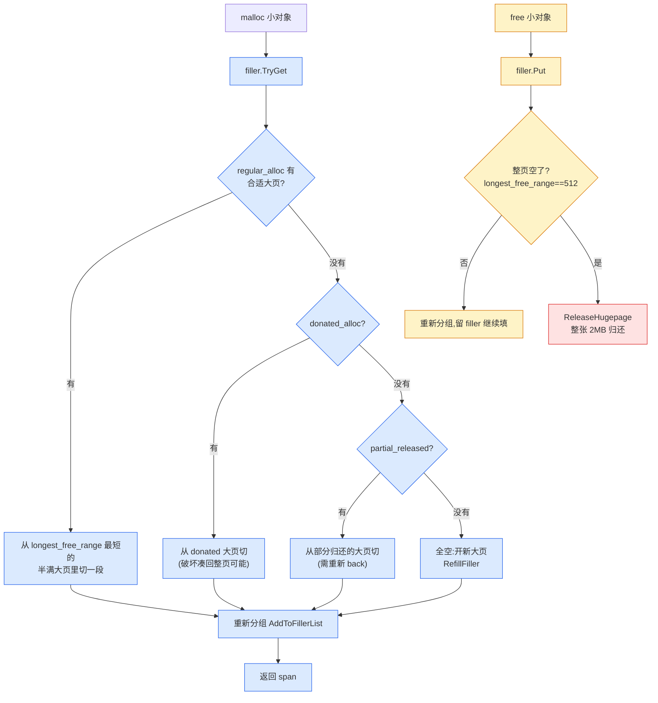
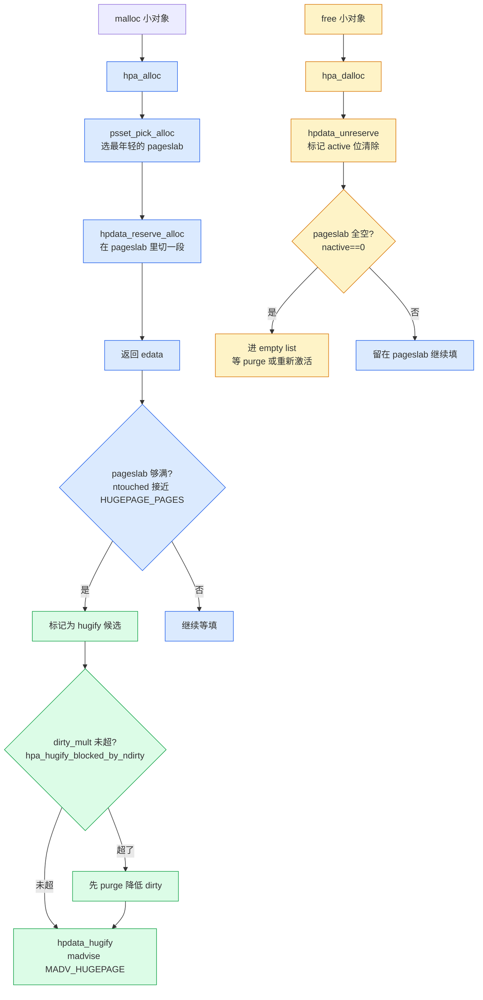
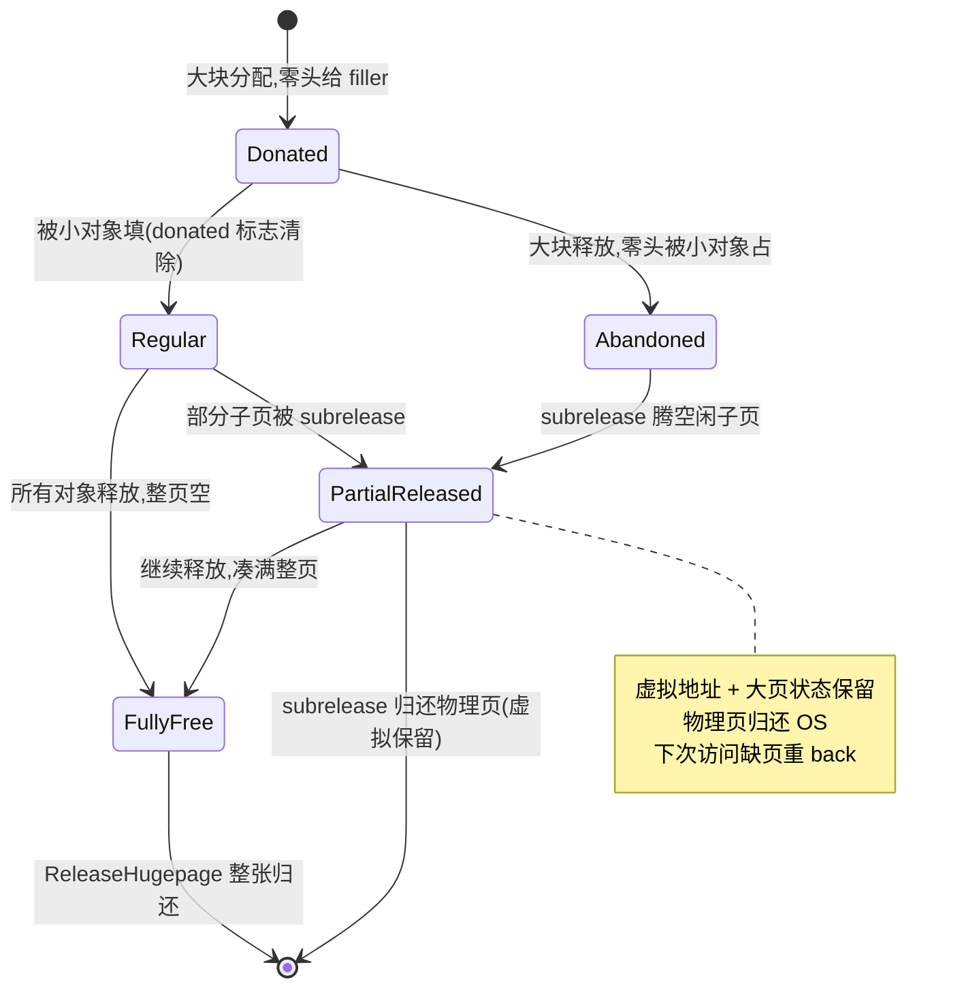
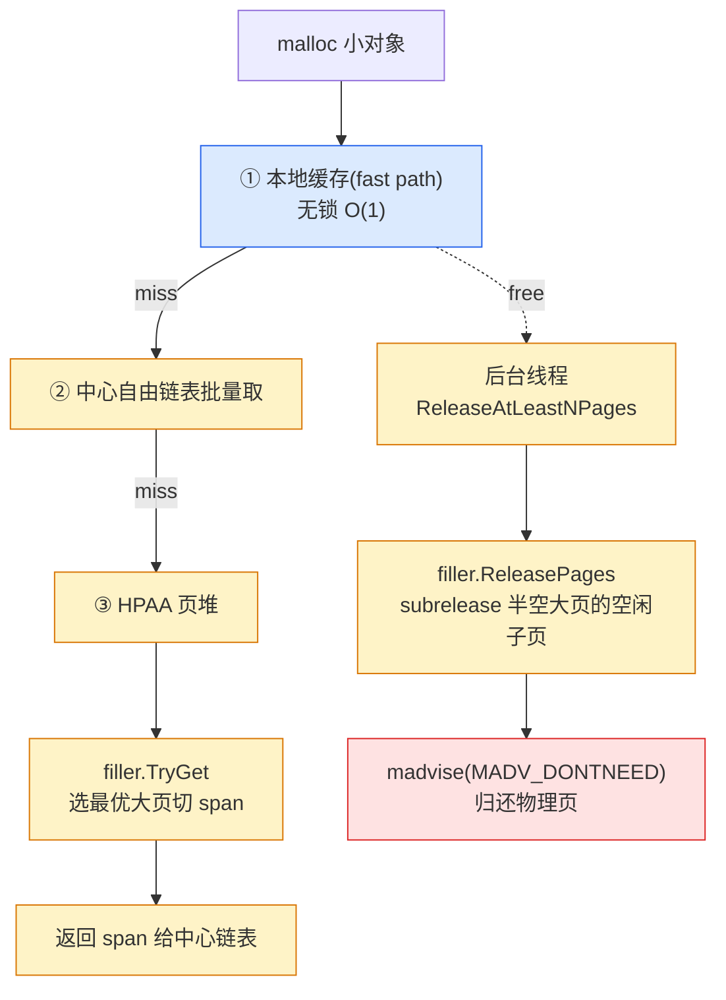

# 第十五章 · huge page aware allocator(重头戏)

> 篇:P4 碎片治理与内存归还
> 主线呼应:上一章(P4-14)把"归还 OS"讲到了 4KB 页粒度——`madvise(MADV_DONTNEED/FREE)` 把空闲页还给内核。但 4KB 这个粒度本身是个**上限**:x86-64 的 TLB(Translation Lookaside Buffer,页表缓存)只能缓存有限个 4KB 页表项,一个进程若占着几十万个 4KB 页,TLB miss 会像隐形的税一样吃掉访存延迟;而且 4KB 粒度下,外部碎片(零散空闲页)很难凑成大块归还,上一章讲的 subrelease、decay purge 都在 4KB 这层打转。这一章是第 4 篇的最高峰,也是新一代分配器的当代代差标志——**用 2MB 大页(huge page)为单位管理内存**:TLB 覆盖率提升 512 倍,碎片被压缩在大页内,腾空的整页大页可以一次性归还。tcmalloc 的 **HPAA**(huge page aware allocator)和 jemalloc 的 **hpa**(huge page allocator)是这条路线的两座高峰,它们都面对同一个硬骨头:**怎么把零散的小对象挤进少数大页(filler 打包),把腾空的整页大页归还(subrelease)?** 这一章把这两个机制拆透,把全书"省"这一面推到顶峰。

## 核心问题

**用 2MB 大页为单位管理内存,碎片压低、TLB 友好,但 2MB 粒度太粗——怎么把零散的、几十字节到几 KB 的小对象挤进整张 2MB 大页?挤进去之后,部分对象释放、大页变半空,怎么把半空大页上的存活对象挤走、把整页腾空归还?**

读完本章你会明白:

1. **大页为什么是当代代差**:x86-64 一张 2MB 大页 = 512 个 4KB 页,TLB 一项覆盖 2MB 而非 4KB;一个占 8 GB 的进程,用 4KB 页要 200 万个页表项(TLB 装不下,大量 TLB miss),用 2MB 大页只要 4000 项(TLB 轻松装下)。同时,大页单位让归还变成"凑满 2MB 才还",归还更彻底、碎片被关在大页内。这是 HPAA/hpa 的根本动机。
2. **tcmalloc HPAA 的四件套**:`HugeAllocator`(向 OS 进 2MB 大页货)、`HugeCache`(缓存大页,避免每次向 OS 要)、`HugePageFiller`(本章主角,把小对象挤进大页)、`HugeRegion`(跨大页的大块 fallback)。HPAA 的灵魂是 filler——它按"最长空闲段 longest_free_range + 量化分配数 nallocs"给大页分组,选择策略是"先填半满的、再动 donated 的、最后才碰已归还的"。
3. **donated 大页与 subrelease 的生命周期**:一条大块分配(比如 5 MB)会从 huge cache 拿 3 张大页,前两张整用、第三张只用尾巴 1 MB,**剩下 1 MB 的"零头"donate 给 filler** 给小对象填。这条 donate 的大页被标记为 `was_donated`,filler 优先不碰它(以便大块释放时能凑回整页);大块释放后,如果零头已被小对象填满(filler 没法凑回整页),它就 **abandoned**(被遗弃在 filler 里);subrelease 的任务就是把这些半空大页上的空闲段腾出、凑满整页、归还 OS。
4. **jemalloc hpa 的对称设计**:`hpdata`(一张大页的状态,用 active/touched/to_purge 三个 bitmap 管理页内页)、`psset`(page slab set,按页大小分级选最年轻的 pageslab)、`hpa_shard`(分片,每个 arena 一个)。hpa 的 hugify(把分散的 4KB 页凑成 2MB 大页)和 purge(腾空归还)是和 tcmalloc subrelease 对称的机制。两者殊途同归,但实现哲学不同——tcmalloc 是"先大页后填",jemalloc 是"先填后 hugify"。

> **如果一读觉得太难**:先只记住三件事——① 用 2MB 大页替 4KB 页,TLB 友好 + 碎片被关在大页内,这是当代代差;② tcmalloc 的 filler 是个"打包员",按 longest_free_range + nallocs 把小对象挤进半满大页,挤满一张归还一张;③ 大块分配的"零头"会被 donate 给 filler,这创造了 subrelease 难题——零头被占走就凑不回整页。其余细节都是这三件事的展开。

---

## 15.1 一句话点破

> **新一代分配器把"省"做到了 2MB 大页这一层:一张大页 2MB(512 个 4KB 页),TLB 一项顶过去 512 项;同时,内存以大页为单位归还 OS——只有凑满一张大页(它的所有 4KB 子页都空了)才能整张还回去,这让归还更彻底、把外部碎片关死在大页内部。但大页粒度粗,零散小对象必须由专门的"打包员"(filler / psset)挤进少数大页,把其余大页腾空归还;大块分配的"零头"(5 MB 要 3 张大页,第 3 张只用 1 MB,剩 1 MB)更是制造了"零头被小对象占走、凑不回整页"的难题,需要 donated 标记 + subrelease 来治。这一章就是拆透这套"打包 + 腾空 + 归还"的工程。**

这是结论,不是理由。本章倒过来拆:先讲大页到底是什么、它解决什么本质问题(不解决会怎样),再看 tcmalloc HPAA 怎么用四件套把大页玩起来,重点拆 filler 的选择策略和 donated/subrelease 生命周期,然后 jemalloc hpa 的对称设计,最后四套对照收束第 4 篇。

---

## 15.2 物理真相:大页是什么,解决什么

先把"大页"这个概念的物理含义钉死,不然后面所有机制都悬空。

### 15.2.1 大页 = 一张 2MB 的连续页表项

在 x86-64(以及大多数 64 位架构)上,虚拟内存到物理内存的映射由**页表**完成。默认页大小是 **4KB**,每张页表项(PTE,page table entry)映射一个 4KB 页。但 CPU 还支持**大页**(huge page / huge TLB page),x86-64 上是 **2MB**(也有 1 GB 的 GB 页,本书主要讲 2MB):

- **一张 2MB 大页** = 512 个连续的 4KB 页,在物理内存上**连续**,页表上**合并成一项**。
- 一张 2MB 大页的 PTE 比普通 PTE 多一个 `PS`(page size)= 1 的标志位,MMU 看到这个位就知道"这一项映射的是 2MB,不是 4KB"。

Linux 上拿大页有三种方式:

1. **透明大页(THP,Transparent Huge Pages)**:内核 khugepaged 后台线程扫描进程的虚拟内存,把连续的 4KB 页**自动合并**成 2MB 大页(反过来 deugeify 拆开)。这是默认开启的(`/sys/kernel/mm/transparent_hugepage/enabled`)。进程**不感知**,但合并时机不可控、可能造成延迟尖峰。
2. **显式 `madvise(MADV_HUGEPAGE)`**:进程告诉内核"这片内存我希望它走大页",内核在合适时机给它合并。`/sys/.../enabled = madvise` 时只有 madvise 过的才合并。
3. **预留大页(hugetlbfs)**:启动时预留一批 2MB 大页(`/proc/sys/vm/nr_hugepages`),进程用 `mmap(MAP_HUGETLB)` 显式拿。最确定但最不灵活(预留就占着,别的进程用不了)。

tcmalloc 和 jemalloc 的 HPAA/hpa 主要用第 2 种(`madvise(MADV_HUGEPAGE)`)+ 第 1 种(配合 khugepaged),把"哪些 2MB 区间走大页"的决策权从内核收回到分配器手里。

### 15.2.2 TLB:为什么大页能省下隐形的访存税

理解大页为什么重要,必须先理解 **TLB**(Translation Lookaside Buffer)。

每次 CPU 访问虚拟地址,MMU 要把它翻译成物理地址,翻译要查页表。但页表存在内存里,如果每次访存都要先去内存查页表,那一次访存就变成两次(一次查页表,一次真访问)。所以 CPU 内部有一个**页表项缓存**——TLB,它缓存最近用过的(虚拟页号 → 物理页号)映射。TLB 命中,翻译就是一次片上查找,纳秒级;TLB miss,就要走内存里的多级页表(一次 miss 在 x86-64 上是 4 次内存访问,几百纳秒,叫 page table walk)。

TLB 的容量很有限。典型现代 x86-64 CPU:

- L1 dTLB:~64~96 项(4KB 页),~32 项(2MB 大页)。
- L2 TLB(stlb,shared):~2000 项(4KB),~1000 项(2MB)。

注意**项数**——TLB 是按"映射项"算的,不管每项映射多少。所以:

- 用 **4KB 页**:L1 dTLB 64 项只能覆盖 64 × 4KB = **256 KB** 的虚拟地址;L2 stlb 2000 项覆盖 2000 × 4KB = **8 MB**。一个占 8 GB 的进程,工作集远超 TLB 容量,大量 TLB miss。
- 用 **2MB 大页**:L1 dTLB 32 项覆盖 32 × 2MB = **64 MB**;L2 stlb 1000 项覆盖 1000 × 2MB = **2 GB**。同样 8 GB 进程,2MB 大页下 TLB 命中率大幅提升。

**这就是大页的本质收益:用更少的页表项覆盖更多的虚拟地址,降低 TLB miss 率,减少 page table walk 的隐形访存税。** 对一个工作集几 GB 的服务进程,大页能把访存延迟降低几个百分点到十几个百分点(实测在内存密集型负载上很可观)。

> **钉死这件事**:大页不是为了"省内存"(2MB 大页和 512 个 4KB 页占的物理内存一样多),而是为了**省 TLB 项、省 page table walk**。它是访存性能的优化,不是空间优化。但分配器玩大页,顺带把"碎片治理"也重构了——因为大页单位让归还变成"凑满 2MB 才还",这反而压低了外部碎片(碎片被关在大页内)。

### 15.2.3 不用大页会怎样:4KB 粒度管理的两个痛

假设我们坚持用 4KB 粒度管理(像 ptmalloc 那样),会撞上两个痛:

**痛一:TLB miss 税。** 上面算过,工作集大了 TLB 装不下,page table walk 吃掉访存延迟。这是 4KB 粒度的硬上限,无法靠分配器优化(除非分配器主动 `madvise(MADV_HUGEPAGE)`,但那其实就是走向大页了)。

**痛二:外部碎片难凑成大块归还。** 4KB 粒度下,free pool 里可能有几万个零散空闲 4KB 页,但它们在虚拟地址上不连续,凑不成一段大的连续区。上一章讲的合并(coalesce)能拼相邻的,但拼出来的还是 4KB 倍数的段;要还 OS,`madvise` 也是按页(4KB)还。结果是:页堆里"碎片化"的空闲页很多,RSS 却降不下来(因为它们不连续,没法合并成大段)。

```
   4KB 粒度管理的"碎片税"(简化,一个 8MB 区域):

   ┌──┬──┬──┬──┬──┬──┬──┬──┬──┬──┬──┬──┬──┬──┬──┬──┐
   │空│活│空│活│活│空│活│空│空│活│空│活│活│空│活│空│  ← 2048 个 4KB 页
   └──┴──┴──┴──┴──┴──┴──┴──┴──┴──┴──┴──┴──┴──┴──┴──┘
    空页很多,但不连续 → 合并拼不出大段 → madvise 只能零散还
    TLB: 2048 项(每页一项),占用大量 TLB

   大页粒度管理(同一区域,4 张 2MB 大页):

   ┌──────────────┬──────────────┬──────────────┬──────────────┐
   │ 大页 A 半空  │ 大页 B 满    │ 大页 C 半空  │ 大页 D 满    │
   │ (小对象散布) │              │ (小对象散布) │              │
   └──────────────┴──────────────┴──────────────┴──────────────┘
    filler 把零散对象挤进 A、C 两张半空页,把 B、D 两张填满
    subrelease 腾空 A 或 C → 整张 2MB 归还 OS
    TLB: 4 项(每大页一项),省 TLB
```

把碎片"关进大页内"——这是 HPAA 的核心洞察。原来散布在整个地址空间的碎片,被 filler 收拢到少数几张大页里,其余大页就能整张归还。这比 4KB 粒度的"零散还"高效得多。

> **不这样会怎样**:坚持 4KB 粒度,TLB miss 税 + 碎片散布无法整段归还。这正是 ptmalloc 的处境——它没有显式的大页感知机制(只能靠内核 THP 的自动合并,但合并时机、粒度都不受分配器控制)。tcmalloc 和 jemalloc 的 HPAA/hpa,就是把"哪些区域走大页、怎么填、怎么腾空"的决策权从内核收回分配器。

---

## 15.3 tcmalloc HPAA:大页感知的页堆

理解了大页的动机,看 tcmalloc 怎么把它做成一套完整的页堆。HPAA(huge page aware allocator)是 tcmalloc 新版的默认页堆实现(替代了老的 `page_heap.cc`),它由**四个组件**协作,各有分工。

### 15.3.1 HPAA 的四件套

HPAA 在 [`huge_page_aware_allocator.h`](../tcmalloc/tcmalloc/huge_page_aware_allocator.h) 定义,核心成员(看 [`huge_page_aware_allocator.h:361-415`](../tcmalloc/tcmalloc/huge_page_aware_allocator.h#L361-L415)):

```cpp
// huge_page_aware_allocator.h:361 —— filler:把小对象挤进大页的打包员
FillerType filler_ ABSL_GUARDED_BY(pageheap_lock);
// huge_page_aware_allocator.h:398 —— regions:跨大页的大块 fallback
HugeRegionSet<HugeRegion> regions_ ABSL_GUARDED_BY(pageheap_lock);
// huge_page_aware_allocator.h:414 —— alloc:向 OS 进 2MB 大页货
HugeAllocator alloc_ ABSL_GUARDED_BY(pageheap_lock);
// huge_page_aware_allocator.h:415 —— cache:缓存大页,避免反复向 OS 要
HugeCache cache_ ABSL_GUARDED_BY(pageheap_lock);
```

这四个组件的分工:

| 组件 | 职责 | 类比(总纲的点睛比喻) |
|------|------|----------------------|
| **`HugeAllocator`** | 向 OS `mmap` 整批大页(以 `HugeRange` 为单位,若干连续大页),管理地址空间 | 总仓库向供应商进货 |
| **`HugeCache`** | 缓存从 alloc 拿来的大页,避免每次分配都向 OS 要(还的时候也先放 cache,攒够再还 OS) | 总仓库的中转区 |
| **`HugePageFiller`** | **本章主角**。把零散小对象挤进少数大页,凑满一张归还一张 | 仓库管理员把零散货打包进整箱 |
| **`HugeRegionSet`** | 处理跨大页的大块分配(当一个 span 跨多张大页时,fallback 到 region) | 超大件单独堆放区 |

一次 `malloc` 到了页堆这一层(前面章节讲的 fast path / 中心链表都 miss 了),HPAA 按申请大小分三条路(看 [`huge_page_aware_allocator.h:731-751`](../tcmalloc/tcmalloc/huge_page_aware_allocator.h#L731-L751) 的 `LockAndAlloc`):

```cpp
// huge_page_aware_allocator.h:731 —— LockAndAlloc:按大小分流
FinalizeType LockAndAlloc(Length n, SpanAllocInfo span_alloc_info,
                          bool* from_released) {
  PageHeapSpinLockHolder l;
  if (n <= kSmallAllocPages) {           // L738:≤ 半张大页(1 MB),走 filler
    return AllocSmall(n, span_alloc_info, from_released);
  }
  if (n <= HugeRegion::size().in_pages()) {  // L744:中等,走 region 或 raw hugepages
    return AllocLarge(n, span_alloc_info, from_released);
  }
  return AllocEnormous(n, span_alloc_info, from_released);  // L750:超大,直接 raw hugepages
}
```

`kSmallAllocPages` 在 [`huge_page_aware_allocator.h:272`](../tcmalloc/tcmalloc/huge_page_aware_allocator.h#L272) 定义为 `kPagesPerHugePage / 2`——半张大页(256 个 4KB 页 = 1 MB)。所以:

- **小分配(≤ 1 MB)**:走 `AllocSmall` → filler,把对象挤进半满大页。这是最常见的路径,也是 filler 发挥作用的地方。
- **大分配(1 MB ~ HugeRegion size)**:走 `AllocLarge`,优先 raw hugepages(整张大页拿),不够再 fallback 到 region。
- **超大分配**:走 `AllocEnormous`,直接 `cache_.Get` 拿连续几张大页。

### 15.3.2 HugePage 的建模:2MB 的"原子单位"

HPAA 用三个类型把"大页"建模成一流的原子单位(看 [`huge_pages.h`](../tcmalloc/tcmalloc/huge_pages.h)):

```cpp
// huge_pages.h:39 —— 每张大页含多少 4KB 页:kPagesPerHugePage = 512
inline constexpr Length kPagesPerHugePage =
    Length(1 << (kHugePageShift - kPageShift));   // 2MB / 4KB = 512

// huge_pages.h:43 —— HugePage:一张 2MB 大页(用页号 pn 标识)
struct HugePage {
  void* start_addr() const { return reinterpret_cast<void*>(pn << kHugePageShift); }
  PageId first_page() const { return PageId(pn << (kHugePageShift - kPageShift)); }
  uintptr_t pn;   // 大页号 = 虚拟地址 >> 21
};

// huge_pages.h:75 —— HugeLength:大页的"长度"(几张大页)
struct HugeLength {
  constexpr size_t in_bytes() const { return n * kHugePageSize; }     // 换算字节
  constexpr Length in_pages() const { return n * kPagesPerHugePage; } // 换算 4KB 页
  size_t n;
};

// huge_pages.h:313 —— HugeRange:连续若干张大页
struct HugeRange {
  HugePage first;
  HugeLength n;
  // ... 支持 Join / Split(合并/切分连续大页范围)
};
```

这套类型系统的精妙之处:**所有大页操作都以 `HugePage`/`HugeLength`/`HugeRange` 为单位,而不是 4KB 页**。`kPagesPerHugePage = 512` 这个常量在源码里到处出现,提醒你"现在我们在大页这一层思考"。一张大页的内部(那 512 个 4KB 页)由 `PageTracker`(`huge_page_filler.h:82`)管理——它用位图(`free_`、`released_by_page_`)记录"这一页里哪些 4KB 子页被分配了、哪些被 subrelease 归还了"。

> **技巧点**(为什么用强类型 `HugePage`/`HugeLength` 而不是 `void*`/`size_t`):这是 C++ 类型系统防错的经典用法。如果大页号和 4KB 页号都用 `size_t`,很容易写出"把 4KB 页号当大页号用"的 bug(差 9 位,地址差 512 倍)。用 `HugePage{pn}` 和 `PageId{p}` 分开,编译期就不让混用——[`huge_pages.h:46`](../tcmalloc/tcmalloc/huge_pages.h#L46) 的 `start_addr()` 里 `pn << kHugePageShift` 才是对的位移,如果误把 4KB 页号塞进来,位移就错了。这套强类型是 tcmalloc 新版相比老版(老版用裸 `uintptr_t`)的工程改进。

---

## 15.4 filler:把小对象挤进大页的打包员

这是本章的硬骨头,也是 tcmalloc HPAA 的灵魂。`HugePageFiller`(声明在 [`huge_page_filler.h:1100`](../tcmalloc/tcmalloc/huge_page_filler.h#L1100))要解决的问题是:**零散的小对象(几十字节到 1 MB 的 span)怎么填进大页,才能让尽可能多的大页保持满(以便归还腾空的少数大页)?**

### 15.4.1 难题:填大页的"反碎片"两难

直觉上,把小对象填进大页,随便找个有空的大页塞进去不就行了?但这会撞上两个相反的坑:

- **坑一(填太散 → 凑不回整页)**:如果有 N 张半空大页,新来的小对象随便挑一张塞,结果每张大页都被塞了一点点,**没有一张能凑满 → 没有大页能归还**。这是"碎片散布"的灾难。
- **坑二(填太集中 → 浪费空闲段)**:如果总往同一张大页塞,虽然能凑满它,但这张大页里的连续空闲段(longest_free_range)会被切碎,下次来了一个稍大的 span(比如 512 KB)就放不下了 → 又得开新大页。

filler 的解法是**给大页分组**,按两个维度量化:

1. **`longest_free_range`(最长空闲段)**:这张大页里最长的连续空闲 4KB 页数。它决定了"这张大页还能放下多大的 span"。短 → 碎片多;长 → 空间整。
2. **`nallocs`(分配数)**:这张大页里现在有多少个独立的分配。它近似反映"这张大页有多满"——分配多的更满,优先继续填(让它更快凑满 → 能归还);分配少的更空,让它继续空着(以便整张归还)。

选择策略的核心原则(filler 源码注释 [`huge_page_filler.h:1691-1737`](../tcmalloc/tcmalloc/huge_page_filler.h#L1691-L1737) 写得非常清楚):

> **(1) 优先填 longest_free_range 短的(碎片多的大页先填满,保住长空闲段);**
> **(2) 平局时填 nallocs 多的(更满的先填,凑满归还);**
> **(3) donated 大页(大块零头)优先级最低——别碰它,以便大块释放时能凑回整页。**

### 15.4.2 多级 TrackerList:把选择策略做成 O(1) 查找

要把上面这套策略高效实现,filler 用了**多级 TrackerList**:把所有大页按 `(longest_free_range 桶, nallocs 桶)` 分组,每组一个链表。这样"找最优大页"就是"找第一个非空的、最优的组"——O(1)。

看 `TryGet` 的实现([`huge_page_filler.h:1685`](../tcmalloc/tcmalloc/huge_page_filler.h#L1685)),核心是这段多级查找:

```cpp
// huge_page_filler.h:1685 —— TryGet:为大小为 n 的 span 选一张最优大页
TryGetResult TryGet(Length n, SpanAllocInfo span_alloc_info) {
  // ... 注释解释选择策略(见上)...
  TrackerType* pt;
  bool was_released = false;
  const AccessDensityPrediction type = span_alloc_info.density;
  do {
    const size_t listindex = ListFor(n, 0, type, kPagesPerHugePage.raw_num() - 1);
    // 第一优先级:regular_alloc_ —— 普通大页(非 donated、非 released)
    pt = regular_alloc_[type].GetLeast(listindex);          // L1763
    if (pt) { TC_ASSERT(!pt->donated()); break; }
    // 第二优先级:donated_alloc_ —— donated 大页(大块零头),只在 sparse 模式下才考虑
    if (ABSL_PREDICT_TRUE(type == AccessDensityPrediction::kSparse)) {
      pt = donated_alloc_.GetLeast(n.raw_num());             // L1769
      if (pt) { break; }
    }
    // 第三优先级:regular_alloc_partial_released_ —— 部分归还过的大页
    pt = regular_alloc_partial_released_[type].GetLeast(listindex);  // L1774
    if (pt) { /* ... */ was_released = true; break; }
    // 第四优先级:regular_alloc_released_ —— 全部归还过的大页(最不情愿碰)
    pt = regular_alloc_released_[type].GetLeast(listindex);  // L1782
    if (pt) { /* ... */ was_released = true; break; }
    return {nullptr, PageId{0}, false};   // 全空,得开新大页
  } while (false);
  // ... 从选中的 pt 里 Get(n) 出一段,重新分组 ...
  const auto page_allocation = pt->Get(n, span_alloc_info);  // L1805
  AddToFillerList(pt);                                       // L1806 重新分组
  return {pt, page_allocation.page, was_released};
}
```

这四级查找的顺序,精确体现了 filler 的策略:

1. **`regular_alloc_`(普通大页)**:最优先。这些大页是被小对象正常填着的,继续填它们能让它们更快凑满、归还。
2. **`donated_alloc_`(donated 大页)**:次优先,且**只在 sparse 分配密度下才考虑**。donated 是大块分配的零头,碰它会破坏"大块释放凑回整页"的可能性,所以尽量不碰。
3. **`regular_alloc_partial_released_`(部分归还过的大页)**:这张大页之前被 subrelease 过一部分(腾了一些 4KB 子页还 OS),现在又被分配占了。碰它要重新 back(向 OS 要回物理页)。
4. **`regular_alloc_released_`(全部归还过的大页)**:最不情愿。整张大页之前全归还了(物理页都没了),现在要重新填,得全张 back。

> **技巧点**(为什么用 `GetLeast(listindex)`):`regular_alloc_[type]` 是一个 `PageTrackerLists`,内部按 listindex(由 `longest_free_range` 量化而来)组织的链表数组。`GetLeast(listindex)` 找的是"listindex 这个桶及以上、第一个非空的链表的头部"——这正是"longest_free_range 最短(碎片最多)的可用大页"。用 bitmap 标记哪些桶非空,`ffs`(find first set)一下就定位,O(1)。这是把"贪心选择策略"用数据结构固化成 O(1) 查找的工程技巧——朴素地遍历所有大页找最优是 O(N),N 大时(几万张大页)不可接受。

### 15.4.3 Put:释放时检测整页空,触发归还

填的时候是 `TryGet`,释放的时候是 `Put`([`huge_page_filler.h:1877`](../tcmalloc/tcmalloc/huge_page_filler.h#L1877))。`Put` 把一段 span 还给某张大页的 tracker,然后检查:**这张大页是不是全空了?**

```cpp
// huge_page_filler.h:1877 —— Put:把 span 还给大页,返回 nullptr 或整页空的 tracker
TrackerType* HugePageFiller<TrackerType>::Put(
    TrackerType* pt, Range r, SpanAllocInfo span_alloc_info) {
  RemoveFromFillerList(pt);              // 先从分组链表摘下来
  pt->Put(r, span_alloc_info);           // 在 tracker 位图里标记这段空闲
  // ... 更新 pages_allocated_ 统计 ...
  if (pt->longest_free_range() == kPagesPerHugePage) {   // L1890:整页空了!
    TC_ASSERT_EQ(pt->nallocs(), 0);
    --size_;
    if (pt->released()) { /* ... 处理已归还的大页 ... */ }
    // ... 返回 pt 给上层,上层调 ReleaseHugepage 归还 ...
  }
  // ... 否则重新分组(AddToFillerList) ...
}
```

关键在 [`huge_page_filler.h:1890`](../tcmalloc/tcmalloc/huge_page_filler.h#L1890) 的判断:`pt->longest_free_range() == kPagesPerHugePage`——最长空闲段等于整张大页,说明**这张大页的所有 512 个 4KB 子页都空了**。这时 `Put` 返回非空的 `pt`,上层(HPAA 的 `DeleteFromHugepage`,看 [`huge_page_aware_allocator.h:820-834`](../tcmalloc/tcmalloc/huge_page_aware_allocator.h#L820-L834))调 `ReleaseHugepage` 把整张大页归还:

```cpp
// huge_page_aware_allocator.h:820 —— DeleteFromHugepage:释放后如果整页空,归还
void DeleteFromHugepage(FillerType::Tracker* pt, Range r, bool might_abandon,
                        SpanAllocInfo span_alloc_info) {
  if (ABSL_PREDICT_TRUE(filler_.Put(pt, r, span_alloc_info) == nullptr)) {
    // Put 返回 nullptr:大页没全空,留着继续填
    if (ABSL_PREDICT_FALSE(might_abandon)) { /* ... 记 abandoned ... */ }
    return;
  }
  ReleaseHugepage(pt);   // L833:整页空了,归还(还给 huge cache 或 OS)
}
```

`ReleaseHugepage`([`huge_page_aware_allocator.h:941`](../tcmalloc/tcmalloc/huge_page_aware_allocator.h#L941))把整张大页还给 `HugeCache`(如果它之前是 backed 的)或直接 `ReleaseUnbacked`(如果它被 subrelease 过)。这就是 filler 的最终成果——**一张被填满、又被全部释放的大页,整张 2MB 归还**。



---

## 15.5 donated 与 subrelease:大块零头的生命周期

filler 解决了"小对象怎么填大页",但留下一个尾巴:**大块分配的"零头"怎么办?** 这是 HPAA 最精巧的部分,也是 subrelease 机制的来源。

### 15.5.1 donated:大块零头送给 filler

考虑一次 5 MB 的大块分配。5 MB = 2.5 张大页,HPAA 会从 `HugeCache` 拿 3 张连续大页(6 MB),前 5 MB 给分配者,**剩下 1 MB 的零头**(在第三张大页的尾巴)怎么办?

看 `AllocRawHugepages`([`huge_page_aware_allocator.h:672`](../tcmalloc/tcmalloc/huge_page_aware_allocator.h#L672)):

```cpp
// huge_page_aware_allocator.h:672 —— AllocRawHugepages:大块分配,零头 donate 给 filler
FinalizeType AllocRawHugepages(Length n, SpanAllocInfo span_alloc_info, bool* from_released) {
  HugeLength hl = HLFromPages(n);                  // 向上取整到大页数(5MB → 3 张)
  HugeRange r = cache_.Get(hl, from_released);     // 从 cache 拿 3 张连续大页
  Length total = hl.in_pages();                     // 6 MB(3 × 2MB)
  Length slack = total - n;                         // 零头 = 1 MB
  HugePage first = r.start();
  HugePage last = first + r.len() - NHugePages(1); // 最后一张大页
  if (slack == Length(0)) { /* 没零头,直接整段返回 */ }
  ++donated_huge_pages_;                           // L695:统计 donated 数
  Length here = kPagesPerHugePage - slack;         // 最后一张里被大块占的部分 = 1 MB
  AllocAndContribute(last, here, span_alloc_info, /*donated=*/true);  // L699:零头 donate
  auto span = Finalize(Range(r.start().first_page(), n));
  span.donated = true;                             // 标记这条 span 是 donated 的
  return span;
}
```

`AllocAndContribute`([`huge_page_aware_allocator.h:522`](../tcmalloc/tcmalloc/huge_page_aware_allocator.h#L522))把最后一张大页注册成一个 `PageTracker`,`donated=true`,然后交给 filler:

```cpp
// huge_page_aware_allocator.h:522 —— AllocAndContribute:把大页(部分被占)交给 filler
PageId AllocAndContribute(HugePage p, Length n, SpanAllocInfo span_alloc_info, bool donated) {
  FillerType::Tracker* pt = tracker_allocator_.New(p, donated, /*now=*/...);  // 建 tracker
  if (pt->was_donated()) {
    pt->set_abandoned_count(n);   // 记录被大块占的页数(以便后续 abandoned 统计)
  }
  PageId page = pt->Get(n, span_alloc_info).page;   // 大块占的部分标记为已分配
  SetTracker(p, pt);
  filler_.Contribute(pt, donated, span_alloc_info);  // 交给 filler,零头可被小对象填
  return page;
}
```

注意 `donated=true` 这个标志——它告诉 filler:**这张大页是"借给"你的零头,别太使劲填它**。filler 在 `TryGet` 里把 donated 大页放在第二优先级(`donated_alloc_`,只在 regular 用尽后才考虑),就是为了**保护这条大页不被小对象填死**,以便大块释放时能凑回整页。

### 15.5.2 abandoned:零头被占走,凑不回整页

大块释放时(比如那条 5 MB 的 free),HPAA 走 `Delete`([`huge_page_aware_allocator.h:860`](../tcmalloc/tcmalloc/huge_page_aware_allocator.h#L860))。前 4 MB(两张整大页)直接还给 cache,但**第三张大页(零头那张)怎么办?**

看 `Delete` 的 c 分支([`huge_page_aware_allocator.h:898-937`](../tcmalloc/tcmalloc/huge_page_aware_allocator.h#L898-L937)):

```cpp
// huge_page_aware_allocator.h:898 —— Delete 的零头处理
} else {
  pt = GetTracker(last);   // 取出第三张大页的 tracker
  TC_ASSERT(pt->was_donated());
  PageId virt = last.first_page();
  Length virt_len = kPagesPerHugePage - slack;   // 大块占的部分(1 MB)
  // 把这 1 MB 虚拟分配还给 filler
  if (filler_.Put(pt, Range(virt, virt_len), span_alloc_info) == nullptr) {
    // Put 返回 nullptr:第三张大页没全空(被小对象占着)
    --hl;   // 只还前两张整大页
    abandoned_pages_ += pt->abandoned_count();   // 统计 abandoned 页数
    pt->set_abandoned(true);                     // 标记为 abandoned
  } else {
    // Put 返回非空:第三张大页全空了,可以整张归还!
    if (pt->released()) { --hl; ReleaseHugepage(pt); }
    else { --donated_huge_pages_; /* 清理 tracker */ }
  }
}
cache_.Release({hp, hl});   // 归还
```

两种结局:

- **零头没被小对象占**:`Put` 返回非空,第三张大页全空 → 整张归还。这是理想情况——donated 完整地"还回去"了。
- **零头被小对象占了**(filler 把零头那张大页用 `TryGet` 填了小对象):`Put` 返回 nullptr,第三张大页半空 → **只还前两张,第三张 abandoned**(遗弃在 filler 里)。`abandoned_pages_` 统计被遗弃的页数。

```
   donated 大页的生命周期(简化状态机):

   ┌─────────────────────────────────────────────────────────────┐
   │  大块分配(5MB)                                              │
   │  拿 3 张大页,第 3 张的 1MB 零头 → donated 给 filler          │
   └─────────────────────────────────────────────────────────────┘
                              │
                              ▼
   ┌─────────────────────────────────────────────────────────────┐
   │  filler.TryGet 优先不碰 donated(保护凑回整页可能)           │
   │  只有 regular_alloc 用尽,才从 donated 切小对象                │
   └─────────────────────────────────────────────────────────────┘
                              │
              ┌───────────────┴───────────────┐
              ▼                               ▼
   ┌─────────────────────┐         ┌─────────────────────┐
   │ 大块释放时          │         │ 大块释放时          │
   │ 零头没被小对象占    │         │ 零头被小对象占了    │
   │ → Put 返回非空      │         │ → Put 返回 nullptr  │
   │ → 整张 donated 归还 │         │ → abandoned(遗弃) │
   │ → --donated_count   │         │ → 留在 filler 里    │
   └─────────────────────┘         └─────────────────────┘
                                            │
                                            ▼
                              ┌─────────────────────────────┐
                              │ subrelease 介入:            │
                              │ 把 abandoned 大页上的空闲段  │
                              │ 腾出来,凑满整页归还 OS      │
                              └─────────────────────────────┘
```

> **技巧点**(为什么 donated 要特殊对待):如果不区分 donated 和 regular,filler 会把所有大页一视同仁地填,结果大块零头那张也会被填满小对象。一旦填满,大块释放时就凑不回整页(零头被占),那张大页就永久"卡"在 filler 里。这是 HPAA 设计者踩过的坑(源码注释 [`huge_page_filler.h:1718-1730`](../tcmalloc/tcmalloc/huge_page_filler.h#L1718-L1730) 提到 b/63301358、b/138618726 两个 bug)。解法就是给 donated 单独的优先级——**优先不碰它**,给大块释放留"凑回整页"的机会。这是用优先级分层换可回收性的工程智慧。

### 15.5.3 subrelease:腾空半满大页,凑满归还

abandoned 的大页(或任何半空大页)不是死局——**subrelease** 机制能把它们腾空。subrelease 的目标:**把一张半空大页上的空闲 4KB 子页 `madvise(MADV_DONTNEED)` 归还 OS,即使整张大页没全空。**

这看起来矛盾(上一章不是说"凑满整页才还"吗?),但有个关键区别:**subrelease 归还的是大页内的空闲 4KB 子页(物理页回收),不是整张大页(虚拟地址、大页合并状态保留)**。也就是说,大页的 TLB 收益保留(虚拟地址还在、还是大页映射),只是物理页被还了——下次访问会缺页重 back。

subrelease 的入口是 `ReleasePages`([`huge_page_filler.h:1226`](../tcmalloc/tcmalloc/huge_page_filler.h#L1226)),由 HPAA 的 `ReleaseAtLeastNPages`([`huge_page_aware_allocator.h:1017`](../tcmalloc/tcmalloc/huge_page_aware_allocator.h#L1017))在后台线程触发:

```cpp
// huge_page_aware_allocator.h:1017 —— ReleaseAtLeastNPages:归还 num_pages 页
Length ReleaseAtLeastNPages(Length num_pages, PageReleaseReason reason) {
  Length released = cache_.ReleaseCachedPages(HLFromPages(num_pages)).in_pages();  // 先还 cache
  // ... 还 regions ...
  if (hpaa_subrelease()) {                       // L1037:开了 subrelease
    if (released < num_pages) {
      released += filler_.ReleasePages(          // L1039:从 filler 里腾
          num_pages - released,
          SkipSubreleaseIntervals{...},          // subrelease 跳过参数
          forwarder_.release_partial_alloc_pages(),
          /*hit_limit=*/false);
    }
  }
  return released;
}
```

`filler_.ReleasePages` 内部(看 [`huge_page_filler.h:2291`](../tcmalloc/tcmalloc/huge_page_filler.h#L2291))做的事:**遍历 filler 里最空的大页(用 `CompareForSubrelease` 排序,见 [`huge_page_filler.h:1387`](../tcmalloc/tcmalloc/huge_page_filler.h#L1387)),把每张大页的空闲 4KB 子页 `madvise` 归还,直到凑够 num_pages。** 它先用 `GetDesiredSubreleasePages`([`huge_page_filler.h:2227`](../tcmalloc/tcmalloc/huge_page_filler.h#L2227),上一章讲过)看近期需求峰值,决定"这次该还多少"(别在峰值间隙乱还)。

> **钉死这件事**:tcmalloc 的归还分两层——**整页归还**(filler `Put` 检测整页空,`ReleaseHugepage` 还给 cache/OS,这是"凑满才还"的理想路径)和 **subrelease**(半空大页的空闲子页 `madvise` 归还,物理页还、虚拟地址和大页状态保留,这是"凑不满也尽量还"的补救)。两层配合:整页归还治"理想情况",subrelease 治"碎片卡死"。subrelease 受 `hpaa_subrelease` 参数控制(默认对 cold heap 开,见 [`huge_page_aware_allocator.h:1268`](../tcmalloc/tcmalloc/huge_page_aware_allocator.h#L1268)),因为它有代价(下次访问缺页)。

---

## 15.6 jemalloc hpa:tcmalloc 的对称兄弟

tcmalloc 的 HPAA 是"先大页后填"(先 mmap 大页,再 filler 填小对象),jemalloc 的 hpa(huge page allocator)走了**对称**的另一条路——"先填后 hugify"(先按 4KB 页填,填满了再 `madvise(MADV_HUGEPAGE)` 把它合并成大页)。两者殊途同归,但实现哲学不同。

### 15.6.1 hpdata:一张大页的三个 bitmap

jemalloc 的 hpa 把"一张大页"建模成 `hpdata_t`(声明在 `include/jemalloc/internal/hpdata.h`,实现在 [`src/hpdata.c`](../jemalloc/src/hpdata.c))。每张 hpdata 内部用**三个 bitmap**管理它的 512 个 4KB 子页(默认 `HUGEPAGE_PAGES = 512`,见 [`include/jemalloc/internal/pages.h:36`](../jemalloc/include/jemalloc/internal/pages.h#L36)):

- **`active_pages`**:哪些子页当前被分配(活跃)。
- **`touched_pages`**:哪些子页曾经被写过(脏页,需 purge 才能还)。
- **`to_purge`**:这次 purge 要还哪些子页(由 `hpdata_purge_begin` 计算)。

看 `hpdata_purge_begin`([`src/hpdata.c:340`](../jemalloc/src/hpdata.c#L340))怎么算 `to_purge`:

```c
// hpdata.c:340 —— hpdata_purge_begin:算这次 purge 要还哪些子页
void hpdata_purge_begin(hpdata_t *hpdata, hpdata_purge_state_t *purge_state, size_t *nranges) {
  /* dirty_pages = ~active_pages & touched_pages(写过但当前不活跃) */
  fb_group_t dirty_pages[FB_NGROUPS(HUGEPAGE_PAGES)];
  fb_init(dirty_pages, HUGEPAGE_PAGES);
  fb_bit_not(dirty_pages, hpdata->active_pages, HUGEPAGE_PAGES);       // L387:取反 active
  fb_bit_and(dirty_pages, dirty_pages, hpdata->touched_pages, HUGEPAGE_PAGES);  // L388:AND touched
  /* to_purge:把 dirty 段延伸到下一个 active 页(合并相邻 dirty 省 TLB shootdown) */
  fb_init(purge_state->to_purge, HUGEPAGE_PAGES);
  size_t next_bit = 0;
  while (next_bit < HUGEPAGE_PAGES) {
    size_t next_dirty = fb_ffs(dirty_pages, HUGEPAGE_PAGES, next_bit);  // L395:找下一个 dirty
    if (next_dirty == HUGEPAGE_PAGES) break;
    size_t next_active = fb_ffs(hpdata->active_pages, HUGEPAGE_PAGES, next_dirty);
    ssize_t last_dirty = fb_fls(dirty_pages, HUGEPAGE_PAGES, next_active - 1);
    fb_set_range(purge_state->to_purge, HUGEPAGE_PAGES, next_dirty,    // L415
                 last_dirty - next_dirty + 1);
    (*nranges)++;
    next_bit = next_active + 1;
  }
}
```

这里有个精彩的技巧——**purge 时合并相邻的 dirty 段**。源码注释([`src/hpdata.c:355-377`](../jemalloc/src/hpdata.c#L355-L377))解释:可能有两段 dirty 中间隔着一段 retained(之前 purge 过的),`hpdata_purge_begin` 会**把 dirty 段延伸到下一个 active 页**,合并成一段大的 purge。为什么?**因为 purge 的昂贵部分是 TLB shootdown(通知其他 CPU 刷新 TLB),而不是内核状态记录**——多 purge 几个 4KB 页内核不在乎,但多个独立的 purge range 就要多次 TLB shootdown。合并成一段,一次 shootdown 搞定。

> **技巧点**(purge 合并省 TLB shootdown):这是对"归还开销模型"的精确建模。朴素的 purge 会按 dirty 段逐个 `madvise`,每个独立段一次 TLB shootdown(多核间 IPI 中断,微秒级)。jemalloc 的解法是**主动多 purge 一些页**(把 dirty 段间的 retained 也一起 purge),换取 fewer ranges、fewer shootdowns。这是个"用空间(多还几个页)换时间(少几次 shootdown)"的权衡,源码注释明说"the expensive part of purging is the TLB shootdowns"。tcmalloc 的 subrelease 没有这个优化(它按 4KB 子页独立 madvise),这是 jemalloc hpa 的独到之处。

### 15.6.2 psset:page slab set,按年龄选最年轻的

jemalloc hpa 把所有 hpdata(大页)组织在 `psset_t`(page slab set,实现在 [`src/psset.c`](../jemalloc/src/psset.c))里。分配时,`psset_pick_alloc`([`src/psset.c:360`](../jemalloc/src/psset.c#L360))选一张 pageslab 来填:

```c
// psset.c:360 —— psset_pick_alloc:选一张 pageslab 来分配
hpdata_t *psset_pick_alloc(psset_t *psset, size_t size) {
  pszind_t min_pind = sz_psz2ind(sz_psz_quantize_ceil(size));   // 大小对应的页大小分级
  hpdata_t *ps = NULL;
  /* ... 大页 size class 禁用时的特殊路径 ... */
  pszind_t pind = (pszind_t)fb_ffs(                              // L376:bitmap 找第一个非空分级
      psset->pageslab_bitmap, PSSET_NPSIZES, (size_t)min_pind);
  if (pind == PSSET_NPSIZES) {
    return hpdata_empty_list_first(&psset->empty);               // L379:没有可用的,返回 empty list
  }
  ps = hpdata_age_heap_first(&psset->pageslabs[pind]);           // L381:这个分级里最年轻的
  return ps;
}
```

选择策略:**按页大小分级(pszind)找最小够用的分级,然后取那个分级里 age 最小的(最年轻的)pageslab**。age 是个单调递增的计数器,每次 pageslab 从 empty 变活跃时,`hpdata_age_set(ps, shard->age_counter++)`(看 [`src/hpa.c:740`](../jemalloc/src/hpa.c#L740))。

为什么选最年轻的? jemalloc 的注释([`src/hpa.c:732-741`](../jemalloc/src/hpa.c#L732-L741))解释:**"把曾经 empty 的 pageslab 当成全新的(年龄重置),因为我们想近似的是 pageslab 里 allocations 的年龄,而新 pageslab 里的分配按定义是最年轻的。"** 这是一种 LRU 变体——优先填"刚被激活"的 pageslab,让老的 pageslab 有机会彻底空下来(被 purge/hugify)。

### 15.6.3 hugify:把填满的大页合并成 2MB

这是 jemalloc hpa 和 tcmalloc HPAA 的根本区别。tcmalloc 是"先拿大页再填",jemalloc 是"先按 4KB 填,满了再 hugify"。

`hpdata_hugify`([`src/hpdata.c:491`](../jemalloc/src/hpdata.c#L491))把一张 hpdata 标记为大页:

```c
// hpdata.c:491 —— hpdata_hugify:标记这张大页为 huge(全部 touched)
void hpdata_hugify(hpdata_t *hpdata) {
  hpdata->h_huge = true;                                          // 标记为 huge
  fb_set_range(hpdata->touched_pages, HUGEPAGE_PAGES, 0, HUGEPAGE_PAGES);  // 全部 touched
  hpdata->h_ntouched = HUGEPAGE_PAGES;
}
```

实际给内核 `madvise(MADV_HUGEPAGE)` 的动作在 `hpa_assume_huge`([`src/hpa.c:275`](../jemalloc/src/hpa.c#L275))和后台 hugify 线程里(`hpa_try_hugify`,`src/hpa.c:509`)。hugify 的触发由 `hugify_style` 控制([`src/hpa.c:12`](../jemalloc/src/hpa.c#L12) 定义四种:`auto`/`none`/`eager`/`lazy`):

- **`eager`**:一有大页满足条件就 hugify(激进,但 hugify 本身有延迟尖峰风险)。
- **`lazy`**:延迟 hugify,攒够了再批量 hugify。
- **`none`**:不主动 hugify,靠内核 khugepaged 自动合并。
- **`auto`**(默认):根据 dirty 页比例等启发式决定。

hugify 有个反直觉的约束——**`hpa_hugify_blocked_by_ndirty`**([`src/hpa.c:244`](../jemalloc/src/hpa.c#L244)):如果当前 dirty 页太多(超过 `dirty_mult` 阈值,见 [`src/hpa.c:234`](../jemalloc/src/hpa.c#L234)),hugify 会被阻塞。为什么?**因为 hugify 一张大页要把它的所有 4KB 子页都 touched(脏),如果 dirty 已经很多,hugify 会进一步推高 dirty,触发更多 purge**。这是个反馈循环——hugify 和 purge 互相制约,通过 `dirty_mult` 这个分数阈值(`opts.dirty_mult`,默认 1/2 左右)平衡。



---

## 15.7 四套对照:大页感知的实现光谱

把四套在大页这件事上的选择并排,看它们各自站在光谱的哪一端:

| 维度 | tcmalloc(HPAA) | jemalloc(hpa) | mimalloc | ptmalloc |
|------|----------------|---------------|----------|----------|
| **大页感知** | 显式,核心特性(HPAA 是默认页堆) | 显式,可选(hpa 是 experimental PAI) | 弱(只支持 1 GB huge OS page 预留) | 无显式感知(靠内核 THP) |
| **获取大页方式** | `mmap` + `madvise(MADV_HUGEPAGE)`(由 `Back` 触发) | `madvise(MADV_HUGEPAGE)`(hugify) | `mmap(MAP_HUGETLB)` 预留 1 GB 页 | 无(内核 khugepaged 自动) |
| **填大页策略** | filler 多级 TrackerList(longest_free_range + nallocs) | psset 按年龄选最年轻 pageslab | N/A(无 2MB 大页填机制) | N/A |
| **凑空归还** | 整页归还 + subrelease(半空大页 madvise 子页) | purge(合并 dirty 段省 TLB shootdown) | arena-abandon(整 segment 抛弃,非大页) | systrim(4KB 粒度) |
| **大块零头** | donated 标记 + abandoned 统计 | 无(jemalloc 不做 donated,大块走 extent) | N/A | N/A |
| **关键源码** | `huge_page_filler.h`、`huge_page_aware_allocator.{h,cc}` | `src/hpa.c`、`src/hpdata.c`、`src/psset.c` | `src/arena.c`(`mi_reserve_huge_os_pages`) | (无) |

几个值得回味的差异:

- **tcmalloc 是"大页优先"派, jemalloc 是"4KB 优先、按需 hugify"派**。tcmalloc 的 HPAA 从底层就按 2MB 大页组织(`HugeAllocator`/`HugeCache`/`filler` 都是大页单位),小对象是"挤进"大页;jemalloc 的 hpa 先按 4KB 页管理(`hpdata` 内部三个 bitmap 是 4KB 粒度),填满了再 hugify 成 2MB。两种哲学各有取舍:tcmalloc 的大页覆盖率更稳定(从一开始就是大页),但实现更复杂(filler/donated/subrelease);jemalloc 更渐进(按需 hugify,省内存),但 hugify 时机有延迟尖峰风险。
- **mimalloc 对 2MB 大页支持弱**。它主要支持 1 GB 的 huge OS page(通过 `mi_reserve_huge_os_pages`,见 [`src/arena.c:997`](../mimalloc/src/arena.c#L997)),这是给特定场景(超大数据库、HPC)预留的,不是通用的大页感知分配。mimalloc 的设计取向是"简单优先",它把大页这件事基本交给内核 THP。这是新秀的取舍——不追求极致大页收益,换实现简洁。
- **ptmalloc 完全没有显式大页感知**。它的 `mmap`/`brk` 都是 4KB 粒度,大页合并完全靠内核 khugepaged 后台扫描。结果是:大页覆盖率不可控(取决于内核扫描频率和工作负载模式),且 khugepaged 的合并本身可能造成延迟尖峰(它要在后台扫页表、合并)。这是 baseline 的局限,也是新一代分配器(HPAA/hpa)存在的理由。

> **不这样会怎样**(反面对比):假设我们用 ptmalloc 跑一个 8 GB 工作集的内存密集型服务。ptmalloc 按 4KB 粒度管理,8 GB = 200 万个 4KB 页。① TLB:即便 L2 stlb 有 2000 项,也只能覆盖 8 MB,剩下 7.99 GB 的访问全要 page table walk(每次几百纳秒)。实测这类负载,page table walk 能吃掉 5%~15% 的 CPU 周期。② 内核 THP 救场?khugepaged 扫描有延迟(默认每 10 秒扫一遍),且只在内存连续时合并——ptmalloc 的 `mmap` 出来的子堆地址分散,合并成功率不高。③ 切到 tcmalloc HPAA:同样 8 GB,用 2MB 大页只要 4000 项,TLB 轻松装下;且 HPAA 主动 `madvise(MADV_HUGEPAGE)` 保证大页覆盖率。这是 Google 内部大量服务切换到 tcmalloc 的关键收益之一。

---

## 15.8 技巧精解:filler 的碎片打包 + donated/subrelease 生命周期

这一节把本章最硬核的两个技巧单独拆透——**filler 怎么把零散对象挤进少数大页(打包),donated/subrelease 怎么处理大块零头的生命周期(腾空归还)**。配反面对比。

### 难题重述:大页填充的"反碎片"两难

filler 面对的核心难题是:**零散小对象填大页,怎么填才能让尽可能多的大页保持满(可归还)、同时不切碎大页内的连续空闲段(能放大 span)?**

这是两个相反的力:

- **想凑满归还** → 应该把对象集中填到少数大页(让它们尽快满),其他大页保持空(可归还)。但集中填会切碎那几张大页的空闲段,下次来大 span 放不下。
- **想保连续段** → 应该把对象分散填(每张大页只填一点点,保留长空闲段)。但分散填没有一张能凑满,全卡在半空,一张都还不掉。

朴素策略各有死法:

**朴素策略 A:随机填(随便找张半空大页塞)**

- 后果:**碎片散布**。N 张大页每张都被塞了一点点,没有一张能凑满,subrelease 也凑不够整页。RSS 居高不下。
- 这是"无 filler"的自然结果——4KB 粒度的页堆(`page_heap.cc` 老版)就有这个问题。

**朴素策略 B:总填同一张(集中填)**

- 后果:**空闲段切碎**。那张大页很快填满,但里面没有连续的空闲段了,下次来个 512 KB 的 span 放不下,只能开新大页。新大页又只填一点点,回到策略 A 的碎片散布。
- 这是"贪心填一张"的死法。

**朴素策略 C:按空闲大小填(找空闲最多的塞)**

- 后果:**永远填不满**。总往最空的大页塞,每张大页都被填到中等水位,没有一张能凑满归还。这比策略 A 还糟——至少 A 偶尔能凑满。

### filler 的解法:多级分组 + 四级优先级

filler 的精妙在于它**同时优化两个目标**,用多级分组把"贪心选择"做成 O(1):

1. **按 `longest_free_range` 分组**:碎片多(空闲段短)的大页优先填,保住长空闲段。
2. **按 `nallocs` 二级分组**:同 `longest_free_range` 下,分配多的(更满)优先填,凑满归还。
3. **四级优先级**(`regular_alloc_` → `donated_alloc_` → `partial_released_` → `released_`):保护 donated、避免碰已归还的大页。

这套策略的物理直觉,用总纲的点睛比喻最贴切——**filler 像仓库管理员,把零散货(小 span)按"哪个箱子最碎(longest_free_range 短)就先往哪塞"和"哪个箱子快满了(nallocs 多)就先塞"的原则打包,目的是让尽量多的箱子彻底空出来退还(donated 的箱子先别动,大单子退了还能整箱拼回去)**。

源码佐证([`huge_page_filler.h:1761-1789`](../tcmalloc/tcmalloc/huge_page_filler.h#L1761-L1789)):

```cpp
// 第一优先级:regular_alloc_,longest_free_range 最短的半满大页
pt = regular_alloc_[type].GetLeast(listindex);          // L1763
// 第二优先级:donated_alloc_(大块零头),尽量不碰
pt = donated_alloc_.GetLeast(n.raw_num());              // L1769
// 第三优先级:partial_released_(部分归还过的大页),碰了要重新 back
pt = regular_alloc_partial_released_[type].GetLeast(listindex);  // L1774
// 第四优先级:released_(全部归还过的大页),最不情愿
pt = regular_alloc_released_[type].GetLeast(listindex); // L1782
```

这套四级优先级,是对"碎片治理 vs 可回收性 vs back 代价"三维权衡的精确编码。

> **反面对比**(如果不用四级优先级):假设 filler 只用 `regular_alloc_`(单级),donated 大页和普通大页一视同仁。结果:① donated 零头被填满小对象 → 大块释放凑不回整页 → abandoned 堆积。② partial_released 大页被频繁填(每次要 back)→ back 代价(mmap/缺页)累积。③ released 大页被填 → 整张重新 back → 极贵。四级优先级把"碰谁的代价"显式编码进选择顺序,是最小化总代价的贪心近似。

### donated/subrelease 的生命周期:为什么需要两层归还

第二个技巧是**两层归还**:整页归还(理想)+ subrelease(补救)。为什么需要两层?

**整页归还的局限**:`Put` 检测 `longest_free_range == kPagesPerHugePage`(整页空)才归还。但现实中,大页常常半空——小对象释放后,大页里还有别的对象活着,`longest_free_range` 远小于 512。这种半空大页,整页归还拿不到,它们就卡在 filler 里占着 RSS。

**subrelease 的补救**:`ReleasePages` 遍历这些半空大页,把它们的空闲 4KB 子页 `madvise(MADV_DONTNEED)` 归还物理页(虚拟地址和大页状态保留)。这样即使整页没空,也能把空闲部分的物理内存还回去。



subrelease 不是免费的——它有**三个代价**:

1. **下次访问缺页**:被 subrelease 的子页,物理页没了,下次 `malloc`/`free` 碰到要重 back(minor fault)。
2. **可能破坏大页合并**:如果 subrelease 的子页太多,内核可能把这张大页 deugeify(拆回 4KB)。
3. **增加 filler 复杂度**:subrelease 过的大页要进 `partial_released_`/`released_` 分组,`TryGet` 优先级降低。

所以 subrelease 受 `hpaa_subrelease` 参数控制([`huge_page_aware_allocator.h:1268`](../tcmalloc/tcmalloc/huge_page_aware_allocator.h#L1268))——**默认只对 cold heap(memory tag = kCold,冷数据堆)开**。冷数据堆的访问频率低,subrelease 的缺页代价可接受;热堆默认不开 subrelease,保住大页覆盖率和零缺页。

> **钉死这件事**:tcmalloc 的归还分两层——整页归还(filler Put 检测整页空)是理想路径,subrelease(半空大页的空闲子页 madvise)是补救。两层配合,既保证"凑满才还"的高效(整页归还一张 2MB),又解决"半空大页卡死 RSS"的问题(subrelease 挤空闲)。subrelease 有代价(缺页、可能 deugeify),所以只对冷堆默认开。donated 标记保护大块零头不被 filler 填死,abandoned 统计被占走的零头,subrelease 是 abandoned 的最终出路。

---

## 15.9 把 HPAA 放进三层快慢道:它在哪一层

讲完 filler 和 subrelease,把 HPAA 放回全书的二分法里定位。

HPAA 服务的是二分法的**中心堆(slow path)**那一面——它是页堆的实现,在 slow path 的最底层(中心链表 → 页堆 → OS 这条链的末端)。它的两个核心机制(filler 打包、subrelease 归还)都是 slow path 的活:

- **filler 打包**:发生在 `AllocSmall`(小分配走页堆)时,属于 slow path 的"分配"侧。它不是 fast path(本地缓存),是本地缓存 miss、中心链表也 miss 后,到页堆切 span 时的策略。
- **subrelease 归还**:发生在后台线程 `ReleaseAtLeastNPages` 时,属于 slow path 的"归还"侧(上一章 P4-14 讲的归还,在 HPAA 这里具体化为 subrelease)。



HPAA 和 fast path(本地缓存)的分工是严格的:fast path 只管快速 pop/push,绝不碰 filler(subrelease 是 syscall,会毁掉无锁 O(1) 的延迟)。filler 和 subrelease 都在 slow path,按低频率触发(本地缓存 → 中心是中频,中心 → 页堆是低频,页堆内部的 filler/subrelease 是最低频)。这正是第 1 章(P0-01)立的"分层 + 分频率"原则的又一次体现——**昂贵的大页操作(填、腾、归还)放在最低频的层**。

> **钉死这件事**:HPAA 是 slow path 在"省"这一面的当代顶峰。第 4 篇三章(P4-13 合并 → P4-14 归还 → P4-15 HPAA)是 slow path 治碎片的三部曲:合并把相邻空闲拼回去(P4-13),归还把拼回去的还给 OS(P4-14),HPAA 用大页把这一切的粒度从 4KB 提到 2MB,让 TLB 友好、碎片关在大页内、归还更彻底(P4-15)。fast path(本地缓存)从头到尾不参与这三件事,因为它们慢、会毁掉 fast path 的延迟。

---

## 章末小结

这一章是第 4 篇的最高峰,也是全书"省"这一面的当代代差标志。核心是**用 2MB 大页为单位管理内存**:TLB 一项顶过去 512 项(降低 page table walk 税),碎片被关在大页内(凑满整页才还,归还更彻底)。tcmalloc 的 HPAA 用四件套(`HugeAllocator`/`HugeCache`/`HugePageFiller`/`HugeRegionSet`)把大页玩起来,灵魂是 filler——它按 `longest_free_range` + `nallocs` 多级分组,四级优先级(regular → donated → partial_released → released)把"碰谁的代价"显式编码进选择策略,把零散小对象挤进少数大页。大块分配的"零头"donate 给 filler(标记 `was_donated`,优先级低以保护凑回整页),零头被小对象占走就 abandoned,subrelease 把半空大页的空闲子页 `madvise` 归还(只对冷堆默认开,因为 subrelease 有缺页代价)。jemalloc 的 hpa 是对称设计——`hpdata` 用三个 bitmap(active/touched/to_purge)管理大页内 4KB 子页,`psset` 按年龄选最年轻 pageslab,`hpdata_hugify` 把填满的大页 `madvise(MADV_HUGEPAGE)` 合并;purge 时合并相邻 dirty 段省 TLB shootdown。mimalloc 对 2MB 大页支持弱(只支持 1 GB huge OS page 预留),ptmalloc 完全无显式大页感知(靠内核 THP)。

本章服务的是二分法的**中心堆(slow path)**那一面。第 4 篇三章合起来,是 slow path 治碎片的三部曲:合并(P4-13)拼相邻空闲,归还(P4-14)把空闲还给 OS,HPAA(本章)把这一切的粒度从 4MB 提到 2MB——让 TLB 友好、让碎片有处可藏(关在大页内)、让归还更彻底(凑满整页 2MB 一次还)。fast path 从头到尾不参与,因为这三件事都慢、都涉及 syscall 或复杂策略,会毁掉 fast path 的纳秒级延迟。这个分工,是"分层 + 分频率"在大页这一层的具体落地。

### 五个"为什么"清单

1. **为什么用 2MB 大页替 4KB 页?** TLB 容量有限(典型 L1 dTLB 64 项),4KB 页下 64 项只覆盖 256 KB,工作集大了大量 page table walk(每次几百纳秒);2MB 大页下同样 64 项覆盖 128 MB,TLB 命中率大幅提升。同时,大页单位让归还变成"凑满 2MB 才还",碎片被关在大页内,归还更彻底。
2. **filler 怎么把零散小对象挤进大页?** 给大页按 `longest_free_range`(最长空闲段)和 `nallocs`(分配数)多级分组,选择策略是"优先填碎片多的(longest_free_range 短)+ 平局填更满的(nallocs 多)+ donated 的先别碰"。用 `PageTrackerLists` 的 bitmap 查找把贪心选择做成 O(1)。
3. **donated 大页是什么,为什么优先级低?** donated 是大块分配(如 5 MB)的"零头"(5 MB 要 3 张大页,第 3 张只用 1 MB,剩 1 MB 零头)送给 filler 填的。它优先级低是为了**保护凑回整页的可能**——大块释放时,如果零头没被填,可以整张归还;被填了就 abandoned。不区分 donated 会把零头填死,大块永远凑不回整页。
4. **subrelease 和整页归还有什么区别?** 整页归还是 filler Put 检测整页全空(`longest_free_range == 512`)后整张 2MB 归还,是理想路径;subrelease 是半空大页的空闲 4KB 子页 `madvise(MADV_DONTNEED)` 归还物理页(虚拟地址和大页状态保留),是补救。subrelease 有缺页代价,所以只对冷堆默认开。
5. **tcmalloc HPAA 和 jemalloc hpa 有什么根本区别?** tcmalloc 是"先大页后填"(HPAA 从底层按 2MB 组织,小对象挤进),大页覆盖率稳定但实现复杂(filler/donated/subrelease);jemalloc 是"先填后 hugify"(先按 4KB 管理,满了再 `madvise(MADV_HUGEPAGE)` 合并),更渐进但 hugify 时机有延迟尖峰风险。两者 purge 策略也不同——jemalloc 合并相邻 dirty 段省 TLB shootdown,tcmalloc 按子页独立 madvise。

### 想继续深入往哪钻

- **想看 tcmalloc filler 的完整策略**:[`huge_page_filler.h`](../tcmalloc/tcmalloc/huge_page_filler.h) 的 `TryGet`(L1685,四级优先级选择)、`Put`(L1877,整页空检测)、`Contribute`(L2073,donated 注册)、`ReleasePages`(L1226,subrelease)、`GetDesiredSubreleasePages`(L2227,看需求峰值决定还多少)。配合 [`huge_page_aware_allocator.h`](../tcmalloc/tcmalloc/huge_page_aware_allocator.h) 的 `AllocSmall`(L582)、`AllocRawHugepages`(L672,donated 来源)、`DeleteFromHugepage`(L820)、`ReleaseHugepage`(L941)看大页生命周期。
- **想看 jemalloc hpa 的实现**:[`src/hpa.c`](../jemalloc/src/hpa.c) 的 `hpa_try_alloc_from_one_ps`(L709,选 pageslab 分配)、`hpa_assume_huge`(L275,hugify)、`hpa_should_purge`(L256,purge 触发)、`hpa_update_purge_hugify_eligibility`(L290);[`src/hpdata.c`](../jemalloc/src/hpdata.c) 的 `hpdata_purge_begin`(L340,合并 dirty 段)、`hpdata_hugify`(L491);[`src/psset.c`](../jemalloc/src/psset.c) 的 `psset_pick_alloc`(L360,选最年轻 pageslab)、`psset_pick_hugify`(L429)。
- **想调 tcmalloc 的大页参数**:`TCMALLOC_HPAA_SUBRELEASE=0|1`(开关 subrelease)、`TCMALLOC_FILLER_SKIP_SUBRELEASE_SHORT_INTERVAL`/`_LONG_INTERVAL`(subrelease 跳过窗口)、`TCMALLOC_MADVISE_PREFERENCE`(归还模式)。配合 `MallocExtension::instance()->GetStats()` 看 filler 的 donated/abandoned/subrelease 统计。
- **想调 jemalloc 的大页参数**:`MALLOC_CONF="experimental_hpa:true"`(开 hpa)、`hpa_hugify_style:auto|none|eager|lazy`、`hpa_dirty_mult:N/D`(dirty 比例阈值)。观察 `jemalloc_stats` 的 `hpa` 相关计数。
- **想动手感受大页收益**:写一个访问 8 GB 数组的程序(顺序/随机访问),分别用 tcmalloc(默认开 HPAA)/ jemalloc(开 hpa)/ ptmalloc 跑,用 `perf stat -e dTLB-load-misses,iTLB-load-misses` 观察 TLB miss 率,用 `/proc/self/smaps` 看 `AnonHugePages` 计数——tcmalloc 的 HPAA 应该有最高的大页覆盖和最低的 TLB miss。

### 引出下一章(并收束第 4 篇)

讲完 HPAA,第 4 篇(碎片治理与内存归还)就完整了——合并(P4-13)拼碎片,归还(P4-14)还 OS,HPAA(本章)用大页把这一切的粒度从 4KB 提到 2MB。第 4 篇是"省"这一面的全部战场。接下来第 5 篇(工程化:初始化、线程、fork、观测)换一个视角——不再追"快"或"省",而是追"**能起步、能 fork、能看见**"。一个分配器再快再省,如果第一次 `malloc` 时自己还没初始化(鸡生蛋问题)、`fork()` 后子进程死锁、运行起来看不见内存用了多少,那它就只是个玩具。第 5 篇讲支撑前面一切的工程基建,第 16 章(P5-16)我们从"初始化、TLS 与懒创建"讲起——第一次 `malloc` 时分配器自己怎么自举。
