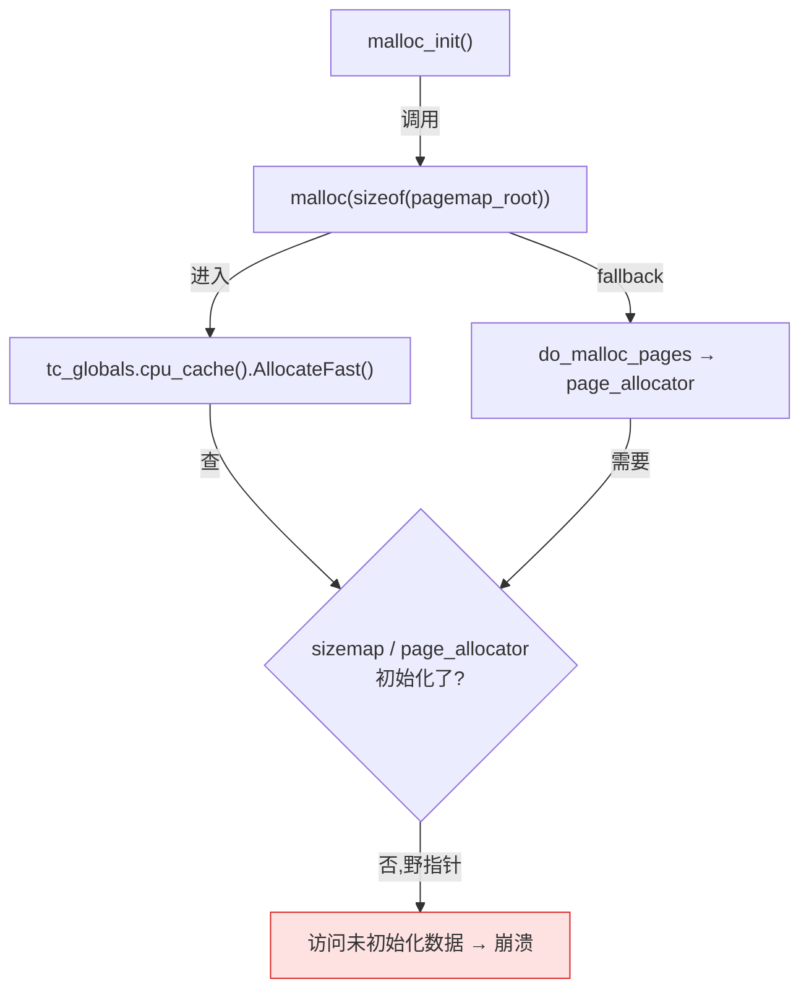

# 第十六章 · 初始化、TLS 与懒创建

> 篇:P5 工程化
> 主线呼应:前 15 章讲的都是"分配器已经跑起来之后,一次 `malloc` 怎么走完三层快慢道"。可第一次 `malloc` 触发时,分配器自己还一个字节的元数据都没初始化——它的 `size_map`、`page_allocator`、`transfer_cache` 全是零。更尴尬的是,"分配器启动"这件事本身就要分配内存:初始化 `pagemap` 要申请一片大数组,`arena` 要建元数据池,而这些内存又得靠分配器自己来发。这是一个**鸡生蛋**的死结。本章讲分配器怎么把这个结解开:用**静态初始化 + bootstrap allocator(自举分配器)**把自己拉起来;再讲每个线程的 tcache/heap 怎么在**第一次使用时才懒创建**,线程退出时怎么靠 **pthread key + destructor** 把缓存回收干净、不留泄漏。四套横评贯穿。

## 核心问题

**第一次 `malloc` 时,分配器自己的全局状态(`size_map`、`page_allocator`、`transfer_cache`、arena……)一个都还没初始化,这些状态初始化时又要分配内存——分配器怎么"提着自己的鞋带把自己拽起来"?又怎么保证每个线程的 tcache 在第一次 `malloc` 时才被创建、在线程退出时不泄漏?**

读完本章你会明白:

1. **自举悖论**:分配器启动时需要内存,但能给它内存的只有它自己——这是所有分配器绕不开的起点。解法是**静态初始化 + 一个极简的 bootstrap 路径**(静态 buffer / 早期 `mmap` / base allocator),它**绝不走正常 `malloc` 路径**,否则递归崩溃。
2. **懒创建(lazy init)**:线程的 tcache/heap 不是 `pthread_create` 时就建好,而是**第一次 `malloc`/`free` 时**才创建。这是为了不让"只读不写"的线程、短命线程白白占内存。
3. **TLS 的两副面孔**:`__thread`/`thread_local`(快,但不能挂钩清理)和 `pthread_key_create` + destructor(慢一点,但线程退出能回调清理)。四套分配器都是**两者结合**——用 `__thread` 走 fast path,用 key + destructor 兜底回收。
4. **线程退出的 destructor 回收**:线程死了,它的 tcache 不能就这么丢(里面还囤着几 MB 空闲块),必须靠 destructor 回收到中心堆,否则**内存泄漏**。
5. **四套横评**:tcmalloc 的 `Static` 静态全局 + `thread_local` 双保险,jemalloc 的 `malloc_init_state` 状态机 + base allocator(`b0`)+ tsd 五态状态机,mimalloc 的静态 `_mi_heap_main` + `_mi_os_zalloc` 直取 OS,ptmalloc 的 `__malloc_initialized` 标志 + 每个 arena 懒创建。

> **如果一读觉得太难**:先只记住三件事——① 分配器启动时用一个"绝不走正常路径"的 bootstrap 分配器(jemalloc 的 base、mimalloc 的 `_mi_os_zalloc`)来给自己搭元数据;② 每个线程的缓存是**第一次用才创建**的(lazy init),靠 `__thread` + pthread key 双管齐下;③ 线程退出靠 destructor 把缓存里的内存回收到中心堆,不回收就泄漏。本章服务"工程化支线"——它不直接让 `malloc` 更快或更省,但它让前面 15 章的一切"能在真实程序里起步"。

---

## 16.1 一句话点破

> **分配器初始化是一个"自己给自己打地基"的工程:打地基需要水泥(内存),而水泥只能靠分配器自己发。解法是先备一块"预制板"(静态初始化的零成本全局变量 + 一个只 `mmap` 不走 fast path 的 bootstrap allocator),用它把地基铺好,再把正常的三层快慢道接上去。地基铺好后,每个线程的 tcache 不在创建线程时就建,而是第一次伸手要内存时才建——这样不浪费;线程退出时靠 pthread destructor 把缓存里囤的内存退回中心堆——这样不泄漏。**

这是结论,不是理由。本章倒过来拆:先看"启动期就用正常 malloc"为什么立刻崩,再看四套分配器各自怎么 bootstrap,再讲线程缓存的懒创建与退出清理。

---

## 16.2 自举悖论:启动期为什么不能走正常 malloc

分配器的全局状态(`page_allocator`、`pagemap`、arena 数组、`size_map` 查找表……)通常体积不小:tcmalloc 的放射状 pagemap 是个多级数组,jemalloc 的 emap(rtree)是棵 radix tree,arena 自己又有一堆 extent 元数据要管。这些状态在进程启动时**必须被初始化**——给它们分配空间、填好初值,否则第一次 `malloc` 走到 pagemap 查询就会拿到野指针。

问题是:**这些元数据本身要占内存,而这内存从哪儿来?** 如果分配器天真地"在 `malloc_init` 里调用 `malloc` 来给自己申请元数据",会发生什么?



这条路第一天就崩:你正在初始化 `page_allocator`,初始化代码却去调 `malloc`,而 `malloc` 内部又去查 `page_allocator`——`page_allocator` 还没初始化完,要么野指针段错误,要么 `mutex` 没初始化锁死,要么进入**无限递归**(`malloc_init` → `malloc` → 发现没初始化 → `malloc_init` → ……)。这是个经典的**初始化阶段的重入(reentrancy)**陷阱。

> **不这样会怎样**:启动期走正常 `malloc` 路径,会撞上三类墙——① **野指针崩溃**:被访问的全局结构(如 `pagemap` 根节点)还没分配,解引用 NULL/野值段错误;② **锁未初始化**:保护全局结构的 `mutex`/`spinlock` 还没 `init`,加锁即死锁或 UB;③ **无限递归**:初始化代码触发分配,分配代码检查到未初始化又去初始化,栈溢出。

所以,所有分配器都得给"启动期"留一条**完全独立、绝不走正常路径**的内存通道——它不查 `size_map`、不碰 `page_allocator`、不走 fast path,而是直接向 OS 要内存(`mmap`)或用**预先静态预留的 buffer**。这条通道,叫做 **bootstrap allocator(自举分配器)**。它的设计哲学是:**越是底层,越要简单**——简单到不可能出错,简单到不依赖任何"还没初始化"的东西。

> **钉死这件事**:分配器的初始化,本质是"先有一个最朴素的、只和 OS 打交道的内存来源,用它把复杂的三层快慢道搭起来;搭好之后,后续的 `malloc` 才走正常路径"。这个朴素来源,就是 bootstrap allocator。四套分配器的差异,主要在"bootstrap allocator 长什么样"。

---

## 16.3 tcmalloc:静态全局 `tc_globals` 与 `InitIfNecessary`

tcmalloc 的初始化哲学可以一句话概括:**所有全局状态都是 `ABSL_CONST_INIT` 的常量初始化静态变量,他们的"初值"在程序加载时就由零填充给出;真正复杂的初始化(`sizemap_.Init()`、`page_allocator` 的 placement new、`pagemap_.MapRootWithSmallPages()`)推迟到第一次 `malloc` 时由 `InitIfNecessary` 完成。**

我们看它的静态全局是怎么定义的。`Static` 类([static_vars.h:67-264](../tcmalloc/tcmalloc/static_vars.h#L67-L264))是 tcmalloc 所有全局状态的容器,它在 [static_vars.cc:121](../tcmalloc/tcmalloc/static_vars.cc#L121) 被实例化为一个全局对象:

```cpp
// static_vars.cc:121 —— 全局单例,零初始化即可用
ABSL_CONST_INIT Static tc_globals;
```

注意两件事:① `tc_globals` 是个**全局对象**,`Static` 的构造函数是 `constexpr`([static_vars.h:69](../tcmalloc/tcmalloc/static_vars.h#L69)),所以它属于**常量初始化**,在程序加载阶段(`.bss`/`.data`)就完成,不依赖任何 `malloc`;② 它的成员几乎全都是 `ABSL_CONST_INIT` 标注的(见 [static_vars.cc:71-119](../tcmalloc/tcmalloc/static_vars.cc#L71-L119)):

```cpp
// static_vars.cc:71-119(节选)
ABSL_CONST_INIT absl::base_internal::SpinLock pageheap_lock(...);
ABSL_CONST_INIT Arena Static::arena_;
ABSL_CONST_INIT SizeMap ABSL_CACHELINE_ALIGNED Static::sizemap_;
ABSL_CONST_INIT CpuCache<Static> ABSL_CACHELINE_ALIGNED Static::cpu_cache_{tc_globals};
ABSL_CONST_INIT std::atomic<bool> Static::inited_{false};   // ← 关键标志
ABSL_CONST_INIT std::atomic<bool> Static::cpu_cache_active_{false};
ABSL_CONST_INIT Static::PageAllocatorStorage Static::page_allocator_;
ABSL_CONST_INIT PageMap Static::pagemap_;
```

`ABSL_CONST_INIT` 是 Abseil 的一个宏,告诉编译器"这个变量必须是常量初始化(不能依赖运行时构造)"。这意味着即使程序里有别的全局对象在 `tc_globals` 之前就 `malloc`(C++ 全局对象的构造顺序未指定),`tc_globals` 也已经处于一个**有效的零状态**——`inited_` 是 `false`,所有 atomic 都是 0,spinlock 处于未锁定状态。

> **技巧点**:注意 `page_allocator_` 不是直接 `PageAllocator`,而是一个 **`union PageAllocatorStorage`**([static_vars.h:245-252](../tcmalloc/tcmalloc/static_vars.h#L245-L252))——一块 `char memory[sizeof(PageAllocator)]` 的原始 buffer。为什么?因为 `PageAllocator` 的构造函数不是 `constexpr`,不能用 `ABSL_CONST_INIT`。所以 tcmalloc 先准备一块**对齐好的原始内存**,等 `InitIfNecessary` 时再 `placement new` 把 `PageAllocator` "种"进去:

```cpp
// static_vars.cc:230 —— bootstrap 完成时把 PageAllocator 放进预分配的 buffer
new (page_allocator_.memory) PageAllocator;
```

这是 C++ 系统编程的经典手法:**当对象的构造必须推迟、但你又不想让它的存储依赖动态分配时,用一块静态 buffer + placement new**。这块 buffer 本身零成本(静态区),构造延迟到我们能安全调用的时刻。注释 [static_vars.h:242-244](../tcmalloc/tcmalloc/static_vars.h#L242-L244) 解释了原因:"PageHeap uses a constructor for initialization. Like the members above, we can't depend on initialization order, so pageheap is new'd into this buffer."

### `InitIfNecessary`:第一次 malloc 触发的真正初始化

全局静态变量只解决了"内存从哪儿来"——零成本静态区。但 `sizemap` 的查表、`page_allocator` 的内部结构、`pagemap` 的根节点,这些**值**还得填。这一步发生在第一次 `malloc` 时。看入口的 fast/slow 分流代码([tcmalloc.cc:374-385](../tcmalloc/tcmalloc/tcmalloc.cc#L374-L385),`nallocx_slow`):

```cpp
// tcmalloc.cc:374-375
static ABSL_ATTRIBUTE_NOINLINE size_t nallocx_slow(size_t size, int flags) {
  tc_globals.InitIfNecessary();
  ...
```

以及更多入口在 [tcmalloc.cc:393](../tcmalloc/tcmalloc/tcmalloc.cc#L393)(`nallocx`)、[tcmalloc.cc:1324-1325](../tcmalloc/tcmalloc/tcmalloc.cc#L1324-L1325)(`GetEstimatedAllocatedSize`)、[tcmalloc.cc:1338](../tcmalloc/tcmalloc/tcmalloc.cc#L1338)(`MarkThreadBusy`)都会调用 `InitIfNecessary`。这个函数本身极其简短,内联在头文件里([static_vars.h:268-276](../tcmalloc/tcmalloc/static_vars.h#L268-L276)):

```cpp
// static_vars.h:268-276
inline bool Static::IsInited() {
  return inited_.load(std::memory_order_acquire);
}

inline void Static::InitIfNecessary() {
  if (ABSL_PREDICT_FALSE(!IsInited())) {
    SlowInitIfNecessary();
  }
}
```

**`IsInited()` 是 fast path**——一次 `acquire` 读,99.999% 的 `malloc` 都直接 return(已初始化)。只有极少数(进程启动的第一次、或第一次拿到锁前的并发线程)会落到 `SlowInitIfNecessary`。后者是真正干活的函数([static_vars.cc:201-237](../tcmalloc/tcmalloc/static_vars.cc#L201-L237)):

```cpp
// static_vars.cc:201-237(节选)
ABSL_ATTRIBUTE_COLD ABSL_ATTRIBUTE_NOINLINE void Static::SlowInitIfNecessary() {
  PageHeapSpinLockHolder l;                      // ← 拿全局 pageheap_lock

  // double-checked locking
  if (!inited_.load(std::memory_order_acquire)) {
    TC_CHECK(sizemap_.Init(SizeMap::CurrentClasses().classes));   // 填 size class 表
    ...
    PerCpuState::state().Init();                 // 注册 pthread key
    numa_topology_.Init();
    CacheTopology::Instance().Init();
    transfer_cache_.Init();
    sharded_transfer_cache_.Init();
    new (page_allocator_.memory) PageAllocator;  // ← placement new
    pagemap_.MapRootWithSmallPages();            // 填 pagemap 根
    guardedpage_allocator_.Init(/*max_allocated_pages=*/64, /*total_pages=*/128);

    inited_.store(true, std::memory_order_release);  // ← 标志位,release 发布
  }
}
```

这里有三个值得拆的细节:

**第一,double-checked locking(双重检查锁)。** 进 `SlowInitIfNecessary` 的第一件事就是拿 `pageheap_lock`,然后**再次**检查 `inited_`。为什么?因为可能有两个线程同时发现 `IsInited()` 为 false、同时挤进 `SlowInitIfNecessary`;只有先拿到锁的那个真正初始化,后拿锁的那个进去后发现 `inited_` 已经 true,直接退出。`inited_` 的 `acquire`/`release` 配对保证了"先初始化、后置位"的顺序对其他线程可见——读者拿到 `inited_ == true` 时,前面所有 `Init()` 写入的内存必然已经对它可见。

**第二,`ABSL_ATTRIBUTE_COLD` + `ABSL_ATTRIBUTE_NOINLINE`。** 这两个属性告诉编译器"这个函数是冷路径、别把它内联到调用点",目的是让 `IsInited()` 的 fast path 分支预测更准、指令缓存更紧凑。这是系统编程里"把罕见路径踢出 hot path"的标准技巧。

**第三,bootstrap 期间的内存从哪儿来?** 这里调的 `sizemap_.Init`、`pagemap_.MapRootWithSmallPages` 这些函数,内部如果需要内存,走的是 tcmalloc 的 **`Arena`**(`Static::arena_`,一个专门的元数据分配器)和 `MetadataObjectAllocator`——这些是**预分配在静态区的、自包含的内存池**,初始化时不需要再问 OS 要大块。换句话说,tcmalloc 的 bootstrap 内存,本质是**静态全局对象自带的内存**,加上 `Arena` 通过早期 `mmap` 拿到的批量大块。

> **钉死这件事**:tcmalloc 的初始化三层——① 静态区(`ABSL_CONST_INIT`)让所有全局状态**加载时即处于有效零状态**,这是第零层 bootstrap;② 第一次 `malloc` 时 `IsInited()` fast check → `SlowInitIfNecessary` 用 double-checked locking 把状态真正**填值**;③ bootstrap 期间需要的内存由 `Arena` 和静态 buffer 提供,**绝不走正常 `malloc` 路径**。

---

## 16.4 jemalloc:五态状态机与 base allocator(`b0`)

jemalloc 的初始化比 tcmalloc 复杂——它要在没有 OS 内存抽象的前提下,既建自己的元数据,又建第一片 arena。它的解法分两块:**`malloc_init_state` 状态机**管"现在初始化到哪一步了",**base allocator** 管"启动期的内存从哪儿来"。

### `malloc_init_state`:分阶段的状态机

jemalloc 用一个枚举 `malloc_init_t` 记录初始化进度([jemalloc_init.c:96](../jemalloc/src/jemalloc_init.c#L96)):

```c
// jemalloc_init.c:96
malloc_init_t malloc_init_state = malloc_init_uninitialized;
```

这个枚举有五个值,代表了初始化的五个阶段(定义见 `include/jemalloc/internal/tsd_internals.h` 同名的状态语义):`malloc_init_uninitialized` → `malloc_init_a0_initialized`(a0 阶段完成,基础元数据有了)→ `malloc_init_recursible`(tsd 起来了,可以递归分配了)→ `malloc_init_initialized`(完全就绪)。

为什么要拆成五个阶段?因为**初始化过程中需要分配内存,而分配内存又需要 tsd(thread-specific data)和 arena,而 tsd 和 arena 的初始化又需要分配内存**——又是那个鸡生蛋。jemalloc 的解法是:**分阶段,每一阶段只解锁"下一步需要的最小能力"**。

`a0` 阶段是最关键的一步,看 [jemalloc_init.c:155-268](../jemalloc/src/jemalloc_init.c#L155-L268) 的 `malloc_init_hard_a0_locked`:

```c
// jemalloc_init.c:155-268(节选)
static bool
malloc_init_hard_a0_locked(void) {
    malloc_initializer_set();

    sc_data_t sc_data = {0};
    /*
     * Ordering here is somewhat tricky; we need sc_boot() first, since that
     * determines what the size classes will be, and then malloc_conf_init()...
     */
    sc_boot(&sc_data);                          // ← 1. size class 表
    bin_shard_sizes_boot(bin_shard_sizes);
    if (config_prof) { prof_boot0(); }
    malloc_conf_init(&sc_data, bin_shard_sizes, readlink_buf);  // ← 2. 解析 MALLOC_CONF
    sz_boot(&sc_data, opt_cache_oblivious);
    bin_info_boot(&sc_data, bin_shard_sizes);

    if (base_boot(TSDN_NULL)) { return true; }  // ← 3. 起 base allocator(b0)
    if (emap_init(&arena_emap_global, b0get(), true)) { return true; }
    if (extent_boot()) { return true; }
    if (arena_boot(&sc_data, b0get(), opt_hpa)) { return true; }
    if (tcache_boot(TSDN_NULL, b0get())) { return true; }
    ...
    if (arena_init(TSDN_NULL, 0, &arena_config_default) == NULL) { return true; }

    malloc_init_state = malloc_init_a0_initialized;   // ← 标记 a0 完成
    return false;
}
```

注意这里所有调用都传 `TSDN_NULL`(空 tsd 指针)——因为此时 tsd 还没起来,这些函数**绝对不能分配内存**(分配要走 tsd)。a0 阶段做的是**纯静态、纯栈上的初始化**:填 size class 表、解析环境变量、用 base allocator 建第一片 arena。等 a0 完成、状态变成 `malloc_init_a0_initialized` 之后,`malloc_init_hard` 才会调 `malloc_tsd_boot0()`([jemalloc_init.c:622](../jemalloc/src/jemalloc_init.c#L622))把 tsd 拉起来,然后再进入 `recursible` 阶段,这时分配器就可以递归调用了。

> **不这样会怎样**:如果 jemalloc 不分阶段、想一口气初始化完,那么"初始化 tsd"这一步就要分配内存(tsd 的存储),而分配内存要查 tsd——又卡死。拆成 a0 / recursible / initialized 三阶段,a0 阶段绝不碰 tsd(传 `TSDN_NULL`),只用 base allocator;等 a0 完成、base allocator 已经能用,再初始化 tsd。每一阶段都依赖前一阶段已经稳定的设施,绝不"借自己还没建好的东西"。

### base allocator(`b0`):启动期的专用分配器

`b0` 是 jemalloc 的 bootstrap allocator。它是一个**极度简化版的分配器**,只为"分配器启动期给自己分配元数据"服务。看它的定义([base.c:36](../jemalloc/src/base.c#L36),结构体见 [base.h:36-94](../jemalloc/include/jemalloc/internal/base.h#L36-L94)):

```c
// base.c:36
static base_t *b0;

// base.h:36-46
struct base_block_s {
    size_t size;            // 这块虚拟内存映射的总大小
    base_block_t *next;     // 链表的下一个 block
    edata_t edata;          // 跟踪尾部空闲空间
};
```

`base_block_t` 是一个**朴素到极致的内存块**——一个 header(`size` + `next` 指针 + 一个 extent 描述),后面跟着一大块预留给元数据用的虚拟内存。`b0` 就是一串这样的 block 串成的链表。看 `b0` 怎么来([base.c:763-766](../jemalloc/src/base.c#L763-L766)):

```c
// base.c:763-766
bool
base_boot(tsdn_t *tsdn) {
    b0 = base_new(tsdn, 0, (extent_hooks_t *)&ehooks_default_extent_hooks,
        /* metadata_use_huge */ true);
    return (b0 == NULL);
}
```

`base_new` 内部调 `base_block_alloc`([base.c:369-402](../jemalloc/src/base.c#L369-L402)),后者调 `base_map`,而 `base_map` 最终落到 `mmap`(直接向 OS 要内存)——**绝不走 jemalloc 自己的 fast path**。这就是 bootstrap allocator 的本质:**一条直接连到 OS 的旁路**,绕开所有"还没初始化"的内部设施。

`base_alloc`([base.c:625-628](../jemalloc/src/base.c#L625-L628))是从 `b0` 里切一块内存的接口:

```c
// base.c:625-628
void *
base_alloc(tsdn_t *tsdn, base_t *base, size_t size, size_t alignment) {
    return base_alloc_impl(tsdn, base, size, alignment, NULL, NULL);
}
```

它的工作方式极简:在当前 block 的尾部空闲空间里按对齐切一块;不够就再 mmap 一个更大的 block。注释 [base.c:617-624](../jemalloc/src/base.c#L617-L624) 说"base_alloc() returns zeroed memory, which is always demand-zeroed for the auto arenas"——返回的内存按页 demand-zeroed(缺页才填零),让 rtree 这类稀疏的多页数据结构在物理内存占用上更省。base allocator 内部不做复杂的合并、不做 size class,因为这些复杂度都不需要在 bootstrap 阶段引入。它的设计目标是**正确性 > 简单 > 性能**:它只在初始化和元数据分配时用,调用频率极低,慢一点无所谓,**绝对不能错**。

下面这张 ASCII 图展示了 jemalloc 初始化时 base allocator 和正常堆的关系:

```text
进程启动:
                    ┌──────────────────────────────────┐
   OS (mmap)  ─────►│  base_block_t (b0 第一个 block)  │
   (直接要)         │  ┌──────────────┬─────────────┐ │
                    │  │ size | next  │  空闲尾部   │ │
                    │  │ (header)     │ (给元数据切)│ │
                    │  └──────────────┴─────────────┘ │
                    └──────────────────────────────────┘
                                 │
                                 │ base_alloc() 切出来的内存用于:
                                 ▼
            ┌──────────────────────────────────────────────┐
            │ pagemap 根节点、arena 的 edata、rtree 节点、  │
            │ tcache 的栈空间(b0_alloc_tcache_stack)…    │
            └──────────────────────────────────────────────┘

初始化完成后,正常的 malloc 走三层快慢道(完全不经 b0):
   malloc ─► tcache(线程本地)─► arena.bin ─► extent/pa ─► OS(mmap)
                                              ▲
                                  元数据分配仍走 base_alloc(不走自己)
```

`b0` 不光服务启动期,程序运行中所有"jemalloc 给自己分配元数据"的需求(比如 arena 扩张时要新的 extent 节点)都走 `b0`。这是一种**永久的旁路**——分配器自己的元数据,永远不进 fast path,永远不和用户数据混在一起,既避免了重入,也方便统计(可以单独看"元数据占了多少",见 `metadata_bytes()`)。

### `je_malloc` 的入口检查

公共入口 `je_malloc` 在 [jemalloc.c:805-812](../jemalloc/src/jemalloc.c#L805-L812)(第 1 章已经贴过),它把活儿转给 `imalloc_fastpath`。但真正触发初始化的检查在 `imalloc`([jemalloc.c:727-741](../jemalloc/src/jemalloc.c#L727-L741),`imalloc_init_check`):

```c
// jemalloc.c:727-742(节选)
JEMALLOC_ALWAYS_INLINE bool
imalloc_init_check(static_opts_t *sopts, dynamic_opts_t *dopts) {
    if (unlikely(!malloc_initialized()) && unlikely(malloc_init())) {
        ...
        return false;
    }
    return true;
}

JEMALLOC_ALWAYS_INLINE int
imalloc(static_opts_t *sopts, dynamic_opts_t *dopts) {
    if (tsd_get_allocates() && !imalloc_init_check(sopts, dopts)) {
        return ENOMEM;
    }
    tsd_t *tsd = tsd_fetch();   // ← 拿 tsd(可能触发 tsd 初始化)
    ...
```

注意顺序:先 `malloc_initialized()` 检查(可能触发 `malloc_init`),拿到 `tsd` 之后才真正分配。`malloc_initialized()` 就是查 `malloc_init_state == malloc_init_initialized`。这种"按需触发 + fast path 检查"的模式和 tcmalloc 一致——`unlikely` 标注告诉分支预测器"这条几乎从不走"。

> **钉死这件事**:jemalloc 的 bootstrap 比 tcmalloc 复杂,因为它要解决更深的重入问题(tsdb 自己就需要分配)。三个关键设计:① **五态状态机**让初始化分阶段推进,每一阶段只依赖前一阶段稳定的设施;② **base allocator(`b0`)**作为永久旁路,初始化期和运行期的元数据分配都走它,直接连到 OS 的 `mmap`,绝不进 fast path;③ **入口处的 `unlikely(malloc_initialized())` 检查**把初始化触发藏在冷路径,fast path 永远是一次原子读。

---

## 16.5 mimalloc:静态主堆与直取 OS

mimalloc 的 bootstrap 是四套里最"直球"的——它把主线程的 heap(`_mi_heap_main`)和它的 thread-local 数据(`tld_main`)都**静态分配**,这样主线程第一次 `malloc` 时根本不用分配任何东西,直接用静态的那一份就行。看 [init.c:112-184](../mimalloc/src/init.c#L112-L184):

```c
// init.c:112-132 —— 静态空 heap(给"还没初始化的线程"做占位)
mi_decl_cache_align const mi_heap_t _mi_heap_empty = {
  NULL, MI_ATOMIC_VAR_INIT(NULL), 0, 0, 0, { 0, 0 }, { {0}, {0}, 0, true },
  0, MI_BIN_FULL, 0, 0, 0, NULL, false, 0,
  MI_SMALL_PAGES_EMPTY, MI_PAGE_QUEUES_EMPTY
};

// init.c:138-162 —— 静态空 tld
mi_decl_cache_align static const mi_tld_t tld_empty = { ... };

// init.c:153 —— 每个线程的默认 heap,初值指向静态空 heap
mi_decl_thread mi_heap_t* _mi_heap_default = (mi_heap_t*)&_mi_heap_empty;

// init.c:157-184 —— 主线程的 tld 和 heap,静态分配,启动即可用
static mi_decl_cache_align mi_tld_t tld_main = { ..., &_mi_heap_main, &_mi_heap_main, ... };
mi_decl_cache_align mi_heap_t _mi_heap_main = { &tld_main, ... };
```

`_mi_heap_empty` 是**一个永远不参与分配的占位 heap**——它的所有 page queue 都是空的,任何想在它上面分配的请求都会失败并触发真正的初始化。`_mi_heap_default` 这个 `__thread` 变量初值就指向它。也就是说,一个还没调过 `mi_thread_init` 的线程,`mi_prim_get_default_heap()` 返回的是 `_mi_heap_empty`(指针非 NULL,所以"有 heap"),但一旦真要在它上面分配,会走到 `_mi_malloc_generic`([page.c:1021-1030](../mimalloc/src/page.c#L1021-L1030)):

```c
// page.c:1021-1030
void* _mi_malloc_generic(mi_heap_t* heap, size_t size, ...) mi_attr_noexcept {
  mi_assert_internal(heap != NULL);

  // initialize if necessary
  if mi_unlikely(!mi_heap_is_initialized(heap)) {
    heap = mi_heap_get_default(); // calls mi_thread_init
    if mi_unlikely(!mi_heap_is_initialized(heap)) { return NULL; }
  }
  mi_assert_internal(mi_heap_is_initialized(heap));
  ...
```

`mi_heap_is_initialized` 检查 heap 是不是真的(`_mi_heap_empty` 不算)。不是的话,调 `mi_heap_get_default()`,后者会调 `mi_thread_init`。`mi_thread_init`([init.c:505-518](../mimalloc/src/init.c#L505-L518))进而调 `_mi_thread_heap_init`([init.c:384-405](../mimalloc/src/init.c#L384-L405)):

```c
// init.c:384-405
static bool _mi_thread_heap_init(void) {
  if (mi_heap_is_initialized(mi_prim_get_default_heap())) return true;
  if (_mi_is_main_thread()) {
    // 主线程:用静态分配的 _mi_heap_main
    mi_heap_main_init();
    _mi_heap_set_default_direct(&_mi_heap_main);
  }
  else {
    // 其他线程:从 OS 直接分配一份 thread_data
    mi_thread_data_t* td = mi_thread_data_zalloc();
    if (td == NULL) return false;
    mi_tld_t*  tld  = &td->tld;
    mi_heap_t* heap = &td->heap;
    _mi_tld_init(tld, heap);
    _mi_heap_init(heap, tld, _mi_arena_id_none(), false, 0);
    _mi_heap_set_default_direct(heap);
  }
  return false;
}
```

注意两条分支:① **主线程**复用静态的 `_mi_heap_main`,**完全不分配**——这是 mimalloc 的 bootstrap 核心,主线程第一次 `malloc` 不需要任何前置分配;② **其他线程**调 `mi_thread_data_zalloc`([init.c:324-353](../mimalloc/src/init.c#L324-L353))分配一个 `mi_thread_data_t`(包含 heap + tld),而这个分配走的是 `_mi_os_zalloc`——**直接向 OS 要内存**,不经过任何 arena、不进 fast path:

```c
// init.c:339-352
static mi_thread_data_t* mi_thread_data_zalloc(void) {
  // 先查 td_cache(一个 32 项的小缓存,避免每次新建线程都 mmap)
  ...
  // 缓存没命中,直接向 OS 要
  mi_memid_t memid;
  td = (mi_thread_data_t*)_mi_os_zalloc(sizeof(mi_thread_data_t), &memid);
  ...
}
```

`_mi_os_zalloc` 最终就是 `mmap` + `memset`。这就是 mimalloc 的 bootstrap allocator——它没有 jemalloc 那种独立的 `base` 结构,而是**复用 OS 接口本身**。mimalloc 的注释 [init.c:103-110](../mimalloc/src/init.c#L103-L110) 解释了这种设计的动机:"Statically allocate an empty heap as the initial thread local value ... and statically allocate the backing heap for the main thread so it can function **without doing any allocation itself** (as accessing a thread local for the first time may lead to allocation itself on some platforms)."

> **技巧点**:mimalloc 的 `_mi_heap_empty` 是个绝妙的设计——它是一个**"看起来是 heap、实际不能分配"**的占位。这让 `mi_prim_get_default_heap()` 永远返回非 NULL(省掉了"是否初始化"的判断分支),但又通过 `mi_heap_is_initialized` 在分配入口处识别出它是占位、触发真正的初始化。这是一种**用类型系统代替状态机**的思路:状态(未初始化/已初始化)藏在对象的"是不是 `_mi_heap_empty`"里,而不是一个单独的 bool 标志。

### `mi_process_init`:进程级一次性初始化

`mi_thread_init` 第一步是调 `mi_process_init`([init.c:667-674](../mimalloc/src/init.c#L667-L674)):

```c
// init.c:667-674
void mi_process_init(void) mi_attr_noexcept {
  #if _MSC_VER < 1920
  mi_heap_main_init();
  #endif
  mi_atomic_do_once {
    mi_process_init_once();
  }
}
```

`mi_atomic_do_once` 是个"进程级只跑一次"的原语(类似 pthread_once)。真正的活儿在 `mi_process_init_once`([init.c:629-664](../mimalloc/src/init.c#L629-L664)):设 `_mi_process_is_initialized = true`、调 `_mi_osInit`(读页大小等)、`mi_heap_main_init`(给主 heap 填随机 cookie、随机密钥)、`mi_thread_init`、设置 `mi_process_setup_auto_thread_done`(注册 pthread destructor key)、可选地预占大页。这里有个小递归(`mi_thread_init` → `mi_process_init` → `mi_thread_init`),靠 `mi_atomic_do_once` 保证 `process_init_once` 只跑一次,递归调用进来的那次直接返回。

mimalloc 还有一个更早的入口 `_mi_auto_process_init`([init.c:585-607](../mimalloc/src/init.c#L585-L607)),由进程加载器(loader)在 `main` 之前调用(通过 `__attribute__((constructor))` 之类)。它做的事很关键:**在 `os_preloading` 还为 true 期间,绝不调用任何 C 运行时函数**——`_mi_preloading()`([init.c:575-577](../mimalloc/src/init.c#L575-L577))这个检查就是为此而存在。加载器阶段连 libc 都没完全起来,这时调 `printf`、`malloc`(系统的)都会崩,mimalloc 在这个阶段只做"不依赖任何运行时"的最小初始化。

> **钉死这件事**:mimalloc 的 bootstrap 三件套——① **静态 `_mi_heap_main` + `_mi_heap_default` 指向静态 `_mi_heap_empty`**,让主线程零分配即可启动,新线程的默认 heap 也直接可用(虽然是占位);② **`_mi_os_zalloc` 直取 OS**,作为新线程 tld/heap 的 bootstrap,无独立结构;③ **`mi_atomic_do_once`** 保证进程级初始化只跑一次,天然的线程安全。

---

## 16.6 ptmalloc(baseline):`__malloc_initialized` 与 arena 懒创建

ptmalloc 的初始化在四套里最朴素,作为 baseline 正好反衬新一代分配器的精细。它用一个全局标志 `__malloc_initialized`(glibc 内部)管"分配器初始化过没有",每个公共入口(`__libc_memalign`、`aligned_alloc`、`__libc_valloc`、`__libc_pvalloc`、`__libc_mallinfo2`、`__libc_mallopt`……)的开头都有同样的 idiom(在线 [malloc.c](https://github.com/glibc/glibc/blob/main/malloc/malloc.c)):

```c
// 简化示意,非源码原文(glibc 多个入口的统一模式)
if (!__malloc_initialized)
    ptmalloc_init();
```

`ptmalloc_init` 干的事相对粗:初始化 `main_arena`(主 arena,带它自己的 `mutex`)、读 `MALLOC_CONF`/`mallopt` 参数、设 `__malloc_initialized = 1`。注意 ptmalloc 的入口 `__libc_malloc`([malloc.c 在线](https://github.com/glibc/glibc/blob/main/malloc/malloc.c),函数定义在 ~3294 行)本身**没有**这个显式 `ptmalloc_init` 检查——它假设 libc 在进程启动时已经把它初始化好了(`__malloc_initialized` 在 libc 自身的初始化路径里被置位)。这是个隐式约定,在 LD_PRELOAD 替换 malloc 的场景下常常引发微妙的顺序问题,正是新一代分配器要避免的。

ptmalloc 的"懒创建"主要体现在 **arena** 上。`main_arena` 是静态分配的;但当多线程争用 `main_arena` 时,ptmalloc 会动态创建额外的 arena(`arena_get2` → `_int_new_arena`)。这个过程发生在 `__libc_malloc` 的 `arena_get` 里——拿到 arena 失败或锁争用时,才走创建路径。每个线程通过一个 `__thread mstate thread_arena` TLS 变量缓存自己绑定的 arena,后续 `malloc` 直接用它,不每次查全局。这本质上也是一种懒创建,但粒度比新一代分配器的"每线程一个 tcache"粗——ptmalloc 的 arena 是多线程共享的(默认上限 `8 × ncpu`),一个 arena 服务多个线程,所以"线程第一次 malloc 就建 arena"的场景其实少见。

> **不这样会怎样**:ptmalloc 的初始化简单,代价是——① `__malloc_initialized` 是个**全局标志**(没有像 tcmalloc `inited_` 那样的 atomic + acquire/release 配对),早期多线程初始化存在微妙的竞态;② arena 的懒创建粒度粗,新线程大概率复用已有 arena,但 arena 间的内存不能流转(详见第 11 章),长期运行容易碎片化;③ LD_PRELOAD 替换 malloc 时,libc 自身的初始化和替换后的 malloc 初始化顺序不稳,这是部署期常见的坑。这些正是 jemalloc/tcmalloc 用显式状态机 + base allocator 要解决的。

---

## 16.7 四套初始化对照

把四套的初始化机制放一起对照:

| 维度 | tcmalloc | jemalloc | mimalloc | ptmalloc(baseline) |
| ---- | -------- | -------- | -------- | ------------------ |
| **全局状态存储** | `Static` 类的 `ABSL_CONST_INIT` 静态成员([static_vars.cc:71-119](../tcmalloc/tcmalloc/static_vars.cc#L71-L119)) | 全局 `malloc_init_state` + `b0` 指针([base.c:36](../jemalloc/src/base.c#L36)) | 静态 `_mi_heap_main` + `tld_main`([init.c:157-184](../mimalloc/src/init.c#L157-L184)) | 静态 `main_arena` + 全局 `__malloc_initialized` |
| **初始化触发** | 入口处 `IsInited()` fast check → `SlowInitIfNecessary`([static_vars.h:272-276](../tcmalloc/tcmalloc/static_vars.h#L272-L276)) | `malloc_initialized()` → `malloc_init()` → 状态机推进([jemalloc.c:727-742](../jemalloc/src/jemalloc.c#L727-L742)) | `mi_heap_is_initialized` 失败 → `mi_thread_init` → `mi_process_init`([page.c:1021-1030](../mimalloc/src/page.c#L1021-L1230)) | 入口处 `if (!__malloc_initialized) ptmalloc_init()` |
| **bootstrap 内存来源** | 静态 buffer + `Arena` 元数据池 | **base allocator(`b0`)**,直接 `mmap`([base.c:369-402](../jemalloc/src/base.c#L369-L402)) | **`_mi_os_zalloc` 直取 OS**([init.c:339-352](../mimalloc/src/init.c#L339-L352)) | 复用 `main_arena` 自带的静态结构 |
| **并发初始化保护** | `pageheap_lock` + double-checked locking,`inited_` 用 acquire/release | `init_lock` + 状态机 + `JEMALLOC_THREADED_INIT` 忙等 | `mi_atomic_do_once` 进程级只跑一次 | `__malloc_initialized` 全局标志(无原子序保证) |
| **初始化阶段拆分** | 单阶段(SlowInit 一次性做完) | **五态状态机**(uninitialized → a0 → recursible → initialized) | 两阶段(process init / thread init) | 单阶段 |
| **是否处理重入** | `Arena` 元数据池自包含,避免重入 | 显式 `recursible` 阶段 + tsd 重入计数 | `mi_atomic_do_once` 天然防递归 | 依赖 libc 启动顺序,未显式处理 |

> **钉死这件事**:四套的 bootstrap 哲学可以浓缩成一句——**"启动期绝不走正常 `malloc` 路径,而是有一条直通 OS 的旁路"**。tcmalloc 用静态区 + `Arena`,jemalloc 用独立的 `b0` 结构,mimalloc 用 `_mi_os_zalloc` 直接 mmap,ptmalloc(最朴素)依赖 libc 自身已经初始化好 `main_arena`。复杂度从低到高大致是 ptmalloc < tcmalloc < mimalloc < jemalloc,但 jemalloc 的复杂度换来的是**最强的重入安全性**(能在 tsd 自己还没起来的时候安全初始化)。

---

## 16.8 线程缓存的懒创建:第一次 malloc 才建

初始化解决了"分配器自己的全局状态怎么起来",但还有另一半:**每个线程的 tcache/heap 怎么建?**

最直觉的做法是:`pthread_create` 时就给新线程建好 tcache。但这有两个问题——① 很多线程**从来不 malloc**(比如纯计算的 worker、只做 IO 的线程),提前建浪费内存;② 短命线程(线程池里频繁创建销毁的)如果每次都建、每次都拆,开销巨大。所以四套分配器都选择**懒创建**:tcache 在**第一次 `malloc`(或 `free`)时**才建。

### tcmalloc:`GetCache` 与 `CreateCacheIfNecessary`

tcmalloc legacy 模式的线程缓存走 `ThreadCache::GetCache`([thread_cache.h:262-265](../tcmalloc/tcmalloc/thread_cache.h#L262-L265)):

```cpp
// thread_cache.h:262-265
inline ThreadCache* ThreadCache::GetCache() {
  ThreadCache* tc = GetCacheIfPresent();
  return (ABSL_PREDICT_TRUE(tc != nullptr)) ? tc : CreateCacheIfNecessary();
}
```

`GetCacheIfPresent` 只读 `thread_local` 变量([thread_cache.h:258-260](../tcmalloc/tcmalloc/thread_cache.h#L258-L260)),fast path 零开销。读出来是 NULL 才调 `CreateCacheIfNecessary`([thread_cache.cc:264-310](../tcmalloc/tcmalloc/thread_cache.cc#L264-L310)):

```cpp
// thread_cache.cc:264-310(节选)
ThreadCache* ThreadCache::CreateCacheIfNecessary() {
  tc_globals.InitIfNecessary();              // ← 确保全局就绪
  ThreadCache* heap = nullptr;

  const bool maybe_reentrant = !tsd_inited_;
  if (tsd_inited_) {
    if (thread_local_data_) { return thread_local_data_; }   // ← 别人刚建好
  }

  {
    AllocationGuardSpinLockHolder l(threadcache_lock_);
    const pthread_t me = pthread_self();

    // This may be a recursive malloc call from pthread_setspecific()
    // ... 所以我们先扫一遍已建好的 thread_heaps_ 链表
    if (maybe_reentrant) {
      for (ThreadCache* h = thread_heaps_; h != nullptr; h = h->next_) {
        if (h->tid_ == me) { heap = h; break; }   // ← 找到了,是重入
      }
    }

    if (heap == nullptr) {
      heap = NewHeap(me);                         // ← 真正建新的
    }
  }

  // pthread_setspecific 可能递归调 malloc,所以放锁外
  if (!heap->in_setspecific_ && tsd_inited_) {
    heap->in_setspecific_ = true;
    thread_local_data_ = heap;                    // ← 也写一份到 __thread
    PerCpuState::state().RegisterThreadCache(heap);
    heap->in_setspecific_ = false;
  }
  return heap;
}
```

这段代码处处在防"**重入(reentrancy)**"。什么是重入?`pthread_setspecific` 这个函数本身在某些 libc 实现里**会调用 `malloc`**(因为它内部要分配 tsd 槽位)。所以`tcmalloc` 在 `CreateCacheIfNecessary` 里调 `pthread_setspecific` 时,可能会再次进到 `malloc` → `GetCache` → `CreateCacheIfNecessary`——栈又叠一层。怎么破?

tcmalloc 的解法是**双层保护**:① 一个 `in_setspecific_` 标志位(在 heap 上),进入 `pthread_setspecific` 之前置 true,期间任何递归进来发现它是 true 就跳过;② 一个**全局 `thread_heaps_` 链表**,记录所有已建好的 ThreadCache。重入进来时,先扫这个链表找 `tid_ == me` 的——如果找到了,说明这次重入是因为自己正在 `setspecific`,直接复用刚建好的那个 heap。注释 [thread_cache.cc:281-291](../tcmalloc/tcmalloc/thread_cache.cc#L281-L291) 把这个意图讲得很清楚:"This may be a recursive malloc call from pthread_setspecific(). In that case, the heap for this thread has already been created and added to the linked list."

> **技巧点**:tcmalloc 在 TLS 上做了**双写**——一份 `thread_local ThreadCache* thread_local_data_`([thread_cache.h:168-169](../tcmalloc/tcmalloc/thread_cache.h#L168-L169)),一份通过 `pthread_setspecific` 注册的。为什么两份?注释 [thread_cache.h:155-167](../tcmalloc/tcmalloc/thread_cache.h#L155-L167) 解释:"If TLS is available, we also store a copy ... in a __thread variable since __thread variables are faster to read than pthread_getspecific(). We still need pthread_setspecific() because __thread variables provide no way to run cleanup code when a thread is destroyed." 即:**`__thread` 快但不能挂钩清理,pthread key 慢但能挂 destructor——两者结合,各取所长**。还有一个细节:`ABSL_ATTRIBUTE_INITIAL_EXEC`([thread_cache.h:169](../tcmalloc/tcmalloc/thread_cache.h#L169))告诉链接器用 "initial exec" TLS 模型,比默认 TLS 模型快(代价是不能 dlopen,但对 malloc 替换库无所谓)。

### 新版 tcmalloc:per-CPU 模式下的 PerCpuState

新版 tcmalloc 默认走 per-CPU cache,per-thread 的 ThreadCache 退居二线。线程缓存的管理改由 `PerCpuState`([percpu_state.h:39-89](../tcmalloc/tcmalloc/internal/percpu_state.h#L39-L89))统一负责。它用**一个 pthread key + 一个 destructor** 收尾所有线程:

```cpp
// percpu_state.h:59-89
inline void PerCpuState::Init() {
  absl::base_internal::LowLevelCallOnce(&f_, [&]() {
    pthread_key_create(&key_, HandleThreadExit);     // ← 注册 destructor

    // Invoke `pthread_setspecific` now to ensure that we have one of the
    // early `pthread_key_t`'s that does not require allocating when use it.
    AllocationGuard g;
    RegisterThreadCache(nullptr);
  });
}

inline void PerCpuState::RegisterThreadCache(ThreadCache* absl_nullable cache) {
  if (cache == nullptr) {
    // 用 &g 作为哨兵,保证我们总能拿到回调
    pthread_setspecific(key_, &g);
  } else {
    pthread_setspecific(key_, cache);
  }
}

inline void PerCpuState::HandleThreadExit(void* ptr) {
  if (ptr == &g) {
    // 哨兵值:这个线程注册过但没真正建 ThreadCache
    return;
  }
  if (&TCMalloc_Internal_DestroyThreadCache != nullptr) {
    ThreadCache* cache = static_cast<ThreadCache*>(ptr);
    TCMalloc_Internal_DestroyThreadCache(cache);
  }
}
```

这里有几个有意思的设计:

**第一,`LowLevelCallOnce` + 哨兵。** `pthread_key_create` 只能调一次(否则会创建无数个 key),用 `LowLevelCallOnce` 保证。但更妙的是注册 key 之后立刻 `RegisterThreadCache(nullptr)`——这个调用的目的不是真注册什么,而是**抢占一个早期的 pthread key slot**。注释 [percpu_state.h:62-65](../tcmalloc/tcmalloc/internal/percpu_state.h#L62-L65) 说:"Invoke `pthread_setspecific` now to ensure that we have one of the early `pthread_key_t`'s that **does not require allocating when use it**." pthread 库的前 N 个 key 是预分配的,后面的要动态分配(可能调 malloc)。tcmalloc 抢一个早的,保证后续 `pthread_setspecific` 不会再触发 malloc → 重入。

**第二,哨兵值 `&g`。** `RegisterThreadCache(nullptr)` 不是直接传 NULL——因为 pthread 库**不会**对 NULL 值调 destructor。所以 tcmalloc 传 `&g`(PerCpuState 自己的地址)当哨兵,这样即使线程没真正建 ThreadCache,destructor 也会被调,只是进去后发现 `ptr == &g` 就直接返回。这是一个"我要保证 destructor 一定被调"的技巧。

**第三,弱符号 `TCMalloc_Internal_DestroyThreadCache`。** ([percpu_state.h:31-32](../tcmalloc/tcmalloc/internal/percpu_state.h#L31-L32))这是个 `ABSL_ATTRIBUTE_WEAK` 符号。它的存在让 `percpu_state.h` 这个头(在 internal/ 目录)可以独立于 `thread_cache.cc` 编译——如果某些测试不链接 `thread_cache.cc`,这个符号就是 NULL,destructor 检测到后跳过。这是 tcmalloc 内部模块解耦的手段。

### jemalloc:tsd 五态状态机

jemalloc 的线程本地数据叫 **tsd(thread-specific data)**,它有一套**状态机**管理"这个线程的 tsd 现在处于什么生命周期阶段"。状态枚举定义在 [tsd_internals.h:157-182](../jemalloc/include/jemalloc/internal/tsd_internals.h#L157-L182):

```c
// tsd_internals.h:157-182(简化示意)
tsd_state_nominal              = 0,   // 正常工作状态
tsd_state_nominal_slow         = 1,
tsd_state_nominal_max          = 1,
tsd_state_minimal_initialized  = 2,   // 只做了最小初始化(线程只 free 过,没 malloc 过)
tsd_state_purgatory            = 3,   // destructor 跑过一遍,在等二次确认
tsd_state_reincarnated         = 4,   // destructor 跑过之后又来分配了(重生)
tsd_state_uninitialized        = 5,   // 完全没初始化
```

fast path 检查极其精简([tsd.h:101-127](../jemalloc/include/jemalloc/internal/tsd.h#L101-L127)):

```c
// tsd.h:101-127
JEMALLOC_ALWAYS_INLINE bool
tsd_fast(tsd_t *tsd) {
    bool fast = (tsd_state_get(tsd) == tsd_state_nominal);
    ...
    return fast;
}

JEMALLOC_ALWAYS_INLINE tsd_t *
tsd_fetch_impl(bool init, bool minimal) {
    tsd_t *tsd = tsd_get(init);

    if (!init && tsd_get_allocates() && tsd == NULL) {
        return NULL;
    }
    assert(tsd != NULL);

    if (unlikely(tsd_state_get(tsd) != tsd_state_nominal)) {
        return tsd_fetch_slow(tsd, minimal);   // ← 状态不对,走慢路径
    }
    assert(tsd_fast(tsd));
    ...
    return tsd;
}
```

`tsd_state_nominal`(0)是 fast path 唯一接受的状态。其他任何状态都进 `tsd_fetch_slow` 处理。这个设计让 fast path 的分支预测命中率极高(已初始化的线程 99.99% 时间都在 nominal)。

**`minimal_initialized` 是 jemalloc 的独到设计**:它对应一个"线程只调过 `free`,没调过 `malloc`"的场景。free 需要的 tsd 比 malloc 少(它只是把对象放回 tcache,不需要选 arena),所以 jemalloc 给这种线程一个**"最小化"tsd**——省内存,够用就行。状态机里 `minimal_initialized` 和 `nominal` 是分开的状态,进入 `nominal` 需要补齐完整的初始化。

**`purgatory`(炼狱)和 `reincarnated`(重生)** 处理的是 destructor 的反复触发。pthread 规范允许 destructor 被调多次(每次 `pthread_setspecific` 设非 NULL 值,线程退出时 destructor 就会再被调一次)。jemalloc 用 `purgatory` 标记"destructor 跑过一次了",如果 destructor 又被调(说明 destructor 内部又触发了分配),就把状态升到 `reincarnated`,避免无限递归。看 [tsd.c:291-314](../jemalloc/src/tsd.c#L291-L314):

```c
// tsd.c:291-314(节选)
void
tsd_cleanup(void *arg) {
    tsd_t *tsd = (tsd_t *)arg;

    switch (tsd_state_get(tsd)) {
    case tsd_state_uninitialized:
        break;
    case tsd_state_minimal_initialized:
        /* This implies the thread only did free() in its life time. */
        /* Fall through. */
    case tsd_state_reincarnated:
        ...
    case tsd_state_nominal:
    case tsd_state_nominal_slow:
        tsd_do_data_cleanup(tsd);                  // ← 真正回收 tcache
        tsd_state_set(tsd, tsd_state_purgatory);   // ← 进入炼狱
        tsd_set(tsd);
        ...
    }
}
```

`tsd_do_data_cleanup`([tsd.c:281-289](../jemalloc/src/tsd.c#L281-L289))才是真正干活的——它调 `tcache_cleanup`(把线程的 tcache 释放回 arena)、`arena_cleanup`、`iarena_cleanup` 等等。状态机的复杂度,本质都是为了**让 destructor 在各种重入、重生场景下都不丢内存、不死锁**。

### mimalloc:`_mi_thread_heap_init` 与"主线程不分配"

mimalloc 的懒创建我们已经看过([init.c:384-405](../mimalloc/src/init.c#L384-L405))。它有一个特别的优化:**主线程的 heap 是静态分配的,主线程的"懒创建"实际只是把 `thread_local _mi_heap_default` 从 `_mi_heap_empty` 改指向 `_mi_heap_main`**——零分配。只有非主线程才真的从 OS 申请一份 `thread_data`。

mimalloc 还有一个 **`td_cache`**([init.c:321-368](../mimalloc/src/init.c#L321-L368))——一个 32 项的 thread_data 缓存。线程退出时,它的 thread_data 不直接 `munmap` 还给 OS,而是放进这个缓存;下次有线程 init,先从缓存取。这对**短命线程密集创建销毁**的场景(比如某些 RPC 框架)意义很大——省掉每次 `mmap` 的开销。这是个 jemalloc/tcmalloc 都没有的小巧思。

> **钉死这件事**:线程缓存的懒创建,四套分配器都遵循同样的原则——**fast path 零开销读 TLS(或 tsd 状态),只有 TLS 是空/未初始化时才走慢路径建**。差异在细节:tcmalloc 用 `thread_local` + pthread key 双写,jemalloc 用五态状态机精细区分 nominal/minimal/reincarnated,mimalloc 用静态主堆 + td_cache 复用。但**防重入**是共同命脉——pthread_setspecific 和 destructor 本身可能调 malloc,所有四套都为此设计了哨兵、状态机或缓存机制。

---

## 16.9 线程退出:destructor 回收,不回收就泄漏

线程缓存懒创建解决了"什么时候建"。另一半同等重要:**线程退出时,缓存怎么回收?**

想象一个线程,运行期间通过 tcache 囤了几 MB 的空闲块(都是 fast path 命中后攒下的)。如果线程退出时这些块就这么扔着——**进程的 RSS 永远降不下来**,这就是泄漏(虽然是"软泄漏",进程退出时 OS 会回收,但长期运行的服务会被这种泄漏拖垮)。所以必须有线程退出的清理路径:把 tcache 里的块**退回中心堆**,让别的线程能复用。

这条清理路径的入口是 **pthread destructor**。pthread 库允许为一个 key 注册一个 destructor 函数,线程退出时,如果该线程通过 `pthread_setspecific` 给这个 key 设过非 NULL 值,pthread 就会在线程退出时调这个 destructor,把当前值作为参数传进去。四套分配器都靠这个机制。

### tcmalloc 的清理:`DestroyThreadCache` → `DeleteCache`

我们看过 `PerCpuState::HandleThreadExit`([percpu_state.h:79-89](../tcmalloc/tcmalloc/internal/percpu_state.h#L79-L89))调 `TCMalloc_Internal_DestroyThreadCache`,后者转给 `ThreadCache::DestroyThreadCache`([thread_cache.cc:350-359](../tcmalloc/tcmalloc/thread_cache.cc#L350-L359)):

```cpp
// thread_cache.cc:350-359
void ThreadCache::DestroyThreadCache(ThreadCache* ptr) {
  // pthread 承诺不会对 NULL 调 destructor,但为安全起见我们还是检查
  if (ptr == nullptr) {
    return;
  }

  thread_local_data_ = nullptr;   // ← 清掉 __thread 里的引用
  DeleteCache(ptr);
}
```

`DeleteCache`([thread_cache.cc:366-369](../tcmalloc/tcmalloc/thread_cache.cc#L366-L369))进而调 `Cleanup`:

```cpp
// thread_cache.cc:366-369
void ThreadCache::DeleteCache(ThreadCache* heap) {
  // Remove all memory from heap
  heap->Cleanup();
  ...
```

`Cleanup`([thread_cache.cc:79-87](../tcmalloc/tcmalloc/thread_cache.cc#L79-L87))把每个 size class 的 free list 都退回 transfer cache(中心层):

```cpp
// thread_cache.cc:79-87
void ThreadCache::Cleanup() {
  // Put unused memory back into transfer cache
  for (int size_class = 0; size_class < kNumClasses; ++size_class) {
    if (!list_[size_class].empty()) {
      ReleaseToTransferCache(&list_[size_class], size_class,
                             list_[size_class].length());
    }
  }
}
```

这正是"防泄漏"的核心——线程死前,它囤的所有空闲块都还回中心,供其他线程复用。注意 `thread_local_data_ = nullptr` 这一行也关键:destructor 跑的时候,如果别的代码又来 malloc(在 glibc 这类"线程退出过程中还能调 malloc"的实现里),`GetCacheIfPresent` 会再次返回 NULL,触发重新创建——但这是另一个新 tcache 了,旧的已经在被销毁。

### jemalloc 的清理:tsd_cleanup → tcache_cleanup

jemalloc 的 destructor 是 `tsd_cleanup`([tsd.c:291-314](../jemalloc/src/tsd.c#L291-L314),上面贴过)。它进到 `tsd_do_data_cleanup`([tsd.c:281-289](../jemalloc/src/tsd.c#L281-L289)):

```c
// tsd.c:281-289
static void
tsd_do_data_cleanup(tsd_t *tsd) {
    prof_tdata_cleanup(tsd);
    iarena_cleanup(tsd);
    arena_cleanup(tsd);
    tcache_cleanup(tsd);                          // ← 退 tcache
    witnesses_cleanup(tsd_witness_tsdp_get_unsafe(tsd));
    *tsd_reentrancy_levelp_get(tsd) = 1;          // ← 标记进入重入态
}
```

`tcache_cleanup` 把线程的 tcache 释放回 arena(中心层),逻辑和 tcmalloc 的 `Cleanup` 对应。注意最后一行:`*tsd_reentrancy_levelp_get(tsd) = 1`——把重入级别设成 1。为什么?因为 cleanup 过程中可能触发分配(`tcache_cleanup` 内部会调 `malloc` 来管理自己的元数据), jemalloc 用 reentrancy level 告诉自己"现在我在重入态,fast path 要绕开一些检查"。这就是状态机 `reincarnated` 状态的来源——cleanup 跑完,状态机进入 purgatory;如果 cleanup 里又分配了,destructor 又被调,状态升到 reincarnated,避免无限循环。

### mimalloc 的清理:`_mi_thread_done` 与 abandon

mimalloc 的 destructor 是 `mi_pthread_done`([prim/unix/prim.c:925-929](../mimalloc/src/prim/unix/prim.c#L925-L929)):

```c
// prim/unix/prim.c:925-929
static void mi_pthread_done(void* value) {
  if (value!=NULL) {
    _mi_thread_done((mi_heap_t*)value);
  }
}
```

它转给 `_mi_thread_done`([init.c:524-546](../mimalloc/src/init.c#L524-L546)),后者调 `_mi_thread_heap_done`([init.c:417-465](../mimalloc/src/init.c#L417-L465))。mimalloc 的独到之处是 **abandon(抛弃)**机制——非主线程退出时,它的 heap 不一定立刻销毁,而是**"抛弃"**,让别的线程将来能"领养":

```c
// init.c:440-443
// collect if not the main thread
if (heap != &_mi_heap_main) {
  _mi_heap_collect_abandon(heap);
}
```

为什么?因为一个线程囤的 segment 里,可能还有**别的线程持有的对象**(mimalloc 允许跨线程 free)。直接销毁这些 segment 会把别的线程的对象一起带走。所以 mimalloc 把这种 segment 标记为 abandoned,等所有跨线程引用都释放了,才真正回收(详见第 4 篇 segment reclaim 的讨论)。这是 mimalloc 对"线程退出清理"的特别处理——比 tcmalloc/jemalloc 的"全量退回中心"更精细,但也更复杂。

主线程(`_mi_heap_main`)则**永不销毁**([init.c:448-463](../mimalloc/src/init.c#L448-L463)),因为进程退出阶段可能还有静态对象的析构要 free,主 heap 必须一直可用。注释 [init.c:457-462](../mimalloc/src/init.c#L457-L462) 解释:"never free the main thread even in debug mode; if a dll is linked statically with mimalloc, there may still be delete/free calls after the mi_fls_done is called."

> **钉死这件事**:线程退出清理的目标一致——**把线程囤的内存退回中心层,防泄漏**。但实现路径有差异:tcmalloc 直接 `ReleaseToTransferCache` 退回,jemalloc 走 tsd 状态机的 cleanup 阶段(带 reentrancy 保护),mimalloc 用 abandon 机制处理跨线程引用。共同点是:**都靠 pthread destructor 触发,都把 fast path 囤的"私有存货"归还到共享层**。这是"局部缓存 vs 中心堆"二分法在生命周期管理上的体现——缓存是借的,线程死了必须还。

---

## 16.10 技巧精解:bootstrap allocator——分配器怎么给自己打地基

这一节我们单独拆透本章最硬核的技巧:**分配器启动时,怎么在不依赖自己的情况下,给自己分配元数据**。这是真正的"鸡生蛋"问题,四套分配器给出了三种不同的解法,对比之下每个设计的妙处才显形。

### 问题陈述

我们要做的事:**在 `malloc_init` 里,初始化各种全局结构(`pagemap`、`arena`、`size_map`、extent 元数据……)。这些结构本身占内存。内存从哪儿来?** 约束是:**不能用 `malloc`**,因为 `malloc` 还没初始化好,会递归崩溃或访问野指针。

### 三种解法

**解法一:tcmalloc——静态区 + 自包含元数据池。** tcmalloc 的核心洞察是:**全局静态变量本身,就是一块已经"分配"好的内存**。通过把所有全局状态设计成 `ABSL_CONST_INIT`(常量初始化),它天然在程序加载时就处于有效零状态。真正需要动态分配的(`PageAllocator`),用 placement new 种进一块静态 buffer([static_vars.cc:230](../tcmalloc/tcmalloc/static_vars.cc#L230))。其他运行时元数据(采样记录、span 分配器),走 `Arena`——一个自包含的、初始化期就能用的元数据池。tcmalloc 几乎不需要"运行时 bootstrap",因为它把 bootstrap 内存都前置到静态区了。

**解法二:jemalloc——独立的 base allocator(`b0`)。** jemalloc 走的是"显式 bootstrap allocator"路线。它建了一个**永久存在、专门服务元数据**的分配器 `b0`([base.c:36](../jemalloc/src/base.c#L36))。`b0` 的实现极简:`base_block_t` 链表,每个 block 是一次 `mmap` 来的,内部按 bump allocator(指针递增)切分。`base_alloc` 不会失败(只要 OS 还有内存),不会碎片(block 一旦分配就不回收,反正元数据生命周期和进程一样长),不会重入(直接 `mmap`,不调任何 jemalloc 内部函数)。`b0` 不仅仅服务初始化期,**整个进程生命周期里所有元数据分配都走它**——这给了 jemalloc 一个干净的统计能力:`metadata_bytes()` 能精确报告"分配器自己吃了多少内存"。

**解法三:mimalloc——直接复用 OS 接口。** mimalloc 没有独立的 bootstrap allocator 结构。它的策略是:**主线程的 heap/tld 静态分配,新线程的 thread_data 直接 `_mi_os_zalloc`(就是 `mmap`+`memset`)**。主线程零分配,新线程一次 `mmap`。简单粗暴,但够用——mimalloc 的元数据本来就不重(thread_data 就一个 heap + 一个 tld,几 KB)。它还配了个 `td_cache`([init.c:321-368](../mimalloc/src/init.c#L321-L368))缓存释放掉的 thread_data,省掉重复 `mmap`。

### 反面对比:启动期就走正常 malloc 路径会怎样

假设我们"优化"一下,让 jemalloc 的初始化直接调 `je_malloc` 来分配 pagemap 根节点。会发生什么?

```c
// 假设的坏代码(简化示意,非源码原文)
static bool
malloc_init_hard_a0_locked(void) {
    ...
    // 不用 base_alloc,直接调 je_malloc
    pagemap_root = je_malloc(sizeof(pagemap_root_node_t));  // ← 灾难
    ...
}
```

追踪一下执行:`je_malloc` → `imalloc_fastpath` → 发现 tsd 没初始化 → `tsd_fetch()` → `tsd_get()` 发现 tsd 状态是 `uninitialized` → 进 `tsd_fetch_slow` → 它要分配 tsd 存储 → 调 `base_alloc` → `base_alloc` 检查 `b0` → **`b0` 还没初始化**(因为我们正在 `malloc_init_hard_a0_locked`,还没走到 `base_boot`)→ 解引用 NULL 指针 → **段错误**。

或者更隐蔽的情况:`b0` 刚 `base_boot` 完,但 `malloc_init_state` 还停在 `a0_initialized`,此时调 `je_malloc` → `imalloc` → `malloc_initialized()` 返回 false → 再次进 `malloc_init_hard` → 拿 `init_lock` → 发现状态还是 a0(不是 initialized)→ 继续推进初始化 → 推进过程中又触发分配 → **无限递归,栈溢出**。

jemalloc 用**五态状态机 + recursible 阶段**精准控制"什么时候可以分配、什么时候不可以"。a0 阶段(传 `TSDN_NULL`)绝对不许分配;recursible 阶段允许有限重入;initialized 之后才完全放开。这种分阶段的纪律,是 jemalloc 相对其他三套**最强的重入安全设计**——代价是代码复杂度。

### 为什么 tcmalloc 能"偷懒"不用状态机

对比之下,tcmalloc 没有这么精细的状态机,只有一个 `inited_` bool。为什么 tcmalloc 能这么"粗"?因为 tcmalloc 的 bootstrap 依赖更少——它的全局状态都是 `ABSL_CONST_INIT`,加载即就绪;`Arena` 和 `MetadataObjectAllocator` 是自包含的元数据池(预分配在静态区),不依赖 tsd、不依赖 arena。tcmalloc 的 `SlowInitIfNecessary` 几乎不分配内存(主要是填表、placement new、注册 pthread key),自然不需要复杂的状态机。这是设计哲学的差异:**tcmalloc 通过"减少 bootstrap 期的内存需求"来简化初始化,jemalloc 通过"精细的状态机"来管理不可避免的 bootstrap 内存需求**。两者都 sound,只是取舍不同。

> **钉死这件事**:bootstrap allocator 的本质是**"一条绝不经正常 `malloc` 路径的内存通道"**。tcmalloc 用静态区把它前置到零,jemalloc 用独立的 `b0` 显式管理,mimalloc 用 OS 接口直通。三种解法的共同纪律是:**初始化代码绝不调 `malloc`,只调 bootstrap allocator**。一旦破坏这个纪律(用 `je_malloc` 替代 `base_alloc`),立刻撞上野指针、死锁、无限递归三选一。这是分配器工程的"红线"。

---

## 章末小结

这一章我们暂时离开了"快和省"的主战场,转去看分配器的**工程基建**:它怎么把自己拉起来、怎么管理线程缓存的生命周期。我们立起了四个东西:

1. **自举悖论与 bootstrap allocator**:分配器启动时需要内存,但只能自己给自己发——解法是预留一条**绝不经正常 `malloc` 路径**的旁路(tcmalloc 的静态区 + `Arena`、jemalloc 的 `b0`、mimalloc 的 `_mi_os_zalloc`)。这条旁路必须极简、永不重入。
2. **懒创建**:线程的 tcache/heap 不在 `pthread_create` 时建,而在第一次 `malloc`/`free` 时建——避免给"只读不写"的线程浪费内存,避免短命线程频繁建拆。
3. **TLS 的双管齐下**:`__thread`/`thread_local`(快,但不能挂钩清理)+ `pthread_key_create` + destructor(慢,但能在线程退出时回调)——四套都是两者结合,各取所长。
4. **线程退出的 destructor 回收**:线程死了,它囤的 tcache 必须退回中心堆,否则就是泄漏。tcmalloc 直接 `ReleaseToTransferCache`,jemalloc 走 tsd 五态状态机的 cleanup,mimalloc 用 abandon 机制处理跨线程引用。

回扣全书主线"局部缓存 vs 中心堆"的二分法:这一章服务的是**支线**——它不直接让 fast path 更快或让 slow path 更省,但它**让前面 15 章的一切能在真实程序里起步、能在线程生死之间不丢内存**。可以把它理解成:三层快慢道是分配器的"前台和后台",而初始化、TLS、懒创建、destructor 是"地基和管线"——没有它们,前台再快、后台再省,程序也跑不起来。回到第 1 章那个"工位-中转货架-总仓库"的比喻,这一章讲的是**"工厂怎么打地基、工人怎么入职和离职"**:地基是 bootstrap allocator 打的(用预制板,不用现场浇筑),工人(tcache)是上岗第一天第一次伸手拿零件时才正式入职的(懒创建),离职时把手边囤的零件都退回中转货架(destructor 回收),不让零件跟着工人一起消失。这是支线,但缺了它整个工厂就开不起来。

### 五个"为什么"清单

1. **为什么分配器启动时不能直接调 `malloc`?** 因为 `malloc` 内部要查的全局状态(`pagemap`、`sizemap`、`page_allocator`)此时还没初始化,要么野指针段错误,要么 `mutex` 未初始化死锁,要么进入"初始化 → 分配 → 检测未初始化 → 再初始化"的无限递归。
2. **为什么 tcmalloc 能不要状态机,jemalloc 必须要?** tcmalloc 的 bootstrap 期内存需求几乎为零(全局状态 `ABSL_CONST_INIT` 加载即就绪,元数据走自包含的 `Arena`),所以一个 bool 标志够用。jemalloc 的 tsd 本身需要分配内存,必须用五态状态机精细管理"什么时候可以分配"。
3. **为什么线程缓存要懒创建,不在线程创建时就建?** 许多线程从不 `malloc`(纯计算、纯 IO),提前建浪费内存;短命线程(线程池)频繁建拆开销大。懒创建让"用才付钱",且 fast path 只是一次 TLS 读。
4. **为什么 TLS 要同时用 `__thread` 和 pthread key?** `__thread`/`thread_local` 读快(一条 mov 指令),但不能挂钩 destructor;pthread key + destructor 能在线程退出时回收,但每次读要走函数调用。两者结合:fast path 用 `__thread`,清理用 destructor。
5. **线程退出不回收 tcache 会怎样?** tcache 里囤的空闲块(可能几 MB)随线程消失而无法被其他线程复用,进程 RSS 永久升高——这是"软泄漏",长期运行的服务会被拖垮。所以 destructor 必须把 tcache 退回中心堆。

### 想继续深入往哪钻

- **tcmalloc 的 bootstrap**:读 [static_vars.cc:71-119](../tcmalloc/tcmalloc/static_vars.cc#L71-L119)(静态成员定义)和 [static_vars.cc:201-237](../tcmalloc/tcmalloc/static_vars.cc#L201-L237)(`SlowInitIfNecessary`),看 `ABSL_CONST_INIT` + double-checked locking + placement new 三件套怎么协作。
- **jemalloc 的 base allocator**:读 [base.c](../jemalloc/src/base.c) 全文(767 行,不长),尤其 [base.c:369-402](../jemalloc/src/base.c#L369-L402) 的 `base_block_alloc` 和 [base.c:579-628](../jemalloc/src/base.c#L579-L628) 的 `base_alloc_impl`,看一个"极简 bump allocator"怎么充当 bootstrap。
- **jemalloc 的 tsd 状态机**:读 [tsd_internals.h:157-182](../jemalloc/include/jemalloc/internal/tsd_internals.h#L157-L182) 的状态枚举和 [tsd.c:291-340](../jemalloc/src/tsd.c#L291-L340) 的 `tsd_cleanup`,理解 nominal/minimal/purgatory/reincarnated 怎么协作防重入。
- **mimalloc 的主线程零分配**:读 [init.c:103-184](../mimalloc/src/init.c#L103-L184) 的静态 heap/tld 定义和 [init.c:384-405](../mimalloc/src/init.c#L384-L405) 的 `_mi_thread_heap_init`,看主线程如何靠静态分配绕开 bootstrap 难题。
- **动手观察**:写一个小程序,`pthread_create` 一千个短命线程,每个线程 `malloc`/`free` 几次就退出,用 `malloc_stats_print()`(jemalloc)或 `MALLOCX_STATS`(tcmalloc)看线程退出前后中心堆的变化——能直观看到 destructor 回收的效果。

### 引出下一章

我们讲完了"分配器怎么起步、怎么管线程缓存的生命周期"。但还有一个工程化场景会让所有这些精心设计的初始化和 TLS 失效——那就是 `fork()`。`fork` 只复制一个线程(调用者),但这个线程此刻可能正持有任何一把锁(它在 `malloc` 中途被 `fork` 打断);子进程里那些"还在等锁的线程"消失了,锁永远没人释放——任何 `malloc` 都会死锁。分配器必须在 `fork` 前后做特殊处理:在 `prefork` 抢占所有锁,在 `postfork` 重置状态。下一章,第 17 章《fork 与多线程》,我们拆这套锁的"全收全放"机制。
