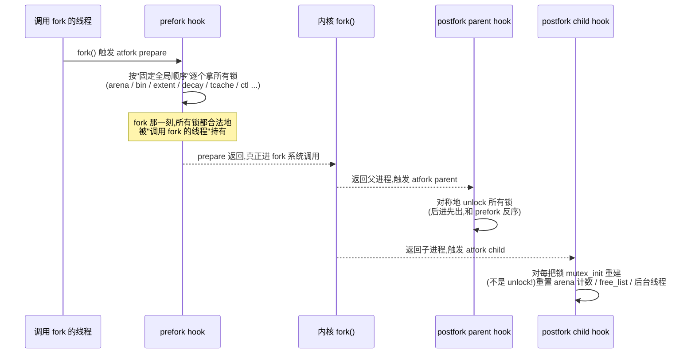

# 第十七章 · fork 与多线程

> 篇:P5 工程化
> 主线呼应:前 16 章我们花大力气搭起的整套三层快慢道——线程/CPU 本地缓存、中心自由链表、页堆——全都建立在"多线程能安全协作"的前提上:每个线程的 tcache 是它的私产,中心层靠一把把锁保证一致性。可 `fork()` 一刀切下来,这个前提塌了一半:`fork` 只复制**调用它的那一个线程**,其它线程在子进程里凭空消失——而它们当时可能正握着 arena、bin、extent 的锁。锁的主人没了,锁就永远挂在那儿,子进程下一次 `malloc` 一头撞上去,死锁。本章讲四套分配器怎么在 `fork` 前后用一组 hook(prefork 抢占全部锁、postfork 在父子进程里分别处理)把这个洞补上。这是工程化支线里最"反直觉"的一章——它的全部精妙,都源于"fork 复制了内存,却没复制持锁的线程"这一个朴素事实。

## 核心问题

**`fork()` 之后,子进程只保留了调用 fork 的那一个线程。其它线程在 fork 那一刻可能正持有分配器的锁(比如某个 arena 的 mutex),可它们没被复制过来——子进程里这些锁永远无人释放。分配器怎么才能让子进程第一次 `malloc` 不死锁?又怎么处理 fork 之后 per-CPU/tcache 的状态(子进程只有一个线程,但多核缓存还在按核分布)?**

读完本章你会明白:

1. **死锁的根**:fork 复制的是**内存**(包括锁对象的当前状态),却不复制**持有锁的线程**。锁停在"已加锁"状态,主人却消失了——子进程任何加锁操作都会永久阻塞。这是 POSIX 线程模型的一个根本陷阱,所有用锁的库都得自己处理。
2. **prefork 的职责**:在真正 `fork` 前,由 fork 准备 hook **抢先把分配器所有的锁都拿一遍**。这样 fork 那一刻,所有锁都被"调用 fork 的线程"合法持有,fork 之后子进程也合法继承(同一个线程在 fork 两侧拥有这些锁)。
3. **postfork 的两副面孔**:fork 返回父进程时,父进程的 hook **释放**这些锁(对称解锁);fork 返回子进程时,子进程的 hook **重建**这些锁——不是 unlock,而是 `mutex_init` 重新初始化。为什么不能 unlock?因为 NPTL 下 unlock 一个"被别的线程持有"的锁语义不安全(会破坏 owner/futex 内部状态),而 re-init 直接把它打回"干净未锁定"。
4. **child 侧的额外重置**:除了重建锁,子进程还要重置 arena 的线程计数(其它线程都没了)、清空后台线程、重挂当前线程的 tcache 描述符。ptmalloc 还会把非 main_arena 全部"逻辑归零"塞进 free_list。
5. **四套的真实差异(反直觉)**:jemalloc 自己 `pthread_atfork` 注册全套 handler、分阶段拿所有 arena 的 9 类锁;**tcmalloc 自己一个 atfork handler 都不写**,完全下沉到 Abseil 的 `SpinLock`(后者自带 atfork 注册,child 侧 reset);**mimalloc 连 osx 之外的 fork hook 都没有**(赌"fork 后单线程语义 + COW 继承"够用);ptmalloc 现代 glibc(≥2.24)**不再走 `pthread_atfork`**,而是把 `__malloc_fork_lock_parent` 硬编码进 `__libc_fork` 内部,绕开 atfork 注册顺序坑。

> **如果一读觉得太难**:先只记住三件事——① fork 把"持锁的线程"留在父进程,却把"锁已加锁"的状态复制给了子进程,所以子进程的 malloc 会死锁;② 解法是 fork 前由 prefork hook 把所有锁先拿到手、fork 后子进程的 hook 把锁**重建**(不是 unlock);③ 四套里只有 jemalloc 和 ptmalloc 自己写 handler,tcmalloc 把活儿外包给 Abseil 的 SpinLock,mimalloc 干脆不处理。本章服务"工程化支线"——它让前面 16 章的成果在"还要能 fork"的程序里仍然可用。

---

## 17.1 一句话点破

> **fork 的麻烦,不在"复制内存",而在"复制了锁的状态却没复制持锁的线程"。子进程继承了一把"被别的线程持有的锁",它就再也等不到这把锁被释放。分配器的解法是一个机械的"全收全放":fork 前(prefork)把所有锁按固定顺序收进自己手里,fork 后父进程一侧原样放回去(parent unlock),子进程一侧把锁整个推倒重建(child re-init),顺带把那些"原本属于别的线程"的本地状态(arena 计数、后台线程、free_list)重置成"现在只剩我一个线程"该有的样子。**

这是结论,不是理由。本章倒过来拆:先看 fork 为什么必然死锁,再看"全收全放"的机械机制,最后看四套各自怎么落地。

---

## 17.2 fork 的死锁陷阱:复制了锁,没复制持锁的人

要理解 fork 为什么对分配器是个坑,得先看清 POSIX fork 的两个本性。

**本性一:fork 只复制一个线程。** `fork()` 是调用它的那个线程的"独角戏"。子进程被创建出来时,地址空间是父进程的一份 copy-on-write 副本,**但只有调用 fork 的那一个线程被复制**——其它所有线程,无论当时在干什么,在子进程里统统不存在。POSIX 原文(`man fork`):"The child process ... contains a replica of the calling thread ...; other threads are not present."

**本性二:fork 复制的是内存,包括锁对象的当前字节。** 锁(`pthread_mutex_t`、`SpinLock`、`absl::base_internal::SpinLock`……)在内存里就是一段字段:`locked` 标志、`owner` 线程 id、等待队列指针、futex word 之类。fork 把父进程的整片地址空间 COW 复制给子进程,锁对象的这些字节也原样被复制。

把这两条放一起,灾难立刻显形:

```text
父进程 fork 那一刻的快照:
  线程 T1(将调 fork):  正在 user code 里跑
  线程 T2:             正在 malloc,持有了 arena[3].bin[7].mutex   ← 锁处于"locked"
  线程 T3:             正在 free,  持有了 extent_decay.mtx         ← 锁处于"locked"
  线程 T4:             正在 consolidate,持有 main_arena.mutex      ← 锁处于"locked"
                         │
                         ▼  fork()  ←  只有 T1 被复制

子进程 fork 那一刻的快照:
  线程 T1:             继续跑(从 fork 返回处)
  arena[3].bin[7].mutex:  仍是 "locked"  ← 字节被 COW 复制了
  extent_decay.mtx:       仍是 "locked"  ← 字节被 COW 复制了
  main_arena.mutex:       仍是 "locked"  ← 字节被 COW 复制了
  T2/T3/T4:               不存在!        ← 线程没被复制

子进程第一次 malloc:
  → 要拿 arena[X].bin[Y].mutex
  → 不巧正是 T2 当时持有的那把 → 永远等不到释放 → 死锁
```

注意,这个陷阱**和锁的具体实现无关**。无论是 `pthread_mutex_t`(NPTL)、Abseil 的 `SpinLock`、还是手写的原子自旋,只要锁在 fork 那一刻处于"locked"状态,且持锁线程没被复制,子进程就会死等。POSIX 把这个问题留给应用:`man pthread_atfork` 明确指出,"the child process may only execute async-signal-safe operations until such time as it calls `execve` or one of the `pthread_atfork` handlers has restored consistency"。

> **不这样会怎样**:不做任何处理的分配器,在"多线程服务里 fork 一个子进程去执行别的程序"这种常见模式(很多服务器用 fork+exec 跑子进程、各种 watchdog、crash dumper 在 fork 出的子进程里抓栈)下,**子进程第一次 malloc 就挂死**。这是一个真实的生产事故模式:服务跑得好好的,fork 一个 helper 子进程,子进程还没 exec 就死在第一次打日志(`malloc` 一段字符串)上,父进程一直等不到子进程退出。排查极难,因为挂的是子进程、而根因在父进程 fork 那一刻被其它线程持有的锁。

所以,任何"在多线程下能被 fork"的库,都得回答同一个问题:**怎么保证 fork 之后子进程的第一次操作不撞上"被消失线程持有的锁"?** 答案是 **prefork + postfork** 这一组 hook。

---

## 17.3 解法的骨架:prefork 抢锁,postfork 重建

所有"正确处理 fork"的分配器,都遵循同一个机械骨架。先把这个骨架立清楚,再去看四套的实现细节。



这个骨架的精髓在三处,每一处都对应一个"为什么不这么写就崩"的技巧。

**精髓一:prefork 必须按固定全局顺序拿锁。** 分配器的锁不是一把,是一堆:jemalloc 一个进程可能有几十个 arena,每个 arena 又有 N 个 bin 的锁、几把 extent/decay 锁、一把 large_mtx,加上全局的 ctl_mtx、tcaches_mtx、background_thread_lock。这么多锁,如果两个线程以相反顺序拿锁,就死锁(经典 AB-BA)。所以分配器内部本来就有一套**锁序约定**(jemalloc 用 `witness` 子系统在 debug 下强制检查)。prefork 必须严格按这套约定拿,否则 prefork 自己就死锁。这就解释了为什么 jemalloc 的 `jemalloc_prefork` 要把 arena 的锁**分 9 个阶段**(stage 0~8)拿——每个阶段对应锁序里的一个 rank,跨所有 arena 同 rank 的锁全部先拿完,再进下一 rank。

**精髓二:parent hook 是对称 unlock,child hook 不是 unlock 而是 init。** fork 返回父进程时,锁的合法主人(调用 fork 的线程)还在,直接对称解锁即可。但 fork 返回子进程时,**不能 unlock**。为什么?NPTL 的 `pthread_mutex_unlock` 假设"调用 unlock 的线程就是持锁线程"(尤其 ERRORCHECK 型 mutex 会校验 owner;连普通 mutex 内部也可能依赖 owner 字段维护公平性)。fork 后子进程调用 unlock 的线程是 T1,可这把锁在 fork 前"是 T2 持有的"(字节里还记着 owner=T2),unlock 会破坏 futex/owner 内部状态、甚至触发未定义行为。安全做法是 `pthread_mutex_init`——把整把锁的字节重置成"干净的、未锁定的初值",对 owner/waiters 字段一律抹掉,就像刚 new 出来一样。glibc 的注释直接挑明了这个取舍:

> "In NPTL, unlocking a mutex in the child process after a fork() is currently unsafe, whereas re-initializing it is safe and does not leak resources."

**精髓三:child hook 除了重建锁,还要重置"和线程数相关的状态"。** fork 之后子进程只剩一个线程,但分配器的不少全局状态是"按多线程"维护的:arena 的 `nthreads` 计数(现在应该都是 0,只有当前线程 1)、后台 background_thread 的状态(那些后台线程也没了)、ptmalloc 的 `free_list`(其它线程绑定的 arena 现在都没主了)。child hook 要把这些状态都"缩"回单线程该有的样子,否则分配器后续的统计、回收决策会基于错误前提。

```text
锁在 fork 前后两个进程里的状态(以一把 bin_mutex 为例):

fork 前(父进程,多线程):
  bin_mutex.locked   = 1
  bin_mutex.owner    = T2          ← 持锁线程 T2 还活着
  bin_mutex.waiters  = [T5, T7]    ← 等待队列

       │ fork()
       ▼

fork 后 父进程(parent hook: 对称 unlock):
  T1 调 unlock(bin_mutex)
  bin_mutex.locked   = 0           ← T2 在 prefork 时已被 T1 "接管",T1 合法释放
  T2/T5/T7 继续跑(它们没死,只是 fork 那一刻暂停)

fork 后 子进程(child hook: mutex_init 重建):
  T1 调 mutex_init(&bin_mutex)
  bin_mutex.locked   = 0           ← 直接抹成初值
  bin_mutex.owner    = 0           ← owner/waiters 一并抹掉
  bin_mutex.waiters  = []          ← (T5/T7 在子进程里不存在,不能保留它们的引用)

  ⚠️ 若 child 用 unlock 而非 init:
     unlock 看到 owner=T2 ≠ T1 → ERRORCHECK 型 mutex 报错
     或更糟:普通 mutex 改 futex word 时和"幽灵 T2 的内存"打架 → UB
```

> **钉死这件事**:fork 的"全收全放"骨架由三件事组成——① prefork 按固定锁序抢下全部锁(让 fork 那一刻所有锁合法归 fork 线程所有);② parent hook 对称 unlock(父进程持锁线程还在,合法释放);③ child hook 用 `mutex_init` 重建每把锁(子进程持锁线程没了,unlock 不安全,只能推倒重来),并重置"按多线程维护"的全局状态(arena 计数、free_list、后台线程)。任何一处省了,都会在 fork+多线程的组合下翻车。

---

## 17.4 jemalloc:自己注册 `pthread_atfork`,分 9 阶段拿锁

四套里 jemalloc 的 fork 处理最"教科书":它**自己**注册 `pthread_atfork`,handler 实现**完整**(prefork 分阶段拿锁、parent 对称解锁、child 重建+重置)。它是理解"全收全放"骨架最好的样本。

### 17.4.1 注册点:`pthread_atfork` 在初始化时挂上

jemalloc 在 `malloc_init` 的后期(具体在 `jemalloc_init.c:423-436`)注册这三个 handler:

```c
// jemalloc_init.c:423-436
#if (defined(JEMALLOC_HAVE_PTHREAD_ATFORK) && !defined(JEMALLOC_MUTEX_INIT_CB) \
    && !defined(JEMALLOC_ZONE) && !defined(_WIN32)                             \
    && !defined(__native_client__))
	/* LinuxThreads' pthread_atfork() allocates. */
	if (pthread_atfork(jemalloc_prefork, jemalloc_postfork_parent,
	        jemalloc_postfork_child)
	    != 0) {
		malloc_write("<jemalloc>: Error in pthread_atfork()\n");
		if (opt_abort) {
			abort();
		}
		return true;
	}
#endif
```

几个细节值得拆。第一,**条件编译**把这行 `pthread_atfork` 限制在"标准 Linux/Unix pthreads"平台。FreeBSD 用 `JEMALLOC_MUTEX_INIT_CB` 走另一条路(平台 threading 库直接调 `_malloc_prefork`/`_malloc_postfork`,不经 `pthread_atfork`);macOS zone(`JEMALLOC_ZONE`)、Windows、native_client 都不走这条路。第二,那行注释 `/* LinuxThreads' pthread_atfork() allocates. */` 是个隐藏的陷阱——**老式 LinuxThreads 实现的 `pthread_atfork` 本身会调 `malloc`**(在它内部建数据结构),这会在 jemalloc 自己还没初始化完时重入。所以这行注册被放在 `malloc_init` 的**很靠后**的位置(确保 jemalloc 已经完全就绪,重入进来也能应付)。第三,注册失败(`pthread_atfork` 返回非 0)jemalloc 会 `abort`——fork handler 注册不上,等于这个进程将来 fork 必死,不如启动期就 fail fast。

### 17.4.2 `jemalloc_prefork`:按固定锁序抢所有锁

prefork 的实现就在 `src/jemalloc_fork.c:34-114`(摘录关键部分):

```c
// src/jemalloc_fork.c:34-114(节选)
void
jemalloc_prefork(void) {
	tsd_t   *tsd;
	unsigned i, j, narenas;
	arena_t *arena;

	assert(malloc_initialized());
	tsd = tsd_fetch();
	narenas = narenas_total_get();

	witness_prefork(tsd_witness_tsdp_get(tsd));
	/* Acquire all mutexes in a safe order. */
	ctl_prefork(tsd_tsdn(tsd));
	tcache_prefork(tsd_tsdn(tsd));
	arenas_management_prefork(tsd_tsdn(tsd));
	if (have_background_thread) {
		background_thread_prefork0(tsd_tsdn(tsd));
	}
	prof_prefork0(tsd_tsdn(tsd));
	if (have_background_thread) {
		background_thread_prefork1(tsd_tsdn(tsd));
	}
	/* Break arena prefork into stages to preserve lock order. */
	for (i = 0; i < 9; i++) {
		for (j = 0; j < narenas; j++) {
			if ((arena = arena_get(tsd_tsdn(tsd), j, false))
			    != NULL) {
				switch (i) {
				case 0: arena_prefork0(tsd_tsdn(tsd), arena); break;
				case 1: arena_prefork1(tsd_tsdn(tsd), arena); break;
				...
				case 8: arena_prefork8(tsd_tsdn(tsd), arena); break;
				default: not_reached();
				}
			}
		}
	}
	prof_prefork1(tsd_tsdn(tsd));
	stats_prefork(tsd_tsdn(tsd));
}
```

这段是"按固定锁序抢所有锁"的字面落地。顺序是:`witness → ctl → tcache → arenas_management → background_thread(prefork0 + prefork1,拆两段) → prof(prefork0) → **每个 arena 的 9 个阶段** → prof(prefork1) → stats`。

最妙的是 **arena 那个双层循环**。外层 `for (i = 0; i < 9; i++)` 是"阶段维度",内层 `for (j = 0; j < narenas; j++)` 是"arena 维度"。这个顺序是反直觉的——直觉上你会想"先把 arena 0 的所有锁拿完,再拿 arena 1 的",但 jemalloc 偏不:**它先把所有 arena 的 stage 0 锁全拿了,再回头拿所有 arena 的 stage 1,以此类推**。为什么?因为锁序是按"锁的种类(rank)",不是按"哪个 arena"组织的。`stage 0` 是 pa_shard 的第一组锁(锁序 rank 低),`stage 8` 是每个 bin 的 bin_mtx(rank 高)。如果按 arena 顺序拿,就会出现"arena 0 的 bin_mtx 先于 arena 1 的 pa_shard 锁被拿到"的逆序,违反 witness 约定的全局锁序。所以必须**外层走 rank、内层走 arena**,保证"所有 rank 低的锁在所有 rank 高的锁之前"。

每个 stage 对应哪把锁,在 `src/arena.c:1925-1973` 里(`arena_prefork0`~`arena_prefork8`)。简化对照:

| stage | 函数 | 拿的锁 |
| ---- | ---- | ---- |
| 0 | `pa_shard_prefork0` | pa_shard 第一组(extent/decay 的子锁) |
| 1 | `&arena->cache_bin_array_descriptor_ql_mtx` | tcache 描述符队列锁(仅 `config_stats`) |
| 2~5 | `pa_shard_prefork2..5` | pa_shard 第二到五组(extent/decay 大锁) |
| 6 | `base_prefork` | base 分配器锁 |
| 7 | `&arena->large_mtx` | 大块分配锁 |
| 8 | 遍历 `bin_prefork` | 每个 bin 的 `bin_mtx` |

注意顺序和直觉的差别:**extent/decay 大锁(stage 0~5)反而先于 bin 锁(stage 8)被拿**——因为 bin 的 rank 高于 pa_shard。这是一个常见误区(很多人写博客会写成"先 bins 再 extent"),看源码就清楚了。

> **技巧点**:`jemalloc_prefork` 一开头 `tsd = tsd_fetch()`——拿 tsd。注意 prefork 跑在 fork 之前、父进程里,这时候 tsd 还是好好的。`tsd_fetch` 本身是 fast path 一次原子读(详见第 16 章)。这里不能不拿 tsd,因为后面所有 `*_prefork` 都要传 `tsd_tsdn(tsd)`(只读 tsd 视图)进去,内部要用它做 witness 校验、找 arena。这是"fork handler 也要走分配器正常接口"的体现。

### 17.4.3 `jemalloc_postfork_parent`:对称解锁

parent 这一支简单——对称地把 prefork 拿的锁按相反顺序放回去(`src/jemalloc_fork.c:116-157`):

```c
// src/jemalloc_fork.c:116-157(节选)
void
jemalloc_postfork_parent(void) {
	tsd_t   *tsd;
	unsigned i, narenas;

	assert(malloc_initialized());
	tsd = tsd_fetch();

	witness_postfork_parent(tsd_witness_tsdp_get(tsd));
	/* Release all mutexes, now that fork() has completed. */
	stats_postfork_parent(tsd_tsdn(tsd));
	for (i = 0, narenas = narenas_total_get(); i < narenas; i++) {
		arena_t *arena;
		if ((arena = arena_get(tsd_tsdn(tsd), i, false)) != NULL) {
			arena_postfork_parent(tsd_tsdn(tsd), arena);
		}
	}
	prof_postfork_parent(tsd_tsdn(tsd));
	if (have_background_thread) {
		background_thread_postfork_parent(tsd_tsdn(tsd));
	}
	arenas_management_postfork_parent(tsd_tsdn(tsd));
	tcache_postfork_parent(tsd_tsdn(tsd));
	ctl_postfork_parent(tsd_tsdn(tsd));
}
```

顺序和 prefork 大致**相反**(后进先出):`stats → arena → prof → background_thread → arenas_management → tcache → ctl`。父进程里的所有 `*_postfork_parent` 在 mutex 层都是同一个动作——`malloc_mutex_postfork_parent`,它就是 `malloc_mutex_unlock`(见 17.4.5)。

### 17.4.4 `jemalloc_postfork_child`:重建锁 + 重置状态

child 这一支才是"反直觉技巧"的重头戏(`src/jemalloc_fork.c:159-188`):

```c
// src/jemalloc_fork.c:159-188
void
jemalloc_postfork_child(void) {
	tsd_t   *tsd;
	unsigned i, narenas;

	assert(malloc_initialized());
	tsd = tsd_fetch();

	witness_postfork_child(tsd_witness_tsdp_get(tsd));
	/* Release all mutexes, now that fork() has completed. */
	stats_postfork_child(tsd_tsdn(tsd));
	for (i = 0, narenas = narenas_total_get(); i < narenas; i++) {
		arena_t *arena;
		if ((arena = arena_get(tsd_tsdn(tsd), i, false)) != NULL) {
			cache_bin_array_descriptor_t *desc =
			    tcache_postfork_arena_descriptor(
			        tsd_tsdn(tsd), arena);
			arena_postfork_child(tsd_tsdn(tsd), arena, desc);
		}
	}
	prof_postfork_child(tsd_tsdn(tsd));
	if (have_background_thread) {
		background_thread_postfork_child(tsd_tsdn(tsd));
	}
	arenas_management_postfork_child(tsd_tsdn(tsd));
	tcache_postfork_child(tsd_tsdn(tsd));
	ctl_postfork_child(tsd_tsdn(tsd));
}
```

表面看和 parent 几乎一模一样,只是函数名后缀是 `_child`。差别在两个地方。

**差别一:每把锁走的是 `malloc_mutex_postfork_child`,不是 unlock。** 在 mutex 层(`src/mutex.c:191-216`):

```c
// src/mutex.c:191-216
void
malloc_mutex_prefork(tsdn_t *tsdn, malloc_mutex_t *mutex) {
	malloc_mutex_lock(tsdn, mutex);
}

void
malloc_mutex_postfork_parent(tsdn_t *tsdn, malloc_mutex_t *mutex) {
	malloc_mutex_unlock(tsdn, mutex);
}

void
malloc_mutex_postfork_child(tsdn_t *tsdn, malloc_mutex_t *mutex) {
#ifdef JEMALLOC_MUTEX_INIT_CB
	malloc_mutex_unlock(tsdn, mutex);
#else
	if (malloc_mutex_init(mutex, mutex->witness.name, mutex->witness.rank,
	        mutex->lock_order)) {
		malloc_printf(
		    "<jemalloc>: Error re-initializing mutex in child\n");
		if (opt_abort) {
			abort();
		}
	}
#endif
}
```

这就是 17.3 节"精髓二"的字面实现:`malloc_mutex_postfork_parent` 是 `unlock`,而 `malloc_mutex_postfork_child` 是 **`malloc_mutex_init` 重新初始化**(FreeBSD 的 `JEMALLOC_MUTEX_INIT_CB` 路径除外,因为那边底层锁是 calloc-backed,语义不同)。重建失败 jemalloc 会 `malloc_printf` 报错,`opt_abort` 开着就 `abort()`——这是个不可恢复的硬错误(子进程拿着坏锁必死)。`malloc_mutex_init` 内部会按平台重建底层锁:Linux 是 `pthread_mutexattr_settype` + `pthread_mutex_init`,Windows 是 SRWLock/CriticalSection 重建,macOS 是 `os_unfair_lock` 重置。owner、waiters、futex word 字节一律被新初值覆盖,和"刚 new 出来"完全一样。

**差别二:`arena_postfork_child` 会重置"按多线程维护"的状态。** 看 `src/arena.c:1991-2015`(简化):

```c
// src/arena.c:1991-2015(节选)
void
arena_postfork_child(tsdn_t *tsdn, arena_t *arena,
    cache_bin_array_descriptor_t *surviving_desc) {
	atomic_store_u(&arena->nthreads[0], 0, ATOMIC_RELAXED);  // 清零"分配线程"计数
	atomic_store_u(&arena->nthreads[1], 0, ATOMIC_RELAXED);  // 清零"空闲线程"计数
	if (tsd_arena_get(tsdn_tsd(tsdn)) == arena) {
		arena_nthreads_inc(arena, false);                    // 只把自己加回去
	}
	if (tsd_iarena_get(tsdn_tsd(tsdn)) == arena) {
		arena_nthreads_inc(arena, true);
	}
	...
	for (unsigned i = 0; i < nbins_total; i++) {
		bin_postfork_child(tsdn, &arena->all_bins[i]);       // 重建每个 bin 的锁
	}
	malloc_mutex_postfork_child(tsdn, &arena->large_mtx);
	base_postfork_child(tsdn, arena->base);
	pa_shard_postfork_child(tsdn, &arena->pa_shard);
}
```

`atomic_store_u(&arena->nthreads[0], 0, ...)` 把 arena 的线程计数清零——因为 fork 之后只有当前线程一个,其它"曾经登记在这个 arena"的线程都没了。然后只把自己(如果当前 tsd 绑定的就是这个 arena)加回去。这就是 `jemalloc_fork.c` 顶部注释说的"resets per-arena state the parent handler does not touch (nthreads, descriptor queues)"。

**background thread 的 child 处理更狠**,不仅要重建锁,还要重建 `pthread_cond_t`(`src/background_thread.c:713-760`):

```c
// src/background_thread.c:745-760(节选)
void
background_thread_postfork_child(tsdn_t *tsdn) {
	for (unsigned i = 0; i < max_background_threads; i++) {
		malloc_mutex_postfork_child(tsdn, &background_thread_info[i].mtx);
	}
	malloc_mutex_postfork_child(tsdn, &background_thread_lock);
	if (!background_thread_enabled_at_fork) {
		return;
	}
	/* Clear background_thread state (reset to disabled for child). */
	malloc_mutex_lock(tsdn, &background_thread_lock);
	n_background_threads = 0;
	background_thread_enabled_set(tsdn, false);
	for (unsigned i = 0; i < max_background_threads; i++) {
		background_thread_info_t *info = &background_thread_info[i];
		malloc_mutex_lock(tsdn, &info->mtx);
		info->state = background_thread_stopped;
		int ret = pthread_cond_init(&info->cond, NULL);     // ← 重建 cond!
		assert(ret == 0);
		background_thread_info_init(tsdn, info);
		malloc_mutex_unlock(tsdn, &info->mtx);
	}
	malloc_mutex_unlock(tsdn, &background_thread_lock);
}
```

注意 `pthread_cond_init(&info->cond, NULL)`——条件变量也得重建,道理和 mutex 一样:`pthread_cond_t` 内部也有 waiters 队列、可能被某个已消失的线程"占用",必须推倒重来。这是 fork handler 里**除 mutex 之外第二个"重建同步原语"的动作**。同时把 `n_background_threads = 0`、关闭后台线程开关——那些后台线程在子进程里都不存在了,留着它们的元数据只会让分配器的统计和回收决策基于错误前提。

> **钉死这件事**:jemalloc 的 fork 处理是"全收全放"骨架最完整的实现。prefork 分 9 阶段按 rank 顺序拿所有 arena 的所有锁(外层 rank、内层 arena);parent 对称 unlock;child 不 unlock 而是 `malloc_mutex_init` 重建每把锁,并重置 `nthreads`、关掉 background_thread、`pthread_cond_init` 重建 cond、重挂当前线程的 tcache 描述符。任何一处偷懒(prefork 漏拿一把锁、child 用 unlock 而非 init、忘了重置 nthreads),子进程第一次 malloc 都可能死锁或基于错误的线程数做决策。

---

## 17.5 tcmalloc:自己不写 handler,把活儿下沉给 Abseil 的 SpinLock

到这里你大概预期"tcmalloc 也该有一个 `pthread_atfork` 注册点"。**事实是,没有。** tcmalloc 仓库(commit `7723f74`)里全树 grep `fork`、`atfork`、`PreFork`、`PostFork`、`ForkHandler`——**零命中**。tcmalloc 不写自己的 fork handler。

这是一个真实的反直觉点,也是写作者最容易翻车的地方(凭印象写"tcmalloc 在 `tcmalloc.cc` 某处注册了 atfork"——错)。tcmalloc 把 fork 的锁处理**完全外包**给了它依赖的 Abseil `SpinLock`。

### 17.5.1 tcmalloc 的锁全是 Abseil SpinLock

tcmalloc 所有的关键全局锁,清一色是 `absl::base_internal::SpinLock`:

| 锁 | 文件:行号 | 用途 |
| ---- | ---- | ---- |
| `pageheap_lock` | [static_vars.cc:71-72](../tcmalloc/tcmalloc/static_vars.cc#L71-L72) | 全局页堆锁(slow path) |
| `CpuCache::ResizeInfo::lock` | [cpu_cache.h:603-606](../tcmalloc/tcmalloc/cpu_cache.h#L603-L606) | per-CPU slab 的 resize 锁(锁序在 pageheap_lock 之前) |
| `central_freelist::lock_` | [central_freelist.h:271](../tcmalloc/tcmalloc/central_freelist.h#L271) | 每个 central freelist 一把 |
| `Arena::arena_lock_` | [arena.h:90](../tcmalloc/tcmalloc/arena.h#L90) | 元数据分配器锁 |
| `allocation_sample::lock_` | [allocation_sample.h:86](../tcmalloc/tcmalloc/allocation_sample.h#L86) | 采样统计锁 |

`pageheap_lock` 的定义([static_vars.cc:71-72](../tcmalloc/tcmalloc/static_vars.cc#L71-L72)):

```cpp
// static_vars.cc:71-72
ABSL_CONST_INIT absl::base_internal::SpinLock pageheap_lock(
    absl::base_internal::SCHEDULE_KERNEL_ONLY);
```

RAII holder 在 `common.h`([common.h:300-317](../tcmalloc/tcmalloc/common.h#L300-L317)),注释挑明了 pageheap_lock 和 `CpuCache::ResizeInfo::lock` 的锁序:

```cpp
// common.h:300-317(节选)
// Linker initialized, so this lock can be accessed at any time.
// Note: `CpuCache::ResizeInfo::lock` must be taken before the `pageheap_lock`
// if both are going to be held simultaneously.
extern absl::base_internal::SpinLock pageheap_lock;

class ABSL_SCOPED_LOCKABLE PageHeapSpinLockHolder {
 public:
  PageHeapSpinLockHolder() ABSL_EXCLUSIVE_LOCK_FUNCTION(pageheap_lock) {
    ...
  }
  ~PageHeapSpinLockHolder() ABSL_UNLOCK_FUNCTION() = default;
 private:
  AllocationGuardSpinLockHolder lock_{pageheap_lock};
};
```

### 17.5.2 Abseil SpinLock 自己挂 atfork

为什么 tcmalloc 自己不写 handler 就够?因为 Abseil 的 `SpinLock` 在它自己的实现里(`absl/base/internal/spinlock.cc`,本仓库未 vendored Abseil,通过 bazel 引入 `20260107.0`)**注册了 `pthread_atfork`**:prepare 阶段记录所有 SpinLock 的状态,parent 阶段恢复,**child 阶段把所有 SpinLock 强制重置成"unlocked"**。机制和 jemalloc 的 child handler 一致——都是"重建"而非"unlock"。

这就是 tcmalloc 的 fork 策略:**所有锁都是 Abseil SpinLock,Abseil SpinLock 自带 atfork 注册,fork 时由 Abseil 负责把所有 SpinLock 在 child 侧 reset 成干净状态。tcmalloc 不需要写一行 fork 代码**。这把"维护锁的 fork 一致性"这件事,完全变成了锁实现自己的责任——只要我用的是一种"fork-aware"的锁,fork 就自动安全。

这种"职责下沉"是 tcmalloc 整体工程哲学的一个缩影。第 16 章我们看到 tcmalloc 把初始化复杂度压到最低(`ABSL_CONST_INIT` 让全局状态加载即就绪,几乎不需要状态机);这里又看到它把 fork 处理下沉给 Abseil。tcmalloc 的代码量比 jemalloc 小很多,很大一部分原因就是它**充分利用了 Abseil 这个基础设施层**——SpinLock 负责锁的 fork 一致性,`base_internal::LowLevelCallOnce` 负责 once 初始化,`absl::base_internal::CycleClock` 负责时钟。tcmalloc 自己只关心"分配"这件事。

### 17.5.3 per-CPU cache 在 fork 后:不 reset,靠"单线程语义"

这里有一个值得专门点出的设计取舍。tcmalloc 新版的灵魂是 per-CPU cache——每个 CPU 核一份 slab。fork 之后子进程只有一个线程,但**这份 per-CPU slab 是按"核"组织的,还按 N 个核分布在子进程里**。看起来"应该 reset",但 tcmalloc **不主动 reset**。为什么安全?

因为 fork 之后子进程**只有一个线程**,这个线程在任意时刻只能跑在一个 CPU 核上。它访问的 per-CPU slab 永远只是"当前 CPU 的那一份",其它 CPU 的 slab 数据虽然还在内存里(COW 继承下来),但**没有线程会去碰它们**——它们就是些静态字节,等着被首次写时 COW 一份独立副本。子进程的 malloc 走 fast path,只 touch 当前 CPU 的 slab;一旦它被调度到别的核,那个核的 slab 也是合法的(COW 来的父进程数据,只是没有别的线程竞争)。Abseil SpinLock 在 child 侧被 reset 成 unlocked,所以即便 fast path 偶尔走到 slow path(resize、refill 中心链表),拿的锁也都是干净的,不会死锁。

换句话说,tcmalloc 靠的是**"fork 后单线程 + 锁干净"的语义保证**,而不是**显式 reset per-CPU 状态**。这是"懒"的工程取舍——能不 reset 就不 reset,只要语义 sound。

tcmalloc 里有一个语义上接近"清空 slab"的函数 `TcmallocSlab::Drain`(`internal/percpu_tcmalloc.h:277-283`),但它**不用于 fork**,而是给 `ResizeSlabs` 这种 resize 路径用的:

```cpp
// internal/percpu_tcmalloc.h:277-283
// Remove all items (of all classes) from <cpu>'s slab; reset capacity for all
// classes to zero.  Then, for each sizeclass, invoke
// DrainHandler(size_class, <items from slab>, <previous slab capacity>);
//
// It is invalid to concurrently execute Drain() for the same CPU; calling
// Push/Pop/Grow/Shrink concurrently (even on the same CPU) is safe.
void Drain(int cpu, DrainHandler drain_handler);
```

它的存在说明 tcmalloc **有能力**清空 per-CPU slab,只是 fork 时不调它。这是个"可以但不必"的选择。

> **钉死这件事**:tcmalloc 的 fork 策略是"职责下沉"——它不写任何 fork handler,因为它的所有锁都是 Abseil `SpinLock`,而 Abseil SpinLock 自带 `pthread_atfork` 注册,负责把所有 SpinLock 在 child 侧 reset 成 unlocked。tcmalloc 自己只关心"fork 之后单线程 + 锁干净"这个前提成立,per-CPU cache 状态不显式 reset。这种"懒"哲学和它第 16 章的初始化设计一脉相承——能不写代码就不写,让基础设施层兜底。代价是:fork 处理的细节不在 tcmalloc 自己的源码里,读者光看 tcmalloc 是看不出 fork 怎么处理的,得去翻 Abseil。

---

## 17.6 ptmalloc(baseline):不再走 atfork,改硬编码进 `__libc_fork`

ptmalloc(glibc)的 fork 处理,是四套里"演进最有故事"的一套。它经历了一次**架构级反转**:从"通过 `pthread_atfork` 注册"改成"硬编码进 `__libc_fork` 内部直接调用"。理解这次反转,能帮你彻底看清 `pthread_atfork` 这个机制本身的坑。

### 17.6.1 现代 glibc(≥2.24):直接调,不注册

现代 glibc 的 malloc fork handler,函数名是 `__malloc_fork_lock_parent`(prepare)、`__malloc_fork_unlock_parent`(parent)、`__malloc_fork_unlock_child`(child),定义在 `malloc/arena.c`。它们的声明在 `malloc/malloc-internal.h`,实现是这样(`malloc/arena.c`,glibc-2.39 行号约 167~231,在线 [arena.c](https://codebrowser.dev/glibc/glibc/malloc/arena.c.html)):

```c
// malloc/arena.c(简化,在线 glibc main)
void
__malloc_fork_lock_parent (void)
{
  if (!__malloc_initialized)
    return;
  /* We do not acquire free_list_lock here because we completely
     reconstruct free_list in __malloc_fork_unlock_child.  */
  __libc_lock_lock (list_lock);
  for (mstate ar_ptr = &main_arena;; ) {
    __libc_lock_lock (ar_ptr->mutex);
    ar_ptr = ar_ptr->next;
    if (ar_ptr == &main_arena)
      break;
  }
}

void
__malloc_fork_unlock_parent (void)
{
  if (!__malloc_initialized)
    return;
  for (mstate ar_ptr = &main_arena;; ) {
    __libc_lock_unlock (ar_ptr->mutex);
    ar_ptr = ar_ptr->next;
    if (ar_ptr == &main_arena)
      break;
  }
  __libc_lock_unlock (list_lock);
}

void
__malloc_fork_unlock_child (void)
{
  if (!__malloc_initialized)
    return;
  /* Push all arenas to the free list, except thread_arena, which is
     attached to the current thread.  */
  __libc_lock_init (free_list_lock);
  if (thread_arena != NULL)
    thread_arena->attached_threads = 1;
  free_list = NULL;
  for (mstate ar_ptr = &main_arena;; ) {
    __libc_lock_init (ar_ptr->mutex);                 // ← child 重建,不是 unlock
    if (ar_ptr != thread_arena) {
      ar_ptr->attached_threads = 0;
      ar_ptr->next_free = free_list;
      free_list = ar_ptr;
    }
    ar_ptr = ar_ptr->next;
    if (ar_ptr == &main_arena)
      break;
  }
  __libc_lock_init (list_lock);
}
```

和 jemalloc 的骨架**完全一致**:`__malloc_fork_lock_parent` 拿 `list_lock` 然后沿 arena 链表逐个 `__libc_lock_lock`;`__malloc_fork_unlock_parent` 对称 unlock;`__malloc_fork_unlock_child` **用 `__libc_lock_init` 重建每把锁**(不是 unlock!)。注意 child 里 `__libc_lock_init` 出现三次:每个 arena 的 mutex、`free_list_lock`、最后的 `list_lock`。这正是 17.3 节"精髓二"在 ptmalloc 里的体现。

child 的额外动作是把所有非 `thread_arena`(调用 fork 的线程绑定的那个 arena)的 `attached_threads` 清零,头插进 `free_list`——arena 的内存不释放(不 `munmap`),只是逻辑上"无人认领",等下次有新线程来 reuse。这是 ptmalloc 特有的:它没有 jemalloc 那种"arena 的 nthreads 计数 + 后台线程"的复杂度,只需要管 arena 链表和 free_list。

**关键问题:这些 handler 怎么被触发?** 现代 glibc **不通过 `pthread_atfork` 注册**,而是在 `sysdeps/nptl/fork.c` 的 `__libc_fork()` 里**直接调用**:

```c
// sysdeps/nptl/fork.c(__libc_fork,简化,基于 BZ#19431 commit)
  _IO_list_lock ();
  /* Acquire malloc locks.  This needs to come last because fork
     handlers may use malloc, and the libio list lock has an indirect
     malloc dependency as well.  */
  __malloc_fork_lock_parent ();
  ...
  pid = ARCH_FORK ();
  ...
  if (pid == 0) {
    /* child */
    ...
    __malloc_fork_unlock_child ();
    ...
  } else {
    /* parent */
    ...
    __malloc_fork_unlock_parent ();
    ...
  }
```

注释那句 "This needs to come last because fork handlers may use malloc" 直接点破为什么不再用 `pthread_atfork`——**为了让 malloc 的锁成为 fork 前最后拿的锁**。

### 17.6.2 旧版 glibc(≤2.23):走 `pthread_atfork`,结果死锁

为什么 glibc 要抛弃 `pthread_atfork`?因为 `pthread_atfork` 这个机制本身有个根本缺陷——**handler 的执行顺序无法保证**。POSIX 规定 atfork handler 按"注册的逆序"在 prepare 阶段调用,按"注册的顺序"在 parent/child 阶段调用。这意味着,**先注册的库的锁被最后 prepare、最先 parent/child 释放**。如果两个库各自注册了自己的锁,它们的锁序在 prepare 和 release 阶段是**反的**,这就埋下了 AB-BA 死锁的种子。

glibc 内部自己就踩了这个坑。Bug [BZ#19431](https://sourceware.org/bugzilla/show_bug.cgi?id=19431) 报告了一个真实死锁:在多线程程序里,`pthread_atfork` 注册的 malloc 锁和 libio 的 `_IO_LIST_ALL` 锁,在 fork 时因为顺序冲突死锁。具体场景:某个 fork handler 内部调了 `getdelim`(它要拿 libio list 锁),而 libio list 锁当时被另一个线程持有——那个线程又正在等 malloc 的 arena 锁。经典的 AB-BA。

修这个 bug 的 commit(2016,作者 Florian Weimer)的方案,就是**把 malloc 的 fork handler 从 `pthread_atfork` 注册表里摘掉,改成 `__libc_fork` 内部硬编码调用**,且**故意排在 `_IO_list_lock` 之后**——这样 malloc 锁是 fork 前最后拿的、最先放的,不会和 libio 锁形成环。这个改动在 glibc 2.24 进入。

旧版的注册代码(在 `ptmalloc_init` 末尾,commit diff 删的那行):

```c
// 旧版 glibc(≤2.23),已被删除
thread_atfork (ptmalloc_lock_all, ptmalloc_unlock_all, ptmalloc_unlock_all2);
```

`thread_atfork` 宏展开就是 `__register_atfork(prepare, parent, child, NULL)`。`ptmalloc_lock_all` / `ptmalloc_unlock_all` / `ptmalloc_unlock_all2` 是 `__malloc_fork_lock_parent` / `__malloc_fork_unlock_parent` / `__malloc_fork_unlock_child` 的旧名字,BZ#19431 的 commit 顺手把它们重命名成现在这个名字(并改成非 static、加 `internal_function attribute_hidden`)。

> **写作陷阱提醒**:很多老博客/教材还停在 ≤2.23 的叙述,写"ptmalloc 在 `ptmalloc_init` 里 `thread_atfork` 注册了 fork handler"。读者跑现代 glibc(2.24+)会发现 `ptmalloc_init` 里根本找不到这行,困惑半天。本章要讲清楚:**注册方式变了,但 handler 的逻辑(拿全部锁、parent unlock、child init)** 没变——只是触发方式从"通过 `pthread_atfork` 注册表"改成"`__libc_fork` 直接调用"。

### 17.6.3 tcache 在 fork 后:不碰,靠 COW 继承

这里有个特别值得点的细节。ptmalloc 的 `__malloc_fork_unlock_child` **完全不动 tcache**——不重置、不重新分配、不调 `tcache_init`。为什么安全?

因为 tcache 是 `__thread` 变量(`malloc/malloc.c` 里 `static __thread tcache_perthread_struct *tcache = NULL`)。fork 复制调用线程的整个 TLS 区域,所以子进程的 `tcache` 指针**值不变**,仍指向 fork 那一刻父进程的 tcache 结构。那块结构本身在 heap 上,heap 被 COW 继承,指针在子进程里**仍然有效**。子进程第一次 `malloc` 直接命中 tcache,用继承下来的 entries,直到首次写才 COW 一份独立副本。

这个设计很巧妙——**tcache 是纯 per-thread 的,没有跨线程可见性,所以 fork 后"只剩一个线程"这件事对 tcache 没有任何破坏性影响**。真正需要重置的是 arena 的锁和 free_list(因为锁可能被别的线程持有、arena 是跨线程共享的)。`__malloc_fork_unlock_child` 只动 arena 不动 tcache,是有道理的——**只重置"和别的线程相关"的状态,"纯当前线程私有"的状态直接 COW 继承**。这是"最小重置"原则:能不动就不动,动得越多越容易出错。

这个原则 jemalloc/tcmalloc 也都遵循——jemalloc 的 child handler 虽然重置了 arena 计数和 background thread,但**没动当前线程的 tcache bins 内容**,只重挂了描述符;mimalloc 干脆什么都不动(见下节)。

> **钉死这件事**:ptmalloc 的 fork 处理是"骨架不变、触发方式演进"。handler 逻辑(全收全放、parent unlock、child init)和 jemalloc 同构,但触发方式从老版的 `pthread_atfork` 注册改成现代 glibc 的 `__libc_fork` 内部直接调用——为的是绕开 `pthread_atfork` 的注册顺序坑(BZ#19431)。tcache 不重置,靠 TLS + COW 自然继承,这是"最小重置原则"的体现。

---

## 17.7 mimalloc:osx 之外不挂 hook,赌"单线程+COW"够用

四套里 mimalloc 的 fork 处理最"轻"——**轻到几乎没有**。这又是一个反直觉点。

全 mimalloc 仓库 grep `pthread_atfork`——**零命中**。mimalloc 不在任何平台注册 fork handler。唯一的 fork 痕迹在 osx 的 zone interpose 路径(`src/prim/osx/alloc-override-zone.c:307-315`):

```c
// src/prim/osx/alloc-override-zone.c:307-315
static void mi__malloc_fork_prepare(void) {
  // nothing
}
static void mi__malloc_fork_parent(void) {
  // nothing
}
static void mi__malloc_fork_child(void) {
  // nothing
}
```

三个 handler 全是**空函数体**(`// nothing`),通过 osx 的 interpose 机制(`alloc-override-zone.c:372-374`)替换掉系统的 `_malloc_fork_prepare/parent/child`。也就是说,osx 上 fork 时 mimalloc 的 fork handler 啥也不做:不拿锁、不释放锁、不重置 heap、不 abandon segment。**Unix/Windows/Wasi/Emscripten 平台连空 handler 都没有,fork 完全不在 mimalloc 的可控范围内。**

mimalloc 凭什么敢"什么都不做"?它赌的是两件事:

**赌注一:mimalloc 的锁极少且 fork 后单线程语义足够。** mimalloc 的设计哲学是"per-thread heap 各管各的,跨线程交互极少"(详见第 5 章 mimalloc 的 thread-local heap)。大部分 malloc/free 都在当前线程的 heap 内完成,无锁。少数需要全局锁的操作(arena 的 abandon list)用的是 `mi_lock_t`,这些锁在 fork 那一刻**如果被别的线程持有**,子进程确实会死锁——但 mimalloc 的赌注是"这种跨线程操作频率足够低,fork 撞上的概率小"。这是个"概率安全"而非"保证安全"的取舍。

**赌注二:COW 继承 + 单线程 = 状态自然一致。** fork 后子进程只有一个线程,它访问的 thread-local heap(`_mi_heap_default`)的指针值不变(和 ptmalloc 的 tcache 同理),指向的 heap 结构在 COW 内存里仍然有效。子进程的 fast path 直接命中,不需要碰任何"可能被别的线程持有的锁"。只要子进程不触发跨线程路径(给别的线程的 heap free、arena reclaim 等),它就不会撞上死锁。

这个取舍的代价是:**mimalloc 在"多线程程序 fork 后,子进程在 exec 之前做了跨线程 free 或触发了 arena reclaim"这种边缘场景,理论上可能死锁**。mimalloc 的 readme(`readme.md:400-402`)只在 huge/large page 的语境下提了一句 fork 的 COW 风险(写一个字节会复制整个 2MB/1GB 大页),**完全没有提 fork-safety / fork-lock**——这意味着 mimalloc 把 fork 的安全性当作"用户责任":要么 fork 之后立刻 `execve`,要么用户自己保证子进程不踩跨线程路径。

这是个明确的工程取舍。mimalloc 的目标是**轻、快、依赖少**(它的卖点之一是"能塞进各种宿主,从 Python 到游戏引擎),所以它选择"不引入 fork handler 复杂度"。代价是:对"多线程 + fork + 子进程不 exec 就 malloc"这种场景,mimalloc 的保证比 jemalloc/ptmalloc 弱。这是真实的差异,读者在选型时要注意。

> **钉死这件事**:mimalloc 的 fork 策略是四套里最"轻"的——osx 之外不挂任何 fork handler,osx 上的 handler 是空函数。它赌"per-thread heap 的跨线程路径极少 + fork 后单线程 + COW 继承"够用。代价是,对"多线程 fork 后子进程在 exec 前触发跨线程 free / arena reclaim"这种边缘场景,mimalloc 没有死锁保证。这是 mimalloc 为"轻"付出的代价,是真实选型权衡。

---

## 17.8 四套 fork 处理对照

把四套放一起对照,差异最清楚:

| 维度 | jemalloc | tcmalloc | ptmalloc(baseline) | mimalloc |
| ---- | ---- | ---- | ---- | ---- |
| **是否注册 `pthread_atfork`** | 是,自己注册([jemalloc_init.c:423-436](../jemalloc/src/jemalloc_init.c#L423-L436)) | **否**,下沉给 Abseil SpinLock | **现代 glibc 否**,硬编码进 `__libc_fork`;旧版是 | **否**(osx 空函数) |
| **prefork 拿锁的粒度** | 分 9 阶段按 rank 拿所有 arena 的所有锁([jemalloc_fork.c:34-114](../jemalloc/src/jemalloc_fork.c#L34-L114)) | 由 Abseil SpinLock 自带 prepare handler 处理 | 拿 `list_lock` + 遍历 arena 链逐个拿 mutex | 不拿(osx 空函数) |
| **parent hook** | 对称 unlock([jemalloc_fork.c:116-157](../jemalloc/src/jemalloc_fork.c#L116-L157)) | Abseil SpinLock 自带 parent handler | 对称 unlock(`__malloc_fork_unlock_parent`) | 不做(osx 空函数) |
| **child hook 怎么处理锁** | `malloc_mutex_init` **重建**每把锁([mutex.c:202-216](../jemalloc/src/mutex.c#L202-L216)) | Abseil SpinLock 自带 child handler(reset 成 unlocked) | `__libc_lock_init` **重建**每把锁(`__malloc_fork_unlock_child`) | 不做(osx 空函数) |
| **child 额外重置** | 清 `nthreads`、关 background_thread、`pthread_cond_init` 重建 cond、重挂 tcache 描述符([arena.c:1991-2015](../jemalloc/src/arena.c#L1991-L2015)) | 不显式 reset per-CPU cache(靠单线程语义) | 非 main_arena 全塞 free_list,`attached_threads` 清零 | 不做 |
| **tcache 在 fork 后** | 内容不重置,只重挂描述符 | 不重置(单线程语义) | **不碰**,靠 TLS+COW 继承 | 不碰(靠 TLS+COW) |
| **触发方式演进** | 一直走 `pthread_atfork` | 一直依赖 Abseil | 从 `pthread_atfork`(≤2.23)→ `__libc_fork` 硬编码(≥2.24),为修 BZ#19431 死锁 | 一直空 |
| **死锁保证** | 强(prefork 全收、child 重建) | 强(Abseil SpinLock 全收、child reset) | 强(同骨架) | **弱**(赌单线程+COW) |

这张表里有几个关键的"反直觉"差异,值得反复对照:

1. **tcmalloc 自己不写一行 fork 代码**,这是最容易翻车的认知(凭印象写"tcmalloc 注册了 atfork"必错)。fork 处理完全在 Abseil SpinLock 里。
2. **ptmalloc 现代 glibc 不走 `pthread_atfork`**,改硬编码。这是 2016 年的架构反转,很多教材还没跟上。
3. **mimalloc 完全不处理 fork**(osx 之外),赌概率安全。这是它"轻"的代价。
4. **jemalloc 是唯一"完整实现"的**——自己注册、分阶段拿锁、child 重建+重置。它的代码量最大,但 fork 保证最强、最教科书。

> **钉死这件事**:四套里 jemalloc 是"全收全放"骨架的完整教科书实现;tcmalloc 把活儿下沉给 Abseil SpinLock(自己零代码);ptmalloc 的骨架和 jemalloc 同构,但触发方式从 `pthread_atfork` 演进成 `__libc_fork` 硬编码;mimalloc 干脆不处理(osx 之外)。这四条路径,从"完整实现"到"完全外包"到"完全不处理",覆盖了工程取舍的光谱。

---

## 17.9 技巧精解:为什么 child 必须重建锁,不能 unlock

这一节单独拆透本章最硬核的技巧:**fork 之后子进程里,为什么锁必须 `mutex_init` 重建,不能 `mutex_unlock`**。这是"全收全放"骨架里最反直觉、也最容易写错的一环。

### 问题陈述

fork 之后,子进程继承了父进程所有锁对象的字节副本。其中一些锁,在 fork 那一刻处于"已加锁"状态(因为 prefork 把它们全拿到了)。现在子进程的 child hook 要把这些锁"还原成可用状态"。有两个选项:

- **选项 A(unlock)**:对每把锁调 `pthread_mutex_unlock`。
- **选项 B(init)**:对每把锁调 `pthread_mutex_init`,把它重置成初值。

直觉上选项 A 更"自然"——锁是 prefork 拿的,现在放回去不就完了?但所有四套分配器(凡处理 fork 的)在 child 侧都选 B,从不用 A。为什么?

### unlock 为什么不安全

`pthread_mutex_unlock` 不是"把 `locked` 字段从 1 改成 0"这么简单。NPTL 的 `pthread_mutex_t` 内部维护着:

- **lock word / futex word**:核心状态字段,可能是 `locked`、`contended`、`owner` 等多种值的编码。
- **owner 字段**(ERRORCHECK/RECURSIVE 型 mutex 有):记录当前持锁线程的 tid。
- **waiters 标志**:有没有线程在 futex 上排队等锁。
- **递归计数**(RECURSIVE 型):同一线程加锁几次。

`pthread_mutex_unlock` 在做"放锁"时,会**读写这些字段**,且其行为依赖于"调用 unlock 的线程 == 持锁线程(owner)"这个前提。比如 ERRORCHECK 型 mutex 会校验 `owner == current_tid`,不一致直接返回 `EPERM`;普通 mutex 虽然不校验,但内部维护 fairness、可能调 `futex_wake` 唤醒等待者——而等待者列表里是父进程里那些"在 fork 之前等这把锁的线程",它们在子进程里**不存在**。

fork 之后,这个前提塌了:

- **owner 字段是父进程里 T2 的 tid**(T2 是 fork 前持锁的线程),而子进程里调 unlock 的是 T1。`owner == current_tid` 校验失败,ERRORCHECK 型 mutex 直接报错。
- **waiters 列表里挂着父进程 T5、T7 的 tid**,这些线程在子进程里不存在。`futex_wake` 想唤醒它们,要么 no-op(浪费)、要么触发内核里对"不存在的 tid"的操作(语义未定义)。
- 更糟的是,**子进程里 T2 这个 tid 可能被复用**(进程退出后内核回收 tid,新进程可能拿到同样的数字),这时 `futex_wake` 唤醒"tid = T2 的数字"可能错误地唤醒一个完全无关的进程。

glibc 的注释(`malloc/arena.c`,旧版保留)直接挑明:

> "In NPTL, unlocking a mutex in the child process after a fork() is currently unsafe, whereas re-initializing it is safe and does not leak resources. Therefore, a special atfork handler is installed for the child."

### init 为什么安全

`pthread_mutex_init` 完全不管当前锁的字段是什么值,它**直接覆盖整个 `pthread_mutex_t` 结构体**为初值(`memset` + 设置 `mutexattr` 指定的类型)。owner、waiters、lock word、递归计数——一律抹掉,变成"刚 new 出来的、未锁定的干净锁"。

这个操作的安全性来自三点:

1. **不读旧值**:`init` 不依赖锁当前是什么状态,所以"被幽灵线程持有"对它没影响。
2. **不唤醒任何人**:不需要 `futex_wake`,waiters 列表随字段一起被抹掉。
3. **不泄漏资源**:`pthread_mutex_t` 是纯内存对象,没有内核句柄需要 close(NPTL 的 futex 不持有内核资源),直接覆盖不会泄漏。

jemalloc 的 `malloc_mutex_postfork_child`([mutex.c:202-216](../jemalloc/src/mutex.c#L202-L216))和 ptmalloc 的 `__malloc_fork_unlock_child` 里调的 `__libc_lock_init`,本质都是这个 `pthread_mutex_init`。注意它们都**保留了原锁的属性**(名字、rank、锁序、type)——重建不是"换一把新锁",而是"用原来的属性重新初始化同一把锁"。jemalloc 这么写:

```c
// mutex.c:205-216
if (malloc_mutex_init(mutex, mutex->witness.name, mutex->witness.rank,
        mutex->lock_order)) {
    malloc_printf("<jemalloc>: Error re-initializing mutex in child\n");
    if (opt_abort) {
        abort();
    }
}
```

`mutex->witness.name`、`mutex->witness.rank`、`mutex->lock_order` 都从旧锁读出来传给新锁——保留 witness 用于 debug 下的锁序检查。这是个细节:重建锁要"属性不变,状态归零"。

### 反面对比:如果 child 用 unlock 会怎样

假设我们"优化"一下 jemalloc,把 `malloc_mutex_postfork_child` 改成 unlock:

```c
// 假设的坏代码(简化示意,非源码原文)
void
malloc_mutex_postfork_child(tsdn_t *tsdn, malloc_mutex_t *mutex) {
    malloc_mutex_unlock(tsdn, mutex);   // ← 灾难
}
```

会发生什么?在调试模式(jemalloc 开了 `witness`,mutex 是 ERRORCHECK 型)下,fork 之后子进程第一次 malloc,需要拿某个 bin 锁 → `pthread_mutex_lock` → 内部检查发现这把锁的 owner 是父进程 T2 的 tid(数字),而当前线程 tid 是 T1 → 一致性校验失败 → abort 或者 lock 永久失败。在 release 模式(普通 mutex)下,更隐蔽:unlock 可能"看起来成功了",但 futex word 被改成了错误的状态,后续的 lock 操作行为未定义——可能在某个 rare timing 下死锁,或者错误地认为锁已释放而允许两个线程同时进临界区(数据竞争 + 堆损坏)。

这就是为什么所有"正确处理 fork"的分配器,在 child 侧一律用 `init` 而非 `unlock`。这个选择不直观(直觉上"放锁"对应 unlock),但理解了"owner 字段、waiters 列表、futex 内部状态"这些细节后,就明白 init 是唯一安全的选择。这是个典型的"看似简单的 API 背后藏着复杂语义"的例子——`pthread_mutex_unlock` 看起来是"释放锁",实际上依赖一系列"调用者就是持锁者"的前提,前提一塌,整条路就塌。

### 一个变体:Abseil SpinLock 的 child reset

Abseil 的 `SpinLock` 走的是"reset 而非 unlock"的同一条路——只是它内部不是 `pthread_mutex_t`,而是一个原子 `lockword`。child handler 把所有 SpinLock 的 lockword **强制写回"unlocked"初值**,等价于 jemalloc 的 `mutex_init`(对原子变量而言,直接 store 初值就是"重建")。这就是为什么 tcmalloc 不用自己写 child handler——Abseil SpinLock 自带的 child handler 已经把所有 SpinLock reset 了。

但注意一个微妙差别:`pthread_mutex_init` 重建会把 owner/waiters/递归计数全抹掉;Abseil SpinLock 的 lockword reset 只抹 lockword 本身(SpinLock 不维护 owner 和递归计数,它就是个简单的 spin)。所以 SpinLock 的 child reset 比 mutex init 更简单——一个原子 store 就够了。这是 SpinLock 相对 `pthread_mutex` 在 fork 场景下的一个优势:**状态简单,reset 也简单**。

> **钉死这件事**:fork 之后子进程里,锁必须**重建(`mutex_init` / SpinLock reset),不能 unlock**。原因是 `pthread_mutex_unlock` 依赖"调用者 == 持锁者"的前提(owner 校验、waiters 唤醒、递归计数),而 fork 后持锁的线程在子进程里不存在,前提塌了——unlock 要么报错、要么破坏 futex 内部状态、要么错误唤醒无关进程。`init` 不读旧值、不唤醒任何人、不泄漏资源,是唯一安全的选择。jemalloc 和 ptmalloc 都在 child 侧用 `mutex_init`(保留属性、归零状态),Abseil SpinLock 用原子 store 重置 lockword——本质都是"推倒重来",而非"对称释放"。这是 fork 处理最反直觉、也最不能写错的一环。

---

## 17.10 章末小结

这一章我们离开了"快和省"的主战场,看了分配器在另一个工程维度的较量:**怎么在多线程程序里安全地 fork**。我们立起了四个东西:

1. **fork 的死锁根**:fork 复制了内存(包括锁对象的字节),却不复制持锁的线程。锁停在"locked"状态,主人消失——子进程任何 malloc 都死锁。这是 POSIX 线程模型的根本陷阱,所有用锁的库都得自己处理。
2. **全收全放骨架**:prefork 按固定锁序抢下所有锁(让 fork 那一刻所有锁合法归 fork 线程所有);parent hook 对称 unlock(父进程持锁线程还在);child hook **重建**每把锁(不是 unlock!持锁线程没了,unlock 不安全,只能 `mutex_init` 推倒重来),并重置"按多线程维护"的全局状态(arena 计数、free_list、后台线程)。
3. **child 用 init 不用 unlock 的原理**:`pthread_mutex_unlock` 依赖"调用者 == 持锁者"(owner 校验、waiters 唤醒),fork 后前提塌了;`mutex_init` 不读旧值、不唤醒、不泄漏,是唯一安全选择。
4. **四套的真实光谱**:jemalloc 自己注册 `pthread_atfork`、分 9 阶段拿所有锁,是完整教科书实现;tcmalloc **自己不写一行 fork 代码**,把活儿完全下沉给 Abseil SpinLock(自带 atfork,child 侧 reset);ptmalloc 现代 glibc(≥2.24)**不再走 `pthread_atfork`**,改硬编码进 `__libc_fork`(为修 BZ#19431 死锁),骨架和 jemalloc 同构;mimalloc **osx 之外完全不处理**,赌"单线程+COW"够用,代价是死锁保证最弱。

回扣全书主线"局部缓存 vs 中心堆"的二分法:这一章服务的是**支线**——它不直接让 fast path 更快或让 slow path 更省,但它**让前面 16 章的成果在"还要能 fork"的程序里仍然可用**。可以把它理解成:三层快慢道是分配器的"前台和后台",而 fork 处理是"应急预案"——平时不触发,但多线程服务一旦要 fork(跑 helper 子进程、抓 crash dump、各种 watchdog),没有这套预案就瞬间死锁。回到第 1 章那个"工位-中转货架-总仓库"的比喻,这一章讲的是**"工厂遇到紧急情况(只剩一个工人)时,怎么把所有还在被别人用的工具(锁)先收归库房(prefork)、紧急结束后再重新发还或重新校准(postfork)"**——工人(线程)凭空消失了,但他手里的工具(锁状态)还在,不能就这么放着,得有人收尾。这是支线,但缺了它多线程程序就不敢 fork。

### 五个"为什么"清单

1. **为什么 fork 会让分配器死锁?** fork 只复制调用它的那一个线程,但复制了整个地址空间——包括锁对象的字节。其它线程当时持有的锁,在子进程里仍处于"locked"状态,可持锁线程没被复制,锁永远无人释放,子进程第一次 malloc 一头撞上死等。
2. **为什么 prefork 必须按固定锁序拿所有锁?** 分配器的锁有锁序约定(防 AB-BA 死锁)。prefork 自己也要拿一堆锁,必须遵守同一套锁序,否则 prefork 自己就死锁。jemalloc 把 arena 的锁分 9 阶段、外层走 rank 内层走 arena,就是为了在跨 arena 也维持锁序。
3. **为什么 child 用 `mutex_init` 而不是 `unlock`?** `pthread_mutex_unlock` 依赖"调用者 == 持锁者"(owner 校验、waiters 唤醒、递归计数),fork 后持锁线程在子进程里不存在,前提塌了——unlock 要么报错、要么破坏 futex 状态、要么错误唤醒无关进程。`init` 不读旧值、不唤醒、不泄漏,是唯一安全选择。
4. **为什么 tcmalloc 不用自己写 fork handler?** 它的所有锁都是 Abseil `SpinLock`,而 Abseil SpinLock 自带 `pthread_atfork` 注册,prepare/parent/child 三件套自己处理。tcmalloc 把 fork 的锁一致性完全外包给锁实现,自己零代码。这是"职责下沉"的工程哲学。
5. **为什么 ptmalloc 现代 glibc 不再走 `pthread_atfork`?** `pthread_atfork` 的 handler 执行顺序无法精细控制,曾导致 malloc 锁和 libio 锁的 AB-BA 死锁(BZ#19431,2016 年修)。glibc 把 malloc fork handler 从 atfork 注册表摘掉,改成 `__libc_fork` 内部直接调用,并故意排在 `_IO_list_lock` 之后,让 malloc 锁成为 fork 前最后拿的——彻底打破死锁环。

### 想继续深入往哪钻

- **jemalloc 的完整 fork handler**:读 [jemalloc_fork.c](../jemalloc/src/jemalloc_fork.c) 全文(189 行,不长),配合 [mutex.c:191-216](../jemalloc/src/mutex.c#L191-L216) 的 `malloc_mutex_postfork_child`,看"全收全放"骨架怎么字面落地。
- **jemalloc 的 arena 9 阶段**:读 [arena.c:1925-2015](../jemalloc/src/arena.c#L1925-L2015) 的 `arena_prefork0..8` 和 `arena_postfork_parent/child`,理解为什么 arena 锁要分阶段拿、child 侧为什么要重置 `nthreads`。
- **tcmalloc 的锁**:读 [static_vars.cc:71-72](../tcmalloc/tcmalloc/static_vars.cc#L71-L72)(`pageheap_lock` 定义)和 [common.h:300-317](../tcmalloc/tcmalloc/common.h#L300-L317)(锁序注释),然后去 Abseil 仓库的 `absl/base/internal/spinlock.cc` 看 SpinLock 怎么注册 atfork(本地未 vendored,需单独拉 abseil-cpp)。
- **ptmalloc 的 BZ#19431**:读 [BZ#19431 commit](https://sourceware.org/pipermail/glibc-cvs/2016q4/061155.html) 的完整 diff,看 glibc 怎么从 `pthread_atfork` 注册改成 `__libc_fork` 硬编码,以及为什么。配合 [arena.c 在线](https://codebrowser.dev/glibc/glibc/malloc/arena.c.html) 看三个 fork 函数的实现。
- **动手观察**:写一个多线程程序,若干线程不停 `malloc`/`free`,主线程 `fork` 出子进程,子进程立刻 `malloc`。对比用 jemalloc(`LD_PRELOAD=libjemalloc.so`)和默认 ptmalloc 跑——理论上都不会死锁(都处理了 fork),但可以用 `strace` 看 fork 前后锁的系统调用次数,直观感受 prefork 的工作量。

### 引出下一章

我们讲完了"分配器怎么在多线程下安全地 fork"。但还有一个工程化场景,要求分配器在不拖慢 fast path 的前提下,**能看见自己**——统计当前分配了多少内存、谁在分配、有没有泄漏。这就引出了**采样(sampling)**:不能每次 malloc 都记账(那会把纳秒级的 fast path 拖成微秒级),只能按概率抽。下一章,第 18 章《采样、profiling 与统计》,我们拆分配器怎么用一次随机数预算采样间隔,让 fast path 几乎不被影响,同时还能抓到内存泄漏和大户。几何采样的精妙,是 profiling 这一章的灵魂。
