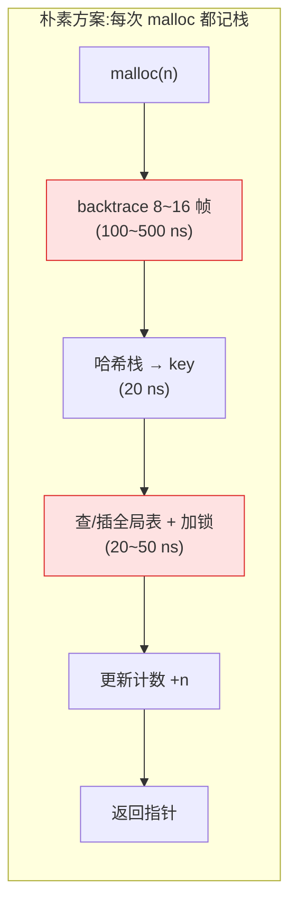
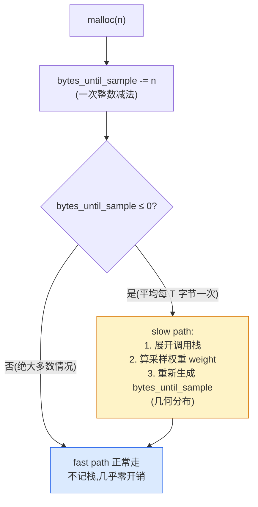

# 第十八章 · 采样、profiling 与统计

> 篇:P5 工程化
> 主线呼应:前 17 章我们反复强调一件事——fast path 必须是"无锁、O(1)、纳秒级"的纯整数操作,任何多余的开销都会被每秒百万次的 `malloc`/`free` 放大成灾难。可生产环境对分配器还有另一个刚需:**得能看见自己**。当前一共分配了多少内存、谁(哪段调用栈)在分配、有没有泄漏、哪条路径是大户——这些是排障和优化的命根子。问题在于,"看见"这件事天然是"贵"的:要知道"谁分配的",就得在每次 `malloc` 时**展开调用栈**(backtrace),一次 `backtrace` 几十上百纳秒起步,还要把整串返回地址存下来、做哈希聚合——把它塞进 fast path,fast path 当场就废了。本章讲四套分配器怎么用**采样(sampling)**绕开这个死结:不是每次都记账,而是按概率抽,大块更容易被采到,凭一次随机数预算"下次第几个分配被采",平时 fast path 只多一次整数比较。几何采样的精妙,是这一章的灵魂。

## 核心问题

**怎么在"不拖慢 fast path"的前提下,统计内存使用、抓出"谁在分配多少"?朴素做法是每次 `malloc` 都记调用栈,可一次栈展开几十上百纳秒,塞进每秒百万次的 fast path 就是灾难。新一代分配器给出的答案是采样:不每次都记,而是按概率抽(大块按尺寸放大被采概率),平时 fast path 只多一次整数减法/比较。四套各怎么做?凭什么"按概率抽"还能给出无偏的总量估计?**

读完本章你会明白:

1. **朴素方案的墙**:每次 `malloc` 都 `backtrace` + 记栈,fast path 从纳秒级劣化到百纳秒级(栈展开 + 哈希 + 加锁聚合),一秒百万次 malloc 的程序直接拖垮。这就是为什么"全量统计"在分配器里从来不是一个选项。
2. **采样的核心思想**:把"统计的代价"从"每次"摊到"每 N 字节一次"。不是每个分配都记,而是平均每分配 `T` 字节才记一次(`T` 叫采样间隔,tcmalloc 默认 512KB,jemalloc 默认 512KB 即 `lg_sample=19`)。fast path 平时只做一次整数运算判断"轮到我了没",轮到了才走昂贵的记栈路径。
3. **几何采样的数学**:采哪个分配不是固定间隔(固定间隔会"踩周期",漏掉周期性大户),而是**几何分布**——用一次随机数算出"下次第几个字节触发采样",平均间隔 `T`、方差也和 `T` 同级。这等价于把内存看作一条字节流,在上面撒泊松点,任意一段大小为 `X` 的分配"恰好覆盖某个点"的概率是 `1 - e^(-X/T)`——大块更容易被采到,正是我们想要的。
4. **大块放大的精妙**:同样的采样间隔 `T`,一个 4KB 的小块被采概率约 0.78%,一个 1MB 的大块被采概率约 86.5%,一个 1GB 的几乎必采。这意味着"少数大块自然被代表,大量小块按比例稀疏采样"——统计在大块上精度高(大块本来就值钱)、在小块上靠样本量(小块多,稀疏采样也够)。这是采样 profiling 的核心权衡。
5. **四套的真实差异**:tcmalloc 用"扣到 0 采样"(`bytes_until_sample_ -= k`,溢出即采,jemalloc 用数学对偶的"累加到阈值"(`thread_allocated += usize`,超阈值即采),两者工程上等价、fast path 都只多一次整数运算;mimalloc **不做采样**,只维护 per-thread 累加计数器(`malloc_normal`、`malloc_huge` 等粗粒度统计,无调用栈维度);ptmalloc 只提供外部按需查询接口(`mallinfo2`/`malloc_stats`/`mtrace`),fast path 上连计数器都几乎不动。这是"看得多深 vs 跑得多快"的真实光谱。

> **如果一读觉得太难**:先只记住三件事——① 全量统计(每次 malloc 都记栈)会让 fast path 慢一百倍,所以分配器都用采样;② 采样的本质是"平均每 T 字节记一次",用几何分布决定"下次第几个字节触发",平时 fast path 只多一次整数减法;③ 大块因为覆盖的字节多,被采概率天然更高(`1 - e^(-X/T)`),这是采样能"以小见大"的数学保证。本章服务"工程化支线"——它让分配器在不背叛 fast path 的前提下还能被观测。

---

## 18.1 一句话点破

> **profiling 的全部难题,可以浓缩成一句:统计是"贵的",fast path 是"百万次每秒的",两者直接相遇就是灾难。新一代分配器的解法,是把"每次都记"换成"按概率抽",再用一段优雅的数学(几何分布)保证抽出来的样本能无偏地还原总量,同时让"按尺寸放大被采概率"自然发生——大块覆盖的字节多,碰到采样点的概率就高,所以不需要额外的"大块特殊处理"。fast path 上平时只剩一次整数减法,只有被采中的那一次才走昂贵的记栈路径,而这一次平均每 T 字节才发生一次。**

这是结论,不是理由。本章倒过来拆:先看"每次都记栈"为什么必然崩,再看采样的数学怎么保证"稀疏抽样还能无偏还原",然后看四套怎么把这套数学落到一次整数运算里,最后看大块放大为什么是"白捡的"。

---

## 18.2 朴素方案的墙:每次 malloc 都记栈会怎样

要理解为什么必须采样,先看"全量统计"为什么不可行。

假设我们要回答一个最朴素的 profiling 问题:**"当前进程里,哪段调用栈持有的内存最多?"**(这是定位内存大户、抓泄漏的标准问题)。要回答它,分配器在每次 `malloc(p, n)` 时至少得做四件事:

1. **展开调用栈**:`backtrace()` / `unwind` 一路向上,收集若干层返回地址。Linux x86-64 上,即使最快的 `unwind` 实现(libunwind、`_Unwind_Backtrace`),也要几十到上百纳秒——因为每帧都要读 `.eh_frame` 信息、查寄存器、解 pointer encoding。
2. **把栈哈希成一个 key**:把整串返回地址做哈希,得到一个 `uint64_t`,用来聚合"同一段栈"。
3. **查/插一张全局哈希表**:用这个 key 去全局的 `{stack → 统计}` 表里查;查到就更新计数(分配字节数 +n),查不到就插入新条目。这张表是全局共享的,更新要加锁。
4. **`free(p)` 时反向更新**:还要维护一张 `{指针 → 当初分配时的栈 key}` 的反向表,free 时减计数、可能还要释放栈条目。

这一整套,代价是多少?粗略估算:

| 动作 | 代价(纳秒级) | 频率 |
|------|--------------|------|
| `backtrace`(8~16 帧) | 100~500 ns(libunwind) | 每次 malloc |
| 哈希 + 查全局表 | 20~50 ns(含锁) | 每次 malloc |
| 反向表查/插(`{ptr → stack}`) | 10~30 ns | 每次 malloc/free |

加起来,一次 `malloc` 多花 **200~800 纳秒**。对照第 1 章:fast path 本身是 **个位数纳秒**(本地缓存 pop 一个块)。也就是说,**全量统计会让 fast path 慢一到两个数量级**。一个原本每秒能做一百万次 malloc 的服务,开了全量 profiling 直接掉到每秒几万次——这等于把生产环境拖垮。



更糟的是,这套开销是**每个 malloc 都要付**的,而绝大多数 malloc 是小块、生命周期短的临时对象——给它们逐个记调用栈,信息量极低(都是同一个 `std::string` 临时对象的栈),代价却全额付。这就是"全量统计"的根本问题:**它把统计的代价平摊到了每一次分配上,而其中 99% 的分配对 profiling 问题的信息贡献近乎为零**。

> **不这样会怎样**:假设某个分配器"为了调试方便",默认每次 malloc 都记栈。在生产环境一开,fast path 立刻劣化两个数量级,QPS 雪崩。运维只能被迫关闭 profiling——可一旦关闭,出了内存泄漏又抓不到。这就是 ptmalloc 长期以来的处境:它根本不在 fast path 上做任何 profiling,只提供"外部按需查询"的 `mallinfo`/`malloc_stats`(见 18.6 节),代价是它永远回答不了"谁在分配"这个问题。

所以,任何"能在生产环境长期开着"的 profiling,都必须满足一个铁律:**统计的代价不能落在 fast path 的每一次调用上**。这就是采样登场的理由。

---

## 18.3 采样的核心思想:把代价从"每次"摊到"每 T 字节"

全量统计的根本病灶是"每个 malloc 都付全额"。采样的解法,是把"统计的代价"从"每次"换成"平均每 T 字节一次"。具体怎么做?

直觉上最简单的采样是"每 N 次 malloc 记一次":比如每 1000 次记一次,第 1000、2000、3000 个 malloc 被采。但这个朴素方案有个致命缺陷——**它对周期性的分配模式有偏**。如果一个程序里有个"每 100 次循环就 malloc 一次 1MB"的模式,而你的采样周期恰好是 1000 的倍数,你可能永远采不到这个 1MB(或永远只采到它),完全取决于相位。这种"踩周期"问题在固定间隔采样里是真实存在的噩梦。

正确的采样应该是**随机的、无周期的**。新一代分配器用的是这样一个模型:

```text
把进程分配的全部内存,想象成一条无限长的"字节流"。
在这条流上,以平均每 T 字节一个的密度,随机撒一些"标记点"(泊松点过程)。
一个 malloc(n) 申请了 n 个字节,就相当于在这条流上"占用"了一段长度 n 的区间。
如果这段区间恰好覆盖了某个标记点,这个 malloc 就"被采中"——记它的调用栈。
否则不记,fast path 几乎无开销。
```

这个模型有几个立刻显形的好处:

**第一,大块天然更容易被采中。** 一个 malloc(1MB) 在字节流上占了 1MB 的长度,它覆盖到某个标记点的概率远大于一个 malloc(64) 的小块。数学上,大小为 `X` 的分配被采中的概率是 `1 - e^(-X/T)`(下面 18.4 节推导)。这意味着**大块(值钱的)被精细采样,小块(便宜的)被稀疏采样**——正好是我们想要的"把采样预算花在刀刃上"。

**第二,无周期。** 标记点是随机撒的(泊松过程),不存在"踩周期"问题。无论程序的分配模式多么规整,采样都无偏。

**第三,fast path 代价极小。** 怎么"知道一个 malloc 是否覆盖了标记点"?不用真的去查字节流——只需要维护一个计数器 `bytes_until_sample`,记录"距离下一个标记点还有多少字节"。每次 malloc(n),就 `bytes_until_sample -= n`;一旦它 ≤ 0,说明这个 malloc 跨过了标记点,**就采它**;然后重新随机生成下一个 `bytes_until_sample`。**fast path 上平时只剩一次整数减法。**



这张图就是采样 profiling 的全部精髓。注意 fast path 分支(绝大多数情况)只多了一次整数减法和一次比较——这正是第 5 章我们讲的 tcache pop 之外的"额外一行代码"。slow path 分支(平均每 T 字节一次)才做昂贵的记栈,而这个频率被 `T` 控制得很低(tcmalloc 默认 `T = 512KB`,意味着平均每 512KB 的分配才走一次 slow path)。

> **钉死这件事**:采样的本质,是把"统计的代价"从"每次 malloc"摊到"每 T 字节 malloc"上。用一个 `bytes_until_sample` 计数器在 fast path 上做一次整数减法判断"轮到我了没";轮到了(平均每 T 字节一次)才走昂贵的记栈路径。大块因为占的字节多,跨过标记点的概率天然更高,所以"大块精细采、小块稀疏采"是白捡的,不需要额外的大块特殊处理。

---

## 18.4 几何采样:为什么用几何分布,数学保证是什么

18.3 节我们说"用 `bytes_until_sample` 计数器",但有个关键问题没回答:**这个计数器每次重置成多少?** 如果固定重置成 `T`(比如每次都重置成 512KB),那就退化成"固定间隔采样",又会踩周期。所以重置值必须是**随机的**,而且要满足"平均间隔是 `T`"。

这个"随机的、平均值为 `T` 的间隔"应该服从什么分布?答案是**几何分布**(离散版本)或等价的**指数分布**(连续版本)。理由是泊松过程的性质:如果标记点是按泊松过程撒的(每个字节独立地以 `p = 1/T` 的概率成为标记点),那么"从一个固定位置到下一个标记点的距离"就服从几何分布——它的均值是 `T`,而且具有**无记忆性**(从任何位置开始看,到下一个标记点的距离分布都一样)。

### 18.4.1 从均匀随机数生成几何变量

怎么用一次均匀随机数 `u ∈ (0, 1]` 生成一个均值为 `T` 的几何变量?这就是 `Sampler::GetGeometricVariable` 在做的事。推导很短:

几何分布的累积分布函数(CDF)是 `P(X ≤ x) = 1 - (1-p)^x`,其中 `p = 1/T`。逆变换法:令 `u = 1 - (1-p)^x`,反解出 `x = log(u) / log(1-p)`。对于 `p` 很小(`T` 很大)的情况,`log(1-p) ≈ -p = -1/T`,所以 `x ≈ -T · log(u) = T · ln(1/u)`。

tcmalloc 的实现把这个推导做了一点工程优化(用 `log2` 避免一次 `log`,见 [sampler.cc:98-121](../tcmalloc/tcmalloc/sampler.cc#L98-L121)):

```cpp
// tcmalloc/sampler.cc:98-121(逐字摘录)
ssize_t Sampler::GetGeometricVariable(ssize_t mean) {
  rnd_ = ExponentialBiased::NextRandom(rnd_);
  // Take the top 26 bits as the random number
  const uint64_t prng_mod_power = 48;  // Number of bits in prng
  double q = static_cast<uint32_t>(rnd_ >> (prng_mod_power - 26)) + 1.0;
  // Put the computed p-value through the CDF of a geometric.
  double interval = (std::log2(q) - 26) * (-std::log(2.0) * mean);
  // ... overflow clamp 略 ...
  return static_cast<ssize_t>(interval);
}
```

逐行拆:第 99 行先推进一次内置 PRNG(`rnd_` 是一个 48 位的线性同余发生器,`NextRandom` 一次推进);第 103~106 行从 `rnd_` 的高 26 位取一个随机整数 `q ∈ [1, 2^26]`,这等价于 `q/2^26 ∈ (0, 1]` 的均匀随机数;第 108 行 `(log2(q) - 26) * (-ln2 * mean)` 就是 `ln(q/2^26) * (-mean)`,化简就是 `mean * ln(2^26 / q) = mean * ln(1/u)`(其中 `u = q/2^26`),正是上面推导的 `T · ln(1/u)`。

注意一个细节:tcmalloc 用 `log2` 而不是 `log`,是因为在某些平台上 `log2` 更快(或者编译器能更好地常量传播 `-log(2.0)` 这一因子)。这是个微优化,但体现了"采样虽然不在每次 fast path 上,但 slow path 也要尽量快"的意识——slow path 每秒也跑几千次,能省一点是一点。

### 18.4.2 采样概率公式:1 - e^(-X/T)

有了几何分布的 `bytes_until_sample`,一个大小为 `X` 的 malloc 被采中的概率是多少?就是"它在字节流上占的 X 个字节里,至少有一个标记点"的概率。由于标记点服从泊松过程(密度 `1/T`),这就是 `1 - e^(-X/T)`。

tcmalloc 的注释把这个概率直接写出来了([sampler.h:40-46](../tcmalloc/tcmalloc/sampler.h#L40-L46)):

```
With 512K average sample step:
 the probability of sampling a 4K allocation is about 0.00778
 the probability of sampling a 1MB allocation is about 0.865
 the probability of sampling a 1GB allocation is about 1.00000
In general, the probability of sampling an allocation of size X
given a flag value of Y is:  1 - e^(-X/Y)
```

代入 `T = 512KB = 524288`:

| 分配大小 X | `X/T` | 被采概率 `1 - e^(-X/T)` |
|------------|-------|------------------------|
| 64 B(小块) | 0.000122 | 0.012% |
| 4 KB(页级) | 0.0078 | 0.78% |
| 64 KB(中块) | 0.122 | 11.5% |
| 1 MB(大块) | 1.93 | 86.5% |
| 1 GB(超大) | 2048 | ~100% |

这张表是采样 profiling 的核心权衡的可视化:**小块几乎不被采(64B 的被采概率万分之一),大块几乎必采(1MB 的 86%)**。这意味着:

- **大块**(值钱、容易泄漏、数量少)被精细采样——基本每个都被记录,统计精度极高。
- **小块**(便宜、数量巨大、单个无足轻重)被稀疏采样——只有万分之一被记录,但因为小块多,样本量仍然足够还原总量。

这正是"以小见大"的精髓:采样预算被自然地倾斜到了"信息量高"的大块上,而这个倾斜**不需要任何 if-else 特殊处理**——它纯粹是几何分布 + 泊松过程的数学结果。分配器代码里没有任何"如果 size > 某阈值就强制采"的逻辑,大块放大是"白捡的"。

### 18.4.3 无偏还原:采样权重 weight

被采中的那个 malloc,在统计表里不能只记"1 次",因为它代表的不只是它自己——它代表了"平均每 T 字节一个采样点"所覆盖的那些没被采中的同类分配。怎么还原总量?

tcmalloc 给每个被采样本算一个**权重(weight)**,表示"这个样本代表了多少字节的分配"。推导在 [sampler.cc:136-153](../tcmalloc/tcmalloc/sampler.cc#L136-L153) 的注释里:设这次 malloc 大小为 `k`,采样间隔 `T`,触发采样时计数器还差 `f` 字节(`bytes_until_sample = -f`),那么这次分配跨过了 `1` 个标记点(触发的那个),并且如果继续按 `T` 间隔撒点,在剩余的 `k - (T - f)` 字节里还会跨过 `(k - (T - f)) / T` 个点。所以这个样本"代表"的总字节数是 `T * (1 + (k - (T - f))/T) = T + k - f`。

代码里就是这么算的([sampler.cc:147-153](../tcmalloc/tcmalloc/sampler.cc#L147-L153)):

```cpp
// tcmalloc/sampler.cc:147-153(逐字摘录)
ssize_t weight;
if (ABSL_PREDICT_FALSE(__builtin_ssubl_overflow(
        sample_interval_, bytes_until_sample_ + kIntervalOffset, &weight))) {
  weight = std::numeric_limits<ssize_t>::max();
}
bytes_until_sample_ = PickNextSamplingPoint();
return GetSampleInterval() <= 0 ? 0 : weight;
```

`weight = sample_interval_ - (bytes_until_sample_ + 1)`,正好是 `T - f`(注意 `bytes_until_sample_` 此时是负数 `-f`,`+1` 是个 offset 补偿)。dump 出来的 profile 里,每个栈条目显示的不是"被采 3 次",而是"加权重后代表 12.5MB"——这就是无偏还原。**采样的总量估计 = 所有样本的 weight 之和**,在期望意义上等于真实分配总量。

> **钉死这件事**:几何采样用一段优雅的数学同时解决了三个问题——① 无周期(随机撒点,不踩周期);② 大块放大(大块覆盖字节多,被采概率 `1 - e^(-X/T)` 天然更高,无需特殊处理);③ 无偏还原(每个被采样本带一个 weight,总和期望等于真实总量)。这段数学是 tcmalloc/jemalloc 能在 fast path 上几乎零开销做 profiling 的全部理由。

---

## 18.5 tcmalloc:扣到 0 采样,fast path 只多一次减法

现在落到四套源码,看采样怎么真正嵌进 fast path。先看双主角之一的 tcmalloc。

### 18.5.1 采样计数器:扣到 0 即采

tcmalloc 的采样核心在 [sampler.h](../tcmalloc/tcmalloc/sampler.h) 和 [sampler.cc](../tcmalloc/tcmalloc/sampler.cc)。每个线程一个 `Sampler` 对象(注释明确写"Not thread safe: Each thread should have its own sampler object",[sampler.h:36-37](../tcmalloc/tcmalloc/sampler.h#L36-L37)),里面核心就是一个字段:

```cpp
// tcmalloc/sampler.h:137-145(逐字摘录)
// Bytes until we sample next.
//
// More specifically when bytes_until_sample_ is X, we can allocate
// X bytes without triggering sampling; on the (X+1)th allocated
// byte, the containing allocation will be sampled.
ssize_t bytes_until_sample_;
```

这就是 18.3 节说的那个计数器。fast path 上的判断函数是 `TryRecordAllocationFast`([sampler.h:163-174](../tcmalloc/tcmalloc/sampler.h#L163-L174)):

```cpp
// tcmalloc/sampler.h:163-174(逐字摘录)
inline bool ABSL_ATTRIBUTE_ALWAYS_INLINE
Sampler::TryRecordAllocationFast(size_t k) {
  TC_ASSERT_GE(bytes_until_sample_, 0);

  // Avoid missampling 0.  Callers pass in requested size ...
  // Since subtracting 0 from bytes_until_sample_ is a no-op, we increment k by one.
  k++;

  return ABSL_PREDICT_TRUE(!__builtin_usubl_overflow(
      bytes_until_sample_, k, reinterpret_cast<size_t*>(&bytes_until_sample_)));
}
```

这三行就是 fast path 上采样的**全部代价**。逐行拆:

- 第 170 行 `k++`:把 `k=0` 的情况规避掉(减 0 是 no-op,会漏采)。
- 第 172~173 行 `__builtin_usubl_overflow(bytes_until_sample_, k, &bytes_until_sample_)`:这是 GCC/Clang 的内建函数,**做一次无符号减法并同时检测溢出**。`bytes_until_sample_ -= k`,如果结果没下溢(没变负),返回 `false` 取反成 `true`,表示"不需要采样";如果下溢了(变负),返回 `true` 取反成 `false`,表示"需要采样"。

为什么用 `__builtin_usubl_overflow` 而不是简单的 `bytes_until_sample_ -= k; if (bytes_until_sample_ < 0)`?注释里([sampler.cc:37-43](../tcmalloc/tcmalloc/sampler.cc#L37-L43))直接挑明:

```
We used to select an initial value for the sampling counter and then sample
an allocation when the counter becomes less or equal to zero.
Now we sample when the counter becomes less than zero, so that we can use
__builtin_usubl_overflow, which is the only way to get good machine code
for both x86 and arm.
```

`__builtin_usubl_overflow` 在 x86 上编译成一条 `sub` 指令(`CF` 标志位自动反映借位),在 ARM 上编译成一条 `subs` 指令(`C` 标志位自动反映借位)——**一条指令同时完成"减法 + 判断是否下溢"**,不需要额外的 `cmp` 或分支。这是采样计数器能在 fast path 上几乎零开销的关键:它不是"一次减法 + 一次比较 + 一次分支",而是"一条带标志位的减法 + 一次条件分支"。CPU 流水线里,这个分支预测命中率极高(绝大多数情况走"不采"分支),代价接近一条 `sub` 指令。

### 18.5.2 fast path 在哪里调用采样

看 fast path 的入口 `fast_alloc`([tcmalloc.cc:1266-1304](../tcmalloc/tcmalloc/tcmalloc.cc#L1266-L1304)):

```cpp
// tcmalloc/tcmalloc.cc:1266-1304(节选,逐字摘录关键行)
static inline Pointer ABSL_ATTRIBUTE_ALWAYS_INLINE fast_alloc(size_t size,
                                                              Policy policy) {
  const auto [is_small, size_class] =
      tc_globals.sizemap().GetSizeClass(policy, size);
  if (ABSL_PREDICT_FALSE(!is_small)) {
    SLOW_PATH_BARRIER();
    TCMALLOC_MUSTTAIL return slow_alloc_large(size, policy);
  }

  // TryRecordAllocationFast() returns true if no extra logic is required, e.g.:
  // - this allocation does not need to be sampled
  // - no new/delete hooks need to be invoked
  // - no need to initialize thread globals, data or caches.
  // The method updates 'bytes until next sample' thread sampler counters.
  if (ABSL_PREDICT_FALSE(!GetThreadSampler().TryRecordAllocationFast(size))) {  // L1285
    SLOW_PATH_BARRIER();
    return slow_alloc_small(size, size_class, policy);
  }

  // Fast path implementation for allocating small size memory.
  void* ret = tc_globals.cpu_cache().AllocateFast(size_class);
  ...
}
```

**第 1285 行 `TryRecordAllocationFast(size)` 就是采样在 fast path 上的全部介入点。** 注意它和"size class 计算"(第 1273 行)、"cpu cache pop"(第 1296 行)是同级的——也就是说,采样判断和这两件事一样,是 fast path 的标准一环,但它的代价只是一条带标志位的减法。

只有当 `TryRecordAllocationFast` 返回 `false`(需要采样)时,才 tail-call 到 `slow_alloc_small`([tcmalloc.cc:1229-1246](../tcmalloc/tcmalloc/tcmalloc.cc#L1229-L1246)),后者会调 `RecordedAllocationFast`/`RecordAllocation` 走完整的采样路径(算 weight、记栈)。这条 slow path 平均每 `T` 字节(默认 512KB)才走一次。

### 18.5.3 采样命中后:记栈 + 写入 AllocationSampleList

采样命中后,tcmalloc 做两件事:① 算 weight(18.4.3 节);② 把这次的调用栈记进当前活跃的 `AllocationSample`(由 `MallocExtension::StartAllocationProfiling` 启动)。后者在 [allocation_sample.h:74-81](../tcmalloc/tcmalloc/allocation_sample.h#L74-L81):

```cpp
// tcmalloc/allocation_sample.h:74-81(逐字摘录)
void ReportMalloc(const struct StackTrace& sample) {
  AllocationGuardSpinLockHolder h(lock_);
  AllocationSample* cur = first_;
  while (cur != nullptr) {
    cur->mallocs_->AddTrace(1.0, sample);
    cur = cur->next_;
  }
}
```

`ReportMalloc` 遍历当前所有活跃的 `AllocationSample`(可能有好几个并发的 profiling session),把这次采中的栈(`sample`)加进每个 session 的 `StackTraceTable`。注意**这里才加锁**——`AllocationGuardSpinLockHolder h(lock_)` 拿的是 `allocation_sample.h:86` 那把 SpinLock。fast path 上不碰这把锁,只有 slow path 才碰,所以锁争用极低。

> **钉死这件事**:tcmalloc 的采样是"扣到 0 模型"——fast path 调一次 `TryRecordAllocationFast`,内部用 `__builtin_usubl_overflow` 一条指令完成"减法 + 溢出检测",没溢出就继续 fast path,溢出(变负)就 tail-call slow path。slow path 平均每 512KB 才走一次,那时才算 weight、展开调用栈、加锁写入 profiling 表。fast path 的全部采样代价 ≈ 一条带标志位的 `sub` 指令 + 一个高命中率的条件分支。

---

## 18.6 jemalloc:累加到阈值,数学对偶工程等价

jemalloc 的采样在数学上和 tcmalloc 完全等价(都是几何分布),但在工程实现上走的是**对偶方向**:tcmalloc 是"扣到 0",jemalloc 是"累加到阈值"。

### 18.6.1 两个全局开关:opt.prof 和 lg_prof_sample

jemalloc 的 profiling 由两个核心选项控制([prof.c:30-44](../jemalloc/src/prof.c#L30-L44)):

```c
// jemalloc/src/prof.c:30-44(逐字摘录)
bool     opt_prof = false;                          // 总开关:开不开 profiling
unsigned opt_prof_bt_max = PROF_BT_MAX_DEFAULT;     // 每个样本最多记多少层栈
size_t   opt_lg_prof_sample = LG_PROF_SAMPLE_DEFAULT;  // lg(采样间隔),默认 19(即 512KB)
```

`opt_prof` 是总开关,默认关(`false`)——jemalloc 默认不采样,fast path 完全绕过 profiling 逻辑(下面 18.6.3 节看怎么绕过)。`opt_lg_prof_sample` 是采样间隔的 log2,默认 `LG_PROF_SAMPLE_DEFAULT = 19`,即 `2^19 = 512KB`,和 tcmalloc 默认值一样。这个 `lg_` 前缀是 jemalloc 的习惯——所有"以 2 的幂表达的参数"都用 `lg_` 前缀(因为 jemalloc 内部大量用位运算,log2 形式更方便)。

运行时通过环境变量 `MALLOC_CONF=prof:true,lg_prof_sample:19` 开启。注意 jemalloc 的 profiling 是**编译期可选**的(`config_prof` 宏),不开启编译的话相关代码完全不存在,零开销。这和 tcmalloc 不同——tcmalloc 的采样是始终编入的(只是采样间隔可设为极大值变相关闭)。

### 18.6.2 几何采样公式:和 tcmalloc 同一个数学

jemalloc 怎么算"下一次什么时候采"?核心函数 `prof_sample_new_event_wait`([prof.c:252-296](../jemalloc/src/prof.c#L252-L296)):

```c
// jemalloc/src/prof.c:252-296(节选,逐字摘录关键部分)
JET_EXTERN uint64_t
prof_sample_new_event_wait(tsd_t *tsd) {
#ifdef JEMALLOC_PROF
	if (lg_prof_sample == 0) {
		return TE_MIN_START_WAIT;   // 采样间隔为 1:每次都采(仅测试用)
	}

	/*
	 * Compute sample interval as a geometrically distributed random
	 * variable with mean (2^lg_prof_sample).
	 *
	 *                      __        __
	 *                      |  log(u)  |                     1
	 * bytes_until_sample = | -------- |, where p = ---------------
	 *                      | log(1-p) |             lg_prof_sample
	 *                                              2
	 */
	uint64_t r = prng_lg_range_u64(tsd_prng_statep_get(tsd), 53);
	double   u = (r == 0U)
	      ? 1.0
	      : (double)((long double)r * (1.0L / 9007199254740992.0L));
	return (uint64_t)(log(u)
	           / log(
	               1.0 - (1.0 / (double)((uint64_t)1U << lg_prof_sample))))
	    + (uint64_t)1U;
#else
	not_reached();
	return TE_MAX_START_WAIT;
#endif
}
```

注释里的公式 `bytes_until_sample = log(u) / log(1-p)`,其中 `p = 1/2^lg_prof_sample`,**和 tcmalloc 18.4.1 节推导的是同一个公式**——逆变换法生成几何变量。代码实现略有差异:jemalloc 用 53 位精度 PRNG(`prng_lg_range_u64(..., 53)`,53 是 double 尾数位数),tcmalloc 用 26 位(更省);jemalloc 用 `log/log`,tcmalloc 用 `log2`——但数学完全等价。

一个工程细节:jemalloc 处理了 `r == 0` 的边界情况(`u = 1.0`),避免 `log(0)` 导致 NaN。tcmalloc 用 `q = ... + 1.0` 保证 `q ≥ 1` 来规避同样问题。两边都踩过这个坑(PRNG 偶尔吐 0),各自用不同方式堵上。

### 18.6.3 fast path 上的 thread event:累加 + 比较

现在看 jemalloc 怎么把采样嵌进 fast path。jemalloc 用一套叫 **thread event(TE)** 的通用机制——不只 prof sample,所有"按字节触发的周期性事件"(stats interval、prof sample、thread_allocated 计数)都挂在上面。fast path 上的核心函数是 `te_event_advance`([thread_event.h:200-216](../jemalloc/include/jemalloc/internal/thread_event.h#L200-L216)):

```c
// jemalloc/include/jemalloc/internal/thread_event.h:200-216(逐字摘录)
JEMALLOC_ALWAYS_INLINE void
te_event_advance(tsd_t *tsd, size_t usize, bool is_alloc) {
	te_assert_invariants(tsd);

	te_ctx_t ctx;
	te_ctx_get(tsd, &ctx, is_alloc);

	uint64_t bytes_before = te_ctx_current_bytes_get(&ctx);
	te_ctx_current_bytes_set(&ctx, bytes_before + usize);

	/* The subtraction is intentionally susceptible to underflow. */
	if (likely(usize < te_ctx_next_event_get(&ctx) - bytes_before)) {
		te_assert_invariants(tsd);
	} else {
		te_event_trigger(tsd, &ctx);
	}
}
```

逐行拆:

- 第 207~208 行:`bytes_before = current; current += usize`——把"本线程累计分配字节数"加上这次分配的 `usize`。这就是 jemalloc 的"累加模型"(对应 tcmalloc 的"扣减模型")。
- 第 211 行:`if (usize < next_event - bytes_before)`——判断"这次分配后,current 有没有越过 next_event 阈值"。注释特意写"The subtraction is intentionally susceptible to underflow":`next_event - bytes_before` 是无符号减法,如果 `next_event < bytes_before` 会下溢成一个巨大的数,`usize < 巨大数` 永远成立,等价于"不触发"——这是用无符号算术的自然溢出来避免额外的分支。
- 第 214 行 `te_event_trigger`:只有越过阈值才调用,进去后会判断是哪种事件(prof sample / stats / ...)分别触发对应的 handler。prof sample 的 handler 是 `prof_sample_event_handler`([prof.c:298-312](../jemalloc/src/prof.c#L298-L312)),它进一步调 `prof_try_log` 展开调用栈、记入 prof 数据结构。

注意这套机制和 tcmalloc 的对偶关系:

| 维度 | tcmalloc | jemalloc |
|------|----------|----------|
| 计数器方向 | 扣减(`bytes_until_sample -= k`) | 累加(`thread_allocated += usize`) |
| 触发条件 | 下溢(变负) | 超过阈值 |
| 数学 | 几何分布 `bytes_until_sample` | 几何分布 `next_event - last_event` |
| fast path 代价 | 一条 `sub` + 标志位判断 | 一次 `add` + 一次无符号比较 |
| 谁来"重置" | slow path 重新生成 `bytes_until_sample` | slow path 重新算 `next_event` |

两者**数学等价、工程对偶**。tcmalloc 的扣减模型稍微省一点(只需维护一个计数器),jemalloc 的累加模型稍微灵活一点(`thread_allocated` 本身就是个有用的统计量"本线程累计分配了多少字节",复用了)。

### 18.6.4 fast threshold 优化:让 fast path 只读一个变量

jemalloc 还有一个更深的优化,值得单独点出。注意 `te_event_advance` 里要读 `next_event`(第 211 行)。但 jemalloc 实际上维护了**两个**阈值:`next_event`(精确阈值)和 `next_event_fast`(快速阈值)。为什么?

看 [thread_event.h:14-31](../jemalloc/include/jemalloc/internal/thread_event.h#L14-L31) 的注释:

```c
// jemalloc/include/jemalloc/internal/thread_event.h:14-31(逐字摘录注释)
/*
 * Maximum threshold on thread_(de)allocated_next_event_fast, so that there is
 * no need to check overflow in malloc fast path. (The allocation size in malloc
 * fast path never exceeds SC_LOOKUP_MAXCLASS.)
 */
#define TE_NEXT_EVENT_FAST_MAX (UINT64_MAX - SC_LOOKUP_MAXCLASS + 1U)

/*
 * The max interval helps make sure that malloc stays on the fast path in the
 * common case, i.e. thread_allocated < thread_allocated_next_event_fast.
 */
#define TE_MAX_INTERVAL ((uint64_t)(4U << 20))   // 4MB
```

`TE_NEXT_EVENT_FAST_MAX = UINT64_MAX - SC_LOOKUP_MAXCLASS + 1`——这个值的意义是:只要 `next_event_fast` 设成这个值或更小,那么 `thread_allocated + usize`(usize ≤ SC_LOOKUP_MAXCLASS)就**永远不会溢出 `uint64_t`**。这意味着 fast path 上的比较 `usize < next_event_fast - bytes_before` 可以用无符号减法自然处理,不需要额外检查溢出。

`TE_MAX_INTERVAL = 4MB` 是另一个保护:即便没有任何活跃事件(prof 关了),`next_event_fast` 也不会被设得无限大,保证 fast path 不会"卡在 fallback 路径太久"。

这套"双阈值"机制让 jemalloc 的 fast path 采样判断([te_malloc_fastpath_ctx](../jemalloc/include/jemalloc/internal/thread_event.h#L91-L96))退化成:**读 `thread_allocated` 和 `thread_allocated_next_event_fast` 两个 TSD 变量,做一次无符号比较**。和 tcmalloc 的"一条 sub 指令"几乎一样轻。

> **钉死这件事**:jemalloc 的采样是"累加到阈值模型",数学上和 tcmalloc 完全等价(同一个几何分布逆变换公式),工程上走对偶方向。fast path 通过 `te_event_advance` 做一次 `current += usize` 和一次无符号比较,触发条件是"current 越过 next_event"。再叠加一层"双阈值(`next_event` + `next_event_fast`)"优化,让 fast path 的比较永不溢出、永远只读两个 TSD 变量。tcmalloc 用扣减 + 溢出标志位,jemalloc 用累加 + 阈值比较——殊途同归,都是"一次整数运算"。

---

## 18.7 mimalloc:不做采样,只做粗粒度累加统计

看完两个主角,看新秀 mimalloc。mimalloc 的定位和 tcmalloc/jemalloc 有个本质区别:**它不做采样 profiling**(不抓"谁在分配多少")。它只维护一套粗粒度的累加统计——`malloc_normal`、`malloc_huge`、`committed`、`segments` 等总量指标,没有"按调用栈聚合"的维度。

### 18.7.1 per-thread 累加 + main 用原子合并

mimalloc 的统计核心在 [stats.c](../mimalloc/src/stats.c)。每个线程有一份本地的 `mi_stats_t`(thread-local),更新函数 `mi_stat_update`([stats.c:27-45](../mimalloc/src/stats.c#L27-L45)):

```c
// mimalloc/src/stats.c:27-45(逐字摘录)
static void mi_stat_update(mi_stat_count_t* stat, int64_t amount) {
  if (amount == 0) return;
  if mi_unlikely(mi_is_in_main(stat))
  {
    // add atomically (for abandoned pages)
    int64_t current = mi_atomic_addi64_relaxed(&stat->current, amount);
    mi_atomic_maxi64_relaxed(&stat->peak, current + amount);
    if (amount > 0) {
      mi_atomic_addi64_relaxed(&stat->total,amount);
    }
  }
  else {
    // add thread local
    stat->current += amount;
    if (stat->current > stat->peak) { stat->peak = stat->current; }
    if (amount > 0) { stat->total += amount; }
  }
}
```

注意这个函数的二分逻辑:**如果这个 stat 是"main"(全局的),用原子操作;如果是 thread-local 的,用普通非原子 `+=`**。`mi_is_in_main`(第 22~25 行)通过指针落在不在 `_mi_stats_main` 这片内存来判断。这是一个巧妙的设计:同一个函数既能更新本地统计(无锁,fast path 用),又能更新全局统计(加锁,慢路径用)。

fast path 上,mimalloc 的 malloc 会调 `_mi_stat_increase(&tld->stats.malloc_normal, ...)` 之类——**更新的是 thread-local 的 stat**,所以走 `else` 分支,**就是普通的 `stat->current += amount`**,一次非原子加法,没有任何采样、没有调用栈。这比 tcmalloc/jemalloc 的采样还轻(它们至少要判断"采不采"),但代价是**信息量极低**——只有"本线程一共分配了多少字节的 normal/huge 块"这种粗指标。

### 18.7.2 输出:mi_stats_print 合并所有线程

要拿全局视图时,调 `mi_stats_print`([stats.c:414-416](../mimalloc/src/stats.c#L414-L416)),它内部先 `mi_stats_merge_from`(把所有 thread-local stat 用原子操作合并到 main),再 `_mi_stats_print` 打印。看 [_mi_stats_print](../mimalloc/src/stats.c#L306-L374) 的输出格式:

```text
heap stats: ...
    binned:    ...      ← normal 块的 current/peak/total
    huge:      ...      ← huge 块
    total:     ...
    reserved:  ...      ← 总保留(mmap)量
    committed: ...      ← 已提交物理内存
    ...
    segments:  ...
    -abandoned: ...     ← 被 abandon 的 segment(arena-abandon 机制)
    pages:     ...
    mmaps:     ...      ← mmap 调用次数
    ...
    threads:   ...
    process: ... peak rss: ...
```

这套指标对回答"进程用了多少内存、有没有归还 OS、abandon 了多少 segment"很有用,但**回答不了"谁(哪段调用栈)分配了多少"**——因为没有调用栈维度,也没有采样数据。如果要在 mimalloc 上抓内存大户/泄漏,得用外部分析工具(`heaptrack`、`valgrind massif`),不能靠 mimalloc 自己。

这是 mimalloc 有意识的工程取舍:它的卖点是"轻、快、依赖少"(能塞进 Python、游戏引擎等各种宿主),所以它把 profiling 的复杂度砍掉了——fast path 上连采样判断都不做,只做累加。代价是 profiling 能力远弱于 tcmalloc/jemalloc。

> **钉死这件事**:mimalloc 的统计是"粗粒度累加"——fast path 上对本地的 `mi_stats_t` 做一次非原子 `+=`(比 tcmalloc/jemalloc 的采样判断还轻),没有调用栈维度、没有采样。要看全局视图时,用 `mi_stats_print` 把所有 thread-local 用原子操作合并到 main 再打印。这套指标能回答"用了多少内存、abandon 了多少",但回答不了"谁分配的"。这是 mimalloc 为"轻"付出的代价——profiling 能力外包给 valgrind/heaptrack 这类外部工具。

---

## 18.8 ptmalloc(baseline):只提供外部按需查询,fast path 几乎不动

最后看 baseline ptmalloc。ptmalloc 在 fast path 上的 profiling 介入是**四套里最轻的**——轻到几乎没有。它根本不做采样,也不维护调用栈维度。它只提供几个"外部按需查询"的 C API,这些 API 不在 fast path 上,只有用户显式调用时才走。

### 18.8.1 三个查询接口:mallinfo2、malloc_stats、mtrace

ptmalloc 的 profiling 接口都暴露在 `malloc/malloc.c`(在线 [malloc.c](https://github.com/glibc/glibc/blob/main/malloc/malloc.c))和 `malloc/mtrace.c`:

| 接口 | 文件 | 作用 | fast path 代价 |
|------|------|------|---------------|
| `mallinfo()` / `mallinfo2()` | `malloc/malloc.c` | 返回一个结构体,含 arena/smblks/hblks/usmblks/fsmblks/uordblks/fordblks/keepcost 等字段(legacy `mallinfo` 用 `int` 字段,32 位机上会溢出;`mallinfo2` 是 glibc 2.33+ 新增,用 `size_t`) | 零(只查 main_arena 的累加计数) |
| `malloc_stats()` | `malloc/malloc.c` | 把 `mallinfo` 的内容格式化打印到 stderr | 零(同上) |
| `mtrace()` / `muntrace()` | `malloc/mtrace.c` | 打开后,在每次 `malloc`/`free`/`realloc` 时记录一行日志(指针、大小、调用地址)到 `MALLOC_TRACE` 指定的文件,事后用 `mtrace` 命令分析 | **重**(每次 malloc 都要 `fprintf`,且只在显式 `mtrace()` 后才开) |

`mallinfo2` 返回的 `struct mallinfo2` 在 `malloc.c` 约 668 行声明(在线):

```c
// malloc/malloc.c(在线 glibc main,约 L668 起声明)
struct mallinfo2 {
  size_t arena;     /* Non-mmapped space allocated (bytes) */
  size_t ordblks;   /* Number of free chunks */
  size_t smblks;    /* Number of fastbin blocks */
  size_t hblks;     /* Number of mmapped regions */
  size_t hblkhd;    /* Space allocated in mmapped regions (bytes) */
  size_t usmblks;   /* Maximum total allocated space (bytes, often 0 in modern glibc) */
  size_t fsmblks;   /* Space in freed fastbin blocks (bytes) */
  size_t uordblks;  /* Total allocated space (bytes) */
  size_t fordblks;  /* Total free space (bytes) */
  size_t keepcost;  /* Top-most, releasable space (bytes) */
};
```

这些字段全部是**全局 arena 级别的累加计数**——"总分配了多少、总空闲多少、有多少 free chunk"这类粗指标,和 mimalloc 的 `mi_stats_print` 在一个量级(甚至更粗,因为 `mallinfo` 只反映 main_arena,要看所有 arena 得遍历 arena 链)。**没有任何调用栈维度、没有按 size class 细分、没有采样**。

### 18.8.2 为什么 ptmalloc 不做采样

ptmalloc 不做采样的根本原因,是它的历史定位。ptmalloc(原名 ptmalloc2,作者 Wolfram Gloger)是 2000 年代初从 dlmalloc(Doug Lea 的 malloc)fork 出来加多线程支持的。那个年代的 profiling 需求很简单——"看看进程用了多少堆内存"就够,`mallinfo` 足矣。而"按调用栈抓大户"这种现代需求,是后来 Google(perftools 的 heap profiler)、Facebook(jemalloc prof)在 2010 年代才推动的。ptmalloc 没跟上这一波,它的定位是"系统的默认 malloc",要兼容性、要稳定,不追求最前沿的 profiling。

`mtrace` 是 ptmalloc 的"穷人的采样"——它不是采样,是全量(每次都记),但因为代价重(每次 malloc 一行 `fprintf`),只能临时开。生产环境长期开 `mtrace` 是不可行的。这正好反衬了 tcmalloc/jemalloc 采样的价值:**它们的目标是"生产环境长期开着也不掉性能"**。

> **钉死这件事**:ptmalloc 的 profiling 是四套里最原始的——只提供 `mallinfo`/`mallinfo2`/`malloc_stats`/`mtrace` 这几个外部按需查询接口,fast path 上几乎不动(只在 malloc/free 时维护 arena 级的累加计数)。没有采样、没有调用栈维度。`mtrace` 是"全量记日志"的穷人之选,代价重到只能临时开。这正是 ptmalloc 作为 baseline 的反衬作用——它说明"为什么需要新一代分配器的采样"。

---

## 18.9 四套 profiling 对照

把四套放一起对照,差异最清楚:

| 维度 | tcmalloc | jemalloc | mimalloc | ptmalloc(baseline) |
|------|----------|----------|----------|----------|
| **是否做采样** | 是,几何采样 | 是,几何采样(`config_prof` 编译开关) | **否**,只粗粒度累加 | **否**,只外部查询 |
| **采样数学** | 几何分布,`bytes_until_sample -= k` | 几何分布,`thread_allocated += usize` | — | — |
| **默认采样间隔 T** | 512KB(`profile_sampling_interval`) | 512KB(`lg_prof_sample = 19`) | — | — |
| **fast path 采样代价** | 一条 `sub` + 溢出标志位([sampler.h:172-173](../tcmalloc/tcmalloc/sampler.h#L172-L173)) | 一次 `add` + 无符号比较([thread_event.h:211](../jemalloc/include/jemalloc/internal/thread_event.h#L211)) | 一次非原子 `+=`([stats.c:41](../mimalloc/src/stats.c#L41)) | 零(不动) |
| **大块放大** | 自然(`1 - e^(-X/T)`,[sampler.h:40-46](../tcmalloc/tcmalloc/sampler.h#L40-L46)) | 自然(同公式,[prof.c:259-291](../jemalloc/src/prof.c#L259-L291)) | — | — |
| **调用栈维度** | 有(`StackTrace`,dump 出 pprof) | 有(`prof_bt_t`,dump 出 pprof) | **无** | **无**(mtrace 有,但全量) |
| **输出格式** | pprof(Google pprof 工具) | pprof(jemalloc 自己 dump) | 文本(`mi_stats_print`) | 文本(`malloc_stats`/`mallinfo2`) |
| **生产可长期开** | 是(fast path 几乎零开销) | 是(同) | 是(更轻,但无栈维度) | 否(`mtrace` 重,`mallinfo` 无栈) |
| **fast path 是否总介入** | 总是(即使关采样,`TryRecordAllocationFast` 仍跑) | 仅 `opt_prof=true` 时(`config_prof` 关则代码不存在) | 总是(累加 `tld->stats`) | 几乎不 |

这张表里有几个关键的差异,值得反复对照:

1. **tcmalloc vs jemalloc 的"扣减 vs 累加"**:数学等价,工程对偶。tcmalloc 用扣减 + 溢出标志位(`__builtin_usubl_overflow` 一条指令),jemalloc 用累加 + 阈值比较 + 双阈值优化。两边 fast path 代价都是"一次整数运算 + 一个高命中分支"。
2. **tcmalloc 始终介入,jemalloc 编译期可选**:tcmalloc 的采样代码始终编入,即使关采样,fast path 也跑 `TryRecordAllocationFast`(只是计数器永远不溢出)。jemalloc 的 profiling 是 `config_prof` 编译开关控制的,关掉编译的话相关代码完全不存在,fast path 真正绕过。这是"始终可观测 vs 按需启用"的取舍。
3. **mimalloc 的"轻"代价**:它连采样都不做,fast path 上只有一次非原子 `+=`,但代价是没有调用栈维度。这是它"塞进各种宿主"定位的必然选择。
4. **ptmalloc 是反衬**:它说明"不做采样的分配器"在生产环境的处境——只能用外部的 `mtrace`(全量、重)或 `mallinfo`(无栈、粗)。这正是 tcmalloc/jemalloc 采样要解决的问题。

> **钉死这件事**:四套里 tcmalloc 和 jemalloc 是"完整采样 profiling"的两个等价实现(数学同、工程对偶),都能在 fast path 几乎零开销的前提下抓"谁分配多少";mimalloc 砍掉了采样换"更轻",代价是 profiling 只能粗粒度;ptmalloc 是 baseline,只提供外部查询接口,fast path 上几乎不动。这条光谱从"完整采样"到"完全不采",覆盖了"看得多深 vs 跑得多快"的取舍。

---

## 18.10 技巧精解:几何采样凭什么不影响 fast path

这一节单独拆透本章最硬核的技巧:**几何采样为什么能在 fast path 上几乎零开销,同时还能给出无偏的总量估计**。这是"profiling 不背叛 fast path"的全部理由,也是新一代分配器相对 ptmalloc 的关键代差之一。

### 问题陈述

我们要在 fast path 上回答一个问题:"这次 malloc 该不该被采样?"回答它,要做两件事:① 更新计数器;② 判断是否触发。问题是,这两件事必须发生在每秒百万次的 fast path 上,代价必须极小——理想是一条 CPU 指令。同时,计数器背后的采样数学必须保证"平均每 T 字节采一次,且无周期"。这两个约束(极致的 fast path 代价 + 正确的采样数学)怎么同时满足?

### 解法:一条带标志位的减法 + 几何分布重置

tcmalloc 的解法浓缩成两段代码。

**fast path(每次都跑)**:[sampler.h:163-174](../tcmalloc/tcmalloc/sampler.h#L163-L174) 的 `TryRecordAllocationFast`,核心就是 `__builtin_usubl_overflow(bytes_until_sample_, k, &bytes_until_sample_)` 一条指令。这条指令在 x86 上是 `sub`,在 ARM 上是 `subs`,**一条指令同时完成"减法 + 设置借位标志"**。编译器把"借位标志"直接映射到 `__builtin_usubl_overflow` 的返回值,后续的 `if (!overflow)` 编译成一个 `jnc`/`b.cc` 条件跳转——**总共两条指令,且分支预测命中率 > 99.9%**(因为绝大多数 malloc 不触发采样)。

**slow path(平均每 T 字节一次)**:[sampler.cc:98-121](../tcmalloc/tcmalloc/sampler.cc#L98-L121) 的 `GetGeometricVariable`,用一次 PRNG + 一次 `log2` 算出新的 `bytes_until_sample`,服从均值 `T` 的几何分布。这个函数只在采样触发时跑,频率是 `1/T`(默认每 512KB 一次),所以即使它内部有浮点运算(`log2`)也无所谓——平摊到每次 malloc 上,代价趋近于零。

### 凭什么说"无偏"

采样的"无偏"体现在两层:

**第一层:采样点无偏。** `bytes_until_sample` 服从几何分布,均值 `T`。由大数定律,长时间运行后,采样频率收敛到 `1/T`——平均每 `T` 字节一次,不多不少。这是几何分布的无记忆性保证的:无论从哪个位置开始,到下一个采样点的距离分布都一样,不存在"开头密、后面疏"的偏。

**第二层:总量估计无偏。** 每个被采中的样本带一个 `weight = T + k - f`(18.4.3 节),表示"这个样本代表的字节数"。把所有样本的 weight 加起来,在期望意义上等于真实分配总量。这是因为:大小为 `X` 的分配被采中的概率是 `1 - e^(-X/T)`,被采中时它的 weight 期望是 `T + X`(粗略),所以"被采概率 × weight"对每个 `X` 都约等于 `X`——这正是"用样本还原总量"的数学保证。pprof 工具显示的"这个栈占 12.5MB",就是把这个栈下所有样本的 weight 求和得来的,它无偏估计了这个栈的真实占用。

### 反面对比:如果用"固定间隔采样"会怎样

假设我们"简化"一下,把 `bytes_until_sample` 固定重置成 `T`(每次采完都设回 512KB),而不是用几何分布随机化。会发生什么?

```text
固定间隔采样的灾难(假设 T=512KB,程序有个"每分配 512KB 就 malloc 一次 1MB"的周期):
  第 1 次: malloc 1MB → bytes_until_sample = 512K - 1M = -512K → 采!
           重置成 512K
  第 2 次: malloc 1MB → 512K - 1M = -512K → 又采!
           重置成 512K
  ... 永远采到这个 1MB,永远漏掉别的分配
```

这就是"踩周期"——固定间隔采样对周期性分配模式有强烈的相位偏置。如果程序的周期恰好和采样周期同频,你要么永远采到那个分配(高估),要么永远采不到(漏掉)。这种偏无法用 weight 还原,因为它根本不是"随机抽样",是"系统性遗漏"。

几何分布(随机间隔)彻底消除了这个问题:**采样点的位置是随机的,和程序的任何周期都不同频**。无论程序的分配模式多么规整,采样都无偏。这是"用随机性换无偏性"的典型例子——直觉上"固定间隔更可控",实际上"随机间隔才无偏"。

### 反面对比:如果每次都 backtrace 会怎样

再对比一下 18.2 节的"全量统计"——假设我们"为了 profiling 精度",每次 malloc 都展开调用栈、记栈、加锁聚合。fast path 会变成什么样?

```text
全量统计(假设每次都记栈):
  malloc(n):
    1. size class 查表:      ~5 ns
    2. cpu cache pop:        ~5 ns
    3. backtrace 8~16 帧:    100~500 ns   ← 灾难
    4. 哈希栈:               ~20 ns       ← 灾难
    5. 查/插全局表 + 加锁:    ~30 ns       ← 灾难
    总计: 160~560 ns

采样统计(tcmalloc,fast path):
  malloc(n):
    1. size class 查表:      ~5 ns
    2. TryRecordAllocationFast: ~1 ns      ← 一条 sub 指令
    3. cpu cache pop:        ~5 ns
    总计: ~11 ns   (慢路径每 512KB 才一次,平摊代价趋近 0)
```

**采样让 fast path 保持在 ~10ns 级别,而全量统计会把它拖到 ~300ns**——30 倍差距。这就是"采样 vs 全量"的真实代价对比,也是为什么 ptmalloc 的 `mtrace`(全量)只能临时开,而 tcmalloc/jemalloc 的采样可以生产长期开。

### 一个变体: jemalloc 的"累加 + 双阈值"

jemalloc 的 `te_event_advance` 走的是对偶方向(累加而非扣减),但用了更巧的"双阈值"机制——`next_event`(精确阈值)+ `next_event_fast`(快速阈值,且 ≤ `TE_NEXT_EVENT_FAST_MAX` 保证不溢出)。这个机制的意义在于:**让 fast path 的比较可以用无符号减法自然处理,不需要额外的溢出检查分支**。

具体看 [thread_event.h:211](../jemalloc/include/jemalloc/internal/thread_event.h#L211) 的 `if (likely(usize < te_ctx_next_event_get(&ctx) - bytes_before))`。`next_event - bytes_before` 是无符号减法,如果 `next_event < bytes_before`(已经超了)会下溢成 `UINT64_MAX - something`,一个巨大的数,`usize < 巨大数` 永远成立——这看起来会"漏判"?

不会,因为 `te_ctx_next_event_get` 读的是**精确的** `next_event`,而 fast path 比较的是 `next_event_fast`(在 `te_malloc_fastpath_ctx` 里)。当 `thread_allocated` 接近 `next_event_fast` 时,fast path 落到 medium-fast path,那里才读精确的 `next_event` 做最终判断。这个分层(快速阈值兜底 + 精确阈值收口)让 fast path 99.9% 的情况只读一个 TSD 变量做比较,极少数情况落到 medium path,真正触发采样的更少。这是 jemalloc 相对 tcmalloc"一条 sub 指令"的更复杂(但同样快)的设计。

> **钉死这件事**:几何采样凭什么不影响 fast path?因为它的 fast path 介入点是一条带标志位的减法指令(x86 `sub` / ARM `subs`),加一个高命中率的条件分支——总计两条指令,代价接近一条 `sub`。采样数学(几何分布 + weight 还原)全部在 slow path 上,平均每 T 字节才跑一次,平摊到每次 malloc 的代价趋近于零。这套设计同时满足了"fast path 极致轻"和"统计无偏"两个看似矛盾的约束,是新一代分配器相对 ptmalloc 的关键代差之一。tcmalloc 用扣减 + 溢出标志位,jemalloc 用累加 + 双阈值——殊途同归,都是"一次整数运算 + 一个分支"。

---

## 18.11 章末小结

这一章我们离开了"快和省"的主战场,看了分配器在观测维度的较量:**怎么在不拖慢 fast path 的前提下看见自己**。我们立起了四个东西:

1. **全量统计为什么不可行**:每次 malloc 都 `backtrace` + 记栈,fast path 从纳秒级劣化到百纳秒级,一秒百万次 malloc 的程序直接拖垮。这就是为什么 ptmalloc 的 `mtrace`(全量)只能临时开。
2. **采样的核心思想**:把"统计的代价"从"每次"摊到"每 T 字节一次"。用一个 `bytes_until_sample` 计数器在 fast path 上做一次整数减法判断"轮到我了没";轮到了(平均每 T 字节一次)才走昂贵的记栈路径。
3. **几何采样的数学**:用一次随机数生成均值 `T` 的几何变量作为下次采样间隔,保证无周期;采样概率 `1 - e^(-X/T)` 让大块天然更容易被采(白捡的大块放大);每个被采样本带 weight,总和期望等于真实总量(无偏还原)。
4. **四套的真实光谱**:tcmalloc(扣减 + 溢出标志位)和 jemalloc(累加 + 双阈值)是数学等价、工程对偶的两个完整采样实现;mimalloc 不做采样,只粗粒度累加(代价是无调用栈维度);ptmalloc 只提供外部按需查询(`mallinfo2`/`malloc_stats`/`mtrace`),fast path 几乎不动。

回扣全书主线"局部缓存 vs 中心堆"的二分法:这一章服务的是**支线**——它不直接让 fast path 更快或让 slow path 更省,但它**让分配器在保持 fast path 纳秒级的前提下还能被观测**。可以把它理解成:三层快慢道是分配器的"前台和后台",而采样 profiling 是"仪表盘"——平时不介入驾驶(fast path),但需要时(排查内存大户、抓泄漏)能给出"谁分配了多少"的精确答案,且这个精确性靠的是"采样 + 数学还原",不是"全量记账"。

回到第 1 章那个"工位-中转货架-总仓库"的比喻,这一章讲的是**"工厂在不影响每个工人手速的前提下,怎么统计谁领了多少零件"**——朴素做法是每个工人每次领料都填一张单子(全量统计,工人手速被填单子拖垮),聪明做法是平均每领 1000 个零件才填一次单子,而且大件(贵的)更容易被抽中填单(几何采样的大块放大)。最后仓库管理员用这些抽样的单子,加上每张单子代表的"权重"(一个样本代表多少件),就能无偏地还原"每个工种总共领了多少"。这是支线,但缺了它,生产环境的内存问题就抓瞎。

### 五个"为什么"清单

1. **为什么不能每次 malloc 都记调用栈?** 一次 `backtrace` 8~16 帧要 100~500 ns,加哈希 + 加锁聚合,fast path 会从纳秒级劣化到百纳秒级。一秒百万次 malloc 的服务直接拖垮。这就是为什么 ptmalloc 的 `mtrace`(全量)只能临时开。
2. **为什么采样要用几何分布,而不是固定间隔?** 固定间隔会"踩周期"——如果程序的分配周期和采样周期同频,会系统性遗漏或过度采样某些分配。几何分布(随机间隔)让采样点和程序的任何周期都不同频,保证无偏。
3. **为什么大块更容易被采到?** 采样点按泊松过程撒在字节流上(密度 1/T),大小为 X 的分配占 X 字节,覆盖到采样点的概率是 `1 - e^(-X/T)`。X 越大概率越高——4KB 被采 0.78%,1MB 被采 86%,1GB 几乎必采。这是"大块精细采、小块稀疏采"的数学保证,不需要 if-else 特殊处理。
4. **凭什么说采样"不影响 fast path"?** fast path 上只多一条带标志位的减法指令(x86 `sub` / ARM `subs`,tcmalloc 用 `__builtin_usubl_overflow`)+ 一个高命中分支,代价接近一条 `sub`。采样数学(几何分布、weight 还原)全部在 slow path,平均每 T 字节才跑一次,平摊代价趋近零。
5. **为什么 ptmalloc 抓不了"谁在分配"?** 它不做采样,只提供 `mallinfo2`(arena 级累加计数,无栈维度)和 `mtrace`(全量记日志,代价重到只能临时开)。这是新一代分配器(tcmalloc/jemalloc 的采样 profiling)相对 ptmalloc 的关键代差——它们能在生产环境长期开着 profiling 而不掉性能。

### 想继续深入往哪钻

- **tcmalloc 的完整采样链路**:读 [sampler.h](../tcmalloc/tcmalloc/sampler.h)(注释把数学讲透了)+ [sampler.cc](../tcmalloc/tcmalloc/sampler.cc),重点看 `GetGeometricVariable`(L98-121)和 `RecordAllocationSlow`(L123-154,算 weight)。配合 [tcmalloc.cc:1266-1304](../tcmalloc/tcmalloc/tcmalloc.cc#L1266-L1304) 看 fast path 怎么调 `TryRecordAllocationFast`。
- **jemalloc 的 thread event 机制**:读 [thread_event.h](../jemalloc/include/jemalloc/internal/thread_event.h) 全文(不长,~230 行),重点看 `te_event_advance`(L200-216)和"双阈值"机制(L14-31 注释)。配合 [prof.c:252-296](../jemalloc/src/prof.c#L252-L296) 的几何采样公式,[prof_data.c:1092-1108](../jemalloc/src/prof_data.c#L1092-L1108) 的 dump 实现。
- **mimalloc 的统计**:读 [stats.c](../mimalloc/src/stats.c) 全文,重点看 `mi_stat_update`(L27-45,本地非原子 vs main 原子的二分)和 `_mi_stats_print`(L306-374,输出格式)。注意它没有采样、没有栈维度。
- **ptmalloc 的接口**:看在线 [malloc.c](https://github.com/glibc/glibc/blob/main/malloc/malloc.c) 的 `mallinfo2`/`malloc_stats`,以及 [mtrace.c](https://github.com/glibc/glibc/blob/main/malloc/mtrace.c)。体会"全量 mtrace 为什么重"。
- **动手用 pprof 抓大户**:写一个有内存泄漏的程序,分别用 jemalloc(`MALLOC_CONF=prof:true,lg_prof_sample:19`)和 tcmalloc 跑,用 `pprof` 工具看 heap profile,直观感受"采样给出的无偏还原"。对比用 ptmalloc + `mtrace` 的体验(后者要重跑、要 `mtrace` 命令分析)。
- **数学深入**:几何分布 + 泊松过程 + 逆变换法生成随机变量,见 jemalloc 注释引用的 Devroye《Non-Uniform Random Variate Generation》pp 500([prof.c:269-275](../jemalloc/src/prof.c#L269-L275) 给了链接)。

### 引出下一章

第 5 篇(工程化)到此收束——我们讲完了分配器怎么起步(P5-16 初始化与懒创建)、怎么安全地 fork(P5-17)、怎么在不背叛 fast path 的前提下被观测(P5-18 采样)。这三章是支撑前面 15 章"快和省"主战场的工程基建。接下来第 6 篇,我们看分配器在另一个工程维度的较量:**release 模式下怎么抓内存错误**。use-after-free、堆溢出这些 bug,release 版本默认抓不到(没有 ASAN),新一代分配器用**概率守卫页**(guarded page)、随机化布局等手段,在几乎零开销的前提下抓出这些 bug。下一章,第 19 章《调试分配器:guarded page、sanitizer、随机化》,我们拆 tcmalloc 的 GWP-ASAN 风格守卫页、jemalloc 的 sanitizer 集成、mimalloc 的随机化,看"概率抓 bug"的精妙。

---

> **附:本章四套引用源码汇总(均带行号或在线文件)**
>
> - **tcmalloc**(本地 `../tcmalloc/` @ `7723f74`):
>   - [sampler.h:34-76](../tcmalloc/tcmalloc/sampler.h#L34-L76)(几何采样原理注释,采样概率公式 `1 - e^(-X/Y)`)
>   - [sampler.h:163-174](../tcmalloc/tcmalloc/sampler.h#L163-L174)(`TryRecordAllocationFast` fast path,`__builtin_usubl_overflow` 一条指令)
>   - [sampler.cc:37-43](../tcmalloc/tcmalloc/sampler.cc#L37-L43)(为什么用 `__builtin_usubl_overflow` 的注释)
>   - [sampler.cc:67-85](../tcmalloc/tcmalloc/sampler.cc#L67-L85)(`PickNextSamplingPoint`)
>   - [sampler.cc:98-121](../tcmalloc/tcmalloc/sampler.cc#L98-L121)(`GetGeometricVariable` 几何变量生成)
>   - [sampler.cc:136-154](../tcmalloc/tcmalloc/sampler.cc#L136-L154)(`RecordAllocationSlow` 算 weight,无偏还原)
>   - [tcmalloc.cc:1266-1304](../tcmalloc/tcmalloc/tcmalloc.cc#L1266-L1304)(`fast_alloc` fast path,L1285 调 `TryRecordAllocationFast`)
>   - [allocation_sample.h:74-81](../tcmalloc/tcmalloc/allocation_sample.h#L74-L81)(`ReportMalloc` slow path 记栈,带 SpinLock)
> - **jemalloc**(本地 `../jemalloc/` @ `9f37c70`):
>   - [prof.c:30-44](../jemalloc/src/prof.c#L30-L44)(`opt_prof`、`opt_lg_prof_sample` 开关)
>   - [prof.c:252-296](../jemalloc/src/prof.c#L252-L296)(`prof_sample_new_event_wait` 几何采样公式 `log(u)/log(1-p)`)
>   - [prof.c:298-312](../jemalloc/src/prof.c#L298-L312)(`prof_sample_event_handler` 命中后触发)
>   - [thread_event.h:14-31](../jemalloc/include/jemalloc/internal/thread_event.h#L14-L31)(`TE_NEXT_EVENT_FAST_MAX` / `TE_MAX_INTERVAL` 双阈值)
>   - [thread_event.h:91-104](../jemalloc/include/jemalloc/internal/thread_event.h#L91-L104)(`te_malloc_fastpath_ctx` fast path getter)
>   - [thread_event.h:200-216](../jemalloc/include/jemalloc/internal/thread_event.h#L200-L216)(`te_event_advance` fast path 一次累加 + 比较)
>   - [prof_data.c:1092-1108](../jemalloc/src/prof_data.c#L1092-L1108)(`prof_dump_impl` dump 调用栈树)
> - **mimalloc**(本地 `../mimalloc/` @ `fef6b0d`):
>   - [stats.c:22-45](../mimalloc/src/stats.c#L22-L45)(`mi_is_in_main` + `mi_stat_update` 本地非原子 / main 原子二分)
>   - [stats.c:306-374](../mimalloc/src/stats.c#L306-L374)(`_mi_stats_print` 输出格式)
>   - [stats.c:383-416](../mimalloc/src/stats.c#L383-L416)(`mi_stats_merge` / `mi_stats_print`)
> - **ptmalloc**(在线 `malloc/malloc.c` + `malloc/mtrace.c`):
>   - [malloc.c](https://github.com/glibc/glibc/blob/main/malloc/malloc.c)(`struct mallinfo2` 约 L668,`mallinfo2()`、`malloc_stats()`)
>   - [mtrace.c](https://github.com/glibc/glibc/blob/main/malloc/mtrace.c)(`mtrace` / `muntrace` 全量记日志)
