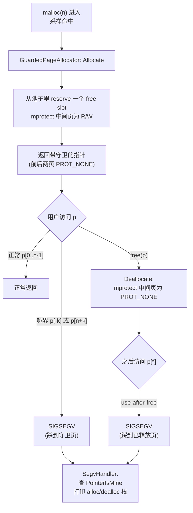

# 第十九章 · 调试分配器:guarded page、sanitizer、随机化

> 篇:P6 安全、调试与对照
> 主线呼应:前面 18 章我们一直在攻"快"和"省"——本地缓存换无锁、中心链表换批量、大页治碎片、`madvise` 还 OS。这一章转到另一条战线:**在又快又省的前提下,还能不能抓内存错误**。use-after-free、堆溢出、double-free 这类错误有个共同特点——开发机和压测环境复现不出来,偏偏上线后某个稀有的时序、某个罕见的分配路径上发作,生产进程莫名其妙崩在 `free` 之后的某次访问,堆栈指向一堆被覆盖过的指针。这一章要回答的问题是:怎么让分配器**在生产环境、release 编译、零侵入**地,以一个可控的小代价,把这类错误"撞进守卫页、当场 SIGSEGV、带完整调用栈"。四套分配器给出了三种风格各异的答案:tcmalloc 的概率守卫页(GWP-ASAN)、jemalloc 的 sanitizer 集成、mimalloc 的随机化布局 + free list 编码。

## 核心问题

**release 模式下,程序在生产环境偶发性崩溃,堆栈指向一段已被释放的内存,开发者手里只有一份 core dump 和一句"use-after-free"。怎么在不拖慢 fast path、不让用户重编一遍程序的前提下,抓到这类内存错误?**

读完本章你会明白:

1. **守卫页怎么抓溢出/UAF**:给一个分配前后各夹一个不可读不可写的页,越界写或释放后再访问立刻 SIGSEGV——这是 ASan 的"重型方案"在生产里的轻量替代。
2. **为什么守卫页只能概率开**:每个守卫分配要多占页且要走 `mmap`/`mprotect`,不能对全部分配开。tcmalloc 的 GWP-ASAN 用一个固定大小(默认 512 slot)的"守卫页池"+ 采样,把代价摊到极少数分配上,以"低概率抓住、抓到就是赚到"换"零性能损失"。
3. **四套的调试武器各是什么**:tcmalloc 的 `GuardedPageAllocator`(守卫页 + SIGSEGV 捕获)、jemalloc 的 `san_*`(守卫页 + UAF junk 填充 + quarantine 延迟复用)、mimalloc 的 `random.c`(ChaCha20)+ free list 指针编码(`MI_ENCODE_FREELIST`)+ segment 守卫页、ptmalloc 的 Safe-Linking(tcache key 防 poisoning)。
4. **随机化为什么也算"调试"**:攻击者(以及一类偶发 bug)依赖"free list 的 next 指针就明文躺在释放块里"。把它用密钥 XOR+旋转编码,既防 tcache poisoning 这种漏洞利用,也让"释放块的 next 被踩坏"在 pop 时立刻暴露——安全和可靠调试共享同一组机制。

> **如果一读觉得太难**:先只记住三件事——① 守卫页 = 给分配前后夹不可写页,越界/释放后访问立即段错误;② 只能**概率**开,因为代价是内存和 `mprotect` 调用,全开 fast path 就废了;③ 四套里 tcmalloc 用它抓 UAF/溢出、jemalloc 用 junk+quarantine 检测 write-after-free、mimalloc 用随机化+指针编码既防攻击也防腐败、ptmalloc 用 Safe-Linking 防 tcache poisoning。

---

## 19.1 一句话点破

> **生产环境抓内存错误,核心矛盾是"既要 release 的性能,又要 debug 的可观测"。解法不是二选一,而是"概率守卫":用一个固定大小的池子,对极少数被采样命中的分配,把它们放进带守卫页的特殊内存里,越界/UAF 当场 SIGSEGV 并打印分配/释放时的调用栈;对绝大多数分配照旧走快路径。代价是平均几 KB 内存和几乎为零的 fast path 开销,换来的是"低频但确定地"抓到那些压测永远复现不出来的线上 UAF。**

这是结论,不是理由。本章倒过来拆:先看 ASan 为什么不能上生产,再守卫页到底怎么工作,再 tcmalloc 的 GWP-ASAN 怎么做到"概率 + 低代价",再四套各自的调试武器对照,最后回到主线——这一章服务的是"在快和省的前提下还能调试"这条支线。

---

## 19.2 为什么不直接用 ASan

讲调试内存错误,绕不开 AddressSanitizer(ASan)。ASan 是目前抓 UAF/溢出最锋利的工具:它给**每一个**分配前后都插入 redzone(中毒区),每一次访存都编译期插桩检查阴影内存(shadow memory),越界、释放后访问、double-free 基本一抓一个准。

那为什么生产环境不用 ASan?因为它太贵:

| ASan 的代价 | 量级 | 后果 |
|------|------|------|
| 内存占用 | ~2~3 倍(redzone + shadow) | 服务 RSS 翻倍,直接超配额 |
| CPU 开销 | ~2 倍(每次访存插桩查 shadow) | 吞吐减半,latency 翻倍 |
| 需要重编 | 整个程序 + 所有动态库都要 `-fsanitize=address` | 线上发布的二进制不能直接换 |

> **不这样会怎样**:把 ASan 开着上生产,RSS 翻倍、吞吐减半——这不是"调试",这是"自杀"。所以 ASan 的标准用法是**只在测试环境、fuzz、压测复现时开**,生产里关掉。

但问题是,UAF 这类错误最可恶的地方在于:**它在测试环境死活不复现,偏偏在生产里某个稀有的并发时序上发作**。ASan 开不起来,关了又抓不到,这就是矛盾。

GWP-ASAN(Guarded Page Allocator,Google 内部叫 GWP-ASAN,后开源进 tcmalloc 和 Chromium)就是为这个矛盾量身定制的中间方案:

> **不是给每个分配都加守卫页(那是 ASan,太贵),而是给极少数、被采样命中的分配加守卫页。代价恒定(一个固定大小的守卫页池),fast path 几乎零开销(只在采样命中时走慢路径),换来的是"低概率但确定地"在生产里抓到 UAF。**

这是"采样"思想在调试领域的应用——和 P5-18 讲的几何采样 profiling 是同一种哲学:**不是每次都做,而是按概率做,把代价摊到可控的水平**。

---

## 19.3 守卫页:让越界/UAF 当场 SIGSEGV

先把"守卫页"这件事本身讲清楚,它不复杂,但妙在朴素。

### 19.3.1 不这样会怎样:线上 UAF 难复现

设想一段最朴素的 UAF:

```c
char *p = malloc(64);
free(p);
// ... 几百行代码后,某个错误路径上 ...
p[0] = 'A';   // use-after-free
```

`free(p)` 之后,那 64 字节被放回 free list,等着被下一次同 size 的 `malloc` 复用。在 `free` 和那个错误访问之间,可能有别的 `malloc` 把这块内存重新发出去、写了别的数据。于是 `p[0] = 'A'` 实际写到了**另一个活对象**的内存上——程序不会立刻崩,而是等到那个活对象被它的主人读取时,行为才异常。这时候 core dump 的堆栈指向的是"被踩的那个活对象的读取处",**和真正的错误现场隔了十万八千里**。

> **不这样会怎样**:UAF 最致命的不是"会崩",而是"崩的地方和错的的地方不在一起"。你拿到 core dump,看到的是受害者,不是凶手。线上这类 bug,平均要花一个资深工程师几天到几周才能定位。

### 19.3.2 所以这样设计:前后夹守卫页

守卫页的思路直接得不能再直接:**给一块分配,前后各夹一个被 `mprotect(..., PROT_NONE)` 设成"不可读不可写"的页**。任何越界访问(写溢出写到下一页、读下溢读到上一页)或者释放后再访问(那块被标 `PROT_NONE`),都会**立刻触发 SIGSEGV**——崩溃现场就是错误现场。

```
 一个被守卫的分配在虚拟内存里的布局(slot 模型,tcmalloc):
 ┌─────────┬──────────────────────┬─────────┐
 │ guard   │  可用的分配(≤1页)    │ guard   │
 │ PROT_NONE│  PROT_READ|WRITE     │ PROT_NONE│
 │ page    │                      │ page    │
 └─────────┴──────────────────────┴─────────┘
     ↑                                       ↑
  下溢读/写                           上溢写/读
  buf[-k] 立即 SEGV                   buf[size+k] 立即 SEGV

 释放后:把中间那页也 mprotect(PROT_NONE)。
 之后任何访问 buf[*] —— use-after-free —— 立即 SEGV。
```

这里有一个细节值得展开:**为什么是"页"为粒度,不是字节**。因为 `mprotect` 是按页操作的(操作系统管内存最小单位是页,见 P0-01)。所以守卫的最小代价是"前后各多一页",而一页是 4KB。这意味着:**给一个 64 字节的分配加守卫,实际占用 3 页 = 12KB**——内存放大 192 倍。这就是为什么守卫页绝不能对全部分配开的根本原因。

> **钉死这件事**:守卫页的代价是"每个守卫分配多占 2 页(前后各一)+ 一次 `mprotect` syscall"。所以它**只能概率性、采样地**给极少数分配开。这是 GWP-ASAN 全部设计的出发点。

### 19.3.3 用一张图看清触发链



这张图把守卫页的完整生命周期画完了:分配时给中间页解保护、释放时再保护起来,任何越界或 UAF 都撞进 `PROT_NONE` 的页,内核抛 SIGSEGV,分配器注册的 handler 接住、定位是哪个 slot、打印分配和释放时的调用栈。下面我们落到 tcmalloc 的真实源码,看每一步具体怎么实现。

---

## 19.4 tcmalloc 的 GuardedPageAllocator:GWP-ASAN 落地

tcmalloc 是四套里把 GWP-ASAN 做得最完整的。整个机制由一个 `GuardedPageAllocator` 类承担,源码在 [guarded_page_allocator.h](../tcmalloc/tcmalloc/guarded_page_allocator.h) 和 [guarded_page_allocator.cc](../tcmalloc/tcmalloc/guarded_page_allocator.cc)。

### 19.4.1 数据结构:一个固定大小的池子

先看类头部的关键常量和数据结构 [guarded_page_allocator.h:73-76](../tcmalloc/tcmalloc/guarded_page_allocator.h#L73-L76):

```cpp
class GuardedPageAllocator {
 public:
  // Maximum number of pages this class can allocate.
  static constexpr size_t kGpaMaxPages = 512;
```

**`kGpaMaxPages = 512`** 是 GWP-ASAN 代价的硬上限——整个进程最多同时有 512 个被守卫的分配。这是一个**固定常数**,意味着无论程序分配多少次、跑多久,GWP-ASAN 占的内存都被钉死在 `512 * 3 页 ≈ 6MB` 量级。这就是"概率守卫"的精髓:**代价恒定,不随负载增长**。

每个 slot(槽位)的元数据在 [guarded_page_allocator.h:210-218](../tcmalloc/tcmalloc/guarded_page_allocator.h#L210-L218):

```cpp
struct SlotMetadata {
  GuardedAllocationsStackTrace alloc_trace;     // 分配时的调用栈
  GuardedAllocationsStackTrace dealloc_trace;   // 释放时的调用栈
  size_t requested_size = 0;
  std::align_val_t requested_alignment;
  uintptr_t allocation_start = 0;
  std::atomic<int> dealloc_count = 0;           // 释放计数——抓 double-free
  bool write_overflow_detected = false;         // 释放时检测到的写溢出
};
```

注意两点:① 每个槽位**同时记了分配栈和释放栈**——这正是 UAF 报告能告诉你"这块内存是在哪里分配的、又是在哪里被释放的、而现在被谁误用"的全部信息;② `dealloc_count` 是个原子计数器,专门用来抓 double-free(后面讲)。

### 19.4.2 内存布局:2N+1 页的精心设计

`Init` 之后会调 `MapPages` 把池子真正映射出来 [guarded_page_allocator.cc:386-419](../tcmalloc/tcmalloc/guarded_page_allocator.cc#L386-L419),核心是这一句:

```cpp
// Maps 2 * total_pages_ + 1 pages so that there are total_pages_ unique pages
// we can return from Allocate with guard pages before and after them.
void GuardedPageAllocator::MapPages() {
  ...
  size_t len = (2 * total_pages_ + 1) * page_size_;     // L390
  auto base_addr = reinterpret_cast<uintptr_t>(
      tc_globals.system_allocator().MmapAligned(len, page_size_, ...));   // L392
  ...
}
```

注释把设计意图写得很清楚:**映射 `2N+1` 页,是为了让 N 个可用页每个都"前后各有一个守卫页"**。布局长这样:

```
 池子的物理布局(假设 total_pages = N):
 ┌──┬──┬──┬──┬──┬──┬──┬──┬──┬──┬──┐
 │G │P0│G │P1│G │P2│G │...│G │PN-1│G │
 └──┴──┴──┴──┴──┴──┴──┴──┴──┴──┴──┘
   ↑     ↑     ↑           ↑
 奇数索引是 guard(PROT_NONE),偶数索引是可分配页(PROT_READ|WRITE)。
 第 0 个和最后一个是边界 guard。
 一共 (2N+1) 页:N 个可用 + (N+1) 个守卫。
```

`first_page_addr_` 在 [guarded_page_allocator.cc:416](../tcmalloc/tcmalloc/guarded_page_allocator.cc#L416) 算出来,指向第一个**可分配**的页(跳过最开头的边界守卫页)。从这往后,奇偶相间——偶数偏移是可用页,奇数偏移是守卫页。`GetNearestValidPage` 在 [guarded_page_allocator.cc:472-488](../tcmalloc/tcmalloc/guarded_page_allocator.cc#L472-L488) 就靠"`offset/page_size` 是不是偶数"来分辨访问落在了可用页还是守卫页——这种"用奇偶布局代替额外元数据"的做法,既是 O(1) 又省内存。

### 19.4.3 采样门:TrySample 为什么这么严

不是每个 `malloc` 都能进守卫池——进守卫池前要过一道采样门 `TrySample` [guarded_page_allocator.cc:99-166](../tcmalloc/tcmalloc/guarded_page_allocator.cc#L99-L166)。这段代码值得逐段读,因为它把"概率守卫"的所有取舍都写出来了。

**第一关:太大不要** [guarded_page_allocator.cc:102-105](../tcmalloc/tcmalloc/guarded_page_allocator.cc#L102-L105):

```cpp
if (num_pages > Length(1)) {
  skipped_allocations_toolarge_.Add(1);
  return {nullptr, Profile::Sample::GuardedStatus::LargerThanOnePage};
}
```

只接受**单页以内**的分配。原因前面说过——守卫的代价是前后各一页,如果对象本身就跨多页,把它放进守卫池要么守卫失效(对象自己就横跨守卫页)、要么布局复杂化。所以 GWP-ASAN 只覆盖"单页内的小对象",而这恰恰是 UAF 最高发的区段。

**第二关:总采样率约束** [guarded_page_allocator.cc:107-143](../tcmalloc/tcmalloc/guarded_page_allocator.cc#L107-L143):

```cpp
const int64_t guarded_sampling_interval =
    Parameters::guarded_sampling_interval();
if (guarded_sampling_interval < 0) {
  return {nullptr, Profile::Sample::GuardedStatus::Disabled};      // 负值=完全关
}
...
const int64_t ratio = (num_sampled * 10) / num_guarded;
if (guarded_sampling_interval * 10 > ratio * profile_sampling_interval) {
  return {nullptr, Profile::Sample::GuardedStatus::RateLimited};   // 速率超限,拒绝
}
```

这里的逻辑有点绕,但意图很清楚:**守卫采样的频率,不能超过 profile 采样的某个倍数**。`guarded_sampling_interval` 是"每多少个被 profile 采样的分配,挑一个去做守卫"。注释 [guarded_page_allocator.cc:117-124](../tcmalloc/tcmalloc/guarded_page_allocator.cc#L117-L124) 给了精确的不等式:

> `num_guarded * guarded_interval > num_sampled * profile_interval` 时拒绝。

翻译成人话:**别让守卫池被填爆**。守卫池只有 512 个 slot,如果采样率太高、池子老是满的,新分配永远抢不到 slot,等于没用。这个速率控制保证守卫池的占用率维持在一个健康水平。

**第三关:stacktrace filter** [guarded_page_allocator.cc:145-157](../tcmalloc/tcmalloc/guarded_page_allocator.cc#L145-L157):

```cpp
if (stacktrace_filter_.Contains({stack_trace.stack, stack_trace.depth})) {
  const size_t usage_pct = (allocated_pages() * 100) / max_allocated_pages_;
  if (rand_.Next() % 50 <= usage_pct) {
    stacktrace_filter_.Decay();
    skipped_allocations_filtered_.Add(1);
    return {nullptr, Profile::Sample::GuardedStatus::Filtered};
  }
}
```

这是个非常聪明的设计:**如果某个调用栈最近已经被守卫过了,就倾向于跳过它**。为什么?因为同一个调用点反复分配同一个对象,UAF 多半已经在第一次守卫时就抓到了(或者证明没问题);再去守卫它是浪费 slot。`DecayingStackTraceFilter`(声明在 [guarded_page_allocator.h:284](../tcmalloc/tcmalloc/guarded_page_allocator.h#L284))是一个会衰减的 bloom-filter-like 结构,让"最近被守卫过的栈"短期被屏蔽,把 slot 留给**没被覆盖过的新分配点**——这显著提高了单位 slot 的"抓 bug 效率"。

> **钉死这件事**:`TrySample` 三道门——太大不要、速率超限不要、最近守卫过的栈不要——共同把"哪个分配进守卫池"控制在一个**稀疏但有价值**的子集上。这正是 GWP-ASAN 能用 512 个 slot 抓到真实线上 UAF 的关键。

### 19.4.4 分配:挑随机 slot,解保护,记栈

过了三道门,进 `Allocate` [guarded_page_allocator.cc:168-221](../tcmalloc/tcmalloc/guarded_page_allocator.cc#L168-L221)。核心几步:

```cpp
GuardedAllocWithStatus GuardedPageAllocator::Allocate(
    size_t size, std::align_val_t alignment, const StackTrace& stack_trace) {
  const ssize_t free_slot = ReserveFreeSlot();              // L170
  if (free_slot == -1) {
    return {nullptr, Profile::Sample::GuardedStatus::NoAvailableSlots};
  }
  ...
  void* result = reinterpret_cast<void*>(SlotToAddr(free_slot));

  if (size > 0) {
    if (mprotect(result, page_size_, PROT_READ | PROT_WRITE) == -1) {  // L184
      ... return {nullptr, ...MProtectFailed};
    }
    // Place some allocations at end of page for better overflow detection.
    MaybeRightAlign(free_slot, size, alignment, &result);              // L193
  }

  // Record stack trace.
  SlotMetadata& d = data_[free_slot];
  ... memcpy(d.alloc_trace.stack, stack_trace.stack, ...);             // L204
  d.alloc_trace.depth = stack_trace.depth;
  d.alloc_trace.thread_id = absl::base_internal::GetTID();
  d.dealloc_trace.depth = 0;
  ...
  return {result, Profile::Sample::GuardedStatus::Guarded};
}
```

三个要点:

1. **`ReserveFreeSlot` 在 [guarded_page_allocator.cc:422-446](../tcmalloc/tcmalloc/guarded_page_allocator.cc#L422-L446) 随机挑一个空 slot**——`GetFreeSlot` 在 [guarded_page_allocator.cc:448-456](../tcmalloc/tcmalloc/guarded_page_allocator.cc#L448-L456) 用 `rand_.Next() % total_pages_` 取随机起点再找最近的空位。**为什么随机**:让分配点对应到 slot 的映射不可预测,既防攻击者推断布局,也让 UAF 复现路径多样(同一分配点每次落到不同 slot,bug 暴露概率更高)。
2. **`mprotect(..., PROT_READ | PROT_WRITE)` 在 L184**:把池子初始时全 `PROT_NONE` 的中间页,解保护成可读写——这是这个分配能被用户用的前提。
3. **`MaybeRightAlign` 在 L193** 是个微妙技巧(见 [guarded_page_allocator.h:262](../tcmalloc/tcmalloc/guarded_page_allocator.h#L262) 的 `ShouldRightAlign`:偶数 slot 右对齐):**把分配挪到 slot 的右端**。为什么?因为绝大多数写溢出是"往后多写了几个字节",右对齐后这些溢出正好踩到右守卫页,立即 SEGV;如果一律左对齐,小的溢出可能落在 slot 内部的 padding 上(被 magic byte 占着,见下面 Deallocate 的 `WriteOverflowOccurred`),抓不到。**一半 slot 左对齐抓下溢、一半右对齐抓上溢**——这是个典型的"对称设计覆盖两类错误"。

### 19.4.5 释放:抓 double-free、抓写溢出、quarantine

`Deallocate` 在 [guarded_page_allocator.cc:232-285](../tcmalloc/tcmalloc/guarded_page_allocator.cc#L232-L285),信息密度很高,我们分段读。

**抓 double-free** [guarded_page_allocator.cc:240-242](../tcmalloc/tcmalloc/guarded_page_allocator.cc#L240-L242):

```cpp
if (d.dealloc_count.fetch_add(1, std::memory_order_relaxed) != 0) {
  ForceTouchPage(ptr);   // 已经 free 过了 —— 故意踩这一页,触发 SEGV
}
```

`dealloc_count` 是原子的(声明在 [guarded_page_allocator.h:216](../tcmalloc/tcmalloc/guarded_page_allocator.h#L216))。第一次 free 时它从 0 变 1,正常往下走;第二次 free 时它从 1 变 2,`fetch_add` 返回旧值 1(非 0)——**知道这是 double-free,故意 `ForceTouchPage` 把这块内存踩一下,触发 SEGV**,让 SegvHandler 报 "DoubleFree"(`ForceTouchPage` 在 [guarded_page_allocator.cc:224-230](../tcmalloc/tcmalloc/guarded_page_allocator.cc#L224-L230),是个 `NORETURN` 的死循环写,确保一定触发)。

**抓写溢出(magic byte)** [guarded_page_allocator.cc:255-269](../tcmalloc/tcmalloc/guarded_page_allocator.cc#L255-L269):

```cpp
if (d.requested_size > 0) {
  if (WriteOverflowOccurred(slot)) {            // L258 检查右端的 magic byte
    d.write_overflow_detected = true;
  }
  TC_CHECK_EQ(0,
      mprotect(reinterpret_cast<void*>(page_addr), page_size_, PROT_NONE));  // L265

  if (d.write_overflow_detected) {
    ForceTouchPage(ptr);   // 检测到写溢出 —— 触发 SEGV 报告
  }
}
```

`WriteOverflowOccurred` 在 [guarded_page_allocator.cc:494-499](../tcmalloc/tcmalloc/guarded_page_allocator.cc#L494-L499) 检查分配右端的一串 magic byte(`kMagicSize = 32` 字节,见 [guarded_page_allocator.h:221](../tcmalloc/tcmalloc/guarded_page_allocator.h#L221))有没有被改写。**为什么需要这个,不是有守卫页吗**:因为右对齐的分配,溢出会立刻踩右守卫页 SEGV;但**左对齐的分配,小的右端溢出会落在 slot 内部的 padding**(分配右端到 slot 末尾还有一段空间)——这部分不踩守卫页,不会 SEGV。所以在 free 时主动检查 magic byte,**把"释放时才发现的延迟型溢出"也抓出来**。这是守卫页(抓大溢出)和 magic byte(抓小溢出)的互补设计。

**quarantine(隔离)** [guarded_page_allocator.cc:264-265](../tcmalloc/tcmalloc/guarded_page_allocator.cc#L264-L265):

```cpp
TC_CHECK_EQ(0,
    mprotect(reinterpret_cast<void*>(page_addr), page_size_, PROT_NONE));   // L265
```

`free` 之后,**这个 slot 不立即归还给可用池,而是被 `mprotect(PROT_NONE)` 标成不可访问**——这就是 quarantine(隔离)。它要等到 `FreeSlot` 在 [guarded_page_allocator.cc:283-284](../tcmalloc/tcmalloc/guarded_page_allocator.cc#L283-L284) 被调用(slot 才重新可用)。在 quarantine 期间,任何对这个指针的访问都是 UAF,立刻 SEGV。**quarantine 的时间长短,直接决定了能抓到多晚的 UAF**——池子越大、slot 周转越慢,UAF 窗口越长。这是 GWP-ASAN 的"内存换调试窗口"权衡:512 slot 听起来不多,但配合随机选取,足够覆盖大多数 1~60 秒内的延迟 UAF。

### 19.4.6 SIGSEGV 捕获:把现场翻译成人话

光抓到 SEGV 还不够,内核默认的 core dump 只告诉你"踩了地址 0x...",不告诉你"这是哪次分配、谁分配的、谁释放的"。tcmalloc 注册了 SIGSEGV handler 来做这件事 [segv_handler.cc:144-212](../tcmalloc/tcmalloc/segv_handler.cc#L144-L212):

```cpp
void SegvHandler(int signo, siginfo_t* info, void* context) {
  if (signo != SIGSEGV) return;
  void* fault = info->si_addr;                                       // L146 出错地址
  if (!tc_globals.guardedpage_allocator().PointerIsMine(fault)) return;  // L147

  GuardedAllocationsStackTrace *alloc_trace, *dealloc_trace;
  GuardedAllocationsErrorType error =
      tc_globals.guardedpage_allocator().GetStackTraces(fault, &alloc_trace,
                                                        &dealloc_trace);    // L151
  ...
  TC_LOG("*** GWP-ASan ... has detected a memory error ***");
  TC_LOG(">>> Access at offset %v into buffer of length %v", offset, size);
  TC_LOG("Error originates from memory allocated in thread %v at:",
         alloc_trace->thread_id);
  PrintStackTrace(alloc_trace->stack, alloc_trace->depth);            // L166 分配栈

  switch (error) {
    case GuardedAllocationsErrorType::kUseAfterFree:
    case GuardedAllocationsErrorType::kUseAfterFreeRead:
    case GuardedAllocationsErrorType::kUseAfterFreeWrite:
      TC_LOG("The memory was freed in thread %v at:", dealloc_trace->thread_id);
      PrintStackTrace(dealloc_trace->stack, dealloc_trace->depth);    // L173 释放栈
      TC_LOG("Use-after-free %s occurs in thread %v at:",
             WriteFlagToString(write_flag), current_thread);
      RecordCrash("GWP-ASan", "use-after-free");
      break;
    ...
  }
}
```

**核心思路**:`PointerIsMine` 在 [guarded_page_allocator.h:175-179](../tcmalloc/tcmalloc/guarded_page_allocator.h#L175-L179) 判断出错地址是不是落在守卫池范围内(`pages_base_addr_ <= addr < pages_end_addr_`)——只有是,这次 SEGV 才可能是 GWP-ASAN 抓到的错误(否则交给原来的 handler,见 [segv_handler.cc:217-233](../tcmalloc/tcmalloc/segv_handler.cc#L217-L233) 的 `ForwardSignal`)。然后 `GetStackTraces` 通过地址反查到 slot,把当时记下的 alloc/dealloc 栈都打印出来。

注意 `ExtractWriteFlagFromContext` 在 [segv_handler.cc:76-95](../tcmalloc/tcmalloc/segv_handler.cc#L76-L95) 还能从 `ucontext` 里提取**这次访问是读还是写**——x86-64 上看 `REG_ERR` 的 bit 1,arm64 上看 `ESR` 的 WNR 位。这把 UAF 进一步细分成 `kUseAfterFreeRead`/`kUseAfterFreeWrite`,对定位"是误用读还是误用写"很有用。这种"从架构寄存器里抠出错信息"的细节,是系统编程里很值钱的一手——见 P5-18 采样那章也是从 `ucontext` 取信息。

handler 的注册在 [segv_handler.cc:240-251](../tcmalloc/tcmalloc/segv_handler.cc#L240-L251),用 `LowLevelCallOnce` 保证只装一次,并且**保留老的 handler**(`old_segv_sa`)——出错地址不在守卫池范围内时,`ForwardSignal` 把信号转发回去,不影响程序原有的 SEGV 处理(比如别的 sanitizer、Java VM 的 signal handler)。

---

## 19.5 四套横评:各自的调试武器

tcmalloc 把 GWP-ASAN 做成了主菜,但 jemalloc、mimalloc、ptmalloc 也各有调试武器,设计哲学不同。这一节做四套对照。

### 19.5.1 jemalloc:guard page + UAF junk + quarantine

jemalloc 的 sanitizer 集成在 [src/san.c](../jemalloc/src/san.c) 和 [include/jemalloc/internal/san.h](../jemalloc/include/jemalloc/internal/san.h)。它有两套机制:

**机制一:extent 级别的 guard page**。jemalloc 给**大块 extent**(large allocation)和**小对象 slab**(small slab)按采样间隔加守卫页。核心函数 `san_guard_pages` 在 [san.c:62-91](../jemalloc/src/san.c#L62-L91):

```c
void
san_guard_pages(tsdn_t *tsdn, ehooks_t *ehooks, edata_t *edata, emap_t *emap,
    bool left, bool right, bool remap) {
  ...
  size_t size_with_guards = edata_size_get(edata);
  size_t usize = (left && right)
      ? san_two_side_unguarded_sz(size_with_guards)
      : san_one_side_unguarded_sz(size_with_guards);

  void *guard1, *guard2, *addr;
  san_find_guarded_addr(edata, &guard1, &guard2, &addr, usize, left, right);
  ...
  ehooks_guard(tsdn, ehooks, guard1, guard2);          // L80 —— 调 mprotect PROT_NONE

  edata_size_set(edata, usize);
  edata_addr_set(edata, addr);
  edata_guarded_set(edata, true);
  ...
}
```

jemalloc 的做法是:**在 extent 的元数据 `edata` 上加一个 `guarded` 标志位**,加守卫页时通过 `san_find_guarded_addr`([san.c:21-39](../jemalloc/src/san.c#L21-L39))把可用地址往内挪一页(`*addr = ((byte_t *)*addr) + SAN_PAGE_GUARD`),让出前后两页给 `ehooks_guard` 去 `mprotect`。**为什么这么设计**:因为 jemalloc 的 extent 是它的核心管理单位(P2-07 讲过),守卫信息天然挂在 extent 上,不必像 tcmalloc 那样单独搞一个池子——jemalloc 复用了 extent 的生命周期。`SAN_PAGE_GUARD = PAGE`(一页,见 [san.h:10](../jemalloc/include/jemalloc/internal/san.h#L10))。

是否加守卫页由 `san_large_extent_decide_guard` 在 [san.h:86-113](../jemalloc/include/jemalloc/internal/san.h#L86-L113) 决定:用 tsd 里一个倒计数 `tsd_san_extents_until_guard_large`,每来一个大 extent 减 1,减到 1 时就给下一个加守卫页并重置成 `opt_san_guard_large`。这是个**确定性的采样间隔**(不是 tcmalloc 那种概率采样),默认值 `SAN_GUARD_LARGE_EVERY_N_EXTENTS_DEFAULT = 0` 即关闭,通过 `MALLOC_CONF` 调成比如 `"san_guard_large:8"` 开启。**和 tcmalloc 的关键区别**:tcmalloc 把守卫限定在一个固定大小池子,代价恒定;jemalloc 不限池子大小,代价是"每 N 个 extent 多占 2 页"——更可控的采样间隔,但没有 tcmalloc 那种"绝对不会爆内存"的硬上限。

**机制二:UAF junk 填充 + quarantine(延迟复用)**。jemalloc 还有一套抓 UAF 的机制,基于"释放后把内存填上特征值,延迟一段时间才复用"。junk 值定义在 [san.h:19](../jemalloc/include/jemalloc/internal/san.h#L19):

```c
static const uintptr_t uaf_detect_junk = (uintptr_t)0x5b5b5b5b5b5b5b5bULL;
```

这是个精心选的魔数(`0x5b` 重复)——既不是 `0`(容易和零内存混淆),也不是 `0xff`(容易和已分配内存混淆),也不是 ASan 用的 `0xbe`。释放时,如果开了 UAF 检测,会调用 `san_junk_ptr`([san.h:169-181](../jemalloc/include/jemalloc/internal/san.h#L169-L181))往释放的内存里写这个值:

```c
static inline void
san_junk_ptr(void *ptr, size_t usize) {
  if (san_junk_ptr_should_slow()) {
    memset(ptr, (char)uaf_detect_junk, usize);          // 慢路径:全填
    return;
  }
  // 快路径:只填首、中、尾三个 8 字节位置
  void *first, *mid, *last;
  san_junk_ptr_locations(ptr, usize, &first, &mid, &last);
  *(uintptr_t *)first = uaf_detect_junk;
  *(uintptr_t *)mid = uaf_detect_junk;
  *(uintptr_t *)last = uaf_detect_junk;
}
```

**为什么有快慢两条路径**:慢路径全填最稳,但要写满整个对象,对大对象开销大;快路径只填首中尾三个采样点,覆盖"最常见的 UAF 写入位置"(开头和结尾),开销极小。`san_junk_ptr_should_slow` 在 [san.h:160-167](../jemalloc/include/jemalloc/internal/san.h#L160-L167) 决定走哪条——`config_debug` 模式或小对象走慢路径,大对象走快路径。

**这套机制怎么抓 UAF**:释放的内存被填上 junk + 进入 quarantine(延迟复用),之后**如果有人误写它,junk 就被覆盖了**。等这块内存真正被复用前,jemalloc 会调 `san_check_stashed_ptrs`([san.c:174-191](../jemalloc/src/san.c#L174-L191))复查 junk 还在不在:

```c
void
san_check_stashed_ptrs(void **ptrs, size_t nstashed, size_t usize) {
  for (size_t n = 0; n < nstashed; n++) {
    void *stashed = ptrs[n];
    ...
    if (unlikely(san_stashed_corrupted(stashed, usize))) {       // L184 junk 被改
      safety_check_fail(
          "<jemalloc>: Write-after-free "
          "detected on deallocated pointer %p (size %zu).\n",    // L187
          stashed, usize);
    }
  }
}
```

如果 junk 被改了,说明这块内存在被 free 之后被写过——`safety_check_fail` 报告 write-after-free。这套机制比 tcmalloc 的守卫页**轻**(没有 `mprotect` syscall、没有额外页),但**只能抓写、抓不到读**,而且**抓 bug 的时机是被动的**(等复用时才发现,可能延迟很久)。两套机制其实是互补的:tcmalloc 的守卫页抓"立即的 UAF(读和写)",jemalloc 的 junk+quarantine 抓"延迟的 write-after-free"。两者都不像 ASan 那样全分配覆盖,都是采样/概率。

### 19.5.2 mimalloc:随机化 + free list 指针编码 + segment 守卫页

mimalloc 走的是另一条路:**它不主动抓 UAF,而是用"随机化布局 + 指针编码"让 UAF 和 free list corruption 既难被攻击者利用、也更容易在偶发错误下暴露**。这套机制主要在 [src/random.c](../mimalloc/src/random.c)、[src/segment.c](../mimalloc/src/segment.c) 和 free list 的编码逻辑里。

**机制一:ChaCha20 高质量 PRNG**。mimalloc 不用 `rand()`(有锁、不定时延),而是自带一个 ChaCha20 流密码当 PRNG [random.c:47-79](../mimalloc/src/random.c#L47-L79):

```c
static void chacha_block(mi_random_ctx_t* ctx) {
  uint32_t x[16];
  for (size_t i = 0; i < 16; i++) {
    x[i] = ctx->input[i];
  }
  for (size_t i = 0; i < MI_CHACHA_ROUNDS; i += 2) {    // 20 轮
    qround(x, 0, 4,  8, 12);
    qround(x, 1, 5,  9, 13);
    ... 8 次 qround
  }
  for (size_t i = 0; i < 16; i++) {
    ctx->output[i] = x[i] + ctx->input[i];
  }
  ...
}
```

注释 [random.c:13-18](../mimalloc/src/random.c#L13-L18) 解释得很清楚:**用密码学级 PRNG,不是追求性能,而是追求安全**——因为 free list 的密钥(下面讲)如果被推断出来,整个 free list 编码就形同虚设。ChaCha20 足够强,攻击者无法从已知的几个 next 指针反推 key。初始化在 [random.c:179-205](../mimalloc/src/random.c#L179-L205),优先用 OS 提供的安全随机源(`/dev/urandom` 或 `getrandom`),失败时退化到 `_mi_os_random_weak`([random.c:167-177](../mimalloc/src/random.c#L167-L177),基于 ASLR 地址 + 时钟的弱随机),并在 `weak` 标志位上记下来,等拿到真随机后用 `_mi_random_reinit_if_weak` 升级。

**机制二:free list 指针编码**。这是 P1-04 略过的安全维度,这里补全。mimalloc 的 free list 把 `next` 指针**用密钥 XOR + 旋转**编码后存,而不是明文存。编码在 [internal.h:803-806](../mimalloc/include/mimalloc/internal.h#L803-L806):

```c
static inline mi_encoded_t mi_ptr_encode(const void* null, const void* p, const uintptr_t* keys) {
  uintptr_t x = (uintptr_t)(p==NULL ? null : p);
  return mi_rotl(x ^ keys[1], keys[0]) + keys[0];   // XOR key1, 旋转 key0 位, 加 key0
}

static inline void* mi_ptr_decode(const void* null, const mi_encoded_t x, const uintptr_t* keys) {
  void* p = (void*)(mi_rotr(x - keys[0], keys[0]) ^ keys[1]);
  return (p==null ? NULL : p);
}
```

每个 page 有自己的两个 64 位 key,在 page 初始化时随机生成 [page.c:726-727](../mimalloc/src/page.c#L726-L727):

```c
#if (MI_PADDING || MI_ENCODE_FREELIST)
page->keys[0] = _mi_heap_random_next(heap);
page->keys[1] = _mi_heap_random_next(heap);
#endif
```

`push`/`pop` free list 时(`mi_block_set_nextx`/`mi_block_nextx`,[internal.h:818-840](../mimalloc/include/mimalloc/internal.h#L818-L840))都走 encode/decode。**这套机制既防攻击者也防 bug**:

- **防攻击(tcache poisoning / free list 注入)**:攻击者就算知道某个释放块的地址、想伪造一个 next 指针指向自己控制的内存,因为没有 key 也无法构造合法的编码值——pop 出来的指针解码后不是合法地址,会被 `mi_block_next` 在 [internal.h:847-849](../mimalloc/include/mimalloc/internal.h#L847-L849) 的 `mi_is_in_same_page` 检查发现,触发 `_mi_error_message` 报错。
- **防偶发 bug**:如果某段代码意外踩坏了释放块的 next 字段(典型 UAF),decode 出来的指针多半不合法,pop 时立刻报"corrupted free list entry"——比 ptmalloc 那种"next 被踩、free list 整条乱掉、崩在随机位置"友好得多。

**机制三:segment 守卫页**。开了 `MI_SECURE`(`MI_SECURE>=1`)时,mimalloc 给每个 segment 的头尾各加一个被保护的页 [segment.c:949-961](../mimalloc/src/segment.c#L949-L961):

```c
// set up guard pages
size_t guard_slices = 0;
if (MI_SECURE>0) {
  // in secure mode, we set up a protected page in between the segment info
  // and the page data, and at the end of the segment.
  size_t os_pagesize = _mi_os_page_size();
  _mi_os_protect((uint8_t*)segment + mi_segment_info_size(segment) - os_pagesize,
                 os_pagesize);                                                // L955 段头守卫
  uint8_t* end = (uint8_t*)segment + mi_segment_size(segment) - os_pagesize;
  mi_segment_ensure_committed(segment, end, os_pagesize);
  _mi_os_protect(end, os_pagesize);                                          // L958 段尾守卫
  if (slice_entries == segment_slices) segment->slice_entries--;
  guard_slices = 1;
}
```

**和 tcmalloc/jemalloc 的本质区别**:tcmalloc/jemalloc 的守卫页是**针对单个分配**的(为了抓那个特定分配的溢出/UAF),代价高、只能采样;mimalloc 的守卫页是**针对 segment**的(segment 是 mimalloc 向 OS 要内存的单位,通常 64MB,见 P2-07),**每个 segment 都加,代价摊到大量分配上可以忽略**。它的目的不是抓单个对象的 UAF,而是**抓 segment 元数据被踩坏**——segment 头里存着 free list、page 表等关键结构,被越界写就全完了。守卫页让"踩到 segment 元数据的越界"立即暴露。这是个"防御纵深"的设计:对象内部的错误靠 free list 编码暴露,对象外部的越界靠 segment 守卫页暴露。

> **对比一句话**:tcmalloc 守卫页"重而准,抓单个 UAF,概率开";jemalloc 守卫页"中等,挂在 extent 上,间隔开";jemalloc junk"轻,抓延迟 WAF";mimalloc 编码"轻,防攻击 + 抓 free list 腐败,永远开";mimalloc segment 守卫"轻,防 segment 元数据被踩,secure 模式开"。

### 19.5.3 ptmalloc:Safe-Linking 防 tcache poisoning

ptmalloc(baseline)没有 GWP-ASAN 这种主动抓 UAF 的机制——它在这条战线上做得最少,这本身就是它作为 baseline 的"反衬价值"。但它有一个值得讲的安全机制:**Safe-Linking**(glibc 2.32+ 引入),防 tcache poisoning 攻击。

ptmalloc 的 tcache(per-thread cache,P1-05 讲过)是一个单链表,每个释放块的 `next` 指针明文存在块里。这给了一个经典攻击面:攻击者只要能往某个释放块的 `next` 字段写一个受控地址,就能让下一次 `malloc` 返回任意地址——这就是 tcache poisoning,是近年 CTF 和真实漏洞里最常见的堆利用原语之一。

Safe-Linking 的思路和 mimalloc 几乎一模一样(事实上 mimalloc 的设计在前,ptmalloc 是借鉴):**把 `next` 指针和"它自己地址的高位"做 XOR**。伪代码(简化示意,非源码原文):

```c
// 存 next(实际是 PROTECT_PTR):
#define PROTECT_PTR(pos, ptr)   ((void *)((((size_t)(pos)) >> 12) ^ ((size_t)(ptr))))
// 取 next(实际是 REVEAL_PTR):
#define REVEAL_PTR(ptr)         PROTECT_PTR(&ptr, ptr)
```

`pos >> 12` 是因为 x86-64 上指针的高位(页号部分)对同一页内的 free chunk 是固定的——XOR 这个值相当于"用 chunk 自己的位置当 key"。攻击者不知道 chunk 的精确地址(尤其有 ASLR),就无法构造合法的编码 next。

> **对比**:mimalloc 用的是**独立的随机 key + 旋转**,强度更高(每 page 不同 key);ptmalloc 用的是**地址派生 key**(同一 chunk 位置固定),强度较低但开销也低(不必存 key、不必初始化 RNG)。ptmalloc 选这个折中,是因为它没有 mimalloc 那种"每 heap 一份 RNG"的基建——baseline 的局限。具体行号请核对在线 [malloc.c](https://github.com/glibc/glibc/blob/main/malloc/malloc.c) 的 `PROTECT_PTR`/`REVEAL_PTR` 宏定义和 tcache 的 `key` 字段(`tcache_key`,glibc 2.34+ 还加了 double-free 检测用的随机 key)。

**ptmalloc 在主动调试上基本缺席**:它没有守卫页机制(只能靠 ASan 这种外部工具)、没有 quarantine(tcache 立即复用,所以 ptmalloc 的 UAF 窗口极短、最难抓)、没有 free list 编码直到很晚才有(Safe-Linking 是 2.32 才加)。这正是新一代分配器(tcmalloc/jemalloc/mimalloc)把"调试和安全"作为设计目标的对照价值——ptmalloc 的"不管"反衬出前三套的"主动管"。

### 19.5.4 四套调试特性对照表

| 维度 | tcmalloc | jemalloc | mimalloc | ptmalloc(baseline) |
|------|----------|----------|----------|----------|
| **守卫页(单分配)** | 有,GWP-ASAN,512 slot 池 + 概率采样 | 有,挂在 extent 上,采样间隔可配 | 无(只在 segment 级) | 无 |
| **守卫页(segment/extent)** | 池子整体受 `PointerIsMine` 守 | extent 加守卫后 `guarded` 标志 | `MI_SECURE` 时 segment 头尾各一页 | 无 |
| **UAF 检测** | 守卫页 `PROT_NONE` 立即 SEGV(读+写) | junk(`0x5b5b...`)+ quarantine,延迟复用时查 | free list 编码会暴露踩坏 | tcache key 检测 double-free(2.34+) |
| **溢出检测** | 守卫页抓大溢出 + magic byte 抓小溢出 | 守卫页 | segment 守卫页 + padding(`MI_PADDING`) | chunk 边界检查(有限) |
| **double-free 检测** | `dealloc_count` 原子计数 | tcache 有防护 | free list 编码 + 内部检查 | tcache 随机 key(2.34+) |
| **随机化** | slot 随机选取(`rand_.Next()`) | 池子内随机 | ChaCha20 PRNG + free list key + 布局随机 | Safe-Linking 地址派生 key |
| **free list 指针保护** | (无,但守卫池外的 fast path 不暴露) | (无显式编码) | `MI_ENCODE_FREELIST`:XOR+旋转,每 page 双 key | Safe-Linking:地址高位 XOR |
| **开关方式** | 默认开(可通过 `TCMALLOC_SAMPLE_PARAMETER` 调) | `MALLOC_CONF` 调 `san_guard_large`/`san_guard_small`/`lg_san_uaf_align` | 编译期 `MI_SECURE`/`MI_ENCODE_FREELIST` | glibc 2.32+ 默认 Safe-Linking |
| **代价模型** | 固定 ~6MB 池 + 采样分配走慢路径 | 每 N 个 extent 多占 2 页 | 每次编码/解码 ~5 条指令 + secure 模式每 segment 多 2 页 | XOR 几乎为零 |
| **抓 bug 哲学** | 概率守卫,撞进 PROT_NONE 立即崩 | 采样守卫 + junk 复查 | 随机化让攻击和腐败自暴露 | 主要靠外部 ASan |

这张表把四套的设计取向讲清了:**tcmalloc 是"主动抓 UAF/溢出"的标杆**(GWP-ASAN 是它对工业界最大的贡献之一,被 Chrome、Android、KernelSanitizer 广泛采用);**jemalloc 是"guard page + junk 双保险"**(更偏工程化、可配);**mimalloc 是"安全和调试合一"**(用密码学编码一举解决攻击和偶发腐败);**ptmalloc 是"基本不管"**(只能靠外部 ASan)。

---

## 19.6 技巧精解:guarded page 抓溢出/UAF 的三个非显然设计

这一节把守卫页机制里**最容易写错、最不显然**的三个技巧单独拆透。每个配反面对比——"不这么写会怎样"。

### 19.6.1 技巧一:2N+1 页布局 + 奇偶分辨,免去元数据查找

回看 [guarded_page_allocator.cc:386-388](../tcmalloc/tcmalloc/guarded_page_allocator.cc#L386-L388) 的 `MapPages`:`len = (2 * total_pages_ + 1) * page_size_`。这个 `2N+1` 不是随便选的,它配合 [guarded_page_allocator.cc:472-488](../tcmalloc/tcmalloc/guarded_page_allocator.cc#L472-L488) 的 `GetNearestValidPage`,实现了一个非常妙的性质:

> **给定任意地址,用 `(offset / page_size) % 2 == 0` 一个表达式就能判断它落在可用页还是守卫页——O(1)、零额外内存。**

为什么能这样?因为池子是精心布局的:偶数偏移是可用页,奇数偏移是守卫页,严格相间。`first_page_addr_` 指向第一个可用页(偏移 0),`first_page_addr_ + page_size_` 就是第一个守卫页(偏移 1),依此类推。SIGSEGV 时,handler 拿到出错地址,只要 `(addr - first_page_addr_) / page_size` 算个偏移、看奇偶,就知道**这个地址是想访问哪个可用 slot、然后踩到了哪边的守卫页**——是上溢(踩前守卫)还是下溢(踩后守卫),还是 UAF(踩中间已释放页)。

> **反面对比**:假设我们不用 2N+1 相间布局,而是用"分配 + 两个守卫页"三页一组紧密排列(每个 slot 自带前后守卫),那地址到 slot 的反查就复杂了——需要除以 3(三页一组),还涉及组内偏移分类。更糟的是,如果守卫页和可用页大小不一(比如对齐要求),反查就得查表。tcmalloc 的 2N+1 把这层元数据查找彻底消灭,所有判断用一次除法 + 一次取模搞定——这对 SIGSEGV handler 这种"信号上下文里、能用栈很小、不能持锁"的极端环境至关重要。

`GetNearestValidPage` 在 [guarded_page_allocator.cc:472-488](../tcmalloc/tcmalloc/guarded_page_allocator.cc#L472-L488) 还有个细节:如果出错的地址落在守卫页的"前半页",返回前一个可用页(下溢);落在"后半页",返回后一个可用页(上溢)——`kHalfPageSize = page_size_ / 2` 那几行([guarded_page_allocator.cc:483-487](../tcmalloc/tcmalloc/guarded_page_allocator.cc#L483-L487))就是干这个的。这让错误报告能告诉你"这个越界访问离哪个合法分配最近",定位更精确。

### 19.6.2 技巧二:右对齐对称设计,让上下溢都能抓到

[guarded_page_allocator.cc:193](../tcmalloc/tcmalloc/guarded_page_allocator.cc#L193) 的一行 `MaybeRightAlign(free_slot, size, alignment, &result)` 背后是个深刻的观察:

> **绝大多数写溢出是"往尾巴后面多写了几个字节",而不是"往头前面少写了"。如果一律把分配左对齐到 slot 起点,小的写溢出会落在 slot 内部的 padding 区(分配右端到页末),踩不到右守卫页,不会 SEGV。**

`ShouldRightAlign` 在 [guarded_page_allocator.h:262](../tcmalloc/tcmalloc/guarded_page_allocator.h#L262) 用 `slot % 2 == 0` 决定——**一半 slot 左对齐,一半右对齐**:

- 左对齐的 slot:抓**下溢**(往前往前踩前守卫页)和**对齐 padding 的右端写溢出**(靠 magic byte 抓,见 19.4.5);
- 右对齐的 slot:抓**上溢**(往尾巴后踩右守卫页,这是最常见的溢出模式)和**对齐 padding 的左端越界**(靠前守卫页)。

这就是"对称设计覆盖两类错误"。**为什么不全部右对齐**(既然上溢更常见)?因为下溢(`buf[-k]`)虽然少见但确实存在(比如循环边界算错、负索引),全部右对齐会让下溢全部落进 padding 抓不到。50/50 对称是最稳的——任何一种错误模式,都有至少一半的 slot 能抓到它。

右对齐还有个 bonus:右对齐后,分配的左端到 slot 起点之间的 padding 会被 `MaybeRightAlign` 写上 magic byte(见 [guarded_page_allocator.cc:255-259](../tcmalloc/tcmalloc/guarded_page_allocator.cc#L255-L259) 的 `WriteOverflowOccurred` 路径)。所以**右对齐的 slot,既靠左守卫页抓大下溢、又靠 magic byte 抓小下溢**;左对齐的 slot 反过来,靠右守卫页抓大上溢、靠 magic byte 抓小上溢。每类 slot 都是"守卫页 + magic byte"双重保险,只是方向相反。

> **反面对比**:假设全部左对齐、不用 magic byte,会发生什么?那么 64 字节的分配放在 4KB slot 的最左端,右端有 4032 字节的 padding。一个典型的 `buf[64] = 'A'`(off-by-one)溢出,会无声无息地写进 padding——既不踩右守卫页、也没人检查 magic byte,**bug 永远抓不到**。等它哪天因为别的 slot 复用、padding 被覆盖才偶然暴露,debug 时机已经过去了。tcmalloc 的右对齐 + magic byte,就是为这种"小溢出"准备的网。

### 19.6.3 技巧三:`dealloc_count` 原子 + ForceTouchPage,抓 double-free 不破坏原栈

[guarded_page_allocator.cc:240-242](../tcmalloc/tcmalloc/guarded_page_allocator.cc#L240-L242) 的 double-free 抓法值得专门讲:

```cpp
// On double-free, do not overwrite the original deallocation metadata, so
// that the report produced shows the original deallocation stack trace.
if (d.dealloc_count.fetch_add(1, std::memory_order_relaxed) != 0) {
  ForceTouchPage(ptr);
}
```

三个非显然的细节:

**① 用 `fetch_add` 而不是 `++`**。`fetch_add` 是原子操作,保证多线程同时 double-free 同一个指针时,只有一个线程看到返回值非 0(进入 `ForceTouchPage`)、其他线程看到的是已经被 +1 后的值。如果用普通 `++`,两个线程可能同时读到 0、同时 +1、都以为自己是第一个 free——double-free 检测失效。`memory_order_relaxed` 足够,因为我们只关心原子性不关心顺序(不需要和其他变量建立 happens-before)。

**② `ForceTouchPage` 是 `NORETURN` 的死循环写**([guarded_page_allocator.cc:224-230](../tcmalloc/tcmalloc/guarded_page_allocator.cc#L224-L230)):

```cpp
static ABSL_ATTRIBUTE_NOINLINE ABSL_ATTRIBUTE_NORETURN void ForceTouchPage(void* ptr) {
  // Spin, in case this thread is waiting for concurrent mprotect() to finish.
  for (;;) {
    *reinterpret_cast<volatile char*>(ptr) = 'X';
  }
}
```

为什么是死循环?因为**当前线程可能正在和另一个线程的 `mprotect` 竞争**——另一个线程正在把这个页 `mprotect(PROT_NONE)`,当前线程的写可能踩在保护完成之前。死循环写确保只要 `mprotect` 一完成,下一次写一定触发 SEGV。`volatile` 防止编译器优化掉这个写。

**③ 注释里那句"do not overwrite the original deallocation metadata"是关键**。double-free 报告最有用的是**第一次 free 的栈**,不是第二次(第二次往往是误用代码,容易看出来)。所以这里**故意不覆盖 `dealloc_trace`**——即使这是第二次、第三次 free,报告里打印的还是第一次 free 的位置。`ForceTouchPage` 触发 SEGV 后,handler 在 [segv_handler.cc:192-196](../tcmalloc/tcmalloc/segv_handler.cc#L192-L196) 报 `kDoubleFree`,把第一次 free 的栈和这次 free 的栈都打出来——开发者一眼就能看到"这块内存被释放了两次,分别在 A 处和 B 处"。

> **反面对比**:假设我们朴素地写 double-free 检测——`if (d.dealloc_count++ > 0) abort();`,会发生什么?① 非原子,多线程 double-free 漏报;② `abort` 不走 SIGSEGV handler,handler 注册的那些"打印 alloc/dealloc 栈"的逻辑都跑不到,只能拿到一个光秃秃的 core dump;③ 即使走 handler,如果每次 free 都覆盖 `dealloc_trace`,那报告里只剩最近一次 free 的栈,可能和误用现场栈重复、失去信息。tcmalloc 这三行代码,把原子性、handler 触发、元数据保留三件事一次做对——这是系统编程里"看似简单实则讲究"的典型。

---

## 章末小结

这一章是支线,但回答了一个工业级分配器绕不开的问题:**怎么在又快又省的前提下,还能在生产抓内存错误**。我们没有发明新数据结构,但把"采样"这个 P5-18 立起来的思想,用到了调试领域——守卫页太贵,那就概率开;junk 检测太弱,那就配合 quarantine;free list 腐败难抓,那就用密码学编码让它自暴露。

四套分配器在这条战线上姿态迥异,但都有个共同信念:**UAF 和溢出这类错误太狡猾,不能光指望测试环境,生产环境必须有低代价的兜底**。tcmalloc 把它做成了 GWP-ASAN 这个工业标杆,jemalloc 用工程化的可配项兜底,mimalloc 用密码学随机化把"安全"和"调试"合一,ptmalloc 在这条战线上基本缺席(反衬价值)。

> **打个比方**(只在理解这条支线时点一下):前三篇的"三层快慢道"是分配器的**主业**(批发转零售,要快又要省);这一章讲的调试机制,是分配器的**安检员**——平时不出场(代价太大),按概率抽查(守卫页采样)、抽查到违规立即拉警报(SIGSEGV 带栈)。安检员不能让工厂停工(不能拖垮 fast path),但偶尔查出一次重大隐患(UAF),就值回所有代价。这个比方我们点到此,后面不展开。

回到主线:这一章服务的是"**在快和省的前提下还能调试**"这条支线——它不直接让 fast path 更快、也不直接让 slow path 更省,但它保证了"快和省"不至于以"线上抓不到 bug"为代价。它和 P5-18 的采样 profiling 是孪生兄弟:都是用"概率"换"低代价的可观测性"。读完这一章,你应该能在脑子里放映出一次被守卫的 malloc 的一生——它怎么从 `TrySample` 三道门进来、怎么在池子里挑一个随机 slot、怎么被 `mprotect` 解保护、被释放后又怎么被保护起来等 UAF、出错时怎么被 SegvHandler 翻译成"分配于 A、释放于 B、误用于 C"的人话报告。

### 五个"为什么"清单

1. **为什么生产环境不能用 ASan?** ASan 给每个分配加 redzone、给每次访存插桩,内存 ~2~3 倍、CPU ~2 倍,且要重编整个程序。线上开 ASan 等于自杀。所以 ASan 只在测试/fuzz 用,生产需要更轻的方案。
2. **为什么守卫页只能概率开?** 每个守卫分配多占 2 页(前后各一)+ 一次 `mprotect` syscall。对 64 字节对象放大 192 倍。全开 fast path 就废了。tcmalloc 用固定 512 slot 的池子 + 采样,把代价钉死在 ~6MB。
3. **GWP-ASAN 凭什么抓到偶发的线上 UAF?** 三件事配合:① 采样让一部分分配进守卫池(覆盖面);② slot 随机选取让同一分配点的不同实例都可能被守卫(多样性);③ quarantine 让释放后的 slot 暂不归还,延长 UAF 检测窗口(时间覆盖)。三者乘起来,大多数 1~60 秒内的 UAF 都能被覆盖到。
4. **jemalloc 的 junk+quarantine 和 tcmalloc 的守卫页有何取舍?** tcmalloc 守卫页"重而准":立即 SEGV,读和写都抓,但要 `mprotect` + 额外页。jemalloc junk"轻而被动":无 syscall,但只抓写、且要等复用时才发现。两套互补:tcmalloc 抓"立即的 UAF",jemalloc 抓"延迟的 write-after-free"。
5. **mimalloc 的 free list 指针编码凭什么同时防攻击和帮调试?** `next` 用 ChaCha20 派生的双 key 做 XOR + 旋转编码。攻击者不知道 key 无法伪造合法 next(防 tcache poisoning);偶发 bug 踩坏 next 后,decode 出来的指针非法,`mi_is_in_same_page` 检查立刻报"corrupted free list",而不是让 free list 整条乱掉崩在随机位置。同一套机制,安全和可靠调试共享。

### 想继续深入往哪钻

- **想看完整的 GWP-ASAN 报告长什么样**:在测试程序里故意制造 UAF,设置 `TCMALLOC_SAMPLE_PARAMETER=1`(让每次 profile 采样都尝试守卫),跑一遍看 stderr 的 `*** GWP-ASan ... has detected a memory error ***` 输出——alloc/dealloc 栈、错误类型、读写区分都齐全。源码见 [segv_handler.cc:144-212](../tcmalloc/tcmalloc/segv_handler.cc#L144-L212)。
- **想调 jemalloc 的 sanitizer**:用 `MALLOC_CONF` 开启,例如 `MALLOC_CONF="san_guard_large:8,lg_san_uaf_align:3"`——每 8 个 large extent 给一个加守卫页、UAF 检测对齐到 8 字节。详见 [san.h:9-17](../jemalloc/include/jemalloc/internal/san.h#L9-L17) 的默认值和 [san.c:9-13](../jemalloc/src/san.c#L9-L13) 的 opt 变量。
- **想开 mimalloc 的 secure 模式**:编译时 `-DMI_SECURE=1` 或 `-DMI_SECURE=2`(`MI_SECURE>=2` 还会增加 free list 的随机化强度,见 [page.c:654-655](../mimalloc/src/page.c#L654-L655) 的 `MI_MIN_EXTEND`)。配合 `-DMI_ENCODE_FREELIST=1`(默认就是 1)开启指针编码。
- **想研究 GWP-ASAN 的工业采用**:Chromium 的 [GWP-ASAN 文档](https://google.github.io/tcmalloc/gwp-asan.html)(segv_handler.cc:162 的 TC_LOG 里就有这个链接)、Android 的 MTE-vs-GWP-ASAN 对比、Linux 内核的 KASAN-KFENCE(把 GWP-ASAN 思路搬到内核态)——都是同源思想。
- **ptmalloc 的 Safe-Linking**:看在线 [malloc.c](https://github.com/glibc/glibc/blob/main/malloc/malloc.c) 搜 `PROTECT_PTR`/`REVEAL_PTR` 宏和 `tcache_key` 字段,glibc 2.32 引入 Safe-Linking、2.34 加 tcache double-free 检测的随机 key,是 ptmalloc 在这条战线上罕见的进步。

### 引出下一章

这一章我们拆了四套的调试武器,但都是"分头讲"。下一章(P6-20)会把四套分配器做一张**全维度对照总表**——架构层次、size class 策略、并发模型、fast path 实现、归还策略、大页支持、profiling、加上这一章的调试特性——让前面 19 章的所有取舍在一张大表里一眼看清,并讲新一代分配器的演进趋势(per-CPU 取代 per-thread、arena-less 设计、huge page aware 成标配、meshing 紧凑化)。那张表是全程对比的收束,读完它,你就拿到了"为什么这四套各自这么设计、它们在代际上谁领先谁"的全景。
