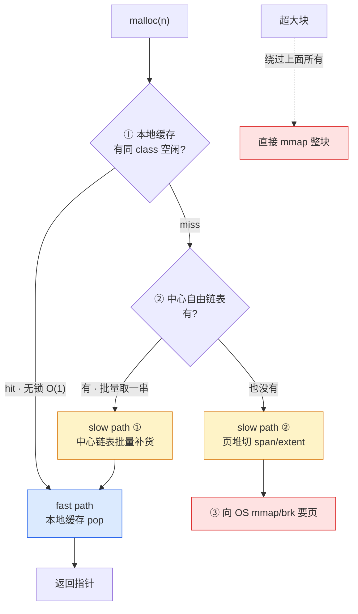
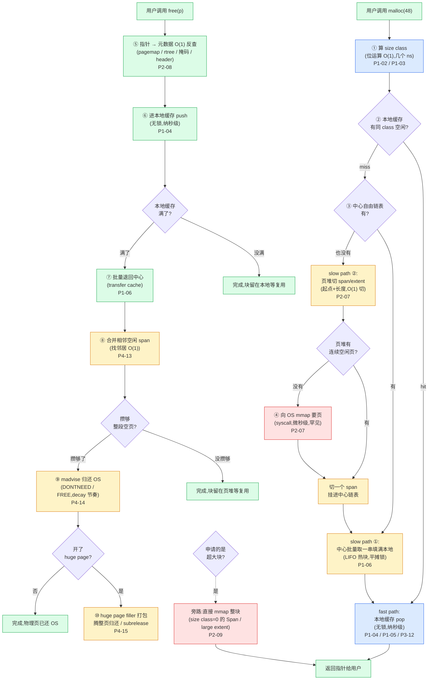

# 第二十一章 · 全景脉络与权衡哲学

> 篇:P7 收束
> 主线呼应:这是全书的最后一章。前面 20 章,我们沿着"一次 `malloc` 的一生"一个驿站一个驿站地走过来——第 1 章立起"三层快慢道"和"局部缓存 vs 中心堆"的二分法,第 1 篇拆 size class、对齐、自由链表、线程缓存、中心链表,第 2 篇拆页堆、span、pagemap、大块,第 3 篇拆多核下的三种解并发方案,第 4 篇拆碎片治理与归还,第 5 篇拆初始化、fork、profiling,第 6 篇拆安全调试与四套对照。每一步,我们都在回答同一个问题:"这一层凭什么又快又省、为什么这么设计、源码里那段原子操作或 `madvise` 到底在干什么"。这一章不再引入新源码,只做一件事:**把 20 章里的那些"为什么"收束成五条贯穿全书的哲学,再放映一次 `malloc` 从被调用到内存归还的完整旅程**。读完这一章,你应该能在脑子里不看源码地讲清楚——一个指针是怎么被要出来、被释放、被合并、被归还的全过程,以及每一步背后那个设计者的权衡。

## 核心问题

**走了 20 章,讲了 size class、对齐、自由链表、线程缓存、中心链表、页堆、pagemap、大块、arena、per-CPU、合并、`madvise`、huge page filler、初始化、fork、profiling、guarded page——这堆机制能不能压缩成几条主线?当你在白板上看到一段陌生的分配器源码,凭什么一眼判断"这段在干嘛、它为什么这么写、它在为快服务还是为省服务、它用了哪一类技巧"?**

读完本章你会明白:

1. **五条贯穿哲学**:三层快慢道是通用骨架,size class 换 O(1)、本地缓存换无锁,快与省是永恒张力,大页是当代代差,所有技巧都服务于"纳秒级 fast path + 不泄漏不碎片"。
2. **一条完整的旅程**:一次 `malloc(48)` 从算 size class 到返回指针、一次 `free(p)` 从指针反查到 `madvise` 归还的全路径,以及它怎么在四套分配器里各自走完。
3. **一个判读源码的框架**:看到任何一段分配器代码,问三件事——它在 fast path 还是 slow path?它在为快服务还是为省服务?它用的是哪一类技巧(无锁原子、TLS、位运算、分级索引、`madvise`、缓存行、采样、rseq)?
4. **全书的二分法最后一次回扣**:所有的精妙,最终都可以归到"局部缓存(快)"和"中心堆(省)"两面,以及两者在中间层的衔接。

> **如果一读觉得太多**:先只记住三件事——① 三层快慢道是骨架,频率逐层下降,syscall 被挡在最底层;② fast path 用本地缓存换无锁、slow path 用批量换省;③ 大页(per-CPU、HPAA)是新一代相对 ptmalloc 的核心进步。这三条够你建立心智模型,其余是细节。

---

## 21.1 一句话点破

> **所有现代内存分配器,都在解同一个问题——把"操作系统按页批发、每次索取付 syscall 代价"的物理现实,适配到"程序一秒百万次、大小不一、几十线程并发"的使用模式。四套分配器(tcmalloc / jemalloc / mimalloc / ptmalloc)给出的答案高度同构:用三层快慢道把"快"和"省"分工到不同层、不同频率;用几十个 size class 把任意大小换算成 O(1) 的查表;用线程/CPU 私有缓存把 fast path 做到无锁纳秒级;用合并、`madvise`、大页把 slow path 做到低碎片、低占用。每个看似诡异的技巧——next 藏进释放块、rseq、radix tree、几何采样、huge page filler——都是为这条总目标服务的工具,没有一个是炫技。**

这是结论,不是理由。本章倒过来拆:先把五条哲学一条条立起来(每条都回指全书哪里印证),再用一张"一次 malloc 的完整旅程"大图把 20 章串成一条线,最后回到二分法,给一个读到这里的你一个判读源码的框架。

---

## 21.2 哲学一:三层快慢道是通用骨架

第一条哲学,也是全书的**地基**。第 1 章(P0-01)我们一上来就立了它:任何一个现代分配器,其内存分配的路径都是一条**三级降级链**:

**三层不是巧合,是物理现实逼出来的**。第 1 章那个"钉死"还记得吗?操作系统按页(4KB)批发内存、每次索取付 syscall 代价(数百纳秒到几微秒),而程序一秒可能 `malloc` 上百万次、大小不一。如果每一次 `malloc` 都直接 `mmap`,要么 syscall 把 CPU 拖垮,要么按页浪费。所以分配器必须做一件事:**把"向 OS 批发"和"向用户零售"在频率上彻底解耦**。三层快慢道,就是这种解耦的具体形式。

**关键不是"分了三层",而是"频率逐层下降"**。fast path(本地缓存)命中是纳秒级,每秒能跑上千万次;中心链表批量取是偶尔触发的中频操作(每次锁开销被批量平摊到几十块);向 OS 要页是罕见的低频事件。三层的好处不是"多了两层缓存",而是**把昂贵的操作(锁、合并、syscall)放到低频层去做,让高频层只做最便宜的事**。

> **钉死这件事**:三层快慢道的本质是"分层 + 分频率"。fast path 高频、只做最便宜的无锁操作;slow path 低频、可以做昂贵的整理(合并、`madvise`、大页打包)。这不是设计选择,是物理约束——一秒百万次的 `malloc` 容不下任何昂贵操作在高频层出现。

**四套分配器在骨架上完全同构,差异只在每层的"招数"**。第 1 章末尾给过那张对照表,这里再压一遍:

| 层 | tcmalloc | jemalloc | mimalloc | ptmalloc(baseline) |
|----|----------|----------|----------|----------|
| **本地缓存**(fast path) | `CpuCache`(per-CPU)/ `ThreadCache`(legacy) | `tcache`(`cache_bin`) | thread-local `heap` 的 page free list | `tcache`(2.26+) |
| **中心自由链表** | `central_freelist` + `transfer_cache` | arena 的 `bin` | segment 里的 page | fastbin/smallbin/largebin |
| **页堆** | `page_allocator`(span + pagemap / HPAA) | extent + emap(rtree / hpa) | segment / arena(mmap) | top chunk + brk/mmap |
| **超大块** | size class=0 的 Span(HPAA 时代统一) | large(直接 extent) | 直接大 mmap | mmap(DEFAULT_MMAP_THRESHOLD ~128KB) |

每一层都能在第 1~4 篇里找到专章拆透的对应。骨架是普适的,招数是各有取舍的——这是横评四套分配器的全部意义。

**回指全书哪里印证**:第 1 章立三层快慢道(P0-01 §1.5);第 5~6 章拆本地缓存和中心链表怎么衔接(P1-05 线程本地缓存、P1-06 中心自由链表与 transfer cache);第 7~9 章拆页堆三层(P2-07 span/extent、P2-08 pagemap/rtree、P2-09 大块旁路);第 14 章(P4-14 §14.2 为什么 5)专门解释为什么"`madvise` 归还只在 slow path 最末端做"——这是"分频率"的具体落地。

---

## 21.3 哲学二:用 size class 换 O(1)、用本地缓存换无锁

第二条哲学,讲 fast path 凭什么**纳秒级**。`malloc` 是每秒百万次的高频操作,fast path 上容不下任何昂贵的东西——不能查哈希表、不能扫链表、不能加锁、不能访存太多次。两条核心机制,把 fast path 的常数压到了极限。

### 用 size class 换 O(1)

第 2 章(P1-02)讲 size class 时,我们点破了一个反直觉:分配器**不按你申请的大小原样分配**,而是把所有大小**凑整成几十个"分级"**(size class),每个分级一条链。这看起来在浪费内存(要 17B 给 32B,15B 浪费成内部碎片),但它是 fast path O(1) 的前提——

> **不这样会怎样**:如果不凑整、每个 size 一条链,你会撞上"free list 数量爆炸(上千条)、元数据爆炸、锁爆炸、批量瓦解"四连崩(P1-02 五个为什么 1)。如果反过来用一个统一大小的块,小对象是绝对主力,内部碎片会爆炸到 90%+。

凑整成几十个 class,换来的是 `size → class` 这条最热路径**几条指令算完**:tcmalloc 用一个 377 字节的扁平数组下标(`>>3`/`>>7+120` 两次位移,P1-02 技巧精解),jemalloc 大对象用纯位运算(`lg_floor` + 分组数学,P1-03 五个为什么 4),mimalloc 用 `(size+7)>>3` 直接得到 page。**位运算或扁平数组,二选一,绝不用循环、绝不用二分**。一次 `malloc` 的第一步——算出 size class——就是这么便宜。

### 用本地缓存换无锁

光有 size class 还不够。即使 `size → class` 是 O(1),如果这条 free list 是**全局共享**的,那 push/pop 还是要抢锁——而第 5 章(P1-05)讲透了,fast path 上任何一把锁(哪怕无争用 30ns 的 mutex)在高并发下都会被争用拖到微秒级,还会因共享缓存行触发核间 invalidate。

解法是把 free list **每线程/CPU 一份**:

> **所以这样设计**:线程/CPU 私有的 free list,因为不共享,所以不需要锁,普通的指针读改写就 sound。fast path 就是一次 TLS 读(一条 `mov`)+ 一次 `pop`(两次指针赋值),全程纳秒级。

四套分配器在这"一份私有缓存"上的实现各有不同,但核心思想一致:tcmalloc 新版走 per-CPU(第 12 章 P3-12,每个 CPU 核一份 slab,靠 rseq 解决被抢占撕裂)、jemalloc 走 per-thread tcache(第 5 章 P1-05 + 第 11 章 P3-11 的 arena 内 bin 锁细分)、mimalloc 走 per-thread heap(第 1 章 §1.6)、ptmalloc 也是 per-thread tcache(glibc 2.26 才加,正好反衬"老分配器没这层为什么慢")。

**这一哲学的精髓是"换"**:size class 用 10%~12% 的内部碎片,换来了 fast path 的 O(1) 和高并发低争用;本地缓存用"每份囤一些块、总占用变高"(N 个线程 × 每份囤货),换来了 fast path 的无锁。第 1 章那张"快 vs 省的张力表"(P0-01 §1.8)写得清清楚楚:fast path 的每一个优点,背后都标着一个"省"维度的代价。

> **钉死这件事**:fast path 纳秒级不是天上掉下来的。它是用"凑整的内部碎片"换 O(1)、用"每份缓存囤货的总占用"换无锁——每一次"快"的提升,都对应一次"省"的让步。三层快慢道之所以是三层,就是为了让这些"让步"被 slow path 兜住。

**回指全书哪里印证**:第 2 章 size class(P1-02)、第 3 章对齐(P1-03,讲为什么边界是 2 的幂、为什么对齐到 64 字节缓存行)、第 5 章线程本地缓存(P1-05)、第 11 章 jemalloc 多 arena(P3-11)、第 12 章 tcmalloc per-CPU(P3-12)。这一哲学是全书第 1 篇和第 3 篇的全部内容。

---

## 21.4 哲学三:快与省是永恒张力

第三条哲学,讲为什么需要三层、为什么不能只有一层。第 1 章(P0-01 §1.8)立起了"快与省的张力"这张表,这一章是它的总收束。

**张力来自哪里**?想要"快",fast path 就要无锁、不合并、不统计、不归还——这必然让"省"受损(本地囤货只进不出、RSS 高、外部碎片没人收)。想要"省",slow path 就要积极合并、`madvise` 归还——这必然让"快"受损(合并要扫邻居、归还要 syscall,这些都是慢操作)。

| 想要"快" | 牺牲"省" | 想要"省" | 牺牲"快" |
|----------|----------|----------|----------|
| 本地缓存无锁、囤货不还 | 总占用高、RSS 高 | 积极合并、归还 OS | 合并扫邻居、`madvise` syscall 慢 |
| size class 凑整(少查表) | 内部碎片 | 把缓存块尽快退回中心 | fast path miss 变多、锁开销回来 |
| fast path 不做合并、不做统计 | 碎片不收、不可观测 | 用大页压碎片 | 大页管理复杂、slow path 变重 |

**解法不是二选一,而是"分层 + 分频率"**。这条哲学是前两条哲学的"为什么":为什么需要三层快慢道?因为快和省拉扯,只能把两者放到不同的层、用不同的频率去做——

- **fast path 只管"快"**:无锁、O(1)、不合并、不统计、不归还。它的 KPI 是延迟。代价是它囤的块不还——但没关系,因为还有中心层兜底。
- **slow path 只管"省"**:批量取还(平摊锁)、合并碎片、`madvise` 归还、用大页。它的 KPI 是占用和碎片。它慢一点也没关系,因为它的**频率低**——fast path 命中率在 99% 以上,slow path 很少被触发。

这就是为什么"分频率"是三层快慢道的精髓:不是三层做同一件事,而是"快"和"省"分工到不同层,各按各的频率运转。

**这条张力的具体战场,集中在第 4 篇(碎片治理与归还)**:

- **合并(P4-13)**:外部碎片要靠合并收敛。`free` 是高频操作,合并要在 fast path 之外做——合并发生在 `free` 的 slow path,靠 pagemap/rtree O(1) 找邻居,然后改长度字段。第 13 章五个为什么里专门解释了"为什么不合并会出事"(碎片单调累积,长寿命服务 RSS 可能膨胀到工作集 10 倍)和"合并的难点在 O(1) 找邻居而不是并本身"。
- **`madvise` 归还(P4-14)**:攒够的空闲内存要还给 OS。这里有两个关键决策——用 `MADV_DONTNEED`(立刻清零还页,可能抖动)还是 `MADV_FREE`(惰性还,内存压力时回收);触发节奏怎么定(jemalloc 的 decay 时间衰减模型,tcmalloc 的 subrelease 自适应跳过)。第 14 章五个为什么 5 解释了为什么"归还只在 slow path 最末端做"——`madvise` 是微秒级 syscall,fast path 容不下;且 fast path 的块是高频复用的,对它归还必抖动。
- **huge page filler(P4-15)**:用 2MB 大页为单位管理,把碎片关在大页内、TLB miss 大幅下降。但 2MB 粒度太粗,需要 filler 把零散小对象挤进整页、需要 subrelease 把半空大页的空闲子页归还、需要 donated 大页的概念保护大块凑回整页的可能。

**这三件事——合并、归还、大页——都是"省"这一面的核心战场**。它们的共同特点是:**全是 slow path 操作、全靠 fast path 把频率压低,才能做这么"贵"的事**。如果 fast path 不够快(命中率不够高)、不够无锁(锁争用严重),这些 slow path 操作就会被频繁触发,分配器整体性能就垮。所以"快"和"省"不是对立,而是**互相成全**:fast path 越快,slow path 越有空间做省的整理;slow path 越省,fast path 囤的块越不会被浪费。

> **钉死这件事**:分配器不是在"快"和"省"之间二选一,而是把快交给高频的 fast path、把省交给低频的 slow path。三层快慢道就是在这两个极端之间,用"分层 + 分频率"找到的平衡点。全书第 4 篇(碎片治理与归还)是"省"这一面的全部战场。

**回指全书哪里印证**:第 1 章(P0-01 §1.8)立张力表;第 4 篇三章(P4-13 合并、P4-14 `madvise`/decay、P4-15 HPAA)是张力的主战场;第 14 章的"`madvise` 只在 slow path 末端"是"分频率"的具体落地;第 18 章几何采样为什么 4(采样点撒在字节流上,fast path 只多一条 `sub`)是张力在 profiling 维度的体现——"观测"也要绕开 fast path。

---

## 21.5 哲学四:大页(per-CPU、HPAA)是当代代差

第四条哲学,讲新一代分配器(tcmalloc 新版、jemalloc dev)相对 baseline ptmalloc 的**核心进步在哪**。横评四套,你会发现 ptmalloc 和 mimalloc 在三层骨架上和 tcmalloc/jemalloc 同构,真正的代差集中在两个机制:**per-CPU cache(tcmalloc)和 huge page aware(HPAA / hpa)**。

### per-CPU cache:把 fast path 的锁彻底消灭

第 12 章(P3-12)是全书性能核心的收束章。jemalloc 的多 arena(P3-11)把锁按"逻辑维度"摊开——横向按 arena(4×ncpu)、纵向按 size class(每个 bin 一把锁),锁的总数多了、每把的争用密度低了。但这条路有个天花板:**它治不了"跨核争用"本身**。绑在同一个 arena 上的线程,可能被调度到不同的物理核上,它们抢同一把 bin 锁时,锁的缓存行仍会在核间弹来弹去(cache line bouncing),一次抢锁就是一次跨核同步。

tcmalloc 新版走了更狠的一步:**让锁根本不跨核**。每个 CPU 核一份私有 slab,线程被调度到哪核就操作哪核的 slab,fast path 上**没有任何一把锁被两个核同时碰**。这是 tcmalloc 相对 jemalloc 的代差——它把 fast path 的锁彻底消灭了,代价是把正确性托付给了 Linux 的 rseq(restartable sequences)机制。

> **不这样会怎样**:per-thread cache 在线程数 ≫ 核数时撞三道墙——总占用爆炸(线程数 × 囤货)、迁移丢失局部性(cache 跟线程走)、false sharing(两个线程 cache 落同缓存行)。per-CPU 把 cache 按物理核组织(核数固定几十),三道墙一并解掉。代价是线程被抢占会撕裂操作,靠 rseq 解决(P3-12 五个为什么 1)。

**rseq 凭什么让 per-CPU 无锁不撕裂**?用户态把临界区起止地址写进 `__rseq_abi.rseq_cs`,内核在抢占/迁移线程前检查它:非空就把指令指针改成 abort IP(临界区入口前),让用户态重跑。已执行的部分写(per CPU 数据)要么完整提交、要么没生效(current 没更新,悬空写被下次覆盖)。所以任意核的 slab 永远处于一致状态,不需要锁(P3-12 五个为什么 2/3)。

### huge page aware:把碎片关进 2MB、把 TLB miss 压下去

第 15 章(P4-15)是"省"这一面的重头戏。传统分配器按 4KB 页管理,有两个硬伤:**TLB 容量有限**(典型 L1 dTLB 64 项,4KB 页下只覆盖 256KB,工作集大了大量 page table walk,每次几百纳秒);**外部碎片难压**(零散的空闲 4KB 页凑不成整块可用)。

用 2MB 大页替 4KB 页,一次解决两个问题:同样 64 项 TLB 覆盖 128MB;大页单位让归还变成"凑满 2MB 才还",碎片被关在大页内。但 2MB 粒度太粗——怎么把零散的几十字节到几 KB 的小对象挤进整张 2MB 大页?

tcmalloc 的 HPAA(`huge_page_aware_allocator.cc` + `huge_page_filler.h`)和 jemalloc 的 hpa(`hpa.c`/`hpdata.c`)给出了答案:**filler 打包 + subrelease + donated 大页**。第 15 章五个为什么 2/3/4 拆透了——filler 给大页按"最长空闲段 + 分配数"多级分组,贪心选择"优先填碎片多的";donated 大页(大块分配的零头)优先级低,是为了保护大块凑回整页的可能;subrelease 是半空大页的空闲 4KB 子页 `madvise` 归还,是整页归还的补救。

tcmalloc 和 jemalloc 在大页策略上有个根本区别(P4-15 五个为什么 5):tcmalloc 是"先大页后填"(HPAA 从底层按 2MB 组织,小对象挤进),大页覆盖率稳定但实现复杂;jemalloc 是"先填后 hugify"(先按 4KB 管理,满了再 `madvise(MADV_HUGEPAGE)` 合并),更渐进但 hugify 时机有延迟尖峰风险。

### 为什么这两件事是"代差"

**ptmalloc 和 mimalloc 在这两件事上缺席或较弱**。ptmalloc 既没有 per-CPU(它的多 arena 是逻辑维度的,跨核争用治不了),也没有 huge page aware(它的合并是被动的 `malloc_consolidate`)。mimalloc 走的是另一条路——per-thread heap + 随机化布局 + segment-abandon,在大页上较弱、在 per-CPU 上没有(它的并发模型更像 jemalloc 的多 arena 风格)。

所以**当代代差**的图景很清晰:tcmalloc 新版在并发上领先(per-CPU + rseq),jemalloc 在大页上更渐进(hpa + decay purge),ptmalloc 是 baseline(都弱),mimalloc 是新秀旁证(随机化、arena-abandon 独到,但并发和大页不是它的主战场)。第 6 篇第 20 章(四套对照总表)会用一张大表把这一切对齐——这里只是哲学层面的概括。

> **钉死这件事**:per-CPU + huge page aware,是新一代分配器相对 baseline ptmalloc 的核心进步。前者消灭了 fast path 的锁(治"快"),后者把碎片和 TLB miss 压低(治"省"和"稳")。它们各自有代价(tcmalloc 赌 rseq 普及、绑定 Linux;jemalloc 大页有延迟尖峰风险),但在当代服务(线程数远超核数、跑在 Linux 上)的场景下,这两个机制就是代差所在。

**回指全书哪里印证**:第 12 章(P3-12)拆 per-CPU + rseq;第 15 章(P4-15)拆 HPAA + filler;第 6 篇第 20 章用对照总表把代差对齐;第 1 章(P0-01 §1.4)用 ptmalloc 的三道墙(arena 锁争用、碎片压不住、tcache 是后加的)反衬这两件事的必要性。

---

## 21.6 哲学五:所有技巧都服务于"纳秒级 fast path + 不泄漏不碎片"

第五条哲学,是全书的**技巧总览**。前面 20 章,我们拆了一大堆看似诡异的 C/C++ 系统级技巧——无锁原子自由链表、rseq、TLS/tsd、`acquire`/`release` 内存序、size class 位运算映射、放射状 pagemap、radix tree、huge page filler 碎片打包、`madvise(MADV_DONTNEED)` vs `MADV_FREE`、缓存行对齐、几何采样、fork 的 prefork/postfork。每一个都不是炫技,都是为"纳秒级 fast path + 不泄漏不碎片"这个总目标服务的工具。

把这些技巧按**它们服务的目标**归一下类,全景就清晰了:

| 服务目标 | 核心技巧 | 出现在 |
|----------|----------|--------|
| **fast path 无锁纳秒级** | TLS 每线程一份 free list(P1-05)、per-CPU slab + rseq(P3-12)、自由链表把 next 藏进释放块(P1-04)、缓存行对齐防 false sharing(P1-03) | 第 1、3 篇 |
| **size → class 的 O(1)** | 位运算映射(tcmalloc 扁平数组、jemalloc `lg_floor`+分组)、对齐到 2 的幂(掩码代替除法) | 第 1 篇 |
| **slow path 批量 + 低争用** | transfer cache 批量取还(P1-06)、多 arena × bin 锁细分(P3-11)、LIFO 让块热乎(P1-06) | 第 1、3 篇 |
| **指针 → 元数据 O(1) 反查** | 放射状 pagemap(tcmalloc,O(1) 但吃内存)、radix tree(jemalloc,省内存多级)、地址掩码(mimalloc,零元数据)、chunk header(ptmalloc,贴头) | 第 2 篇 |
| **碎片治理** | 合并靠 pagemap/rtree O(1) 找邻居(P4-13)、huge page filler 碎片打包(P4-15)、donated 大页保护凑整(P4-15) | 第 4 篇 |
| **归还 OS** | `madvise(MADV_DONTNEED)` vs `MADV_FREE` 取舍(P4-14)、jemalloc decay 时间衰减模型(P4-14)、tcmalloc subrelease 自适应跳过(P4-14/15) | 第 4 篇 |
| **大页** | `MADV_HUGEPAGE` 主动 hugify(jemalloc)、HPAA 从底层按 2MB 组织(tcmalloc)、`MADV_COLLAPSE` 凑大页(tcmalloc) | 第 4 篇 |
| **工程化(能起步/fork/看见)** | bootstrap 自举(静态 buffer/早期 mmap,P5-16)、双 TLS(`__thread` + pthread key destructor,P5-16)、prefork 全收 postfork `mutex_init` 全放(P5-17)、几何采样用一次随机数预算间隔(P5-18) | 第 5 篇 |
| **安全调试(概率抓 bug)** | guarded page 概率采样(P6-19)、junk+quarantine(jemalloc)、free list 指针编码(mimalloc,ChaCha20 派生 key XOR+旋转) | 第 6 篇 |

**这张表是全书技巧的总地图**。任何一个技巧,你都能在这张表里找到它的位置——它服务哪个目标、在哪一章拆透。读到这里,你应该已经能在脑子里放映:一次 `malloc(48)`,从算 size class(位运算 O(1)),到本地缓存 pop(无锁,纳秒级),到 miss 时去中心链表批量补货(transfer cache,LIFO 热块),到中心也空时去页堆切 span(起点+长度两数建模,O(1) 切分),到超大块时直接 mmap(旁路)。以及 `free(p)` 反过来:指针反查(pagemap/rtree O(1)),进本地缓存(无锁 push),攒够了批量退回中心,中心攒够了合并(找邻居 O(1)),合并够大就 `madvise` 归还,有大页就 filler 打包腾整页。每一步都用到了表里某个技巧,没有一步是凭空的。

**这些技巧的共同特点是"反面对比显形"**。每一章的"技巧精解"小节,我们都做了同样的练习——"如果不用这个技巧、朴素地写,会撞上什么墙":

- 不把 next 藏进释放块,就要为每个空闲块开 node,空间翻倍 + cache miss + node 池套娃(P1-04 五个为什么 1)。
- 不用 per-CPU 而用 per-thread,线程数 ≫ 核数时总占用爆炸、迁移失局部性、false sharing(P3-12 五个为什么 1)。
- 不用 pagemap/rtree 而用哈希表反查,相邻指针被 hash 打散到不同桶,cache 不友好、有冲突、找前后邻居要各算一遍(P2-08 五个为什么 2)。
- 不用几何采样而用固定间隔,会和程序分配周期同频,系统性遗漏或过度采样(P5-18 五个为什么 2)。
- 不在 fork 前全收锁、fork 后 `mutex_init` 全放,子进程第一次 malloc 就死锁(P5-17 五个为什么 1/3)。

**每一个技巧,都是在"朴素方案会撞墙"的地方,用一种精妙的手段绕过去**。这就是本书"动机(why) + 技巧(how)双线"的全部意义——讲不清技巧,等于没讲分配器;讲清了技巧,你就理解了分配器的每一行源码在干什么、为什么这么写、为什么 sound。

> **钉死这件事**:全书所有的技巧——无锁原子、rseq、TLS、位运算、radix tree、`madvise`、缓存行对齐、几何采样、fork 锁处理——都是为"纳秒级 fast path + 不泄漏不碎片"这个总目标服务的工具。没有一个是炫技。看任何一段分配器源码,先问"它在为哪个目标服务、用的是哪类技巧",你就拿到了判读的钥匙。

**回指全书哪里印证**:这张表覆盖全书所有 20 章。每章的"技巧精解"小节都是这张表里某一行的深拆。

---

## 21.7 一次 malloc 的完整旅程:把 20 章串成一条线

五条哲学讲完了。现在,我们做一件贯穿全书的事:**放映一次 `malloc` 从被调用到内存被归还的完整旅程**,把 20 章串成一条线。这是全书一直承诺的"读完能在脑子里放映出一次 malloc 的一生"。

先看大图:

这张大图是全书 20 章的浓缩。每一个标着"P章号"的节点,都是某一章拆透的内容。下面我们按图的顺序,把这个旅程逐步放映,把每一步对应回前面章节。

### malloc 的旅程(步骤 ①~④ + 旁路)

**① 算 size class(纳秒级)**。用户调用 `malloc(48)`,分配器第一件事不是去找内存,而是先算出 48 属于哪个 size class(比如 tcmalloc 的 class 6,块大小 64 字节)。这一步用位运算或扁平数组下标,几个 ns 就完事(P1-02 技巧精解)。第 2、3 章讲透:为什么凑整成几十个 class(避免 free list 爆炸)、为什么边界是 2 的幂(硬件对齐 + 掩码代替除法)、为什么对齐到 64 字节缓存行(防 false sharing)。

**② 本地缓存 hit**(99% 的情况,纳秒级)。算出 class 后,fast path 直接从本地缓存(线程/CPU 私有 free list)pop 一个块出来。tcmalloc 新版走 per-CPU(P3-12,每个核一份 slab,靠 rseq 解决被抢占撕裂),jemalloc 走 per-thread tcache(P1-05 + P3-11 的 arena 内 bin 锁细分),mimalloc 走 per-thread heap(P0-01 §1.6),ptmalloc 走 per-thread tcache(glibc 2.26+)。这一步**无锁、O(1)、纳秒级**,是分配器的速度担当。第 4、5、12 章拆透:为什么 fast path 必须无锁(锁争用会拖到微秒级)、为什么把 next 藏进释放块(零 metadata)、为什么 per-CPU 比 per-thread 更适合当代服务(线程数 ≫ 核数)。

**③ fast path miss → 中心链表批量补货**(中频)。本地缓存空了,去中心自由链表**一次拿一串**(批量),填满本地缓存再慢慢发。中心链表按 size class 组织,多个线程共享。关键是"批量"——一次 lock/unlock 搬运几十块,锁开销被摊到原来的 1/N,让衔接处几乎不争用(P1-06 五个为什么 2)。tcmalloc 的 transfer cache 更进一步——线程 A 退的串先放中转货架,线程 B 来取时直接端走,根本不碰 `CentralFreeList`(P1-06 五个为什么 3)。第 6 章拆透:为什么不能一块一块去中心拿(锁争用会让 fast path 省下的全赔光)、为什么 transfer cache 是 LIFO(刚退的块 cacheline 还热)。

**④ 中心也空 → 页堆切 span**(低频)。中心链表也空了,去页堆切一块**连续的页**(tcmalloc 叫 span、jemalloc 叫 extent、mimalloc 叫 segment 里的 page)。页堆负责向 OS 整批进货、管理大块、合并碎片。第 7 章拆透:为什么用"起点 + 长度"两个数建模 span(切分合并都 O(1) 算术)、为什么切分是 `(p,n) → (p,k)+(p+k,n-k)`、为什么合并是 `(p,n)+(p+n,m) → (p,n+m)`。

**向 OS mmap 要页**(极低频,syscall)。页堆也空了,才向 OS `mmap`/`brk` 要一整批页。这一步是 syscall,微秒级,但因为它被前面三层挡住了,频率极低——一秒百万次 `malloc` 的服务,可能几秒钟才向 OS 要一次页。这就是三层快慢道的精髓:**syscall 被挡在最底层**。

**旁路:超大块直接 mmap**。申请一大块(远超最大 size class),三层都不划算,直接 `mmap` 一整块、单独管理。tcmalloc 新版把它统一成"size class=0 的 Span"(HPAA 时代,旧版 `huge_allocator` 已废弃,P2-09 五个为什么 2),jemalloc 走 `large.c` 的 extent,mimalloc 直接大 mmap,ptmalloc 走 mmap threshold(`DEFAULT_MMAP_THRESHOLD` ~128KB,且自适应有 32MB 封顶防碎片,P2-09 五个为什么 4/5)。第 9 章拆透:为什么大块不能走 size class 链(内部碎片爆炸 + center 锁放大 + 页堆管理爆炸)、为什么 ptmalloc 的 threshold 会自适应。

### free 的旅程(步骤 ⑤~⑩)

**⑤ 指针 → 元数据 O(1) 反查**(纳秒级)。用户调用 `free(p)`,只给一个裸指针 `p`。分配器第一件事,是把 `p` 翻译成"它属于哪个 span/extent、是哪个 size class、属于哪个 arena"。这个翻译不能扫表(几百万个 span 扫一遍要秒级)、不能哈希(相邻指针被打散,cache 烂)。四套各有解法:tcmalloc 用**放射状 pagemap**(页号当数组下标,O(1) 无分支,空间换时间)、jemalloc 用 **radix tree**(三级缓存:direct-map L1 命中率 >95% + LRU L2 + 硬查树,省内存多级)、mimalloc 用**地址掩码**(segment 按 32MiB 对齐,`p & ~mask` 零元数据)、ptmalloc 用**chunk header**(`p-16` 回退到 header 读 prev_size + size)。第 8 章拆透:为什么不用哈希(局部性差 + 冲突 + 找邻居要各算一遍)、每种方案的取舍。

**⑥ 进本地缓存 push**(纳秒级,99% 在这里完成)。反查到 size class 后,块进本地缓存 push。和 malloc 的 ② 对称——无锁、O(1)。第 4 章拆透:为什么 push 是 O(1)(新块.next = 链头; 链头 = 新块)、为什么 LIFO(刚 free 的块还在 cache 里,pop 几乎零延迟)、为什么跨线程推块要 CAS(直接写共享链头会数据竞争)。

**⑦ 本地缓存满 → 批量退回中心**(中频)。本地缓存满了,批量退回中心(transfer cache)。和 malloc 的 ③ 对称。第 6 章拆透:为什么批量(平摊锁)、transfer cache 怎么让线程间直接流转、`low_water_mark` 怎么防止 transfer cache 变成只进不出的黑洞。

**⑧ 中心攒够 → 合并相邻空闲 span**(低频)。中心攒够了,把相邻的空闲 span 合并成大的,减少外部碎片。第 13 章拆透:为什么碎片要分内部/外部(来源和治理手段不同)、为什么外部碎片会单调累积不自愈、为什么合并的难点在 O(1) 找邻居而不是并本身(靠 pagemap/rtree 反查邻居,合并本身是改长度字段)、为什么 ptmalloc 的被动 `malloc_consolidate` 压不住碎片。

**⑨ 攒够整段空页 → `madvise` 归还 OS**(低频,syscall)。合并成的大块空闲内存,如果攒够整段空页,就 `madvise` 还给 OS。第 14 章拆透:为什么归还几乎总是 `madvise` 而不是 `munmap`(`munmap` 撕烂 pagemap、要重新 mmap 贵)、`MADV_DONTNEED` vs `MADV_FREE` 怎么选(立刻清零可能抖动 vs 惰性还不抖动)、jemalloc 的 decay 时间衰减模型怎么控节奏(200 步 smoothstep,dirty_decay_ms 默认 10s)、tcmalloc 的 subrelease 怎么自适应跳过(看峰值避免抖动)。

**⑩ 开了 huge page → filler 打包 / subrelease**(新一代重头戏)。如果用了 huge page aware,归还就不再是"还几个 4KB 页"那么简单——大页要么整页(2MB)归还,要么不还。第 15 章拆透:huge page filler 怎么把零散小对象挤进整页(按最长空闲段 + 分配数多级分组,贪心选择)、donated 大页为什么优先级低(保护大块凑回整页)、整页归还 vs subrelease 的区别、tcmalloc HPAA(先大页后填)和 jemalloc hpa(先填后 hugify)的根本区别。

### 多核、工程化、安全:贯穿旅程的支线

这条旅程是主线。围绕它,还有三条支线,服务于"在快和省的前提下,还能并发、能起步、能看见、能调试":

- **多核并发支线(第 3 篇)**:几十个线程同时走上面这条旅程,它们怎么不打架?P3-10 立总纲(锁争用从哪来、三种解法:多 arena 治密度、per-CPU 治跨核、fast path 无锁治频率),P3-11 拆 jemalloc 多 arena(4×ncpu + bin 锁细分 + 锁分离 + witness),P3-12 拆 tcmalloc per-CPU(rseq 让临界区要么完整要么不存在)。
- **工程化支线(第 5 篇)**:这条旅程要能起步(P5-16 自举 + 懒创建 + 双 TLS)、能 fork(P5-17 prefork 全收 postfork `mutex_init` 全放)、能看见(P5-18 几何采样不拖 fast path)。这三件事不直接服务"快"或"省",但它们让前面 15 章的主战场能在真实程序里运转。
- **安全调试支线(第 6 篇)**:release 模式下怎么抓内存错误?P6-19 拆 guarded page 概率采样(tcmalloc GWP-ASAN 风格,512 slot 池)、junk+quarantine(jemalloc,无 syscall 但只抓写)、free list 指针编码(mimalloc,ChaCha20 派生 key,安全和调试合一)。

**这条旅程走完,四套分配器的全貌和取舍就讲透了**。你能在脑子里不看源码地讲清楚:一个指针是怎么被要出来、怎么被释放、怎么被合并、怎么被归还。每一步背后,都有一个设计者的权衡——它在为快服务还是为省服务、它用了哪一类技巧、它付出了什么代价。这就是全书要给你的东西。

> **点睛比喻(全书最后一次)**:回到第 1 章那个工位-货架-仓库的比喻,现在我们可以把它**全线收束**——
> - 工人手边的零件盒(本地缓存,随用随拿,不跟人抢)= fast path,纳秒级,无锁;
> - 零件按型号分格(size class,几十个分级)= 算 size class O(1);
> - 车间中转货架(中心自由链表 + transfer cache,按型号补货,退回也先放这)= slow path ①,批量;
> - 总仓库(页堆,整箱向供应商 mmap 进货,空了整箱退)= slow path ②,4KB/2MB 粒度;
> - 超大件直接让供应商整车送(大块直接 mmap)= 旁路;
> - 管理员把零散空位凑成整箱再退(合并 + `madvise` 归还 + huge page filler)= "省"的战场。
>
> 一个 malloc,绝大多数是"工位伸手就拿"(fast path hit);偶尔"去中转货架补货"(中心批量);很少"去总仓库进货"(页堆);极少"让供应商整车送"(大块 mmap)。free 反过来:零件先回工位(本地缓存),工位满了批量退中转货架(transfer cache),货架攒够凑整箱退总仓库(合并),总仓库整箱退供应商(`madvise` 归还)。这就是三层快慢道的物理直觉。

---

## 21.8 回到二分法:局部缓存 vs 中心堆

讲完全书,我们把第 1 章立的二分法最后一次回扣。四套分配器的每一个机制,都落在这两面之一(或衔接处):

> **局部缓存(线程/CPU 私有,无锁 fast path,要"快") vs 中心堆(全局/按核共享,slow path,管页/合并/归还,要"省")。**

- **局部这一面(fast path)**:size class(把任意大小换 O(1))、对齐(把硬件对齐嵌进分类表)、自由链表(把 next 藏进释放块换零 metadata)、线程/CPU 本地缓存(每份一份换无锁)。这些都要"快":无锁、不争用、纳秒级。它们是第 1、3 篇的主角。
- **中心这一面(slow path)**:中心自由链表(批量)、页堆(span/extent/segment 管理)、pagemap/rtree(指针反查)、大块旁路(mmap)、合并(coalesce)、`madvise` 归还、huge page filler。这些都要"省"和"稳":批量、低碎片、及时还给系统。它们是第 2、4 篇的主角。
- **衔接处**:transfer cache(线程间直接流转)、cache miss 回填、`madvise` 决策(省到什么程度才还)。每次 `malloc`/`free` 都是"先走 fast path,miss 了走 slow path"的降级旅程。这是第 6、13~15 章的重点。

**支线(不直接服务"快"或"省",但让前面能运转)**:初始化与自举(P5-16)、fork 锁处理(P5-17)、采样 profiling(P5-18)、安全调试(P6-19)。它们服务于"在快和省的前提下,还能起步、能 fork、能看见、能调试"。

**读到这里的你,手里已经有了一个判读源码的框架**。看到任何一段陌生的分配器代码,问三件事:

1. **它在 fast path 还是 slow path?** 在 fast path,它必须无锁、O(1)、不碰 OS;在 slow path,它可以批量、合并、归还、用大页。
2. **它在为快服务还是为省服务?** 为快,它要尽量便宜(无锁原子、位运算、TLS 读);为省,它可以做昂贵操作(合并扫邻居、`madvise` syscall、filler 打包),只要频率低。
3. **它用的是哪一类技巧?** 对照哲学五那张技巧总地图,定位它——无锁原子?TLS?位运算?分级索引(pagemap/rtree)?`madvise`?缓存行对齐?采样?rseq?

这三个问题答上来,任何一段分配器源码你就读懂了一大半。剩下的,就是细节。

---

## 章末小结

这一章是全书的**收束**。我们没有引入任何新源码,只做了一件事:把 20 章里的那些"为什么"收束成五条贯穿全书的哲学,再放映了一次 `malloc` 从被调用到内存被归还的完整旅程,最后回到二分法,给了一个判读源码的框架。

### 五条哲学(全书总收束)

1. **三层快慢道是通用骨架**:fast path(本地缓存,无锁 O(1))→ 中心自由链表(批量)→ 页堆(向 OS 批发),频率逐层下降,syscall 被挡在最底层。四套分配器在骨架上完全同构,差异只在每层的招数。
2. **用 size class 换 O(1)、用本地缓存换无锁**:把任意大小凑整成几十个分级、把每线程/CPU 一份缓存,换来纳秒级 fast path。代价是内部碎片和总占用变高——但由 slow path 兜底。
3. **快与省是永恒张力**:fast path 只管快(无锁、不合并、不归还),slow path 只管省(批量、合并、`madvise`、大页)。三层用"分频率"让两者各得其所——这不是设计选择,是物理约束。
4. **大页(per-CPU、HPAA)是当代代差**:per-CPU cache(tcmalloc,锁严格不跨核,靠 rseq)、huge page aware(tcmalloc HPAA / jemalloc hpa,治碎片 + 省 TLB)是新一代相对 ptmalloc 的核心进步。
5. **所有技巧都服务于"纳秒级 fast path + 不泄漏不碎片"**:无锁原子自由链表、rseq、radix tree、`madvise`、几何采样、缓存行对齐——每一个都是为这条总目标服务的工具,没有一个是炫技。

### 回扣"局部缓存 vs 中心堆"主线

全书 21 章,每一个机制都落在这两面之一(或衔接处)。**局部缓存**那一面管"快"(第 1、3 篇),**中心堆**那一面管"省"(第 2、4 篇),**工程化和安全调试**是让前两者能在真实程序里运转的支线(第 5、6 篇)。迷路时回到这个二分法,问一句"这是在让本地分配更快,还是在让全局内存更省更整齐",答案会立刻帮你定位。

### 五个"为什么"清单(收束章的总收口)

1. **为什么所有现代分配器都是三层快慢道?** 物理现实逼的——OS 按页批发、每次 syscall 贵,程序却一秒百万次 malloc 大小不一。三层把"批发"和"零售"在频率上解耦,syscall 被挡在最底层。这是骨架,不是选择。
2. **为什么 fast path 凭什么纳秒级?** 用 size class 换 O(1)(位运算算 class)、用本地缓存换无锁(每线程/CPU 一份 free list)、把 next 藏进释放块换零 metadata。三个"换",把 fast path 的常数压到极限,代价是内部碎片和总占用——由 slow path 兜底。
3. **为什么"快"和"省"是张力,三层怎么解?** 快要囤货不还(占用高、碎片不收),省要合并归还(慢)。三层用"分频率"分工:fast path 高频只做最便宜的无锁操作,slow path 低频做昂贵的整理。fast path 越快,slow path 越有空间做省的整理——两者不是对立,是互相成全。
4. **per-CPU 和 huge page aware 凭什么是代差?** per-CPU 把 fast path 的锁彻底消灭(锁不跨核,靠 rseq 解决被抢占撕裂),huge page aware 把碎片关进 2MB、把 TLB miss 压下去。ptmalloc 在这两件事上缺席或较弱,这就是新一代相对 baseline 的核心进步。
5. **全书那些诡异的技巧凭什么不炫技?** 每一个都是为"纳秒级 fast path + 不泄漏不碎片"服务的工具。不用 next 藏块就要开 node(空间翻倍);不用 per-CPU 就撞三道墙(占用/局部性/false sharing);不用 pagemap/rtree 就退化成扫表或哈希(局部性差、有冲突);不用几何采样就和程序周期同频(无偏破坏)。每一个技巧,都是在朴素方案会撞墙的地方,用精妙手段绕过去。

### 想继续深入往哪钻

- **附录 A**(全景脉络):把本章的五条哲学凝练成几张卡片,随身翻阅,是本书的"口袋版"。
- **附录 B**(源码阅读路线与实战):tcmalloc / jemalloc / mimalloc / ptmalloc 四套的源码阅读地图;实战——`LD_PRELOAD` 换分配器、`MALLOC_CONF`(jemalloc)/`TCMALLOC_*`(tcmalloc)调参、用 jemalloc 的 `prof` 和 tcmalloc 的采样抓内存问题。
- **想立刻验证一条主线**:用 `LD_PRELOAD` 把一个高并发服务的 `malloc` 换成 tcmalloc/jemalloc,对比 RSS、延迟、吞吐。你会亲眼看到 per-CPU / huge page 的代差。
- **想钻更深一层**:本书停在"为什么这么设计、用了什么技巧"。再往下,是内核的页管理(`mmap`/`madvise` 在内核里怎么实现、THP 怎么 collapse)、是硬件的缓存一致性(MESI 协议、cache line bouncing 的微架构代价)、是 Linux 调度器(rseq 怎么和调度器配合)。这些是本书之外的下一程。

### 全书结语

走到这里,你已经读完了 21 章。回头看,我们做的事其实很朴素:从一个看似无脑的 `malloc(48)` 出发,把它的每一步——算 size class、本地缓存 hit/miss、中心链表批量、页堆切 span、大块 mmap、释放反查、合并碎片、`madvise` 归还、大页治理、多核避锁、初始化自举、fork 锁处理、采样 profiling、概率抓 bug——都拆透到了源码的行号级别。四套分配器并排横评,同样的问题四种答案,对比之下每个设计的"为什么"才真正显形。

读完这本书,你应该不再是那个"读过源码却一知半解"的人了。你手里现在有三样东西:

- **一张全景图**:三层快慢道是骨架,fast path 用本地缓存换无锁、slow path 用批量换省,大页和 per-CPU 是当代代差。
- **一个二分法**:局部缓存(快)vs 中心堆(省),任何机制都能归到一面或衔接处。
- **一个判读框架**:看任何一段分配器源码,问"它在 fast path 还是 slow path、为快还是为省、用哪类技巧"。

这三样东西,够你在白板上给同事讲清一次 `malloc` 的一生,够你在生产事故里快速定位是不是分配器的锅,够你读下一篇新的分配器论文或源码时,一眼看出它在哪个驿站、为什么这么设计。

`malloc` 还要自己写吗?大多数时候不用——tcmalloc、jemalloc、mimalloc 已经把这条路走得很好。但理解它们为什么这么写,是你从"会用"到"会用透"的分水岭。这本书,就是带你走过这道分水岭。

> **全书完。** 接下来是附录 A(全景脉络的凝练哲学卡片)和附录 B(源码阅读路线与实战),它们是这本书的"工具箱",留着在你需要的时候翻。

---

> **引出附录**:本章是全书的最后一章正文。附录 A 会把本章的五条哲学收束成更凝练的卡片(随翻随用),附录 B 会给出四套分配器的源码阅读地图和实战调参指南(`LD_PRELOAD`、`MALLOC_CONF`、`TCMALLOC_*`、profiling 抓泄漏)。它们服务于"读完之后真正用起来"——这是从理解到实战的下一程。
