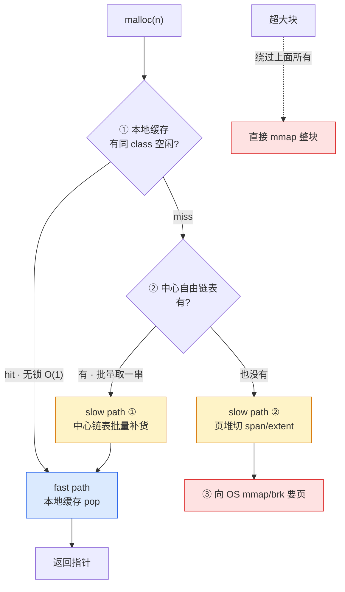

# 附录 A · 全景脉络

> 一本读完 21 章之后,能揣在兜里、随时回看的几页。
>
> 本附录把第二十一章收束的五条哲学、全书贯穿的"局部缓存 vs 中心堆"二分法、以及三层快慢道这条通用骨架,凝练成**卡片式速查**。每张卡片四件套:一句话金句 + 为什么(2~3 句) + 全书哪里印证(回指章号) + 一句反例/代价。出门忘带书时,这几页够你重新搭起心智模型。
>
> 卡片不是正文的复读,是浓缩。每张卡片背后都对应着正文中源码行号级别的拆透——这里只给"钥匙",细节回正文查。

---

## 卡片 0 · 三层快慢道总骨架(全书地基)

> **一切现代分配器的内存路径,都是同一条三级降级链:本地缓存(无锁 O(1))→ 中心自由链表(批量)→ 页堆(向 OS 批发),频率逐层下降,syscall 被挡在最底层。**

**为什么是三层(而非一层或两层)**:这是物理现实逼出来的——操作系统按页(4KB)批发、每次索取付 syscall 代价(数百 ns~µs),而程序一秒可能 `malloc` 上百万次、大小不一。三层把"批发"和"零售"在频率上彻底解耦:fast path 命中纳秒级(最频繁),中心批量取中频,向 OS 要页罕见。

**关键不在"分三层",在"分频率"**:fast path 高频只做最便宜的无锁操作;slow path 低频可以做昂贵的整理(合并、`madvise`、大页打包)。把昂贵操作放到低频层,是骨架的精髓。

**全书哪里印证**:骨架在 P0-01 §1.5 立起;本地缓存与中心链表的衔接在 P1-05 / P1-06;页堆三层在 P2-07 ~ P2-09;"madvise 只在 slow path 最末端"是分频率的具体落地(P4-14)。

**反例/代价**:如果只有本地缓存一层,内存只进不出、RSS 无限涨;如果只有本地+页堆两层,每次 miss 都切页、缓存命中率低。三层的好处,就是让"让步"被下层兜住。

---

## 卡片 1 · 哲学一:三层快慢道是通用骨架

> **分了三层不是巧合——是把昂贵操作放到低频层去,让高频层只做最便宜的事。**

**为什么**:一秒百万次的 `malloc` 容不下任何昂贵操作在高频层出现。fast path 容不下锁、合并、统计、`madvise`——这些必须降级到低频层。所以"分层 + 分频率"不是设计选择,是物理约束。

**全书哪里印证**:P0-01 §1.5 立骨架;P1-05 ~ P1-06 拆 fast/slow 衔接;P2-07 ~ P2-09 拆页堆;P4-14 §14.2 拆"`madvise` 归还只在 slow path 最末端"。

**反例/代价**:层次越多,衔接代码越复杂——每层 miss 都要一段回填逻辑,bug 也容易藏在衔接处(transfer cache 的"只进不出"黑洞,P1-06 五个为什么 5)。

---

## 卡片 2 · 哲学二:用 size class 换 O(1)、用本地缓存换无锁

> **fast path 纳秒级不是天上掉的——是"凑整的内部碎片"换 O(1)、"每份囤货的总占用"换无锁,两个"换"换来的。**

**为什么**:`malloc` 是每秒百万次的高频操作,fast path 容不下查哈希、扫链表、加锁、多次访存。size class 把任意大小凑整成几十个分级,`size → class` 几条指令算完(位运算或扁平数组);本地缓存把 free list 每线程/CPU 一份,不共享就不需要锁,push/pop 是普通的指针读改写。

**全书哪里印证**:P1-02 size class、P1-03 对齐(为什么边界是 2 的幂、为什么对齐到 64 字节缓存行)、P1-05 线程本地缓存、P3-11 jemalloc 多 arena、P3-12 tcmalloc per-CPU。这一哲学是全书第 1 篇和第 3 篇的全部内容。

**反例/代价**:size class 凑整带来 10%~12% 内部碎片(要 17B 给 32B);本地缓存每份囤货让总占用变高(N 个线程 × 每份囤货)。这些"省"维度的让步,由 slow path 兜底。

---

## 卡片 3 · 哲学三:快与省是永恒张力

> **想要快,fast path 就要无锁、不合并、不归还——这必然让"省"受损;想要省,slow path 就要合并、`madvise`——这必然让"快"受损。三层用"分频率"让两者各得其所。**

**为什么**:快和省天然拉扯,不能二选一。三层快慢道的解法是**分工**:fast path 只管快(无锁、O(1)、不合并、不统计、不归还,KPI 是延迟),slow path 只管省(批量、合并、`madvise` 归还、大页,KPI 是占用和碎片)。slow path 慢一点没关系,因为它频率低——fast path 命中率在 99% 以上。

**全书哪里印证**:张力表在 P0-01 §1.8 立;"省"这一面的主战场是第 4 篇:P4-13 合并、P4-14 `madvise`/decay、P4-15 HPAA;"分频率"的具体落地在 P4-14 五个为什么 5;profiling 维度的张力在 P5-18 几何采样为什么 4。

**反例/代价**:如果 fast path 不够快(命中率低、锁争用),slow path 就被频繁触发,分配器整体性能垮。所以"快"和"省"不是对立,是**互相成全**——fast path 越快,slow path 越有空间做省的整理。

---

## 卡片 4 · 哲学四:大页(per-CPU、HPAA)是当代代差

> **per-CPU cache 把 fast path 的锁彻底消灭,huge page aware 把碎片关进 2MB、把 TLB miss 压下去——这两件事是新一代分配器相对 ptmalloc 的核心进步。**

**为什么**:横评四套,ptmalloc 和 mimalloc 在三层骨架上和 tcmalloc/jemalloc 同构,真正的代差集中在两个机制——
- **per-CPU(tcmalloc 新版)**:每个 CPU 核一份私有 slab,线程被调度到哪核就操作哪核的 slab,fast path 上没有一把锁被两个核同时碰。这治了 jemalloc 多 arena 治不了的"跨核 cache line bouncing"。代价是把正确性托付给 Linux 的 rseq(restartable sequences),抢占时安全回退。
- **huge page aware(HPAA / hpa)**:用 2MB 大页替 4KB 页,一次解决两个问题——同样 64 项 TLB 覆盖 256KB → 128MB;大页单位让归还变成"凑满 2MB 才还",碎片被关在大页内。靠 filler 打包(零散小对象挤进整页)+ subrelease(半空大页的空闲子页归还)+ donated 大页(保护大块凑回整页)。

**全书哪里印证**:P3-12 拆 per-CPU + rseq;P4-15 拆 HPAA + filler;tcmalloc(先大页后填)和 jemalloc(先填后 hugify)的根本区别在 P4-15 五个为什么 5;ptmalloc 的三道墙(arena 锁、碎片、tcache 是后加的)反衬这两件事的必要性,在 P0-01 §1.4。

**反例/代价**:per-CPU 赌 rseq 普及、绑定 Linux;tcmalloc 的 HPAA 大页覆盖率稳定但实现复杂,jemalloc 的 hpa 更渐进但 hugify 时机有延迟尖峰风险。ptmalloc 在这两件事上缺席或较弱,mimalloc 走的是另一条路(per-thread heap + 随机化 + segment-abandon)。

---

## 卡片 5 · 哲学五:所有技巧都服务于"纳秒级 fast path + 不泄漏不碎片"

> **无锁原子自由链表、rseq、TLS、位运算、放射状 pagemap、radix tree、`madvise`、几何采样、缓存行对齐——每一个都是工具,没有一个是炫技。**

**为什么**:每一个技巧,都是在"朴素方案会撞墙"的地方用精妙手段绕过去——
- 不把 next 藏进释放块,就要为每个空闲块开 node(空间翻倍 + cache miss + node 池套娃);
- 不用 per-CPU 而用 per-thread,线程数 ≫ 核数时撞三道墙(总占用爆炸、迁移失局部性、false sharing);
- 不用 pagemap/rtree 而用哈希表反查,相邻指针被打散,cache 不友好、有冲突、找前后邻居要各算一遍;
- 不用几何采样而用固定间隔,会和程序分配周期同频,系统性遗漏或过度采样。

**全书哪里印证**:这张卡片是全书 20 章"技巧精解"小节的总地图。下面这张"技巧按目标归类表"是它的展开。

**反例/代价**:每个技巧都有它的代价——rseq 绑定 Linux、pagemap 吃内存、`MADV_FREE` 可能不立刻回收、guarded page 概率开启代价是内存。代价写在每章的"反面对比"里。

---

## 卡片 6 · 技巧按目标归类(全书技巧总地图)

把全书技巧,按**它服务的目标**归类。读任何一段陌生的分配器源码,先问"它在为哪个目标服务",就能在这张表里定位它。

| 服务目标 | 核心技巧 | 全书哪里拆 |
|----------|----------|------------|
| **fast path 无锁纳秒级** | TLS 每线程一份 free list、per-CPU slab + rseq、自由链表把 next 藏进释放块、缓存行对齐防 false sharing | P1-03、P1-04、P1-05、P3-12 |
| **size → class 的 O(1)** | 位运算映射(tcmalloc 扁平数组、jemalloc `lg_floor`+分组)、对齐到 2 的幂(掩码代替除法) | P1-02、P1-03 |
| **slow path 批量 + 低争用** | transfer cache 批量取还、多 arena × bin 锁细分、LIFO 让块热乎 | P1-06、P3-11 |
| **指针 → 元数据 O(1) 反查** | 放射状 pagemap(tcmalloc)、radix tree(jemalloc)、地址掩码(mimalloc)、chunk header(ptmalloc) | P2-08 |
| **碎片治理** | 合并靠 pagemap/rtree O(1) 找邻居、huge page filler 碎片打包、donated 大页保护凑整 | P4-13、P4-15 |
| **归还 OS** | `madvise(MADV_DONTNEED)` vs `MADV_FREE`、jemalloc decay 时间衰减、tcmalloc subrelease 自适应 | P4-14、P4-15 |
| **大页** | `MADV_HUGEPAGE` 主动 hugify(jemalloc)、HPAA 从底层按 2MB 组织(tcmalloc)、`MADV_COLLAPSE` 凑大页 | P4-15 |
| **工程化(起步/fork/看见)** | bootstrap 自举(静态 buffer/早期 mmap)、双 TLS(`__thread` + pthread key destructor)、prefork 全收 postfork `mutex_init` 全放、几何采样用一次随机数预算间隔 | P5-16、P5-17、P5-18 |
| **安全调试(概率抓 bug)** | guarded page 概率采样、junk + quarantine、free list 指针编码(ChaCha20 派生 key XOR+旋转) | P6-19 |

**怎么用这张表**:看到一段代码,先判断它的服务目标(它在 fast path 还是 slow path、为快还是为省),再到表里找对应的技巧行,顺着章号回正文查行号级细节。

---

## 卡片 7 · 二分法:局部缓存 vs 中心堆

> **局部缓存(线程/CPU 私有,无锁 fast path,要"快") vs 中心堆(全局/按核共享,slow path,管页/合并/归还,要"省")。全书 21 章,每一个机制都落在这两面之一(或衔接处)。**

| 面子 | 职责 | 机制 | 篇 |
|------|------|------|----|
| **局部缓存**(fast path) | 要"快":无锁、不争用、纳秒级 | size class(换 O(1))、对齐(嵌硬件对齐)、自由链表(next 藏块换零 metadata)、线程/CPU 本地缓存(每份一份换无锁) | 第 1、3 篇 |
| **中心堆**(slow path) | 要"省":批量、低碎片、及时归还 | 中心自由链表(批量)、页堆(span/extent/segment)、pagemap/rtree(反查)、大块旁路(mmap)、合并(coalesce)、`madvise` 归还、huge page filler | 第 2、4 篇 |
| **衔接处** | fast path miss 时降级到 slow path | transfer cache(线程间直接流转)、cache miss 回填、`madvise` 决策(省到什么程度才还) | 第 6、13~15 章 |

**支线**(不直接服务"快"或"省",但让前面能运转):初始化与自举(P5-16)、fork 锁处理(P5-17)、采样 profiling(P5-18)、安全调试(P6-19)。它们服务于"在快和省的前提下,还能起步、能 fork、能看见、能调试"。

**怎么用这张二分法**:迷路时,看到任何一段陌生的分配器代码,问三件事——

1. **它在 fast path 还是 slow path?** fast path 必须无锁、O(1)、不碰 OS;slow path 可以批量、合并、归还、用大页。
2. **它在为快服务还是为省服务?** 为快要尽量便宜(无锁原子、位运算、TLS 读);为省可以做昂贵操作(合并扫邻居、`madvise` syscall、filler 打包),只要频率低。
3. **它用的是哪一类技巧?** 对照卡片 6 的技巧总地图,定位它。

三个问题答上来,任何一段分配器源码你就读懂了一大半。剩下的,是细节。

---

## 卡片 8 · 四套分配器一句话定位

横评四套,每套一句话锚定它的位置——读源码或挑分配器时,这张表帮你快速对齐。

| 分配器 | 一句话定位 | 招牌招数 | 短板 |
|--------|------------|----------|------|
| **tcmalloc**(google 新版 C++ 重写) | 把 fast path 的锁严格不跨核、把碎片关进 2MB 的当代标杆 | per-CPU slab + rseq(P3-12)、HPAA + filler(P4-15) | 绑定 Linux(rseq);实现复杂 |
| **jemalloc**(Facebook 系) | 多 arena 摊锁 + decay purge 控节奏、大页渐进 hugify 的工程典范 | 4×ncpu arena + bin 锁细分(P3-11)、decay 时间衰减(P4-14)、hpa 先填后 hugify(P4-15) | 跨核 cache line bouncing 治不了;hugify 有延迟尖峰风险 |
| **mimalloc**(Microsoft 新秀) | per-thread heap + 随机化布局 + segment-abandon 的另辟蹊径 | thread-local heap(P0-01 §1.6)、free list 指针编码(P6-19)、arena-abandon(P4-14) | per-CPU 没有、大页较弱 |
| **ptmalloc**(glibc baseline) | arena + bins + tcache 的经典实现,被新一代分配器攻克的对照 | main_arena + 动态开 arena(P0-01 §1.4)、fastbin/smallbin/largebin(P1-06) | arena 锁高并发争用、碎片压不住、tcache 是后加的 |

**挑分配器的直觉**:跑在 Linux 上、线程数远超核数的服务,tcmalloc 的 per-CPU 最吃香;追求稳定、可控、可调参,jemalloc 工程最成熟;想要安全调试友好(随机化、防 UAF),mimalloc 独到;系统默认的 ptmalloc 在这三件事上都弱,但作为 baseline 最普遍。

---

## 卡片 9 · 一次 malloc 的一生(极简版)

读完 21 章,你应该能在脑子里不看源码地放映出一次 `malloc` 的完整旅程。这里给一个极简版的"放映脚本",每一步标了对应的章号——出门口袋卡时,这条线就是全书的脊梁。

**malloc 的一生前半段(fast → slow 降级)**:

1. **算 size class**(纳秒级,位运算 O(1))——P1-02 / P1-03
2. **本地缓存 hit**(99%,纳秒级,无锁 pop)——P1-04 / P1-05 / P3-12
3. **本地缓存 miss → 中心链表批量补货**(中频,LIFO 热块)——P1-06
4. **中心也空 → 页堆切 span**(低频,起点+长度 O(1))——P2-07
5. **页堆也空 → 向 OS mmap 要页**(极低频,syscall,微秒级)——P2-07
6. **旁路:超大块直接 mmap**(size class=0 的 Span / large extent)——P2-09

**free 的一生后半段(归还旅程)**:

7. **指针 → 元数据 O(1) 反查**(pagemap / rtree / 掩码 / header)——P2-08
8. **进本地缓存 push**(纳秒级,无锁,LIFO)——P1-04
9. **本地缓存满 → 批量退回中心**(transfer cache)——P1-06
10. **中心攒够 → 合并相邻空闲 span**(找邻居 O(1))——P4-13
11. **攒够整段空页 → `madvise` 归还 OS**(DONTNEED / FREE,decay 节奏)——P4-14
12. **开了 huge page → filler 打包 / subrelease**(腾整页归还)——P4-15

**贯穿旅程的三条支线**:多核并发(P3-10 ~ P3-12,几十个线程同时走这条旅程不打架)、工程化(P5-16 ~ P5-18,能起步能 fork 能看见)、安全调试(P6-19,release 模式下抓 bug)。

**一句口诀**:fast path 是"工位伸手就拿"(99%),中心链表是"去中转货架补货"(中频),页堆是"去总仓库进货"(低频),大块是"让供应商整车送"(旁路)。free 反过来,零件先回工位、工位满了退中转货架、货架攒够凑整箱退总仓库、总仓库整箱退供应商。这就是三层快慢道的物理直觉。

---

## 卡片 10 · 五条哲学的"一句话"(终极压缩)

如果只能记五句话,记这五句——它们是全书 21 章的总收束,任何一段分配器源码都能被这五句话之一照亮。

1. **三层快慢道是通用骨架**:fast path 无锁 O(1) → 中心批量 → 页堆向 OS 批发,频率逐层下降,syscall 被挡在最底层(见 P0-01、P1-05 ~ P1-06、P2-07、P4-14)。
2. **用 size class 换 O(1)、用本地缓存换无锁**:凑整的内部碎片 + 囤货的总占用,换来纳秒级 fast path,由 slow path 兜底(见 P1-02 ~ P1-05、P3-11 ~ P3-12)。
3. **快与省是永恒张力**:fast path 只管快、slow path 只管省,三层用"分频率"让两者各得其所——这是物理约束,不是设计选择(见 P0-01 §1.8、P4-13 ~ P4-15)。
4. **大页(per-CPU、HPAA)是当代代差**:per-CPU 消灭 fast path 的锁、huge page aware 把碎片关进 2MB,是新一代相对 ptmalloc 的核心进步(见 P3-12、P4-15、P6-20)。
5. **所有技巧都服务于"纳秒级 fast path + 不泄漏不碎片"**:无锁原子、rseq、TLS、位运算、radix tree、`madvise`、几何采样、缓存行对齐——每一个都是工具,没有一个是炫技(见卡片 6 的技巧总地图)。

---

## 结语:这三样东西,够你走遍分配器

读完 21 章正文,再翻完这十张卡片,你手里应该有三样东西:

- **一张全景图**:三层快慢道是骨架,fast path 用本地缓存换无锁、slow path 用批量换省,大页和 per-CPU 是当代代差。
- **一个二分法**:局部缓存(快)vs 中心堆(省),任何机制都能归到一面或衔接处(卡片 7)。
- **一个判读框架**:看任何一段分配器源码,问"它在 fast path 还是 slow path、为快还是为省、用哪类技巧"(卡片 6 + 卡片 7)。

这三样东西,够你在白板上给同事讲清一次 `malloc` 的一生,够你在生产事故里快速定位是不是分配器的锅,够你读下一篇新的分配器论文或源码时,一眼看出它在哪个驿站、为什么这么设计。

`malloc` 还要自己写吗?大多数时候不用——tcmalloc、jemalloc、mimalloc 已经把这条路走得很好。但理解它们为什么这么写,是你从"会用"到"会用透"的分水岭。这几张卡片,就是带你走过这道分水岭之后,揣在兜里的那把钥匙。
