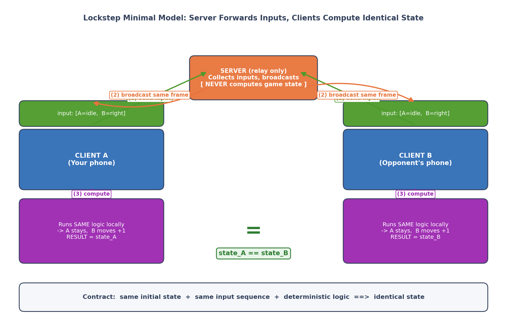
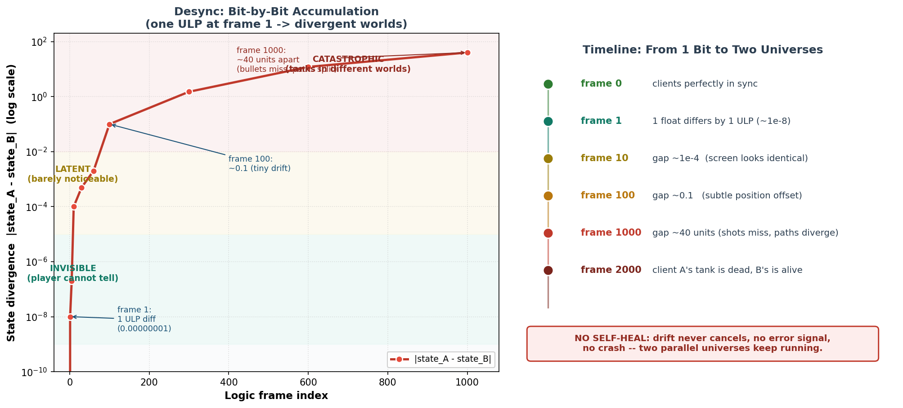
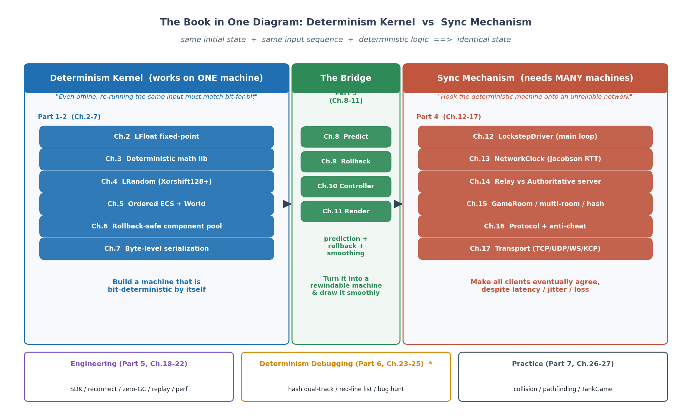

# 序章 · 为什么"相同输入"能算出"相同结果"——帧同步第一性原理与本书读法

> **核心问题**:你和朋友各自拿着手机联机打坦克大战。你按了"向上",你的坦克立刻往上走;同一瞬间,朋友的屏幕上你的坦克也往上走。两台不同的手机、不同的 CPU,凭什么在同一时刻看到完全一样的局面?是某台服务器把每个人的坦克位置算好,再分发给大家吗?——**不是**。帧同步的服务器根本不算坦克在哪。那两台手机凭什么算出一样的结果?这个问题的答案,是一整本书。

> **读完本章你会明白**:
> 1. 帧同步是什么——服务器只广播玩家输入,局面由每台机器各自算;以及它凭什么成立(确定性契约)。
> 2. 帧同步和状态同步的根本区别(谁算局面、流量、反作弊、回放、适用规模),以及帧同步适合什么游戏、不适合什么游戏。
> 3. 全书的二分法:确定性内核(单机就能同步)vs 同步机制(多机才算同步),中间一座桥叫预测回滚。
> 4. 为什么帧同步一切设计的根源是一句话:"相同输入,必须算出相同结果"——以及违背它的代价(desync,逐位累积,几千帧后局面天差地别)。
> 5. 一个真实的工程教训("发疯的坦克"):服务器节奏该不该被玩家输入绑架,是帧同步服务端的分水岭。
> 6. 本书源码(LockstepSdk)的独特定位:市面罕见的独立 SDK 级、确定性帧同步框架。

> **如果一读觉得太难**:先只记住三件事——① 帧同步只广播输入,局面各算各的,靠"确定性"保证一致;② 全书二分法:确定性内核 vs 同步机制;③ desync 是帧同步的幽灵,全书一半篇幅在讲怎么驯服它。

---

## 〇、一句话点破

> **帧同步是一句契约:相同初始状态 + 相同输入序列 + 确定性运算 = 相同结果。服务器只负责把大家的输入收集起来、按固定节拍广播,从不计算局面;每台客户端拿到同一批输入,各自用同一份代码算,算出来必然一样。这本书讲的全部机制,都是为了让这句契约成立、并且在不可靠的网络上还能成立。**

这是结论。本章倒过来拆,而且全程跟着一个例子:两台手机联机打坦克。

---

## 一、帧同步,用最直白的话讲清楚

### 先破除一个最自然的误解

你玩联机游戏,看到自己的坦克和对手的坦克在同一个地图里移动、互射,两台手机画面一致。最自然的猜测是:**有一台服务器,算好了每个人的坦克在哪、子弹在哪,然后把这份"局面"发给所有人,大家照着画就行了**。

这个猜测很合理,很多联机游戏确实这么干——这叫**状态同步(state sync)**。但**帧同步(lockstep)不是这样**。

帧同步的服务器**根本不算坦克在哪**。它只做一件事:

> **把所有玩家的按键收集起来,广播给大家。**

就这。服务器是个"按键中转站"。那局面是谁算的?

> **每台手机,自己算。**

你按了"向上",这条"向上"指令发到服务器;服务器把它和对手的指令打包,广播给所有人;你的手机收到这包(里面有你和对手的按键),**自己跑一遍游戏逻辑**,算出"我的坦克往上走了一格、对手的坦克往右开了一炮"。对手的手机收到同一包,**也自己跑一遍**,算出同样的结果。

### 凭什么两台手机算出来一样?

这是帧同步最核心的问题,也是这本书要回答的。答案是一句话:

> **因为两台手机拿到的输入完全一样、初始状态完全一样、跑的是同一份代码、运算的每一步都严格按相同顺序——所以算出来必然一样。**

这叫**确定性(determinism)**:相同的输入,永远产生相同的输出。只要每台机器都是确定性的,它们各自算,结果就必然一致。

打个比方:给你和你朋友同一份乐谱、同一个起拍、规定好每个音符怎么吹,你们俩哪怕分开在两个房间,吹出来的曲子也必然一样。帧同步就是给所有客户端发同一份"乐谱"(输入序列),让它们各自"吹"(运算)。

> **钉死这件事**:帧同步 = 服务器只广播输入,客户端各自算局面,靠"确定性"保证一致。**服务器不算坦克在哪**——这是它和状态同步最根本的区别。

### 一个最小的例子

为了把这件事钉死,我们看一个最小化的帧同步,只有两帧:

```
   帧 0 (初始): 双方坦克在出生点 (我的在左, 对手在右), 都没动
                 我的手指没动, 对手按了"向右"

   ① 双方把自己的输入发给服务器:
      我 → 服务器:   "无输入"
      对手 → 服务器: "向右"

   ② 服务器把这一帧所有人的输入打包广播:
      服务器 → 所有人: "帧0: [我=无输入, 对手=向右]"

   ③ 我的手机收到, 自己跑逻辑:
      读输入 [我=无, 对手=向右]
      → 我的坦克不动, 对手坦克右移一格
      → 画面: 我的坦克在左, 对手坦克往右动了一格

   ④ 对手的手机收到同一包, 也自己跑逻辑:
      读输入 [我=无, 对手=向右]   ← 和我收到的完全一样
      → 我的坦克不动, 对手坦克右移一格   ← 和我算的完全一样
      → 画面: 和我的画面完全一致
```

注意第 ③ 和 ④ 步:两台手机**没交换过坦克位置**,它们只是各自跑了同一份逻辑、喂了同一批输入,算出来的画面就一样。这就是帧同步。



那"状态同步"长什么样?对比一下就清楚了:

```
   状态同步:
      我按"向上" → 我的手机算"我的坦克到了(5,3)" → 把位置(5,3)发给服务器
      服务器 → 对手: "他的坦克在(5,3)"
      对手直接把坦克画到(5,3)

   帧同步:
      我按"向上" → 把"向上"发给服务器
      服务器 → 对手: "他这帧输入=向上"
      对手自己跑逻辑: "向上" → 坦克到(5,3) → 画出来
```

状态同步传的是**结果(状态)**,帧同步传的是**原因(输入)**。这是两条路线的分水岭,下一节细比。

> **所以这样设计**:帧同步选了"传输入、各自算"这条路。它的代价是——所有客户端必须**绝对确定性地运算**,否则各算各的就会算出不一样的结果。而这个"绝对确定性"的要求,会反向塑造整个代码库的每一个细节(不能用浮点、不能用普通随机数、不能随便遍历字典……),这正是本书前两篇的全部内容。

---

## 二、帧同步 vs 状态同步:两条路线的全面对比

上一节已经点出了根本区别:帧同步传输入,状态同步传状态。这个区别会连锁地影响一切。我们逐项对比:

| 维度 | 帧同步 (Lockstep) | 状态同步 (State Sync) |
|------|-------------------|----------------------|
| **谁算局面** | 每台客户端自己算 | 服务器算,客户端照着画 |
| **网络上传输什么** | 只传输入(几十字节) | 传所有实体的状态(KB 级) |
| **带宽占用** | 极低(~5 KB/s) | 较高(20-100 KB/s) |
| **对确定性的要求** | 必须 100% 确定 | 不需要(服务器说了算) |
| **客户端能"加速"吗** | 不能(服务器控节拍) | 不能(服务器权威) |
| **反作弊** | 较难(逻辑在客户端跑) | 较易(服务器权威校验) |
| **回放实现** | 天然支持(重放输入即可) | 要录制完整状态 |
| **断线重连** | 要重演追帧(或快照) | 服务器直接发当前状态 |
| **适合的游戏** | 小局面、高实时、要回放 | 大世界、海量玩家、要权威 |

逐条解释几个关键的:

- **带宽**:帧同步每包就几个玩家的按键,几十字节,一秒 20 包也就 1-2 KB/s;状态同步要把地图上每个小兵的位置都发一遍,随实体数线性增长。这就是为什么 RTS(满屏几百个小兵)、格斗(判定极严)偏爱帧同步——**实体越多,帧同步越省**。
- **反作弊**:帧同步的逻辑在每台客户端跑,作弊者可以改自己本地的逻辑(比如让坦克跑得更快);状态同步的逻辑在服务器跑,客户端改不了。所以帧同步通常要配**哈希校验**(每帧算个"状态指纹"互相对账,不一致就抓)+ 可选的**权威服务器模式**(服务器也跑一份逻辑校验)。本书第 14、16 章讲这个。
- **回放**:帧同步只要把每帧的输入录下来,回放时从头再跑一遍逻辑就行,**完美复现**(连随机数都一样);状态同步要回放就得把每帧的完整状态录下来,文件巨大。所以电竞比赛(格斗、RTS)的回放和观战,几乎都建立在帧同步上。

### 帧同步适合什么游戏,不适合什么游戏

理解了上面的对比,适用场景就清楚了:

**适合帧同步的:**

- **格斗 / 动作 / 体育**(街霸、NBA 2K):局面小(就两个角色),判定极严(一帧都不能错),要回放(电竞复盘),带宽要低(主机/街机网络差)。帧同步是这类的不二之选。
- **RTS / MOBA**(星际、英雄联盟、Dota):满屏几百个单位,状态同步带宽爆炸;且这类游戏本来就有"录像"传统,帧同步的天然回放正合适。实际上星际 2、Dota 2、英雄联盟都是帧同步。
- **街机 / 快节奏竞技**:低延迟、高一致性需求。

**不适合帧同步的:**

- **MMO / 大世界**(魔兽世界):地图巨大、玩家海量、而且"我离得远就根本不该知道那边的怪在干嘛"。状态同步可以"只同步你附近的",帧同步不行(每个人都得算全局)。这种场景状态同步碾压。
- **FPS 竞技**(CS、Valorant):需要服务器权威判定(否则开枪命中全靠客户端,作弊防不住),且要"延迟补偿"(在服务器回放判定命中)。这类用状态同步+服务器权威。

> **钉死这件事**:帧同步适合"**小局面、高实时、要回放、低带宽**"的游戏;状态同步适合"**大世界、海量玩家、要服务端权威**"的游戏。没有银弹,选型看场景。本书讲的是前者——帧同步。

---

## 三、确定性契约:凭什么"各算各的"还能一样

现在你已经知道帧同步是"各算各的,靠确定性保证一致"。那"确定性"到底意味着什么?为什么它这么难?

### 确定性契约的三条要求

要让"各算各的"算出一样的结果,必须同时满足:

> **① 相同初始状态 + ② 相同输入序列 + ③ 确定性运算 = 相同结果**

前两条靠网络保证(服务器把同一份初始状态、同一批输入发给所有人)。第三条——**确定性运算**——是本书前两篇的全部主题,也是帧同步最难、最容易翻车的地方。

### "确定性运算"到底难在哪

你可能会想:运算还不简单,`a + b` 不就是 `a + b` 吗,两台手机算出来还能不一样?

**能。而且会不一样。** 这是帧同步最反直觉的地方。看几个例子:

- **浮点数**:`0.1 + 0.2` 在你的手机上可能是 `0.3`,在对手的手机上(不同 CPU、不同浮点单元)可能是 `0.30000000000000004`。差一个最低位,在物理积分里会逐帧放大,几千帧后坦克就漂到不同的地方去了。所以帧同步**绝对不能用浮点数**,必须用**定点数**(用整数模拟小数,下一章详讲)。
- **随机数**:`new Random().Next()` 在不同 .NET 版本、不同平台上算法不同,生成的序列不一样。所以帧同步必须用**自己实现的确定性随机数**(比如 Xorshift128+,种子相同则序列相同)。
- **遍历顺序**:`foreach (var x in dictionary)` 在不同机器上遍历顺序可能不同(哈希桶布局受内存影响)。所以帧同步**不能遍历字典**,必须用有序的结构。
- **系统时间**:`DateTime.Now` 两台手机不一样。所以帧同步的逻辑里**不能用真实时间**,只能用"逻辑帧号"。

这些还只是冰山一角。本书第 24 章有一份完整的"确定性红线清单"。

### desync:帧同步的幽灵

只要上述任何一条没守住,两台客户端就会出现**不同步(desync)**。desync 的可怕之处在于它是**逐位累积**的:

```
   帧 0:    双方完全一致
   帧 1:    某次浮点运算差了 0.00000001 —— 画面看不出
   帧 10:   差距累积到 0.0001 —— 还是看不出
   帧 100:  差距到 0.1 —— 坦克位置略有偏差,玩家可能还没察觉
   帧 1000: 差距到几十个单位 —— 坦克漂到完全不同的地方,子弹轨迹完全不同
   帧 2000: 一个客户端的坦克已经死了,另一个客户端的坦克还活着 —— 彻底分裂
```



更阴险的是:desync **不会让游戏崩溃**,两台客户端都在正常跑、画面都"看起来正常",只是它们跑成了两个**平行宇宙**。等你发现"我明明打中了他他怎么没死"的时候,可能已经离根因几千帧了。定位一个 desync,可能要翻几天日志、对比几 GB 的状态快照。

这就是为什么本书有一整篇(第六篇)专门讲"不同步了怎么定位",以及为什么"bug 定位"是本书的核心主题之一——帧同步工程化的真正难点不在"写出来",在"desync 了怎么找"。

> **钉死这件事**:帧同步的命门是**确定性运算**——任何一处不确定(浮点/随机/遍历顺序/时间),都会导致 desync,而且 desync 逐位累积、不崩溃、难定位。本书前两篇讲怎么造一台确定性的机器,第六篇讲它出问题了怎么找。这是帧同步和所有其他类型程序最大的不同。

---

## 四、全书的骨架:确定性内核 vs 同步机制

理解了上面的,本书的结构就好懂了。全书围绕一句主线:

> **帧同步 = 相同初始状态 + 相同输入序列 + 确定性运算 = 相同结果。全书围绕"确定性"展开。**

这条主线自然地把全书切成两半——这就是**全书的二分法**:



### 确定性内核(上篇):单机就能同步

即使**不联网**,一台机器上,同一份输入跑两遍,也必须位级相同。这是地基。这一半回答"怎么造一台单机就确定的机器":

- **定点数 LFloat**(第 2 章):为什么不能用浮点,怎么用整数模拟小数。
- **确定性数学库**(第 3 章):乘法、三角函数、开方怎么做才确定。
- **确定性随机**(第 4 章):Xorshift128+。
- **有序 ECS**(第 5 章):为什么不能遍历字典,组件池删除为什么不能 swap-and-pop。
- **回滚安全组件池**(第 6 章):双引擎的取舍。
- **字节级序列化**(第 7 章):相同状态必须产生相同字节流。

### 同步机制(下篇):多机才算同步

确定性内核造好了,接到**不可靠的网络**上(有延迟、抖动、丢包),怎么让所有客户端最终一致。这一半回答"怎么把确定的机器接到网络上":

- **LockstepDriver**(第 12 章):SDK 主循环。
- **网络时钟**(第 13 章):Jacobson 算法平滑 RTT,硬边界防回滚风暴。
- **Relay vs Authoritative 双服务器模式**(第 14 章):服务器要不要跑逻辑。
- **GameRoom 与多房间**(第 15 章):顶号重连、哈希防作弊、中毒快照熔断。
- **协议与反作弊**(第 16 章):策略模式、双轨版本号、拦截器。
- **传输层**(第 17 章):TCP/UDP/WebSocket,以及 KCP 为什么是 stub。

### 中间的桥:预测回滚 + 表现平滑

确定性是地基,但光有地基没法玩——网络有延迟,等服务器确认再算,操作会"粘手";逻辑帧只有 20fps,直接画会顿。所以中间一座桥:

- **预测回滚**(第 8-10 章):客户端不等服务器,先猜着算(预测);猜错了倒带重演(回滚)。这是帧同步的招牌机制。
- **表现平滑**(第 11 章):逻辑 20fps / 渲染 60fps 分离,插值平滑,回滚时用视觉补偿吸收瞬跳。

任何时候读迷路了,回到这个二分法问自己:**"这一章是在保证单机的确定性,还是在解决多机的同步?"** 你就永远知道自己在哪、为什么需要下一步。

> **钉死这件事**:全书二分法——确定性内核(单机就能同步)vs 同步机制(多机才算同步),中间一座桥是预测回滚 + 表现平滑。这是本书的骨架,每章结尾都会回扣它。

---

## 五、作者复盘:一辆"发疯的坦克"

接下来讲一个真实的故事,它是本书源码项目(LockstepSdk)早期踩过的大坑,也是理解帧同步服务端设计的一把钥匙。这种"从病态里悟出正道"的复盘,是本书作为"作者亲自设计"的源码才能给你的。

### 现象:坦克自己会瞬移、乱开炮

项目早期,联机对战跑起来后出现了一个诡异现象:偶尔地,坦克会**无规则地满屏瞬移**,炮管**自己乱转、莫名其妙开炮**。客户端还经常出现"原地抖动"——坦克在一个位置上高频闪烁。重连之后,画面能同步过来,但操作又失灵、移速也变得不对。

这看起来像是网络丢包、或者同步算法有 bug。但查来查去,网络是通的,同步逻辑也对。

### 根因:服务器节奏被输入绑架了

最后定位到的根因,是一个**架构层面的认知错误**:早期的服务器是**由玩家输入驱动**的——"收到了输入,就广播一帧"。

这个看似合理的设计,在网络不稳定时会崩:

- **客户端断开** → 服务器收不到它的输入 → 服务器**停顿**,不广播了 → 其他客户端收不到新帧,**卡住**。
- **客户端网络恢复,瞬间涌来一堆积压的输入** → 服务器**密集广播** → 其他客户端被灌一堆帧,追帧追得画面乱跳。
- **客户端预测和服务器确认频繁冲突** → 原地抖动。

坦克"自己瞬移、乱开炮",本质是不同客户端收到的帧序列**节奏不一致**、有的还丢了,各自算出的局面就乱了套。

### 悟出的正道:物理时钟节拍器

从这个病态里,作者悟出了帧同步服务端的一个分水岭认知:

> **服务器的节奏,绝对不能被玩家输入绑架。**

正道是:**服务器自己按固定节拍走**(比如每 50ms 一帧,即 20Hz),像一个**节拍器**。每到一拍,无论玩家有没有发输入来,都强行推进一帧:

- 玩家发输入了 → 填进去。
- 玩家没发(网络延迟、甚至掉线了)→ **填一个"空输入"**,照样推进、照样广播。

这样一来,**所有客户端收到的帧序列,节奏绝对恒定**(就是服务器的节拍),不会因为谁掉线而停顿、谁网络好而轰炸。"发疯的坦克"立刻治好了。

> **作者复盘 · 物理时钟节拍器**:早期"收输入就广播"的朴素设计,让服务器节奏被输入绑架,导致"发疯的坦克"。改成固定节拍 + 强制空输入填充后,所有客户端收到的帧节奏绝对恒定。这个认知——**服务器该不该被输入驱动**——是帧同步服务端设计的分水岭。本书第 14 章(Relay vs Authoritative 服务器)会把它讲透,包括为什么服务器要用**单调钟**(Stopwatch)而不是**墙钟**(UtcNow)来打节拍(后者会被 NTP 校时回跳,导致房间永久冻结——又一个血泪 bug)。

这个故事也示范了本书的写法:每个机制,先讲"它解决什么本质问题、不这样会撞什么墙",再讲实现。这是本书的命脉。

---

## 六、本书源码的独特定位:市面罕见的"帧同步 SDK"

市面上讲帧同步的资源,大致两类:

1. **引擎内嵌的同步模块**:比如某个 Unity 插件里的帧同步实现,和引擎、和具体游戏深度耦合,拆不出来、也学不了。
2. **教程级 demo**:几百行代码的玩具,讲清楚原理就完了,离"能做产品"差着十万八千里——没有断线重连、没有反作弊、没有性能优化、没有多房间、没有可观测性。

**独立的、SDK 级的、多引擎可集成、带 Builder API 和可注入依赖的帧同步框架,市面上几乎没有。** 这正是本书源码 LockstepSdk 的独特定位。

为了坐实这个定位,看看市面的"竞品":

| 框架 | 类型 | 确定性 | 定点数 | 内置回放 |
|------|------|--------|--------|----------|
| **Photon Fusion** | 状态同步 + 预测 | ❌ | ❌ | ❌ |
| **Mirror** | 状态同步 | ❌ | ❌ | ❌ |
| **Fish-Net** | 状态同步 | ❌ | ❌ | ❌ |
| **LockstepSdk(本书)** | **确定性帧同步** | ✅ | ✅ Q48.16 | ✅ |

主流的 C# 联机框架(Fusion/Mirror/Fish-Net)清一色**状态同步 + 客户端预测**,没有确定性保证、没有定点数、没有内置回放。它们适合 MMO/FPS 那类场景,但做不了格斗/RTS/MOBA 那类"必须帧同步"的游戏。LockstepSdk 填的就是这个空。

而且 LockstepSdk 是按**独立 SDK**设计的:

- **核心零依赖**:`Lockstep.Core` 和 `Lockstep.Network` 不引用任何游戏引擎(Unity/Raylib 都不引用),只靠 .NET 基础库。
- **多引擎适配**:核心是纯逻辑,接 Raylib(本书示例客户端)或 Unity 都只需适配**渲染层**。WebGL 平台(微信小游戏)还能切到 WebSocket 传输。
- **Builder API + 可注入依赖**:服务器/客户端用链式 Builder 配置,日志、指标、重连凭证存储都靠接口注入,宿主层实现具体策略。
- **双 TFM 跨运行时**:同时编译 `net8.0`(服务端/桌面)和 `netstandard2.1`(Unity 等旧运行时)——这也正是本书一个独门主题的来源:同一个定点数乘法,在两个运行时上会因为舍入语义不同而差一个最低位,导致跨平台 desync(第 3 章招牌)。

本书第 18 章专讲"怎么把帧同步做成 SDK"。这本身是稀缺内容——你能找到讲帧同步原理的文章,但很难找到讲"怎么把帧同步工程化成独立 SDK"的。

---

## 七、四个比喻,点睛一次

本书整体是**直球风格**——第一性原理 + 数学 + 真实源码直给,不靠比喻凑数。但帧同步的几个核心概念,用一组比喻点一下,能帮你建立直觉。这几个比喻**只在序章用一次**,后面不再沿用:

- **确定性像乐谱**:所有乐手(客户端)拿同一份乐谱(初始状态 + 输入序列),按相同节拍演奏,出来的曲子必然一样。任何一个乐手把 `float` 当成"差不多就行",就像偷偷改了一个音符——几百小节后,整首曲子就乱了(desync)。
- **服务器像指挥**:指挥不替乐手演奏(不算局面),只负责打节拍(固定 20Hz 广播权威帧)。而且指挥是个**节拍器式的指挥**——不管某个乐手有没有跟上,节拍自顾自走(强制空输入填充)。
- **预测回滚像时间机器**:乐手不等指挥的拍子(网络延迟),先按自己猜的节奏往下吹(预测);指挥的拍子到了,发现猜错了,就**倒回到那一拍重吹**(回滚)。
- **哈希校验像对账**:每个乐手每拍结束算一个"这一拍的总音量指纹"(状态哈希),互相核对,指纹对不上就是有人吹错了(desync)。

记住这四个比喻,你就记住了帧同步的四件事:**确定性、服务器只打节拍、预测回滚、哈希对账**。

---

## 八、这本书怎么读

### 读者画像

这本书假设你**会写代码、懂数学(微积分、线性代数、概率)、懂系统(网络/内核/数据库读过或写过),但没做过帧同步联机游戏**。你不需要懂任何帧同步术语——所有术语首次出现都会解释。但你最好懂编程、懂数值的整数/浮点表示、懂 UDP/TCP 和 RTT 这些网络基础,这样讲到定点数精度、预测回滚时间线、时钟平滑算法时你接得住。

### 和其他书的关系(承接)

- **★承《物理引擎》**:本书第 26 章的碰撞检测(QuadTree、AABB、OBB),原理和《物理引擎》那本一样,会一句带过指路,篇幅留给"确定性物理"特有的。
- **★承数学线**:定点数是"精确 vs 逼近"的极致应用,三角函数查表是数值逼近,随机数是伪随机序列——讲到时指路数学线那几本。
- **承《Lua》《LuaJIT》**:帧同步本质是一台"确定性虚拟机"(相同输入相同输出),和 Lua VM 的确定性执行神似,偶尔点睛对照。
- **承网络系列**:TCP/UDP/WebSocket 是通用概念,讲到传输层一句带过。

如果你读过上面这些,本书会把你的功底"装"到帧同步这个新场景里。如果没读过也不影响,本书自洽。

### 篇章地图

```
   序章 (你在这里)
     │  立主线:确定性契约;立二分法:确定性内核 vs 同步机制
     ▼
   第 1-2 篇 · 确定性内核 (第 2-7 章)
     │  定点数 → 数学库 → 随机 → ECS → 组件池 → 序列化
     │  造一台"单机就确定"的机器
     ▼
   第 3 篇 · 预测回滚 + 表现平滑 (第 8-11 章)
     │  预测 → 回滚 → Controller → 表现平滑
     │  把它变成"可倒带"的机器,并平滑地画出来
     ▼
   第 4 篇 · 同步机制 (第 12-17 章)
     │  Driver → 时钟 → Relay/Authoritative 服务器 → 房间 → 协议反作弊 → 传输
     │  把确定的机器接到不可靠的网络上
     ▼
   第 5 篇 · 工程化 (第 18-22 章)
     │  SDK 化 → 重连 → 零GC → 回放 → 性能可观测
     │  把它做成独立 SDK 级产品
     ▼
   第 6 篇 · 确定性调试 (第 23-25 章) ★独门
     │  哈希双轨 → 红线清单 → bug 实战(含假问题教学)
     │  desync 了怎么定位
     ▼
   第 7 篇 · 周边与实战 (第 26-27 章)
      碰撞寻路 → TankGame 实战(把全书串起来)
```

每一章,你都会看到它服务的是"确定性内核"还是"同步机制",以及它解决的是上一章留下的什么问题。永远知道自己在哪。

---

## 九、技巧精解:两个第一性洞察

序章的最后,给两个贯穿全书的"第一性洞察"。后面所有机制,都是这两个洞察的展开。

### 洞察一:帧同步的本质矛盾——"各算各的"和"必须一样"

帧同步一切设计的根源,是一个矛盾:**局面各算各的(为了省带宽、为了能回放),但又必须算得完全一样(否则就 desync)**。

这个矛盾催生了全书:
- 为了"算得一样" → 必须**确定性**(定点数、确定性随机、有序遍历)。
- 为了"算得一样"在网络上还成立 → 必须**预测回滚**(掩盖延迟)、**冗余帧**(抗丢包)、**时钟同步**(对齐节拍)。
- 为了验证"算得一样" → 必须**哈希对账**。
- 为了"算得一样"出问题能找 → 必须**可观测性**(字段级 desync 定位)。

理解了这个矛盾,就理解了帧同步为什么有这么多机制——它们全是为了调和"各算各的"和"必须一样"。

### 洞察二:确定性是一套编程纪律,不是"加个功能"

很多人以为"确定性"就是"把 float 换成定点数"。**远远不是**。确定性是一套**渗透到每一行逻辑代码的编程纪律**:

- 不能用浮点(第 2 章)。
- 不能用普通随机数(第 4 章)。
- 不能遍历字典(第 5 章)。
- 组件池删除不能 swap-and-pop(第 6 章)。
- 逻辑层不能有不可逆副作用(第 9 章,回滚重演时不能再播一遍音效)。
- 实体创建/销毁要命令缓冲(第 9 章)。
- 随机数状态必须进快照(第 9 章)。
- ……

而且这套纪律的**大半,是被"预测回滚"反向强加的**——为了能倒带重演,游戏逻辑必须写成"纯函数式 + 可快照"的风格。本书第 9 章(回滚)和第 24 章(红线清单)会把这个"纪律"系统化。这是帧同步和普通游戏程序最大的不同:普通游戏逻辑写错了最多是个 bug,帧同步逻辑写"不确定"了,是**全网 desync**。

> **钉死这件事**:确定性不是"换个数据类型",是一套**编程纪律**;这套纪律的大半是被预测回滚反向强加的。理解了这点,你就理解了为什么本书要花两篇讲"确定性内核",以及为什么每一章都在强调"为什么不能这么写"。

---

## 十、章末小结

### 回扣主线

本章立起了全书的几个根基:① 帧同步是什么——服务器只广播输入,客户端各自算,靠确定性保证一致;② 帧同步 vs 状态同步的根本区别和各自适用场景;③ 确定性契约:相同初始 + 相同输入 + 确定性运算 = 相同结果,违背它的代价是 desync(逐位累积、不崩溃、难定位);④ 全书二分法:确定性内核(单机就能同步)vs 同步机制(多机才算同步),中间一座桥是预测回滚 + 表现平滑;⑤ 一个真实教训("发疯的坦克"):服务器节奏不能被输入绑架;⑥ 本书源码是市面罕见的独立 SDK 级帧同步框架。

### 五个为什么

1. **两台手机凭什么看到同一个局面?**——不是服务器算好发下来(那是状态同步),而是帧同步只广播输入,每台手机各自算,靠确定性保证算得一样。
2. **帧同步和状态同步怎么选?**——帧同步适合小局面/高实时/要回放/低带宽(格斗、RTS、MOBA);状态同步适合大世界/海量玩家/要服务端权威(MMO、FPS)。
3. **为什么帧同步不能用浮点?**——浮点跨平台/跨 CPU 不一致,会逐位累积成 desync。必须用定点数。
4. **desync 为什么可怕?**——它逐位累积、不崩溃、难定位,等发现时可能离根因几千帧,定位一个 desync 可能要翻几天日志。
5. **全书怎么组织?**——二分法:确定性内核(单机就能同步,前两篇)vs 同步机制(多机才算同步,第四篇),中间一座桥是预测回滚 + 表现平滑(第三篇);外加工程化(第五篇)、确定性调试(第六篇)、周边实战(第七篇)。

### 想继续深入往哪钻

- 想搞懂"不能用浮点那用什么":第 2 章(定点数 LFloat)。
- 想搞懂浮点到底哪里不一致、跨平台怎么 desync:第 2、3 章。
- 想搞懂预测回滚这套招牌机制:第 8-10 章。
- 想搞懂 desync 怎么定位:第六篇(第 23-25 章)。
- 想亲手跑通一个帧同步游戏:第 27 章(TankGame 实战)+ 附录 B。

### 引出下一章

我们搞清了帧同步是"各算各的、靠确定性保证一致",以及 desync 是帧同步的幽灵。那第一个、也是最根本的问题就来了:**既然不能用浮点,那用什么?怎么用一个整数,去精确地模拟一个小数,还要让它在所有 CPU 上算出完全一样的结果?** 这就是定点数。下一章第 2 章,**定点数 LFloat:为什么不能用浮点**,我们从 IEEE 浮点为什么跨平台不一致讲起,造出帧同步最基础的那块砖——Q48.16 定点数。

> **下一章**:[第 2 章 · 定点数 LFloat:为什么不能用浮点](P1-02-定点数LFloat-为什么不能用浮点.md)
