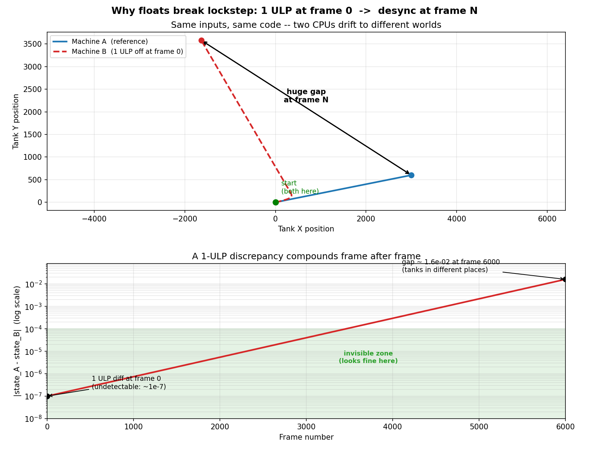

# 第 2 章 · 定点数 LFloat:为什么不能用浮点

> **核心问题**:序章说帧同步"绝对不能用浮点",必须用定点数。可 `float`/`double` 我们天天用,算 `0.1 + 0.2` 不也是 `0.3` 吗,两台手机算出来还能不一样?这一章就回答到底为什么浮点不行,以及帧同步用什么来替代它——定点数 `LFloat`。这是帧同步最基础的那块砖,后面所有数学运算都建立在它之上。

> **读完本章你会明白**:
> 1. IEEE 754 浮点数到底为什么不能用于帧同步——哪些环节会让两台机器算出不一样的结果(舍入、扩展精度、FMA、溢出、subnormal)。
> 2. 定点数的核心思想:用一个整数,把小数点"钉"在固定位置,用整数运算模拟小数。
> 3. 为什么 LFloat 选 Q48.16(64 位 long)而不是 Q32.16(32 位 int)——精度与范围的权衡。
> 4. RawValue 的位结构,加减为什么直接算、乘除为什么要移位。
> 5. Floor/Ceil/Round 怎么用位掩码实现,比除法快在哪里。
> 6. 两个真实的 bug:`LFloat.One` 的类型陷阱、`FromFloat` 的边界溢出。

> **如果一读觉得太难**:先只记住三件事——① 浮点跨机器算出来可能差一个最低位,帧同步绝对不能用;② 定点数 = 用整数存"放大了 65536 倍的值",加减直接、乘除要移位修正;③ LFloat 用 64 位 long 存,Q48.16,范围 ±1.4×10¹⁴,精度 1/65536。

---

## 〇、一句话点破

> **浮点数(`float`/`double`)是"近似且跨机器可能不一致"的——它的舍入、中间精度、特殊硬件指令,会让两台不同的 CPU 对同一个算式算出差一个最低位的结果,这在帧同步里就是 desync。定点数(LFloat)用整数把小数点钉死在固定位置,整数运算是精确且跨平台一致的,从根上消灭这个不确定性。LFloat 用 64 位 `long` 存储,采用 Q48.16 格式:整数 47 位、小数 16 位,范围 ±1.4×10¹⁴,精度 1/65536。**

这是结论。本章倒过来拆:先讲浮点到底哪里不一致,再讲定点数怎么解决,最后看 LFloat 的具体实现。

---

## 一、浮点数到底为什么不能用于帧同步

这是本章最重要的一节。很多人对"浮点不能用于帧同步"的理解停留在"浮点不精确",这是**远远不够**的——你得知道它到底在哪些环节不一致,才能理解为什么必须换掉它。

### 先回顾:浮点数是怎么存一个数的

IEEE 754 的 `double`(64 位)用**科学计数法**存一个数:

```
   一个 double = (符号) × (1.尾数) × 2^(指数)
                 1 bit      52 bit       11 bit
```

比如 `0.1`,在 double 里存的是 `1.6 × 2⁻⁴`,而尾数 `1.6` 用 52 位二进制小数**近似**表示。关键在于:**0.1 在二进制里是无限循环小数**(就像十进制里 1/3 = 0.333... 一样),52 位尾数装不下,只能**截断/舍入**。所以 `0.1` 存进 double,已经不是精确的 0.1 了,是一个极其接近 0.1 的近似值。

这是浮点"不精确"的根源:它能精确表示的只有少数几个数(2 的幂次和的小数),绝大多数十进制小数都是近似存储。

### 但"不精确"本身不是帧同步的死穴——"不一致"才是

你可能会想:不精确就不精确呗,只要两台机器都存成那个"近似 0.1",算出来不还是一样吗?

**理论上,如果所有机器严格按 IEEE 754 标准算,结果确实是一样的。** IEEE 754 规定了每一步运算的舍入规则(默认"最近偶数舍入"),它是确定的。

**但现实中,有至少五个环节会让两台机器算出不一样的东西:**

#### 环节一:中间计算的扩展精度(extended precision)

这是最阴险的一个。很多 CPU(尤其 x86 的 x87 浮点协处理器)内部寄存器是 **80 位扩展精度**,而 `double` 是 64 位。一个算式在寄存器里算的时候用 80 位(更精确),存回内存的时候截断成 64 位(精度丢失)。

```
   算式:  a * b + c

   机器 A(编译器选择"全在寄存器里算完再存回"):
      用 80 位算 a*b, 加 c, 最后截断成 64 位 → 结果 R_A

   机器 B(编译器选择"中间结果存回内存"):
      用 80 位算 a*b, 截断成 64 位存回, 再加 c → 结果 R_B

   R_A 和 R_B 可能差一个最低位!
```

而这个"编译器选哪种"——取决于编译器版本、优化级别(`/O2` vs `/O3`)、甚至寄存器分配的偶然性。**同一段 C# 代码,在 .NET 8 和 .NET Framework、在 x86 和 ARM 上,JIT 出来的浮点指令序列可能不同**,中间精度处理就不同,结果就差一个最低位。

> **承接数学线**:这正是《数学分析》"精确 vs 逼近"主线里讲的——浮点是**逼近**,而逼近的中间过程(保留多少位、何时截断)如果不统一,两边的逼近结果就会分叉。帧同步要求**精确且一致**,浮点做不到。

#### 环节二:融合乘加(FMA)指令

现代 CPU(尤其 ARM、较新的 x86)有 **FMA** 指令,它把 `a * b + c` 合成一条指令,中间的 `a * b` **不截断**(理论上无限精度,直接加 c 再舍入一次)。

```
   没有 FMA:  t = a*b (舍入一次);  result = t + c (再舍入一次)  → 舍入两次
   有 FMA:    result = fma(a, b, c)  (只舍入一次)               → 舍入一次
```

FMA 更精确(舍入次数少),但**它和"非 FMA"算出的结果在最低位上不同**。如果机器 A 的 JIT 用了 FMA、机器 B 没用(或 CPU 不支持),同一个 `a*b+c` 算出来就不一样。

.NET 在不同版本、不同平台上,对 FMA 的使用策略是不同的。你作为业务开发者**根本控制不了**。

#### 环节三:舍入模式(rounding mode)

IEEE 754 支持多种舍入模式(最近偶数、向零、向正无穷、向负无穷),默认是"最近偶数"。但:

- 某些运行时/库会临时切换舍入模式(比如某些数学库内部)。
- 不同语言默认舍入行为有微妙差异(C# 的 `MidpointRounding` 枚举就是个坑)。

如果两边舍入模式不同,同一个 `0.5` 舍入成整数,一边是 `0`(最近偶数),另一边可能是 `1`(向正无穷)。

#### 环节四:特殊值(NaN、Infinity、subnormal)

- `NaN != NaN`(NaN 不等于自己),这让"比较两个状态是否一致"的逻辑全乱。
- subnormal(次正规数)在不同实现上的处理可能不同(有些 CPU 直接"刷成零"——flush-to-zero,为了性能),这又是一个不一致源。
- 溢出到 `Infinity` 的行为,在不同 FPU 上也可能有差异。

#### 环节五:浮点转整数的溢出

`double` 范围远大于 `long`。把一个超出 `long` 范围的 `double` 转成 `long`,**行为是未定义/平台相关的**——有的平台给 `long.MaxValue`,有的给 `long.MinValue`,有的给 0。这又是一个跨平台分叉点。

### 这五个环节加起来的后果

你不需要记住每个细节。你只需要记住这个结论:

> **浮点运算的"具体每一步怎么算"(中间保留几位、用不用 FMA、怎么舍入、溢出怎么处理),不是 IEEE 754 标准能完全钉死的——它取决于 CPU 架构、编译器、运行时版本、甚至优化级别。作为业务开发者你完全控制不了。而这些差异,会让两台机器对同一个算式算出"差一个最低位"的结果。**

在普通程序里,差一个最低位(`0.0000001`)无所谓。但在帧同步里,这个最低位会被**逐帧累积放大**(物理积分、距离计算、概率判定……),几千帧后,坦克就漂到了完全不同的地方——desync。



这就是为什么帧同步**绝对不能用浮点**。不是"不精确",是"跨机器不一致"。

> **钉死这件事**:浮点不能用于帧同步,不是因为"不精确",而是因为它的运算细节(中间精度、FMA、舍入、溢出)跨 CPU/编译器/运行时会不同,导致两台机器算出不一样的最低位,逐帧累积成 desync。这是帧同步必须换掉浮点的根本原因。

> **作者复盘 · 为什么不直接用 decimal**:有人问 .NET 的 `decimal`(128 位高精度十进制)行不行?不行。① 它慢得离谱(没有硬件加速,纯软件);② 它的运算跨运行时是否完全位级一致,也没有像整数那样的铁保证;③ 游戏数值不需要十进制的"财务精确",需要的是"二进制位级一致 + 快"。定点数(整数运算)才是正道。

---

## 二、定点数的核心思想:用整数模拟小数

既然浮点不行,用什么?答案是:**回到整数**。整数运算是**精确且跨平台完全一致**的——`a + b`、`a * b` 在任何 CPU 上算出来都一样(只要不溢出,溢出也是确定性的环绕)。这是计算机最可靠的基础。

但整数没有小数。怎么办?

### 核心技巧:把所有数放大一个固定倍数

定点数的核心思想极其朴素:**约定一个固定的"放大倍数",把所有小数乘以它,变成整数来存;运算用整数运算;需要的时候再除回去**。

举个例子,假设我们约定"放大 100 倍"(也就是保留 2 位十进制小数):

```
   实际值 0.25  →  存成整数 25    (0.25 × 100)
   实际值 3.14  →  存成整数 314   (3.14 × 100)
   实际值 1.00  →  存成整数 100   (1.00 × 100)
```

现在,所有数都是整数了。算 `0.25 + 3.14`:

```
   定点加法:  25 + 314 = 339   →  对应实际值 3.39   ✓ 和 0.25+3.14=3.39 一致
```

整数加法,跨平台完全一致,精确,无舍入。这就是定点数。

### 但用"放大 100 倍"有毛病——计算机喜欢 2 的幂

上面用"放大 100 倍"是为了好懂,但计算机里不会用 100,因为:

- 除以 100 是"除法",慢(除法指令比加减乘慢几十倍)。
- 除以 2 的幂是"右移",快(一条位运算指令)。

所以定点数**一律用 2 的幂**作为放大倍数。`LFloat` 用的是 **2¹⁶ = 65536**,也就是:**把所有数放大 65536 倍,存成整数**。

```
   实际值 1.0   →  存成 1 × 65536 = 65536
   实际值 0.5   →  存成 0.5 × 65536 = 32768
   实际值 0.25  →  存成 0.25 × 65536 = 16384
   实际值 3.0   →  存成 3 × 65536 = 196608
```

这个"放大 65536 倍后存的整数值",就是 `LFloat` 内部唯一的字段,**叫 RawValue**(原始值)。所有定点数运算,都是在 RawValue 上做整数运算。

> **钉死这件事**:定点数 = 约定放大 2 的幂倍(这里是 65536),把小数变成整数存(叫 RawValue),用整数运算,跨平台精确一致。放大倍数用 2 的幂,是为了把"除以倍数"变成"右移"(快)。

---

## 三、Q48.16:为什么用 64 位 long,而不是 32 位 int

放大倍数定了(2¹⁶),接下来一个关键决策:**用什么整数类型存 RawValue**?这决定了定点数的**范围**和**精度**。这是定点数设计最重要的权衡,LFloat 选的是 **64 位 `long`**,格式叫 **Q48.16**。我们来理解这个选择。

### Q 记法:整数位和小数位的分配

"Qm.n"是一种定点数记法,表示:总共 m+n 位,其中小数部分 n 位、整数部分 m 位。LFloat 是 **Q48.16**——但这里有符号位,所以准确说是:**64 位总共,1 位符号 + 47 位整数 + 16 位小数**。

```
   LFloat 的 64 位 long (Q48.16):

   ┌──┬─────────────────────────────────┬──────────────────┐
   │符│         整数部分 (47 位)          │  小数部分 (16 位)  │
   └──┴─────────────────────────────────┴──────────────────┘
     1 bit          47 bits                  16 bits

   小数部分 16 位 → 精度 = 1 / 2^16 = 1 / 65536 ≈ 0.0000153
   整数部分 47 位 → 范围 = ±2^47 ≈ ±140,737,488,355,327
```

- **精度**:`1/65536 ≈ 0.0000153`,也就是能分辨到小数点后第 5 位。对游戏来说够用了(坦克位置精确到十万分之一,远超屏幕像素)。
- **范围**:`±1.4 × 10¹⁴`,也就是正负 140 万亿。这是个极其巨大的范围——光速跑 12 小时的距离(以米计)都能装下,游戏地图坐标累加绝对不会溢出。

### 为什么不用 Q32.16(32 位 int)?

Q48.16 是用 64 位 long。很多人第一反应:为什么不用 32 位 int 的 Q32.16?省一半内存,运算也更快(32 位运算比 64 位快)。

这是个合理的问题,也是定点数设计里**最经典的权衡**。LFloat 选了 long,理由有两个:

#### 理由一:范围不够,坐标累加会溢出

Q32.16(32 位 int,1 符号 + 15 整数 + 16 小数)的范围是 `±2^15 ≈ ±32768`。听起来不小,但游戏里:

- 地图大小可能就是几万单位(一个超大战场)。
- **速度对时间积分是位置**:一个高速物体,速度 × 帧时间,几万帧累加下来,坐标很容易突破 32768。
- 一旦溢出,int 是**环绕**(wrap-around),正数变负数,坦克瞬间从地图这头跳到那头——这种 bug 极难定位。

Q48.16 的 `±1.4×10¹⁴` 给了巨大的裕度,坐标累加永远不会溢出。

#### 理由二:中间运算的溢出裕度

这个更关键。定点数的**乘法**会临时占用双倍位数(两个 64 位相乘是 128 位,两个 32 位相乘是 64 位)。即使最终结果在范围内,中间过程也可能溢出。位数越多,中间运算的安全裕度越大(第 3 章讲乘法时会详细看到这个)。

#### 代价:64 位运算的"税"

用 long 的代价是:① 内存翻倍(每个数 8 字节 vs 4 字节);② 32 位机器上 64 位运算要拆成两条指令(慢)。但:

- 现代设备基本都 64 位,64 位运算和 32 位差不多快。
- 帧同步的游戏实体数量级(几千到几万),内存翻倍可接受。
- 范围和溢出裕度的收益,远大于这点性能税。

而且,这个"64 位运算比 32 位慢"的税,在第 3 章会用一个精妙的设计(快速 long 路径)几乎完全消除。

> **作者复盘 · 为什么选 Q48.16(long)而不是 Q32.16(int)**:游戏地图坐标累加容易溢出,Q32.16 的 int 在大地图 + 速度积分下会溢出环绕,坦克瞬移。改 long 后范围到了 ±1.4×10¹⁴,代价是 64 位运算稍慢,但跨平台一致性和范围裕度远值这个价。这是一个"宁可多花点内存和运算,也要换来范围安全和确定性裕度"的典型权衡。

> **钉死这件事**:LFloat 是 Q48.16(64 位 long):16 位小数(精度 1/65536) + 47 位整数(范围 ±1.4×10¹⁴)。选 long 而非 int,是为了范围裕度(防坐标累加溢出)和中间运算裕度。代价是 64 位运算稍慢,但可接受,且第 3 章会用快速路径消除大部分税。

---

## 四、RawValue 的位结构与构造转换

理解了 Q48.16 的整体设计,现在看 LFloat 在代码里具体长什么样。它的定义极其简洁——一个不可变的值类型,内部只有一个字段:

```csharp
// LFloat.cs:14, 23 (简化示意, 非源码原文)
public readonly struct LFloat : IEquatable<LFloat>, IComparable<LFloat>
{
    public const int Shift = 16;          // 小数位数
    public const long Precision = 1L << Shift;  // 放大倍数 = 65536
    public const long One = Precision;    // "1.0" 对应的 RawValue = 65536

    public readonly long RawValue;        // 唯一的存储字段:放大 65536 倍后的整数
    // ...
}
```

就这么一个 `long RawValue`。所有定点数的"值",都藏在这个 long 里。**整个 LFloat 的所有运算,本质都是在操作这个 RawValue**。

### `readonly struct`:为什么是值类型

注意 LFloat 是 `readonly struct`,不是 `class`。这有两个重要意义:

1. **值类型,栈上分配,无 GC**:帧同步每帧要创建几百万个 LFloat(每个坦克的位置、速度、方向都是),如果是 class(引用类型),每次 `new` 都在堆上分配,触发 GC。struct 直接在栈上(或数组里连续存储),零 GC。这是帧同步"零 GC"目标的基础(第 20 章详讲)。
2. **`readonly` 保证不可变**:一个 LFloat 创建后,RawValue 永不改变。所有"运算"都返回**新的** LFloat。这避免了"我手里这个 LFloat 被别人偷偷改了"的隐患,逻辑更清晰,也更利于确定性(没有可变状态在背后捣乱)。

### 构造:从各种类型造一个 LFloat

你不会直接给 RawValue 赋值(那是内部表示),而是通过各种工厂方法,从 int、float、double 造 LFloat:

```csharp
// LFloat.cs:46, 49, 62 (简化示意)
public static LFloat FromInt(int value)    => new LFloat(true, (long)value << Shift);
// FromInt(3) → RawValue = 3 << 16 = 3 * 65536 = 196608  → 表示 3.0 ✓

public static LFloat FromFloat(float value) => new LFloat(true, (long)(value * One));
// FromFloat(0.5f) → RawValue = (long)(0.5 * 65536) = (long)32768 = 32768 → 表示 0.5 ✓
```

注意 `FromInt` 用的是**左移 16 位**(`<< Shift`),等价于乘以 65536,但更快(位运算)。`FromFloat` 因为输入是浮点,只能先浮点乘再转 long。

这里有个**隐式转换**很方便:`public static implicit operator LFloat(int v) => FromInt(v);`(LFloat.cs:98),所以你可以直接写 `LFloat x = 5;`,编译器自动调 FromInt。

### 转换:从 LFloat 变回普通数

反过来,把 LFloat 变回 int/float/double:

```csharp
// LFloat.cs:83, 89 (简化示意)
public int ToInt()   => (int)(RawValue >> Shift);   // 右移 16 位 = 除以 65536(截断小数)
public float ToFloat() => RawValue / (float)One;     // 浮点除法, 还原成实际小数
```

`ToInt` 用**右移**(`>> Shift`),等价于除以 65536 截断小数。`ToFloat` 用浮点除法还原。

> **关键纪律**:`ToFloat`/`FromFloat` **只在表现层(渲染)用**,把定点数转成浮点给图形 API 画;**逻辑层绝对不用**——一旦逻辑层混入浮点,就前功尽弃了。框架甚至有反射体检(DEBUG 下扫描逻辑层有没有 `float`/`double` 字段,第 5 章讲)。

> **钉死这件事**:LFloat 是 `readonly struct`,内部唯一字段 `long RawValue`(放大 65536 倍的整数)。值类型 + 不可变 = 零 GC + 确定性友好。`FromInt`/`ToInt` 用位移(快),`FromFloat`/`ToFloat` 只在表现层用,逻辑层禁用浮点。

---

## 五、基本运算:加减直接,乘除要移位

现在看运算。LFloat 的运算符重载,核心原则是:**加减直接算 RawValue,乘除要移位修正**。我们一个个看。

### 加法、减法:直接算 RawValue

```csharp
// LFloat.cs:103, 106
public static LFloat operator +(LFloat a, LFloat b) => new LFloat(true, a.RawValue + b.RawValue);
public static LFloat operator -(LFloat a, LFloat b) => new LFloat(true, a.RawValue - b.RawValue);
```

为什么加减可以直接算?因为两个数都放大了同样的倍数(65536),加起来还是放大 65536 倍,倍数不变:

```
   实际值:   2.0 + 3.0 = 5.0
   RawValue: (2×65536) + (3×65536) = 5×65536   ✓ 倍数没变, 直接加
```

整数加减,跨平台完全一致,精确。这是最省心的情况。

### 乘法:问题来了

乘法不能直接算 RawValue。看为什么:

```
   实际值:   2.0 × 3.0 = 6.0
   RawValue 直接乘: (2×65536) × (3×65536) = 6 × 65536 × 65536   ✗ 多乘了一个 65536!
```

两个 RawValue 相乘,放大倍数被乘了两次(65536²),结果变成了"放大 65536² 倍",而不是我们要的"放大 65536 倍"。所以乘法之后,要**右移 16 位**(除以 65536)修正回来:

```
   正确定点乘法: (a.RawValue × b.RawValue) >> 16
                 = (6 × 65536²) >> 16 = 6 × 65536   ✓ 修正回来了
```

代码上,`operator *` 调用一个专门的乘法函数:

```csharp
// LFloat.cs:109-110
public static LFloat operator *(LFloat a, LFloat b)
    => new LFloat(true, LMath.MulShiftFast(a.RawValue, b.RawValue));
```

这个 `MulShiftFast`(在 LMath 里)做的就是"(a×b) 再右移 16 位"。但**它远不像看起来这么简单**——`a.RawValue × b.RawValue` 两个 64 位 long 相乘,结果是 128 位,会**溢出** 64 位 long!这是定点数乘法最核心的难题,整个第 3 章的招牌内容(乘法三路径、Int128、跨 TFM 一致性)都是为了解决它。这里你先记住:**乘法不能直接 `a.RawValue * b.RawValue`,会溢出,需要 128 位中间运算,下一章详讲**。

### 除法:同样的问题

除法类似,但方向相反。`(a.RawValue) / (b.RawValue)` 会**少乘一个 65536**(因为除法抵消了一次放大),所以要先**左移 16 位**(乘以 65536)再除:

```csharp
// LFloat.cs:141-145 (简化)
public static LFloat operator /(LFloat a, LFloat b)
{
    if (b.RawValue == 0) throw new DivideByZeroException();
    return new LFloat(true, LMath.DivShiftFast(a.RawValue, b.RawValue));
}
// DivShiftFast 做的是: (a.RawValue << 16) / b.RawValue, 同样有 128 位溢出问题, 第 3 章讲
```

### 与 int 的乘除:省心的特例

有一个省心的特例:`LFloat × int` 和 `LFloat / int`,不需要移位修正:

```csharp
// LFloat.cs:158, 164
public static LFloat operator *(LFloat a, int b) => new LFloat(true, a.RawValue * b);
public static LFloat operator /(LFloat a, int b) => new LFloat(true, a.RawValue / b);
```

为什么?因为 int 没有"放大倍数"(它的倍数是 1),乘以 int 不会改变 LFloat 的放大倍数:

```
   LFloat(2.0) × 3 = (2×65536) × 3 = 6×65536   ✓ 倍数没变
```

所以"乘以一个整数倍"(如 `speed × 3`)是省心的,不会溢出(long 装得下),也不需要移位。但"乘以一个小数"(如 `speed × 0.5`),0.5 也是 LFloat,就要走那个会溢出的定点乘法。这是为什么游戏代码里"乘整数"很随意、"乘小数"要小心。

> **钉死这件事**:定点运算的规则——**加减直接算 RawValue(倍数不变);乘小数(LFloat×LFloat)后要右移修正,且会 128 位溢出(第 3 章招牌);除小数要先左移再除;乘/除整数(int)不用修正**。这套规则是所有定点数学的基础。

---

## 六、Floor、Ceil、Round:用位掩码代替除法

定点数里有一类高频操作:**取整**(向下取整 Floor、向上取整 Ceil、四舍五入 Round)。比如碰撞检测要把坐标对齐到网格、要把小数部分单独处理。

最朴素的实现是用除法:`Floor(x) = x / 1` 然后 trunc。但 LFloat 用了一个更快的技巧——**位掩码**,把小数部分直接"抹掉"。这是定点数的一个经典优化,值得单独拆透。

### 小数部分在 RawValue 里长什么样

回顾 Q48.16 的结构:**低 16 位是小数部分,高 48 位(含符号)是整数部分**。

```
   RawValue (64 位):
   ┌─────────────── 高 48 位 (整数部分) ───────────────┬── 低 16 位 (小数部分) ──┐
   │                                                 │                        │
   └─────────────────────────────────────────────────┴────────────────────────┘
```

所以,"取整数部分"= **把低 16 位清零,保留高 48 位**。这正好是位运算能干的事。

### Floor(向下取整):用 `& ~(One - 1)` 抹掉小数

```csharp
// LFloat.cs:219
public static LFloat Floor(LFloat v) => new LFloat(true, v.RawValue & ~(One - 1));
```

这里的位运算 `& ~(One - 1)` 怎么理解?

- `One = 65536 = 0x10000`,二进制是 `1` 后面跟 16 个 `0`。
- `One - 1 = 65535 = 0xFFFF`,二进制是 16 个 `1`——这正好是"小数部分的掩码"。
- `~(One - 1) = ~0xFFFF`,在 64 位里是"高 48 位全 1,低 16 位全 0"。
- `RawValue & ~(One - 1)` = 保留高 48 位(整数部分),清掉低 16 位(小数部分)。

```
   v = 3.7  → RawValue = 3.7 × 65536 = 242483 (= 0x3B333)
   高 48 位(整数 3) = 0x3, 低 16 位(小数 0.7) = 0xB333

   ~(One-1)     = 0xFFFFFFFFFFFF0000  (高48位1, 低16位0)
   RawValue & mask = 0x0000000000030000 = 3 × 65536 = 196608  → 对应 3.0 ✓

   小数部分 0.7 被抹掉了, 剩下 3.0 = Floor(3.7) ✓
```

这比"除以 65536 再乘回去"快几十倍——位与运算一条指令,除法要几十个周期。

### Ceil(向上取整):先看有没有小数,有就加 1

```csharp
// LFloat.cs:222-226
public static LFloat Ceil(LFloat v)
{
    long frac = v.RawValue & (One - 1);   // 取出小数部分
    return frac == 0 ? v : new LFloat(true, (v.RawValue & ~(One - 1)) + One);
}
```

Ceil 的逻辑:先取出小数部分(`& (One-1)`,正好是小数掩码);如果小数部分是 0,本身就是整数,直接返回;否则,抹掉小数部分后**加 1 个 One**(加 1.0)。`Ceil(3.2)=4`,`Ceil(3.0)=3`。

### Round(四舍五入):先加 0.5 再抹小数

```csharp
// LFloat.cs:229
public static LFloat Round(LFloat v) => new LFloat(true, (v.RawValue + Half) & ~(One - 1));
```

`Half = One >> 1 = 32768`(对应 0.5)。先加 0.5 再抹小数:`Round(3.7) = Floor(3.7 + 0.5) = Floor(4.2) = 4`,`Round(3.2) = Floor(3.7) = 3`。巧妙的复用。

> **技巧精解的位置**:这套位掩码取整是定点数的经典技巧。但它还有个**反面对比**值得说——Ceil/Round 在**负数**上要小心。`Floor(-3.2)` 在数学上是 `-4`(向下取整,即更负的方向),但简单的"抹掉小数"`-3.2 → -3`(向零取整)。LFloat 的位掩码 Floor 对负数的行为依赖于补码右移的语义,这个细节和第 3 章的"跨 TFM 一致性"紧密相关(算术移位 vs 截断),到时候会呼应。这里先记住:位运算取整快,但在负数和跨运行时要小心语义一致性。

> **钉死这件事**:定点取整(Floor/Ceil/Round)用**位掩码**代替除法——低 16 位是小数部分,`& ~(One-1)` 抹掉它就是取整。比除法快几十倍,是定点数的高频优化。但负数和跨运行时的语义要小心(呼应第 3 章)。

---

## 七、两个真实的 bug:类型陷阱与边界溢出

定点数看着简单,但 LFloat 在演进里踩过两个经典的坑,都被写进了项目的 bug 记录。讲这两个 bug,既是"确定性调试"的预习,也是"为什么这些细节重要"的活教材。

### Bug 一:`LFloat.One` 的类型陷阱

`LFloat.One` 这个常量,顾名思义应该表示"1.0"这个 LFloat 值。早期版本的 LFloat 里,它被定义成:

```csharp
// 早期版本(bug):
public const int One = 1 << 16;   // 这是 int 65536, 不是 LFloat!
```

注意类型——它是 `const int`,不是 LFloat。这会导致一个隐蔽的坑:

```csharp
// 程序员本意: 算 1.0 的一半 = 0.5
var half = LFloat.One / 2;
// 实际发生: 65536 / 2 = 32768, 结果是 int 32768, 不是 LFloat!
// 后续把它当 LFloat 用 → 类型不匹配, 或隐式转成 LFloat(32768) = 32768.0(巨大错误!)
```

`LFloat.One / 2` 返回的是 **int 32768**,而不是"LFloat 的 0.5"。这个 int 32768 如果再被当成 LFloat 用(隐式转换 `FromInt(32768)` = 32768.0),数值就完全错了。

这个 bug 在项目的 `BoundarySystem`(边界检测)里真实发生过:`_tankRadius = LFloat.One / 2`,本意是坦克半径 0.5,结果变成了 32768.0,边界检测全失效,坦克"消失"了。

**修复**:把 `One` 定义成 `const long`(现在 LFloat.cs:19 是 `public const long One = Precision;`),并提供单独的 `OneVal`(LFloat 类型的 1.0):

```csharp
// 现在版本(已修):
public const long One = Precision;              // long 65536, 标量
public static readonly LFloat OneVal = new LFloat(true, One);  // LFloat 类型的 1.0
public static readonly LFloat HalfVal = new LFloat(true, Half); // LFloat 类型的 0.5
```

这样 `LFloat.One` 是明确的标量(long),要做"LFloat 的 0.5"必须用 `LFloat.HalfVal` 或 `LFloat.OneVal / 2`,语义清晰。

> **教训**:常量的**类型**和它的**名字**必须一致。`One` 听起来像 LFloat,如果是 int 就是陷阱。这种"名字暗示的类型 ≠ 实际类型"的 bug 极隐蔽,因为人读代码时会自动脑补成"对的类型"。确定性代码尤其怕这个——它不会报错,只会算错。

### Bug 二:`FromFloat` 的边界溢出静默截断

`FromFloat` 把 float 转成 LFloat:`(long)(value * One)`。但 float 的范围远大于 long,float 的 `value * One` 可能溢出 long 范围。而**浮点转整数溢出,行为是平台相关的**(本章第一节"环节五"讲过)——有的平台给 `long.MaxValue`,有的给 `long.MinValue`,有的给 0。

这意味着:`FromFloat(一个超大数)` 在不同机器上结果可能不同——又一个 desync 源!

而且,非有限值(`NaN`、`Infinity`)转 long 也是未定义行为。

**修复**:在 DEBUG 模式加边界校验:

```csharp
// LFloat.cs:49-59 (简化)
public static LFloat FromFloat(float value)
{
#if DEBUG
    if (!float.IsFinite(value))
        throw new ArgumentOutOfRangeException($"Cannot convert non-finite float {value} to LFloat");
    const float MaxSafe = (float)(long.MaxValue >> Shift);   // LFloat 能表示的最大实际值
    if (value > MaxSafe || value < -MaxSafe)
        throw new ArgumentOutOfRangeException($"Float {value} exceeds LFloat range");
#endif
    return new LFloat(true, (long)(value * One));
}
```

DEBUG 下校验:非有限值直接抛异常,超范围也抛。这样开发阶段就能抓住"把一个超范围的 float 喂给 LFloat"的错误,而不是让它静默截断成不确定的值。

注意校验只在 `#if DEBUG`——Release 不校验(性能)。因为正常游戏逻辑里**根本不该出现 FromFloat**(逻辑层禁浮点),FromFloat 只在表现层、配置加载等"一次性"场合用,那些场合的值应该都在范围内。

> **教训**:任何"跨类型边界"的转换(浮点→定点、int→long、反序列化)都要校验边界。浮点转整数溢出的"平台相关行为"是 desync 的隐形源头。确定性代码的转换函数,DEBUG 必须校验,Release 信任调用方。

> **钉死这件事**:两个真实 bug——① `LFloat.One` 曾是 `int` 而非 LFloat,导致 `One/2` 返回 int 而非 LFloat,数值错乱(已修成 `const long` + `OneVal`);② `FromFloat` 浮点转 long 边界溢出是平台相关的 desync 源,DEBUG 加范围校验。两个 bug 都说明:定点数的"类型边界"和"数值边界"必须严防死守。

---

## 八、技巧精解:LFloat 设计的两个第一性技巧

这一节把本章最硬的两个技巧单独拆透。

### 技巧一:RawValue 单字段设计——所有运算都落到一个 long 上

LFloat 的所有"值",最终都体现为**一个 long RawValue**。所有运算符重载,无论多复杂,本质都是在操作这个 long(加减直接、乘除移位)。

这个"单字段、所有运算落到一个整数上"的设计,有三个深刻的好处:

1. **确定性有保证**:整数运算是跨平台最可靠的运算。只要所有"小数运算"都被正确翻译成"整数运算 + 移位",确定性就自动有了。不需要担心 FPU、扩展精度、FMA——因为压根没用浮点。
2. **内存连续、cache 友好**:`readonly struct` 只有一个 long,大小 8 字节。一个 `LFloat[]` 数组就是一段连续的 8 字节序列,遍历起来 cache 命中率极高(第 6 章讲组件池的连续存储时呼应)。如果是 class,对象散落在堆上,每个都要指针跳转,cache miss 满天飞。
3. **比较和哈希就是比 long**:`a == b` 就是 `a.RawValue == b.RawValue`,`GetHashCode()` 就是 `RawValue.GetHashCode()`。极快,且确定性。

> **反面对比**:如果用 class,或者用多个字段(比如单独存整数部分和小数部分),上述三个好处全没了——class 有 GC、对象散落;多字段比较和哈希要处理多个字段,慢且易错。RawValue 单字段是最优解。

### 技巧二:放大倍数选 2 的幂——把除法变位移

定点数的放大倍数可以选任何数(前面举例的 100),但 LFloat 选 2 的幂(65536 = 2¹⁶)。这个选择把**所有"除以放大倍数"的操作,都变成了"右移"**:

- 取整:`Floor` 用 `& ~(One-1)`,位运算。
- 乘法修正:`>> Shift`,位移。
- FromInt:`<< Shift`,位移。
- ToInt:`>> Shift`,位移。

如果放大倍数是 100,这些都得用除法(慢几十倍),而且除法在某些 CPU 上延迟还不一致(虽然结果一致,但性能差)。

而且 2 的幂还有个好处:**位掩码取小数部分特别简单**——`& (One - 1)`,因为 `2^n - 1` 正好是 n 个 1。放大倍数 100 就没这个便利(100-1=99,二进制不规整)。

> **反面对比**:如果放大倍数是 10000(保留 4 位十进制小数,看着直观),那 `Floor(x)` 得写 `(RawValue / 10000) * 10000`(两次除法/乘法),`取小数部分` 得 `RawValue % 10000`(模运算,也慢)。每秒几百万次运算下来,性能差距显著。2 的幂是用"可读性"换"性能 + 简洁",在游戏这种性能敏感场景绝对值。

> **钉死这件事**:LFloat 设计的两个第一性技巧——① RawValue 单字段 readonly struct,所有运算落到一个 long,确定性 + 零 GC + cache 友好 + 比较快;② 放大倍数选 2 的幂(65536),把所有除法变成位移,性能和简洁性双赢。这两个技巧是整个定点数学库的地基。

---

## 九、章末小结

### 回扣主线

本章服务全书主线"确定性",属于**确定性内核**(上篇)。我们回答了"帧同步用什么代替浮点"这个最基础的问题:LFloat,Q48.16 定点数,用一个 64 位 long RawValue(放大 65536 倍的整数)表示小数。我们讲清了:① 浮点为什么不行(中间精度/FMA/舍入/溢出跨平台不一致,逐位累积成 desync);② 定点数怎么解决(整数运算精确且跨平台一致);③ 为什么选 Q48.16 long(范围 ±1.4×10¹⁴ + 溢出裕度);④ 加减直接、乘除移位(乘除的 128 位溢出难题留到第 3 章);⑤ 位掩码取整;⑥ 两个真实 bug(类型陷阱、边界溢出)。

### 五个为什么

1. **浮点到底为什么不能用于帧同步?**——不是"不精确",是它的运算细节(中间保留几位扩展精度、用不用 FMA、舍入模式、溢出处理)跨 CPU/编译器/运行时会不同,导致两台机器算出不同的最低位,逐帧累积成 desync。
2. **定点数怎么解决这个问题?**——用整数(整数运算精确且跨平台一致)存"放大 2 的幂倍"的值,把所有小数运算翻译成整数运算 + 位移,从根上消灭浮点的跨平台不一致。
3. **为什么选 Q48.16(64 位 long)?**——16 位小数给 1/65536 精度(够游戏用),47 位整数给 ±1.4×10¹⁴ 范围(坐标累加永不溢出)。选 long 而非 int 是为范围裕度和中间运算裕度。
4. **定点乘法为什么不能直接 `a.RawValue * b.RawValue`?**——两个 RawValue 都放大了 65536 倍,直接乘放大倍数变 65536²,要右移修正;而且两个 64 位 long 相乘是 128 位,会溢出 long,需要 128 位中间运算(第 3 章招牌)。
5. **`LFloat.One / 2` 这个 bug 说明什么?**——常量的类型必须和名字一致。`One` 曾是 int 而非 LFloat,`One/2` 返回 int 导致数值错乱。说明定点数的"类型边界"必须严防死守,这种 bug 不报错只算错,极隐蔽。

### 想继续深入往哪钻

- 想搞懂乘法那个"128 位溢出"到底怎么解决:第 3 章(定点数学库,招牌)。
- 想搞懂浮点和定点在负数、跨运行时上的微妙差异:第 3 章(跨 TFM 舍入分叉,P0-1 血泪)。
- 想看定点数怎么用在向量、矩阵上:第 3 章会提(LVector/LMatrix)。
- 想搞懂"零 GC"和定点数的关系:第 20 章(零 GC 与对象池)。

### 引出下一章

我们造出了 LFloat 这块砖,也知道了它的加减直接、乘除要移位。但乘法那个"两个 64 位 long 相乘会 128 位溢出"的难题,我们刻意绕过了。而且,一个更阴险的问题还在后面:**同一个 `(a * b) >> 16`,在 .NET 8 和 netstandard2.1 两个运行时上,对负数会算出不一样的结果**——这是项目踩过的一个 P0 级 desync bug。下一章第 3 章,**定点数学库:乘法三路径、三角函数查表、确定性 Sqrt**,我们把乘法的三路径设计(快速 long + Int128 + 双路径等价性测试)、跨 TFM 舍入分叉、三角函数为什么全查表、Sqrt 怎么牛顿迭代,一次讲透。这是全书最硬的招牌章。

> **下一章**:[第 3 章 · 定点数学库:乘法三路径、三角函数查表、确定性 Sqrt](P1-03-定点数学库-乘法三路径与三角LUT.md)
