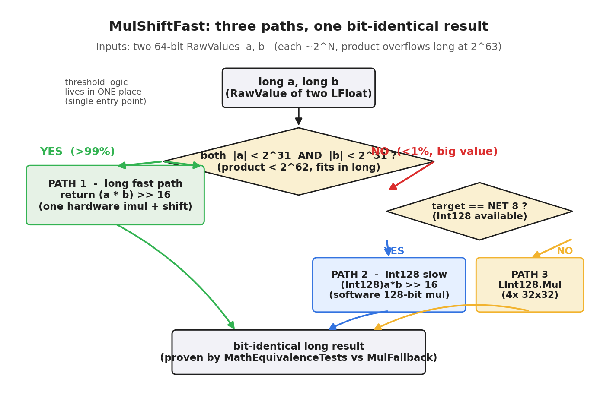
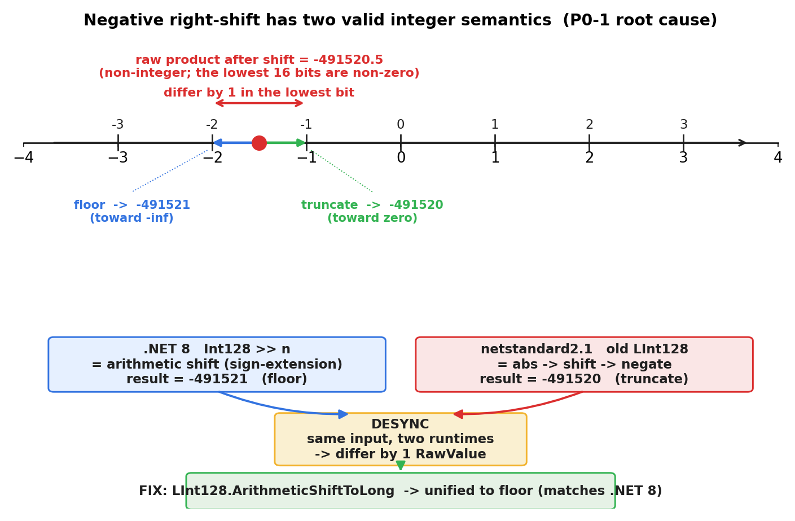
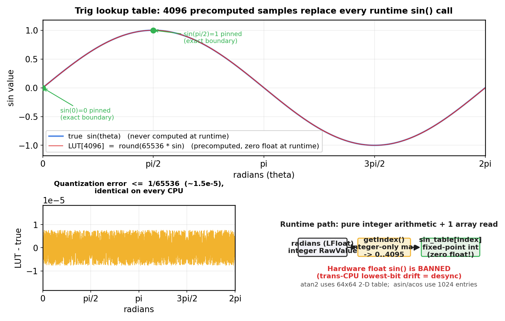

# 第 3 章 · 定点数学库:乘法三路径、三角函数查表、确定性 Sqrt

> **核心问题**:上一章造出了 LFloat 这块砖,知道加减直接算、乘除要移位。但乘法那个"两个 64 位 long 相乘会 128 位溢出"的难题,我们刻意绕过了。而且留了个悬念:同一个 `(a * b) >> 16`,在 .NET 8 和 netstandard2.1 两个运行时上,对负数会算出不一样的结果。这一章就把这些全部讲透——乘法的三路径设计、跨运行时的舍入分叉、三角函数为什么全查表、开方怎么牛顿迭代。这是全书最硬的一章,也是定点数学库的全部精华。

> **读完本章你会明白**:
> 1. 定点乘法为什么不能直接 `(a.RawValue * b.RawValue) >> 16`——128 位溢出,以及怎么用"三路径"漂亮地解决(快速 long + Int128 慢路径 + 双路径等价性测试)。
> 2. 全书最深的 bug 之一(P0-1):同一个乘法在 .NET 8 和 netstandard2.1 上对负数差一个最低位,根因是"截断取整"vs"向下取整"的对立,以及怎么用有符号算术移位解决。
    3. 为什么矩阵/四元数的多乘积必须"累加后再右移",而不是各自右移再相加。
    4. 为什么三角函数(sin/cos/atan2)必须**全查表、零浮点**,查表的精度和索引怎么设计。
    5. 确定性开方(Sqrt)怎么用牛顿迭代实现,初始猜测选错会怎样。

> **如果一读觉得太难**:这章是全书最难的一章,数学密度高。先只记住四件事——① 定点乘法两个 long 相乘会 128 位溢出,要用 128 位中间类型(Int128)兜底;② 负数的"右移"在"截断"和"向下取整"两种语义下差 1,跨运行时会 desync;③ 三角函数不能用 `Math.Sin`(浮点),必须查表;④ Sqrt 用整数牛顿迭代。细节需要时再回来看。

---

## 〇、一句话点破

> **定点数学库的全部精华,是在"确定性"和"性能"两头找平衡。乘法:两个 64 位 RawValue 相乘会 128 位溢出,所以设计三路径——99% 的游戏值走 long 快速路径,大值走 Int128 慢路径,再用"双路径等价性测试"保证两者位级一致;还要解决跨运行时的负数舍入分叉(P0-1:截断 vs 向下取整,用有符号算术移位统一)。三角函数:绝对不能用硬件浮点 sin/cos(跨 CPU 不一致),全部预计算成查找表,运行时只查表零浮点。Sqrt:整数牛顿迭代。这一套下来,定点数学库既确定又够快。**

这是结论。本章倒过来拆,而且会讲两个真实的大 bug(P0-1 跨运行时分叉、Sqrt 初始猜测),它们是理解这些设计为什么这么"较真"的活教材。

---

## 一、乘法的 128 位溢出难题

先把上一章绕过的难题正面拿出来。定点乘法,最朴素的写法是:

```csharp
// 朴素(有 bug):
public static LFloat operator *(LFloat a, LFloat b)
    => new LFloat(true, (a.RawValue * b.RawValue) >> 16);
```

逻辑上没错(两个 RawValue 相乘后右移 16 位修正倍数,上一章讲过)。但有一个致命问题:**`a.RawValue * b.RawValue`,两个 64 位 long 相乘,结果是 128 位,而 long 只有 64 位——高位会丢失,而且是以"环绕"的方式丢失(不是报错)**。

举个例子。假设两个坐标值都不算大:

```
   a = 1000.0  → RawValue = 1000 × 65536 = 65,536,000   (约 2^26)
   b = 1000.0  → RawValue = 65,536,000                   (约 2^26)

   a.RawValue × b.RawValue = 65536000 × 65536000
                           = 4,294,967,296,000,000
                           ≈ 4.3 × 10^15
                           ≈ 2^52   ← 这还在 long(2^63)范围内, 没溢出
```

OK,1000 × 1000 没溢出。但如果坐标再大一点:

```
   a = 10,000,000.0  → RawValue ≈ 6.5 × 10^11   (约 2^39)
   b = 10,000,000.0  → RawValue ≈ 6.5 × 10^11   (约 2^39)

   a.RawValue × b.RawValue ≈ 4.2 × 10^23   ≈ 2^78   ← 远超 long(2^63), 溢出!
```

两个 2^39 的数相乘是 2^78,而 long 只能装 2^63。高位被截断,结果变成一个完全错误的值(甚至可能变负数,因为符号位被污染)。

**而且这个错误是静默的**——不报错,只算错。在帧同步里,这就是 desync:某台机器上算了一次大数乘法,溢出了,结果错了,从此和别的机器分叉。

> **钉死这件事**:定点乘法的核心难题——两个 64 位 RawValue 相乘是 128 位,会溢出 long,而且静默环绕(不报错只算错)。必须用 128 位中间类型来接住这个乘积,右移后再安全地转回 long。怎么"又快又确定地"做到这件事,是本章接下来全部的内容。

---

## 二、三路径设计 + 双路径等价性测试

那怎么解决?最直觉的办法:每次乘法都用 128 位类型算。.NET 8 提供了 `Int128`(硬件支持的 128 位整数),用它接住乘积,右移后转回 long:

```csharp
// 方案 A: 全用 Int128(正确, 但慢)
return (long)(((Int128)a.RawValue * b.RawValue) >> 16);
```

这正确。但有个性能问题:**Int128 运算比 long 慢一个量级**——因为 x86-64 没有 128 位乘法指令,`Int128 * Int128` 是编译器用多条 64 位指令合成的(软件实现)。每秒几百万次乘法(物理积分、距离计算),全走 Int128 性能受不了。

那能不能"大多数情况走快路,只有大值才走 Int128"?这正是 LFloat 的设计——**三路径**。

### 路径一:long 快速路径(99% 的游戏值)

关键洞察:**游戏里的坐标、速度、方向,虽然 RawValue 是 64 位 long,但它们的实际数值通常很小,高 32 位几乎是 0**。

游戏地图坐标 ±1000,对应 RawValue ≈ 1000 × 65536 ≈ 6.5×10^7,约 2^26。速度、方向更小。也就是说,**游戏里 99% 以上的乘法,两个操作数的高 32 位都是 0**(都在 2^31 以内)。

如果两个操作数都小于 2^31,它们的乘积小于 2^62,而 2^62 < 2^63(long 范围)——**不溢出!可以直接用 long 乘法**:

```csharp
// LMath.cs:70-80, MulShiftFast 的 NET8 快速路径(简化示意)
const long FastLimit = 1L << 31;   // = 2^31
if (a < FastLimit && a > -FastLimit && b < FastLimit && b > -FastLimit)
    return (a * b) >> 16;          // 直接 long 乘法, 不溢出, 快!
```

这个判断很便宜(几个比较),而且**分支预测命中率 >99%**(因为游戏值几乎总是小于 2^31)。所以 99% 的乘法走这条极快的 long 路径。

### 路径二:Int128 慢路径(极少数大值)

那剩下 1% 的大值(坐标跑到极大、或者某些中间运算),走 Int128 兜底:

```csharp
// LMath.cs:76, MulShiftFast 的 NET8 慢路径
return (long)(((Int128)a * b) >> 16);   // 128 位接住, 安全
```

Int128 慢,但大值极少,平均下来性能几乎不受影响。

### 路径三:非 .NET 8 平台(LInt128 软件模拟)

上面两条路径都依赖 .NET 8 的硬件 `Int128`。但 LFloat 要同时编译 `netstandard2.1`(为 Unity 等旧运行时),那里**没有 Int128 类型**。怎么办?**手写一个 128 位整数类型 `LInt128`**(下一节详讲):

```csharp
// LMath.cs:78, MulShiftFast 的非 NET8 路径
return MulShift(a, b, 16);   // 内部: LInt128.Mul(a, b).ArithmeticShiftToLong(16)
```

`LInt128.Mul` 用 4 路 32×32→64 的分块乘法软件模拟 128 位乘法(下一节拆)。这样,非 .NET 8 平台也能跑,且结果和 .NET 8 **位级一致**(这是后面 P0-1 bug 的核心战场)。

### 三路径汇总

```csharp
// LMath.cs:70-80, MulShiftFast 完整逻辑(简化示意)
public static long MulShiftFast(long a, long b)
{
#if NET8_0_OR_GREATER
    const long FastLimit = 1L << 31;
    if (a < FastLimit && a > -FastLimit && b < FastLimit && b > -FastLimit)
        return (a * b) >> 16;                    // 路径一: long 快速(99%)
    return (long)(((Int128)a * b) >> 16);        // 路径二: Int128 慢速(1%)
#else
    return MulShift(a, b, 16);                   // 路径三: LInt128 软件(非NET8)
#endif
}
```

注释里写了一句关键的话:"**阈值逻辑只此一处**"——意思是,全库只有这一个地方判断"走快速还是慢速",所有乘法都走这个统一入口。这避免了"每个地方各自判断阈值,行为不一致"的隐患。

### ★双路径等价性测试:性能 + 正确性的双全设计

三路径解决了性能。但带来一个新问题:**三条路径算出来的结果,必须位级完全一致**——否则 .NET 8 走快速路径、netstandard2.1 走 LInt128 路径,又 desync 了。

怎么保证?LFloat 用了一个极其漂亮的工程手段——**双路径等价性测试**。它特意保留了一个"参考实现"`MulFallback`,永远只走 Int128(最权威的实现):

```csharp
// LFloat.cs:117-124, MulFallback(内部方法, 仅供测试)
internal static LFloat MulFallback(LFloat a, LFloat b)
{
#if NET8_0_OR_GREATER
    return new LFloat(true, (long)(((Int128)a.RawValue * b.RawValue) >> 16));
#else
    return new LFloat(true, LMath.MulShift(a.RawValue, b.RawValue, 16));
#endif
}
```

然后有一套 `MathEquivalenceTests`,对**海量的随机输入**,把"快速路径 `MulShiftFast`"和"参考路径 `MulFallback`"的结果**逐位比对**:

```csharp
// 测试伪代码(示意)
for (海量随机 (a, b))
{
    long fast = LMath.MulShiftFast(a, b);      // 被测的快速路径
    long reference = ... MulFallback 的逻辑;    // 权威参考路径
    Assert(fast == reference);                  // 逐位必须相等
}
```

这等于在说:"不管你快速路径怎么优化,只要你的结果和我这个最朴素的权威实现差一个最低位,测试就挂"。**这把"性能优化"和"正确性保证"彻底解耦**——快速路径只管快,正确性由等价性测试兜底。

> **技巧精解 · 双路径等价性测试**:这是全书最漂亮的工程技巧之一。任何"为了性能走捷径"的代码,都保留一个"最朴素、最权威"的参考实现,然后用海量测试逐位比对两者。这样:① 性能优化可以放开手脚(有测试兜底);② 一旦优化出错(哪怕一个最低位),测试立刻抓住。这个模式不只用于乘法,Sqrt、除法都有对应的 Fallback。它是"确定性 + 性能"双全的教科书方案。

> **钉死这件事**:乘法三路径——99% 游戏值走 long 快速路径(判断 |a|,|b|<2³¹),大值走 Int128 慢路径,非 .NET 8 走手写 LInt128。再用"双路径等价性测试"(保留权威 Fallback,海量输入逐位比对)保证三路径位级一致。这是"确定性 + 性能"双全的设计。


图 3-1:定点乘法的三条执行路径——long 快速路径(99% 小值)、Int128 慢路径(大值兜底)、LInt128 软件路径(非 .NET 8 平台),三者结果由"双路径等价性测试"保证位级一致。

---

## 三、手写 LInt128:64×64 → 128 分块乘法

上面提到非 .NET 8 平台要手写 LInt128。这一节拆开看它怎么用 32 位运算拼出 128 位乘法。这既是为了理解非 .NET 8 路径,也是一个经典的"用小类型拼大类型"的技巧。

### 思路:把 64 位数拆成两个 32 位半截

64 位 × 64 位 = 128 位。但 32 位 × 32 位 = 64 位(long 范围内,不溢出)。所以把每个 64 位数拆成"高 32 位"和"低 32 位",用四个 32×32 的乘法拼出结果:

```
   a = ah × 2^32 + al     (ah 是高32位, al 是低32位)
   b = bh × 2^32 + bl

   a × b = (ah×2^32 + al) × (bh×2^32 + bl)
         = ah×bh×2^64 + (ah×bl + al×bh)×2^32 + al×bl
```

四个乘积 `ah×bh`、`ah×bl`、`al×bh`、`al×bl`,每个都是 32×32=64 位(long 装得下)。然后把它们按 2^64、2^32、2^0 的位置加起来,进位传递,就是 128 位结果。

```csharp
// LInt128.cs:28-68, Mul 的非 NET8 分支(简化示意)
public static LInt128 Mul(long a, long b)
{
    // ... 处理符号(取绝对值, 记住正负)
    ulong ua = ...; ulong ub = ...;
    ulong al = ua & 0xffffffff;  ulong ah = ua >> 32;   // 拆半
    ulong bl = ub & 0xffffffff;  ulong bh = ub >> 32;

    ulong m1 = al * bl;    // 32×32, 四个乘积
    ulong m2 = al * bh;
    ulong m3 = ah * bl;
    ulong m4 = ah * bh;

    // 把 m1/m2/m3/m4 按位置加起来, 进位传递 → 128 位 (resHigh, resLow)
    // ... (省略进位累加细节)

    // 如果原结果是负数, 取补码
    // ...
    return new LInt128(resHigh, resLow);
}
```

LInt128 用两个字段存 128 位:`ulong Low`(低 64 位)+ `long High`(高 64 位,有符号,承当符号位)。加法、减法也都有对应的"带进位/借位"实现。

这个手写 128 位,是 netstandard2.1 平台(Unity)能跑帧同步的关键——没有它,Unity 上的 LFloat 就没法做乘法。而在 .NET 8 上,同样的逻辑被硬件 Int128 取代(快得多),但**两者的结果必须位级一致**——这就引出下一节全书最深的 bug。

---

## 四、★跨运行时舍入分叉(P0-1):全书最深的 bug

这是全书最深刻的一个 bug,也是"为什么定点数这么较真"的终极例证。它被项目标记为 **P0-1**(最高优先级),修复注释在源码里写了一大段。理解它,你就理解了"确定性"可以苛刻到什么程度。

### 现象:同一个乘法,两个运行时算出不一样的结果

LockstepSdk 同时编译 `net8.0` 和 `netstandard2.1`。假设一个客户端跑在 .NET 8(独立服务器、桌面端),另一个跑在 netstandard2.1(Unity)。它们算同一个 `LFloat` 负数乘法:

```
   算式:  a × b,  其中 a = -2.5, b = 3   (结果是 -7.5)

   .NET 8 客户端:        算出 RawValue = -491520   (-7.5 × 65536)
   netstandard2.1 客户端: 算出 RawValue = -491519   ← 差 1!
```

差一个最低位!这俩客户端从此 desync。而且因为是负数才出错,调试时往往只测正数,根本发现不了。

### 根因:负数的"右移"有两种语义

问题的根源,在于"负数右移"在数学上有两种合理的定义,而它们对"非整除"的情况差 1:

- **截断取整(truncate toward zero)**:`-7.5 → -7`(向零的方向取整,扔掉小数部分)。
- **向下取整(floor toward -inf)**:`-7.5 → -8`(向负无穷方向取整)。

定点乘法最后要 `>> 16`(右移,等价于除以 65536)。对一个负的非整除结果,这两种语义算出来差 1:

```
   假设乘积 = -491520.5(非整除)

   截断取整(truncate):  -491520.5 → -491520   (向零)
   向下取整(floor):      -491520.5 → -491521   (向负无穷)
   差 1!
```

而 .NET 8 和 netstandard2.1,对"有符号 long 右移"和"Int128 右移",默认的语义恰好不一致!这就导致同一个算式两边差 1。

### .NET 8 用的是"算术右移"(floor)

.NET 8 的 `Int128 >> n` 是**有符号算术右移**——对负数做 floor(向负无穷)。这是大多数现代语言对"有符号整数右移"的默认行为(C# 的 `long >> n` 也是算术右移)。

### 旧版 LInt128 用的是"取绝对值移位再取负"(truncate)

而旧版 LInt128(为了软件模拟)走的是另一条路:先把负数取绝对值,移位,再补回符号。这等价于 **truncate(向零)**——因为取绝对值后是正数,正数右移是 floor 也是 truncate(正数两者一致),补回符号后就变成了"向零取整"。

```
   旧 LInt128.ToShiftedLong(truncate):
     负数 → 取绝对值 → 右移(正数, floor=truncate) → 取负
     = 向零取整

   .NET 8 Int128 >> n(floor):
     负数 → 直接算术右移
     = 向负无穷取整

   负数非整除时, 两者差 1!
```

### 修复:统一为"有符号算术移位"(floor)

修复方法:给 LInt128 加一个专门的 `ArithmeticShiftToLong` 方法,做**真正的有符号算术右移**(和 .NET 8 的 Int128 语义一致,floor),取代旧的 ToShiftedLong:

```csharp
// LInt128.cs:122-126, ArithmeticShiftToLong(修复后的方法)
public long ArithmeticShiftToLong(int shift)
{
    if (shift <= 0) return (long)Low;
    return (long)((Low >> shift) | ((ulong)High << (64 - shift)));
    // 这是二补码算术右移: 高位的符号位会"扩展"进来, 等价于 floor
}
```

然后非 .NET 8 的乘法 `MulShift` 改成用它:

```csharp
// LMath.cs:21-25, MulShift(修复后)
public static long MulShift(long a, long b, int shift = 16)
{
    if (a == 0 || b == 0) return 0;
    return LInt128.Mul(a, b).ArithmeticShiftToLong(shift);   // 用算术移位, 和 NET8 一致
}
```

源码注释里写得很清楚(LMath.cs:14-18):"原实现 abs-then-negate(truncate toward zero)对负数非整除乘积与 NET8 有符号移位(floor)差 1——影响**所有** LFloat 乘法跨 TFM desync"。

> **钉死这件事(P0-1)**:负数"右移"有两种语义——truncate(向零)和 floor(向负无穷),负数非整除时差 1。.NET 8 的 Int128 右移是 floor,旧版 LInt128 软件模拟是 truncate,导致同一个负数乘法在两个运行时上差一个最低位,全网 desync。修复:给 LInt128 实现真正的有符号算术右移(ArithmeticShiftToLong),统一为 floor。这是"确定性的确定性"——连"算同一个右移"本身都要跨运行时位级一致。


图 3-2:P0-1 根因——同一个负数非整除乘积(-491520.5),.NET 8 走算术右移(floor→-491521),旧 LInt128 走"取绝对值移位再取负"(truncate→-491520),两者差一个最低位,跨运行时 desync。修复后 LInt128.ArithmeticShiftToLong 统一为 floor 语义。

### 这个 bug 的深层教训

P0-1 的可怕之处:

1. **只出错在负数 + 非整除**——测试如果只测正数、或只测整除情况,根本发现不了。
2. **不崩溃,只 desync**——两个运行时各算各的,都"看起来正常",慢慢分叉。
3. **根因极隐蔽**——谁能想到"两个运行时的整数右移语义不一样"?这需要对 .NET 运行时和补码运算有极深的理解。
4. **靠双路径等价性测试才能抓住**——正是因为有 `MulFallback` + `MathEquivalenceTests` 在两个运行时上都跑、逐位比对,才暴露了这个差异。这正是上一节"双路径等价性测试"的价值——没有它,这个 bug 可能永远找不到。

> **作者复盘 · P0-1**:这个 bug 是项目从"能用"走向"真能上线"的关键转折。它教会一件事:**确定性不是"我用了整数就稳了",而是"我的每一个运算,在每一个目标平台上,都必须位级一致"**。整数运算绝大多数情况下跨平台一致,但"有符号右移"这种边角语义,不同实现可能不同。双路径等价性测试就是为抓这种 bug 而生的——它不信任任何单条路径,只信任"两条独立实现的路径结果相同"。

---

## 五、矩阵/四元数:多乘积必须"累加后右移"

P0-1 还有个"同伙",出在矩阵和四元数运算上。这一节简短但重要。

矩阵乘法、四元数旋转,核心都是"多个乘积相加"。比如矩阵乘法的一个元素:

```
   C[i][j] = A[i][0]×B[0][j] + A[i][1]×B[1][j] + A[i][2]×B[2][j]
```

这是三个"LFloat×LFloat"乘积相加。朴素写法是"每个乘积各自右移修正,再加起来":

```csharp
// 朴素(有 bug):
long term0 = MulShiftFast(A[i][0], B[0][j]);   // 各自右移修正
long term1 = MulShiftFast(A[i][1], B[1][j]);
long term2 = MulShiftFast(A[i][2], B[2][j]);
long c = term0 + term1 + term2;                  // 再相加
```

但这又踩了 P0-1 的变种坑:**每个乘积各自右移时,会各自丢失小数部分的低位(各自的舍入误差),三个误差加起来,可能和".NET 8 的 Int128 累加后一次右移"差 1-2 个 RawValue**。

正确的做法是**先把三个乘积在 128 位里精确累加,最后统一右移一次**:

```csharp
// LMath.cs:34-60, Mul3SumShift(正确: 累加后统一右移)
public static long Mul3SumShift(long a, long b, long c, long d, long e, long f)
{
    var acc = LInt128.Mul(a, b);                          // a*b, 128位精确
    acc = LInt128.Add(acc, LInt128.Mul(c, d));            // + c*d, 128位累加
    acc = LInt128.Add(acc, LInt128.Mul(e, f));            // + e*f, 128位累加
    return acc.ArithmeticShiftToLong(16);                 // 最后统一右移一次
}
```

LMath 提供了 `Mul2SumShift`(两项)、`Mul3SumShift`(三项)、`Mul4SumShift`(四项),分别用于矩阵/四元数的各种组合。注释里特别强调:"**必须累加后右移,而非各项各自右移再求和**,否则与 NET8 的 `((Int128)p0+p1+...)>>Shift` 在低 16 位非零时差 1-2 RawValue(P0-1 跨 TFM 分叉)"。

还有个细节:**减法项传"取反的操作数"**。因为 `a*b - c*d` 在 128 位累加里,直接传 `-c` 和 `d`(即 `(-c)*d = -(c*d)`),在 128 位精确运算里等价于减法,而 long 取反不溢出。这样避免了"先算 c*d 再用 LInt128.Sub 减"的额外步骤。

> **钉死这件事**:矩阵/四元数的多乘积,必须"**在 128 位里精确累加,最后统一右移一次**",不能"各自右移再相加"。否则各乘积的舍入误差累加,会和 .NET 8 的 Int128 累加结果差 1-2 个最低位(P0-1 变种)。LMath 的 Mul2/3/4SumShift 就是干这个的。

---

## 六、除法:Knuth Algorithm D

乘法讲透了,除法类似——`(a << 16) / b` 会 128 位溢出(a 左移 16 后可能很大)。同样有快速路径(a 小走 long)和慢路径(128/64 除法)。

慢路径的 128 位除以 64 位,用的是 **Knuth 的 Algorithm D**(`The Art of Computer Programming` Vol.2 §4.3.1)——一个经典的"大数除法"算法,以 2^32 为基,大约 2 次原生除法 + 试商修正,就能算出 128/64 的商。这比"逐位相减"的朴素算法(64 次迭代)快得多。

```csharp
// LMath.cs:137-178, Div128By64(简化示意, 详细看源码)
private static ulong Div128By64(ulong high, ulong low, ulong divisor)
{
    // 1. 归一化: 左移除数使其最高位为1, 消除试商误差
    int s = Clz64(divisor);
    // 2. 高位商 q1: 试商 + 至多2次修正
    // 3. 部分余数
    // 4. 低位商 q0: 同上
    return q1 * (1UL << 32) + q0;
}
```

这个算法本身是计算机算术的经典,本书不展开推导(那是《计算机算术》的范畴),你只需要知道:**定点除法的慢路径,用一个经过千锤百炼的经典大数除法算法实现,保证精确和跨平台一致**。这也是"确定性 + 性能"的体现——不自己发明轮子,用数学上被证明正确的算法。

> **钉死这件事**:定点除法同样有 128 位溢出问题,快速路径走 long,慢路径用 Knuth Algorithm D(经典大数除法)实现 128/64。不自己发明算法,用数学证明过的经典算法,保证精确和一致。

---

## 七、三角函数:全查表,零浮点

讲完了乘除,接下来是三角函数(sin/cos/atan2)。游戏里三角函数用得极多——转向(算朝向)、弹道(算抛物线)、碰撞(算法线投影)。

### 为什么不能用 `Math.Sin`

最直觉的做法:把弧度转成 double,调 `Math.Sin`,结果转回 LFloat。但 `Math.Sin` 是**硬件浮点 sin**(调 FPU 的 fsin 指令或数学库),而本章第一节讲过——**硬件浮点运算跨 CPU 不一致**(不同 FPU 的 sin 实现精度不同、舍入不同)。两台机器算 `sin(同一个值)` 可能差一个最低位,desync。

所以帧同步的三角函数,**绝对不能碰任何浮点运算**。

### 解法:预计算查找表(LUT)

思路极其朴素:**在编译期(或启动时),用浮点把 sin/cos 在一个周期内的值算好,存成一个整数数组(表)。运行时,根据弧度算出一个数组下标,直接查表返回——零浮点运算**。

```
   编译期(只算一次, 不影响确定性):
     for i in 0..4095:
         table[i] = round(65536 * sin(i / 4096 × 2π))   // 用浮点算, 存成定点整数

   运行时(确定性, 零浮点):
     index = (弧度.RawValue × 4096 / PI2.RawValue) & 4095   // 纯整数运算算下标
     return table[index]                                    // 查表, 零浮点
```

LFloat 的 `LUTSinCos` 表,大小是 **4096**(把一个周期 2π 等分成 4096 份)。运行时 `Sin` 的实现:

```csharp
// LMath.cs:284-288 (简化示意)
public static LFloat Sin(LFloat radians)
{
    int index = LUTSinCos.getIndex(radians);   // 纯整数运算算下标
    return new LFloat(true, (long)LUTSinCos.sin_table[index]);   // 查表
}
```

`getIndex` 是纯整数运算(本章不展开公式细节,核心是"弧度 → 0~4095 的下标"的整数映射)。表里存的是"放大 65536 倍的 sin 值"(定点整数)。整个 Sin 调用,**一次整数运算 + 一次数组查表,零浮点,跨平台完全一致**。

### 精度:12 位够不够

4096 = 2^12,所以 sin/cos 的角度分辨率是 2π/4096 ≈ 0.087°,值的精度约 12 位。这对游戏够不够?

- 转向:0.087° 的转向误差,人眼根本看不出。
- 弹道:12 位的 sin 值,弹道偏差在万分之一量级,可以接受。
- 但**精密判定**(比如要求 sin(π/2) 严格等于 1)需要注意——查表的 π/2 不一定精确落在某个表项上。

所以 LFloat 还做了关键角度的专门处理(比如确保 sin(0)=0、sin(π/2)=1 这些边界值精确),以及在 atan2/acos 上用了不同精度的表(atan2 用 64×64 二维表,acos/asin 用 1024 项)。这些是"用空间换精度"的权衡。

### SinCos:一次索引取两个值

有个小优化值得提:`SinCos` 方法一次算出 sin 和 cos:

```csharp
// LMath.cs:298-303
public static void SinCos(out LFloat s, out LFloat c, LFloat radians)
{
    int index = LUTSinCos.getIndex(radians);   // 算一次下标
    s = new LFloat(true, (long)LUTSinCos.sin_table[index]);
    c = new LFloat(true, (long)LUTSinCos.cos_table[index]);   // 同一下标取 cos
}
```

因为 sin 和 cos 共用同一个下标(同一个角度),算一次下标就能同时取两个值。旋转计算(同时要 sin 和 cos)用这个,省一半索引计算。

> **钉死这件事**:三角函数绝对不能用 `Math.Sin`(硬件浮点跨 CPU 不一致),必须**全查表零浮点**——编译期算好表,运行时纯整数算下标 + 数组查表。LFloat 的 sin/cos 用 4096 项表(12 位精度),atan2 用 64×64 二维表,acos/asin 用 1024 项。精度够游戏用,且跨平台位级一致。


图 3-3:三角函数 LUT——编译期用浮点把 sin/cos 在一个周期(2π)内等分成 4096 项存成定点整数表,运行时用纯整数运算把弧度映射到 0~4095 下标直接查表;sin/cos 共用同一下标(SinCos 一次取两值),atan2 用 64×64 二维表、acos/asin 用 1024 项表,空间换跨平台位级一致。

> **作者复盘 · 为什么三角函数"精度让位于可重复性"**:这是帧同步和普通游戏最大的区别之一。普通游戏追求"数学上精确"(用 double 算 sin),帧同步追求"跨机器可重复"(查表)。查表的精度比 double 低(12 位 vs 53 位),但**它在所有机器上算出完全一样的 12 位**——这比"每台机器算出不同的 53 位"有价值得多。确定性场景下,一致的低精度 > 不一致的高精度。

---

## 八、确定性 Sqrt:牛顿迭代 + 初始猜测修复

最后讲开方(Sqrt)。游戏里开方用得也多——距离计算(√(dx²+dy²))、归一化(向量除以模长)。

### 不能用 `Math.Sqrt`

理由同上——`Math.Sqrt` 是硬件浮点,跨 CPU 不一致。必须用**整数牛顿迭代**自己算。

### 牛顿迭代法求开方

牛顿迭代法求 √a:从一个初始猜测 x₀ 开始,反复用 `x_{n+1} = (x_n + a/x_n) / 2` 逼近真实开方。每次迭代精度大约翻倍,几次就收敛。

```csharp
// LMath.cs:314-330, Sqrt(long)(简化示意)
public static long Sqrt(long a)
{
    if (a <= 0) return 0;
    if (a < 4) return 1;

    long x = 1L << ((64 - InternalLeadingZeroCount(a) + 1) >> 1);   // 初始猜测
    long x1 = (x + a / x) >> 1;                                      // 第一次迭代
    while (x1 < x)                                                    // 收敛判断
    {
        x = x1;
        x1 = (x + a / x) >> 1;
    }
    return x;   // 收敛到 floor(sqrt(a))
}
```

逻辑:给个初始猜测 x,反复 `(x + a/x)/2`,直到不再减小(x1 >= x),此时 x 就是 floor(√a)。整数运算,跨平台一致。

### 初始猜测的 bug:选错会迭代 30+ 次

这里有个真实的优化 bug,值得讲。初始猜测 x₀ 的选取,直接影响收敛速度(迭代次数)。牛顿迭代对初始猜测的要求是"接近真实开方的量级"。

`Sqrt(a)` 的真实结果量级是 `2^((bits_of_a)/2)`。所以"好"的初始猜测,应该是 `2^(bits_of_a / 2)`。bits_of_a 可以用"前导零计数(CLZ)"算:`bits = 64 - clz(a)`。

旧版的初始猜测公式是:

```csharp
// 旧版(慢, 已修):
long x = 1L << (64 - (clz >> 1));   // 错!
```

这个公式错了——它算出的猜测**过大**。比如 a ≈ 2^37 时,真实 √a ≈ 2^18.5,但旧公式给出 2^(64 - (26/1)) ... 算出来是 2^51(差了 2^33 倍!)。初始猜测离真实值太远,牛顿迭代要 30+ 次才收敛,极慢。

修正后的公式:

```csharp
// LMath.cs:322(修复后):
long x = 1L << ((64 - clz + 1) >> 1);   // 正确: 2^((bits+1)/2)
```

这个公式正确地给出"接近真实开方量级"的猜测。结果不变(牛顿最终都收敛到 floor(√a)),但迭代次数从 30+ 降到几次,大幅提速。

源码注释写得很坦诚(LMath.cs:319-321):"原 `64 - (clz>>1)` 给出过大初始猜测(v≈2^37 时得 2^51 而非 2^19),导致牛顿迭代 30+ 次。改为与 Int128 版一致的公式,结果不变(牛顿收敛到 floor(sqrt)),仅提速。"

> **技巧精解 · 牛顿迭代的初始猜测**:牛顿迭代法求开方,初始猜测的量级要接近真实开方(2^(bits/2))。猜远了能收敛但慢(30+ 次),猜近了几次就收敛。这是个典型的"结果对但性能差"的 bug——不报错、不算错,只是慢,性能测试才能抓到。

### Sqrt(LFloat) 的双路径

和乘法一样,Sqrt 也有"快速 long 路径 + Int128 慢路径 + 双路径等价性测试(SqrtFallback)"。LFloat 的 Sqrt:

```csharp
// LMath.cs:351-380, Sqrt(LFloat) 的 NET8 路径(简化)
public static LFloat Sqrt(LFloat a)
{
    if (a.RawValue <= 0) return LFloat.Zero;
#if NET8_0_OR_GREATER
    const long FastMaxRaw = long.MaxValue >> 16;   // = 2^47
    if (a.RawValue < FastMaxRaw)
        return new LFloat(true, Sqrt(a.RawValue << 16));   // 64位牛顿, 快
    return SqrtFallback(a);                                  // Int128 慢路径
#else
    // 非 NET8: 类似的快速路径 + 软件慢路径
#endif
}
```

注意一个细节:`Sqrt(a.RawValue << 16)`——LFloat 的 RawValue 放大了 65536 倍,开方要先把它"还原"一下(左移 16 调整倍数),再调整数 Sqrt。这是因为 √(a × 65536) = √a × 256,要补回这个 256 的系数。

> **钉死这件事**:开方不能用 `Math.Sqrt`(浮点跨 CPU 不一致),用**整数牛顿迭代**——`x = (x + a/x)/2` 反复逼近,收敛到 floor(√a)。初始猜测要接近真实量级(`2^((bits+1)/2)`),旧版公式给过大猜测致 30+ 次迭代(已修)。同样有快速 long + Int128 + Fallback 三路径。

---

## 九、技巧精解:两个最深的技巧

这一节把本章最深的两个技巧再单独强调一下。

### 技巧一:双路径等价性测试(贯穿全章)

本章反复出现的"双路径等价性测试",是全书最重要的工程技巧,值得再强调一次。

**模式**:任何有"快速路径 + 慢路径"的运算(乘法、除法、Sqrt),都保留一个"只走最权威实现"的 Fallback 方法,然后用海量测试**在所有目标平台上**,把快速路径和 Fallback 的结果**逐位比对**。

```csharp
// 模式示意
long fast = Optimized_FastPath(a, b);    // 被优化的快速路径
long reference = Authoritative_Fallback(a, b);  // 最朴素权威实现
assert(fast == reference);                 // 逐位必须相等, 在所有平台
```

**为什么这个模式这么重要**:

1. **它抓住了 P0-1 那种极隐蔽的 bug**——两个运行时右移语义不同,任何单平台测试都发现不了,只有"双路径在双平台逐位比对"才抓得到。
2. **它让性能优化没有后顾之忧**——快速路径可以放手优化(改位运算、改分支),只要测试通过就保证正确。
3. **它是一种"不信任"的工程哲学**——不信任单条路径,只信任"两条独立实现一致"。

这个模式不只用于数学库。在分布式系统、编译器、密码学里都有类似思想(参考实现 + 等价性测试)。本书后面讲序列化、哈希时也会呼应。

### 技巧二:用查表消灭浮点(三角函数)

第二个技巧是"**把跨平台不确定的浮点运算,挪到编译期,运行时只查表**"。

三角函数的浮点 sin/cos 跨 CPU 不一致。但它们的值是确定的数学常数(sin(π/4) 永远是 √2/2)。所以:**在编译期(用浮点)算好所有可能用到的值,存成整数表;运行时只查表,零浮点**。

这个思路的本质是:**把"不确定性"关进编译期的笼子**——编译期用浮点算(那时候算几次,结果存进表,之后再也不算了),运行期完全确定性。这是个可推广的模式:任何"跨平台不确定但值确定"的运算,都可以这么处理。

> **钉死这件事**:本章两个最深技巧——① 双路径等价性测试(快速路径 + 权威 Fallback,海量输入逐位比对,抓 P0-1 那种隐蔽 bug,让优化无后顾之忧);② 用查表消灭浮点(把跨平台不确定的浮点运算挪到编译期,运行时零浮点,把不确定性关进编译期的笼子)。

---

## 十、章末小结

### 回扣主线

本章服务"确定性内核",是全书最硬的招牌。我们把定点数学库的全部精华讲透了:乘法的 128 位溢出 + 三路径(long 快速 / Int128 慢速 / LInt128 软件模拟)+ 双路径等价性测试;全书最深的 bug P0-1(负数右移 truncate vs floor 跨运行时分叉,用有符号算术移位解决);矩阵多乘积"累加后右移";除法用 Knuth Algorithm D;三角函数全查表零浮点;Sqrt 整数牛顿迭代 + 初始猜测修复。贯穿全章的是"确定性 + 性能"的双全追求。

### 五个为什么

1. **定点乘法为什么不能直接 `(a.RawValue * b.RawValue) >> 16`?**——两个 64 位 long 相乘是 128 位,溢出 long,静默环绕成错误值(desync)。要用 128 位中间类型接住,右移后转回 long。
2. **三路径怎么兼顾性能和正确性?**——99% 的游戏值(高 32 位为 0,|a|,|b|<2³¹)走 long 快速路径,乘积 < 2⁶² 不溢出;大值走 Int128;非 .NET 8 走手写 LInt128。再用双路径等价性测试保证三路径位级一致。
3. **P0-1 跨运行时 desync 的根因是什么?**——负数"右移"有两种语义:truncate(向零)和 floor(向负无穷),负数非整除时差 1。.NET 8 的 Int128 右移是 floor,旧版 LInt128 软件模拟是 truncate,导致同一个负数乘法在两个运行时差一个最低位。修复:实现真正的有符号算术右移(ArithmeticShiftToLong),统一为 floor。
4. **三角函数为什么必须查表?**——`Math.Sin` 是硬件浮点,跨 CPU 不一致(desync)。查表把"跨平台不确定的浮点运算"挪到编译期(算好存成整数表),运行时纯整数算下标 + 查表,零浮点,跨平台位级一致。
5. **双路径等价性测试为什么重要?**——它抓住 P0-1 那种"单平台测试发现不了"的极隐蔽 bug(两个运行时右移语义不同),让性能优化没有后顾之忧(有测试兜底)。是一种"不信任单条路径,只信任两条独立实现一致"的工程哲学。

### 想继续深入往哪钻

- 想看 P0-1 的完整修复细节和测试:第 25 章(bug 定位实战,P0-1 案例)。
- 想搞懂向量/矩阵怎么用这套定点数学:第 5 章(ECS,组件里有 LVector2/Transform)。
- 想搞懂"双路径等价性测试"在序列化、哈希上的对应:第 7 章(序列化)、第 23 章(哈希双轨)。
- 想看三角函数查表在转向、弹道里的实际用法:第 27 章(TankGame 实战)。

### 引出下一章

至此,确定性内核的"数学地基"——LFloat 和定点数学库——讲完了。我们有了确定的小数、确定的加减乘除、确定的三角函数和开方。但帧同步的不确定性,不只来自"数",还来自**随机数**——`new Random().Next()` 在不同 .NET 版本上生成的序列不一样,同样会 desync。下一章第 4 章,**确定性随机 LRandom:Xorshift128+ 与状态序列化**,我们讲为什么 `System.Random` 不能用,以及 LRandom 怎么用 Xorshift128+ 实现"种子相同则序列相同、且能序列化进快照支持回滚"。

> **下一章**:[第 4 章 · 确定性随机 LRandom:Xorshift128+ 与状态序列化](P2-04-确定性随机LRandom-Xorshift128与状态序列化.md)
