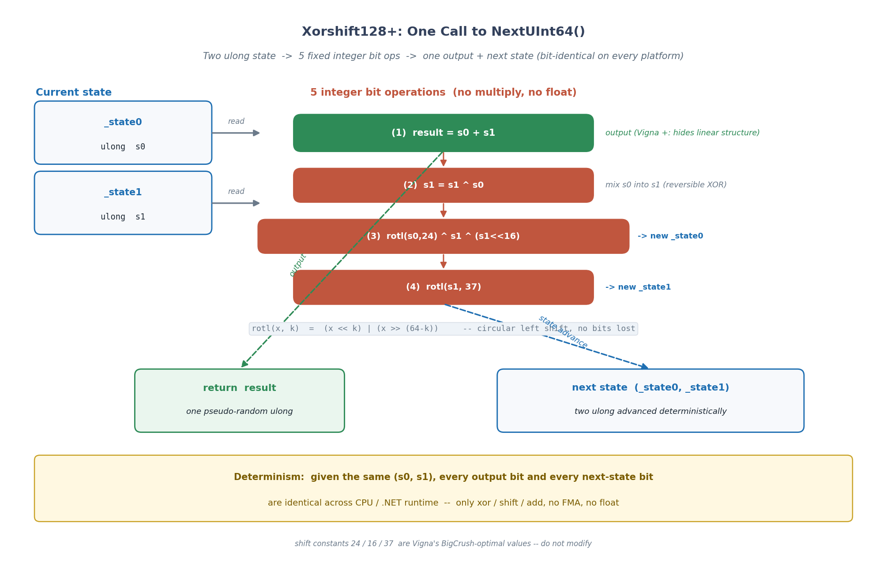
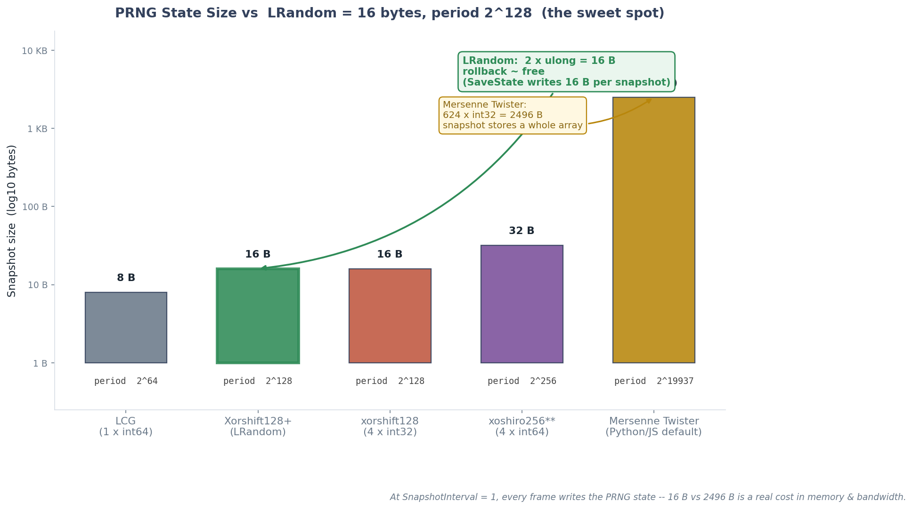

# 第 4 章 · 确定性随机 LRandom:Xorshift128+ 与状态序列化

> **核心问题**:前两章把"小数"做确定了——LFloat 用整数代替浮点,跨机器位级一致。可帧同步的不确定性远不止于"数"。游戏里有一类极常见的运算叫"随机":道具掉落、暴击判定、出生点散布、AI 抖动……这些"随机"在不同机器上必须产生**完全相同的序列**,否则一样 desync。但 C# 自带的 `System.Random`,你敢用吗?同一个种子,在 .NET Framework 4.x、.NET Core 3.1、.NET 5/6/7/8 上,生成的序列**算法各不相同**——一台手机(.NET 8)和一个 Unity 客户端(Mono,跑着 netstandard2.1)同时 `new Random(42).Next()`,第一个数就可能不一样。这一章讲 LRandom 怎么彻底解决这个问题:Xorshift128+ 算法保证"种子相同则序列相同",状态只有两个 `ulong`,回滚时存/恢复这两个数,零成本。

> **读完本章你会明白**:
> 1. 为什么 `System.Random`(以及 `UnityEngine.Random`、`DateTime.Now.Ticks` 做 seed)全是 desync 源——跨版本算法变化、跨平台行为差异、种子空间陷阱。
> 2. 为什么选 Xorshift128+(Vigna 算法)而不是经典的 LCG 或更简单的 xorshift64——长周期、高质量、跨平台纯整数运算。
> 3. splitmix64 为什么从单 seed 扩出两个状态——避免 `seed=0` 直接退化,且让"挨得近的两个种子"产生截然不同的序列。
> 4. 随机数状态为什么必须进快照、且是回滚零成本的两个 `ulong`——`State => (_state0, _state1)` 一行吐出,`RestoreState(s0, s1)` 一行恢复。
> 5. 一个真实的对称性 bug(ISSUE-P0-02):`SetSeed` 保证非零状态但 `RestoreState` 早期不检查,反序列化损坏致 `(0,0)` 序列脱节——以及它怎么被发现、怎么修。

> **如果一读觉得太难**:先只记住四件事——① 帧同步绝对不能用 `System.Random`,跨 .NET 版本算法不一样;② LRandom 用 Xorshift128+,状态就两个 `ulong`,种子相同则序列相同;③ 状态必须进快照(回滚时连随机数也要一起倒带),好在就两个 `ulong`,存恢复几乎零成本;④ 任何"用当前时间做种子"都是 desync 源,种子必须由房间/服务器统一确定。

---

## 〇、一句话点破

> **确定性随机的本质,是把"随机"从一件"看运气的事"变成一件"看状态的事"——给定相同的状态(两个 `ulong`),Xorshift128+ 经过固定的几步位运算(rotl、xor、shift)吐出下一个数,并同时把状态推进到下一个确定值。所以"随机"在帧同步里是个伪命题:它根本不随机,它是一条由初始种子唯一决定的、跨平台完全相同的确定序列。LRandom 把这条序列装进两个 `ulong`,而这两个 `ulong` 能直接序列化进快照——这就是为什么随机数能被"倒带"。**

这是结论。本章倒过来拆:先讲 `System.Random` 到底为什么不能用(它的问题不在于"算法不好",而在于"跨版本/跨平台不一致"),再讲 Xorshift128+ 的数学原理和它凭什么比 LCG 强,然后看 splitmix64 怎么把单 seed 安全地扩成两状态,最后把"状态进快照"和那个对称性 bug 串起来。

---

## 一、`System.Random` 到底为什么不能用

很多人对"为什么不能用 `System.Random`"的理解,停留在"它可能不够随机"。这是**完全错的**。问题根本不在"够不够随机",而在"跨版本、跨平台不一致"。我们把这条线索彻底捋清楚。

### 先回顾:`System.Random` 是怎么生成一个随机数的

C# 自带的 `System.Random` 是一个**伪随机数生成器**(PRNG, Pseudo-Random Number Generator)。它的核心思想和 LRandom 一样:有一个**内部状态**(state),每次调用 `Next()`,算法用当前状态算出"下一个数",同时把状态推进到下一个值。所以给定相同的初始种子,生成的序列是确定的——这叫"伪随机"。

> **承接数学线**:这正是《概率论》里讲的"伪随机序列"——它不是真随机(真随机要靠物理熵源,比如电子噪声),而是一条由初始种子和算法唯一确定的、看起来随机的数列。本书不重复讲伪随机的数学原理(线性同余、周期、均匀分布的证明),篇幅留给帧同步特有的——为什么游戏必须用确定性随机,以及随机数状态怎么进快照支持回滚。想深入伪随机数学,看《概率论》相关章节。

朴素地说,`new Random(42).Next()` 在任何一台机器上,只要算法和种子相同,第一个数应该是一样的。**理论上如此。**

### 但现实是:`System.Random` 的算法,跨 .NET 版本完全不同

问题来了。`System.Random` 的**具体算法**,微软在 .NET 的历史里**改过好几次**:

- **.NET Framework 1.x ~ 4.x**:用的是基于 Knuth 的**减法生成器**(subtractive generator,一种 LCG 变种),内部用一个 56 个 `int` 的数组维护状态。算法细节散落在老资料里,常常被写错。
- **.NET Core 2.0+ / .NET 5+**:微软把它**整体换成了 xoshiro 系**的 PRNG(xoshiro128** / xoshiro256**),理由是更快的速度和更好的统计性质。`new Random(seed)` 内部用一个不同的状态结构(几个 `ulong`)。
- **.NET 6+ 又改了**:引入了 `System.Random.Shared`(线程安全的全局长实例,基于 `xoshiro256**`),并进一步调整了种子的初始化路径。

这几次改动的后果是残酷的:**同一个 `new Random(42)`,在 .NET Framework 4.8 和 .NET 8 上,生成的第一个数就不一样**。

```
   客户端 A(Windows, .NET Framework 4.8): new Random(42).Next() → 某个数 X
   客户端 B(Linux, .NET 8):              new Random(42).Next() → 某个数 Y
   客户端 C(Unity Mono, netstandard2.1):  new Random(42).Next() → 某个数 Z (又是另一个)
```

X、Y、Z 三个数**互相不相等**。在普通程序里这无所谓——你只是要个"看起来随机"的数。但在帧同步里,客户端 A 的坦克暴击了、客户端 B 的没暴击,从此局面分叉——desync。

> **钉死这件事**:`System.Random` 的算法在 .NET 各版本里改过多次(Framework 用减法生成器,.NET Core 2.0+ 换成 xoshiro 系),同一个种子在不同 .NET 版本上生成的序列不同。这是帧同步绝对不能用它的根本原因——不是"不够随机",是"跨版本不一致"。而这个不一致是**你控制不了的**(你不能强迫用户的手机装某个特定版本的 .NET)。

### 雪上加霜:无参构造函数的"时间种子"陷阱

更隐蔽的坑:`new Random()`(无参构造)用**当前系统时间**做种子。这在帧同步里是双重灾难:

1. **两台机器的系统时间不一样**:一台 10:00:01.234,另一台 10:00:01.456——种子不同,序列完全不同。
2. **就算两台机器时间碰巧接近**:服务器先到的客户端和后到的客户端,初始化 `Random` 的时刻差几个毫秒,种子还是不同。

这等于把"不同步"写进了基因。

> **不这样会怎样**:哪怕你只在客户端启动时 `new Random()` 一次,后续逻辑全用它,两台机器的第一个数就已经不同了——而且这个差异会**逐帧放大**(A 这帧暴击了 B 没暴击,血量分叉,血量分叉又影响下一帧的攻击逻辑……)。几秒后局面完全不同。

### 还有 `UnityEngine.Random`、`DateTime.Now.Ticks`

Unity 用户常踩的几个变种:

- **`UnityEngine.Random`**:它的种子和状态是**全局静态**的,且算法是 Unity 自己定的(Mono 和 IL2CPP 后端还可能有差异)。同样跨版本、跨后端不一致。
- **`UnityEngine.Random.Range(0f, 1f)`**:返回 `float`——除了不确定性,还顺带把浮点 desync 问题(P1-02 章)又引进来一遍。
- **`DateTime.Now.Ticks` 做 seed**:`DateTime.Now` 读的是**墙钟**(wall clock),受系统时间设置和 NTP 调整影响——两台机器的 Ticks 几乎不可能相等,seed 永远不同。

> **作者复盘 · 早期踩过的"随机 desync"坑**:项目早期有一次诡异的 desync——单机调试时一切都对,一联机就分叉,而且分叉点似乎和"什么时候开打"有关。后来定位到,是某个系统里偷偷用了 `UnityEngine.Random.value` 取一个随机浮点。单机时只有一份"随机源",没问题;联机时两台客户端各自的 Unity 全局随机状态不同,第二个数就不一样了。这个 bug 极难抓,因为"随机"在调试输出里看起来"挺随机的",你不会本能地怀疑它。从那以后定了一条铁律:**逻辑层禁止出现任何 `System.Random`/`UnityEngine.Random`/`DateTime.Now`,框架在 DEBUG 下反射体检拦截**(后面讲这个体检)。

### 框架的硬约束:DEBUG 反射体检

正因为 `System.Random` 是 desync 头号嫌疑,LockstepSdk 在 DEBUG 模式下有一道**反射体检**,扫描每个 `ISystem`(游戏逻辑系统)的字段,一旦发现它持有 `System.Random`、`Guid`、`Stopwatch`、`CancellationToken`、`Task` 这些"非确定性类型",直接在加载时抛异常拒绝:

```csharp
// ECS/ISystem.cs:188-195 (摘录)
private static readonly HashSet<Type> NonDeterministicTypes = new()
{
    typeof(System.Random),
    typeof(System.Guid),
    typeof(System.Diagnostics.Stopwatch),
    typeof(System.Threading.CancellationTokenSource),
    typeof(System.Threading.CancellationToken),
};
```

`System.Random` 是这个黑名单的**第一条**。这意味着:你写一个 `public System.Random _rng;` 的 System,DEBUG 下根本启动不起来。这是"把确定性纪律做成编译期/加载期硬约束"——P2-05 章会专门讲这套防呆体系,这里先记住:**逻辑层碰 `System.Random`,框架直接拒绝**。

> **钉死这件事**:`System.Random` 是 desync 头号嫌疑,框架 DEBUG 反射体检(`ISystem` 黑名单第一条)直接拦截持有它的 System。`UnityEngine.Random`、`DateTime.Now.Ticks` 同理是禁用的——前者跨后端不一致,后者两台机器时间永不相等。所有这些的解法只有一个:**自己实现一个确定性 PRNG,种子由房间/服务器统一确定**。

---

## 二、Xorshift128+:凭什么选它

既然不能用 `System.Random`,得自己写一个 PRNG。PRNG 的算法多如牛毛——最古老最简单的**线性同余生成器**(LCG, Linear Congruential Generator)、Vigna 的 **xorshift** 系列、更现代的 **PCG**、密码学级的 **ChaCha20**……LRandom 选的是 **Xorshift128+**(Sebastiano Vigna 在 2015 年提出)。这一节讲清楚:为什么选它,而不是别的。

### 先看最朴素的笨办法:LCG 为什么不行

最古老的 PRNG 是 LCG,公式长这样:

```
   state_{n+1} = (a × state_n + c) mod m
   输出 = state
```

`a`、`c`、`m` 是算法选定的常数,`state` 是内部状态。LCG 极快(一次乘法一次加法一次取模),历史上大量使用(老的 `rand()`、Java 的 `java.util.Random` 都是 LCG)。

但 LCG 有几个致命问题,让它在帧同步里不是好选择:

1. **统计质量差**:低位有明显的周期性模式(比如 `state mod 2^k` 的低位会循环)。如果你用 `Next() % 6` 模拟掷骰子,低位的周期性会让某些点数比别的更频繁——这是经典的"LCG 低位陷阱"。
2. **状态空间小**:LCG 的状态通常就一个 `int` 或 `long`,周期最多就是 `2^(状态位数)`。一个 64 位 LCG 周期最多 2⁶⁴,听起来不小,但对"高质量随机"的要求来说偏短。
3. **预测容易**:LCG 的输出泄露完整状态(输出就是状态本身),只要观察到连续几个输出,就能反推 `a`、`c`、`m`,预测后续所有数。这对反作弊不友好(虽然帧同步的反作弊主要靠服务器权威,但 PRNG 难预测仍是加分项)。

> **不这样会怎样**:用 LCG 做"暴击判定"(`Next(100) < 30` 表示 30% 暴击率),由于低位周期性,可能出现"每隔 8 次攻击必暴击一次"的肉眼可见模式——玩家会觉得"这暴击不太对劲",而且两台客户端的低 3 位周期虽然一致(确定性不破坏),但游戏手感会被这种统计偏差糟蹋。

### xorshift 家族:用位运算代替乘法

Vigna 的 **xorshift** 系列思路不同:它不用乘法(LCG 的 `a × state`),而是纯用**位运算**(异或 `^` 和移位 `<<` `>>`)来"搅乱"状态。位运算比乘法快,而且跨平台行为更确定(整数移位在任何 CPU 上语义一致,不像浮点有 FMA 那种坑)。

最简单的 **xorshift32**(单个 32 位状态):

```
   state ^= state << 13;
   state ^= state >> 7;
   state ^= state << 17;
   输出 = state
```

三次异或移位,把状态彻底搅乱。这比 LCG 快得多,统计质量也好得多。但 xorshift32 的状态只有一个 32 位数,周期最多 2³² − 1(约 43 亿),对现代应用不够长。

### xorshift128:四个 32 位状态,周期 2¹²⁸ − 1

把状态扩到**四个 32 位数**(128 位总状态),就是 **xorshift128**。Marsaglia 在 2003 年提出,周期 2¹²⁸ − 1——这是个天文数字(约 3.4 × 10³⁸),即使每秒生成 10 亿个数,跑几百年也用不完一个周期。

### Xorshift128+:Vigna 的关键改进

但 xorshift128 有个统计学缺陷:它在某些"高维"统计检验(比如 BigCrush)上**不过关**——某些维度上会出现肉眼可见的非随机模式。Vigna 在 2015 年提出了 **Xorshift128+**:在 xorshift128 的基础上,**把输出改成"两个状态的相加"**(`s0 + s1`),并且调整了移位常数。这一个"相加"操作极大地改善了统计质量——Xorshift128+ 通过了 BigCrush 的所有检验,质量接近 PCG、远超 LCG。

> Vigna 算法的精妙处在于:**它保留了 xorshift128 的速度和确定性的核心(纯整数位运算 + 加法,无乘法无浮点),却通过"输出 = s0 + s1"这一步把统计质量拉到一流水准**。这是"快"和"好"的双全——帧同步要的就是这个。

为什么 LRandom 选 Xorshift128+ 而不是更新的 **xoshiro256** 或 **PCG**?几个理由:

1. **状态小**:Xorshift128+ 的状态是**两个 `ulong`**(128 位),快照只存两个 8 字节数——回滚零成本(后面详讲)。xoshiro256 是四个 `ulong`(256 位),状态翻倍。
2. **跨平台纯整数**:整个算法只有 xor、shift、add,全是整数运算,在任何 CPU、任何 .NET 运行时上行为完全一致——这正是帧同步的命根子(对照 P1-03 章浮点跨平台不一致的教训)。
3. **质量够用**:Xorshift128+ 通过 BigCrush,统计质量远超游戏需求。游戏里的随机(暴击、掉落、抖动)对统计性的要求,远低于密码学或科学仿真。
4. **被广泛验证**:Xorshift128+ 是 Vigna 作者钦定的算法,被大量语言和库采用,实现细节在源码和论文里写得清清楚楚——不存在"算法本身跨实现不一致"的隐患(对照 `System.Random` 的算法反复变动)。

> **钉死这件事**:LRandom 选 Xorshift128+(Vigna 2015),理由——① 纯整数位运算(xor/shift/add)跨平台位级一致(对照浮点的 FMA/扩展精度坑);② 状态只有两个 `ulong`(128 位),快照极小,回滚零成本;③ 通过 BigCrush 统计检验,质量远超游戏需求;④ 算法公开稳定(不像 `System.Random` 跨版本变)。不选 LCG(低位有周期性、统计差),不选 xoshiro256(状态翻倍没必要),不选 PCG(实现复杂)。

---

## 三、Xorshift128+ 的核心算法:三步位运算

现在拆开看算法本身。整个 Xorshift128+ 的"生成下一个数",**只有 5 行代码**:

```csharp
// LRandom.cs:83-94, NextUInt64
public ulong NextUInt64()
{
    ulong s0 = _state0;
    ulong s1 = _state1;
    ulong result = s0 + s1;          // ① 输出 = 两状态相加(Vigna 的关键改进)

    s1 ^= s0;                         // ② 搅乱: s1 异或 s0
    _state0 = RotateLeft(s0, 24) ^ s1 ^ (s1 << 16);   // ③ 更新 state0
    _state1 = RotateLeft(s1, 37);                     // ④ 更新 state1

    return result;
}
```

就这 5 行。我们来逐行理解每一行在干什么、为什么这么写。

### 第①行:`result = s0 + s1`(输出)

这是 Vigna 的关键改进。注意输出**不是** `_state0` 或 `_state1` 本身,而是**两者相加**。为什么?

原始的 xorshift128(不加这个相加)的输出就是 state 本身,这导致输出"泄露完整状态"——攻击者观察到连续几个输出就能反推状态。而且统计上,直接输出 state 在高维检验(BigCrush)上会暴露线性结构。

把输出改成 `s0 + s1`(一个 64 位加法),巧妙地**把线性结构藏起来**——加法引入的非线性,让输出不再线性泄露状态,统计质量飙升。这一步是 Xorshift128+ 里"+"号的来源,也是它优于原版 xorshift128 的核心。

### 第②行:`s1 ^= s0`(搅乱)

把 `s1` 异或上 `s0`。`^`(XOR)是位运算里"可逆搅乱"的经典手段——它把 `s0` 的位模式"叠加"进 `s1`,两边的位互相搅在一起。这一步为下面的状态更新做准备。

### 第③行:`_state0 = RotateLeft(s0, 24) ^ s1 ^ (s1 << 16)`(更新 state0)

这是 state0 的更新公式。先看 `RotateLeft(s0, 24)`:

```csharp
// LRandom.cs:179-183
private static ulong RotateLeft(ulong x, int k)
{
    return (x << k) | (x >> (64 - k));
}
```

`RotateLeft(x, k)` 是**循环左移**:把 `x` 的高 `k` 位"绕"到低位。和普通左移 `x << k` 不同——普通左移在低位补 0,会丢掉高位信息;循环左移把"溢出的高位"接到低位,信息不丢。这是高质量 PRNG 的常用操作(避免状态"漏"出去)。

然后 `^ s1 ^ (s1 << 16)`:把循环移位后的 s0、(异或过 s0 的)s1、s1 左移 16 位,三者异或在一起。三重搅乱,让 state0 彻底"换脸"。

那两个常数 **24** 和 **16** 是哪来的?是 Vigna 用穷举搜索找出来的"最优移位常数"——这组常数让 Xorshift128+ 在 BigCrush 检验里得分最高。**不要随便改这两个数**(改了统计质量可能骤降,虽然确定性不破,但游戏手感会变怪)。

### 第④行:`_state1 = RotateLeft(s1, 37)`(更新 state1)

state1 的更新简单些:把(异或过 s0 的)s1 循环左移 37 位。常数 **37** 同样是 Vigna 搜出来的最优值。

### 把 5 行合起来看:状态在 128 位空间里"游走"

把 ①②③④ 合起来:每调用一次 `NextUInt64()`,算法用当前的两个状态 `(_state0, _state1)` 经过固定的几步位运算,算出**下一个数** `result`,同时把状态推进到**下一个确定值** `(新的 _state0, 新的 _state1)`。

这个推进过程是**完全确定的**——给定输入状态,输出状态和输出数都唯一。所以整个随机序列,是由初始状态 `(_state0, _state1)` 唯一确定的一条 128 位状态链:

```
   初始状态 (s0_0, s1_0)  → NextUInt64 → 第 1 个数 r1, 状态变 (s0_1, s1_1)
                          → NextUInt64 → 第 2 个数 r2, 状态变 (s0_2, s1_2)
                          → NextUInt64 → 第 3 个数 r3, 状态变 (s0_3, s1_3)
                          → ...
```

只要两台机器的初始 `(s0_0, s1_0)` 相同,这条链就完全相同,生成的每个 `r` 也完全相同。这就是"确定性随机"。而因为算法只有 xor/shift/add/rotatel 这些整数操作,在任何 CPU、任何 .NET 运行时上,每个 `r` 都**位级相同**——这正是帧同步要的。



> **钉死这件事**:Xorshift128+ 的 `NextUInt64` 只有 5 行——`result = s0+s1`(输出,Vigna 的质量改进)、`s1^=s0`(搅乱)、`_state0 = rotl(s0,24)^s1^(s1<<16)`(更新 state0,常数 24/16 是 Vigna 搜出的最优值)、`_state1 = rotl(s1,37)`(更新 state1)。全程纯整数位运算,跨平台位级一致,确定性由初始状态 `(s0, s1)` 唯一决定。

---

## 四、splitmix64:从单 seed 安全扩出两状态

Xorshift128+ 要两个 `ulong` 当状态。但游戏通常只给一个 seed(比如 `roomSeed = 12345`)。怎么从一个 32 位或 64 位的 seed,**安全地**扩出两个互不相关、都非零的 `ulong` 状态?LRandom 用 **splitmix64**(Sebastiano Vigna 同时期的另一个算法,设计初衷就是"把一个数扩成几个独立的随机状态")。

### 为什么不能简单地把 seed 拆两半

最直觉的笨办法:`_state0 = seed`, `_state1 = ~seed`(取反)。这有两个毛病:

1. **seed = 0 直接退化**:如果 `seed = 0`,那 `_state0 = 0, _state1 = 0xFFFFFFFFFFFFFFFF`——虽然非零,但状态空间极小(很多 seed 都映射到同一对状态)。
2. **挨得近的 seed 序列挨得近**:`seed=1` 和 `seed=2` 产生的初始状态只差几个 bit,前几个随机数会很接近——这在游戏里是可见的 bug(比如两个房间种子差 1,道具掉落的第一个模式几乎一样)。

> **不这样会怎样**:游戏地图常用"房间号"当 seed。如果 seed 扩状态的映射太"线性",房间 1 和房间 2 的地图(地形、道具、出生点)会高度相似——玩家会觉得"这两局长得差不多",体验差。splitmix64 通过两次"乘大常数 + 异或移位"的搅乱,让挨得近的 seed 产生截然不同的状态——这叫**雪崩效应**(avalanche):输入变 1 个 bit,输出变约 50% 的 bit。

### splitmix64 的核心:乘大常数 + 异或移位

看 LRandom 的 `SetSeed`:

```csharp
// LRandom.cs:45-62, SetSeed
public void SetSeed(uint seed)
{
    // 使用 splitmix64 从单个种子生成两个状态
    ulong z = seed;
    z = (z ^ (z >> 30)) * 0xBF58476D1CE4E5B9UL;          // ① 第一次搅乱
    z = (z ^ (z >> 27)) * 0x94D049BB133111EBUL;          // ② 第二次搅乱
    _state0 = z ^ (z >> 31);                              // ③ 得到 state0

    z = _state0 + 0x9E3779B97F4A7C15UL;                  // ④ 加黄金比例常数
    z = (z ^ (z >> 30)) * 0xBF58476D1CE4E5B9UL;          // ⑤ 再次搅乱
    z = (z ^ (z >> 27)) * 0x94D049BB133111EBUL;          // ⑥ 再次搅乱
    _state1 = z ^ (z >> 31);                              // ⑦ 得到 state1

    if (_state0 == 0 && _state1 == 0)                     // ⑧ 零状态兜底
    {
        _state0 = 1;
    }
}
```

逐段拆:

- **①②③:用 splitmix64 把 seed 搅成 state0**。核心是两次"`z = (z ^ (z >> k)) * C`"——先异或右移(把高位混进低位),再乘一个大常数(雪崩效应,一个 bit 的变化扩散到整个字)。两个常数 `0xBF58476D1CE4E5B9` 和 `0x94D049BB133111EB` 是 splitmix64 论文里给出的"奇数常数"(保证乘法可逆,不丢信息)。最后 `z ^ (z >> 31)` 再做一次异或右移收尾。三步下来,seed 的每个 bit 都被彻底打散,产生一个看起来随机的 `ulong` 当 state0。
- **④:加黄金比例常数 `0x9E3779B97F4A7C15`**。这个常数是 2⁶⁴ / φ(黄金比例)的近似值——Vigna 用它来"从一个状态生成下一个独立状态"。加这个常数的效果是:state1 和 state0 之间差了"一个黄金比例"的位移,两者统计上独立(挨得近的 seed 不会让 state0 和 state1 相关)。
- **⑤⑥⑦:再走一遍 splitmix64,得到 state1**。和 ①②③ 一样的搅乱,但输入是 `state0 + 黄金比例`,所以输出和 state0 截然不同。
- **⑧:零状态兜底**。万一(虽然极不可能)搅完两个状态都是 0,强制 `_state0 = 1`——因为 Xorshift128+ 要求**非零状态**(状态全 0 是它的不动点,会永远生成 0)。

### 那两个魔数是哪来的

`0xBF58476D1CE4E5B9` 和 `0x94D049BB133111EB` 不是随便选的——它们是 splitmix64 论文里**穷举搜索**出来的最优乘数,满足"乘法可逆"(奇数)且"雪崩效应最佳"。`0x9E3779B97F4A7C15` 是黄金比例相关的"无理常数",常用于哈希和 PRNG 里做"独立状态跳跃"。

这三个常数**不能改**——它们是算法的一部分,改了统计质量可能骤降。这和上一章 Xorshift128+ 的移位常数(24/16/37)同理:这些"魔数"都是经过数学搜索证明最优的,它们的存在是为了让算法"既快又好"。

> **钉死这件事**:splitmix64 用"两次 `(z^(z>>k))*C` + 异或右移收尾"把单 seed 彻底搅乱成 state0,再用"state0 + 黄金比例常数 0x9E3779B97F4A7C15"做输入搅出 state1——保证两状态统计独立、都非零(零状态兜底 `_state0=1`)。三个魔数 `0xBF58476D1CE4E5B9`/`0x94D049BB133111EB`/`0x9E3779B97F4A7C15` 是论文搜出来的最优值,不能改。这让挨得近的 seed 产生截然不同的状态(雪崩效应),避免"房间 1 和房间 2 地图相似"的体验 bug。

---

## 五、状态序列化:回滚零成本的两个 ulong

到目前为止,我们解决了"确定性"——给定种子,序列确定。但帧同步还有一道更深的坎:**回滚**。回滚要求"把世界状态倒回到某一帧",而随机数状态也是世界状态的一部分——如果回滚时随机数状态不倒带,重演时随机序列就和当初不一样了,desync。这一节讲 LRandom 怎么把"随机数能被倒带"做成几乎零成本。

### 为什么随机数状态必须进快照

想象一个回滚场景:

```
   第 100 帧: 你的坦克暴击了敌人(用了 LRandom.Next(100) < 30)
              此时 LRandom 状态推进到了 (s0_100, s1_100)
   第 101 帧: 服务器权威输入回来, 发现你在第 100 帧的预测错了, 要回滚
   回滚到第 99 帧: 用正确输入重演第 100 帧
              此时如果在第 99 帧的快照里, LRandom 状态没存
              → 重演第 100 帧时, LRandom 从某个错误状态开始
              → 算出的暴击判定和当初不一样
              → desync
```

随机数状态是"世界状态"的一部分,和坦克位置、血量一样,必须随快照一起保存、随回滚一起恢复。

> **不这样会怎样**:这是一个**极常见又极隐蔽**的 desync 源——很多初学者写帧同步,记住了存位置血量,却忘了存随机数状态。结果是"单机预测时一切都对,一回滚就分叉",而且分叉点看起来和回滚无关(因为随机数影响的是暴击、掉落这些"间接"逻辑),定位起来极痛苦。LRandom 的设计把"随机数状态"做成一行可序列化的元组,就是为了杜绝这种忘存。

### LRandom 的解法:状态 = 两个 ulong

LRandom 把"状态序列化"做得极其简单——状态就是两个 `ulong`,一行就能吐出来:

```csharp
// LRandom.cs:19
public (ulong s0, ulong s1) State => (_state0, _state1);
```

`State` 是个只读属性,返回一个元组 `(s0, s1)`,就是两个内部状态字段。序列化时,把这两个 `ulong` 写进快照:

```csharp
// World.cs:887-890 (SaveState 里写随机状态)
var (s0, s1) = Random.State;
writer.WriteUInt64(s0);
writer.WriteUInt64(s1);
```

回滚/恢复时,从快照读出两个 `ulong`,调 `RestoreState` 写回去:

```csharp
// World.cs:1007-1010 (LoadState 里恢复随机状态)
var s0 = reader.ReadUInt64();
var s1 = reader.ReadUInt64();
Random.RestoreState(s0, s1);
```

`RestoreState` 的实现也极简:

```csharp
// LRandom.cs:67-77
[MethodImpl(MethodImplOptions.AggressiveInlining)]
public void RestoreState(ulong s0, ulong s1)
{
    _state0 = s0;
    _state1 = s1;
    // Xorshift128+ 要求非零状态, 与构造函数保持一致
    if (_state0 == 0 && _state1 == 0)
    {
        _state0 = 1;
    }
}
```

两个赋值 + 一个零状态兜底检查,完事。`[MethodImpl(AggressiveInlining)]` 让它内联,基本零开销。

### 为什么"两个 ulong"是回滚零成本

这是 Xorshift128+ 相对于其他 PRNG 的一个**被低估的优势**。对比:

- **LCG**:状态一个 `int`/`long`(4/8 字节),更小——但 LCG 统计质量差(P2 已述)。
- **xorshift128**:状态四个 32 位 `int`(16 字节),和 Xorshift128+ 一样大。
- **xoshiro256**:状态四个 `ulong`(32 字节),**快照翻倍**。
- **Mersenne Twister**(Python/JS 默认 PRNG):状态 **2496 字节**(624 个 32 位整数)!快照存它等于存一个小数组。

Xorshift128+ 的状态只 **16 字节**(两个 `ulong`)。一次 `SaveState` 多写 16 字节,一次 `LoadState` 多读 16 字节——和存一个 `LVector2`(两个 `long`)一样大。在帧同步"每帧都可能存快照"(SnapshotInterval 默认 1,P3-10 章)的前提下,随机数状态大小直接影响快照体积和回滚性能。Xorshift128+ 的 16 字节是近乎最优的——既保证了 2¹²⁸ − 1 的超长周期,又把状态压到了最小。



> **钉死这件事**:LRandom 的状态就是两个 `ulong`(16 字节),`State => (_state0, _state1)` 一行吐出,`RestoreState(s0, s1)` 一行恢复——回滚零成本。这比 xoshiro256(32 字节)或 Mersenne Twister(2496 字节)都小得多,在"每帧存快照"的帧同步里,直接影响快照体积和回滚性能。Xorshift128+ 在"周期长度 2¹²⁸"和"快照成本 16B"间取得近乎最优平衡。

---

## 六、LRandom 的衍生方法:从 `NextUInt64` 到游戏用的接口

`NextUInt64` 是核心,吐一个 64 位随机数。但游戏里很少直接要 64 位随机数——要的是"[0, 100) 的整数"(暴击判定)、"[0, 1) 的浮点"(概率事件)、"单位圆内随机点"(出生点散布)。LRandom 提供了几个衍生方法,都建立在 `NextUInt64` 之上。这一节快速过一遍,重点是"取模偏见"这个常被忽略的坑。

### `Next(int max)`:消除取模偏见

最常见的需求:生成 `[0, max)` 的随机整数。最朴素的写法是 `NextUInt64() % max`——但这里有**取模偏见**(modulo bias)。

问题:如果 `max` 不是 2 的幂,`NextUInt64()` 的值域 `[0, 2⁶⁴)` 不能被 `max` 整除,某些余数会比别的更频繁。比如 `max = 3`,`2⁶⁴ = 3 × 6148914691236517205 + 1`,所以 `NextUInt64() % 3` 里,余数 0 出现的次数比余数 1、2 多一次(在 `2⁶⁴` 这个完整周期里)。差异极小,但对"严格公平"的暴击判定不可接受。

LRandom 用**拒绝采样**(rejection sampling)消除它:

```csharp
// LRandom.cs:99-112
public int Next(int max)
{
    if (max <= 0) return 0;
    // 使用更均匀的分布, 消除取模偏见
    ulong range = (ulong)max;
    ulong limit = ulong.MaxValue - ulong.MaxValue % range;   // 算出"无偏见的上界"
    ulong r;
    do
    {
        r = NextUInt64();                                     // 抽一个随机数
    } while (r >= limit);                                     // 落在"偏见区"就重抽
    return (int)(r % range);                                  // 取模, 此时已无偏见
}
```

逻辑:`limit = MaxValue - MaxValue % range`,把 `[0, 2⁶⁴)` 切成两段——`[0, limit)` 是"整除区"(无偏见),`[limit, 2⁶⁴)` 是"偏见区"。抽到的 `r` 如果落在偏见区,扔掉重抽,直到落在整除区。这样 `r % range` 的每个余数出现次数严格相等,无偏见。

代价:极端情况下(比如 `range` 略大于 2⁶³),可能要重抽好几次。但平均重抽次数 `< 2`(因为偏见区永远小于 `range`,而 `range << 2⁶⁴`),性能影响可忽略。这是个经典的"用一点点性能换严格公平"的权衡,在帧同步里尤其值得——公平性 = 跨机器一致。

> **不这样会怎样**:用 `NextUInt64() % 6` 模拟掷骰子,某些点数会比别的多 1/2⁶³ 的概率——单机看不出来,但"两台客户端的暴击判定"会因为这点微差,在某几帧出现"A 暴击了 B 没暴击",desync。拒绝采样把这点微差消掉,保证跨机器严格一致。

### `NextLFloat()`:[0, 1) 的定点随机

生成 `[0, 1)` 的 LFloat,用于概率事件(`if (rng.NextLFloat() < 0.3f)` 表示 30% 概率):

```csharp
// LRandom.cs:127-133
public LFloat NextLFloat()
{
    // 取高 16 位以获得更好的随机性分布
    int raw = (int)(NextUInt64() >> 48);
    return LFloat.FromRaw(raw);
}
```

关键点:**取 `NextUInt64()` 的高 16 位**(`>> 48`)。为什么取高位不取低位?因为 PRNG 的高位通常统计性更好(低位在某些算法里会有周期性模式,虽然 Xorshift128+ 的低位也不差,但取高位是更稳妥的惯例)。取 16 位得到 `[0, 65535]`,正好是 LFloat 的 RawValue 范围 `[0, 1.0)`——`FromRaw(raw)` 把它变成 `[0, 1)` 的 LFloat(因为 LFloat 的 1.0 对应 RawValue 65536,而这里最大 65535,所以严格小于 1.0)。

注意这里**全整数运算**,返回的是 LFloat(定点数),不碰任何浮点——既保证了确定性(对照 P1-02 浮点 desync),又复用了前面两章的定点数基础设施。

### `InsideUnitCircle()` / `OnUnitCircle()`:几何随机

两个几何随机器,用于出生点散布、弹道散布:

```csharp
// LRandom.cs:147-160, InsideUnitCircle(拒绝采样)
public LVector2 InsideUnitCircle()
{
    while (true)
    {
        var x = NextLFloat() * 2 - LFloat.OneVal;       // x ∈ [-1, 1)
        var y = NextLFloat() * 2 - LFloat.OneVal;       // y ∈ [-1, 1)
        var v = new LVector2(x, y);
        if (v.SqrMagnitude <= LFloat.OneVal)            // 落在单位圆内才返回
        {
            return v;
        }
        // 落在圆外(角落)扔掉重抽
    }
}
```

`InsideUnitCircle` 用拒绝采样——在 `[-1,1]×[-1,1]` 正方形里抽点,落在单位圆内的接受,圆外的(四个角落)扔掉重抽。这样得到的点在圆内**均匀分布**。如果用"随机角度 + 随机半径"的朴素方法,点会偏向圆心(因为半径小时面积小,同样的半径区间对应不同面积)——拒绝采样避免了这个偏见。

`OnUnitCircle`(LRandom.cs:165-169)简单些:随机角度 × (cos, sin),用前面 P1-03 章的查表 sin/cos,零浮点。

> **钉死这件事**:LRandom 的衍生方法都建立在 `NextUInt64` 上——`Next(max)` 用拒绝采样消除取模偏见(跨机器严格公平),`NextLFloat()` 取高 16 位当 RawValue(全整数,返回定点数),`InsideUnitCircle()` 用拒绝采样保证圆内均匀分布。每个衍生方法都在"确定性"和"统计正确性"双全。

---

## 七、一个真实的对称性 bug:ISSUE-P0-02

LRandom 看着简单(就 5 行核心算法),但它在演进里踩过一个**对称性 bug**,被项目标记为 **ISSUE-P0-02**。这个 bug 极好地示范了"对称性"在工程里的重要性——同一个约束,在所有"入口"都必须一致地施加。讲这个 bug,既是"确定性调试"的预习,也是"为什么这些细节较真"的活教材。

### 发现:三次审查才揪出的"不对称"

LRandom 保证 Xorshift128+ 的"非零状态"约束,有三条入口(都可以让状态被设置):

1. **构造函数 `LRandom(uint seed)`** → 调 `SetSeed`。
2. **构造函数 `LRandom(ulong s0, ulong s1)`** → 直接赋值。
3. **`RestoreState(ulong s0, ulong s1)`** → 回滚/反序列化时调。

Xorshift128+ 有个硬约束:**状态不能全 0**。如果 `(_state0, _state1) == (0, 0)`,`NextUInt64` 会永远返回 0(`s0+s1=0`,状态不变)——这是算法的退化不动点。

`SetSeed` 知道这件事,在末尾加了零状态兜底(`if (_state0 == 0 && _state1 == 0) _state0 = 1`,LRandom.cs:58-61)。但早期版本里,这个兜底**只在 `SetSeed` 里有**,在 `RestoreState` 里没有。来看早期版本的 `RestoreState`:

```csharp
// 早期版本(有 bug, 已修):
public void RestoreState(ulong s0, ulong s1)
{
    _state0 = s0;
    _state1 = s1;
    // ❌ 没有零状态检查!
}
```

### 根因:反序列化损坏能致 `(0, 0)` 脱节

这个不对称在正常路径下不暴露——`SetSeed` 保证非零,正常游戏里状态永远不会变 `(0, 0)`。但有一条路径能绕过 `SetSeed`:**反序列化**。

回滚/重连时,从快照里读两个 `ulong` 调 `RestoreState`。如果快照损坏(网络位翻转、磁盘错误、版本错位),读出的 `(s0, s1)` 可能正好是 `(0, 0)`。此时 `RestoreState` 不检查,直接写进去,LRandom 从此进入"永远生成 0"的退化状态——随机序列完全脱节。

这个 bug 的可怕之处:

1. **极隐蔽**:正常测试根本触发不了(种子都是正常的),只有"快照损坏"这个边缘情况才暴露。
2. **不崩溃只 desync**:`(0, 0)` 状态下 `NextUInt64` 返回 0,游戏继续跑,但所有暴击都判失败、所有掉落都掉同一种——两台客户端的局面慢慢分叉。
3. **定位极难**:从"快照损坏"到"随机序列脱节"到"局面分叉",中间隔了好几层,debug 时很难想到是随机数状态的问题。

项目在第三次工业级审查里才揪出这个不对称(前两次都只看了 `SetSeed` 的 happy path,没注意到 `RestoreState` 缺检查)。

### 修复:RestoreState 加同样的零状态检查

修复极其简单——给 `RestoreState` 加上和 `SetSeed` 一样的零状态兜底:

```csharp
// LRandom.cs:67-77(现在版本, 已修)
[MethodImpl(MethodImplOptions.AggressiveInlining)]
public void RestoreState(ulong s0, ulong s1)
{
    _state0 = s0;
    _state1 = s1;
    // Xorshift128+ 要求非零状态, 与构造函数保持一致
    if (_state0 == 0 && _state1 == 0)
    {
        _state0 = 1;
    }
}
```

注释明说"与构造函数保持一致"——这是修复的精髓:**同一个约束,在所有入口都要一致地施加**。构造函数 `LRandom(ulong, ulong)`(LRandom.cs:32-40)也有同样的检查:

```csharp
// LRandom.cs:32-40(构造函数, 一直有检查)
public LRandom(ulong s0, ulong s1)
{
    _state0 = s0;
    _state1 = s1;
    if (_state0 == 0 && _state1 == 0)
    {
        _state0 = 1;
    }
}
```

修复后,三个入口(`SetSeed`、构造函数、`RestoreState`)都对零状态做了兜底,对称性恢复。

### 这个 bug 的深层教训:对称性是工程的命脉

ISSUE-P0-02 教会一件事:**任何"约束",在所有可能触达它的入口,都必须一致地施加**。Xorshift128+ 的"非零状态"约束,有三个入口能设置状态,缺一个不检查,就留下一个"绕过约束"的后门。这种 bug 不会在 happy path 里暴露,只在边缘情况(反序列化损坏)下爆炸——而帧同步的线上环境,边缘情况迟早会发生(网络位翻转、版本错位、磁盘错误)。

> **作者复盘 · 对称性检查**:这个 bug 是项目从"能跑"到"真能上线"的典型教训。它不复杂(就一行检查),但暴露的是一种工程思维——**约束的对称性**。一个函数里加的防御性检查,要在所有"等价的入口"里都加。这种对称性靠人盯是盯不住的(三次审查才揪出来),所以更稳的办法是——**把"设置状态"收敛到唯一一个内部方法**,所有入口(构造函数、SetSeed、RestoreState)都调它,检查只在一处写。这是"DRY 原则"在防御性编程里的应用。LRandom 目前是三处各自检查(已全部修),算是个"虽对称但冗余"的现状——未来重构可以收敛成一处。

> **钉死这件事(ISSUE-P0-02)**:早期 `RestoreState` 缺零状态检查,而 `SetSeed` 和构造函数都有——三条设置状态的入口里有一条漏了约束,反序列化损坏致 `(0,0)` 会让 LRandom 永久退化成"永远生成 0",随机序列脱节致 desync。现已修复(三个入口都加检查)。教训:约束必须对称施加在所有入口,或收敛到唯一内部方法。当前状态:**已修**(LRandom.cs:32-40/58-61/73-76 三处都有零状态兜底)。

---

## 八、实战:LRandom 在游戏里怎么用

讲完了原理和 bug,看 LRandom 在真实游戏里怎么用。BomberGame(项目自带的炸弹人 demo)是个好例子——它展示了"一个共享的 LRandom,注入到多个系统,状态随快照保存恢复"的正确模式。

### 一个房间一个 LRandom,注入而非各系统自建

BomberGame 的 `BomberGameSimulation` 在初始化时,创建**一个** LRandom,然后把它**注入**到所有需要随机的系统:

```csharp
// BomberGameSimulation.cs:63, 97-102 (简化示意)
_random = new LRandom(randomSeed);                    // 一个房间一个 LRandom
// ...
_explosionSystem.SetRandom(_random);                  // 注入给爆炸系统(爆炸扩散方向)
_itemSystem.SetRandom(_random);                       // 注入给道具系统(道具掉落)
_map.GenerateClassicMap(_random);                     // 注入给地图(地形生成)
```

这是关键模式:**所有需要随机的系统共享同一个 LRandom 实例**,而不是各系统 `new LRandom()` 各搞各的。为什么?

1. **确定性**:共享一个 LRandom,调用顺序决定状态推进,跨机器只要调用顺序相同,状态就相同。如果各系统各自 new,种子的分配、调用的先后都是 desync 隐患。
2. **序列化简单**:快照里只存一个 LRandom 的状态(两个 `ulong`),不用为每个系统各存一份。
3. **回滚一致**:回滚时只恢复一个 LRandom,所有系统的随机状态一起倒带。

`BomberGameSimulation` 自己的 `SaveState`/`LoadState`(BomberGameSimulation.cs:268-273, 319-321)就把 LRandom 状态和地图、AI 状态一起存恢复:

```csharp
// BomberGameSimulation.cs:268-273 (SaveState 存随机状态)
public void SaveState(BitWriter writer)
{
    var (s0, s1) = _random.State;
    writer.WriteUInt64(s0);
    writer.WriteUInt64(s1);
    // ... 存地图、AI 状态
}
```

回滚时(回滚 = LoadState):

```csharp
// BomberGameSimulation.cs:319-321 (回滚恢复)
_random = new LRandom(s0, s1);                         // 用快照里的状态重建
_explosionSystem.SetRandom(_random);                   // 重新注入(因为 _random 是新实例)
_itemSystem.SetRandom(_random);
```

注意回滚时是 `new LRandom(s0, s1)` 用快照状态重建——因为 LRandom 是 `sealed class`(引用类型),重建比改内部字段更清晰(避免"修改一个被多处引用的对象"的副作用)。重建后再注入给各系统。

### 调用顺序 = 确定性

共享一个 LRandom 的代价是:**所有系统的随机调用顺序,必须跨机器完全一致**。因为 LRandom 的状态推进是线性的(每次 `Next` 推进一步),A 系统先调还是 B 系统先调,决定了状态推进的轨迹。

这就要求:**System 的执行顺序必须确定**(P2-05 章详讲,LockstepSdk 用稳定插入排序保证 System 按 Priority 执行)。如果 System 顺序不稳定(比如用了非稳定的 `List.Sort`),A 机器上爆炸系统先调随机、B 机器上道具系统先调随机,即使种子相同,后续随机数也对不上——desync。

> **钉死这件事**:游戏里随机数的正确用法是——**一个房间/一个 World 共享一个 LRandom,注入给所有需要随机的系统,而不是各系统自建**。这样快照只存一份状态(两个 ulong),回滚只恢复一份。代价是 System 执行顺序必须确定(由 P2-05 章的稳定插入排序保证),否则随机调用顺序不一致也会 desync。

---

## 九、技巧精解:Xorshift128+ 的两个第一性技巧

这一节把本章最硬的两个技巧再单独拆透。

### 技巧一:用"输出 = s0 + s1"一行拯救统计质量

原始的 xorshift128(不加相加)统计质量在 BigCrush 上不过关——某些维度有肉眼可见的非随机模式。Vigna 的天才一笔,是**把输出从"直接输出 state"改成"输出 s0 + s1"**。就这么一个 64 位加法,统计质量从"不过关"飙升到"通过 BigCrush 全部检验",接近 PCG 的水准。

为什么这一笔这么神奇?加法引入了**非线性**——xorshift128 本身是线性的(纯 xor/shift),线性运算在高维空间里会暴露"线性结构"(统计学上叫"线性失败模式")。而加法 `s0 + s1` 是非线性的(有进位传播),它把这个线性结构"折叠"掉了,让输出在统计上看起来真正随机。

这个技巧的精髓:**用最小的代价(一个加法)换取最大的质量提升**。相比 PCG 要引入额外的"输出置换函数"、xoshiro 要四个状态,Xorshift128+ 只在原 xorshift128 基础上加一个加法,就达到了相近的质量——这是"少即是多"的工程美学。

> **反面对比**:如果坚持用原始 xorshift128(不加相加),暴击判定可能出现"每隔 N 次必暴击"的模式,玩家会察觉。Vigna 的这一行加法,把这种统计瑕疵消掉,让"随机"真正看起来随机——而代价只是几纳秒的加法。

### 技巧二:状态 = 两个 ulong,把"序列化"做成零成本

第二个技巧是**把 PRNG 状态压到最小**(两个 `ulong` = 16 字节),让"随机数能进快照"变成几乎免费的事。

这不是 Xorshift128+ 独有的(xorshift128 也是 16 字节),但 LRandom 选 Xorshift128+ 而不是质量更高但状态更大的 xoshiro256,**正是为了这个 16 字节**。在帧同步"每帧存快照"(SnapshotInterval=1)的前提下,快照里每个字段都在反复读写,随机数状态的 16 字节 vs 32 字节,长期累积是可观的内存和带宽差异。

这个技巧的本质:**在"算法质量"和"工程约束(快照小)"之间,选了那个"质量够用、工程最优"的甜点**。Xorshift128+ 的质量(通过 BigCrush)对游戏绰绰有余,而它的 16 字节状态让快照/回滚零成本——这是"够用就好,且工程最优"的判断。对照 `System.Random` 在不同 .NET 版本用不同算法(有的状态 56 个 int,有的状态几个 ulong),LRandom 的"固定算法 + 固定 16 字节"是刻意的工程选择。

> **钉死这件事**:本章两个第一性技巧——① Vigna 的"输出 = s0 + s1"一行加法,引入非线性,把 xorshift128 的统计质量从 BigCrush 不过关拉到通过全部检验,是"最小代价换最大质量提升"的工程美学;② 状态压到两个 `ulong`(16 字节),让随机数进快照零成本,这是"质量够用、工程最优"的甜点选择(优于 xoshiro256 的 32 字节、Mersenne Twister 的 2496 字节)。

---

## 十、章末小结

### 回扣主线

本章服务全书主线"确定性",属于**确定性内核**(上篇 P1 是定点数,P2 是随机/ECS/序列化)。我们回答了"帧同步用什么代替 `System.Random`"这个问题:LRandom,Xorshift128+ 算法,用两个 `ulong` 状态产生一条跨平台完全一致的伪随机序列。我们讲清了:① `System.Random` 为什么绝对不能用(跨 .NET 版本算法不同,跨平台行为不一,无参构造的时间种子陷阱);② 为什么选 Xorshift128+(纯整数位运算跨平台一致、通过 BigCrush、状态只 16 字节);③ splitmix64 怎么从单 seed 安全扩两状态(雪崩效应、黄金比例常数、零状态兜底);④ 状态进快照怎么做(`State`/`RestoreState`,回滚零成本);⑤ 衍生方法的取模偏见消除(拒绝采样);⑥ 一个对称性 bug(ISSUE-P0-02,`RestoreState` 早期缺零状态检查,已修)。

这一章和前两章(P1-02 LFloat、P1-03 定点数学库)合在一起,把帧同步的"数值确定性"地基铺完了——小数用 LFloat,小数运算用 LMath,随机数用 LRandom。下一章 P2-05 进入"容器确定性"(有序 ECS),解决"另一个 desync 源:遍历顺序"。

### 五个为什么

1. **`System.Random` 到底为什么不能用?**——不是"不够随机",是它的算法在 .NET 各版本里改过多次(Framework 用减法生成器,.NET Core 2.0+ 换 xoshiro 系),同一个种子在不同 .NET 版本上生成的序列不同,跨版本/跨平台不一致,这是你控制不了的 desync 源。
2. **为什么选 Xorshift128+ 而不是 LCG 或 xoshiro256?**——LCG 统计质量差(低位周期性)、状态泄露;xoshiro256 质量高但状态 32 字节;Xorshift128+ 纯整数位运算跨平台位级一致、通过 BigCrush 质量够用、状态只两个 `ulong`(16 字节)快照零成本——是"质量够用、工程最优"的甜点。
3. **splitmix64 为什么从单 seed 扩两状态,而不是简单拆两半?**——简单拆两半有两个毛病:seed=0 退化(状态空间小)、挨得近的 seed 序列挨得近(房间 1 和房间 2 地图相似)。splitmix64 用"两次乘大常数 + 异或移位"产生雪崩效应(输入变 1 bit 输出变 50% bit),让挨得近的 seed 产生截然不同的状态。
4. **随机数状态为什么必须进快照?**——回滚重演时,如果 LRandom 状态不倒带,重演那一帧的随机序列就和当初不一样,暴击/掉落判定分叉,desync。LRandom 的状态就两个 `ulong`,存/恢复几乎零成本(`State`/`RestoreState` 各一行)。
5. **ISSUE-P0-02(`RestoreState` 缺零状态检查)说明什么?**——Xorshift128+ 要求非零状态,`SetSeed` 和构造函数都有零状态兜底,但早期 `RestoreState` 漏了——三条入口里有一条没施加约束,反序列化损坏致 `(0,0)` 让 LRandom 永久退化成"永远生成 0"。教训:约束必须对称施加在所有入口(或收敛到唯一内部方法)。当前状态:已修,三处都有检查。

### 想继续深入往哪钻

- 想搞懂伪随机的数学原理(线性同余、周期、均匀分布的证明):看《概率论》伪随机序列章节(本书不重复)。
- 想看 LRandom 在游戏里的实际用法(道具掉落、暴击判定、出生点散布):第 27 章(TankGame 实战)和 BomberGame demo(`BomberGameSimulation.cs`)。
- 想搞懂"随机数状态进快照"在回滚里的完整流程:第 9 章(回滚)、第 10 章(LockstepController 的快照池化)。
- 想搞懂"反射体检"怎么拦截 `System.Random`:第 5 章(有序 ECS 与防呆体系,`SystemStateValidator`)。
- 想看更多 PRNG 算法对比(PCG、xoshiro、ChaCha20):Vigna 的原始论文(splitmix64 / Xorshift128+)是最佳起点。

### 引出下一章

至此,帧同步的"数值确定性"地基铺完了——LFloat 解决小数,LMath 解决运算,LRandom 解决随机。但帧同步的不确定性,远不止于"数"和"随机"。还有一类极隐蔽的 desync 源:**容器的遍历顺序**。你写一个 `foreach (var entity in entities)`,如果 `entities` 是个 `Dictionary` 或 `HashSet`,它在两台机器上的遍历顺序**可能不一样**(哈希冲突链的顺序取决于桶大小,而桶大小取决于插入历史,两端插入历史稍有不同就分叉)。还有**组件池删除**(swap-and-pop 会打乱顺序,破坏回滚后遍历)。下一章第 5 章,**有序 ECS 与 World:逻辑数据分离、防呆体检**,我们讲为什么 Dictionary 不能遍历、组件池删除为什么不能 swap-and-pop、System 执行顺序怎么用稳定插入排序保证确定,以及框架的防呆体检(反射扫描禁用类型)。确定性内核的最后两块拼图——ECS 和序列化——即将就位。

> **下一章**:[第 5 章 · 有序 ECS 与 World:逻辑数据分离、防呆体检](P2-05-有序ECS与World-逻辑数据分离与防呆体检.md)
