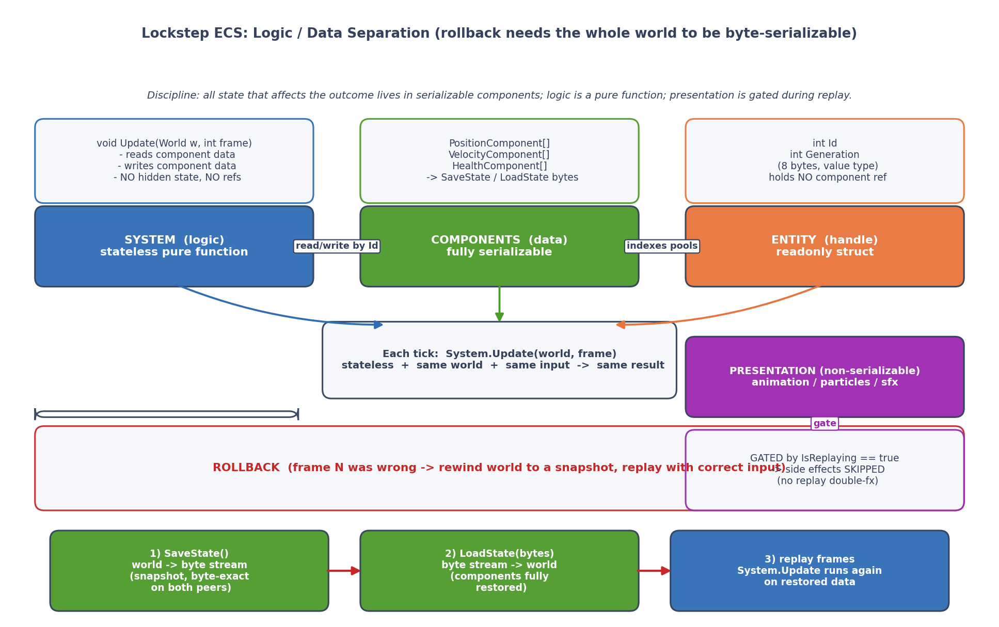
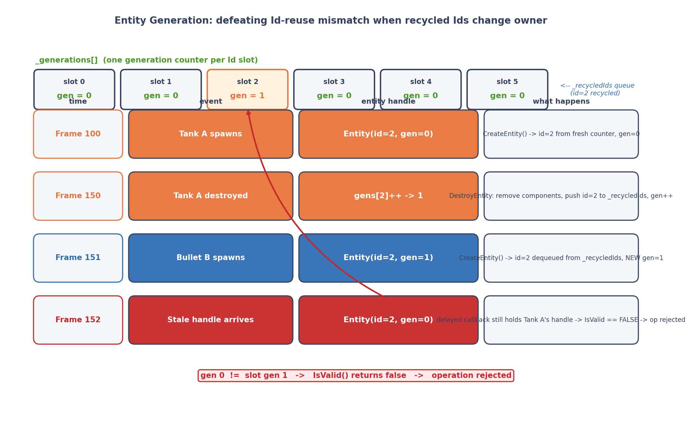
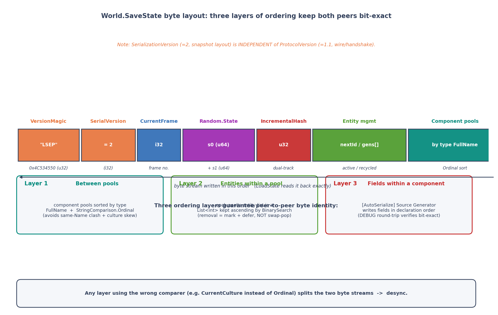

# 第 5 章 · 有序 ECS 与 World:逻辑数据分离、防呆体检

> **核心问题**:上一章我们让随机数也成了确定性序列的一环——同样的种子,两台机器吐出完全一样的随机流。可随机数只是"游戏世界"的一个零件,真正装下整个世界的容器是 ECS(Entity-Component-System)。一个普通的 ECS 能不能直接拿来做帧同步?不能。因为帧同步对 ECS 提出了三条普通 ECS 根本不在意的硬要求:**System 执行顺序必须跨机确定、组件遍历顺序必须跨机确定、整个世界必须能被字节级地存下来再原样恢复**。这一章就讲 LockstepSdk 的 `World` 怎么把这些"确定性纪律"刻进容器本身,还怎么用一套反射体检机制,在你写错代码的当下就把你拦下来。

> **读完本章你会明白**:
> 1. 为什么"逻辑/数据分离"这个 ECS 的通用优点,在帧同步里会变成一条不能违背的生死线——以及它为什么是"能倒带重演"的前提。
> 2. System 执行顺序怎么保证确定:为什么必须用**稳定插入排序**而非 `List.Sort`(相等 Priority 保注册序,否则 desync)。
> 3. 实体代数(Generation)机制怎么防止"Id 复用错配"——一个坦克被打死,Id 被回收给新坦克,老句柄为什么会"认错人"以及怎么堵住。
> 4. `World.SaveState`/`LoadState` 的字节级格式:VersionMagic "LSEP"、双轨版本号、组件池按**类型名 Ordinal 排序**,为什么两端字节流必须逐位一致。
> 5. ★**防呆体系**:`SystemStateValidator` 反射体检(DEBUG 拦截 System 里的 `Dictionary`/`HashSet`/`Task`/`System.Random`/`float`/静态字段)、`[AllowUnsafeField("reason")]` 的 Rust `unsafe` 式免责、Smart Query 最小集遍历。
> 6. 一个真实 bug:LoadState 重算全量哈希补丁——为什么"加载后校验"曾经是恒真的摆设。

> **如果一读觉得太难**:先只记住四件事——① 帧同步的 ECS,所有遍历顺序(System 列表、组件池、实体集合)都必须跨机确定,所以不能用 `List.Sort`(非稳定)、不能直接遍历 `Dictionary`;② 实体用"Id + 代数"标识,销毁后 Id 回收但代数自增,老句柄失效;③ 整个 World 能序列化成一段字节,两端字节流必须逐位相同,组件池按类型名 Ordinal 排序写入;④ 框架在 DEBUG 下会反射扫描你的 System 字段,把确定性杀手(`Dictionary`/`float`/`Task`/静态变量)挡在门外。

---

## 〇、一句话点破

> **普通 ECS 关心的是"性能和架构清晰",帧同步的 ECS 还要多扛一条——"任何影响遍历结果、影响序列化字节的细节,都必须跨机确定"。于是 LockstepSdk 的 `World` 把确定性做成了容器的肌肉记忆:System 列表用稳定插入排序(相等 Priority 保注册序);组件池用 `List<int>` + BinarySearch 保序存储(删除靠标记 + 延迟,严禁 swap-and-pop);实体用 Id + Generation 双字段防回收错配;SaveState 把整个世界写成一段字节,组件池按类型 `FullName` 的 Ordinal 序排序逐个写入;再叠一层反射体检,在 DEBUG 下把你写在 System 里的 `Dictionary`、`float`、`Task`、静态字段全拦下来——错不在运行时才暴露,而在你按 F5 那一刻就炸。**

这是结论。本章倒过来拆:先讲 ECS 在帧同步里到底"额外"被要求了什么,再一个个看 `World` 怎么把这些要求落到代码里,最后讲防呆体系和那个隐蔽的哈希校验 bug。

---

## 一、ECS 的"逻辑/数据分离",在帧同步里为什么是生死线

ECS(Entity-Component-System)这种架构,读者大概率不陌生:**实体(Entity)只是一个 Id,数据全在组件(Component)里,逻辑全在系统(System)里**。这是 ECS 最基本的卖点——"逻辑和数据分离"。在普通游戏引擎里,这个分离的好处是"缓存友好、组合灵活、职责清晰"。这些优点帧同步当然也享受,但本章不重复这些——读者熟。我们要讲的是:在帧同步里,"逻辑/数据分离"从一个"架构优点"升级成了一条**生死线**,原因和第 9 章要讲的预测回滚紧密相关。

### 朴素做法撞什么墙:逻辑和数据搅在一起,就没法"倒带"

帧同步有一套招牌机制叫**预测回滚**(第 9 章详讲):客户端不等服务器,先按猜的输入往前算(预测);等服务器权威输入回来了,猜错了就**把整个游戏世界倒回到出错那一帧,用正确输入重新演算一遍**。

"倒带"具体是怎么发生的?最朴素的办法是:**每帧存一份完整的世界状态**(快照),回滚时把世界恢复成快照里的样子。这就要求——**整个世界的状态,必须能被完整地"拍下来"存成一段字节,再从这段字节"原样恢复"**。

现在想想,如果逻辑和数据是搅在一起的(典型的 OOP:`class Tank { void Update() { ... } }`,坦克自己存自己的位置、自己跑自己的逻辑),会发生什么?

- 坦克对象内部可能持有一堆**不可序列化**的玩意儿:动画状态机引用、粒子系统、音效句柄、未完成的协程、订阅了的事件……这些东西你怎么"存成字节"?
- 就算你硬存了,恢复的时候这些引用全部失效——坦克"复活"后指着一个已经销毁的粒子系统,崩溃。
- 更糟的是,逻辑里可能有**不可逆的副作用**(放了一个音效、播了一个粒子),倒带重演的时候这些副作用会**再播一遍**——战场上满屏重影。



这就是为什么帧同步强制要求:**所有"会影响游戏局面"的状态,必须和数据一起,放在可序列化的组件里;逻辑(System)本身是无状态的纯函数,给它相同的世界状态 + 相同的输入,它必须算出相同的结果**。System 不许偷偷藏状态,组件不许偷偷持表现层对象引用。这条纪律,本质上是"为了能倒带重演,游戏逻辑必须写成纯函数式 + 可快照的风格"。

> **承接第 9 章**:这条"逻辑/数据分离"纪律,是第 9 章"回滚反向施加给整个代码库的编程纪律"的预告。回滚不是"加个功能",它要求每一行逻辑代码都写成"可快照、可重演"的样子。本章先把容器(`World`)怎么配合这条纪律讲透。

> **钉死这件事**:ECS 的"逻辑/数据分离",在帧同步里升级成生死线——因为回滚需要"把整个世界存成字节再原样恢复",所以一切影响局面的状态必须放在可序列化的组件里,System 必须是无状态纯函数。这不是"架构整洁"的要求,是"能倒带"的要求。

### Entity 只是句柄:Id + Generation

顺着"组件持有数据、System 处理逻辑"的思路,Entity 在 LockstepSdk 里被设计成**极其轻量的句柄**——它什么数据都不存,只是个"身份标识"。看它的定义:

```csharp
// Entity.cs:10-24 (简化示意)
public readonly struct Entity : IEquatable<Entity>
{
    public readonly int Id;          // 实体 ID
    public readonly int Generation;  // 代数(检测句柄是否过期)

    public static readonly Entity Invalid = new Entity(-1, 0);
    public bool IsValid => Id >= 0;

    public bool Equals(Entity other) => Id == other.Id && Generation == other.Generation;
}
```

两个 `int` 字段,8 字节,值类型,不可变。它**不持有任何组件引用**——所有组件数据都按 `entityId` 索引存在各自的组件池里(World.cs:145 的 `_pools` 数组)。Entity 只是一张"门牌号"。

为什么 Entity 不直接持有组件引用?除了"值类型、零 GC、可序列化"这些常规好处,还有一个帧同步特有的原因:**回滚后引用会失效**。如果 Entity 持有 `PositionComponent*`,回滚把 PositionComponent 数组重置了,Entity 手里的指针就指向了旧数据。而"Entity 只存 Id",回滚后用同一个 Id 去组件池里重新查,自然拿到回滚后的新数据。这是"间接引用"的纪律——后面防呆体检会强制 System 也不许缓存 Entity 引用,原理一样。

> **钉死这件事**:Entity 是 `readonly struct`,只有 `Id` + `Generation` 两个 int,不存组件引用。回滚后引用会失效,所以一切"找组件"都靠 Id 去池里现查——这叫"间接引用",是回滚安全的基石。

---

## 二、System 执行顺序:为什么必须"稳定"

讲完容器里"装什么"(Entity + Component + System 的分离),现在看最容易被忽视、却最容易引发 desync 的一块:**System 的执行顺序**。

一个游戏里通常有十几个 System:输入处理、移动、碰撞、伤害结算、视野更新、清理……它们按某种顺序依次执行。问题来了:**两台机器上,这些 System 的执行顺序必须完全一致**。

为什么?因为 System 之间有数据依赖。比如"移动 System"先更新了位置,"碰撞 System"再读位置算碰撞,"伤害 System"再根据碰撞结果扣血。如果机器 A 是"移动 → 碰撞 → 伤害",机器 B 是"碰撞 → 移动 → 伤害"(碰撞读的是上一帧的位置),一帧下来伤害结果就不一样了——desync。

那怎么保证顺序一致?最直觉的答案是:**给每个 System 一个 `Priority`(优先级),按 Priority 升序执行**。这正是 LockstepSdk 的做法:

```csharp
// ISystem.cs:83-117 (简化)
public interface ISystem
{
    int Priority { get; }      // 越小越先执行
    bool Enabled => true;
    void Initialize(World world);
    void Update(World world, int frame);
    void Cleanup(World world);
}
```

`Priority` 是个 int,框架推荐了一套阶段划分约定(ISystem.cs:43-49):

- **0-99**:输入处理(Input)
- **100-199**:物理/移动(Physics/Movement)
- **200-299**:游戏逻辑(GameLogic)
- **300-399**:后处理/清理(PostProcess/Cleanup)

游戏开发者按这个约定给自己的 System 分配 Priority,框架按 Priority 升序执行。这套约定不强制(你可以让一个逻辑 System 用 Priority 50),但它给出了一个共同的"坐标轴",避免所有 System 都挤在同一个 Priority 上。

### 撞墙时刻:两个 System 的 Priority 相等

按 Priority 排序,听起来简单。但有一个隐蔽的坑:**如果两个 System 的 Priority 相等,谁先执行?**

这听起来像吹毛求疵——"我保证每个 System 的 Priority 都不一样不就行了?"。但现实是:

- 一个中大型游戏可能有 20-30 个 System,Priority 是个 int,人很容易偷懒,多个 System 都用默认值 0(`SystemBase.Priority => 0`,ISystem.cs:124)。
- 即使你精心分配了 Priority,后来加新 System 的人未必知道"这个值已经被占了",撞车不可避免。

撞车之后,**排序算法的"稳定性"就决定了 desync 与否**。

排序稳定性(stable)的定义是:相等元素的**相对顺序**在排序后保持不变。如果 System A 和 System B 的 Priority 都是 100,A 先注册 B 后注册,稳定排序保证 A 排在 B 前面;**非稳定排序**则可能把 B 排到 A 前面(取决于排序算法的内部细节)。

.NET 的 `List<T>.Sort` 用的是 **introspective sort**(快排 + 堆排的混合),**它不是稳定排序**——相等元素的最终顺序取决于分区、枢轴选择等内部细节,在不同数据规模下结果不同。这意味着:**如果用 `List.Sort` 排 System 列表,相等 Priority 的 System 执行顺序是不可预测的**。

你可能觉得"两台机器跑同一个 .NET 版本,Sort 的结果应该一样吧?"——理论上,对同一份输入,`List.Sort` 在同一运行时上确实给出同一结果。但帧同步的"两台机器"从来不保证完全一样:它们可能跑不同的 .NET 版本(net8.0 vs netstandard2.1,本书的双 TFM 活教材)、不同的 CLR 补丁级别。**而且更阴险的是:同一台机器上,运行时注册 System 的顺序可能不一样**。比如某个 System 是在"玩家加入房间"时才注册的,两台机器玩家加入顺序不同,注册顺序就不同,`List.Sort` 排出来的执行顺序就不同——desync。

LockstepSdk 的注释把这个坑说得很直白:

```csharp
// World.cs:677-680
/// 稳定排序系统列表(插入排序):相等 Priority 保持注册顺序,保证确定性。
/// 相比 <c>List.Sort</c>(非稳定),相等 Priority 时不会因运行期注册顺序扰动遍历顺序。
```

### 所以这么设计:手写稳定插入排序

`World` 没有 `List.Sort`,而是**手写了一个插入排序**:

```csharp
// World.cs:681-695
private void SortSystemsStable()
{
    // 插入排序:稳定、就地、无分配。System 数量少(通常 <20),O(n²) 可接受。
    for (int i = 1; i < _systems.Count; i++)
    {
        var key = _systems[i];
        int j = i - 1;
        while (j >= 0 && _systems[j].Priority > key.Priority)
        {
            _systems[j + 1] = _systems[j];
            j--;
        }
        _systems[j + 1] = key;
    }
}
```

这是教科书式的插入排序。它的关键性质是**稳定**——注意那个 `while (j >= 0 && _systems[j].Priority > key.Priority)` 的比较用的是**严格大于**(`>`),不是 `>=`。这意味着:遇到 Priority 相等的元素,循环就停了,新元素被插在相等元素的**后面**——保注册顺序。如果写成 `>=`,相等元素会被搬到前面,排序就变成"逆序保注册序"——不稳定(或者说不符合直觉地稳定)。

**为什么是插入排序而不是别的稳定排序(归并、TimSort)?** 注释说了三条:**稳定、就地、无分配**。System 数量通常 < 20,插入排序 O(n²) 在这个规模下和 O(n log n) 没有可感知的差别(20² = 400 次比较,纳秒级);但它**不需要额外内存**(归并要 O(n) 辅助数组),**不产生 GC**(符合第 20 章零 GC 目标),代码也极简(8 行,没有分支预测失败的余地)。对于"小规模 + 稳定 + 零分配"这个组合,插入排序是几乎最优的选择。

> **技巧精解 · 稳定排序的"严格大于"陷阱**:插入排序的稳定性,完全取决于内层循环的比较算子。写 `>`(严格大于)→ 稳定;写 `>=`(大于等于)→ 不稳定(相等元素被反序)。这个差别只有一个字符,但前者保证确定性、后者破坏确定性。LockstepSdk 的注释特别强调这点,因为无数教科书的插入排序示例写的是 `>=`(不影响教学正确性,但影响稳定性)。这是"实现技巧"决定"确定性"的典型例子。

> **钉死这件事**:System 列表用**稳定插入排序**(World.cs:681-695),内层循环用**严格大于**(`>`)保相等 Priority 的注册顺序。绝不能用 `List.Sort`(introsort 非稳定,相等 Priority 顺序不可预测,跨机/跨注册序会 desync)。这是"排序算法的稳定性"直接决定帧同步确定性的硬例子。

### Update / ExecuteFrame:记 systemCount 快照,忽略新注册

排序完,执行。`World.Update()` 的执行循环有个细节值得注意:

```csharp
// World.cs:716-745 (简化)
if (!_systemsSorted)
{
    SortSystemsStable();
    _systemsSorted = true;
}

int systemCount = _systems.Count;   // ← 记快照
for (int i = 0; i < systemCount; i++)   // ← 用快照,不是 _systems.Count
{
    var system = _systems[i];
    if (system.Enabled)
    {
        try { system.Update(this, CurrentFrame); }
        catch (Exception ex) { /* 记录并重新抛出 */ }
    }
}
CurrentFrame++;
```

注意 `int systemCount = _systems.Count;` 这行——遍历前先**把列表长度记成局部变量**,然后用这个局部变量做循环上界。为什么?**为了忽略遍历过程中新注册的 System**。

想象一下:某个 System 在自己的 `Update` 里注册了一个新 System(比如"游戏开始 System"跑完注册了"计分 System")。如果不记快照、直接用 `_systems.Count` 做循环上界,这个新 System 就会在**当前帧**立即执行;而另一台机器上可能压根没触发这个注册(因为玩家状态不同),或者注册顺序不同——于是两台机器这一帧执行的 System 集合就不一样,desync。

记快照的逻辑是:**"这一帧只执行这一帧开始时就已注册的那些 System,中途注册的等下一帧再说。"** World.cs:664-670 的警告也强调了这点:"在 Update 中注册的系统不会在当前帧执行,而是从下一帧开始执行。"

这是个很小的代码细节,但它体现了一条帧同步纪律:**遍历集合时,要"冻结"集合的规模,不允许遍历过程中集合膨胀**。否则不同机器上"膨胀的时机不同"就会导致 desync。

> **钉死这件事**:`World.Update`(World.cs:701-751)和 `ExecuteFrame`(World.cs:760-804,回滚/回放用)在遍历 System 前都先记 `systemCount` 快照,中途新注册的 System 不参与本帧执行。这保证了"两台机器同一帧执行的 System 集合"不因运行期注册差异而分叉。

---

## 三、实体代数 Generation:防止 Id 复用错配

讲完 System 顺序,看实体的生命周期。一个游戏里实体会频繁创建销毁:子弹打出、击中目标后消失;小兵刷新、被杀后销毁。最朴素的实体管理是"用一个自增的 Id 计数器"——`CreateEntity` 给 `_nextEntityId++`,销毁就销毁了,Id 永不复用。

这个朴素做法的问题:**Id 空间会爆炸**。一局游戏打几千帧,每帧创建几十颗子弹,Id 很快就涨到几百万、几千万。虽然 int 能装下 21 亿,但 Id 越大,组件池数组(`_components[entityId]`)就要开得越大,内存浪费严重。

所以 LockstepSdk 选了**Id 回收**的方案:销毁的实体,Id 进回收队列,下次创建实体优先复用。看代码:

```csharp
// World.cs:128-141 (字段)
private int _nextEntityId;
private readonly List<int> _generations;        // 每个槽位的代数
private readonly SortedSet<int> _activeEntities; // 活跃实体(确定性遍历)
private readonly Queue<int> _recycledIds;        // 回收的实体 ID
```

```csharp
// World.cs:270-325 CreateEntity (核心逻辑简化)
public Entity CreateEntity()
{
    // ... 防呆:LoadState/Reset 期间禁止创建 ...
    int id;
    int gen;

    if (_recycledIds.Count > 0)
    {
        id = _recycledIds.Dequeue();    // 复用回收的 Id
        gen = _generations[id];          // 用该槽位当前的代数
    }
    else
    {
        id = _nextEntityId++;            // 没有可回收的, 分配新 Id
        _generations.Add(0);             // 新槽位代数从 0 开始
        gen = 0;
    }

    _activeEntities.Add(id);
    var entity = new Entity(id, gen);
    // ... 触发 OnEntityCreated 事件 ...
    return entity;
}
```

```csharp
// World.cs:330-369 DestroyEntity (核心逻辑简化)
public void DestroyEntity(Entity entity)
{
    if (!IsValid(entity)) { WarnInvalidEntityOperation(...); return; }

    foreach (var pool in _activePools)     // 移除该实体的所有组件
        pool.RemoveByEntityId(entity.Id);

    _activeEntities.Remove(entity.Id);
    _generations[entity.Id]++;            // ← 关键:代数自增
    _recycledIds.Enqueue(entity.Id);       // ← Id 入回收队列
    // ... 触发 OnEntityDestroyed 事件 ...
}
```

核心机制是 `_generations` 这个数组:**每个实体槽位都有一个"代数"**,销毁时该槽位代数 +1,Id 进回收队列;下次这个 Id 被复用时,新实体带着**新的代数**。

### Id 回收会撞什么墙:老句柄认错人

为什么要费这个劲搞代数?看一个具体的灾难场景:

```
帧 100: 坦克 A 出生, Entity(id=5, gen=0)
帧 150: 坦克 A 被击毁, _generations[5]++ → 1, id=5 入回收队列
帧 151: 子弹 B 出生, 复用 id=5, Entity(id=5, gen=1)
帧 152: 某个旧代码(比如一个延迟回调)还持有坦克 A 的老句柄 Entity(id=5, gen=0)
         它去查 id=5 的组件 → 拿到的是子弹 B 的组件! → 给子弹扣坦克的血
```

如果没有代数,老句柄 `Entity(id=5)` 会成功"查到" id=5——但这个 id 现在已经是子弹 B 了,老句柄实际上是在**对着子弹操作坦克的逻辑**。这种 bug 极其阴险:不报错,只算错;在帧同步里,如果两台机器上"延迟回调持有的老句柄"过期时机不同(一台还在用、一台已经失效),就 desync。

代数机制堵住了这个洞:**老句柄 `Entity(id=5, gen=0)` 和新实体 `Entity(id=5, gen=1)` 的代数对不上,`IsValid` 返回 false**(World.cs:374-380),操作被拒绝:



```csharp
// World.cs:374-380
public bool IsValid(Entity entity)
{
    return entity.Id >= 0 &&
           entity.Id < _generations.Count &&
           _generations[entity.Id] == entity.Generation &&  // ← 代数必须匹配
           _activeEntities.Contains(entity.Id);
}
```

`DestroyEntity` 一开头就调 `IsValid`,无效句柄直接打警告返回(World.cs:333-336),不会误删别人的组件。

> **钉死这件事**:实体用 **Id + Generation 双字段**标识(World.cs:128-141)。销毁时该槽位代数 +1、Id 入回收队列;复用时带新代数。老句柄的代数和当前槽位对不上 → `IsValid` 返回 false → 操作被拒。这堵住了"Id 回收导致老句柄认错人"的 desync 漏洞。Entity 是 readonly struct,代数在创建时就钉死,后续不会偷偷变。

### 溢出诚实标注

代数是个 int,理论上有溢出风险——同一个槽位被销毁 21.47 亿次(int.MaxValue + 1)会环绕回 0,届时老句柄可能"撞上"新代数。World.cs:134-138 的注释诚实承认了这个边界:

> 理论上 int 会在同一槽位销毁 21.47 亿次后溢出。即使每秒销毁 1000 次,也需要约 25 天才会溢出。实际游戏中这种极端情况几乎不可能发生,故不做特殊处理。

这是个典型的"诚实标注边界,但不为不可能场景过度设计"的工程取舍。25 天对一局游戏(通常几十分钟)是天文数字,真要防溢出反而会增加复杂度(每次销毁检查并 rebase 代数),得不偿失。

---

## 四、SaveState:把整个世界压成一段字节

讲完容器内部(System 顺序、实体代数),看容器怎么被**整体序列化**。这是回滚和重连的地基——回滚要存快照,重连要传快照,快照就是 `World.SaveState()` 吐出来的一段字节。

### 字节格式:逐字段拆

SaveState 的字节格式,直接看代码最清楚(World.cs:840-923):

```csharp
// World.cs:880-922 (简化, 注释为格式说明)
// ① 版本头
writer.WriteUInt32(VersionMagic);          // 0x4C534550 = "LSEP" (Lockstep)
writer.WriteInt32(SerializationVersion);   // 2

// ② 帧号
writer.WriteInt32(CurrentFrame);

// ③ 随机数状态(LRandom 的两个 ulong, 第 4 章讲过)
var (s0, s1) = Random.State;
writer.WriteUInt64(s0);
writer.WriteUInt64(s1);

// ④ 增量哈希(用于双轨校验, 第 23 章详讲)
writer.WriteUInt32(_incrementalHash);

// ⑤ 实体管理状态
writer.WriteInt32(_nextEntityId);
writer.WriteInt32(_generations.Count);
foreach (var gen in _generations) writer.WriteInt32(gen);

writer.WriteInt32(_activeEntities.Count);
foreach (var id in _activeEntities) writer.WriteInt32(id);

writer.WriteInt32(_recycledIds.Count);
foreach (var id in _recycledIds) writer.WriteInt32(id);

// ⑥ 组件池(按类型名 Ordinal 排序)
writer.WriteInt32(_sortedPoolCache.Count);
foreach (var pool in _sortedPoolCache)
{
    writer.WriteString(pool.ComponentType.FullName ?? pool.ComponentType.Name);
    pool.Serialize(writer);   // 每个池自己写:[length][count][entityId+component]...
}
```

这个格式的设计,每一处都在服务"两端字节流逐位一致"。我们一个个看。

#### ① 版本头:VersionMagic + SerializationVersion

快照开头先写一个**魔数** `0x4C534550`——这四个字节对应 ASCII 的 "LSEP"(Lockstep)。魔数的作用是"快速识别文件格式":加载时先读 4 字节,如果不是 "LSEP",直接报错"这不是一个 Lockstep 快照",避免把别的东西当快照解析(World.cs:988-994)。

紧跟魔数的是一个**版本号** `SerializationVersion = 2`(World.cs:823)。版本号守护的是**快照二进制布局**的兼容性——加载时版本号对不上,直接拒绝(World.cs:996-1002):

```csharp
// World.cs:996-1002
int version = reader.ReadInt32();
if (version != SerializationVersion)
{
    throw new InvalidOperationException(
        $"Incompatible snapshot version: expected V{SerializationVersion}, got V{version}. " +
        "Snapshots from different versions are not compatible.");
}
```

> **★双轨版本号(写书易翻车点)**:这个 `SerializationVersion`(当前 = 2)和第 16 章要讲的 `ProtocolVersion`(当前 = 1.1)**是两个完全独立的版本号**,守护两个不同的兼容性边界:
> - **SerializationVersion** 守护**快照二进制布局**:组件结构改了、快照字段顺序变了、新增了快照内容 → 升这个版本号。
> - **ProtocolVersion** 守护**线协议/握手/网络消息**:网络消息格式变了、握手流程变了 → 升那个版本号。
>
> 两者数值**没有任何关联**(一个是 2,一个是 1.1),升级触发条件也不同。World.cs:817-822 的注释特别强调"双版本通道,互不联动",就是防止读者(和未来的维护者)把它们搞混。这是文档与代码一致的非显然事实——别写成"快照版本 1.1"或"协议版本 2"。

#### ② 随机数状态:回滚的关键

第 4 章讲过,LRandom 的状态就是两个 ulong,SaveState 把它们原样写进快照。这一步至关重要:**回滚后重演,必须从同一个随机状态开始**,否则重演里的随机判定(暴击、散射、掉落)全乱。新手最常犯的错就是"忘了存随机状态",结果回滚后随机数序列对不上,desync 还找不到原因。LoadState 里 `Random.RestoreState(s0, s1)`(World.cs:1010)把它读回来。

#### ⑤ 实体管理状态:代数也必须存

`_nextEntityId`、`_generations`(整个数组)、`_activeEntities`(活跃集合)、`_recycledIds`(回收队列)全要写进快照。为什么?因为**回滚后创建/销毁实体的行为必须和原演完全一致**。如果只存了组件不存实体管理状态,回滚后 `_nextEntityId` 不对,新建实体拿到的 Id 就和原演不同,组件挂载的 entityId 也不同,后面全乱。代数机制(上一节)也依赖 `_generations` 完整恢复——否则老句柄的代数校验就失效了。

注意 `_activeEntities` 是 `SortedSet<int>`(World.cs:140),遍历顺序确定(升序),所以写入快照的顺序也确定——两端字节流一致。这是选 `SortedSet` 而非 `HashSet` 的关键原因(HashSet 遍历顺序不确定,写进快照两端会对不上)。

#### ⑥ 组件池:按类型名 Ordinal 排序

这是字节流一致性最关键的一步。一个游戏里有多种组件(Position、Velocity、Health、Target……),每种一个组件池。SaveState 写组件池时,**必须按某种全端一致的顺序**逐个写,否则两端字节流对不上。

顺序怎么定?LockstepSdk 选的是**组件类型 `FullName` 的 Ordinal 字典序**。看排序逻辑:

```csharp
// World.cs:155-167 (比较器)
private class ComponentPoolComparer : IComparer<IComponentPoolInternal>
{
    public int Compare(IComponentPoolInternal? x, IComponentPoolInternal? y)
    {
        if (x == y) return 0;
        if (x == null) return -1;
        if (y == null) return 1;
        string nameX = x.ComponentType.FullName ?? x.ComponentType.Name;
        string nameY = y.ComponentType.FullName ?? y.ComponentType.Name;
        return string.Compare(nameX, nameY, StringComparison.Ordinal);  // ← Ordinal
    }
}
```

这里有两个细节,都和确定性紧密相关:

**第一,用 `FullName` 而不是 `Name`。** `Name` 是类名(比如 `PositionComponent`),`FullName` 带命名空间(比如 `Lockstep.Games.Tank.PositionComponent`)。不同命名空间下可能有同名类,只用 `Name` 会撞车,FullName 唯一。

**第二,用 `StringComparison.Ordinal` 而不是默认比较。** 这是第 24 章"确定性红线清单"里的一条铁律:**字符串比较必须用 Ordinal**。默认的字符串比较(`StringComparison.CurrentCulture`)依赖当前文化设置——不同机器、不同系统语言,对同一个字符串对的比较结果可能不同(比如某些文化里 '-' 排在字母前,某些排在后)。Ordinal 是纯粹的 Unicode 码点比较,全端一致。这一行如果改成 `string.Compare(nameX, nameY)`(默认 CurrentCulture),在中文 Windows 和英文 Linux 上排序结果可能不同,两端字节流就分叉了。

排序完后,每个池按"先写类型名,再让池自己序列化内容"的格式写入。每个池内部的序列化(ComponentPool.cs:390-405)是按 `_activeEntities`(有序 List)的顺序,逐个写 `[entityId][组件字节]`——这个顺序也是确定的(BinarySearch 保序插入,第 6 章详讲)。



> **技巧精解 · 组件池按类型名 Ordinal 排序**:SaveState 要保证两端字节流逐位一致,组件池的写入顺序必须全端确定。LockstepSdk 按"组件类型 `FullName` 的 Ordinal 字典序"排序(World.cs:925-936 的 `UpdateSortedPoolCache` + World.cs:155-167 的 `ComponentPoolComparer`)。两个关键点:① 用 FullName 不用 Name(防同名类撞车);② 用 Ordinal 不用 CurrentCulture(防文化差异)。这是"字符串比较"这条确定性红线在序列化层的具体落地——第 24 章会系统总结所有这类红线。

### SaveState 还做了一件关键事:保存前先校验哈希

看 SaveState 开头这段(World.cs:856-878):

```csharp
// World.cs:856-878 (简化)
if (_dualTrackMode != DualTrackMode.Disabled)
{
    uint fullHash = ComputeFullComponentHash();
    if (fullHash != _incrementalHash)
    {
        Log.Error($"[CRITICAL] Hash drift detected BEFORE SaveState at Frame {CurrentFrame}!");
        // ... 触发 OnHashDrift, 按 HashDriftRecoveryPolicy 处理 ...
        _incrementalHash = fullHash;  // 用全量哈希覆盖, 保证快照自洽
    }
}
```

保存快照前,如果开了双轨哈希校验,先重算一次全量组件哈希,和增量哈希比对。如果不一致(说明增量哈希漂移了),**绝不能把错误的增量哈希写进快照**——否则快照里的哈希和组件数据不符,后续所有基于这个快照的校验全是错的。这里用全量哈希覆盖增量哈希,保证写出去的快照"数据与哈希自洽"。

> **承接第 23 章**:这段"SaveState 前校验哈希"和接下来要讲的"LoadState 重算全量哈希"补丁,都是为同一个隐蔽 bug 打的补丁——增量哈希在 `DualTrackMode.Disabled`(生产默认)下是 O(1) 返回的,直接拿它校验会"恒真"。第 23 章会把这套双轨哈希机制和"漂移即覆盖"的反面教材系统讲透。本章只看 LoadState 这一个补丁的来龙去脉。

---

## 五、一个真实 bug:LoadState 的"恒真校验"

讲完 SaveState 的字节格式,看一个写进 World.cs 注释的真实 bug——它是理解"为什么序列化+哈希校验不能想当然"的活教材。

### 现象:加载后校验形同虚设

`LockstepController.RollbackTo`(回滚主路径,第 10 章)和 `LockstepDriver`(驱动层,第 12 章)都有一个共同动作:**加载快照后,立刻校验快照里的哈希和加载后算出的哈希是否一致**。这个校验的目的是抓"快照在传输/存储过程中损坏"(网络位翻转、磁盘损坏、版本错位)。

校验怎么做的呢?调 `World.ComputeHash()`。看这个方法在 `DualTrackMode.Disabled`(生产默认)下的行为:

```csharp
// World.cs:1134-1147 (简化, 只看 Disabled 路径)
public uint ComputeHash()
{
    unchecked
    {
        uint baseHash = 17;
        baseHash = baseHash * 31 + (uint)CurrentFrame;
        var (s0, s1) = Random.State;
        baseHash = baseHash * 31 + (uint)(s0 ^ (s0 >> 32));
        baseHash = baseHash * 31 + (uint)(s1 ^ (s1 >> 32));
        baseHash = baseHash * 31 + (uint)_activeEntities.Count;

        // 增量哈希已经包含了所有组件状态 (O(1))
        uint finalHash = baseHash * 31 + _incrementalHash;   // ← 关键

        // ... 双轨校验逻辑(Disabled 模式下跳过)...
        return finalHash;
    }
}
```

在 `Disabled` 模式下,`ComputeHash()` 是 **O(1)** 的——它不重算组件哈希,而是直接拿 `_incrementalHash`(增量维护的哈希)拼上去。这是为了生产性能:每帧算一次哈希对账如果都遍历所有组件,太慢。

但这里有个致命问题:**`_incrementalHash` 是从快照字节里恢复的**(World.cs:1013 读出来,1014 行后面赋给 `_incrementalHash`)。也就是说:

```
快照字节流 = [...组件数据...] + [_incrementalHash 字段]
LoadState 读字节流 → 组件数据加载到内存 + _incrementalHash = 快照里那个值
ComputeHash() → baseHash * 31 + _incrementalHash
                = baseHash * 31 + (快照里那个值)
```

而快照**保存**时,`ComputeHash()` 算出的也是 `baseHash * 31 + (保存时的 _incrementalHash)`,这个值被当作"快照的哈希"存起来。比对"加载后算的哈希"和"快照保存时的哈希"——**两者用的是同一个 `_incrementalHash`,比对恒为真**。

这意味着:**哪怕快照里的组件数据被位翻转搞坏了 100 个字节,只要 `_incrementalHash` 字段没坏,加载后校验依然通过**——校验成了摆设。组件数据损坏的快照被当成了好快照,回滚后基于损坏数据重演,desync 就此埋下,而且极难定位(因为"校验是通过的")。

### 修复:LoadState 重算全量哈希

补丁在 LoadStateInternal 的最后(World.cs:1088-1114)。我连注释一起贴出来,因为注释把这个 bug 讲得非常清楚:

```csharp
// World.cs:1088-1114
// 最后恢复增量哈希值,并做完整性校验。
// 关键修复(P1 完整性):在 DualTrackMode.Disabled(生产默认)下,ComputeHash() 是 O(1) 的,
// 直接返回 baseHash*31 + _incrementalHash。而 LockstepController.RollbackTo / LockstepDriver
// 的"加载后校验快照"恰恰调用 ComputeHash() 与快照保存时的 hash 比对 —— 由于 _incrementalHash
// 本身就是从快照字节里恢复的,该校验恒为真,无法发现"组件数据损坏但 hash 字段完好"的快照
// (网络传输位翻转 / 磁盘损坏 / 版本错位)。LoadState 是冷路径(回滚/重连),此处重算全量组件哈希
// 与快照内嵌的增量哈希比对:不一致即经 OnHashDrift 上报,并按 HashDriftRecoveryPolicy 处理
// (默认 Continue = 记录 + 用重算值校正增量哈希,使内存状态与哈希自洽;不抛异常,向后兼容)。
uint recomputedFullHash = ComputeFullComponentHash();   // ← 重算全量, 不是 O(1)
if (recomputedFullHash != loadedIncrementalHash)
{
    Log.Error($"[World.LoadState] Snapshot integrity drift at Frame {CurrentFrame}: " +
              $"stored incremental hash 0x{loadedIncrementalHash:X8} != recomputed full hash 0x{recomputedFullHash:X8}. " +
              "Snapshot component data may be corrupted (bit-flip / version skew) or incremental hash had drifted.");
    OnHashDrift?.Invoke(CurrentFrame, loadedIncrementalHash, recomputedFullHash);
    if (HashDriftRecoveryPolicy == HashDriftRecovery.Throw)
    {
        throw new HashDriftException(CurrentFrame, loadedIncrementalHash, recomputedFullHash);
    }
    // Continue 策略:采用重算值,使后续 ComputeHash() 与真实组件状态一致,
    // 避免出现"内存状态已损坏但哈希仍匹配"的静默脱钩。
    _incrementalHash = recomputedFullHash;
}
else
{
    _incrementalHash = loadedIncrementalHash;
}
```

修复思路很直接:**LoadState 是冷路径**(回滚、重连,不是每帧都走),这里可以承担重算全量组件哈希的代价。`ComputeFullComponentHash()`(World.cs:1120-1129)遍历所有组件池、XOR 所有组件的哈希——O(组件数) 的真重算,不依赖 `_incrementalHash`。把这个真重算的结果和快照里读出来的 `loadedIncrementalHash` 比对,不一致就说明组件数据和哈希字段对不上——快照损坏了。

修复还顺带做了一件正确的事:**比对不一致时,把内存里的 `_incrementalHash` 校正成重算值**(World.cs:1109)。这样即使采用 `Continue` 策略(不抛异常,继续跑),后续的 `ComputeHash()` 也能和真实组件状态一致,不会"内存已损坏但哈希假装匹配"。当然,根本原因是快照本身可能坏了,继续跑也只是在错误状态上往前走——所以开发期建议把 `HashDriftRecoveryPolicy` 设成 `Throw`,让漂移立即暴露(World.cs:1103-1106)。

> **钉死这件事**:LoadState 重算全量哈希补丁(World.cs:1089-1114)修的是一个"校验恒真"漏洞——`ComputeHash()` 在 Disabled 模式 O(1) 返回 `baseHash*31+_incrementalHash`,而 `_incrementalHash` 本身从快照恢复,所以"加载后校验"永远通过,抓不到组件数据损坏。补丁在 LoadState 冷路径上重算全量组件哈希做真校验。这个 bug 说明:**"拿一个本身来自被校验数据的值去做校验"是逻辑死循环,校验必须用独立来源的值**。当前状态:已修(注释标注 P1 完整性批次)。

---

## 六、防呆体系:把确定性纪律做成编译/加载期硬约束

前面四节讲的都是"容器本身怎么确定"。但帧同步有个更头疼的问题:**写 System 的游戏开发者是人,人会犯错**。一个新手在 System 里写个 `private Dictionary<int, int> _cache = new();`,或者用 `float` 算个插值,或者缓存一个 `Entity` 引用——任何一个都能引入 desync,而且运行时很难发现。

LockstepSdk 的应对是:**把最常见的确定性杀手做成"反射体检"清单,在 DEBUG 模式下,System 初始化时自动扫描它的所有字段,命中就拒绝运行**。这套机制叫 `SystemStateValidator`。它不是"事后调试工具",而是"事前拦住你写错"的防呆(poka-yoke)。

![SystemStateValidator 反射体检流程:System.Initialize → ValidateSystemState(DEBUG)→ 扫描所有字段 → 命中危险类型(World/Entity/Dictionary/HashSet/Task/Random/float/静态字段)→ throw;标记 [AllowUnsafeField("reason")] 的字段跳过;Release 模式 [Conditional("DEBUG")] 零开销](images/fig-05-system-state-validator.png)

### 体检清单:都拦什么

`SystemStateValidator.Validate`(ISystem.cs:230-318)反射扫描一个 System 类型的所有实例 + 静态字段,逐个检查。清单分几类:

**① 缓存 World / Entity 引用**(ISystem.cs:171-173, 249-251)

```csharp
private static readonly HashSet<Type> DangerousTypes = new()
{
    typeof(World),
    typeof(Entity),
};
// 命中: "缓存 World/Entity 引用(回滚后可能失效)"
```

为什么危险?World 和 Entity 都是"会随回滚变化"的对象。System 如果缓存了 `_world` 或 `_cachedPlayer`,回滚后这个引用指向的还是旧的 World 状态(或者 Entity 已经销毁/被回收),System 继续操作就会用 stale 数据。正确做法是:System 每帧从 `Update(World world, int frame)` 的参数拿 World,需要 Entity 就现查,绝不缓存。

**② 非确定性容器:Dictionary / HashSet / Hashtable**(ISystem.cs:178-183, 271-283)

```csharp
private static readonly HashSet<Type> NonDeterministicContainerDefinitions = new()
{
    typeof(Dictionary<,>),
    typeof(HashSet<>),
    typeof(Hashtable),
};
// 命中: "遍历顺序不确定, 可能导致不同步。建议用 SortedDictionary/SortedSet 或 List"
```

这是帧同步最经典的坑。`Dictionary` 和 `HashSet` 的遍历顺序**取决于 bucket 的分配和哈希碰撞**,在不同容量、不同插入顺序下遍历结果不同。System 里如果用 `foreach (var k in _dict)` 遍历一个 Dictionary,两台机器上遍历顺序可能不一样,处理出来的结果就不一样——desync。正确做法:要有序遍历用 `SortedDictionary`/`SortedSet`,要顺序遍历用 `List`(配合 BinarySearch 保序)。

> **承接第 7 章**:序列化层也有对应的纪律——`BitWriter.WriteDictionarySorted`(强制 Key 排序后写入)。容器的不确定性是帧同步的永恒敌人,序列化层和 System 层各有一道防线。

**③ 非确定性类型:System.Random / Guid / Stopwatch / CancellationToken**(ISystem.cs:188-195, 286-289)

```csharp
private static readonly HashSet<Type> NonDeterministicTypes = new()
{
    typeof(System.Random),       // 用 LRandom 替代(第 4 章)
    typeof(Guid),                // 依赖 MAC 地址 + 时间, 跨机不一致
    typeof(Stopwatch),           // 硬件计时器, 跨机必然不同
    typeof(CancellationTokenSource),
    typeof(CancellationToken),
};
```

`System.Random` 为什么不能用?第 4 章讲过——它的算法跨 .NET 版本不一样(netstandard2.1 是 xorshift,net8 是 xoshiro),同种子不同结果。`Guid` 依赖机器标识,`Stopwatch` 是本机硬件时钟——任何一个带进 System 都是 desync 源。

**④ 异步/并行:Task / Thread / Timer**(ISystem.cs:200-215, 292-303)

```csharp
private static readonly HashSet<Type> AsyncDangerousTypes = new()
{
    typeof(Task), typeof(ValueTask),
    typeof(Thread), typeof(Timer),
};
// 命中: "严禁使用, 帧同步必须单线程同步执行"
```

帧同步的逻辑更新必须**单线程、同步**完成。一旦引入 Task/Thread,执行顺序就不可控(调度器决定),两台机器上 System 的执行交错不同,desync。这条红线和第 12 章 World 的单线程模型(`CheckThreadAffinity`)呼应。

**⑤ 静态字段**(ISystem.cs:256-261)

```csharp
// static readonly 委托指向静态方法是常见的优化模式, 避免闭包分配
bool isStaticReadonlyDelegate = field.IsStatic && field.IsInitOnly && typeof(Delegate).IsAssignableFrom(field.FieldType);
if (field.IsStatic && !field.IsLiteral && !isStaticReadonlyDelegate)
{
    violations.Add($"{field.Name}: 静态字段会污染所有实例且无法回滚");
}
```

静态字段是**进程级的全局状态**——它不归任何一个 World 实例管,World.SaveState 不会存它,LoadState 也不会恢复它。回滚后,静态字段还保留着"未来帧"写入的值,System 读到 stale 的静态值就出错。唯一例外是 `static readonly` 委托(指向静态方法的优化模式,不持有可变状态),这个是安全的。

**⑥ 危险命名模式**(ISystem.cs:220-225, 306-314)

```csharp
private static readonly string[] DangerousNamePatterns = 
{
    "lastframe", "previousframe", "cachedframe",
    "lastEntity", "cachedEntity", ...
};
// 命中: "字段名暗示帧相关状态(回滚后不会自动重置)"
```

这是个"软提示"——如果字段名里含 `lastFrame`/`cachedEntity` 这类词,说明开发者的意图就是缓存帧/实体,这几乎必然是回滚 bug 源。命名模式匹配会有误报(比如字段叫 `_lastFrameLog` 其实是个日志开关),但它能有效逼开发者重新审视"我是不是真的要缓存这个"。

### `[AllowUnsafeField]`:Rust unsafe 式免责

体检清单很严,但有时候确实有合理例外。比如:一个 System 里有个 `HashSet<int>` 用来**收集本帧要销毁的实体**,但保证遍历前先排序——这种用法语义上是确定的,但体检会拦。

LockstepSdk 借鉴了 Rust 的 `unsafe` 思路,提供 `[AllowUnsafeField("reason")]` 特性(ISystem.cs:23-35):

```csharp
// ISystem.cs:23-35
[AttributeUsage(AttributeTargets.Field)]
public sealed class AllowUnsafeFieldAttribute : Attribute
{
    public string Reason { get; }
    public AllowUnsafeFieldAttribute(string reason = "") { Reason = reason; }
}
```

用法(ISystem.cs:13-22 的示例):

```csharp
public class MySystem : SystemBase
{
    [AllowUnsafeField("用于去重, 最终会排序后销毁")]
    private readonly HashSet<int> _entitiesToRemove = new();
}
```

体检时,标了 `[AllowUnsafeField]` 的字段直接跳过(ISystem.cs:242-246)。**但关键在于:必须给 reason**。这个 reason 不是给编译器看的,是给**代码评审者和未来的自己**看的——它在说"我知道这违反了默认纪律,但我的用法是安全的,理由是 XXX"。如果将来出了 desync bug,review 这个 reason 就能快速定位"是不是这个'例外'其实不安全"。

这是 Rust `unsafe` 哲学的精髓:**不禁止危险操作,但强制你把"我知道这危险"写下来**。这种"显式声明 + 留痕"比"一律禁止"更工程友好,也比"放任不管"安全得多。

> **技巧精解 · Rust unsafe 式免责**:`[AllowUnsafeField("reason")]`(ISystem.cs:23-35)借 Rust `unsafe` 的思路——不禁止危险字段,但强制开发者写出"为什么这里是安全的"。体检默认把确定性杀手(`Dictionary`/`float`/`Task`/静态变量)全拦下,合理例外用特性豁免并留 reason。这种"严父式默认 + 显式免责 + 留痕"的设计,既保护新手(写错当场炸),又信任老手(可豁免但必须给理由),还方便事后追查(reason 写在代码里,review 时一目了然)。

### 体检的执行时机:Initialize 时强制抛

体检不是"运行时偶尔抽查",而是**System 初始化时强制执行**。看 `SystemBase.Initialize`(ISystem.cs:131-158):

```csharp
// ISystem.cs:131-158 (简化)
public virtual void Initialize(World world)
{
    ValidateSystemState();
}

[Conditional("DEBUG")]
private void ValidateSystemState()
{
    var violations = SystemStateValidator.Validate(GetType());
    if (violations.Count > 0)
    {
        var errorMsg = $"[ECS] System '{GetType().FullName}' contains state fields that may cause rollback issues:\n" +
                       string.Join("\n", violations) + ...;
        Log.Error(errorMsg);
        throw new InvalidOperationException(errorMsg);  // ← 强制抛, 不是警告
    }
}
```

两个关键点:

**第一,`[Conditional("DEBUG")]`。** 这个特性意味着:在 Release 编译下,`ValidateSystemState()` 的调用**不会被编译进 IL**——零运行时开销。DEBUG 下才体检。这是"开发期严防死守,生产期零开销"的经典做法(C# 的 `Conditional` 比手动 `#if DEBUG` 更优雅,调用方的代码不用包 `#if`)。

**第二,DEBUG 下命中就 `throw`,不是只警告。** 注释(ISystem.cs:155)明说"强制抛出异常,防止开发者忽略警告"。如果只警告不抛,开发者大概率无视警告继续跑,bug 就带上线了。抛异常逼你当场解决——要么改代码,要么加 `[AllowUnsafeField]` 并写 reason。这是"防呆"的硬约束版本。

> **作者复盘 · 为什么体检要"强制抛"而非"警告"**:早期版本体检只打 Warning,结果开发者(包括作者自己)经常无视警告把带"嫌疑字段"的 System 提交上去,线上 desync 了才回头查,代价巨大。改成 throw 后,开发阶段就逼你要么消除嫌疑字段、要么显式标 `[AllowUnsafeField]` 写理由——bug 在写代码的当下就暴露,而不是带到线上。教训:防呆机制如果不能"阻断动作",就等于没防呆。这条经验不只适用于帧同步,任何"纪律性强"的代码库都适用。

---

## 七、Smart Query 与组件遍历:优先遍历最小的池

前面几节讲的是 World 的"骨架"(System 顺序、实体代数、序列化、防呆)。这一节看一个性能 + 确定性双全的遍历工具:**EntityQuery**。

游戏逻辑里最常见的操作是"找出所有同时拥有 A 和 B 组件的实体"。比如"找出所有有 Position 和 Velocity 的实体来更新位置"。最朴素的实现:遍历 A 组件池,对每个实体检查它有没有 B 组件。

```csharp
// 朴素: 遍历 poolA, 逐个检查 poolB
foreach (var id in poolA.ActiveEntities)
{
    if (poolB.Has(id)) { /* 处理这个实体 */ }
}
```

这能跑,但有个性能问题:**如果 poolA 很大、poolB 很小,遍历 poolA 大部分都是白跑**(绝大多数实体没有 B 组件)。比如 10000 个实体有 Position,但只有 50 个有 Velocity(子弹),遍历 Position 池要白查 9950 次。

EntityQuery 的优化极其简单:**总是遍历较小的那个池**(EntityQuery.cs:20-22):

```csharp
// EntityQuery.cs:16-22
public EntityQuery(ComponentPool<T1> pool1, ComponentPool<T2> pool2)
{
    _pool1 = pool1;
    _pool2 = pool2;
    _iteratePool1 = pool1.Count <= pool2.Count;   // ← 总是遍历较小的池
}
```

遍历时,对较小池里的每个实体,检查它有没有另一个组件(EntityQuery.cs:49-61):

```csharp
// EntityQuery.cs:49-61 (简化)
public bool MoveNext()
{
    while (_inner.MoveNext())
    {
        int id = _inner.Current;
        if (_checkPool2 ? _pool2.Has(id) : _pool1.Has(id))   // 检查另一个池
            return true;
    }
    return false;
}
```

回到上面的例子:50 个 Velocity、10000 个 Position,EntityQuery 自动选遍历 Velocity 池(50 次),对每个 Velocity 实体检查它有没有 Position——50 次检查,而不是 10000 次。**性能提升 200 倍**。

三组件版本(EntityQuery.cs:68-144)同理,找三个池里最小的那个遍历。

### 确定性:遍历顺序依然保证

注意 EntityQuery 选"最小的池"遍历,**遍历顺序依然是确定的**——因为 ComponentPool 的 `ActiveEntities` 是用 `List<int>` + BinarySearch 保序维护的(第 6 章详讲),`GetEnumerator()` 返回 `List<int>.Enumerator`(ComponentPool.cs:91),遍历顺序就是 entityId 的升序。两端字节流、两端遍历顺序,都一致。

> **技巧精解 · Smart Query 最小集遍历**:EntityQuery(EntityQuery.cs:1-145)在双组件/三组件查询时,自动选"规模最小的池"做主遍历,对每个候选实体再检查它有没有其他组件。性能上,把"遍历 + 检查"的总代价从 O(大池) 降到 O(小池);确定性上,因为遍历走的是 ComponentPool 保序的 `List<int>`,遍历顺序跨机一致。这是一个"性能优化和确定性不冲突"的典型例子——优化不会引入不确定性,因为"选哪个池遍历"只影响性能,不影响遍历到的实体集合(集合由"同时拥有这些组件"的逻辑条件决定,两端一样)。

---

## 八、技巧精解:本章最硬的两个设计

这一节把本章最硬的两个技巧单独拆透。

### 技巧一:稳定插入排序的"严格大于"——一行字符决定确定性

前面第二节提过,这里拆透。插入排序的稳定性,完全系于内层循环那个比较算子。看 World.cs:688:

```csharp
while (j >= 0 && _systems[j].Priority > key.Priority)
//                                     ^ 严格大于, 不是 >=
```

这个 `>` 是稳定性的命门。推导一遍:

假设 System 列表是 `[A(P=100), B(P=100)]`(注册序 A 在前),现在要把 B 当作 `key` 往前插:

- **用 `>`(严格大于)**:`_systems[0].Priority (100) > key.Priority (100)` → `100 > 100` → **false**,循环停,B 插在 index=1,顺序保持 `[A, B]`。**稳定。**
- **用 `>=`(大于等于)**:`_systems[0].Priority (100) >= key.Priority (100)` → `100 >= 100` → **true**,A 被搬到 index=1,B 插在 index=0,顺序变成 `[B, A]`。**不稳定(反序了)。**

一个字符的差别,前者保证 System 按注册序执行(确定性),后者让相等 Priority 的 System 顺序反转(注册序倒过来,虽然"反转"本身在两台机器上一致,但**它破坏了"按注册顺序执行"的直觉契约**,而且一旦有人依赖"我后注册所以我后执行"的语义,反转就会引发难以追踪的逻辑 bug)。

更危险的是,如果有人把排序算法换成别的稳定排序(比如 `List.Sort` + 自定义比较器),`List.Sort` 的 introsort **根本不稳定**,相等 Priority 的最终顺序取决于分区细节,两台机器上可能不同——直接 desync。

> **反面对比**:如果用 `List<ISystem>.Sort((a, b) => a.Priority.CompareTo(b.Priority))`,看似等价,实则 `List.Sort` 是非稳定 introsort。相等 Priority 的 System 顺序不可预测——在同一台机器上,只要注册顺序不同(比如某 System 是运行期动态注册的),执行顺序就不同。LockstepSdk 手写插入排序 + 严格大于,把这个不确定性彻底钉死。这是"实现细节"直接决定"帧同步确定性"的教科书例子。

### 技巧二:字节级序列化的"全端一致三件套"

SaveState 要保证两端字节流逐位一致,关键在三个层次都做"确定性排序":

**层次一:组件池之间的顺序**——按类型 `FullName` 的 Ordinal 字典序(World.cs:925-936, 155-167)。前面讲过,关键是 FullName + Ordinal。

**层次二:池内实体之间的顺序**——按 entityId 升序(ComponentPool 的 `List<int>` + BinarySearch 保序)。第 6 章详讲,这里先记住:组件池删除是"标记 + 延迟",不是 swap-and-pop,所以 entityId 列表始终升序。

**层次三:组件内部字段的顺序**——靠 `[AutoSerialize]` Source Generator 生成确定的 Serialize/Deserialize(AutoSerializeAttribute.cs)。被标记的 `partial struct`,Source Generator 按字段声明顺序生成序列化代码:

```csharp
// AutoSerializeAttribute.cs:36-58 文档示例
// 标记:
[AutoSerialize]
public partial struct PositionComponent : IComponent
{
    public LVector3 Position;
    public LFloat Speed;
    public Entity Target;
}
// 生成的 Serialize 严格按 Position → Speed → Target 顺序写
```

Source Generator 生成代码的好处是:**字段顺序在源码里是确定的(声明顺序),生成的序列化代码就按这个顺序,两端编译出来的 IL 一致**。如果用手写 Serialize,人可能不小心把字段顺序写错(或者两端手写版本不一致);如果用反射,字段顺序取决于 `Type.GetFields()` 的返回顺序(理论上不保证,虽然 .NET 实践上通常一致)——Source Generator 在编译期把顺序钉死,最可靠。

> DEBUG 下还有一道校验:**序列化往返校验**——把一个组件 Serialize 再 Deserialize 回来,比对前后是否位级一致。这能抓"Serialize 写错了字段顺序/漏了字段"的 bug,在开发期就暴露。

这三层叠加,保证了"整个世界 → 字节流 → 整个世界"的往返是逐位一致的。任何一层漏了排序,字节流就会分叉,哈希校验就永远误报 desync(或者永远漏报真 desync)。

> **钉死这件事**:SaveState 的字节级一致性靠"三层排序":① 组件池之间按类型 FullName + Ordinal 排;② 池内实体按 entityId 升序(保序删除);③ 组件内字段按声明顺序(Source Generator 生成 + DEBUG 往返校验)。三层缺一不可,任何一层用错比较方式(比如用 CurrentCulture 而非 Ordinal),两端字节流就分叉。这是"序列化确定性"的完整工程落地方案,第 7 章会从 BitWriter 角度再讲一遍。

---

## 九、章末小结

### 回扣主线

本章服务全书主线"确定性",属于**确定性内核**(下篇)。上一章我们把随机数也驯服成确定性序列,本章把"游戏世界的容器"做成了确定性机器:`World` 用稳定插入排序保证 System 执行顺序跨机一致、用 Id+Generation 防止实体回收错配、用"按类型名 Ordinal 排序 + 三层排序"的字节格式保证 SaveState/LoadState 两端逐位一致、再用反射体检(SystemStateValidator + `[AllowUnsafeField]`)在 DEBUG 下把开发者最容易引入的确定性杀手(`Dictionary`/`float`/`Task`/静态字段)拦在门外。这一章和第 4 章(LRandom)、第 6 章(组件池)、第 7 章(字节序列化)一起,构成"确定性内核"的完整地基——它们共同回答"怎么造一台单机就确定的机器"。

### 五个为什么

1. **为什么帧同步的 ECS 不能用 `List.Sort` 排 System?**——`List.Sort` 是非稳定 introsort,相等 Priority 的 System 最终顺序取决于分区/枢轴选择,两台机器(或同一机器不同注册序)排出来可能不同,直接 desync。必须用稳定排序(LockstepSdk 手写插入排序,内层用严格大于保注册序)。
2. **实体代数(Generation)防的是什么?**——防"Id 回收导致老句柄认错人"。坦克 A 销毁后 Id 被复用给子弹 B,老句柄(代数还是旧的)去查 Id 会拿到子弹的组件。代数机制让老句柄 `IsValid` 返回 false,操作被拒。代价是每个实体多存一个 int。
3. **SaveState 为什么组件池要按类型 FullName + Ordinal 排序?**——保证两端字节流逐位一致。FullName 防同名类撞车,Ordinal 防文化差异(CurrentCulture 在不同语言系统上排序结果不同)。这一层乱了,两端字节流就分叉,哈希校验永远误报或漏报。
4. **LoadState 重算全量哈希补丁修的是什么 bug?**——修"加载后校验恒真"漏洞。`ComputeHash()` 在 Disabled 模式 O(1) 返回 `baseHash*31+_incrementalHash`,而 `_incrementalHash` 本身从快照恢复,所以"加载后用 ComputeHash 校验快照"恒为真,抓不到组件数据损坏。补丁在 LoadState 冷路径重算全量哈希做真校验。教训:校验值必须独立于被校验数据,否则是逻辑死循环。
5. **`SystemStateValidator` 为什么 DEBUG 下要 throw 而非只警告?**——警告会被无视,bug 就带上线。强制抛逼开发者当场解决(改代码或加 `[AllowUnsafeField]` 写理由),把 desync 隐患掐死在开发期。`[Conditional("DEBUG")]` 保证生产零开销。这是"防呆必须阻断动作才有效"的工程经验。

### 想继续深入往哪钻

- 想搞懂组件池怎么"保序删除"(BinarySearch + 延迟回收,以及为什么不能 swap-and-pop):第 6 章(组件池与回滚安全,招牌)。
- 想搞懂 BitWriter 怎么强制 Dictionary 排序写入、FNV-1a 怎么算:第 7 章(字节级序列化)。
- 想搞懂双轨哈希(Disabled/Periodic/FullValidation)和"漂移即覆盖"反面教材:第 23 章(哈希校验双轨,招牌)。
- 想搞懂"回滚反向施加给整个代码库的编程纪律"的全貌(本章只点了"逻辑/数据分离"):第 9 章(回滚,招牌)和第 24 章(确定性红线清单)。
- 想搞懂 Smart Query 在更大规模(多组件、百万实体)下的工程实现(archetype-based ECS):本书不展开,Linus 生态可参考 `Archetype` 设计,但 LockstepSdk 的 ComponentPool 路线在确定性 + 回滚安全上更稳。

### 引出下一章

本章讲的是 `World` 这个容器本身怎么确定——System 顺序、实体代数、字节格式、防呆体检。但容器里装的数据(组件)怎么管理,我们只是提了一句"用 `List<int>` + BinarySearch 保序"。为什么组件池删除不能 swap-and-pop?为什么 UnsafeECS 的 Sparse Set 反而可以 swap-and-pop(代价是什么)?`IsDirty` 脏标记缓存怎么把快照成本和高频组件解耦?这些是第 6 章的主题——**组件池与回滚安全:双引擎的取舍**,全书招牌章之一。它会把"为什么删除顺序影响回滚确定性"彻底拆透。

> **下一章**:[第 6 章 · 组件池与回滚安全:双引擎的取舍](P2-06-组件池与回滚安全-双引擎的取舍.md)
