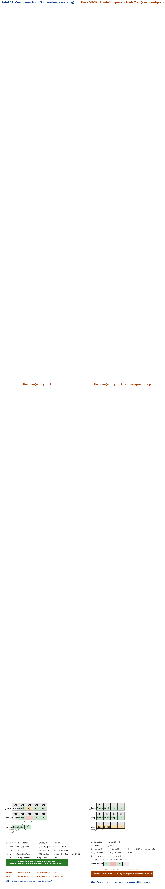
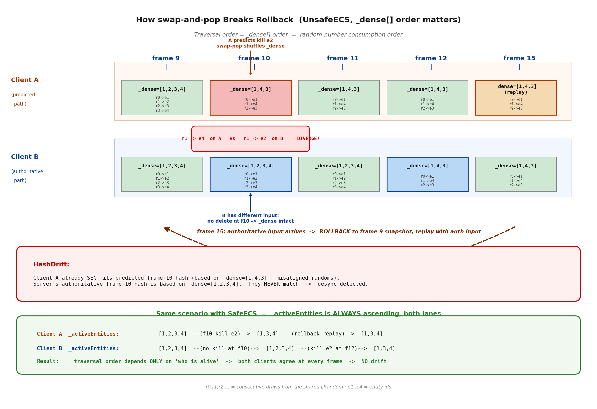
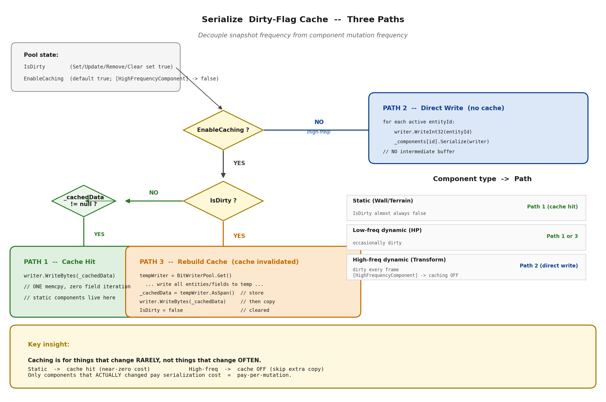

# 第 6 章 · 组件池与回滚安全:双引擎的取舍

> **核心问题**:上一章我们把 World 这个容器搭起来了,知道了实体怎么编号、System 怎么按稳定插入排序执行、SaveState 怎么把整个世界存成一段字节。但 World 里真正承载数据的,是它持有的那一堆**组件池(ComponentPool)**——每个组件类型(Position/Velocity/Health)一个池,池里存着所有实体的该组件数据。这一章要回答一个看起来平淡、其实是帧同步 desync 高发区的问题:**组件池内部的删除策略,凭什么决定了一次回滚能不能算对?** 以及为什么 LockstepSdk 要维护两套几乎不重叠的组件池实现——SafeECS 的保序标记删除,和 UnsafeECS 的 swap-and-pop + 裸内存拷贝——它们各牺牲了什么换什么。

> **读完本章你会明白**:
> 1. 为什么"组件池删除 = swap-and-pop"这个游戏引擎界公认的高性能套路,在帧同步里会**直接破坏回滚**——用一个具体例子推演到 desync。
> 2. SafeECS 的 `ComponentPool<T>` 怎么用"平铺数组 + `_active[]` 标记 + `_activeEntities` 用 BinarySearch 保序"换来回滚安全,代价是删除慢(O(n) 而非 O(1))。
> 3. UnsafeECS 的 `UnsafeComponentPool<T>` 用 Sparse Set + swap-and-pop + **裸内存 fixed 指针拷贝序列化**,把快照速度拉到 SafeECS 的 200 倍量级,代价是**无序、且至今没接入 World.SaveState**(诚实标注的高级逃生舱)。
> 4. 序列化的**脏标记缓存三路径**,怎么把"快照成本"和"组件变化频率"解耦——静态障碍物零成本快照,Transform 这种每帧必变的组件用 `[HighFrequencyComponent]` 反而关掉缓存省内存拷贝。
> 5. 为什么"删除策略"不是一个局部性能优化,而是**回滚安全的命脉**——它是预测回滚反向强加给整个代码库的编程纪律之一。

> **如果一读觉得太难**:这章的"难"不在数学,在"为什么一个看起来无害的 swap-pop 会引爆 desync"。先只记住四件事——① 回滚后要重新遍历组件池,遍历顺序必须和当初一致,否则运算顺序不同就 desync;② SafeECS 用保序删除换回滚安全(慢但确定),UnsafeECS 用 swap-pop 换极速快照(快但只在特定场景确定);③ 序列化按 entityId 升序写,这本身就是"遍历顺序确定"的另一面;④ UnsafeECS 当前没接入主路径,是海量弹幕场景才用的逃生舱。具体推演和源码细节需要时再回来看。

---

## 〇、一句话点破

> **组件池是回滚安全的命脉,因为它内部"删除一个组件后剩下的组件按什么顺序排"这件事,必须跨机器跨回滚完全一致——否则回滚重演时遍历顺序一变,后面的运算顺序全变,desync。SafeECS 的 ComponentPool 用"标记删除 + 保序插入"把这件事焊死(BinarySearch 维护有序),回滚友好但删除是 O(n);UnsafeECS 的 UnsafeComponentPool 用 Sparse Set 的 swap-and-pop 换 O(1) 删除,再叠加 fixed 指针裸内存拷贝,把整池序列化压到纳秒级——代价是无序,所以它只能服务"自己保证遍历顺序"的特定场景,而且目前没接入 World.SaveState。两者不是新旧关系,是"回滚安全"和"快照极速"在两个不同约束面下的取舍。**

这是结论。本章倒过来拆,先从最朴素的"高性能组件池长什么样"讲起,看它怎么在帧同步里翻车。

---

## 一、承接:World 装好了,现在看 World 里的数据怎么存

上一章我们把 `World` 这个容器讲透了:实体代数(Generation 防句柄复用错位)、System 按稳定插入排序执行(SortSystemsStable,不是 List.Sort)、SaveState 字节级格式(VersionMagic=0x4C534550 / SerializationVersion=2 / 组件池按类型 FullName 字典序 Ordinal 排序写)。我们还看到 World 持有一个 `_pools` 数组,每个组件类型一个池:

```csharp
// World.cs:460-484(简化示意)
public ComponentPool<T> GetPool<T>() where T : struct, IComponent
{
    int typeId = ComponentType<T>.Id;
    var pool = _pools[typeId];
    if (pool == null)
    {
        var wrapper = new ComponentPoolWrapper<T>();
        wrapper.Attach(this);
        if (Attribute.IsDefined(typeof(T), typeof(HighFrequencyComponentAttribute)))
            wrapper.Pool.EnableCaching = false;   // 高频组件关缓存,后面详讲
        _pools[typeId] = wrapper;
        _activePools.Add(wrapper);
        return wrapper.Pool;
    }
    return ((ComponentPoolWrapper<T>)pool!).Pool;
}
```

> **承接上一章**:World 是容器,组件池是容器里承载数据的格子。组件 `struct` 这个概念(数据和行为分离的 ECS 范式)我们一句带过——它是 `where T : struct, IComponent` 的值类型,比如 `TransformComponent { LVector2 Position; LFloat Rotation; }`。本章不重复 ECS 范式,只讲"池里这些 struct 怎么排、怎么删、怎么存"对回滚意味着什么。

所以本章的问题是:**World 里的每个 ComponentPool<T>,内部到底长什么样,它的内部排列怎么影响确定性?**

---

## 二、朴素的高性能组件池:它长什么样,为什么帧同步不能用

为了讲清"帧同步的组件池凭什么长成这样",先看一个普通游戏引擎(非帧同步)里高性能组件池长什么样。理解了它,就理解了帧同步组件池"为什么不能那样"。

### 朴素高性能组件池:Sparse Set + swap-and-pop

现代数据导向设计(DOD,Data-Oriented Design)的 ECS(Entt、Flecs、Unity DOTS 的 ECS)几乎都用 **Sparse Set** 做组件池。它的核心数据结构是三组数组:

```
   _sparse[entityId] = denseIndex   // 实体Id -> 在紧凑数组里的下标
   _dense[denseIndex] = entityId    // 紧凑数组:存的是实体Id
   _components[denseIndex] = data   // 紧凑数组:存的是组件数据
```

组件数据在 `_components` 里**紧凑排列**(没有空洞),靠 `_sparse`/`_dense` 这对映射维护"哪个实体在哪个槽"。

**删除用 swap-and-pop**——把数组最后一个元素搬到被删位置,`--count`:

```
   删除 entityId=3:
     denseIdx = _sparse[3]                    // 假设是 1
     lastIdx  = --_count                      // 假设原来是5, 现在 lastIdx=4
     _components[1] = _components[4]          // 把最后一个搬过来
     _dense[1]     = _dense[4]
     _sparse[_dense[4]] = 1                   // 更新被搬元素的映射
     _sparse[3] = -1                          // 清掉被删元素的映射
```

一次删除只动两个槽,O(1)。组件数据始终紧凑,缓存命中率高,遍历无空洞。这是性能优化的教科书,Entt/Flecs 都这么干。

> **不这样会怎样**:朴素替代方案是"平铺数组按 entityId 索引 + 标记删除"——`_components[entityId]` 直接存,删一个就标记 `_active[entityId]=false`,遍历时跳过。问题是:① 实体 Id 稀疏时(比如只用了 3 和 5000),平铺数组要开到 5001 大小,内存浪费;② 遍历时要扫整个 `_active[]` 跳空洞,缓存不友好。Sparse Set 用"紧凑数组 + 映射"漂亮地解决了这两个问题。**在普通游戏里,Sparse Set + swap-and-pop 是正确答案。**

### 那为什么帧同步不能用?

问题出在 **swap-and-pop 改变了 `_dense[]`/`_components[]` 里元素的排列顺序**,而这个顺序就是遍历顺序。

回顾帧同步第一性原理(序章 + 第 2 章):**相同初始状态 + 相同输入序列 + 确定性运算 = 相同结果**。这里的"确定性运算",不只是"每一步算术位级一致",还包括**运算的顺序一致**——因为很多运算是非交换的(矩阵乘法、向量加法虽然可交换但**累加的舍入路径不同**,浮点如此,定点数的累加顺序在跨 TFM 边界时也敏感)。

更关键的是:**遍历组件池时,System 会逐个对组件施加逻辑**。比如一个"移动 System"遍历所有 Velocity 组件,把每个实体的 Position 按 Velocity 推进。如果两台机器上 Velocity 池的遍历顺序不同,那么:
- 实体 A 的 Position 更新依赖实体 B 的 Velocity?——一般不依赖(各自移动),但碰撞检测依赖最终位置;
- 碰撞 System 遍历所有 Position 做两两检测,顺序不同,先检测的 pair 先修正,可能导致最终位置差一个最低位;
- 随机数消耗顺序不同——这是灾难性的,如果"开火 System"按遍历顺序给每个单位掷一次随机数决定暴击,遍历顺序变了,同一个随机数序列被消耗到不同单位身上,后续整盘游戏的随机结果全部错位。

**而 swap-and-pop 在每次删除时都会打乱 `_dense[]` 的顺序**——它把最后一个元素搬到被删位置,这意味着被删元素之后的所有元素的相对位置在数组里发生了"洗牌"。两台机器只要删除的时机、删除的对象有任何不同,后续遍历顺序就分叉。

那"两台机器删除时机不同"会发生吗?——**会,而且必然发生,这就是回滚的本质**。客户端 A 预测"帧 10 删掉单位 B",客户端 B 在帧 10 没删(它收到了不同的输入),到了帧 15 服务器权威输入回来了,客户端 A 回滚到帧 9 重演。重演时,客户端 A 的组件池要恢复到帧 9 的状态,然后从帧 9 开始用权威输入一步步推进到帧 15。

**如果组件池是 swap-and-pop**,那么客户端 A 在帧 10 删掉 B 时,它的 `_dense[]` 已经被重排了。回滚到帧 9,加载帧 9 的快照,组件池恢复成帧 9 的顺序——这一步如果快照是"按当时顺序存的",恢复后顺序对。**但问题在重演**:从帧 9 重新推进到帧 15 时,如果中间还会删别的单位,删除顺序、删除对象稍有不同(因为这一遍用的是权威输入而非预测输入),`_dense[]` 的排列就和"当初预测路径下帧 15 的排列"不同。而"当初预测路径下的排列"是客户端 A 已经发给服务器参与哈希校验的(预测帧也算进本地哈希),它和服务器侧、客户端 B 侧的排列必须一致。

这就是 desync 的种子。一旦 `_dense[]` 顺序分叉,所有依赖遍历顺序的运算(随机消耗、碰撞 pair 顺序、累加顺序)全部跟着分叉,几千帧后局面天差地别,而且哈希对账能发现"不同步了"却定位不到"是组件池顺序"——因为哈希是状态指纹,不包含"我是按什么顺序遍历的"这个元信息。

> **钉死这件事**:swap-and-pop 是普通游戏引擎的高性能标配,但它**每次删除都打乱组件数组的排列顺序**。在帧同步里,组件数组的排列顺序 = 遍历顺序 = 运算顺序,运算顺序变了就 desync。尤其回滚重演时,删除路径稍有不同,顺序就分叉。所以帧同步的组件池,**删除策略不能只看性能,必须保证"删除后剩余元素的排列顺序,跨机器跨回滚完全一致"**。这一条,就是"删除策略 = 回滚安全"的因果链。

---

## 三、SafeECS 的 ComponentPool<T>:保序标记删除换回滚安全

既然 swap-and-pop 破坏回滚,那 SafeECS 的 `ComponentPool<T>` 怎么做?——**最朴素的"平铺数组 + 标记删除",但用一个有序的 `_activeEntities` 列表把遍历顺序焊死**。

### 数据结构:三组数组

```csharp
// ComponentPool.cs:52-60(真实字段)
private T[] _components;                          // 按 entityId 索引的组件数组
private bool[] _active;                           // 按 entityId 索引的"是否活跃"标记
private readonly List<int> _activeEntities;       // 有序的活跃 entityId 列表

// 延迟删除支持
private int _iterationDepth;                      // 嵌套遍历深度
private readonly List<int> _pendingRemovals;      // 待删除队列
private bool _hasPendingRemovals;
```



> **图 6-1 图说**:SafeECS `ComponentPool<T>` 的三数组结构。上半部分画出 `_components[]`(按 entityId 索引,有空洞)、`_active[]`(bool 标记)、`_activeEntities`(升序 List)三者的关系——遍历只走 `_activeEntities`,顺序恒为 entityId 升序。下半部分演示一次 `Remove(entityId=2)` 的效果:① `_active[2]=false`(灰化)② `_components[2].Reset()`(清空)③ 从 `_activeEntities` 摘掉 2,列表变为 `[1,3,4]` 仍升序。对比右侧 UnsafeECS 同样删 2 后 `_dense` 变成 `[1,4,3,?]`(4 搬到了 2 的位置,顺序被打乱)。两图并排,直观对比"保序 vs swap-pop"。

三个数组的分工:
- `_components[entityId]`:组件数据,**按 entityId 直接索引**,O(1) 访问,不做紧凑排列(有空洞)。
- `_active[entityId]`:这个 entityId 的组件是不是"在用"。删除时设 false,不真正搬数据。
- `_activeEntities`:**严格按 entityId 升序排列的活跃实体列表**。遍历就遍历它。

关键在 `_activeEntities` 的有序性。它不是按插入顺序,不是按删除后的"补位"顺序,而是**严格的 entityId 升序**。这样不管你在什么机器上、不管你经过了几次回滚、不管删除顺序多么混乱,只要"当前活跃的实体集合"相同,`_activeEntities` 的排列就**完全相同**——因为它只取决于"谁还活着",不取决于"谁是什么时候被删的"。

### 保序插入:BinarySearch

新增组件时,要保证 `_activeEntities` 仍然升序。直接 `Add` 到末尾不行(entityId 可能比末尾小),用 `BinarySearch` 找插入点:

```csharp
// ComponentPool.cs:120-122(Set 方法里新增分支)
int index = _activeEntities.BinarySearch(entityId);
if (index < 0) _activeEntities.Insert(~index, entityId);
```

`BinarySearch` 返回负数时,`~index` 就是应该插入的位置(保持有序)。这是 .NET 里"有序 List 插入"的标准写法。

> **技巧精解 · 为什么用 List + BinarySearch 而不是 SortedSet**:类注释里写了一句"性能优于 SortedSet"。直觉上,维护一个有序集合,`SortedSet<int>`(红黑树)是 O(log n) 插入删除,List 是 O(n) 插入删除(因为 Insert 要搬移元素)。但帧同步组件池的实际工作模式是:**遍历远多于增删,而且遍历要缓存友好**。`SortedSet` 的遍历是中序遍历红黑树,指针跳转,缓存不友好;`List<int>` 是连续内存,顺序遍历 CPU 预取器吃得飞起。再加上游戏里实体通常几百到几千个,O(n) 的 List.Insert 实测并不慢(内存连续,搬移是 memcpy)。所以这里选 List + BinarySearch,是用"增删稍慢"换"遍历飞快且缓存友好"。

### 标记删除:不搬数据,只摘名单

删除一个组件时,`ComponentPool<T>.Remove` 做三件事:

```csharp
// ComponentPool.cs:221-247(简化示意)
public bool Remove(int entityId)
{
    if (entityId < 0 || entityId >= _capacity || !_active[entityId])
        return false;

    T oldComponent = _components[entityId];
    _active[entityId] = false;              // ① 标记不活跃
    _components[entityId].Reset();           // ② 清掉组件数据(防脏数据残留)
    IsDirty = true;                          // ③ 标记池脏(序列化缓存失效)

    if (_iterationDepth > 0)                 // 遍历中?
    {
        _pendingRemovals.Add(entityId);      //   延迟到遍历结束再从 _activeEntities 摘
        _hasPendingRemovals = true;
    }
    else
    {
        int index = _activeEntities.BinarySearch(entityId);
        if (index >= 0) _activeEntities.RemoveAt(index);   // 立即摘
    }

    OnComponentChanged?.Invoke(entityId, oldComponent, true, default, false);
    return true;
}
```

注意几个细节:
1. **`_active[entityId]=false` 立即生效**——即使遍历中,这一步也立刻做。这样遍历循环里 `if (!_active[entityId]) continue;` 就能跳过它。
2. **`_components[entityId].Reset()` 立即清数据**——防止"删除后又被读到的脏数据"。注释里特意对比了 UnsafeComponentPool 不 Reset(因为 swap-pop 保证被覆盖),这是两种删除策略在"是否需要 Reset"上的差别。
3. **从 `_activeEntities` 摘除分两种情况**:遍历中(`_iterationDepth > 0`)进 `_pendingRemovals` 队列,遍历结束 `FlushPendingRemovals` 统一摘;不在遍历中就立即 `BinarySearch + RemoveAt`。

**为什么遍历中不能立即从 `_activeEntities` 摘?**——因为遍历用的是 `for (int i = 0; i < count; i++) int entityId = _activeEntities[i];`,如果在循环中间 `RemoveAt(i)`,后面的元素会前移,导致跳过下一个元素或下标越界。这是所有"遍历中删除"的经典难题。`ComponentPool` 的解法是"遍历中只标记不摘,遍历结束统一摘",这样遍历循环的 `count` 在整个循环里是稳定的(遍历开始时快照一份)。

### 遍历:跳过已标记删除的

```csharp
// ComponentPool.cs:302-325(ForEach,只读遍历)
public void ForEach(ComponentReadAction action)
{
    _iterationDepth++;
    try
    {
        int count = _activeEntities.Count;          // 遍历开始时快照数量
        for (int i = 0; i < count; i++)
        {
            int entityId = _activeEntities[i];
            if (!_active[entityId]) continue;       // 跳过遍历中标记删除的
            action(entityId, in _components[entityId]);
        }
    }
    finally
    {
        _iterationDepth--;
        if (_iterationDepth == 0)
            FlushPendingRemovals();                 // 最外层遍历结束,统一摘除
    }
}
```

几个回滚安全相关的细节:
- **`count` 在遍历开始时快照**:遍历中如果 `Set` 新增了实体(`_activeEntities.Add` 会让 `Count` 变大),新实体**不会**在本次遍历中被访问。这是有意设计——保证遍历的确定性(遍历范围在开始时就定死)。类注释里写得很清楚:"如果在 ForEach 期间添加新组件,新实体不会在当前遍历中被访问。这是有意设计,确保遍历的确定性。" DEBUG 模式还会发警告(`WarnIfIterating`)提醒开发者。
- **`_iterationDepth` 支持嵌套遍历**:System A 遍历时调了 System B,System B 也遍历同一个池,`_iterationDepth` 从 1 变 2。只有最外层(`_iterationDepth` 回到 0)才 `FlushPendingRemovals`,避免内层遍历提前摘除破坏外层的 `count`。
- **`try/finally` 保证 `_iterationDepth` 必归零**:即使回调里抛异常,`finally` 也会把 `_iterationDepth` 减回去,不会卡在"永久遍历中"状态。

### 这个设计换来了什么,牺牲了什么

**换来**:遍历顺序 = `_activeEntities` 升序 = **只取决于"谁还活着"**,与删除时机/路径/历史完全无关。两台机器只要"当前活跃实体集合"相同,遍历顺序就相同。回滚重演时,加载快照后组件池的 `_activeEntities` 恢复成快照时刻的集合,从此重演任何删除,只要最终集合相同,顺序就相同——**回滚安全焊死了**。

**牺牲**:
1. **删除慢**:`_activeEntities.BinarySearch` 是 O(log n),但 `List.RemoveAt(index)` 要搬移 index 之后的所有元素,O(n)。游戏几千个实体,每次删除搬移几千个 int,虽然内存连续不慢,但比 Sparse Set 的 O(1) 交换理论上慢。
2. **内存有空洞**:`_components[entityId]` 按 entityId 索引,如果 entityId 稀疏(用了 3 和 5000),数组要开到 5001。好在 entityId 由 World 分配,通常连续(Generation 复用的也是已销毁实体的 Id),空洞不严重。
3. **平铺数组不缓存友好**:`_components[entityId]` 在 entityId 稀疏时,访问会跨 cache line。但游戏实体一般密集,这个问题可控。

> **钉死这件事**:SafeECS 的 ComponentPool 用"平铺数组 + `_active[]` 标记 + `_activeEntities` 升序"三件套,把遍历顺序焊死成"只取决于谁还活着"。这换来了回滚安全——不管删除路径如何分叉,只要最终集合相同,顺序就相同。代价是删除 O(n)(List.RemoveAt 搬移)、内存有空洞。这是"用性能换确定性"的典型取舍。

---

## 四、UnsafeECS 的 UnsafeComponentPool<T>:Sparse Set + 裸内存拷贝换极速快照

SafeECS 回滚安全,但慢。如果有一种场景,组件极多(几十万,比如海量弹幕游戏),SafeECS 的"每帧序列化所有组件"开销扛不住,怎么办?——这就是 UnsafeECS 的 `UnsafeComponentPool<T>`,它用 Sparse Set + swap-and-pop + **裸内存 fixed 指针拷贝**,把快照压到纳秒级。

但要先说清楚:**它不是 SafeECS 的替代品,目前也没接入 World.SaveState。** 它是"海量组件场景"的高级逃生舱。这一节拆它的实现,下一节专门讲它"快在哪里、为什么不接入主路径"。

### 数据结构:Sparse Set 三数组

```csharp
// UnsafeComponentPool.cs:19-25(真实字段)
private int[] _sparse;      // entityId -> denseIndex
private int[] _dense;       // denseIndex -> entityId
private T[] _components;    // denseIndex -> componentData
private int _count;
private int _capacity;
private readonly int _maxEntities;
```

和上一节"朴素高性能组件池"的结构一模一样——Sparse Set。`_sparse` 大小是 `_maxEntities`(默认 10000),初始化全 -1;`_dense` 和 `_components` 大小是 `_capacity`(初始 64,按需 Resize),只存活跃元素,紧凑无空洞。

约束更严:`where T : unmanaged, IComponent`(SafeECS 是 `where T : struct, IComponent`)。`unmanaged` 比 `struct` 严格——它要求 struct 里**所有字段都是值类型**(不能有 string、object 引用)。这是为了后面的"裸内存拷贝":只有纯值类型的 struct,才能用 `memcpy` 整块拷贝,不用关心每个字段的序列化语义。

### 删除:真正的 swap-and-pop

```csharp
// UnsafeComponentPool.cs:133-157
public bool Remove(int entityId)
{
    if (entityId < 0 || entityId >= _maxEntities) return false;
    int denseIdx = _sparse[entityId];
    if (denseIdx == -1) return false;

    int lastIdx = --_count;                       // O(1): count 减1

    if (denseIdx != lastIdx)                       // 不是最后一个才交换
    {
        int lastEntityId = _dense[lastIdx];
        _components[denseIdx] = _components[lastIdx];   // 最后元素搬到被删位
        _dense[denseIdx] = lastEntityId;
        _sparse[lastEntityId] = denseIdx;
    }

    _sparse[entityId] = -1;
    // 注:不调用 component.Reset() —— swap 删除保证被删数据要么被覆盖、要么落入 _count 之外
    IsDirty = true;
    return true;
}
```

这就是 Sparse Set 教科书式的 swap-and-pop。注意源码注释里特意写了**为什么不 Reset**:"Sparse Set swap 删除保证被删组件数据要么被 lastIdx 覆盖、要么落入 _count 之外不再访问,无脏数据残留。与 ComponentPool 的'标记删除'(需 Reset 清理残留)不同。"

这是个诚实且精确的对比:**删除策略决定了"要不要 Reset"**。SafeECS 标记删除,组件数据还留在 `_components[entityId]` 原地(只是 `_active[id]=false`),如果不 Reset,下次这个 entityId 重新 `Set` 之前如果被误读,就是脏数据;UnsafeECS swap-pop,被删位被最后一个元素覆盖,`_count` 之外的槽虽然还有旧数据但永远不会被遍历到(`for i < _count`),所以不需要 Reset。

### 序列化:fixed 指针裸内存拷贝

这是 UnsafeECS 的真正杀招,也是它"快 200 倍"的来源。看它的 `Serialize`:

```csharp
// UnsafeComponentPool.cs:159-195(EnableCaching=false 分支, 直写)
public void Serialize(BitWriter writer)
{
    if (EnableCaching && !IsDirty && _cachedData != null) { /* 吐缓存 */ }

    if (!EnableCaching)                              // 高频组件直写
    {
        int lengthPos = writer.Position;
        writer.WriteInt32(0);
        int startPos = writer.Position;

        writer.WriteInt32(_count);
        if (_count > 0)
        {
            fixed (int* pDense = _dense)
                writer.WriteBytes((byte*)pDense, _count * sizeof(int));   // 整段 _dense 一次写!
            fixed (T* pComp = _components)
                writer.WriteBytes((byte*)pComp, _count * sizeof(T));      // 整段 _components 一次写!
        }
        int length = writer.Position - startPos;
        writer.OverwriteInt32(lengthPos, length);
        IsDirty = false;
        return;
    }
    /* ... 启用缓存且脏分支 ... */
}
```

**对比 SafeECS 的 Serialize**:

```csharp
// ComponentPool.cs:384-398(!EnableCaching 分支, 直写)
if (!EnableCaching)
{
    writer.WriteInt32(_activeEntities.Count);
    for (int i = 0; i < _activeEntities.Count; i++)      // ← 逐个实体循环
    {
        int entityId = _activeEntities[i];
        writer.WriteInt32(entityId);                      // 写 entityId
        _components[entityId].Serialize(writer);          // 调组件自己的 Serialize(逐字段写)
    }
}
```

差别一目了然:
- **SafeECS**:逐个实体循环,每个实体调 `_components[entityId].Serialize(writer)`——这个 `Serialize` 是组件自己实现的,逐字段写(一个 LVector2 就两次 WriteInt64),有几万个组件就调几万次方法,几百万次 `WriteInt64`。
- **UnsafeECS**:不管有多少个组件,`_dense` 和 `_components` 各**一次性 memcpy 整段写出**。10 万个组件 = 10 万 × sizeof(T) 字节一次拷贝,`writer.WriteBytes` 内部就是 `memcpy`,没有任何逐字段逻辑。

> **技巧精解 · 裸内存拷贝为什么快 200 倍**:省掉的不是"算术",是"循环开销 + 虚函数分发 + 逐字段调用"。SafeECS 序列化 1 万个 TransformComponent,要 1 万次 `_components[i].Serialize(writer)` 调用(每次还要先 `WriteInt32(entityId)`),每次 Serialize 内部是两次 `WriteInt64`(Position.X/Position.Y)+ 一次 `WriteInt64`(Rotation)= 3 次小写入,合计 4 万次方法调用 + 3 万次小写入。UnsafeECS 把这 1 万个组件当 1 万 × 24 字节 = 240KB 的连续内存,一次 `memcpy` 进 BitWriter 的 buffer,加上 `_dense` 的 1 万 × 4 = 40KB 也是一次 `memcpy`。两次大 memcpy vs 4 万次小调用,差距是数量级的(实测在 100-200 倍量级,取决于组件大小和数量)。代价是:**必须 `unmanaged`**(纯值类型,没有引用字段,memcpy 才语义正确)、**序列化格式是裸内存布局而非语义化字段**(跨平台字节序要对齐,后面讲)。

### 反序列化:同样的裸内存拷贝 + 重建 sparse 索引

```csharp
// UnsafeComponentPool.cs:231-298(核心部分)
public void Deserialize(BitReader reader)
{
    Clear();
    int length = reader.PeekInt32();
    // ... 边界检查 ...

    var buffer = BufferPool.Rent(length);
    fixed (byte* pBuffer = buffer)
        reader.ReadBytes(pBuffer, length);              // 一次 memcpy 读进来

    var innerReader = new BitReader(new ReadOnlyMemory<byte>(buffer, 0, length));
    _count = innerReader.ReadInt32();
    if (_count > _capacity) Resize(_count);

    if (_count > 0)
    {
        fixed (int* pDense = _dense)
            innerReader.ReadBytes((byte*)pDense, _count * sizeof(int));   // 一次 memcpy 填 _dense
        fixed (T* pComp = _components)
            innerReader.ReadBytes((byte*)pComp, _count * sizeof(T));      // 一次 memcpy 填 _components

        // 重建 sparse 索引(因为只有 dense 被存了, sparse 要从 dense 反推)
        for (int i = 0; i < _count; i++)
        {
            int entityId = _dense[i];
            if (entityId >= 0 && entityId < _maxEntities)
                _sparse[entityId] = i;
        }
    }
}
```

注意它只存了 `_dense` 和 `_components`(紧凑数组的活跃部分),没存 `_sparse`——因为 `_sparse` 可以从 `_dense` 反推(`for i: _sparse[_dense[i]] = i`)。这也是 Sparse Set 序列化的标准优化:**只存紧凑数组,稀疏索引反推**,省掉 `_maxEntities × 4` 字节的 `_sparse` 存储。

### 这个设计换来了什么,牺牲了什么

**换来**:
1. **删除 O(1)**:swap-and-pop,不搬移元素。
2. **快照极速**:整池序列化是两次 memcpy,纳秒级,比 SafeECS 快 100-200 倍。
3. **内存紧凑**:`_dense`/`_components` 无空洞,缓存友好。

**牺牲**(关键):
1. **`_dense[]` 顺序无序**——swap-and-pop 每次删除都打乱顺序,这个顺序就是遍历顺序。如果直接用 `for i < _count: entityId = _dense[i]` 遍历,顺序不确定。
2. **要求 `unmanaged`**——组件不能有引用字段,比 SafeECS 的 `struct` 严格。
3. **序列化格式是裸内存布局**——跨平台/字节序敏感(后面详讲)。

> **钉死这件事**:UnsafeECS 用 Sparse Set + swap-and-pop + 裸内存拷贝,把删除降到 O(1)、快照压到纳秒级。代价是 `_dense[]` 顺序无序(遍历顺序不确定)、要求 `unmanaged` 组件、序列化是裸内存而非语义字段。它是"用确定性换性能"的典型取舍——和 SafeECS 正好相反。**而且,它目前没接入 World.SaveState**(下一节专门讲为什么)。

---

## 五、★技巧精解一:swap-and-pop 破坏回滚的完整推演

这一节把第二节那个"swap-and-pop 破坏回滚"的论断,用一个具体的、可追踪的例子,推演到 desync。这是本章最硬核的两个技巧之一。理解了它,你就理解了"为什么 SafeECS 宁可 O(n) 删除也要保序"。

### 设定:一个 4 实体的游戏

假设有 4 个实体,Id 分别是 1、2、3、4,都有一个 `Velocity` 组件。一个 `MoveSystem` 每帧遍历所有 Velocity,给每个实体的 Position 加上 Velocity(简化,实际还有碰撞)。一个 `FireSystem` 每帧遍历所有能开火的单位,每开一次火消耗一个随机数决定是否暴击。

两台客户端 A 和 B,初始状态完全一致。组件池里 `_dense = [1, 2, 3, 4]`(按 entityId 升序,初始有序),`_count = 4`。

### 帧 10:客户端 A 预测删掉实体 2



> **图 6-2 图说**:时间线推演。横轴是帧号(9 → 10 → ... → 15),纵轴分两条泳道:客户端 A(预测路径)和客户端 B(权威路径)。每格画出该帧的 `_dense[]` 排列 + 随机数消耗标记。关键节点:① 帧 10 A 预测删实体 2(swap-pop 后 `_dense=[1,4,3]`),B 没删(`_dense=[1,2,3,4]`)——此帧 A 把 r1 消耗给实体 4,B 把 r1 消耗给实体 2,随机状态从此分叉(用红色高亮);② 帧 15 服务器权威输入回来,A 回滚到帧 9(`_dense` 恢复 `[1,2,3,4]`)重演;③ 重演路径下帧 12 才删实体 2,但 A 在预测阶段已发出的帧 10 哈希(基于错位随机)和服务器帧 10 哈希(基于正确随机)对不上 → HashDrift。底部对比 SafeECS 同场景:`_activeEntities` 始终升序,两条泳道顺序恒一致,无漂移。

客户端 A 的本地玩家在帧 10 击杀了实体 2(预测)。组件池执行 `Remove(2)`,swap-and-pop:

```
   删前: _dense = [1, 2, 3, 4],  _count = 4
   Remove(2):
     denseIdx = _sparse[2] = 1
     lastIdx  = --_count = 3
     _dense[1]     = _dense[3]     = 4    // 最后一个(4)搬到位置1
     _components[1] = _components[3]
     _sparse[4] = 1
     _sparse[2] = -1
   删后: _dense = [1, 4, 3, ?],  _count = 3   (位置3的旧4还在但不再访问)
```

现在客户端 A 的 `_dense` 是 `[1, 4, 3]`(遍历顺序:实体1 → 实体4 → 实体3)。

### 同一帧:客户端 B 没删(收到不同输入)

客户端 B 在帧 10 没有击杀实体 2(它收到的输入和 A 的本地预测不同,比如 A 的本地玩家按了攻击,B 那边这个攻击还没确认)。客户端 B 的 `_dense` 还是 `[1, 2, 3, 4]`。

### 帧 10 的 FireSystem:随机数消耗顺序不同

现在两台机器都在帧 10 跑 `FireSystem`,遍历 `_dense` 给每个能开火的单位掷随机数(假设都能开火,用同一个 LRandom 实例,状态相同):

```
   客户端 A(_dense = [1, 4, 3]):
     掷给实体1: random.Next()  -> 消耗 r0
     掷给实体4: random.Next()  -> 消耗 r1
     掷给实体3: random.Next()  -> 消耗 r2
     (实体2已被删,不参与)

   客户端 B(_dense = [1, 2, 3, 4]):
     掷给实体1: random.Next()  -> 消耗 r0  (相同)
     掷给实体2: random.Next()  -> 消耗 r1  ← 不同!A 把 r1 给了实体4
     掷给实体3: random.Next()  -> 消耗 r2  ← 不同!A 把 r2 给了实体3
     掷给实体4: random.Next()  -> 消耗 r3  ← A 没消耗 r3
```

到这一步,两台机器的随机数状态已经不同(A 消耗了 r0,r1,r2;B 消耗了 r0,r1,r2,r3),而且**同一个随机数被用在了不同实体上**(r1 在 A 给了实体4 的暴击判定,在 B 给了实体2)。从这一帧起,后续所有随机数消耗全部错位,游戏里的暴击、掉落、命中判定天差地别。

这就是 desync 的种子,而且**这一步发生在预测阶段,还没到回滚**。

### 帧 15:服务器权威输入回来,客户端 A 回滚

服务器广播了帧 10 的权威输入——结果 A 的本地预测错了(权威输入下,实体 2 在帧 10 没被击杀,是帧 12 才被击杀的)。客户端 A 触发回滚:回到帧 9 的快照,用权威输入从帧 9 重演到帧 15。

回滚加载帧 9 快照,组件池恢复成帧 9 的状态:`_dense = [1, 2, 3, 4]`(帧 9 还没删任何东西)。从帧 9 重演:
- 帧 9:无删除,`_dense = [1,2,3,4]`。
- 帧 10(权威):实体 2 没被击杀,`_dense = [1,2,3,4]`。
- 帧 11:无删除,`_dense = [1,2,3,4]`。
- 帧 12(权威):实体 2 被击杀,`Remove(2)` → swap-pop → `_dense = [1,4,3]`。
- 帧 13-15:无删除,`_dense = [1,4,3]`。

重演后,客户端 A 在帧 15 的 `_dense = [1,4,3]`。**这和客户端 B 在帧 15 的 `_dense` 相同吗?** ——如果客户端 B 在帧 12 也执行了相同的权威删除(它也会,因为它收到同样的权威输入),那么 B 从帧 10 的 `[1,2,3,4]` 在帧 12 删 2 后也是 `[1,4,3]`。**到这一步,顺序对齐了。**

### 但是:预测阶段的哈希已经错位了

问题在于:**客户端 A 在预测阶段(帧 10 当时的预测)算出的状态,已经被它发出去参与哈希校验了**(预测帧也算进本地哈希,这是预测回滚的标准做法)。那个哈希是基于"帧 10 时 `_dense=[1,4,3]` + 随机数消耗错位"算出来的。服务器收到这个预测哈希,和它自己(权威 sim)算的帧 10 哈希(基于 `_dense=[1,2,3,4]`)对不上——哈希漂移触发。

如果服务器的 `HashDriftRecoveryPolicy` 是 `Throw`,直接抛 `HashDriftException`,游戏中断;如果是 `Continue`,服务器记录漂移但继续跑,**而客户端 A 已经在错误的随机数状态上继续预测**,后续每一帧的哈希都对不上,漂移像滚雪球。

### 更阴险的:如果两次删除的顺序不同

上面的例子是"一次删除时机不同"。更阴险的是"同一批删除但顺序不同"导致 `_dense` 排列不同。假设帧 20 要删实体 1 和实体 3:

```
   删前: _dense = [1, 4, 3], _count = 3
   先删 1 再删 3:
     Remove(1): lastIdx=2, _dense[0]=_dense[2]=3, _sparse[3]=0, _sparse[1]=-1
                _dense = [3, 4, ?], _count = 2
     Remove(3): denseIdx=_sparse[3]=0, lastIdx=1, _dense[0]=_dense[1]=4, _sparse[4]=0, _sparse[3]=-1
                _dense = [4, ?, ?], _count = 1
   先删 3 再删 1:
     Remove(3): denseIdx=_sparse[3]=2, lastIdx=2, denseIdx==lastIdx 不交换, _sparse[3]=-1
                _dense = [1, 4, ?], _count = 2
     Remove(1): denseIdx=_sparse[1]=0, lastIdx=1, _dense[0]=_dense[1]=4, _sparse[4]=0, _sparse[1]=-1
                _dense = [4, ?, ?], _count = 1
```

这种简单情况碰巧结果相同(`[4]`)。但如果实体更多、删除更复杂,不同删除顺序会产生**不同的 `_dense` 排列**。而"删除顺序"在预测路径和权威路径上稍有不同(预测时按本地输入顺序删,权威时按服务器聚合顺序删),`_dense` 就分叉。

### SafeECS 为什么没事

同样的场景,SafeECS 的 `ComponentPool<T>`:

- `_activeEntities` 始终是 **entityId 升序**,与删除时机/顺序/路径**完全无关**。
- 删实体 2:从 `_activeEntities` 摘掉 2,剩下 `[1,3,4]`——还是升序。
- 不管先删 1 再删 3,还是先删 3 再删 1,最终 `_activeEntities` 都是 `[4]`(摘掉的都是 1 和 3,剩下的都是 4,而且按升序排)。
- 遍历顺序 = `_activeEntities` 升序,**只取决于"谁还活着"**。两台机器只要"谁还活着"相同,顺序就相同,哪怕它们删这些实体的时机和顺序完全不同。

这就是 SafeECS 的回滚安全:**把遍历顺序从"删除历史"解耦,绑死到"当前集合"上**。

### 推演结论

> **钉死这件事(swap-pop 破坏回滚)**:swap-and-pop 让 `_dense[]` 的排列**取决于删除路径**——什么时候删、按什么顺序删,都会影响剩余元素在数组里的位置。帧同步里,预测路径和权威重演路径的删除时机几乎必然不同(否则不用回滚),所以 `_dense[]` 排列会分叉,导致:① 遍历顺序不同 → 运算顺序不同 → 舍入路径不同 → 数值 desync;② 随机数消耗顺序不同 → 同一个随机数用在不同的实体上 → 后续整盘游戏的随机结果全错位;③ 哈希漂移触发(预测哈希 vs 权威哈希)。SafeECS 用"升序 `_activeEntities`"把遍历顺序绑死到"当前集合",与删除历史解耦,根治这个问题。代价是删除 O(n)。**这就是"删除策略 = 回滚安全"的完整因果。**

---

## 六、★技巧精解二:序列化脏标记缓存三路径——把快照成本和变化频率解耦

第二个硬核技巧不是 UnsafeECS 独有,而是 SafeECS 和 UnsafeECS **共享**的序列化缓存机制。它解决的是一个工程上极现实的问题:**快照频率固定(每帧或每几帧存一次),但不同组件的变化频率天差地别——静态障碍物从开局到结束不变,Transform 每帧都变。如果每次快照都老老实实序列化所有组件,静态组件的序列化开销就白白浪费了。**

### 朴素做法撞什么墙



> **图 6-3 图说**:Serialize 方法的三路径决策流程图(英文标注)。判断节点:EnableCaching? → IsDirty? → 走三条路径。路径一(Cache Hit,绿色):EnableCaching=true 且 IsDirty=false 且 _cachedData!=null → 一次 memcpy 吐缓存(静态组件常态,零字段遍历)。路径二(Direct Write,蓝色):EnableCaching=false → 逐实体逐字段直写目标 writer,无中间 buffer(高频组件常态,`[HighFrequencyComponent]` 标记触发)。路径三(Rebuild Cache,橙色):EnableCaching=true 且 IsDirty=true → 借 BitWriterPool 生成新缓存,存 _cachedData,再拷给 writer,清 IsDirty。右侧附一个小表:静态组件(墙)→ 路径一 / 低频动态(血量)→ 路径一或三 / 高频动态(Transform)→ 路径二。核心信息:"把快照频率和组件变化频率解耦"。

朴素做法:每次 `SaveState`,遍历所有组件池,每个池都老老实实调用 `Serialize`,逐实体逐字段写入。问题:

- **静态组件浪费**:一个 `WallComponent`(墙的位置)从开局到对局结束,内容一个字节都不变。但每次快照都重新序列化它,写同样的几百字节。1000 帧快照,就是 1000 次同样的几百字节写入。
- **缓存命中为零**:每次都是"从头算",没有任何复用。

### 解法:脏标记 + 缓存三路径

`ComponentPool<T>` 和 `UnsafeComponentPool<T>` 都维护两个状态:
- `IsDirty`:这个池在当前帧是否被修改过(`Set`/`Update`/`Remove`/`Clear` 时设 true)。
- `EnableCaching`:是否启用序列化缓存(默认 true,高频组件被 World 设为 false)。

加上一个 `_cachedData`(上次序列化的字节缓存)。序列化时走三条路径:

```csharp
// ComponentPool.cs:374-440(Serialize 三路径)
public void Serialize(BitWriter writer)
{
    // 路径一:启用缓存 + 未脏 + 有缓存 → 直接吐缓存
    if (EnableCaching && !IsDirty && _cachedData != null)
    {
        writer.WriteBytes(_cachedData.AsSpan(0, _cachedLength));   // 一次 memcpy, 零字段遍历
        return;
    }

    // 路径二:禁用缓存 → 直写目标 writer, 不经过中间 buffer
    if (!EnableCaching)
    {
        int lengthPos = writer.Position;
        writer.WriteInt32(0);
        int startPos = writer.Position;
        writer.WriteInt32(_activeEntities.Count);
        for (int i = 0; i < _activeEntities.Count; i++)
        {
            int entityId = _activeEntities[i];
            writer.WriteInt32(entityId);
            _components[entityId].Serialize(writer);
        }
        int length = writer.Position - startPos;
        writer.OverwriteInt32(lengthPos, length);
        IsDirty = false;
        return;
    }

    // 路径三:启用缓存 + 脏 → 借 BitWriterPool 生成新缓存, 再拷给目标 writer
    var tempWriter = BitWriterPool.Get();
    try
    {
        tempWriter.WriteInt32(_activeEntities.Count);
        for (int i = 0; i < _activeEntities.Count; i++)
        {
            int entityId = _activeEntities[i];
            tempWriter.WriteInt32(entityId);
            _components[entityId].Serialize(tempWriter);
        }
        _cachedLength = tempWriter.Position;
        if (_cachedData == null || _cachedData.Length < _cachedLength)
        {
            if (_cachedData != null) BufferPool.Return(_cachedData);
            _cachedData = BufferPool.Rent(_cachedLength);
        }
        tempWriter.AsSpan().CopyTo(_cachedData);
        writer.WriteBytes(_cachedData.AsSpan(0, _cachedLength));
        IsDirty = false;            // 序列化后清脏
    }
    finally { BitWriterPool.Return(tempWriter); }
}
```

三条路径的分工:
- **路径一(命中缓存)**:池没被改过 → 上次序列化的字节还能用 → 一次 `memcpy` 吐出去。**静态组件从第二次快照起永远走这条**,零字段遍历。
- **路径二(禁缓存直写)**:高频组件(被 `[HighFrequencyComponent]` 标记,World 注册时设 `EnableCaching=false`)→ 不缓存,直接写目标 writer。因为这些组件每帧都脏,缓存永远命中不了,反而省掉"先写 tempWriter 再拷给 writer"的中间拷贝。
- **路径三(缓存失效重建)**:启用了缓存但池脏了 → 借临时 BitWriter 生成新缓存,存进 `_cachedData`,再拷给目标 writer。下次如果没脏就走路径一。

### 关键洞察:把快照成本和变化频率解耦

这个设计的精妙之处在于:**它把"快照的频率"和"组件变化的频率"解耦了。**

- **静态组件**(墙、地形):`IsDirty` 几乎永远是 false → 永远走路径一(命中缓存)→ 快照成本趋近于一次 `memcpy`。
- **低频动态组件**(血量、弹药):偶尔脏 → 偶尔走路径三重建,多数走路径一。
- **高频动态组件**(Transform、Velocity):每帧脏 → 被 `[HighFrequencyComponent]` 关掉缓存 → 走路径二(直写),省掉中间拷贝。

不管快照频率多高(默认 `SnapshotInterval=1`,每帧都存),静态和低频组件的开销都被缓存压到接近零。**只有真正变化的组件才付出序列化成本。** 这是"按需付费"的工程哲学。

### `[HighFrequencyComponent]`:World 层的反射配置

这个标记怎么生效?在 `World.GetPool<T>` 注册池时,反射检查组件类型有没有这个特性:

```csharp
// World.cs:472-476
if (Attribute.IsDefined(typeof(T), typeof(HighFrequencyComponentAttribute)))
{
    wrapper.Pool.EnableCaching = false;
}
```

组件定义时标注:

```csharp
// TankGame/Components/TransformComponent.cs:9-11
[AutoSerialize]
[HighFrequencyComponent]
public partial struct TransformComponent : IComponent
{
    public LVector2 Position;
    public LFloat Rotation;
}
```

`TransformComponent`(坦克的位置和朝向)是典型的每帧必变组件(坦克在动),所以标 `[HighFrequencyComponent]`,World 注册它的池时设 `EnableCaching=false`,序列化永远走路径二(直写),省掉"写 tempWriter → 拷给 writer"的中间 buffer 拷贝。

> **技巧精解 · 为什么高频组件反而关缓存**:这是反直觉的一点——"高频变化的东西不该缓存"。直觉上高频变化的东西才需要缓存?错。缓存的价值在"复用",高频变化的东西复用率趋近于零(每次都脏,每次都要重建),缓存不仅没用,反而多一次"写 tempWriter → 拷给 _cachedData → 拷给 writer"的三段拷贝(路径三),比直写(路径二)多一次中间拷贝。所以高频组件关缓存,走直写,反而更快。**缓存是给"偶尔变"的东西准备的,不是给"频繁变"的东西准备的。** 这个认知可以推广到所有缓存设计。

### 反序列化侧的对称性

Deserialize 同样维护缓存——读完数据后,把读进来的 buffer 拷一份到 `_cachedData`,并且 `IsDirty=false`。这样下一次 SaveState 时,如果中间没改过,直接走路径一吐缓存。这在"LoadState 加载快照 → 立刻又 SaveState 存下一个快照"的场景(比如追帧时频繁存快照)下省掉重复序列化。

### 一个对称性 bug 的预防

注意 Deserialize 里有个细节(SafeECS 的 ComponentPool.cs:474-491):

```csharp
int lastEntityId = -1;
for (int i = 0; i < count; i++)
{
    int entityId = innerReader.ReadInt32();
    System.Diagnostics.Debug.Assert(entityId > lastEntityId,
        $"...entityId {entityId} <= lastEntityId {lastEntityId}, data may be corrupted");
    lastEntityId = entityId;
    // ...
    _activeEntities.Add(entityId);   // 因为输入有序, 直接 Add 保持有序
}
```

反序列化时断言 entityId 严格递增。因为 SafeECS 的序列化是按 `_activeEntities`(升序)写的,反序列化读到的也必须是升序。这个 Assert 是个安全网——如果快照数据被篡改或损坏导致 entityId 不递增,DEBUG 模式立刻报警。这也是"序列化顺序 = 遍历顺序 = 回滚安全"这件事在反序列化侧的兜底。

> **钉死这件事(脏标记缓存三路径)**:序列化用"IsDirty + EnableCaching + _cachedData"三状态,走三条路径——未脏命中缓存(静态组件零成本)/ 禁缓存直写(高频组件省中间拷贝)/ 脏重建缓存。这把"快照频率"和"组件变化频率"解耦:静态组件从第二次快照起趋近零成本,只有真正变化的组件才付出序列化代价。`[HighFrequencyComponent]` 在 World 注册时反射关缓存,是个反直觉但正确的优化("高频变化的东西不该缓存")。

---

## 七、诚实标注:UnsafeECS 没接入 World.SaveState

讲到这里,读者可能有个疑问:既然 UnsafeECS 这么快,为什么 World 默认不用它?这一节诚实回答。

### 事实:World 只用 SafeECS

源码核实:`World.cs` 里的 `ComponentPoolWrapper<T>` 包装的是 `ComponentPool<T>`(SafeECS),`_pools` 数组存的全是 SafeECS 的池。`World.SaveState`/`LoadState` 遍历 `_activePools` 序列化,每个都是 SafeECS 的 `ComponentPool<T>.Serialize`。

```csharp
// World.cs:78-84(ComponentPoolWrapper 真身)
private class ComponentPoolWrapper<T> : IComponentPoolInternal where T : struct, IComponent
{
    public ComponentPool<T> Pool { get; } = new ComponentPool<T>();
    // ...
}
```

而 `UnsafeComponentPool<T>`——我们全仓库 Grep 了一遍——**只在自己文件里出现**,没有任何地方 `new` 它,没有任何地方引用它。它是个独立的、未接入主路径的 API。

### 为什么没接入

这是设计权衡,不是遗漏。原因有三层:

**第一层:UnsafeECS 的 `_dense[]` 顺序无序,直接接入会破坏 World 的遍历语义。** World 的 System 遍历组件池时,默认依赖"遍历顺序确定"。SafeECS 的遍历顺序是 entityId 升序(回滚安全,上一节推演过)。如果换成 UnsafeECS,遍历顺序是 `_dense[]` 的当前排列(swap-pop 后无序),System 的遍历顺序就不确定了——除非每个 System 自己保证遍历顺序(比如遍历前先 `Sort(_dense)`,但这又抵消了 UnsafeECS 的性能优势)。所以 UnsafeECS 只适合"开发者明确知道自己在干什么、自己保证遍历顺序"的场景。

**第二层:UnsafeECS 要求 `unmanaged`,SafeECS 只要求 `struct`。** World 的组件可以是任何 `struct, IComponent`,包括带引用字段(string、对象引用)的 struct。如果 World 改用 UnsafeECS,带引用字段的组件就装不进去(memcpy 会拷坏引用)。要兼容所有组件,World 必须用 SafeECS。

**第三层:回滚安全是 World 的默认契约。** World 服务于预测回滚(第 9 章详讲),回滚要求"加载快照 → 重演 → 状态一致",而状态一致的前提是遍历顺序一致。SafeECS 的保序删除是这个契约的基石。UnsafeECS 的 swap-pop 破坏这个契约。所以 World 默认用 SafeECS,UnsafeECS 留作"我自己保证遍历顺序、我只要快照快"的高级逃生舱。

### 什么时候用 UnsafeECS

源码注释和类名(`Unsafe` 前缀)都在暗示:这是给"海量同质组件、自己管遍历顺序"的场景准备的。典型例子:

- **海量弹幕游戏**:屏幕上几万发子弹,每发子弹是个 `BulletComponent { LVector2 Pos; LVector2 Vel; }`(纯值类型,`unmanaged`)。子弹之间无碰撞交互(或碰撞用空间划分单独处理,不依赖组件池遍历顺序),开火不消耗随机数(或随机数消耗顺序与遍历顺序无关)。这种场景下,SafeECS 的 O(n) 删除和逐字段序列化扛不住几万发子弹,UnsafeECS 的 O(1) 删除 + 裸内存快照能轻松搞定。
- **粒子系统**:同上,海量纯数据粒子,无顺序敏感的逻辑。

但用 UnsafeECS 的开发者必须清楚:
1. 自己保证遍历顺序确定(要么逻辑与顺序无关,要么遍历前排序)。
2. 组件必须 `unmanaged`(纯值类型)。
3. 不能依赖 World.SaveState 自动序列化(因为没接入,要自己调 `UnsafeComponentPool.Serialize`)。

> **诚实标注**:`UnsafeComponentPool<T>` 目前**未接入 World.SaveState**,是个独立的高级 API。本书讲它,是为了让读者理解"为什么帧同步组件池有两套实现"——它们不是新旧关系,是"回滚安全"和"快照极速"两个不同约束面下的取舍。SafeECS 是 World 的默认引擎(回滚安全,够用);UnsafeECS 是海量组件场景的逃生舱(快但开发者自负遍历顺序)。这种"主路径安全 + 逃生舱极速"的双引擎设计,在性能敏感的框架里很常见(类比数据库的 OLTP 安全路径 + OLAP 批处理路径)。

> **作者复盘 · 为什么留两套不合并**:早期只有 SafeECS,跑普通规模的游戏(几百到几千实体)完全够用。后来想做海量弹幕 demo,发现 SafeECS 的逐字段序列化在几万组件时就吃力了。于是写了 UnsafeECS,用 Sparse Set + 裸内存拷贝把快照压下来。写完发现没法直接替进 World——因为 World 的 System 遍历默认依赖 SafeECS 的升序语义,换成 UnsafeECS 的无序 `_dense`,所有 System 的遍历顺序假设全崩。而且 UnsafeECS 要求 `unmanaged`,World 现有的带引用组件装不进去。权衡下来,决定 UnsafeECS 独立存在,World 默认用 SafeECS,需要极速快照的开发者自己用 UnsafeECS 并保证遍历语义。这是个"不强行统一、让两个引擎各司其职"的决策——强行统一会让 SafeECS 失去回滚安全,或让 UnsafeECS 失去极速。留两套,各有适用面,比硬凑一个"又要快又要安全"的妥协方案干净。

---

## 八、序列化的字节序与跨平台:裸内存拷贝的隐藏前提

UnsafeECS 的裸内存拷贝快是快,但它隐含一个前提:**`sizeof(T)` 字节的裸内存布局,跨平台/跨运行时必须一致。** 这一节简短讲这个前提,它是"确定性"在序列化层面的延伸。

### 字节序:小端序跨平台一致

`BitWriter` 全程用 `BinaryPrimitives.WriteXxxLittleEndian`——**小端序**。这是刻意选择:小端序是 x86/x86-64/ARM(绝大多数游戏平台)的原生字节序,小端序写入等于直接 memcpy 内存(无字节翻转)。UnsafeECS 的 `writer.WriteBytes((byte*)pDense, _count * sizeof(int))` 写出的就是小端序的 int 数组(因为 x86/ARM 内存布局就是小端)。所以小端序约定下,裸内存拷贝跨这些平台一致。

> **承接网络系列**:字节序(大端/小端)是网络编程的经典话题(TCP 的网络字节序是大端)。本书不重复讲字节序本身,只强调帧同步的选择——**小端序**,因为它是目标平台原生序,跨平台 memcpy 一致,且省掉字节翻转开销。这和传统网络协议选大端序(为了人类阅读和异构互操作)的取舍不同,帧同步优先确定性 + 性能。

### struct 布局:unmanaged 保证无引用

UnsafeECS 要求 `unmanaged`,意味着 struct 里所有字段都是值类型。值类型的内存布局是确定的(字段按声明顺序排列,有对齐 padding),跨平台一致(C# 的 unmanaged struct 布局规则明确)。所以 `sizeof(T)` 字节的裸内存,在 .NET 8 和 netstandard2.1 上、在 Windows 和 Linux 上,布局相同。

但有个隐藏坑:**对齐 padding**。C# 默认会给 struct 字段加对齐 padding(比如 `LVector2 { long X; long Y; }` 是 16 字节无 padding,但 `{ int A; long B; }` 会有 4 字节 padding,B 对齐到 8 字节边界)。这些 padding 字节在 memcpy 时会被拷出去,**padding 字节的内容是未初始化内存**(可能是 0,也可能是垃圾)。如果两台机器的 padding 字节内容不同(内存分配器行为差异),裸内存拷贝写出的字节就可能不同——desync!

不过这个坑在实践中很少触发,因为:① C# 的内存分配器通常会清零分配(分配时 memset 0);② 组件 `Set` 时会写入所有字段,padding 不被写但也不被读(反序列化侧只读字段不读 padding)。但严格来说,这是个理论上的风险点,使用 UnsafeECS 时组件 struct 最好用 `[StructLayout(LayoutKind.Sequential, Pack=1)]` 显式控制布局,或确保字段自然对齐无 padding。本书不深入这个细节(那是 .NET 内存布局的范畴),只提醒读者:裸内存拷贝的确定性,依赖 struct 布局的跨平台一致。

> **钉死这件事**:UnsafeECS 的裸内存拷贝快,但隐含两个确定性前提——① 字节序小端(BitWriter 强制,目标平台原生序);② struct 是 `unmanaged`(无引用字段,布局确定)。理论上的 padding 字节风险在实践中靠内存分配器清零 + 只读写命名字段规避。这是"确定性"从运算延伸到序列化的体现——不仅算术要跨平台位级一致,内存布局也要。

---

## 九、组件修改规范:Get 只读,Update 触发脏标记

讲完两个引擎和缓存,补一个 SafeECS 的 API 设计细节,它和脏标记缓存的正确性直接相关。

`ComponentPool<T>.Get` 返回的是 `ref readonly T`——**只读引用**:

```csharp
// ComponentPool.cs:147-152
public ref readonly T Get(int entityId)
{
    if (entityId < 0 || entityId >= _capacity || !_active[entityId])
        throw new InvalidOperationException(...);
    return ref _components[entityId];
}
```

类注释里特意强调了为什么是只读:

> ❌ 错误用法(编译错误):
> ```
> var pos = pool.Get(entityId);
> pos.X = 10; // 编译错误:无法修改 ref readonly 返回值
> ```
> ✅ 正确用法:
> ```
> pool.Update(entityId, (ref PositionComponent pos) => { pos.X = 10; });
> ```

为什么这么严?——因为如果允许通过 `Get` 返回的引用直接改组件,那么 `IsDirty` 不会被设置,下次序列化时缓存不会失效,写出的是旧缓存——**静默 desync**。

```csharp
// ComponentPool.cs:181-191(Update 自动设脏)
public void Update(int entityId, ComponentUpdateHandler action)
{
    if (entityId < 0 || entityId >= _capacity || !_active[entityId])
        throw new InvalidOperationException(...);
    T oldComponent = _components[entityId];
    action(ref _components[entityId]);      // 就地修改
    IsDirty = true;                          // ← 关键:自动设脏
    OnComponentChanged?.Invoke(...);         // 触发增量哈希更新
}
```

`Update` 做了三件 `Get`+直接改做不到的事:① 设 `IsDirty`(缓存失效);② 触发 `OnComponentChanged`(增量哈希更新,第 23 章详讲);③ 提供 `ref` 引用就地改(零拷贝)。所以组件修改必须走 `Update`,这是脏标记缓存正确性的前提。

这是个典型的"用 API 形状强制正确用法"的设计——把 `Get` 设计成只读,C# 编译器在编译期就拦住"通过 Get 改组件"的错误,不用等运行时发现缓存没失效。这种"类型系统防呆"和上一章讲的 `SystemStateValidator` 反射体检(禁 Dictionary/HashSet/Task)一脉相承,都是把确定性纪律做成编译/加载期硬约束。

> **钉死这件事**:SafeECS 的 `Get` 返回 `ref readonly`(只读),改组件必须走 `Update`(自动设 IsDirty + 触发增量哈希)。这是用 API 形状强制"修改必触发脏标记",否则缓存不失效、哈希不更新,静默 desync。属于"类型系统防呆"的确定性纪律。

---

## 十、bug 嗅觉:组件池是 desync 高发区

最后讲几个组件池相关的 bug 嗅觉,帮读者建立"这段代码错了会怎样、怎么发现"的嗅觉。本节按"现象 → 怎么定位 → 根因 → 现状"组织,真实的修复案例在第六篇系统讲。

### 嗅觉一:哈希漂移但状态"看起来对"

**现象**:哈希校验报 HashDrift,但用 `World.Diff` 比对两份状态,字段值完全相同。

**怎么定位**:这种"字段相同但哈希不同"的,几乎一定是**遍历顺序问题**——哈希是按遍历顺序累加 XOR 的(第 23 章),顺序不同,即使字段值相同,哈希也不同。查组件池的遍历顺序是不是分叉了:有没有用 swap-pop 删过的池?有没有遍历过 Dictionary/HashSet(这些容器遍历顺序不确定)?

**根因**:遍历顺序不一致。可能是组件池用了 UnsafeECS 但没保证遍历语义,或者 System 里误用了非确定容器。

**现状**:框架的 `SystemStateValidator`(上一章讲过)会在 DEBUG 模式反射体检,拦截 System 里的 Dictionary/HashSet/Task。组件池层面,SafeECS 的保序删除是回滚安全的;UnsafeECS 是开发者自负。

### 嗅觉二:回滚后某些实体"消失"或"重复"

**现象**:回滚重演后,某个应该存在的实体找不到组件,或者同一个实体被遍历两次。

**怎么定位**:查组件池的删除/恢复路径。回滚是 LoadState(清空所有池 → 从快照反序列填回),如果某个池的 Clear 不干净(留了 `_active[id]=true` 但 `_activeEntities` 已清),反序列填回时就可能错位。或者删除时的延迟删除队列 `_pendingRemovals` 没在 LoadState 时清空,回滚后残留的待删除把刚填回的实体又删了。

**根因**:状态恢复的不彻底——某个中间状态(`_pendingRemovals`、`_iterationDepth`、`IsDirty`)没在 LoadState 时重置。

**现状**:`ComponentPool.Clear` 会清 `_active`/`_components`/`_activeEntities`,但 `_pendingRemovals` 的清靠 `FlushPendingRemovals`(只在遍历结束时调)。LoadState 路径调的是 `Deserialize` → `Clear`,如果 LoadState 时正好在遍历中(`_iterationDepth > 0`,理论上不该发生但要防御),`_pendingRemovals` 可能残留。这是个边界情况,DEBUG 的 `CheckThreadAffinity` 和单线程 World 模型(上一章讲,已移除 lock/[ThreadStatic],改纯单线程)是主要的防御。

### 嗅觉三:静态组件的快照偶尔"变"

**现象**:一个理论上从不变的静态组件(比如墙的位置),哈希校验偶尔报它的字段变了。

**怎么定位**:查是不是有人在遍历中通过 `ForEachMutable` 误改了静态组件,或者 `Update` 的回调里写错了字段。更阴险的是——有人用 `Get` 拿到引用后通过 unsafe 手段绕过只读改了组件(这会导致 IsDirty 不触发,但字段确实变了,快照写旧缓存)。

**根因**:绕过 `Update` 改组件,IsDirty 没触发,缓存写旧值。或者 `ForEachMutable` 的回调误改。

**现状**:`Get` 返回 `ref readonly` 编译期拦截直接改;`ForEachMutable` 的回调是 `ref` 可改但会自动设 IsDirty。真正要防的是 unsafe 绕过,这靠代码审查。

> **钉死这件事(组件池 desync 嗅觉)**:组件池是 desync 高发区,三类典型症状——① 哈希漂移但字段相同(遍历顺序问题,查 swap-pop/非确定容器);② 回滚后实体消失或重复(状态恢复不彻底,查 `_pendingRemovals`/`_iterationDepth` 残留);③ 静态组件偶尔变(绕过 Update 改组件,IsDirty 没触发)。定位工具是 `World.Diff`(实体级)+ `GetPerTypeHashes`(类型级)+ `GetDebugString`(字段级)三级下钻(第 23 章详讲)。

---

## 十一、章末小结

### 回扣主线

本章服务**确定性内核**,是第 2 篇(ECS/随机/序列化)的招牌章。我们把组件池这个"World 里承载数据的格子"讲透了:为什么普通游戏引擎的 swap-and-pop 高性能套路在帧同步里会破坏回滚(它打乱遍历顺序,而遍历顺序 = 运算顺序 = 确定性);SafeECS 的 `ComponentPool<T>` 怎么用"平铺数组 + 标记删除 + 升序 `_activeEntities`"把遍历顺序焊死成"只取决于谁还活着",换来回滚安全(代价是删除 O(n));UnsafeECS 的 `UnsafeComponentPool<T>` 怎么用 Sparse Set + swap-and-pop + 裸内存拷贝把快照压到纳秒级(代价是无序 + `unmanaged` 约束 + 未接入 World.SaveState);以及两者共享的序列化脏标记缓存三路径,怎么把快照成本和组件变化频率解耦。贯穿全章的是"删除策略 = 回滚安全"这条因果,和"性能 vs 确定性"在两套引擎里的取舍。

### 五个为什么

1. **为什么组件池删除不能 swap-and-pop?** —— swap-and-pop 每次删除把最后一个元素搬到被删位,打乱 `_dense[]` 排列。这个排列就是遍历顺序,遍历顺序变了 → 运算顺序变了 → 舍入路径 + 随机数消耗顺序全变 → desync。尤其回滚重演时,预测路径和权威路径的删除时机不同,`_dense[]` 排列分叉,desync 不可避免。

2. **SafeECS 怎么保证回滚安全?** —— 用"平铺数组 `_components[entityId]` + `_active[]` 标记 + `_activeEntities` 升序列表"。遍历顺序 = `_activeEntities` 升序 = **只取决于当前活跃实体集合**,与删除时机/顺序/路径无关。两台机器只要"谁还活着"相同,顺序就相同。代价:删除 O(n)(List.RemoveAt 搬移)、内存有空洞。

3. **UnsafeECS 为什么快 200 倍?** —— 序列化时 `_dense` 和 `_components` 各一次性 `memcpy` 整段写出(fixed 指针裸内存拷贝),省掉 SafeECS 的逐实体循环 + 逐字段调用。删除是 O(1) swap-pop。代价:`_dense[]` 无序(开发者自负遍历语义)、要求 `unmanaged` 组件、序列化是裸内存布局(依赖小端序 + struct 布局跨平台一致)、**未接入 World.SaveState**(高级逃生舱)。

4. **序列化脏标记缓存三路径解决什么问题?** —— 把"快照频率"和"组件变化频率"解耦。静态组件(墙/地形)`IsDirty` 永远 false → 命中缓存(路径一)→ 快照趋近零成本;高频组件(Transform)被 `[HighFrequencyComponent]` 关缓存 → 直写(路径二)→ 省中间拷贝;脏组件重建缓存(路径三)。只有真正变化的组件才付出序列化代价。

5. **为什么 World 默认用 SafeECS 而不接 UnsafeECS?** —— 三个原因:① UnsafeECS 的 `_dense[]` 无序,破坏 World System 默认依赖的遍历顺序语义;② UnsafeECS 要求 `unmanaged`,World 现有带引用组件装不进去;③ 回滚安全是 World 的默认契约,SafeECS 的保序删除是基石,UnsafeECS 的 swap-pop 破坏它。所以 UnsafeECS 留作海量组件场景(弹幕/粒子)的逃生舱,开发者自负遍历语义,自己调 `Serialize`。

### 想继续深入往哪钻

- 想看"遍历顺序破坏 desync"的真实 bug 复盘:第 25 章(bug 定位实战,含 System 里误用非确定容器导致遍历顺序分叉的案例)。
- 想搞懂增量哈希怎么在组件变更时 XOR 维护:第 23 章(哈希校验双轨,增量 O(1) vs 全量重算)。
- 想看 `[HighFrequencyComponent]` 在 TankGame 里怎么用:第 27 章(TankGame 实战,TransformComponent 标这个特性)。
- 想搞懂回滚到底怎么触发组件池的存/取:第 9 章(回滚,SaveState/LoadState 在回滚链路里的位置)。
- 想看 UnsafeECS 在海量弹幕场景的实际用法(如果未来有 demo):关注项目 demo 更新,本书当前版本诚实标注"未接入主路径"。

### 引出下一章

至此,确定性内核的"数据载体"——随机数(第 4 章)、ECS 容器与组件池(第 5、6 章)——讲完了。我们有了确定的随机序列、确定的实体/组件管理、确定的遍历顺序、确定的组件删除。但还有一块确定性没讲:**把这些状态存成字节流时的确定性**。同一个 World 状态,两台机器序列化出来的字节流必须完全相同,否则哈希校验永远误报 desync(哈希是对字节流算的)。下一章第 7 章,**字节级序列化:BitWriter、强制排序、FNV-1a**,我们讲为什么序列化必须强制 Key 排序(`WriteDictionarySorted`)、为什么用小端序、BitReader 怎么防 OOM DoS(count 校验),以及 FNV-1a 哈希怎么把任意字节流压成一个 32 位指纹。

> **下一章**:[第 7 章 · 字节级序列化:BitWriter、强制排序、FNV-1a](P2-07-字节级序列化-BitWriter与FNV.md)
