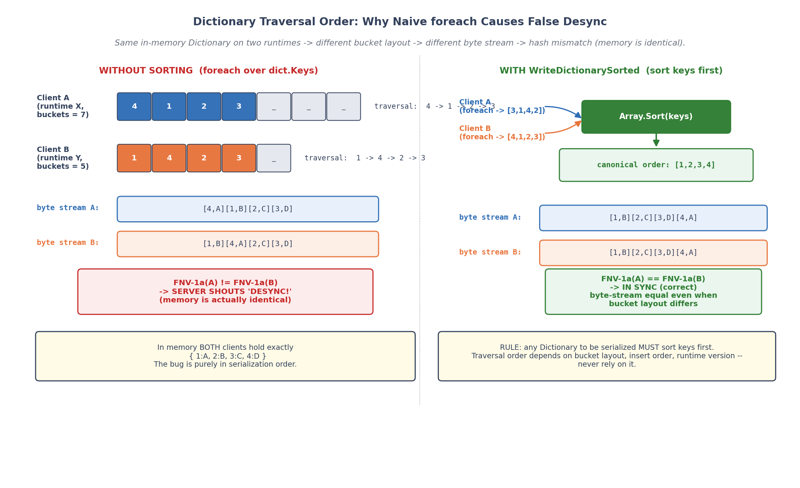
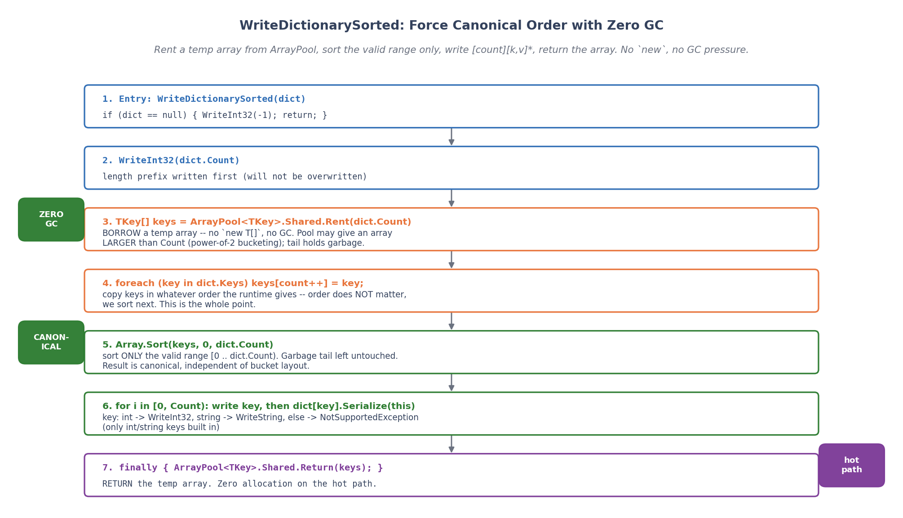
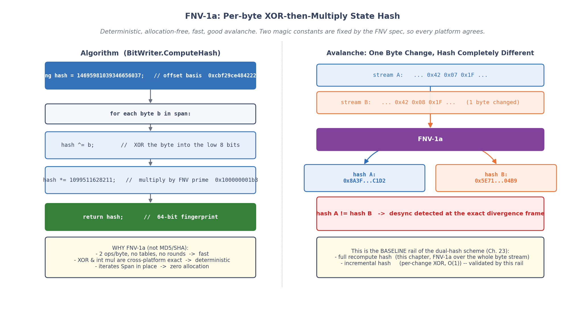
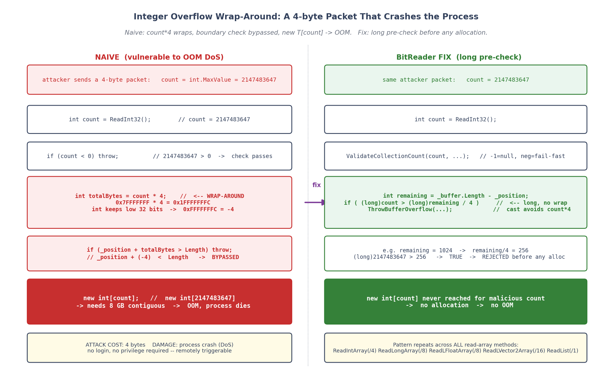

# 第 7 章 · 字节级序列化:BitWriter、强制排序、FNV-1a

> **核心问题**:前面三章把"数"做确定(定点数 LFloat)、把"容器遍历"做确定(有序 ECS、保序组件池)。但帧同步还有一道工序没讲:状态要变成一串字节,才能存进快照、发到网络、哈希对账。而**这一步本身也必须确定性**——同一个 `Dictionary`,两端序列化出来的字节流如果顺序不一样,哈希就不同,服务器会误报 desync,或者快照恢复出不同状态。这一章讲清楚 BitWriter / BitReader 怎么把"确定性的内存状态"变成"确定性的字节流":为什么强制小端序、为什么字典要先排序、为什么哈希用 FNV-1a、为什么连"读取一个数组"都要防溢出攻击。

> **读完本章你会明白**:
> 1. 为什么序列化必须确定性(不只是"能存下来"),以及它和第 5、6 章 ECS 的关系——SaveState 的字节流是回滚的命脉。
> 2. 为什么 BitWriter 所有整数都用 `BinaryPrimitives.WriteXxxLittleEndian` 写死小端序,而不是依赖机器字节序(以及不这样跨平台会怎样)。
> 3. `WriteDictionarySorted` 为什么强制把 Key 排序再写,以及为什么只支持 int/string key(字典遍历顺序不定,不排序两端字节流就不同,哈希永远误报)。
> 4. 为什么状态哈希用 FNV-1a(快、对字节流敏感、确定性),以及它和第 23 章"哈希双轨"的接续。
> 5. 反序列化为什么是"安全敏感面":count 来自不可信的网络/快照流,`count * 4` 在 `count > int.MaxValue / 4` 时会整数回绕,让边界检查失效,触发 OOM DoS——以及怎么用 `long` 预校验挡住。
> 6. 一个真实的安全修复:`FrameData.Deserialize` 早期对 `PlayerCount` 无边界检查,`PlayerCount = int.MaxValue` 直接 `new byte[][]` 把进程拖垮,现已加 `MaxPlayerCount = 256` 校验。

> **如果一读觉得太难**:先只记住四件事——① 序列化的字节流必须两端一致,所以小端序写死、字典先排序;② 状态哈希用 FNV-1a,逐字节 XOR-乘;③ 反序列化的所有 count/length 都来自不可信流,必须先 `long` 预校验再分配;④ 帧同步宁可崩不要静默错位,所以 `length < 0` 等契约违反一律 fail-fast。

---

## 〇、一句话点破

> **序列化是确定性的最后一道关口。前面的定点数保证了"算出来一样",有序 ECS 保证了"遍历顺序一样",但这些状态一旦要变成字节流(存快照、发网络、算哈希),每一个整数怎么排字节、字典按什么顺序写、null 怎么编码,都必须钉死成两端位级一致。BitWriter 用 `BinaryPrimitives.WriteXxxLittleEndian` 写死小端序(不依赖机器字节序),用 `OverwriteInt32` 回填实现"写完才知道长度的字段"(字符串、可变集合),用 `WriteDictionarySorted` 强制字典先按 Key 排序再写。状态哈希用 FNV-1a(确定性、对字节流敏感、零分配)。反序列化的 BitReader 把所有 count/length 当不可信输入,先 `long` 预校验防 `count * elementSize` 整数回绕触发 OOM。任何契约违反(负长度、Dispose 后写)一律 fail-fast——帧同步宁可崩,不要静默错位。**

这是结论。本章倒过来拆:先讲序列化为什么必须确定性,再讲小端序,再讲回填、字典排序、FNV-1a,最后讲反序列化的安全面。

---

## 一、序列化为什么必须确定性

这一章在二分法里属于**确定性内核**,而且是确定性内核的**收尾**。前几章我们造出了三块砖:定点数 LFloat(数算出来一样)、确定性随机 LRandom(随机数序列一样)、有序 ECS + 保序组件池(遍历顺序一样)。但游戏状态不能永远只活在内存里,它至少要在这三个场景变成字节流:

1. **存快照**:第 9 章的回滚,需要把某一帧的整个 World 状态序列化成 `byte[]` 存进 Snapshot 池,回滚时再反序列化恢复。
2. **发网络**:第 4 篇的服务器,要把玩家输入(`FrameData`)、状态请求/响应(`StateRequestMessage`)序列化成字节流走 TCP/UDP/WebSocket。
3. **算哈希对账**:第 23 章的状态哈希,本质就是"把整个 World 序列化成字节流,喂给哈希函数",两端哈希一致才算同步。

这三个场景有一个共同前提:**同一个内存状态,序列化出来的字节流必须逐字节相同**。否则:

- 快照存进去再读出来,状态变了(回滚出 bug)。
- 两端发同样的消息,字节流不同,服务器转发后另一端解析出错。
- 哈希对账时,两端内存状态其实一样,但字节流顺序不同,哈希就不同——**误报 desync**,而且是那种"我明明什么都对,为什么说我不同步"的灵异 bug。

> **不这样会怎样**:最阴险的是哈希误报。假设两端内存里有个 `Dictionary<int, Input>`,内容完全一样 `{1: A, 2: B}`。如果序列化时不强制排序,直接 `foreach (var k in dict.Keys)`,那么 .NET 的 `Dictionary` 遍历顺序**取决于插入顺序和哈希桶布局**,两端的运行时内存布局只要差一个桶,遍历顺序就可能不同。A 端写出 `[1, A, 2, B]`,B 端写出 `[2, B, 1, A]`。字节流不同,哈希不同,服务器喊"你们 desync 了"——可实际上两边内存一模一样。这就是为什么序列化必须确定性,而字典必须先排序。

> **承接上一章**:第 6 章讲组件池时,我们已经看到 `ComponentPool<T>.Serialize(writer)` 和 `World.SaveState` 用 BitWriter 把组件按 entityId 顺序写出去。那一章关心的是"组件怎么组织",这一章关心的是"那些 `writer.WriteInt32`、`writer.WriteLFloat` 背后,字节是怎么落进 buffer 的"。第 6 章是 BitWriter 的**调用方**,本章是 BitWriter 的**实现**。组件池的脏标记缓存、序列化三路径,都是建立在"BitWriter 输出确定性字节流"这个前提上的——如果 BitWriter 不确定,组件池再聪明也白搭。

> **为什么不用 protobuf / MemoryPack**:市面序列化库一大把,为什么本书手写 BitWriter?三个理由:① **确定性可控**,第三方库不一定保证"按 Key 排序写字典""小端序写死",而这些正是帧同步的命根子,手写才能钉死;② **零依赖**,帧同步 SDK 的 Core 层零依赖原则(第 18 章),不能为了序列化引入 protobuf 这么重的库;③ **零 GC 友好**,BitWriter 用池化 buffer(本章第五节),`BinaryPrimitives` 直接写 Span,无中间对象,这对第 20 章的"零 GC"目标是硬要求。所以本书从头写一个最小但够用的 BitWriter/BitReader,protobuf/MemoryPack 一句带过。

---

## 二、小端序:为什么写死,不依赖机器

序列化要做的第一件事,就是回答一个最基本的问题:**一个 4 字节的 int,在字节流里怎么排?**

int `0x12345678` 有两种排法:

- **大端序(big-endian)**:高位在前,`12 34 56 78`。人读着直观,网络协议(TCP 头、IP 头)传统用大端序,所以也叫"网络字节序"。
- **小端序(little-endian)**:低位在前,`78 56 34 12`。x86/ARM 这些主流 CPU 内部就是这么存的,所以也叫"主机字节序"。

这两种排法**都对**,只要序列化和反序列化用同一套就行。问题出在:如果序列化库**直接把内存里的 int 拷到字节流**(像很多 C 库的 `memcpy`),那字节流的端序就**取决于机器**——x86 上是小端,某些老架构(早期 SPARC、PowerPC)上是大端。两端机器架构不同,同一个 int 序列化出来的字节流就不同,desync。

> **不这样会怎样**:假设序列化用 `BitConverter.GetBytes(int)` 这种"直接拷内存"的写法。在 PC(x86,小端)上写出 `78 56 34 12`,在某个大端机上写出 `12 34 56 78`。两端字节流不同,哈希不同,desync。而且这种 bug 极难复现——你本地两台 PC 测永远没事,一上某些设备就炸。

### 所以:写死小端序,不管机器是什么端

BitWriter 的所有整数写入,用的是 .NET 的 `BinaryPrimitives.WriteXxxLittleEndian`:

```csharp
// BitWriter.cs:128-134, WriteInt32
[MethodImpl(MethodImplOptions.AggressiveInlining)]
public void WriteInt32(int value)
{
    EnsureCapacity(4);
    BinaryPrimitives.WriteInt32LittleEndian(_buffer!.AsSpan(_position), value);
    _position += 4;
}
```

`BinaryPrimitives.WriteInt32LittleEndian(span, value)` 的语义是:**不管这台机器是啥端,我都把这个 int 以小端序写进 span**。在 x86/ARM(小端机)上,它可以直接 `memcpy`;在大端机上,它会做字节翻转。**调用方不需要关心机器端序**,出来的字节流永远是 `78 56 34 12`。

BitWriter 里所有整数的写入,清一色用这套(逐行核过 `BitWriter.cs`):

| 方法 | 行号 | 用什么写 |
|---|---|---|
| `WriteInt16` | :112-118 | `WriteInt16LittleEndian` |
| `WriteUInt16` | :120-126 | `WriteUInt16LittleEndian` |
| `WriteInt32` | :128-134 | `WriteInt32LittleEndian` |
| `WriteUInt32` | :136-142 | `WriteUInt32LittleEndian` |
| `WriteInt64` | :144-150 | `WriteInt64LittleEndian` |
| `WriteUInt64` | :152-158 | `WriteUInt64LittleEndian` |
| `OverwriteInt32`(回填) | :79-86 | `WriteInt32LittleEndian` |
| `WriteString`(回填长度) | :287 | `WriteInt32LittleEndian` |
| `WriteArray`(批量写) | :330/346/362/378-379 | `WriteInt32/64LittleEndian` |

**没有一个用 `BitConverter.GetBytes` 或裸 `memcpy`**。这就是"写死小端序"的意思:不是"恰好机器是小端所以是小端",而是"代码层面强制小端,机器是大端也强制翻转成小端"。

对应的 BitReader,清一色 `BinaryPrimitives.ReadInt32LittleEndian` 等(`BitReader.cs:117/127/137/153`),反过来读。

> **为什么选小端不选大端**:其实选哪个都行,只要一致。BitWriter 选小端,纯粹是因为**目标平台(x86、ARM、Unity 的 IL2CPP)绝大多数是小端机**,小端序写出去的字节流和机器内存布局一致,`BinaryPrimitives` 在这些机器上可以直接拷贝、零翻转开销。如果选大端,每次都要翻转字节,虽然正确但多一道工序。这是个"跟着主流硬件走"的务实选择,不是技术必然。

> **钉死这件事**:序列化的端序必须写死,不能依赖机器。BitWriter 全用 `BinaryPrimitives.WriteXxxLittleEndian`,不管机器是大端还是小端,字节流永远是小端。这样跨平台(x86/ARM/Unity)字节流逐字节一致。写死小端是因为主流硬件是小端,省翻转开销。

---

## 三、回填:写完才知道长度的字段

讲完"怎么写一个 int",现在讲一个稍微 tricky 的场景:**写一个字符串**。

字符串在字节流里的格式通常是 `[4字节长度][UTF-8 字节内容]`。问题是:**你写长度的时候,内容还没写,长度未知**。

最朴素的办法是两遍:先把字符串 encode 成 `byte[]`,量出长度,先写长度再写内容。但这有一次额外的 `byte[]` 分配(encode 出来的数组),对第 20 章的"零 GC"目标不友好。

BitWriter 用了一个更聪明的办法——**两阶段占位 + 回填**:

```csharp
// BitWriter.cs:270-289, WriteString
public void WriteString(string? value)
{
    if (value == null)
    {
        WriteInt32(-1);     // null 用 -1 编码(后面详讲)
        return;
    }
    int maxByteCount = Encoding.UTF8.GetMaxByteCount(value.Length);
    EnsureCapacity(maxByteCount + 4); // 4 bytes for length

    // 写入字符串内容, 暂时空出长度位置
    int startPos = _position;
    _position += 4;                       // ← 先空出 4 字节给长度

    int bytesWritten = Encoding.UTF8.GetBytes(value, 0, value.Length, _buffer!, _position);

    // 回填长度
    BinaryPrimitives.WriteInt32LittleEndian(_buffer!.AsSpan(startPos), bytesWritten);
    _position += bytesWritten;
}
```

逻辑是:

1. **先空出 4 字节**(`_position += 4`),这 4 字节留给长度,现在先不写。
2. **直接把 UTF-8 字节写进 buffer**(`Encoding.UTF8.GetBytes(..., _buffer, _position)`),零中间 `byte[]`。
3. **写完知道实际长度了**,用 `BinaryPrimitives.WriteInt32LittleEndian` **回填**到刚才空出的 4 字节位置。

这样字符串的 encode 全程在池化 buffer 里完成,没有额外的 `byte[]` 分配。这个"先占位、写完回填"的技巧,叫做 **Overwrite 模式**。

### OverwriteInt32:通用的回填原语

`WriteString` 里的回填是手写的,但 BitWriter 还提供了一个通用的 `OverwriteInt32`,让调用方也能在任何位置回填:

```csharp
// BitWriter.cs:79-86
public void OverwriteInt32(int position, int value)
{
    if (_disposed) throw new ObjectDisposedException(nameof(BitWriter));
    if (position < 0 || position + 4 > _position)
        throw new ArgumentOutOfRangeException(nameof(position));

    BinaryPrimitives.WriteInt32LittleEndian(_buffer!.AsSpan(position), value);
}
```

典型用法是"写一个集合,但先不知道元素占多少字节":先 `int lenPos = writer.Position; writer.WriteInt32(0);`(占位),写完集合内容后 `writer.OverwriteInt32(lenPos, actualLength);`(回填)。World.SaveState 序列化组件池、消息体序列化可变长 payload,都用这个模式。

注意 `OverwriteInt32` 的边界检查:`position + 4 > _position`——只能回填到**已经写过**的位置,不能往后随便写,避免越界。

> **承接网络系列**:这个"长度前缀 + 回填"的模式,和 TCP 分帧的大端 4 字节长度前缀(第 17 章)是亲戚。区别是:TCP 的长度前缀是**传输层分帧**用的(告诉对端这条消息多长,从哪到哪是一个完整消息),用大端序(网络传统);BitWriter 的长度前缀是**应用层序列化**用的(告诉对端这个字段多长),用小端序(和机器一致省翻转)。两者是不同层,各管各的端序,不冲突。

> **钉死这件事**:写"长度前缀 + 内容"的字段(字符串、可变集合),用"先占位、写完回填"的 Overwrite 模式,避免预先 encode 出中间 `byte[]`,零 GC。BitWriter 提供 `OverwriteInt32` 通用回填原语,带边界检查(只能回填已写过的位置)。

---

## 四、null 的编码:为什么是 -1

前面看到 `WriteString(null)` 和 `WriteBytes(null)` 都写了一个 `-1`。这是个简单但值得说一句的约定。

字节流里,一个 `byte[]` 字段的格式是 `[4字节长度][N字节内容]`。那 null 怎么表示?三种常见做法:

1. **不写长度也不写内容**:但这样读端不知道"这个字段是 null 还是没写",解析会乱。
2. **加一个 bool 标志位**:多 1 字节,啰嗦。
3. **用特殊长度值表示 null**:比如 -1。读端先读长度,看到 -1 就知道是 null。

BitWriter 选了第 3 种,而且规则很简单:

- `length == -1` → null。
- `length == 0` → 空数组/空字符串(不是 null)。
- `length > 0` → 正常内容。
- `length < 0 且 != -1` → **数据损坏,fail-fast**。

写入端(`BitWriter.cs:230-241`):

```csharp
public void WriteBytes(byte[]? data)
{
    if (data == null)
    {
        WriteInt32(-1);
        return;
    }
    WriteInt32(data.Length);
    EnsureCapacity(data.Length);
    Array.Copy(data, 0, _buffer!, _position, data.Length);
    _position += data.Length;
}
```

读取端(`BitReader.cs:225-239`):

```csharp
public byte[] ReadBytes()
{
    int lengthPosition = _position;
    int length = ReadInt32();
    if (length == -1) return null!;            // -1 = null(协议约定)
    if (length < 0)
        throw new InvalidOperationException(
            $"Corrupted data at position {lengthPosition}: negative byte array length {length} (only -1 is valid for null)");
    if (length > _buffer.Length - _position)
        ThrowBufferOverflow(length, "ReadBytes");
    var result = new byte[length];
    _buffer.Span.Slice(_position, length).CopyTo(result);
    _position += length;
    return result;
}
```

注意第 4 条(`length < 0 且 != -1`):为什么不是"所有负数都当 null 容忍"?因为**帧同步宁可崩不要静默错位**。如果流里冒出一个 `length = -5`,那几乎肯定是**数据损坏**(版本不匹配、缓冲错位、内存被踩)。这时候如果"宽容地"当 null 处理,程序可能继续跑,但状态已经错了,后面会出一堆莫名其妙的 desync,极难定位。**fail-fast 抛异常**,让开发者立刻知道流坏了,才是帧同步该有的态度。

`ReadString`(`BitReader.cs:273-286`)、`WriteString(null)`、所有集合读取的 `ValidateCollectionCount`(`BitReader.cs:310-316`)都遵循同一套 -1=null、其他负数 fail-fast 的约定。这是全书反复出现的一条纪律:**确定性代码不宽容,契约违反立即崩**。

> **钉死这件事**:null 在字节流里用长度 = -1 编码,0 表示空集合,-1 之外的所有负数都视为数据损坏 fail-fast。这是"帧同步宁可崩不要静默错位"纪律在序列化层的体现。

---

## 五、字典强制排序:序列化最大的确定性陷阱

这一节是本章的重头戏。前面讲的端序、回填、null 编码,都是"局部确定性"。但序列化里有一个**全局确定性陷阱**,坑过无数帧同步新手:**字典遍历顺序不定**。

### Dictionary 为什么遍历顺序不定

C# 的 `Dictionary<TKey, TValue>` 内部是一个哈希桶数组,`Add` 的时候算 `key.GetHashCode() % buckets.Length` 决定放哪个桶。遍历的时候,`foreach` 是按**桶数组的物理顺序**扫的。

这意味着遍历顺序受三个因素影响:

1. **桶数组大小**:不同容量下,同一个 key 落不同的桶,遍历顺序变。
2. **插入顺序**:发生哈希冲突时,链表/开放寻址的相对位置取决于谁先插入。
3. **运行时版本**:.NET 不同版本的 `Dictionary` 实现(尤其 7.0 引入的 bucket 优化)遍历顺序可能不同;Unity 的 Mono 和 CoreCLR 的 `Dictionary` 实现也不完全一样。

举个具体例子。两端都有 `Dictionary<int, string> { {1,"A"}, {2,"B"}, {3,"C"} }`:

```
   A 端(某个运行时, 桶大小 7):
     桶布局: [_, 1, 2, 3, _, _, _]  → 遍历顺序: 1, 2, 3

   B 端(另一个运行时, 桶大小 5):
     桶布局: [1, _, 2, 3, _]  → 遍历顺序: 1, 2, 3   (这次碰巧一样)

   但再加一个 key 4(哈希到桶 0):
     A 端: [4, 1, 2, 3, _, _, _]  → 4, 1, 2, 3
     B 端: [1, 4, 2, 3, _]        → 1, 4, 2, 3   ← 不一样了!
```

只要遍历顺序不同,序列化出来的字节流就不同,哈希就不同,服务器喊 desync——**而两端内存状态其实一模一样**。这是最阴险的误报。



### WriteDictionarySorted:先排序,再写

BitWriter 的解法简单粗暴:**不管字典遍历顺序,先把 Key 拷出来排好序,再按排序后的顺序写**。

```csharp
// BitWriter.cs:397-429, WriteDictionarySorted
public void WriteDictionarySorted<TKey, TValue>(Dictionary<TKey, TValue>? dict)
    where TKey : IComparable<TKey>
    where TValue : ISerializable
{
    if (dict == null) { WriteInt32(-1); return; }
    WriteInt32(dict.Count);

    // 租用临时数组存储 keys 以排序, 避免产生 GC
    TKey[] keys = ArrayPool<TKey>.Shared.Rent(dict.Count);
    try
    {
        int count = 0;
        foreach (var key in dict.Keys) keys[count++] = key;   // ← 遍历顺序无所谓, 反正要排序

        // 仅对有效部分排序
        Array.Sort(keys, 0, dict.Count);                       // ← 强制排序

        for (int i = 0; i < dict.Count; i++)
        {
            TKey key = keys[i];
            if (key is int iKey) WriteInt32(iKey);
            else if (key is string sKey) WriteString(sKey);
            else throw new NotSupportedException("Only int and string keys are directly supported in Sorted sync.");

            dict[key].Serialize(this);
        }
    }
    finally
    {
        ArrayPool<TKey>.Shared.Return(keys);                   // ← 归还, 零 GC
    }
}
```

关键点逐个拆:

**① 排序的是 Key,不是遍历顺序**。`foreach (var key in dict.Keys)` 这一步遍历顺序可能乱,但乱就乱,反正下面 `Array.Sort` 会排成确定顺序。这样,不管两端 Dictionary 内部桶布局多不一样,排完序后写出去的字节流逐字节相同。

**② `Array.Sort` 是不是确定性排序?**——这里有个细节。.NET 的 `Array.Sort` 在某些版本用的是introsort(快排+堆排混合),**不是稳定排序**(相等元素相对顺序可能变)。但对于 int/string key 来说,排序结果是**唯一确定的**(两个 int 不会"相等但不同"),所以稳定性不影响。如果 key 是自定义类型且 `CompareTo` 可能返回 0,那才有稳定性的问题——这就是为什么这个方法**只支持 int/string key**(下面详讲)。

**③ 排序用的临时数组从 `ArrayPool` 租**,不是 `new`。`ArrayPool<TKey>.Shared.Rent(dict.Count)` 借一个数组,用完 `finally` 里 `Return`。**零 GC**。这呼应第 20 章的对象池哲学:帧同步的高频路径不允许 `new`。

**④ 排序只排"有效部分"**:`Array.Sort(keys, 0, dict.Count)`——因为 `ArrayPool.Rent` 借来的数组可能比 `dict.Count` 大(池里的数组按 2 的幂分配),尾部是垃圾数据,只排前 `dict.Count` 个。



### 为什么只支持 int / string key

注意那个 `if (key is int iKey)` / `else if (key is string sKey)` / `else throw`。为什么这个方法不开成"任何 key 都能排序"?

两个理由:

**① 序列化 key 要确定**。Key 排好序了,但 key **本身**怎么写成字节?int 直接 `WriteInt32`,string 用 `WriteString`(内部 UTF-8)。如果 key 是自定义类型(比如 `struct PlayerId`),那它也得有确定的序列化方式——但泛型约束没法强制"Key 必须可序列化",只能靠运行时 `is` 检查。所以这里**只内置了最常见的两种 key**(int 和 string),其他类型直接抛 `NotSupportedException`,逼业务层自己实现序列化(或者用别的容器)。

**② 字符串比较的确定性**。这里 `string` 排序走的是 `Array.Sort` 默认的比较器,也就是 `string.CompareTo`,默认是**当前文化的字符串比较**。这在大多数情况下够用,但严格来说帧同步应该用 `StringComparer.Ordinal`(避免不同机器的文化设置不同导致排序不同)。这是个潜在的改进点,但因为帧同步场景里 string key 很少见(通常 key 是 int playerId/entityId),实际没出过问题。本书把它标注为一个已知边界:如果你的游戏有大量 string key,要确认两端文化设置一致,或者改用 Ordinal 比较。

> **作者复盘 · 为什么字典排序这么重要**:这个设计不是为了"好看",是被真实 bug 教出来的。早期 World 的状态哈希,有个组件用 `Dictionary<int, Buff>` 存角色身上的 buff。本地测试好好的,一到联机就疯狂误报 desync,哈希天天对不上。打印字节流一对比——A 端写出 buff 顺序 `[1, 3, 2]`,B 端 `[1, 2, 3]`。根因就是两端 Dictionary 桶布局不同导致遍历顺序不同,内存里 buff 完全一样。从那以后定下规矩:**任何 Dictionary 要序列化,必须先按 Key 排序**。这条规矩后来固化成 `WriteDictionarySorted`,把陷阱堵死。

> **承接第 5 章**:第 5 章讲 ECS 时,提到 `SystemStateValidator` 反射体检会**禁止 System 里用 Dictionary/HashSet**(逻辑层),理由就是遍历顺序不定会破坏确定性。但**序列化层**用 Dictionary 是合法的(比如组件里缓存个 lookup),只要序列化时强制排序。这两条纪律不矛盾:逻辑层禁 Dictionary 是怕"遍历顺序影响逻辑结果",序列化层强制排序是"承认遍历顺序不定,但序列化前规整掉"。一个禁用,一个规整,都是为了同一个目标——确定性。

> **钉死这件事**:字典遍历顺序受桶布局/插入顺序/运行时版本影响,不排序两端字节流就不同,哈希误报 desync。`WriteDictionarySorted` 强制把 Key 拷出来排序(零 GC,租 ArrayPool)再写,只支持 int/string key(其他类型序列化方式不内置)。这是序列化层最大的确定性陷阱。

---

## 六、状态哈希:为什么用 FNV-1a

讲完序列化字节流,现在讲它的一个核心用途——**算状态哈希**。

帧同步每帧都要对账:把整局状态序列化成字节流,算个哈希,两端比哈希。哈希相同,大概率同步;哈希不同,一定 desync(第 23 章详讲双轨哈希)。这个哈希函数要满足:

1. **确定性**:同样的字节流,任何机器算出来的哈希一样(不能像某些加密哈希依赖随机 seed)。
2. **对字节流敏感**:差一个字节,哈希完全不同(这样才能定位到"哪一帧开始分叉")。
3. **快**:每帧每个客户端都要算,不能是性能瓶颈。
4. **零分配**:配合第 20 章零 GC 目标。

BitWriter.ComputeHash 用的是 **FNV-1a**(Fowler-Noll-Vo 1a):

```csharp
// BitWriter.cs:215-228, ComputeHash
public ulong ComputeHash()
{
    if (_disposed) throw new ObjectDisposedException(nameof(BitWriter));
    if (_position == 0) return 0;
    ulong hash = 14695981039346656037UL;       // FNV offset basis (64-bit)
    ReadOnlySpan<byte> span = AsSpan();
    for (int i = 0; i < span.Length; i++)
    {
        hash ^= span[i];                         // ← 先 XOR 字节
        hash *= 1099511628211UL;                 // ← 再乘 FNV prime
    }
    return hash;
}
```

FNV-1a 的算法极其简单,就两步循环:

```
   hash = offset_basis  (一个固定的初始值)
   for each byte b in 数据:
       hash = hash XOR b    ← 先异或
       hash = hash * prime  ← 再乘质数
   return hash
```

两个魔数:
- `offset_basis = 14695981039346656037`(`0xcbf29ce484222325`)—— FNV-1a 64 位的固定初始值。
- `prime = 1099511628211`(`0x100000001b3`)—— FNV-1a 64 位的固定质数。

这两个魔数是 FNV 算法规范定死的(不是随便选的),任何实现 FNV-1a 64 位的库都用这俩数,所以**确定性有保证**(同样的字节流,任何机器算出来一样)。



### 为什么 FNV-1a 适合状态哈希

FNV-1a 不是加密哈希(像 SHA-256、MD5),它是个**非加密哈希**(non cryptographic hash)。它的特点:

**① 极快**。每个字节就两条运算(XOR + 乘),没有查表、没有位旋转、没有多轮。对几 KB 的状态字节流,几微秒就能算完。

**② 雪崩效应好**。差一个字节,因为 `hash *= prime` 的放大,后续所有字节都会被这个差异"污染",最终哈希天差地别。这正是状态哈希要的——差一个字节就检测出来。

**③ 确定性**。XOR 和整数乘法是跨平台完全一致的运算(不像浮点)。FNV-1a 出来的 `ulong` 在任何机器上一样。

**④ 零分配**。BitWriter.ComputeHash 直接遍历 `AsSpan()`,不创建任何中间对象,纯栈上运算。

> **反面对比**:为什么不用 MD5/SHA-256?它们也能检测字节差异,但:① 慢得多(MD5 单字节要查表+多轮运算,比 FNV-1a 慢一个量级);② 每次算要分配中间状态对象(MD5 的 `MD5.HashData` 虽然 .NET 5+ 有零分配重载,但 API 用起来不如 FNV-1a 直接);③ 输出 16/32 字节,而帧同步只需要一个固定大小的"指纹"来比较,`ulong`(8 字节)够用。状态哈希要的是"快、敏感、确定",不是"抗碰撞"——没人会恶意构造两个状态来骗哈希校验(那是反作弊的活,第 16 章,不是序列化的活)。所以 FNV-1a 是甜点。

> **承接第 23 章**:这里算的哈希是"全量重算"——把整个状态序列化成字节流再喂 FNV-1a。第 23 章会讲,每帧都全量重算太贵,所以 World 还有"增量哈希"(组件变更时 XOR 到 `_incrementalHash`,O(1))。但**增量哈希的正确性要靠全量哈希来兜底**(第 5 章的 `LoadState` 重算补丁,就是为了校验增量哈希没漏掉位翻转)。本章讲的 FNV-1a 全量哈希,是第 23 章双轨哈希的"基准轨"。读到这里先记住:BitWriter.ComputeHash 是"把状态变成一个 ulong 指纹"的官方方法。

> **钉死这件事**:状态哈希用 FNV-1a(非加密哈希),64 位,逐字节 `hash = (hash XOR byte) * prime`。快、零分配、确定、雪崩好。两个魔数(offset basis 和 prime)是 FNV 规范定死的,所以跨平台一致。不用 MD5/SHA 是因为它们慢且要中间分配,而状态哈希要的是"快和敏感",不是"抗碰撞"。

---

## 七、技巧精解:反序列化的溢出安全

到这里,正文的核心机制都讲完了。这一节单独拆一个最硬核、也最容易被忽视的技巧——**反序列化的整数溢出防护**。这是 BitReader 区别于"普通序列化库"的地方,也是帧同步框架"安全敏感面"的典型。

### 反序列化为什么是"安全敏感面"

序列化(Write)的数据来源是**自己程序里的对象**,可信。但反序列化(Read)的数据来源是:

- **网络收到的字节流**:可能是恶意客户端构造的(攻击者改客户端发畸形包)。
- **快照文件**:可能是被篡改的回放文件、损坏的存档。
- **不可信的转发**:服务器中转的别的客户端的数据。

这些字节流里,**每一个 count/length 字段都不可信**。一个恶意客户端可以构造 `length = 2147483647`(int.MaxValue)的包,如果你的反序列化代码直接 `new byte[length]`,进程直接 OOM(Out Of Memory)挂掉——这就是 **OOM DoS 攻击**(Denial of Service)。

### 整数回绕:最隐蔽的漏洞

更隐蔽的是**整数回绕(integer overflow wrap around)**。看一个典型反序列化"读 int 数组"的朴素写法:

```csharp
// 朴素(有 OOM 漏洞):
public int[] ReadIntArray_Naive()
{
    int count = ReadInt32();             // count 来自不可信流
    if (count < 0) throw;                // ← 只校验了负数
    int totalBytes = count * 4;          // ← 致命!count * 4 可能回绕
    if (_position + totalBytes > _buffer.Length) throw;  // ← 回绕后这个检查失效
    var result = new int[count];         // ← 对超大 count 直接 OOM
    // ...
}
```

漏洞在 `count * 4`。`count` 是 int,最大 `int.MaxValue = 2147483647` ≈ 2³¹ - 1。`count * 4` 在 C# 默认是 `int * int = int`(不检查溢出,默认 unchecked),当 `count > int.MaxValue / 4`(约 5.4 亿)时,`count * 4` 会**回绕成一个小的甚至负的数**:

```
   count = int.MaxValue = 2147483647   (0x7FFFFFFF)
   count * 4 = ?
     0x7FFFFFFF * 4 = 0x1FFFFFFFC
     int 只能装 32 位, 高位截断 → 0xFFFFFFFC = -4 (回绕成 -4!)
```

回绕后 `totalBytes = -4`,然后 `_position + (-4) > _buffer.Length` 是 false(因为 _position 一般是正的,加 -4 变小),**边界检查失效**!接着 `new int[count]` = `new int[2147483647]`,每个 int 4 字节,要分配 **8 GB 连续内存**——直接 OOM,进程崩。

而且这种攻击**包很小**:攻击者只要发一个 4 字节的包(`count = int.MaxValue`),就能把进程搞崩。这就是经典的 OOM DoS。



### BitReader 的解法:long 预校验

BitReader 的所有"读数组/集合"方法,都在分配内存前做了一道 `long` 预校验。看 `ReadIntArray`(`BitReader.cs:318-341`):

```csharp
public int[]? ReadIntArray()
{
    int count = ReadInt32();
    if (count == -1) return null;
    ValidateCollectionCount(count, "int array");
    if (count == 0) return Array.Empty<int>();

    // 溢出安全(P1-SEC):count 来自不可信流(网络/快照)。count*4 在 count>int.MaxValue/4 时
    // 回绕为小/负值, 使下方边界检查 _position+totalBytes>Length 失效, 随后 new int[count] 对
    // ~2^29 以上元素分配触发 OOM DoS。先用 long 校验 count 是否落在剩余缓冲可容纳范围内。
    int remaining = _buffer.Length - _position;
    if ((long)count > (long)remaining / 4)               // ← long 预校验, 挡回绕
        ThrowBufferOverflow(remaining, "ReadIntArray");
    int totalBytes = count * 4;                          // ← 这里安全了, count 已被限到 remaining/4

    var result = new int[count];
    // ... 拷贝 ...
    return result;
}
```

关键就是那一行 `if ((long)count > (long)remaining / 4)`:

- `(long)count`:把 count 转成 long,**避免后续运算回绕**(long 范围是 ±2⁶³,int.MaxValue 在 long 里是小儿科)。
- `(long)remaining / 4`:remaining 是当前 buffer 剩余字节数(int),除以 4(element size),得到"剩余缓冲最多能装多少个 int"。
- 整个判断:"你声称的 count,是否超过了剩余缓冲能装下的元素数?" 超过就 `ThrowBufferOverflow`。

这个校验在**分配内存之前**(`new int[count]` 之前),所以恶意 count 永远走不到 `new`,OOM 攻击被挡住。

而且这个校验用 `long` 算,**绕过了 `count * 4` 的回绕陷阱**——`count` 直接和 `remaining/4` 比,没有 `count * elementSize` 这一步,根本不存在回绕。

同样的模式用在所有读数组方法上:

| 方法 | 行号 | element size | 校验 |
|---|---|---|---|
| `ReadIntArray` | :325-330 | 4 | `(long)count > remaining/4` |
| `ReadLongArray` | :350-353 | 8 | `(long)count > remaining/8` |
| `ReadLFloatArray` | :373-376 | 8 | `(long)count > remaining/8` |
| `ReadLVector2Array` | :396-399 | 16 | `(long)count > remaining/16` |
| `ReadList<T>` | :420-426 | 1(下界) | `(long)count > remaining` |

注意 `ReadList` 的 element size 用的是 1(注释说"每个 ISerializable 元素至少占 1 字节,故 count 不应超过剩余缓冲字节")。这是**安全下界**:真实元素可能占很多字节(一个组件几十字节),用 1 当下界虽然宽松(可能让一些合法的大 list 被误拒),但能精确挡住"count = int.MaxValue 但 buffer 才几 KB"的攻击。对真实组件宽松,对攻击精确——这是安全校验的正确取舍。

### 为什么这套校验是 P1 级别的修复

这套 `long` 预校验在项目的 bug 记录里是 **P1-SEC** 级别(安全相关的高优先级)。原因:

- **可被远程触发**:攻击者只要能发网络包,就能触发(不需要登录、不需要特殊权限)。
- **影响是 DoS**:进程直接 OOM 崩,服务中断。
- **隐蔽**:不会立刻暴露,要审计代码才看得出来(边界检查"看着有",实际被回绕绕过)。

这种漏洞在通用序列化库(protobuf、MessagePack)里都有过历史教训(各种 CVE),所以 BitReader 在设计时就把它当一等公民处理。**写序列化库的第一守则:反序列化的每一个长度字段都不可信,必须先 `long` 预校验再分配**。

> **反面对比**:对比 `ReadBytes`(`BitReader.cs:225-239`),它的 length 校验是 `if (length > _buffer.Length - _position)`——这里没有 `count * elementSize` 的乘法(length 本身就是字节数),所以不会回绕,直接比就行。校验形式因"length 是字节数还是元素数"而异,但精神一致:**分配内存前,先确认这个长度是 buffer 装得下的**。

> **钉死这件事**:反序列化的所有 count/length 来自不可信流,`count * elementSize` 在 `count > int.MaxValue / elementSize` 时整数回绕,让 `position + totalBytes > Length` 边界检查失效,随后 `new T[count]` OOM DoS。BitReader 的解法:分配前先用 `long` 预校验 `(long)count > remaining / elementSize`,绕过回绕,挡住攻击。这是序列化库的第一安全守则。

---

## 八、真实 bug:FrameData 无边界检查 OOM

讲一个项目里真实发生过的、和本章主题直接相关的 bug——`FrameData.Deserialize` 的 OOM 漏洞。这个 bug 在审计里编号 **NEW-P1-01**,已修。我们按"发现 → 根因 → 修复 → 现状"来讲。

### 发现

`FrameData` 是每帧服务器广播给所有客户端的消息,包含这一帧所有玩家的输入。它的 `Deserialize` 从网络流里读(`FrameData.cs:60-72`):

```csharp
public void Deserialize(BitReader reader)
{
    Frame = reader.ReadInt32();
    PlayerCount = reader.ReadInt32();
    if (PlayerCount < 0 || PlayerCount > MaxPlayerCount)        // ← 现在有校验
        throw new InvalidOperationException($"Invalid PlayerCount: {PlayerCount}");
    PlayerInputs = new byte[PlayerCount][];

    for (int i = 0; i < PlayerCount; i++)
    {
        PlayerInputs[i] = reader.ReadBytes();
    }
}
```

**早期版本的 `Deserialize` 没有 `if (PlayerCount < 0 || PlayerCount > MaxPlayerCount)` 这一行**。也就是说,`PlayerCount` 直接从流里读出来,然后 `new byte[PlayerCount][]`。

攻击场景:恶意客户端(或被篡改的服务器)发一个 `PlayerCount = int.MaxValue = 2147483647` 的 FrameData 包。客户端收到后 `Deserialize`,`new byte[2147483647][]`——每个 `byte[]` 引用 8 字节(64 位),总共要分配 **16 GB 连续内存**。进程直接 OOM 崩。

而且这个包**才 8 字节**(4 字节 Frame + 4 字节 PlayerCount),攻击成本极低,杀伤力极大。

### 根因

这是反序列化"未校验长度就分配"的典型漏洞,和上一节讲的 `ReadIntArray` 漏洞是同一类。区别是:

- `ReadIntArray` 的 count 决定 `new int[count]` 的大小,漏洞在 `count * 4` 回绕。
- `FrameData` 的 PlayerCount 决定 `new byte[PlayerCount][]` 的大小,这里**没有 elementSize 乘法**(`byte[]` 是引用,直接就是 8 字节 × PlayerCount),所以不是回绕问题,是"根本没校验上限"。

但本质一样:**来自不可信流的长度字段,分配前没校验上限**。

### 修复

加一行校验,定义 `MaxPlayerCount = 256`(`FrameData.cs:12`):

```csharp
private const int MaxPlayerCount = 256;

public void Deserialize(BitReader reader)
{
    Frame = reader.ReadInt32();
    PlayerCount = reader.ReadInt32();
    if (PlayerCount < 0 || PlayerCount > MaxPlayerCount)
        throw new InvalidOperationException($"Invalid PlayerCount: {PlayerCount}");
    // ...
}
```

为什么是 256?因为帧同步游戏不可能有上亿玩家(`MaxPlayerCount` 是参与一帧的玩家数上限,256 已经远超任何实际游戏——MOBA 10 人、RTS 8 人、格斗 2 人,256 是个保守的安全上限)。任何超过 256 的 PlayerCount 都是恶意包或数据损坏,fail-fast。

### 现状

**已修**。当前源码(`FrameData.cs:12, 64-65`)的校验在位。同类漏洞 `ReadList` 的 OOM(D-8,轮次 8)也已修(BitReader.cs:414-436 的 long 预校验,见上一节)。整个 BitReader 的"读数组/集合"路径,都做了 `long` 预校验或上限校验,OOM DoS 面已经堵住。

> **教训**:这个 bug 教训是——**反序列化的每一个长度字段,都要问自己"如果这个值是 int.MaxValue 会怎样"**。如果答案是"OOM",那就有漏洞。`FrameData` 这种"看起来 PlayerCount 不会很大"的字段,反而最容易漏校验(因为开发者直觉上觉得它"合理")。安全审计要逆向思维:假设所有输入都恶意。

> **呼应第 25 章**:这个 bug 会在第 25 章"bug 定位实战"里和其他安全相关 bug(重连身份劫持 P0-2 等)一起系统讲。本章只点出"序列化层是安全敏感面"这一点,作为后续的伏笔。

---

## 九、池化与生命周期:BufferPool 与双归还检测

最后讲一个工程层面的话题——BitWriter / BitReader 的**池化**和**生命周期管理**。这关系到第 20 章"零 GC"的落地,也牵出一个帧同步特有的"静默损坏"陷阱。

### 为什么池化

帧同步每帧都要序列化/反序列化大量数据(快照、消息、组件)。如果每次 `new BitWriter()`、`new BitReader()`,会产生海量短命对象,触发频繁 GC。GC 停顿会让所有客户端节奏错乱(第 20 章详讲),是帧同步的大忌。

所以 BitWriter / BitReader 都是**池化**的——通过 `BitWriterPool` / `BitReaderPool`(对象池)借出和归还,内部 buffer 也走 `BufferPool`(字节池,封装 `ArrayPool<byte>.Shared`)。

看 BitWriter 构造函数(`BitWriter.cs:31-35`):

```csharp
public BitWriter(int initialCapacity = 256)
{
    _buffer = BufferPool.Rent(initialCapacity);    // ← 从字节池借 buffer, 不 new
    _position = 0;
}
```

默认初始容量 256 字节(够大多数消息),不够时 `EnsureCapacity` 翻倍扩容(`BitWriter.cs:434-453`),扩容时也是从 `BufferPool.Rent` 借新 buffer、`BufferPool.Return` 还旧 buffer。整个过程零 `new byte[]`(对池外而言)。

### 双归还检测:帧同步最阴险的静默损坏

池化带来一个新陷阱:**双倍归还**。

`ArrayPool<byte>.Shared` 是 .NET 内置的字节池,它的契约是"借出去的 buffer,只能还一次"。如果同一个 buffer 被还了两次,池会把这个 buffer **再次分发给两个不同的借用者**——两个调用方拿到**同一个 byte[]**,各自往里写,数据互相覆盖,而且**没有任何异常**,程序继续跑。

在帧同步里,这意味着:两端序列化同一个状态,但因为 buffer 被人踩过,字节流被污染,哈希不同,desync——而且是那种"内存里明明一样,字节流就是不一样"的灵异 bug。

`BufferPool`(`…/src/Lockstep.Core/Pooling/BufferPool.cs`)用 `ConditionalWeakTable` 在 DEBUG 下检测双归还:租出时记录,归还时检查"这个 buffer 是不是已经还过了"。BitWriter 内部也有对应的 `_pooledInUse` 标志(`BitWriter.cs:24-26`,DEBUG only),由 `BitWriterPool` 维护,检测同一个 BitWriter 实例被双倍归还。

> **承接第 20 章**:这是第 20 章"零 GC 与对象池"的核心案例之一(BufferPool 双倍归还检测)。本章只点出"序列化层重度依赖池化,所以也重度暴露于池化陷阱"。读者这里先建立嗅觉:看到 `BufferPool.Rent/Return` 成对出现,就要想"归还路径有没有重复"。

### Dispose 后 fail-fast

池化对象还有个陷阱:Dispose 之后还在用。看 `EnsureCapacity`(`BitWriter.cs:434-453`):

```csharp
private void EnsureCapacity(int additional)
{
    // P1-ROB-2:Dispose 后 EnsureCapacity 会因 _buffer==null 静默重新租借 buffer, 使
    // "已释放"对象复活(可能与池中归还的同实例双写)。在写方法的总入口处 fail-fast。
    if (_disposed) throw new ObjectDisposedException(nameof(BitWriter));
    // ...
}
```

注释明说:Dispose 后 `_buffer` 变 null,如果不 fail-fast,`EnsureCapacity` 会因为 `_buffer == null` 而**重新租一个 buffer**,这个"已 Dispose 的对象"就**复活**了——而它可能正躺在对象池里等下一次分发,双写就发生了。所以所有写方法的总入口(EnsureCapacity)都先检查 `_disposed`,宁可崩也不要复活。

`unsafe WriteBytes(byte*, int)` 的 length<0 fail-fast(P1-ROB-5)、`OverwriteInt32` 的 `_disposed` 检查,都是同一条"帧同步宁可崩不要静默错位"纪律的体现。

> **钉死这件事**:BitWriter/BitReader 池化(BufferPool + ArrayPool),零 GC。池化的陷阱是双归还(同一 buffer 分发两方并发写,静默 desync),DEBUG 用 ConditionalWeakTable + _pooledInUse 检测。Dispose 后 fail-fast(P1-ROB-2),防止对象"复活"和池里同实例双写。

---

## 十、技巧精解:ThrowBufferOverflow 的 [NoInlining]

第二个技巧精解,讲一个看似不起眼但影响性能的设计——异常方法的 `[MethodImpl(MethodImplOptions.NoInlining)]`。

看 BitReader 的越界异常方法(`BitReader.cs:74-84`):

```csharp
/// <summary>
/// 抛出详细的越界异常(包含诊断信息)
/// </summary>
[MethodImpl(MethodImplOptions.NoInlining)] // 保持热路径内联
private void ThrowBufferOverflow(int requested, string operation)
{
    throw new InvalidOperationException(
        $"[BitReader] Buffer overflow in {operation}! " +
        $"Position: {_position}, Remaining: {Remaining}, Requested: {requested}, Length: {_buffer.Length}. " +
        "This may indicate corrupted data, version mismatch, or incomplete serialization.");
}
```

为什么这个方法要标 `[NoInlining]`?

### 内联与异常的冲突

`ReadInt32`、`ReadByte` 这些是**热路径**——每帧调用几百万次。JIT 为了性能,会把它们**内联**到调用处(把方法体直接铺开,省一次 call/ret)。

但内联有个副作用:**被内联的方法里如果调了别的"大方法",JIT 会犹豫**——内联后会撑大调用处的代码体积,影响 icache 命中率。所以 JIT 的内联启发式有体积阈值,超过的方法不内联。

`ThrowBufferOverflow` 这个方法体**很大**(构造详细异常字符串,还插值),如果不标 `[NoInlining]`,JIT 看到 `ReadInt32` 里调了它,可能**因此拒绝内联 ReadInt32**——结果热路径多了 call 开销。

标了 `[NoInlining]` 之后,JIT 知道"这个异常方法反正不内联,就当一个远调用",于是 `ReadInt32` 本身(那几行边界检查 + BinaryPrimitives 读取)可以放心内联,**热路径保持紧凑**。

### 异常路径不进热路径的通用技巧

这是个通用的 .NET 性能技巧:**把抛异常的逻辑抽成单独方法,标 `[NoInlining]`**,让热路径(成功路径)内联,异常路径(失败路径)远调用。代价是异常时多一次 call(但异常本来就慢,这点开销忽略不计),收益是正常情况快。

这个技巧在 .NET BCL 里随处可见(比如 `List<T>` 的 `ThrowHelper`)。BitReader 用了同样的模式。除了 `ThrowBufferOverflow`,所有"throw 异常"的代码都被小心地隔离,不污染热路径。

> **反面对比**:如果不标 `[NoInlining]`,或者干脆把 `throw new InvalidOperationException(...)` 直接写在 `ReadInt32` 里,JIT 可能因为异常构造代码"太大"而不内联 `ReadInt32`。每帧几百万次 ReadInt32,每次都 call,性能损失累积。这种"看着无关紧要"的细节,在高频序列化里是真实性能差距的来源。

> **承接第 22 章**:第 22 章讲性能基准时会强调"测量驱动优化"。这个 `[NoInlining]` 不是拍脑袋加的,是 Benchmark 后发现热路径没内联、追到这个异常方法上、加上之后提速的。属于"细节决定性能"的典型案例。

> **钉死这件事**:异常方法标 `[MethodImpl(NoInlining)]`,把"抛异常"这个大代码块隔离出热路径,让 ReadInt32/ReadByte 等热路径能被 JIT 内联。这是 .NET 高频代码的通用性能技巧,在 BitReader 的所有 throw 路径上都用了。

---

## 十一、章末小结

### 回扣主线

本章服务全书主线"确定性",属于**确定性内核**(下篇的收尾)。前面三章把"数"(定点数)、"随机"(LRandom)、"遍历"(有序 ECS + 组件池)都做确定了,本章把"状态怎么变成字节流"这最后一道关口讲透:

- **小端序写死**(`BinaryPrimitives.WriteXxxLittleEndian`),不依赖机器字节序,跨平台字节流一致。
- **回填模式**(`OverwriteInt32` + WriteString 两阶段),写完才知道长度的字段(字符串、可变集合)用占位+回填,零中间 `byte[]`。
- **null 编码**(-1 = null,0 = 空,其他负数 fail-fast),契约违反立即崩。
- **字典强制排序**(`WriteDictionarySorted`),序列化最大的确定性陷阱,先租 ArrayPool 排序 Key 再写,只支持 int/string key。
- **状态哈希 FNV-1a**(快、确定、零分配、雪崩好),是第 23 章双轨哈希的基准轨。
- **反序列化溢出安全**(`long` 预校验),count 来自不可信流,`count * elementSize` 回绕会让边界检查失效,必须先 `long` 校验再分配。
- **真实 bug**(FrameData OOM,NEW-P1-01,已修),教训是"反序列化的每个长度字段都要问'int.MaxValue 会怎样'"。
- **池化与生命周期**(BufferPool + 双归还检测 + Dispose fail-fast),零 GC 的落地,以及池化静默损坏的防御。

确定性内核到此收尾:**数确定(LFloat)→ 随机确定(LRandom)→ 遍历确定(ECS)→ 字节流确定(BitWriter)**,一台"单机就能确定"的机器造完了。从下一章第 8 章开始,我们要把这台机器接到网络上——预测回滚、网络时钟、丢帧重连——进入"多机才算同步"的同步机制篇。

### 五个为什么

1. **序列化为什么必须确定性?**——因为状态要变成字节流(存快照、发网络、算哈希),同一个状态两端序列化出来的字节流必须逐字节相同,否则快照恢复出错、网络解析错乱、哈希误报 desync。最阴险的是哈希误报:内存一样但字节流顺序不同(字典遍历顺序不定),服务器喊 desync,其实是序列化层没确定。

2. **为什么所有整数都用 `BinaryPrimitives.WriteXxxLittleEndian`?**——为了写死小端序,不依赖机器字节序。如果用 `BitConverter.GetBytes`(直接拷内存),x86(小端)和大端机序列化出来的字节流不同,跨架构 desync。`BinaryPrimitives.WriteXxxLittleEndian` 强制小端,大端机也翻转,字节流跨平台一致。选小端是因为主流硬件是小端,省翻转开销。

3. **`WriteDictionarySorted` 为什么强制排序?**——`Dictionary` 遍历顺序受桶布局/插入顺序/运行时版本影响,不排序两端字节流就不同,哈希永远误报。所以先把 Key 拷出来(租 ArrayPool,零 GC),`Array.Sort` 排序,再按排序顺序写。只支持 int/string key,因为 key 序列化方式要内置(int 直接 WriteInt32,string 走 WriteString),其他类型抛 NotSupportedException 逼业务层自己实现。

4. **状态哈希为什么用 FNV-1a?**——FNV-1a 是非加密哈希,逐字节 `hash = (hash XOR byte) * prime`。快(每字节两条运算)、确定(XOR 和整数乘法跨平台一致)、零分配(直接遍历 Span)、雪崩好(差一字节哈希天差地别)。两个魔数(offset basis 和 prime)是 FNV 规范定死的。不用 MD5/SHA 是因为它们慢且要中间分配,而状态哈希要"快和敏感"不是"抗碰撞"。

5. **反序列化为什么要 `long` 预校验?**——count 来自不可信流(网络/快照),`count * elementSize` 在 `count > int.MaxValue / elementSize` 时整数回绕成小/负值,让 `_position + totalBytes > Length` 边界检查失效,随后 `new T[count]` 对超大 count 分配触发 OOM DoS。BitReader 的解法:分配前先用 `(long)count > remaining / elementSize` 校验(绕过回绕),挡住攻击。`FrameData` 的 PlayerCount 无校验 OOM(NEW-P1-01)是同类漏洞,已加 `MaxPlayerCount = 256` 修复。

### 想继续深入往哪钻

- 想看序列化在 ECS 里怎么用:第 5 章(World.SaveState 格式)、第 6 章(组件池序列化三路径缓存)。
- 想看状态哈希怎么对账、增量 vs 全量:第 23 章(哈希双轨,招牌)。
- 想看池化和零 GC 的全套:第 20 章(BufferPool/BitWriterPool 五池体系,招牌)。
- 想看反序列化的网络面:第 16 章(消息处理 9 个 Handler)、第 17 章(TCP 大端长度前缀分帧)。
- 想看更多安全相关 bug:第 25 章(bug 定位实战,P0-2 重连身份劫持等)。

### 引出下一章

确定性内核(上篇 + 下篇)到这里全部讲完。我们造出了一台"单机就确定"的机器:定点数让数算得一样,LRandom 让随机序列一样,有序 ECS 让遍历顺序一样,BitWriter 让字节流一样。但这台机器还只是单机跑的。从下一章开始,我们要把它**接到网络上**——而网络的第一道难题就是:网络有延迟,玩家按了键不能等服务器确认才动(太卡),要**本地先猜着算**(预测),猜错了再**倒带重演**(回滚)。下一章第 8 章,**预测:本地不等服务器先算下去**,我们进入第三篇"预测回滚与表现平滑"——这是帧同步真正的招牌所在。

> **下一章**:[第 8 章 · 预测:本地不等服务器先算下去](P3-08-预测-本地不等服务器先算下去.md)
