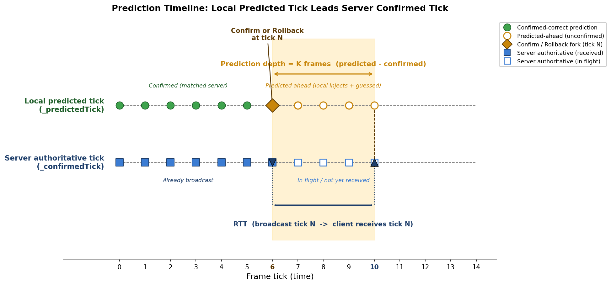

# 第 8 章 · 预测:本地不等服务器先算下去

> **核心问题**:前面两篇我们造好了一台"单机就确定"的机器——给它相同输入,它必然算出相同结果。但联机时,这台机器要等服务器把"权威输入"广播下来才能推进。网络一来回几十毫秒,如果老老实实等,玩家按一下方向键,要过几十毫秒坦克才动——这叫"操作粘手",是联机游戏最致命的体验杀手。这一章讲怎么用**预测**掩盖这段延迟:不等服务器,本地先按猜的输入算下去,让操作即时生效。预测是帧同步"时间机器"两个动作里的第一个(另一个是回滚),也是第 3 篇的开篇。

> **读完本章你会明白**:
> 1. 为什么"等服务器确认再算"在网络上根本不能用——网络延迟会让操作"粘手",而粘手是比卡顿更恶心的体验,帧同步必须用预测来掩盖这段延迟。
> 2. 预测的**前提**是确定性内核(没有确定性,预测出来的结果和服务器对不上,等于没预测),以及预测的**代价**(猜错了要倒带重演,这是下一章的事)。
> 3. 预测为什么**绝对不限速**——本地操作即时响应是手感的命门,一旦限速就退回到"等服务器"的卡顿;追帧(确认服务器帧)才需要限速防倍速,两者是两套节奏。
> 4. **输入掩码隔离**:本地玩家用实时采集的输入,非本地玩家用预测器猜——两个来源严格隔离,防止本地输入混入非本地预测、污染历史帧。
> 5. 三种可插拔预测策略(LastInput 惯性 / Neutral 空输入 / Trend 趋势外推)各自适合什么游戏,以及为什么做成接口让业务层选。

> **如果一读觉得太难**:先只记住三件事——① 预测就是"不等服务器,本地先猜着算",目的是掩盖网络延迟让操作即时生效;② 本地玩家的输入不靠猜(实时采集注入),只有非本地玩家才靠预测器猜;③ 猜错了会留下"脏"的预测帧,下一章讲怎么回滚掉。细节需要时再回来看。

---

## 〇、一句话点破

> **预测的本质是"用确定性换即时性":既然确定性内核保证了"相同输入必然算出相同结果",那本地玩家按了方向键,我完全可以不等服务器,直接拿这个输入喂给内核先算下去——只要我猜的输入和服务器稍后广播的权威输入一致,这段提前算的结果就免费可用,玩家感受不到任何延迟。代价是猜错时要倒带重演(下一章)。预测分两个来源:本地玩家用实时采集的输入(不猜,直接注入),非本地玩家才真正"猜"(用 LastInput/Neutral/Trend 预测器),两者用输入掩码严格隔离。预测必须绝对不限速——这是手感的命门。**

这是结论。本章倒过来拆:先讲清"等服务器"到底有多糟,再讲预测怎么把这段延迟盖掉,然后逐一拆开"本地注入 / 非本地猜测 / 掩码隔离 / 三种策略 / 为什么不限速"这五个部件。

---

## 一、"等服务器确认再算"为什么根本不能用

这是理解预测存在的唯一动机,必须先撞这堵墙。

### 1.1 朴素做法:服务器权威,客户端只确认

最朴素、最"严谨"的帧同步是这样工作的:客户端把本地玩家的输入发给服务器,服务器聚齐所有玩家的输入后,按固定节拍(比如 20Hz,每 50ms 一帧)广播"权威帧"(Frame N 上每个玩家的输入),客户端收到权威帧才推进逻辑。

```
   时刻0ms     50ms     100ms    150ms
客户端A 按键 ──发输入──>服务器聚齐──广播权威帧──>A收到,坦克才动
                                       ↑
                              玩家A从按键到看到反馈, 间隔 = 一次往返(RTT)
```

听起来天经地义——服务器是权威嘛,听服务器的。但只要网络一来回有延迟,这套就崩了。

> **承接书讲过**:网络一来回的时间叫 **RTT(Round-Trip Time)**,从几十毫秒(同城好网络)到一两百毫秒(跨洲、移动网络)不等。RTT 是网络系列的核心概念,这里不展开,只把它当成一个"按下到反馈之间的固定延迟"。

### 1.2 这个延迟为什么是致命的:粘手

现在换到玩家的视角。玩家按住方向键,想让坦克向右走。在"等服务器"模式下:

- 时刻 0ms:玩家按下方向键。
- 时刻 0ms:客户端把"我要向右"这个输入发给服务器。
- 时刻 RTT/2:服务器收到(假设链路对称,单程 RTT/2)。
- 时刻 RTT/2 + 50ms:服务器下一个 20Hz 节拍到了,聚齐输入,广播权威帧。
- 时刻 RTT + 50ms:客户端收到权威帧,坦克终于动了。

从按下到坦克动,玩家等了 **RTT + 50ms**。RTT 50ms 的话,总延迟约 100ms;RTT 100ms 的话,总延迟约 150ms。

100ms 的输入延迟是什么体感?玩过联机游戏的都知道——这叫**粘手**。你按了,屏幕没反应;你松手了,坦克还在动;你想精确走位,坦克永远比你意图慢半拍。格斗、射击、动作游戏里,100ms 输入延迟基本不可玩;即时战略里也是明显的"拖泥带水"。

> **不这样会怎样**:任何"等服务器权威才推进"的联机游戏,输入延迟 = RTT + 一个节拍。在 50ms RTT 下都有 100ms 延迟,在 100ms RTT 下有 150ms 延迟。这个延迟是**结构性的**(由网络物理决定,优化不掉),不是偶发卡顿。粘手比卡顿更恶心——卡顿是"画面卡一下",粘手是"操作永远慢半拍",玩家根本无法精确操作。

### 1.3 单机游戏为什么没这问题

对比一下单机游戏:玩家按键,客户端**立刻**把输入喂给逻辑,下一帧(16ms 内)坦克就动了。延迟 = 一帧渲染时间,基本无感。

联机游戏多出来的这 100ms,纯粹是"等远端的输入"等出来的。那问题就变成:**能不能让本地玩家享受单机般的零延迟,同时最终又和所有客户端保持一致?**

答案是预测。这也是为什么帧同步(以及状态同步)都把预测当成核心机制——没有预测,联机游戏根本没法玩。

---

## 二、预测的核心思路:本地先算,服务器来了再核对

### 2.1 关键洞察:确定性内核让"提前算"成为合法操作

回忆第一性原理:

> **相同初始状态 + 相同输入序列 + 确定性运算 = 相同结果。**

这句话有一个极其重要的推论,是预测的全部合法性来源:

> **如果我能猜对服务器的权威输入,那我现在就拿这个猜的输入喂给确定性内核先算,算出来的结果,和将来服务器广播权威输入后我重算一遍的结果,必然逐位相同。**

因为内核是确定的——相同输入必然相同输出。所以"提前算"不是"作弊"或"近似",它在数学上是**完全合法**的,前提只有一个:**我猜的输入等于服务器将广播的输入。**

这就是预测:不等服务器,本地先按猜的输入算下去,让玩家看到即时反馈。等服务器权威帧到了,核对一下:猜对了,这段提前算的结果直接确认可用;猜错了,倒带重演(下一章)。

### 2.2 谁的输入要猜,谁的输入不用猜

这里必须把"输入"分成两类,这是预测机制的第一个关键区分:

- **本地玩家的输入**:不用猜。玩家按了什么键,本地客户端**立刻就知道**(操作系统直接给你键盘事件)。这是预测能"零延迟"的根本——本地玩家的操作,客户端第一时间掌握,根本不需要等网络。
- **非本地玩家(对手)的输入**:必须猜。对手在另一台机器上按键,他按了什么,你要等服务器广播才知道——这中间隔着一个 RTT。在这段时间里,你要不要让对手动?如果不动,对手就会"卡住"(因为你在猜,而猜不出来就不推进);如果动,就只能猜。

于是预测的真正工作分两半:

1. **本地玩家**:实时采集输入,直接注入,提前算。(不猜,但要"提前")
2. **非本地玩家**:用预测器猜他大概率会按什么,提前算。(真猜)

LockstepController 的 `CreatePredictedFrame` 方法把这"两半"写成了严格的**输入掩码隔离**,我们稍后逐行看。先建立时间直觉。

### 2.3 预测时间线:预测帧领先确认帧

预测让本地的"逻辑当前帧"(`_predictedTick`)始终领先服务器的"已确认帧"(`_confirmedTick`)。这段领先量叫**预测深度**(PredictionCount = `_predictedTick - _confirmedTick`),它正是用来吸收 RTT 的。



> **图说(fig-08-01)**:横轴是帧号(time tick),上方是服务器侧,下方是本地客户端侧。服务器在 tick N 广播权威帧;由于 RTT,客户端在 tick N+K 才收到(K = RTT 折算的帧数)。为了不卡,客户端在收到 tick N 之前,已经靠预测把逻辑推进到了 tick N+K(本地玩家实时注入 + 非本地玩家猜测)。阴影区就是"预测深度" = K 帧。当 tick N 的权威帧到达,客户端比对:预测的 tick N 和权威的 tick N 输入是否一致——一致则确认(阴影区这段算白赚),不一致则回滚(下一章)。图内英文标注:`Server authoritative tick` / `Local predicted tick` / `Prediction depth (K frames)` / `RTT` / `Confirm or Rollback at tick N`。

这张图是本章的核心心智模型。记住一句话:**预测深度 ≈ 用帧数衡量的 RTT**,它就是预测用来"垫"在延迟下面的缓冲。

### 2.4 预测深度的上限:不能无限猜下去

预测深度不能无限大——猜得越远,猜错的概率越高,回滚的代价越大(回滚要把从出错点到当前的所有帧重演)。所以有一个硬上限 `_maxPredictionFrames`,默认 30 帧(LockstepController.cs:97)。

```csharp
// LockstepController.cs:97 (构造器默认值)
int maxPredictionFrames = 30,
```

30 帧 @ 20fps = 1.5 秒。也就是说,即使网络抖动到 1.5 秒延迟,客户端也会顶住继续预测,不至于卡死;但超过 1.5 秒就不再往前猜了(再猜也是错,不如停下来等)。这个上限和 `NetworkClock` 的硬边界(hardMax = serverConfirmedTick + maxPredictionFrames)是配套的——时钟不会让 targetTick 超过这个上界,预测循环也单独再判一次。

```csharp
// LockstepController.cs:498-525, PredictAhead(简化示意)
private void PredictAhead(int targetTick, long deadline)
{
    while (_predictedTick < targetTick)
    {
        if (_predictedTick - _confirmedTick >= _maxPredictionFrames) break;  // 硬上限
        // ... 构造预测帧, 模拟 ...
    }
}
```

> **钉死这件事**:预测深度有硬上限(默认 30 帧),既给网络抖动留足缓冲,又防止"猜到天涯海角全是错"。预测不是无限的,它是一个**有限、可控的提前量**。

---

## 三、预测的两个来源:输入掩码隔离

现在拆 `CreatePredictedFrame`——预测机制最核心的一段代码。它在每个预测帧里,为每个玩家槽位填入输入。关键在于:**本地玩家和非本地玩家,走两条完全不同的路径,绝不混用。**

### 3.1 为什么必须隔离

设想一个反面:如果不隔离,统一用预测器(比如 LastInput)来猜所有玩家的输入,包括本地玩家。会发生什么?

本地玩家明明按了"向右",但预测器看上一帧本地玩家也是"向右",猜"向右",碰巧猜对了——看起来没事。但下一秒本地玩家松手了(输入变空),预测器还看着历史帧里"向右",继续猜"向右"——**本地玩家的实时操作被预测器覆盖了**。客户端永远看不到"松手"的即时反馈,粘手照旧。

更糟的是:本地玩家的实时输入会被写进预测帧,而预测帧稍后可能被当成"历史帧"喂回预测器(预测非本地玩家时要查历史),于是本地输入混进了非本地玩家的预测依据,污染一片。

所以隔离是必须的:

- **本地玩家槽位**:走 `_localInputProvider.GetInput()`,实时采集,不走预测器。
- **非本地玩家槽位**:走 `_inputPredictor.PredictInput(...)`,严格用预测算法。

这两条路径在 `CreatePredictedFrame` 里用一个 `if (i == _localPlayerId)` 一刀切开。

### 3.2 逐行看 CreatePredictedFrame

```csharp
// LockstepController.cs:567-613, CreatePredictedFrame(简化示意, 非源码原文)
private FrameData CreatePredictedFrame(int tick)
{
    var frame = new FrameData(tick, _simulation.PlayerCount);
    
    for (int i = 0; i < _simulation.PlayerCount; i++)
    {
        // --- 输入掩码隔离逻辑 ---
        if (i == _localPlayerId && _localInputProvider != null)
        {
            // 本地玩家: 实时采集注入, 来源受限(只信本地输入提供者)
            var input = _localInputProvider.GetInput();
            if (input != null)
            {
                var writer = BitWriterPool.Get();
                try { input.Serialize(writer); frame.PlayerInputs[i] = writer.ToArray(); }
                finally { BitWriterPool.Return(writer); }
            }
            else
            {
                // 防御性复制: GetNullInput() 可能返回共享数组
                var nullInput = _simulation.GetNullInput();
                var copy = new byte[nullInput.Length];
                Array.Copy(nullInput, copy, nullInput.Length);
                frame.PlayerInputs[i] = copy;
            }
        }
        else
        {
            // 非本地玩家: 严格遵循预测算法(防止混入外部状态导致不一致)
            frame.PlayerInputs[i] = _inputPredictor.PredictInput(i, tick, t =>
            {
                var f = _localFrames.Get(t);
                return (f != null && f.Frame == t) ? f : null;
            }, _simulation);
        }
    }
    return frame;
}
```

逐点拆:

**① 本地玩家分支(:575-600)**:`i == _localPlayerId && _localInputProvider != null`。注意 `_localPlayerId` 默认是 -1(:32),意思是没有本地玩家——这种情况下所有槽位都走预测器(纯观战模式,后面讲)。只有显式 `SetLocalPlayer(playerId, provider)` 设置后,本地玩家槽位才走实时注入。`_localInputProvider.GetInput()` 由业务层实现(读键盘手柄),返回当前帧的真实输入,序列化进预测帧。

**② 防御性复制(:594-598)**:当本地输入提供者返回 null(玩家没接入设备),用 `GetNullInput()` 填空。但 `GetNullInput()` 可能返回一个**共享的静态数组**(避免每次 new),如果直接把这个数组塞进 frame,后续任何一处修改都会污染那个共享数组。所以这里强制 `Array.Copy` 出独立副本。这是一个典型的"共享数组别名陷阱",在第 20 章(BufferPool 双倍归还)会系统讲。

**③ 非本地玩家分支(:601-609)**:走 `_inputPredictor.PredictInput(i, tick, getFrame, _simulation)`。注意第三个参数 `getFrame` 是一个委托,它从 `_localFrames`(本地帧历史缓冲)里取历史帧。为什么从 `_localFrames` 取而不是 `_serverFrames`?因为预测发生在"服务器帧还没到"的时候,这时手上最全的历史就是本地预测过的帧——本地预测帧里,本地玩家是实时输入,非本地玩家是之前预测的输入。预测器用这些历史来推下一帧。这正是为什么本地输入不能混入非本地槽位:一旦混入,这些"脏"的本地输入会随着历史帧喂给预测器,污染所有后续预测。

> **钉死这件事(输入掩码隔离)**:本地玩家和非本地玩家用两套完全独立的输入来源——本地走 `_localInputProvider.GetInput()`(实时),非本地走 `_inputPredictor.PredictInput()`(猜测)。混用的后果是:本地实时操作被历史帧覆盖(粘手依旧),且本地输入污染非本地预测依据(连锁错误)。这个隔离不是优化,是预测正确性的前提。

### 3.3 一个微妙之处:为什么用 `Func<int, FrameData?>` 传历史

`PredictInput` 的第三个参数是 `Func<int, FrameData?> getFrame`——一个"按 tick 取历史帧"的委托,而不是直接传一个 `Dictionary` 或 `RingBuffer`。为什么?

因为预测器只需要"按帧号查历史"这一个能力,不需要知道历史存在哪里、怎么存的。把 `RingBuffer` 的访问细节(环形回绕、陈旧槽校验 `f.Frame == t`)封装在 Controller 侧,预测器只看到一个干净的"查帧"接口。这是接口隔离——预测器的逻辑(看 t-1、t-2 帧)和存储机制(RingBuffer)解耦。注意委托里那个 `(f != null && f.Frame == t)` 校验:这是 RingBuffer 的时效性契约 C-5(第 10 章详讲),纯槽数组越界会静默环绕到陈旧槽,必须靠"取出来的帧号等于请求的帧号"来辨别真伪。

---

## 四、三种可插拔预测策略

非本地玩家要猜,怎么猜?不同游戏类型的"最优猜法"完全不同。LockstepSdk 把"猜"抽象成 `IInputPredictor` 接口,提供三个开箱即用的实现,业务层也可以自己写第四个。

### 4.1 接口定义

```csharp
// IInputPredictor.cs:9-20
public interface IInputPredictor
{
    byte[] PredictInput(int playerId, int tick, Func<int, FrameData?> getFrame, ISimulation simulation);
}
```

极简:给玩家 ID、目标帧号、历史帧查询委托、模拟器实例(主要用来取空输入),返回预测的字节数组。注意返回的是 `byte[]`——**输入对预测器是不透明的二进制**,预测器不知道里面是方向键还是摇杆坐标。这个设计决策影响巨大(见 4.4 的 Trend)。

构造时通过依赖注入选策略,默认 LastInput:

```csharp
// LockstepController.cs:115
_inputPredictor = inputPredictor ?? new LastInputPredictor(); // 默认 LastInput
```

### 4.2 LastInputPredictor:0 阶保持(惯性游戏的默认选择)

最朴素也最常用:假设玩家**保持上一帧的操作**。上一帧向右,这一帧还猜向右。

```csharp
// LastInputPredictor.cs:15-35(简化示意)
public byte[] PredictInput(int playerId, int tick, Func<int, FrameData?> getFrame, ISimulation simulation)
{
    var lastFrame = getFrame(tick - 1);
    if (lastFrame != null && /* playerId 越界检查 */ lastFrame.PlayerInputs[playerId] != null)
    {
        var source = lastFrame.PlayerInputs[playerId];
        var copy = new byte[source.Length];        // ★ 必须副本
        Array.Copy(source, copy, source.Length);
        return copy;
    }
    // 没有上一帧, 用空输入
    var nullInput = simulation.GetNullInput();
    var nullCopy = new byte[nullInput.Length];
    Array.Copy(nullInput, nullCopy, nullInput.Length);
    return nullCopy;
}
```

逻辑简单到一句话:看 tick-1 帧这个玩家输入了什么,原样复制给 tick。这叫**0 阶保持(zero-order hold)**——认为信号不变。

为什么这是默认?因为对大多数游戏(赛车、飞行、RTS、MOBA),玩家的输入是**惯性**的:你按住油门不会一帧一帧地按,你是持续按住;你指挥部队向某点移动,这个指令会持续好多帧。所以"保持上一帧"在大多数时刻是猜对的——只要对手没在这一帧改变操作,预测就命中。命中的好处是巨大的:这一帧的预测结果直接免费可用,无需回滚。

但注意一个**微妙的坑**:第 23 行 `var copy = new byte[source.Length]; Array.Copy(...)`——必须返回**副本**,不能返回 `source` 本身。为什么?因为 `source` 是 `_localFrames` 里历史帧的输入数组,它是**共享的历史数据**。如果调用方拿到这个引用后修改了它(比如业务层为了复用 buffer 顺手清零),历史帧就被改了——回滚时拿"历史帧"重演,重演用的是被改过的输入,结果和当初完全不同,desync。

> **钉死这件事(LastInput 返回副本)**:预测器返回的 `byte[]` 必须是独立副本,绝不能是历史帧数组的引用。一旦调用方修改了引用,历史帧被污染,回滚重演时算出错误结果——这是静默 desync 的典型来源。三个预测器都遵守这条(注释明确写了"必须返回独立副本"),代价是每次预测一次 GC 分配——这是有意的设计权衡(注释:"若需零 GC,需重构整个接口为 Memory<byte> + 池化归还模式,代价较大")。

### 4.3 NeutralInputPredictor:空输入(格斗 / ACT 的选择)

直接返回空输入——假设玩家**松开了所有按键**。

```csharp
// NeutralInputPredictor.cs:13-20(简化示意)
public byte[] PredictInput(int playerId, int tick, Func<int, FrameData?> getFrame, ISimulation simulation)
{
    var nullInput = simulation.GetNullInput();
    var nullCopy = new byte[nullInput.Length];
    Array.Copy(nullInput, nullCopy, nullInput.Length);
    return nullCopy;
}
```

什么时候用它?**当"猜错"比"不猜"更糟糕时**。格斗、ACT 这类游戏,一个误预测的攻击/闪避输入会导致角色做出玩家根本没指令的动作——这比角色卡住半秒更恶心。宁可不猜(返回空输入,角色不动),也不要瞎猜一个攻击指令出来。

所以预测策略的选择本质是一个**风险权衡**:LastInput 命中率高但有误操作风险,Neutral 零误操作但命中率也低(只要对手有操作就猜错)。游戏类型决定哪个更优。

### 4.4 TrendInputPredictor:趋势外推(抽象基类,业务必须继承)

更高级:看最近两帧(t-2, t-1)的输入,**推断趋势**,外推 t 帧。适合鼠标轨迹、摇杆方向这类连续变化的输入。

但这里有个绕不开的设计难题:**输入是 `byte[]`,预测器不知道里面的数学含义**。要算"趋势",必须把 `byte[]` 反序列化成一个能做减法、加法的数值类型(向量、标量),算完再序列化回 `byte[]`。而每种游戏的输入结构完全不同(坦克是方向键位掩码,射击游戏是视角角度 + 移动向量,RTS 是选中单位 + 命令枚举 + 目标坐标),通用层不可能知道。

所以 Trend 做成**抽象基类** `TrendInputPredictor<TInput>`,把"反序列化 / 序列化 / 趋势计算"三个操作留给业务层实现:

```csharp
// TrendInputPredictor.cs:16-78(简化示意)
public abstract class TrendInputPredictor<TInput> : IInputPredictor
{
    public byte[] PredictInput(int playerId, int tick, Func<int, FrameData?> getFrame, ISimulation simulation)
    {
        var frame1 = getFrame(tick - 1);   // 上一帧
        var frame2 = getFrame(tick - 2);   // 上上帧
        
        if (frame1 == null) return CopyOf(simulation.GetNullInput());
        
        TInput input1 = Deserialize(GetPlayerInput(frame1, playerId));
        
        if (frame2 == null) return Serialize(input1);  // 没上上帧, 降级为 LastInput
        
        TInput input2 = Deserialize(GetPlayerInput(frame2, playerId));
        
        // t-2 (input2) -> t-1 (input1) -> t (predicted)
        TInput predicted = CalculateTrend(input2, input1);
        return Serialize(predicted);
    }
    
    protected abstract TInput Deserialize(byte[] data);
    protected abstract byte[] Serialize(TInput input);
    protected abstract TInput CalculateTrend(TInput prev, TInput current);
}
```

业务层继承它,实现三个抽象方法。比如一个射击游戏,`TInput` 是 `struct { LFloat yaw; LVector2 moveDir; }`,`CalculateTrend` 算 `(input1 - input2) + input1`(线性外推:假设 yaw 和 moveDir 按上一帧的增量继续变化)。

注意两个细节:

**① 降级(:37-40)**:只有上一帧、没有上上帧时(开局第二帧),无法算趋势,降级为 LastInput(直接返回 input1)。这是优雅降级——能用多少历史就用多少,不强求。

**② 空数组防御(:62-64 注释)**:`Deserialize` 的子类实现必须能处理 `Array.Empty<byte>()`(玩家输入缺失时 `GetPlayerInput` 返回空数组)。这是个隐式契约——抽象基类把空数组传给子类,子类不能假设 data 一定非空。这种"接口的隐式约束"是抽象设计里容易翻车的点。

> **作者复盘 · 为什么 Trend 是抽象基类而不是接口**:最早 Trend 设计成一个普通接口 `ITrendPredictor`,让业务层自己写反序列化。但很快发现:每个业务实现都在重复"取 t-1/t-2 帧、判空、降级、调算趋势"这套骨架,只有"怎么反序列化、怎么算趋势"是真正业务相关的。把骨架提到基类,业务只填三个抽象方法,代码量和出错点都骤降。这是"模板方法模式"的经典应用——通用算法骨架在基类,可变步骤留抽象。代价是基类多了一层泛型 `<TInput>`,接口注入时签名复杂一点,但比起重复代码值得。

### 4.5 三策略对比

| 策略 | 算法 | 命中率(典型场景) | 误预测代价 | 适用游戏 |
|---|---|---|---|---|
| **LastInput** | 0 阶保持(复制 t-1) | 高(惯性输入:赛车/RTS/MOBA) | 中(误操作但通常无害) | 赛车、飞行、RTS、MOBA |
| **Neutral** | 空输入 | 低(只要对手有操作就错) | 零(不猜就不会误操作) | 格斗、ACT、精确输入游戏 |
| **Trend** | 线性外推(t-2→t-1 趋势) | 中高(连续输入:鼠标/摇杆轨迹) | 中(外推可能发散) | 射击(视角)、轨迹类 |

这张表是选策略的速查。记住核心:**选择依据是"猜错的代价"vs"不猜的代价"哪个更大**。

---

## 五、预测为什么绝对不限速(而追帧要限速)

这是预测机制里最容易想错的一点,也是手感的命门。

### 5.1 两套节奏:追帧限速 vs 预测不限速

回忆上一章(第 7 章是确定性内核收尾,本章是预测回滚篇开篇),`DoUpdate` 分两个阶段:

```csharp
// LockstepController.cs:307-340, DoUpdate(简化示意)
public void DoUpdate(int targetTick)
{
    var deadline = now + MaxSimulationMsPerFrame;  // 50ms 防卡死
    
    // 阶段1: 确认服务器帧(追帧限速)
    int tickGap = _curTickInServer - _confirmedTick;
    int maxTicksThisUpdate = tickGap > 100 ? 100 : (tickGap > 20 ? 50 : 20);
    ConfirmServerFrames(oldPredictedTick, deadline, maxTicksThisUpdate);  // ★ 限速
    
    // 阶段2: 预测执行(绝对不限速)
    PredictAhead(targetTick, deadline);  // ★ 不限速
}
```

两个阶段,两种节奏:

- **ConfirmServerFrames(追帧)**:**限速**。`maxTicksThisUpdate` 根据 `tickGap` 动态算:差距 <20 帧每次最多追 20 帧,20-100 帧每次最多 50 帧,>100 帧每次最多 100 帧。为什么限速?因为追帧是"补算服务器已经走过的帧",如果一口气追完(比如落后 100 帧,一帧内追 100 帧),会让画面**倍速播放**(一瞬间坦克瞬移到当前位置),玩家看着像开了加速挂。限速让追帧"匀速补",画面平滑。
- **PredictAhead(预测)**:**绝对不限速**。`while (_predictedTick < targetTick)` 一路推到 targetTick,唯一的约束是 `_maxPredictionFrames`(防猜到天涯海角)和 `deadline`(防 50ms 卡死)。

### 5.2 预测为什么不限速

为什么预测要不限速?回到预测的目的:**让本地操作即时生效**。

设想限速的场景:玩家按下方向键,本地输入提供者立刻返回"向右"。但如果预测限速(比如每次 DoUpdate 最多预测 5 帧),而当前预测深度已经是 0(刚确认完服务器帧),那本次 DoUpdate 只会把逻辑推进 5 帧——玩家的"向右"指令要分好几次 DoUpdate 才能完全反映到当前帧。每次 DoUpdate 是一次屏幕刷新(16ms),分几次就是几十毫秒——**粘手又回来了**。

所以预测必须**一次性追到 targetTick**(targetTick 由 NetworkClock 算出来,大致是"现在应该在的帧号")。玩家这一帧按的键,这一帧的 DoUpdate 就立刻喂进预测,逻辑立刻推进,下一帧渲染时坦克就动了。零延迟。

> **钉死这件事(预测不限速)**:预测限速 = 退回到"等服务器"的卡顿。本地操作的即时性是手感的命门,必须用"不限速的预测循环"来保证。追帧限速是为了画面平滑(防倍速),预测不限速是为了操作即时(防粘手)——两者目的相反,绝不能混用同一套节奏。

### 5.3 deadline:不限速但防卡死

不限速不等于无界。`MaxSimulationMsPerFrame = 50`(:27)给了一次 DoUpdate 的总时间预算——ConfirmServerFrames 和 PredictAhead 共享这 50ms。预测循环里每 5 帧检查一次时间:

```csharp
// LockstepController.cs:523
if (tick % 5 == 0 && DateTimeOffset.UtcNow.ToUnixTimeMilliseconds() > deadline) break;
```

超了就 break,本次 DoUpdate 结束,把剩余预测留到下次。这是防卡死的兜底——正常情况预测深度就几帧(几毫秒),根本碰不到 deadline;只有极端情况(网络大抖动后追帧 + 预测同时爆发)才会触发。注意"每 5 帧检查一次"是性能优化——`DateTimeOffset.UtcNow` 是系统调用有开销,逐帧查太贵,5 帧一查够用了(50ms 预算内 5 帧的误差可忽略)。

---

## 六、预测错了怎么办(预告下一章)

预测的全部合法性建立在"猜对"上。但猜错是必然的——非本地玩家的输入你永远不可能 100% 猜中,本地玩家也可能在两次 DoUpdate 之间改变操作(虽然本地玩家这一帧的输入是实时的,但下一帧的预测帧用的还是这一帧的输入,如果玩家中途松手,那批预测帧就全错了)。

猜错的后果是:**预测出来的状态,和服务器权威帧到达后重算的状态,不一致**。这段"脏"的预测帧必须被纠正。

怎么纠正?这就是回滚——下一章的主题。这里先建立直觉:

1. 服务器权威帧到达,Controller 比对(`CompareInputs`):预测的 tick N 输入 ≠ 权威的 tick N 输入。
2. 找到出错点(从哪一帧开始猜错)。
3. 加载最近的一个快照(Snapshot),恢复到出错点之前的状态。
4. 用权威输入从快照点重演到当前帧,覆盖掉错误的预测。
5. 继续向前预测。

这个"倒带重演"的动作,以及它反向施加给整个代码库的编程纪律(所有状态必须可序列化、所有副作用必须可门控、所有遍历必须可重放),是第 9 章的重头戏。本章只需要记住:**预测是"先算",回滚是"算错了就倒带"——两个动作合起来才是完整的"时间机器"。**

> **承接**:回滚能成立,前提是确定性内核(倒带后重演必须算出和当初相同的结果)和快照机制(每帧存快照,SnapshotInterval=1)。这两块在第 6 章(组件池与回滚安全)和第 10 章(Controller 实现)详讲。本章只管预测这一半。

---

## 七、技巧精解

### 技巧一:输入掩码隔离——为什么用 `if` 而不是用两个预测器

回头看 `CreatePredictedFrame` 的结构:一个循环遍历所有玩家槽位,`if (i == _localPlayerId)` 分流。一个自然的疑问:为什么不设计成两个预测器——一个"本地预测器"(实际是实时注入),一个"远端预测器",分别配置?

答案在于**对称性**。FrameData 是一个所有玩家槽位同构的结构(`PlayerInputs[playerId]`),预测循环要为每个槽位填入输入。如果用两个预测器,调用方得自己写循环 + 分流——而分流逻辑(谁是本地)是 Controller 才知道的信息(`_localPlayerId` 在 Controller 里)。把分流做进 Controller,对外只暴露一个统一的"产出预测帧"接口,业务层不需要关心本地/非本地的区分。

更深一层:这个 `if` 隔离的是**输入来源**,不是预测算法。本地玩家之所以"不猜",不是因为他用了不同的预测算法,而是因为他的输入**根本不需要预测**(本地实时可得)。隔离的本质是"来源信任边界":本地输入可信(玩家亲手按的),非本地输入不可信(必须猜)。把这个信任边界硬编码在分流里,比让业务层自己处理安全得多。

**反面对比**:如果不隔离,让预测器统一处理所有槽位,会出现 3.1 节描述的双重故障(本地操作被历史覆盖 + 本地输入污染非本地预测)。隔离不是性能优化,是正确性前提。

### 技巧二:LastInput 的副本返回——共享数组别名陷阱

第 23-27 行的 `Array.Copy` 看起来多余(为什么不直接 `return source`?),但它是防一个 C# 里极其阴险的陷阱:**可变数组别名**。

`source` 来自 `_localFrames` 里的历史帧,而历史帧是**会被多处引用的共享数据**:

- 预测器读它(算下一帧)。
- Controller 读它(比对服务器帧、回滚重演)。
- 序列化器读它(发往服务器)。

如果预测器返回 `source` 引用,Controller 把它塞进新的预测帧 `frame.PlayerInputs[i]`,这个新帧又会被存进 `_localFrames`——于是同一个 `byte[]` 被两个帧引用。此后任何一处修改(回滚重演时覆盖输入、序列化时清零 buffer),都会同时改掉两个帧的输入,历史被改写,desync 静默发生。

`Array.Copy` 出独立副本,切断别名链:预测器返回的数组和历史帧的数组物理独立,互不影响。代价是每次预测一次 GC 分配(三个预测器都遵守)。注释明确写了这是有意权衡——零 GC 需要把整个接口改成 `Memory<byte> + 池化归还`,工程代价大,目前选择正确性优先。

> **钉死这件事(别名陷阱)**:任何"返回历史数据"的接口,如果历史数据是可变的(`byte[]`、`List<>`、`struct` 数组),都必须返回副本,否则调用方修改会污染历史。这是 C# 里 desync 的阴险来源之一——bug 不在写出错的那行,而在"某人拿到了不该共享的引用"。第 20 章 BufferPool 会系统讲这个主题。

---

## 八、章末小结

### 回扣主线

本章服务**预测回滚·预测侧**——第 3 篇的开篇。第 1、2 篇我们造好了"确定性内核"(一台单机就确定的机器),现在这台机器要联网。联网的第一道关是网络延迟:如果老老实实等服务器权威帧才推进,输入延迟 = RTT + 一拍,粘手到不可玩。

预测用确定性内核的一个推论——**相同输入必然相同输出,所以提前算合法**——把这段延迟盖掉:本地玩家实时注入,非本地玩家靠预测器猜,客户端的 `_predictedTick` 始终领先 `_confirmedTick` 几帧,玩家看到即时反馈。代价是猜错要倒带重演(下一章)。

记住二分法:预测在解决**同步**(多机最终一致),它依赖**确定性内核**(单机位级一致)做底层支撑——没有确定性,提前算的结果对不上,预测就白做。

### 五个"为什么"清单

1. **为什么不能等服务器确认再算?**——输入延迟 = RTT + 一拍,粘手,联机游戏不可玩。这是结构性延迟,优化不掉。
2. **为什么预测能成立?**——确定性内核保证"相同输入必然相同输出",所以提前用猜的输入算,结果和将来重算一致。预测的合法性来自确定性。
3. **为什么本地玩家不猜、非本地玩家才猜?**——本地输入实时可得(操作系统直接给),不需要预测;非本地输入隔着一个 RTT,只能猜。两者用输入掩码隔离,防污染。
4. **为什么预测绝对不限速?**——限速就退回"等服务器"的卡顿,粘手依旧。本地操作即时生效是手感命门。追帧限速(防倍速)和预测不限速(防粘手)目的相反,不能混用。
5. **为什么有三种预测策略?**——不同游戏的"猜错代价"不同:惯性输入(赛车)用 LastInput 命中率高,精确输入(格斗)用 Neutral 宁可不猜也不误操作,连续轨迹(鼠标视角)用 Trend 外推。做成接口让业务选,SDK 不替业务做这个价值判断。

### 想继续深入往哪钻

- **预测深度怎么动态调**:本章只说默认 30 帧上限,实际预测深度由 NetworkClock 根据 SRTT/RTTVAR 动态算 PreSendCount——这是第 13 章的主题(Jacobson 算法 + 硬边界)。
- **回滚的完整流程**:本章只点了"猜错要倒带",倒带怎么找快照、怎么重演、怎么不破坏表现层,是第 9 章。
- **零 GC 的预测器**:三个预测器都返回副本(每次预测一次 GC 分配),生产环境怎么改成 `Memory<byte> + 池化`,是第 20 章的主题。
- **观战模式**:`_localPlayerId = -1` 时所有槽位都走预测器,这就是观战——只收帧不实时注入。第 19 章重连会讲。

### 引出下一章

预测是"时间机器"的第一个动作——先算。但只要非本地玩家有一帧输入猜错(LastInput 命中率再高也不是 100%),就会留下一段"脏"的预测帧。这段脏帧不能留着(会 desync),必须倒带重演。倒带怎么发生、倒到哪里、重演时怎么不破坏表现层(音效粒子不能重播)、以及它反向施加给整个代码库的编程纪律(所有状态可序列化、所有副作用可门控),是第 9 章《回滚:猜错了怎么倒带重演》的全部内容——也是全书最硬的招牌章之一。

---

> **本章源码引用**(均经 Grep/Read 核实,基准 HEAD `0ea90d7`):
> - `C:/Users/86133/Desktop/Program/LockstepSdk/src/Lockstep.Core/Sync/LockstepController.cs`
>   - 字段定义:`_maxPredictionFrames`(:25)、`_inputPredictor`(:30)、`_localInputProvider`(:31)、`_localPlayerId`(:32,默认 -1)、`MaxSimulationMsPerFrame=50`(:27)
>   - 构造器默认值:`maxPredictionFrames = 30`(:97)、`_inputPredictor = inputPredictor ?? new LastInputPredictor()`(:115)
>   - `DoUpdate` 两阶段(:307-340):追帧限速 `maxTicksThisUpdate`(:323-325)、`ConfirmServerFrames`(:326)、`PredictAhead`(:335)
>   - `PredictAhead`(:498-525):不限速循环、`_maxPredictionFrames` 硬上限(:502)、deadline 每 5 帧检查(:523)
>   - `CreatePredictedFrame`(:567-613):输入掩码隔离 `if (i == _localPlayerId)`(:575)、本地实时注入(:578)、防御性复制(:594-598)、非本地走预测器(:601-609)
>   - `SetLocalPlayer`(:543-548)
> - `C:/Users/86133/Desktop/Program/LockstepSdk/src/Lockstep.Core/Sync/IInputPredictor.cs:9-20`(接口定义)
> - `C:/Users/86133/Desktop/Program/LockstepSdk/src/Lockstep.Core/Sync/Predictors/LastInputPredictor.cs:13-36`(0 阶保持,返回副本)
> - `C:/Users/86133/Desktop/Program/LockstepSdk/src/Lockstep.Core/Sync/Predictors/NeutralInputPredictor.cs:11-22`(空输入)
> - `C:/Users/86133/Desktop/Program/LockstepSdk/src/Lockstep.Core/Sync/Predictors/TrendInputPredictor.cs:16-78`(抽象基类,t-2/t-1 趋势外推,降级为 LastInput)
