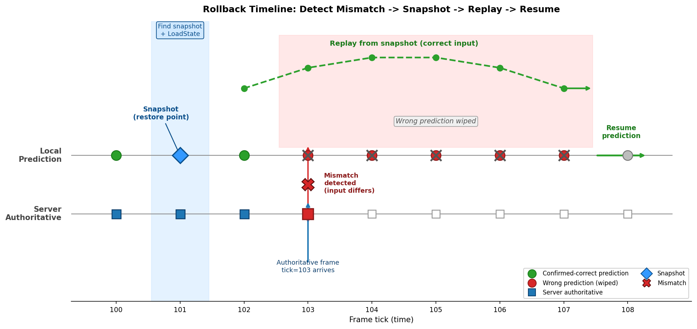
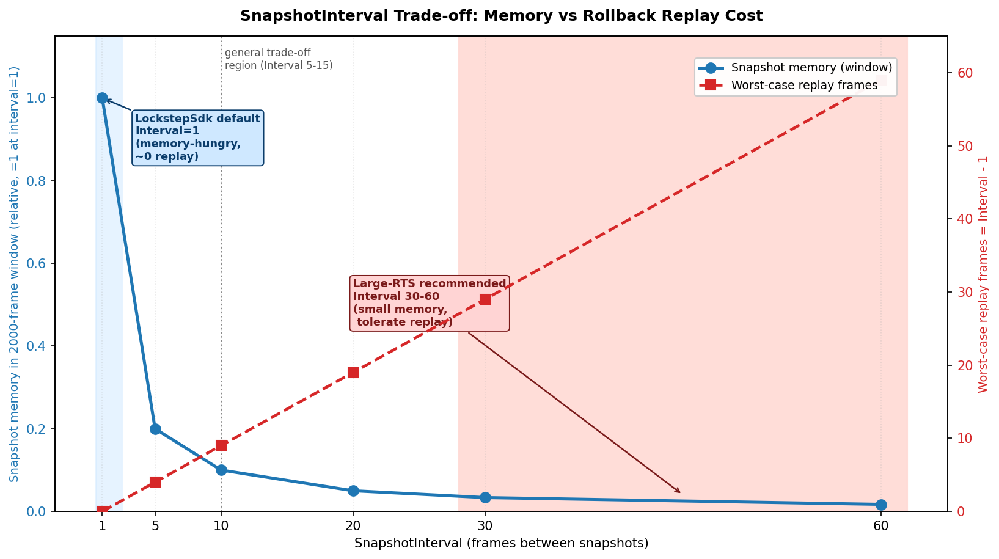
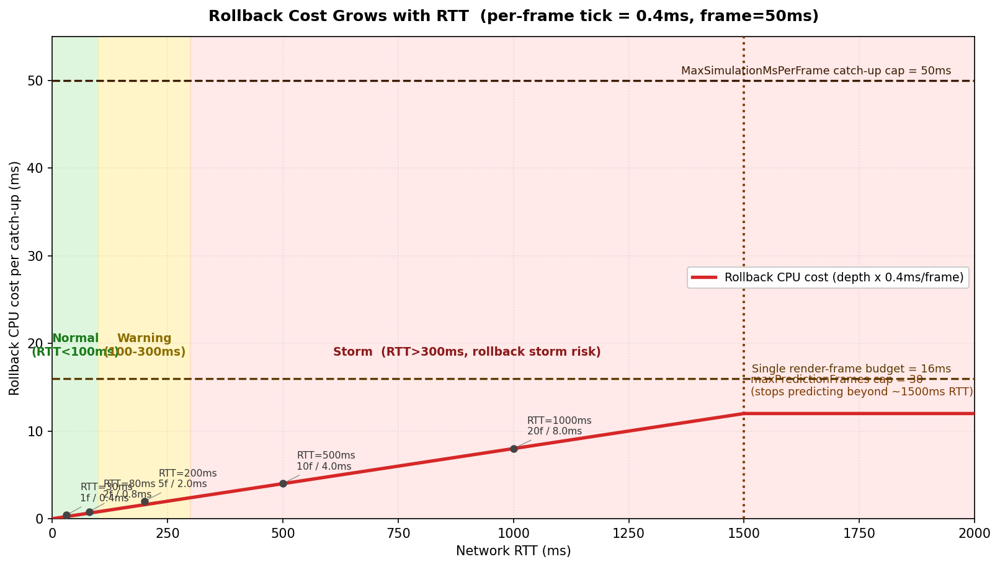

# 第 9 章 · 回滚:猜错了怎么倒带重演

> **核心问题**:上一章讲了预测——客户端不等服务器,本地先按猜测的输入往下算,以保证操作"不粘手"。但预测有代价:只要猜错一个玩家的输入,从那一帧起,客户端往后的所有状态全是"基于错误假设算出来的",和服务器权威结果分叉。这一章就回答:猜错了之后,客户端怎么"倒带重演",把错误的状态抹掉,用正确的输入重新算到当前帧,而且**这一切发生在几十毫秒内、玩家几乎无感**。更关键的是,为了让"倒带重演"成立,整套游戏逻辑代码被反向施加了七条严苛的编程纪律——这才是本章真正的精髓,也是全书的独门主题。

> **读完本章你会明白**:
> 1. 回滚的完整五步机制:检测预测错误 → 找最近快照 → 恢复状态 → 用正确输入重演到当前帧 → 继续预测,以及每一步为什么要这么做。
> 2. 为什么用"快照 + 重演"而非"每帧存完整状态"——空间代价的量级对比,以及 SnapshotInterval(快照间隔)这个旋钮怎么在"内存"和"回滚速度"两头权衡。
> 3. 回滚的代价(一次回滚 = 重演 N 帧 CPU),以及为什么网络变差时会出现"回滚风暴",框架怎么扛。
> 4. 加载快照后为什么必须**立即重算哈希校验**(防坏快照静默 desync)。
> 5. ★**回滚反向施加给整个代码库的七条编程纪律**(本章精髓,全书独门):回滚不是"加个功能",是一套渗透到每行逻辑代码的纪律——为什么组件不能持有 Transform 引用、为什么音效要用 IsReplaying 门控、为什么实体销毁要走命令缓冲、为什么随机数状态必须进快照。本质是:为能倒带重演,游戏逻辑必须写成"纯函数式 + 可快照"的风格。

> **如果一读觉得太难**:这章是全书核心之一,但可以分两层读。先只记住三件事——① 回滚 = 找个过去的快照恢复,再用正确输入从那里重新跑到现在;② 快照不是每帧都存全量(太费内存),而是隔几帧存一次,中间靠"重演"补;③ 回滚最阴险的 bug 不是"回滚算错",而是"回滚把音效和粒子又播了一遍"——所以逻辑代码里凡是"不可逆副作用"都必须用 IsReplaying 门控。七条纪律那一节即便先跳过,也至少要把这三件事刻在脑子里。细节需要时再回来看。

---

## 〇、一句话点破

> **回滚的本质是"承认预测会猜错,并准备好一套倒带机制把错误抹掉"。具体做法:检测到本地预测输入和服务器权威输入对不上的那一刻,立刻找一个过去存的快照(整局状态的序列化字节流),把游戏状态恢复到那个时刻,再用服务器权威输入从那一刻重新一帧一帧跑到当前帧。为了不让"存快照"吃光内存,不是每帧都存全量状态,而是每隔几帧存一次(快照间隔),中间靠"重演"来补——快照间隔越小越省内存但回滚要重演更多帧,越大回滚越快但内存吃紧。而这套机制真正折磨人的地方在于:为了让"倒带重演"在逻辑上成立,整套游戏逻辑代码必须写成一种"可快照、可重放、无不可逆副作用"的纯函数式风格——这就是回滚反向施加给代码库的纪律。**

这是结论。本章倒过来拆,先讲回滚的五步机制(检测 → 找快照 → 恢复 → 重演 → 继续),再讲"快照 + 重演"为什么比"每帧存全量"聪明,再讲回滚的代价和风暴,最后落到本章真正的精髓——那七条渗透每一行业务代码的纪律。

---

## 一、回滚的完整五步机制

先看回滚"是什么样子",把整套流程在脑子里放映一遍。然后我们逐段拆源码。

### 1.1 场景重现:预测为什么必然猜错

沿用上一章(第 8 章)的设定。客户端为了操作不粘手,不等服务器把权威输入广播回来,本地先按"猜测的非本地玩家输入"(默认用上一帧的输入,LastInputPredictor)往下算若干帧。本地玩家的输入是自己实时给的,不猜;要猜的是**别的玩家这一帧按了什么**。

> **承接上一章**:上一章讲了预测窗口、预测深度(基于 RTT 提前算几帧)、三套预测器(LastInput/Neutral/Trend)。上一章末尾留了一句话——"预测错了是有代价的,这个代价下一章讲"。这一章就讲这个代价怎么付。

只要网络有延迟,客户端就一定会在"还没收到服务器权威帧"的情况下,先预测算出去若干帧。而这些预测帧里,别的玩家的输入是**猜的**。一旦猜错——比如你猜对面玩家这一帧继续往前走,结果服务器权威帧回来说他这一帧其实转向了——那么从这一帧开始,你本地算出的所有状态(谁在哪、谁开炮了、谁被打中了)全是基于错误输入算出来的,和服务器权威结果**分叉**。

> **钉死这件事**:预测必然有错(除非你算命,否则猜不中别的玩家下一帧按什么)。预测错了的代价是:从出错帧起,本地状态和服务器权威状态分叉。回滚就是"承认这个分叉,把错误的状态抹掉,用正确输入重算"。

### 1.2 回滚的五步

回滚发生在"客户端收到服务器权威帧,发现它和自己之前预测用的输入对不上"的那一刻。整个机制分五步,缺一不可:

```
   第 1 步: 检测预测错误
     服务器权威帧 sFrame 到达, 帧号 tick <= 本地预测到的帧 _predictedTick
     说明这一帧本地已经"预测算过"了
     拿本地存的预测输入 localFrame 和服务器权威输入 sFrame 比对
     对不上(CompareInputs 返回 false)→ 预测错了, 必须回滚

   第 2 步: 找一个过去的快照
     要重算, 得先回到"出错之前"的一个已知正确的状态
     从 tick-1 往回扫, 找最近的快照(snapshot)
     快照 = 那一帧整局状态的序列化字节流 + 当时的状态哈希

   第 3 步: 恢复状态
     把快照里的字节流反序列化, LoadState 回游戏世界
     立刻重算哈希, 和快照里存的哈希比对——必须一致(防坏快照)

   第 4 步: 用正确输入重演到当前帧
     从快照帧的下一帧开始, 一帧一帧用服务器权威输入重新 Tick
     一直重演到 _predictedTick(出错前本地预测到的那一帧)
     重演的每一帧, 状态被"修正"回正确轨迹

   第 5 步: 继续预测
     重演完, 状态已经回到正确轨道, 而且追到了出错前的预测进度
     接着正常预测下去, 玩家几乎无感
```

这五步的配图(时间线)是本章第一张重点图。



> **图 9-1 图说**:横轴是帧号(时间)。上方一条线是"本地预测执行"的轨迹(预测帧 0,1,2,...,N),下方一条线是"服务器权威帧"的轨迹。在某个时刻,服务器权威帧 t 到达,而本地已经预测算到 t+N 了。比对发现 t 帧输入不一致(标红的叉),于是:① 回退到最近的快照点(t-2,蓝色方块);② LoadState 恢复;③ 从 t-1 开始用权威输入重演(绿色虚线箭头),一直重演到 t+N;④ 继续预测。图上要画出"预测帧(错误)被抹掉"的视觉(灰色叉掉),以及"重演帧(正确)"覆盖的过程。英文标注:Prediction track / Authoritative track / Mismatch detected / Snapshot restore / Replay from snapshot / Resume prediction。

下面逐步拆源码。源码在 `LockstepController.cs`。

### 1.3 第 1 步:检测预测错误(ConfirmServerFrames 里的回滚检测)

回滚检测发生在 `ConfirmServerFrames` 方法里——这是 `DoUpdate` 的第一阶段,专门处理"服务器权威帧到来,本地比对确认"。简化后的核心逻辑(`LockstepController.cs:358-399`):

```csharp
// LockstepController.cs:358-399 (简化示意, 突出回滚检测)
while (_confirmedTick < _curTickInServer)
{
    int tick = _confirmedTick + 1;
    var sFrame = _serverFrames.Get(tick);
    if (sFrame == null || sFrame.Frame != tick) { OnNeedMissFrame?.Invoke(tick); break; }

    // 检查回滚: 这一帧本地已经预测算过了
    if (tick <= _predictedTick)
    {
        var localFrame = GetLocalFrame(tick);
        if (localFrame == null || !CompareInputs(sFrame, localFrame))
        {
            // 预测错了! 进入回滚
            _simulation.IsReplaying = true;          // 标记"正在重演"
            if (!RollbackTo(tick - 1))               // 回滚到出错帧的上一帧
            {
                _simulation.IsReplaying = false;
                OnRollbackFailed?.Invoke(tick);      // 回滚失败, 上层决定重连/重置
                break;
            }
            _confirmedTick = _predictedTick;         // 重置进度, 从回滚点重新循环
            continue;
        }
        else
        {
            // 命中预测! 猜对了, 啥也不用重算
            _confirmedTick = tick;
            _localFrames.Set(tick, sFrame);
            // (用快照哈希同步 _frameHashes, 保证不同路径哈希一致)
            continue;
        }
    }
    // ... tick > _predictedTick: 全新帧, 正常执行 ...
}
```

这里有三个关键判断,逐个拆。

**判断一:`tick <= _predictedTick` —— 这一帧本地预测算过了吗?**

`_predictedTick` 是本地已经预测算到的帧号,`_confirmedTick` 是已经用服务器权威帧确认过的帧号。正常情况下 `_confirmedTick <= _predictedTick`(确认的帧不会超过预测的帧,因为预测总是领先)。当服务器权威帧 `tick` 落在 `(_confirmedTick, _predictedTick]` 区间内,说明这一帧本地"已经预测算过了"——那就得比对,预测用的输入和服务器权威输入一不一样。

如果 `tick > _predictedTick`,说明这一帧本地还没算过(预测还没跑到这),那就不用比对,直接执行(后面的 `SimulateConfirmed` 分支)。

**判断二:`CompareInputs(sFrame, localFrame)` —— 预测输入和权威输入一样吗?**

`CompareInputs` 逐玩家逐字节比对两个 FrameData 的输入(`LockstepController.cs:784-803`):

```csharp
// LockstepController.cs:784-803 (简化)
private bool CompareInputs(FrameData a, FrameData b)
{
    if (a.PlayerCount != b.PlayerCount) return false;
    for (int i = 0; i < a.PlayerCount; i++)
    {
        var inputA = a.PlayerInputs[i];
        var inputB = b.PlayerInputs[i];
        if (inputA == null && inputB == null) continue;
        if (inputA == null || inputB == null) return false;
        if (!((ReadOnlySpan<byte>)inputA).SequenceEqual(inputB)) return false;  // 硬件加速逐字节比
    }
    return true;
}
```

逐玩家、逐字节(用 `ReadOnlySpan<byte>.SequenceEqual`,底层走 SIMD 硬件加速)。任何一个玩家的任何一个输入字节对不上,返回 false——预测错了。注意这里比对的是**所有玩家**的输入,不只是非本地玩家。因为本地玩家的输入是实时注入的(上一章讲的输入掩码隔离),理论上本地玩家输入应该总对得上;但万一本地输入也因为某种原因(比如序列化不一致)对不上,同样要回滚——这是兜底。

**判断三:猜对了(命中预测)vs 猜错了(回滚)。**

- `CompareInputs` 返回 true:猜对了!这是预测最理想的情况——本地之前预测算的那一帧,和服务器权威结果完全一致,**啥也不用重算**,直接 `_confirmedTick = tick` 推进。这一帧的 Tick 早就执行过了(预测时执行的),状态已经是对的,直接确认即可。这就是预测的收益——猜对了就"白赚"一帧的提前量。
- `CompareInputs` 返回 false:猜错了。回滚。

> **钉死这件事(回滚检测)**:回滚检测就两个条件——① 帧号 `tick <= _predictedTick`(这帧本地预测算过了);② `CompareInputs(sFrame, localFrame)` 返回 false(预测输入和权威输入对不上)。两个都满足才回滚。如果只满足前者但输入一致,叫"命中预测",是预测最理想的 outcome。

### 1.4 第 2-3 步:找快照 + 恢复状态(RollbackTo + FindSnapshot)

检测到要回滚后,调 `RollbackTo(tick - 1)`——回滚到出错帧的**上一帧**(出错帧本身要重算,所以回到它之前)。`RollbackTo` 的完整流程(`LockstepController.cs:623-688`):

```csharp
// LockstepController.cs:623-688 (简化示意)
private bool RollbackTo(int tick)
{
    // 特例: 回滚到 tick == -1, 即回到游戏初始状态(第一帧之前)
    if (tick == -1)
    {
        if (_initialState != null)
        {
            _simulation.LoadState(_initialState);              // 加载初始状态
            var initialHash = _simulation.ComputeHash();
            if (initialHash != _initialStateHash)              // 立即校验!
            {
                Log.Error($"Initial state integrity failed ...");
                return false;                                   // 初始状态都坏了, 拒绝回滚
            }
            RollbackCount++;
            _predictedTick = -1;
            return true;
        }
        return false;
    }

    // 一般情况: 找最近快照
    var snapshot = FindSnapshot(tick);                          // 第 2 步: 找快照
    if (snapshot == null) return false;                        // 找不到快照, 回滚失败

    _simulation.LoadState(snapshot.Data.Span);                 // 第 3 步: 恢复状态

    // ★立即校验: 加载后的哈希必须和快照保存时的哈希一致
    var actualHash = _simulation.ComputeHash();
    if (actualHash != snapshot.Hash)                           // 坏快照!
    {
        Log.Error($"Snapshot integrity failed at tick {snapshot.Frame} ...");
        return false;
    }

    RollbackCount++;
    int actualRollbackTick = snapshot.Frame;                    // 用快照的真实帧号
    int rollbackFrames = _predictedTick - actualRollbackTick;  // 这次回滚要重演多少帧
    Metrics?.RecordRollback(rollbackFrames);
    OnRollback?.Invoke(_predictedTick, actualRollbackTick);

    _predictedTick = actualRollbackTick;                       // 关键: 重置预测帧号到快照点
    return true;
}
```

这里有几个极其重要的细节,逐个点破。

**细节一:为什么要回滚到 `tick - 1` 而不是 `tick`?**

出错的是 `tick` 帧——这一帧本地用了错误的预测输入算过,状态错了。要修正它,得回到 `tick` **执行之前**的状态,也就是 `tick - 1` 帧执行**之后**的状态,然后用正确的 `tick` 帧输入重新 Tick。所以回滚目标是 `tick - 1`。

**细节二:`FindSnapshot` 从 `tick` 往回扫,可能找不到精确那一帧的快照。**

`FindSnapshot(targetTick)`(`LockstepController.cs:771-782`)的逻辑:从 `targetTick` 开始往前扫,扫到第一个"槽位非空且帧号匹配"的快照就返回:

```csharp
// LockstepController.cs:771-782
private Snapshot? FindSnapshot(int targetTick)
{
    for (int t = targetTick; t >= 0 && t > targetTick - _frameHistorySize; t--)
    {
        var snapshot = _snapshots.Get(t);
        if (snapshot != null && snapshot.Frame == t)   // 帧号必须匹配(防 RingBuffer 回绕读陈旧槽)
            return snapshot;
    }
    return null;
}
```

注意 `snapshot.Frame == t` 这个校验——它呼应了第 10 章要讲的 RingBuffer 时效性契约(C-5):环形缓冲是纯槽数组,越界的旧 index 会静默环绕到陈旧槽,必须靠 payload 自带的帧号校验时效。这里如果只判 `snapshot != null`,可能读到 `tick - Capacity` 的陈旧快照,导致回滚到一个完全错误的时间点。

`FindSnapshot` 可能返回比 `targetTick` 更早的快照(因为快照是隔几帧存一次的,见下一节 SnapshotInterval)。所以 `RollbackTo` 里有个细节:用 `snapshot.Frame`(快照的真实帧号)而不是传入的 `tick` 来重置 `_predictedTick`(`LockstepController.cs:670-677`):

```csharp
int actualRollbackTick = snapshot.Frame;     // 快照真实帧号, 可能 < tick
_predictedTick = actualRollbackTick;         // 重置到快照点
if (actualRollbackTick < tick)
    Log.Warning($"RollbackTo({tick}) used snapshot from tick {actualRollbackTick} ..., will re-execute {tick - actualRollbackTick} frames.");
```

回滚到了比目标更早的快照也没关系——外层 `ConfirmServerFrames` 的 `while` 循环会从 `_predictedTick + 1` 开始重新执行,多重演几帧而已。

**细节三:加载快照后立即重算哈希校验(本章技巧精解之一,后面单开一节)。**

`LoadState` 之后立刻 `ComputeHash`,和快照里存的 `snapshot.Hash` 比对。这一步看似多余(快照是自己存的,怎么会坏?),实则是防"位翻转/序列化 bug/版本不匹配"导致坏快照静默 desync 的最后一道防线。下一节专门讲。

**细节四:回滚失败的处理(`OnRollbackFailed`)。**

如果 `_initialState == null`(连初始状态都没存)或者 `FindSnapshot` 返回 null(快照被覆盖了),`RollbackTo` 返回 false。这时 `ConfirmServerFrames` 里触发 `OnRollbackFailed?.Invoke(tick)` 事件——这是个比 desync 还严重的事件,意味着"客户端无法自我修正",上层(Driver)通常应该触发重连或重置。`OnRollbackFailed` 和 `OnDesync` 是分开的两个事件:desync 是"状态对不上但还能继续跑",rollback failed 是"连回滚都做不下去,状态彻底失控"。

### 1.5 第 4 步:用正确输入重演到当前帧

回滚成功后,`_predictedTick` 被重置到快照点(比如 `tick - 5`),`_confirmedTick` 也在 `ConfirmServerFrames` 里被赋值为 `_predictedTick`(`LockstepController.cs:395`):

```csharp
// 回滚成功后, 重置进度
_confirmedTick = _predictedTick;   // :395
continue;                          // 重新进入 while 循环
```

于是 `while (_confirmedTick < _curTickInServer)` 的下一轮,`tick = _confirmedTick + 1` 就从快照点的下一帧开始了。这时 `tick > _predictedTick`(因为 `_predictedTick == _confirmedTick`),走的是"全新帧执行"分支:

```csharp
// LockstepController.cs:425-461 (简化)
_simulation.IsReplaying = tick <= oldPredictedTick;   // 重演的帧标 IsReplaying=true
_localFrames.Set(tick, sFrame);                       // 用服务器权威输入
SimulateConfirmed(sFrame);                            // 执行这一帧
_confirmedTick = tick;
if (tick > _predictedTick) { _predictedTick = tick; pursueTicksExecuted++; }
_simulation.IsReplaying = false;
// 记录哈希、按间隔存快照 ...
```

注意 `_simulation.IsReplaying = tick <= oldPredictedTick`——重演那些"之前已经预测算过的帧"时,`IsReplaying` 被置 true。这个标志位是给**业务逻辑代码**看的,用来门控副作用(音效/粒子/UI)——这一章后半段的精髓节会专门讲它为什么是命脉。

重演循环会一直跑到 `_confirmedTick == _curTickInServer`(追上服务器进度),或者撞上追帧限速(`maxTicksThisUpdate`)、deadline 超时。如果一次 `DoUpdate` 没追完,下一帧 `DoUpdate` 继续追——这就是"追帧",下一章(第 10 章)详讲。

### 1.6 第 5 步:继续预测

重演追上服务器进度后,`DoUpdate` 的第二阶段 `PredictAhead` 接管,从 `_predictedTick` 继续往前预测,就像什么都没发生过一样。从玩家视角看,这一连串"检测 → 找快照 → 恢复 → 重演 → 继续预测"全发生在一次 `DoUpdate`(一个渲染帧,16ms)里,除了屏幕上可能有一瞬的位置跳变(下一章 Visual Offset 会讲怎么吸收它),操作手感几乎不受影响。

> **钉死这件事(五步机制)**:回滚 = 检测(tick<=PredictedTick 且 CompareInputs 不一致)→ 找快照(FindSnapshot 从 tick-1 往回扫,帧号校验防陈旧槽)→ 恢复(LoadState + 立即重算哈希校验)→ 重演(从快照点用权威输入重新 Tick 到当前,重演帧标 IsReplaying=true)→ 继续(PredictAhead 接管)。五步全在一个 DoUpdate 里完成,玩家几乎无感。

### 1.7 一条完整的执行轨迹(把五步串起来)

用一个具体的帧号序列,把五步在脑子里完整跑一遍,直觉会更清楚。设帧率 20fps,玩家 A 是本地玩家,玩家 B 是远程(他的输入要预测)。

```
   帧号:        100   101   102   103   104   105   106
   ----------------------------------------------------
   服务器权威:  ✓    ✓    ✓(到)              ← 103 帧刚到
   本地预测:    ✓    ✓    ✓    ✓    ✓    ✓    ✓    ← 已预测到 106
   本地存的输入(预测用):
     玩家A:     真实  真实  真实  真实  真实  真实  真实   ← 本地玩家, 实时
     玩家B:     猜↑   猜↑   猜↑   猜↑   猜↑   猜↑   猜↑   ← 用 LastInput, 假设一直前进
   服务器权威输入(103 帧到来):
     玩家B:                          ← 实际是 "→"(转向)! 预测猜的 ↑ 错了
```

时刻:服务器 103 帧到达,本地已预测到 106。`ConfirmServerFrames` 处理:

1. **检测**(`tick=103 <= _predictedTick=106`):取本地 103 帧存的输入,和服务器权威 103 帧比对。玩家 A 一致,玩家 B 不一致(本地猜 ↑,权威是 →)。`CompareInputs` 返回 false → 触发回滚。
2. **找快照**:`RollbackTo(102)`。`FindSnapshot(102)` 从 102 往回扫,SnapshotInterval=1,102 帧有快照,返回。若 SnapshotInterval=10,可能扫到 100 帧的快照(102/101 都没存),返回 100 帧快照。
3. **恢复**:`LoadState(snapshot@102)`,立即 `ComputeHash` 比对 `snapshot.Hash`,一致。`_predictedTick` 重置为 102(或 100)。
4. **重演**:`_confirmedTick = _predictedTick = 102`,`while` 循环从 103 重新跑。103 帧现在 `tick > _predictedTick`,走"全新帧执行"分支,`IsReplaying = (103 <= oldPredictedTick=106) = true`,用服务器权威 103 帧输入(玩家 B 是 →)执行 `SimulateConfirmed`。状态被修正:玩家 B 在 103 帧转向了,而不是继续前进。接着 104、105、106 帧——但这些帧服务器权威还没到(只到 103),所以重演用的是**修正后的本地输入**(玩家 B 在 103 帧转向这个事实,被 LastInputPredictor 用于 104-106 的预测)。一直重演到 `_confirmedTick == _curTickInServer=103`。
5. **续接**:`PredictAhead` 接管,从 103 继续预测 104、105、106……这次预测玩家 B 用的是"103 帧转向"后的输入(修正过的 LastInput),命中率回升。

整个过程中,玩家 A 的视角:屏幕上玩家 B 在 103 帧突然从"直走"跳到"转向"(因为之前预测他直走,回滚修正为转向),这个跳变由下一章(第 11 章)的 Visual Offset 吸收。除此之外,玩家 A 自己的操作手感完全不受影响——因为本地玩家输入是实时的,预测和重演都不改本地玩家输入。

这条轨迹把"为什么回滚能做到几乎无感"讲清楚了:① 回滚只修正"预测错的部分"(远程玩家的行为),本地玩家的输入和操作永远是对的;② 整个修正在一个 DoUpdate 里完成,渲染帧率不掉;③ 跳变由表现层吸收。所以从玩家体感,网络好时(预测大多命中)几乎察觉不到回滚,网络差时也只是偶发的"对手位置跳一下",而不是"卡住不动"。

> **钉死这条轨迹**:回滚修正的是"预测错的部分"——具体说是远程玩家的行为预测错了。本地玩家输入永远是真实的,不受回滚影响。这就是为什么预测回滚能保证"操作即时性"(本地输入实时生效),代价只是"远程玩家的行为可能在回滚时跳变"(由表现层吸收)。这个权衡(本地操作零延迟 vs 远程行为偶发跳变)是预测回滚机制的灵魂。

---

## 二、为什么"快照 + 重演"而非"每帧存完整状态"

回滚要恢复到一个过去的状态。最朴素的办法是:**每一帧都存一份完整的游戏状态**。回滚的时候,直接取目标帧的存档,LoadState,完事——不用重演,因为每一帧都有完整存档。

听起来很美。但 LockstepSdk **不这么干**。它用"快照 + 重演":每隔 SnapshotInterval 帧存一次快照,中间那几帧不存,回滚的时候先恢复到最近的快照点,再重演到目标帧。

为什么?这是空间 vs 时间的经典权衡。

### 2.1 朴素做法撞什么墙:每帧存全量,内存爆炸

先算一笔账。假设一个中等规模的帧同步游戏,一局状态的序列化大小是 S 字节(参考第 22 章性能基准,TankGame 量级 5000 实体的状态约 635 字节;复杂游戏可能几 KB 到几十 KB)。帧率 20fps,一局打 5 分钟 = 6000 帧。

- **每帧存全量**:6000 帧 × S 字节。S = 1KB 时是 6MB;S = 10KB 时是 60MB;S = 100KB(大型 RTS)时是 600MB。而且这是**每帧都要序列化一次**的 CPU 开销——即使 S 只有 1KB,6000 次 SaveState 也是实打实的开销,且绝大多数存档永远不会被用到(只有出错的那一帧附近才会被回滚访问)。
- **而且这些存档绝大多数是冗余的**——相邻两帧的状态,99% 的字段没变(一个坦克不动,它的位置、朝向、血量在相邻帧里完全一样)。每帧都存一份,等于把几乎相同的数据存了 N 份。

> **不这样会怎样**:每帧存全量状态,内存随帧数线性增长,一局长对战能吃光几百 MB 到几 GB 内存。而且每次存档都是一次完整 SaveState(CPU 开销),即便绝大多数存档永远用不上。这在移动端(Unity,内存吃紧)是完全不可接受的。

### 2.2 所以这么设计:快照间隔 + 重演

"快照 + 重演"的思路:**把"存状态"和"重算状态"解耦,只在间隔帧存快照,中间靠重演补**。

- 每隔 `SnapshotInterval` 帧存一次快照(默认 SnapshotInterval = 1,即每帧都存——但这是个可调旋钮,后面讲权衡)。
- 回滚时,`FindSnapshot` 从目标帧往回扫,找到最近的一个快照点。这个快照点可能就在目标帧(每帧存时),也可能在目标帧之前若干帧(隔几帧存时)。
- 从快照点 LoadState 恢复,然后用权威输入从快照点重演到目标帧。

这样,内存里只需要保留"最近若干帧的快照"(由 `_frameHistorySize`,默认 2000 控制环形缓冲容量),而不是每一帧的全量状态。而重演的 CPU 开销,只在"真的发生回滚"时才付——绝大多数帧不回滚,就不付这个钱。

> **所以这样设计**:用"间隔快照 + 按需重演"替代"每帧全量"。内存只保留有限窗口的快照(默认 2000 帧环形缓冲),回滚时付重演的 CPU。这是"空间(内存)换时间(CPU)"的反向操作——用一点 CPU(重演)省下大量内存(不用每帧存全量)。本质是"懒求值":状态只在需要时(回滚时)才算,而不是每帧都提前算好存着。

### 2.3 SnapshotInterval 旋钮:内存 vs 回滚速度的权衡

`SnapshotInterval` 是个旋钮(`LockstepController.cs:96, 112`,构造参数,默认 1),它决定"每隔几帧存一次快照":

```csharp
// LockstepController.cs:729-732
private bool ShouldSaveSnapshot(int tick)
{
    return tick % _snapshotInterval == 0;
}
```

- **SnapshotInterval = 1(默认)**:每帧都存快照。回滚时 `FindSnapshot` 几乎总能找到目标帧的精确快照,**重演 0 帧**(回滚到 tick-1 的快照,直接恢复,不用重演)。代价:每帧都做一次 SaveState + 存 byte[](内存和 CPU 都吃)。
- **SnapshotInterval = 10**:每 10 帧存一次。回滚时最坏要重演 9 帧(快照在 tick-9,目标 tick)。代价:每次回滚多算 9 帧 CPU。收益:快照数量降到 1/10,内存省 90%,而且 90% 的帧不用做 SaveState。

这是个经典的权衡,没有标准答案,取决于游戏类型:

| SnapshotInterval | 内存占用 | 每帧 SaveState 开销 | 回滚时最坏重演帧数 | 适用场景 |
|---|---|---|---|---|
| 1(默认) | 高(每帧一份) | 每帧一次 | 0-1 | 回滚频繁且状态小(格斗/ACT) |
| 5-10 | 中 | 每 5-10 帧一次 | 4-9 | 通用折中 |
| 30-60 | 低 | 每 30-60 帧一次 | 29-59 | 状态大、回滚少(大 RTS) |

LockstepSdk 默认 1,是因为它的目标场景(格斗/RTS/MOBA 小局面)状态小(几 KB),每帧存一份内存也吃得消,而回滚要尽量快(重演 0 帧最丝滑)。如果是大型 RTS(几万单位,状态几十 MB),就得把 SnapshotInterval 调到 30-60,用"回滚时多重演几帧"换"内存不爆"。



> **图 9-3 图说**:双 Y 轴图。横轴是 SnapshotInterval(1, 5, 10, 30, 60)。左 Y 轴(蓝线)是"窗口内快照内存占用"(随 Interval 增大线性下降,Interval=1 时最高,=60 时降到 1/60)。右 Y 轴(红线)是"回滚时最坏重演帧数 = Interval - 1"(随 Interval 增大线性上升)。两条曲线在某个 Interval 处交叉,标注"权衡点"。再画出 LockstepSdk 默认值 Interval=1 的位置(蓝线高位、红线贴 0,标注"小状态游戏优选:用内存换零重演"),以及大型 RTS 推荐区间(Interval 30-60,标注"大状态游戏优选:省内存、容忍重演")。英文标注:SnapshotInterval / Snapshot memory (window) / Worst-case replay frames / LockstepSdk default=1 / Large-RTS recommended 30-60。

> **作者复盘 · SnapshotInterval 默认为什么是 1**:早期纠结过这个值。设成 10 看着省内存,但实测下来,帧同步游戏状态通常不大(TankGame 635 字节),每帧存一份 2000 帧窗口也才 1.2MB,移动端完全吃得消。而设成 10 之后,每次回滚多算 9 帧的 CPU 抖动,在低端机上反而比"多占点内存"更影响体验(帧同步最怕单帧 CPU 峰值,会让所有客户端节奏错乱)。所以默认 1——用内存换 CPU 平滑。但留了这个旋钮,大状态游戏可以调。

> **钉死这件事**:回滚用"快照 + 重演"而非"每帧存全量",是为了不爆内存。SnapshotInterval 旋钮控制"每隔几帧存一次":小(每帧存)→ 回滚快但内存吃;大(隔几十帧)→ 省内存但回滚要重演更多帧。默认 1(每帧存),适合小状态游戏;大状态游戏调大。

---

## 三、回滚的代价与回滚风暴

回滚不是免费的。这一节讲它的代价,以及为什么网络变差时会出"回滚风暴"。

### 3.1 一次回滚 = 重演 N 帧 CPU

回滚的 CPU 代价,等于"重演的帧数 × 每帧 Tick 的 CPU"。重演帧数 = `_predictedTick - snapshot.Frame`(回滚前预测到的帧,减去快照点)。

正常网络下,预测深度 = RTT 内能算的帧数。RTT 50ms、帧率 20fps(每帧 50ms)时,预测深度约 1-2 帧,回滚最多重演 1-2 帧,代价可忽略。

但网络变差时,RTT 涨到 200ms,预测深度涨到 4-5 帧,回滚就要重演 4-5 帧。如果 RTT 涨到 500ms(很差但仍可玩),预测深度 10 帧,回滚重演 10 帧——这是一次回滚就要做 10 次 Tick 的 CPU 工作,全部挤在一个 `DoUpdate`(16ms 渲染帧)里。

框架怎么扛?`DoUpdate` 有个 `MaxSimulationMsPerFrame = 50` 的硬上限(`LockstepController.cs:27`),每次 `DoUpdate` 最多模拟 50ms 的逻辑帧,超了就 break,下一帧接着追。这就是"追帧动态限速"——不要求一次追完,分摊到多个渲染帧。

### 3.2 回滚风暴:连续频繁回滚

更可怕的是"回滚风暴"——网络抖动时,几乎每个服务器权威帧都和预测对不上,于是**每一帧都触发回滚**。每次回滚都要重演 N 帧,连续 N 次回滚,CPU 直接打满,渲染帧率暴跌,玩家感觉"卡成幻灯片"。

回滚风暴的根因是"预测命中率暴跌"。正常网络下,LastInputPredictor(用上一帧输入)的命中率很高(玩家大多数帧的输入和上一帧一样——持续移动、持续转向),95% 以上的帧命中预测,回滚极少。但网络抖动时,服务器权威帧延迟到达,客户端预测用的是几天前的"上一帧"输入,和真实的当前帧输入差很远,命中率暴跌,几乎每帧都回滚。

框架有几种扛法:

1. **追帧动态限速**(`ConfirmServerFrames` 的 `maxTicksThisUpdate`,`LockstepController.cs:323-325`):差距大时放宽(一次追更多帧),差距小时收紧。避免单帧 CPU 峰值。
2. **MaxSimulationMsPerFrame 硬上限**:50ms 兜底,防卡死。
3. **预测深度上限**(`_maxPredictionFrames`,默认 30):预测不能无限深,超过就停预测,等服务器。这从源头限制了"一次回滚最多重演多少帧"。
4. **网络时钟硬边界**(第 13 章):`smoothedTarget` 被 Clamp 在 `[serverConfirmedTick + PreSendCount, serverConfirmedTick + maxPredictionFrames]` 区间,平滑只在区间内生效,触界放弃平滑——这从源头防住了"预测深度失控",也就防住了"回滚重演帧数失控"。

### 3.3 一个数值推演:不同 RTT 下的回滚代价

把代价量化一下,直觉更清楚。假设帧率 20fps(每帧 50ms),每帧 Tick 的 CPU 开销约 0.4ms(TankGame 5000 实体基准,第 22 章数据)。RTT 决定预测深度(本地领先服务器多少帧),预测深度决定一次回滚最多重演多少帧:

| 网络 RTT | 预测深度(帧) | 一次回滚重演帧数 | 回滚 CPU 开销 | 占单帧预算(16ms) |
|---|---|---|---|---|
| 30ms(局域) | 1 帧 | 1 | 0.4ms | 2.5% |
| 80ms(好 4G) | 2 帧 | 2 | 0.8ms | 5% |
| 200ms(差 4G) | 4-5 帧 | 4-5 | 1.6-2ms | 10-12% |
| 500ms(很差) | 10 帧 | 10 | 4ms | 25% |
| 1000ms(极差) | 20 帧 | 20 | 8ms | 50%(接近上限) |

可以看到,RTT 涨到 500ms 以上,单次回滚的 CPU 就吃掉单帧预算的 1/4 到一半。如果再叠上"回滚风暴"(连续多次回滚),50ms 的 `MaxSimulationMsPerFrame` 兜底就会触发——这次 `DoUpdate` 追不完,留到下一帧追,玩家看到的就是"画面短暂卡顿后追上"。这就是为什么第 13 章的时钟硬边界要把预测深度 Clamp 在 `_maxPredictionFrames`(默认 30)以内——超过这个深度宁可停预测(操作变粘),也不让回滚代价失控(卡成幻灯片)。

> **不这样会怎样**:如果没有预测深度上限,RTT 极差时客户端会无限预测下去(预测 100 帧),然后一次回滚要重演 100 帧 = 40ms CPU,直接卡死一个渲染帧。`_maxPredictionFrames` 把这个上限钉死在 30,最坏回滚 30 帧 = 12ms,还在单帧预算内,可控。



> **图 9-2 图说**:横轴是网络 RTT(ms),纵轴是"一次回滚的 CPU 开销(ms)"。曲线随 RTT 线性上升(预测深度 = RTT / 帧间隔,重演帧数 = 预测深度,CPU = 重演帧数 × 每帧开销)。画出三个分区:绿色正常区(RTT < 100ms,CPU < 1ms,玩家无感)、黄色警戒区(100-300ms,CPU 1-3ms,偶发卡顿)、红色风暴区(>300ms,CPU > 3ms,叠加回滚风暴时卡顿明显)。用一条水平虚线标 `MaxSimulationMsPerFrame = 50ms`(兜底上限),以及一条竖直虚线标"预测深度 = maxPredictionFrames = 30 对应的 RTT"(约 1500ms,超过此处停预测)。英文标注:Rollback CPU cost / RTT / Normal zone / Warning zone / Storm zone / MaxSimulationMsPerFrame cap / maxPredictionFrames cap。

> **承接第 13 章(预告)**:网络时钟那一章会讲一个精妙设计——`GetTargetTick` 的硬边界 Clamp。它不是为回滚设计的,但恰好从源头限制了预测深度,也就间接限制了回滚代价。这是个"上游一个设计,下游多个收益"的例子。

> **钉死这件事**:回滚代价 = 重演帧数 × 每帧 CPU。正常网络可忽略,网络差时变重。最怕"回滚风暴"——连续每帧都回滚,CPU 打满。框架靠追帧限速、MaxSimulationMsPerFrame、预测深度上限、时钟硬边界多道防线扛住。

---

## 四、技巧精解:加载快照立即校验哈希

这一节拆本章最硬的一个技巧——为什么 `LoadState` 之后必须**立即重算哈希**和快照里的哈希比对。

### 4.1 朴素做法撞什么墙:不校验,坏快照静默 desync

最朴素的做法:存快照的时候,算个哈希存进去(`snapshot.Hash`);加载快照的时候,直接 `LoadState(snapshot.Data)`,**不校验**,直接开始重演。

听起来也没问题——快照是自己存的,字节流没动过,怎么会坏?但帧同步的残酷在于,"静默错误"就是 desync。坏快照的来源有好几种,而且都很隐蔽:

1. **位翻转(cosmic ray / 内存故障)**:极罕见但存在。某个字节从 0x00 翻成 0x01,LoadState 后状态错了,从此 desync。
2. **序列化/反序列化不对称 bug**:`SaveState` 和 `LoadState` 不是对称的(比如 SaveState 写了 5 个字段,LoadState 只读了 4 个,或者字节序搞反了),加载出的状态和保存时的状态不一样。
3. **版本不匹配**:快照是用旧版本的序列化格式存的(SerializationVersion = 1),加载时是新版本(SerializationVersion = 2),字段布局变了,加载出的状态是垃圾。
4. **环形缓冲陈旧槽**(C-5):`FindSnapshot` 如果忘了 `snapshot.Frame == t` 校验,可能读到 `tick - Capacity` 的陈旧快照,状态完全错位。
5. **BufferPool 双倍归还**:第 20 章会讲,同一个 byte[] 被租给两方,一方写入覆盖了另一方的快照数据——这是帧同步最阴险的静默损坏来源。

任何一种,都会让"加载出的状态"和"保存时的状态"不一致。如果不校验,客户端就基于一个错误的状态开始重演,从此 desync,而且**完全静默**——没有报错,没有崩溃,只是状态慢慢分叉,几分钟后才被哈希对账抓到,但那时已经离根因很远。

### 4.2 所以这么设计:LoadState 后立即 ComputeHash 比对

`RollbackTo` 里,`LoadState` 之后**立刻** `ComputeHash`,和快照存的 `snapshot.Hash` 比对(`LockstepController.cs:656-664`):

```csharp
// LockstepController.cs:656-664
_simulation.LoadState(snapshot.Data.Span);
var actualHash = _simulation.ComputeHash();        // 立即重算!
if (actualHash != snapshot.Hash)                   // 对不上 = 坏快照
{
    Log.Error($"Snapshot integrity failed at tick {snapshot.Frame}: expected 0x{snapshot.Hash:X8}, got 0x{actualHash:X8}.");
    return false;                                   // 拒绝回滚, 上层处理
}
```

这一步是"快照完整性的最后一道防线"。它抓住的不是"逻辑 bug",而是"快照本身坏了"。一旦发现坏快照,`RollbackTo` 返回 false,触发 `OnRollbackFailed`——宁可停止也不基于坏状态继续跑。

### 4.3 为什么这个校验"对"——哈希是状态的指纹

这里用第 23 章会详讲的哈希对账的同一个原理:`ComputeHash` 把整个游戏状态(所有实体、所有组件、随机数状态)序列化成字节流,再用 FNV-1a 算个 32 位哈希。两个状态只要有一个字节不同,哈希就(几乎必然)不同。所以"加载后的哈希 == 快照存的哈希"基本等价于"加载后的状态 == 保存时的状态"。

注意"基本"——32 位哈希有碰撞概率(2^-32),但用于"抓坏快照"足够了(位翻转、版本不匹配这种大规模错误,哈希不可能碰巧一致)。第 23 章会讲为什么生产用增量哈希(O(1))而非全量重算,以及双轨校验。

> **技巧精解 · 加载即校验**:任何"从外部数据恢复状态"的操作(LoadState),恢复后立刻重算哈希和存的哈希比对。这是防"坏数据静默 desync"的最后一道防线。坏数据来源极多(位翻转/序列化不对称/版本不匹配/池双倍归还/陈旧槽),任何一种都会让加载状态错位,而帧同步的残酷在于"静默错误 = desync"。加载即校验,把"基于坏状态继续跑"变成"立刻报错停止",把隐蔽的 desync 变成显式的 OnRollbackFailed。

> **钉死这件事**:LoadState 后必须立即 ComputeHash 比对 snapshot.Hash。坏快照来源极多(位翻转/序列化不对称/版本不匹配/池双倍归还/陈旧槽),不校验就静默 desync。校验把隐蔽 desync 变成显式 OnRollbackFailed。

### 4.4 Snapshot 的池化与 Dispose 幂等:零分配的代价管理

讲完校验,顺带把 Snapshot 这个数据结构的两个工程细节点一下——它们是"回滚频繁发生时不爆 GC"的关键。

Snapshot 的字段(`Snapshot.cs:9-48`):

```csharp
// Snapshot.cs:9-48 (简化)
public sealed class Snapshot : IDisposable
{
    public int Frame;            // 帧号
    public uint Hash;            // 状态哈希(保存时算好的)
    private byte[]? _data;       // 序列化字节流(从 BufferPool.Rent 借的, 不是 new)
    private bool _disposed;      // 是否已归还(P1-ROB-3)
    public int Length { get; }   // 有效长度
    public ReadOnlyMemory<byte> Data { get; }   // 访问口(Dispose 后访问抛异常)
    public string? DebugState;   // 可选调试文本(默认 null, 省 GC)

    public Snapshot(int frame, uint hash, ReadOnlySpan<byte> data, string? debugState = null)
    {
        Frame = frame; Hash = hash; Length = data.Length;
        _data = BufferPool.Rent(Length);   // ★从池借, 不 new
        data.CopyTo(_data);
        DebugState = debugState;
    }

    public void Dispose()
    {
        if (_disposed) return;            // ★幂等: 防重复归还(P1-ROB-1)
        _disposed = true;
        if (_data != null) { BufferPool.Return(_data); _data = null; }
    }
}
```

两个细节:

**细节一:`_data` 从 `BufferPool.Rent` 借,不是 `new byte[]`。** 帧同步里快照产生极频繁(SnapshotInterval=1 时每帧一份),如果每次 `new byte[]`,GC 压力巨大,停顿会让所有客户端节奏错乱(第 20 章详讲为什么帧同步怕 GC)。从 `BufferPool`(底层是 `ArrayPool<byte>.Shared`)借,用完 `Dispose` 归还,零分配。`WritePooledSnapshot`(`LockstepController.cs:738-750`)也用 `BitWriterPool` 借写入器,整个写快照流程零 new。

**细节二:`Dispose` 幂等(防双倍归还)。** `SetSnapshot`(`LockstepController.cs:54-63`)在覆盖旧快照时调 `old.Dispose()` 归还旧 byte[]。如果同一个 Snapshot 被无意中 Dispose 两次(比如 SetSnapshot 归还了一次,Reset 又遍历归还一次),没有幂等保护的话,同一个 byte[] 会被 `BufferPool.Return` 两次——于是它被池重新分发给两方,两方并发写同一个数组,数据互相覆盖,静默 desync。这是第 20 章讲的"BufferPool 双倍归还"——帧同步最阴险的静默损坏来源。`_disposed` 标志 + 幂等 return,是防这个 bug 的第一道防线。DEBUG 下 `BufferPool` 自己还有 `ConditionalWeakTable` 检测双倍归还(第二道防线)。

> **承接第 20 章**:Snapshot 的池化和 Dispose 幂等,是"零 GC 与对象池"主题的具体一例。第 20 章会系统讲 BufferPool 的双倍归还检测(`ConditionalWeakTable<byte[], LeaseMarker>`)、RentedBuffer 的 using 模式、五池体系(BufferPool/BitWriterPool/BitReaderPool/ObjectPool/FrameDataPool)。这里先记住:回滚频繁发生时,快照的创建/销毁走池化 + 幂等 Dispose,保证不爆 GC、不双倍归还。

> **钉死这件事(Snapshot 工程)**:Snapshot 的 `_data` 从 BufferPool 借(零分配,防 GC 停顿),`Dispose` 幂等(防双倍归还——同一个 byte[] 归还两次会被池重分发,两方并发写覆盖,静默 desync)。`_disposed` 标志是第一道防线,DEBUG 下 BufferPool 的 `ConditionalWeakTable` 是第二道。这两个细节是"回滚频繁时不爆 GC/不静默损坏"的关键。

---

## 五、★本章精髓:回滚反向施加给代码库的七条纪律

前面四节讲的是"回滚机制本身"——检测、找快照、恢复、重演、代价。但本章真正的精髓,也是全书独门的部分,是这一节:**回滚不是"加个功能",而是一套渗透到每一行业务逻辑代码的编程纪律**。

这句话什么意思?意思是,如果你写一个普通单机游戏,代码可以很随意——组件里存个 `Transform` 引用、音效直接 `Play()`、实体销毁直接 `Destroy()`、随机数随便 `new Random()`——都能跑。但如果你写一个**要支持回滚的帧同步游戏**,这些全都不能写,写了就回滚出错。回滚机制的存在,反向强制业务代码必须写成一种"可快照、可重放、无不可逆副作用"的纯函数式风格。

这一节拆七条纪律,每条讲清"为什么回滚要求这样"和"违反了会怎样"。这是全书最值得带走的部分——它不只在帧同步里有用,任何"需要时间倒流"的系统(分布式 SIM、协作编辑撤销、数据库事务回滚)都有同样的约束。

### 5.1 纪律一:所有逻辑状态必须可序列化、可恢复

回滚要恢复到一个过去的状态。这个"状态"是什么?是游戏世界里**所有会影响后续计算的数据**——实体位置、朝向、血量、 buff、随机数状态、计分、生成队列……所有这些,都必须能被 `SaveState` 序列化成字节流,也能被 `LoadState` 从字节流恢复。

这意味着:**逻辑层只能持有"可序列化的纯数据",不能持有"不可序列化的对象引用"**。最典型的违反是——组件里存了一个表现层对象的引用:

```csharp
// ❌ 违反纪律一: 组件持有 Transform 引用
public struct TankComponent : IComponent
{
    public Transform VisualTransform;   // Unity 的 Transform, 不可序列化!
    public GameObject MuzzleFlash;       // Unity 的 GameObject, 不可序列化!
    public LVector2 Position;            // 这个可以
    public LFloat HP;                    // 这个可以
}
```

为什么不行?因为 `SaveState` 序列化这个组件时,碰到 `Transform` 引用——它是个托管对象指针,序列化它要么报错,要么存个没意义的指针值;`LoadState` 恢复时,那个指针指向的可能是完全不同的对象(或者 null)。回滚后,组件里的 `Transform` 引用全是垃圾。

正确的做法:**逻辑组件只存纯数据(数值、ID),通过 ID 间接引用表现层对象**:

```csharp
// ✅ 遵守纪律一: 逻辑组件只存纯数据, 用 EntityID 间接引用
public struct TankComponent : IComponent
{
    public LVector2 Position;        // 定点数坐标, 可序列化
    public LFloat HP;                // 定点数血量, 可序列化
    public int VisualEntityId;       // 表现实体的 ID, 可序列化(int)
    // 表现层用 VisualEntityId 查表现对象, 不在逻辑组件里存引用
}
```

逻辑层用 `int VisualEntityId`(或者干脆不存——表现层自己维护"逻辑实体 → 表现对象"的映射),表现层根据逻辑状态去更新对应的 Transform。这就是"逻辑/表现分离"的根本原因——不是架构洁癖,是**回滚要求逻辑状态必须可序列化,而表现层对象不可序列化,所以两者必须分开**。

> **钉死这件事(纪律一)**:逻辑组件只能存可序列化的纯数据(数值、EntityID),严禁持有表现层对象引用(Transform/GameObject/Texture)。回滚要 SaveState/LoadState 整个逻辑状态,引用存不进去也恢复不出来。逻辑/表现分离不是洁癖,是回滚的硬要求。第 11 章(表现平滑)会接着讲这个分离在渲染层怎么落地。

### 5.2 纪律二:逻辑层严禁不可逆副作用,用 IsReplaying/IsPredicting 门控

这条是最容易踩坑的,也是 LockstepSdk 历史上一个真实 bug(C-6)的根源。

什么是"不可逆副作用"?音效播放(播了就播了,没法收回)、粒子发射(发了就发了)、UI 弹窗(弹了就弹了)、屏幕震动(震了就震)。这些都是"对外界的不可逆改变"。

回滚的时候,会发生什么?客户端用错误输入预测算了 5 帧,这 5 帧里,游戏逻辑可能触发了"开炮音效""爆炸粒子""击杀提示"。然后服务器权威帧来了,发现猜错了,回滚——状态恢复到 5 帧前,用正确输入重演这 5 帧。**重演时,如果逻辑代码又触发了开炮音效、爆炸粒子、击杀提示,玩家就听到了两次开炮、看到了两次爆炸**。

更糟的是,预测帧也可能触发副作用——本地预测算的帧,如果直接播音效,玩家会听到一堆"基于猜测输入"的音效,然后回滚发现猜错了,这些音效全是错的,但已经播了。

所以帧同步有一条铁律:**逻辑层在"预测帧"和"重演帧"里,严禁触发不可逆副作用**。音效、粒子、UI 这些,只能在"被服务器权威确认的帧"里触发。

怎么区分?靠两个标志位——`IsReplaying` 和 `IsPredicting`(在 `ISimulation` 接口里,`LockstepController` 在执行不同阶段的帧时翻转它们):

```csharp
// ISimulation.cs:81-97 (接口定义)
bool IsReplaying { get; set; }      // 正在回滚重演
bool IsPredicting { get; set; }     // 正在预测未来帧
bool ShouldTriggerSideEffects => !IsReplaying && !IsPredicting;  // 默认实现!
```

业务逻辑里,凡是要触发副作用的地方,都必须门控:

```csharp
// 业务 System 里(示意)
public class FireWeaponSystem : ISystem
{
    public void Tick(...)
    {
        if (tank.WantsToFire && tank.FireCooldown <= 0)
        {
            tank.FireCooldown = 0.5f;
            SpawnBullet(tank);
            // ★门控: 只有"权威帧"才播音效, 预测帧和重演帧不播
            if (simulation.ShouldTriggerSideEffects)
            {
                audioPlayer.Play("cannon_fire");
                particleSystem.Emit("muzzle_flash", tank.Position);
            }
        }
    }
}
```

`ShouldTriggerSideEffects` 是接口里的默认实现——`!IsReplaying && !IsPredicting`,只有既不在重演也不在预测时(即正常推进的权威帧),才允许触发副作用。这样,预测帧和重演帧里的开炮逻辑还在跑(子弹生成、伤害结算这些**可逆的逻辑状态变更**都正常做),但音效和粒子被门控住,不重播。

> **承接第 8 章**:上一章讲预测时提到 `IsPredicting` 标志。这一章讲回滚,引出 `IsReplaying` 标志。两个标志合起来,加上 `ShouldTriggerSideEffects` 默认实现,构成"副作用门控"的完整方案——任何帧(预测/重演/权威)的逻辑都一样跑,但只有权威帧才放行副作用。

#### ★C-6 bug:标志位没复位的血泪

这里必须讲一个真实 bug(C-6),它是"纪律二"为什么是命脉的活教材。

C-6 的现象:玩家反馈"偶尔会听到重复的音效,或者画面上出现莫名其妙的粒子"。很难复现,因为是网络抖动触发回滚时才出现。

定位过程:加日志发现,某些"权威帧"执行时,`IsReplaying` 莫名其妙是 true。按理说权威帧不该是 replaying 状态——只有重演帧才该是。一路追到 `ConfirmServerFrames`,发现一个控制流漏洞:

`ConfirmServerFrames` 的 `while` 循环里,有好几个出口会 `break` 跳出循环——追帧上限到了(`isPursue && pursueTicksExecuted >= maxTicksThisUpdate`)、deadline 超时(`DateTimeOffset.UtcNow > deadline`)、缺帧(`OnNeedMissFrame`)、回滚失败(`OnRollbackFailed`)。而在循环体里,`IsReplaying = true` 是在回滚分支(`LockstepController.cs:384`)设置的,设置后调 `RollbackTo`,然后 `continue` 回到循环顶部重新执行(重演帧)。

问题在于:**原版只在"全新帧执行"的末尾(`:440`)有一句 `_simulation.IsReplaying = false`**。如果循环从回滚分支 `continue` 后,下一轮走到的是"命中预测"分支(`:400-422`),或者走到 break 出口,**那句复位就被跳过了**。`IsReplaying` 残留为 true,下一次 `DoUpdate` 里,所有帧(包括正常权威帧)都被业务逻辑当成"重演帧",副作用被门控——本该播的音效没播;或者反过来(取决于门控方向),本不该播的副作用在重演时播了。

修复(`LockstepController.cs:356-368, 464-468`):用 `try/finally` 包裹整个确认循环,`finally` 里无条件复位 `IsReplaying = false`:

```csharp
// LockstepController.cs:356-368 (C-6 修复)
// C-6:用 try/finally 包裹确认循环, 保证 IsReplaying 在任意出口复位为 false。
try
{
    while (_confirmedTick < _curTickInServer)
    {
        // ... 循环体, 各种 break 出口 ...
    }
}
finally
{
    // C-6:任意循环出口复位 IsReplaying=false
    _simulation.IsReplaying = false;
}
```

`finally` 块无论是正常完成、break 出口、还是异常,都会执行,彻底消除标志残留。

> **作者复盘 · C-6**:这个 bug 教会一件事——**"标志位"是状态,状态必须有明确的生命周期管理**。`IsReplaying` 在回滚分支置 true,就必须保证它在"回滚结束"时被复位,不管控制流怎么走。原版只考虑了 happy path(正常走完循环体),没考虑各种 break 出口,导致状态泄漏。try/finally 是处理"状态必须复位"的经典手段(Java try-with-resources / C# using / Go defer 同理)。这个 bug 也说明,纪律二(副作用门控)不光要求"业务代码读标志位",还要求"框架写标志位的控制流绝对正确"——标志位错了,门控就形同虚设。

#### HasVisualSideEffect 断言:框架兜底

ISimulation 接口还有个 `HasVisualSideEffect` 属性(`ISimulation.cs:103`),它配合 `IsReplaying` 做断言。接口备注(`ISimulation.cs:42-52`)说得很清楚:

> 各 Simulation 在 Tick 入口的 `Debug.Assert(!IsReplaying || !HasVisualSideEffect)` 兜底捕获。

意思是:如果业务 System 在 `IsReplaying == true` 的帧里触发了视觉/音频副作用(把 `HasVisualSideEffect` 置 true 了),Tick 入口的断言会失败。这是个"纪律二"的运行时兜底——即便业务代码忘了用 `ShouldTriggerSideEffects` 门控,断言也能在 DEBUG 下抓住。

> **钉死这件事(纪律二)**:逻辑层严禁不可逆副作用(音效/粒子/UI)在预测帧和重演帧里触发,必须用 `ShouldTriggerSideEffects`(= !IsReplaying && !IsPredicting)门控。C-6 bug 的血泪:`IsReplaying` 标志位在某个 break 出口没复位,残留到下一帧,导致门控失效(该播的不播/不该播的播了)。修复用 try/finally 保证任意出口复位。框架还用 `HasVisualSideEffect` + Debug.Assert 做 DEBUG 兜底。

### 5.3 纪律三:实体创建/销毁不能在遍历中直接做,要命令缓冲

这条纪律在第 5 章(ECS)和第 6 章(组件池)铺垫过,这里从"回滚"的角度再强调一次。

游戏逻辑里,经常有"遍历所有实体,符合条件的就销毁"这种模式。比如:

```csharp
// ❌ 违反纪律三: 遍历中直接销毁
foreach (var entity in bullets)
{
    if (bullet.HP <= 0)
    {
        world.DestroyEntity(entity);   // 遍历中销毁! 破坏遍历顺序/索引
    }
}
```

普通单机游戏里,这可能导致 `InvalidOperationException`(集合被修改)或者跳过元素。但在帧同步里,问题更严重——它**破坏确定性**:不同机器上,遍历到销毁那一步的时机可能不同(尤其 swap-and-pop 删除会移动元素),导致后续遍历顺序不一致,desync。

LockstepSdk 的 `ComponentPool`(SafeECS)用"标记 + 延迟回收"解决(`ComponentPool.cs`):Remove 立即 `_active[entityId] = false` + Reset,但真正的从 `_activeEntities` 列表移除,要等遍历结束后 `FlushPendingRemovals`。这样遍历中调 Remove 不会破坏当前的遍历顺序。

> **承接第 6 章**:第 6 章讲组件池时说过,SafeECS 的 Remove 是"标记 + 延迟回收",UnsafeECS 是"swap-and-pop 真删除"。回滚视角再看这条:回滚要求遍历顺序确定,所以 SafeECS 的延迟回收是回滚友好的;UnsafeECS 的 swap-and-pop 会移动元素、改变遍历顺序,回滚后重演的遍历顺序和原始执行不一致——这就是第 6 章说"UnsafeECS 是高级逃生舱、未接入 World.SaveState"的根本原因之一。

### 5.4 纪律四:组件池删除不能 swap-and-pop

这条是纪律三的延伸,第 6 章详讲过,这里一句话带过:swap-and-pop(把最后一个元素搬到被删位置,缩短长度)会改变剩余元素的遍历顺序,回滚后重演的顺序和原始执行不一致 → desync。SafeECS 用 BinarySearch 保序插入/标记删除,保证遍历顺序稳定。

> **承接第 6 章**:组件池删除必须保序(BinarySearch 维护有序),不能 swap-and-pop。详见第 6 章"回滚安全组件池"。这里只点破"回滚为什么要求遍历顺序稳定"——因为回滚后重演的每一帧,都必须和原始执行那帧的遍历顺序一模一样,否则同样的输入算出不同的结果。

### 5.5 纪律五:随机数状态必须进快照

这条第 4 章(确定性随机)详讲过,这里从回滚角度强调。

帧同步游戏用 `LRandom`(Xorshift128+)产生确定性随机数——种子相同,序列相同。但"种子相同序列相同"只在"从头跑"时成立。回滚时,不是从头跑,而是从某个中间快照恢复——这时随机数状态(两个 ulong `_state0, _state1`)必须和那个快照时刻一致,否则恢复后产生的随机数序列就和原始执行不一致了。

所以 LRandom 的状态(`_state0, _state1`)必须进 `SaveState`/`LoadState`。第 4 章讲过,`World.SaveState` 会序列化随机状态(World.cs:829-1115 格式里,第 4 段就是 `_state0 + _state1` 两个 u64)。这样回滚恢复时,随机数状态也恢复了,后续重演产生的随机序列和原始执行完全一致。

> **承接第 4 章**:第 4 章讲 LRandom 时说"状态就是两个 ulong,回滚零成本"。零成本是指"序列化开销小"(就 16 字节),不是说"可以不存"。随机状态不进快照,回滚后随机序列错位,所有用到随机的逻辑(暴击、散射、AI 抖动)全错。这是新手最容易忘的一条。

### 5.6 纪律六:每帧临时状态必须重置

游戏逻辑里常有"这一帧算出来的临时数据",比如"这一帧新受到的伤害""这一帧触发的 buff 列表"。这些数据如果是存在组件里的字段,每帧开始时必须重置,否则上一帧的临时数据会"漏"到这一帧。

普通单机游戏里,这种"泄漏"通常无害(下一帧又覆盖了)。但帧同步里,回滚重演某一帧时,如果那一帧开始时临时字段没重置(残留了别的执行路径的数据),重演结果就和原始执行不一致。

LockstepSdk 的 `ComponentPool` 在 Remove 时会 Reset 组件(`ComponentPool.cs`),新建组件时也从池里取(可能带着旧数据)。业务 System 应该在每个 Tick 开始时,显式重置自己用到的临时字段。这是个容易被忽略的纪律——没有框架强制,靠业务自觉。

### 5.7 纪律七:首帧状态全端一致

最后一条,也是最底层的一条:游戏开始时(第一帧之前),所有客户端的状态必须**完全一致**。

这条看似 trivial(大家加载同一张地图、同样的初始配置,状态当然一样),但实测中是最常见的 desync 来源之一。比如:

- 浮点初始化:某个组件用 `position = new LFloat(0.1f)` 初始化,0.1f 是浮点,跨平台可能不一致(第 2 章讲过)。
- 容器初始顺序:某个 List 的初始填充顺序依赖 Dictionary 遍历(第 5 章讲过 Dictionary 遍历不确定)。
- 时间相关初始化:某个组件用 `DateTime.Now` 算初始值,不同客户端时间不同。
- 随机初始化:某个组件用未确定性的 `new Random()` 算初始 buff。

任何一个,都会让首帧状态在不同客户端上不一致,后续每一帧都 desync——而且因为起始就错了,哈希对账第一时间就能抓住(首帧哈希就对不上),但定位起来很麻烦(要 dump 整个状态逐字段比)。

LockstepSdk 的对策:`SaveInitialState`(`LockstepController.cs:295-299`)在第一帧执行前,把初始状态存下来(连同初始哈希)。这个初始状态也是回滚到 tick == -1 的基准(`RollbackTo(-1)` 用它)。首帧哈希会在哈希对账里和别的客户端比——如果首帧就对不上,说明初始状态不一致,问题在游戏初始化代码,不在同步逻辑。

> **钉死这件事(七条纪律)**:回滚不是"加个功能",是一套渗透到每一行业务代码的纪律——① 逻辑状态可序列化(不存 Transform 引用);② 副作用用 IsReplaying/IsPredicting 门控(C-6 血泪);③ 实体增删走命令缓冲不在遍历中做;④ 组件池删除保序不 swap-and-pop;⑤ 随机数状态进快照;⑥ 每帧临时状态重置;⑦ 首帧状态全端一致。本质:为能倒带重演,游戏逻辑必须写成"纯函数式 + 可快照"风格——状态全可序列化,逻辑无不可逆副作用,遍历顺序确定。这套纪律不只帧同步有用,任何"需要时间倒流"的系统(分布式 SIM/协作编辑撤销/数据库事务回滚)都成立。

### 5.8 本质:回滚 = 强制纯函数式 + 可快照

把七条纪律抽象一下,本质是:**回滚要求游戏逻辑写成一种"纯函数式 + 可快照"的风格**。

- "纯函数式":相同的输入(状态 + 输入)产生相同的输出(新状态),没有副作用(副作用被门控)。回滚后重演,只要输入一样,算出的新状态就一样。
- "可快照":所有状态能被 SaveState 序列化、LoadState 恢复。回滚的"倒带"才能发生。

这和函数式编程里的"不可变性""纯函数""显式状态"是同一个思路——只不过帧同步不是为了让代码优雅,是为了让时间能倒流。这个认知是全书最值得带走的:**确定性契约(相同输入相同输出)在外行看来是"数学问题",在工程上落地为一整套强制纯函数式的编程纪律**。第 24 章(确定性红线清单)会把这七条纪律系统化,做成一份可勾选的 checklist。

### 5.9 反面对比:同一个游戏,普通写法 vs 回滚安全写法

为了让这七条纪律更具体,用一个贯穿性的例子对比——"坦克开炮"这段逻辑,普通单机游戏写法 vs 回滚安全写法。

```csharp
// ❌ 普通单机游戏写法(回滚会出 bug)
public class FireSystem : MonoBehaviour   // 继承 MonoBehaviour, 挂在 GameObject 上
{
    public Transform muzzle;              // 存 Transform 引用(纪律一违反)
    public AudioSource audioSource;       // 存音效引用(不可序列化)

    void Update()                          // 用 Unity 的 Update, 时间不确定(纪律七违反)
    {
        if (Input.GetMouseButton(0))       // 直接读输入(帧同步要靠帧输入驱动)
        {
            Instantiate(bulletPrefab, muzzle.position, muzzle.rotation);  // 直接创建实体(纪律三违反)
            audioSource.PlayOneShot(fireClip);                            // 直接播音效(纪律二违反)
            Camera.main.Shake();                                           // 直接震屏(不可逆副作用)
        }
        // 伤害结算用 Mathf(浮点, 跨平台不一致——第 2 章讲过)
        if (Mathf.Random.value < 0.1f) { /* 暴击 */ }   // 用 UnityEngine.Random(纪律五违反)
    }

    void OnTriggerEnter(Collider other)
    {
        Destroy(other.gameObject);         // 直接销毁(遍历/物理回调中, 纪律三违反)
    }
}
```

这段代码在单机游戏里完全正常。但放进帧同步,每一行都踩雷:Transform/AudioSource 引用存不进快照;Update 时间不确定;直接读输入绕过了帧输入机制;Instantiate/Destroy 在物理回调里破坏遍历;音效和震屏在重演时重播;`Mathf.Random` 跨机器序列不一致。回滚一旦发生,这段逻辑重演出来的结果和原始执行完全对不上,desync。

```csharp
// ✅ 回滚安全写法(遵守七条纪律)
public struct TankComponent : IComponent    // struct + IComponent, 可序列化
{
    public LVector2 Position;               // 定点数坐标(纪律一: 纯数据)
    public LFloat   Rotation;
    public LFloat   FireCooldown;
    public int      MuzzleEntityId;         // 用 EntityID 间接引用表现(纪律一)
    // 没有 Transform/GameObject 引用
}

public class FireSystem : ISystem           // ISystem, 由 World 按确定顺序调度
{
    public int Priority => 150;             // 物理阶段(100-199)之后

    public void Tick(World world, FrameData frame)
    {
        // frame 是本帧所有玩家输入(帧输入驱动, 不直接读 Input)
        foreach (var entity in world.Query<TankComponent>())  // 保序遍历(纪律四)
        {
            ref var tank = ref world.GetComponent<TankComponent>(entity);
            var input = frame.PlayerInputs[tank.OwnerPlayerId];

            if (input.WantsToFire && tank.FireCooldown <= LFloat.Zero)
            {
                tank.FireCooldown = (LFloat)0.5;            // 纯数据修改, 可回滚
                world.EnqueueSpawn(new BulletSpawnCmd      // 命令缓冲, 遍历结束后统一处理(纪律三)
                {
                    Position = tank.Position,
                    OwnerId = entity
                });
                world.EnqueueEvent(new FireEvent           // 副作用走事件队列, 不直接 Play
                {
                    Position = tank.Position
                });
            }
            tank.FireCooldown -= world.DeltaTime;          // 定点数运算(第 2-3 章)
        }

        // 副作用门控: 只有权威帧才真的播音效/震屏(纪律二)
        // 这个消费在表现层做, 逻辑层只 enqueue 事件
    }
}

// 表现层(只读逻辑状态, 不参与帧同步)
public class TankView : View
{
    public void OnLogicStep(World world)
    {
        foreach (var evt in world.ConsumeEvents<FireEvent>())
        {
            if (world.Simulation.ShouldTriggerSideEffects)  // 纪律二门控
            {
                AudioManager.Play("cannon_fire", evt.Position);
                ParticleManager.Emit("muzzle_flash", evt.Position);
                CameraController.Shake(0.1f);
            }
            // 暴击用 world.Random(LRandom, 状态进快照——纪律五), 不用 UnityEngine.Random
        }
    }
}
```

差别是巨大的——回滚安全写法把"状态"和"副作用"彻底分开:逻辑层只做纯数据变更(可序列化、可回滚),所有副作用(音效/粒子/震屏)走事件队列、在表现层消费、用 `ShouldTriggerSideEffects` 门控。这就是"纯函数式 + 可快照"风格的具体模样。代价是代码量多了一些、间接了一层,收益是回滚绝对安全——重演跑的是同一套纯逻辑代码,状态一定一致,副作用一定不重播。

> **钉死这件事(反面对比)**:同一个"坦克开炮",普通单机写法(MonoBehaviour + Transform 引用 + 直接 Play + Instantiate)放进帧同步每行都踩雷;回滚安全写法(IComponent 纯数据 + 命令缓冲 + 事件队列 + 副作用门控)把状态和副作用彻底分开。这就是"回滚反向施加纪律"落到代码层面的样子——不是某一行改一下,是整套代码组织方式的转变。

### 5.10 这套纪律的普适性

虽然本章讲的是帧同步,但这七条纪律的本质——"为了让时间能倒流,状态必须可快照、逻辑必须无不可逆副作用"——在任何"需要时间倒流"的系统里都成立:

- **协作编辑器(撤销/重做)**:文档状态必须可序列化(快照点),操作必须可逆(纯函数式),撤销 = 回退到快照 + 重放到目标版本。和帧同步回滚同构。
- **数据库事务(WAL 回滚)**:事务日志(WAL)就是"输入序列",事务开始前的状态就是"初始快照",rollback = 恢复到事务前状态。第 14 章讲服务器固定节拍时会呼应 WAL 的"顺序写"思想。
- **分布式 SIM 仿真(状态机复制)**:Raft/Paxos 的日志复制,本质也是"相同初始状态 + 相同日志序列 = 相同状态",和帧同步的确定性契约完全一样。etcd 的 Raft 日志回放,和这里的回滚重演,是同一个抽象。
- **CI/可复现构建**:可复现构建要求"相同输入 + 相同环境 = 相同产物",确定性契约的另一个实例。

所以,即便你不做帧同步,理解了这七条纪律,你对"什么代码能被时间倒流重放、什么代码不能"会有一种新的鉴别力——这种鉴别力在调试并发 bug、设计撤销栈、排查分布式不一致时都有用。这是本书想带给读者的、超越帧同步本身的收获。

---

## 六、技巧精解:回滚完整机制 + 副作用门控

这一节把本章两个最硬核的技巧再单独拆透。

### 技巧一:回滚的"检测-恢复-重演-续接"闭环

回滚机制的精妙之处,不在于任何单一步骤,而在于它是一个**自洽的闭环**:

1. **检测**用"帧号 + 输入逐字节比对"两个条件,精确定位"哪一帧、为什么"要回滚。
2. **恢复**用"快照 + 立即哈希校验",保证恢复出的状态绝对正确(坏快照立刻报错而非静默 desync)。
3. **重演**复用同一套 `SimulateConfirmed` 执行路径(权威帧执行走的同一条路),只是 `IsReplaying` 标志不同,业务代码用标志门控副作用。
4. **续接**靠"重置 `_predictedTick` + while 循环从快照点重新跑",自然地追上原进度,不需要专门的"重演模式"代码分支。

最妙的是第 3-4 点——**重演不是一套独立的代码,就是复用正常执行的代码,只是翻了一下 `IsReplaying` 标志**。这意味着,只要业务代码遵守纪律(副作用门控),重演的逻辑正确性"免费"——它跑的就是和正常执行一模一样的 Tick,自然算出一样的状态。这是"用同一套代码路径覆盖多种模式"的设计,减少了"重演路径和正常路径分叉"的风险。

反面对比:如果重演用一套独立代码(比如 `ReplayTick`),正常执行用另一套(`Tick`),两套代码必须手工保持一致——任何一处不一致,回滚后算出的状态就和原始执行不一样,desync。复用一套代码路径,从源头消灭了这个风险。

### 技巧二:副作用门控的"双标志 + 默认实现"

副作用门控用 `IsReplaying` 和 `IsPredicting` 两个标志,加一个接口默认实现 `ShouldTriggerSideEffects => !IsReplaying && !IsPredicting`。这个设计的精妙在于:

1. **两个标志正交**:`IsReplaying`(回滚重演)和 `IsPredicting`(预测未来)是两种不同的"非权威执行",它们可以独立翻转。某帧可能既不是 replay 也不是 predict(正常权威帧),也可能只是一种。副作用只在"既非 replay 又非 predict"时放行。
2. **默认实现减少样板**:业务代码不用自己写 `if (!IsReplaying && !IsPredicting)`,直接 `if (simulation.ShouldTriggerSideEffects)`,接口默认实现保证了语义统一。
3. **归属边界清晰**:接口备注(`ISimulation.cs:42-52`)明确——写入权属于同步基础设施层(Controller/Driver/ReplayPlayer),业务 System 只读。这防止业务代码乱翻标志位破坏状态机。
4. **运行时断言兜底**:`HasVisualSideEffect` + `Debug.Assert(!IsReplaying || !HasVisualSideEffect)` 在 DEBUG 下兜底,即便业务忘了门控也能抓住。

反面对比(C-6):如果只有一个标志(比如只有 `IsPredicting`,没有 `IsReplaying`),回滚重演的帧没法和正常权威帧区分,副作用门控就漏了重演帧。两个标志正交覆盖了所有"非权威执行"的情况。而 C-6 bug 恰恰证明——标志位本身要绝对正确(任意出口复位),否则门控形同虚设。

> **钉死这件事(两个技巧)**:① 回滚是"检测-恢复-重演-续接"闭环,重演复用正常执行的同一套代码路径(只翻 IsReplaying 标志),从源头消灭"重演路径和正常路径分叉"的风险;② 副作用门控用 IsReplaying + IsPredicting 双标志 + ShouldTriggerSideEffects 默认实现,正交覆盖所有"非权威执行",归属边界清晰(只读),DEBUG 有 HasVisualSideEffect 断言兜底。

---

## 七、章末小结

### 回扣主线

本章服务"预测回滚·回滚侧",是全书核心招牌之一。我们把回滚的完整五步机制(检测 → 找快照 → 恢复 → 重演 → 续接)讲透了,讲清了为什么用"快照 + 重演"而非"每帧存全量"(空间代价),SnapshotInterval 旋钮怎么权衡,回滚的代价和风暴怎么扛,以及加载快照立即校验哈希这道防线。但本章真正的精髓是第五节——**回滚反向施加给代码库的七条纪律**:回滚不是"加个功能",是一套渗透每一行业务代码的纪律,强制游戏逻辑写成"纯函数式 + 可快照"风格。这七条纪律会在第 24 章(确定性红线清单)系统化成 checklist。

### 五个为什么

1. **回滚的五步是什么?**——① 检测(`tick <= _predictedTick` 且 `CompareInputs` 不一致);② 找快照(`FindSnapshot` 从 tick-1 往回扫,帧号校验防陈旧槽);③ 恢复(`LoadState` + 立即重算哈希校验);④ 重演(从快照点用权威输入重新 Tick 到当前,重演帧标 `IsReplaying=true`);⑤ 续接(`PredictAhead` 接管)。五步全在一个 `DoUpdate` 里完成。

2. **为什么用"快照 + 重演"而非"每帧存全量"?**——每帧存全量内存随帧数线性增长(一局长对战几百 MB 到几 GB),且绝大多数存档冗余(相邻帧状态 99% 相同)。"快照 + 重演"用 SnapshotInterval 控制存档密度,回滚时付重演 CPU,是"用 CPU 换内存"的懒求值。默认 SnapshotInterval=1(每帧存),适合小状态游戏;大状态游戏调大。

3. **加载快照后为什么必须立即校验哈希?**——坏快照来源极多(位翻转/序列化不对称/版本不匹配/BufferPool 双倍归还/RingBuffer 陈旧槽),任何一种让加载状态错位,不校验就静默 desync。校验把"基于坏状态继续跑"变成"立刻 OnRollbackFailed",把隐蔽 desync 变成显式报错。

4. **回滚风暴是什么,怎么扛?**——网络抖动时预测命中率暴跌,几乎每帧都回滚,CPU 打满。框架靠追帧动态限速、MaxSimulationMsPerFrame(50ms)、预测深度上限(`_maxPredictionFrames`)、网络时钟硬边界多道防线扛住。

5. **回滚反向施加的七条纪律是什么?为什么?**——① 逻辑状态可序列化(不存 Transform 引用);② 副作用用 IsReplaying/IsPredicting 门控(C-6 血泪:标志位 try/finally 复位);③ 实体增删走命令缓冲不在遍历中做;④ 组件池删除保序不 swap-and-pop;⑤ 随机数状态进快照;⑥ 每帧临时状态重置;⑦ 首帧状态全端一致。本质:为能倒带重演,游戏逻辑必须写成"纯函数式 + 可快照"风格。

### 想继续深入往哪钻

- 想看回滚检测和追帧限速的完整控制流:第 10 章(LockstepController 实现主控,讲 DoUpdate 两阶段、追帧动态限速、RingBuffer 时效性契约 C-5)。
- 想看组件池"保序删除"和"延迟回收"的实现:第 6 章(组件池与回滚安全,双引擎取舍)。
- 想看随机数状态怎么进快照:第 4 章(确定性随机 LRandom,状态序列化)。
- 想看副作用门控在表现层怎么落地(音效/粒子具体怎么延迟到权威帧):第 11 章(表现平滑,逻辑/渲染帧分离)。
- 想看七条纪律系统化成 checklist:第 24 章(确定性红线清单)。
- 想看 C-6 bug 的完整定位过程:第 25 章(bug 定位实战)。

### 引出下一章

至此,回滚的机制和纪律讲完了。但回滚和预测合起来,需要一个"主控组件"把它们编排起来——什么时候检测、什么时候预测、追帧怎么限速、快照怎么池化、RingBuffer 怎么存帧历史。这些都在 `LockstepController` 这一个类里。下一章第 10 章,**LockstepController:预测回滚的实现主控**,我们把前两章(预测 + 回滚)落地成一个组件,讲透 `DoUpdate` 两阶段、追帧动态限速、RingBuffer 的 2 的幂 + 位与取模、快照池化零分配,以及 RingBuffer 时效性契约 C-5 的设计意图。

> **下一章**:[第 10 章 · LockstepController:预测回滚的实现主控](P3-10-LockstepController-预测回滚的实现主控.md)
