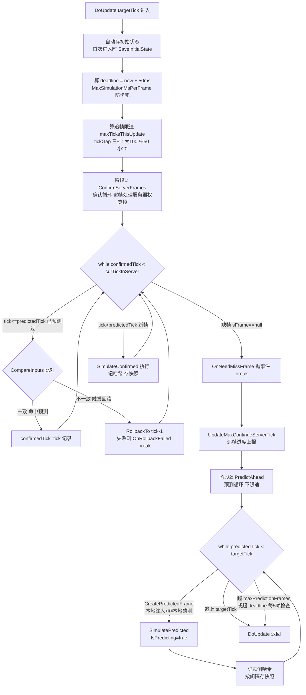
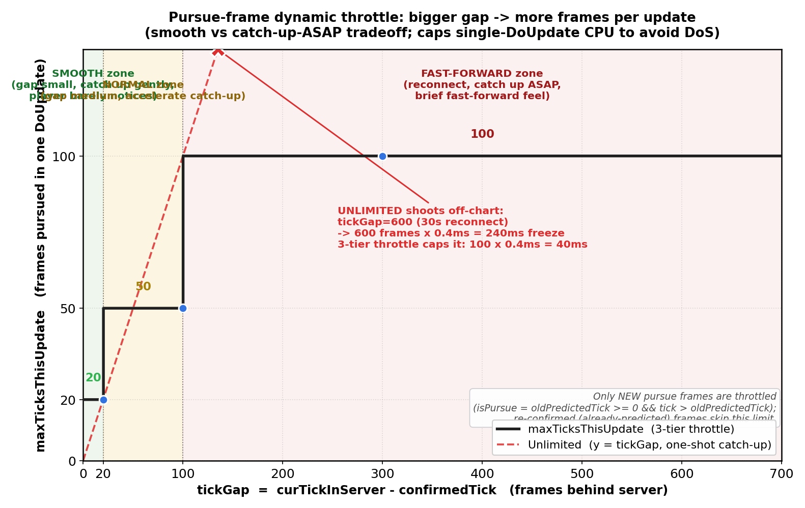
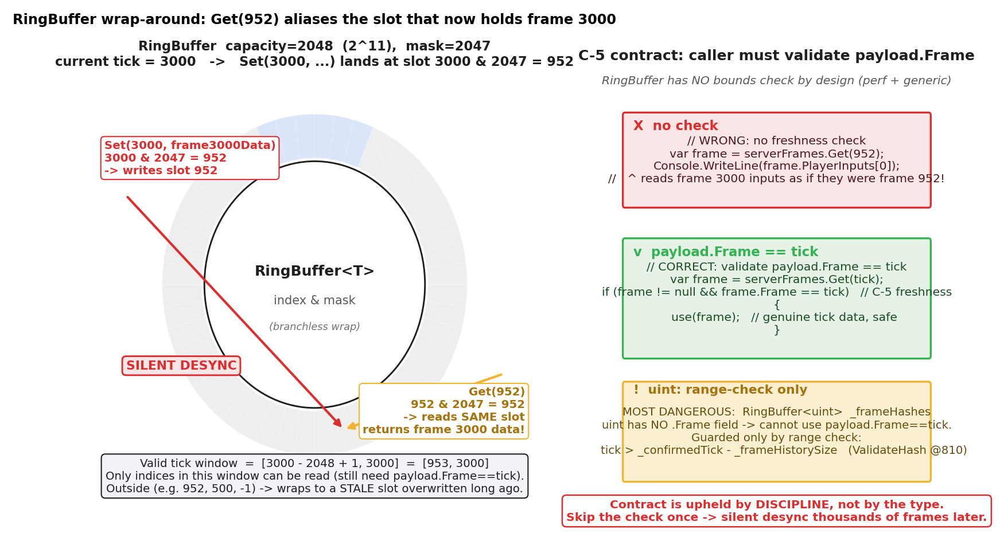

# 第 10 章 · LockstepController:预测回滚的实现主控

> **核心问题**:上一章(第 8 章)讲了预测,上上章(第 9 章)讲了回滚——两个动作分别是"先算"和"猜错了就倒带"。但这两个动作不是孤立的:预测出来的帧要存起来,等服务器权威帧到了要比对;比对发现猜错了,要找快照、恢复状态、重演到当前帧,然后还要接着预测。这一整套"什么时候检测、什么时候预测、追帧怎么限速、帧历史怎么存、快照怎么不爆 GC"的编排,需要一个组件把它们组织成一台机器。这一章就拆这台机器——`LockstepController`。它是前两章预测回滚机制的**实现载体**,也是第 3 篇的收口:预测和回滚的机制讲完了(P3-08/09),本章讲它们怎么协作落地。

> **读完本章你会明白**:
> 1. `LockstepController.DoUpdate(targetTick)` 的**两阶段编排**——ConfirmServerFrames(确认循环,逐帧比对服务器权威帧并按需回滚)与 PredictAhead(预测循环,本地向前预测),两个循环怎么接力、各自的节奏为什么不同。
> 2. **追帧动态限速**为什么分三档(差距 >100 用 100、>20 用 50、否则 20),以及 `MaxSimulationMsPerFrame=50` 这个时间预算为什么是防单帧 DoS 的兜底。
> 3. 四个 tick 字段(`_confirmedTick`/`_predictedTick`/`_curTickInServer`/`_maxContinueServerTick`)各自的语义,以及它们怎么共同描述"本地进度 vs 服务器进度"。
> 4. **RingBuffer** 为什么强制容量是 2 的幂、用位与取模(`index & _mask`)做环绕——无分支、无除法、O(1);以及它那个最容易踩坑的**时效性契约 C-5**:纯槽数组越界静默环绕到陈旧槽,框架不强制越界检查,靠调用方 `payload.Frame == tick` 纪律维系。
> 5. **Snapshot 的池化**(Frame/Hash/`byte[]? _data` 从 BufferPool.Rent 借,Dispose 幂等防双倍归还)怎么让"每帧存快照"不爆 GC。
> 6. **事件契约**设计:Controller 把"确认/回滚/desync/缺帧/追帧进度"全部做成事件,自己不耦合具体处理,让上层 Driver/游戏层订阅——这是 SDK 解耦的关键。

> **如果一读觉得太难**:先只记住三件事——① `DoUpdate` 是"先确认服务器帧(可能触发回滚),再向前预测"两个循环接力;② 帧历史存在一个 2 的幂容量的环形缓冲里,用位与取模绕回,但取出来的数据**必须**用帧号校验是不是陈旧的(这是 C-5 契约,踩坑会静默 desync);③ Controller 把所有"出错信号"做成事件往外抛,自己不管怎么处理,上层(Driver)决定要不要重连/弹窗。机制细节(预测/回滚本身)已在 P3-08/09 讲透,本章只管它们怎么被编排到一起,需要时再回来看。

---

## 〇、一句话点破

> **`LockstepController` 是把"预测"和"回滚"两个动作编排成一台机器的组件。它的核心是一个 `DoUpdate(targetTick)` 方法,内部两个循环接力:第一个循环 ConfirmServerFrames 逐帧处理已到的服务器权威帧(可能触发回滚——这在上上章讲透),追帧要限速(防画面倍速);第二个循环 PredictAhead 用本地输入向前预测(这在上章讲透),预测绝对不限速(防操作粘手)。帧历史(服务器帧/本地帧/快照/哈希)全部存在四个 RingBuffer 里——它们是容量为 2 的幂的纯槽数组,用位与取模环绕,无分支无除法,但越界会静默环绕到陈旧槽,靠调用方帧号校验维系正确(C-5 契约,回滚安全的隐形命脉)。快照从 BufferPool 池化借还,Dispose 幂等防双倍归还。所有异常信号(回滚/desync/缺帧/追帧进度)做成事件抛给上层,Controller 不耦合具体处理。**

这是结论。本章倒过来拆:先讲清"为什么需要一个 Controller 把两者编排起来"(朴素做法撞什么墙),再逐一拆 DoUpdate 两阶段、追帧限速、四个 tick 字段、RingBuffer、Snapshot 池化、事件契约这六个部件,最后单开一节拆透 RingBuffer 时效性契约 C-5——它是本章最容易踩坑、也是回滚安全最隐蔽的命脉。

---

## 一、为什么需要一个 Controller:两个动作不能各干各的

先回答一个朴素问题:预测和回滚分别有代码了,为什么还要一个 Controller?

### 1.1 朴素做法:预测器和回滚器分开

设想把预测和回滚做成两个独立组件——一个 `Predictor`(只管往前预测),一个 `RollbackHandler`(只管收到服务器帧时回滚)。听起来职责清晰。但只要写两行就发现它们**共享一堆状态**:

- 帧历史:预测器要查历史帧(LastInputPredictor 看 t-1 帧),回滚器重演时也要喂权威帧,两者读写的是**同一份帧历史**。
- tick 进度:预测器维护 `_predictedTick`,回滚器重演后要重置它;两者必须看到同一个 `_predictedTick`,不能各自存一份。
- 快照:回滚器要找快照恢复状态,但快照是**预测器推进时存的**(每帧 Tick 完按 SnapshotInterval 存)——存快照的时机和回滚找快照的时机耦合在一起。
- 标志位:预测时 `IsPredicting=true`,回滚重演时 `IsReplaying=true`,这两个标志的翻转时机必须和"哪个循环正在跑"严格对应——上上章的 C-6 bug 就是 `IsReplaying` 在某个 break 出口没复位,标志泄漏到下一帧,业务层副作用门控全乱。

也就是说,预测和回滚不是两个可以独立调度的动作,它们是**同一个状态机的两种转移**——共享同一份帧历史、同一组 tick 进度、同一套快照、同一组标志位。把它们拆成两个组件,等于把一个状态机的状态分到两个对象里,然后要用一堆同步代码维系一致性,反而更脆弱。

更具体地,设想两个独立组件会在这些点上撞墙:

- **预测器要存预测帧进 `_localFrames`,回滚器重演后要覆盖 `_localFrames` 的同一批槽位**。两个组件对 `_localFrames` 的写权限怎么协调?加锁?帧同步是单线程的,加锁是浪费。不加锁靠"调用顺序"?那顺序错了(预测器在回滚器还没覆盖完时就写了)就静默 desync。
- **回滚发生时,预测器刚预测的那批帧可能全废了**(基于错误输入算的)。回滚器要通知预测器"丢掉 tick X 之后的所有预测帧",预测器要重置自己的 `_predictedTick`。但 `_predictedTick` 又是确认循环的判据之一,两个组件改同一个字段,谁先谁后?
- **快照是预测器推进时存的(每帧 Tick 完按 SnapshotInterval 存),回滚器找快照时要用**。如果预测器和回滚器各跑各的,存快照的时机(预测器刚 Tick 完)和找快照的时机(回滚器收到权威帧)可能交错,快照池可能被两边同时操作,BufferPool 双倍归还风险陡增。

这些协调点每多一个,就多一个 desync 源。把它们收进一个类、一个 DoUpdate,所有状态在一个地方被读写,顺序由代码结构天然保证,从根上消灭了跨组件同步。

### 1.2 所以这么设计:一个 Controller 编排两者

`LockstepController` 把所有共享状态(帧历史、tick、快照、标志)收进一个类里,用**一个 `DoUpdate` 方法**把预测和回滚编排成两个连续的阶段。这样状态机是自洽的——`_predictedTick` 只在一个地方被改写,快照只在 Tick 完后存,标志位的翻转和循环的入口/出口严格对应。两个动作在同一个方法里接力,不存在跨组件同步问题。

> **不这样会怎样**:如果预测和回滚各做一个组件,共享状态(帧历史/tick/快照/标志)要在组件间同步。每加一处状态,就多一个"两个组件对它的视图不一致"的 desync 源。把所有状态收进一个 Controller、一个 DoUpdate 编排两个阶段,从源头消灭跨组件同步。

> **承接 P3-08/09**:这一节只是说清楚"为什么需要一个 Controller"。预测本身的机制(为什么要预测、预测深度、三套预测器、输入掩码隔离)在**第 8 章**讲透;回滚本身的机制(五步、快照+重演、SnapshotInterval、七条纪律)在**第 9 章**讲透。本章不重复这两套机制,只聚焦它们怎么被 `LockstepController` 编排协作——本章之后,第 3 篇收口。

### 1.3 Controller 的字段全景:它管了什么

在拆 DoUpdate 之前,先把 Controller 的"家底"列清楚——它持有哪些状态(`LockstepController.cs:18-127`)。看一遍字段,就能知道这台机器要维系什么:

```csharp
// LockstepController.cs:18-127 (字段精选, 简化示意)

public sealed class LockstepController : IDisposable
{
    // 配置(构造时定死)
    private readonly int _snapshotInterval;        // 快照间隔, 默认 1(每帧存)
    private readonly int _maxPredictionFrames;     // 预测深度上限, 默认 30
    private readonly int _frameHistorySize;        // 帧历史窗口, 默认 2000
    private const int MaxSimulationMsPerFrame = 50;// 每帧最多模拟 50ms 防卡死

    // 策略
    private readonly IInputPredictor _inputPredictor;  // 预测器(默认 LastInput)
    private IInputProvider? _localInputProvider;       // 本地输入提供者
    private int _localPlayerId = -1;                   // 本地玩家ID, -1=无本地(观战)

    // 状态:四个 tick
    private readonly ISimulation _simulation;
    private int _confirmedTick;            // 已用服务器权威帧确认到第几帧
    private int _predictedTick;            // 已预测算到第几帧
    private int _maxContinueServerTick = -1; // 服务器帧连续可达的最远帧号
    private int _curTickInServer = -1;     // 收到的最大服务器帧号(可能不连续)

    // 帧历史:四个 RingBuffer
    private readonly RingBuffer<FrameData?> _serverFrames;  // 服务器权威帧
    private readonly RingBuffer<FrameData?> _localFrames;   // 本地(预测/确认)帧
    private readonly RingBuffer<Snapshot?>  _snapshots;     // 状态快照
    private readonly RingBuffer<uint>       _frameHashes;   // 每帧状态哈希

    // 初始状态(回滚到 tick=-1 的基准)
    private byte[]? _initialState;
    private uint _initialStateHash;

    // 事件契约(7 个, 详见第五节)
    public event Action<int, FrameData, string?>? OnFrameConfirmed;
    public event Action<int, int>? OnRollback;
    public event Action<int, uint, uint>? OnDesync;
    public event Action<int>? OnRollbackFailed;
    public event Action<float>? OnPursueFrameProgress;
    public event Action? OnPursueFrameDone;
    public event Action<int>? OnNeedMissFrame;
}
```

这个字段表是本章的地图。后面六节会逐一拆它们:四个 tick(第二节)、四个 RingBuffer(第四节)、Snapshot 池化(第六节)、事件契约(第五节)、DoUpdate 两阶段(第三节)把它们全编排起来。

> **钉死这件事**:Controller 持有 4 个 tick + 4 个 RingBuffer + 1 个初始状态 + 7 个事件。预测和回滚共享所有这些状态,所以必须在一个组件里编排——本章剩下的小节就是讲这台机器怎么转。

---

## 二、四个 tick:本地进度 vs 服务器进度的精确描述

拆 DoUpdate 之前,必须先把"四个 tick"的语义钉死——它们是 Controller 状态机的核心,任何一个理解错,后面的循环都看不懂。

### 2.1 为什么需要四个 tick

帧同步的核心难点在于:**本地的进度和服务器进度不是同一个东西**。本地可能领先(预测超前),可能落后(网络延迟,服务器帧还没到),还可能不连续(收到帧 100、101、105 但缺 102-104)。要精确描述"我在哪、服务器在哪、我和它差多少",光一个"当前帧"远远不够。

LockstepController 用四个 tick 字段共同描述这个状态:

| 字段 | 含义 | 谁更新它 |
|---|---|---|
| `_confirmedTick` | 已用**服务器权威帧**确认并执行到第几帧 | ConfirmServerFrames 循环推进 |
| `_predictedTick` | 已**预测算**(或确认算)到第几帧,总是 >= `_confirmedTick` | PredictAhead 推进,回滚时被重置 |
| `_curTickInServer` | 收到的**最大**服务器帧号(不管连不连续) | PushServerFrame 时取 max |
| `_maxContinueServerTick` | 从 0 起服务器帧**连续不断**可达的最远帧号 | UpdateMaxContinueServerTick 增量扫描 |

这四个值的关系是理解 DoUpdate 一切分支的前提。逐一拆。

### 2.2 `_confirmedTick`:已经"对过账"的进度

`_confirmedTick` 是"本地已经用服务器权威输入执行过的最远帧"。什么叫"对过账"?就是这一帧的输入来自服务器广播的权威帧(`_serverFrames` 里取的),不是本地猜的。这个值是**回滚检测的分水岭**:服务器帧只要落在 `_confirmedTick < tick <= _predictedTick`,就说明这一帧本地之前预测算过,要和权威帧比对——比对一致叫"命中预测",不一致就要回滚。

初始值 -1,表示"一帧都没确认"。每次 ConfirmServerFrames 循环里执行完一帧就 `_confirmedTick = tick`(:431)。回滚成功后会被重置为 `_predictedTick`(:395,因为 `_predictedTick` 被回滚重置到了快照点),下一轮循环从快照点重新跑。

### 2.3 `_predictedTick`:本地"算到哪了"

`_predictedTick` 是"本地逻辑已经推进到的最远帧",不管用的是预测输入还是权威输入。它总是 >= `_confirmedTick`(预测超前于确认)。这个值是**预测循环的终止条件**——PredictAhead 的 `while (_predictedTick < targetTick)` 一直跑到追上 targetTick。

它和 `_confirmedTick` 的差叫**预测深度**(`PredictionCount` 属性,:86),正是上一章讲的"用帧数衡量的 RTT"。预测深度有上限 `_maxPredictionFrames`(默认 30),从源头限制了"一次回滚最多重演多少帧"。

回滚发生时,`_predictedTick` 被 `RollbackTo` 重置到快照点的真实帧号(`:677 _predictedTick = actualRollbackTick`,注意用的是 `snapshot.Frame` 不是传入的 tick,因为快照可能比目标更早)。这是"倒带"的核心动作——把预测进度倒回去。

### 2.4 `_curTickInServer`:收到的最大服务器帧号(不管连续性)

`_curTickInServer` 是"我见过的最大服务器帧号"。它不管连续性——收到帧 100、101、105(缺 102-104)时,`_curTickInServer = 105`。这个值是**DoUpdate 确认循环的终止上界**:`while (_confirmedTick < _curTickInServer)`(:358)一直跑到本地确认进度追上见过的最大服务器帧。

但注意:这个终止条件是"追到见过的最大帧号",不是"追到连续不断的最远帧"。如果中间有缺帧(102-104 没到),循环在取 102 帧时 `sFrame == null`(:363),触发 `OnNeedMissFrame?.Invoke(tick)` 抛缺帧事件,然后 break——因为缺帧没法执行,只能等上层(Driver)去请求补帧。

### 2.5 `_maxContinueServerTick`:连续可达的最远帧

这是四个 tick 里最容易被忽略、但对"缺帧处理"至关重要的一个。`_maxContinueServerTick` 是"从 0 起,服务器帧连续不断(没有空洞)能到达的最远帧号"。比如收到 100、101、105,缺 102-104,那 `_maxContinueServerTick = 101`(102 是第一个空洞,连续性在 101 断掉)。

这个值由 `UpdateMaxContinueServerTick`(:236-254)维护,从"当前连续点或确认点 + 1"开始增量往前扫,只要槽位非空且帧号匹配(`frame.Frame != tick` 即遇到陈旧槽或空洞)就停:

```csharp
// LockstepController.cs:236-254 (简化)
private void UpdateMaxContinueServerTick()
{
    int tick = Math.Max(_maxContinueServerTick, _confirmedTick) + 1;
    int maxSearchTick = Math.Min(_curTickInServer + 1, _confirmedTick + _frameHistorySize);
    while (tick <= maxSearchTick)
    {
        var frame = _serverFrames.Get(tick);
        if (frame == null || frame.Frame != tick)   // ★ 帧号校验防陈旧槽(C-5)
            break;
        tick++;
    }
    _maxContinueServerTick = tick - 1;
}
```

注意那个 `frame.Frame != tick` 校验——它就是 C-5 时效性契约的体现:RingBuffer 是纯槽数组,过旧的 index 会环绕到陈旧槽,必须靠 payload 自带的帧号辨别真伪。`GetNextNeededTick()`(:863-866)返回 `_maxContinueServerTick + 1`,正是上层"该去请求哪个缺帧"的依据。

> **钉死这件事(四个 tick)**:Controller 用四个 tick 精确描述进度——`_confirmedTick`(确认到哪)、`_predictedTick`(算到哪)、`_curTickInServer`(见过最大服务器帧,不管连续)、`_maxContinueServerTick`(连续可达最远帧)。回滚检测的分水岭是 `_confirmedTick < tick <= _predictedTick`(预测过的帧要比对);缺帧检测的分水岭是 `_maxContinueServerTick`(连续性在这里断)。四个值缺一不可,任何一个理解错都看不懂 DoUpdate。

---

## 三、DoUpdate 两阶段编排:确认循环与预测循环怎么接力

现在拆 Controller 的心脏:`DoUpdate(targetTick)`(:307-340)。这是每个渲染帧(由 Driver)调一次的主入口,内部两个循环接力。

### 3.1 两阶段的整体形状

先用一张图把两阶段的整体形状画出来,后面逐段拆细节。



这张图是本章的核心心智模型。两阶段的关键区别在节奏:ConfirmServerFrames **限速**(追帧要匀速,防倍速播放),PredictAhead **不限速**(预测要即时,防操作粘手)。这个区别上一章(P3-08 第五节)讲过为什么,本章只看它怎么落到代码。

### 3.2 阶段零:deadline 与追帧限速的计算

进入两个循环之前,DoUpdate 先算两个"预算"(:317-325):

```csharp
// LockstepController.cs:317-326 (简化)
var deadline = DateTimeOffset.UtcNow.ToUnixTimeMilliseconds() + MaxSimulationMsPerFrame;  // 50ms 预算
int oldPredictedTick = _predictedTick;
bool wasPursuing = IsPursueFrame;

// 动态追帧限速:差距越大允许越多
int tickGap = _curTickInServer - _confirmedTick;
int maxTicksThisUpdate = tickGap > 100 ? 100 : (tickGap > 20 ? 50 : 20);
ConfirmServerFrames(oldPredictedTick, deadline, maxTicksThisUpdate);
```

**deadline**:`now + 50ms`。这是一次 DoUpdate 的总时间预算,ConfirmServerFrames 和 PredictAhead **共享**。任何一方超时都要 break,剩余工作留到下一次 DoUpdate。这 50ms 是防"单帧卡死"的兜底——下一节专门讲它为什么是命门。

**追帧限速 maxTicksThisUpdate**:根据 `tickGap`(服务器进度和本地确认进度的差距)动态算——差距 < 20 帧每次最多追 20 帧,20-100 帧每次最多 50 帧,> 100 帧每次最多 100 帧。**差距越大,允许每次追的帧数越多**。这个反直觉的设计后面专门拆(技巧精解)。



> **图 10-2 图说**:横轴是 `tickGap = _curTickInServer - _confirmedTick`(本地落后服务器多少帧),纵轴是 `maxTicksThisUpdate`(本次 DoUpdate 最多追多少帧)。曲线是阶梯状三档:tickGap ≤ 20 时 maxTicks=20(平滑区)、20 < tickGap ≤ 100 时 maxTicks=50(正常区)、tickGap > 100 时 maxTicks=100(快进区)。用阴影标出三个区:绿色"平滑区"(差距小,匀速追,玩家几乎无感)、黄色"正常区"(差距中,加速追)、红色"快进区"(断线重连,尽快追完,体感是短暂快进)。再画一条参考线"无限速"(y=x,即一口气追完),标出它会在 tickGap=600 时卡 240ms(追帧 DoS),对比三档限速把单次 CPU 压在可控范围。英文标注:tickGap (frames behind) / maxTicksThisUpdate / Smooth zone / Normal zone / Fast-forward zone / Unlimited (DoS risk)。

注意 `oldPredictedTick`——它记的是"本次 DoUpdate 开始时的预测帧号",用来在确认循环里区分"这帧之前预测算过了(重演,标 IsReplaying)"和"这帧是新追的"。回滚发生后它**不能更新**(:396 注释明确写了),否则重演的帧会被错判成"新帧",IsReplaying 门控失效(呼应上上章 C-6)。

### 3.3 阶段一:ConfirmServerFrames 确认循环

这是 DoUpdate 的第一个循环,负责"处理所有已到的服务器权威帧"。它的完整逻辑很长(:348-469),但核心是一个 `while (_confirmedTick < _curTickInServer)` 循环,每轮处理一帧。把循环体里"三岔路口"的结构画清楚:

```csharp
// LockstepController.cs:358-462 (骨架, 突出三岔路口)
try
{
    while (_confirmedTick < _curTickInServer)
    {
        int tick = _confirmedTick + 1;
        var sFrame = _serverFrames.Get(tick);

        // 出口1: 缺帧(槽空或帧号不符 → C-5 陈旧槽)
        if (sFrame == null || sFrame.Frame != tick)
        {
            OnNeedMissFrame?.Invoke(tick);
            break;
        }

        // 追帧限速判断(新追帧才限速, 重调度/初始不限速)
        bool isPursue = oldPredictedTick >= 0 && tick > oldPredictedTick;
        if (isPursue && pursueTicksExecuted >= maxTicksThisUpdate) break;

        // 三岔路口
        if (tick <= _predictedTick)
        {
            // 这帧本地预测算过了 → 比对
            var localFrame = GetLocalFrame(tick);
            if (localFrame == null || !CompareInputs(sFrame, localFrame))
            {
                // 分支A: 预测错了 → 回滚
                _simulation.IsReplaying = true;
                if (!RollbackTo(tick - 1)) { OnRollbackFailed?.Invoke(tick); break; }
                _confirmedTick = _predictedTick;   // 重置进度, 从快照点重新循环
                continue;
            }
            else
            {
                // 分支B: 命中预测 → 直接确认
                _simulation.IsReplaying = false;
                _confirmedTick = tick;
                _localFrames.Set(tick, sFrame);
                // 用快照哈希同步 _frameHashes(因为 Simulation 状态已超前, 不能现算)
                OnFrameConfirmed?.Invoke(tick, sFrame, snapshot?.DebugState);
                continue;
            }
        }

        // 分支C: 新帧(tick > _predictedTick)→ 执行
        _simulation.IsReplaying = tick <= oldPredictedTick;   // 重演帧标 replay
        _localFrames.Set(tick, sFrame);
        SimulateConfirmed(sFrame);
        _confirmedTick = tick;
        if (tick > _predictedTick) { _predictedTick = tick; pursueTicksExecuted++; }
        _simulation.IsReplaying = false;

        // 记哈希 + 按间隔存快照
        uint hash = _simulation.ComputeHash();
        _frameHashes.Set(tick, hash);
        if (ShouldSaveSnapshot(tick)) WritePooledSnapshot(tick, hash, debugState);

        OnFrameConfirmed?.Invoke(tick, sFrame, debugState);
        if (tick % 5 == 0 && now > deadline) break;
    }
}
finally
{
    // C-6:任意出口复位 IsReplaying=false
    _simulation.IsReplaying = false;
}
```

三岔路口的判据是 `tick <= _predictedTick`(这帧本地预测算过吗):

- **分支 A(预测错了 → 回滚)**:`tick <= _predictedTick` 且 `CompareInputs` 不一致。这正是上上章(第 9 章)讲的回滚触发条件。回滚成功后 `_confirmedTick = _predictedTick`(:395,此时 `_predictedTick` 已被 `RollbackTo` 重置到快照点),`continue` 回到循环顶部,从快照点重新执行——重演的帧 `tick <= oldPredictedTick` 会被标 `IsReplaying=true`(:427),业务层据此门控副作用。
- **分支 B(命中预测 → 直接确认)**:`tick <= _predictedTick` 且 `CompareInputs` 一致。这是预测最理想的 outcome——本地之前预测算的那一帧和权威结果完全一致,**啥也不用重算**,直接 `_confirmedTick = tick`。注意这里有个微妙点(:409-417 注释):命中预测时**不能现算当前哈希**,因为 Simulation 的状态已经超前到 `_predictedTick`(早就预测算过去了),这时 `ComputeHash` 算的是 `_predictedTick` 时刻的状态,不是 `tick` 时刻的。所以用快照里存的哈希同步 `_frameHashes`,保证不同执行路径哈希一致。
- **分支 C(新帧 → 执行)**:`tick > _predictedTick`,这帧本地还没算过,正常执行 `SimulateConfirmed`,推进 `_confirmedTick` 和 `_predictedTick`。这是追帧或网络好(预测深度=0)时的正常路径。

> **承接 P3-09**:回滚分支 A 的完整机制(检测 → 找快照 → 恢复 → 重演 → 续接)、`RollbackTo` 怎么找快照、为什么加载快照后立即校验哈希,在**第 9 章**讲透。本章只看它在确认循环里的"位置"——它是三岔路口的一支,和命中预测、新帧执行并列。

整个循环外面包着 `try/finally`(:356-368, :464-468),`finally` 里无条件 `_simulation.IsReplaying = false`。这是 C-6 bug 的修复——原版只在分支 C 的末尾(:440)复位 IsReplaying,如果循环从 break 出口(缺帧/追帧上限/deadline/回滚失败)跳出,复位被跳过,标志残留到下一帧,业务层副作用门控全乱。try/finally 保证任意出口都复位。这是"标志位必须有明确生命周期"的血泪教训,上上章详述。

### 3.4 阶段二:PredictAhead 预测循环

确认循环跑完后(要么追上 `_curTickInServer`,要么 break 出来),DoUpdate 进入第二个循环 PredictAhead(:498-525):

```csharp
// LockstepController.cs:498-525 (简化)
private void PredictAhead(int targetTick, long deadline)
{
    while (_predictedTick < targetTick)
    {
        if (_predictedTick - _confirmedTick >= _maxPredictionFrames) break;  // 硬上限 30

        int tick = _predictedTick + 1;
        var frame = GetLocalFrame(tick) ?? CreatePredictedFrame(tick);  // 预测帧(本地注入+非本地猜测)
        _localFrames.Set(tick, frame);

        SimulatePredicted(frame);   // IsPredicting=true(try/finally 复位)
        _predictedTick = tick;

        uint pHash = _simulation.ComputeHash();
        _frameHashes.Set(tick, pHash);

        if (ShouldSaveSnapshot(tick)) WritePooledSnapshot(tick, pHash, debugState);

        if (tick % 5 == 0 && now > deadline) break;
    }
}
```

这个循环和确认循环长得像(都是 while + 每轮一帧),但三个关键区别:

**区别一:终止条件不同**。确认循环终止于 `_confirmedTick == _curTickInServer`(追上服务器进度),预测循环终止于 `_predictedTick == targetTick`(追上 NetworkClock 算出的"现在应该在的帧号")。targetTick 通常比 `_curTickInServer` 大(预测领先),所以预测循环总是把 `_predictedTick` 推到比服务器进度更前。

**区别二:限速不同**。确认循环有 `maxTicksThisUpdate` 限速(追帧匀速),预测循环**绝对不限速**——唯一的上限是 `_maxPredictionFrames`(硬上限 30,防猜到天涯海角)和 deadline(防卡死)。这个区别上一章(第 8 章第五节)讲透:预测限速就退回"等服务器"的卡顿,操作粘手;追帧限速是防画面倍速。两者目的相反,绝不能混用同一套节奏。

**区别三:输入来源不同**。确认循环用的是 `_serverFrames.Get(tick)`(服务器权威帧),预测循环用的是 `CreatePredictedFrame(tick)`(本地玩家实时注入 + 非本地玩家用预测器猜)。`CreatePredictedFrame` 的输入掩码隔离逻辑在第 8 章讲透(:567-613),本章不重复。

注意预测循环也存快照(`WritePooledSnapshot`)——这是为了让回滚能找到预测帧的快照点。SnapshotInterval=1 时每帧(预测帧和确认帧都)存,回滚时 `FindSnapshot` 几乎总能找到精确快照。预测帧也记哈希(`_frameHashes.Set`),为命中预测时(确认循环分支 B)的哈希一致性兜底。

> **钉死这件事(两阶段)**:DoUpdate = ConfirmServerFrames(确认循环,限速,三岔路口:回滚/命中/新帧)+ PredictAhead(预测循环,不限速,本地注入+非本地猜测)。两阶段共享 deadline 预算和同一组 tick/RingBuffer。确认循环外包 try/finally 保证 IsReplaying 复位(C-6 修复)。回滚和预测的机制本身在 P3-09/08 讲透,本章只看它们怎么被这两个循环编排。

---

## 四、追帧动态限速与 MaxSimulationMsPerFrame:两道防卡死防线

确认循环里的追帧限速和全局的 deadline,是 Controller 防"单帧卡死"的两道防线。这道防线为什么是命门,要单独拆。

### 4.1 不限速会撞什么墙:追帧 DoS

设想两个极端场景。

**场景一:断线重连追帧**。玩家断线 30 秒后重连,服务器一次性把缺失的 600 帧(30 秒 × 20fps)补发过来。如果确认循环不限速(一次性追完 600 帧),这一次 DoUpdate 要做 600 次 Tick。按 TankGame 5000 实体基准(每帧 Tick 约 0.4ms,第 22 章数据),600 帧 = 240ms。这一次 DoUpdate 卡 240ms,渲染帧率从 60fps 暴跌到 4fps,玩家看到的是"画面冻结 240ms 然后突然跳到当前"。这叫**追帧 DoS**——追帧本身把主线程卡死了。

**场景二:回滚风暴**。网络抖动,几乎每个服务器权威帧都和预测对不上,每帧都触发回滚。一次回滚要重演 N 帧,连续多次回滚,CPU 直接打满,渲染帧率暴跌,玩家感觉"卡成幻灯片"。

这两个场景的共同点是:**一次 DoUpdate 试图做太多逻辑帧的 CPU 工作,把渲染帧的时间预算(16ms)吃光了**。帧同步最怕单帧 CPU 峰值——它会让所有客户端的节奏错乱(某个客户端卡一下,它的本地逻辑帧号就和别人错位,后续全乱)。

### 4.2 防线一:追帧动态限速(三档)

第一道防线是确认循环的 `maxTicksThisUpdate`(:323-325):

```csharp
int tickGap = _curTickInServer - _confirmedTick;
int maxTicksThisUpdate = tickGap > 100 ? 100 : (tickGap > 20 ? 50 : 20);
```

差距越大,允许每次追的帧数越多。这个设计乍看反直觉——"差得多不是应该追得慢点吗?"。其实不然,要分两面看:

- **追帧必须限速**(不能一口气追完),否则就是上面的追帧 DoS,画面冻结。
- **但限速太狠也不行**——如果落后 600 帧每次只追 20 帧,要 30 次 DoUpdate(30 个渲染帧 = 500ms)才能追完,玩家看到"坦克慢慢加速"半秒才到正常速度,体感很差。

所以三档的意图是:**差距小时匀速追(每次 20 帧,平滑),差距大时加速追(每次 100 帧,尽快回到正常)**。这是一个"平滑 vs 尽快"的权衡——差距小的时候,玩家几乎察觉不到加速,保持平滑;差距大的时候(断线重连),玩家已经在等了,宁可画面快进一点也要尽快追上。100 帧/次 @ 20fps = 2000 帧/秒的追帧速率,500ms 能追完 600 帧,体感是"短暂快进",比"冻结 240ms"好得多。

而且这个限速**只对新追帧生效**(`isPursue = oldPredictedTick >= 0 && tick > oldPredictedTick`,:374)。如果 tick 落在 `oldPredictedTick` 以内(重调度,之前预测算过的帧重新确认),不限速——因为这些帧的 Simulation 状态已经超前算过了,确认它们只是走"命中预测"分支 B,不重新 Tick,代价极低。

> **承接 P3-09**:回滚风暴的完整防线(追帧限速 + MaxSimulationMsPerFrame + `_maxPredictionFrames` + 网络时钟硬边界)在**第 9 章第三节**讲过。本章只补"追帧限速三档为什么这么设计"这一块。

### 4.3 防线二:MaxSimulationMsPerFrame 时间预算

第二道防线是全局的 `MaxSimulationMsPerFrame = 50`(:27)。它给一次 DoUpdate 一个 50ms 的总时间预算,两个循环共享:

```csharp
var deadline = DateTimeOffset.UtcNow.ToUnixTimeMilliseconds() + MaxSimulationMsPerFrame;  // :317
```

确认循环和预测循环里,每 5 帧检查一次时间(:461, :523):

```csharp
if (tick % 5 == 0 && DateTimeOffset.UtcNow.ToUnixTimeMilliseconds() > deadline) break;
```

超了就 break,剩余工作留到下一次 DoUpdate。这是**防单帧卡死的兜底**——正常情况预测深度就几帧(几毫秒),根本碰不到 deadline;只有极端场景(断线重连追 600 帧 + 同时回滚风暴)才会触发。

为什么是 50ms?这要和帧率一起看。逻辑帧 20fps(每帧 50ms),渲染帧 60fps(每帧 16.6ms)。50ms 的预算 ≈ 3 个渲染帧的时间。也就是说,即使最坏情况某次 DoUpdate 把 50ms 吃满,玩家看到的最多是"3 帧卡顿"(50ms),而不是"冻结 240ms"。50ms 是可接受的——人眼对 50ms 以内的卡顿几乎无感,但对 200ms+ 的冻结非常敏感。

为什么每 5 帧检查一次,不每帧检查?因为 `DateTimeOffset.UtcNow.ToUnixTimeMilliseconds()` 是系统调用,有开销(几十纳秒到几微秒)。逐帧查太贵,5 帧一查够用——50ms 预算内 5 帧的误差(5 × 0.4ms = 2ms)可忽略。这是一个典型的"精度 vs 性能"权衡,把系统调用摊薄到每 5 帧一次。

> **钉死这件事(两道防线)**:追帧动态限速(三档:差距小用 20、中用 50、大用 100)+ MaxSimulationMsPerFrame=50ms 时间预算,共同防"单帧卡死"。前者防画面倍速(匀速追帧),后者防极端场景的 CPU 峰值(断线重连追 600 帧 + 回滚风暴)。两者都是"宁可分摊到多个渲染帧,也不让一次 DoUpdate 卡死主线程"。

---

## 五、事件契约:Controller 不耦合具体处理

Controller 对外暴露 7 个事件(:75-81)。这一节讲为什么把所有异常信号做成事件,而不是直接处理。

### 5.1 为什么做成事件

设想反面:如果 Controller 收到缺帧(`_serverFrames.Get(tick) == null`)时,直接调 `_driver.RequestMissFrames(tick)` 去请求补帧——那 Controller 就要持有 Driver 的引用,或者至少知道"怎么发请求"。但发请求是个网络动作(限流、去重、选传输层),这些全是上层(Driver/Network)的职责,不是 Controller 该管的。Controller 是**纯逻辑层**组件,它不该知道网络长什么样。

所以 Controller 把"我发现缺帧了"这个信号做成事件 `OnNeedMissFrame?.Invoke(tick)`,自己不管怎么处理。上层(Driver)订阅这个事件,在事件处理函数里决定:限流(每秒最多 2 次请求)、去重(同一帧不重复请求)、发 `MissFrameRequestMessage`。Controller 只负责"检测到异常并通知",Driver 负责"决定怎么应对"。这是**关注点分离**——Controller 保持纯逻辑,网络策略由上层注入。

> **钉死这件事(事件契约的设计意图)**:Controller 是纯逻辑层,不该耦合网络/重连/弹窗这些上层策略。所有"异常信号"(缺帧/desync/回滚失败/追帧进度)做成事件抛出去,由上层订阅处理。这让 Controller 可以独立测试(不依赖网络栈),也让上层策略可替换(换个 Driver 就能换一套应对策略)。

### 5.2 七个事件逐一拆

| 事件 | 触发时机 | 参数语义 | 上层典型应对 |
|---|---|---|---|
| `OnFrameConfirmed` | 确认循环里每确认一帧(三个分支都会触发) | (tick, sFrame, debugState?) | 游戏层采样逻辑状态做插值(第 11 章) |
| `OnRollback` | `RollbackTo` 成功后 | (fromTick=`_predictedTick`回滚前, toTick=快照点) | 表现层记录跳变量,用 Visual Offset 吸收(第 11 章) |
| `OnDesync` | `ValidateHash` 发现本地哈希 ≠ 服务器哈希 | (tick, localHash, serverHash) | 上层决定继续/重连/落盘诊断(第 23/25 章) |
| `OnRollbackFailed` | `RollbackTo` 返回 false(找不到快照/坏快照) | (tick) | **比 desync 更严重**,通常触发重连或重置 |
| `OnPursueFrameProgress` | 确认循环后仍在追帧 | (progress 0~1 = confirmedTick/curTickInServer) | UI 显示追帧进度条 |
| `OnPursueFrameDone` | 进入 DoUpdate 时在追帧,确认循环后追完了 | () | UI 隐藏进度条,表现层恢复正常插值 |
| `OnNeedMissFrame` | 确认循环取服务器帧发现槽空或帧号不符 | (tick) | Driver 限流+去重后发 MissFrameRequest |

几个关键点:

**`OnRollbackFailed` 和 `OnDesync` 为什么分开**。desync 是"状态对不上但还能继续跑"(哈希校验失败,但 Simulation 还能 Tick,只是结果可能分叉),上层可以选择继续跑(等下一次校验)或重连。rollback failed 是"连回滚都做不下去"——找不到快照或快照坏了,Controller 无法自我修正,状态彻底失控。这两个严重程度不同,应对策略不同(继续 vs 立即重连),所以分成两个事件。

**`OnRollback` 的两个参数**。`fromTick` 是"回滚前的预测帧号",`toTick` 是"实际回滚到的快照帧号"。注意 `toTick` 可能比请求的 tick 更早(快照隔几帧存,FindSnapshot 找到更早的)——表现层用这两个值算"这次回滚跳了多少帧",决定 Visual Offset 的衰减幅度(第 11 章)。

**`OnPursueFrameProgress` 和 `OnPursueFrameDone` 的配合**。`IsPursueFrame` 是个纯计算属性(`_curTickInServer - _confirmedTick > 1`,:88),没有独立字段维护。进入 DoUpdate 时记下 `wasPursuing`(:319),确认循环后比较:`wasPursuing && !IsPursueFrame` 说明"刚追完",触发 Done;`IsPursueFrame` 仍 true 则报 progress。这让 UI 能显示"追帧中 30% → 50% → 100% → 完成"的进度。

### 5.3 事件契约让 Controller 可独立测试

把异常信号做成事件的一个直接收益:**Controller 可以不带网络栈独立测试**。单元测试时,构造一个 Controller,喂几个 `PushServerFrame`,调 `DoUpdate`,然后断言"触发了 OnRollback(from=105, to=100)"或"触发了 OnNeedMissFrame(103)"。不需要真的连服务器,不需要 Driver。这让 Controller 的测试覆盖率高、跑得快——这是 SDK 化的关键收益(第 18 章详讲)。

### 5.4 一个事件流的完整追踪:OnNeedMissFrame 从 Controller 到网络

为了把"事件契约怎么解耦"讲具体,追踪一个 `OnNeedMissFrame` 从触发到落到网络的全过程:

1. **Controller 检测到缺帧**。ConfirmServerFrames 循环取 `_serverFrames.Get(103)`,槽空或帧号不符(C-5 陈旧槽),`OnNeedMissFrame?.Invoke(103)`(:365)。
2. **Driver 订阅了这个事件**。Driver 初始化时 `_controller.OnNeedMissFrame += HandleNeedMissFrame`。事件触发时,Driver 的 `HandleNeedMissFrame(103)` 被调。
3. **Driver 做策略决策**。`HandleNeedMissFrame` 里:① 去重——如果 103 已经请求过(记在 `_requestedMissFrames` 集合里),直接 return;② 限流——`_missFrameLimiter.TryAcquire()`(Token Bucket,每秒 2 次),拿不到令牌也 return(等下一次);③ 都过了,构造 `MissFrameRequestMessage{ Tick = 103 }`,发 `_client.Send(msg)`。
4. **网络层把消息送到服务器**。服务器 `MissFrameHandler` 收到,从 GameRoom 的 `_historyBuffer` 取帧 103,回 `MissFrameResponseMessage`。
5. **客户端收到补帧,Push 回 Controller**。Driver 的网络回调(在跨线程命令队列里)收到 `MissFrameResponseMessage`,下一帧 Update 顶部消费,调 `_controller.PushServerFrames(response.Frames)`,把帧 103 塞进 `_serverFrames`。
6. **下一次 DoUpdate,Controller 不再缺帧**。ConfirmServerFrames 循环再次到 tick=103,这次 `_serverFrames.Get(103)` 拿到真帧,继续执行。

这个流程里,Controller 只做了第 1 步(检测 + 抛事件),其余 5 步全是 Driver/网络的职责。Controller 不知道"限流""去重""传输层""服务器"这些概念,它只管"我缺帧了,通知一声"。这正是事件契约的价值——**Controller 保持纯逻辑,策略由上层注入**。如果将来要把"每秒 2 次"限流改成"每秒 5 次",或者换一种补帧策略(比如批量请求),只改 Driver,Controller 一行不动。这种可替换性是 SDK 化的核心(第 18 章)。

---

## 六、RingBuffer:2 的幂 + 位与取模,以及时效性契约 C-5

这一节拆 Controller 里最底层、也最容易踩坑的数据结构——`RingBuffer<T>`。四个 RingBuffer(服务器帧/本地帧/快照/哈希)都用它。它有两个招牌特性:① 容量强制 2 的幂 + 位与取模(性能);② 时效性契约 C-5(纯槽数组越界静默环绕,靠调用方纪律维系)。

### 6.1 为什么用环形缓冲:帧历史是"滑动窗口"

帧同步要存"最近的帧历史"——服务器帧、本地预测帧、快照、哈希。这些数据有两个特点:

- **按帧号直接寻址**:要查 tick=100 的服务器帧,直接 `serverFrames[100]`,不想遍历。
- **滑动窗口**:只关心最近 N 帧(默认 2000),太老的帧(比如 5000 帧前的)没用了,可以被覆盖。

这两个特点指向**环形缓冲**(ring buffer):一个固定大小的数组,按 `index % capacity` 寻址。新数据覆盖旧数据,容量固定不增长。比起 `Dictionary<int, FrameData>`(哈希表,有哈希计算 + 桶开销),环形缓冲用一次取模就能寻址,快得多。

### 6.2 为什么容量强制 2 的幂:位与取模替除法

`RingBuffer` 构造时(:32-40)把容量强制向上取整到 2 的幂:

```csharp
// RingBuffer.cs:32-40
public RingBuffer(int capacity)
{
    _capacity = 1;
    while (_capacity < capacity) _capacity <<= 1;   // 向上取整到 2 的幂
    _mask = _capacity - 1;                            // 掩码
    _buffer = new T[_capacity];
}
```

请求 2000 容量,实际分配 2048(下一个 2 的幂)。浪费 48 个槽位,换来一个巨大的性能收益:**取模运算可以用位与替代**。

```csharp
// RingBuffer.cs:42-57
[MethodImpl(MethodImplOptions.AggressiveInlining)]
private int GetIndex(int index)
{
    // ... DEBUG 负索引告警 ...
    return index & _mask;     // ★ 位与替取模
}
```

`index & _mask` 和 `index % _capacity` 在容量是 2 的幂时**数学等价**,但 CPU 上代价天差地别:

- **整数除法/取模**:`div` 指令,在 x86 上 latency 约 20-40 周期(硬件除法器慢),而且是流水线阻塞指令(CPU 不能乱序执行过去)。
- **位与**:`and` 指令,latency 1 周期,可以乱序执行。

帧同步每个 Tick 要查多次帧历史(预测器看 t-1/t-2、回滚找快照、序列化发冗余帧),环形缓冲的寻址是热路径。把取模换位与,每个查询省几十个时钟周期,一个 Tick 省几百周期,一局 6000 帧 × 20 查询 = 12 万次查询,累计省下的 CPU 相当可观。这是个典型的"用空间(向上取整到 2 的幂多分配一点)换时间(位与替除法)"的优化。

而且位与取模有个额外好处:**无分支**。取模运算对负数的行为在 C# 里是 defined 的(`-1 % 8 == -1`),但环形缓冲想要的是"环绕"(`-1 & 7 == 7`,即 -1 映射到最后一槽)。位与天然实现环绕语义(二补码的位模式直接 & 掩码),不需要额外的 `if (index < 0) index += capacity` 分支。无分支代码对 CPU 流水线友好(没有分支预测失败的开销)。

> **钉死这件事(2 的幂 + 位与)**:RingBuffer 容量强制 2 的幂(请求 2000 给 2048),取模用 `index & _mask` 替代 `index % _capacity`。位与 latency 1 周期,整数除法 20-40 周期,热路径上每个查询省几十周期。而且位与天然实现环绕语义(`-1 & 7 == 7`),无分支,CPU 流水线友好。

### 6.3 时效性契约 C-5:纯槽数组的"陈旧槽"陷阱

现在到了本章最容易踩坑的地方——也是回滚安全最隐蔽的命脉。

RingBuffer 是个**纯槽数组**——它没有 `Count`、没有头尾指针、没有"占用元数据"。每个槽就是一个 `T`(`FrameData?`/`Snapshot?`/`uint`),按 `index & mask` 直接寻址。这个设计极快(无元数据维护开销),但带来一个致命后果:**越界的 index 不会报错,而是静默环绕到陈旧槽**。

举一个具体例子。设容量 2048,帧号已经推进到 3000。现在查 `_serverFrames.Get(500)`:

```
500 & 2047 = 500      // 500 < 2048, 直接寻址槽 500
```

这看起来没问题。但查 `_serverFrames.Get(3000)` 之后,槽 `3000 & 2047 = 952` 存的是帧 3000 的数据。如果之后再查 `_serverFrames.Get(952)`(帧号 952 早就过了,它的数据在 2000 帧前就被覆盖了):

```
952 & 2047 = 952      // 寻址槽 952
```

但槽 952 现在**存的是帧 3000 的数据**(最近一次写入),不是帧 952 的!`Get(952)` 返回的是帧 3000 的 FrameData,调用方如果直接用,就把帧 3000 的输入当成帧 952 的输入,desync 静默发生。



> **图 10-3 图说**:环形缓冲示意,容量 = 2048(2 的幂),数组画成一个环。当前帧号已推进到 3000。环上标出几个关键槽:槽 952 当前存的是帧 `3000 & 2047 = 952` 的数据(因为 `Set(3000, ...)` 写到了槽 952),槽 953 存帧 3001……而调用方调 `Get(952)`(想取帧 952 的数据)时,`952 & 2047 = 952` 直接寻址到槽 952——但槽 952 此刻存的是**帧 3000 的数据**,不是帧 952!用红色叉标出"陈旧槽别名危害":如果调用方不校验 `frame.Frame == 952`,会把帧 3000 的输入当帧 952 用,静默 desync。再画一条"有效 tick 窗口"标尺:`[3000-2048+1, 3000] = [953, 3000]`,只有这个区间内的 index 才能直接读(且仍需帧号校验,因为窗口边缘的槽可能被覆盖中);窗口外的 index(如 952、500、-1)环绕到陈旧槽,必须靠 `payload.Frame == tick` 辨别。右侧画一个"调用方纪律"的代码片段:`if (frame != null && frame.Frame == tick)` 标绿对勾,和不校验直接用 `frame.XXX` 标红叉。英文标注:Ring / Capacity=2048 / mask=2047 / Current tick=3000 / Slot 952 holds frame 3000 / Get(952) aliases stale slot / Valid tick window / payload.Frame==tick check。

这就是 C-5 时效性契约要防的陷阱。RingBuffer 的环绕算术对任意 index 都返回某槽,越界(过旧)的 index 会环绕到"被新 tick 覆盖过的陈旧槽"。框架**不强制越界检查**(因为它不知道"有效 tick 窗口"是什么——这取决于业务进度),完全靠**调用方用 payload 自带的帧号校验时效**:

```csharp
// 调用方纪律:取出来必须校验帧号
var frame = _serverFrames.Get(tick);
if (frame != null && frame.Frame == tick)   // ★ 帧号校验, 防 C-5 陈旧槽
{
    // 用 frame
}
```

Controller 里所有读 RingBuffer 的地方都遵守这条纪律:

- `GetServerFrame(tick)`(:277-281):`frame != null && frame.Frame == tick` 才返回,否则 null。
- `GetLocalFrame(tick)`(:286-290):同上。
- `UpdateMaxContinueServerTick`(:247):`frame == null || frame.Frame != tick` 就 break。
- `FindSnapshot`(:776):`snapshot != null && snapshot.Frame == t` 才返回。
- `ConfirmServerFrames` 取服务器帧(:363):`sFrame == null || sFrame.Frame != tick` 触发缺帧。
- 命中预测分支同步哈希(:412):`snapshot != null && snapshot.Frame == tick` 才同步。

注意一个**特别危险**的 RingBuffer:`_frameHashes: RingBuffer<uint>`。`uint` 没有内嵌的帧号字段——它就是个 32 位整数,无法靠"payload.Frame == tick"校验。所以 Controller 对 `_frameHashes` 的访问**必须靠区间检查**维系正确:`ValidateHash`(:810)先检查 `tick > _predictedTick || tick <= _predictedTick - _frameHistorySize` 越界就返回 true(假定一致,见注释),`TryGetSnapshotHash`(:847)用 `tick <= _confirmedTick && tick > _confirmedTick - _frameHistorySize` 守护。一旦哪天有人重构删了这些区间检查,`_frameHashes` 的陈旧槽会静默返回错误哈希,哈希校验恒真,desync 永远抓不到。

> **钉死这件事(C-5 时效性契约)**:RingBuffer 是纯槽数组,越界(过旧)index 静默环绕到陈旧槽。框架不强制越界检查(不知道有效 tick 窗口),靠**调用方 `payload.Frame == tick` 校验**维系正确。Controller 所有读 RingBuffer 的地方都守这条纪律。`_frameHashes: uint` 无内嵌帧号,靠区间检查(`tick > _confirmedTick - _frameHistorySize`)守护,最危险。踩坑 = 静默 desync 或错误回滚基。

### 6.4 ★C-5 的设计意图 vs 安全边界之争

C-5 是个有争议的设计。工业审计(`INDUSTRIAL_AUDIT_REMAINING.md` C-5 条)第四次审查时判定它为"设计意图"——即 RingBuffer 故意不做越界检查,把时效校验委托给调用方。但审计仍标 P1(中等优先级),因为"契约纯靠调用方纪律维系,未来重构删了校验就静默 desync"。这是一个值得展开的"设计哲学 vs 安全边界"之争。

**支持当前设计(性能优先 + 契约编程)的理由**:

1. **性能**:帧历史是热路径,每次 Tick 都查多次。如果 RingBuffer 内部做越界检查(比如传 expectedTick 参数 + Assert),DEBUG 下无所谓,Release 下要么保留检查(增加每次查询的开销),要么用 `#if DEBUG` 包裹(那 Release 还是裸的)。当前设计 Release 下零检查,纯位与寻址,最快。
2. **无法通用校验**:RingBuffer 是泛型 `RingBuffer<T>`,它不知道 T 是 FrameData 还是 uint。FrameData 有 `.Frame` 字段可以校验,uint 没有。让 RingBuffer 内部做校验,要么要求 T 实现某个 `IHasTick` 接口(限制泛型),要么调用方传 expectedTick(改 API 签名)。两种都增加复杂度。
3. **契约编程**:像 C 的 `std::vector::operator[]` 不做边界检查(要检查用 `.at()`),把性能路径留给信任调用方的代码,把安全检查留给不信任的代码。RingBuffer 选择"信任调用方",调用方用 `payload.Frame == tick` 显式校验。只要纪律严明,既快又安全。

**反对当前设计(安全边界优先)的理由**:

1. **人是会犯错的**。未来某个新调用方(比如新加的回放系统、调试工具)忘了校验,直接 `_serverFrames.Get(oldTick).XXX`,静默读到陈旧槽,desync 几千帧后才被哈希对账抓到,定位极其困难。
2. **`_frameHashes: uint` 无内嵌标记**,纯靠区间检查,比 FrameData 更脆弱。区间检查的边界(`_confirmedTick - _frameHistorySize`)依赖 `_confirmedTick` 始终和槽内容同步——任何让它们漂移的 bug 都会让区间检查失效。
3. **DEBUG-only 的负索引告警**(:50-55)只防"负索引"(tick 计算错误),不防"过旧正索引"(陈旧槽)。而陈旧槽才是更常见的陷阱(帧号推进超过容量后,任何回看旧帧都会中招)。

**当前源码的状态**:RingBuffer 的 XML doc(:11-22)极其详尽地文档化了 C-5 契约——明确警告"越界(过旧)index 会环绕到陈旧槽"、"调用方必须用 payload 自带的有效性标记校验时效"、"跳过该校验 → 静默读到陈旧数据 → 错误回滚基 / desync"。这是"文档化契约"的方案(审计建议方案②)。DEBUG 下对负索引告警(定位 tick 计算错误);Release 完全无检查,保持环绕语义与性能。6 个现存调用方都做了 `.Frame == tick` 校验,所以当前**没有功能 bug**,但契约纯靠纪律维系。

> **作者复盘 · C-5 为什么不内建校验**:早期纠结过要不要让 RingBuffer 内建越界检查(传 expectedTick + Assert)。最后选择不内建,原因有三:① 帧历史是热路径,每次 Tick 查多次,Release 下多一次比较 + 分支也是开销(虽然小,但累积);② 泛型 `RingBuffer<T>` 不知道 T 有没有 Frame 字段,内建校验要么限制泛型(要求 `IHasTick`),要么改 API 签名(所有调用方都传 expectedTick),工程代价大;③ 只要文档化契约 + 调用方守纪律,既快又对。但承认这是"信任调用方"的选择——代价是未来重构容易踩坑。DEBUG 的负索引告警是折中:抓住最明显的 tick 计算错误(负索引),Release 保持性能。如果未来 desync 定位工具完善了(DG-3 二分定位),可能会重新评估要不要加 Release 检查。

> **钉死这件事(C-5 设计意图)**:RingBuffer 不内建越界检查是**有意的**(性能优先 + 泛型约束 + 契约编程),不是遗漏。代价是契约纯靠调用方纪律维系——未来重构删了 `payload.Frame == tick` 校验就静默 desync。当前 6 个调用方都守纪律,所以无功能 bug;审计标 P1 是提醒"契约脆弱"。这是"设计哲学(快+契约) vs 安全边界(防人错)"的经典权衡,本书站在设计意图这边,但写书时必须把这个权衡讲清楚——读者日后维护时,见到 RingBuffer.Get 就要条件反射地找 `payload.Frame == tick` 校验。

---

## 七、Snapshot 池化与零分配:回滚频繁时不爆 GC

最后一个部件——Snapshot 的池化。它和第 20 章(BufferPool)强相关,这里只讲 Controller 视角的部分。

### 7.1 为什么快照要池化

SnapshotInterval=1 时,每帧(确认帧 + 预测帧)都存一份快照。每份快照是一次完整的 `SaveState`(整个游戏世界序列化成字节流)。如果每次 `new byte[]` 存快照,GC 压力巨大——一局 6000 帧 × 2(确认+预测)× 635 字节(TankGame 状态大小)≈ 7.6MB 的分配。这些 byte[] 用完很快就被覆盖(环形缓冲窗口滑动),但 GC 不知道,它要花 CPU 去扫描、标记、回收这些短命对象。GC 停顿会让所有客户端节奏错乱——这是帧同步怕 GC 的根本原因(第 20 章详讲)。

所以 Snapshot 的 `_data` 不 `new`,而是从 `BufferPool.Rent` 借(`Snapshot.cs:45`):

```csharp
// Snapshot.cs:40-48
public Snapshot(int frame, uint hash, ReadOnlySpan<byte> data, string? debugState = null)
{
    Frame = frame;
    Hash = hash;
    Length = data.Length;
    _data = BufferPool.Rent(Length);    // ★ 从池借, 不 new
    data.CopyTo(_data);
    DebugState = debugState;
}
```

`BufferPool`(底层是 `ArrayPool<byte>.Shared`)维护一个 byte[] 池,借出去的用完归还,下次再借复用,零分配。Snapshot 用完调 `Dispose` 归还(`Snapshot.cs:53-62`):

```csharp
// Snapshot.cs:53-62
public void Dispose()
{
    if (_disposed) return;              // ★ 幂等, 防双倍归还(P1-ROB-1)
    _disposed = true;
    if (_data != null)
    {
        BufferPool.Return(_data);
        _data = null;
    }
}
```

Controller 在覆盖旧快照时(`SetSnapshot`,:54-63)调 `old.Dispose()` 归还旧 byte[]:

```csharp
// LockstepController.cs:54-63
private void SetSnapshot(int tick, Snapshot? snapshot)
{
    var old = _snapshots.Get(tick);
    if (old != null)
    {
        old.Dispose();      // 归还旧快照的 byte[] 到池
    }
    _snapshots.Set(tick, snapshot);
}
```

`Reset`/`ResetTo`(:948-952, :971-975)遍历整个 `_snapshots` 容量,逐个 `Dispose`:

```csharp
// LockstepController.cs:947-952 (Reset 里的快照归还)
for (int i = 0; i < _snapshots.Capacity; i++)
{
    _snapshots[i]?.Dispose();    // 注意: 用索引器 ref 返回, 遍历 0..Capacity-1 覆盖所有槽
}
_snapshots.Clear();
```

这样,整个快照生命周期(创建 → 存储 → 覆盖 → 销毁)零 `new byte[]`,GC 压力归零。

### 7.2 Dispose 幂等:防双倍归还

`Dispose` 的幂等(`if (_disposed) return`,:55)是防一个帧同步最阴险的静默损坏——**BufferPool 双倍归还**。

设想:某个 Snapshot 被无意中 Dispose 两次(SetSnapshot 归还一次,Reset 遍历又归还一次)。没有幂等保护的话,同一个 byte[] 会被 `BufferPool.Return` 两次。于是池把它重新分发给两方(两次 Rent 拿到同一个 byte[]),两方并发写同一个数组,数据互相覆盖——快照数据被别人覆盖,LoadState 加载出垃圾状态,desync 静默发生。

`_disposed` 标志 + 幂等 return 是防这个 bug 的第一道防线。DEBUG 下 `BufferPool` 自己还有 `ConditionalWeakTable<byte[], LeaseMarker>` 检测双倍归还(第二道防线,第 20 章详讲)。两道防线共同保证"快照的 byte[] 不会被双倍归还"。

> **承接第 20 章**:BufferPool 的双倍归还检测(`ConditionalWeakTable`)、RentedBuffer 的 using 模式、五池体系(BufferPool/BitWriterPool/BitReaderPool/ObjectPool/FrameDataPool)在**第 20 章**系统讲。本章只看 Snapshot 这个具体例子:它的 `_data` 从池借(零分配),Dispose 幂等(防双倍归还),这两个细节是"回滚频繁时不爆 GC / 不静默损坏"的关键。

### 7.3 WritePooledSnapshot:零分配的写快照路径

Controller 写快照统一走 `WritePooledSnapshot`(:738-750),连写入器(BitWriter)都从池借:

```csharp
// LockstepController.cs:738-750
private void WritePooledSnapshot(int tick, uint hash, string? debugState)
{
    var snapWriter = BitWriterPool.Get();       // ★ 写入器也从池借
    try
    {
        _simulation.SaveState(snapWriter);
        SetSnapshot(tick, new Snapshot(tick, hash, snapWriter.AsSpan(), debugState));
    }
    finally
    {
        BitWriterPool.Return(snapWriter);       // 归还
    }
}
```

整个路径——`_simulation.SaveState` 写到借来的 BitWriter → Snapshot 构造时从 BufferPool 借 byte[] 拷贝 → BitWriter 归还——**零 new**(除了 Snapshot 对象本身,但 Snapshot 是小对象,GC 压力远小于大 byte[])。注释(:735-736)说这个内联展开消除了"每帧 2 个 lambda 闭包分配"(原 `SaveSnapshot` 用 `BitWriterPool.SaveStateZeroAlloc(writer => ..., data => ...)`,两个 lambda 闭包每次分配)。这是一个把"零 GC"做到极致的细节。

> **钉死这件事(Snapshot 池化)**:Snapshot 的 `_data` 从 BufferPool 借(零 new byte[]),Dispose 幂等防双倍归还(同一 byte[] 归还两次会被池重分发,两方并发写覆盖,静默 desync)。`WritePooledSnapshot` 连 BitWriter 都从池借,整个写快照路径零分配(除 Snapshot 小对象本身)。这是"回滚频繁时不爆 GC"的关键,也是 GC 克制哲学(第 20 章)的具体一例。

---

## 八、技巧精解

本章最硬核的两个技巧单独拆透。

### 技巧一:RingBuffer 的 2 的幂 + 位与取模——无分支环绕

第一个技巧前面已经拆过原理,这里补一个反面对比和数学验证。

**反面对比:用 `Dictionary<int, T>` 存帧历史**。最朴素的替代方案是 `Dictionary<int, FrameData?>`。它也能按 tick 寻址,但代价高得多:① 每次查询要算 hash(tick 的 GetHashCode)、定位桶、可能遍历桶内链表(哈希冲突);② Dictionary 有负载因子,满了要 rehash(分配新数组 + 拷贝所有元素),rehash 时的 GC 压力和暂停时间不可控;③ 内存开销大(每个 entry 有 hash + key + value + next 指针,远大于裸数组)。

RingBuffer 的位与取模,数学上等价于"对 2 的幂取模",但只需要一次 `and` 指令(1 周期)。而且因为它是个定长数组,永不 rehash,内存布局紧凑(CPU 缓存友好,预取生效)。在帧同步这种"每个 Tick 查几十次帧历史"的热路径上,RingBuffer 比 Dictionary 快一个数量级。

**数学验证**:容量 = 2^k 时,`index & (2^k - 1)` 的结果等于 `index mod 2^k`(对非负 index)。为什么?因为 2^k - 1 的二进制是 k 个 1(比如 8-1=7=0b111),`index & 0b...000111` 保留 index 的低 k 位,正好是 index 除以 2^k 的余数。对负 index,二补码的位模式让 `index & mask` 自然实现"向下环绕"(`-1 & 7 = 7`,即 -1 映射到第 7 槽,等于"容量 - 1")。这个环绕语义正好是环形缓冲想要的——不需要额外的 `if (index < 0) index += capacity` 分支。

**位与取模的 CPU 视角**:`and` 是单周期指令,可以乱序执行(不阻塞流水线)。`div`/`mod` 在 x86 上 latency 20-40 周期(Intel 数据),而且是不流水化的(后续依赖这条结果的指令都要等)。一帧查 20 次帧历史,位与省下 `(40-1) × 20 = 780` 周期/帧,一局 6000 帧省 468 万周期。这是"把热路径做到极致"的典型。

### 技巧二:时效性契约 C-5 的"调用方帧号校验"模式

第二个技巧是 C-5 契约的落地模式——它不是一段代码,而是一套**贯穿所有 RingBuffer 读取点的纪律**。

**模式**:任何从 RingBuffer 读出来的 payload,必须立刻用 payload 自带的帧号校验时效:

```csharp
// 标准模式(贯穿 Controller 所有 RingBuffer 读取点)
var payload = _ringBuffer.Get(tick);
if (payload != null && payload.Frame == tick)   // ★ 帧号校验
{
    // payload 是 tick 这一帧的真实数据, 可用
    use(payload);
}
else
{
    // payload 是陈旧槽(tick-Capacity 的旧数据)或空, 不可用
}
```

**为什么这个模式"对"**:因为 payload 写入时,它的 `.Frame` 字段就是它的真实帧号(写入 `_serverFrames.Set(100, frame)` 时,frame.Frame 一定是 100)。如果读出来 `payload.Frame != tick`,说明这个槽存的不是 tick 这一帧的数据,而是"tick + k×Capacity"或"tick - k×Capacity"的陈旧数据(被覆盖过)。帧号校验就是用 payload 自带的"出生证明"辨别真伪。

**反面对比:如果忘了帧号校验**。设想新加一个调试工具,要 dump tick=100 的服务器帧:

```csharp
// ❌ 忘了帧号校验
var frame = _serverFrames.Get(100);
Console.WriteLine($"Frame 100 input: {frame.PlayerInputs[0]}");  // 可能是帧 3000 的数据!
```

如果当前帧号已推进到 3000,槽 `100 & 2047 = 100` 存的是帧 `100 + 2048 = 2148`(或更晚)的数据(被覆盖过)。`frame.Frame` 是 2148,不是 100。直接用就把帧 2148 的输入当帧 100 的,调试输出完全错误——而且这种错误不会崩溃,不会报错,只是数据错位。如果这个调试工具的输出被用来定位 desync,会误导排查方向。

**为什么不用"expectedTick 参数 + Assert"内建校验**:前面 C-5 设计意图之争讲过,主要是泛型约束(`RingBuffer<T>` 不知道 T 有没有 Frame 字段)和性能(Release 下不想多一次比较)。当前选择是"文档化契约 + 调用方纪律",DEBUG 下对负索引告警(抓住最明显的 tick 计算错误)。这是一个工程权衡,不是最优解,但在"性能 + 泛型灵活性 + 文档化纪律"三者间取得了平衡。

**这个模式的普适性**:任何"按 index 寻址的环形/覆盖缓冲",只要 payload 自带"出生标记"(帧号/版本号/序号),都应该用这个模式校验。这不只帧同步有用——日志系统的环形缓冲(序号校验)、网络层的重排序缓冲(序列号校验)、音频 jitter buffer(时间戳校验)都是同一个模式:**纯槽数组 + payload 自带时效标记 + 调用方校验**。这是高性能环形缓冲的通用设计。

> **钉死这件事(两个技巧)**:① RingBuffer 用 2 的幂容量 + 位与取模(`index & mask`),替整数除法(20-40 周期 → 1 周期),无分支环绕,CPU 流水线友好;② C-5 时效性契约的落地模式是"任何 RingBuffer 读取都跟一句 `payload.Frame == tick` 校验",用 payload 自带的出生证明辨别陈旧槽。这个模式贯穿 Controller 所有读取点,任何一处遗漏 = 静默 desync。普适于所有"纯槽数组 + payload 自带时效标记"的环形缓冲。

---

## 九、章末小结

### 回扣主线

本章服务**预测回滚·实现**——第 3 篇的收口。第 8 章讲了预测(本地先算),第 9 章讲了回滚(猜错了倒带重演),这两章是"机制"。本章讲的是**实现载体**:一个 `LockstepController` 组件,把预测和回滚编排成一台机器。

这台机器的核心是 `DoUpdate(targetTick)` 的两阶段接力:ConfirmServerFrames(确认循环,限速,三岔路口:回滚/命中/新帧)+ PredictAhead(预测循环,不限速,本地注入+非本地猜测)。两阶段共享一组状态——四个 tick(`_confirmedTick`/`_predictedTick`/`_curTickInServer`/`_maxContinueServerTick`)精确描述本地进度 vs 服务器进度;四个 RingBuffer(服务器帧/本地帧/快照/哈希)用 2 的幂容量 + 位与取模存帧历史,但越界静默环绕到陈旧槽,靠调用方 `payload.Frame == tick` 纪律维系(C-5 时效性契约,回滚安全的隐形命脉);Snapshot 从 BufferPool 池化借还,Dispose 幂等防双倍归还;所有异常信号(回滚/desync/缺帧/追帧进度)做成事件抛给上层,Controller 不耦合具体处理。

记住二分法:预测回滚本身是**同步机制**(多机最终一致),它依赖**确定性内核**(单机位级一致)做底层支撑——没有确定性,回滚重演算不出和当初一样的结果,预测对不上权威帧,整台机器就空转。Controller 是把这两者缝合起来的针线。

### 五个为什么

1. **为什么预测和回滚要收进一个 Controller,而不是两个独立组件?**——它们共享同一份状态(帧历史/tick/快照/标志位),拆成两个组件要把状态分到两个对象里,用一堆同步代码维系一致性,反而更脆弱。一个 Controller + 一个 DoUpdate 编排两阶段,状态机自洽,从源头消灭跨组件同步。

2. **为什么追帧要限速(三档),预测绝对不限速?**——追帧是"补算服务器走过的帧",一口气追完会画面倍速(坦克瞬移),所以要匀速限速;差距小时平滑追(20帧/次),差距大时加速追(100帧/次)尽快回到正常。预测是"让本地操作即时生效",限速就退回"等服务器"的粘手,所以绝对不限速。两者目的相反(防倍速 vs 防粘手),绝不能混用同一套节奏。

3. **为什么 RingBuffer 容量强制 2 的幂,用位与取模?**——位与(`index & mask`)latency 1 周期,整数除法(`index % capacity`)20-40 周期。帧历史是热路径,每次 Tick 查几十次,位与省几十周期/查询。而且位与天然实现环绕语义(`-1 & 7 = 7`),无分支,CPU 流水线友好。代价是容量向上取整到 2 的幂(请求 2000 给 2048),浪费一点空间换巨大性能收益。

4. **什么是 C-5 时效性契约?为什么不内建越界检查?**——RingBuffer 是纯槽数组,越界(过旧)index 静默环绕到陈旧槽。框架不内建越界检查(不知道有效 tick 窗口 + 泛型不知道 T 有没有 Frame 字段 + Release 不想多开销),靠调用方 `payload.Frame == tick` 纪律维系。当前 6 个调用方都守纪律,无功能 bug,但契约纯靠纪律维系(审计标 P1)。这是"性能优先 + 契约编程"vs"安全边界防人错"的权衡,本书站在设计意图这边,但维护时见到 RingBuffer.Get 就要条件反射找帧号校验。

5. **为什么 Controller 把所有异常信号做成事件,不直接处理?**——Controller 是纯逻辑层,不该耦合网络/重连/弹窗这些上层策略。把"缺帧/desync/回滚失败/追帧进度"做成事件抛出去,由上层(Driver)订阅处理,让 Controller 可独立测试(不依赖网络栈),也让上层策略可替换(换 Driver 换一套应对)。OnRollbackFailed 比 OnDesync 更严重(连回滚都做不下去 vs 状态对不上但还能跑),应对策略不同(立即重连 vs 继续/重连),所以分开。

### 想继续深入往哪钻

- **预测和回滚的机制本身**(为什么预测能成立、三套预测器、回滚五步、七条纪律):**第 8 章**(预测)和**第 9 章**(回滚)。本章是它们的实现载体,机制在它们那里。
- **BufferPool 的双倍归还检测 + 五池体系**:**第 20 章**(零 GC 与对象池)。本章只看了 Snapshot 这一个池化的例子,系统讲在那一章。
- **DoUpdate 怎么被 Driver 调用**(SDK 主循环、跨线程命令队列、CheckThreadAffinity):**第 12 章**(LockstepDriver)。Driver 拥有 Controller,每帧调 `DoUpdate`。
- **targetTick 怎么算出来**(NetworkClock 的 Jacobson 算法 + 硬边界 Clamp):**第 13 章**(网络时钟)。targetTick 不是随便给的,是时钟根据 SRTT/RTTVAR 动态算的"现在应该在的帧号"。
- **C-5 bug 的完整定位过程**(陈旧槽怎么静默 desync):**第 25 章**(bug 定位实战)。本章只讲契约本身,定位方法论在那一章。
- **SDK 化**(为什么 Controller 不耦合具体处理,事件契约的设计):**第 18 章**(SDK 化)。Controller 的解耦是 SDK 化哲学的具体体现。

### 引出下一章

至此,第 3 篇"预测回滚与表现平滑"的机制部分讲完了——预测(第 8 章)、回滚(第 9 章)、Controller 编排(本章)。但还有一块没讲:**这台能倒带的机器,在屏幕上怎么画得平滑**。逻辑帧只有 20fps,屏幕是 60-144fps,直接画逻辑状态会顿;回滚时位置会瞬跳,直接 Lerp 会有常态操作延迟感("手感肉")。下一章第 11 章,**表现平滑:逻辑帧/渲染帧分离与回滚视觉补偿**,讲逻辑/渲染帧分离、插值、以及招牌的 Visual Offset——平时逻辑与视觉 1:1 同步(零延迟手感),仅在回滚瞬间用 Offset 吸收跳变并指数衰减归零。这是第 3 篇的收尾,也是"时间机器"在屏幕上的最后一笔。

> **下一章**:[第 11 章 · 表现平滑:逻辑帧/渲染帧分离与回滚视觉补偿](P3-11-表现平滑-逻辑帧渲染帧分离与回滚视觉补偿.md)

---

> **本章源码引用**(均经 Grep/Read 核实,基准 HEAD `0ea90d7`):
> - `C:/Users/86133/Desktop/Program/LockstepSdk/src/Lockstep.Core/Sync/LockstepController.cs`
>   - 字段:`MaxSimulationMsPerFrame=50`(:27)、`_confirmedTick`(:39)、`_predictedTick`(:40)、`_maxContinueServerTick`(:45)、`_curTickInServer`(:46)、4 个 RingBuffer(:49-52)、`_initialState`/`_initialStateHash`(:41-42)
>   - 7 个事件(:75-81):`OnFrameConfirmed`/`OnRollback`/`OnDesync`/`OnRollbackFailed`/`OnPursueFrameProgress`/`OnPursueFrameDone`/`OnNeedMissFrame`
>   - 构造器默认值(:93-127):`snapshotInterval=1`、`maxPredictionFrames=30`、`frameHistorySize=2000`、`_inputPredictor ?? new LastInputPredictor()`(:115)、4 个 RingBuffer 初始化(:120-123)
>   - `DoUpdate`(:307-340):自动存初始状态(:312-315)、deadline 计算(:317)、追帧限速三档(:323-325)、`ConfirmServerFrames`(:326)、`UpdateMaxContinueServerTick`(:329)、追帧进度上报(:332)、`PredictAhead`(:335)
>   - `ConfirmServerFrames`(:348-469):try/finally 包裹(C-6 修复,:356-368, :464-468)、三岔路口(回滚:378-399 / 命中预测:400-422 / 新帧:425-461)、缺帧出口(:363-367)、追帧限速判断(:374-375)、deadline 每 5 帧检查(:461)
>   - `PredictAhead`(:498-525):不限速、`_maxPredictionFrames` 硬上限(:502)、`CreatePredictedFrame`(:505)、`SimulatePredicted`(:508)、预测帧记哈希+存快照(:512-521)、deadline 每 5 帧检查(:523)
>   - `UpdateMaxContinueServerTick`(:236-254):增量扫描、`frame.Frame != tick` 帧号校验(C-5,:247)
>   - `RollbackTo`(:623-688):tick==-1 初始状态分支、`FindSnapshot` 找快照、LoadState 后立即 ComputeHash 校验(:659-664)、`_predictedTick = actualRollbackTick`(:677)
>   - `SetSnapshot`(:54-63):覆盖旧快照时 `old.Dispose()` 归还
>   - `FindSnapshot`(:771-782):从 targetTick 往回扫、`snapshot.Frame == t` 帧号校验(C-5)
>   - `ValidateHash`(:805-823):区间检查防 RingBuffer 回绕(:810)、`OnDesync` 事件(:819)
>   - `WritePooledSnapshot`(:738-750):`BitWriterPool.Get` + `BufferPool.Rent`,零分配
>   - `Reset`/`ResetTo`(:935-980):遍历 `_snapshots.Capacity` 逐个 Dispose(:948-952, :971-975)
> - `C:/Users/86133/Desktop/Program/LockstepSdk/src/Lockstep.Core/Sync/RingBuffer.cs`
>   - C-5 时效性契约 XML doc(:11-22):纯槽数组、越界静默环绕到陈旧槽、调用方必须 `payload.Frame==tick` 校验
>   - 构造器(:32-40):`_capacity` 强制 2 的幂、`_mask=_capacity-1`
>   - `GetIndex`(:42-57):`index & _mask` 位与取模、DEBUG 负索引告警(:50-55)
>   - `Get`/`Set`(:69-76):XML doc 重复 C-5 警告
> - `C:/Users/86133/Desktop/Program/LockstepSdk/src/Lockstep.Core/Sync/Snapshot.cs`
>   - 字段(:11-38):`Frame`/`Hash`/`byte[]? _data`/`_disposed`/`Length`/`Data`/`DebugState`
>   - 构造器(:40-48):`BufferPool.Rent(Length)` 借 byte[],不 new
>   - `Dispose`(:53-62):`if (_disposed) return` 幂等(P1-ROB-1 防双倍归还)、`BufferPool.Return(_data)`
> - `C:/Users/86133/Desktop/Program/LockstepSdk/docs/INDUSTRIAL_AUDIT_REMAINING.md`:C-5 条(:242-248,设计契约文档化方案,当前 6 调用方均守纪律,审计标 P1)
