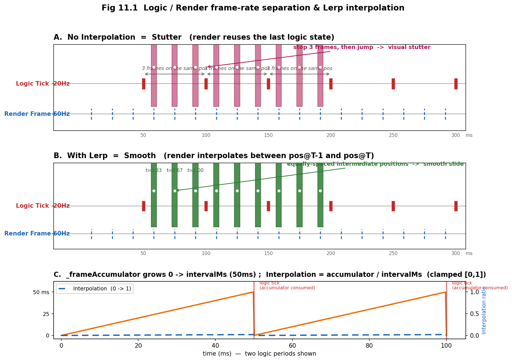
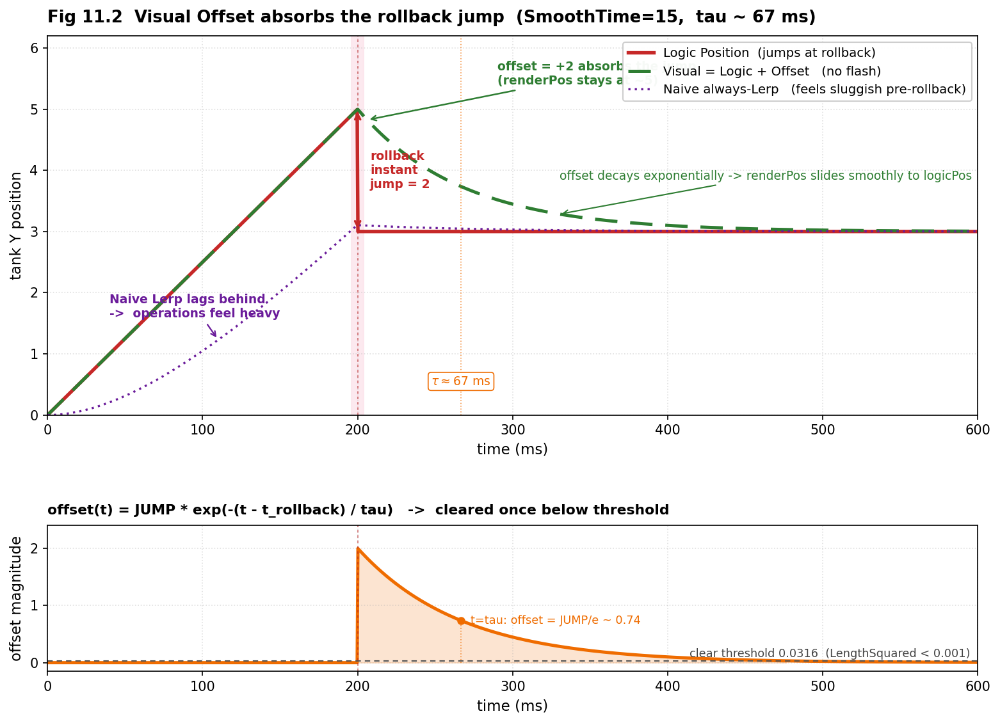

# 第 11 章 · 表现平滑:逻辑帧/渲染帧分离与回滚视觉补偿

> **核心问题**:前三章把"时间机器"——预测(第 8 章)、回滚(第 9 章)、LockstepController(第 10 章)——讲完了。逻辑侧能倒带重演了,但屏幕上呢?逻辑帧固定 20fps,屏幕却以 30、60、144fps 刷新。如果渲染层直接把逻辑状态画到屏幕上,画面会以 20fps 的节奏一跳一跳地顿。更难的是:回滚那一刻,一个实体的逻辑位置会**瞬间跳变**(从错误预测的位置直接修正到正确位置),直接画这个跳变,玩家看到的就是"瞬移/闪屏"。但如果你为了消除闪屏而对位置做常态平滑插值,平时操作又会"手感肉"——你按了方向键,坦克隔一拍才动。这一章就回答两个看似互相打架的问题:**怎么把 20fps 的逻辑状态画成 144fps 的丝滑画面?回滚时逻辑位置瞬跳,怎么既不闪屏、又不让平时手感变肉?**

> **读完本章你会明白**:
> 1. 为什么逻辑帧和渲染帧必须**分离**,分离的纪律是什么(渲染层只能**读**逻辑状态,逻辑层完全不知道渲染层存在),以及这条纪律为什么是第 9 章"回滚编程纪律"的延伸。
> 2. 为什么直接画逻辑状态会顿(20fps 跳变),怎么用 `Interpolation`(0~1)在上一帧/当前帧状态之间做线性插值补出中间画面,以及这个 `Interpolation` 是怎么从帧累加器 `_frameAccumulator` 算出来的。
> 3. ★为什么采样要用 `OnLogicStep` 而不是 `OnLogicStepComplete`:追帧/回滚时一帧内会执行多个逻辑 tick,`OnLogicStep` 每个都触发能保证双缓冲 `_lastStates = T-1 / _currStates = T`,而 `OnLogicStepComplete` 只看最终帧会让插值基准从 `T-n` 直接跳到 `T` 产生视觉微顿;再加上渲染器内部 `if (tick == _lastTick) return` 的去重。
> 4. ★**视觉偏移补偿 Visual Offset**——表现层最巧的设计:平时逻辑位置和视觉位置 1:1 同步(零延迟手感),只在回滚瞬间记录"预测位置和正确位置的偏差",把它叠加到渲染坐标上并指数衰减归零。常态牺牲为零、回滚时吸收跳变,这种**非对称策略**同时满足了"常态零延迟"和"回滚不闪屏"两个看似矛盾的需求。
> 5. 追帧进度 `OnPursueProgress` 怎么在断线重连/卡顿追帧时给玩家一个进度条而不是黑屏。

> **如果一读觉得太难**:先只记住三件事——① 逻辑层和渲染层是两条独立的节拍,渲染层只读逻辑层,中间靠"插值"补画面;② 采样逻辑状态要挂在 `OnLogicStep`(每个逻辑帧都触发),不是 `OnLogicStepComplete`(只触发一次),这样追帧/回滚时插值才不断层;③ 回滚时位置瞬跳别直接画也别全程平滑——只在回滚那一瞬记下偏差,叠加到画面上再慢慢衰减掉,平时手感一点不耽误。Visual Offset 那节即便先跳过,这三件事也要刻在脑子里。

---

## 〇、一句话点破

> **表现平滑的全部秘密是两条独立的节拍线加一个非对称的偏差吸收器。两条节拍线:逻辑层按固定 20Hz 推进状态、渲染层按屏幕刷新率(30~144Hz)读状态画画面,中间的"画面里物体该在哪个位置"靠在上一帧/当前帧状态之间做线性插值补出来——插值比例 `Interpolation` 就是"距离下一个逻辑帧还剩多少时间"的归一化值,由帧累加器算出。一个非对称吸收器:回滚时逻辑位置会瞬跳,与其直接画(闪屏)或全程平滑(手感肉),不如平时让视觉位置 1:1 等于逻辑位置(零延迟),只在回滚那一瞬把"预测位置和正确位置的偏差"记下来叠加到画面上,然后指数衰减归零——常态无牺牲、回滚不闪现。两条节拍线解决"20fps 怎么画成 144fps",一个吸收器解决"回滚瞬跳怎么不闪不肉"。**

这是结论。本章倒过来拆:先讲为什么逻辑/渲染必须分离、分离的纪律是什么;再讲直接画逻辑状态为什么会顿、怎么用双缓冲 + 插值补画面;再讲采样为什么要挂在 `OnLogicStep`;最后落到本章精髓——Visual Offset 这个非对称吸收器,以及它为什么是"同时满足零延迟和不闪屏"的唯一优雅解。

---

## 一、逻辑帧与渲染帧:为什么要分两条节拍线

### 1.1 朴素做法:逻辑和渲染搅在一起会怎样

很多单机游戏的写法是:每帧(屏幕刷新一次)算一次游戏逻辑,算完就画。逻辑和渲染跑在同一个循环里,同一个频率。这种写法在帧同步里**完全行不通**,原因有两层。

第一层,**确定性要求逻辑帧率固定**。第 2 章讲过,帧同步要求所有客户端跑出位级相同的结果。如果逻辑帧率跟着屏幕走——你 60Hz 屏幕、我 144Hz 屏幕——那同一秒内你算了 60 帧、我算了 144 帧,游戏局面在一个物理时间窗内推进的速度就不一样,浮点/定点运算的累积误差路径也不同,desync 几乎必然。所以逻辑帧率必须是一个**全端一致的常数**(LockstepSdk 默认 20Hz,即每 50ms 一帧),由服务器节拍器(第 14 章)统一打拍,任何客户端不论屏幕多少 Hz,逻辑上都是 20 帧/秒。

第二层,**屏幕刷新率因设备而异**。同样一款游戏,跑在 60Hz 手机、90Hz 手机、144Hz 显示器、30Hz 的低端机上,渲染帧率天差地别。如果逻辑帧率绑死渲染帧率,那要么逻辑帧率被渲染帧率拖着走(破坏确定性),要么渲染帧率被逻辑帧率锁死成 20fps(画面卡成 PPT)。两条路都是死胡同。

> **不这样会怎样**:如果逻辑帧和渲染帧同频同循环,要么逻辑帧率不固定导致 desync(每台设备算的帧数不同),要么逻辑帧率固定成 20fps 但画面也跟着只有 20fps,玩家看到的就是一跳一跳的幻灯片。无论哪种,游戏都没法玩。

### 1.2 分离的纪律:渲染只读,逻辑不知渲染存在

所以必须分成两条独立的节拍线:

- **逻辑帧(logic frame / tick)**:固定 20Hz,执行游戏逻辑(移动、碰撞、开炮、伤害结算),处理输入,推进确定性状态机。所有客户端按服务器节拍同步推进,**位级一致**。逻辑帧只关心"游戏世界的真实状态",完全不关心屏幕怎么画。
- **渲染帧(render frame)**:跟随屏幕刷新率(30~144Hz),读逻辑状态,把它画到屏幕上。渲染帧**只读**逻辑状态、**绝不修改**。它的全部职责是把已经算好的逻辑状态,以丝滑的视觉呈现给玩家。

| 概念 | 频率 | 职责 | 谁驱动 |
|------|------|------|--------|
| 逻辑帧 | 固定 20fps(50ms/tick) | 游戏逻辑、输入、确定性状态机 | 服务器节拍 + Controller |
| 渲染帧 | 可变 30~144fps | 显示画面、视觉插值、UI | 屏幕刷新(VSync) |

这两条线在 `LockstepDriver.Update` 里都能看到。`LockstepDriver.cs:492-565` 的 `Update(float deltaTime)` 把它们揉在一个调用里,但内部分得很清楚:前半段(529-549)驱动逻辑帧推进(累加器 + `_controller.DoUpdate`),后半段(557-564)算渲染插值参数 `Interpolation`。

> **钉死这件事**:逻辑帧和渲染帧是两条独立的节拍。逻辑帧固定频率保证确定性,渲染帧跟随屏幕保证流畅。它们之间的唯一桥梁是:**渲染层读逻辑层的状态**。这条桥梁是单向的——渲染读逻辑,逻辑永远不读渲染。

这条"单向"纪律不只是性能优化,它是**第 9 章回滚编程纪律的直接延伸**。第 9 章讲过:为了让逻辑能被快照/恢复/重演,逻辑组件**严禁持有表现层对象的引用**(不能在逻辑组件里存一个 Unity 的 `Transform` 或 Raylib 的纹理指针),因为表现层对象没法序列化、没法回滚,一旦逻辑层碰了它,回滚那一刻就会留下"幽灵状态"。本章的"渲染只读"纪律,是同一条原则从另一个方向看:逻辑层既然不能持有渲染层,那渲染层就只能在逻辑层算完之后,以"旁观者"身份去读逻辑状态。两个方向,同一条铁律——**逻辑和表现之间没有共享可变状态,只有单向数据流**。

> **承接第 9 章**:第 9 章的回滚纪律第一条是"组件严禁持有表现层对象引用,用 EntityID 间接引用"。本章的"渲染只读逻辑"是这条纪律的反面:既然逻辑碰不得渲染,那渲染就只能读逻辑。一句话,逻辑↔表现是单向数据流,中间断开可变共享。这条断开,既是回滚安全的前提,也是表现平滑的前提。

渲染层读逻辑状态时,还有一个细节:逻辑状态是定点数(`LFloat`/`LVector2`),渲染层(Unity/Raylib)用的是 IEEE 浮点(`float`/`Vector3`)。转换只在渲染层发生,通过 `LFloat.ToFloat()` / `LVector2` 的分量取出。这个转换**绝不会污染逻辑层**——逻辑层从头到尾只有定点数,确定性不破。

> **承接第 2 章**:第 2 章讲过,帧同步逻辑层必须用定点数,因为 IEEE 浮点跨平台不一致。但渲染层是"表现",不是"逻辑",屏幕上某个像素坐标差 0.00001 没人看得出来,也不会导致 desync。所以渲染层用宿主引擎原生的 `float`/`Vector3` 是完全合理的——`LFloat → float` 的转换(`ToFloat()`)是表现层独有的边界动作,只出不进。这一节是第 2 章"为什么不能用浮点"的反面:逻辑层不能用浮点,但渲染层必须用浮点(因为宿主引擎的图形 API 只认浮点)。

### 1.3 两条节拍线的时序:渲染帧比逻辑帧密

分离之后,典型的时序是这样的(假设 60Hz 屏幕,逻辑 20Hz):

```
渲染帧(60Hz):  |---|---|---|---|---|---|---|---|---|---|---|---|
逻辑帧(20Hz):  |---------------|---------------|---------------|
                     ↑                                ↑
                OnLogicStep                      OnLogicStep
                  采样                              采样
```

每 3 个渲染帧,才有 1 个逻辑帧。也就是说,在两个相邻的逻辑帧之间,屏幕会刷新 3 次。如果渲染层每次刷新都直接把"当前的逻辑状态"画上去,那这 3 次刷新画的是**同一个逻辑状态**——物体在屏幕上静止 3 帧然后突然跳到下一个位置,再静止 3 帧。这就是"20fps 跳变",看起来就是顿。

> **不这样会怎样**:渲染层如果不做插值,直接画当前逻辑状态,20fps 的逻辑帧在 60Hz 屏幕上就是"停 3 帧跳一下",144Hz 屏幕上就是"停 7 帧跳一下"——屏幕越流畅,这种停顿越明显。这就是为什么必须插值。


**图 11.1**(占位,主控批量生成):逻辑帧(20Hz,粗实线竖条)与渲染帧(60Hz,细虚线竖条)的节拍分离。横轴为时间(ms),0~300ms 区间。在两个逻辑帧(如 t=50 和 t=100)之间标出 3 个渲染帧位置。上半部分画"无插值":3 个渲染帧位置上物体都画在 t=50 的逻辑位置(同一坐标,叠 3 个半透明剪影),视觉上"停 3 帧跳一下"。下半部分画"有插值":3 个渲染帧位置上物体分别画在 `Lerp(pos@50, pos@100, 1/3)`、`Lerp(...,2/3)`、`Lerp(...,1.0)` 三个中间位置(等距递增),视觉上连续滑动。关键英文标注:`Logic Tick 20Hz`、`Render Frame 60Hz`、`No Interpolation = Stutter`、`With Lerp = Smooth`、`Interpolation ratio = accumulator / intervalMs`。底部用一条标注线显示 `_frameAccumulator` 在每个逻辑周期内从 0 增长到 `intervalMs`(50ms)的过程,以及对应的 `Interpolation` 从 0 到 1。

下一节就讲这个"插值"具体怎么补。

---

## 二、双缓冲插值:在上一帧和当前帧之间补画面

### 2.1 插值需要一个"上一个已知状态"和一个"当前已知状态"

线性插值(`Lerp(a, b, t) = a + (b-a)*t`)需要两个端点:起点 `a` 和终点 `b`。在帧同步里,这两个端点就是**上一帧的逻辑状态**和**当前帧的逻辑状态**。渲染层在每个渲染帧上,根据"现在距离下一个逻辑帧还剩多少时间",算出一个 0~1 的比例 `t`,在这两个状态之间插值。

- `t = 0`:完全画上一帧的状态(刚刚执行完一个逻辑帧的瞬间)。
- `t = 1`:完全画当前帧的状态(马上要执行下一个逻辑帧的瞬间)。
- `t = 0.5`:画两者中间。

关键问题是:**渲染层怎么拿到"上一帧"和"当前帧"这两个状态?** 逻辑层每执行一个 tick,状态就更新一次,旧的就被覆盖了。如果渲染层在某个渲染帧上想插值,但它手头只有"当前最新的逻辑状态",那 `b` 有了,`a` 从哪来?

答案是:**渲染层自己缓存两个状态快照**——上一帧的(`_lastStates`)和当前的(`_currStates`)。每当逻辑层执行完一个 tick,渲染层就把"当前的"挪到"上一帧的",再采样新的"当前的"。这就是**双缓冲(double buffer)**。

`RENDERING_GUIDE.md` 给出的渲染器骨架(简化示意,非源码原文)长这样:

```csharp
public class MyRenderer {
    private Dictionary<int, EntityState> _lastStates = new();
    private Dictionary<int, EntityState> _currStates = new();
    private int _lastTick = -1;

    // 由 OnLogicStep 调用, 每个逻辑帧采样一次
    public void Update(ISimulation sim, int tick) {
        if (tick == _lastTick) return;              // (1) 去重, 见下文

        (_lastStates, _currStates) = (_currStates, _lastStates);  // (2) 翻转: 现在变过去
        _currStates.Clear();

        SampleStates(sim, _currStates);             // (3) 采样新的当前
        _lastTick = tick;
    }

    // 每渲染帧调用
    public void Draw(float interpolation) {
        foreach (var entity in _currStates) {
            var pos = Lerp(_lastStates[entity.Key].Pos,
                           entity.Value.Pos,
                           interpolation);
            DrawEntity(pos);
        }
    }
}
```

这三步——**(1) 去重 → (2) 翻转缓冲 → (3) 采样**——是双缓冲插值的核心。我们逐个拆。

### 2.2 步骤(2)翻转:为什么是交换引用而不是拷贝

注意第 (2) 步 `(_lastStates, _currStates) = (_currStates, _lastStates)` 是**交换两个字典的引用**,不是把 `_currStates` 的内容拷贝到 `_lastStates`。这是 C# 元组解构赋值,底层面是交换两个局部变量(这里其实是字段)的引用,不复制任何字典内容。

为什么这么讲究?因为这是**每个逻辑帧都要做的事**(20Hz,每秒 20 次),如果每次都把 `_currStates` 里几百个实体的状态逐个拷贝到 `_lastStates`,GC 压力和 CPU 开销都不小。交换引用是 O(1),拷贝是 O(n)。表现层做这种优化是合理的(它本来就是性能敏感的),而且交换引用后 `_currStates.Clear()` 清的是"刚变成当前的那个旧字典",复用它的内存,零分配。

> **技巧**:双缓冲插值的"翻转"用元组解构赋值交换引用(O(1)),不是逐元素拷贝(O(n))。配合 `Clear()` 复用字典内部存储,采样路径零 GC 分配。这呼应第 20 章的"零 GC 哲学":帧同步怕 GC 停顿,所有高频路径都要消除分配。

### 2.3 步骤(1)去重:`if (tick == _lastTick) return` 防什么

这一行看似平平无奇,但它防的是一个**回滚/追帧时的具体毛病**。回到第 9、10 章:回滚发生时,Controller 会 `RollbackTo(tick-1)` 然后用正确输入重演,从 `tick` 一直重演到当前预测帧。也就是说,**同一个 tick 可能被采样多次**——比如回滚到 tick=100,然后用正确输入重演 101、102、103……如果回滚过程中又触发了对 tick=101 的采样(虽然按 Controller 逻辑正常不会,但追帧/重连场景下渲染事件可能被重复触发),渲染层不应该把 tick=101 当成一个"新状态"再翻转一次缓冲——否则 `_lastStates` 和 `_currStates` 会指向同一份数据,插值退化成恒等(`Lerp(x, x, t) = x`),插值画面就坏了。

`if (tick == _lastTick) return` 就是这个保险:`tick` 和上次处理的 `_lastTick` 相同,说明这是重复采样,直接忽略,缓冲不动。`RENDERING_GUIDE.md:87` 明确把这个叫"内置去重"。

> **承接第 9 章**:第 9 章讲过回滚会造成同一个 tick 被重新执行(回滚 → 重演)。表现层要消化这个现象,最简单的办法就是按 tick 去重——同一个 tick 的多次采样,只认第一次。这是表现层对逻辑层回滚行为的一种"容忍"。

### 2.4 步骤(3)采样:把逻辑状态拷贝成渲染快照

`SampleStates(sim, _currStates)` 把逻辑层当前每个实体的状态(位置、朝向、动画帧)拷贝到 `_currStates` 字典里。注意这是**值拷贝**(EntityState 是 struct),不是引用持有——拷完之后,`_currStates` 持有的是一份独立的、不可变的快照,逻辑层之后怎么改状态都影响不到这份快照。这正是"渲染只读"纪律的体现:渲染层读到的,是一份逻辑状态的快照副本,它永远不可能反过来改逻辑状态。

### 2.5 插值比例 Interpolation:从帧累加器算出来

现在 `_lastStates` 和 `_currStates` 都有了,只差插值比例 `t`。这个 `t` 就是 `LockstepDriver.Interpolation` 属性。

`Interpolation` 的定义和计算在 `LockstepDriver.cs` 里,分两处:

```csharp
// LockstepDriver.cs:268 (属性声明, 只读)
public float Interpolation { get; private set; }

// LockstepDriver.cs:529-563 (Update 末尾计算)
float intervalMs = _frameInterval * 1000f;          // 529: 一个逻辑帧多少 ms (50ms @20Hz)
_frameAccumulator += deltaTime * 1000f;             // 530: 累加这一渲染帧的时间

// 533: 限制累加器, 防止卡顿后的瞬间爆发式追帧
if (_frameAccumulator > intervalMs * 2) _frameAccumulator = intervalMs * 2;

// ... 驱动逻辑帧 (537-549): 累加器每满一个 intervalMs 就消耗一个, 执行一个逻辑帧 ...

// 553: DoUpdate 结束后触发一次 OnLogicStepComplete
OnLogicStepComplete?.Invoke(_simulation, _controller.PredictedTick);

// 557-561: 软纠偏过度保护 (P1 修复)
if (_frameAccumulator < 0) _frameAccumulator = 0;

// 563: Interpolation = 累加器剩余 / 一个逻辑帧时长, 钳到 [0, 1]
Interpolation = Math.Clamp(_frameAccumulator / intervalMs, 0f, 1f);
OnUpdate?.Invoke(Interpolation);
```

`_frameAccumulator` 是一个**帧累加器(frame accumulator)**:每渲染帧把 `deltaTime` 累进去,每执行一个逻辑帧就扣掉一个 `intervalMs`。所以执行完逻辑帧之后,`_frameAccumulator` 的剩余值,就代表"距离下一个逻辑帧还有多少 ms"。把它除以 `intervalMs` 归一化到 0~1,就是插值比例 `t`。

- 刚刚执行完一个逻辑帧(累加器被扣到接近 0):`t ≈ 0`,渲染画上一帧状态。
- 马上要执行下一个逻辑帧(累加器快满 `intervalMs`):`t ≈ 1`,渲染画当前帧状态。
- 中间:`t ≈ 0.5`,画两者之间。

这个设计精妙的地方在于,**`Interpolation` 完全是从"已经发生的物理时间"算出来的,不需要逻辑层做任何配合**。逻辑层只管按固定节拍推进,渲染层自己根据"现在距离下一个逻辑帧还剩多少时间"算插值比例。两条节拍线彻底解耦。

### 2.6 两个 P1 修复:clamp 上限与负值保护

`Interpolation` 这一行看似简单,但它身上踩过两个坑,源码注释里都标着 "P1 修复":

**P1 修复一:Clamp 上限恢复为 1.0f**(`LockstepDriver.cs:562` 注释)。`Math.Clamp(_frameAccumulator / intervalMs, 0f, 1f)` 的上限是 1.0f。早期某个版本曾把它改成更小的值(可能是想"不要完全画到当前帧,留一点余量"),结果物体永远到不了目标位置——视觉上"差一点"。恢复成 1.0f 后,累加器满了就 `t=1`,物体精确画在当前逻辑位置。注释原话:"Interpolation 上限恢复为 1.0f,确保能完全到达目标位置"。

**P1 修复二:累加器负值软纠偏保护**(`LockstepDriver.cs:556-561`)。第 13 章会讲,网络时钟为了防止本地跑得太快超过服务器,会做"软纠偏"——偷偷让 `_frameAccumulator` 减一点(扣一个 `correction` 量)。如果网络抖动大,这个 `correction` 可能让累加器变成负数。负数累加器会让 `Interpolation` 也变负,`Lerp(a, b, -0.1)` 会把物体画到 `a` 的反方向去,视觉上"倒退一帧"。修复就是 `if (_frameAccumulator < 0) _frameAccumulator = 0;`——把负值钳成 0,牺牲一点点插值精度(`t` 在那一帧是 0 而不是真实的负值),换取视觉连续性。注释原话:"改进累加器负值处理,防止一帧被'吃掉'导致视觉微顿"。

> **作者复盘 · 两个 P1 修复**:这两个修复都很小(各一行),但都对应真实的视觉问题。Interpolation 上限被改小那次,是因为有人(可能就是我)觉得"物体永远差一点到达"能制造"加速感",结果玩家反馈"坦克总是到不了准星位置,操作飘"。负值保护那次,是软纠偏在差网络下太激进,玩家看到"坦克偶尔往后跳一帧"。表现层这种 bug 的特点是:逻辑完全正确(状态对得上,哈希不漂移),但视觉上"看着不对"。定位这种 bug 不能靠 desync 工具(逻辑没错),得靠肉眼观察 + 读渲染路径源码。这也是为什么 `Interpolation` 这一行要写两个注释把修复理由钉死——它太容易被"优化"出问题。

### 2.7 累加器钳制:防卡顿后爆发

还有一行值得注意:`LockstepDriver.cs:533` 的 `if (_frameAccumulator > intervalMs * 2) _frameAccumulator = intervalMs * 2;`。

这是防"卡顿后爆发式追帧"的。设想:玩家网络突然卡了 500ms,这 500ms 里渲染帧还在跑,每帧往累加器里塞 `deltaTime`。500ms 后累加器里堆了 500ms 的余量。如果没有钳制,接下来 Driver 会一口气执行 10 个逻辑帧(500ms / 50ms)来"追"这丢失的时间——画面会瞬间冻结在追帧上(`OnLogicStep` 触发 10+ 次,渲染层连续采样 10+ 次),玩家感受到的就是"卡一下然后瞬移"。

钳制成 `intervalMs * 2`(即最多 100ms 余量)之后,追帧被限制成最多 2 个逻辑帧/渲染帧,剩下的时间通过第 10 章的"追帧动态限速"和第 13 章的"时钟软纠偏"分摊掉,视觉上就是"稍微慢一点然后恢复",而不是"冻结瞬移"。

> **承接第 10 章**:第 10 章讲过 Controller 有"追帧动态限速"(MaxSimulationMsPerFrame=50,每帧最多模拟 50ms 防卡死)。Driver 的累加器钳制(`intervalMs*2`)是表现层的同款保护——一个防逻辑侧追帧卡死,一个防表现侧追帧冻结。两层保护,共同保证卡顿恢复时画面不崩。

---

## 三、为什么采样要挂在 OnLogicStep,而不是 OnLogicStepComplete

这是本章最容易踩坑、也最体现"双缓冲 + 事件"设计精髓的一节。`LockstepDriver` 提供了好几个事件(`LockstepDriver.cs:79-86`):

```csharp
public event Action<float>? OnUpdate;                      // :79  Update 结束, 传 Interpolation
public event Action<float>? OnPursueProgress;              // :84  追帧进度
public event Action<ISimulation, int>? OnLogicStep;        // :85  ★每个逻辑帧触发
public event Action<ISimulation, int>? OnLogicStepComplete;// :86  DoUpdate 后触发一次
```

渲染层采样应该挂在 `OnLogicStep`,不是 `OnLogicStepComplete`。这个选择背后有三条理由,任何一条不满足都会出问题。

### 3.1 OnLogicStep 的触发位置:每个逻辑帧立即触发

先看 `OnLogicStep` 在哪里被 invoke。它不在 Driver 自己的代码里,而是作为 `tickCallback` 传给 `LockstepController`(`LockstepDriver.cs:429-433`):

```csharp
_controller = new LockstepController(
    _simulation,
    tickCallback: frame => {
        _simulation.Tick(frame);
        // 核心: 每执行一帧逻辑, 立即通知监听者采样状态
        OnLogicStep?.Invoke(_simulation, frame.Frame);
    },
    ...
);
```

`tickCallback` 是 Controller 每执行完一个逻辑帧就调用的回调。回顾第 10 章:Controller 的 `DoUpdate` 内部分两阶段——`ConfirmServerFrames`(确认服务器帧,可能触发回滚重演)和 `PredictAhead`(本地向前预测)。**每个阶段执行的每一个逻辑帧**,无论是正常确认、回滚后重演、还是本地预测,Controller 都会调用一次 `tickCallback`,从而触发一次 `OnLogicStep`。

也就是说:**一帧渲染帧内(一次 `Driver.Update`),`OnLogicStep` 可能被触发 0 次、1 次、甚至 10+ 次**(追帧/回滚重演场景)。

### 3.2 OnLogicStepComplete 的触发位置:DoUpdate 后只一次

再看 `OnLogicStepComplete`,它在 `LockstepDriver.cs:553`:

```csharp
// 549: _controller.DoUpdate(_inputTick);   ← 逻辑帧都在这里面跑完了

// P1优化: DoUpdate结束后触发一次完成事件, 渲染层可用此采样最终状态
// 避免回滚时 OnLogicStep 被多次调用导致的性能浪费
OnLogicStepComplete?.Invoke(_simulation, _controller.PredictedTick);
```

注释写得很明白:**"DoUpdate 结束后触发一次"**。无论 `DoUpdate` 内部执行了 0 个、1 个、还是 10+ 个逻辑帧,`OnLogicStepComplete` 在一次 `Driver.Update` 里**只触发一次**,且 tick 永远是 `_controller.PredictedTick`(最终帧号)。

注释还点出了设计意图:"避免回滚时 OnLogicStep 被多次调用导致的性能浪费"——这是 Driver 作者从**性能角度**给 `OnLogicStepComplete` 的定位:如果你只需要"这一渲染帧结束时逻辑层的最终状态"(比如刷新 UI、更新统计),用 `OnLogicStepComplete` 比 `OnLogicStep` 便宜,因为后者在追帧时一帧渲染帧里要 invoke 十几次。

### 3.3 采样为什么要选 OnLogicStep:插值连续性

现在问题来了:既然 `OnLogicStepComplete` 性能更好,渲染采样为什么不能挂它?

答案的核心是**插值的连续性**。回到双缓冲机制:渲染层需要在"上一帧状态"和"当前帧状态"之间插值,`_lastStates` 永远要是 `T-1`,`_currStates` 永远要是 `T`。如果用 `OnLogicStepComplete`,在追帧/回滚场景下这个关系会被打破。

设想这个场景:玩家断线重连,服务器补发了一串帧,客户端要追帧。一次 `Driver.Update` 里,Controller 从 tick=100 一口气追到 tick=110(执行了 11 个逻辑帧)。

- **如果挂在 `OnLogicStep`**:每个 tick 都触发——100、101、102……110,渲染层的 `Update(sim, tick)` 被调用 11 次,每次都翻转缓冲、采样新状态。追帧结束时,`_lastStates` 是 tick=109 的状态,`_currStates` 是 tick=110 的状态。插值基准正确(`T-1=109 / T=110`),下一个渲染帧可以在两者之间丝滑插值。
- **如果挂在 `OnLogicStepComplete`**:整段追帧只触发一次,tick=110(最终帧)。渲染层只采样到 `_currStates = 110`,但 `_lastStates` 还是追帧**之前**的状态——可能是 tick=99(追帧前的最终帧)!这下插值基准成了 `L-1=99 / T=110`,中间隔了 11 帧。`Interpolation` 是 0~1 的小数,`Lerp(state@99, state@110, 0.3)` 算出来的是"从 tick=99 到 tick=110 走了 30%"的位置——但真实情况是物体已经到了 tick=110。物体会在屏幕上**慢动作重演**这 11 帧的轨迹,或者干脆因为 `Interpolation` 很快接近 1 而**从 99 瞬跳到 110**,产生视觉微顿。

`RENDERING_GUIDE.md:83-88` 把这个理由总结成两条:

> 1. **采样准确性**:`OnLogicStep` 在每个逻辑帧执行后立即触发。在追帧或回滚重演时,它能确保渲染器的 `_lastStates` 始终是 `T-1`,`_currStates` 始终是 `T`。
> 2. **插值连续性**:如果使用 `OnLogicStepComplete`,在单帧执行多个 tick 时,渲染器只会看到最后一帧,导致插值基准从 `T-n` 直接跳到 `T`,产生视觉微顿。

第三条"内置去重"是配合用的:既然 `OnLogicStep` 在回滚时可能对同一个 tick 触发多次,渲染层就要靠 `if (tick == _lastTick) return` 自己去重(见 2.3 节)。Driver 把去重下放到渲染层,而不是在 Driver 里去重——因为不同渲染层实现可能有不同的去重策略(Dictionary 渲染器按 tick,但有些渲染器可能按 entity),Driver 不替它们做决定。

> **技巧精解预告**:下一节(本章"技巧精解")会把 `OnLogicStep` vs `OnLogicStepComplete` 的选择 + 双缓冲翻转 + 去重,作为一个整体拆透,并给出反面对比(挂错事件会怎样)。这是本章第一个最硬核的技巧。

### 3.4 一句话总结事件选择

| 事件 | 触发频率 | 适合做什么 | 不适合做什么 |
|------|----------|------------|--------------|
| `OnLogicStep` | 每逻辑帧(追帧/回滚时一渲染帧多次) | ★渲染状态采样(双缓冲翻转) | 性能敏感的统计(被 invoke 太多次) |
| `OnLogicStepComplete` | 每渲染帧一次(DoUpdate 后) | UI 更新、统计、日志 | 渲染采样(插值基准会断层) |
| `OnUpdate` | 每渲染帧一次(传 Interpolation) | 插值参数广播 | 状态采样(此时状态已过时) |
| `OnPursueProgress` | 追帧时(0~1) | 追帧进度条 | 任何状态相关的事 |

---

## 四、回滚视觉补偿:Visual Offset 的精妙

前三节解决了"20fps 怎么画成 144fps"。这一节解决另一个问题:**回滚那一刻,逻辑位置瞬跳,怎么不闪屏,又怎么不让平时手感变肉?** 这是表现层最巧的一个设计,也是本章精髓。

### 4.1 问题:回滚时逻辑位置瞬跳

回到第 9 章。预测错了的那一刻,Controller 会 `RollbackTo(tick-1)`,加载快照,用正确输入从 tick 重演到当前预测帧。重演完之后,逻辑状态被修正成"基于正确输入算出来的状态"。

设想一个具体例子:你控制一辆坦克,本地预测它在 (10, 5)。但服务器权威帧回来说,对面那一帧其实转向了,撞了你一下,你的坦克正确位置应该是 (10, 3)(被撞退了 2 单位)。回滚重演后,逻辑状态里你的坦克位置从 (10, 5) **瞬跳**到 (10, 3)。

如果渲染层直接把这个瞬跳画出来,玩家看到的就是"坦克突然往下挪了 2 单位"——闪屏。这种闪屏在网络差的玩家身上尤其频繁(回滚多),体验极差。

### 4.2 朴素方案一:全程平滑插值(手感肉)

最直觉的解法是:不直接画逻辑位置,而是让"视觉位置"慢慢追上"逻辑位置"。比如每个渲染帧把视觉位置往逻辑位置 Lerp 一点:

```csharp
visualPos = Lerp(visualPos, logicPos, 0.1f);  // 每帧追 10%
```

这样回滚瞬跳就被平滑掉了——视觉位置慢慢从 (10, 5) 滑到 (10, 3),玩家看到的是"坦克往下滑了两格",而不是"瞬移"。

但这个方案有个致命副作用:**平时操作也变肉了**。你按方向键,逻辑层立刻把坦克从 (10, 3) 移到 (10.2, 3)(一个逻辑帧移动 0.2),但视觉位置还在慢慢追,过了好几帧才到 (10.2, 3)。玩家按了键,坦克**隔一拍才动**——这就是"手感肉"。对于竞技游戏(格斗、RTS、MOBA),这种延迟感是致命的,玩家会觉得"操作不跟手"。

> **不这样会怎样**:全程平滑插值能消除回滚闪屏,但代价是平时所有操作都有视觉延迟。玩家按键 → 逻辑立刻响应 → 视觉慢慢追,中间这几十毫秒的视觉滞后,在快节奏游戏里就是"手感肉"。这是一个"消除回滚闪屏"和"保持常态手感"互相打架的需求。

### 4.3 朴素方案二:只在回滚时插值(实现复杂、易漏)

另一种思路是:平时视觉 = 逻辑(零延迟),只在检测到回滚的那一帧做插值。问题是怎么"检测到回滚"?渲染层本来不知道逻辑层回滚了没——它只看到 `OnLogicStep` 触发,tick 变了,状态变了。要区分"这是正常推进"还是"这是回滚后的修正",渲染层得额外订阅 Controller 的 `OnRollback` 事件,然后在回滚那一刻记录"回滚前的视觉位置"和"回滚后的逻辑位置",再做一次性插值过渡。

这个方案能 work,但很啰嗦,而且有个边界问题:回滚不是一次性的,可能是连续多次小回滚(回滚风暴,第 9 章)。每次回滚都要记录、插值、清理,状态机很复杂,容易漏。

### 4.4 ★Visual Offset:非对称偏差吸收器

LockstepSdk 的 `RENDERING_GUIDE.md:127-182` 给出了一个极其优雅的方案——**视觉偏移补偿 Visual Offset**。它的核心思想是一句**非对称策略**:

> **平时,视觉位置 1:1 等于逻辑位置(零延迟手感);只在回滚那一刻,把"预测位置和正确位置的偏差"记下来,叠加到视觉位置上,然后让这个偏差随时间指数衰减归零。**

换句话说:常态下,渲染画的就是逻辑位置(一点不肉);回滚那一刻,渲染画的 = 逻辑位置 + 一个"补偿偏移",这个偏移让视觉位置暂时停留在"玩家以为坦克还在的老位置"附近,然后慢慢衰减到 0,视觉位置就"滑"到了正确的逻辑位置。常态零牺牲,回滚有过渡。

具体的实现(简化示意,基于 `RENDERING_GUIDE.md:132-180` 的模式):

```csharp
public class MyRenderer {
    private Dictionary<int, Vector2> _posOffsets = new();        // 每实体的视觉偏移
    private Dictionary<int, Vector2> _lastTipPositions = new();  // 每实体"曾经到达的最高帧位置"
    private int _maxTickProcessed = -1;                          // 渲染层处理过的最高 tick
    private const float SmoothTime = 15.0f;                      // 衰减速度 (越大衰减越快)

    public void Update(ISimulation sim, int tick) {
        if (tick == _lastTick) return;

        // ★核心: 只有当重演"追回到之前的最高帧"时, 才对比预测误差
        //   追帧过程(还没追到 _maxTickProcessed)不对比——那些是"全新的正确状态", 没有预测误差可言
        if (tick == _maxTickProcessed) {
            foreach (var id in entities) {
                if (_lastTipPositions.TryGetValue(id, out var oldPos)) {
                    var newPos = sim.GetPos(id);  // 修正后的逻辑位置
                    // 偏差 = 旧的预测位置 - 修正后的新位置
                    // 正号: 视觉暂时"领先"逻辑(坦克被撞退, 视觉先停在老地方再滑回)
                    _posOffsets[id] += (oldPos - newPos);
                }
            }
        }

        // ... 正常的双缓冲采样 (_lastStates / _currStates 翻转 + 采样) ...
        _lastTick = tick;

        // 更新"曾经到达的最高帧位置"——只有 tick 超过历史最高时才记
        if (tick > _maxTickProcessed) {
            _maxTickProcessed = tick;
            foreach (var id in entities)
                _lastTipPositions[id] = sim.GetPos(id);  // 记下这一帧的位置作为"顶点"
        }
    }

    public void Draw(float interpolation) {
        float dt = GetDeltaTime();                          // 宿主引擎的渲染帧 dt
        float decay = MathF.Exp(-SmoothTime * dt);          // 指数衰减系数

        foreach (var id in entities) {
            var logicPos = GetLogicInterpPos(id, interpolation);  // 双缓冲插值出的逻辑位置

            Vector2 renderPos = logicPos;
            if (_posOffsets.TryGetValue(id, out var offset)) {
                renderPos += offset;                        // 视觉 = 逻辑 + 偏移
                _posOffsets[id] = offset * decay;           // 偏移指数衰减
                if (offset.LengthSquared() < 0.001f)
                    _posOffsets.Remove(id);                 // 衰减到阈值以下就清零
            }
            DrawEntity(renderPos);
        }
    }
}
```

这个实现里有四个精妙之处,我们一个一个拆。

#### 精妙一:用 `_maxTickProcessed` 区分"追帧"和"重演到顶"

回滚重演的过程是:从快照点(比如 tick=98)一直重演到当前预测帧(比如 tick=110)。在这段重演过程中,渲染层的 `Update` 会被 `OnLogicStep` 调用很多次(98、99、100……110)。我们要在哪个 tick 上"对比预测误差"?

答案:`tick == _maxTickProcessed` 的那一帧。`_maxTickProcessed` 是渲染层**之前处理过的最高 tick**(在这个例子里是 110,因为玩家预测到 110 了才回滚)。重演过程从 98 开始,98、99……这些都是"过去重新算的",渲染层不该对比误差(过去的状态本来就是基于错误输入算的,对比没意义)。只有当重演**追回到 110**(之前的最高帧)时,才对比"我之前预测的 110 位置"和"我现在用正确输入算出的 110 位置"——这个差值,才是真正的预测误差。

`if (tick == _maxTickProcessed)` 这个条件精确地抓住了这一帧。早于它(tick < 110)的对比没意义,晚于它(tick > 110)是新的预测推进,也没有误差可言。

> **技巧**:`_maxTickProcessed` 这个"渲染层视角的最高 tick"是 Visual Offset 的钥匙。它把"回滚重演过程"分成两段:重演回到顶点之前(纯重算,不对比)和重演回到顶点那一刻(对比预测误差)。这个分段让 Visual Offset 只在"真正有预测误差"的地方触发,不会在每次小回滚都乱加偏移。

#### 精妙二:偏差累加 `_posOffsets[id] += (oldPos - newPos)`

偏差不是赋值(`=`),是**累加**(`+=`)。为什么?因为回滚可能连续发生(回滚风暴):第一次回滚记一个偏差,衰减还没完,第二次回滚又来。如果用赋值,第二次的偏差会覆盖第一次的,视觉上"第一次的偏移突然消失"。用累加,两次偏差叠加,视觉位置平滑地吸收两次跳变。

#### 精妙三:指数衰减 `offset *= exp(-SmoothTime * dt)`

偏移的归零不是线性的(`offset -= speed * dt`),而是**指数衰减**。指数衰减有个美妙的性质:**衰减速度与偏移大小成正比**。偏移大的时候(刚回滚),衰减快,视觉位置迅速"靠近"逻辑位置;偏移小的时候(快归零了),衰减慢,视觉位置"温柔地"贴上逻辑位置,不会有机械的"匀速停止"感。

数学上,`offset(t) = offset(0) * exp(-SmoothTime * t)`。`SmoothTime = 15` 意味着衰减时间常数 τ = 1/15 ≈ 67ms——大约一个逻辑帧多一点的时间,偏移衰减到 e⁻¹ ≈ 37%;三个时间常数(200ms)后衰减到 5% 以下。这个速度足够快(玩家不会长时间看到"偏移着的坦克"),又足够慢(肉眼看不出瞬跳)。

`exp(-SmoothTime * dt)` 用的是宿主引擎的渲染帧 `dt`(Unity 的 `Time.deltaTime`、Raylib 的 `GetFrameTime()`),不是逻辑帧的 `intervalMs`。因为衰减是**视觉过程**,应该跟着渲染帧率走,而不是逻辑帧率。

> **承接数学线**:指数衰减 `exp(-λt)` 是《概率论》《数学分析》里反复出现的衰减函数,其离散形式就是几何级数 `r^n`。它的核心性质是"无记忆性"——任意时刻的衰减速度只和当前值成正比,和过去无关。Visual Offset 用它,正是因为这个性质让"偏移大时快收、偏移小时慢收"自动成立,不需要任何状态机或分段函数。这是数学结构天然贴合需求的例子,篇幅到此,不展开数学线已讲透的。

#### 精妙四:阈值清零 `if (offset.LengthSquared() < 0.001f) Remove`

偏移衰减到很小之后(平方长度 < 0.001,即长度 < 0.0316,大约 3% 个单位),直接从字典里移除。两个目的:① 避免 Dictionary 里堆一堆"几乎为零但不为零"的条目,占内存;② 移除后,这个实体的渲染路径走"纯逻辑位置"分支(`if (!_posOffsets.TryGetValue(...))`),少一次加法和衰减计算,热路径更快。

注意用的是 `LengthSquared()` 而不是 `Length()`——后者要开方,前者只要乘法。比较 `a*a + b*b < 0.001` 和 `sqrt(a*a+b*b) < 0.0316` 是等价的,但前者省一个 `sqrt`。表现层热路径(每个实体每渲染帧都走)抠这种指令是合理的。


**图 11.2**(占位,主控批量生成):Visual Offset 吸收回滚瞬跳的时间线。横轴时间(ms),0~600ms。三条曲线:(a) 粗实线 = 逻辑位置 logicPos,在 t=200ms 处有一个垂直阶跃(回滚修正,从 y=5 跳到 y=3);(b) 虚线 = Visual Offset 补偿后的视觉位置 renderPos = logicPos + offset,在 t=200ms 处 offset=+2(吸收了跳变),所以 renderPos 仍在 y=5 附近,然后指数衰减,t=400ms 衰减到 y=3.5,t=500ms 衰减到 y=3.1,平滑滑向 y=3;(c) 细点线 = "全程 Lerp 平滑"的反面对比,在 t=0~200ms 这段(常态)它滞后 logicPos,显示"手感肉"。关键英文标注:`Logic Position (jumps at rollback)`、`Visual = Logic + Offset (no flash)`、`Offset decays exponentially`、`Naive always-Lerp (feels sluggish pre-rollback)`、`SmoothTime=15, τ≈67ms`。底部小图单独画 offset 曲线:从 +2 指数衰减到 0,标出阈值线 0.0316 处清除。

### 4.5 为什么这是"同时满足两个矛盾需求"的唯一优雅解

把 Visual Offset 和两个朴素方案对比一下,就能看出它的精妙:

| 方案 | 常态手感 | 回滚表现 | 实现复杂度 |
|------|----------|----------|------------|
| 直接画逻辑位置 | 零延迟(好) | 闪屏(差) | 极低 |
| 全程平滑插值 | 手感肉(差) | 不闪屏(好) | 低 |
| 只在回滚时插值 | 零延迟(好) | 不闪屏(好) | 高(状态机复杂) |
| ★Visual Offset | 零延迟(好) | 不闪屏(好) | 中(一个偏移字典 + 衰减) |

Visual Offset 是唯一同时拿到三个"好"的方案。它的核心洞察是:**常态和回滚是不对称的——常态是 99% 的时间,要求零延迟;回滚是 1% 的时间,要求平滑。所以策略也应该不对称:常态什么都不做(视觉=逻辑),回滚时才介入(记偏移、衰减)。** 这种"非对称"——常态零开销、异常时才激活——是它能同时满足两个矛盾需求的关键。

> **钉死这件事**:Visual Offset 的本质是"非对称偏差吸收器"。常态视觉=逻辑(零延迟),回滚瞬间记下偏差并指数衰减归零(不闪屏)。它不试图"统一处理"常态和回滚,而是承认两者不对称,用不同的策略分别处理。这是表现层最巧的设计,也是"用最小的代价同时满足两个矛盾需求"的典范。

### 4.6 一个潜在的坑:`_lastTipPositions` 必须只在新预测推进时更新

实现 Visual Offset 时,有一个容易写错的点:`_lastTipPositions[id] = sim.GetPos(id)` 这一行,必须只在 `tick > _maxTickProcessed`(新预测推进)时执行,**不能**在重演过程中执行。

为什么?如果重演过程中也更新 `_lastTipPositions`,那么重演到 tick=110 时,`_lastTipPositions` 已经被覆盖成"用正确输入算的 110 位置",和 `newPos` 相等,`oldPos - newPos = 0`,偏移永远是 0——Visual Offset 失效。

`if (tick > _maxTickProcessed)` 这个守卫保证了 `_lastTipPositions` 永远是"预测时代记下的位置",只有在真正推进到新 tick(不是重演)时才更新。重演过程中 `_maxTickProcessed` 不变(因为 tick 不超过它),`_lastTipPositions` 也不变,直到重演追平甚至超过 `_maxTickProcessed` 时才更新。这是这个实现里最 subtle 的一行守卫,写错了 Visual Offset 就静默失效(不报错,只是回滚还是闪屏)。

> **作者复盘 · Visual Offset 的设计动机**:这个方案不是一开始就想出来的。最早的渲染层就是"直接画逻辑位置",回滚闪屏严重;后来加了"全程 Lerp 平滑",闪屏没了但玩家反馈"操作不跟手";再后来试过"只在回滚事件触发时插值",状态机太复杂、连续回滚时各种边界 bug。最后才悟出这个非对称思路:既然常态和回滚不对称,那就别用同一套逻辑——常态零介入,回滚时记偏移衰减。这个方案写出来代码很短(核心就一个字典 + 一个 exp 衰减),但想清楚花了好几版。表现层这种"代码短但想清楚难"的设计,值得单独拆透。

---

## 五、技巧精解:OnLogicStep 选择与 Visual Offset 的工程严谨

这一节把本章两个最硬核的技巧单独拆透,配反面对比。

### 5.1 技巧一:OnLogicStep 采样 + 双缓冲翻转 + tick 去重

**问题**:渲染层要在一帧渲染帧里(可能包含多次逻辑帧执行)正确维护"上一帧/当前帧"双缓冲,保证插值基准不断层。

**朴素做法撞什么墙**:
- 挂 `OnLogicStepComplete`:追帧时一渲染帧内 Controller 跑了 11 个 tick,渲染层只看到最终那个 tick=110。`_lastStates` 还停留在追帧前的 tick=99,插值基准成了 `99→110`,中间 11 帧要么慢动作重演要么瞬跳——视觉微顿。
- 挂 `OnLogicStep` 但不去重:回滚重演时同一个 tick 被采样两次,缓冲被多翻转一次,`_lastStates` 和 `_currStates` 指向同一份数据,插值退化成恒等。
- 挂 `OnLogicStep` 但用拷贝代替引用交换:每秒 20 次拷贝几百个实体的状态,GC 压力大。

**所以这么设计**(三件套):
1. **挂 `OnLogicStep`**:每个逻辑帧(含追帧/回滚重演的每一帧)都触发,保证 `_lastStates`/`_currStates` 始终是相邻两帧。
2. **`if (tick == _lastTick) return` 去重**:同一个 tick 的重复采样直接忽略(回滚重演时的保险)。
3. **元组解构交换引用翻转**:`(_lastStates, _currStates) = (_currStates, _lastStates)`,O(1) 交换 + `Clear()` 复用,零 GC。

**为什么妙**:三件套各司其职——`OnLogicStep` 保证插值基准正确,去重防回滚重复采样,引用交换防 GC。三者缺一,表现层要么视觉断层、要么状态错乱、要么 GC 卡顿。这是一个"事件选择 + 数据结构 + 实现细节"三层协同的设计,不是单点技巧。

**源码锚点**:
- `OnLogicStep` 声明:`LockstepDriver.cs:85`
- `OnLogicStep` 触发位置(作为 tickCallback):`LockstepDriver.cs:429-433`
- `OnLogicStepComplete` 声明:`LockstepDriver.cs:86`
- `OnLogicStepComplete` 触发位置(DoUpdate 后一次):`LockstepDriver.cs:553`
- `Interpolation` 属性:`LockstepDriver.cs:268`,计算 `:563`
- 双缓冲/去重/翻转/Visual Offset 模式:`RENDERING_GUIDE.md:96-182`

### 5.2 技巧二:Visual Offset 非对称偏差吸收

**问题**:回滚时逻辑位置瞬跳,要既不闪屏、又不让常态手感变肉。

**朴素做法撞什么墙**:
- 直接画逻辑位置:闪屏。
- 全程 Lerp 平滑:常态手感肉(所有操作都有视觉延迟)。
- 只在回滚事件插值:状态机复杂,连续回滚边界多。

**所以这么设计**:
1. **常态零介入**:视觉位置 = 逻辑位置,一点不肉。
2. **回滚瞬间记偏差**:重演追平历史最高 tick(`tick == _maxTickProcessed`)时,`offset += oldPos - newPos`。
3. **指数衰减归零**:每渲染帧 `offset *= exp(-SmoothTime * dt)`,偏移大快收、小慢收。
4. **阈值清零**:`offset.LengthSquared() < 0.001` 时移除,热路径走无偏移分支。

**为什么妙**:它抓住了"常态和回滚不对称"这个本质,用非对称策略分别处理——常态零开销,异常时才介入。数学上 `exp` 衰减的"无记忆性"让大小偏移自适应衰减速度,无需状态机。实现简短(一个字典 + 一个 exp),但解决了"两个矛盾需求同时满足"这个难题。这是"用最小的代价解决最本质的问题"的工程美学典范。

**反面对比**:如果用线性衰减 `offset -= speed * dt`,偏移大时衰减太慢(玩家长时间看到偏移)、偏移小时衰减太快(末尾有机械的"突然停止"感)。指数衰减天然解决这个问题。

**源码锚点**:Visual Offset 模式在 `RENDERING_GUIDE.md:127-182`(渲染集成指南,作者亲述),`UNITY_INTEGRATION.md` 的渲染插值段(`:216-240`, `:713-717`)给出了 Unity 侧的落地(`Vector3.Lerp(prevPos, currentPos, driver.Interpolation)`)。注意:Visual Offset 的具体偏移字典/衰减逻辑在渲染层(宿主引擎侧),不在 SDK 核心代码里——SDK 只提供 `OnLogicStep` 事件和 `Interpolation` 属性,Visual Offset 是渲染层基于这两个钩子实现的模式。这是 SDK"只提供机制、不提供策略"的设计(呼应第 18 章 SDK 化的接口注入哲学)。

---

## 六、追帧进度与其他渲染事件

表现层除了状态采样和插值,还有几个事件值得提一下,它们都挂在 `LockstepDriver` 上(`LockstepDriver.cs:79-86`):

### 6.1 OnPursueProgress:追帧进度条

`OnPursueProgress`(`:84`)在追帧(断线重连后补帧、卡顿后追帧)时触发,参数是 0~1 的进度。它来自 Controller 的 `OnPursueFrameProgress`/`OnPursueFrameDone`(`LockstepDriver.cs:457-458`):

```csharp
_controller.OnPursueFrameProgress += p => { Metrics.UpdatePursueStatus(true, p); OnPursueProgress?.Invoke(p); };
_controller.OnPursueFrameDone += () => { Metrics.UpdatePursueStatus(false, 1f); OnPursueProgress?.Invoke(1.0f); };
```

渲染层可以挂这个事件显示一个进度条(比如"重新同步中... 60%"),而不是黑屏。追帧可能持续几百毫秒(重演几十上百帧),给玩家一个进度反馈比黑屏体验好得多。注意追帧完成时也会触发一次 `OnPursueProgress(1.0f)`,渲染层据此隐藏进度条。

### 6.2 OnDesync / OnReconnectStatusChanged:状态类 UI

`OnDesync` 在哈希不匹配时触发(第 23 章详讲),渲染层可以弹个"网络不同步"警告。`OnReconnectStatusChanged` 在重连状态切换时触发,渲染层显示/隐藏"重连中"UI。这两个都是"状态类"UI 事件,不涉及渲染采样本身,挂哪个事件都行(甚至挂 `OnLogicStepComplete`),不影响插值。

### 6.3 OnUpdate:插值参数广播

`OnUpdate`(`:79`)在 `Update` 结束时触发一次,参数就是 `Interpolation`(`:564`)。它的定位是"广播插值参数",适合那些"不需要采样状态、只需要插值比例"的渲染组件(比如一个纯 UI 动画,跟着插值比例做缓动)。注意:挂 `OnUpdate` 的组件拿不到状态采样,它只能用最新的逻辑状态(因为状态采样要靠 `OnLogicStep`),所以 `OnUpdate` 适合"已经缓存了状态、只需要刷新插值参数"的场景。

---

## 七、章末小结

### 7.1 回扣主线:确定性内核 vs 同步机制

本章服务的是"表现平滑"——这是第 3 篇(预测回滚与表现平滑)的收尾章。回到全书二分法:**确定性内核**(单机位级一致)vs **同步机制**(多机最终一致),中间一座桥是**预测回滚 + 表现平滑**。

表现平滑本身既不属于"确定性内核"也不属于"同步机制"——它纯粹是**表现层**的事,不参与状态计算,不影响 desync。但它紧紧依附于这两者:

- **依附确定性内核**:渲染层读的是逻辑状态,逻辑状态必须位级一致(否则每台机器画的不一样,虽然单台看着平滑,但联机时就"各画各的")。渲染层的 `LFloat → float` 转换是边界动作,绝不污染逻辑层。
- **依附预测回滚(同步机制)**:回滚造成逻辑位置瞬跳,表现层必须消化这个跳变(Visual Offset)。表现层的"渲染只读"纪律,是第 9 章回滚纪律第一条(组件严禁持有表现层对象引用)的反面延伸。

第 3 篇到这里收束:第 8 章预测(本地先猜着算)、第 9 章回滚(猜错了倒带重演 + 七条编程纪律)、第 10 章 LockstepController(预测回滚的实现主控)、第 11 章表现平滑(把这一切丝滑地画出来)。从"能倒带"到"倒带了也不闪屏",表现层把逻辑侧的时间机器,翻译成了玩家无感的丝滑体验。

### 7.2 五个为什么清单

1. **为什么逻辑帧和渲染帧必须分离?**
   逻辑帧率必须固定(确定性要求全端一致),渲染帧率跟随屏幕(设备各异)。同频会要么破坏确定性,要么画面卡成 20fps PPT。分离后,逻辑层管"游戏世界的真值",渲染层管"怎么把真值丝滑地画出来",两条独立节拍线,单向数据流(渲染只读逻辑)。

2. **为什么采样要挂在 OnLogicStep 而不是 OnLogicStepComplete?**
   追帧/回滚时一渲染帧内 Controller 会执行多个逻辑 tick。`OnLogicStep` 每个都触发,保证渲染层双缓冲 `_lastStates = T-1 / _currStates = T` 始终相邻;`OnLogicStepComplete` 只触发一次(最终帧),插值基准会从 `T-n` 跳到 `T` 产生视觉微顿。配合渲染器内 `if (tick == _lastTick) return` 去重,既保证插值连续性,又防回滚重复采样。

3. **为什么直接画逻辑状态会顿,插值能补平滑?**
   20fps 逻辑帧在 60/144Hz 屏幕上就是"停几帧跳一下"。双缓冲(上一帧 `_lastStates` / 当前 `_currStates`)+ 在两者间 `Lerp` 补出中间画面,插值比例 `Interpolation = _frameAccumulator / intervalMs`(钳到 0~1)由帧累加器算出。累加器是"距离下一个逻辑帧还剩多少时间"的物理量,逻辑层无需配合。

4. **为什么 Visual Offset 用非对称策略(常态零介入、回滚记偏差衰减)?**
   常态和回滚不对称——常态是 99% 时间要求零延迟手感,回滚是 1% 时间要求不闪屏。全程平滑(对称处理)会让常态手感肉;直接画会让回滚闪屏。Visual Offset 承认这种不对称:常态视觉=逻辑(零延迟),只在 `tick == _maxTickProcessed`(重演追平历史顶点)时记偏差 `offset += oldPos - newPos`,然后 `offset *= exp(-SmoothTime*dt)` 指数衰减归零。常态零牺牲、回滚有过渡,同时满足两个矛盾需求。

5. **为什么 Visual Offset 的衰减用 exp 而不是线性?**
   指数衰减 `exp(-λt)` 有"无记忆性"——衰减速度与当前值成正比。偏移大(刚回滚)时快收,迅速靠近逻辑位置;偏移小(快归零)时慢收,温柔贴上不机械。线性衰减要么大偏移收太慢、要么小偏移收太突兀。`exp` 的数学结构天然贴合"平滑吸收跳变"的需求,无需状态机或分段函数。`SmoothTime=15` 对应时间常数 τ≈67ms,约一个逻辑帧多一点,快到玩家不觉察、慢到不闪屏。

### 7.3 想继续深入往哪钻

- **外插值(extrapolation)vs 内插值(interpolation)**:本章讲的是内插值——在上一帧和当前帧之间补。有些游戏(尤其高延迟 FPS)会用外插值——在当前帧基础上**外推**未来几帧(比如按速度向量推算"下一帧坦克大概在哪")。外插值更流畅但会"猜错",LockstepSdk 默认用内插值(绝不猜错,但视觉会比逻辑慢一帧)。想深入的读者可以研究这两者的权衡,以及"混合插值"(近距内插、远距外插)。
- **3D 旋转的插值(Quaternion Slerp)**:本章的 `Lerp` 是位置/标量的线性插值。3D 旋转(四元数)要用 Slerp(球面线性插值)或更便宜的 Nlerp,否则旋转动画会"扭"一下。LockstepSdk 的 `LQuaternion` 在 `LMath` 里有对应支持(承第 3 章 Mul2/3/4SumShift)。
- **动画帧同步**:角色动画(走路循环、开炮动作)也要同步。常见做法是动画状态机也进逻辑层(确定性),渲染层根据动画状态插帧。这又是一个"逻辑/表现分离"的应用,但动画状态机的确定性比位置更难(动画事件、混合树都要确定)。
- **不同预测深度下的 Visual Offset 调参**:`SmoothTime` 不是万能常数。网络好(预测深度小、回滚少)可以用更小的 SmoothTime(快速收敛);网络差(回滚频繁)要更大的 SmoothTime(否则偏移还没衰减完又来一次)。自适应 SmoothTime 是个值得探索的方向。

### 7.4 引出下一章

第 3 篇到这里完整收束——逻辑侧的预测回滚(第 8-10 章)和表现侧的平滑(第 11 章)都讲完了,但这一切都还是**纯客户端侧、不涉及网络**。预测的前提是"本地有输入实时注入",回滚的前提是"服务器权威帧能传回来",插值的前提是"逻辑帧按固定节拍推进"。一旦真的接上网络——有延迟、有抖动、有丢包——这些前提怎么保证?第 12 章(`LockstepDriver`:SDK 主循环与跨线程纪律)开始第 4 篇,把这台"能倒带、能平滑"的机器,接到不可靠的网络上。从 `LockstepDriver.Update` 的完整主循环(网络命令队列 → 帧累加器 → 模式分支 → Controller.DoUpdate → 渲染插值)开始,讲清楚跨线程纪律、线程亲和、和"网络回调先入队、主线程消费"这条帧同步线程安全铁律。
