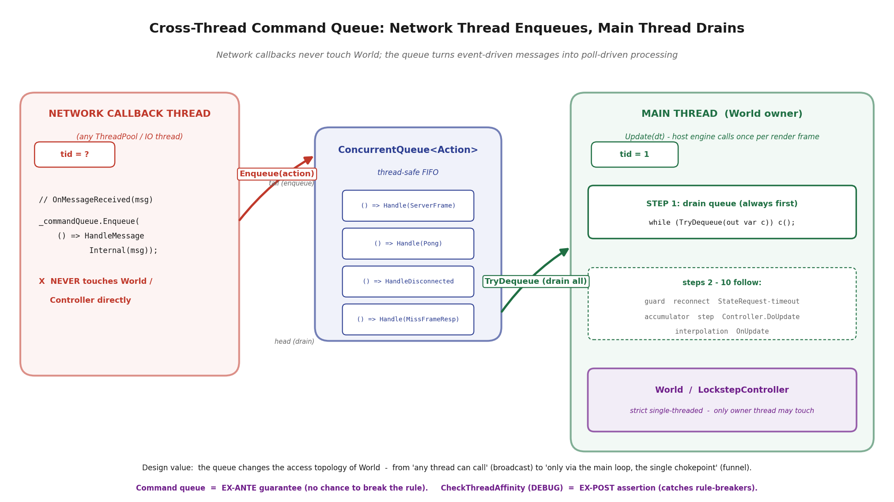
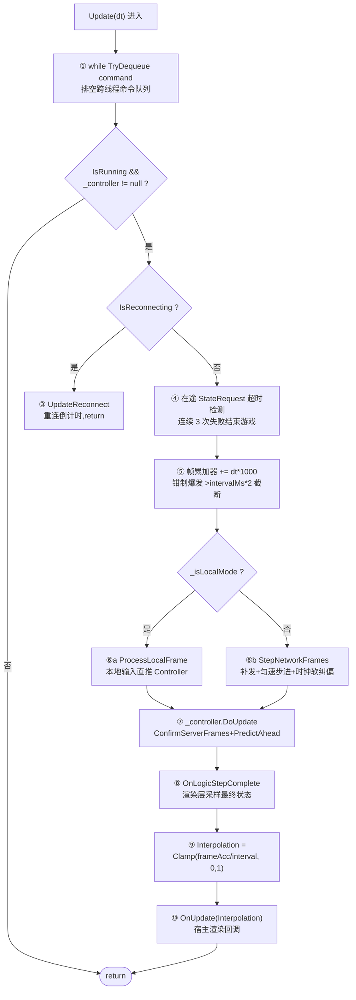

# 第 12 章 · LockstepDriver:SDK 主循环与跨线程纪律

> **核心问题**:前面三章把"确定性内核 + 预测回滚 + 表现平滑"在客户端单机侧讲透了——你有了一台能倒带、能追帧、能插值平滑的机器。但那台机器现在还**只跟自己玩**:输入怎么来、状态怎么走,都是你想象的。从本章开始,第 4 篇要把它接到不可靠的网络上。第一道关就是:**谁来把"网络收到的帧"和"本地要跑的逻辑"编成一个简洁的主循环,还顺带把网络天然的多线程、断线重连、丢帧补帧全管起来?** 这就是 `LockstepDriver`——SDK 的最外层入口,用户只要每帧调一次 `Update(dt)`,剩下的它全包。但 Driver 真正硬核的不是"包了多少",而是它怎么解决一个看似无解的矛盾:**网络回调在任何线程触发,逻辑必须严格单线程——这个矛盾不靠锁,靠"跨线程命令队列"从根上消灭竞态。**

> **读完本章你会明白**:
> 1. Driver 封装了什么(模拟器 + 网络 + 控制器 + 时钟 + 回放 + 限流器 + 重连状态),它和 Controller 谁拥有谁,**为什么是 Driver 拥有 Controller 而不是反过来**。
> 2. `Update(dt)` 主循环的真实十步流程,以及每一步为什么要在那个顺序——尤其"消费跨线程命令队列"为什么永远排在第一行。
> 3. ★**跨线程命令队列**:网络线程回调先 `Enqueue` 一条命令,主线程 `Update` 顶部 `TryDequeue` 消费,从根上保证 World 的线程亲和(thread affinity)。这是把"网络多线程"和"逻辑单线程"解耦的经典模式,DEBUG 下 `CheckThreadAffinity` 把这条纪律变成硬断言。
> 4. 帧累加器钳制爆发(防一次 `Update` dt 过大一帧内跑太多逻辑帧)、丢帧双层限流(Controller 检测 + Driver 限流)、停止 = `Dispose` 的全清理(Driver 接管传输层生命周期)。
> 5. 三个 `_consecutiveSyncFailures >= 3` 终止游戏的三处分支,以及"在途 StateRequest 超时重发"为什么是 UDP 弱网下防半挂的必要补丁。

> **如果一读觉得太难**:这章是第 4 篇开篇,信息量大但层次清楚。先只记住三件事——① 用户只调 `Update(dt)`,Driver 内部"先消费网络命令队列 → 算累加器 → 步进逻辑 → Controller.DoUpdate → 算渲染插值"是一条流水线;② 网络回调**绝不直接碰 World**,一律先入队,下一帧主线程消费——这是把多线程竞态从根上消灭的设计;③ Driver 的 `Dispose` 是全清理入口,连注入给它的传输层 `INetworkClient` 都一并释放。源码细节需要时再回来看。

---

## 〇、一句话点破

> **`LockstepDriver` 是 SDK 的最外层壳。它把六七样东西(模拟器、网络客户端、控制器、网络时钟、回放录制器、限流器、重连状态)捏成一个对象,对外只暴露一个 `Update(dt)`。在这个 `Update` 里,它永远先消费一个跨线程命令队列——网络回调线程把"收到一条消息"包装成一条命令塞进队列,主线程再统一处理——从而让 World/Controller 永远只在主线程被访问,把"网络是多线程的"和"逻辑是单线程的"这对矛盾不靠锁、靠队列编排解决掉。**

这是结论。本章倒过来拆:先讲 Driver 把什么封装了、为什么是它拥有 Controller;再讲那个跨线程命令队列到底解决了什么本质问题(朴素做法会撞什么墙);然后逐行拆 `Update(dt)` 的十步流程;最后讲启动停止和资源生命周期。

---

## 一、Driver 把什么封装了:SDK 入口的边界

### 1.1 为什么需要一个 Driver

前三篇下来,我们手里已经攒了一堆组件:

- 一个**确定性内核**(定点数 / 随机 / 有序 ECS / 字节级序列化),保证相同输入跑出相同结果;
- 一个**预测回滚控制器** `LockstepController`,负责"确认服务器帧 + 本地预测 + 出错回滚";
- 一个**表现平滑层**,逻辑帧 20fps / 渲染帧可变,中间靠插值填缝。

但这些东西散着,谁也跑不起来。还缺几样:

- **网络从哪来**:权威帧不会自己飞过来,得有人连服务器、收消息、把消息翻译成 `FrameData` 推给 Controller。
- **节拍从哪来**:客户端不知道"现在该跑到第几帧了",得有人维护一个网络时钟,告诉 Controller "按服务器节奏,你现在该把本地 tick 推到哪"。
- **断线了怎么办**:网络断了得重连,重连回来得追帧——追帧还得区分"差几帧用补帧"还是"差太久了拉个快照跳过去"。
- **输入怎么发**:本地玩家的输入每帧要发到服务器,顺带捎带前几帧冗余防丢包。
- **限流**:不能网络一波动就疯狂请求补帧把服务器打爆。
- **回放**:顺手把每帧录下来,出了 desync 能复盘。

> **承接 P3**:第 10 章讲 `LockstepController` 时,它只管"确认帧 + 预测 + 回滚"这一摊,它**不知道**网络,也不知道时钟。它只暴露 `PushServerFrame` / `PushLocalFrame` / `DoUpdate` / `RollbackTo` 这些接口。把帧推给它、让它干活的人,就是 Driver。

把这些"网络 + 时钟 + 重连 + 限流 + 回放 + 调度 Controller"全捏在一个对象里,对外只暴露"启动 / 每帧 Update / 停止"三个动作——这就是 `LockstepDriver`。它是 SDK 的最外层入口。用户(游戏业务层)只需要:

```csharp
// 启动
driver.Start(gameStartMsg);
// 每帧
driver.Update(Time.deltaTime);
// 结束
driver.Dispose();
```

剩下的一切——收消息、推帧、重连、限流、回放、算插值——Driver 全包。

> **钉死这件事**:Driver 存在的意义不是"功能多",是**边界清晰**。它把"网络、时钟、重连这些和具体游戏无关的同步基础设施"和"具体游戏怎么跑(ISimulation)"切开。你换一个游戏(TankGame 换成格斗游戏),Driver 不用动,只换 ISimulation 实现。这是 SDK 化(第 18 章详)的体现。

### 1.2 为什么是 Driver 拥有 Controller,不是反过来

源码里有一个乍看不起眼、但定调关键的所有权关系:

```csharp
// LockstepDriver.cs:31-33
private readonly ISimulation _simulation;
private readonly INetworkClient? _client;
private LockstepController? _controller;   // ← Driver 持有 Controller
```

`_controller` 是 Driver 的一个**字段**,由 Driver 在 `InitializeCore` 里 `new` 出来:

```csharp
// LockstepDriver.cs:427-436(简化示意,非源码原文)
_controller = new LockstepController(
    _simulation,
    tickCallback: frame => {
        _simulation.Tick(frame);
        OnLogicStep?.Invoke(_simulation, frame.Frame);
    },
    frameHistorySize: FrameHistorySize,
    inputPredictor: InputPredictor);
```

反过来不成立:Controller 对 Driver 一无所知。这个方向不是随便选的。

> **不这样会怎样**:假设反过来——让 Controller 持有一个 Driver 引用(或 Controller 直接收网络消息)。那 Controller 就得知道"网络是什么""时钟怎么校准""重连怎么走",同步基础设施的细节全漏进了"预测回滚"这个核心组件。后果是:① Controller 单元测试得连网络一起 mock;② 你想换个 Controller 实现(比如换一套更激进的预测策略),得把网络那摊一起搬过去;③ 最要命,Controller 是 World 的直接邻居(World 也在主线程跑),让 Controller 碰网络等于把网络的"任意线程触发"特性引到了最不能容忍并发的地方——World。

所以正确的方向是:**Driver 拥有 Controller**。Driver 是"网络和时钟这些脏活累活"的容器,Controller 是它手里的一个干净零件。Driver 收到网络消息,翻译成 `FrameData`,然后调 `Controller.PushServerFrame`——对 Controller 来说,帧"从哪来"无所谓,它只负责"收到帧 → 确认 / 预测 / 回滚"。这是**依赖方向**的纪律:脏的依赖干净的,而不是反过来。

> **承接 P3**:第 10 章我们说 Controller 是"预测回滚的实现主控",但它在整个架构里只是 Driver 的一个组件。Driver 才是更高一层的"调度主控"。这个所有权关系,后面讲 `Dispose` 生命周期时还会再用到。

---

## 二、跨线程命令队列:把"网络多线程"和"逻辑单线程"解耦

这是本章最硬核的设计。Driver 里有几十个字段、十几个方法,但真正决定它"为什么能跑得稳"的,是这一行——`Update(dt)` 永远最先做的事:

```csharp
// LockstepDriver.cs:495
while (_commandQueue.TryDequeue(out var command)) { command(); }
```

`_commandQueue` 是个 `ConcurrentQueue<Action>`。要理解这一行为什么这么重要,得先看"不这样会撞什么墙"。

### 2.1 朴素做法撞的墙:直接在网络回调里处理消息

最直觉的设计是:网络库收到一条消息,直接在它的回调线程里调 Controller。看起来多清爽:

```csharp
// 朴素做法(伪代码,会出事)
_client.OnMessageReceived += msg => {
    // 直接在网络回调线程里处理
    switch (msg) {
        case ServerFrameMessage f:
            _controller.PushServerFrame(f.Frame);   // ← 在网络线程碰 Controller
            break;
        // ...
    }
};
```

这个写法在帧同步里是**灾难**。原因:

**网络回调线程不是固定的**。.NET 的 socket 异常回调(不管是 `TcpClient.BeginRead` 的旧 APM、`ReceiveAsync` 的 SAF 还是目前用的 `Task` 循环),回调落在哪个线程,取决于传输层实现——TCP 走 ThreadPool 线程,UDP 可能是另一个收包循环线程,WebSocket 又是另一个。一个客户端生命周期里,`OnMessageReceived` 可能在**好几个不同的线程**上被触发。

**而 World/Controller 是严格单线程的**。这是第 5 章(P2-05)立下的铁律:World 用 `CheckThreadAffinity` 在 DEBUG 下断言"只准在创建线程上访问"。

```csharp
// World.cs:253-263(DEBUG 断言)
[System.Diagnostics.Conditional("DEBUG")]
private void CheckThreadAffinity()
{
    if (System.Threading.Thread.CurrentThread.ManagedThreadId != _ownerThreadId)
    {
        throw new InvalidOperationException(
            $"[ECS] Cross-thread access detected! World was created on thread {_ownerThreadId}, " +
            $"but accessed from thread {System.Threading.Thread.CurrentThread.ManagedThreadId}. " +
            "All World operations must be performed on the logic thread.");
    }
}
```

`LockstepController` 也有一模一样的断言(`LockstepController.cs:132-142`)。

> **承接 P2-05**:第 5 章讲过,World 为什么强制单线程——不是因为作者不会用锁,是因为**锁救不了帧同步**。帧同步里 World 的状态(实体、组件、随机数种子、增量哈希)在每帧逻辑里被密集读写,如果加锁,要么锁粒度大到等于串行(失去并发意义),要么粒度小到锁散落到处都是,还**解决不了一个更根本的问题:确定性**。两台机器要算出同一个结果,前提是它们执行逻辑的顺序完全一致;一旦逻辑能在多个线程上交错执行,"执行顺序"这个概念本身就模糊了,确定性无从谈起。所以 World 选择单线程模型,把"执行顺序 = 代码顺序"这件事钉死。

那朴素做法的灾难就清楚了:

> **不这样会怎样**:网络回调在网络线程(假设 tid=12)里调 `_controller.PushServerFrame`,Controller 内部会推帧进 `_serverFrames`(一个 `RingBuffer`),还会动 `_curTickInServer` 这些字段。如果这时候主线程(tid=1)正好在 `DoUpdate` 里读 `_serverFrames` 做确认——**两个线程同时读写同一个 `RingBuffer`**。DEBUG 下 `CheckThreadAffinity` 立刻抛(因为 tid=12 ≠ _ownerThreadId=1);Release 下断言没了,但 `RingBuffer` 是无锁的纯槽数组(第 10 章 C-5 时效性契约),两个线程同时写**会静默地把对方的写覆盖掉**,或者读到一个写了一半的槽——表现就是:某帧的服务器输入莫名其妙丢了,客户端 desync,而且**没有任何报错**,你要等到几千帧后哈希对不上才发现。

这就引出本章的核心设计。

### 2.2 解法:命令队列——回调只入队,主线程消费

Driver 的解法极其简洁。看真实的网络回调入口:

```csharp
// LockstepDriver.cs:683-687
private void OnMessageReceived(NetworkMessage msg)
{
    // 入队,不直接处理(网络线程 -> 主线程)
    _commandQueue.Enqueue(() => HandleMessageInternal(msg));
}
```

注意三件事:

1. **回调什么都没干**,只是把"处理这条消息"这件事**包装成一个 `Action`(闭包),塞进 `_commandQueue`**。这个 `Enqueue` 是 `ConcurrentQueue` 的线程安全操作,无论网络回调在哪个线程触发,都没问题。
2. 闭包捕获了 `msg`。消息本身是个不可变的值对象(序列化产物),捕获它不会有竞态。
3. 真正的处理逻辑(`HandleMessageInternal`)永远**不会在网络线程执行**——它要等到主线程下一帧 `Update` 顶部那段 `while (TryDequeue) command()` 才被执行。

```
        网络线程(任意 tid)                      主线程(tid=1, World 所在线程)
        ─────────────────────                    ──────────────────────────────
        收到 ServerFrameMessage                  
            │                                      │ Update(dt) 被调用
            │ OnMessageReceived(msg)               │   ┌─────────────────────────┐
            │   _commandQueue.Enqueue(              │   │ while (TryDequeue(out c))│
            │       () => HandleMessageInternal(    │   │     command();           │  ← 这里才真正
            │             msg))                    │   │                           │     调 HandleMessageInternal
            ▼                                      │   │     ↓                     │
        (网络线程继续收 / 阻塞等下一条)             │   │  ... 后续 9 步            │
                                                   │   └─────────────────────────┘
```



**图说**:左是网络回调线程(可能是 ThreadPool 的任意线程),它只做一件事:把"处理这条消息"塞进 `ConcurrentQueue`。右是主线程(World 所在线程),它的 `Update` 永远先排空这个队列再干别的。蓝色方块是队列里的 `Action` 闭包,每个闭包捕获了一条已反序列化的 `NetworkMessage`。注意主线程消费是 `while (TryDequeue)` 一次性排空——一帧内到达的多条消息会全部在这一帧处理掉,不会有"漏消息"。

这就是经典的 **producer-consumer(生产者-消费者)模式** 在帧同步里的应用,但有一个关键的工程细节:Driver **没用 `BlockingCollection` + 专用消费线程**那种重量级做法,而是借了主循环本身当消费者。原因是帧同步的逻辑节奏完全由 `Update(dt)` 驱动——网络消息再多,逻辑帧没到也不该处理(否则会破坏"一帧内的逻辑顺序");而且主循环本来就是"每帧被宿主引擎调一次",天然是个泵。

> **钉死这件事**:跨线程命令队列的本质,是把"网络消息"这种**事件驱动**的东西,转译成"主循环每帧消费一次"这种**轮询驱动**的东西。事件驱动的回调时机不可控(随时可能来),轮询驱动的处理时机可控(永远在 `Update` 开头)。把不可控转译成可控,这就是队列的全部价值。World 永远只在主线程被碰,纪律天然成立。

### 2.3 为什么用 `ConcurrentQueue<Action>` 而不是别的

这里有几个看似可以替换、但都更差的方案,值得过一遍:

**方案 A:加 `lock`**。在网络回调和主循环访问的每个共享字段上加 `lock`。前面讲过,World 是单线程模型,给它加锁等于推翻整个确定性设计;而且锁会让网络回调线程阻塞等主循环、主循环也可能等网络线程——死锁风险 + 性能塌方。**否决**。

**方案 B:`Channel<T>` 异步管道**。.NET 的 `System.Threading.Channels` 也能做生产者-消费者。但 `Channel` 是为 `async` 流设计的(读者 `await ReadAllAsync`),需要一个常驻的 consumer task。在帧同步里引入一个额外的消费 task,又要面对"这个 task 怎么和主循环同步"的问题——绕了一圈。**否决**(Driver 内部倒是用了 `Channel`,但那是**发送方向**的——见 2.4 节)。

**方案 C:`ConcurrentQueue<NetworkMessage>`**。直接存消息不存 `Action`。看起来等价,但少了表达力:有些"来自网络线程的事件"不是一条消息,是"连接断了"这种**信号**(`OnDisconnected`),它没有 message 对象。Driver 对断线也走同样的入队机制:

```csharp
// LockstepDriver.cs:952-955
private void OnDisconnected()
{
    _commandQueue.Enqueue(() => HandleDisconnectedInternal());
}

// LockstepDriver.cs:967-970
private void OnReconnected()
{
    _commandQueue.Enqueue(() => HandleReconnectedInternal());
}
```

如果队列只装消息,这三种事件(收消息、断线、重连成功)就得三套机制;用 `Action` 统一,"任何要在主线程做的事"都是一个闭包,优雅得多。

> **技巧**:用 `Action` 而不是具体类型,把队列从"消息队列"升级成"命令队列"——任何主线程待办事项都能入队。这是把"队列"这个机制用到了它的表达力上限。代价是闭包会捕获变量、有少量 GC 分配,但帧同步每帧入队的消息通常只有个位数,这点分配可以忽略(第 20 章零 GC 那本账不在这里算)。

### 2.4 一个容易混淆的点:发送方向的 Channel

读 Driver 源码时容易混淆:它里头其实有**两条**跨线程管道。

- **接收方向**:`_commandQueue`(`ConcurrentQueue<Action>`)——网络线程入队,主线程消费。这是上面讲的。
- **发送方向**:`_sendChannel`(`Channel<NetworkMessage>`)——主线程入队(比如发本地输入),一个专用 IO 线程消费并真正调 `_client.SendAsync`。见 `LockstepDriver.cs:125-131`:

```csharp
// LockstepDriver.cs:124-131
private const int SendChannelCapacity = 1000;
private readonly Channel<NetworkMessage> _sendChannel = Channel.CreateBounded<NetworkMessage>(
    new BoundedChannelOptions(SendChannelCapacity)
    {
        SingleReader = true,
        SingleWriter = false,
        FullMode = BoundedChannelFullMode.DropOldest
    });
```

为什么要这条管道?因为发送(尤其 TCP)可能是阻塞的——`SendAsync` 内部要等 socket 缓冲区。如果在主线程直接发,网络一卡,主循环就卡,逻辑帧跑不动,整局崩。所以发送也走"主线程入队 → 专用 IO 线程 `ProcessSendQueueAsync` 消费"的模式,把"可能慢的 IO"和"必须快的逻辑"隔开。

> **钉死这件事**:接收方向用 `ConcurrentQueue<Action>`(简单,因为主线程是被动轮询);发送方向用 `Channel<NetworkMessage>`(强大,因为有专门的消费线程 + 背压 + DropOldest)。两条管道方向相反、机制不同,但哲学一样——**把跨线程的东西用队列串起来,让两边各跑各的节奏**。这一节讲的"跨线程命令队列"特指接收方向那条 `_commandQueue`,别和发送方向的 `_sendChannel` 搞混。

### 2.5 为什么两条管道用了不同的数据结构

细心的读者会问:既然都是"跨线程用队列串",为什么接收用 `ConcurrentQueue`,发送用 `Channel`?不是随便选的,背后是对两个方向**不同需求**的回应。

**接收方向的特征**:消费者是主循环,它"被动轮询"——每帧 `Update` 顶部一次性排空。主循环不会"阻塞等消息"(那样会卡死渲染),消息没到就跳过,到了就处理。所以接收方向**不需要背压、不需要阻塞读、不需要 DropOldest**——`ConcurrentQueue` 这个轻量结构完全够用,且零分配压力(闭包捕获的 `msg` 是已反序列化的对象,本来就要存在)。主循环是单读者,`ConcurrentQueue` 的多写单读语义天然匹配。

**发送方向的特征**:生产者是主循环(每帧可能产生多条发送——本地输入、HashReport、MissFrameAck 等),消费者是一个专用 IO 线程,它**阻塞读**——没消息就 `await ReadAllAsync` 挂起,有消息就唤醒发。发送是 IO,可能慢(TCP 拥塞),所以**必须有背压**——主循环产生速度可能远超发送速度,队列会无限涨。`Channel` 提供了 `BoundedChannelOptions` + `FullMode` 来处理背压,`ConcurrentQueue` 没有。专用 IO 线程是单读者,正好匹配 `Channel` 的 `SingleReader = true` 优化(内部可以省锁)。

> **技巧**:同一个"跨线程队列"的需求,因为两侧的节奏模型不同(被动轮询 vs 阻塞读)、背压需求不同(无 vs 有),选了不同的数据结构。这是个**按需选型**的范例——不要看到"跨线程队列"就无脑上 `Channel`,也不要图省事全用 `ConcurrentQueue`。前者在不需要背压时是过度设计(多了 task 调度开销),后者在需要背压时会 OOM(队列无限涨)。Driver 把两个都用对了,是经过权衡的。

---

## 二·补、DEBUG 与 Release 的纪律缝隙

讲完命令队列的设计,有一个工程上必须正视的缝隙:**`CheckThreadAffinity` 只在 DEBUG 生效,Release 下没有**(`[Conditional("DEBUG")]` 的语义)。这意味着纪律的"硬约束"只在开发构建里成立,生产构建里 World 仍然是无锁的、靠"所有人都走命令队列"这条**约定**维系。

这是个有意的设计,不是疏漏。原因:

1. **性能**。`CheckThreadAffinity` 在 World 的几乎每个公共方法开头都调(`CreateEntity` / `DestroyEntity` / 各种组件操作 / `SaveState` / `LoadState`……十几个入口)。如果 Release 也调,每次都要读 `Thread.CurrentThread.ManagedThreadId` 并比较——虽然是廉价的属性读取,但帧同步每帧几百次 World 调用,累积起来不是零成本。Release 砍掉它,是为了让生产环境的 World 调用零开销。
2. **命令队列已经是事前保证**。前面讲过,命令队列的设计让"网络回调碰不到 World"——纪律在架构层面成立,不需要运行时再检查。`CheckThreadAffinity` 是给开发者写的"你破坏了单点收口"的提示,不是给生产环境兜底的护栏。

> **不这样会怎样**(如果 Release 也保留 CheckThreadAffinity):每次 World 调用多一次线程 ID 比对。假设一帧逻辑里有 500 次 ECS 操作(创实体、改组件、查实体),每次比对假设 5 纳秒(属性读 + 比较 + 分支),一帧多 2.5 微秒,20fps 下每秒多 50 微秒——绝对值不大,但帧同步是"把每一点 CPU 都留给逻辑"的场景,这种开销能省则省。

**这个缝隙的真正风险**在于:如果有人(未来贡献者、二次开发者)在 Release 下写了"网络回调直接碰 World"的代码,DEBUG 测试时能逮到,但如果这段代码只在 Release 跑过(比如某个只在生产环境启用的插件),就会静默 desync。这是为什么本书第 24 章"确定性红线清单"会把"严禁跨线程访问 World"列为头号红线,并配合 `SystemStateValidator`(P2-05)的反射体检——把"约定"升级成"加载期体检",弥补 DEBUG/Release 的缝隙。

---

## 三、`Update(dt)` 主循环:十步流水线

有了前面的铺垫,现在可以逐行拆 `Update(dt)` 了。这是 Driver 的心脏,也是用户每帧调一次的接口。源码在 `LockstepDriver.cs:492-565`。我把它拆成十步,按真实顺序讲每一步为什么在那里。



**图说**:`Update(dt)` 的十步真实顺序。注意三个早退点(②守卫 / ③重连分支 / ④ StateRequest 三连失败),它们都用 `return` 跳出,后续步骤不执行。⑥ 之后的步骤(⑦ DoUpdate / ⑧ OnLogicStepComplete / ⑨ 插值 / ⑩ OnUpdate)无论本地还是联机模式都会走。

### 第 ① 步:排空跨线程命令队列

```csharp
// LockstepDriver.cs:494-495
// 1. 处理网络命令
while (_commandQueue.TryDequeue(out var command)) { command(); }
```

这是整个 `Update` 的**第一行**。为什么必须第一?因为后面所有步骤都假设"网络消息已经被处理了"——Controller 的 `_serverFrames` 里要有这一帧到达的权威帧,时钟要有这一帧的 Pong 校准。如果先跑逻辑再处理消息,这一帧就用了"上一帧到达但还没处理"的旧消息,等于**整个网络往返延迟凭空多了一帧**。

`while` 而不是 `if`:一帧之间可能到达多条消息(服务器一拍广播一帧,但客户端一帧 `Update` 可能跨越服务器多拍——尤其追帧时)。一次性排空,保证"逻辑开始前,所有已到的消息都已就位"。

### 第 ② 步:守卫

```csharp
// LockstepDriver.cs:497
if (!IsRunning || _controller == null) return;
```

游戏没开始(`IsRunning=false`)或没初始化完(`_controller` 还 null)就直接返回。简单但关键——后面要解引用 `_controller`,这里不守会 NRE。

### 第 ③ 步:重连分支

```csharp
// LockstepDriver.cs:499-503
if (IsReconnecting)
{
    UpdateReconnect(deltaTime);
    return;
}
```

断线重连期间**不跑逻辑**。`UpdateReconnect`(`LockstepDriver.cs:659-679`)只做一件事:累加计时器,到点(`ReconnectIntervalSec` 默认 2 秒)就触发一次 `TryReconnect`,超过 `MaxReconnectAttempts`(默认 10 次)就放弃、`OnGameEnded`。重连成功后(走命令队列回主线程)才解除 `IsReconnecting`,恢复正常 Update。

为什么重连期间不跑逻辑?因为这时候没有新服务器帧,Controller 没法 `ConfirmServerFrames`。预测倒是能跑(本地输入还在),但跑了也是"基于过时服务器帧的盲目预测",重连回来必然大回滚,不如不跑。

### 第 ④ 步:在途 StateRequest 超时检测

```csharp
// LockstepDriver.cs:508-526(简化示意,非源码全文)
if (_stateRequestInFlight)
{
    long now = DateTimeOffset.UtcNow.ToUnixTimeMilliseconds();
    if (now >= _stateRequestDeadlineMs)
    {
        _stateRequestInFlight = false;
        _consecutiveSyncFailures++;
        if (_consecutiveSyncFailures >= 3)
        {
            _logger.Error($"[Driver] StateRequest timed out {_consecutiveSyncFailures} times (StateResponse lost). Sync unrecoverable, ending game.");
            IsRunning = false;
            OnGameEnded?.Invoke();
            return;
        }
        _stateRequestLimiter.Reset();
        RequestState();   // 重发
    }
}
```

这一段是 C-7 补丁(注释里写了完整来龙去脉)。讲个故事:重连回来后,如果落后太多(超过 `SnapshotThresholdFrames` 默认 300 帧),Driver 会 `RequestState()` 向服务器拉一份快照跳过去。问题是——UDP 会丢包。如果服务器的 `StateResponse` 在路上丢了,客户端怎么办?

朴素设计:`RequestState` 发出去就不管了,等 `StateResponse` 回来。撞墙场景:`StateResponse` 丢了,客户端的 `_stateRequestInFlight` 标志一直 true,Update 这一分支永远不触发(因为没超时检测),但 StateResponse 永远不会来——客户端**半挂**:看起来还在跑(因为消息队列里没有"结束"信号),但帧历史缺口永远不自愈,等于在错误的基线上继续模拟,**静默 desync**。

补丁:每次 `RequestState` 记一个截止时间(`_stateRequestDeadlineMs = now + StateRequestTimeoutMs`,默认 2000ms),Update 里检测超时。超时就重发(给丢包网络一次自愈机会),连续 3 次都超时(默认 6 秒无响应)判定"同步不可恢复",结束游戏。

> **作者复盘 · 三处终止游戏**:你可能注意到,`_consecutiveSyncFailures >= 3` 这个判定在 Driver 里出现了**三次**——`Update` 这里(:515)、`HandleStateResponse` 里"服务器没快照"分支(:793)、`HandleStateResponse` 里"快照哈希校验失败"分支(:819)。三个地方都意味着"客户端无法把状态对齐到服务器",继续跑只会是静默 desync。统一用 `_consecutiveSyncFailures` 计数,三次失败兜底终止,这是个工程上的取舍:宁可让玩家看到"游戏结束,请重开",也不要让他继续在一个已经分叉的局里白玩。计数而不是一击毙命,是为了给 UDP 弱网几次重试机会。

### 第 ⑤ 步:帧累加器,钳制爆发

```csharp
// LockstepDriver.cs:529-533
float intervalMs = _frameInterval * 1000f;
_frameAccumulator += deltaTime * 1000f;

// 优化:限制累加器,防止卡顿后的瞬间爆发式追帧
if (_frameAccumulator > intervalMs * 2) _frameAccumulator = intervalMs * 2;
```

这是**节拍同步**的核心。`_frameInterval` 是一帧的时长(默认 `1f/20f` = 50ms),`_frameAccumulator` 是"距离下一帧逻辑还差多少毫秒"的累加器。

每次 `Update`,`deltaTime`(宿主引擎给的真实流逝时间,毫秒级)累加进去。当累加器 ≥ 一帧时长,就触发一次逻辑帧,并把累加器减掉一帧时长——这就是经典的**固定时间步累加器(fixed timestep accumulator)** 模式。它保证逻辑帧率严格 20fps,不受渲染帧率(可能 30/60/144)波动影响。

> **承接 P3-11**:第 11 章讲过逻辑帧 / 渲染帧分离——逻辑 20fps 固定,渲染可变。这里的累加器就是那条分离线的实现机制。渲染层读 `Interpolation`(第 ⑨ 步算)在两个逻辑帧之间插值。

关键的第三行——**钳制爆发**:

```csharp
if (_frameAccumulator > intervalMs * 2) _frameAccumulator = intervalMs * 2;
```

> **不这样会怎样**:假设玩家切窗口出去 5 秒,`deltaTime` 一次性给了 5000ms。累加器变成 5000。然后第 ⑥ 步的 `while (_frameAccumulator >= intervalMs)` 会一口气跑 100 个逻辑帧(5000/50)追上来——客户端**瞬间卡死 5 秒**(CPU 全在跑逻辑帧,渲染卡住),追完之后还要面对 100 帧的预测错误大回滚。更糟:有些宿主引擎(Unity)的 `Time.deltaTime` 在卡顿后会异常大,这一钳就是救命的。

钳到 `intervalMs * 2`(默认 100ms):最多一帧内追 2 个逻辑帧,把"5 秒的缺席"摊薄到接下来的几十个 `Update` 里慢慢追,玩家几乎无感。这是个简单但极聪明的工程补丁。

### 第 ⑥ 步:模式分支(本地 / 联机)

```csharp
// LockstepDriver.cs:535-545
if (_isLocalMode)
{
    while (_frameAccumulator >= intervalMs)
    {
        _frameAccumulator -= intervalMs;
        ProcessLocalFrame();
    }
}
else
{
    StepNetworkFrames(intervalMs);
}
```

Driver 有两个构造函数(`LockstepDriver.cs:293` 联机、`:319` 本地),用 `_isLocalMode` 标记区分。源码类注释(`:19-27`)坦白说这是个权衡——理论上应该用策略注入统一成一个构造,但会改公开签名,留待大版本。

**本地模式**(`ProcessLocalFrame`,`:606-622`):全体玩家输入由一个 `Func<int, TInput>` 轮询器直接给,把输入包成 `FrameData`,直接 `_controller.PushServerFrame`——等于自己当服务器。单机、本地多人、离线回放都走这条。纯确定性内核,无网络往返、无重连、无追帧。

**联机模式**(`StepNetworkFrames`,`:571-604`):真实网络路径,做四件事——① 查时钟要的目标 tick;② 补发机制(应对瞬间卡顿);③ 匀速步进(累加器够就发一帧本地输入);④ 时钟软纠偏(限制单帧修正 ≤ 2ms,防网络突发导致的"加速"感)。时钟软纠偏的具体算法(`_inputTick - targetTick` 乘以系数)留到第 13 章讲 NetworkClock 时细拆。

### 第 ⑦ 步:Controller.DoUpdate

```csharp
// LockstepDriver.cs:549
_controller.DoUpdate(_inputTick);
```

这一行是整章的高潮——前面所有铺垫(消费消息、算累加器、发本地输入)都是为了让这一行能正确执行。`DoUpdate` 是 Controller 的两阶段入口(第 10 章详):① `ConfirmServerFrames` 确认服务器帧,不一致就回滚;② `PredictAhead` 本地预测向前算。这一行跑完,本帧的逻辑就确定了——World 状态更新到当前 tick,该回滚的回滚了,该预测的预测了。

注意它传的是 `_inputTick`(本地输入已经发到的帧号),不是累加器算出来的逻辑帧号。这是因为 Controller 的预测深度是"本地输入领先服务器确认多少帧",`_inputTick` 正好是本地输入的领先指针。

### 第 ⑧ 步:OnLogicStepComplete

```csharp
// LockstepDriver.cs:553
OnLogicStepComplete?.Invoke(_simulation, _controller.PredictedTick);
```

> **承接 P3-11**:第 11 章讲表现平滑时,埋了个伏笔——渲染层什么时候采样逻辑状态?有两种选择:`OnLogicStep`(Controller 每执行一帧逻辑就触发,追帧时一帧 Update 可能触发几十次)或 `OnLogicStepComplete`(`DoUpdate` 全部结束后触发一次)。第 11 章选了后者,这里就是那个回调的触发点。注释(`:551-552`)说得很清楚:"避免回滚时 OnLogicStep 被多次调用导致的性能浪费"——追帧一帧 Update 可能跑 20 次逻辑,渲染层没必要采样 20 次,采样最终的 PredictedTick 那一次就够。

### 第 ⑨ 步:渲染插值

```csharp
// LockstepDriver.cs:557-563
if (_frameAccumulator < 0)
{
    // 软纠偏过度时,将负值转换为小正值,保持插值连续性
    _frameAccumulator = 0;
}
Interpolation = Math.Clamp(_frameAccumulator / intervalMs, 0f, 1f);
```

`Interpolation` 是个 0~1 的浮点,表示"当前渲染时刻处于两个逻辑帧之间的哪个位置"。`_frameAccumulator / intervalMs` ——累加器是"距下一帧还差多少 ms",除以一帧时长,就是"这一帧已经走了百分之多少"。渲染层拿这个值在上一帧状态和当前帧状态之间做线性插值(第 11 章)。

两处细节:① 累加器可能为负(第 ⑥ 步时钟软纠偏会减 correction,可能减成负数),负值会让 `Interpolation` 变负、插值越过当前帧——这里钳成 0,保持连续性。② 上限 1.0f(注释说"P1 修复:确保能完全到达目标位置")——曾经被误钳到更小,导致渲染永远差一截。

### 第 ⑩ 步:OnUpdate

```csharp
// LockstepDriver.cs:564
OnUpdate?.Invoke(Interpolation);
```

宿主(游戏业务层)订阅这个事件,拿到 `Interpolation` 去画画面。Driver 的工作到此结束,下一帧再轮回。

---

## 四、消息分发:`HandleMessageInternal` 的 switch

主循环第 ① 步消费命令队列时,每条命令最终调的是 `HandleMessageInternal`(`LockstepDriver.cs:689-772`)。它是个大的 `switch`,按 `MessageType` 分发。第 16 章会系统讲 17 种 MessageType 和 9 个 Handler,这里只点几个和 Driver 主循环紧密相关的:

```csharp
// LockstepDriver.cs:693-771(简化示意,非源码全文)
switch (msg)
{
    case PongMessage pongMsg:
        int ping = _client?.Ping ?? 50;
        _clock?.UpdateFromPong(ping, pongMsg.ServerTimestamp);
        Metrics.RecordRtt(ping);
        break;

    case ServerFrameMessage frameMsg:
        _controller?.PushServerFrame(frameMsg.Frame);
        if (frameMsg.RedundantFrames != null)
            foreach (var rFrame in frameMsg.RedundantFrames)
                _controller?.PushServerFrame(rFrame);
        _clock?.UpdateFromServerFrame(frameMsg.Frame.Frame, _client?.Ping ?? 50);
        break;

    case MissFrameResponseMessage missMsg:
        HandleMissFrameResponse(missMsg);   // 补帧成功推 Controller,或过期转 RequestState
        break;

    case StateResponseMessage stateMsg:
        HandleStateResponse(stateMsg);      // LoadState + hash 校验 + ResetTo
        break;

    case ReconnectResponseMessage reconnectMsg:
        if (!reconnectMsg.Success) { IsRunning=false; OnGameEnded?.Invoke(); }
        else {
            _controller?.SetCurTickInServer(reconnectMsg.CurrentFrame);
            // 阈值检查:落后太多要快照,否则补帧
            if (serverTick - nextTick > _config.SnapshotThresholdFrames)
                RequestState();
            else
                RequestMissFrames(nextTick);
        }
        break;
    // ... HashMismatch / GameStart 等略
}
```

注意几件事:

1. **`ping` 取自 `_client.Ping`,不是从 Pong 现算**。`PongMessage` 里只带 `ServerTimestamp`,RTT 由传输层(收到 Pong 那一刻 `now - pong.ClientTimestamp`)维护在 `INetworkClient.Ping` 属性里。Driver 只消费这个值。这是分层——RTT 测量归传输层,时钟消费归 NetworkClock,Driver 只做转接。
2. **ServerFrame 处理冗余帧**。服务器每个广播包里除了本帧,还捎带前 `RedundancyCount`(默认 3)帧(`RedundantFrames`),抗 UDP 丢包——丢一个包,下一个包里带着丢的那帧,零往返恢复。Driver 全部 `PushServerFrame` 给 Controller,Controller 内部的 `RingBuffer` 按 `frame.Frame` 自然去重(第 10 章 C-5 时效性契约,主帧号校验)。第 17 章详讲冗余帧的抗丢包数学。
3. **重连响应里那个阈值检查**。`SnapshotThresholdFrames` 默认 300 帧(15 秒)。重连回来如果落后 ≤ 300 帧,走补帧(从断点续);> 300 帧走快照(跳到现在)。这是"从断点续 vs 跳到现在"的决策点,第 19 章详。

> **承接 P5-19**:重连的完整双级解耦(传输层重连 + 应用层追帧)在第 19 章。本章只点 Driver 这一层怎么把 `ReconnectResponseMessage` 翻译成"补帧 / 拉快照"两种动作。

### 4.1 发送方向:为什么关键消息不能被 DropOldest 驱逐

前面讲发送方向用 `_sendChannel`(容量 1000,`BoundedChannelFullMode.DropOldest`)。DropOldest 的语义是"满了就把最旧的那条扔掉,腾位置给新的"。对普通消息(比如追帧时批量补发的输入)这没问题——扔掉一个旧的,新的更能代表当前意图。

但有两类消息**绝对不能被扔**:`HashReportMessage`(客户端上报状态哈希)和 `ClientInputMessage`(客户端上报本地输入)。Driver 为它们单开了 `SendAsyncCritical`(`LockstepDriver.cs:149-168`):

```csharp
// LockstepDriver.cs:149-168(简化示意,非源码全文)
private void SendAsyncCritical(NetworkMessage msg)
{
    if (_client == null || !IsRunning) return;

    // A-5:DropOldest 模式下 Writer.TryWrite 恒返回 true(满时驱逐最旧),
    // 故原"TryWrite 失败才降级"是死代码 —— 满队列时关键消息会被静默驱逐。
    // 改为先查队列占用:未满则正常入队;已满则直接降级同步直发。
    if (_sendChannel.Reader.Count < SendChannelCapacity)
    {
        _sendChannel.Writer.TryWrite(msg);
        return;
    }

    // 队列满:关键消息不能丢,降级同步直发
    Metrics.RecordCriticalSendEscalation();
    _logger.Warning($"[Driver] Send queue full ({SendChannelCapacity}), escalating critical {msg.Type} to direct send");
    try { _ = _client.SendAsync(msg); }
    catch (Exception ex) { _logger.Error($"...", ex); }
}
```

注释里 `A-5` 那段是个**隐蔽的死代码 bug** 的修复记录,值得展开:

> **不这样会怎样**(原 bug):原版写的是 `if (!_sendChannel.Writer.TryWrite(msg)) { 降级直发 }`。看起来合理——"入队失败就降级"。但 `BoundedChannelFullMode.DropOldest` 模式下,`Writer.TryWrite` **永远返回 true**(满了就驱逐最旧的腾位子,然后把新的塞进去,从不拒绝)。所以那个 `if` 的降级分支**永远不会执行**——是死代码。后果是:队列满时,一条关键消息(比如 HashReport)被塞进去,同时驱逐掉了队列里**另一条更早的关键消息**(可能是上一帧的 HashReport)。被驱逐的那条 HashReport 永远到不了服务器,服务器端的 desync 检测卡在 `uint.MaxValue`(还没收到这帧的哈希),永远发现不了两端漂移——desync 被静默吞掉。

修复改用 `Reader.Count < SendChannelCapacity` 主动查队列占用:未满正常入队;已满则**根本不入队**,直接同步调 `_client.SendAsync` 降级直发。这样既保证本条关键消息送达(同步发,绕开队列),又不牺牲队列里已有的消息(不驱逐任何东西)。代价是"降级直发"是阻塞的(TCP 慢时会卡主循环一小会儿),但这种场景本身罕见(队列满意味着已经积压 1000 条未发,是严重网络问题),偶尔卡一下比丢关键消息可接受。

> **作者复盘 · 为什么 HashReport 和 ClientInput 是关键消息**。这两个是帧同步对账和预测的命脉。HashReport 丢了:服务器收不到客户端这一帧的状态哈希,desync 检测窗口缺一个采样点,如果这一帧正好是分叉点,服务器永远发现不了(第 23 章哈希双轨详)。ClientInput 丢了:服务器以为这个玩家这一帧没输入,填 nullInput 广播,客户端收到权威帧发现自己预测的输入和服务器记录的对不上——触发一次完全不必要的回滚(第 9 章),白白浪费 CPU。所以宁可阻塞降级,不可丢。其他消息(Pong、MissFrameRequest 等)丢了能重发或自愈,走普通 `SendAsync` 即可。

### 4.2 双构造模式:本地 vs 联机的工程权衡

Driver 有两个构造函数,这个设计本身就值得讲。源码类注释(`LockstepDriver.cs:19-27`)坦白了这是个权衡:

- **联机构造**(`:293`):`LockstepDriver(INetworkClient client, ISimulation simulation, Func<TInput> inputPoller, ...)`,绑定网络客户端,启用 IO 线程、发送队列、限流器、重连。
- **本地构造**(`:319`):`LockstepDriver(ISimulation simulation, Func<int, TInput> allInputsPoller, ...)`,无 `INetworkClient`,全体玩家输入由一个轮询器直接给,帧直接推给 Controller 当服务器帧。单机、本地多人、离线回放都走这条。

> **不这样会怎样**(理论上的替代):用策略注入统一成一个构造——`ILockstepClock` / `IInputSource` 注入,本地模式注入"本地时钟 + 本地输入源",联机模式注入"网络时钟 + 网络输入源"。架构上更优雅,没有 `_isLocalMode` 散落的分支。但源码注释明说为什么不这么干:"会改动公开构造签名且需重构 `_isLocalMode` 全部分支,风险与'打磨'阶段的向后兼容约束不符"。这是个典型的**工程取舍**——理论优雅 vs 现有代码稳定。在 SDK 加固期(已有用户依赖现有签名),选稳定;大版本再统一。

`_isLocalMode` 的分支散在 `Update`(:535)、`InitializeCore`(:439,本地模式不设 LocalPlayerProvider)、`SendInput`(本地模式根本不调)等处。还有一个注释承认的"已知浪费"(:316-318 / :355-358):本地模式也会 `StartIoThread`,但本地模式没有 `_client`,`SendAsync` 第一行就 return,IO 线程永远空闲。保留它是为了维持双构造下 Update/Dispose 路径的一致性(Dispose 里 cancel IO 线程的代码不用分情况)。这种"为了接口一致性忍受一点浪费"的取舍,在 SDK 设计里常见——一致性降低的是维护成本,浪费的是几 KB 内存和一个空闲线程,划得来。

> **承接 P5-18**:双构造 + 配置预设(Default / LowLatency / HighTolerance)+ Builder API,共同构成 SDK 化的工程考量,第 18 章系统讲。本章只点 Driver 这个层面"为什么是两个构造"。

---

## 五、丢帧双层:Controller 检测 + Driver 限流

`HandleMessageInternal` 里有一个分支没在上面贴——MissFrameRequest 的发起不在收到消息时,而在 Controller 主动报告"我缺帧"时。这是个双层机制,值得单独讲。

### 5.1 第一层:Controller 检测缺帧

第 10 章讲过,Controller 在 `ConfirmServerFrames` 里如果发现该确认的 tick 在 `_serverFrames`(RingBuffer)里是空的,或者帧号对不上,就触发 `OnNeedMissFrame` 事件:

```csharp
// LockstepController.cs(简化,第 10 章详)
// ConfirmServerFrames 里:
if (该 tick 的槽是空 / frame.Frame != tick)
{
    OnNeedMissFrame?.Invoke(tick);   // 告诉外部"我缺这帧"
}
```

Controller 自己不发网络请求——它只报告"我缺"。这是所有权纪律:Controller 不知道网络。

### 5.2 第二层:Driver 限流 + 去重 + 发请求

Driver 订阅了这个事件:

```csharp
// LockstepDriver.cs:937-950
private void OnNeedMissFrame(int tick)
{
    if (_client == null) return;

    // 使用限流器控制请求频率
    if (tick == _lastMissFrameReqTick && !_missFrameRequestLimiter.CanAcquire())
    {
        return;
    }

    _lastMissFrameReqTick = tick;
    Metrics.RecordMissFrameRequest();
    RequestMissFrames(tick);
}
```

`RequestMissFrames`(`:207-220`)内部还有一层 `RateLimiter`:

```csharp
// LockstepDriver.cs:207-220(简化示意)
private void RequestMissFrames(int fromTick)
{
    if (_client == null || !IsRunning) return;
    if (!_missFrameRequestLimiter.TryAcquire())
    {
        _logger.Debug($"[Driver] MissFrameRequest throttled, ...");
        return;
    }
    SendAsync(new MissFrameRequestMessage { StartFrame = fromTick });
}
```

`_missFrameRequestLimiter` 是个标准 Token Bucket(令牌桶),配置在 `LockstepDriverConfig.MissFrameRequestRatePerSec`,**默认每秒 2 次**(`LockstepDriverConfig.cs:55`)。

> **不这样会怎样**:网络一波动,Controller 的 `ConfirmServerFrames` 每个 tick 都会发现"该到的帧没到",每个 tick 都触发 `OnNeedMissFrame`。如果 Driver 老老实实每次都发 `MissFrameRequestMessage`,20fps 下每秒发 20 个请求,服务器收到的全是同一批"我要 tick N"的重复请求——既浪费带宽,又给服务器添堵(服务器要为每个请求查历史帧缓冲、组响应包)。更糟:网络恢复后,所有客户端同时发疯似的请求补帧,服务器瞬间过载,雪崩。

限流到每秒 2 次,意思是"同一个缺帧请求,最多每 0.5 秒发一次"——足够让服务器在合理时间内补上,又不会刷屏。去重(`tick == _lastMissFrameReqTick`)再加一层:同一个 tick 已经请求过了,在限流窗口内不再发。

> **承接 P4-16**:第 16 章讲消息处理和反作弊时会提到,服务器侧限流靠 `MaxMessagesPerTick=512` 全局预算 + `IMessageInterceptor` 拦截器;客户端侧的重型请求(MissFrame / StateRequest)限流就靠 Driver 这两个 `RateLimiter`。`RateLimiter` 本身是个工具类(`RateLimiter.cs`),标准 Token Bucket,不是帧同步特有,这里不展开。

### 5.3 StateRequest 的对称设计

`RequestState`(`LockstepDriver.cs:225-242`)和 `RequestMissFrames` 对称,也走限流器,配置 `StateRequestRatePerPerSec` **默认每秒 0.5 次**(2 秒一次)。快照请求比补帧请求重得多(服务器要序列化整个 World 状态),限流更严。`RequestState` 还会置位 `_stateRequestInFlight` + 记录截止时间,这就是第 ④ 步超时检测的依据。

---

## 六、启动与停止:资源生命周期

Driver 不只是个"主循环",它还**管理一整组资源的生命周期**——传输层 socket、IO 线程、Controller 的快照池、SyncLogger 的文件句柄。启动和停止的源码值得过一遍。

### 6.1 启动:`Start` / `StartLocal`

联机模式启动(`LockstepDriver.cs:388-417`):

```csharp
// LockstepDriver.cs:388-417(简化示意,非源码原文)
public void Start(GameStartMessage startMsg, bool isReconnect = false)
{
    if (IsRunning) return;

    PlayerId = _client!.PlayerId;
    PlayerCount = startMsg.PlayerCount;
    if (startMsg.FrameRate > 0) _frameInterval = 1f / startMsg.FrameRate;

    // 初始化网络时钟
    int ping = _client?.Ping ?? 50;
    _clock = new NetworkClock(startMsg.FrameRate > 0 ? startMsg.FrameRate : 20);
    _clock.Initialize(startMsg.StartTimestamp, ping);

    // 启动 IO 线程
    StartIoThread();

    InitializeCore(startMsg.RandomSeed);

    IsRunning = true;
    OnGameStarted?.Invoke();

    if (isReconnect)
    {
        RequestMissFrames(0);   // 重连进来立即补帧
    }
}
```

启动干六件事:① 取 PlayerId / PlayerCount / 帧率;② 建 NetworkClock(传入服务器开始时间戳 + 初始 ping);③ 启动专用 IO 线程(消费 `_sendChannel`);④ `InitializeCore` 建 Controller + 绑事件 + 建日志;⑤ 置 `IsRunning`;⑥ 如果是重连,立即 `RequestMissFrames(0)`(从第 0 帧开始请求补帧,服务器会按"在窗口内 / 已过期"分别响应)。

`InitializeCore`(`:419-490`)是真正"把 Controller 装配起来"的地方:建 `LockstepController`,把 `tickCallback`(每帧逻辑调 `_simulation.Tick` + 触发 `OnLogicStep`)塞进去,设本地玩家(让 Controller 预测时用实时输入而非预测算法),绑一堆事件(`OnFrameConfirmed` → Driver 发 HashReport;`OnDesync` → Driver 转发;`OnNeedMissFrame` → 上一节那个),初始化 SyncLogger,重置限流器。

> **承接 P4-13**:`NetworkClock.Initialize(startTimestamp, ping)` 的细节(怎么从服务器时间戳算初始 ClockOffset)在第 13 章。本章只要知道"启动时建了一个时钟,后面每帧 Update 用它"。

### 6.2 停止:`Dispose` 的全清理

停止不是"设 `IsRunning=false` 就完了"。Driver 接管了一堆资源,`Dispose`(`LockstepDriver.cs:1019-1070`)要逐个释放。这段源码本身就是一份资源清单:

```csharp
// LockstepDriver.cs:1019-1070(简化示意,保留所有关键步骤)
public void Dispose()
{
    // B-5 幂等守卫
    if (_disposed) return;
    _disposed = true;

    IsRunning = false;
    IsReconnecting = false;   // 确保迟到的回调被守卫拒绝

    // 停止 IO 线程
    _ioCts?.Cancel();
    _ioCts?.Dispose();
    _sendChannel.Writer.TryComplete();

    // P1-ROB-9:取消在途重连
    _reconnectCts?.Cancel();
    _reconnectCts?.Dispose();
    _reconnectCts = null;

    // 解绑网络事件
    if (_client != null)
    {
        _client.OnMessageReceived -= OnMessageReceived;
        _client.OnDisconnected -= OnDisconnected;
        _client.OnReconnected -= OnReconnected;
    }

    // 解绑控制器事件 + 释放控制器持有的池化快照
    if (_controller != null)
    {
        _controller.OnFrameConfirmed -= OnFrameConfirmed;
        _controller.OnNeedMissFrame -= OnNeedMissFrame;
        _controller.Dispose();   // → Reset() → 归还 RingBuffer 里所有 Snapshot 的 byte[]
    }

    // 释放注入的网络客户端(传输层)
    _client?.Dispose();

    _syncLogger?.Dispose();
    _eventLogger?.Dispose();
}
```

每一步都对应一类资源:

**① 幂等守卫(`B-5`)**。注释明说:".NET Dispose 惯例要求幂等;原无守卫,双重 Dispose 在已释放的 `_ioCts` 上 Cancel 抛 `ObjectDisposedException`"。`_disposed` 标志保证下面所有释放只发生一次。

**② 停 IO 线程**。`_ioCts.Cancel()` 让 `ProcessSendQueueAsync` 的 `await foreach` 抛 `OperationCanceledException` 退出;`_sendChannel.Writer.TryComplete()` 优雅关闭 Channel(即使还有未消费的消息,也不再用)。

**③ 取消在途重连(`P1-ROB-9`)**。`TryReconnect` 是 fire-and-forget 的 `Task.Run`,原来没人取消——Dispose 后这个 task 可能还在跑,突然调一个已经 Dispose 的 `_client.ReconnectAsync()` 会炸。绑定 `_reconnectCts`,Dispose 时 cancel。

**④ 解绑网络事件**。这一步极其重要。`_client` 的 `OnMessageReceived` 等事件还挂着 Driver 的回调,如果不解绑,传输层在 Dispose 后又收到一条消息(网络残余、心跳回包),回调还在,会去碰已经 Dispose 的 `_controller`——崩溃。解绑从根上断掉这条"迟到回调"的路径。

**⑤ Controller.Dispose**。注释极详细(`:1052-1058`):"释放控制器持有的池化快照(`RingBuffer<Snapshot>`,每个 Snapshot 向 BufferPool 租借 `byte[]`)。此前 Driver.Dispose 从未释放 `_controller`,导致一局游戏累积的快照缓冲区(最多 FrameHistorySize=2000 份全量状态)无法归还 BufferPool,直到 GC 才回收——既占内存,又让 ArrayPool 持续吐出仍被引用的脏缓冲。"——这是个真实的资源泄漏 bug,修复后 `Controller.Dispose` → `Reset` → 归还所有 Snapshot 的 `byte[]` 给 BufferPool。

> **承接 P5-20**:BufferPool 的双倍归还检测、ArrayPool 吐脏缓冲的危害,第 20 章零 GC 那本账详讲。这里只要知道:Controller 的 RingBuffer 里每帧存一个 Snapshot,每个 Snapshot 租了一个 `byte[]`,一局游戏最多累积 2000 份,Dispose 不归还就是泄漏。

### 6.3 Dispose 顺序的微妙性

注意 `Dispose` 里各步的顺序不是随便排的,有几处微妙的依赖:

- **先 `IsRunning=false` / `IsReconnecting=false`,再解绑事件**。这一前一后保证"解绑事件后,即使传输层迟到的回调还能进来,`HandleMessageInternal` 第一行 `if (!IsRunning && ...) return`(`:691`)会把它挡掉"。`IsReconnecting=false` 同理,让 `HandleReconnectedInternal` 的 `if (!IsRunning || !IsReconnecting) return`(`:975`)守卫也生效。两个标志是"软守卫",事件解绑是"硬守卫",双保险。
- **先 cancel `_ioCts`,再解绑网络事件**。IO 线程在消费 `_sendChannel` 时调 `_client.SendAsync`,如果先解绑事件、`_client` 已经在 Dispose 中,cancel IO 线程能避免它在 socket 半关闭状态下还在发——虽然 `_client.Dispose` 本身幂等,但少一个并发写入对调试更友好。
- **`_controller.Dispose()` 在 `_client?.Dispose()` 之前**。Controller 的 Reset 不碰网络,先释放它没问题;反过来如果先 Dispose client,Controller 的 OnFrameConfirmed 回调(可能还在 command queue 里没消费)触发时 `_client` 已死,SendAsyncCritical 会撞 NullRef 或 ObjectDisposed。先 Controller 后 client,保证 Controller 的清理路径上 client 还活着。

这些顺序细节平时看不出区别,但在"高频集成测试反复 Start/Dispose"或"player 退出瞬间正好收到一批消息"的竞态场景下,顺序错一个就可能冒出难以复现的崩溃。源码注释里 `B-5` / `P1-ROB-9` 这些批次编号就是这些竞态被一个个逮住、修掉留下的痕迹(第 25 章 bug 实战详)。

**⑥ `_client?.Dispose()`**——Driver 接管传输层生命周期。这一步的所有权判定,源码注释(`:1061-1065`)写得很明白:"`LockstepClientBuilder.Build()` 把 client 返回给调用方再注入 Driver,Driver 作为顶层生命周期管理者接管释放。所有传输(Udp/Tcp/Kcp/WS)的 Dispose 均带 `_disposed` 幂等守卫,故调用方额外 Dispose 同一 client 也安全(二次为 no-op)。本地模式 `_client==null`,跳过。"

> **作者复盘 · 谁该 Dispose 传输层**:这是个真实纠结过的问题。传输层 `INetworkClient` 是用户通过 Builder 创建、注入给 Driver 的——按"谁创建谁释放"的惯例,应该用户自己 Dispose。但实际场景里,用户拿 client 就是为了塞给 Driver,game over 时用户期望 `driver.Dispose()` 一行全清理,不希望还惦记着"哦对,我手里还有个 client 没 Dispose"。最后定调:Driver 接管。代价是"用户额外 Dispose 同一 client"的幂等性——这靠所有传输实现自带 `_disposed` 守卫保证。这是个"对调用方友好"压倒"所有权纯粹"的取舍。

考虑过的替代方案有两个。第一个是"Builder 不把 client 返回给调用方,直接塞进 Driver 后交出 Driver"——这样调用方根本拿不到 client 引用,自然不存在"谁 Dispose"的问题。否决原因:有些场景用户想在 Dispose Driver 后复用同一 client(比如重连到另一个房间),或者想在运行中直接调 client 的低层 API(诊断、手动发包)。把 client 藏起来就堵死了这些逃生口。第二个是"弱引用 + Driver 不 Dispose,只解绑事件"——Driver 持 client 弱引用,生命周期归调用方。否决原因:解绑了事件但没 Dispose,client 内部的 socket、心跳 Timer、IO 线程还活着,直到 GC 回收 client 对象——这段时间里这些资源白占着,而且如果用户忘了 Dispose client,就是 socket 泄漏。最后选"Driver 强引用 + Dispose"这个方案,虽然牺牲了所有权纯粹性,但对调用方最友好、资源清理最确定。

**⑦ SyncLogger.Dispose**。SyncLogger 写文件,要关文件句柄。

---

## 七、技巧精解

正文讲完,挑两个最硬核的技巧单独拆透。

### 技巧一:跨线程命令队列——把纪律变硬约束

前面第二节讲了这个设计"是什么、为什么"。这里拆它的**工程精髓**:它不只是一种"线程安全的传递消息"的方式,而是把"World 单线程"这条纪律**从约定变成约束**的设计。

**朴素设计的失败模式**。假设没有命令队列,网络回调直接碰 World。DEBUG 下 `CheckThreadAffinity` 会抛——但这只保护 DEBUG。Release 下呢?`CheckThreadAffinity` 是 `[Conditional("DEBUG")]`,Release 编译时整个调用被去掉(`World.cs:253`、`LockstepController.cs:132`)。也就是说,**Release 下 World 是无锁的、靠"约定大家都在主线程访问"维系**。一旦网络回调在网络线程碰了 World,没有任何机制阻止它——竞态静默发生,desync 静默累积。

**命令队列的精髓**。它不是"用 `ConcurrentQueue` 解决了竞态"——它是**让网络回调根本碰不到 World**。回调里只有一行 `_commandQueue.Enqueue(...)`,这行代码碰的是 `ConcurrentQueue`(线程安全),不碰 World。World 永远只在主线程 `Update` 顶部那个 `while (TryDequeue) command()` 里被碰——而主线程是 World 的 owner 线程。

> **钉死这件事**:命令队列的真正价值不是"线程安全地传递消息",是**改变了 World 被访问的路径拓扑**——从"任何线程都能直接调 World 方法"(广撒网)变成"只能通过主循环这个唯一入口"(单点收口)。竞态被从根上消灭,而不是靠锁去治。DEBUG 的 `CheckThreadAffinity` 是这条纪律的**事后验证**(万一有人破坏了单点收口,DEBUG 立刻抛);命令队列是这条纪律的**事前保证**(根本不给破坏的机会)。两者一前一后,把"World 单线程"钉得死死的。

**反面对比:如果用 `lock`**。给 World 每个方法加 `lock(_lock)`。问题:① World 里到处是"遍历组件池 + 调 System"的长操作,锁粒度没法小;② 加了锁,网络回调能进 World 了,但执行顺序乱了——网络线程可能在主线程一次 Tick 没跑完时插进来改了组件池,逻辑顺序不再确定,**确定性失守**。第 5 章的 World 早就移除了 `lock`(`World.cs:1208` 注释"原 `[ThreadStatic]` 在单线程 World 里是误导"),选的就是命令队列这条路。

### 技巧二:帧累加器钳制爆发——一行代码救命的工程直觉

```csharp
// LockstepDriver.cs:533
if (_frameAccumulator > intervalMs * 2) _frameAccumulator = intervalMs * 2;
```

一行 `if`。但要理解它为什么这么妙,得看朴素累加器的失败模式。

**朴素累加器**(经典 fixed timestep):

```
while (_frameAccumulator >= intervalMs) {
    _frameAccumulator -= intervalMs;
    StepLogic();   // 跑一帧逻辑
}
```

这个模式本身没问题——逻辑帧率严格固定,渲染帧率可变,两者解耦。问题在"卡顿后"。

**失败场景**:玩家机器卡了 500ms(后台 GC、窗口切换、CPU 被别的进程抢)。下一个 `Update` 的 `deltaTime = 500ms`。累加器从某个剩余值变成"+500"。`while` 循环一口气跑 10 次逻辑帧(500/50)。这 10 次里:

- 每次 `StepLogic` 都要算物理、跑 System、序列化快照(如果到了 SnapshotInterval),CPU 密集;
- 10 次串行跑完可能又花掉 200ms,期间渲染线程干等,画面完全冻结;
- 联机模式下,这 10 次逻辑帧里有几次是"基于过时服务器帧的盲目预测",网络一恢复必然大回滚;
- 最坏情况:`deltaTime` 异常大(某些引擎在断点调试后会给 10 秒级别的 deltaTime),`while` 跑 200 次,客户端直接卡死。

**钳制到 `intervalMs * 2`**。把一帧内能追的逻辑帧数硬上限设成 2(默认 100ms 内)。500ms 的缺席不再一帧追完,而是:这一帧追 2 帧(100ms),剩下 400ms 留在累加器里(被钳到 100ms),下一帧再追 2 帧……平均下来以约 2 倍速慢慢追,玩家几乎无感(2 倍速持续几秒,比"冻结 0.5 秒然后瞬移"舒服得多)。

> **技巧**:这里钳到 `intervalMs * 2` 而不是 `intervalMs`(也就是钳到 1 帧),是有意保留一点"追帧能力"。完全钳到 1 帧的话,卡顿后客户端永远追不上服务器(每帧只能跑 1 帧,但服务器每帧也在推进),落后越来越多。钳到 2 帧给了一倍的超车余量。这个数字是经验值,不是数学最优——但对帧同步这种"宁可慢一点也别卡"的场景够用。

**反面对比:渲染层的处理**。注意 Driver 这里钳的是**逻辑累加器**,不是渲染 `deltaTime`。渲染层(宿主引擎)仍然用原始 `deltaTime` 画画面,卡顿时画面是"慢动作"而不是冻结——因为逻辑帧少了,插值还在用真实 deltaTime 算 `Interpolation`,渲染会拉长每一帧的可见时长。这种"逻辑慢放 + 渲染连续"的处理,比"逻辑爆发追帧 + 渲染冻结"友好得多。

---

## 八、本章小结

回到全书二分法。前三篇造了一台"能倒带、能追帧、能平滑"的确定性机器,但那台机器只在客户端单机侧转——`LockstepController` 不知道网络,`World` 不知道服务器。本章的 `LockstepDriver` 是**第 4 篇"同步机制"的开篇**,它的角色就是把那台机器**接到网络上**:收消息、推帧、维护时钟、断线重连、限流补帧、追帧、释放资源——全在一个 `Update(dt)` 里编排好。

Driver 的两个核心贡献:

1. **跨线程纪律**:用 `ConcurrentQueue<Action>` 命令队列,把"网络回调(任意线程)"和"逻辑执行(主线程)"解耦,从根上保证 World 的单线程亲和。DEBUG 的 `CheckThreadAffinity` 是这条纪律的事后验证,命令队列是事前保证。
2. **主循环编排**:`Update(dt)` 的十步流水线——消费队列 → 守卫 → 重连分支 → StateRequest 超时 → 累加器钳制 → 模式分支 → Controller.DoUpdate → 完成事件 → 渲染插值 → 宿主回调——把"网络消息到达、本地输入发送、逻辑步进、渲染采样"四件节奏不同的事,编排成一条确定性的流水线。

Driver 服务的二分法归属是**同步机制**(第 4 篇)。它本身不做确定性运算(那是 World 的事),也不做预测回滚(那是 Controller 的事),它做的是"把这些组件接到网络上、把它们的执行节奏编排好、把它们的生命周期管起来"。从下一章开始,我们逐个拆 Driver 编排的那些"同步基础设施"——先是最关键的**网络时钟 NetworkClock**(第 13 章),它是 Driver 每帧都要问的"现在该跑到第几帧"的权威答案。

---

### 五个为什么

1. **为什么 Driver 要在 `Update` 第一行排空命令队列,而不是把消息处理分散在各步骤里?**
   因为后续所有步骤都假设"这一帧到达的网络消息都已就位"——Controller 的 `_serverFrames` 要有这一帧的权威帧、时钟要有这一帧的 Pong。先排空再跑逻辑,保证逻辑用的是"最新已知",而不是"上一帧到达但还没处理"的旧消息。否则等于网络往返延迟凭空多一帧。

2. **为什么用 `ConcurrentQueue<Action>` 而不是给 World 加锁?**
   帧同步的 World 是单线程模型——加锁救不了确定性(执行顺序一旦能在多线程交错,"执行顺序 = 代码顺序"这个确定性前提就模糊了),还会让网络回调阻塞主循环、引入死锁风险。命令队列把"网络线程访问 World"这件事从根上消灭:回调只碰 `ConcurrentQueue`(线程安全),World 永远只在主线程被碰。竞态不是被治好的,是被设计掉的。

3. **为什么帧累加器要钳制到 `intervalMs * 2`?**
   防卡顿后的爆发式追帧。一次 `Update` 的 `deltaTime` 异常大(窗口切换、GC、断点恢复),朴素累加器的 `while` 会一口气跑几十上百帧逻辑,客户端冻结 + 后续大回滚。钳到 2 帧把"追"摊薄到后续多帧,以约 2 倍速慢慢追,玩家几乎无感。钳到 2 而不是 1,是保留一点超车余量——否则卡顿后永远追不上服务器。

4. **为什么丢帧请求要双层(Controller 检测 + Driver 限流)?**
   Controller 只知道"该确认的 tick 缺了",不知道网络——它每个 tick 都会报告"我缺"。如果 Driver 老实每次都发请求,20fps 下每秒 20 个重复请求,网络恢复时所有客户端同时发疯似的请求,服务器雪崩。Driver 这一层用 Token Bucket 限流到每秒 2 次 + 去重,把"Controller 的焦虑"过滤成"对服务器友好的节奏"。这是分层:Controller 管逻辑正确性,Driver 管网络礼节。

5. **为什么 Driver 的 `Dispose` 要接管传输层 `_client` 的释放?**
   实际场景里,用户拿 `INetworkClient` 就是为了塞给 Driver,game over 时期望 `driver.Dispose()` 一行全清理,不希望还惦记手里另一个对象。Driver 作为顶层生命周期管理者接管释放,代价是"用户额外 Dispose 同一 client"的幂等性——这靠所有传输实现自带 `_disposed` 守卫保证。这是个"对调用方友好"压倒"所有权纯粹"的取舍,源码注释(`:1061-1065`)明说了这个判定。

---

### 想继续深入往哪钻

- **`NetworkClock` 内部怎么算"现在该跑到第几帧"**:`GetTargetTick` 的硬边界 Clamp、ClockOffset 三档 EWMA、PreSendCount 不对称迟滞——第 13 章,本章只把时钟当黑盒用了。
- **`StepNetworkFrames` 里那行时钟软纠偏的数学**:为什么 `_inputTick - targetTick` 乘以 `ClockCorrectionRate`、为什么限制单帧修正 ≤ 2ms——第 13 章结合 Jacobson 算法拆。
- **冗余帧抗 UDP 丢包的数学**:为什么 `RedundancyCount=3` 在 10% 丢包率下连续丢 4 包的概率是 0.01%——第 17 章传输层。
- **重连的完整双级解耦**:传输层 `ReconnectAsync` + 应用层追帧、进程重启回原房间——第 19 章。
- **`SendAsyncCritical` 的降级直发**:发送队列满时,关键消息(HashReport / ClientInput)为什么不能被 DropOldest 驱逐——`LockstepDriver.cs:149-168`,A-5 修复了一个"原降级是死代码"的隐蔽 bug,值得读注释。
- **BufferPool 双倍归还检测**:Controller 的 Snapshot 为什么必须 Dispose 归还、不归还会让 ArrayPool 吐脏缓冲——第 20 章。

---

> **下一章**:Driver 每帧都问 NetworkClock"现在该跑到第几帧",但 NetworkClock 给的答案是怎么来的?服务器时间戳、RTT 测量、Jacobson 算法平滑、PreSendCount 动态调整、硬边界防回滚风暴——第 13 章拆这台时钟。
