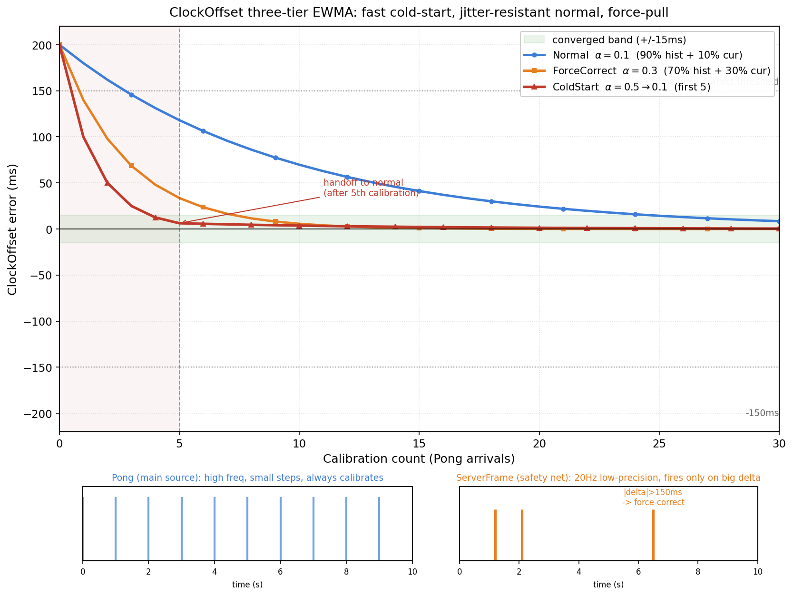
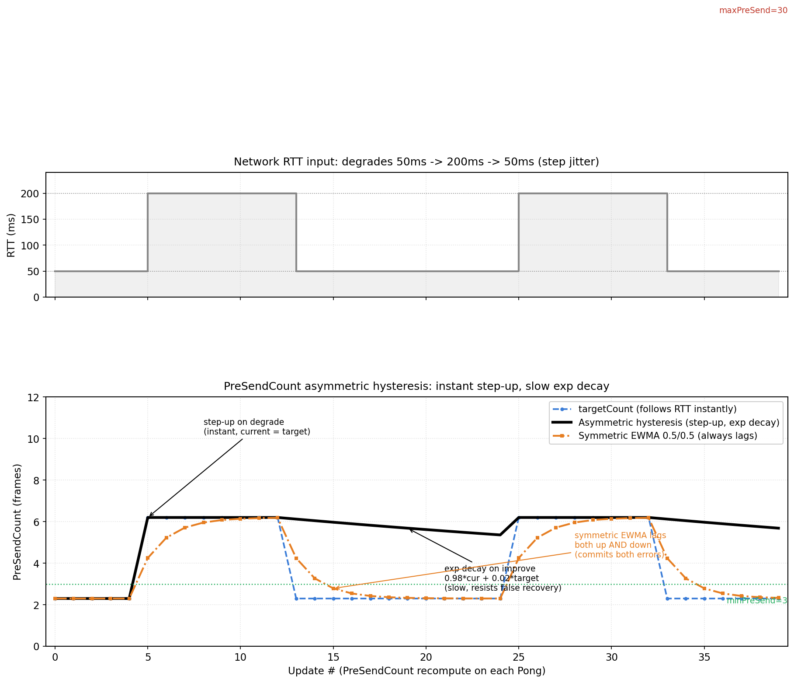
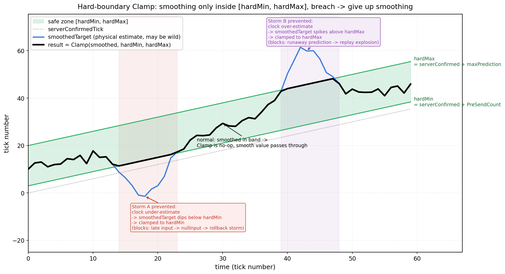

# 第 13 章 · 网络时钟 NetworkClock:Jacobson 算法与硬边界防回滚风暴

> **核心问题**:上一章 `LockstepDriver` 主循环里有一句 `_clock.GetTargetTick(serverConfirmedTick, MaxPredictionFrames)`,它返回"客户端此刻应该把输入发到第几帧"。这台客户端本地没有服务器时钟,只有自己的墙钟,两者之间隔着一个来回几十毫秒的网络;而且这个来回时间还在不停地抖。那客户端凭什么知道"服务器现在第几帧"?网络一会儿快一会儿慢,本地该提前几帧发输入才不会让服务器空等?更要命的是——一旦本地估错了帧号,要么落后到疯狂回滚,要么超前到无限制地"猜"未来,两种病都能把一局对战拖垮。这一章就把 `NetworkClock` 这个 343 行的组件拆透:它怎么估时钟偏差、怎么平滑抖动、怎么动态调预发送深度,以及——最关键的——怎么用一对硬边界把"平滑"和"安全"分层,从根上防住回滚风暴。

> **读完本章你会明白**:
> 1. 客户端怎么在不拥有服务器时钟的前提下,估算"服务器现在第几帧"——`elapsedMs = localNow - gameStartTimestampMs + clockOffsetMs`,以及这个 `clockOffsetMs` 怎么靠 Pong 包一点一点校准。
> 2. RTT 抖动怎么平滑——Jacobson 算法的两个 EWMA(SRTT 87.5% 历史 + 12.5% 当前,RTTVAR 75% 历史 + 25% 当前),为什么是 RFC6298 这套系数,以及它和 TCP RTO 的区别(帧同步不算 RTO,只拿 `SRTT/2 + 4·RTTVAR` 当 jitter buffer 目标)。
> 3. ★硬边界防回滚风暴——`smoothedTarget`(物理估算)可以在 `[hardMin, hardMax]` 区间内自由滑动,但触界即放弃平滑:`hardMin` 防本地跑太慢触发无谓回滚,`hardMax` 防无限制预测爆炸。这是"平滑与硬约束分层"。
> 4. ★不对称迟滞(PreSendCount)——增加预测深度是便宜的保险,减少预测深度是昂贵的冒险,所以"网络变差立即增深、网络变好按 0.98/0.02 缓慢衰减",防预测深度随抖动反复横跳。
> 5. ClockOffset 三档 EWMA(冷启动 0.5 快收敛 / 常规 0.1 抗抖 / 大偏差 0.3 强拉),以及"Pong 主源 + ServerFrame 安全网"的双向校准策略。

> **如果一读觉得太难**:先只记住三件事——① 客户端没法直接读服务器时钟,只能靠 Pong 包测 RTT、估单向延迟、慢慢校准 `clockOffsetMs`;② ★`GetTargetTick` 返回的帧号永远被 `Clamp` 在 `[serverConfirmedTick+PreSendCount, serverConfirmedTick+maxPredictionFrames]` 里,平滑的物理估算只要出了这个区间就被硬截断——这是防回滚风暴的根本;③ 预发送深度"增快减慢"(变差阶跃增深、变好指数衰减),因为多预测几帧代价小、少预测几帧代价大。Jacobson 系数和三档 EWMA 的细节需要时再回来看。

---

## 〇、一句话点破

> **`NetworkClock` 在做一件表面上不像帧同步的事——它不保证确定性,反而主动接纳不确定性:本地时钟和服务器时钟一定有偏差,网络 RTT 一定在抖,它的工作是用 Jacobson 算法把抖动平滑掉(SRTT/RTTVAR 两个 EWMA),用三档 EWMA 把时钟偏差慢慢校准过来(冷启动快收敛 / 常规抗抖 / 大偏差强拉),用不对称迟滞动态决定"提前几帧发输入"(变差立即增深、变好缓慢衰减)。但所有这些平滑都不是无条件信任的——`GetTargetTick` 的最后一行是 `Clamp(smoothedTarget, hardMin, hardMax)`:只要平滑后的物理估算敢跑出 `[serverConfirmedTick+PreSendCount, serverConfirmedTick+maxPredictionFrames]` 这对硬边界,就被一刀截回安全区。平滑是手段,硬边界是底线,两者分层——这是防回滚风暴的全部秘密。**

这是结论。本章倒过来拆:先讲"估服务器第几帧"这件事到底难在哪,再讲 Jacobson 算法怎么把 RTT 抖动驯服,接着拆 ClockOffset 三档校准,然后正面拆"回滚风暴"是怎么被硬边界挡住的,最后是不对称迟滞为什么这么设计。

---

## 一、为什么需要一颗"网络时钟":本地估服务器第几帧

### 先回到 Driver 的主循环

上一章 `LockstepDriver.Update` 在网络模式下走 `StepNetworkFrames`,它第一步就问 Clock:

```csharp
// LockstepDriver.cs:574
int targetTick = _clock!.GetTargetTick(_controller!.CurTickInServer, MaxPredictionFrames);
```

这个 `targetTick` 是"客户端此刻应当把输入发到的目标帧号"。Driver 拿它做三件事:① 当本地 `_inputTick` 落后于它时,补发几帧把欠的补上(`inputFloor = GetInputTickFloor`);② 当累加器够时,匀速往前推 `_inputTick` 并发输入;③ 拿 `_inputTick - targetTick` 做软纠偏(落后就稍微加速、超前就稍微减速,但每帧最多修几毫秒)。

`targetTick` 估错了会怎样?两种病:

- **估低了(本地以为服务器还在第 100 帧,其实服务器已经到第 110 帧)**:客户端发出去的输入帧号太靠后,服务器在第 110 帧的输入聚合时根本没等到这份输入,只能给这个客户端填 `nullInput`——也就是说,这个客户端这一帧"什么都没按"被服务器确认下来,而它本地预测以为自己按了。预测和权威一比对,触发回滚。下一帧又估低,又回滚……**回滚风暴**。玩家的手感是:我一按方向键,坦克先是动了,然后每隔几帧猛地抽一下(回滚重演)。

- **估高了(本地以为服务器在第 120 帧,其实才到第 105 帧)**:客户端疯狂往前预测,跑到服务器前面十几帧。等服务器权威帧慢慢追上来,要么一直对不上(本地预测错得离谱,因为后面十几帧全是猜的),要么一收到权威帧就大回滚。更糟的是,`maxPredictionFrames`(默认 20)会被吃满,客户端 CPU 跑到极限,**预测爆炸**。

所以 `targetTick` 必须估得既不偏低也不偏高,而且要稳——不能因为网络抖一下就跳几帧。这就是 `NetworkClock` 存在的全部理由。

### 朴素做法撞什么墙:整数除法算帧号

最朴素的估法是 `RECONSTRUCTION_LOG §2.2` 记载的旧版做法:**整数除法算帧号**。

```csharp
// 朴素(已被废弃):
long elapsedMs = DateTimeOffset.UtcNow.ToUnixTimeMilliseconds() - gameStartTimestampMs;
int targetTick = (int)(elapsedMs / frameIntervalMs);   // 直接拿本地墙钟算
```

这个写法有两个致命问题:

1. **本地墙钟 ≠ 服务器墙钟**。`gameStartTimestampMs` 是服务器在 `GameStartMessage` 里塞过来的"游戏开始时刻的 UTC 毫秒"。但这个时刻是服务器时钟给的,客户端收到这个包时,中间已经隔了半个 RTT——也就是说,客户端的"现在"和服务器定义的"游戏开始"之间存在一个偏差(本地比服务器晚了大约 RTT/2,再加上两台机器时钟本身的漂移)。直接拿本地墙钟减去服务器时间戳,得到的是"客户端视角下游戏开始多久了",而我们需要的是"服务器视角下游戏开始多久了"。这两者差一个 `clockOffsetMs`。

2. **本地墙钟会被 NTP 调整**。如果用户的系统在跑游戏时同步了一次 NTP,墙钟可能往前或往后跳几十毫秒甚至几秒。`elapsedMs` 一跳,`targetTick` 跳好几帧,客户端直接乱套。(服务器侧第 14 章会讲它怎么用单调钟 `Stopwatch` 防这个;客户端侧这一章的 Clock 也用 `Max(0, elapsedMs)` 兜底防回拨。)

> **所以这样设计**:Clock 不直接信任本地墙钟,而是维护一个 `clockOffsetMs`,把"本地墙钟"换算成"服务器墙钟的估计":

```csharp
// NetworkClock.cs:201(简化)
long localNow = DateTimeOffset.UtcNow.ToUnixTimeMilliseconds();
long elapsedMs = localNow - _gameStartTimestampMs + _clockOffsetMs;
```

`_clockOffsetMs` 的物理含义是"本地时钟领先服务器多少毫秒"(粗略地说)。这个值不是一次测准的——它靠每个 Pong 包一点一点校准(本章后面拆)。先把"怎么算帧号"这条主干走完。

### 算帧号的两层:物理估算 + 平滑补偿

有了 `elapsedMs`(估算的"服务器视角下游戏开始多久了"),下一行就把它转成帧号:

```csharp
// NetworkClock.cs:204-205
int physicalTick = (int)(elapsedMs / _frameIntervalMs);
int smoothedTarget = physicalTick + PreSendCount;
```

这里有两层,值得分开看:

- `physicalTick` 是**纯物理估算**:服务器按 20Hz 推进了这么久,理论上是第几帧。这是个不带任何网络补偿的"光速估算"。
- `smoothedTarget` 在物理估算之上加了一个 `PreSendCount`,这是 **jitter buffer**:因为输入要提前半个 RTT 发出去才能赶上服务器那一帧的聚合,加上抖动余量,所以本地目标帧要再往前推几帧。这个 `PreSendCount` 是动态的(本章第五节拆)。

到这里 `smoothedTarget` 就是"平滑后的目标帧"。但——

> **钉死这件事**:`smoothedTarget` 不是 `GetTargetTick` 的返回值。它是**待裁剪的候选值**。真正返回的,是它经过硬边界 `Clamp` 之后的结果。这一步是本章的重头戏,第四节正面拆。先把 `clockOffsetMs` 怎么校准讲透。

---

## 二、RTT 测量:Clock 不自测,消费传输层的 Pong

在讲 Jacobson 平滑之前,先澄清一个容易混淆的点:**`NetworkClock` 自己不发 Ping,也不测 RTT**。

RTT 测量在传输层(`INetworkClient.Ping` 属性)。客户端定期发 `PingMessage{ClientTimestamp}` 给服务器,服务器原样回 `PongMessage{ClientTimestamp, ServerTimestamp}`(见 `PingHandler.cs:14-33`)。传输层收到 Pong 时算 `now - pong.ClientTimestamp` 得到这次 Ping 的往返时间,维护在 `.Ping` 属性里。

Driver 的消息处理里,收到 Pong 时把两样东西转给 Clock:

```csharp
// LockstepDriver.cs:695-702(简化)
case PongMessage pongMsg:
    int ping = _client?.Ping ?? 50;                        // 传输层维护的 RTT
    _clock?.UpdateFromPong(ping, pongMsg.ServerTimestamp); // 服务器时间戳
    Metrics.RecordRtt(ping);
    break;
```

注意 `pongMsg.ServerTimestamp` 是服务器**在发出 Pong 那一瞬间**读自己的墙钟填进去的。客户端收到这个包时,知道:

- 这次 Ping 的 RTT = `ping`(传输层已算好);
- 服务器发出 Pong 的时刻(服务器墙钟)= `pongMsg.ServerTimestamp`;
- 客户端收到 Pong 的时刻(客户端墙钟)= `localNow`。

那么"客户端墙钟"和"服务器墙钟"在这一刻的偏差可以估为:

```
   clockOffset ≈ localNow - (serverTimestamp + ping/2)
```

`ping/2` 是对"单向延迟"的估计——这里隐含一个**对称链路假设**(去程 = 回程 = RTT/2)。这个假设在公网上经常不成立(去程和回程走不同路由很常见),但它是工程上能用的最好估计,而且 Jacobson 平滑会把这个误差吃进 RTTVAR 里抖掉。

`UpdateFromPong` 干三件事:① 把 `ping` 喂给 Jacobson 算法更新 SRTT/RTTVAR;② 用上面这个公式估出 `currentOffset`,喂给 `SmoothClockOffset` 平滑校准 `_clockOffsetMs`;③ 调 `UpdatePreSendCount` 重算预发送深度。下面三节分别拆这三件事。

> **作者复盘 · 为什么 Clock 不自测 RTT**:把 RTT 测量放在传输层而不是 Clock,是有意的解耦。传输层(TCP/UDP/WebSocket/KCP)已经在做心跳和 keepalive,Ping/Pong 是它们的事;Clock 只是个"消费者",谁给我 RTT 我就平滑。这样新增一种传输层(比如第 17 章的 KCP 真实现)时,Clock 一行不用改。代价是 Clock 假设传输层的 Ping 是合理的——如果某个传输层实现把 Ping 算错(比如忘了减去队列延迟),Clock 会被带偏。这是个"信任接口"的设计权衡。

---

## 三、Jacobson 算法:把 TCP 的 RTT 平滑搬到帧同步

### 为什么不能直接用"最近一次 RTT"

最朴素的 RTT 用法是:每次 Pong 回来,直接拿 `ping` 当 RTT。但 `ping` 是**单次采样**,公网上相邻两次 ping 可以差两三倍(一个 30ms,下一个 90ms 是常事)——这是因为路由器队列长度在变、跨运营商在变、无线信号在抖。

如果直接拿单次 `ping` 算预发送深度(`targetCount = ping/2/frameInterval + 1`),那预发送深度会跟着 ping 上蹿下跳:网络抖一下,深度从 3 跳到 8,再抖一下跳回 4。深度一跳,`GetTargetTick` 返回的帧号就跳,Driver 一会儿补发一会儿闲着,本地预测深度忽大忽小,回滚频率跟着抖。这跟"不要让 targetTick 剧烈跳变"的设计目标完全冲突。

所以 RTT 必须平滑——不能拿单次采样当真,但也不能完全不响应(网络真的变差了,得慢慢跟上去)。这就是 EWMA(指数加权移动平均)出场的地方。EWMA 在数学线《概率论》那本讲过(它就是个一阶 IIR 低通滤波器,这里不重复推导),本章只讲帧同步特有的部分:为什么是 Jacobson 这套系数。

### Jacobson 算法:两个 EWMA,不是

Jacobson 算法(1988 年 Van Jacobson 提出,RFC6298 是现在的标准化版本)用**两个 EWMA**来描述 RTT 的统计特性:

- **SRTT(Smoothed RTT)**:RTT 的平滑均值,代表"RTT 的典型值"。
- **RTTVAR(RTT Variation)**:RTT 的平滑方差,代表"RTT 抖得多厉害"。

`NetworkClock.cs:299-302` 的实现:

```csharp
// RTTVAR = (1 - beta) * RTTVAR + beta * |SRTT - RTT|
_rttVar = (1 - RttBeta) * _rttVar + RttBeta * Math.Abs(_srtt - rttMs);
// SRTT = (1 - alpha) * SRTT + alpha * RTT
_srtt = (1 - RttAlpha) * _srtt + RttAlpha * rttMs;
```

系数在 `NetworkClock.cs:42-43`:

```csharp
private const float RttAlpha = 0.125f;  // SRTT 权重 (1/8)
private const float RttBeta = 0.25f;    // Jitter 权重 (1/4)
```

> **钉死这件事(本书已核实的文档与代码出入)**:`RttBeta = 0.25f`,不是 0.125。项目早期文档和 README 里只提"0.875/0.125 平滑",容易让人以为两个系数都是 0.125。但 RFC6298 §2.3 明确规定 RTTVAR 的权重是 1/4,SRTT 的权重才是 1/8。源码 `NetworkClock.cs:43` 写的是 `RttBeta = 0.25f`,这是对的。读者查 RFC 时认准 `beta = 1/4`。

### 为什么 alpha=1/8, beta=1/4

把这两个常数翻译成大白话:

- **SRTT = 87.5% 历史 + 12.5% 当前**(`alpha = 1/8`):RTT 的"典型值"主要看历史,新采样只占 1/8 权重。这意味着即使 ping 突然从 50ms 跳到 200ms,SRTT 一次更新只会从 50 涨到 `50×0.875 + 200×0.125 = 68.75ms`,要十几次持续的高 ping 才会慢慢爬到 200。这就是"抗抖"——单次抖动打不穿 SRTT。
- **RTTVAR = 75% 历史 + 25% 当前**(`beta = 1/4`):方差对当前更敏感一些(1/4 > 1/8),因为方差本来就是用来反映"偏离典型值有多远",它需要比均值更快地响应突发抖动。但 75% 历史仍然占主导,防止单次离群点把 RTTVAR 拉飞。

这两个系数不是拍脑袋定的——RFC6298 是经过整个互联网工程界几十年实测调出来的,TCP 用的就是它。帧同步把 RTT 平滑从 TCP 直接搬过来,合理性来自同一组理由:网络抖动的统计特性(短期自相关 + 长尾)对 TCP 和帧同步是一样的。

> **承接数学线**:EWMA 是个一阶 IIR 低通滤波器,截止频率由 `(1-alpha)` 决定,alpha 越小截止频率越低、滤得越狠。这条在《概率论》那本的"时间序列平滑"一节讲过,本章不重复推导,只强调帧同步特有的选择——为什么选 RFC6298 的 1/8 而不是更激进或更保守的值。篇幅留帧同步特有的。

### 首次样本的特殊处理

`UpdateRtt`(`NetworkClock.cs:287-303`)有一段对首次样本的特殊处理:

```csharp
if (_srtt == 0)
{
    // 首次初始化
    _srtt = rttMs;
    _rttVar = rttMs / 2f;
}
```

为什么首次不按 EWMA 公式走?因为 EWMA 需要一个"历史值"做底,首次调用时 SRTT 还是 0,直接套公式 `_srtt = 0×0.875 + rtt×0.125 = rtt/8`,把第一次 RTT 压成 1/8,完全失真。所以 RFC6298 规定首次样本直接当 SRTT,RTTVAR 取 RTT/2(RFC6298 §2.2 的推荐初值,表示"我们对抖动一无所知,先估半个 RTT")。

`Initialize` 里也是一样(`NetworkClock.cs:102-103`):

```csharp
_srtt = initialPingMs;
_rttVar = initialPingMs / 2f;
```

初始 ping 给 50ms(在 Driver 里 `_client?.Ping ?? 50`),SRTT=50,RTTVAR=25,从此开始正常 EWMA。

### 帧同步不算 RTO,只用 SRTT+4·RTTVAR 当 jitter buffer

这里有一个和 TCP 的关键区别,值得讲清楚。

TCP 的 Jacobson 算法,最终目的是算 **RTO(Retransmission Timeout)**——多久没收到 ACK 就重传。RFC6298 的公式是 `RTO = SRTT + max(G, 4·RTTVAR)`(G 是时钟粒度)。TCP 拿 SRTT 当基线,加 4 倍方差当"安全余量"——4 倍是假设 RTT 近似正态分布时,覆盖到 99.99% 的尾部分位数。

帧同步的 `NetworkClock` **不算 RTO**。它不需要重传定时器(丢包靠冗余历史帧补,见第 17 章)。它把"4 倍方差"这个 RFC 思路挪到另一个地方——**jitter buffer 的目标延迟**:

```csharp
// NetworkClock.cs:47
private const float JitterSafetyFactor = 4f;

// NetworkClock.cs:313
float targetDelayMs = (_srtt / 2f) + (JitterSafetyFactor * _rttVar);
```

`targetDelayMs` 是"预发送缓冲的目标时间"。它的含义是:本地应该提前这么多毫秒把输入发出去,才能在 99.99% 的情况下赶在服务器那一帧的聚合时刻之前到达。前半截 `SRTT/2` 是单向延迟的均值(对称链路假设),后半截 `4·RTTVAR` 是抖动余量(同样是 4 倍,同样是 99.99% 覆盖)。这个值再除以帧间隔,就得到预发送深度 `PreSendCount`(第五节详拆)。

> **钉死这件事**:Jacobson 算法在帧同步里的用法和 TCP 不一样——TCP 拿 `SRTT + 4·RTTVAR` 当**重传超时**(RTO),帧同步拿 `SRTT/2 + 4·RTTVAR` 当**预发送缓冲目标延迟**(单向延迟 + 抖动余量)。系数都来自 RFC6298,但用途完全不同。帧同步不重传(靠冗余帧),它只是借这套 EWMA 把"提前几帧发"这个决策做稳。

---

## 四、ClockOffset 三档 EWMA:快收敛、抗抖、强拉,一个值搞不定

### 单值 EWMA 的两难

上面讲 RTT 平滑用单值 EWMA(alpha=1/8)就够了,为什么 ClockOffset 要搞三档?

因为 ClockOffset 的"理想平滑因子"会随场景剧烈变化:

- **刚进游戏(冷启动)**:此时 `_clockOffsetMs` 是用初始 ping 50ms 瞎估的,和真实偏差可能差上百毫秒。这时候应该**激进校准**——factor 大一点(比如 0.5),用头几个 Pong 把偏差快速拉回来。如果还用 0.1,要几十次 Pong 才收敛,前几秒客户端一直用错时钟估帧号,体验极差。
- **稳定运行**:偏差已经收敛,这时候应该**保守**——factor 小一点(0.1),防单次 Pong 的测量噪声把好不容易收敛的偏差又拉偏。公网 RTT 在 30-100ms 之间随机跳,如果 factor 太大,`_clockOffsetMs` 会跟着测量值左右摇摆,`targetTick` 跟着抖。
- **突发大偏差**:稳定运行时,突然出现很大的偏差(比如客户端切了 WiFi、服务器侧 GC 卡了一下)。这种情况下,继续用 0.1 太慢——要好几秒才能把大偏差拉回来,期间客户端一直估错帧号。这时候应该**强拉**——factor 大一点(0.3),快速吃掉突发偏差。

一个单值 factor 无法同时满足这三个场景:小了冷启动慢、大了稳态抖。所以 `NetworkClock` 分了三档(`NetworkClock.cs:32-37, 54-55, 260-282`)。

### 三档的实现

```csharp
// NetworkClock.cs:32-37, 54-55
private const double OffsetSmoothingFactor = 0.1;        // 常规: 90% 历史 + 10% 当前
private const long OffsetForceCorrectThresholdMs = 150;  // 强修正阈值
private const double OffsetForceCorrectFactor = 0.3;     // 强修正: 70% 历史 + 30% 当前
private const int ColdStartThreshold = 5;                // 冷启动次数
private const double ColdStartFactor = 0.5;              // 冷启动: 50% 历史 + 50% 当前
```

```csharp
// NetworkClock.cs:260-282(简化)
private void SmoothClockOffset(long newOffset, bool isForceCorrect)
{
    if (!_isInitialized) { _clockOffsetMs = newOffset; return; }
    _calibrationCount++;

    double factor;
    if (_calibrationCount <= ColdStartThreshold)
        factor = ColdStartFactor;                                    // 档一: 冷启动
    else
        factor = isForceCorrect ? OffsetForceCorrectFactor          // 档三: 强修正
                                : OffsetSmoothingFactor;             // 档二: 常规

    _clockOffsetMs = (long)(_clockOffsetMs * (1 - factor) + newOffset * factor);
}
```

三档的优先级是:**冷启动优先(前 5 次),之后看 `isForceCorrect` 标志**。`isForceCorrect` 由调用方决定——Pong 走来时 `isForceCorrect = false`(常规校准),ServerFrame 校准时如果偏差 > 150ms 才 `isForceCorrect = true`(后面讲为什么)。

### 为什么阈值是 150ms

`OffsetForceCorrectThresholdMs = 150` 这个数字,源码注释(`NetworkClock.cs:34-35`)解释得很直白:"约 3 帧 @20fps,既能容忍正常抖动,又能快速响应真正的时钟漂移"。

帧间隔是 50ms(20fps),150ms = 3 帧。也就是说:**只有当估算的偏差和当前维护的偏差相差超过 3 帧时,才认为是"真偏差"而不是"测量噪声"**。3 帧是个经验值——正常网络抖动很少会让连续两次 Pong 估出的偏差相差 3 帧以上(那意味着 RTT 突然变了 150ms,这要么是网络真出事了,要么是时钟真漂了),而测量噪声(单次 ping 跳几十毫秒)通常在 1-2 帧以内。

> **作者复盘 · 150ms 硬编码的代价**:这个 150ms 是硬编码的,源码注释自己也承认"如需支持高延迟环境(如跨洲服务器),可考虑提取为构造参数"。这是个"配置项该不该外露"的经典权衡。本书第 18 章 SDK 化会专门讲这个——一开始硬编码简单,真要支持跨洲对战时才发现每个游戏的"正常抖动"定义不同(MOBA 容忍 150ms,格斗游戏可能只容忍 80ms),这时候就得把它做成 `LockstepClientBuilder` 的可配项。教训:**网络相关的所有阈值,默认值都是针对特定场景调的,做 SDK 时最好全做成可注入**。

### Pong 主源 + ServerFrame 安全网

`SmoothClockOffset` 有两个调用入口,精度不同:

- **主源:Pong**(`UpdateFromPong` → `SmoothClockOffset(currentOffset, isForceCorrect: false)`)。Pong 是专门的时钟校准协议,服务器在 `PingHandler` 里读自己墙钟填 `ServerTimestamp`,精度是毫秒级。所以 Pong 校准走"常规档"(0.1),每次都校。
- **安全网:ServerFrame**(`UpdateFromServerFrame`)。ServerFrame 帧号本身是整数,反推服务器时间 `_gameStartTimestampMs + serverFrameTick × _frameIntervalMs`,精度只有帧间隔(50ms)——而且服务器从"决定广播这一帧"到"实际发出包"还有处理延迟,不精确。所以 ServerFrame 校准**只在偏差 > 150ms 时才介入**,而且介入时标 `isForceCorrect = true` 走强修正档(0.3):

```csharp
// NetworkClock.cs:163-167(简化)
long delta = Math.Abs(measuredOffset - _clockOffsetMs);
if (delta > OffsetForceCorrectThresholdMs)
    SmoothClockOffset(measuredOffset, isForceCorrect: true);
```

为什么要有这个安全网?因为 Pong 是周期性的(比如每秒一次),如果连续几个 Pong 丢包(UDP 下很常见),`_clockOffsetMs` 就好几百毫秒没人校准,慢慢漂走。ServerFrame 是每帧都来的(20Hz),它精度差但**频率高**,能当"低精度的兜底"——偏差累积到 150ms 以上时,ServerFrame 校准会介入,把漂走拉回来。

> **钉死这件事**:ClockOffset 双向校准——Pong 是主源(高精度,每次都校,常规档 0.1),ServerFrame 是安全网(低精度,偏差 > 150ms 才介入,强修正档 0.3)。这个分工的逻辑是:**高精度源负责精校,低精度源负责兜底防累积漂移**。如果只有 Pong,Pong 丢包时偏差会漂;如果只有 ServerFrame,它的 50ms 精度会让 `_clockOffsetMs` 永远抖在 ±50ms。



> **图说(fig-13-clock-offset-three-tier-ewma)**:横轴是校准次数,纵轴是 `_clockOffsetMs`(ms)。三条曲线分别对应三档 factor(0.5 冷启动 / 0.1 常规 / 0.3 强修正)从同一个初始偏差(如 200ms)收敛到真实偏差(如 0ms)的轨迹。冷启动档 5 次内快速逼近,常规档缓慢爬行,强修正档中等速度。下方另画一条时间轴标"Pong(主源,高频小步)/ ServerFrame(安全网,低频大步,仅偏差 > 150ms 触发)"两个校准源的触发模式。英文标注:Y=`ClockOffset (ms)`, X=`Calibration count`, 三条线 `ColdStart α=0.5` / `Normal α=0.1` / `ForceCorrect α=0.3`, 安全区虚线 `±150ms threshold`。

---

## 五、PreSendCount 动态:不对称迟滞

### 预发送深度是什么,为什么不是常数

`PreSendCount` 是"本地目标帧比服务器确认帧领先几帧"。它是 jitter buffer 的帧数形态。上一节我们说它的目标延迟是 `SRTT/2 + 4·RTTVAR`,转成帧数:

```csharp
// NetworkClock.cs:313-316
float targetDelayMs = (_srtt / 2f) + (JitterSafetyFactor * _rttVar);
float targetCount = (targetDelayMs / _frameIntervalMs) + 1.0f;
```

`+1.0f` 是基准缓冲(保证至少领先一帧)。这个 `targetCount` 是"理论最优的预发送帧数"。但 Clock **不直接用它**,而是走一个不对称的迟滞更新:

### ★不对称迟滞:增快减慢

```csharp
// NetworkClock.cs:318-332
if (targetCount > _currentPreSendCountFloat)
{
    // 网络变差 - 立即增加
    _currentPreSendCountFloat = targetCount;          // ← 阶跃
}
else
{
    // 网络变好 - 缓慢衰减(防止抖动)
    _currentPreSendCountFloat = _currentPreSendCountFloat * 0.98f + targetCount * 0.02f;   // ← 指数衰减
}

int newCount = (int)Math.Ceiling(_currentPreSendCountFloat);
PreSendCount = Math.Clamp(newCount, _minPreSendCount, _maxPreSendCount);
```

这是本章第二个招牌技巧。仔细看这两条分支的不对称:

- **网络变差(`targetCount > current`)**:立即把 `current` 拉到 `target`——**阶跃增深**,一步到位。
- **网络变好(`targetCount <= current`)**:不直接降,而是按 `current×0.98 + target×0.02` 缓慢衰减——每帧只往下降 2% 的差距,**指数衰减**。

为什么这么不对称?这背后的逻辑是**两种错误的代价不对等**:

- **预测深度不够(低估了网络延迟)**:输入来不及赶到服务器,服务器给这个客户端填 `nullInput`,触发回滚。回滚要重演 N 帧,代价高(CPU + 状态序列化 + 玩家可见的瞬跳)。
- **预测深度过大(高估了网络延迟)**:多预测几帧。多预测一帧的代价是一次本地模拟的 CPU,以及"猜错时回滚多重演一帧"——但只要 `maxPredictionFrames` 兜底,这个代价是可控的、有界的。

前者的代价是无界的(回滚风暴),后者的代价是有界的(多算几帧)。所以策略应该是:**宁可多预测,不可少预测**。变差时立即增深(防回滚风暴),变好时缓慢衰减(防深度被一次"假好转"拉低后、下一次抖动又不够用)。

> **钉死这件事(不对称迟滞)**:`PreSendCount` 的更新是"增快减慢"——网络变差时 `_currentPreSendCountFloat = targetCount`(阶跃增深),网络变好时 `_currentPreSendCountFloat = 0.98×current + 0.02×target`(指数衰减)。背后的代价不对称:少预测的代价是回滚风暴(无界),多预测的代价是几帧 CPU(有界)。所以宁可多预测。

### 反例:对称更新会怎样

假设用对称的 EWMA:`current = 0.5×current + 0.5×target`(两边各一半)。网络在 3 帧和 8 帧之间来回抖:

```
   ping 序列(变差 / 变好 / 变差 / 变好):
     target 序列:    3 → 8 → 3 → 8 → 3 → 8 ...
     对称 EWMA:      3 → 5.5 → 4.25 → 6.1 → 4.6 → 5.8 ...   (永远跟不上)
     不对称(本作):   3 → 8 → 7.8(衰2%) → 8 → 7.8 → 8 ...    (变差立即跟上, 变好不降)
```

对称 EWMA 永远比真实需求慢半拍——网络变差那一帧它没跟上,客户端少预测了几帧,触发回滚;网络变好那一帧它没降下来,客户端多预测了几帧。**两种错误交替犯**。而不对称迟滞保证"变差一定跟得上"(增深是阶跃的),"变好才慢慢降"(降深有 2% 阻力),回滚频率显著降低。

### Clamp 的下限和上限

```csharp
// NetworkClock.cs:84-85, 332
_minPreSendCount = 3;    // 构造默认
_maxPreSendCount = 30;
PreSendCount = Math.Clamp(newCount, _minPreSendCount, _maxPreSendCount);
```

下限 3 保证即使 RTT 极小(LAN 环境,RTT<10ms),也至少预发 3 帧——这是给"网络突然变差但 Jacobson 还没跟上"留的余量。上限 30 防止极端网络(RTT 飙到 1 秒以上)把预发送深度拉到几十帧,吃满 `maxPredictionFrames` 让客户端 CPU 跑死。这两个边界和第四节要讲的硬边界配合,共同把"最坏情况"框死。



> **图说(fig-13-presend-asymmetric-hysteresis)**:横轴是时间(Pong 次数),纵轴是帧数。画三条曲线:① `RTT 真实值`(灰色,在 50ms 和 200ms 之间阶跃抖动);② `targetCount`(虚线,跟随 RTT 阶跃);③ `_currentPreSendCountFloat` 实际值(粗黑线,RTT 上升时和 targetCount 重合阶跃上升,RTT 下降时缓慢指数衰减,形成"上升直角 / 下降斜坡"的锯齿)。右侧附小图:对比"对称 EWMA"在同一组 RTT 下的曲线(永远滞后,跟不上)。英文标注:Y=`PreSendCount (frames)`, X=`Update #`, `step-up on degrade`, `exp decay on improve`。

---

## 六、★硬边界防回滚风暴(本章招牌)

前面五节都是"平滑"——平滑 RTT、平滑 ClockOffset、平滑 PreSendCount。但所有这些平滑都有一个共同的问题:**它们都建立在"测量值大致可信"的假设上**。一旦这个假设崩了(时钟突然漂、Pong 持续丢包、NTP 调了本地墙钟),平滑出来的 `smoothedTarget` 可能离谱到很远。这时候如果直接拿它当 `targetTick`,就是灾难。

`GetTargetTick` 的最后一行是本章的灵魂:

```csharp
// NetworkClock.cs:212
int result = Math.Clamp(smoothedTarget, hardMin, hardMax);
```

**平滑只在 `[hardMin, hardMax]` 区间内生效,触界即放弃平滑**。这一节正面拆。

### 回滚风暴是怎么起来的

先把"回滚风暴"这个名词坐实。假设没有硬边界,`targetTick = smoothedTarget = physicalTick + PreSendCount`。

**风暴场景 A(本地跑太慢)**:客户端的 `_clockOffsetMs` 因为某种原因估偏了(比如 Pong 连续丢包,ServerFrame 又没触发强修正),`elapsedMs` 算出来比真实值小很多。`physicalTick` 偏低,`smoothedTarget` 偏低。Driver 看到 `targetTick` 偏低,认为"我不需要预测那么多",于是 `_inputTick` 停在低位。但服务器在按物理时间往前推进——服务器都到第 110 帧了,客户端还在发第 100 帧的输入。服务器在第 105、106、107... 帧都给这个客户端填了 `nullInput`。

这些 `nullInput` 帧最终通过 ServerFrame 发回客户端,客户端 `ConfirmServerFrames` 一比对:本地预测时以为自己按了方向键,权威帧说"你没按",触发回滚。回滚到第 100 帧,重演 5 帧到第 105 帧。然后下一帧 ServerFrame 来了,又对不上,又回滚……**每收到一帧权威帧就回滚一次**,玩家的坦克在屏幕上一抽一抽。这就是回滚风暴。

**风暴场景 B(本地跑太快)**:反过来,`_clockOffsetMs` 估偏让 `elapsedMs` 偏大,`physicalTick` 飙高,`smoothedTarget` 飙高。Driver 疯狂推 `_inputTick`,客户端预测到第 130 帧,而服务器才到第 105 帧。预测深度 25 帧——吃满 `maxPredictionFrames`(默认 20)后被截断,但前 20 帧全是猜的,等服务器权威帧慢慢追上来,几乎每一帧都对不上(因为后 20 帧本地完全是瞎猜的输入),**回滚连绵不绝**,而且 CPU 跑在极限,客户端可能卡顿。

两个方向都是风暴。根因都是"`smoothedTarget` 这个平滑值,在异常情况下可能离谱到很远,而 Driver 无条件信任它"。

### hardMin:防本地跑太慢

```csharp
// NetworkClock.cs:208
int hardMin = serverConfirmedTick + PreSendCount;
```

`serverConfirmedTick` 是服务器确认到的最新帧(从 Controller 拿,见上一章 Driver 传 `_controller.CurTickInServer`)。`PreSendCount` 是当前建议的预发送深度。两者相加,意思是:**不管平滑怎么说,本地目标帧至少要比服务器确认帧领先 PreSendCount 帧**。

这条边界挡的是风暴场景 A。哪怕 `smoothedTarget` 因为时钟估偏掉到 `serverConfirmedTick - 50`,只要 `hardMin = serverConfirmedTick + 3`,Clamp 之后 `result = hardMin`,本地至少领先 3 帧。Driver 推 `_inputTick` 到 `hardMin`,补发几帧,把欠的输入补上。服务器下一次聚合就能拿到这个客户端的输入,不再填 `nullInput`,回滚风暴止住。

> **钉死这件事(hardMin)**:`hardMin = serverConfirmedTick + PreSendCount`。它的物理含义是"不管平滑怎么估,本地至少领先服务器确认帧这么多"。挡的是"本地估低 → 发的输入晚到 → 服务器填 nullInput → 回滚风暴"这条因果链。`PreSendCount` 在这里是"最小安全余量"——哪怕物理估算完全坏掉,只要领先这么多帧,大部分情况下输入能赶上服务器。

### hardMax:防无限制预测爆炸

```csharp
// NetworkClock.cs:209
int hardMax = serverConfirmedTick + maxPredictionFrames;
```

`maxPredictionFrames` 是配置项(Driver 的 `MaxPredictionFrames`,默认 20,LowLatency 预设 50)。它的物理含义是"客户端最多比服务器确认帧领先这么多帧"。

这条边界挡的是风暴场景 B。哪怕 `smoothedTarget` 飙到 `serverConfirmedTick + 200`,只要 `hardMax = serverConfirmedTick + 20`,Clamp 之后 `result = hardMax`,本地最多领先 20 帧。预测深度被框死在 20 以内,CPU 不会跑死,而且——更重要的是——20 帧以内的预测错了还能回滚重演得动(每帧 50ms,20 帧 = 1 秒,回滚重演 1 秒的运算量客户端扛得住);如果让预测深度飙到 200 帧(10 秒),一回滚就要重演 10 秒,客户端直接卡死。

> **钉死这件事(hardMax)**:`hardMax = serverConfirmedTick + maxPredictionFrames`。它的物理含义是"本地最多领先服务器确认帧这么多"。挡的是"本地估高 → 疯狂预测 → 预测深度爆炸 → 回滚重演量爆炸"这条因果链。`maxPredictionFrames` 是"最大可承受的回滚重演量"——超过这个值,一回滚客户端就卡死。

### ★平滑与硬约束分层

把两条边界合起来看,`GetTargetTick` 的语义是:

```
   smoothedTarget (平滑估算, 可能离谱)
        ↓ Clamp
   [hardMin, hardMax] (硬约束, 永远安全)
        ↓
   result (返回给 Driver 的目标帧)
```

正常情况下,`smoothedTarget` 落在 `[hardMin, hardMax]` 区间内,Clamp 不起作用,平滑值原样通过。Driver 拿到的是经过 Jacobson 平滑、ClockOffset 校准、PreSendCount 补偿的"精细估算"——这是平滑层在工作。

异常情况下(时钟漂、Pong 丢包、NTP 跳),`smoothedTarget` 跑出区间,Clamp 一刀截断到边界。Driver 拿到的是"安全值",不是"准确值"——但这个安全值保证不会触发回滚风暴(因为 `hardMin` 保证输入赶得上,`hardMax` 保证预测深度可控)。这是硬约束层接管。

> **钉死这件事(平滑与硬约束分层)**:`GetTargetTick` 的设计是"平滑与硬约束分层"——平滑层(Jacobson/ClockOffset/PreSendCount)在正常情况下提供精细估算,硬约束层(`hardMin`/`hardMax`)在异常情况下兜底保证安全。两层各司其职:**平滑层追求准,硬约束层追求稳**。这种分层是工程上处理"测量可能不可信"的通用模式——你永远需要一个"无论测量多离谱,输出都不会失控"的兜底。

### 反例:只有平滑没有硬边界

假设去掉 Clamp,直接 `return smoothedTarget`:

```csharp
// 假想的"无硬边界"版本(有 bug):
return smoothedTarget;
```

那前面讲的风暴场景 A 和 B 都会真实发生。更阴险的是,平滑算法本身会**放大**异常:`_clockOffsetMs` 一旦因为 Pong 丢包估偏,EWMA 的"87.5% 历史"会让它很难自己纠回来——历史里全是错的偏差,新测量值只占 12.5%,要好多次才能把错的偏差稀释掉。期间 `smoothedTarget` 一直离谱。没有硬边界兜底,客户端这段时间一直在风暴里。

这正是 `RECONSTRUCTION_LOG §2.2` 记载的架构演进的核心动机——从"整数除法算帧号"(无硬边界,直接信任本地墙钟)到"累加器驱动 + 时钟校准 + 硬边界"(平滑 + 硬约束分层)。前者不稳定,后者稳。



> **图说(fig-13-hard-boundary-clamp)**:横轴是时间(帧号),纵轴也是帧号(画三条带)。中间一条粗带 `[hardMin, hardMax]` 是安全区(绿色),标注 `hardMin = serverConfirmed + PreSendCount`、`hardMax = serverConfirmed + maxPrediction`。上方画一条 `smoothedTarget` 曲线(蓝色),它在大部分时间落在安全区内(直接通过),但在两个时刻跑出区间:① 一次掉到安全区下方(时钟估低),被 Clamp 到 hardMin(红线截断,标注"防风暴 A");② 一次冲到安全区上方(时钟估高),被 Clamp 到 hardMax(红线截断,标注"防风暴 B")。返回的 `result` 曲线(黑色加粗)永远是 `smoothedTarget` 落在区间内的部分 + 触界时贴着边走。底部小字标注两个风暴场景的因果链:"估低→晚到→nullInput→回滚" 和 "估高→爆预测→重演爆炸"。英文标注:Y/X=`Tick number`, `safe zone [hardMin, hardMax]`, `smoothedTarget clamped on breach`。

---

## 七、防回拨与时钟安全:Max(0, elapsedMs)

还有一个细节值得专门提一句。`GetTargetTick` 里有一行看似不起眼的防御:

```csharp
// NetworkClock.cs:201-203
long elapsedMs = localNow - _gameStartTimestampMs + _clockOffsetMs;
// 防御:时钟偏差校准异常或系统时间回拨时,elapsedMs 可能为负
elapsedMs = Math.Max(0, elapsedMs);
```

`elapsedMs` 正常情况下应该是正的(游戏开始了嘛,现在比开始时刻晚)。但它可能变负:

- **系统时间回拨**:用户的 NTP 把墙钟往回调了几秒。`localNow` 突然变小,`elapsedMs` 可能变负。
- **ClockOffset 校准异常**:`_clockOffsetMs` 是负的大数(比如本地时钟比服务器慢很多,加上测量噪声),减出来变负。

`elapsedMs` 一旦变负,`physicalTick = elapsedMs / _frameIntervalMs` 在 C# 里是**向零截断**(负数除以正数,得负数,向零取整)。`physicalTick` 变成负的(比如 -3),`smoothedTarget` 也负,虽然后面 Clamp 到 `hardMin`(正的)能救回来,但中间这个负数会让调试困惑、让 `Math.Clamp` 的语义不直观。

`Max(0, elapsedMs)` 把负值兜成 0,`physicalTick = 0`,`smoothedTarget = PreSendCount`,落在 `hardMin` 附近,行为可预测。这是个一行的小防御,但体现了"`GetTargetTick` 永远不能返回不可解释的值"这条原则——任何异常输入(回拨、估偏)都要被消化成一个合理的、可解释的输出。

> **钉死这件事**:`elapsedMs` 用 `Math.Max(0, ...)` 防回拨。系统时间回拨(NTP 调整)或 ClockOffset 校准异常,都可能让 `elapsedMs` 变负。兜成 0 之后 `physicalTick = 0`,行为可预测。服务器侧第 14 章会讲它用单调钟 `Stopwatch` 彻底免疫 NTP 回拨(更彻底的方案),客户端侧这里用墙钟 + Max(0) 是个"够用"的折中——客户端回拨的影响被 hardMin 兜住,不会触发风暴。

---

## 八、技巧精解:硬边界防回滚风暴 + 不对称迟滞

这一节把本章两个最硬核的技巧再单独强调,配反面对比。

### 技巧一:★硬边界防回滚风暴(平滑与硬约束分层)

**模式**:任何基于"可能不可信的测量"做决策的代码,都把决策过程分两层——平滑层(用 EWMA/滤波把测量噪声吃掉,输出精细估算)+ 硬约束层(用物理上必须成立的边界把精细估算 Clamp 住)。平滑层正常时起作用,异常时硬约束接管。

```csharp
// 模式示意
int smoothedTarget = /* Jacobson/ClockOffset/PreSendCount 平滑后的估算 */;
int hardMin = /* 物理上必须成立的安全下限 */;
int hardMax = /* 物理上必须成立的安全上限 */;
int result = Math.Clamp(smoothedTarget, hardMin, hardMax);   // 触界放弃平滑
```

**为什么这个模式这么重要**:

1. **它把"测量噪声"和"系统失控"分开治理**。测量噪声靠平滑(EWMA),系统失控靠硬边界(Clamp)。两个问题用两个工具,各管一头,而不是指望一个"超级算法"同时解决。
2. **它让平滑算法可以放开手脚**。Jacobson 的 alpha/beta 可以选激进的值(快速响应),不用怕"响应太快被噪声带飞"——因为硬边界兜底。反过来,硬边界可以设得宽松一点(给平滑留余地),不用怕"边界太松防不住失控"——因为平滑在正常情况下足够准。
3. **它是一种"测量不可全信"的工程哲学**。任何来自网络的测量(RTT、时钟偏差)都可能在异常情况下离谱。硬边界是"无论测量多离谱,输出都不会失控"的承诺。

**反面对比**:无硬边界版本(直接 `return smoothedTarget`)在 Pong 持续丢包或 NTP 回拨时会触发回滚风暴(本章第六节详述)。这个模式在分布式系统里也通用——Google 的 SRE 书里讲"故障检测的硬超时"也是这个思路:平滑的延迟估算是软超时(建议),硬超时(必须触发)是兜底。

### 技巧二:不对称迟滞(增快减慢)

**模式**:在调整一个"两种错误代价不对等"的量时,用不对称的更新策略——代价大的方向立即响应,代价小的方向缓慢调整。

```csharp
// 模式示意(PreSendCount)
if (target > current)
    current = target;                          // 代价大的方向: 阶跃
else
    current = current * 0.98f + target * 0.02f; // 代价小的方向: 指数衰减
```

**为什么这个模式这么重要**:

1. **它承认"两种错误不对等"**。多预测几帧(代价:几帧 CPU)和少预测几帧(代价:回滚风暴)不是一个量级。对称更新(两边各 50%)默认了两种错误一样重,这在工程上几乎从来不对。
2. **它防止"假好转"**。网络抖动经常出现"一次好采样紧跟一次坏采样"。对称更新会被好采样拉低深度,然后被坏采样打回原形——白白震荡一次,而且震荡期间真有一个坏采样没覆盖到就触发回滚。不对称迟滞让"好采样慢慢生效",给坏采样留余量。
3. **它是一种"保守优于激进"的策略选择**。在不确定时,偏向代价小的一侧(多预测)。这和数据库的"悲观锁 vs 乐观锁"、网络的"TCP 慢启动"是同一类哲学。

**反面对比**:对称 EWMA(`0.5×current + 0.5×target`)在 RTT 抖动时永远滞后半拍,两种错误交替犯(本章第五节详述)。这个不对称迟滞模式,在电子电路的"施密特触发器"(hysteresis)里也是同一思路——上下两个阈值不重合,防信号在阈值附近反复跳变。

> **钉死这件事**:本章两个招牌技巧——① ★硬边界防回滚风暴(平滑层追求准,硬约束层追求稳,触界放弃平滑,是"测量不可全信"的工程模式);② 不对称迟滞(代价大的方向阶跃响应,代价小的方向指数衰减,防假好转和震荡,是"保守优于激进"的策略选择)。两者合起来,让 `NetworkClock` 在公网这种"测量永远在抖、偶尔会离谱"的环境下,既精细又安全。

---

## 九、bug 定位:PredictCountHelper 旧副本与 RTTVAR beta 文档错误

讲两个和本章直接相关的"陷阱",它们都不是运行时 bug,而是**文档/代码维护中的陷阱**——这种陷阱在工程上比运行时 bug 更阴险,因为它误导后来者。

### PredictCountHelper.cs:被取代但未删的旧副本

项目里有一个 `PredictCountHelper.cs`,里面的 Jacobson 算法实现和 `NetworkClock.UpdatePreSendCount` **几乎一模一样**(`Alpha=0.125, Beta=0.25`,同样 `targetDelay = SRTT/2 + 4·RTTVAR`)。乍一看以为是"两份实现",让人困惑哪个是真的。

读它的文件头注释才真相大白:

> `⚠️ 已被 NetworkClock.UpdatePreSendCount 取代(同一套 Jacobson 算法的更新实现)。生产代码不再使用本类。保留供独立单元测试(PredictCountHelperTests)与不依赖 NetworkClock 的轻量预测场景使用。新代码请用 NetworkClock。`

这是个典型的"重构后旧代码未删"陷阱。原因可以理解——保留它是为了不破坏独立的 `PredictCountHelperTests`,以及给"不想要完整 NetworkClock、只想要 RTT 平滑"的轻量场景留个工具。但代价是:**任何读源码的人,第一眼都会困惑"这两个文件啥关系"**,得读注释才搞清楚。

> **作者复盘 · 旧副本要不要删**:这种"重构留旧"在项目演进里极常见。删了干净,但可能破坏依赖;留着困惑,但有历史价值。我的原则是——**留着,但文件头注释必须显著**(像这里用 `⚠️` 开头),而且要在 README/架构文档里点明"哪个是真的"。如果新代码再引用旧副本,review 时必须拦住。这个例子也是第 18 章 SDK 化要讲的"代码卫生"的一部分。

### RTTVAR beta:文档说 0.125,源码是 0.25

本书已多次强调这个出入(见 `_源码事实-anchor.md` 第 0 节):项目早期文档和 README 只提"0.875/0.125 平滑",容易让人以为 `RttBeta = 0.125`。但 `NetworkClock.cs:43` 写的是 `RttBeta = 0.25f`,这才是 RFC6298 的规定(SRTT 权重 1/8,RTTVAR 权重 1/4)。

这个出入的来源可能是:早期文档作者只注意到 SRTT 的 alpha=1/8,顺手把 RTTVAR 的 beta 也写成 1/8。但 RFC6298 §2.3 明确规定两者不同——beta 是 alpha 的两倍(1/4 vs 1/8),因为方差需要比均值更快响应突发抖动。

**教训**:写技术文档时,涉及具体系数的地方必须对着标准(RFC/论文)核,不能凭印象。本书的"源码铁律"——文档与代码有出入时以源码为准——在这个例子里特别重要:`RttBeta` 写错会让读者算错 RTTVAR,进而误解 jitter buffer 的行为。`NetworkClockTests.cs:214-228` 的 `RttSmoothing_FollowsJacobsonAlgorithm` 测试隐式验证了这一点(连续输入相同 RTT,SRTT 收敛到该值,说明 alpha/beta 都在正常工作)。

> **钉死这件事**:`RttBeta = 0.25f` 不是 0.125(RFC6298 规定,源码正确,文档曾错)。读源码认准 `NetworkClock.cs:43`。这种"文档落后于代码"的陷阱,在快速迭代的项目里防不胜防,唯一对策是引用前必 Grep/Read 源码,不照抄文档。

---

## 十、NetworkClock 的测试覆盖

`NetworkClockTests.cs`(380 行)是本书为数不多有完整单元测试的组件之一,值得点一下它覆盖了什么——这能帮读者建立"这个组件怎么算测过"的直觉:

- **初始化**:`Initialize_SetsCorrectState`、`InitializeLocal_SetsZeroOffset`——SRTT/PreSendCount 初值正确。
- **RTT 平滑**:`UpdateFromPong_SmoothsRtt`(RTT 跳 50→100,SRTT 平滑在两者之间)、`RttSmoothing_FollowsJacobsonAlgorithm`(连续相同 RTT,SRTT 收敛)。
- **★硬边界**:`GetTargetTick_RespectsHardMinBound`(targetTick ≥ hardMin)、`GetTargetTick_RespectsHardMaxBound`(用很早的时间戳让物理估算飙大,targetTick ≤ hardMax)——这两个测试直接验证了本章第六节的核心。
- **预发送深度**:`UpdateFromPong_IncreasesPreSendOnHighRtt`(高 RTT 增深度)、`PreSendCount_StaysWithinBounds`(极端 RTT 也在 [min,max])、`HysteresisUpdate_SlowlyDecreasesPreSendCount`(网络变好慢衰减)——验证不对称迟滞。
- **重连**:`Reset_PreservesRttHistory`(Reset 保留 SRTT)、`SyncTimestamp_UsesPreservedRttForEstimation`(重连用保留的 SRTT 估偏差)、`ReconnectScenario_ResetThenSyncTimestamp_RestoresClockFunctionality`(Reset→SyncTimestamp→UpdateFromPong 全流程)。

特别值得注意的是 `Reset_PreservesRttHistory`——`Reset()` 把 `_clockOffsetMs` 清零、`_isInitialized` 置 false,但**故意保留 `_srtt` 和 `_rttVar`**(`NetworkClock.cs:231-238` 注释明说"网络状况通常不会因重连而剧变")。这是个有意的工程决策:重连后用保留的 RTT 历史快速估新的 `clockOffsetMs`(`SyncTimestamp` 里 `_srtt > 0 ? (int)_srtt : 50`),比重连后从零开始重新测 RTT 快得多。测试明确验证了这一点。

---

## 十一、章末小结

### 回扣主线

本章服务"同步机制"(全书二分法的右半边),而且是同步机制里和"网络不确定性"正面交锋的一章。我们把 `NetworkClock` 这个 343 行的组件拆透了:它用 Jacobson 算法(SRTT 87.5% 历史 + RTTVAR 75% 历史,RFC6298 经典)平滑 RTT 抖动;用三档 EWMA(冷启动 0.5 / 常规 0.1 / 强修正 0.3)校准时钟偏差,兼顾快收敛和抗抖;用不对称迟滞(变差阶跃增深 / 变好指数衰减)动态调预发送深度;用 Pong 主源 + ServerFrame 安全网双向校准。而所有这些平滑之上,是 `GetTargetTick` 最后一行的 `Clamp(smoothedTarget, hardMin, hardMax)`——★硬边界防回滚风暴,平滑只在安全区内生效,触界即放弃平滑。贯穿全章的是"测量不可全信,平滑是手段,硬约束是底线"的工程哲学。

### 五个为什么

1. **客户端凭什么能估"服务器现在第几帧"?**——它不能直接读服务器时钟,只能靠 Pong 包测 RTT、估单向延迟(RTT/2,对称链路假设)、慢慢校准 `_clockOffsetMs`。`elapsedMs = localNow - gameStartTimestampMs + clockOffsetMs` 是"服务器视角下游戏开始多久了"的估计,转成帧号就是 `physicalTick`。

2. **为什么用 Jacobson 算法这套系数(alpha=1/8, beta=1/4)?**——RFC6298 经过整个互联网工程界几十年实测调出来的,SRTT 87.5% 历史 + 12.5% 当前抗单次抖动,RTTVAR 75% 历史 + 25% 当前比均值更敏感地反映突发抖动(beta 是 alpha 的两倍)。TCP 用的就是它,帧同步把网络抖动的统计特性和 TCP 共享,所以直接搬。

3. **★硬边界为什么能防回滚风暴?**——`hardMin = serverConfirmedTick + PreSendCount` 防本地估低导致输入晚到、服务器填 nullInput、连续回滚(风暴 A);`hardMax = serverConfirmedTick + maxPredictionFrames` 防本地估高导致疯狂预测、回滚重演量爆炸(风暴 B)。平滑值 `smoothedTarget` 跑出 `[hardMin, hardMax]` 就被 Clamp 截回,平滑与硬约束分层——平滑层追求准,硬约束层追求稳。

4. **ClockOffset 为什么要三档 EWMA?**——单值 factor 无法兼顾冷启动(要快收敛,factor 大)和稳态(要抗抖,factor 小)。三档:前 5 次冷启动用 0.5 快速逼近真实偏差,之后常规用 0.1 抗测量噪声,偏差 > 150ms 时强修正档 0.3 快速吃突发偏差。Pong 是主源(高精度,每次校),ServerFrame 是安全网(低精度,偏差大才介入)。

5. **PreSendCount 为什么是"增快减慢"的不对称迟滞?**——两种错误代价不对等:少预测几帧(输入晚到)代价是回滚风暴(无界),多预测几帧代价是几帧 CPU(有界)。所以宁可多预测——网络变差立即阶跃增深(防风暴),网络变好按 0.98/0.02 缓慢指数衰减(防假好转把深度拉低后被下一次抖动打穿)。

### 想继续深入往哪钻

- 想看 Driver 怎么用 `GetTargetTick` 的返回值做软纠偏:`LockstepDriver.cs:571-604` 的 `StepNetworkFrames`,第 12 章已讲主循环,本章第四节解释了 `targetTick` 怎么来的。
- 想看服务器侧怎么用单调钟 `Stopwatch` 彻底免疫 NTP 回拨:第 14 章(`GameRoom.DoUpdate`,`TickSinceGameStart` 用 `Stopwatch` 而非 `DateTimeOffset.UtcNow`)。客户端侧用墙钟 + `Max(0)` 是折中,服务器侧更彻底。
- 想看 Jacobson 算法的原始论文和 RFC:Van Jacobson 1988《Congestion Avoidance and Control》、RFC6298《Computing TCP's Retransmission Timer》。本章只讲帧同步特有的用法(不算 RTO,只做 jitter buffer),完整推导看 RFC。
- 想看 EWMA 作为一阶 IIR 低通滤波器的数学性质:数学线《概率论》的"时间序列平滑"一节,本章不重复。
- 想看 `NetworkClock` 的完整测试: `tests/Lockstep.Network.Tests/NetworkClockTests.cs`(380 行,覆盖初始化/RTT 平滑/硬边界/迟滞/重连全流程)。

### 引出下一章

至此,客户端侧的"网络时钟"讲完了——客户端知道怎么估服务器第几帧、怎么平滑抖动、怎么防回滚风暴。但帧同步的"同步机制"还有一半在服务器侧:服务器按什么节奏推进、迟到输入怎么处理、丢包怎么靠冗余帧补、断线怎么靠快照重连。而且,服务器有两种截然不同的模式——**Relay(中继,只转发不跑逻辑)**和 **Authoritative(权威,跑完整逻辑做 desync 校验)**,这是个核心二分。下一章第 14 章,**Relay vs Authoritative:两种服务器模式 + 固定节拍**,我们讲这两种模式各自怎么工作、各自的取舍,以及服务器侧那个"物理时钟节拍器"(承序章"发疯的坦克"复盘)是怎么用单调钟 + 强制空输入填充 + 冗余历史帧,把"不可靠网络上所有客户端收到恒定节奏的包"这件事做稳的。

> **下一章**:[第 14 章 · Relay vs Authoritative:两种服务器模式 + 固定节拍](P4-14-RelayVsAuthoritative-双服务器模式与固定节拍.md)
