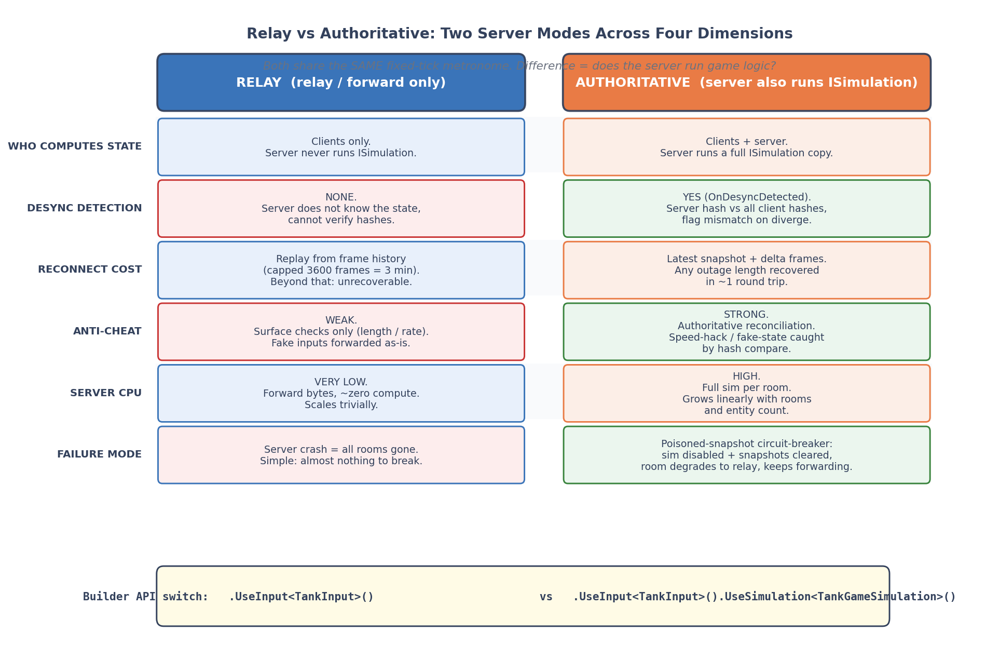
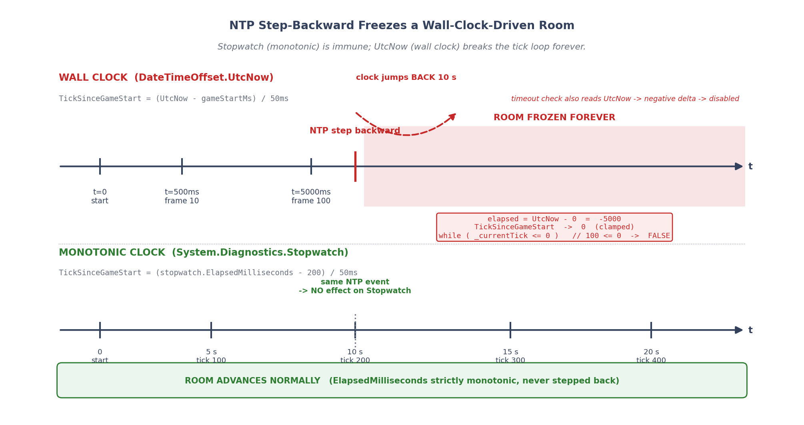

# 第 14 章 · Relay vs Authoritative:两种服务器模式 + 固定节拍

> **核心问题**:帧同步的服务器到底要不要跑游戏逻辑?跑(权威)和不跑(中继)各牺牲什么、换什么?服务器节奏该不该被玩家输入绑架?

读完本章你会明白:

1. 帧同步服务器的**两种根本模式**——Relay(中继)和 Authoritative(权威)——在"谁算局面、能不能防作弊、断线重连成本、CPU 开销"这四个维度上的全面权衡,以及各自的适用场景。
2. 为什么"服务器按固定物理节拍推进、输入不齐就强制填空输入"是帧同步服务端的**分水岭设计**(承序章"发疯的坦克"复盘)——以及这个认知是用真金白银的 bug 换来的。
3. 为什么算 tick **必须用单调钟 Stopwatch 而不是墙钟 UtcNow**——NTP 回跳会让一个房间永久冻结,而且连超时检测一起陪葬。
4. 服务器主循环的**100Hz 调度 + 每 tick 512 消息预算**怎么在"单房洪泛"和"全局公平"之间画线,以及**单线程泵**怎么用一根线程把多房间的 World 线程亲和兜住。

> **如果一读觉得太难**:先只记住三件事——① Relay 只转发输入不算局面,Authoritative 多跑一份完整逻辑用来抓 desync 和发快照;② 服务器节奏**绝不能被输入绑架**,固定 20Hz 推进、缺谁都用空输入填;③ 算 tick 用 **Stopwatch 单调钟**,别用 `DateTime.UtcNow` 这种会被 NTP 回跳的墙钟。

---

## 一句话点破

> **帧同步服务器的灵魂只有一句话:它必须是一个节拍器,而不是一个收发室。** Relay 和 Authoritative 的区别,只是这个节拍器有没有"顺便自己也算一遍用来对账"——但节拍本身,谁也不能动。

这是结论,不是理由。本章倒过来拆:先看 Relay 和 Authoritative 这两种模式到底差在哪、各自换了什么牺牲了什么(第 1-3 节),再看这个"节拍器"是怎么被一行行代码硬塞进服务器的(第 4 节,承序章"发疯的坦克"),最后拆两个最硬核的技巧——物理时钟节拍器和单调钟防 NTP 回跳(技巧精解)。

---

## 14.1 帧同步服务器到底在干什么:先把"收发室"和"对账员"分开

在读这一章之前,你得先彻底弄清一件容易混淆的事:**帧同步服务器,不算游戏局面**。

这是帧同步和状态同步的分水岭(序章讲过,这里一句带过)。状态同步(比如市面常见的 Photon Fusion / Mirror / Fish-Net)的服务器是"对账员":它跑完整游戏逻辑,算出每个单位的位置、血量,然后把**结果**广播下去,客户端只负责渲染。而帧同步服务器是个"收发室":它**只收集玩家的输入,打包广播**,游戏局面由**每台客户端各自用确定性运算算出来**。

那问题来了:既然服务器不算局面,它到底要跑什么?答案是——**它只做两件事**:

1. **聚合输入**:把每个玩家这一帧按了什么键,收齐。
2. **按固定节拍广播**:每隔 50ms(20Hz),把这一拍所有玩家的输入,广播给所有人。

听起来简单得像个聊天室转发器?对,这就是帧同步服务器最朴素的形态——叫 **Relay(中继)**。但它有个天然的短板:**它没法发现自己转发的输入,有没有让客户端算出不一样的局面**。换句话说,Relay 模式下,如果两台客户端因为某种原因(浮点 desync、随机数没存、容器遍历顺序不一样)算出了不同的坦克位置,Relay 服务器**完全不知道,也无能为力**——它只负责转发输入,局面它一眼没看。

这就引出了第二种模式:**Authoritative(权威)**。它让服务器**也跑一份完整的游戏逻辑**(就是客户端跑的那份确定性 ISimulation),每收到一帧输入,自己也算一遍。这样一来,服务器手里就有了一份"权威局面",可以做三件 Relay 做不到的事:

- **抓 desync**:服务器算出的局面哈希,可以和客户端上报的哈希比对,对不上就是有人算错了。
- **发快照**:服务器定期存自己算的局面快照,断线重连的玩家可以"从最近快照 + 后续增量帧"飞速追上,而不是从头重演。
- **反作弊**:服务器手里有权威结果,客户端报假输入(比如"我一帧移动了 1000 米")立刻被对账戳穿。

> **钉死这件事**:Relay 和 Authoritative 的根本区别,**不是"服务器跑不跑帧同步",而是"服务器跑不跑游戏逻辑"**。两者都跑帧同步主循环(收输入、固定节拍广播),但 Authoritative 多干了一份"自己也算一遍"的活,换来 desync 校验、快照重连、反作弊这三张牌。代价是 CPU——服务器要为每个房间跑一份完整模拟。

这两种模式不是二选一的"哪个更好",而是**对应不同的产品形态和信任模型**。下面三节,我们先把这层权衡彻底拆透(14.2 给对比表 + 适用场景),再看 LockstepSdk 怎么用一行 Builder API 切换这两种模式(14.3),最后看那个不管哪种模式都一样的"节拍器"是怎么实现的(14.4)。

---

## 14.2 Relay vs Authoritative:四种维度的全面权衡

先上一张对比表,这张表是本章的"判决书",后面所有讨论都是在拆这张表的每一行。



> **图说**:横轴是四个权衡维度(谁算局面 / 反作弊能力 / 重连成本 / CPU 开销),纵轴是两种模式。Relay 那一行所有格子都是"轻":不算局面、不防作弊、重连要客户端从头重演、CPU 几乎为零。Authoritative 那一行是"重":服务器算权威局面、能对账抓作弊、重连发快照秒回、CPU 随房间数线性涨。英文标注:Who computes state / Anti-cheat / Reconnect cost / Server CPU。

### 表 14-1 Relay vs Authoritative 权衡矩阵

| 维度 | Relay(中继) | Authoritative(权威) |
|---|---|---|
| **谁算游戏局面** | 只客户端算,服务器不跑 ISimulation | 客户端算 + 服务器也跑一份 ISimulation |
| **desync 检测** | 无(服务器不知道局面) | 有(OnDesyncDetected,服务器哈希 vs 客户端哈希全员比对) |
| **断线重连恢复** | 只能从帧历史(最多 3600 帧 = 3 分钟)重演,超时无法恢复 | 服务器发最近快照 + 增量帧,任意时长断线都能秒回 |
| **反作弊** | 弱(只能靠输入长度/频率等表面校验) | 强(权威对账,假输入/加速挂立刻戳穿) |
| **服务器 CPU** | 极低(只转发) | 高(每房间一份完整模拟,随实体数涨) |
| **服务器内存** | 低(只存帧历史) | 高(存快照,默认 60 帧一份,上限 10 份) |
| **配置成本** | `.UseInput<T>()` 即可 | 额外 `.UseSimulation<T>()` 注入 ISimulation |
| **故障模式** | 服务器崩 = 全房间没了 | 权威 sim 故障 = 中毒快照熔断(降级为 Relay 继续转发,不崩溃房间) |
| **适用场景** | 信任客户端的小局竞技(朋友联机、内测、回放录制) | 商用上线、有反作弊要求、支持观战/中途加入 |

这张表里最值得逐行拆的,是**重连成本**和**故障模式**这两行——它们最反直觉。

#### 重连成本:为什么 Relay 重连有"3 分钟生死线"

Relay 模式下,服务器不存快照,只存最近的历史帧。这个历史帧缓冲区是个环形数组,容量 `HistoryBufferCapacity = 3600`(GameRoom.cs:109,201)。20fps 下 3600 帧 = 180 秒 = 3 分钟。也就是说,**Relay 模式下,玩家断线超过 3 分钟,他在服务器上的帧历史就被新帧覆盖了**,再连回来时,服务器根本拿不出他断线那段时间的帧——只能让他从头重演,而对局已经跑了那么久,从头重演根本不现实。

> **不这样会怎样**:Relay 模式下,一个玩家断线 4 分钟后重连,服务器 `GetMissFrames` 发现他断线那帧已经 `< _minRetainedTick`(被覆盖了),返回 `isExpired`(GameRoom 的 MissFrame 逻辑),客户端只能转去 `RequestState`——但 Relay 模式下服务器根本没存快照,StateRequest 拿到的也是空。这个玩家就**永久追不上了**,只能被踢出对局。

Authoritative 模式就完全不一样:服务器每 60 帧(SnapshotInterval)存一份自己算的完整快照(`_serverSimulation.SaveState()`),上限保留 10 份(GameRoom.cs:149 `MaxRetainedSnapshots`)。玩家断线 10 分钟回来,服务器找到最近的快照发给他,他 `LoadState` 跳到那个时间点,再把快照之后的增量帧补上——**任意时长断线都能恢复**。这就是为什么 SERVER_GUIDE 里说"权威模式支持无感知重连"。

> **承接书讲过**:断线重连的完整双级解耦(传输层重连 + 应用层追帧)、"从断点续 vs 跳到现在"的决策树,是第 19 章的主题。本章只点出"Relay 和 Authoritative 在重连能力上的根本差异"——它直接决定了你的游戏能不能支持中途加入和观战。

这个差异的根,在**内存模型**。Relay 的历史帧缓冲是轻量的——每帧就是 N 个玩家的输入字节(TankInput 这种约 16 字节,2 玩家一帧约 32 字节,3600 帧约 115KB,一个房间几乎可以忽略)。Authoritative 的快照是重量的——每份快照是整个 World 的完整状态序列化(实体、组件、随机数状态、哈希,第 22 章 Benchmark 里一个生产路径帧约 635 字节,但快照是全量状态远不止),保留 10 份快照 + 60 帧才存一份的策略,是在"重连恢复速度"和"服务器内存"之间的折中。

> **钉死这件事**:Relay 的"3 分钟生死线"和 Authoritative 的"任意时长恢复",本质是**历史帧(轻,有界)vs 快照(重,可重建任意时间点)**两种数据结构的取舍。Relay 只能提供有界的历史回放,Authoritative 用快照把回放能力扩展到任意时长——但快照的存储和计算成本,是 Authoritative 模式 CPU/内存开销的大头。

顺带提一个 Authoritative 独有的能力——**观战模式**。观战的本质是"一个新玩家中途加入一个已经跑了一段时间的对局,只收帧不发输入"。Relay 模式下,新玩家加入时对局已经跑了(比如)5 分钟 = 6000 帧,远超 3600 帧的历史窗口,服务器拿不出他错过的帧,他根本进不来。Authoritative 模式下,服务器发一份最近快照,新玩家 `LoadState` 跳到那个时间点,然后只收增量帧——**观战模式在 Authoritative 下几乎是免费的**(复用重连的快照 + 增量帧机制)。这是为什么 SERVER_GUIDE 把"权威快照与重连"和"观战"放在同一节——它们是同一套机制的两个应用。

#### 故障模式:为什么权威 sim 崩了不会拖垮房间

这一行是最容易被忽视、却最能体现工程成熟度的设计。Authoritative 模式下,服务器要跑一份完整游戏逻辑——万一这份逻辑抛异常了呢?(比如某个边界条件数组越界、或者 World 状态被改了一半)

> **不这样会怎样**:朴素做法是"sim 抛异常 → 房间崩溃 → 整个对局所有人的连接全断"。更阴险的是,sim 内部的 World 已经被改了一半(Tick 抛在半路),它处于**不一致状态**。如果不处理,下一帧继续 Tick 它,会持续生成**"中毒快照"**——基于损坏状态算出的快照。重连的客户端拿到中毒快照,LoadState 之后必然和别的客户端 desync,而且这个 desync 还会被伪装成"客户端的 bug",定位起来要命。

LockstepSdk 的处理叫**中毒快照熔断**(GameRoom.cs:141-149, 312-328):一旦权威 sim 的 Tick 抛异常,立刻 `_serverSimFaulted = true` 停用 sim + **清空所有旧快照**(防止中毒快照继续发给重连客户端),然后**房间本身不终止**,降级为"只转发帧 + 客户端哈希比对"继续跑。重连的客户端走有界的 miss-frame 恢复(已证明可靠的路径),而不是拿可能中毒的快照赌一把。

```csharp
// GameRoom.cs:312-328(简化示意,非源码原文完整)
catch (Exception ex)
{
    _serverSimFaulted = true;        // 停用权威 sim
    _snapshots.Clear();              // 清空中毒快照
    _snapshotHashes.Clear();
    _logger.Error($"[Room {RoomId}] Server simulation FATAL at tick {tick}: " +
                  "sim disabled + snapshots cleared. Room continues forwarding frames.", ex);
}
```

> **作者复盘 · 中毒快照熔断**:这个设计是后来加的,起因正是一次线上事故——某次更新后,一个罕见边界条件让权威 sim 在第 1234 帧抛了 `IndexOutOfRangeException`。当时的处理是"房间继续跑、sim 也继续跑",结果接下来每 60 帧存的全是中毒快照。一个掉线玩家重连,LoadState 中毒快照,从那一刻起他的局面就和别人永久分叉——desync 报警狂刷,但客户端代码一个字没改,定位花了整整两天。教训是:**权威 sim 一旦故障,它产出的所有东西(快照、哈希、IsFinished 判定)都不可信**,必须熔断清空,降级到"只转发"这个已知可靠的形态。故障降级,而不是故障崩溃——这是生产级服务器和 demo 的分水岭。

这个熔断机制也回扣了序章埋的一个伏笔:**帧同步服务器的可靠性,不在于"永远不坏",而在于"坏了能降级"**。Relay 是最朴素可靠的形态(它简单到几乎没地方坏),Authoritative 在它之上叠加能力,叠加出问题就熔断回 Relay。这个分层设计,比"一崩全崩"的脆弱架构要高明得多。

#### 反作弊能力:Relay 和 Authoritative 最在意的差距

四种维度里,反作弊是产品决策时**最常决定选哪个模式**的那一项,值得单独拆透。

先说**为什么帧同步天然难反作弊**。状态同步的服务器手里有权威局面,客户端报"我在 (10,20)",服务器一查"不对,你应该在 (5,5)",立刻戳穿。但帧同步的 Relay 服务器**根本不知道局面**,它只转发输入——客户端发"我这一帧按了向前键",Relay 照单转发,没人验证"按这个键,坦克真的能动吗"。于是几种典型作弊在 Relay 下几乎无解:

- **加速挂**:客户端一帧发"我向前走了 1000 米"(篡改输入内容),Relay 转发,其他客户端收到这个假输入,用确定性运算算出来"他确实在 1000 米外"——作弊合法化了。
- **瞬移挂**:客户端篡改本地状态(不通过输入),Relay 完全看不见。
- **透视/自瞄**:这些是客户端表现层的作弊,任何服务器架构都管不了,但帧同步因为服务器不算局面,连"他这一枪有没有打中"都无法权威判定。

Authoritative 模式怎么治?核心是**权威对账**:服务器自己也跑一份完整逻辑,它手里有一份"按收到的输入算出的权威局面"。客户端定期上报自己的状态哈希(HashReportMessage),服务器拿来和自己的权威哈希比——对不上,就是有人算错了(要么是 desync bug,要么是客户端篡改了状态)。加速挂的本质是"输入和它导致的结果对不上",权威服务器一算就知道"按这个输入,坦克最多走 5 米,你报的哈希对应的是走了 1000 米,你作弊了"。

> **承接书讲过**:具体的 HashReport 全员到齐才比对、众数基准问题(基准取 player[0] 可能本身错)、IMessageInterceptor 拦截器(Priority 排序,业务层实现具体校验)这些细节,是第 15-16 章的主题。本章只点出"Relay 没有对账能力,Authoritative 有"这个根本差异——它直接决定了你的游戏上线后能不能扛得住外挂。

但要注意一个**加速挂的天然防御**,两种模式都享受:**服务器控帧率**。帧同步服务器按固定 20Hz 推进,客户端不能"让游戏跑得更快"——不管你本地怎么改,服务器每秒就广播 20 帧,你最多和服务器同步,不可能比别的玩家快。这是帧同步相对状态同步的一个意外优势:状态同步要专门做"移动速度校验",帧同步则是架构自带的。所以严格说,帧同步防不了"输入内容造假"(要靠 Authoritative),但天然防"节奏造假"。

#### 适用场景:别一上来就 Authoritative

| 你的产品形态 | 推荐模式 | 理由 |
|---|---|---|
| 朋友联机 / 内测 / 回放录制 | Relay | 信任客户端,省 CPU,够用 |
| 商用上线、有反作弊要求 | Authoritative | 必须对账,否则外挂泛滥 |
| 支持观战、中途加入 | Authoritative | 需要快照才能让新玩家秒进 |
| 大规模电竞赛事 | Authoritative | 权威结果 + 完整审计 |
| 单机回放 / 录像 | 都不需要(纯客户端) | 回放系统不依赖服务器 |

> **钉死这件事**:**Relay 不是"低级",Authoritative 也不是"高级"**——它们是同一套节拍器之上,根据信任模型和产品需求做的能力叠加。LockstepSdk 把它们做成 Builder API 一行切换(下一节),就是为了让同一个框架能从内测一路平滑演进到商用。

---

## 14.3 一行 Builder API 切换两种模式:UseInput 与 UseSimulation

讲完了为什么有两种模式,来看 LockstepSdk 怎么让你用一行代码切。这一节短,但它揭示了一个重要的设计哲学:**模式的切换,本质是"注入什么依赖"**。

### Relay 模式:只配输入类型

```csharp
// Relay 模式(SERVER_GUIDE.md:14-22 同款)
var server = new LockstepServerBuilder()
    .WithPort(9999)
    .WithFrameRate(20)
    .WithDefaultPlayers(2)
    .UseInput<TankInput>()        // 唯一必需的配置
    .Build();
server.Start();
```

`UseInput<TankInput>()` 干了一件关键的事——它配置了**空输入工厂**(LockstepServerBuilder.cs:132-142):

```csharp
// LockstepServerBuilder.cs:132-142(简化示意)
public LockstepServerBuilder UseInput<TInput>() where TInput : IInput, new()
{
    _config.NullInputFactory = () =>
    {
        var input = new TInput();
        var writer = new BitWriter(32);
        input.Serialize(writer);      // 序列化一个"什么都没按"的输入
        return writer.ToArray();
    };
    return this;
}
```

为什么 Relay 模式下,服务器也要知道输入类型?因为——**服务器要在玩家没发输入时,替他填一个"空输入"**。这是 14.4 节"物理时钟节拍器"的核心需求:帧必须按固定节拍推进,缺谁的输入就填空输入。而"空输入"长什么样,只有游戏自己知道(坦克的空输入可能是"方向键没按、没开炮",格斗游戏的空输入可能是"摇杆回中、没出招")。所以服务器必须拿到一个能产生空输入字节的工厂,这就是 `UseInput<T>()` 的全部职责。

注意 `Build()` 里有一个硬约束(LockstepServerBuilder.cs:260-264):**`NullInputFactory` 为 null 直接抛异常**。也就是说,你连最朴素的 Relay 都跑不起来,除非你告诉服务器"空输入长什么样"。这个约束是刻意的——它把"必须有节拍器"这个架构决策,焊死成了编译期/启动期的硬门槛。

### Authoritative 模式:额外注入 ISimulation

```csharp
// Authoritative 模式(SERVER_GUIDE.md:29-33 同款)
var server = new LockstepServerBuilder()
    .WithPort(9999)
    .UseInput<TankInput>()
    .UseSimulation<TankGameSimulation>()   // 多加这一行
    .Build();
```

`UseSimulation<T>()` 干的事更直接(LockstepServerBuilder.cs:157-161):它把一个能 `new TSimulation()` 的工厂塞进配置。服务器在创建房间时,如果发现这个工厂不为 null,就给每个房间实例化一份 ISimulation(GameRoom 构造里 `_simulationFactory = simulationFactory`,在合适时机 `_serverSimulation = _simulationFactory()`)。

> **所以这样设计**:把"模式切换"做成"注入什么依赖",而不是做成两个不同的服务器类。好处是——**Relay 和 Authoritative 共享同一套节拍器、同一套主循环、同一套房间管理、同一套消息处理**。它们唯一的区别,就是房间内部 BroadcastTick 时"要不要顺手算一遍 sim"。这个设计让两种模式的代码路径 99% 重叠,只有那 1% 的 sim 调用是 Authoritative 独有。维护成本极低,也避免了"Relay 和 Authoritative 两套代码各跑各的、行为悄悄分叉"的陷阱。

ISimulation 这个接口本身(在第 18 章 SDK 化会详讲)是个最小接口,核心 6 个方法(Tick / ComputeHash / SaveState / LoadState / IsFinished / Reset 之类),让任意游戏只要实现这 6 个方法就能接入帧同步服务器。这是 LockstepSdk 作为"独立 SDK"而非"引擎内嵌模块"的关键——你的游戏逻辑和帧同步框架,通过 ISimulation 这个窄接口解耦。

### 两种模式共享代码路径:一个 if 守卫的差别

"99% 代码路径重叠"不是一句空话,我们看 BroadcastTick 里 Authoritative 独有的那 1% 长什么样(GameRoom.cs:280-328):

```csharp
// GameRoom.cs:280-328(简化示意,这是 Authoritative 独有段)
// 服务器端模拟与快照(_serverSimFaulted 后停用,避免持续产出中毒快照/误报 desync)
if (_serverSimulation != null && !_serverSimFaulted)
{
    try
    {
        _serverSimulation.Tick(frameData);           // 算一帧

        if (_serverSimulation.IsFinished) FinishGame();   // 自动判结束

        if (tick > 0 && tick % _config.SnapshotInterval == 0)   // 每 60 帧存快照
        {
            _snapshotHashes[tick] = _serverSimulation.ComputeHash();
            _snapshots[tick] = _serverSimulation.SaveState();
            // ... 超过 MaxRetainedSnapshots=10 份就淘汰最旧
        }
    }
    catch (Exception ex)
    {
        _serverSimFaulted = true;        // 中毒快照熔断
        _snapshots.Clear();
        _snapshotHashes.Clear();
        // ... 房间不崩溃,降级为只转发
    }
}
```

整段被 `if (_serverSimulation != null && !_serverSimFaulted)` 守着。Relay 模式下 `_serverSimulation` 是 null,这整段直接跳过——BroadcastTick 的其余部分(强制空输入填充、存历史帧、冗余帧打包、广播)**两种模式完全一样**。

这一个 `if` 守卫,就是 Relay 和 Authoritative 在代码层面的全部差别。它的精妙在于——**它把"要不要跑权威逻辑"这个产品决策,降维成了一个运行时分支**,而不是拆成两套 BroadcastTick 实现。后果是:① 两种模式走同一条广播路径,绝不会出现"Relay 的广播逻辑和 Authoritative 的悄悄不一样"这种分叉 bug;② Relay 模式用户和 Authoritative 模式用户共享同一套测试覆盖,一个广播 bug 修了两种模式都受益;③ 从 Relay 升级到 Authoritative(产品从内测到商用),代码一行不用改,只加一个 `.UseSimulation<T>()`。

> **钉死这件事**:**好的架构,是让"产品层面的重大决策"能用"最小的代码差别"表达**。Relay vs Authoritative 是帧同步服务器的核心二分,但它在 LockstepSdk 里只表现为一个 `if` 守卫 + 一个 Builder 方法——这是"把复杂度收敛到最小接口面"的设计功夫,也是 SDK 化(第 18 章)的精神底色。

---

## 14.4 物理时钟节拍器:服务器节奏绝不能被输入绑架(承序章"发疯的坦克")

这一节是本章的灵魂,也是承自序章的那条主线。序章讲过一辆"发疯的坦克"——项目早期,服务器是"收到输入就广播一帧",结果网络一波动,坦克就满屏瞬移、自己乱开炮。序章给出了结论:服务器节奏必须由固定物理节拍驱动,不能被玩家输入绑架。这一节,我们把这个结论一行行代码拆开看,它到底是怎么在 LockstepSdk 里落地的。

### 朴素做法撞什么墙:输入驱动的服务器

先复习一下"发疯的坦克"的病根(序章已详述,这里提炼到工程层面):

```text
朴素服务器(输入驱动):
  loop:
    if 收到任一玩家输入:
        聚合当前帧所有已到输入
        广播一帧
```

这个看似合理的设计,有三个致命的网络不稳定下的崩坏模式:

1. **客户端断开 → 服务器收不到输入 → 服务器停顿 → 其他客户端收不到新帧 → 卡住**。整个对局的节奏,被一个掉线玩家绑架了。
2. **客户端网络恢复,瞬间涌来一堆积压输入 → 服务器密集广播 → 其他客户端被灌一堆帧,追帧追得画面乱跳**。节奏从"停顿"突变到"轰炸",客户端的预测回滚根本来不及适应。
3. **客户端预测和服务器确认频繁冲突 → 原地抖动**。因为服务器没有稳定节拍,客户端的 NetworkClock(第 13 章)无法对齐到一个稳定的基准,Jitter 乱跳。

这三个崩坏模式的共同本质是:**服务器的帧推进节奏,是玩家输入到达节奏的函数——而玩家输入到达节奏,在网络上是极其不稳定的**。把一个"必须恒定"的东西(帧节拍),挂在一个"天然不稳定"的东西(网络输入)上,等于把房子盖在流沙上。

> **钉死这件事**:"发疯的坦克"不是某个具体的 bug,是**架构层面的认知错误**。修不掉——除非换架构。

### 所以这么设计:物理时钟驱动的固定节拍

正道是:**服务器自己用一个物理时钟按固定频率推进**,完全不管玩家输入到没到。每隔 50ms(20Hz),不管三七二十一,推进一帧:

- 玩家发输入了 → 填进去。
- 玩家没发(网络延迟、甚至掉线了)→ **填一个空输入**,照样推进、照样广播。

这样一来,所有客户端收到的帧序列**节奏绝对恒定**(就是服务器的物理节拍),不会因为谁掉线而停顿、谁网络好而轰炸。客户端的预测回滚有了稳定的基准,NetworkClock 能对齐,"发疯的坦克"立刻治好。

这个设计在 GameRoom 里落地为一段极简的循环(GameRoom.cs:208-243 的 `DoUpdate`):

```csharp
// GameRoom.cs:208-226(简化示意,省略超时/空房间检查)
public void DoUpdate()
{
    if (State != RoomState.Playing || _gameStartTimestampMs <= 0) return;

    int loops = 0;
    while (_currentTick <= TickSinceGameStart && loops < 10)
    {
        BroadcastTick(_currentTick);   // 广播当前帧
        _currentTick++;
        loops++;
    }
    // ... 清理过期输入缓存
}
```

这段循环的精髓在 `while (_currentTick <= TickSinceGameStart)` 这个条件——**推进的判据是"物理时钟走到哪了",不是"输入齐没齐"**。`TickSinceGameStart` 是由单调钟算出来的、当前应该推进到第几帧(下一节技巧精解详拆)。只要物理时钟走到了,_currentTick 就必须追上去,中间不管输入到没到。

而 `BroadcastTick` 里,对没到的输入,强制填空(GameRoom.cs:252-258):

```csharp
// GameRoom.cs:250-258
var inputs = GetOrCreateTickInputs(tick);
for (int i = 0; i < _requiredPlayers; i++)
{
    if (inputs[i] == null)
    {
        inputs[i] = _nullInputFactory();   // 迟到输入不等人,强制填空
    }
}
```

这段 7 行代码,就是"物理时钟节拍器"的全部肉身。它把"服务器节奏被输入绑架"这个病根,从架构层面彻底切除——**输入是输入,节拍是节拍,两者解耦**。节拍只认物理时钟,不认输入到达。

> **作者复盘 · loops < 10 的来历**:循环里那个 `loops < 10` 不是随手写的。它是一道防御——如果物理时钟因为某种原因(进程被挂起后恢复、长 GC 暂停、调试器断点)突然前跳了一大截,`TickSinceGameStart` 会比 `_currentTick` 大很多,不加限制的话这个 while 会一口气追几十上百帧,把 CPU 打满、把客户端灌爆。10 帧上限意味着:最多追 10 帧(500ms),再多就放弃追赶、让节奏"软重置"到当前物理时钟。这是"宁可丢几帧也别雪崩"的工程权衡——帧同步对"节奏稳定"的优先级,高于"一帧不丢"。

### 这个节拍器跑在哪:100Hz 调度主循环

上面是房间级别的 `DoUpdate`。但一个服务器可能有几百个房间,谁来驱动所有房间的 `DoUpdate`?答案是 LockstepServer 的主循环 `MainLoopAsync`(LockstepServer.cs:217-268):

```csharp
// LockstepServer.cs:217-246(简化示意)
private async Task MainLoopAsync(CancellationToken ct)
{
    var sw = System.Diagnostics.Stopwatch.StartNew();
    var lastTickTime = sw.ElapsedMilliseconds;
    const int tickInterval = 10;   // 目标每 10ms 处理一次 = 100Hz

    while (!ct.IsCancellationRequested && !_disposed)
    {
        long currentTime = sw.ElapsedMilliseconds;
        long elapsed = currentTime - lastTickTime;

        if (elapsed >= tickInterval)
        {
            // 1. 处理积压消息(每 tick 限 512 条)
            int budget = MaxMessagesPerTick;
            for (int i = 0; i < budget; i++)
            {
                if (!_msgChannel.Reader.TryRead(out var item)) break;
                await ProcessMessageAsync(item.data, item.physicalId);
            }
            // 2. 更新所有房间
            _roomManager.DoUpdate();

            lastTickTime = currentTime;
        }
        // ... 剩余时间 Yield 或 Task.Delay(1)
    }
}
```

这个主循环跑在 **100Hz**(每 10ms 一次),比房间的 20Hz(50ms/tick)快 5 倍。为什么服务器调度要比房间帧率高?因为服务器不止干"推进房间"一件事——它还要**收消息、处理握手、做心跳检测**。如果调度频率和房间帧率一样(20Hz),那消息处理的延迟最高会到 50ms,握手响应会明显发粘。100Hz 调度让消息处理的延迟上限降到 10ms,手感更跟手,同时 5 次调度里只有 1 次真正推进房间帧(其余 4 次房间 `DoUpdate` 内部 `while` 条件不满足,直接返回)。

> **钉死这件事**:**服务器调度频率(100Hz)和房间帧率(20Hz)是两个独立的数字**。前者是"主循环多勤快",后者是"游戏逻辑多勤快"。把它们解耦,服务器可以在不碰游戏帧率的前提下,调消息处理的手感。

主循环里还有一个容易被忽略的节流细节(LockstepServer.cs:249-257):处理完一个 tick 后,如果离下一个 10ms 还有 >1ms 的剩余,就 `await Task.Delay(1)`,否则 `Thread.Yield()`。这两种让 CPU 的方式不一样——`Task.Delay(1)` 会引发一次 await 让出,精度大约 1ms(取决于系统定时器分辨率);`Thread.Yield()` 只是把当前时间片让给同核其他就绪线程,几乎立即返回。这个分支的意义是:**剩余时间多就睡一会省 CPU,剩余时间极少就别睡了(睡一觉可能就超时了),让出一下立刻接着干**。这是"100Hz 空轮询"和"CPU 占满"之间的精细平衡——没有这个让步,主循环会变成 busy loop 把一个核打满。

> **承接书讲过**:`Thread.Yield()` / `Task.Delay` 这种"让 CPU 的粒度"取舍,在客户端的 LockstepDriver(第 12 章)里也有同款讨论——追帧时是限速跑还是全速跑。两端面对的是同一类问题:怎么在"够勤快"和"别烧 CPU"之间画线。

### 每 tick 512 消息预算:防单房洪泛饿死全局

`MainLoopAsync` 里有个 `MaxMessagesPerTick = 512`(LockstepServer.cs:48),它是一道**公平性预算**。注释(LockstepServer.cs:41-47)把这个来龙去脉讲得极清楚——原版每 tick 是 `while(TryRead)` 排空整个入站 channel(容量 2000),这样一个刷屏客户端就能填满 channel,让那一次排空阻塞所有房间的 DoUpdate。改成每 tick 只处理 512 条,剩下的留到下一 tick,**保证所有房间的帧推进每 tick 必发生**。

> **不这样会怎样**:想象一个恶意(或 buggy)客户端,每秒往服务器灌 10000 个包。原版排空逻辑下,某个 tick 的排空可能花掉整个 10ms 预算,导致那 10ms 里 `_roomManager.DoUpdate()` 根本没机会跑——所有房间的帧推进被卡住,全局游戏手感发卡,而根因只是某一个房间的某一个客户端在刷屏。512 预算把这个"单房洪泛饿死全局"的攻击面封死:不管你灌多猛,我每 tick 最多处理 512 条,剩下的时间必给 DoUpdate。这是把"公平性"做成了硬性调度纪律。

512 这个数字也不是拍脑袋——注释说"远大于常规负载(100 房×2 玩家×20fps ≈ 40 msg/tick),又能有效封顶洪泛"。常规负载下 512 绰绰有余(余量 12 倍),洪泛时它是一道硬墙。

### 单线程泵:一根线程兜住所有房间的 World 线程亲和

最后一块拼图是**并发模型**。LockstepServer 启动时,不是用线程池跑主循环,而是**专用线程 + SingleThreadSynchronizationContext**(LockstepServer.cs:184-193):

```csharp
// LockstepServer.cs:184-193(简化示意)
_mainLoopTask = Task.Factory.StartNew(_ =>
{
    var sc = new SingleThreadSynchronizationContext();
    sc.Run(() => MainLoopAsync(_cts.Token));
}, state: null, cancellationToken: CancellationToken.None,
   creationOptions: TaskCreationOptions.LongRunning | TaskCreationOptions.DenyChildAttach,
   scheduler: TaskScheduler.Default);
```

这是什么意思?`MainLoopAsync` 里有一堆 `await`(比如 `await ProcessMessageAsync`、`await BroadcastToClientsAsync`)。在默认的 `TaskScheduler` 下,这些 await 的 continuation 会被扔到线程池,可能跑在任意一个线程上——这对帧同步是致命的,因为 World(游戏状态)不是线程安全的,跨线程访问会在 DEBUG 触发 `CheckThreadAffinity` 断言,在 Release 潜伏成无锁竞态。

`SingleThreadSynchronizationContext` 解决了这个:它让所有 await 的 continuation,都通过 `SC.Post` 排队回到**这一个专用线程**上执行。于是整个服务器的 World 创建、访问、修改,全在同一线程上发生,线程亲和天然成立,不需要任何锁。

> **承接书讲过**:客户端侧的"跨线程命令队列"——网络回调先入队、主线程消费——是第 12 章 LockstepDriver 的主题,目的是同样的"保证 World 线程亲和"。服务器侧用的是更彻底的方案:不只命令队列,连整个主循环都钉在一个专用线程上。两端殊途同归,都是为了那个帧同步的铁律:**World 不能被多线程踩**。

注释(LockstepServer.cs:180-183)还点出一个 .NET 的经典坑:必须用 4 参数的 `StartNew` 重载,3 参数重载会把 `LongRunning` 当成 `object state`——这种细节踩坑,是工程成熟度的体现。

#### 为什么不直接用锁,而要单线程

有人会问:World 不是线程安全吗?给它加个 `lock`,让多线程随便访问不就行了,何必费这么大劲搞单线程?

答案藏在帧同步的**性能特性**里。帧同步服务器每个 tick 要做的事——聚合输入、推进房间、广播——几乎**每一件都要碰 World**(Authoritative 模式下还要 Tick 一遍 sim)。如果给 World 加锁,那等于每个 tick 的整段主循环都在持锁,锁的粒度大到基本等于"串行化整个服务器"。既然最终都是串行,那直接用一根线程串行跑,反而省掉了加锁/解锁的开销和锁竞争的不可预测性。

更关键的是,**锁会掩盖确定性 bug**。多线程下,两个线程访问 World 的顺序是非确定的(取决于调度器),这种非确定性会直接污染帧同步的确定性契约——同样一帧输入,跑两遍可能因为线程调度不同而算出不同结果。单线程从根上消灭了这类"调度相关"的非确定性,让 desync 的排查面收窄到"纯逻辑层面"。

> **钉死这件事**:帧同步服务器的单线程模型,不是"懒得写并发代码",而是**主动选择的架构**——它同时拿到了三个好处:① World 线程亲和天然成立,不用锁;② 消灭了调度相关的非确定性,desync 排查面收窄;③ 主循环是顺序执行的,reasoning 起来极清晰(出 bug 时不用猜"是不是两个线程交错踩了")。代价是单核吞吐上限——但帧同步对单核性能敏感(第 22 章 Benchmark),多核扩展靠多进程部署(SERVER_GUIDE 的部署建议),而不是单进程多线程。

这个"单线程 + 多进程"的取舍,和 Redis 的"单线程模型"如出一辙——单线程把逻辑写简单、把确定性做扎实,水平扩展交给多实例。帧同步和 Redis 在这点上气味相投。

---

## 14.5 冗余历史帧:把可靠性上移到协议层,和具体传输解耦

这一节讲一个和"节拍器"配套的关键技巧——**抗 UDP 丢包**。它不是 Relay/Authoritative 的区别(两种模式都做),但它是"服务器只管转发输入"这种架构能成立的前提。

### 朴素做法撞什么墙:UDP 丢一帧,所有人卡一帧

帧同步默认用 UDP(快、无连接、无队头阻塞),但 UDP 不保证可靠到达——一个包可能在网络里丢了。如果服务器广播的第 123 帧丢了,所有客户端都收不到这帧,它们的 LockstepController(第 10 章)会发现"服务器帧缺了一帧",触发丢帧请求,等服务器补发。这要一个往返(RTT),手感会卡一下。

更糟的是,如果连续丢几帧,客户端的预测会越走越远,回滚时重演的帧数越来越多,代价飙升。

### 所以这样设计:每个包都捎带前几帧

LockstepSdk 的做法是**冗余历史帧**(GameRoom.cs:330-365):服务器每次广播第 N 帧时,顺手把第 N-1、N-2 帧也塞进同一个包里(`RedundancyCount` 默认 2)。这样即使第 N-1 帧那个包丢了,第 N 帧的包里还带着 N-1 的内容,客户端零往返就能补上。

```csharp
// GameRoom.cs:330-365(简化示意)
if (RedundancyCount > 0)
{
    int validCount = 0;
    for (int i = 1; i <= RedundancyCount; i++)
    {
        int prevTick = tick - i;
        if (prevTick >= _minRetainedTick)
        {
            var frame = _historyBuffer[prevTick % _config.HistoryBufferCapacity];
            if (frame != null && frame.Frame == prevTick)   // 校验非错位
            {
                _redundantFramesBuffer[validCount++] = frame;
            }
        }
    }
    if (validCount > 0)
    {
        var redundantFrames = new FrameData[validCount];
        Array.Copy(_redundantFramesBuffer, redundantFrames, validCount);
        msg.RedundantFrames = redundantFrames;
    }
}
```

注意两个细节:① 冗余帧从环形历史缓冲 `_historyBuffer` 取,这个缓冲在 BroadcastTick 开头刚存过当前帧(GameRoom.cs:268-273),所以前几帧的数据是现成的;② 取出来要校验 `frame.Frame == prevTick`,因为环形缓冲(`tick % capacity`)在覆盖后可能拿到错位的陈旧帧——这是第 10 章讲过的 RingBuffer 时效性契约(C-5)在服务器侧的体现。

> **为什么妙**:冗余帧把"可靠性"从传输层(UDP 没可靠性)**上移到了协议层**(应用层自己冗余)。这带来三个好处:① 零 RTT 恢复,丢包不用等重传;② 和具体传输解耦——不管你用 UDP、KCP、还是 WebSocket,这套冗余都在,不依赖传输层的可靠性保证;③ 概率上极有效——10% 丢包率下,连续 3 个包(当前帧 + 2 冗余)全丢的概率是 0.1%,基本遇不到。这也是为什么 LockstepSdk 把 KCP 做成 stub(第 17 章)——冗余帧已经把 UDP 的可靠性补到了够用,KCP 的 ARQ 是锦上添花而非必需。

### 一个血泪细节:writer.ToArray() 而不是 AsMemory

广播这一段还有一个 P1 修复值得单独提(GameRoom.cs:376-384),它是"帧同步静默损坏"的典型——最难查的那种 bug:

```csharp
// GameRoom.cs:376-384
var writer = BitWriterPool.Get();
try
{
    msg.WriteTo(writer);
    // P1-ROB-8:必须先复制出独立 byte[] 再归还 writer。原代码用 writer.AsMemory()
    // 传入后台广播——它是池化 buffer 的视图,writer 归还后被 BufferPool 回收/覆盖,
    // 异步 transport 发送可能读到脏数据(静默 desync 级损坏)。
    var data = writer.ToArray();
    _ = BroadcastToClientsAsync(data, clientIds.ToArray());
}
finally
{
    BitWriterPool.Return(writer);
}
```

原代码用 `writer.AsMemory()` 直接把池化 buffer 的视图传给异步广播,然后立刻在 `finally` 里归还 writer。问题是——异步广播是 fire-and-forget,真正发送可能发生在 writer 已经被归还、buffer 已经被 BufferPool 回收并分发给别的请求**之后**。这时 transport 读到的,是被覆盖过的脏数据。客户端收到一份内容错乱的帧,用它算局面,静默 desync——而且这种 desync 完全随机、无法复现、查到天荒地老。

`writer.ToArray()` 强制复制出一份独立的 byte[],和池化 buffer 彻底脱钩,才根治了这个问题。这个修复对应 P1-ROB-8,是"对象池 + 异步"这对组合最容易踩的坑——池化的本质是"借用",你把借来的东西的引用传给一个异步操作,操作还没完你就还了,这中间的窗口就是静默损坏的温床。

> **钉死这件事**:帧同步里最阴险的 bug,不是"算错了",而是"算对了但发错了"——`writer.ToArray()` 这一行,值整个 desync 调试方法论的一半。第 25 章会把这类"静默损坏"做成案例集。

---

## 技巧精解

这一章有两个最硬核的技巧,单独拆透。第一个是承自序章的**物理时钟节拍器**——它是"发疯的坦克"的正道,也是整个服务器架构的基石。第二个是**单调钟 Stopwatch 替墙钟防 NTP 回跳**——它是一个用真实生产事故换来的认知,一行代码的改动,背后是整个房间永久冻结的血泪。

### 技巧一:物理时钟节拍器(发疯坦克复盘的工程落地)

"物理时钟节拍器"这个名字,来自序章"服务器像节拍器"那个比喻。但比喻归比喻,它在代码里到底是什么?它就是 GameRoom 里 `TickSinceGameStart` 这个只读属性 + `DoUpdate` 里那个 `while` 循环的组合。

#### 它解决的本质问题

帧同步服务器有一个**不可动摇的契约**:所有客户端收到的帧序列,节奏必须绝对恒定。这个恒定不是"大概恒定",是"任意两帧的间隔,在所有客户端看来都一样"。因为客户端的 NetworkClock(第 13 章)要靠这个稳定节拍来对齐本地时钟、估算 RTT、决定预测深度——节拍一抖,整个客户端的同步子系统全跟着抖。

而网络输入的到达节奏,是**天然不稳定**的。把"必须恒定"的东西挂在"天然不稳定"的东西上,就是"发疯的坦克"的根因。物理时钟节拍器的本质,是**把帧节拍的源头,从"输入到达"切换到"物理时钟流逝"**——物理时钟(Stopwatch)是单调、恒速、不受网络影响的,它天然适合当节拍源。

#### 实现技巧:TickSinceGameStart + 强制空输入

`TickSinceGameStart` 是"当前物理时钟对应第几帧"的计算(GameRoom.cs:177-186):

```csharp
// GameRoom.cs:177-186
private int TickSinceGameStart
{
    get
    {
        // 单调钟驱动,扣除开局宽限。NTP 后跳不再影响 tick 推进。
        if (_gameStartStopwatch == null || !_gameStartStopwatch.IsRunning) return 0;
        long elapsed = _gameStartStopwatch.ElapsedMilliseconds - GameStartDelayMs;
        return elapsed <= 0 ? 0 : (int)(elapsed / _frameIntervalMs);
    }
}
```

逻辑极简:从游戏开始的 Stopwatch 读出已经流逝的毫秒数,减去一个开局宽限(200ms,给客户端接收 GameStartMessage 的时间),除以每帧的毫秒数(20fps 下 50ms),就是"当前应该推进到第几帧"。`_frameIntervalMs = 1000 / _frameRate`(GameRoom.cs:196)。

`DoUpdate` 里的 `while (_currentTick <= TickSinceGameStart && loops < 10)` 就是拿这个值当追赶目标:只要 _currentTick 还没追上物理时钟对应的帧号,就继续广播、继续推进。

> **为什么对**:这个设计的稳定性,来自两个保证——① Stopwatch 是**单调钟**,只增不减,不受系统时间被修改影响(下一节详述);② `_frameIntervalMs` 是个**常量**,不随负载变化。两者结合,`TickSinceGameStart` 就是一个"和时间成正比、和负载无关"的线性函数,帧节拍由此获得了数学上的恒定性。客户端的 NetworkClock 拿到这个恒定节拍,就能用第 13 章的 Jacobson 算法稳定地估算 RTT、对齐时钟。

#### 反面对比:如果改成"凑齐输入才推"

假设我们违背这个设计,把 `DoUpdate` 改成"所有玩家的输入都到了才推进":

```csharp
// 反面:凑齐输入才推(朴素错误做法)
public void DoUpdate_BAD()
{
    if (AllInputsReceived(_currentTick))   // 等所有玩家
    {
        BroadcastTick(_currentTick);
        _currentTick++;
    }
}
```

这一个改动,立刻让"发疯的坦克"复活:① 任何一个玩家网络波动,_currentTick 就卡住,所有客户端的 NetworkClock 失去节拍基准,Jitter 爆炸;② 那个玩家网络恢复,积压输入涌来,_currentTick 一口气追好几帧,客户端被灌帧;③ 更阴险的是,这种设计下"服务器节奏"成了"最慢玩家的网络"的函数——谁的网络最差,整个对局就被拖到多慢。这就是为什么序章说"服务器节奏被输入绑架是万恶之源"。

物理时钟节拍器 + 强制空输入,把"最慢玩家绑架全局"这个攻击面彻底切除:缺谁的输入就填空,帧照样按 20Hz 推。那个缺输入的玩家,他自己的客户端会通过预测回滚(第 8-10 章)追上来,不会拖累别人。

#### 一个常被问的问题:那缺输入的玩家不算"漏了一帧"吗?

不算——至少对他自己不算。因为帧同步的契约是"相同输入序列 = 相同结果",空输入也是一种合法输入(就是"这一帧什么都没做")。服务器给缺输入的玩家填了空输入,这个空输入会广播给所有人,**所有人都会用这个空输入算这一帧**——那个"缺输入"的玩家,他在服务器的视角下这一帧就是"什么都没做",这是确定性的、所有人一致的。等他网络恢复,他自己的客户端会发现"服务器第 123 帧给我填了空输入,但我本地预测的是往前走了一步",于是回滚到第 122 帧,用空输入重演——这就是预测回滚的日常工作,完全在正常范围内。

### 技巧二:单调钟 Stopwatch 替墙钟防 NTP 回跳

这个技巧是一个**用真实生产事故换来的认知**。它只有一行代码的改动(`DateTimeOffset.UtcNow` → `Stopwatch`),但背后的故事值得讲透。

#### 它解决的本质问题:墙钟会被 NTP 回跳

服务器要算"当前应该推进到第几帧",朴素做法是用墙钟——`DateTimeOffset.UtcNow` 减去游戏开始的绝对时间戳,除以帧间隔。这个做法在 99% 的时间是对的,但在一种情况下会**致命崩坏**:NTP(网络时间协议)同步导致系统时间**回跳**。

NTP 是大多数服务器用来对准世界时钟的协议。当服务器的本地时钟和权威时钟有偏差时,NTP 会**逐步调整**本地时钟——有时候是"先把时钟调慢让世界追上来"(slew),有时候是直接**一步跳过去**(step)。如果服务器的本地时钟比权威时钟**快**,NTP step 会把本地时钟**往回拨**——这就是"NTP 回跳"。

> **不这样会怎样**:`TickSinceGameStart` 原来是用 `DateTimeOffset.UtcNow - _gameStartTimestampMs` 算的。假设游戏在第 0 毫秒开始,现在 UtcNow 是第 5000 毫秒,`TickSinceGameStart = 5000/50 = 100`,房间已经推进到第 100 帧。突然 NTP 把系统时钟往回拨了 10 秒——UtcNow 变成了第 -5000 毫秒(相对游戏开始)。这时 `elapsed = -5000 - 0 = -5000`,`TickSinceGameStart` 变成了一个**负数除以 50**——根据代码,要么是负的帧号,要么被钳成 0。无论哪种,`while (_currentTick <= TickSinceGameStart)` 这个条件**立刻变成恒假**(_currentTick 是 100,TickSinceGameStart 是 0 或负数)——**房间永久冻结**。

而且更阴险的是——超时检测(`CheckPlayerTimeouts`)也读 `DateTimeOffset.UtcNow`(GameRoom.cs:212),它也会被 NTP 回跳搞乱:`now - player.LastActiveTime` 可能变成负数,负数永远小于超时阈值 5000ms,于是**超时检测同时失效**。一个永久冻结、且连超时检测都失效的房间,会永远占着内存,既不推进、也不回收,生产灾难且**无法自愈**。

#### 实现技巧:Stopwatch 单调钟

修复是用 `System.Diagnostics.Stopwatch`(GameRoom.cs:113-119 的 P1 修复注释 + :119 字段 + :177-186 的属性):

```csharp
// GameRoom.cs:113-119(P1 修复注释)
// P1 时序健壮性:tick 推进改用单调钟。原 TickSinceGameStart 由 DateTimeOffset.UtcNow 驱动,
// NTP 后跳会使 (UtcNow - _gameStartTimestampMs) 变负 → _currentTick <= TickSinceGameStart 恒假 →
// 房间永久冻结(且超时检测也读 UtcNow,一并失效)→ 生产灾难且无法自愈。
// Stopwatch 基于单调高精度计时器,不受 NTP 步进/回拨影响。_gameStartTimestampMs 仍保留,
// 仅用于 GameStartMessage 客户端时钟同步(绝对时间戳),不再驱动 tick。
private System.Diagnostics.Stopwatch? _gameStartStopwatch;
```

`Stopwatch` 在 .NET 里是基于操作系统的**单调高精度计时器**(Windows 上是 `QueryPerformanceCounter`,Linux 上是 `CLOCK_MONOTONIC`),它**只增不减,绝对不受 NTP 步进/回拨影响**。把"驱动 tick 推进"这个职责,从 `DateTimeOffset.UtcNow`(墙钟,会被 NTP 调)切换到 `Stopwatch`(单调钟,不会被调),房间冻结的根因被彻底切除。

> **为什么对**:单调钟和墙钟的本质区别,在于它们的**修正语义**。墙钟(DateTimeOffset.UtcNow)的职责是"反映真实世界时间",所以它必须接受 NTP 修正——修正包括回跳。单调钟(Stopwatch)的职责是"测量时间间隔",所以它**绝不修正**,你从它读到的 `ElapsedMilliseconds` 永远是单调递增的。帧同步算 tick,本质是在测量"从游戏开始到现在过了多久"——这是一个**时间间隔测量**任务,天然该用单调钟。用墙钟测时间间隔,是把"反映世界时间"和"测量间隔"两个职责混在一个工具上,一旦墙钟为了前者被修正,后者就崩了。这是"用对工具"的典范。

#### 一个微妙的取舍:_gameStartTimestampMs 为什么还留着

注释里有一句"_gameStartTimestampMs 仍保留,仅用于 GameStartMessage 客户端时钟同步(绝对时间戳),不再驱动 tick"。这是一个精妙的取舍——`_gameStartTimestampMs`(墙钟,GameRoom.cs:113)没有删掉,因为客户端需要它来做**初始时钟对齐**(第 13 章 NetworkClock 的 ClockOffset 冷启动)。客户端拿到这个绝对时间戳,结合自己收到 GameStartMessage 的本地时间,能估算出一个初始的时钟偏差。这个用途下,墙钟是对的——因为客户端要对齐的是"服务器的世界时间",单调钟没法跨机器比较(每台机器的 Stopwatch 起点不同)。

所以这里的设计是:**墙钟用于跨机器的绝对时间对齐,单调钟用于单机的时间间隔测量**。两个职责,两个工具,各司其职。这个区分,是时序健壮性的基本功。



> **图说**:时间线展示 NTP 回跳如何让墙钟驱动的 tick 永久冻结。上半部分是墙钟(UtcNow)时间线:游戏在 t=0 开始,t=5000ms 时房间推进到第 100 帧;此刻 NTP 把系统时钟回跳到 t=-5000ms,`elapsed` 变负,`TickSinceGameStart` 钳为 0,`while (_currentTick <= TickSinceGameStart)` 即 `100 <= 0` 恒假,房间冻结。下半部分是单调钟(Stopwatch)时间线:NTP 回跳对它无影响,`ElapsedMilliseconds` 持续单调递增,tick 正常推进。英文标注:Wall clock (UtcNow) / Monotonic clock (Stopwatch) / NTP step backward / Room frozen forever。

---

## 14.6 把服务器模式放回全书二分法

这一章服务的,是全书二分法的**同步机制**那一面——把确定的机器接到网络上。

具体来说,本章讲了同步机制里"服务器侧"的两个核心问题:

1. **服务器要不要跑游戏逻辑**(Relay vs Authoritative 的二分)——这决定了同步机制能提供多少能力(desync 校验、快照重连、反作弊),代价是多少 CPU。
2. **服务器节奏怎么稳**(物理时钟节拍器 + 单调钟 + 100Hz 调度 + 512 预算 + 单线程泵)——这是同步机制能成立的**前提**,没有稳定的节拍,客户端的预测回滚、网络时钟全都是空中楼阁。

这两个问题里,第二个是**地基**——不管 Relay 还是 Authoritative,都共享同一套节拍器。第一个是**能力叠加**——在稳定节拍之上,选择要不要多跑一份逻辑换更多能力。这种"地基共享 + 能力可选"的分层,是 LockstepSdk 作为 SDK 的设计哲学的体现(第 18 章详讲)。

回扣主线一句话:**确定性内核保证了"一台机器上相同输入算出相同结果",同步机制保证了"多台机器收到相同的输入序列"**。服务器的作用,就是这后一半——它是个节拍器,把所有玩家散乱的输入,聚合成一条节奏恒定、内容一致的权威帧序列,广播给所有人。Relay 和 Authoritative 的区别,只是这个节拍器要不要"顺便自己也算一遍用来对账"——但节拍本身,是帧同步服务器的灵魂,谁也不能动。

---

## 章末小结

- 帧同步服务器有 **Relay(中继)** 和 **Authoritative(权威)** 两种模式。Relay 只转发输入不算局面,轻但无 desync 校验、无快照重连、反作弊弱;Authoritative 多跑一份完整逻辑,能对账、能发快照、反作弊强,但 CPU 随房间数涨。两者用 Builder API 一行切换(`.UseInput<T>()` vs 额外 `.UseSimulation<T>()`),共享同一套节拍器和主循环。
- **物理时钟节拍器**是帧同步服务器的灵魂。服务器必须用物理时钟按固定 20Hz 推进,输入不齐就强制填空输入——绝不能被玩家输入绑架。这是"发疯的坦克"(服务器节奏被输入绑架导致坦克乱瞬移)悟出的正道,落地为 GameRoom 的 `TickSinceGameStart` + `while` 循环 + 强制空输入填充。
- 算 tick **必须用单调钟 Stopwatch**,不能用墙钟 `DateTimeOffset.UtcNow`。NTP 回跳会让墙钟驱动的 tick 永久冻结,且连超时检测一起陪葬。墙钟只用于跨机器的绝对时间对齐(GameStartMessage),单调钟用于单机的时间间隔测量。
- 服务器主循环跑 **100Hz 调度**,每 tick 先消费最多 **512 条消息**(防单房洪泛饿死全局的公平性预算),再 `_roomManager.DoUpdate()`。整个服务器跑在**专用线程 + SingleThreadSynchronizationContext** 上,所有 await continuation 回该线程,World 线程亲和天然成立。
- **冗余历史帧**抗 UDP 丢包——每包捎带前 2 帧,零 RTT 恢复,把可靠性上移到协议层,和具体传输解耦。配套的血泪细节:`writer.ToArray()` 而非 `AsMemory()`,否则池化 buffer 被回收后异步发送读脏数据,静默 desync。

### 五个为什么

1. **为什么帧同步服务器不算游戏局面(状态同步才算)?** 因为帧同步的契约是"相同输入 = 相同结果",局面由每台客户端各自用确定性运算算出。服务器只负责把所有玩家的输入聚合成权威帧序列广播——局面它一眼没看。这是帧同步"低带宽"的根源(只传输入不传局面),也是它"反作弊弱"的根源(Relay 模式下服务器不知道局面,无法对账)。
2. **为什么服务器节奏不能被玩家输入绑架?** 因为网络输入的到达节奏天然不稳定(断开、抖动、积压),而帧节拍必须绝对恒定(客户端的 NetworkClock 靠它对齐)。把"必须恒定"挂在"天然不稳定"上,就是"发疯的坦克"——坦克满屏瞬移、自己乱开炮。正道是物理时钟节拍器:服务器按固定 20Hz 推进,缺输入就填空,节奏只认物理时钟不认输入。
3. **为什么算 tick 用 Stopwatch 而不是 DateTime.UtcNow?** Stopwatch 是单调钟,只增不减,不受 NTP 步进/回跳影响;DateTime.UtcNow 是墙钟,会被 NTP 修正包括回跳。NTP 回跳会让墙钟驱动的 `elapsed` 变负,`TickSinceGameStart` 钳为 0,`while` 条件恒假,房间永久冻结——而且超时检测也读 UtcNow,一并失效,生产灾难无法自愈。墙钟只用于跨机器绝对时间对齐,单调钟用于单机间隔测量。
4. **为什么每 tick 限 512 条消息,而不是排空整个 channel?** 排空整个 channel(容量 2000)会让单个刷屏客户端填满 channel,阻塞那一次 tick 的 `_roomManager.DoUpdate()`,所有房间的帧推进被卡住——单房洪泛饿死全局。512 是公平性预算:远大于常规负载(100 房×2 玩家×20fps ≈ 40 msg/tick,余量 12 倍),又能有效封顶洪泛,保证 DoUpdate 每 tick 必跑。
5. **为什么冗余历史帧要把可靠性上移到协议层?** 三个好处:① 零 RTT 恢复,丢包不用等重传(冗余帧捎带在下一包里);② 和具体传输解耦,不管 UDP/KCP/WebSocket 都生效,不依赖传输层可靠性(这也是 KCP 能做成 stub 的前提);③ 概率上极有效——10% 丢包率下连续 3 包(当前 + 2 冗余)全丢的概率仅 0.1%。

### 想继续深入往哪钻

- **客户端侧的节拍对齐**:本章讲的是服务器怎么打节拍,客户端怎么"接住"这个节拍并对齐本地时钟,是第 13 章 NetworkClock 的主题(Jacobson 算法、硬边界防回滚风暴)。两章合起来,才是完整的"网络时钟"图景。
- **断线重连的完整流程**:本章点出了 Relay 和 Authoritative 在重连能力上的根本差异(3 分钟生死线 vs 任意时长快照恢复),完整的双级解耦(传输层重连 + 应用层追帧)、"从断点续 vs 跳到现在"的决策树,是第 19 章的主题。
- **房间生命周期与顶号重连**:本章的 GameRoom 是单个房间的内部运作,玩家生命周期(加入/断线/重连/顶号)、房间四态机(Waiting→Playing→Finished→Recyclable)、ReconnectToken 防身份劫持、中毒快照熔断,是第 15 章的主题。
- **传输层抽象**:本章的冗余帧把可靠性上移到了协议层,KCP 为什么能做成 stub、TCP/UDP/WebSocket 的分帧差异,是第 17 章的主题。

---

> 上一章(第 13 章)我们讲了客户端侧的网络时钟——客户端怎么用 Jacobson 算法估算 RTT、怎么用硬边界防回滚风暴。这一章我们把视角切到服务器侧:服务器怎么打出一个绝对恒定的节拍(物理时钟节拍器)、怎么用单调钟免疫 NTP 回跳、以及这个节拍器之上要不要叠加一份权威逻辑(Relay vs Authoritative)。下一章(第 15 章),我们钻进 GameRoom 的内部,看玩家生命周期、顶号重连、哈希防作弊、中毒快照熔断——这些"房间里的人际关系"是怎么管理的。
