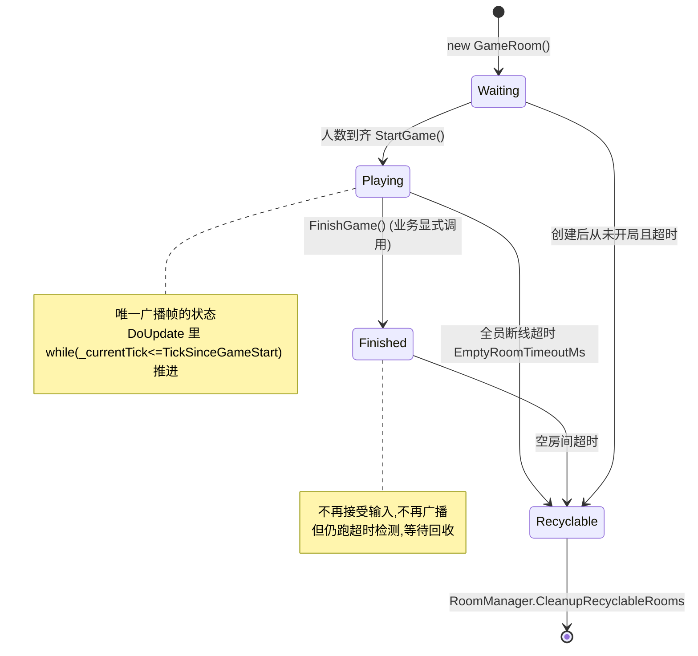
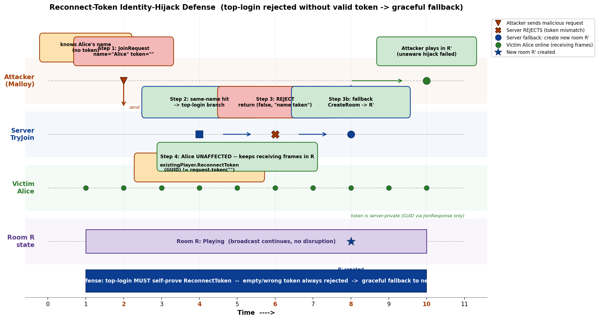
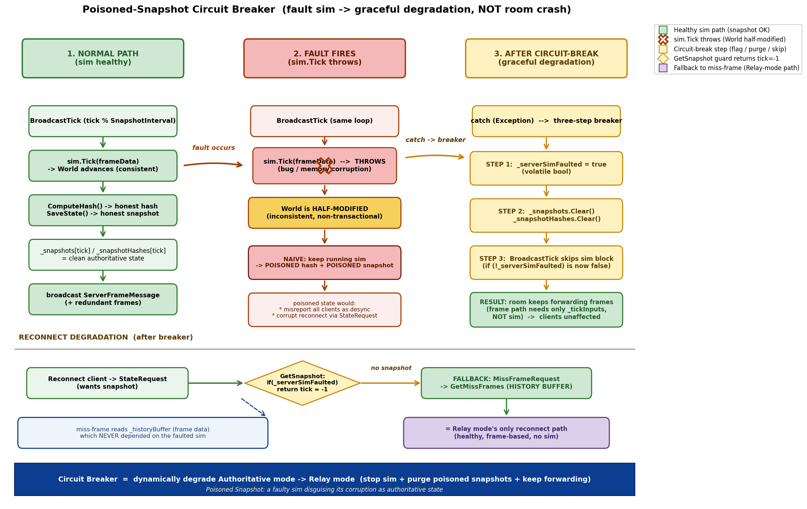

# 第 15 章 · GameRoom 与多房间:顶号重连、哈希防作弊、中毒快照熔断

> **核心问题**:上一章我们把镜头对准了"服务器这根指挥棒":它按固定 20Hz 节拍广播权威帧,Relay 与 Authoritative 两种模式各管一摊。但服务器不是铁板一块——它内部是一堆**房间(GameRoom)**,每个房间又装着一堆**玩家**。一个房间怎么管玩家进来、断线、再进来?一个房间跑挂了,会不会拖垮同机器上另外几百个房间?玩家掉线重连,谁来证明"我就是刚才那个玩家"?权威服务器自己 sim 崩了,这局还能不能继续?这一章就把房间内部的三件事讲透:**玩家生命周期 + 帧聚合广播 + 历史帧补帧**,以及三个工程师真正头疼的硬骨头:**顶号重连的身份劫持防御、哈希全员到齐才比对的误报陷阱、权威 sim 故障的中毒快照熔断**。

> **读完本章你会明白**:
> 1. 一个房间怎么从 Waiting 走到 Recyclable,为什么 FinishGame 必须业务层显式调用,否则玩家"再次匹配"会被误塞进旧房间。
> 2. 帧聚合为什么是"只填缓存不广播"——`OnPlayerInput` 收到输入只往 `_tickInputs` 里塞,真正的广播由 `DoUpdate` 的固定节拍驱动,迟到输入用 nullInput 补。
> 3. 历史帧补帧(MissFrame)为什么是重连追帧的主路径,为什么超 600 帧要分批、超 3600 帧要降级到拉快照。
> 4. **顶号重连为什么必须自证 ReconnectToken**(P0-2 身份劫持防御)——为什么"同名 + 不同 ClientId"这个朴素判据不够,攻击者怎么用它把在线玩家踢掉并接管其输入。
> 5. **哈希校验为什么必须全员到齐才比对**——来一个比一个会误报,以及基准为什么取 `player[0]` 在"基准本身错"时仍有意义。
> 6. **中毒快照熔断**:权威 sim 抛异常后 World 已半修改,继续 Tick 会持续生成中毒快照污染重连,置位停用 + 清空旧快照 + 继续转发帧是最优降级。

> **如果一读觉得太难**:先只记住三件事——① 房间有四个状态(Waiting/Playing/Finished/Recyclable),状态错乱会让"再次匹配"撞旧房间;② 顶号重连必须带 token,空 token 一律拒,这是防身份劫持的关键;③ 权威 sim 崩了不要让房间跟着崩,置个标志位停用 sim、清掉它产出的快照,房间继续转发帧,这就是"故障降级而非崩溃"。

---

## 〇、一句话点破

> **GameRoom 是服务器上"一台半自治的帧同步机器":它自己管玩家生命周期、自己按节拍聚合广播、自己存历史帧补帧,只在状态切换时跟 RoomManager 打个招呼。三个工程上的硬骨头都是"朴素做法会出事"的典型——顶号只认名字会被身份劫持、哈希来一个比一个会误报、权威 sim 崩了不清旧快照会把客户端一起带毒。三件事的解法是同一个哲学:不要让一个故障扩散,在最小边界内把它兜住。**

这是结论。本章倒过来拆:先讲房间的四态机和玩家生命周期,再讲帧聚合广播和补帧,然后逐一拆三个硬骨头。

---

## 一、GameRoom 是什么:服务器里的一台半自治机器

### 从上一章接续

上一章我们讲了服务器这根指挥棒:LockstepServer 自己不做游戏逻辑,它只在 `MainLoopAsync` 里按 100Hz 节拍干两件事——消费最多 512 条入站消息、再调一次 `_roomManager.DoUpdate()`(见 `LockstepServer.cs:217-268`, `Server/Core/RoomManager.cs:103-118`)。但"调一次 DoUpdate"这个动作到底在做什么,上一章一笔带过了。本章就把这个黑盒打开:**DoUpdate 遍历所有房间,每个房间自己 Tick 自己**。

> **承接网络系列**:RoomManager 是个标准的"对象池 + 调度器"模式,和 Tokio 里 worker 持有一堆 task、Pingora 里 service 持有一堆 upstream 的结构同构。这种"一个调度器驱动 N 个半自治单元"的写法,在网络系列里讲透了,这里不重复,只讲帧同步特有的:每个房间的内部状态机、玩家生命周期、帧聚合。

### 房间的四态机

一个 GameRoom 从生到死,经历四个状态(`Server/Core/GameRoom.cs:13-23`):



这四个状态不是随便分的,每个状态对应一段明确的职责:

- **Waiting**:刚建好,等人来。`TryJoin` 在这个状态只做"加人",到齐了调 `StartGame`(`:541-544`)。
- **Playing**:游戏进行中,**唯一会广播帧的状态**。`DoUpdate` 里那行 `if (State != RoomState.Playing ...) return;`(`:218`)是总开关。
- **Finished**:游戏结束,不再接受输入、不再广播,但房间还在——因为还要等业务层结算、还要跑超时检测把它推进到 Recyclable。
- **Recyclable**:可回收。`RoomManager.CleanupRecyclableRooms`(`:129-156`)扫到这个状态就 Dispose + 从字典里删掉。

> **钉死这件事**:`DoUpdate` 顶上一句 `if (State == RoomState.Recyclable) return;`(`:210`),底下还有一句 `if (State != RoomState.Playing ...) return;`(`:218`)。也就是说,**只有 Playing 状态才会推进 tick 和广播**。但 `CheckPlayerTimeouts` 和 `CheckEmptyRoom`(`:215-216`)是**所有非 Recyclable 状态都跑**的——这是关键:Finished 状态也要查超时,否则一局打完没人离开,这房间永远不会被回收。

### 状态切换为什么是单向的

注意上图的状态转移**几乎没有回头箭**:Waiting → Playing 是单向的(StartGame 不可逆),Playing → Finished 也是单向的(FinishGame 里 `if (State != RoomState.Playing) return;`,`:457`),只有 Recyclable 是终点(到了这里就只等 Dispose)。这是有意的:

> **不这样会怎样**:假设允许 Playing 退回 Waiting(比如"开局后发现人数不够,等其他人来"),会出现一个噩梦场景——已经在跑的客户端突然收到"游戏没开始"的语义,本地 World 已经推进了几百帧,状态全乱。帧同步游戏一旦 StartGame,所有客户端的 World 就开始按同一份输入序列演化,**这个演化不可撤销**(回滚是客户端侧的临时倒带,不是"游戏重来")。所以服务器侧的状态机必须单向,任何"重新开始"都得开新房间,而不是让旧房间倒带。

这个单向性也解释了为什么 `StartGame` 在 `_players.Count == _requiredPlayers` 时**自动触发**(`:541-544`)——到齐就开,没有"等一下确认"的窗口,因为Waiting 这个状态本身就是为了等人,人齐了就该走。

### 开局的 200ms 宽限:GameStartDelayMs

`StartGame`(`:718-742`)里有几个细节值得拆。一个是 `_gameStartTimestampMs = DateTimeOffset.UtcNow.ToUnixTimeMilliseconds() + 200`(`:725`)——开局时间戳设成"现在 + 200ms",这 200ms 是 `GameStartDelayMs` 常量(`:120`),给客户端接收 GameStartMessage 的宽限。如果不留这个宽限,客户端收到 GameStart 时,服务器那边的 tick 已经开始走了,客户端时钟校准时会算出一个负的偏移(本地落后服务器),NetworkClock 的硬边界会把目标 tick 钳到 hardMin,体验上是"开局卡一下"。

另一个是 P1 修复的重点:`_gameStartStopwatch = Stopwatch.StartNew()`(`:727`)。注释(`:113-119`)详细记录了为什么要换成单调钟——原版用 `DateTimeOffset.UtcNow` 算 tick,NTP 后跳会让 `(UtcNow - _gameStartTimestampMs)` 变负,`_currentTick <= TickSinceGameStart` 恒假,**房间永久冻结**(而且超时检测也读 UtcNow,一并失效,生产灾难无法自愈)。Stopwatch 基于单调高精度计时器,不受 NTP 步进/回拨影响。

> **承接第 14 章**:这个 P1 修复在第 14 章作为"物理时钟节拍器"的一部分详讲了单调钟 vs 墙钟的取舍。本章只强调一点:`_gameStartTimestampMs` 这个墙钟字段**保留了**,但只用于 GameStartMessage 的客户端时钟同步(绝对时间戳),不再驱动 tick。驱动 tick 的是 Stopwatch。两个字段各司其职,这是"墙钟用于对齐、单调钟用于计时"的标准分工。

### 为什么 FinishGame 必须业务层显式调用

这是新手最容易踩的坑。很多人想当然:"服务器权威 sim 不是有 `IsFinished` 吗?它返回 true 不就自动结束了吗?"

`GameRoom.cs:288-291` 确实有这么一段:

```csharp
// 自动判定游戏结束
if (_serverSimulation.IsFinished)
{
    FinishGame();
}
```

但注意这段代码包在 `if (_serverSimulation != null && !_serverSimFaulted)` 里(`:281`)。也就是说:

1. **只有在 Authoritative 模式(注入了 ISimulation)下**才会自动判结束。Relay 模式根本没 sim,服务器不知道这局什么时候完。
2. **而且 IsFinished 的判定标准是 sim 内部的**,未必符合业务语义(可能是"只剩一个玩家",也可能是"时间到",业务可能想要"打满 5 局")。

所以更常见的情况是:**业务层自己知道这局结束了**(比如某个玩家 HP 归零、或时间到),由业务层在它的 GameLogic 里调 `room.FinishGame()`。SDK 提供这个方法(`:455-460`)但**绝不替业务做决定**。

> **不这样会怎样**:假设你忘记调 FinishGame,房间会一直停在 Playing 状态。这时:
> - 房间还在按 20Hz 广播(空输入),客户端还在收帧。
> - `FindJoinableRoom`(`RoomManager.cs:161-167`)会**跳过** Playing 状态的房间(`r.State == RoomState.Waiting`),所以匹配不会撞进来——这一点是安全的。
> - 但 `FindRoomByDisconnectedPlayer`(`:174-179`)查的是 `r.State == RoomState.Playing`!如果你这局明明打完了但没 FinishGame,玩家退出后"再次匹配",JoinHandler 优先调 `FindRoomByDisconnectedPlayer`(`JoinHandler.cs:51`),会**把玩家塞回那个已经打完的旧房间**,而不是开新局。这就是"FinishGame 必须显式调用"的真正理由:不是怕房间不结束,是怕**重连/再匹配撞进僵尸房间**。

这是一个典型的"状态机不闭合导致跨玩家串扰"的 bug 模式。`HasDisconnectedPlayer`(`GameRoom.cs:653-664`)还做了一道防御:它只匹配 `State == Disconnected` 的玩家,而 `RemovePlayer` 在非 Playing 状态下会把名字清空(`:706`),让被移除的玩家不被 `FindRoomByDisconnectedPlayer` 匹配到。这是双保险。

---

## 二、玩家生命周期:Join、顶号、断线、重连、移除

GameRoom 用三个数据结构管玩家(`:102-104`):

```csharp
private readonly List<PlayerConnection> _players = new();          // 槽位 = playerId
private readonly Dictionary<string, int> _clientIdToPlayer = new(); // 传输层 id → playerId
private readonly int _requiredPlayers;
```

`PlayerConnection`(`Server/Core/PlayerConnection.cs:17-34`)装着一个玩家的全部状态:`PlayerId`(数组下标)、`Name`(业务层玩家名,用于重连匹配)、`ClientId`(传输层连接 id,IP 一漂就变)、`LastActiveTime`(心跳活跃时间)、`State`(Connected/Disconnected)、`ReconnectToken`(首次 Join 时下发的身份令牌)。

为什么用 **List 而不是 Dictionary** 存玩家?因为 **playerId 就是数组下标**。`_players[playerId]` 是 O(1) 且无哈希,帧同步里每帧都要按 playerId 取输入槽(`OnPlayerInput` 里 `inputs[playerId] = input`,`:759`),数组下标比字典查找快一个数量级,而且** playerId 一旦分配永不复用**(`:532` `int playerId = _players.Count;`),所以不会因为玩家离开留下空洞——空洞就空洞,反正 `_requiredPlayers` 通常很小(<16)。

### Join 的四步逻辑

`TryJoin`(`:467-547`)是一个相当讲究的方法,它要同时处理四种情况:

| 场景 | 判据 | 动作 |
|---|---|---|
| 同一 ClientId 重复 Join | `_clientIdToPlayer` 命中 | 幂等返回(返回原 token) |
| 同名玩家 + 房间还在 Waiting | `Name` 命中 + State==Waiting | 拒绝"名字已占" |
| 同名玩家 + 不同 ClientId + Playing | 顶号重连(本章重头戏,见第四节) | 校验 token 后重分配 ClientId |
| 全新玩家 | 都不命中 + 房间未满 | 新建 PlayerConnection,到齐则 StartGame |

前三步都很直白,第四步(顶号)是本章的核心,单独成节。先看一个容易忽略的细节:**返回值里的 token**。

```csharp
return (true, playerId, "", newPlayer.ReconnectToken);   // :546
```

`PlayerConnection` 构造时,token 是服务器用 `Guid.NewGuid().ToString("N")` 生成的(`PlayerConnection.cs:32`)。客户端**必须把这个 token 存下来**(第 19 章讲它会进 `ReconnectCredentialStore`),后续顶号/重连都要带它。这个 token 是整个身份安全模型的基石,第四节会展开。

### 断线 vs 移除:两个不同的概念

新手常把"玩家离开"当成一件事,但 GameRoom 分得很清:

- **断线(Disconnected)**:心跳超时(`CheckPlayerTimeouts`,`:398-410`)或 Playing 状态下主动 `RemovePlayer`(`:698-702`)。玩家**还在 `_players` 列表里,名字还在**,可以被 `FindRoomByDisconnectedPlayer` 匹配回来重连。这是"软离开"。
- **移除(物理移除)**:非 Playing 状态下 `RemovePlayer`(`:705-707`),会把 `Name` 清空。清空名字后,`FindRoomByDisconnectedPlayer`(`RoomManager.cs:174-179`,内部调 `HasPlayer` 只比 Name)就匹配不到了——这个槽位等于"作废"。

> **为什么这么分**:帧同步里,一个玩家在 Playing 中途真正物理离开,会导致**整局无法继续**(少了一份输入,其他玩家会一直收到 nullInput,游戏体验崩坏)。所以默认行为是"软离开":你断了,服务器用 nullInput 替你顶上(`BroadcastTick` 里 `:252-258`),等你重连回来继续打。只有业务层明确"这局已经不算了"(比如对方投降判负,游戏转 Finished)之后,才允许物理移除。

这个区分还有个副作用:**空房间检测 `CheckEmptyRoom`**(`:412-450`)只数"有名字的玩家"。被物理移除(名字清空)的玩家不计入 active,所以一个房间哪怕 `_players.Count > 0`,只要全是被清空名字的空壳,也算"空",会被超时回收。这是防止"僵尸槽位让房间永不回收"的兜底。

### 心跳超时与空房间超时:两个独立计时器

`DoUpdate` 顶上两个检查(`:215-216`)容易混,但它们是完全独立的两件事:

**CheckPlayerTimeouts**(`:398-410`):遍历每个玩家,如果 `State==Connected` 且 `now - LastActiveTime > HeartbeatTimeoutMs`(默认 5000ms),置 Disconnected。这是**单个玩家**的断线判定——5 秒没收到这个玩家的任何包(Ping/Input 都算,因为 InputHandler/PingHandler 都会调 UpdatePlayerActivity),就当他断了。

**CheckEmptyRoom**(`:412-450`):数"有名字的玩家"里有多少 Connected、多少 Disconnected。如果全部 Disconnected(或一个有名字的都没有),启动空房间计时器;`EmptyRoomTimeoutMs`(默认 30000ms)内还是空,就把房间置 Recyclable。这是**整个房间**的回收判定——所有人断线 30 秒还没回来,这局算凉了,回收。

两个超时的语义不同:HeartbeatTimeoutMs 是"单人多快算断",EmptyRoomTimeoutMs 是"全员断多久算凉"。前者短(5s,快速释放 nullInput 顶替的语义负担),后者长(30s,给重连留窗口)。**EmptyRoomTimeoutMs 必须 > 重连的最长时间**,否则玩家正重连着房间就被回收了——30s 对移动网络切换、App 后台恢复足够宽容。

> **作者复盘 · 为什么 HeartbeatTimeout 是 5 秒**:这是个权衡值。太短(比如 1s)会让正常网络抖动被判断线,玩家频繁掉线重连体验差;太长(比如 30s)会让真的挂了的玩家占用 nullInput 槽位太久,且反作弊侧"挂机检测"响应慢。5s 是实测下来"正常网络 99.9% 的抖动都在内,而挂机玩家 5s 不操作就明显异常"的甜蜜点。配合 OnPlayerInput 的 nullInput 顶替,5s 内其他玩家基本无感。

---

## 三、帧聚合广播:OnPlayerInput 只填缓存,DoUpdate 才广播

这是理解整个服务端节拍的关键。很多人第一次看代码会困惑:玩家发输入过来,服务器不是应该立刻广播给其他玩家吗?为什么 `OnPlayerInput` 这么"懒"?

```csharp
public void OnPlayerInput(int playerId, int tick, byte[] input)
{
    if (State != RoomState.Playing) return;
    if (tick < _currentTick) return;                                          // 过期丢
    if (tick > _currentTick + _config.MaxFutureInputTicks) return;            // 太未来丢(默认 16)
    if (input.Length > _config.MaxInputBytes) return;                         // 太大丢(默认 256)

    var inputs = GetOrCreateTickInputs(tick);
    inputs[playerId] = input;
}
```

(`GameRoom.cs:747-760`)

它**只往 `_tickInputs` 字典里塞**,什么都不广播。真正的广播发生在 `DoUpdate` → `BroadcastTick`(`:248-396`)。

### 为什么要这么设计

> **承接上一章**:上一章讲过"物理时钟节拍器"——早期服务器"收到输入就广播",结果坦克满屏乱瞬移("发疯的坦克")。根因是"服务器节奏被玩家输入绑架":玩家一断开服务器就停顿、一密集输入就广播失控。改成"服务器按固定 20Hz 推进、输入先攒着、到点统一广播",所有客户端收到的包节奏绝对恒定。

`OnPlayerInput` 的"懒"正是这个设计的体现。它把"收输入"和"广播"解耦:

- **收输入**:任意时刻,网络回调线程收到就往字典塞(经 Channel 串行化到主线程,见上一章 `LockstepServer.MainLoopAsync`)。塞的时候做四道防御(下面讲)。
- **广播**:只在 `DoUpdate` 的 `while (_currentTick <= TickSinceGameStart)` 循环里,每个 tick 一次。`BroadcastTick` 从 `_tickInputs[tick]` 把所有玩家的输入拼成一个 `FrameData`,缺的用 nullInput 补(`:252-258`),再广播。

这样,**不管玩家输入什么时候到、到得多密集,服务器的广播节奏永远是固定 20Hz**。这是"发疯的坦克"那个复盘留下的定型架构。

### OnPlayerInput 的四道防御

`OnPlayerInput` 看似简单,四道防御每一道都有来历:

1. **`State != Playing` 直接 return**(`:749`):非 Playing 状态收输入没意义(还没开局或已结束)。
2. **`tick < _currentTick` 直接 return**(`:750`):过期输入丢。这是 catch-up 上限(`loops < 10`)的副作用——服务器大幅落后时会跳过中间 tick,那些 tick 的输入永远不会被广播,留着也是垃圾,直接丢。
3. **`tick > _currentTick + MaxFutureInputTicks` 直接 return**(`:753`,默认 16):**D-7 资源耗尽防御**。原窗口是 100 tick,注释(`:50-55`)说得很清楚:攻击者可控的 `_tickInputs` key 短时间内能填满 `RequiredPlayers × 100`(最坏 64×100=6400)条目,每条 `byte[RequiredPlayers]`。16 tick 在 20fps 下是 800ms,覆盖正常网络抖动足够了,收紧窗口杜绝远程放大攻击。
4. **`input.Length > MaxInputBytes` 直接 return**(`:756`,默认 256):**D-7 资源耗尽防御**。原版只受 1MB 传输上限约束,远大于真实输入(TankInput 约 16 字节)。256 字节留 16 倍余量,杜绝恶意巨输入。

> **作者复盘 · D-7 防御的尺度**:这两道防御是"加固期"加的。最早 OnPlayerInput 只查 tick 范围不查大小,觉得"反正有 1MB 传输上限兜底"。但审计时意识到——**传输上限是 per-message 的,而 `_tickInputs` 是跨 message 累积的**。一个恶意客户端可以发无数条小消息,每条都合法(<1MB),但每条的 input 字段塞 1MB,把 `_tickInputs` 撑爆。这就是"单点防御够、累积防御缺"的典型漏洞。MaxInputBytes=256 不是拍脑袋,是"真实输入 16 字节 × 16 倍余量"算出来的——既挡攻击又不误伤正常业务。

### 迟到输入用 nullInput 填

`BroadcastTick` 里这段(`:252-258`)是帧同步服务器的灵魂:

```csharp
for (int i = 0; i < _requiredPlayers; i++)
{
    if (inputs[i] == null)
    {
        inputs[i] = _nullInputFactory();
    }
}
```

某个玩家某帧没交输入(网络抖动、或断了),服务器**不等人**,直接用 `_nullInputFactory()` 产一个"空输入"顶上。`_nullInputFactory` 是 RoomManager 构造时注入的业务回调(`RoomManager.cs:21,39`),每个游戏自己定义"空输入"长什么样(TankInput 通常是"所有键松开")。

> **钉死这件事**:这是帧同步"确定性"在服务器侧的体现——**所有客户端在任何一帧收到的输入集合必须完全一致**。如果服务器等某个玩家,其他玩家会卡住;如果服务器给不同客户端发不同的输入(比如给 A 发"玩家 2 没交",给 B 发"玩家 2 交了空"),两边算出来的局面就分叉了。所以服务器统一用 nullInput 补齐,**所有客户端收到的都是同一份 FrameData**,确定性契约不破。

### 冗余历史帧:UDP 丢包的零往返恢复

上一章讲过 UDP 无可靠性,这里看 GameRoom 怎么在应用层补。`BroadcastTick` 在拼好当前 tick 的 ServerFrameMessage 后,会从 `_historyBuffer` 取前几帧塞进 `RedundantFrames`(`:330-365`):

```csharp
if (RedundancyCount > 0)
{
    int validCount = 0;
    for (int i = 1; i <= RedundancyCount; i++)
    {
        int prevTick = tick - i;
        if (prevTick >= _minRetainedTick)
        {
            var frame = _historyBuffer[prevTick % _config.HistoryBufferCapacity];
            if (frame != null && frame.Frame == prevTick)   // 时效性自校验
            {
                _redundantFramesBuffer[validCount++] = frame;
            }
        }
        else break;
    }
    if (validCount > 0)
    {
        var redundantFrames = new FrameData[validCount];
        Array.Copy(_redundantFramesBuffer, redundantFrames, validCount);
        msg.RedundantFrames = redundantFrames;
    }
}
```

`RedundancyCount` 默认 2(`GameRoomConfig.cs:46`),意味着每包捎带前 2 帧。这样**丢一包靠下一包补,零往返**——客户端不用发"我没收到 tick N,重发"的请求(那要一个 RTT),下一帧的 RedundantFrames 里就带了 tick N。

> **承接第 17 章**:第 17 章会算一笔账:10% 丢包下连续丢 3 包(RedundancyCount=2 兜不住)的概率是 0.1³=0.1%,99.9% 的丢包能被冗余帧零往返恢复。这就是为什么 UDP + 冗余帧对帧同步够用,而 KCP 那套 ARQ 反而是过度设计(SDK 里 KCP 做成 stub)。

注意两个细节:① `_redundantFramesBuffer` 是预分配的字段(`:246`),避免每帧 new 数组(GC 克制)。② 真正发的时候才 `new FrameData[validCount]` + `Array.Copy`(`:361-362`),因为 `validCount` 可能小于 RedundancyCount(开局头几帧历史不够)。还有那个 `frame.Frame == prevTick` 的自校验(`:347`)——和 miss-frame 一样的环形缓冲时效性契约,防陈旧槽。

### 广播的内存安全:P1-ROB-8

`BroadcastTick` 末尾发包这段(`:367-391`)藏着一个已修复的 P1 级 bug,值得专门讲:

```csharp
var writer = BitWriterPool.Get();
try
{
    msg.WriteTo(writer);
    // P1-ROB-8:必须先复制出独立 byte[] 再归还 writer。原代码用 writer.AsMemory()
    // 传入后台广播——它是池化 buffer 的视图,writer 归还后被 BufferPool 回收/覆盖,
    // 异步 transport 发送可能读到脏数据(静默 desync 级损坏)。
    var data = writer.ToArray();
    // P1 防御:clientIds 是 GetConnectedClientIds 返回的复用内部缓存 List,
    // 而 BroadcastToClientsAsync 为 fire-and-forget。快照成数组,彻底隔离。
    _ = BroadcastToClientsAsync(data, clientIds.ToArray());
}
finally { BitWriterPool.Return(writer); }
```

> **作者复盘 · P1-ROB-8 池化 buffer 的异步陷阱**:这是加固期发现的最阴险 bug 之一。原代码为了省一次拷贝,直接把 `writer.AsMemory()` 传给 `BroadcastToClientsAsync`(fire-and-forget,不等发送完成就 return)。问题是 writer 是池化的——`BitWriterPool.Return` 把底层 byte[] 还给 ArrayPool,下一个 Get 会拿到同一个 buffer 复用。于是传输层真正在 socket 上写数据的时候,那个 byte[] 可能已经被另一个房间的 BroadcastTick 拿去拼新帧了——**写出去的是别人的帧数据**。这种损坏是静默的(不抛异常,只是客户端收到错误的帧),会导致客户端基于错误输入算出错误局面,和服务器 desync。修法是 `writer.ToArray()` 复制出独立 byte[],代价是一次拷贝,但彻底切断池化复用与异步发送的耦合。同理 `clientIds.ToArray()` 也是因为 `GetConnectedClientIds` 返回的是复用的内部 List(`:629,635-647`),不快照就会被下一次 BroadcastTick 的 `Clear` 覆盖。

这是"GC 克制 vs 异步安全"冲突的典型——池化省了分配,但和 fire-and-forget 异步不兼容。第 20 章会系统讲 BufferPool 的双倍归还检测,那是同一类问题的另一面。

---

## 四、历史帧补帧:MissFrame 的主路径

重连/丢帧时,客户端会发 `MissFrameRequest` 说"我从 tick N 开始的帧没收到,补给我"。服务器 `GetMissFrames`(`:803-839`)的逻辑:

```csharp
public (FrameData[] frames, bool isExpired) GetMissFrames(int startTick)
{
    if (startTick < _minRetainedTick)
        return (Array.Empty<FrameData>(), true);   // 过期,得拉快照

    int requestedCount = Math.Min(
        Math.Max(0, _currentTick - startTick),
        _config.MaxMissFramesPerRequest);          // 上限 600

    // ...从环形 _historyBuffer 取,校验 frame.Frame == idx 防错位...
}
```

三个关键点:

### 1. 环形缓冲 + 时效性自校验

历史帧存在 `_historyBuffer[tick % HistoryBufferCapacity]`(`:109,268-273`),`HistoryBufferCapacity` 默认 3600(3 分钟 @20fps)。这是一个**纯槽数组环形缓冲**,和第 10 章讲的 RingBuffer 同构——没有 Count、没有头尾指针,越界 index 静默环绕到陈旧槽。

> **承接第 10 章**:RingBuffer 的"时效性契约 C-5"在这里原样重现——`_historyBuffer[idx % cap]` 取出来的可能是**上一轮的同位置帧**(环形覆盖了)。所以必须校验 `frame.Frame == idx`(`:824`),不匹配就 break,绝不能把陈旧帧当真。这个契约在第 10 章讲透了,这里不重复,只强调:**服务端的历史帧缓冲和客户端的帧历史缓冲,用的是同一套环形 + 自校验的范式**,因为它们面对的是同一个问题——用有限内存装可能无限的帧号。

`_minRetainedTick`(`:110,275-278`)是"最早还保留着的 tick"。一旦 `tick >= HistoryBufferCapacity`,它就往前挪。请求的 `startTick < _minRetainedTick` 直接判 `isExpired=true`,告诉客户端"那些帧我没了,你改去拉快照"。

### 2. 为什么上限是 600

`MaxMissFramesPerRequest = 600`(`GameRoomConfig.cs:43`, `LockstepServerBuilder.cs:45`)。600 帧 @20fps = 30 秒。一次补 30 秒的帧,单包已经很大了(每帧一个 FrameData,含 RequiredPlayers 个 input),再大容易触发传输层分片/超时。所以重连追帧**分批进行**:客户端拉一批、ACK 一批(`MissFrameAckHandler`,`MissFrameHandler.cs:44-59`),再拉下一批。

> **承接第 19 章**:重连的完整决策树(从断点续 vs 跳到现在)在第 19 章详讲。本章只讲服务端这一侧:GetMissFrames 是主路径(对局 < 3600 帧,从断点续),GetSnapshot 是降级路径(对局 > 3600 帧,0 帧已被环形覆盖,跳到最近快照)。

### 3. StateRequest 的降级路径

`GetSnapshot`(`:775-798`)返回"<= maxTick 的最近一份快照"。快照只在 Authoritative 模式下有(Relay 模式没 sim,不存快照)。注意它第一行:

```csharp
if (_serverSimFaulted) return (-1, Array.Empty<byte>(), 0);
```

这是中毒快照熔断的守门员,第六节详讲。

### 快照淘汰:数量上限而非时间窗口

顺带讲一个快照存储的细节。`BroadcastTick` 存快照时(`:293-309`),有一段淘汰逻辑:

```csharp
if (_snapshots.Count > MaxRetainedSnapshots)   // MaxRetainedSnapshots = 10
{
    int minTick = int.MaxValue;
    foreach (var t in _snapshots.Keys)
        if (t < minTick) minTick = t;
    _snapshots.Remove(minTick);
    _snapshotHashes.Remove(minTick);
}
```

`MaxRetainedSnapshots = 10`(`:149`)是个**纯数量上限**,注释(`:297-300`)说原版用的是"minTick < _minRetainedTick 才淘汰",但 `_minRetainedTick` 在前 3600 帧(HistoryBufferCapacity 默认值)内一直是 0,导致这个条件恒假——前 3600 帧一份快照都不淘汰,最多攒 60 份全量状态(SnapshotInterval=60),内存涨得飞快。改成数量上限后,永远只留最近 10 份,内存可控。

> **钉死这件事**:快照和帧历史是两套独立的淘汰策略——帧历史按 tick 窗口(3600 帧 = 3 分钟),快照按数量(10 份)。原因:帧历史每帧固定大小(一个 FrameData),按 tick 淘汰语义清晰(超过 3 分钟的帧补不了,得拉快照);快照是全量 World 状态(可能几 KB 到几十 KB),不能攒太多,而且重连只需要"最近一份能追上"的,留 10 份覆盖 10×60=600 帧(30 秒)的恢复窗口绰绰有余。

---

## 五、★顶号重连必须自证 ReconnectToken(P0-2 身份劫持防御)

这是本章第一个硬骨头,也是项目里一个真实的 P0 级安全修复。

### 朴素做法撞什么墙

帧同步游戏里,玩家中途断线重连是高频场景。最朴素的重连逻辑是:**"同名玩家从新连接进来,就让他接管原槽位"**。原始代码确实就是这么写的(`GameRoom.cs:496` 那段在修复前只有 `if (existingPlayer.ClientId != clientId)` 就直接重分配)。

听起来合理,但**这是个致命漏洞**。我们来推演一个攻击场景:

```
受害者:Alice, playerId=2, 正在房间 R 里在线对战
攻击者:Malloy, 知道 Alice 的玩家名(比如排行榜上能看到,或社交工程套出来)

Step 1: Malloy 用一个新的 ClientId 连上服务器,JoinRequest 里填 PlayerName="Alice"
Step 2: 服务器查到房间 R 里已有 Name="Alice" 的玩家,且 State==Playing
Step 3: (朴素逻辑)existingPlayer.ClientId != Malloy的clientId → 重分配!
        - existingPlayer.ClientId 改成 Malloy 的
        - existingPlayer.State = Connected
        - _clientIdToPlayer 把 Alice 的原 ClientId 移除,换成 Malloy 的
Step 4: 现在 Malroy 用 playerId=2 的身份发输入
        - 服务器把 Malloy 的输入当成 Alice 的输入广播
        - 真正的 Alice 被踢出(她的 ClientId 已不在映射表里,发输入被 OnPlayerInput 拒)
        - Alice 重连?她重连也得通过"同名"判定,但槽位已被 Malloy 占,且这次 Malroy 在线(State=Connected),
          朴素逻辑只在"不同 ClientId"时重分配——Alice 用新 ClientId 又能顶号回来,两人互相踢,无限循环
```

**这就是身份劫持**。攻击者只要知道玩家名,就能:
- 把在线玩家踢下线
- 接管其 playerId,以受害者身份注入任意输入(作弊)
- 破坏确定性(受害者被踢后重连,两人互相顶号,帧数据混乱)

更阴险的是,这种攻击**不需要任何技术含量**——知道个 ID 就行。在排行榜、好友列表、直播平台都能拿到玩家名。

### 所以这样设计:顶号必须自证 token

修复方案在 `TryJoin` 的顶号分支(`GameRoom.cs:496-519`):

```csharp
if (existingPlayer.ClientId != clientId)
{
    // P0-2(安全):顶号必须自证身份——持有首次 JoinResponse 下发的 token。
    if (existingPlayer.ReconnectToken != reconnectToken)
    {
        _logger.Warning($"[Room {RoomId}] 顶号被拒: Player '{playerName}' ReconnectToken 不匹配 ...");
        return (false, -1, "Player name already taken", "");
    }
    // ...校验通过才重分配...
}
```

机制很直白:
1. 玩家首次 Join 成功,服务器生成一个 `ReconnectToken`(GUID,`PlayerConnection.cs:32`),随 `JoinResponseMessage` 下发给客户端(`JoinHandler.cs:118`)。
2. 客户端**必须把这个 token 存下来**(第 19 章讲它进 `ReconnectCredentialStore`,进程重启也能恢复)。
3. 之后任何"顶号"操作(同名 + 不同 ClientId),都必须在 JoinRequest 里带上这个 token。
4. 服务器比对 `existingPlayer.ReconnectToken != reconnectToken` → **不匹配一律拒**,包括空 token。

攻击者 Malroy 不知道 Alice 的 token(token 是服务器私密下发的,不在排行榜、不在任何公开渠道),他哪怕知道玩家名,JoinRequest 里带不上正确 token,顶号被拒。

### 安全降级:不崩溃,退化为新建房间

注意拒绝后的处理(`JoinHandler.cs:87-95`):

```csharp
if (!success && roomId == 0)
{
    room = server.CreateRoom(requiredPlayers);   // 退化为新建房间
    if (room != null)
    {
        (success, playerId, error, token) = room.TryJoin(...);
    }
}
```

顶号被拒后,**JoinHandler 不报错崩溃**,而是给攻击者**新建一个房间**让他正常开局。这是"安全降级"的工程哲学:

- 攻击者不知道 token → 拒绝顶号 → 但不告诉他"你被识破了",只说"名字已占" → 退化为新建房间 → 攻击者以为是自己重名,正常玩他的。
- 真正的 Alice 不受影响,继续在她原来的房间里。

> **不这样会怎样**:如果顶号被拒后直接报错断连,攻击者虽然顶号失败,但他知道了"这个名字有人在用",可以拿来做账号枚举、社工。退化为新建房间,既挡住了身份劫持,又不暴露系统状态,还让攻击者无感——这是"安全 + 可用性"双全的设计。

### 为什么 token 用 GUID 而不是密码

有人会问:为什么不干脆让玩家设个密码,顶号时验密码?

因为帧同步游戏的定位是**轻量、即开即玩**(格斗、RTS、MOBA 的快速对战),让玩家每次开局设密码是灾难级体验。GUID token 的好处:
- **无感**:客户端自动存、自动带,玩家根本不知道有这东西。
- **足够强**:128 位 GUID,暴力破解不可能。
- **可撤销**:`Dispose` 房间时 token 自然失效(整个 PlayerConnection 都没了);新一局 `StartGame` 会重新生成 token(其实是新 PlayerConnection)。
- **进程级可持久化**:第 19 章讲 `FileReconnectCredentialStore` 把 token 写文件,进程重启也能恢复——这对"游戏崩了重开"场景至关重要。

token 唯一的弱点是**客户端泄露**(比如存档被抄),但那是端安全范畴,服务器侧已经做到了能做的极限。

### 房间创建的 DoS 防御:RequiredPlayers 上限

在讲两条重连路径前,先看一个 JoinHandler 里的防御,它和顶号 token 是同一波加固期的产物。`JoinHandler.cs:33-42`:

```csharp
const int MaxRequiredPlayers = 64;
int requiredPlayers = request.RequiredPlayers > 0 && request.RequiredPlayers <= MaxRequiredPlayers
    ? request.RequiredPlayers
    : 2;
```

`RequiredPlayers` 直接来自网络(客户端 JoinRequest 里带的)。原版只查 `<= 0`。攻击者可以发 `RequiredPlayers=int.MaxValue` → 创建一个 `_requiredPlayers=2B` 的房间。这个"毒房间"的危害注释(`:34-38`)说得很清楚:

- `FindJoinableRoom`(`RoomManager.cs:161-167`)会把后续所有匹配流量吸入这个永远凑不齐的房间(它一直 Waiting,人数永远不够 2B)。
- 一旦真有人凑齐(不可能,但假设),`OnHashReport` 会 `new uint[2B]`、`OnPlayerInput` 会 `new byte[2B][]` → OOM。

钳到 64 上限——合法帧同步对局人数远小于此(FrameData 上限 256,实际多 <16),不影响真实场景。这是"网络输入必须做边界校验"的通用纪律,和 OnPlayerInput 的 MaxInputBytes、MaxFutureInputTicks 同源。

### 两条重连路径:TryJoin 顶号 vs ReconnectHandler

这里有个容易混淆的点:服务器其实有**两条**重连路径,它们用不同的 Handler、走不同的代码,但都靠 token 校验。

**路径一:TryJoin 顶号**(`JoinHandler` → `GameRoom.TryJoin`)。客户端进程没崩,只是网络断了重连(传输层 ClientId 变了)。客户端发的还是 `JoinRequestMessage`(带 ReconnectToken),走 JoinHandler。JoinHandler 内部 `FindRoomByDisconnectedPlayer` 找到旧房间,TryJoin 进顶号分支校验 token。这条路我们刚讲完。

**路径二:ReconnectHandler 显式重连**(`ReconnectHandler.cs:14-63` → `GameRoom.HandleReconnect`,`:552-575`)。客户端进程崩了重启,从 `ReconnectCredentialStore` 读出 RoomId/PlayerId/Token,发 `ReconnectRequestMessage`(注意是 ReconnectRequest 不是 JoinRequest,MessageType 不同)。ReconnectHandler 用 `(playerId, token)` 二元组校验:

```csharp
var (success, error) = room.HandleReconnect(request.PlayerId, request.ReconnectToken, clientId);
```

`HandleReconnect`(`:552-575`)的逻辑:playerId 越界拒、token 不匹配拒。校验通过后更新 ClientId、置 Connected、回 `ReconnectResponseMessage{Success, CurrentFrame}` + 补发 GameStartMessage。

> **钉死这件事**:两条路径的区别在于"客户端知不知道自己的 playerId"。进程没崩(ClientId 漂了)走 TryJoin,客户端只知道自己的名字,靠名字 + token 顶号;进程崩了重启走 ReconnectHandler,客户端从持久化凭证里读出 playerId,直接用 playerId + token 重连。后者更高效(不用按名字搜房间),但前提是凭证得持久化(第 19 章的 FileReconnectCredentialStore)。

两条路径都靠 token,但 token 的"载体"不同——TryJoin 把 token 放 JoinRequest(内存里),ReconnectHandler 把 token 放 ReconnectRequest(从文件读)。这就是为什么第 19 章要把 token 持久化,它支撑的是 ReconnectHandler 这条进程级重连路径。



> **图说**:顶号重连 token 校验流程。横轴是时间,纵向分四栏:Attacker / Server.TryJoin / Victim Alice / 房间 R 状态。① Attacker 发 JoinRequest(name="Alice", token="")。② Server.TryJoin 命中同名玩家,进入顶号分支。③ 比对 existingPlayer.ReconnectToken(="真 Alice 的 GUID") vs 请求 token(="") → 不匹配。④ TryJoin 返回 (false, "name taken")。⑤ JoinHandler 退化为 CreateRoom,给 Attacker 新建房间 R'。⑥ Alice 在 R 里毫发无伤,继续收帧。图内英文标注:Step1 JoinRequest / Step2 Token Mismatch / Step3 Reject + Fallback CreateRoom / Step4 Alice Unaffected。

---

## 六、★中毒快照熔断:故障降级而非崩溃

这是本章第二个硬骨头,也是项目里一个 P1 级容错设计。它回答一个要命的问题:**权威服务器 sim 自己崩了,这局还能不能继续?**

### 问题有多严重

Authoritative 模式下,服务器注入了一个 ISimulation,每帧 `BroadcastTick` 都会调 `_serverSimulation.Tick(frameData)`(`:285`)。这个 sim 持有一个 World,World 里装着所有实体、组件。`Tick` 会推进整个 World。

现在假设 `Tick` 抛了个异常——可能是业务逻辑 bug、可能是 World 内部状态被外部线程踩了(尽管有单线程泵,DEBUG 的 CheckThreadAffinity 仍可能触发)、可能是内存损坏。问题来了:

> **`Tick` 抛异常时,World 已经被改了一半。**

帧同步的 sim 不是事务性的。`Tick` 内部可能已经:
- 移动了若干实体
- 触发了若干 System 的 Update
- 改了一堆组件字段
- 然后在第 N 个 System 里抛了

这时候 World 处于一个**半修改的不一致状态**。如果我们简单 catch 一下异常继续跑,下一帧 `Tick` 会在这个半修改的状态上继续推进,持续产出垃圾。

更糟的是,`BroadcastTick` 在 Tick 之后还会存快照(`:293-309`):

```csharp
if (tick > 0 && tick % _config.SnapshotInterval == 0)
{
    _snapshotHashes[tick] = _serverSimulation.ComputeHash();
    _snapshots[tick] = _serverSimulation.SaveState();
}
```

如果 sim 半修改了,`ComputeHash` 算出来的是**中毒哈希**,`SaveState` 存的是**中毒快照**。这些中毒产物会被:
- `OnHashReport` 当成基准,把所有正常客户端误报成 desync。
- `StateRequestHandler` 当成权威状态,发给重连客户端——客户端从中毒基恢复后,必然和服务器、和其他客户端 desync。

**这就是"中毒快照"——一个故障 sim 把自己的损坏伪装成权威状态,污染所有依赖它的恢复路径。**

### 朴素做法撞什么墙

最朴素的容错是"catch 异常,记个日志,继续跑"。但这恰恰是上面描述的灾难——sim 继续在中毒状态上跑,持续产出中毒快照和中毒哈希。

另一种朴素做法是"catch 异常,把整个房间标记为 Recyclable,终止这局"。这也不对:
- 房间里其他玩家的客户端**并不依赖服务器 sim**——它们各自跑自己的 World(帧同步的本质就是各算各的,服务器 sim 只是用来反作弊校验和提供快照)。
- 把房间终止,等于让所有玩家强制掉线重开,体验灾难。
- 而且实际上**帧转发本身(BroadcastTick 的前半段)是健康的**——它只依赖 `_tickInputs` 和 `_historyBuffer`,不依赖 sim。sim 崩了,转发可以照常。

### 所以这样设计:三步熔断

修复在 `BroadcastTick` 的 catch 块(`:312-327`):

```csharp
catch (Exception ex)
{
    _serverSimFaulted = true;        // 第1步:置位,停用 sim
    _snapshots.Clear();              // 第2步:清空旧快照(可能是中毒的)
    _snapshotHashes.Clear();
    _logger.Error($"... sim disabled + snapshots cleared to prevent poisoned state. " +
                  "Room continues forwarding frames; reconnect will fall back to miss-frames.", ex);
}
```

加上 `BroadcastTick` 顶上的守卫(`:281`):

```csharp
if (_serverSimulation != null && !_serverSimFaulted)   // 第3步:置位后不再 Tick
{
    try { _serverSimulation.Tick(frameData); ... }
```

和 `GetSnapshot` 的守卫(`:777-780`):

```csharp
if (_serverSimFaulted) return (-1, Array.Empty<byte>(), 0);   // 第3步配套:不再吐快照
```

三步熔断的逻辑:

1. **置位 `_serverSimFaulted`**:`volatile bool`(`:145`),标记"这个 sim 已故障,别再用它"。后续 `BroadcastTick` 的 `if (!_serverSimFaulted)` 直接跳过整个 sim 推进块。
2. **清空 `_snapshots` 和 `_snapshotHashes`**:这些可能含中毒产物,绝不能再被 `StateRequestHandler` 发给重连客户端。清空后 `GetSnapshot` 返回 `tick=-1`。
3. **房间继续转发帧**:`BroadcastTick` 的前半段(聚合输入、存历史帧、广播 ServerFrameMessage)完全不依赖 sim,sim 崩了这部分照常。客户端继续收到帧、继续各自跑自己的 World。

### 重连强制走 miss-frame

这是熔断的精妙之处。熔断后:
- `GetSnapshot` 永远返回 `tick=-1`(没有快照)。
- 重连客户端走 `StateRequestHandler`(`StateHandler.cs:20-40`)会拿到 `SnapshotTick=-1`,客户端发现没快照,转而发 `MissFrameRequest` 走 `GetMissFrames`。
- `GetMissFrames` 依赖 `_historyBuffer`(帧数据,不依赖 sim),**这条路径是健康的**——只要对局没超过 3600 帧(3 分钟窗口内),客户端能从断点续追上。

> **钉死这件事**:miss-frame 路径已证明可靠(它是 Relay 模式唯一的重连路径,第 14 章讲过 Relay 模式根本没 sim),所以熔断后"强制走 miss-frame"等于"退回到 Relay 模式的行为"。这不是降级到未知,是降级到已验证可靠的路径。这也是为什么这个设计敢说"故障降级而非崩溃"——它降级到的状态,是另一种本来就支持的正常运行模式。

### 为什么是 volatile

`_serverSimFaulted` 标了 `volatile`(`:145`),注释说"DEBUG 下跨线程访问 World 触发 CheckThreadAffinity 即置位;Release 下该检查剥离,本标志作为 World 集合无锁竞态的兜底信号"。

这是防御性编程。理论上服务器是单线程泵(上一章讲过 `SingleThreadSynchronizationContext`),所有房间操作都在同一线程。但 DEBUG 模式下 `CheckThreadAffinity` 可能在别的线程访问 World 时触发异常,这个异常会经 `BroadcastTick` 的 catch 捕获——此时 `_serverSimFaulted` 可能被异常线程写、被主线程读,所以 volatile 保证可见性。Release 模式下 CheckThreadAffinity 被剥离,这个标志作为"万一有无锁竞态"的兜底。



> **图说**:中毒快照熔断的三步流程。左侧是正常路径(绿):BroadcastTick → sim.Tick → 存快照 → 广播。中间是故障发生(红):sim.Tick 抛异常,World 半修改。右侧是熔断后(黄):① 置位 _serverSimFaulted ② 清空 _snapshots/_snapshotHashes ③ BroadcastTick 跳过 sim 块,只做帧转发。下方两个分支:重连客户端走 StateRequest → GetSnapshot 返回 tick=-1 → 降级走 MissFrameRequest → GetMissFrames(健康路径)。图内英文:Circuit Breaker / Poisoned Snapshot / Fallback to Miss-Frame。

---

## 七、★HashReport 防作弊:全员到齐才比对

这是本章第三个硬骨头,它回答:**为什么哈希不能来一个比一个?**

### 哈希校验在做什么

帧同步的反作弊核心是"对账":每个客户端每帧算一个状态哈希(整个 World 的指纹),上报给服务器。服务器收集所有客户端的哈希,**比对**。如果某帧有客户端算的哈希和别人不一样,就是 desync——要么有人作弊(改了客户端逻辑),要么有 bug(确定性被破坏)。

`OnHashReport`(`GameRoom.cs:850-921`)就是这个对账中心。数据结构:

```csharp
private readonly Dictionary<int, uint[]> _frameHashes = new();
// key = tick, value = uint[_requiredPlayers],初值全 uint.MaxValue
```

某个客户端上报某帧哈希,填进对应槽(`:859`)。**关键问题:什么时候比对?**

### 朴素做法撞什么墙

最朴素的是"来一个比一个"——客户端 A 上报了,立刻和"基准"比;客户端 B 上报了,再和基准比。听起来高效(早发现早报告),但**会误报**。

考虑这个场景:2 人对战,player[0] 是 Alice,player[1] 是 Bob。某帧 Alice 的客户端有 bug,算出的哈希是错的。Bob 的哈希是对的。

- **来一个比一个**(以 player[0] 即 Alice 为基准):
  - Alice 上报 → 没有别人可比,存着。
  - Bob 上报 → 和 Alice 比 → 不匹配 → 报 desync!
  - 但实际上**错的是 Alice(基准本身)**,Bob 是对的。报告会说是 Bob 错(`HashMismatchMessage.PlayerId = i`,`:886`,i 是遍历到的那个不一致的槽),把对的玩家标成作弊者。

这还不算最糟。考虑 3 人对战,player[0] 错,player[1]、player[2] 对:

- 来一个比一个(基准 player[0]):
  - player[0] 上报 → 存。
  - player[1] 上报 → 和 player[0] 比 → 不符 → 立刻报 desync,PlayerId=1。
  - player[2] 永远没机会上报了(已经报完 desync,break 出循环)。
  - 结果:player[1] 被冤枉,真正的元凶 player[0] 没被识别。

**问题根源**:基准本身可能错。在"来一个比一个"的模式下,基准是第一个上报的玩家,如果第一个就错了,后面所有对的玩家都会被误报。

### 所以这样设计:全员到齐才比对

`OnHashReport` 的做法是**等这一帧所有玩家的哈希都到齐了,再比**(`:862-870`):

```csharp
// 避免 LINQ,手动检查是否全部收到
bool allReceived = true;
for (int i = 0; i < _requiredPlayers; i++)
{
    if (hashes[i] == uint.MaxValue)   // 初值是 MaxValue,没填就是没到
    {
        allReceived = false;
        break;
    }
}

if (allReceived)
{
    uint baseHash = hashes[0];
    for (int i = 1; i < _requiredPlayers; i++)
    {
        if (hashes[i] != baseHash) { ...报 desync... }
    }
}
```

数组初值特意设成 `uint.MaxValue`(`:855-856`),这是个"哨兵值"——正常哈希几乎不可能正好是 MaxValue(FNV-1a 32 位哈希撞 MaxValue 的概率是 1/2³²),所以"等于 MaxValue"≈"还没填"。

全员到齐后才比,这样的好处:

1. **基准明确**:基准是 `hashes[0]`,即 playerId=0 的玩家。所有人到齐后再取,不会因为"谁先到"而变基准。
2. **能识别分歧**:如果 player[0] 错、player[1] 和 player[2] 对,全员到齐后比 `hashes[1] != hashes[0]` 报 desync(PlayerId=1)——这看起来还是冤枉了 player[1]。**但注意**:服务器有权威 sim!Authoritative 模式下,服务器自己的 sim 也算了一份哈希(存在 `_snapshotHashes`)。结合服务器哈希,能进一步识别"谁错了"——服务器哈希和 player[1]、player[2] 一致,那 player[0] 就是元凶。这个三方对账在第 23 章(双轨哈希)详讲。
3. **避免半截报告**:不会出现"报了 player[1] 就 break,player[2] 没机会"的情况。

> **承接第 23 章**:本章的 HashReport 是"客户端两两对账",第 23 章会讲"客户端 vs 服务器权威 sim"的第三方对账,以及增量哈希 O(1) 的实现。本章只讲房间这一层的"全员到齐才比对"策略,它是后续所有哈希对账的基础范式。

### 为什么手写循环不用 LINQ

注意那段注释 `// 避免 LINQ,手动检查是否全部 received`(`:861`)和后面 `// 避免 LINQ,手动收集待删除的帧`(`:903`)。帧同步服务器是热路径,每帧每个玩家都会调 `OnHashReport`(还有冗余历史哈希,见 `HashReportHandler.cs:26-36`)。LINQ 的 `All/Any/Where` 会产生闭包分配和迭代器对象,在 100Hz 调度、多房间的场景下累积成可观 GC 压力。

> **承接第 20 章**:零 GC 是帧同步工程化的硬指标(第 20 章专讲 BufferPool 双倍归还检测、五池体系)。这里手写循环是同一个 GC 克制哲学的体现——热路径上能用 for 循环就别用 LINQ。

### 冗余哈希:和冗余帧同构

`HashReportHandler`(`:26-36`)除了处理当前帧哈希,还处理 `RedundantHashes`(冗余历史哈希):

```csharp
if (msg.RedundantHashes != null && msg.RedundantHashes.Length > 0)
{
    for (int i = 0; i < msg.RedundantHashes.Length; i++)
    {
        int tick = msg.Frame - (i + 1);
        if (tick >= 0)
        {
            room.OnHashReport(playerId, tick, msg.RedundantHashes[i]);
        }
    }
}
```

这和上一章讲的"冗余帧抗 UDP 丢包"完全同构——既然 ServerFrameMessage 会捎带前几帧的输入(抗丢包),HashReportMessage 也捎带前几帧的哈希(抗 HashReport 丢包)。一个 HashReport 丢包不会让某帧永远比对不上,下一帧的冗余哈希会补上。这是 UDP 不可靠传输下的"应用层冗余"统一范式。

### desync 发现之后:事件链与广播

`OnHashReport` 发现 desync 后,做三件事(`:879-893`):

1. **触发 OnDesyncDetected 事件**:`OnDesyncDetected?.Invoke(frame, baseHash, hashes[i])`。这个事件被 `LockstepServer.SetupRoomCallbacks` 转发成服务器级事件(`LockstepServer.cs:151`),业务层可以订阅做记录/告警/封号。
2. **广播 HashMismatchMessage**:把首个不一致的 `(frame, ExpectedHash, ActualHash, PlayerId)` 广播给所有客户端。客户端收到后可以做本地诊断(第 23 章的 World.Diff 字段级定位)、或主动暂停等待仲裁。
3. **break 出循环**:只报第一个不一致,不继续比后续玩家。这是有意的设计——desync 一旦发现,后续比对意义不大(局面已经分叉,后续帧大概率也不一致),而且广播多个 HashMismatchMessage 会让客户端混乱。

注意 `HashMismatchMessage.PlayerId = i`(`:886`)——它标的是"和基准不一致的那个玩家",在"基准本身可能错"的情况下(上一节讲过),这个 PlayerId 不一定是真正的元凶。要定位元凶,得结合服务器权威 sim 的哈希(如果没熔断)做三方对账,这是第 23 章的主题。本章的服务器侧职责到此为止:发现分歧、广播事实,不下结论。

---

## 八、Ping/Pong:不带 ack 的轻量心跳

最后讲一个看似不起眼但容易踩坑的点。`PingHandler`(`PingHandler.cs:14-33`)回 PongMessage:

```csharp
await context.Server.SendAsync(new PongMessage
{
    ClientTimestamp = ping.Timestamp,        // 原样回传,客户端算 RTT
    ServerTimestamp = DateTimeOffset.UtcNow.ToUnixTimeMilliseconds()  // 服务器墙钟
}, context.ClientId);
```

注意它**不带 ackTick/currentTick**。PongMessage 只有 `ClientTimestamp` 和 `ServerTimestamp` 两个字段。

> **钉死这件事**:为什么不带 ackTick?因为**帧确认不靠 Ping/Pong**。客户端收没收到某帧,靠的是它后续发的 `ClientInputMessage`(里面带 Frame 字段,服务器据此推断客户端已确认到哪一帧)和 `MissFrameRequest`(明确说"我缺这几帧")。Ping/Pong 只负责两件事:① 心跳(维持连接、检测断线)② 时钟同步(客户端用 ClientTimestamp 算 RTT,用 ServerTimestamp 校准本地时钟,见第 13 章 NetworkClock)。

如果 Ping/Pong 里塞 ackTick,会引入"心跳频率 = 确认频率"的耦合——心跳为了省流量不能太频繁(默认 HeartbeatTimeoutMs=5000,即 5 秒没包才判断线),但帧确认需要高频(20Hz)。所以两者解耦:心跳走 Ping/Pong(低频),帧确认走业务消息(高频)。

`UpdatePlayerActivity`(`GameRoom.cs:598-612`)在 Ping 时被调,刷新 `LastActiveTime`。注意它还有个副作用:如果玩家之前是 Disconnected,这次活动会把它改回 Connected 并触发 `OnPlayerReconnected`(`:605-610`)——这是"软重连"路径,不用走完整的 ReconnectHandler。

---

## 九、多房间并发与单房异常隔离

最后看 RoomManager 怎么管一堆房间。核心是 `DoUpdate`(`RoomManager.cs:103-118`):

```csharp
public void DoUpdate()
{
    foreach (var room in _rooms.Values)
    {
        try
        {
            room.DoUpdate();
        }
        catch (Exception ex)
        {
            _logger.Error($"[RoomManager] Room {room.RoomId} update error", ex);
        }
    }
    CleanupRecyclableRooms();
}
```

**一个房间崩,不影响其他房间**——这是多房间并发的核心契约。try-catch 把单个房间的异常隔离在它自己范围内,其他房间继续 DoUpdate。

> **不这样会怎样**:如果不用 try-catch 隔离,一个房间的 DoUpdate 抛异常(比如它的 sim 崩了、或它的某个玩家数据损坏),会让整个 `foreach` 中断——同机器上几百个房间全部停摆。一个房间的 bug 变成全局故障,这是不可接受的。

注意 GameRoom 内部其实也做了多层防御(BroadcastTick 里 sim 异常被 catch 住做熔断,见第六节),RoomManager 这层 try-catch 是**最后一道防线**——万一 GameRoom 自己的防御有遗漏(比如 BroadcastTick 之外的代码崩了,或 CheckEmptyRoom 算空房间时崩了),RoomManager 兜住,不让它扩散。

### 房间回收的两阶段

`CleanupRecyclableRooms`(`:129-156`)扫描所有 Recyclable 状态的房间,Dispose + 从字典移除。这里有个细节:它**先收集 toRemove 列表,再遍历移除**,而不是边遍历边删。这是 C# Dictionary 的标准纪律——遍历时修改集合会抛 InvalidOperationException。

回收是两阶段的:
1. **GameRoom 自己** 把状态设成 Recyclable(`CheckEmptyRoom` 里 `:442`,空房间超时)。
2. **RoomManager** 扫到 Recyclable,调 Dispose + 移除。

为什么不让 GameRoom 自己 Dispose?因为 GameRoom 不知道 RoomManager 的字典结构,自己从字典里删自己是反向引用(坏味道)。两阶段解耦:GameRoom 只负责"我该回收了"的状态,RoomManager 负责实际的资源释放。

### 房间 ID 分配

`_nextRoomId` 从 1 自增(`:26`),`CreateRoom`(`:77-81`)取一个就 `++`。**不复用 ID**。哪怕房间 1 回收了,下一个新房间也是 2,不会回头用 1。

> **为什么不复用**:重连凭证 `ReconnectCredential` 里有 RoomId 字段(第 19 章)。如果 ID 复用,玩家 Alice 的旧凭证(RoomId=1, token=T1)在新房间(RoomId=1, 但 token=T2)里会被误匹配——虽然 token 比对会挡住,但多一层 ID 唯一性保证更稳。int32 自增够用(21 亿个房间,每秒建一个用 68 年)。

---

## 十、技巧精解

本章最硬核的两个技巧,单独拆透。

### 技巧一:顶号 token 的"安全降级而非拒绝"

很多安全教程讲 token 校验,都停在"不匹配就拒绝"。但 LockstepSdk 多走了一步——**拒绝后退化为新建房间**(`JoinHandler.cs:87-95`)。这一步看似多余(反正攻击者进不来,管他去哪),实则是工程上的妙手:

**反面对比**:
- **朴素做法 A(直接拒绝断连)**:攻击者拿到"名字已占"错误,知道这个名字有人在用 → 可做账号枚举、社工。
- **朴素做法 B(拒绝但留在原流程)**:攻击者反复试不同 token,暴力破解——虽然 GUID 几乎不可能破解,但每次尝试都消耗服务器资源(走完整个 TryJoin)。
- **LockstepSdk 做法(退化为新建房间)**:攻击者拿到一个正常的 JoinResponse(Success=true, 新 playerId, 新 token),以为开局成功,进了他自己的新房间。他**根本不知道**自己的顶号尝试被拒了——从他的视角,这就是一次正常的 Join。攻击者无感、服务器无额外消耗、真正的受害者毫发无伤。

这是"安全机制对正常用户和攻击者都透明"的设计——好的安全设计不该让攻击者"知道自己被挡了",因为那会激励他换更高级的攻击手段。退化为新建房间,既消除了身份劫持,又消除了攻击者的反馈信号。

### 技巧二:中毒快照熔断的"降级到已验证路径"

第六节讲熔断时提了一句"降级到 Relay 模式的行为",这是整个设计的精髓,值得再拆一层。

**反面对比**:
- **朴素做法 A(catch 异常继续跑)**:sim 在半修改状态上持续跑,产出中毒快照 + 中毒哈希,污染所有重连 + 把所有正常客户端误报成 desync。这是最糟的。
- **朴素做法 B(catch 异常,终止房间)**:所有玩家强制掉线,体验灾难。而且其实没必要——帧转发本身是健康的。
- **朴素做法 C(catch 异常,清空快照,但继续跑 sim)**:sim 还会在半修改状态上跑,虽然不存快照了,但 `IsFinished` 判定(`:288`)仍基于中毒状态,可能误触发游戏结束。
- **LockstepSdk 做法(置位停用 sim + 清空快照 + 继续转发帧)**:① sim 彻底停用,不再产出任何垃圾(`if (!_serverSimFaulted)` 跳过整个 sim 块)。② 旧快照清空,重连客户端拿不到快照 → 降级走 miss-frame。③ miss-frame 是 Relay 模式的唯一重连路径(第 14 章),已被长期验证可靠。④ 房间继续转发帧,客户端无感。

这个设计的本质是**"把 Authoritative 模式动态降级为 Relay 模式"**。Authoritative 比 Relay 多了两样东西:服务器 sim(反作弊 + 快照)。sim 崩了,这两样都不可信,但 Relay 本来就没有这两样,照样能跑。所以熔断 = "临时摘掉 sim,退化成 Relay",降级到的不是一个未知状态,而是另一种本来就支持的正常运行模式。

> **作者复盘 · 熔断的灵感来源**:这个设计是受到电路保险丝的启发——保险丝不是"坏了",是"在故障发生时主动断开,把故障隔离在最小范围"。服务器 sim 故障时,与其让它拖垮整个房间,不如主动"断开"sim 这一环,保留房间其他健康的功能(帧转发、客户端哈希对账)。重点是 OnHashReport 不依赖 sim(它只收集客户端哈希互相比),所以熔断后反作弊对账还能继续——只是少了"服务器权威哈希"这一第三方参照。这个"砍掉坏掉的子系统,保留健康子系统"的思路,在分布式系统里叫 graceful degradation,在帧同步这里同样适用。

---

## 十一、章末小结

### 回扣主线

本章服务的是**同步机制**那一面(确定性内核 vs 同步机制)。确定性内核保证"一台机器相同输入相同输出",同步机制保证"多台机器最终一致"。GameRoom 是同步机制在服务器侧的核心单元:它管玩家生命周期(谁在算)、聚合广播(按什么节奏把输入发给所有人)、历史帧补帧(掉队的怎么追)、哈希对账(谁算错了)。三个硬骨头——顶号 token、哈希全员到齐、中毒快照熔断——都是"朴素做法会在多机场景下出事"的典型,解法都是"在最小边界内兜住故障,不让它扩散"。

### 五个为什么清单

1. **为什么房间要有四态机,FinishGame 必须业务层显式调用?**
   因为状态机不闭合会导致"再次匹配撞僵尸房间"——`FindRoomByDisconnectedPlayer` 查 Playing 状态,没 FinishGame 的房间会被误当成"可重连的对局"。业务层自己知道这局什么时候算完,SDK 不替它做决定。

2. **为什么 OnPlayerInput 只填缓存不广播?**
   因为"收输入"和"广播"必须解耦——收输入是任意时刻(网络回调),广播是固定 20Hz 节拍(物理时钟驱动)。耦合会让"服务器节奏被玩家输入绑架",坦克满屏乱瞬移("发疯的坦克"复盘)。OnPlayerInput 只填 `_tickInputs`,DoUpdate 的 while 循环才广播。

3. **为什么顶号重连必须自证 ReconnectToken?**
   因为"同名 + 不同 ClientId"这个朴素判据会被身份劫持——攻击者知道玩家名就能踢掉在线玩家、接管其 playerId 注入任意输入。token 是服务器私密下发的(首次 JoinResponse),攻击者不知道,顶号被拒。拒绝后退化为新建房间(安全降级),攻击者无感,真正受害者不受影响。

4. **为什么哈希校验必须全员到齐才比对?**
   因为基准本身可能错。"来一个比一个"模式下,如果第一个上报的玩家就错了(基准错),后面所有对的玩家都会被误报。全员到齐后再比,基准稳定(playerId=0),且能配合服务器权威 sim 做三方对账(第 23 章)识别真正的元凶。

5. **为什么权威 sim 崩了要熔断,而不是终止房间或继续跑?**
   终止房间会让所有玩家强制掉线(体验灾难,且没必要——帧转发本身健康);继续跑会让 sim 在半修改状态上持续产出中毒快照 + 中毒哈希(污染重连、误报 desync)。熔断 = 置位停用 sim + 清空旧快照 + 继续转发帧,等于"动态降级为 Relay 模式"——降级到的是已验证可靠的路径(miss-frame),不是未知状态。

### 想继续深入往哪钻

- **顶号 token 的持久化与进程级重连**:第 19 章详讲 `ReconnectCredentialStore` 怎么把 token 写文件,进程重启也能恢复——这是 token 安全模型的完整闭环。
- **哈希对账的完整体系**:本章只讲"客户端两两对账 + 全员到齐"。第 23 章讲增量哈希 O(1)、双轨模式、服务器权威哈希作第三方参照、LoadState 重算补丁——把对账做到字段级定位。
- **多房间并发的极端情况**:本章假设 RoomManager 单线程遍历(服务器是单线程泵)。如果未来要横向扩展(多进程/多机),房间怎么跨进程调度、玩家怎么跨房间迁移——这是 SDK 化(第 18 章)之后的开放课题。
- **bug 实战**:P0-2 身份劫持的完整发现→修复→回归链,在第 25 章 bug 实战章复盘。

### 引出下一章

本章讲的是房间内部——GameRoom 怎么管玩家、怎么广播帧、怎么对账。但这一切都建立在"消息能正确进来、协议能正确解析"之上。9 个 Handler 怎么用策略模式分发?MessageType 17 个枚举值怎么组织?为什么协议版本号要分双轨(ProtocolVersion 握手线 vs SerializationVersion 快照格式)?反作弊的 IMessageInterceptor 拦截器怎么工作?下一章把这些消息处理与协议的横切问题讲透。
