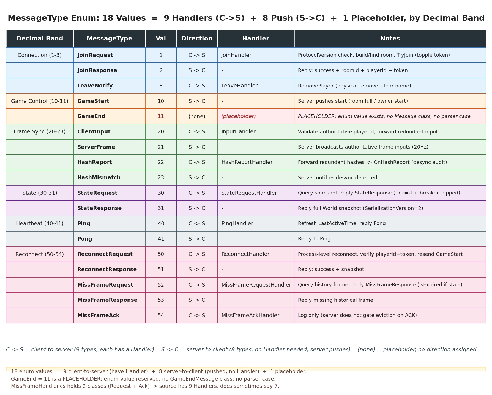
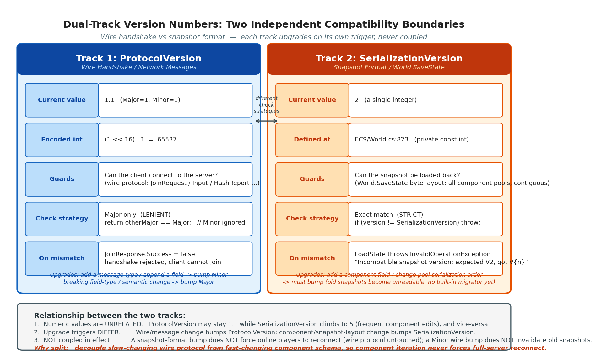
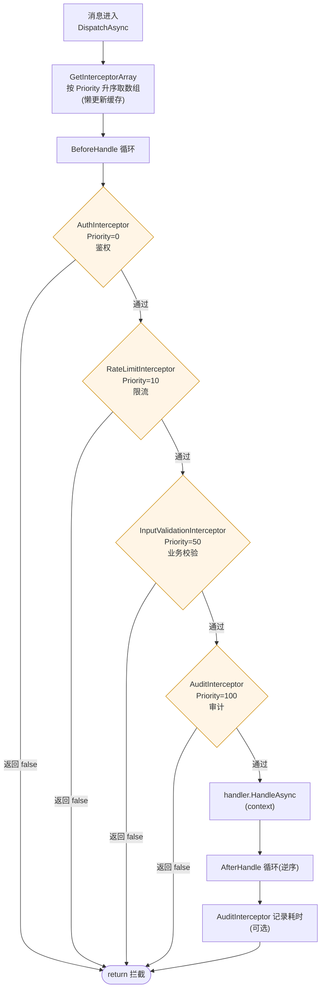

# 第 16 章 · 消息处理、协议与反作弊

> **核心问题**:上一章我们把镜头对准了房间内部——GameRoom 怎么管玩家、怎么按 20Hz 节拍聚合广播、怎么用 token 防身份劫持、怎么用熔断兜住故障 sim。但这一切都建立在"消息能正确进来、能被正确路由到处理器"之上。一条从网络上飞过来的字节流,服务器怎么知道它是 JoinRequest 还是 Input?收到后怎么找到负责它的那块代码?协议演进时,新客户端和老服务器怎么握手(老端不认得新字段怎么办)?最要命的——帧同步的逻辑在客户端各自跑,作弊者改了客户端逻辑、或开了加速挂,服务器凭什么发现?这一章就把这三件事讲透:**消息分发的策略模式、协议演进的双轨版本号、以及帧同步特有的反作弊底座**。

> **读完本章你会明白**:
> 1. 服务器收到一条消息,怎么用一个 `Dictionary<MessageType, IMessageHandler>` 查表把它路由到处理器——为什么用策略模式而不是 `switch-case`,为什么手动 `new` 注册而不反射。
> 2. 9 个 Handler 各管什么,为什么文档说 7 个源码却是 9 个(`MissFrameHandler.cs` 一个文件里塞了 Request + Ack 两个类)。
> 3. **双轨版本号**:握手线协议用 `ProtocolVersion`(1.1,Major 相等即兼容,Minor 不查=向前兼容),快照格式用 `SerializationVersion`(2,精确等值,不容版本差),为什么是两个独立兼容性边界,各自守什么。
> 4. `IMessageInterceptor` 拦截器怎么把鉴权/限流/审计做成可插拔链,`Priority` 排序约定,BeforeHandle 返回 false 即拦,以及为什么 SDK 一个拦截器都不内置。
> 5. **帧同步反作弊的四道底座**:加速挂天然防御(服务器控 20Hz 节拍)、HashReport 状态篡改检测(承上一章 + 第 23 章)、协议版本强制对齐、InputHandler 用服务端权威 playerId 不信客户端报的。
> 6. 为什么 SDK 不内置具体校验逻辑——每个游戏的输入语义不同(射速上限/瞄准角度/资源上限),SDK 提供**机制**(拦截器 + 哈希对账 + 节拍控制),业务层实现**策略**(具体数值校验),这是 SDK 的边界哲学。

> **如果一读觉得太难**:先只记住四件事——① 消息处理就是个字典查表 `MessageType → Handler`,没花活;② 版本号有两条独立的轨道,握手线协议和快照格式各升各的,互不联动;③ 加速挂在帧同步里天然不灵,因为服务器控节拍,客户端算得再快也得等服务器发帧;④ SDK 故意不写死反作弊规则,因为每个游戏的"什么算作弊"不一样,它只给你插钩子的地方(拦截器)和对账的能力(哈希),具体规则你自己填。

---

## 〇、一句话点破

> **消息处理是一个"字典查表 + 策略模式"的结构:每条消息按它的 MessageType 找到唯一的 Handler,Handler 之间互不知晓,加一种消息就加一个 Handler。协议演进靠两条独立的版本号轨道——握手线协议(ProtocolVersion)管"客户端能不能连上",快照格式(SerializationVersion)管"存盘能不能读回来",两者各自升级、互不联动,这是为了避免一次组件结构微调就逼所有在线玩家重连。帧同步的反作弊底座是"服务器控节拍 + 哈希对账 + 协议对齐 + 服务端权威 playerId",四道里面有三道是同步机制天然的副产品(白送的),真正需要业务层自己填的只有一道(具体输入语义校验),而 SDK 用拦截器把这一道的插口留了出来。**

这是结论。本章倒过来拆:先讲消息分发为什么是策略模式,再讲双轨版本号,然后逐一拆反作弊的四道底座,最后讲 SDK 边界哲学。

---

## 一、消息分发:一个字典查表,为什么不用 switch-case

### 从上一章接续

上一章我们跟着一条玩家输入走完了它在服务器里的旅程:`OnDataReceived`(传输层回调)→ 进有界 Channel → `MainLoopAsync` 每 10ms(100Hz)消费最多 512 条 → 调到 `MessageDispatcher.DispatchAsync`。但 `DispatchAsync` 内部到底干了什么,上一章留了个扣子。本章就从这里打开。

先看传输层把字节流变成消息对象这一步。`MessageParser.Parse`(`Messages.cs:531-562`)是一个 switch 表达式,按消息头第一个字节(MessageType)造对应的 Message 对象:

```csharp
public static NetworkMessage? Parse(byte[] data)
{
    if (data == null || data.Length == 0) return null;
    var reader = new BitReader(data);
    var type = (MessageType)reader.ReadByte();
    NetworkMessage? msg = type switch
    {
        MessageType.JoinRequest    => new JoinRequestMessage(),
        MessageType.ClientInput    => new ClientInputMessage(),
        MessageType.HashReport     => new HashReportMessage(),
        // ...16 个 case(GameEnd=11 占位无 Message 类)...
        _ => null
    };
    msg?.Deserialize(reader);
    return msg;
}
```

注意几个细节:① **每个消息头一个字节**(MessageType 是 `: byte` 枚举),解析器读第一个字节就知道这是什么消息。② 这个 switch 有 **16 个 case**,而枚举有 **17 个值**——`GameEnd = 11` 有枚举值但既没有 `GameEndMessage` 类、也没有 parser case(占位,见第六节"诚实标注")。③ 解析完构造空对象后立即 `Deserialize(reader)` 把后续字节填进字段。④ `_ => null` 对未知类型返回 null,调用方(LockstepServer 的 OnDataReceived)据此丢弃。

这一步产出的是一个强类型 `NetworkMessage` 子类对象。下一步就是 `MessageDispatcher.DispatchAsync` 把它路由到处理器。

### 朴素做法撞什么墙

收到一个消息对象,最朴素的路由方式是 switch-case:

```csharp
switch (msg.Type) {
    case MessageType.JoinRequest:   HandleJoin(msg); break;
    case MessageType.ClientInput:   HandleInput(msg); break;
    case MessageType.HashReport:    HandleHash(msg); break;
    // ... 17 个 case ...
}
```

这能跑,但有几个问题:

1. **这个 switch 会越来越长**。每加一种消息(比如未来加聊天、加语音、加观战控制),都要改这个中央函数。一个函数膨胀到几百行,可读性和可维护性都崩坏。
2. **扩展要对框架动刀**。如果你想加一种"业务自定义消息"(比如某个游戏特有的"投降投票"),你得改框架源码里的这个 switch——但 SDK 的定位是"宿主注入扩展,不改核心"(第 18 章详讲),这和定位冲突。
3. **测试困难**。测 JoinHandler 的逻辑,你得把整个 switch 上下文都搭起来,没法单独测一个 Handler。
4. **违反单一职责**。这个中央函数既负责"路由"(谁处理)又负责"执行"(怎么处理),两件事耦合在一起。

> **承接网络系列**:这种"一个大 switch 路由所有请求类型"的反模式,在网络框架里很常见——早期 HTTP 服务端、早期 RPC 框架都踩过。现代框架(Tokio 上的 hyper、gRPC 的 handler 注册、Envoy 的 filter chain)清一色用"注册表 + 策略"模式:每类请求一个独立处理器,中央只有一个字典查表。LockstepSdk 的 MessageDispatcher 就是这个范式,和 hyper 的 Service、Tower 的 Layer 是同一脉的思路。

### 所以这样设计:策略模式 + 字典查表

`MessageDispatcher`(`Messaging/MessageDispatcher.cs`)的核心数据结构就一行:

```csharp
private readonly Dictionary<MessageType, IMessageHandler> _handlers = new();
```

`IMessageHandler` 接口(`IMessageHandler.cs:9-21`)极简:

```csharp
public interface IMessageHandler
{
    MessageType MessageType { get; }          // 我负责哪种消息
    Task HandleAsync(MessageContext context); // 怎么处理
}
```

每个 Handler 是一个独立的类,实现这个接口,声明自己负责哪种消息。注册时(`MessageDispatcher.Register`,`:36-40`):

```csharp
public MessageDispatcher Register(IMessageHandler handler)
{
    _handlers[handler.MessageType] = handler;
    return this;
}
```

一句 `_handlers[handler.MessageType] = handler` 完成注册。分发时(`DispatchAsync`,`:95-99`):

```csharp
if (!_handlers.TryGetValue(message.Type, out var handler))
{
    _logger.Warning($"[Dispatcher] No handler registered for message type: {message.Type}");
    return;
}
```

字典查表,O(1)。查不到打个 Warning 丢弃(比抛异常安全——恶意客户端发个未知 MessageType 不能让服务器崩)。

这就是策略模式的全部。每个 Handler 是一个策略对象,Dispatcher 是上下文,MessageType 是选择键。

> **钉死这件事**:这个结构和 switch-case 的**本质区别不在于性能**(字典查表 vs switch,在这个量级 17 个消息类型,性能差异忽略不计),而在于**扩展性**。switch-case 加一种消息要改中央函数;策略模式加一种消息只需 new 一个 Handler 类、调一句 `Register`,中央 Dispatcher 一个字都不用改。这对 SDK 尤其重要——宿主想加自定义消息(聊天/语音/观战),不用碰框架源码。第 18 章讲 SDK 化时会看到,`LockstepServer.RegisterHandler`(`LockstepServer.cs:119-122`)就是把这个扩展口暴露给宿主的。

### 为什么手动 new 注册,不反射

`LockstepServer.RegisterDefaultHandlers`(`LockstepServer.cs:101-114`)是这样写的:

```csharp
private void RegisterDefaultHandlers()
{
    _dispatcher.Register(
        new JoinHandler(),
        new LeaveHandler(),
        new InputHandler(),
        new HashReportHandler(),
        new PingHandler(),
        new ReconnectHandler(),
        new MissFrameRequestHandler(),
        new MissFrameAckHandler(),
        new StateRequestHandler()
    );
}
```

9 个 Handler,手动 new,一个个写出来。很多人第一反应:这多土啊,为什么不反射扫程序集自动注册(像 ASP.NET Core 的 controller discovery)?

> **不这样会怎样**:反射自动注册听起来优雅,但在帧同步 SDK 这个场景有几个硬伤:
> 1. **AOT 不友好**。Unity 的 IL2CPP、NativeAOT 都对反射不友好(尤其是"扫程序集找带某 attribute 的类型"这种)。SDK 要跨 .NET 8 和 netstandard2.1(给 Unity 用),反射扫描在 IL2CPP 下可能直接不工作。手动 new 是 AOT-safe 的。
> 2. **顺序明确**。虽然 Dispatcher 内部用字典(无序),但手动 new 让"注册了哪些 Handler"一目了然——代码即文档。反射扫描的话,你得运行起来才知道注册了啥,调试困难。
> 3. **避免误注册**。反射扫描可能把测试用的 Mock Handler、或同程序集里别的什么实现了 IMessageHandler 的类都注册进来,行为不可控。
> 4. **启动开销**。反射扫程序集在移动端(Unity)有可观的启动延迟,帧同步游戏要快启动。

手动 new 的"土"换来的是 AOT 兼容、顺序明确、零误注册、快启动。对一个跨平台 SDK 来说,这是对的取舍。



> **图说**:MessageType 17 个枚举值按十进制分段的表格 + 各自对应的 Handler。表格六列:十进制段 / 语义类别 / MessageType 值 / 方向(C→S / S→C) / 对应 Handler / 备注。① 段 1-3 连接管理:JoinRequest(1,C→S,JoinHandler)/JoinResponse(2,S→C,-)/LeaveNotify(3,C→S,LeaveHandler)。② 段 10-11 游戏控制:GameStart(10,S→C,-)/GameEnd(11,-,占位无实现)。③ 段 20-23 帧同步:ClientInput(20,C→S,InputHandler)/ServerFrame(21,S→C,-)/HashReport(22,C→S,HashReportHandler)/HashMismatch(23,S→C,-)。④ 段 30-31 状态:StateRequest(30,C→S,StateRequestHandler)/StateResponse(31,S→C,-)。⑤ 段 40-41 心跳:Ping(40,C→S,PingHandler)/Pong(41,S→C,-)。⑥ 段 50-54 重连:ReconnectRequest(50,C→S,ReconnectHandler)/ReconnectResponse(51,S→C,-)/MissFrameRequest(52,C→S,MissFrameRequestHandler)/MissFrameResponse(53,S→C,-)/MissFrameAck(54,C→S,MissFrameAckHandler)。底部标注:9 个 Handler 对应 9 个 C→S 消息类型;S→C 消息无需 Handler(服务器主动发);GameEnd=11 占位(枚举有值,无 Message 类,无 parser case)。图内全英文:MessageType Enum / Decimal Band / Direction / Handler / Notes。

### 9 个 Handler 各管什么

文档里有时说"7 个 Handler",但源码(`LockstepServer.cs:101-114`)清清楚楚是 **9 个**。差距来自 `MissFrameHandler.cs` 这个文件——它一个文件里塞了两个类(`MissFrameRequestHandler` 和 `MissFrameAckHandler`,`MissFrameHandler.cs:10` 和 `:44`),数文件数的人会少算一个;另外早期版本可能没有 StateHandler。以源码为准。

这 9 个 Handler 按职责分四类:

| 类别 | Handler | MessageType | 干什么 |
|---|---|---|---|
| 连接 | JoinHandler | JoinRequest | 协议版本检查、找/建房、TryJoin(含顶号 token)、回 JoinResponse |
| 连接 | LeaveHandler | LeaveNotify | 调 `RemovePlayer`(物理移除,清名字) |
| 连接 | ReconnectHandler | ReconnectRequest | 进程级重连,校验 playerId+token,补发 GameStart |
| 帧同步 | InputHandler | ClientInput | 校验 playerId 权威,转发冗余输入,调 OnPlayerInput |
| 帧同步 | HashReportHandler | HashReport | 转发冗余哈希,调 OnHashReport |
| 状态 | StateRequestHandler | StateRequest | 查快照,回 StateResponse(熔断时回 tick=-1) |
| 状态 | MissFrameRequestHandler | MissFrameRequest | 查历史帧,回 MissFrameResponse(过期回 IsExpired) |
| 状态 | MissFrameAckHandler | MissFrameAck | 记日志(当前仅审计,服务器不依赖 ACK 推进) |
| 心跳 | PingHandler | Ping | 刷 LastActiveTime,回 PongMessage |

每个 Handler 都是"薄包装"——核心逻辑都在 GameRoom 里(上一章讲的 OnPlayerInput/OnHashReport/GetMissFrames/GetSnapshot/TryJoin/HandleReconnect)。Handler 只负责:① 从 MessageContext 取出强类型消息 ② 从 ClientId 查到房间和 playerId ③ 调 GameRoom 的方法。这种"Handler 薄、Room 厚"的分层是有意的:Handler 是协议适配层(把网络消息翻译成 GameRoom 方法调用),GameRoom 是领域核心(状态机 + 帧聚合 + 哈希对账)。换一套协议(比如以后加个 WebSocket 子协议),Handler 改,GameRoom 不动。

### ClientId 查房间:为什么用字典

每个 Handler 开头都有这两句(`InputHandler.cs:16,19` 为例):

```csharp
var room = context.Server.GetRoomByClient(context.ClientId);
if (room == null) return Task.CompletedTask;
var playerId = room.GetPlayerId(context.ClientId);
```

`GetRoomByClient` 和 `GetPlayerId` 都是字典查表(`LockstepServer` 持 `Dictionary<string, (int roomId, ...)>` 的 clientId 映射,GameRoom 持 `Dictionary<string, int> _clientIdToPlayer`)。一条消息进来,两次字典查表就定位到"哪个房间的哪个玩家"。O(1) 且无歧义。

> **钉死这件事**:`ClientId` 是传输层的逻辑连接 id(不是物理 socket 句柄,IP 漂了 ClientId 不变,见 JoinHandler 里的 `logicalId = $"{room.RoomId}_{PlayerName}"` 和 `BindLogicalId`)。整个消息路由链是"ClientId → roomId → playerId"三级查表,没有一处依赖网络层的物理信息(IP/port)。这是为什么玩家断线重连(传输层换了物理连接)能无缝接管原槽位——逻辑身份(ClientId)和物理连接解耦。这个解耦在上一章顶号 token 那节埋过,这里补全它的消息路由侧。

---

## 二、双轨版本号:握手线协议 vs 快照格式

这是本章最容易被讲乱的一个点。很多人一提"版本号"就以为是一个数,但 LockstepSdk 有**两条完全独立的版本号轨道**,各守各的兼容性边界。

### 朴素做法撞什么墙

最朴素的设计是"全局一个版本号",每次任何东西改了就 +1。听起来简单,但会撞一个要命的墙:

考虑这个场景:你给某个 ECS 组件加了一个字段(比如 `Transform` 加个 `Layer` 字段)。这会改变 World.SaveState 的字节布局(第 5 章 SerializationVersion=2 那套),老客户端的快照读不了新格式。如果版本号是全局的,你只能把全局版本号 +1。但全局版本号 +1 意味着**握手线协议也变了**——于是所有在线玩家被踢,必须重连,因为握手时版本不匹配。

但你其实只改了快照格式,线协议(JoinRequest/Input/HashReport 这些网络消息的结构)一个字节都没动!凭什么逼所有在线玩家重连?

这就是单轨版本号的根本问题:**两种频率完全不同的变更,被绑在同一个版本号上,慢变的(线协议)被快变的(组件结构)绑架**。线协议一年可能才改一次(加种新消息),组件结构可能一周改好几次(加字段调布局)。绑在一起,每次组件改动都触发全服重连,无法接受。

### 所以这样设计:两条独立轨道

LockstepSdk 把版本号拆成两条:

**轨道一:`ProtocolVersion`(`ProtocolVersion.cs`)**——握手/线协议版本。当前 **1.1**(Major=1, Minor=1, Version = (1<<16)|1 = 65537, `:22-28`)。它只管一件事:**客户端能不能连上服务器**。检查发生在 JoinHandler 里(`JoinHandler.cs:22-31`):

```csharp
if (!ProtocolVersion.IsCompatible(request.ProtocolVersion))
{
    await server.SendAsync(new JoinResponseMessage
    {
        Success = false,
        ErrorMessage = ProtocolVersion.GetMismatchMessage(request.ProtocolVersion)
    }, clientId);
    return;
}
```

`IsCompatible` 的实现极宽松(`:49-54`):

```csharp
public static bool IsCompatible(int otherVersion)
{
    int otherMajor = otherVersion >> 16;
    return otherMajor == Major;   // 只要 Major 相同就兼容
}
```

**只查 Major 相等,Minor 完全不查**。这意味着:服务器是 1.1,客户端是 1.0(Major 都是 1),握手照样通过。这就是"向前兼容"——Minor 版本差异不阻止连接。

**轨道二:`SerializationVersion`(`ECS/World.cs:823`)**——快照格式版本。当前 **2**(`private const int SerializationVersion = 2`)。它只管一件事:**存盘能不能读回来**。检查发生在 `World.LoadState`(`:996-1002`):

```csharp
int version = reader.ReadInt32();
if (version != SerializationVersion)
{
    throw new InvalidOperationException(
        $"Incompatible snapshot version: expected V{SerializationVersion}, got V{version}. " +
        "Snapshots from different versions are not compatible.");
}
```

注意这里的检查策略**和 ProtocolVersion 完全不同**——是**精确等值**(`version != SerializationVersion`),不是 Major-only。差一个 Minor 都抛异常。



> **图说**:双轨版本号对照表。两栏对比,每栏五行:轨道名 / 当前值 / 守护边界 / 检查策略 / 不匹配后果。左栏 ProtocolVersion:值 1.1(Major=1 Minor=1 Version=65537)/ 守护"客户端能否连上服务器"(握手线协议)/ 检查策略=Major-only 宽松(Minor 不查=向前兼容)/ 不匹配后果=JoinResponse.Success=false 拒绝握手。右栏 SerializationVersion:值 2 / 守护"快照能否读回"(World 存盘格式)/ 检查策略=精确等值严苛(差一个 Minor 都抛)/ 不匹配后果=LoadState 抛 InvalidOperationException。底部用箭头标注两者关系:数值无关联、升级触发条件不同、互不联动。图内全英文:ProtocolVersion / SerializationVersion / Wire Handshake / Snapshot Format / Major-only / Exact Match。

### 为什么两条轨道的检查策略不一样

这是设计上最讲究的一点,值得单独拆。

**ProtocolVersion 用 Major-only 宽松检查**,是因为线协议的 Minor 变更通常是小幅追加字段。看 JoinRequestMessage 怎么处理 ReconnectToken 这个 P0-2 后追加的字段(`Messages.cs:72-82`):

```csharp
public override void Deserialize(BitReader reader)
{
    ProtocolVersion = reader.ReadInt32();
    PlayerName = reader.ReadString() ?? "";
    RoomId = reader.ReadInt32();
    RequiredPlayers = reader.ReadInt32();
    // P0-2:仅 ≥ 1.1 的客户端发送此字段;旧端(< 1.1)不发,按版本门控读取避免越界。
    ReconnectToken = Core.ProtocolVersion.SupportsJoinReconnectToken(ProtocolVersion)
        ? (reader.ReadString() ?? "")
        : "";
}
```

这是个教科书式的"向前兼容反序列化":读到 ProtocolVersion 字段后,用它判断"对方有没有 ReconnectToken 这个字段",有就读,没有就填默认值。`SupportsJoinReconnectToken`(`ProtocolVersion.cs:41-42`)就是 `otherVersion >= MinVersionWithJoinReconnectToken`(= 65537,即 1.1)。

这样,1.0 的老客户端(不发 token)连 1.1 的新服务器,服务器读到 ProtocolVersion=1.0 就知道"这家伙没 token 字段",不读 token,握手照常通过(只是顶号功能对老客户端不可用)。反过来,1.1 新客户端连 1.0 老服务器,新客户端发了 token 字段,老服务器读不到这个字段(它的 Deserialize 是旧版,只读前四个字段),token 被忽略,握手也通过(顶号不可用但游戏能玩)。这就是 Minor 变更的向前兼容——靠"字段追加 + 版本门控读取"实现。

> **承接网络系列**:这种"用版本号判断字段是否存在"的向前兼容技术,在协议设计里是标配。Protocol Buffers 的 `optional` 字段、HTTP/2 的 SETTINGS 帧扩展、TLS 的 extensions,都是同一路数:新版本追加字段,老版本按自己认知读到能读的为止,多出来的字节忽略,缺的字段填默认。LockstepSdk 的手写序列化把这个能力做进了每个 Message 的 Deserialize——加字段时配一个 `SupportsXxx(version)` 判断,就完成了向前兼容。

**SerializationVersion 用精确等值严苛检查**,是因为快照格式没有"追加字段"的余地。快照是一整块连续字节(World 的所有组件池按类型 FullName 排序紧凑排列,第 5 章详讲),任何一个组件多一个字段,整个字节布局全错位——后面的数据全读乱。快照不像网络消息那样可以"读到能读的为止",它必须**整块精确匹配**。所以 SerializationVersion 差一点都不行,差一点就抛"Incompatible snapshot version"。

这也有个副作用:SerializationVersion 升级比 ProtocolVersion 升级代价大得多。升 SerializationVersion 意味着所有旧快照(包括回放文件、包括断线重连的快照缓存)全部作废。所以升 SerializationVersion 要慎之又慎,通常配合一个"迁移函数"(旧版本快照 → 新版本快照)一起上。当前 SDK 没有内置迁移函数(SerializationVersion 还是 2,没升过第三次),这是已知的待补强点。

### 两条轨道的升级触发条件

`ProtocolVersion.cs:13-17` 和 `World.cs:818-821` 的注释把两条轨道的升级触发条件写得明明白白:

| 变更类型 | 升哪条 |
|---|---|
| 加一种新的网络消息(如加聊天消息) | 升 ProtocolVersion(Minor) |
| 给现有网络消息追加字段(如 JoinRequest 加 token) | 升 ProtocolVersion(Minor)+ 版本门控读取 |
| 改网络消息的字段类型/语义(破坏性) | 升 ProtocolVersion(Major) |
| 给 ECS 组件加字段(改 SaveState 字节布局) | 升 SerializationVersion |
| 改组件池序列化顺序/格式 | 升 SerializationVersion |
| 改 World.SaveState 的元数据(VersionMagic 等) | 升 SerializationVersion |

记住一句话:**线协议/握手/网络消息变了升 ProtocolVersion,组件结构/快照布局变了升 SerializationVersion**。两者数值无任何关联——你完全可以 ProtocolVersion 还是 1.1 但 SerializationVersion 已经升到 5(频繁加组件字段),反之亦然。

> **作者复盘 · 为什么会有双轨**:早期版本确实只有一个 ProtocolVersion,快照也用它。后来发现组件字段三天两头加(业务迭代),但每次加都逼在线玩家重连,产品强烈反对。拆成双轨后,组件迭代(升 SerializationVersion)只影响新存档和断线重连(重连时拉新快照),在线玩家的线协议不动(ProtocolVersion 不升),无感。这个拆分是"线协议稳定性 vs 快照格式灵活性"的权衡,实战中极大地降低了迭代对在线用户的冲击。

---

## 三、IMessageInterceptor:把鉴权/限流/审计做成可插拔链

策略模式解决了"消息怎么路由到处理器",但还有一类需求它不管:**在消息到达处理器之前/之后,统一做一些横切的事**——鉴权(这客户端有没有资格发这种消息)、限流(这客户端是不是发太频繁了)、审计(记日志统计耗时)、过滤(消息内容是否合法)。这些需求和"具体业务逻辑"正交,不该写进 Handler。

### 朴素做法撞什么墙

最朴素的是把这些横切逻辑直接塞进每个 Handler。比如在 InputHandler 开头加:

```csharp
// 不要这样写
if (RateLimiter.IsRateLimited(context.ClientId)) return;
if (!Authenticator.IsAuthorized(context.ClientId)) return;
AuditLogger.Log(context);
// ... 然后才是业务逻辑 ...
```

问题一堆:① 每个 Handler 都要重复写这段(9 个 Handler × 3 个横切关注点 = 27 处重复)。② 改一个横切逻辑(比如限流策略从 Token Bucket 换成滑动窗口)要改 9 个 Handler。③ 横切逻辑和业务逻辑耦合,测 InputHandler 还得 mock 限流器和鉴权器。④ 想加一个新的横切关注点(比如反作弊),又要改 9 个 Handler。

### 所以这样设计:拦截器链 + Priority 排序

`IMessageInterceptor`(`IMessageHandler.cs:32-51`)是个极简接口:

```csharp
public interface IMessageInterceptor
{
    int Priority => 0;                                    // 数值越小越先执行
    bool BeforeHandle(in MessageContext context);         // 处理前,返回 false 即拦
    void AfterHandle(in MessageContext context) { }       // 处理后(可选,默认空实现)
}
```

`MessageDispatcher.DispatchAsync`(`:104-145`)在调 Handler 前后,把所有拦截器跑一遍:

```csharp
// 执行拦截器 BeforeHandle(带异常隔离)
var interceptors = GetInterceptorArray();
if (interceptors.Length > 0)
{
    for (int i = 0; i < interceptors.Length; i++)
    {
        try
        {
            if (!interceptors[i].BeforeHandle(in context))
            {
                return;   // 拦截器阻止了消息处理,直接返回,不调 Handler
            }
        }
        catch (Exception ex)
        {
            _logger.Error($"... threw exception", ex);   // 异常隔离:单个拦截器 bug 不影响整体
        }
    }
}

await handler.HandleAsync(context);   // 执行处理器

// 执行拦截器 AfterHandle(带异常隔离)
if (interceptors.Length > 0)
{
    for (int i = 0; i < interceptors.Length; i++)
    {
        try { interceptors[i].AfterHandle(in context); }
        catch (Exception ex) { _logger.Error($"... threw exception", ex); }
    }
}
```

三个关键设计点:

**1. Priority 排序,数值越小越先执行**。`GetInterceptorArray`(`:150-167`)在拦截器集合变化时(懒更新)按 Priority 升序排成数组缓存。执行时按数组顺序走——**Priority 小的先跑**,它的 BeforeHandle 返回 false 就直接拦,后面 Priority 大的根本没机会跑。这是个约定:

| Priority | 语义 | 典型拦截器 |
|---|---|---|
| 0 | 鉴权(最先,不通过直接拦,省后面所有开销) | AuthInterceptor |
| 10 | 限流(鉴权过了才看频率) | RateLimitInterceptor |
| 50 | 业务级过滤(限流过了看内容) | InputValidationInterceptor |
| 100 | 审计(最后,只记录不拦截) | AuditInterceptor |

为什么鉴权 Priority 最小?因为鉴权失败(非法客户端)就该最早拦掉,省得后面限流/过滤/审计白白跑一遍。审计 Priority 最大,因为它只记录"这条消息被处理了"(包括被前面拦截器拦掉的),不该抢先执行。

**2. BeforeHandle 返回 false 即拦,但已执行的前置拦截器的副作用不回滚**。这是个微妙的语义:如果 Priority=0 的鉴权器 BeforeHandle 返回了 true(通过),然后 Priority=10 的限流器 BeforeHandle 返回了 false(拦截),那么鉴权器已经做的事(比如记录"这客户端来过")不会撤销。这通常没问题(鉴权器一般只读不写),但写自定义拦截器时要注意——BeforeHandle 里别做不可逆副作用,因为它可能在后续拦截器拦掉时"白做了"。

**3. 异常隔离**。每个拦截器的 BeforeHandle/AfterHandle 都套了 try-catch(`:111-123`, `:135-143`)。单个拦截器抛异常,记个 Error 日志,**不影响其他拦截器和 Handler 的执行**。这是防御性设计——拦截器是宿主注入的扩展代码,质量参差不齐,一个有 bug 的拦截器不能让整个消息分发瘫痪。

> **钉死这件事**:异常隔离有个细节——BeforeHandle 抛异常被 catch 后,**默认继续往下走**(不 return)。也就是说,一个抛异常的拦截器等于"没拦"(因为它没返回 false)。这个语义是有意的:拦截器 bug 不该意外地拦掉合法消息。但代价是,如果一个鉴权器因为有 bug 抛了异常,它本来该拦的非法消息可能漏过去。所以拦截器的正确写法是:**判定不通过的分支显式 return false,别靠抛异常表达"拒绝"**。

### 拦截器数组的缓存:懒更新

`GetInterceptorArray`(`:150-167`)的懒更新值得拆一眼:

```csharp
private IMessageInterceptor[] _interceptorArray = Array.Empty<IMessageInterceptor>();
private bool _interceptorsDirty;

private IMessageInterceptor[] GetInterceptorArray()
{
    if (_interceptorsDirty || _interceptorArray.Length != _interceptorList.Count)
    {
        if (_interceptorList.Count == 0)
        {
            _interceptorArray = Array.Empty<IMessageInterceptor>();
        }
        else
        {
            _interceptorList.Sort((a, b) => a.Priority.CompareTo(b.Priority));
            _interceptorArray = _interceptorList.ToArray();
        }
        _interceptorsDirty = false;
    }
    return _interceptorArray;
}
```

拦截器存在 `_interceptorList`(List)里,但分发时遍历的是 `_interceptorArray`(数组)。添加/删除拦截器时(`:57-88`)置 `_interceptorsDirty = true`,下次 `GetInterceptorArray` 才重新排序 + 转数组。这样:① 排序开销只在拦截器集合变化时发生,不是每条消息都排。② 数组比 List 有更好的 CPU 缓存命中率(注释 `:23` 明说),热路径(每条消息都遍历拦截器)用数组。

> **承接第 14 章**:第 14 章讲过 RateLimiter 是个标准 Token Bucket。但锚点事实里有一条关键:**服务器侧 8 个 Handler 都没用 RateLimiter,它是客户端侧限流重型请求的工具类**(`_源码事实-anchor.md` 第 5 节)。服务器侧的限流靠两个机制:① 全局预算(MaxMessagesPerTick=512,第 14 章 LockstepServer.MainLoopAsync)② **IMessageInterceptor 拦截器**(宿主自己注入 RateLimitInterceptor,在 Priority=10 这一层做 per-client 限流)。SDK 提供机制(拦截器插口),不提供策略(具体限流算法和阈值)——这呼应了第六节要讲的边界哲学。



> **三道防线标注**:① **异常隔离**——每个 BeforeHandle/AfterHandle 都包 try-catch,单个拦截器抛异常不中断整条链。② **Priority 约定**——鉴权 0 > 限流 10 > 业务 50 > 审计 100,越靠前越便宜(先过滤再付费)。③ **懒更新数组缓存**——拦截器集合变化时只置 `_interceptorsDirty`,下次 `GetInterceptorArray` 才重排 + 转数组,热路径遍历数组(缓存命中率高)。

---

## 四、帧同步反作弊的四道底座

这是本章的重头戏。帧同步的反作弊和状态同步完全不同,因为**帧同步的逻辑在客户端各自跑,服务器不计算局面**。这意味着传统的"服务器权威校验"思路大部分用不上——服务器根本不知道"玩家这一步走对没走对",它只看到一串输入字节。

那帧同步靠什么防作弊?答案是**四道底座,三道白送一道要填**:

### 底座一:加速挂天然防御(服务器控 20Hz 节拍)——白送

这是帧同步反作弊最反直觉、也最有效的一道,而且它**根本不是为反作弊设计的**——它是同步机制的副产品。

考虑"加速挂":传统游戏里,加速挂让客户端跑得比别人快——别人 60fps,你开挂跑 600fps,于是你反应时间多 10 倍,操作碾压。这在状态同步游戏里是大杀器。

但在帧同步里,加速挂**天然不灵**。为什么?因为**服务器控节拍**。

上一章讲过(承接第 14 章"物理时钟节拍器"):服务器按固定 20Hz 推进,每 50ms 广播一帧权威输入。客户端**只能基于收到的服务器帧推进逻辑**——服务器不发帧,客户端的 ConfirmServerFrames 就卡住,World 不往前走。你客户端跑 600fps?没用,你的 600fps 渲染的全是同一个逻辑帧的插值画面(第 11 章表现平滑),逻辑层面你和大家一样,一秒推进 20 个逻辑帧。

```
普通玩家:  服务器发帧 → 推进 1 帧 → 等下一帧(50ms)
加速挂玩家:服务器发帧 → 推进 1 帧 → 客户端跑得快?→ 还是得等服务器发下一帧(50ms)
```

加速挂唯一的"收益"是渲染层更流畅(600fps 渲染),但这不影响游戏逻辑(伤害判定/碰撞/资源),纯属视觉。**加速挂在帧同步里偷不到任何逻辑层面的时间**。

> **钉死这件事**:这道防御的根是"服务器是唯一的节拍源"。上一章"发疯的坦克"复盘里,早期服务器被玩家输入驱动(收到输入就广播),结果节奏失控。改成物理时钟节拍器后,服务器成了绝对节拍源——客户端的推进严格依赖服务器发帧。这个为同步正确性做的设计,顺带就成了加速挂的天然克星。这是"好的同步设计自带反作弊属性"的典型案例——你不需要专门写反加速挂代码,只要同步机制是对的,加速挂就自动失效。

### 底座二:HashReport 状态篡改检测——白送 + 承接

如果作弊者改了客户端逻辑(比如改了伤害公式,一枪爆头变成一枪秒杀),他的客户端算出的局面就和其他人不一样。这种"客户端逻辑被篡改"怎么发现?

靠哈希对账(上一章第六节详讲了房间侧的 OnHashReport,这里补消息层)。每个客户端每帧算一个 World 状态哈希(FNV-1a,第 7 章),通过 `HashReportMessage` 上报给服务器。服务器收集所有客户端的哈希,比对。某帧有客户端哈希和别人不一样,就是 desync——要么作弊(改了逻辑导致算出的局面分叉),要么 bug(确定性被破坏)。

`HashReportHandler`(`HashReportHandler.cs:13-39`)就是这条对账链的消息入口:

```csharp
public Task HandleAsync(MessageContext context)
{
    var msg = context.GetMessage<HashReportMessage>();
    var room = context.Server.GetRoomByClient(context.ClientId);
    if (room == null) return Task.CompletedTask;

    var playerId = room.GetPlayerId(context.ClientId);
    if (playerId < 0) return Task.CompletedTask;

    // 1. 处理当前帧哈希
    room.OnHashReport(playerId, msg.Frame, msg.Hash);

    // 2. 处理冗余历史哈希(抗 HashReport 丢包)
    if (msg.RedundantHashes != null && msg.RedundantHashes.Length > 0)
    {
        for (int i = 0; i < msg.RedundantHashes.Length; i++)
        {
            int tick = msg.Frame - (i + 1);
            if (tick >= 0)
            {
                room.OnHashReport(playerId, tick, msg.RedundantHashes[i]);
            }
        }
    }
    return Task.CompletedTask;
}
```

注意两个细节:① `playerId = room.GetPlayerId(context.ClientId)`——**服务器用权威 clientId 映射查 playerId,不信客户端报的**(HashReportMessage 里其实没有 playerId 字段,身份完全由传输层连接推断)。这防了"一个客户端冒充另一个客户端报哈希"的攻击。② 冗余历史哈希(RedundantHashes)和冗余帧同构(上一章第四节讲过),抗 UDP 丢包——一个 HashReport 丢包,下一帧的冗余哈希补上,哈希对账不会因为丢包而漏比。

> **承接上一章**:上一章讲了 OnHashReport 的"全员到齐才比对"策略和基准取 player[0] 的误报陷阱。本章只补消息层:HashReportHandler 是对账链的入口,真正的比对逻辑在 GameRoom.OnHashReport。哈希对账的完整体系(增量哈希 O(1)、双轨模式、服务器权威哈希作第三方参照、LoadState 重算补丁)在**第 23 章**详讲——本章和上一章一起,把"房间 + 消息"这两层讲透,第 23 章再下钻到"哈希算法 + 字段级定位"。

哈希对账这道防御也是"白送"的——它的本意是抓 desync bug(确定性破坏),顺带就把作弊(篡改逻辑导致的状态分叉)一起抓了。desync 和作弊在哈希层面的表现是一样的:**某客户端算出的状态和别人不一样**。框架不区分这两种原因(它也区分不了),只负责发现"不一致",具体是 bug 还是作弊由人工/业务层判定。

### 底座三:协议版本强制对齐——白送

这道防御在第二节双轨版本号里已经埋下。JoinHandler 收到 JoinRequest,第一件事就是 `ProtocolVersion.IsCompatible(request.ProtocolVersion)`(`JoinHandler.cs:22`)。不匹配直接回 `Success=false`,拒绝握手。

这防的是什么?防的是**协议不一致导致的隐性 desync**。考虑这个攻击/事故场景:旧客户端(ProtocolVersion 1.0)不知道 ReconnectToken 字段,新服务器(1.1)以为客户端会发 token。如果不在握手时挡住,旧客户端连上来,服务器读 token 字段时读到的是字节流末尾(没有 token),要么读到乱码当 token,要么直接越界。

更阴险的是字段语义变更:假设你把 ClientInputMessage 的 Frame 字段从 int 改成 long(8 字节),老客户端还发 4 字节。如果握手不挡,老客户端连上来,服务器按 long 读 Frame,读到的是 4 字节 Frame + 4 字节 PlayerId 拼成的乱数,逻辑帧号完全错乱——这会导致老客户端的输入被塞到莫名其妙的 tick 槽位,和所有人 desync。

Major 版本对齐强制挡住这种"协议结构不一致"的连接。Minor 版本宽松(向前兼容)是因为 Minor 变更都是追加字段(配版本门控读取),不破坏老端。Major 变更才是破坏性的(字段类型变/语义变/删除字段),必须强制对齐。

> **钉死这件事**:协议版本检查是"防 desync 的第一道门",它发生在握手时(JoinRequest),比哈希对账早得多(哈希是游戏中每帧)。一个协议不一致的客户端,在握手就被挡住,根本进不了游戏,自然不会和别的客户端 desync。这是"fail fast"——越早发现不一致,损失越小。

### 底座四:InputHandler 用服务端权威 playerId——白送 + 关键

这道防御藏在 InputHandler 的一行代码里(`InputHandler.cs:20`),但它是防"输入伪造"的关键:

```csharp
var playerId = room.GetPlayerId(context.ClientId);
if (playerId < 0 || playerId != inputMsg.PlayerId) return Task.CompletedTask;
```

`inputMsg.PlayerId` 是客户端报的"我是几号玩家"。`room.GetPlayerId(context.ClientId)` 是服务器根据传输层连接查出来的"你实际上是几号玩家"。**两者必须一致,否则直接丢弃这条输入**。

为什么这么严格?考虑这个攻击场景:

```
攻击者 Malloy 是 playerId=1。
正常情况下,他只能控制 playerId=1 的坦克。

但如果服务器信客户端报的 PlayerId:
Malloy 发 ClientInputMessage { PlayerId=0, Frame=100, InputData="向左走" }
→ 服务器把这条输入当成 playerId=0(受害者 Alice)的输入,塞进 _tickInputs[100][0]
→ 广播给所有人:"playerId=0 在帧 100 向左走"
→ 所有客户端(包括 Alice 自己)都让 Alice 的坦克向左走
→ Malloy 隔空操控了 Alice 的坦克!这就是"输入注入"攻击。
```

这比改客户端逻辑(改伤害公式)容易得多——不用反编译,不用懂游戏逻辑,只要会改网络包。危害也大:可以操控所有玩家的单位,搅乱整局。

防御也很直白:**服务器不信客户端报的 playerId,用自己权威查出来的**。`room.GetPlayerId(context.ClientId)` 走的是 `_clientIdToPlayer` 字典(`GameRoom.cs:103`),这个映射在 Join/Reconnect 时由服务器写入,客户端改不了。客户端报的 PlayerId 只是个"声明",服务器拿它和权威值比对,不一致就丢——这等于"你说你是谁没用,我看你从哪条连接来的"。

> **钉死这件事**:这道防御体现了帧同步反作弊的一条核心原则——**所有"身份相关"的字段,服务器都用权威值覆盖/校验,不信客户端报的**。playerId 是身份(谁发的输入),服务器用 clientId 映射查;ProtocolVersion 是身份(你是什么版本的客户端),服务器握手时校验;ReconnectToken 是身份(你是不是原玩家),服务器比对存根。客户端能"自由发挥"的只有输入内容(InputData 字段),而这正是下一节要讲的——输入内容的校验,SDK 留给业务层。

---

## 五、为什么 SDK 不内置具体校验逻辑:机制 vs 策略的边界

讲完四道底座,有人会问:既然 SDK 这么重视反作弊,为什么不直接内置一套"输入校验器"?比如检测"射速超过 X 发/秒就判定作弊"、"瞄准角度变化超过 Y 度/帧就判定作弊"、"资源增长超过 Z/秒就判定作弊"——把这些规则写死在 SDK 里,开箱即用多好?

答案是:**SDK 不知道你的游戏长什么样,这些数值它没法填**。

### 每个游戏的"作弊"定义不同

考虑三个不同的帧同步游戏:

**游戏 A:射击游戏(TankGame)**。输入是移动方向 + 开炮键。作弊关注点:① 射速(正常 1 发/2 秒,开挂 10 发/秒?)② 瞄准角度变化率(正常人一帧最多转 30°,自瞄挂一帧转 180°?)③ 移动速度(正常 5 单位/帧,加速挂 50 单位/帧?)。

**游戏 B:RTS(多兵作战)**。输入是选兵 + 下令。作弊关注点:① 同时选中单位数(正常最多 50 个,开挂选 500 个?)② 下令频率(正常 10 次/秒,宏命令 100 次/秒?)③ 资源(正常每秒 +100,修改器 +10000?)。

**游戏 C:格斗游戏**。输入是按键序列。作弊关注点:① 连招间隔(正常最低 100ms,宏挂 10ms?)② 必杀技触发条件(正常要攒气,改端绕过?)③ 输入合法性(某些状态不能出招,改端无视?)。

三个游戏,三套完全不同的校验规则,三套完全不同的数值阈值。SDK 如果内置,要么写得很泛(没用),要么针对某类游戏写死(对别的游戏是累赘)。这是个典型的"策略不该在框架层"的场景。

> **承接架构思想**:这是软件架构里"机制 vs 策略"分离的经典原则(在《架构思想》系列里反复出现)。**机制**是"怎么插钩子、怎么调钩子、钩子返回值怎么处理"——这是通用的,SDK 该做。**策略**是"具体校验什么、阈值多少、不通过怎么办"——这是业务特定的,SDK 不该做。MessageDispatcher 提供 IMessageInterceptor 这个"机制"(插口),具体的 InputValidationInterceptor(策略)由业务层实现。这和 hyper 提供 Service trait、Tonic 提供 Interceptor、Envoy 提供 filter chain 是同一个哲学——框架给钩子,业务填规则。

### SDK 提供的机制(插口)清单

SDK 在反作弊这件事上,提供的是下面这些**机制**,业务层基于这些机制实现**策略**:

| 机制 | 在哪 | 能用来做什么(策略侧) |
|---|---|---|
| IMessageInterceptor 拦截器 | MessageDispatcher | 业务自定义 InputValidationInterceptor,Priority=50,校验 InputData 内容 |
| HashReport 对账 | GameRoom.OnHashReport | 业务订阅 OnDesyncDetected 事件,做封号/告警 |
| 服务器控 20Hz 节拍 | GameRoom.DoUpdate | (白送)加速挂自动失效,无需业务干预 |
| 协议版本对齐 | JoinHandler | (白送)协议不一致自动拒绝 |
| 服务端权威 playerId | InputHandler | (白送)输入注入自动失效 |
| Authoritative 模式 + ISimulation | LockstepServerBuilder | 业务注入服务器端 sim,跑完整逻辑校验(重开销,见第 14 章) |
| OnDesyncDetected 事件 | GameRoom | 业务订阅,做记录/告警/封号 |

注意最后一行——Authoritative 模式。如果业务真的需要服务器端跑逻辑校验(比如检测"这发炮弹的伤害不该这么高"),可以注入一个 ISimulation,服务器端跑一份完整游戏逻辑,每帧和客户端对账。这是最重(服务器要跑 N 份 sim)、也最强(能检测任何逻辑篡改)的反作弊模式。第 14 章讲过 Relay vs Authoritative 的取舍——反作弊强度是 Authoritative 模式的核心优势之一。

### 一个具体的 InputValidationInterceptor 长什么样

为了把这个边界讲透,这里给一个"业务层会怎么填这个插口"的简化示意(非源码,示意用):

```csharp
// 简化示意,非源码原文。业务层自己写,SDK 不提供。
public sealed class TankInputValidationInterceptor : IMessageInterceptor
{
    public int Priority => 50;   // 业务过滤层,在鉴权(0)限流(10)之后

    // 每个客户端的最近一次开炮时间,用于射速校验
    private readonly Dictionary<string, long> _lastFireTime = new();

    public bool BeforeHandle(in MessageContext context)
    {
        if (context.Message is not ClientInputMessage input) return true;
        if (input.InputData.Length < 2) return false;   // TankInput 至少 2 字节

        // 解析开炮位(假设 InputData[0] 的 bit0 是开炮)
        bool firing = (input.InputData[0] & 1) != 0;
        if (!firing) return true;

        // 射速校验:两次开炮间隔不少于 2000ms(游戏设计值)
        long now = DateTimeOffset.UtcNow.ToUnixTimeMilliseconds();
        if (_lastFireTime.TryGetValue(context.ClientId, out var last))
        {
            if (now - last < 2000)
            {
                // 射速过快,判定作弊,拦截这条输入
                return false;
            }
        }
        _lastFireTime[context.ClientId] = now;
        return true;
    }
}
```

这段代码 SDK 里没有(确认过:`: IMessageInterceptor` 的 grep 在整个 src 下零命中,见第二节),它是**业务层自己写的**。SDK 只提供 `IMessageInterceptor` 接口和 Priority 排序机制,业务层继承这个接口填具体规则。

> **钉死这件事**:这个示意里有个细节值得注意——拦截器拿到的 `context.Message` 是 `NetworkMessage` 基类,要判断"是不是 ClientInputMessage"得用 `is` 模式匹配。这意味着拦截器能针对**特定消息类型**做校验,不是对所有消息一刀切。这是 IMessageInterceptor 设计的灵活性来源——你可以写一个只校验 Input 的拦截器、一个只审计 HashReport 的拦截器、一个只鉴权 JoinRequest 的拦截器,各管一摊,Priority 排好序,Dispatcher 自动按序跑。

---

## 六、诚实标注:GameEnd 占位、KCP stub 的协议侧影响

按本书惯例,把几个容易踩坑的"占位/未完成"点标清楚。

**GameEnd = 11 占位**。MessageType 枚举里有 `GameEnd = 11`(`MessageType.cs:15`),但:① 没有 `GameEndMessage` 类(Messages.cs 里无此类)。② `MessageParser.Parse` 的 switch 里没有 `MessageType.GameEnd` 的 case(`Messages.cs:538-558`,只有 16 个 case,GameEnd 不在其中)。③ 没有 GameEndHandler。也就是说,这个枚举值是**预留位**——设计时留了"游戏结束消息"的坑,但没实现(游戏结束靠业务层调 `room.FinishGame()`,上一章第三节讲过)。读源码时看到这个枚举值别以为有对应消息处理逻辑。

**KCP stub 对协议层无影响**。第 17 章会详讲 KCP 是 stub(SimpleKcpCore.Update/SetConfig 空方法体)。这里只说它对**消息处理层**的影响——**零影响**。因为 KCP stub 的行为退化成"UDP + 4 字节 conv 会话过滤",对上层 MessageDispatcher 来说,KCP 和 UDP 一样,都是"收到字节流 → MessageParser.Parse → DispatchAsync"。传输层是什么,消息分发层不关心(这是分层的好处)。所以本章讲的所有消息处理/协议/反作弊机制,对 TCP/UDP/WebSocket/KCP 四种传输都一样适用。

**MissFrameAckHandler 当前仅审计**。看 `MissFrameHandler.cs:44-59` 的 MissFrameAckHandler,它的 HandleAsync 只做一件事:`context.Logger.Info(...)` 记日志。服务器**不依赖 ACK 推进**——历史帧缓冲的淘汰靠 tick 窗口(3600 帧),不靠客户端 ACK。这个 ACK 当前是"客户端礼貌性告知",服务器记个日志,但不基于它做任何决策。未来如果要做"客户端确认收到才淘汰历史帧"(类似 TCP 的 ACK 机制),这个 Handler 是接入口,但目前是占位性质。

---

## 七、技巧精解

本章最硬核的两个技巧,单独拆透。

### 技巧一:双轨版本号的"快慢解耦"

第二节讲过双轨版本号,这里从"为什么这么设计"的角度再拆一层。

**反面对比**:

- **朴素做法 A(单轨全局版本号)**:任何变更(线协议或快照)都升同一个版本号。后果:组件字段微调(高频)逼所有在线玩家重连(线协议被动变更)——慢变被快变绑架,迭代成本爆炸。
- **朴素做法 B(无版本号,靠 magic number)**:快照有个 VersionMagic(`0x4C534550` "LSEP"),但没版本号字段。后果:格式变了无法检测,旧快照读出来是乱数据,静默 desync。
- **朴素做法 C(版本号不区分检查策略)**:两条轨道都用 Major-only 宽松检查。后果:快照格式变了(Minor 差),旧端读新快照不报错但读出乱数据——快照必须精确匹配,宽松检查是错的。
- **LockstepSdk 做法(双轨 + 各自检查策略)**:ProtocolVersion(Major-only 宽松,线协议适合追加字段)+ SerializationVersion(精确等值严苛,快照必须整块匹配)+ 字段级版本门控(SupportsJoinReconnectToken)。两条轨道数值无关联、升级触发条件不同、检查策略各异——**精确匹配每种变更的性质**。

这个设计的精妙在于"对症下药":线协议的特性是"可追加字段"(向前兼容容易),所以用 Major-only + 字段门控;快照的特性是"整块连续不可追加"(改一个字段全错位),所以用精确等值。把两种特性的版本号绑成一种,必然有一种被委屈——双轨让每种都用最适合自己的策略。

> **作者复盘 · 双轨的灵感**:这个设计是受了 Protobuf 的启发。Protobuf 有 `.proto` 文件版本(线协议)和序列化后的二进制格式(隐式版本)两套。但 Protobuf 的二进制格式靠 field tag 自描述,天然向前兼容,不需要显式版本号。LockstepSdk 的快照是手写紧凑序列化(为省带宽和 GC,第 7 章),没 field tag,所以必须有显式 SerializationVersion 来守兼容性边界。这是"为性能牺牲自描述,再用版本号补回兼容性"的典型权衡。

### 技巧二:拦截器链的"Priority 约定 + 异常隔离"

第三节讲过拦截器,这里拆"Priority 约定"和"异常隔离"这两个设计决策的精妙。

**Priority 是约定不是强制**。`IMessageInterceptor.Priority => 0` 是个默认值,接口不强制你设。但 Dispatcher 按 Priority 升序排,所以 Priority 决定执行顺序。这是个"软约定"——SDK 文档建议鉴权用 0、限流用 10、业务用 50、审计用 100,但你非要写个 Priority=-999 的鉴权器也能跑(它会最先执行)。

为什么用约定不用强制(比如定义 `AuthInterceptor : IMessageInterceptor` 这种带类型的基类)?因为强制会限制灵活性——业务可能想加一个"反作弊拦截器",它既不是纯鉴权也不是纯限流,是混合的,约定下它可以用 Priority=20(介于鉴权和限流之间),强制类型下它没地方放。约定给业务自由编排拦截器顺序,代价是"乱设 Priority 可能导致顺序错乱"。这是个典型的"灵活性 vs 安全性"权衡,SDK 选了灵活性(因为拦截器是宿主扩展,SDK 不该替宿主决定顺序)。

**异常隔离是防御性编程的典范**。每个拦截器的 BeforeHandle/AfterHandle 都套独立 try-catch(`MessageDispatcher.cs:111-123, 135-143`),单个拦截器抛异常不影响其他拦截器和 Handler。这防的是"宿主注入的低质量拦截器搞垮整个消息分发"。

**反面对比**:

- **朴素做法(无异常隔离)**:拦截器抛异常直接冒泡,DispatchAsync 抛出,这条消息处理中断。如果是个高频消息(如 Input,20Hz × N 玩家),一个有 bug 的审计拦截器会让所有 Input 处理失败,游戏卡死。
- **LockstepSdk 做法(每个拦截器独立 try-catch)**:有 bug 的拦截器抛异常,记个 Error 日志,其他拦截器和 Handler 照常执行。最坏情况是这个拦截器"没起作用"(它的逻辑没跑完),但消息分发链不中断。

这个设计的代价是:**异常被吞了**(只记日志,不上抛)。如果一个拦截器本来该拦(返回 false)但抛了异常,消息会漏过去(因为异常被 catch,默认继续)。前面讲过,这要求拦截器"判定不通过显式 return false,别靠抛异常表达拒绝"。这是个编程纪律,SDK 用异常隔离保住了消息分发的鲁棒性,代价是把"拒绝"的语义和"异常"的语义区分的责任交给了拦截器作者。

---

## 八、章末小结

### 回扣主线

本章服务的是**同步机制**那一面(确定性内核 vs 同步机制)。消息处理、协议、反作弊都是"多台机器联网才需要"的东西——单机不需要 MessageType 分发(没网络消息),不需要版本号(没协议兼容问题),不需要反作弊(没别的玩家)。它们全是为"把确定的机器接到网络上"服务的。

具体地,本章的三个主题分别落在同步机制的不同侧面:

- **消息分发(策略模式)**:服务器处理并发入站消息的骨架。它和上一章的 GameRoom 是"协议适配层 vs 领域核心"的关系——Handler 薄包装把网络消息翻译成 GameRoom 方法调用。
- **双轨版本号**:协议演进的兼容性管理。它是同步机制能"平滑演进"的保证——线协议和快照格式各自升级,互不绑架。
- **反作弊四道底座**:帧同步特有的安全模型。其中三道(加速挂防御/哈希对账/协议对齐/权威 playerId)是同步机制的副产品,白送;只有"具体输入校验"需要业务层填,SDK 用拦截器提供插口。这呼应了 SDK 的边界哲学(机制 vs 策略分离)。

### 五个为什么清单

1. **为什么消息分发用策略模式(字典查表),不用 switch-case?**
   因为 switch-case 加一种消息要改中央函数,违反单一职责,且无法支持宿主扩展(加自定义消息得改框架源码)。策略模式下,加一种消息只需 new 一个 Handler 类 + 调 Register,中央 Dispatcher 不动。对 SDK 的"宿主注入扩展"定位至关重要。性能上字典查表和 switch 在 17 种消息量级无差异,选策略模式是为扩展性不为性能。

2. **为什么版本号要双轨(ProtocolVersion vs SerializationVersion),不能全局一个?**
   因为线协议和快照格式的变更频率和性质完全不同。线协议低频(一年加种消息)、可追加字段(向前兼容容易),适合 Major-only 宽松检查 + 字段门控。快照格式相对高频(组件迭代)、整块连续不可追加(改一字段全错位),必须精确等值严苛检查。绑成单轨,慢变(线协议)被快变(快照)绑架,每次组件微调逼全服重连。双轨让每种变更用最适合自己的检查策略。

3. **为什么拦截器用 Priority 排序约定,不强制类型(AuthInterceptor 基类)?**
   因为强制类型限制灵活性——业务可能要混合型拦截器(既鉴权又限流的反作弊钩子),约定下它可以自由设 Priority,强制类型下没地方放。代价是"乱设 Priority 可能顺序错乱",但拦截器是宿主扩展,SDK 不该替宿主决定顺序。这是灵活性 vs 安全性的权衡,SDK 选灵活性。

4. **为什么加速挂在帧同步里天然不灵?**
   因为服务器控 20Hz 节拍是唯一的逻辑推进源。客户端跑 600fps 也只是渲染层更流畅,逻辑层面一秒只能推进 20 帧(每帧依赖服务器广播的权威输入)。加速挂偷不到任何逻辑层面的时间——这道防御是同步机制(物理时钟节拍器)的副产品,根本不是为反作弊设计的,白送。

5. **为什么 SDK 不内置具体反作弊校验逻辑(射速/瞄准/资源)?**
   因为每个游戏的"作弊"定义不同——射击游戏关心射速和瞄准角度,RTS 关心选兵数和资源,格斗关心连招间隔。SDK 内置要么写得很泛(没用)要么针对某类写死(对别的游戏是累赘)。这是机制 vs 策略分离:SDK 提供 IMessageInterceptor 插口(机制),业务层实现 InputValidationInterceptor(策略)。和 hyper 的 Service、Tower 的 Layer、Envoy 的 filter chain 是同一个边界哲学。

### 想继续深入往哪钻

- **策略模式 vs ECS System 的对照**:本章的 IMessageHandler 是"网络消息的策略",第 5 章的 ECS System 是"逻辑帧的策略"。两者都是"中央查表 + 独立处理器",但调度方式不同(消息驱动 vs 每帧全跑)。对照能加深对策略模式在实时系统里两种形态的理解。
- **向前兼容的协议设计**:本章只讲了"字段追加 + 版本门控"这一招。生产级协议(如 Protobuf/Thrift)有更完整的向前兼容体系(field tag/optional/默认值/deprecated)。如果想做帧同步 SDK 的协议长期演进,这些是必修课。
- **反作弊的业务层实战**:本章给了 InputValidationInterceptor 的示意。真实游戏的反作弊更复杂(行为分析/统计检测/机器学习异常检测),但这些都是在 SDK 提供的"哈希对账 + 拦截器 + Authoritative sim"这三道机制之上构建的。
- **Authoritative 模式的完整反作弊**:本章提了 Authoritative 模式能做服务器端逻辑校验。第 14 章讲了 Relay vs Authoritative 的取舍,这里补反作弊视角——Authoritative 是最强反作弊(服务器跑完整逻辑),代价是服务器算力。

### 引出下一章

本章讲的是消息处理、协议、反作弊——这些是"应用层"的东西。但所有这些消息,最终都要通过某种传输层跑(TCP/UDP/WebSocket/KCP)。INetworkClient 和 IServerTransport 怎么抽象?TCP 的大端长度前缀分帧和 UDP 的无可靠性各有什么取舍?为什么 KCP 在 SDK 里是个"接口齐全算法空实现"的 stub?为什么冗余帧让 UDP 已经够用,而 KCP 反而是过度设计?下一章把这些传输层的横切问题讲透,完成第 4 篇"同步机制"的全部内容。
