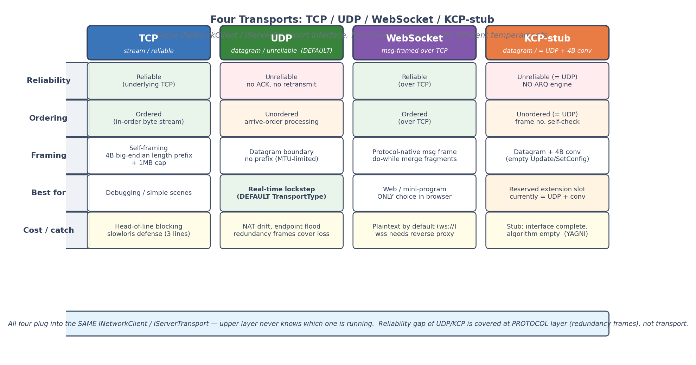
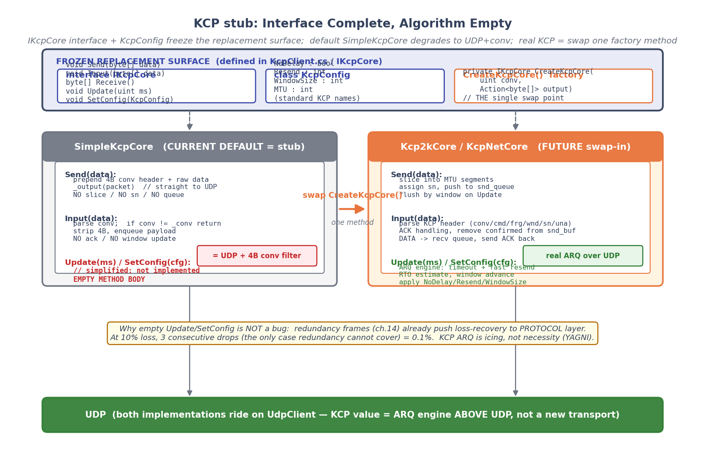
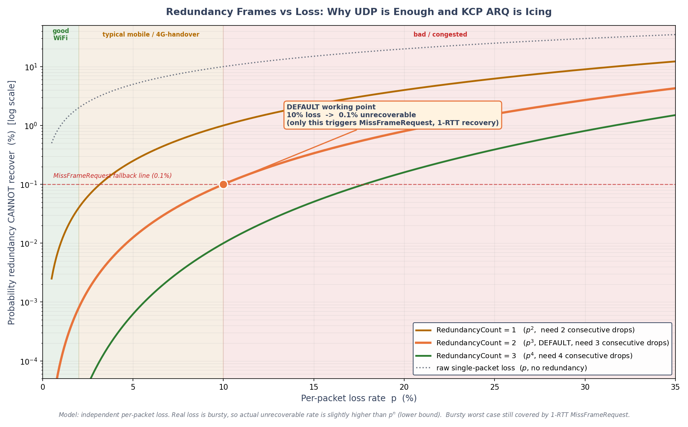

# 第 17 章 · 传输层抽象:TCP/UDP/WebSocket,以及 KCP 为什么是 stub

> **核心问题**:前面六章把帧同步的同步机制从驱动主循环一路讲到房间管理、协议、反作弊,但所有这些一直默认一件事——"消息能从一端送到另一端"。可消息到底怎么送?用 TCP 还是 UDP?流式协议怎么分帧?UDP 不可靠帧同步为什么敢用?那个号称"基于 UDP 的可靠传输"的 KCP,配置项齐全、接口完整,实现里却是一堆空方法体,这到底是"没写完"还是"有意为之"?这一章就把同步机制最底下的那一层——**传输层**——拆开:它怎么被抽象成 `INetworkClient`/`IServerTransport` 两个接口,让 TCP/UDP/WebSocket/KCP 四种实现可插拔;UDP 不可靠为什么帧同步敢用(冗余帧);以及最反直觉的一件事——**KCP 为什么是一个"接口齐全、算法空实现"的 stub**。

> **读完本章你会明白**:
> 1. 传输层为什么被抽象成两个接口(`INetworkClient` 6 属性 4 方法 5 事件 / `IServerTransport` 5 方法 2 事件),让上层 `LockstepDriver`/`LockstepServer` 完全不知道底下跑的是 TCP 还是 UDP——这是 SDK 跨平台(Web/Unity/原生)的命脉。
> 2. **TCP 是流式协议,没有消息边界**,必须自己分帧;LockstepSdk 用"大端序 4 字节长度前缀"自做消息边界,还要防 slowloris 攻击(发合法长度前缀但不发 body,占住服务端内存)——per-read 超时 30s 是怎么补的。
> 3. **UDP 没有可靠性、没有顺序**,帧同步为什么敢用:可靠性靠**协议层冗余历史帧**(承第 14 章)上移,零往返恢复;顺序靠帧号自校验,丢一包下一包的冗余帧里就带着它。
> 4. **WebSocket 借原生消息边界**,所以分帧是免费的(`endOfMessage:true` 单帧 + do-while 合并分片);但默认明文 `ws://`,要 `wss://` 得服务器侧配 TLS 或挂反代。
> 5. **★KCP 是 stub**:`KcpNetworkClient` 类注释写着"需引入 KCP 库",`SimpleKcpCore.Update` 和 `SetConfig` 都是 `// 简化版无需实现` 的空方法体,`Send` 只做"4 字节 conv 头 + 数据"拼包送 UDP,**默认行为 = UDP + 4 字节 conv 会话过滤**。这不是 bug,是"抽象槽位 vs 默认降级"的设计:今天 `UseKcp()` 能跑通(功能上等于 UDP+conv),明天接 kcp2k 只需替换 `CreateKcpCore` 一个方法。

> **如果一读觉得太难**:先只记住三件事——① 传输层被两个接口(`INetworkClient`/`IServerTransport`)抽象掉,上层不关心底下是 TCP 还是 UDP,这是 SDK 跨平台的命脉;② TCP 是流要自做分帧(4 字节长度前缀),UDP/WS 借传输边界不用;③ **KCP 是 stub**,默认行为就是 UDP+4字节 conv,接真 KCP 库只需替换一个工厂方法,冗余帧已经让 UDP 够用所以 KCP 不是必需品。

---

## 〇、一句话点破

> **传输层是这个 SDK 的"可插拔底座":两个接口(`INetworkClient`/`IServerTransport`)把"消息怎么收发"抽象掉,上层同步机制完全不知道底下跑的是 TCP 还是 UDP。四种实现各有脾气——TCP 流式要自做分帧(大端长度前缀 + 1MB 上限 + slowloris 超时),UDP 不可靠但帧同步敢用(协议层冗余帧补可靠性),WebSocket 白捡消息边界(但默认明文),KCP 是"接口齐全算法空"的 stub(默认 = UDP + 4字节 conv,接真 KCP 只需替换一个工厂方法)。冗余帧把可靠性从传输层上移到协议层,这是 KCP 能做成 stub 的根本原因。**

这是结论。本章倒过来拆:先讲为什么要把传输层抽象掉(可插拔是 SDK 跨平台命脉),再逐个拆四种实现的脾气(谁要分帧、谁白捡边界、谁不可靠),然后是本章最反直觉的一块——KCP 为什么是 stub,最后用冗余帧的概率账收尾,讲清"为什么 UDP 已经够用,KCP 是锦上添花不是必需品"。

---

## 一、为什么要把传输层抽象掉:可插拔是 SDK 跨平台的命脉

### 1.1 从上一章接续:协议不挑传输,但传输挑平台

第 16 章讲协议与反作弊时,我们说 `MessageType` 那 17 个枚举值、`ProtocolVersion` 1.1 握手、`SerializationVersion` 2 快照——这些协议层的东西是**传输无关**的:不管你用 TCP 把字节流送过去,还是用 UDP 把数据报送过去,还是用 WebSocket 把消息帧送过去,字节流到了对端,`MessageParser.Parse` 都能把它还原成 `NetworkMessage`。协议层只关心"字节流长什么样",不关心"字节流怎么到的"。

但"字节流怎么到的"恰恰是工程上最挑平台的一层:

- **Web 浏览器 / 微信小程序**:只能用 WebSocket,原生 UDP/TCP 都不让碰(浏览器没有原始 socket API)。
- **Unity / 原生客户端**:UDP 最低延迟,但 NAT 穿透、可靠性得自己补;TCP 简单可靠但有队头阻塞;KCP 想要"UDP 的低延迟 + TCP 的可靠"。
- **服务器**:Linux 上 epoll/io_uring 一把梭,Windows 上 IOCP,.NET 里都被 `TcpListener`/`UdpClient`/`HttpListener` 封装掉了。

> **承接网络系列**:TCP/UDP 的三次握手、拥塞控制、滑动窗口,WebSocket 的握手升级、掩码、分片——这些是通用网络概念,在《Tokio》《gRPC》《Pingora》那些书里讲透了。本章不重复,只讲帧同步特有的:分帧怎么和传输边界对齐、UDP 不可靠为什么帧同步敢用、KCP 为什么做成 stub。

如果上层(`LockstepDriver`/`LockstepServer`)直接依赖具体的 `TcpClient`,那这个 SDK 就只能跑在有 TCP 的地方,Web 端直接废了。所以**必须把传输层抽象掉**——上层只面向接口编程,具体用什么传输由配置在运行期决定。这是把帧同步做成"独立 SDK"(第 18 章主题)的命脉之一。

### 1.2 两个接口:客户端 `INetworkClient` 与服务端 `IServerTransport`

抽象的结果是两个接口,一个客户端用,一个服务端用。

**客户端侧 `INetworkClient`**(`Client/INetworkClient.cs:22-109`),精简到只剩同步机制真正需要的:

```csharp
public interface INetworkClient : IDisposable
{
    // 六个属性:连接后的会话状态
    int PlayerId { get; }          // 加入房间后服务器分配
    int RoomId { get; }            // 当前房间
    int Ping { get; }              // 往返延迟(ms),由传输层 Pong 回调维护
    bool IsConnected { get; }      // 是否在线
    ClientConnectionState State { get; }   // Disconnected/Connecting/Connected/Reconnecting
    string ReconnectToken { get; }  // P0-2 重连顶号令牌(承第 15 章)

    // 四个方法:连接生命周期
    Task<bool> ConnectAsync(string playerName, int roomId = 0, int requiredPlayers = 2,
                            int timeoutMs = 0, string reconnectToken = "");
    Task SendAsync(NetworkMessage msg);
    Task RequestMissFramesAsync(int startFrame);   // 应用层丢包恢复(承第 12 章)
    Task<bool> ReconnectAsync(int timeoutMs = 0);
    void Disconnect();

    // 五个事件:异步通知
    event Action<NetworkMessage>? OnMessageReceived;
    event Action<Exception>? OnError;
    event Action? OnDisconnected;
    event Action? OnReconnecting;
    event Action? OnReconnected;
}
```

注意几个设计点:

- **`SendAsync` 的入参是 `NetworkMessage`,不是 `byte[]`**。这意味着"消息怎么序列化成字节"也是传输层的职责(每个实现里都 `message.ToBytes()` 再送)。上层 `LockstepDriver` 调 `_client.SendAsync(msg)` 时,完全不用关心底下是先序列化再切片(TCP),还是序列化完直接塞进数据报(UDP)。这是把"序列化 + 分帧 + 发送"三件事打包进了传输层。
- **`Ping` 是传输层维护的属性,不是上层算的**。`LockstepDriver` 算网络时钟时直接读 `_client?.Ping`(`LockstepDriver.cs:695-702`),Pong 回调在传输层内部处理 `now - pong.ClientTimestamp`(承第 13 章)。这把"RTT 怎么测"的细节也下沉了。
- **`RequestMissFramesAsync` 是独立方法,不走 `SendAsync`**。它本质就是发一个 `MissFrameRequestMessage`,完全可以写成 `SendAsync(new MissFrameRequestMessage{...})`。单列出来的原因是**它的语义是"应用层丢包恢复"**,和普通消息发送不同——它触发的是服务器的补帧流程(承第 15 章 GetMissFrames)。把它显式写在接口上,是提醒调用方"丢包恢复是传输无关的协议层能力"。
- **五个事件里 `OnReconnecting`/`OnReconnected` 是重连通知**。`LockstepDriver` 订阅 `OnReconnected` 来触发应用层追帧(`Start(isReconnect:true)` → `RequestMissFrames(0)`,承第 19 章)。重连在传输层做(重新建连 + 发 ReconnectRequest),追帧在应用层做,两层解耦。

**服务端侧 `IServerTransport`**(`Server/Transports/IServerTransport.cs:12-50`),更精简:

```csharp
public interface IServerTransport : IDisposable
{
    void Start(CancellationToken ct);
    void Stop();
    Task SendAsync(ReadOnlyMemory<byte> data, string clientId);     // 点对点
    Task BroadcastAsync(ReadOnlyMemory<byte> data, IEnumerable<string> clientIds);  // 广播
    void UpdateClientAddress(string clientId, string physicalAddress);  // UDP 漂移用

    event Action<byte[], string>? OnDataReceived;        // (payload, clientId)
    event Action<string>? OnClientDisconnected;
}
```

服务端接口的入参是**裸 `byte[]`/`ReadOnlyMemory<byte>`**,不像客户端那样是 `NetworkMessage`。原因是服务端的 `LockstepServer` 自己有消息分发器(`_dispatcher`),收到字节后自己 `MessageParser.Parse` 再派发给 9 个 Handler(承第 16 章)。传输层只负责"把字节从 A 搬到 B",不管字节是什么消息。

一个值得注意的方法是 `UpdateClientAddress`。注释明说"主要用于 UDP 漂移"——UDP 无连接,客户端的 IP:port 可能在 NAT 重绑后变(所谓 NAT 漂移),这时上层(房间)用逻辑 `clientId`(玩家加入时分配)调用这个方法,告诉传输层"这个逻辑 ID 现在的物理地址变了"。TCP/WS 是持久连接,这个方法对它们是空操作(`TcpServerTransport.cs:298-301` 直接是 `{ }`)。这是"传输差异上浮到接口"的典型例子:UDP 的无连接特性,通过一个接口方法让上层有机会介入。

### 1.3 TransportType 枚举 + Builder:运行期决定用什么传输

抽象完了接口,还要有一套"根据配置实例化具体实现"的机制。这就是 `TransportType` 枚举 + `LockstepClientBuilder`(`Client/LockstepClientBuilder.cs`):

```csharp
public enum TransportType   // IServerTransport.cs:55-76
{
    Udp,        // = 0,默认
    Tcp,        // = 1
    Kcp,        // = 2
    WebSocket   // = 3
}
```

`LockstepClientBuilder.Build()` 的核心就是一个 switch(`LockstepClientBuilder.cs:142-149`):

```csharp
return _config.Transport switch
{
    TransportType.Tcp => new TcpNetworkClient(_config.ServerAddress, _config.ServerPort, _config, _credStore),
    TransportType.Kcp => new KcpNetworkClient(_config.ServerAddress, _config.ServerPort, _config.KcpConfig, _config, _credStore),
    TransportType.WebSocket => new WebSocketNetworkClient(
        $"{(_config.UseSsl ? "wss" : "ws")}://{_config.ServerAddress}:{_config.ServerPort}{_config.WebSocketPath}",
        _config, _credStore),
    _ => new UdpNetworkClient(_config.ServerAddress, _config.ServerPort, _config, _credStore)   // 默认分支 = Udp
};
```

链式 API 长这样:

```csharp
var client = new LockstepClientBuilder()
    .UseUdp()                    // 或 .UseTcp() / .UseKcp() / .UseWebSocket(path:"/ws")
    .WithServer("192.168.1.10", 9999)
    .WithLogger(logger)
    .Build();                    // 返回 INetworkClient
```

> **钉死这件事**:`UseUdp()`/`UseTcp()`/`UseKcp()`/`UseWebSocket()` 这些 Builder 方法,做的事只是 `_config.Transport = TransportType.Xxx`——**它们不创建客户端,只设个标志位**。真正的实例化推迟到 `Build()` 里那个 switch。这是"延迟绑定"的标准做法:配置阶段允许反复改(最后一次 `UseXxx` 生效),构建阶段一次性实例化。

这个设计让"换传输层"变成一行代码的事:开发期本地联机用 UDP(`.UseUdp()`,最低延迟),Web 端用 WebSocket(`.UseWebSocket()`),弱网测试想试 KCP 就 `.UseKcp()`。上层 `LockstepDriver` 拿到的是 `INetworkClient`,完全不知道底下是什么。这就是"可插拔底座"的字面含义。

### 1.4 一个反直觉点:`Ping` 为什么是传输层维护,而不是协议层

上面提到 `INetworkClient.Ping` 是传输层维护的属性。细想一下会反直觉:Ping/Pong 是协议层消息(`MessageType.Ping=40`/`Pong=41`,承第 16 章),为什么"延迟测量结果"由传输层持有,而不是由协议层(比如 `LockstepDriver` 或 `NetworkClock`)持有?

> **所以这样设计**:Ping 的测量本质是"本地发 PingMessage 时记的时间戳,与收到 PongMessage 时的时间戳之差"。但 PongMessage 收到的时机,各传输层不一样——TCP 是流里解出来的,UDP 是数据报里收到的,WS 是消息帧里合出来的。如果让上层算 Ping,上层得订阅 `OnMessageReceived`,在里面识别 PongMessage,再算差值。但 `OnMessageReceived` 是个通用回调,所有消息都走它,在里面塞 Ping 计算逻辑会让上层耦合到协议细节。
>
> 更关键的是:**Pong 的处理还要更新心跳状态**(`_lastPongTime`,用于超时断线检测)。心跳是传输层自己的事(每个传输层都有自己的心跳定时器 `Timer? _heartbeatTimer`)。所以 Pong 一到,既算 Ping 又更新心跳,都在传输层内部完成,然后通过 `Ping` 属性暴露给上层读。这是"高内聚"——把"和这个传输层的连接健康度有关的状态"都收拢在传输层里。

四个客户端实现里,`HandleInternalMessage` 都有同一段(`TcpClient.cs:393-397` 等):

```csharp
case PongMessage pong:
    var now = DateTimeOffset.UtcNow.ToUnixTimeMilliseconds();
    Ping = (int)(now - pong.ClientTimestamp);   // 算 Ping
    _lastPongTime = now;                         // 更新心跳
    break;
```

注意 `Ping` 算的是**墙钟差**(`now - pong.ClientTimestamp`),不是 NTP——这意味着如果客户端本地时钟被改过,Ping 会不准。但 Ping 只用于 `NetworkClock` 估单向延迟(承第 13 章),不参与确定性运算,墙钟差足够。确定性运算要的是单调钟(Stopwatch,承第 14 章 GameRoom 的 P1 修复),那是另一回事。

> **承接第 13 章**:`NetworkClock` 消费的 `ping` 来自 `INetworkClient.Ping`(传输层维护),而不是从 `PongMessage` 自己算。`UpdateFromPong(ping, pong.ServerTimestamp)` 里的 `ping` 是入参,由 `LockstepDriver` 从 `_client.Ping` 透传进来(`LockstepDriver.cs:695-702`)。这是传输层 / 时钟层职责分工的边界:传输层管"RTT 怎么测",时钟层管"RTT 怎么用"。

---

## 二、四种传输的脾气:分帧、可靠性、消息边界

抽象归抽象,四种实现各有脾气。这一节按"消息边界"这个轴把四种传输分成两派:**流式协议(TCP/WS)必须自做分帧**,**数据报协议(UDP/KCP-stub)借传输边界**。然后逐个拆。

> **承接网络系列**:TCP 是面向连接的可靠字节流,UDP 是无连接的不可靠数据报——这是计算机网络教材的第一课,《Tokio》《Pingora》那些书里 TCP/UDP 的内核实现(socket buffer、拥塞窗口、MTU)讲透了。本章只讲"站在应用层视角,这四种传输怎么承载帧同步消息",不重复内核侧。

### 2.1 分帧的轴:流式 vs 数据报

应用层发的是"消息"——一个有边界的 `NetworkMessage`(比如 `ServerFrameMessage`,序列化成一段 byte[])。但底层传输提供的是"字节流"或"数据报",两者天差地别:

| 传输 | 提供的抽象 | 有没有消息边界 | 应用层要不要分帧 |
|---|---|---|---|
| TCP | 字节流 | **没有** | **要**,自己加长度前缀 |
| WebSocket | 消息帧 | **有**(协议自带) | **不用**(但分片要合并) |
| UDP | 数据报 | **有**(每个包独立) | **不用**(但包大小受 MTU 限制) |
| KCP-stub | 数据报(UDP) | **有** | **不用**(套了 4 字节 conv 头) |

> **不这样会怎样**:假设 TCP 不分帧,应用层 `SendAsync(msg1)` 然后 `SendAsync(msg2)`,对端 `ReadAsync` 可能一次读出 `msg1+msg2` 拼在一起的字节流,根本不知道 msg1 在哪结束、msg2 从哪开始。这就是所谓的"TCP 粘包/半包"问题(其实 TCP 没有粘包,它就是流,流没有边界是本性)。帧同步消息尺寸可变(`ServerFrameMessage` 带 N 个玩家的输入,加上冗余帧可能几百到上千字节),不分帧根本没法解析。

UDP/KCP 是数据报,每个包天然有边界——`SendAsync` 发一个包,对端 `ReceiveAsync` 收一个完整的包,不会半个半个来。但代价是单包大小受 MTU 限制(以太网通常 1500 字节,扣掉 IP/UDP 头实际可用 ~1472 字节),超过就会被 IP 分片,分片任一片丢了整个包就废了。帧同步消息一般远小于 MTU,这不是问题。

WebSocket 是个特例:它建立在 TCP 之上(所以底层是字节流),但协议层自己加了"消息帧"的概念——每个 WebSocket 消息由一个或多个 frame 组成,最后一个 frame 的 `EndOfMessage` 标志置 true。所以应用层看到的是"有边界的消息",分帧 WebSocket 协议替你做了。

下面逐个拆。

### 2.2 TCP:流式协议自做分帧——大端序 4 字节长度前缀

TCP 客户端发送的核心(`TcpClient.cs:267-294`):

```csharp
public async Task SendAsync(NetworkMessage message)
{
    if (_disposed || _stream == null || !IsConnected) return;

    await _sendLock.WaitAsync();     // 串行化发送,防两条消息交错写流
    try
    {
        var data = message.ToBytes();
        
        // 大端序 4 字节长度前缀
        var lengthBytes = new byte[4];
        lengthBytes[0] = (byte)(data.Length >> 24);
        lengthBytes[1] = (byte)(data.Length >> 16);
        lengthBytes[2] = (byte)(data.Length >> 8);
        lengthBytes[3] = (byte)data.Length;
        
        await _stream.WriteAsync(lengthBytes, 0, 4);   // 先写 4 字节长度
        await _stream.WriteAsync(data, 0, data.Length); // 再写消息体
        await _stream.FlushAsync();
    }
    finally { _sendLock.Release(); }
}
```

发送侧简单:4 字节大端序长度前缀 + 消息体,串行写出去。`_sendLock`(SemaphoreSlim)保证同一时刻只有一个发送在写流,防两条消息的字节交错(虽然 `WriteAsync` 一般是顺序的,但多线程并发调可能有缓冲区竞争,加锁稳妥)。

接收侧才是麻烦的地方(`TcpClient.cs:310-369`),因为 TCP 是流,你不知道一次 `ReadAsync` 能读出几个字节——可能正好 4 字节长度前缀,可能只读到 3 字节(半包),可能连下一个消息的前几个字节都一起读出来了(粘包)。所以接收循环得严格按"先凑齐 4 字节长度,再按那个长度凑齐消息体"两阶段:

```csharp
// 阶段 1:凑齐 4 字节长度前缀
int bytesRead = 0;
while (bytesRead < 4)
{
    int read = await _stream.ReadAsync(_lengthBuffer, bytesRead, 4 - bytesRead, ct);
    if (read == 0) { OnDisconnected?.Invoke(); return; }   // 对端关闭
    bytesRead += read;
}

int messageLength = (_lengthBuffer[0] << 24) | (_lengthBuffer[1] << 16) | 
                    (_lengthBuffer[2] << 8) | _lengthBuffer[3];

// 防御:长度非法直接丢
if (messageLength <= 0 || messageLength > 1024 * 1024)   // 1MB 上限
{
    _logger.Warning($"[TcpClient] Invalid message length: {messageLength}");
    continue;   // 客户端版只是跳过这一条
}

// 阶段 2:按长度凑齐消息体
var messageBuffer = new byte[messageLength];
bytesRead = 0;
while (bytesRead < messageLength)
{
    int read = await _stream.ReadAsync(messageBuffer, bytesRead, messageLength - bytesRead, ct);
    if (read == 0) { OnDisconnected?.Invoke(); return; }
    bytesRead += read;
}

var msg = MessageParser.Parse(messageBuffer);
```

这段有两个工程点必须讲:

**① 大端序为什么是大端序**。`lengthBytes[0] = data.Length >> 24`——最高字节放第一个,这是大端序(Big-Endian / 网络字节序)。TCP/IP 协议族的历史惯例就是大端序(`htonl`/`ntohl` 那套),所有网络协议头(IP/TCP/UDP)都是大端序。LockstepSdk 的消息**体**是小端序(`BitWriter` 全用 `WriteInt32LittleEndian`,承第 7 章),但**长度前缀**是大端序——这是有意区分:**前缀是传输层自做的帧头,跟网络惯例走;消息体是协议层序列化的,跟 .NET 运行时原生序走**(小端序在 x86/ARM 上免转换)。

> **钉死这件事**:别被"序列化用小端,长度前缀用大端"绕晕。原则就一条:**谁的字节,谁定序**。长度前缀是 TCP 分帧层自己加的,跟网络协议族惯例走大端;消息体是 `BitWriter` 序列化的,跟确定性序列化(跨平台一致)走小端。两层各自自洽,层间接口只有"4 字节 → 一个 int"的反序列化,大端小端都行,只要收发双方一致。

**② 1MB 上限**。`messageLength > 1024 * 1024` 直接拒。这个上限是怎么定的?帧同步消息最大的是 `StateResponseMessage`(全量快照,承第 19 章),实测几百 KB 量级(5000 实体的 World SaveState 约 2KB-数十 KB,但带组件池缓存的全量快照在极端场景可能更大)。1MB 是个留了余量的上限。但这个上限不只是为了"业务上够用",更是一个**安全防御**:如果对端发一个声明 `messageLength = 0x7FFFFFFF`(2GB)的长度前缀,接收侧 `new byte[messageLength]` 会直接 OOM。1MB 上限把这个攻击面堵了。

> **承接第 22 章**:`Benchmark` 报告里的"2251 bytes/帧 GC"是 `SaveState().ToArray()` 的伪影,真实生产路径 635 B/帧(承第 22 章)。所以 1MB 上限对正常业务绰绰有余,留给快照、批量补帧、未来扩展。

### 2.3 服务端 TCP:1MB 上限不够,还要防 slowloris

客户端侧的 1MB 上限防的是"对端声明巨大长度让我 OOM"。但服务端面对的是公网客户端,**攻击者可以反过来用合法长度前缀,但不发 body**——这就是 slowloris 攻击的变体。

> **朴素做法撞什么墙**:服务端 `AcceptTcpClient` 后,`HandleClientAsync`(`TcpServerTransport.cs:123-246`)进入读循环。读循环第一件事是读 4 字节长度前缀。假设攻击者发一个合法的 `0x00100000`(1MB)长度前缀,然后**再也不发 body**。服务端 `ReadAsync` 在阶段 2 会**永远阻塞**(TCP 是流,对端不关闭连接也不发数据,`ReadAsync` 就一直等),同时手里攥着一个预分配的 1MB body 缓冲(`new byte[messageLength]`)。攻击者开几千条这样的连接,服务端内存就被几千个 1MB 缓冲吃光——这是内存放大 DoS。

`TcpServerTransport` 防这个攻击有两道:

**第一道:并发连接数上限**(`TcpServerTransport.cs:38, 100-105`)。`MaxConcurrentConnections` 默认 4096,Accept 后立刻检查,超了直接 `client.Close()` 拒掉:

```csharp
if (_clients.Count >= MaxConcurrentConnections)
{
    _logger.Warning($"[TcpTransport] Connection rejected: max concurrent connections ({MaxConcurrentConnections}) reached");
    try { client.Close(); } catch { }
    continue;
}
```

注释明说"单消息体上限 1MB,故最坏内存占用 ≈ MaxConcurrentConnections × 1MB"——4096 × 1MB = 4GB,这是兜底。

**第二道:per-read 超时(D-3,slowloris body-holding 防御)**(`TcpServerTransport.cs:50, 142-218`)。光有并发上限不够——攻击者完全可以只开 4096 条(刚好不超上限)连接,每条都"发合法长度前缀但不发 body"。这时 4096 条连接各攥着 1MB 缓冲,服务端 4GB 内存被吃光,而且**永远不会断开**(TCP 连接活着,`ReadAsync` 阻塞中)。

D-3 的解法是给每段 `ReadAsync` 套一个超时。`ReadTimeoutMs` 默认 30000ms(30 秒),用 `CancellationTokenSource.CreateLinkedTokenSource(ct)` + `CancelAfter(ReadTimeoutMs)` 实现:

```csharp
using var readTimeoutCts = CancellationTokenSource.CreateLinkedTokenSource(ct);
var readToken = readTimeoutCts.Token;

while (bytesRead < 4)
{
    readTimeoutCts.CancelAfter(ReadTimeoutMs);   // 每段读前重置定时器
    int read;
    try { read = await stream.ReadAsync(lengthBuffer, bytesRead, 4 - bytesRead, readToken); }
    catch (OperationCanceledException)
    {
        readTimedOut = !ct.IsCancellationRequested;   // 服务端停(ct 取消)不算超时
        break;
    }
    ...
}

if (readTimedOut)
{
    _logger.Warning($"[TcpTransport] Read timeout (length prefix) from {clientId} after {ReadTimeoutMs}ms, closing connection (slowloris defense)");
    return;   // 触发 finally 清理 + OnClientDisconnected
}
```

关键细节是 `CancelAfter` 在**每段读之前**重置(`readTimeoutCts.CancelAfter(ReadTimeoutMs)` 在 while 循环里)。这样:① 慢速但持续发送的合法客户端(弱网、大快照),每段读都有数据到达,定时器一直被重置,永远不会超时;② "发前缀后静默"的 slowloris,30 秒内没数据到达,定时器触发,连接被关。

> **作者复盘 · D-3 的权衡**:30 秒是个很宽容的值。正常网络下单段读(4 字节前缀或一段 body)应该在毫秒级完成,30 秒超时几乎不会误伤合法客户端。设这么宽容,是因为弱网下(比如手机切 WiFi/4G 的瞬间)TCP 可能短暂 stall 几秒,超时设太短会把这种正常抖动误判成攻击。slowloris 的特征是"完全静默 30 秒",合法客户端再弱网也不会 30 秒一个字节不发。这个值是"宁可宽容慢客户端,也要确保只打中真攻击"的取舍。

还有一个细节:读到非法长度(`messageLength <= 0 || > 1MB`)时,服务端不是 `continue`(客户端版才是 continue),而是直接 `return` 关闭连接(`TcpServerTransport.cs:181-189`)。注释解释得很清楚:"length-prefixed 流无法在连接内重新同步——原 continue 会把后续字节继续当作长度前缀解析,级联报错。帧错误 = 连接级错误,类似 HTTP/2 的 connection error"。这是流式协议分帧的铁律:**一旦帧失步,整条连接废了,只能关掉重来**。

### 2.4 UDP:没有可靠性、没有顺序,但帧同步敢用

UDP 客户端的发送(`UdpClient.cs:254-267`)简单到不像话:

```csharp
public async Task SendAsync(NetworkMessage message)
{
    if (_disposed) return;
    try
    {
        var data = message.ToBytes();
        await _client.SendAsync(data, data.Length);   // 直接发,完事
    }
    catch (Exception ex) { OnError?.Invoke(ex); }
}
```

没有长度前缀,没有锁,没有 flush——因为 UDP 是数据报,`SendAsync` 一次发一个完整的包,操作系统直接把它扔到网络层。接收侧(`UdpClient.cs:350-383`)同样简单:收到即 `Parse`,没有任何去重、重排:

```csharp
private async Task ReceiveLoopAsync(CancellationToken ct)
{
    while (!ct.IsCancellationRequested && !_disposed)
    {
        var result = await _client.ReceiveAsync(ct);
        var msg = MessageParser.Parse(result.Buffer);
        if (msg != null)
        {
            if (msg is PongMessage pong) OnPongReceived(pong);
            OnMessageReceived?.Invoke(msg);
        }
    }
}
```

注意三个"没有":

- **没有去重**:同一个包收到两次,`OnMessageReceived` 触发两次。
- **没有重排**:先发的包可能后到,但接收侧按到达顺序处理,不缓存等待。
- **没有可靠性**:包丢了,发送方不知道,接收方不知道,没有任何重传。

> **承接网络系列**:UDP 的不可靠无序是教科书概念,《Tokio》里讲的 `recv_from`/`send_to`、内核 UDP socket buffer 的行为,这里不重复。本章只讲"帧同步在这种传输上,凭什么不出事"。

那帧同步为什么敢用 UDP?三个理由,前两个是协议层的事(承第 14 章已讲透),第三个是传输层本节要补的:

**理由一:可靠性上移到协议层(冗余历史帧)**。这是第 14 章 P4-14 详讲过的。服务器每次广播第 N 帧时,顺手把第 N-1、N-2 帧塞进同一个包(`RedundancyCount` 默认 2)。即使第 N-1 帧那个包丢了,第 N 帧的包里带着 N-1 的内容,客户端零往返就补上了。**这把"不丢包"的可靠性从传输层(UDP 没可靠性)上移到了协议层(应用层自己冗余)**,和具体传输解耦。第 14 章算过概率账:10% 丢包率下,连续 3 个包(当前帧 + 2 冗余)全丢的概率是 0.1%。本章后面"技巧精解"会把这个账重算一遍并配图。

**理由二:顺序靠帧号自校验**。每个 `ServerFrameMessage` 带 `FrameData.Frame`(帧号),客户端 `LockstepController.ConfirmServerFrames` 收到一帧,先看帧号对不对得上预期的 tick——不对就丢(陈旧帧)或触发补帧(跳帧)。这是第 10 章讲过的 RingBuffer 时效性契约(C-5)在客户端侧的体现:纯槽数组越界静默环绕,靠调用方 `payload.Frame == tick` 自校验。**UDP 后发先到、先发后到都没关系,帧号一比对就知道该用不该用**。

**理由三(本节重点):UDP 的"收到即 Parse"反而是优势**。这听起来反直觉——没有重排缓冲,乱序包不就乱处理了吗?但帧同步的同步机制设计让"乱序处理"是安全的:① 同一帧的输入,后到的不影响先到的(帧内输入按玩家 ID 索引,不是按到达顺序合并);② 跨帧的乱序,帧号校验兜底(陈旧帧直接丢,不会污染当前状态)。如果像 TCP 那样维护一个严格的字节流顺序,反而会因为"等一个迟到的包"导致后续包全部阻塞(队头阻塞)——这正是 TCP 用于实时游戏的致命伤。

> **不这样会怎样**:用 TCP 做帧同步,假设第 100 帧的包丢了,TCP 会重传。但重传期间,第 101、102、103 帧的包(已经在网络上了)会被 TCP 的接收缓冲**按序暂存**——必须等 100 帧重传到了,101/102/103 才能交给应用层。客户端的 `LockstepController` 收不到新帧,`ConfirmServerFrames` 一直空转,本地预测深度越走越深,一旦 100 帧终于重传到,客户端要回滚重演一大段——这就是 **TCP 的队头阻塞(head-of-line blocking)**。实时游戏里,这一瞬间的卡顿玩家是能感知的。UDP 没这个问题:100 帧丢了,101 帧照常到达,客户端发现 100 帧缺失,要么用冗余帧补(零往返),要么发 MissFrameRequest 补(一往返),期间 101 帧照常处理。

UDP 客户端类注释没写"不推荐用于对延迟敏感的帧同步游戏"(那是 TCP 类注释的话,`TcpClient.cs:11-13`),反而 UDP 是 `TransportType` 的默认值(`NetworkClientConfig.cs:21` `Transport = TransportType.Udp`)。这不是偶然——**UDP 是帧同步的首选传输**,可靠性由协议层冗余帧补。

### 2.5 服务端 UDP:无连接的代价是"clientId = endpoint 字符串"

UDP 服务端有个 TCP/WS 都没有的麻烦:**UDP 无连接,没有"accept"这个动作**,所以服务器不知道"这个客户端是谁",只能从收到的数据报的 `RemoteEndPoint` 反推。`UdpServerTransport.ReceiveLoopAsync`(`UdpServerTransport.cs:56-80`)里:

```csharp
var result = await _server.ReceiveAsync(ct);
var clientId = result.RemoteEndPoint.ToString();   // clientId = "192.168.1.5:12345"

// 缓存 endpoint(资源耗尽防御)
if (_endpoints.Count < MaxCachedEndpoints || _endpoints.ContainsKey(clientId))
{
    _endpoints[clientId] = result.RemoteEndPoint;
}

OnDataReceived?.Invoke(result.Buffer, clientId);
```

UDP 的 `clientId` 就是源 IP:port 的字符串。这带来两个问题:

**问题一:NAT 漂移**。手机在 WiFi/4G 切换、或 NAT 表项过期重绑后,同一个玩家的源 IP:port 会变。这时上层(GameRoom)用逻辑 playerId 标识玩家,但传输层只认 endpoint 字符串。`IServerTransport.UpdateClientAddress` 就是为这个设计的:上层检测到玩家换了物理地址,调 `UpdateClientAddress(logicalClientId, newPhysicalAddress)` 更新 `_endpoints` 映射。这是 UDP 无连接特性强制上浮到接口的工程负担——TCP/WS 持久连接完全不用管这个(`TcpServerTransport.UpdateClientAddress` 直接是空方法)。

**问题二:资源耗尽**。UDP 无连接意味着 `OnClientDisconnected` 永远不会触发(UDP 没有"断开"这个概念),`_endpoints` 字典只能进不能出。攻击者伪造海量不同源 IP:port 发包,字典就无界增长 → OOM。`MaxCachedEndpoints` 默认 8192 是兜底(注释 `UdpServerTransport.cs:28-34`),超出就停止缓存"陌生源"(已有条目仍刷新)。合法玩家经 `BindLogicalId → UpdateClientAddress` 显式注册路由,不受影响。

> **作者复盘 · UDP 服务端的资源防御**:这一节四个传输(KCP 也有同样问题)都加了 `MaxConcurrentConnections`/`MaxKcpInstances`/`MaxCachedEndpoints` 之类的上限,全是公网部署被教育出来的。早期版本没这些,假设"客户端都是合法玩家,数量有限"。一旦上公网测试,伪造源 IP 的洪水包几秒钟就把字典撑爆。每个传输都补了上限,默认值(TCP/WS/KCP 4096,UDP 8192)按"游戏服务端常规容量 + 单消息 1MB 内存放大"算的。这不是性能优化,是**安全兜底**——帧同步 SDK 的传输层必须假设最坏的输入。

### 2.6 WebSocket:白捡消息边界,但默认明文

WebSocket 是四种里最"省心"的——它建立在 TCP 之上(所以可靠、有序),但协议层自己加了消息帧的概念,应用层看到的是"有边界的消息",不用自做分帧。发送侧(`WebSocketClient.cs:223-241`):

```csharp
public async Task SendAsync(NetworkMessage msg)
{
    if (!IsConnected) return;
    await _sendLock.WaitAsync();
    try
    {
        var data = msg.ToBytes();
        await _ws.SendAsync(new ArraySegment<byte>(data),
            WebSocketMessageType.Binary, endOfMessage: true, CancellationToken.None);
    }
    finally { _sendLock.Release(); }
}
```

`endOfMessage: true` 表示"这是一个完整的消息,一帧发完"。帧同步消息小(几百到上千字节),单帧就够,不分片。`_sendLock` 是必须的——注释明说"WebSocket SendAsync 不允许并发",ClientWebSocket 内部状态机不支持两个 SendAsync 同时跑。

接收侧(`WebSocketClient.cs:274-316`)有一个 WebSocket 协议特有的细节——**分片合并**。即使发送方 `endOfMessage:true` 单帧发,接收方也要用 do-while 循环,因为对端(或中间代理)可能把消息拆成多个 frame:

```csharp
do
{
    result = await _ws.ReceiveAsync(new ArraySegment<byte>(_buffer), ct);
    
    if (result.MessageType == WebSocketMessageType.Close)
    {
        await _ws.CloseAsync(WebSocketCloseStatus.NormalClosure, string.Empty, CancellationToken.None);
        OnDisconnected?.Invoke();
        return;
    }
    
    _messageStream.Write(_buffer, 0, result.Count);   // 累积分片
} while (!result.EndOfMessage);   // 直到收到最后一帧

var data = _messageStream.ToArray();
var msg = MessageParser.Parse(data);
```

`_messageStream` 是个复用的 `MemoryStream`,`SetLength(0)` 清空后累积分片,直到 `EndOfMessage` 为 true。这是 WebSocket 的标准接收模式。服务端 `WebSocketServerTransport` 同样这么收,还加了 `MaxMessageSize` 默认 1MB(防恶意客户端发永不合拢的分片流撑爆 `messageStream`,和 TCP 的 1MB 上限同源)。

WebSocket 还有一个传输层差异:**默认明文 `ws://`**。`NetworkClientConfig.UseSsl` 默认 false(`NetworkClientConfig.cs:51`),Builder 拼 URI 时 `_config.UseSsl ? "wss" : "ws"`(`LockstepClientBuilder.cs:147`)。`WebSocketServerTransport` 用 `HttpListener` 实现,**没有 TLS 配置代码**——要 `wss://` 得在服务器侧挂 Nginx/Caddy 反代,由反代终结 TLS 再转发明文 ws 给服务端。这是 Web 平台的常规部署方式(浏览器要求 HTTPS 页面只能连 wss,但 wss 终结通常在反代层)。

> **承接第 18 章**:WebSocket 是 Web/小程序的唯一选择(浏览器没有原始 socket API),这是把帧同步做成跨平台 SDK 必须支持的传输。第 18 章 SDK 化会讲"WebGL 必须 WebSocket"这条工程约束。

### 2.7 小结:四传输对比



> **图说**:四列横评 TCP/UDP/WebSocket/KCP-stub。可靠性栏:TCP/WS 可靠(底层 TCP 保),UDP/KCP-stub 不可靠(冗余帧补)。顺序栏:TCP/WS 有序,UDP/KCP-stub 无序(帧号自校验)。分帧栏:TCP 要 4 字节大端长度前缀(含 1MB 上限),WS 协议自带消息帧(分片 do-while 合并),UDP/KCP-stub 数据报天然边界。适用场景:UDP = 实时帧同步首选(默认 TransportType),TCP = 调试/简单场景(队头阻塞不推荐实时),WS = Web/小程序唯一选择(默认明文,wss 需反代),KCP-stub = 预留扩展面(当前 = UDP + 4字节 conv)。

---

## 三、KCP 为什么是 stub:接口齐全,算法空实现

终于到本章最反直觉的一节。前面三种传输(TCP/UDP/WS)都是"真的在做传输的事"——TCP 自做分帧,UDP 直接发数据报,WS 用协议帧。但 KCP,这个在 `TransportType` 枚举里排第三、有完整配置类 `KcpConfig`(NoDelay/Resend/WindowSize 全是标准 KCP 名字)、有完整核心接口 `IKcpCore`(Send/Input/Receive/Update/SetConfig)、在 `LockstepClientBuilder` 里有 `.UseKcp()` 链式方法、能 `ConnectAsync` 能 `SendAsync` 能收消息能重连的"完整传输"——**它的核心算法是空的**。

这一节讲清三件事:① stub 长什么样(源码事实);② 为什么这不是 bug 而是有意为之(冗余帧让 UDP 够用);③ 这个设计模式叫什么(抽象槽位 vs 默认降级)。

### 3.1 stub 的源码事实:三个空方法体

**事实一:类注释自承"需引入 KCP 库"**(`KcpClient.cs:51-55`):

```csharp
/// <summary>
/// KCP 客户端实现(基于 UDP 的可靠传输)
/// 注意: 需要引入 KCP 库(如 kcp2k, KCP.NET 等)来提供实际的 KCP 实现
/// 此类提供了接口封装, 具体 KCP 实现需要用户根据选用的库进行适配
/// </summary>
public sealed class KcpNetworkClient : INetworkClient
```

这不是隐藏的——注释明说"需要引入 KCP 库","此类提供了接口封装"。换句话说,LockstepSdk 没有自己实现 KCP 算法,只提供了"接入 KCP 库的接口封装"。

**事实二:`CreateKcpCore` 默认创建 `SimpleKcpCore`**(`KcpClient.cs:365-370`):

```csharp
private IKcpCore CreateKcpCore(uint conv, Action<byte[]> outputCallback)
{
    // 默认使用内置的简单 KCP 包装器
    // 实际项目中应替换为 kcp2k、KCP.NET 等成熟库的实现
    return new SimpleKcpCore(conv, outputCallback);
}
```

`CreateKcpCore` 是个虚的工厂方法(virtual 没标但设计上是预留替换点),默认返回 `SimpleKcpCore`——这就是那个"占位符"实现。服务端对称(`KcpServerTransport.cs:209-214`)同样是 `new SimpleKcpCore`。

**事实三:`SimpleKcpCore.Update` 和 `SetConfig` 是空方法体**(`KcpClient.cs:605-613`):

```csharp
public void Update(uint currentMs)
{
    // 简化版无需实现
}

public void SetConfig(KcpConfig config)
{
    // 简化版无需实现
}
```

这两行注释"简化版无需实现"是 stub 的铁证。要知道,在真正的 KCP 里,**`ikcp_update` 是 ARQ(自动重传请求)引擎的心脏**——它负责检查哪些包超时了该重传、哪些包该快重传(Resend 触发)、滑动窗口该推进多少、要不要发 ACK。KCP 之所以是"基于 UDP 的可靠传输",全靠 `update` 这个周期性调用的引擎。`SetConfig` 负责把 NoDelay/Resend/WindowSize 这些参数应用到引擎上。**这两个方法是 KCP 之所以是 KCP 的关键,它们是空的,意味着这个 SimpleKcpCore 根本不是 KCP**。

**事实四:`SimpleKcpCore.Send` 只做"4 字节 conv 头 + 数据"拼包**(`KcpClient.cs:570-583`):

```csharp
public void Send(byte[] data)
{
    if (_disposed) return;
    
    // 添加 KCP 头(简化版: 4字节 conv + 原始数据)
    var packet = new byte[4 + data.Length];
    packet[0] = (byte)(_conv >> 24);
    packet[1] = (byte)(_conv >> 16);
    packet[2] = (byte)(_conv >> 8);
    packet[3] = (byte)_conv;
    Buffer.BlockCopy(data, 0, packet, 4, data.Length);
    
    _output(packet);   // 直接送 UDP,无重传无滑动窗口
}
```

真正的 KCP `Send` 会:① 把数据切片成 MTU 大小的段;② 给每段分配序号(sn);③ 塞进发送队列(snd_queue);④ 等下次 `update` 时按窗口推进到发送缓冲(snd_buf);⑤ 对端 ACK 后才从 snd_buf 移除;⑥ 超时未 ACK 的重传。这里**一样都没做**——只是前面加 4 字节 conv(会话 ID),然后整个数据原样丢给 `_output`(就是 UDP 的 SendAsync)。没有切片、没有序号、没有队列、没有窗口、没有 ACK、没有重传。

**事实五:`SimpleKcpCore.Input` 只做 conv 过滤**(`KcpClient.cs:585-597`):

```csharp
public void Input(byte[] data)
{
    if (_disposed || data.Length < 4) return;
    
    // 解析 conv
    uint conv = (uint)((data[0] << 24) | (data[1] << 16) | (data[2] << 8) | data[3]);
    if (conv != _conv) return;   // conv 不匹配,丢
    
    // 提取数据
    var payload = new byte[data.Length - 4];
    Buffer.BlockCopy(data, 4, payload, 0, payload.Length);
    _receiveQueue.Enqueue(payload);   // 进接收队列
}
```

真正的 KCP `Input` 会:① 解析 KCP 协议头(conv/cmd/frg/wnd/ts/sn/una);② 按 cmd 类型处理(DATA/ACK/WASK/WINS);③ 更新发送窗口(unsa);④ 对 ACK 包从 snd_buf 移除已确认段;⑤ 对 DATA 包回 ACK 并塞进接收队列。这里**一样都没做**——只检查 conv 对不对(不对就丢),对的话剥掉 4 字节 conv 头,剩下的字节进 `Queue<byte[]>`。

### 3.2 那么默认行为到底是什么:UDP + 4 字节 conv 会话过滤

把上面五条事实拼起来,`KcpNetworkClient` 的默认行为是:

1. **传输层**:就是个 UDP(底层是 `UdpClient`,`KcpClient.cs:159` `new UdpClient()`)。
2. **每个包前面多了 4 字节 conv**:发送时拼上,接收时校验(`if (conv != _conv) return`)。
3. **没有 KCP 的任何可靠性机制**:不重传、不滑窗、不 ACK、不切片。

所以 **`UseKcp()` 默认行为 = UDP + 4 字节 conv 会话过滤**。它比原生 UDP 多了一件事:每个包带个会话 ID,接收时校验——这相当于在 UDP 之上做了一层最薄的"会话隔离"(多个 KCP 连接复用同一对 IP:port 时,靠 conv 区分)。

> **钉死这件事**:如果你现在调 `LockstepClientBuilder().UseKcp().Build()` 然后联机,**它能跑通**——能 Connect、能 Send、能收消息、能重连。因为它的默认行为(UDP + conv)对于帧同步的消息传输是**功能完整的**(UDP 已经能传消息,冗余帧已经补了可靠性)。但它的**延迟/丢包恢复特性跟原生 UDP 一模一样**,没有任何 KCP 的 ARQ 加成。这就是为什么类注释说"接口封装,具体实现需用户适配"——它给你留了接入真 KCP 的口子,但默认不接。

### 3.3 为什么这不是 bug:冗余帧已经让 UDP 够用

KCP 的核心价值是"基于 UDP 的可靠传输 + 比 TCP 更激进的拥塞控制(可关)+ 更低延迟"。它的 ARQ(自动重传)能在 UDP 不可靠的基础上补出可靠性,适合"想用 UDP 的低延迟但又怕丢包"的场景。

但 LockstepSdk 已经在协议层做了冗余历史帧(第 14 章 P4-14 详讲),**把可靠性从传输层上移到了协议层**。这意味着:

- 丢一个包?下一包的冗余帧里带着它,零往返恢复。
- 连续丢两个包?第三个包的冗余帧里带着前两个,还是零往返。
- 连续丢三个包(当前帧 + 2 冗余)?这才需要触发 MissFrameRequest 走一往返补帧。

10% 丢包率下,连续 3 个包全丢的概率是 `0.1^3 = 0.001 = 0.1%`(第 14 章算过)。也就是说,**冗余帧已经把 UDP 的丢包问题解决到了 99.9% 的程度**,剩下 0.1% 才需要 MissFrameRequest 兜底。在这种条件下,KCP 的 ARQ 是**锦上添花,不是雪中送炭**——它能把那 0.1% 也降到更低,但代价是引入 KCP 的复杂性(切片/序号/窗口/重传定时器/ACK 风暴),以及 KCP 自身的延迟(快速重传也要等 Resend 个包后才触发)。

> **作者复盘 · KCP 为什么做成 stub**:这个决策的出发点是"YAGNI"(You Aren't Gonna Need It)。早期版本考虑过自己实现 KCP,但算了一笔账:① 实现 KCP 要移植 ikcp.c 那套(切片/序号/窗口/快重传/慢重传/RTO 估算),代码量大,测试复杂;② 冗余帧已经把 UDP 的丢包补到了 99.9%,KCP 的边际收益不大;③ KCP 在 .NET 生态有成熟实现(kcp2k/KCP.NET),用户真需要时接一个就行,没必要 LockstepSdk 自己造轮子。
>
> 但 KCP 这个"槽位"必须留——帧同步圈子里 KCP 是个高频需求(很多团队就是冲着"UDP+KCP"才看帧同步的),不在 `TransportType` 里留个 KCP 选项,会让用户觉得"这 SDK 不专业"。所以折中:接口齐全(`IKcpCore`/`KcpConfig`/`CreateKcpCore` 工厂),默认实现是 stub(等于 UDP+conv),真要用 KCP 的用户替换 `CreateKcpCore` 一个方法就行。这是个"留口子不填坑"的决策——既不强行依赖第三方库(保持核心零依赖,承第 18 章),又给需要的人留了接入面。

> **承接第 14 章**:第 14 章讲冗余帧时埋了句伏笔——"这也是为什么 LockstepSdk 把 KCP 做成 stub(第 17 章)——冗余帧已经把 UDP 的可靠性补到了够用,KCP 的 ARQ 是锦上添花而非必需"。本章就是兑现这句伏笔的地方。冗余帧(协议层)和 KCP(传输层)解决的是同一个问题(丢包恢复),只是层次不同——LockstepSdk 选了协议层方案,传输层的 KCP 就退化成了可选增强。

### 3.4 这个设计模式:抽象槽位 vs 默认降级

KCP stub 的设计模式可以抽象成一个原则:**抽象槽位先留,默认实现降级到能用的最简形态,真要用时替换槽位**。

拆开看:

- **抽象槽位**:`IKcpCore` 接口(Send/Input/Receive/Update/SetConfig)、`KcpConfig`(NoDelay/Resend/WindowSize 等标准 KCP 配置)、`CreateKcpCore` 工厂方法。这三个东西是"接入真 KCP 库"的替换面——任何一个用户想接 kcp2k,只要实现 `IKcpCore` 接口(把 kcp2k 的 Kcp 类包一层),在 `KcpConfig` 里设好参数,然后子类化 `KcpNetworkClient` 覆盖 `CreateKcpCore` 返回自己的实现,就完成了接入。
- **默认降级**:`SimpleKcpCore` 实现了 `IKcpCore` 接口,但所有"KCP 特有"的方法(Update/SetConfig)是空的,Send/Input 只做最薄的 conv 过滤。默认行为降级到 UDP+conv,**功能可用(能跑通联机),特性缺失(无 ARQ)**。
- **替换槽位**:用户真要用 KCP 时,不需要改 LockstepSdk 的任何代码,只需在自己工程里写一个 `RealKcpCore : IKcpCore`,然后 `new KcpNetworkClient(...) { /* 覆盖 CreateKcpCore */ }`(或更优雅地用工厂注入)。

> **钉死这件事**:这个模式不是"没写完",是"有意的最小实现"。判据是:`SimpleKcpCore` 的类注释(`KcpClient.cs:552-556`)写着"简单的 KCP 核心实现(占位符)…这里仅作为接口示例,直接透传数据(无可靠性保证)"——作者明确知道这是占位符,明确知道它无可靠性,明确写在了注释里。这不是忘了实现,是"实现到能跑通的最小程度,把真 KCP 留给用户选库接入"。

这个模式在工程上很常见,叫法不一(默认实现 / 占位符 / 桩 / 退化策略),本质都是**"先立接口,后填实现,默认能用就行"**。它的好处是:① 不强行依赖第三方库(保持核心零依赖);② 接口先冻结,后续替换不影响上层;③ 用户有选择权(要不要 KCP,要哪个 KCP 库,自己定)。代价是:① 默认行为可能让用户误以为"KCP 已经生效了"(所以类注释必须诚实标注);② 多了一层抽象(IKcpCore 接口),略微增加心智负担。

LockstepSdk 在另一个地方也用了类似模式——`UnsafeECS` 是"高级逃生舱",默认不接入 `World.SaveState`(承第 6 章)。两者都是"留口子不填坑"的思路:核心路径走最稳的实现(SafeECS / UDP+冗余),高级路径留接口给需要的人(UnsafeECS 裸内存快照 / KCP 真 ARQ)。

### 3.5 stub 接入真 KCP 的代价:一个工厂方法

最后用一句话说清"接入真 KCP 有多简单"。假设用户选了 kcp2k(Unity 生态最流行的 KCP 库),接入步骤:

1. **实现 `IKcpCore`**:写一个 `Kcp2kCore : IKcpCore`,内部持有一个 kcp2k 的 `Kcp` 实例,`Send`/`Input`/`Receive`/`Update`/`SetConfig` 五个方法分别代理到 kcp2k 的对应 API。
2. **覆盖 `CreateKcpCore`**:子类化 `KcpNetworkClient`(或 `KcpServerTransport`),把 `CreateKcpCore` 改成 `return new Kcp2kCore(conv, outputCallback)`。
3. **配置 `KcpConfig`**:把 NoDelay/Resend/WindowSize 设成游戏合适的值(帧同步一般 NoDelay=true,Resend=2,窗口按 RTT 算)。

就这三步,不动 LockstepSdk 的任何源码。这正是"抽象槽位"的价值——**替换面收敛到一个工厂方法**,接入成本最小化。



> **图说**:三层结构。上层:`IKcpCore` 接口(Send/Input/Receive/Update/SetConfig)+ `KcpConfig`(NoDelay/Resend/WindowSize/MTU),这是冻结的替换面。中层左:当前默认 `SimpleKcpCore`——Send 只拼 4 字节 conv 头,Input 只过滤 conv,Update/SetConfig 空方法体(`// 简化版无需实现`),等于 UDP+conv。中层右:未来可替换为 `Kcp2kCore`/`KcpNetCore`——Send 切片+序号+入队,Input 解协议头+ACK+入接收队列,Update ARQ 重传引擎(超时/快重传/窗口推进),SetConfig 应用参数。下层:统一走 UDP。替换点收敛在 `CreateKcpCore` 工厂方法一处。

---

## 四、技巧精解

这一章最硬核的两个技巧:① TCP 的分帧 + slowloris 防御(安全向);② 冗余帧抗丢包的概率账(为什么 UDP 够用,KCP 不是必需品)。

### 4.1 TCP 大端长度前缀分帧 + 三道防线

TCP 分帧本身不难(4 字节长度前缀 + body),难的是**对抗恶意的流式协议**。LockstepSdk 在服务端 TCP 传输上叠了三道防线:

**防线一:1MB 单消息上限**(`TcpServerTransport.cs:181`)。防的是"声明巨大长度让服务端 OOM"。`new byte[messageLength]` 在长度前缀校验通过后才执行,而校验把 `messageLength` 钳在 (0, 1MB]。攻击者发 `0x7FFFFFFF` 长度前缀,直接被拒,根本不会 `new byte[]`。

> **反面对比**:如果只有上限校验、没有超时,会怎样?攻击者发一个合法的 `0x00100000`(1MB)长度前缀,服务端 `new byte[1MB]` 成功,然后 `ReadAsync` 等 body——攻击者再也不发。服务端这条连接就攥着 1MB 缓冲永远等下去。这就是防线二要堵的。

**防线二:并发连接上限 4096**(`TcpServerTransport.cs:38, 100-105`)。防的是"开海量连接,每条攥一点缓冲,累积 OOM"。注释明说"最坏内存占用 ≈ MaxConcurrentConnections × 1MB = 4096 × 1MB = 4GB"。Accept 后立刻检查,超了拒。

> **反面对比**:如果只有并发上限、没有 per-read 超时,会怎样?攻击者开刚好 4096 条连接(不超上限),每条都"发合法 1MB 长度前缀但不发 body"。4096 × 1MB = 4GB,服务端内存被吃光,而且连接都不会断(没超并发上限,没读超时)。这就是防线三要堵的。

**防线三:per-read 超时 30s(D-3)**(`TcpServerTransport.cs:50, 142-218`)。防的是"slowloris body-holding"。每段 `ReadAsync` 前 `CancelAfter(30000)`,30 秒内无数据到达就关连接。slowloris 的特征是"完全静默",合法客户端再弱网也不会 30 秒不发一个字节。

这三道防线层层递进:**第一道防"单包巨大",第二道防"连接数海量",第三道防"连接静默占坑"**。少了任何一道,慢一种攻击就漏。这是公网服务端传输层的标配防御深度(defense in depth)。

还有一个工程细节:`CancelAfter` 在 while 循环里**每段读前重置**(`readTimeoutCts.CancelAfter(ReadTimeoutMs)` 在 `while (bytesRead < 4)` 和 `while (bytesRead < messageLength)` 里各调一次)。这样慢速但持续发送的合法客户端,每段读都有数据,定时器一直被重置,不会误超时;只有"完全静默"的 slowloris 才会触发。这是把"超时"的粒度精确到"单段读"而非"整条连接",兼顾安全与兼容。

### 4.2 冗余帧抗丢包的概率账

这一节把第 14 章那笔账重算一遍,并配图。这是"为什么 UDP 够用、KCP 不是必需品"的数学根。

**模型**:设每包独立丢包,丢包率 `p`。服务器每帧广播一个包,每个包里带当前帧 + `RedundancyCount` 个历史帧(默认 2)。客户端能恢复某一帧 `F`,当且仅当"携带 F 的任一包"到达。携带 F 的包有:`F` 自己的包、`F+1` 的包(带 F)、`F+2` 的包(带 F),共 3 个包(假设 RedundancyCount=2)。

**F 不可恢复的概率** = 这 3 个包全丢的概率 = `p^3`。

| 丢包率 p | 单包丢失 | 连续 2 包丢(`p^2`) | 连续 3 包丢(`p^3`,冗余补不上) |
|---|---|---|---|
| 1% | 1% | 0.01% | 0.0001% (百万分之一) |
| 5% | 5% | 0.25% | 0.0125% (万分之一) |
| 10% | 10% | 1% | **0.1% (千分之一)** |
| 20% | 20% | 4% | 0.8% |
| 30% | 30% | 9% | 2.7% |

10% 丢包率(已经是相当差的弱网,4G 切换瞬间常见)下,冗余帧补不上的概率是 **0.1%**——千分之一。这千分之一的场景才会触发 MissFrameRequest(一往返补帧,承第 15 章)。1% 丢包(正常家庭网络)下,冗余帧补不上的概率是 **百万分之一**——基本遇不到。

> **钉死这件事**:这个概率账的前提是"独立丢包"。真实网络里丢包往往有突发性(一连串包一起丢),所以 `p^3` 是下界,实际"连续 3 包丢"的概率比 `p^3` 略高。但即便按最悲观估计(连续丢包概率 = 单包丢包率,即假设丢包要么不丢要么丢一片),10% 丢包率下冗余补不上也就是 10%——还有 MissFrameRequest 兜底(一往返恢复)。两层加起来,UDP + 冗余帧 + MissFrame 的组合,在绝大多数网络条件下都能做到"丢包对玩家几乎无感知"。

**对比 KCP 的 ARQ**:KCP 的快速重传(Resend=2 触发)能补上"连续丢包"的场景,但代价是:① 引入 KCP 的复杂性(切片/序号/窗口/重传定时器);② KCP 的重传至少要等 Resend 个包后才触发(快速重传)或等 RTO(超时重传),不是零往返;③ KCP 自己也有连续丢包补不上的极限(只是极限更低)。在帧同步这种"消息小(远小于 MTU)、帧率固定(20Hz,每帧一包)、应用层已有冗余"的场景下,KCP 的边际收益相对其引入的复杂性,性价比不高。这就是 LockstepSdk 把 KCP 做成 stub 的数学依据。



> **图说**:横轴丢包率 p(1%-30%),纵轴"冗余帧补不上"概率 `p^3`(对数刻度)。三条曲线:① RedundancyCount=1(`p^2`):10% 丢包下 1%;② RedundancyCount=2(`p^3`,默认):10% 丢包下 0.1%;③ RedundancyCount=3(`p^4`):10% 丢包下 0.01%。标注默认配置(RedundancyCount=2)在 10% 丢包下的工作点(0.1%),以及 MissFrameRequest 兜底的触发线。直观显示"冗余帧把丢包问题压到了绝大多数网络都够用的程度,KCP 的 ARQ 是锦上添花"。

> **承接第 14 章**:第 14 章给过这个账(10% 丢包下连续 3 包全丢 = 0.1%),但没有展开讲"为什么这让 KCP 变成可选"。本章补全了这个论证链:冗余帧是协议层的可靠性,和传输层(KCP)的可靠性是**同一个问题的两个层次解法**。选了协议层方案(冗余帧),传输层方案(KCP)就退化为可选增强。这是工程上的"层次替代"——用更高层的抽象解决更低层的问题,代价是多占一点带宽(冗余帧),收益是传输层解耦(任意传输都生效)。

---

## 五、章末小结

### 5.1 回扣主线:确定性内核 vs 同步机制

本章服务的是**同步机制**这一面。具体说,它讲的是同步机制最底下的那一层——传输层,把"消息怎么从一端送到另一端"这件事抽象掉,让上层的驱动、时钟、房间、协议、反作弊完全不关心底下是 TCP 还是 UDP。

回扣全书二分法:确定性内核(上篇)保证"一台机器上相同输入算出相同结果",这是定点数/随机/ECS/序列化的事;同步机制(下篇)保证"多台机器最终一致",这是预测回滚/时钟/冗余帧/重连的事。传输层是同步机制的地基——没有它,上层一切同步机制都无从谈起(消息都送不到,谈什么一致)。但传输层本身**不参与确定性**,它只搬运字节,确定性是字节到状态的事(协议层 + 确定性内核)。

本章的独特贡献是讲清了两个工程哲学:① **可插拔底座**(传输层抽象成接口,让 SDK 跨平台);② **层次替代**(用协议层冗余帧替代传输层 KCP 的可靠性,让 KCP 退化为 stub)。这两个哲学是 LockstepSdk 作为"独立 SDK"而非"引擎内嵌模块"的关键设计。

### 5.2 五个为什么

1. **为什么要把传输层抽象成 `INetworkClient`/`IServerTransport` 两个接口?**
   因为传输层最挑平台(Web 只能用 WS,Unity 用 UDP 最佳,TCP 调试方便)。抽象成接口后,上层(`LockstepDriver`/`LockstepServer`)面向接口编程,具体传输由配置运行期决定。这是 SDK 跨平台的命脉——换传输只改一行 `.UseXxx()`,上层代码零改动。

2. **为什么 TCP 要自做分帧(4 字节大端长度前缀),而 UDP/WebSocket 不用?**
   TCP 是字节流,没有消息边界(所谓的"粘包"是流的本性)。应用层发两个消息,对端可能一次读出拼在一起的字节,必须用长度前缀告诉对端"每个消息多长"。UDP 是数据报天然有边界,WebSocket 协议自带消息帧——它们不用自做分帧。长度前缀用大端序是网络协议族惯例(IP/TCP/UDP 头都大端),消息体用小端序是确定性序列化要求,两层各自自洽。

3. **为什么帧同步敢用不可靠的 UDP?**
   两个理由:① 可靠性上移到协议层——冗余历史帧(每包捎带前 2 帧,10% 丢包下连续 3 包全丢仅 0.1%),零往返恢复;② 顺序靠帧号自校验——后到的陈旧帧直接丢,不污染当前状态。UDP 的"没有队头阻塞"反而是实时游戏的优势(TCP 丢一包后续全卡)。

4. **为什么 KCP 是 stub(接口齐全,Update/SetConfig 空方法体)?**
   因为冗余帧已经在协议层把丢包问题解决到 99.9%,KCP 的 ARQ 是锦上添花而非必需。LockstepSdk 的选择是:接口先冻结(`IKcpCore`/`KcpConfig`/`CreateKcpCore`),默认实现降级到 UDP+conv(SimpleKcpCore),真要用 KCP 的用户替换 `CreateKcpCore` 一个方法接入 kcp2k 等库。这是"抽象槽位 vs 默认降级"模式——既保持核心零依赖,又给需要的人留接入面。

5. **为什么服务端 TCP 要叠三道防线(1MB 上限 + 并发上限 4096 + per-read 超时 30s)?**
   公网服务端必须假设最坏输入。① 1MB 单消息上限防"声明巨大长度让 `new byte[]` OOM";② 并发上限防"开海量连接累积 OOM"(最坏 4096×1MB=4GB);③ per-read 超时防 slowloris body-holding(发合法长度前缀但不发 body,占住缓冲)。三道层层递进:单包巨大 / 连接海量 / 连接静默,各防一种,少一道漏一种。

### 5.3 想继续深入往哪钻

- **真 KCP 怎么实现**:KCP 官方文档(林伟的 [kcp 协议](https://github.com/skywind3000/kcp)),读 `ikcp.c` 的 `ikcp_update`/`ikcp_input`/`ikcp_send`,看 ARQ 引擎怎么切片/序号/窗口/重传。对照 `SimpleKcpCore` 的空实现,理解"空掉的那部分到底在做什么"。
- **TCP 拥塞控制与帧同步的冲突**:TCP 的拥塞控制(Reno/Cubic)在丢包时会大幅降窗,帧同步这种小包固定码率场景会受影响。可以研究为什么"游戏圈共识是别用 TCP 做实时联机"(队头阻塞 + 拥塞控制误判)。
- **WebSocket 在公网的部署**:`wss://` 终结通常在反代(Nginx/Caddy),研究怎么配 Nginx 的 `proxy_pass` + `Upgrade` 头,以及 WebSocket 长连接的超时/心跳配置。
- **QUIC/HTTP3 作为帧同步传输的可行性**:QUIC 基于 UDP,原生多流消除队头阻塞,0-RTT 重连,理论上是帧同步的完美传输。可以调研 .NET 生态的 QUIC 实现(System.Net.Quic)和它对帧同步的适配。

### 5.4 引出下一章

第 4 篇(同步机制)到此收尾。从第 12 章的 `LockstepDriver` 主循环,到第 13 章的 `NetworkClock` 时钟,到第 14 章的 Relay/Authoritative 双模式 + 固定节拍器,到第 15 章的房间管理与三大硬骨头(顶号重连/哈希防作弊/中毒快照熔断),到第 16 章的协议与反作弊,再到本章的传输层抽象——**同步机制的完整栈已经搭完**:从"消息怎么收发"(传输层),到"消息长什么样"(协议层),到"消息怎么用"(驱动/时钟/房间)。

但有一个问题一直悬而未决:**这套框架怎么变成一个别人能用的 SDK?** 市面帧同步多是引擎内嵌模块或教程 demo,独立、SDK 级、多引擎可集成、带 Builder API 和可注入依赖的帧同步框架几乎没有。第 5 篇开篇第 18 章——**SDK 化:把帧同步做成可集成的框架**——就回答这个问题:Builder API 怎么设计、核心零依赖怎么保证、宿主注入依赖(IReconnectCredentialStore/ILockstepLogger)怎么抽象、多引擎(Raylib/Unity/WebGL)怎么适配。传输层这一章讲的可插拔底座,正是 SDK 化的核心要件之一。

---

> **承接声明**:本章 TCP/UDP/WebSocket 的通用概念(三次握手、拥塞控制、掩码、分片),在《Tokio》《gRPC》《Pingora》那些书里讲透了,本章一句带过,篇幅留给帧同步特有的(分帧怎么和传输边界对齐、UDP 不可靠为什么帧同步敢用、KCP 为什么做成 stub)。冗余帧抗丢包的概率账,第 14 章 P4-14 给过结论(0.1%),本章展开推导并配图,兑现第 14 章埋的伏笔("这也是为什么 KCP 做成 stub")。
