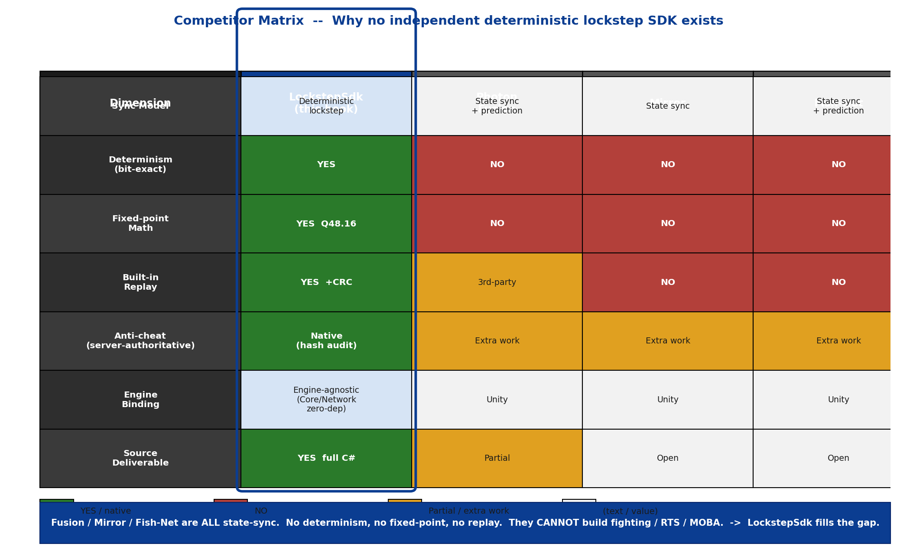
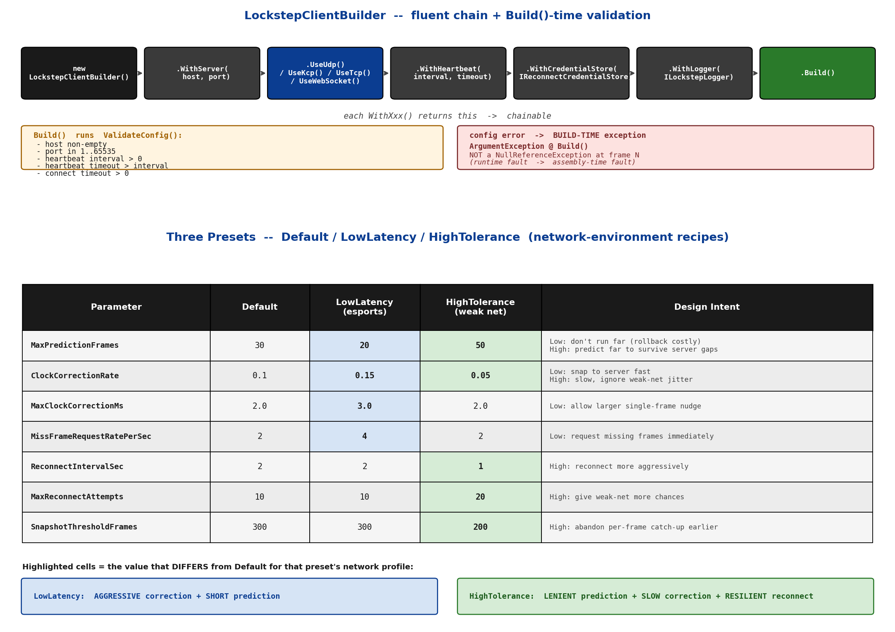
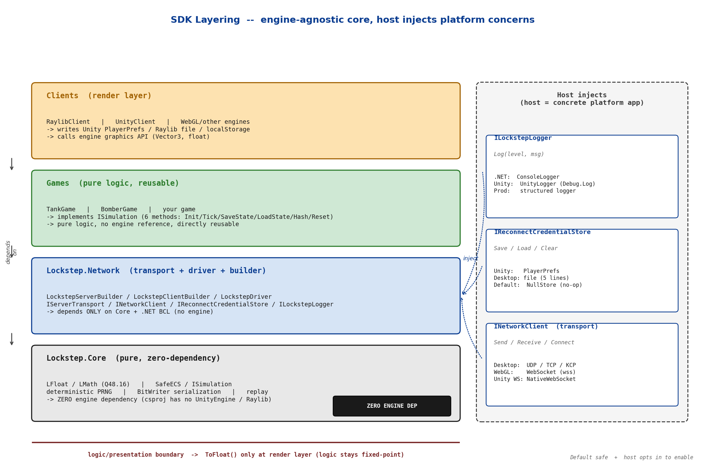

# 第 18 章 · SDK 化:把帧同步做成可集成的框架

> **核心问题**:前 4 篇我们把帧同步的全部零件都造出来了——定点数、确定性随机、有序 ECS、序列化、预测回滚、网络时钟、Relay/Authoritative 双模式、房间与重连。但这些都是"我作者自己写游戏时怎么用"的零件,它们还活在"一个解决方案里互相 `ProjectReference`"的状态。要把它们交给**另一个团队、另一款游戏、另一个引擎**(Unity / Raylib / 未来的 Unreal)去用,需要解决一组完全不同的工程问题:核心怎么不绑死任何一个引擎?配置怎么不写死任何一套数值?日志、凭证、指标怎么让宿主注入而非自己 new?一套 SDK 怎么同时跑在 .NET 8 服务端和 Unity 旧运行时上还保持位级确定?这些都是"SDK 化"的问题。这一章是第 5 篇的开篇,也是本书在市面上几乎没有同类的招牌内容——你能找到讲帧同步原理的文章,但几乎找不到讲"怎么把帧同步工程化成独立、可集成、跨引擎、带 Builder API 和可注入依赖的 SDK"的。

> **读完本章你会明白**:
> 1. 为什么市面上没有"独立的、确定性的、跨引擎的帧同步 SDK"——竞品(Photon Fusion / Mirror / Fish-Net)清一色状态同步+预测,做不了格斗/RTS/MOBA 那类"必须帧同步"的游戏,而帧同步的开源实现又多是引擎内嵌模块或教程级 demo。
> 2. SDK 化的核心约束是**核心零依赖 + 宿主注入依赖**:`Lockstep.Core` 和 `Lockstep.Network` 不引用任何游戏引擎,所有"和具体平台相关的事"(存 PlayerPrefs、写文件、打日志、时间戳)都靠接口让宿主注入实现。这是 SDK 跨引擎的命脉。
> 3. Builder API(`LockstepServerBuilder` / `LockstepClientBuilder`)用链式配置 + 三预设(Default / LowLatency / HighTolerance)把接入门槛降到"几十行起一个确定性服务器"。
> 4. `ISimulation` 用 6 个核心方法(Initialize / Tick / SaveState / LoadState / ComputeHash / Reset)把"任意一款游戏"抽象成可接入的形状,这是 SDK 可复用性的关键。
> 5. 双 TFM(`net8.0` + `netstandard2.1`)是跨运行时确定性的代价——为兼容 Unity 等旧运行时编译 `netstandard2.1`,引入跨 TFM desync 风险,靠双路径等价性测试兜底(呼应第 3 章 P0-1)。
> 6. Open Core 商业模式反过来定义了 SDK 的模块边界:哪些必须开源引流(核心命脉),哪些收费(增值能力)。

> **如果一读觉得太难**:先只记住三件事——① SDK 跨引擎的命脉是"核心零依赖 + 宿主注入"(核心不写死 PlayerPrefs/文件/时间/日志,全靠接口注入);② 一切可变的配置走 Builder 链式 API + 预设,不写死 const;③ `ISimulation` 的 6 个方法是"任意游戏接入 SDK"的契约形状。双 TFM 和商业模式细节可以回头再看。

---

## 〇、一句话点破

> **SDK 化的本质,是把前 4 篇那些"我自己写游戏时怎么用"的零件,改造成"别人、别的游戏、别的引擎也能用"的产品。这件事的关键不是"加功能",而是"减耦合":核心代码不能引用任何游戏引擎,所有与具体平台相关的资源(存档、日志、时钟、凭证)都得通过接口让宿主自己注入;一切可变的数值(端口、帧率、预测深度、纠偏系数)都得通过 Builder 链式配置而非 const 硬编码;一个 SDK 要同时编译两个运行时(`net8.0` 服务端 / `netstandard2.1` Unity)还保持位级确定,就要为这种兼容付出跨 TFM 一致性的代价。这整章就是"确定性内核 + 同步机制"两大主线之上的一层横切:工程化。**

这是结论。本章倒过来拆:先讲市面为什么没有同类(竞品对比坐实空白),再讲 SDK 化要解决的核心工程问题(零依赖 + 宿主注入),然后拆 Builder API、ISimulation、双 TFM、多引擎适配、商业模式这条线,最后把"配置注入而非硬编码"作为贯穿全章的工程教训收束。

---

## 一、市面为什么没有"确定性帧同步 SDK"

这是本章的起点,也是本书独特的卖点。要讲清"怎么把帧同步做成 SDK",先得讲清"为什么这件事没人做"。一个真正稀缺的产品,它的稀缺性本身就是设计意图的一部分。

### 竞品对照:三款主流 C# 联机框架

把市面主流的 C# 联机框架摆开,看它们的同步模型,会发现一个整齐的分界。

> 承接序章讲过的"帧同步 vs 状态同步"逐项对比,这里把视角落到"SDK 形态"上,不再重复同步原理本身。

| 维度 | LockstepSdk(本书) | Photon Fusion | Mirror | Fish-Net |
|------|---------------------|---------------|--------|----------|
| **同步模型** | 确定性帧同步(只广播输入,各端自算) | 状态同步 + 客户端预测 | 状态同步 | 状态同步 + 预测 |
| **确定性保证** | ✅ 跨平台位级一致(定点数 + 有序 ECS + 序列化) | ❌ 不保证 | ❌ 不保证 | ❌ 不保证 |
| **内置定点数** | ✅ Q48.16 LFloat + 完整数学库 | ❌ | ❌ | ❌ |
| **内置回放** | ✅ 录输入 + CRC 校验 | 第三方 | ❌ | ❌ |
| **反作弊** | 天然(服务器权威,可哈希对账) | 需额外工作 | 需额外工作 | 需额外工作 |
| **引擎绑定** | 引擎无关(Core/Network 零引擎依赖) | Unity | Unity | Unity |
| **源码可交付** | ✅ C# 全栈 | 部分开源 | 开源 | 开源 |



这张表里最关键的一列是"同步模型"。Fusion、Mirror、Fish-Net 清一色**状态同步 + 客户端预测**:服务器把每个对象的位置/状态算好,发给所有客户端,客户端本地预测显示,收到服务器权威状态时再修正。这套方案适合 MMO、FPS、大世界那种"局面巨大、玩家海量、需要服务端权威判定"的场景。

但**格斗、RTS、MOBA、街机、体育这类"小局面、高实时、要回放、低带宽"的游戏,只能用帧同步**——它们要求"任意一帧的状态都能被精确复现"(为了回放、为了观战、为了反作弊),状态同步做不到。而在这类游戏里,**确定性不是"可选优化",是"必须的契约"**:只要任意一台机器的任意一帧算出和别台不一样的最低位,几千帧后局面就分叉了。Fusion/Mirror/Fish-Net 全都没有确定性保证,没有定点数,它们做不了这类游戏。

> **钉死这件事**:竞品(Fusion/Mirror/Fish-Net)清一色状态同步 + 预测,**没有确定性保证、没有定点数、没有内置回放**,做不了"必须帧同步"的游戏。这是 LockstepSdk 存在的空间。

### 帧同步侧的空白:为什么也没人做 SDK

那帧同步这一侧呢?市面讲帧同步的资源,大致两类:

1. **引擎内嵌的同步模块**:某个 Unity 插件里的帧同步实现,和引擎、和具体游戏深度耦合——定点数写死成 Unity 能用的格式、遍历顺序依赖 Unity 的容器、序列化格式硬绑定 Unity 的 Inspector。拆不出来,也学不了。
2. **教程级 demo**:几百行代码的玩具,讲清楚"输入广播 + 各端自算"的原理就完了。离"能做产品"差着十万八千里——没有断线重连、没有反作弊、没有性能优化、没有多房间、没有可观测性、没有跨引擎能力。

> **承接序章**已经讲过这两类的局限,这里不重复。本章要回答的是:为什么"独立的、确定性的、跨引擎的、带 Builder API 和可注入依赖的帧同步 SDK"会是个空白?

答案是三层原因,每一层都和本章后续要讲的工程问题对应:

**第一层:确定性极难跨引擎**。帧同步的命根子是跨平台位级一致。一旦 SDK 要跨引擎(Unity 的 Mono 运行时、.NET 8 的 CoreCLR 运行时、未来的 IL2CPP),就要保证"同一个定点数乘法,在不同运行时上算出完全一样的位"。这件事极难——本书第 3 章 P0-1 那个"负数右移在 `net8.0` 和 `netstandard2.1` 上差一个最低位"的血泪 bug 就是明证。做状态同步的 SDK 不用管这个(状态由服务器算,客户端只是收),所以 Fusion/Mirror 能轻松跨 Unity 版本;但帧同步 SDK 要跨,就得在数学库的每一处移位、每一次容器遍历、每一个序列化字节上钉死跨运行时一致性。这个门槛劝退了绝大多数潜在的开源作者。

**第二层:核心零依赖极难做到**。一个想跨引擎的 SDK,它的核心代码不能 `using UnityEngine;`,不能 `using Raylib;`,甚至连"存个文件""打个日志""读个时间戳"都不能写死——因为这些 API 在不同引擎里完全不同(Unity 是 `PlayerPrefs` / `Debug.Log` / `Time.realtimeSinceStartup`,Raylib 是另一套,.NET 控制台又是一套)。核心一旦引用了任何一个引擎的命名空间,就再也拆不出去。这要求整个核心库的所有"和具体平台相关的事"都得通过接口让宿主注入——这是一套渗透到每行代码的设计纪律,不是"最后包一层"就能补上的。后面会专门拆。

**第三层:商业模式不够诱人,商业化投入不足**。状态同步框架(Fusion 是 Photon 的商业产品)有成熟的订阅模式,养得起一支团队。帧同步市场窄(只有格斗/RTS/MOBA 那几类),开源做不下去(没团队投入就到 demo 级),纯商业又养不活(用户基数小)。所以这块长期空白。

LockstepSdk 想填的,正是这三层共同造成的空白:**用作者视角的工程纪律(核心零依赖 + 宿主注入 + 双 TFM 等价性测试)把第一、二层解决,用 Open Core 模式(后面详讲)把第三层解决**。这不是"再写一个帧同步 demo",而是"把帧同步做成可集成的产品级 SDK"。

> **作者复盘 · 为什么这本书要单独开一章讲 SDK 化**:市面上讲帧同步的文章,讲完"原理 + 几百行 demo"就结束了。但一个真正能做产品的工程师,拿到那些 demo 后会立刻撞上一堆没人讲过的工程问题:这套东西怎么从我的 demo 项目里拆出来给别人用?怎么不绑死 Unity?怎么让另一个团队的游戏接进来?日志和存档怎么不写死?这些问题比"帧同步原理"难得多,也几乎没人写。本书的源码是作者自己设计的 SDK,作者能亲述"为什么这么定 + 踩过什么坑",这正是读开源项目永远拿不到的深度。所以这一章不是可有可无的附录,而是本书在市面上几乎独一份的内容。

---

## 二、SDK 化的命脉:核心零依赖 + 宿主注入

讲完了"为什么空白",接下来讲"怎么填"。SDK 化要解决的最核心工程问题,是**核心代码不能和任何一个具体平台耦合**。这一节是全章的命脉,后面所有技巧都围绕它展开。

### 朴素做法撞什么墙:核心写死 PlayerPrefs 的灾难

假设我们不这么设计,而是图省事,直接在核心代码里写:

```csharp
// 朴素(灾难, 非源码):
public void SaveReconnectCredential(ReconnectCredential cred)
{
    UnityEngine.PlayerPrefs.SetString("lockstep_token", cred.ReconnectToken);
    UnityEngine.PlayerPrefs.Save();
}
```

看起来很自然——Unity 项目里大家都这么存。但这一行 `UnityEngine.PlayerPrefs` 会带来连锁灾难:

1. **核心再也出不了 Unity**:`Lockstep.Core.csproj` 必须 `using UnityEngine;`,而 UnityEngine 是 Unity 引擎的程序集。一旦核心引用了它,这个核心就再也不能给 Raylib 用、给 .NET 控制台用、给未来的 Unreal 用——因为它编译期就离不开 Unity。
2. **服务端也用不了这个核心**:帧同步服务器是 .NET 8 控制台进程,根本没装 Unity。核心引用 UnityEngine,服务器就编译不过。
3. **测试也跑不了**:CI 里的单元测试跑在纯 .NET 上,引用了 UnityEngine 的核心没法在 CI 上构建。
4. **逻辑和平台深度绑死**:`PlayerPrefs.SetString` 的行为(何时落盘、序列化格式、跨平台一致性)是 Unity 决定的,SDK 完全失去控制。哪天 Unity 改了 PlayerPrefs 的实现,SDK 的行为就跟着变。

> **不这样会怎样**:核心一旦写了 `UnityEngine.PlayerPrefs` / `File.WriteAllText` / `DateTime.Now` / `Console.WriteLine` 这种"平台相关"的调用,就再也不能跨引擎、跨平台、跨运行时复用。这是 SDK 跨引擎的最大陷阱——它不是"功能不够",是"耦合太深"。

### 所以这么设计:核心零依赖 + 宿主通过接口注入

正确的做法是:**核心代码不直接做任何"平台相关的事",而是定义接口,由宿主(具体平台的应用层)注入实现**。这就是"依赖注入"(Dependency Injection)在 SDK 设计里的应用。

LockstepSdk 的核心程序集 `Lockstep.Core` 和 `Lockstep.Network`,**不引用任何游戏引擎**。这一点可以用 csproj 文件核实:

```xml
<!-- Lockstep.Core.csproj: 注意 TargetFrameworks 是双 TFM, PackageReference 只有 .NET 基础库 -->
<Project Sdk="Microsoft.NET.Sdk">
  <PropertyGroup>
    <TargetFrameworks>netstandard2.1;net8.0</TargetFrameworks>
    <!-- ... -->
  </PropertyGroup>
  <!-- 没有 UnityEngine, 没有 Raylib, 没有任何引擎引用 -->
</Project>
```

`Lockstep.Network.csproj` 只 `ProjectReference` 了 `Lockstep.Core`(网络层依赖核心,不依赖引擎),为 `netstandard2.1` 引入 `System.Threading.Channels`(这是 .NET 基础库,不是引擎):

```xml
<!-- Lockstep.Network.csproj(简化示意, 非源码原文, 详见源文件) -->
<ProjectReference Include="..\Lockstep.Core\Lockstep.Core.csproj" />
<ItemGroup Condition="'$(TargetFramework)' == 'netstandard2.1'">
  <PackageReference Include="System.Threading.Channels" Version="8.0.0" />
</ItemGroup>
```

> **钉死这件事**:依赖方向是 **Network → Core**,不是反过来。Core 是最底层,不依赖 Network(虽然 Core 里有个 `Network/` 子目录,里面是 `MessageType.cs` 和 `Messages.cs`——那是协议消息的纯数据定义,不带传输逻辑)。这个单向依赖是 SDK 分层的基础。

那"存档""日志""时间"这些平台相关的事怎么办?答案是**定义接口,让宿主注入**。看几个真实的接口。

### 宿主注入示例一:日志接口 ILockstepLogger

日志是最典型的"平台相关"需求。Unity 里打日志用 `Debug.Log`,控制台用 `Console.WriteLine`,生产环境可能要接到 ELK/Prometheus。核心不能写死任何一种。于是 `Lockstep.Network/Utils/ILockstepLogger.cs` 定义了一个极简接口:

```csharp
// ILockstepLogger.cs:20-24
public interface ILockstepLogger
{
    void Log(LogLevel level, string message);
    void Log(LogLevel level, string message, Exception? exception);
}
```

就两个方法。核心代码只调 `logger.Log(LogLevel.Info, "...")`,**完全不关心这条日志最终去了 Console、Unity Console、文件还是远程日志系统**。具体实现由宿主注入:

- **.NET 控制台宿主**:注入 `ConsoleLogger`(同文件里就有,内部 `Console.WriteLine`)。
- **Unity 宿主**:写一个 `UnityLogger : ILockstepLogger`,内部 `Debug.Log`。
- **生产服务器**:注入一个把日志写到结构化日志系统的实现。

核心代码一行都不用改。这就是"宿主注入"。

```csharp
// 宿主侧(非源码, 示意 Unity 接入):
public sealed class UnityLogger : ILockstepLogger
{
    public void Log(LogLevel level, string message) => Debug.Log($"[{level}] {message}");
    public void Log(LogLevel level, string message, Exception? ex) => Debug.LogError($"{message}\n{ex}");
}

// 注入(见后文 Builder):
var client = new LockstepClientBuilder()
    .WithLogger(new UnityLogger())   // 注入宿主实现
    // ...
```

### 宿主注入示例二:重连凭证存储 IReconnectCredentialStore

重连凭证(进程重启后要回原房间,详见第 19 章)是另一个典型的"平台相关"需求。凭证要持久化到磁盘,但具体存哪——Unity 用 PlayerPrefs、桌面应用用文件、Web 用 localStorage——核心不能写死。

`Lockstep.Network/Client/ReconnectCredentialStore.cs` 定义了接口:

```csharp
// ReconnectCredentialStore.cs:37-47
public interface IReconnectCredentialStore
{
    void Save(ReconnectCredential credential);
    ReconnectCredential? Load();
    void Clear();
}
```

三个方法:存、读、清。核心代码只调这三个方法,**不知道也不关心凭证最终去了哪里**。

关键的设计在默认实现上。核心提供了一个 `NullReconnectCredentialStore`(同文件 :53-62),三个方法都是空实现(`Load()` 恒返回 null):

```csharp
// ReconnectCredentialStore.cs:53-62(简化示意)
public sealed class NullReconnectCredentialStore : IReconnectCredentialStore
{
    public static readonly NullReconnectCredentialStore Instance = new();
    public void Save(ReconnectCredential credential) { }
    public ReconnectCredential? Load() => null;
    public void Clear() { }
}
```

这就是"默认安全":**不注入任何实现,SDK 也能跑,只是进程重启后没法重连(保持改造前的行为)**。宿主想要进程级重连,就显式注入一个真实实现(比如 `FileReconnectCredentialStore`,把凭证写成 5 行纯文本文件)。这种"默认空实现 + 宿主显式注入才启用"的模式,是 SDK 跨引擎又保证"开箱即用"的标准做法。

> **承接第 19 章**:重连凭证的 4 个字段(PlayerName / PlayerId / RoomId / ReconnectToken)、双级解耦(传输层重连 + 应用层追帧)、进程重启回原房间的 5 步根因链,都在第 19 章详讲。本章只关注"凭证存储为什么必须是注入的"。

> **钉死这件事**:SDK 跨引擎的命脉是**核心零依赖 + 宿主注入**——核心不写死任何平台相关的事(存档、日志、时间、凭证),而是定义接口,由宿主注入具体实现。默认提供空实现保证"开箱即用",宿主显式注入才启用高级能力。这套哲学和 hyper / Tower 那些库的"接口注入"一脉相承——核心只定义契约,具体策略交给调用方。

### 作者复盘:这个纪律是渗透到每行代码的

这里有个非显然的认知,值得点破:**"核心零依赖"不是"最后包一层接口"能补上的,它是一套渗透到每行代码的设计纪律**。

很多人以为"我最后给 PlayerPrefs 包一个 `IStorage` 接口不就行了"——晚了。一旦核心里散落了几十处直接调 `PlayerPrefs` / `DateTime.Now` / `Console.WriteLine`,你后期再想统一抽接口,就要改几十处代码,而且很容易漏(漏一处就耦合回去了)。LockstepSdk 是**从一开始就按"核心不能碰平台 API"的纪律写的**,每一行要存档、打日志、读时间的代码,在写的那一刻就是通过接口走的。这种纪律一旦建立,维护起来很轻松(新增一个平台相关的需求,第一反应就是"定义接口");一旦破坏,补救成本极高。

> **作者复盘 · 零依赖纪律**:核心零依赖这件事,我从第一天就定了规矩:Lockstep.Core 和 Lockstep.Network 的 csproj 里,不允许出现 `UnityEngine` / `Raylib` / 任何引擎的程序集引用。CI 里加了个检查(扫描 csproj 的 PackageReference / ProjectReference),一旦有人不小心加了引擎引用,构建直接挂。这种"编译期硬约束"比"靠人 review"可靠得多——和第 5 章讲的 SystemStateValidator 反射体检(编译期 + 加载期拦截不确定性陷阱)是同一个思路:把纪律做成机器能检查的硬约束,不靠人的自觉。

---

## 三、Builder API:链式配置把接入门槛降下来

讲完了核心的设计纪律(零依赖 + 注入),这一节讲"怎么让别人用起来舒服"。一个 SDK 哪怕内核再干净,如果接入要写 50 行 `new XxxOptions(); xxx.Foo = 1; new Yyy(xxx)` 这种过程式配置,没人愿意用。LockstepSdk 用的是 **Builder 模式 + 链式 API + 预设配置**。

### 朴素做法撞什么墙:几十行 new + 赋值

先看不用 Builder 会怎样。配置一个帧同步服务器,至少要设:端口、帧率、传输协议、玩家数、最大房间数、心跳超时、空房回收、历史帧缓冲、快照间隔、冗余帧数、空输入工厂、(可选)模拟器工厂、日志器。朴素写法:

```csharp
// 朴素(灾难, 非源码):
var config = new LockstepServerConfig();
config.Port = 9999;
config.FrameRate = 20;
config.Transport = TransportType.Udp;
config.DefaultPlayers = 2;
config.MaxRooms = 100;
config.HeartbeatTimeoutMs = 5000;
// ... 还有 6 行
config.NullInputFactory = () => { var i = new TankInput(); /* ... */ };
config.Logger = new ConsoleLogger();

var transport = new UdpServerTransport(config.Port, config.Logger);
var server = new LockstepServer(transport, config.DefaultPlayers, config.NullInputFactory,
                                config.FrameRate, null, config);
server.RoomManager.MaxRooms = config.MaxRooms;
server.Start();
```

这一坨有几个问题:① 配置项有默认值,但调用方不知道哪些必须设、哪些可以省(比如 `NullInputFactory` 不设会在 `Build()` 时崩);② 传输层选择(UDP/TCP/KCP/WS)散落在两处(`config.Transport` 和 `new XxxTransport`),容易写不一致;③ 没有可读性——读这段代码不能一眼看出"这是个 UDP 服务器"。

### 所以这么设计:链式 Builder + Build 时校验

`LockstepServerBuilder`(`Lockstep.Network/Server/LockstepServerBuilder.cs`)用链式 API 解决。一个完整的服务器配置长这样:

```csharp
// LockstepServerBuilder.cs:79-87 的 XML 示例注释(源码原文)
var server = new LockstepServerBuilder()
    .WithPort(9999)
    .WithFrameRate(20)
    .UseInput<TankInput>()
    .UseSimulation<TankGameSimulation>()
    .Build();
server.Start();
```

每个方法返回 `this`(Builder 自己),所以可以链式调。读这段代码一眼就能看出:端口 9999、20 帧、用 TankInput 输入、跑 TankGameSimulation 模拟器。可读性极高。

链式 API 背后的实现极其朴素——每个方法就是改一个内部 config 字段然后返回自己:

```csharp
// LockstepServerBuilder.cs:95-99(源码原文)
public LockstepServerBuilder WithPort(int port)
{
    _config.Port = port;
    return this;
}
```

真正有价值的是两个设计点。

**设计点一:`Build()` 时校验必填项**。Builder 不是"调完就完",而是有一个 `Build()` 方法做最终装配 + 校验。看 `Build()` 开头:

```csharp
// LockstepServerBuilder.cs:258-264
public LockstepServer Build()
{
    if (_config.NullInputFactory == null)
    {
        throw new InvalidOperationException(
            "必须配置输入类型, 请调用 UseInput<T>() 或 UseNullInputFactory()");
    }
    // ...
}
```

`NullInputFactory` 是服务器推进帧时给迟到玩家填空输入用的(第 14 章详讲),不配就崩。Builder 在 `Build()` 时校验,而不是等到运行时某个帧才发现"没填空输入工厂"。这就是 Builder 模式相对于"直接 new config"的核心价值:**把"配置错误"从运行时故障提前到装配时异常**。

**设计点二:传输层的选择封装在 Builder 里**。`UseUdp()` / `UseTcp()` / `UseKcp()` / `UseWebSocket()` 这些方法,内部只是改 `_config.Transport` 这个枚举。真正的"根据枚举 new 对应传输"在 `Build()` 里:

```csharp
// LockstepServerBuilder.cs:267-273(源码原文)
IServerTransport transport = _config.Transport switch
{
    TransportType.Tcp => new TcpServerTransport(_config.Port, _config.Logger),
    TransportType.Kcp => new KcpServerTransport(_config.Port, logger: _config.Logger),
    TransportType.WebSocket => new WebSocketServerTransport(_config.Port, _config.WebSocketPath, _config.Logger),
    _ => new UdpServerTransport(_config.Port, _config.Logger)
};
```

调用方只写 `.UseUdp()`,不用关心"UDP 对应哪个 Transport 类、怎么构造"。选择逻辑集中在一处,不可能写不一致。

> **诚实标注**:`UseKcp()` 在 API 上是完整的,但 KCP 的实现当前是 stub(详见第 17 章、`_源码事实-anchor.md` 第 0 节)——`SimpleKcpCore.Update` / `SetConfig` 是空方法体,默认行为等于"UDP + 4 字节 conv 会话过滤",没有真正的 ARQ 重传滑窗。SDK 在 API 层预留了 KCP 的接入面,真实现留待后续。这是"接口先行,实现后补"的策略,不是 bug。

### "把错误从运行时提前到装配时"到底值多少

`Build()` 时校验这件事,看着是个小细节,实际上是 Builder 模式最大的工程价值,值得单独拆透。考虑一个真实场景:某个团队用 LockstepSdk 搭服务器,代码写到一半,忘记调 `UseInput<TankInput>()` 就直接 `Build()` 然后部署上线。

**没有 Build 校验的世界(朴素 new config)**:服务器起来,`NullInputFactory == null`,前几十秒没玩家加入,一切正常。第一个玩家加入,服务器开始推进帧,跑到"给迟到的玩家填空输入"那一步,调 `config.NullInputFactory()` 抛 `NullReferenceException`。整个房间崩溃,玩家被踢。运维半夜被叫醒,翻日志发现是 NRE,定位到"配置忘填"。这是一个**运行时故障**,代价是"线上事故 + 半夜起床"。

**有 Build 校验的世界(LockstepServerBuilder)**:部署时 `Build()` 第一行就抛 `InvalidOperationException("必须配置输入类型, 请调用 UseInput<T>() 或 UseNullInputFactory()")`。部署直接失败,CI 红灯,开发者在 push 之前就发现。这是一个**装配时故障**,代价是"看一眼错误信息,补一行代码"。

两种结果的差距是巨大的——一个是线上事故,一个是开发期 5 秒修复。这就是"把错误从运行时提前到装配时"的价值。Builder 模式的本质不是"链式好看",是"在装配这个唯一可靠的检查点,把所有'运行时才会暴露'的配置错误一次性抓住"。

LockstepServerBuilder 当前校验的必填项是 `NullInputFactory`(不配会 NRE)。LockstepClientBuilder 的 `ValidateConfig()` 校验五项(地址/端口范围/心跳间隔正数/心跳超时大于间隔/连接超时正数)。这些都是"配置语义错误"——不是"少填",而是"填了但语义不合法"(比如心跳间隔填了 -1、端口填了 99999)。装配时校验把这类错误全部拦在 Build 这一步,这是 SDK 工程化的隐性质量保障。

### 客户端 Builder:同样的模式

客户端 `LockstepClientBuilder`(`Lockstep.Network/Client/LockstepClientBuilder.cs`)是同一套模式,加上了客户端特有的"传输协议四选一"和"凭证存储注入":

```csharp
// LockstepClientBuilder.cs:8-15 的 XML 示例注释(源码原文)
var client = new LockstepClientBuilder()
    .WithServer("127.0.0.1", 9999)
    .UseUdp()
    .WithHeartbeat(1000, 5000)
    .Build();
await client.ConnectAsync("Player1");
```

客户端 Builder 比 server 多两个值得说的点。

**点一:四种传输协议可选,WebGL 必须 WebSocket**。客户端面对的运行环境比服务器复杂——PC 桌面端可以用 UDP,微信小游戏 / WebGL 只能用 WebSocket(浏览器不支持原生 UDP/TCP socket)。所以 `UseWebSocket` 还多一个 `useSsl` 参数:

```csharp
// LockstepClientBuilder.cs:86-92(源码原文)
public LockstepClientBuilder UseWebSocket(string path = "/ws", bool useSsl = false)
{
    _config.Transport = TransportType.WebSocket;
    _config.WebSocketPath = path;
    _config.UseSsl = useSsl;
    return this;
}
```

宿主根据自己跑在什么平台调对应的 `Use*()`——WebGL 宿主只能 `UseWebSocket()`,桌面端可以 `UseUdp()` 拿到更低延迟。这是"传输层由宿主决定"的体现,SDK 不替你选。

**点二:重连凭证存储通过 `WithCredentialStore` 注入**。这就是上一节讲的"宿主注入"在 Builder 层的落地:

```csharp
// LockstepClientBuilder.cs:123-132(源码原文注释简化)
public LockstepClientBuilder WithCredentialStore(IReconnectCredentialStore credStore)
{
    _credStore = credStore;
    return this;
}
```

注释说得很清楚:"不调用则使用 `NullReconnectCredentialStore`(改造前行为, 进程重启无法重连)"。宿主想要进程级重连,就调 `.WithCredentialStore(new FileReconnectCredentialStore("save.dat"))`;不调也能跑,只是重连降级。这是"默认安全 + 显式启用"模式的又一次应用。

**点三:`Build()` 里的配置校验**。客户端 Builder 的 `Build()` 前会跑 `ValidateConfig()`(:152-168),校验:地址非空、端口在 1-65535、心跳间隔大于 0、心跳超时大于心跳间隔、连接超时大于 0。任何一项不合法,装配时就抛 `ArgumentException`,不等到运行时网络层才发现"端口填了 0"。

> **钉死这件事**:Builder API = 链式配置(`WithXxx` 改 config + 返回 this)+ `Build()` 时校验必填项 + 传输层选择封装在 Build 里。核心价值是把"配置错误"从运行时故障提前到装配时异常,以及让接入代码可读(一眼看出这是什么服务器/客户端)。

---

## 四、三套预设:不同网络环境的开箱配置

Builder 解决了"接入舒服",但还有一个问题:**有些配置组合是有"配方"的,新手不知道怎么搭**。比如弱网环境下预测深度要调大、纠偏要调慢;电竞环境要激进纠偏、低延迟。如果每个团队都要自己摸索这套配方,SDK 的门槛还是高。

LockstepDriverConfig(`Lockstep.Network/Client/Core/LockstepDriverConfig.cs`)提供了三套**预设配置**,覆盖三种典型网络环境。

### 三套预设的真实数值

直接看源码(:79-102):

```csharp
// LockstepDriverConfig.cs:78-102(源码原文)
/// <summary>默认配置</summary>
public static LockstepDriverConfig Default => new();

/// <summary>低延迟配置(适合实时对战)</summary>
public static LockstepDriverConfig LowLatency => new()
{
    MaxPredictionFrames = 20,
    ClockCorrectionRate = 0.15f,
    MaxClockCorrectionMs = 3.0f,
    MissFrameRequestRatePerSec = 4
};

/// <summary>高容错配置(适合弱网环境)</summary>
public static LockstepDriverConfig HighTolerance => new()
{
    MaxPredictionFrames = 50,
    ReconnectIntervalSec = 1f,
    MaxReconnectAttempts = 20,
    ClockCorrectionRate = 0.05f,
    SnapshotThresholdFrames = 200
};
```

把三套预设的关键差异整理成表:

| 参数 | Default | LowLatency | HighTolerance | 设计意图 |
|------|---------|------------|---------------|----------|
| `MaxPredictionFrames` | 30 | **20**(更激进) | **50**(更宽松) | LowLatency 不允许本地跑太远(预测错了回滚代价大);HighTolerance 允许本地预测更远,容忍更长的服务器空窗 |
| `ClockCorrectionRate` | 0.1 | **0.15**(纠偏更快) | **0.05**(纠偏更慢) | LowLatency 想快速对齐服务器节奏;HighTolerance 怕弱网抖动被误判成时钟偏差,刻意放慢 |
| `MaxClockCorrectionMs` | 2.0 | **3.0**(单次纠偏更大) | 2.0 | LowLatency 允许单帧多纠一点,加快收敛 |
| `MissFrameRequestRatePerSec` | 2 | **4**(补帧更勤) | 2 | LowLatency 丢帧了立刻补;HighTolerance 靠预测扛,补帧不急 |
| `ReconnectIntervalSec` | 2 | 2 | **1**(重连更勤) | HighTolerance 面对的是频繁断线,重连要快 |
| `MaxReconnectAttempts` | 10 | 10 | **20**(重连更韧) | 弱网下多给几次机会 |
| `SnapshotThresholdFrames` | 300 | 300 | **200**(更早转快照) | 弱网下落后太多帧时,更早放弃逐帧补,直接拉快照 |



### 每个预设背后的网络直觉

光看数字没感觉,要理解每个数字背后是"什么网络环境、什么玩家体验"的权衡。

**Default(默认,平衡)**:适合大多数民用网络——家用宽带、4G 移动网络。RTT 在 30-100ms,偶发丢包(1-5%)。这套配置不激进也不保守,是"安全默认值"。

**LowLatency(低延迟,电竞向)**:适合电竞场景——格斗游戏、快节奏 RTS。玩家都在低延迟的局域网或高质量专线网络上,RTT 可能只有 10-30ms。这套配置的核心思路是**激进纠偏 + 不让本地跑太远**:时钟偏差了立刻修正(`ClockCorrectionRate=0.15` 比默认快 50%),单次修正允许更大(`MaxClockCorrectionMs=3.0`),丢帧了立刻请求补帧(`MissFrameRequestRatePerSec=4`)。但 `MaxPredictionFrames=20` 比默认还小——因为低延迟下服务器帧来得快,不需要本地预测太远,预测远了反而回滚代价大。**这是"低延迟环境下,宁可勤纠偏也不要长预测"的取舍**。

**HighTolerance(高容错,弱网向)**:适合弱网场景——移动网络、跨洲连接、地铁里玩。RTT 可能 100-300ms,丢包率 5-15%,还会频繁断线。这套配置的思路相反:**宽容预测 + 慢纠偏 + 勤重连**。`MaxPredictionFrames=50` 让本地能预测很远(弱网下服务器帧经常空窗,不预测远就卡住);`ClockCorrectionRate=0.05` 刻意放慢纠偏(弱网抖动容易被误判成时钟偏差,纠太快反而乱);`ReconnectIntervalSec=1` + `MaxReconnectAttempts=20` 给断线更多机会;`SnapshotThresholdFrames=200` 比默认更早放弃逐帧补(落后 200 帧就拉快照,而不是傻乎乎补 300 帧的增量)。**这是"弱网下,用预测和快照换流畅性"的取舍**。

> **承接第 13 章**:这三套预设里的 `ClockCorrectionRate` / `MaxClockCorrectionMs` 是第 13 章 NetworkClock 硬边界防回滚风暴机制的两个旋钮。第 13 章讲的是"为什么要 Clamp、为什么平滑只能在区间内生效",本章讲的是"这个区间的旋钮在不同网络环境下怎么调"。两章合起来才是完整的"网络时钟工程化"。

### 预设怎么用

宿主拿到 Builder 后,可以直接用预设,也可以微调:

```csharp
// 非源码, 示意弱网游戏接入:
var config = LockstepDriverConfig.HighTolerance;
// 还能在预设基础上微调:
config.MaxPredictionFrames = 60;  // 我的游戏允许预测更远

var driver = new LockstepDriver<TankInput>(client, simulation, getInput, config);
```

预设是"起点",不是"终点"。它把一个新手从"面对 15 个配置项不知道填什么"拯救到"选一个预设就能跑,需要再微调"。这是 SDK 降低接入门槛的关键工程手段。

> **钉死这件事**:三套预设(Default / LowLatency / HighTolerance)是 SDK 给的"网络环境配方"。LowLatency 激进纠偏 + 短预测(电竞),HighTolerance 宽容预测 + 慢纠偏 + 勤重连(弱网)。预设把新手从"15 个旋钮"拯救到"三选一",需要再微调。

---

## 五、ISimulation:把"任意一款游戏"抽象成可接入的形状

前面四节讲的都是"SDK 自己怎么设计",这一节讲"SDK 怎么让别人的游戏接进来"。这是 SDK 可复用性的关键——一个 SDK 如果只能跑作者自己写的 TankGame,那它就不是 SDK,是个游戏。真正的 SDK 要让**任意一款帧同步游戏**都能接入,这就需要一个抽象:游戏逻辑要实现什么接口,SDK 才能驱动它?

答案就是 `ISimulation`(`Lockstep.Core/Simulation/ISimulation.cs`)。这是 SDK 和游戏逻辑之间的契约。

### 为什么需要这个抽象

先想 SDK 驱动一个游戏需要做什么。SDK 内部有一套同步机制(LockstepDriver + LockstepController + 网络层),这套机制在每个逻辑帧要做这些事:

1. **拿到这一帧所有玩家的输入**(从网络收 / 从本地预测拿)。
2. **把输入交给游戏逻辑,让游戏逻辑推进一帧**(游戏逻辑负责更新坦克位置、判定碰撞、扣血……SDK 不知道也不该知道这些)。
3. **(回滚时)保存当前游戏状态**,以便猜错了能恢复。
4. **(回滚时)从保存的状态恢复**。
5. **算一个当前状态的哈希**,发给服务器对账,抓 desync。
6. **(重置时)清空状态,回到初始**。

注意第 2、3、4、5、6 步——这些事的**具体逻辑是游戏相关的**(坦克游戏保存坦克位置,卡牌游戏保存手牌),但**形状是固定的**(任何游戏都要"推进一帧""存状态""读状态""算哈希""重置")。SDK 要做的,就是把"形状"抽成接口,让游戏逻辑填"具体内容"。

### ISimulation 的 6 个核心方法

`ISimulation` 把这个形状定义成了 6 个核心方法 + 一组状态属性。看接口的核心区域:

```csharp
// ISimulation.cs:113-169(简化示意, 完整看源文件)
public interface ISimulation
{
    // === 状态属性(简单 auto-property) ===
    int PlayerCount { get; }
    int LocalPlayerId { get; set; }
    bool IsReplaying { get; set; }      // 回滚重演时为 true, 用于门控副作用
    bool IsPredicting { get; set; }     // 预测未来帧时为 true
    bool HasVisualSideEffect { get; set; }
    bool IsFinished { get; }

    // === 核心方法(必须认真实现) ===
    void Initialize(int playerCount, uint randomSeed);   // 1. 初始化
    void Tick(FrameData frame);                          // 2. 推进一帧
    byte[] SaveState();                                  // 3. 存状态(byte[])
    void SaveState(BitWriter writer);                    // 3'. 存状态(零分配重载, 字节布局唯一权威)
    void LoadState(ReadOnlySpan<byte> data);             // 4. 读状态
    uint ComputeHash();                                  // 5. 算哈希
    void Reset();                                        // 6. 重置

    // === 辅助方法(按需实现) ===
    IInputProvider? GetInputProvider(int playerId);
    byte[] GetNullInput();
    string ToDebugString();
}
```

6 个核心方法,每一个都对应 SDK 驱动游戏的一个步骤。**任何一个想接入 SDK 的游戏,实现这 6 个方法,SDK 就能驱动它跑帧同步**——包括预测回滚(用 SaveState/LoadState)、断线重连(用 SaveState 存快照)、反作弊(用 ComputeHash 对账)、单机/回放(用 Initialize + Tick)。

这 6 个方法的精妙之处在于"**少一个不行,多一个也不需要**":

- 少 `SaveState`/`LoadState`,就没法回滚、没法重连。
- 少 `ComputeHash`,就没法抓 desync。
- 少 `Tick`,SDK 就不知道怎么推进游戏。
- 少 `Initialize`,游戏没法启动。
- 少 `Reset`,游戏没法重开一局。
- 多了(比如加个 `Render()`),就把表现层耦合进逻辑层了——SDK 的原则是逻辑层完全不知道渲染(后面"多引擎适配"详讲)。

> **钉死这件事**:`ISimulation` 的 6 个核心方法(Initialize / Tick / SaveState / LoadState / ComputeHash / Reset)是 SDK 和游戏逻辑之间的契约。任何一个游戏实现这 6 个方法,SDK 就能驱动它跑完整的帧同步(预测回滚、断线重连、反作弊、单机、回放)。这是"把任意游戏抽象成可接入形状"的关键。

### 一个最小实现:几十行就能接入

为了让你感受这套契约有多轻量,看 SDK 文档里给的最小化示例(`SDK_QUICKSTART_ZH.md` 里的 `MyGame`,简化):

```csharp
// SDK_QUICKSTART_ZH.md:52-89 的最小 ISimulation 实现(简化示意)
public class MyGame : ISimulation
{
    public int PlayerCount { get; private set; }
    public int LocalPlayerId { get; set; }
    public bool IsReplaying { get; set; }
    public bool IsPredicting { get; set; }
    public bool HasVisualSideEffect { get; set; }
    public bool IsFinished => false;

    private int _score;   // 游戏状态: 只有一个分数

    public void Initialize(int playerCount, uint seed) { PlayerCount = playerCount; _score = 0; }
    public void Tick(FrameData frame) { _score++; }   // 每帧分数 +1
    public byte[] SaveState() { var w = new BitWriter(16); SaveState(w); return w.ToArray(); }
    public void SaveState(BitWriter w) => w.WriteInt(_score);
    public void LoadState(ReadOnlySpan<byte> data) => _score = BitConverter.ToInt32(data);
    public uint ComputeHash() => (uint)_score;
    public void Reset() => _score = 0;
    // 辅助方法略
}
```

30 行代码,一个能跑帧同步(带预测回滚、带哈希对账)的"游戏"就接入了 SDK。这就是 `ISimulation` 抽象的力量——它把"做一个帧同步游戏"的门槛,从"理解整套同步机制 + 自己实现"降到"实现 6 个方法"。

> **承接第 27 章**:TankGame 实战章会展示一个完整的、真实的 `ISimulation` 实现(`TankGameSimulation`),它内部用一个 ECS World 管理坦克/子弹/Transform 组件,SaveState/LoadState 委托给 World 的字节级序列化(第 5 章),ComputeHash 委托给 World 的增量哈希(第 23 章)。本章只讲契约形状,实战看第 27 章。

### SaveState 的"单一权威"契约:为什么有两个重载

`ISimulation` 的 SaveState 有**两个重载**——`SaveState()`(返回 `byte[]`)和 `SaveState(BitWriter writer)`(零分配,写到传入的 writer)。这看起来冗余(为什么要两个?),但接口的 XML 注释(:131-150)里藏着一个非显然且致命的契约,值得单独拆透。

注释明确警告:

> **实现契约(必须遵守)**:本重载[`SaveState()` byte[] 版]**必须委托** `SaveState(BitWriter)` 实现(如 `var w = new BitWriter(...); SaveState(w); return w.ToArray();`),**不得**另写一套序列化路径。
>
> **原因**:快照字节布局由 `SaveState(BitWriter)` 单一决定;若两重载布局分叉,`ComputeHash` 依据的字节与回放 / 重连加载的字节会不一致 → 静默 desync。

这段话揭示了一个 SDK 设计里极易翻车的陷阱。考虑一个朴素实现:有人图省事,在 `SaveState()` byte[] 版里直接 `writer.WriteInt(_score); writer.WriteInt(_hp); ...`,在 `SaveState(BitWriter)` 版里也写一份"相似但不完全一样"的代码(可能字段顺序不同、可能多了个 padding)。两个版本都"能跑",但**字节布局不一样**。

后果是:**`ComputeHash` 内部如果调的是 `SaveState(BitWriter)` 算哈希(用于 desync 对账),而回放 / 重连加载调的是 `SaveState()` byte[] 版存盘(用于状态恢复),两者算的是两份不同的字节流**。哈希校验时,本地算的哈希是基于"布局 A"的字节,服务器或别的客户端算的哈希是基于"布局 B"的字节——明明状态相同,哈希却不一样,desync 误报满天飞。更阴险的是,这种 desync 是"假 desync"——状态其实是对的,只是序列化布局分叉了。排查这种 bug 极其痛苦。

所以契约钉死:**字节布局只能有一份权威实现(`SaveState(BitWriter)`),`SaveState()` byte[] 版必须委托它,不能另写一套**。注释甚至给了标准写法:`var w = new BitWriter(...); SaveState(w); return w.ToArray();`。

> **技巧精解 · 单一权威实现原则**:`SaveState` 双重载的契约揭示了一个 SDK 设计的普适原则——**任何被多处引用的字节布局 / 算法,只能有一份权威实现,其余调用方都委托它**。这个原则和第 3 章的"双路径等价性测试"(快速路径必须和权威 Fallback 逐位一致)是同一个思想的不同应用:第 3 章是"性能优化不能偏离权威实现",这里是"便捷重载不能偏离权威布局"。本质都是"消除分叉,单一真相源"。这种纪律在序列化(布局)、哈希(算法)、数学(运算)三个领域反复出现,是 SDK 工程化的深层方法论。

### LockstepGame:更上一层的高层封装

`ISimulation` + `LockstepDriver` 已经够用了,但 SDK 还提供了**再上一层**的封装——`LockstepGame<TInput, TSim>`(`Lockstep.Network/Client/Core/LockstepGame.cs`)。它把"Driver + Simulation + 输入轮询 + 事件分发"打包成一个高层对象,让最常见的接入场景(单机 / 联机 / 回放)用 5 行代码就能跑起来。

看它的用法(`LockstepGame.cs:9-24` 的 XML 注释):

```csharp
// LockstepGame.cs:13-23 的 XML 示例注释(源码原文)
var game = new LockstepGame<MyInput, MySimulation>(client, simulation, GetInput);
game.OnRender += (sim, interpolation) => renderer.Draw(sim, interpolation);
game.OnStateChanged += (sim, tick) => renderer.Update(sim, tick);
game.Start(startMsg);

// 游戏循环
while (running) {
    game.Update(deltaTime);
    game.Draw();
}
```

`LockstepGame` 干了三件 Driver 自己不干的事:① 把"输入轮询"做成构造时传入的回调(`GetInput`),每帧自动调;② 暴露两个高层事件(`OnStateChanged` 逻辑帧完成 / `OnRender` 渲染时机),宿主订阅这两个事件就能完成"逻辑采样 + 渲染插值"的标准模式(第 11 章表现平滑的核心);③ 把 `Update` 和 `Draw` 拆成两个方法,宿主在 Unity 的 `Update` / `LateUpdate` 里分别调,自然契合 Unity 的生命周期。

这层封装的设计意图是:**把"标准帧同步游戏的接入模式"固化成一个开箱即用的对象**。宿主不用理解 Driver 内部的 Update 主循环(第 12 章)、不用管 OnLogicStep 事件怎么订阅,只要 new 一个 `LockstepGame`,订阅两个事件,就完成了 90% 的接入工作。这是 SDK 降低门槛的"渐进式复杂度"策略——简单场景用 `LockstepGame`(高层),需要精细控制时下沉到 `LockstepDriver`(中层),再需要时直接实现 `ISimulation`(底层)。三层 API 对应三类用户,每层都能独立工作。

> **钉死这件事**:`LockstepGame` 是 SDK 的"高层便捷封装",把 Driver + Simulation + 输入轮询 + 事件分发打包,让标准接入 5 行代码搞定。它和 `ISimulation`(底层契约)、`LockstepDriver`(中层主控)构成"三层 API",对应三类用户复杂度——简单用高层,精细控制用中层,完全自定义用底层。这是 SDK 降低门槛的"渐进式复杂度"策略。

### 接口里的"归属边界"契约

`ISimulation` 接口里有一段特别长的 XML 注释(:42-52),讲了一个非显然的契约,值得单独说。看 `LocalPlayerId` / `IsReplaying` / `IsPredicting` 这几个属性,它们声明成 `{ get; set; }`(可读可写),但注释明确说:

> **写入权属于同步基础设施层**(LockstepDriver / LockstepController / ReplayPlayer / 服务端 GameRoom)。`ISystem`(游戏逻辑)与表现层**只读**:System 不得在 `Tick` / `Update` 中写这些属性,否则会破坏回滚 / 预测状态机或污染重演判定。

这是个"接口表达不了的契约"。C# 的接口只能声明 `{ get; set; }`,没法说"这个 set 只允许特定调用方用"。LockstepSdk 的处理方式是:**靠文档契约 + 编译期约束(System 不引用 Driver/Controller)+ 运行时兜底(各 Simulation 在 Tick 入口 `Debug.Assert(!IsReplaying || !HasVisualSideEffect)`)**。这是个"接口的局限性靠工程纪律补"的真实案例。

为什么不加运行时断言白名单?注释给了诚实的理由:实现类各自持有这些属性(没有共享基类),合法写入方又分散在 4+ 个同步层类型中,"无法用调用方白名单干净区分"。所以选择"契约 + 编译期约束"而非"运行时拦截"。这是 SDK 设计里典型的"权衡成本"——完美的运行时拦截成本太高,转而用编译期纪律。

> **技巧精解 · 接口表达的局限与工程纪律补位**:`ISimulation` 这段契约揭示了一个 SDK 设计的普遍困境——有些约束(比如"这个属性的写权归属")是接口语法表达不了的。LockstepSdk 的处理是三层兜底:① 文档契约(接口 XML 注释写清楚);② 编译期约束(类型可见性 + 命名空间隔离,让不该写的类型根本引用不到该写的 API);③ 运行时兜底(关键路径 Debug.Assert)。这种"接口不够,纪律来补"的模式,在任何 SDK 设计里都会遇到。

---

## 六、双 TFM:为兼容旧运行时付出的一致性代价

前面几节讲的都是"SDK 设计层面"的工程问题,这一节讲一个更底层的、贯穿全书的核心主题:**SDK 同时编译两个 .NET 运行时,为了兼容 Unity 等旧运行时,要付出跨运行时位级一致性的代价**。这个代价是本书独门主题的来源(第 3 章 P0-1),也是 SDK 化绕不开的工程问题。

### 什么是双 TFM,为什么需要

TFM(Target Framework Moniker)是 .NET 项目指定的"目标框架"。LockstepSdk 的核心 csproj 里写的是:

```xml
<!-- Lockstep.Core.csproj:4(源码原文) -->
<TargetFrameworks>netstandard2.1;net8.0</TargetFrameworks>
```

注意是 `TargetFrameworks`(复数),意思是**同一个项目编译两份产物**:一份给 `netstandard2.1`(通用 .NET 标准),一份给 `net8.0`(.NET 8 运行时)。SDK 被引用时,NuGet 会根据宿主项目的 TFM 自动选对应的产物。

为什么要双 TFM?因为 SDK 要同时服务两类宿主:

- **服务端 / 桌面客户端**:跑在 .NET 8 上(CoreCLR 运行时),有 `Int128` 硬件类型、有最新性能优化。这部分用 `net8.0` 产物。
- **Unity 客户端**:Unity 长期绑定 Mono 运行时(对应 `netstandard2.1` 甚至更老的 API 兼容级别),没有 `Int128`,没有某些 .NET 8 的 API。这部分用 `netstandard2.1` 产物。

如果不提供 `netstandard2.1` 产物,Unity 项目就引用不了 SDK,SDK 就失去了游戏行业最大的引擎市场。所以双 TFM 不是"锦上添花",是"覆盖 Unity 用户的基础要求"。

> **承接第 3 章**:第 3 章 P0-1 那个"同一个负数乘法在 `net8.0` 和 `netstandard2.1` 上差一个最低位"的 bug,根因就是双 TFM——两个运行时对"有符号 long 右移"的默认语义不同,导致同一个数学库在两个产物里算出不一样的结果。本章从 SDK 化的视角再看这个问题:这不是"数学库的 bug",是"SDK 跨运行时的根本代价"。

### 双 TFM 的代价:确定性的确定性

帧同步 SDK 的双 TFM,比普通库的双 TFM 严苛得多。普通库双 TFM,只要"两个产物都能编译、API 都能用"就行了——某个数学函数在 `net8.0` 上快一点、在 `netstandard2.1` 上慢一点,无所谓。但帧同步 SDK 不行:

> **钉死这件事(本书核心命题之一)**:帧同步 SDK 的双 TFM,要求**同一个数学运算,在两个产物里算出位级完全相同的结果**。因为一个客户端可能跑 `net8.0`(独立桌面端),另一个跑 `netstandard2.1`(Unity),它们要联机对战,就必须算出一样的最低位。普通库双 TFM 只要"API 兼容",帧同步 SDK 双 TFM 要"位级兼容"。

这个"位级兼容"的要求,给 SDK 化带来了三个具体的工程代价。

**代价一:不能用硬件 Int128 一刀切**。`net8.0` 有 `Int128`(128 位整数类型),`netstandard2.1` 没有。定点乘法两个 64 位 long 相乘会 128 位溢出(第 3 章),理想方案是全用 `Int128` 接住。但 `netstandard2.1` 没有,只能手写 `LInt128`(软件模拟 128 位,第 3 章详讲)。于是数学库要写两套:`#if NET8_0_OR_GREATER` 用硬件 Int128,`#else` 用软件 LInt128。两套要保证结果一致(否则又 desync)。

**代价二:跨运行时移位语义分叉(P0-1)**。这是全书最深的 bug。`net8.0` 的 `Int128 >> n` 是有符号算术右移(floor),旧版 `LInt128` 软件模拟用的是"取绝对值移位再取负"(truncate),负数非整除时两者差 1。同一个负数乘法,`net8.0` 客户端和 `netstandard2.1`(Unity)客户端算出不一样的最低位,联机就 desync。修复方法是给 LInt128 实现真正的有符号算术右移(`ArithmeticShiftToLong`,第 3 章详讲)。

**代价三:双路径等价性测试要跨 TFM 跑**。光修了 P0-1 还不够,要保证"以后不会再出这种问题"。LockstepSdk 的做法是保留一个"权威参考实现"(`MulFallback` / `SqrtFallback`,永远走最朴素的 Int128),然后一套 `MathEquivalenceTests`,在**两个 TFM 上都跑**,把"被优化的快速路径"和"权威 Fallback"的结果**逐位比对**。任何一条路径在任何一个 TFM 上算出和 Fallback 不一样的位,测试就挂。这就是"双路径等价性测试"(第 3 章招牌技巧),它是 SDK 双 TFM 一致性的兜底机制。

```csharp
// 双路径等价性测试伪代码(示意, 跨 TFM 都跑)
for (海量随机 (a, b))
{
    long fast = LMath.MulShiftFast(a, b);      // 快速路径(可能因 TFM 走不同分支)
    long reference = ... MulFallback 的逻辑;    // 权威参考(永远 Int128)
    Assert(fast == reference);                  // 逐位必须相等
}
```

> **钉死这件事**:SDK 双 TFM 的代价是"确定性的确定性"——不仅要保证"用整数就确定",还要保证"同一个数学运算在两个 .NET 运行时上位级一致"。这要求:① 数学库双路径(`#if NET8` 用 Int128,`#else` 用手写 LInt128);② 跨运行时移位语义统一(P0-1 的 ArithmeticShiftToLong);③ 双路径等价性测试跨 TFM 逐位比对兜底。这是 SDK 为兼容 Unity 等旧运行时付出的根本代价。

### 双 TFM 还有一层隐性代价:API 表面要守纪律

除了数学一致性,双 TFM 还有一层隐性代价:**SDK 代码不能用 `netstandard2.1` 没有的 API**。比如 `net8.0` 有 `System.Threading.Channels`(高性能无锁队列),`netstandard2.1` 默认没有,要单独引 NuGet 包。看 Network 的 csproj:

```xml
<!-- Lockstep.Network.csproj:22-24(源码原文) -->
<ItemGroup Condition="'$(TargetFramework)' == 'netstandard2.1'">
  <PackageReference Include="System.Threading.Channels" Version="8.0.0" />
</ItemGroup>
```

只有 `netstandard2.1` 产物要额外引这个包,`net8.0` 自带。这种 `Condition` 的写法是 SDK 双 TFM 的日常——每个用到"新版才有"的 API 的地方,都要想清楚"旧版怎么办"。这是 SDK 化的隐性复杂度。

> **作者复盘 · 双 TFM 是蜜糖也是砒霜**:双 TFM 让 SDK 能进 Unity(覆盖最大市场),这是蜜糖。但它也意味着,我们永远要为"两个运行时的一致性"操心——P0-1 那种 bug 不是个例,是双 TFM 的结构性代价。如果有一天 Unity 完全切到 CoreCLR(Unity 已经在往这个方向走,新版 Unity 支持 .NET 8),我们就能甩掉 `netstandard2.1` 产物,所有跨 TFM 一致性问题一夜消失。但在那一天到来之前,双 TFM 是必须扛的代价,双路径等价性测试是必须有的兜底。

---

## 七、多引擎适配:逻辑层不知道 Unity 的存在

讲完了双 TFM(跨运行时),这一节讲"跨引擎"——SDK 怎么同时支持 Raylib(本书示例客户端)和 Unity。核心思想在第 2 节已经埋下(零依赖 + 宿主注入),这一节看它具体怎么落地到"渲染层适配"。

### 分层:逻辑层引擎无关,表现层各引擎自己适配

SDK 的分层长这样(`UNITY_INTEGRATION.md` 第 1 节):

```
┌─────────────────────────────────────────┐
│   Clients (RaylibClient / UnityClient) │  ← 渲染层, 需要适配(各引擎自己写)
├─────────────────────────────────────────┤
│   Games (TankGame / BomberGame)        │  ← 纯逻辑, 可直接复用
├─────────────────────────────────────────┤
│   Lockstep.Network                      │  ← 可直接使用
├─────────────────────────────────────────┤
│   Lockstep.Core                         │  ← 纯净无依赖, 可直接使用
└─────────────────────────────────────────┘
```



关键的认知:**逻辑层(Lockstep.Core / Lockstep.Network / Games)完全不知道 Unity 的存在**。它只产出"逻辑状态"(坦克在哪、子弹在哪、谁死了),怎么把这些状态画到屏幕上,是表现层(Clients)的事。所以接 Unity,只需要写 Unity 的渲染层适配,逻辑层一行不改。

### 适配的边界:ToFloat 只在表现层

逻辑层和表现层之间有一个严格的边界:**逻辑层全用定点数(`LFloat` / `LVector2`),表现层才转成 `float` 给图形 API**。这是因为 Unity 的 `Vector3`、Raylib 的 `Vector2` 都是 `float`,而逻辑层绝对不能用 `float`(第 2 章详讲)。所以边界上有个 `ToFloat()` 转换:

```csharp
// UNITY_INTEGRATION.md 的 ToUnityPosition(示意)
private Vector3 ToUnityPosition(LVector2 logicPos)
{
    return new Vector3(
        logicPos.X.ToFloat() * _worldScale,   // 定点 → float, 只在渲染层
        0,
        logicPos.Y.ToFloat() * _worldScale
    );
}
```

`ToFloat()` 是 `LFloat` 的方法(第 2 章),把定点 RawValue 还原成 `float` 给图形 API 用。**这个转换只在表现层发生,逻辑层绝对不调 `ToFloat()`**。SDK 甚至有反射体检(DEBUG 下扫描逻辑层有没有 `float`/`double` 字段,第 5 章 SystemStateValidator),把这条边界做成机器能检查的纪律。

> **承接第 2 章 / 第 5 章**:`LFloat` 为什么不能混浮点(第 2 章)、SystemStateValidator 怎么体检(第 5 章)都讲透了。本章只关注"这条逻辑/表现边界是 SDK 跨引擎的基础"——只要边界守住,接 Unity / Raylib / 任何引擎都只是"写一个新的渲染适配层"。

### WebGL 的特殊处理:必须 WebSocket

跨引擎还涉及一个特殊场景:WebGL(微信小游戏、H5 游戏)。浏览器环境有个硬限制——**不支持原生 UDP/TCP socket**,只能用 WebSocket。所以 SDK 接 WebGL 引擎时,传输层必须切到 WebSocket:

```csharp
// WebGL 宿主接入(非源码, 示意):
var client = new LockstepClientBuilder()
    .WithServer("game.example.com", 443)
    .UseWebSocket(path: "/ws", useSsl: true)   // WebGL 必须 WebSocket, 生产用 wss
    .Build();
```

Unity WebGL 项目里,还要自己实现一个 `UnityWebSocketClient : INetworkClient`(因为 Unity 的 WebSocket 库 NativeWebSocket 和 SDK 自带的 `ClientWebSocket` API 不同),这是宿主侧的适配工作。SDK 在接口层(`INetworkClient`)预留了这个适配面,宿主实现具体传输。

> **钉死这件事**:SDK 跨引擎的基础是"逻辑层引擎无关"——逻辑层(Core/Network/Games)不引用任何引擎,只产出逻辑状态(定点数);表现层(Clients)各引擎自己写,在边界上用 `ToFloat()` 把定点转浮点给图形 API。WebGL 是个特例,传输层必须切 WebSocket(浏览器不支持原生 UDP/TCP)。

---

## 八、Open Core:商业模式反过来定义模块边界

前面七节讲的都是技术,这一节讲商业。这不是"跑题"——对一个想长期维护的 SDK 来说,**商业模式会反过来定义技术上的模块边界**。哪些功能开源(引流)、哪些收费(增值),这个划分本身就是 SDK 设计的一部分。LockstepSdk 选的是 **Open Core** 模式。

### 什么是 Open Core

Open Core 的核心思路是:**核心开源(MIT 许可,免费),增值能力闭源(商业许可,收费)**。开源部分引流(让开发者用起来、建立口碑、社区贡献),收费部分养活团队(企业客户为高级功能付费)。

LockstepSdk 的 Open Core 划分(`COMMERCIALIZATION_PLAN.md` 第 3 节):

**社区版(MIT,开源引流)**:
- `Lockstep.Core`:定点数学、SafeECS、同步核心、序列化、回放
- `Lockstep.Network` 基础版:UDP 传输、基础 Driver、单房间服务器
- `Lockstep.Collision`:QuadTree 2D 碰撞
- TankGame 完整示例

**企业版(商业许可,收费)**:
- **UnsafeECS**:200x 快照性能(第 6 章招牌,Sparse Set + 裸内存拷贝)
- **KCP / WebSocket / TCP 传输**:覆盖移动端 / H5 / 微信小游戏全场景
- **Physics3D + SAP 广相**:3D 游戏必须的确定性物理
- **BehaviorTree**:AI 系统,PvE 刚需
- **Pathfinding + NavMesh**:A* 寻路 + NavMesh 生成工具
- **多房间 + 限流 + 拦截器**:生产级服务器必须
- **Desync Analyzer / 观战模式 / 快照压缩**(待开发)

### 这个划分背后的设计逻辑

为什么这么划?这不是"随便挑几个模块收费",而是有一套清晰的设计逻辑:

**开源的部分 = 核心命脉,要让开发者真正能用起来**。Core + UDP + 2D 碰撞 + TankGame,这套组合能让一个独立开发者完整地做一个 2D 帧同步游戏(比如 TankGame)。他用得爽了,口碑传出去,社区就起来了。如果开源的只是"残废版"(连个完整游戏都做不出),没人会用,引流失败。

**收费的部分 = 高门槛增值能力,独立开发者很难自己做**。UnsafeECS 的 200x 快照性能、3D 物理引擎、行为树、寻路、多房间服务器——这些都是"做大做全才需要、且自己实现极难"的能力。独立开发者用社区版就能做 2D 游戏,不需要这些;中大型团队做 3D MMO / 复杂 PvE 才需要,且他们付得起。这就是"按客户分层收费"的逻辑。

**反过来定义模块边界**:这个商业模式划分,反过来要求 SDK 在技术上有干净的模块边界——UnsafeECS 要能从 Core 里拆出去(放在单独的 `Lockstep.Core/ECS/Unsafe/` 目录,企业版编译时纳入,社区版编译时排除)、KCP/WS/TCP 传输要能从 Network 里拆出去、多房间服务器要能从单房间拆出去。**如果这些模块深度耦合、拆不开,商业模式就落不了地**。所以 Open Core 不只是商业策略,它强迫 SDK 保持模块化,这本身就是工程质量的保障。

> **诚实标注**:UnsafeECS 当前在源码里(`Lockstep.Core/ECS/Unsafe/UnsafeComponentPool.cs`)是存在的,但它**未接入 `World.SaveState`**(第 6 章诚实标注过,这是"高级逃生舱/半成品")。商业化分割时,社区版 csproj 移除 `ECS/Unsafe/` 目录引用即可,技术上是干净的;但 UnsafeECS 要成为真正能用的企业版卖点,还需要补齐 SaveState 接入。这是当前的真实状态。

### Open Core 的工程启示

Open Core 模式给 SDK 化带来一个重要的工程启示:**模块边界要"商业上可切"**。这意味着:

1. **模块之间靠接口解耦,不靠内部类型耦合**。UnsafeECS 要能替换 SafeECS,两者必须实现同一套接口(`IComponentPool<T>` 之类)。如果 UnsafeECS 直接调 SafeECS 的 internal 方法,就拆不开。
2. **配置驱动模块启用/禁用**。多房间服务器要能"编译进社区版但运行时禁用"(或者编译时直接排除),这要求功能靠配置开关(`MaxRooms = 1` 对社区版是个软限制,硬限制靠编译时排除类型)。
3. **开源部分要能独立编译运行**。社区版不能依赖企业版的任何类型——否则开源版编译不过。这要求依赖方向严格单向(企业版依赖社区版,不能反过来)。

这三点和前面讲的"零依赖 + 宿主注入""ISimulation 契约"是同一个设计哲学的不同侧面:**SDK 的每个模块都要能独立替换、独立启用、独立收费**,这背后是同一套"接口解耦 + 配置驱动"的工程纪律。

> **钉死这件事**:Open Core 模式(社区版 MIT 开源引流 + 企业版商业收费)反过来定义 SDK 的模块边界——开源核心命脉(Core + UDP + 2D 碰撞 + TankGame),收费高门槛增值(UnsafeECS + 多协议 + 3D 物理 + AI + 多房间)。这强迫 SDK 保持"模块商业上可切"的纪律:接口解耦、配置驱动、依赖单向。

---

## 九、技巧精解:两个最硬的 SDK 化技巧

这一节把本章最硬的两个技巧单独拆透。

### 技巧一:核心零依赖 + 宿主注入(贯穿全章的命脉)

这是全章的命脉,值得再强调一次它的"为什么对"。

**模式**:SDK 的核心程序集(`Lockstep.Core` / `Lockstep.Network`)不引用任何游戏引擎、任何具体平台的 API。所有"和平台相关的事"(存档、日志、时间、凭证)都通过接口(`ILockstepLogger` / `IReconnectCredentialStore`)暴露,由宿主注入实现。核心提供"默认空实现"(`NullReconnectCredentialStore` / `ConsoleLogger`)保证开箱即用,宿主显式注入真实实现才启用高级能力。

**为什么这个模式这么重要**:

1. **它是 SDK 跨引擎的命脉**。一旦核心写了 `UnityEngine.PlayerPrefs`,就再也出不了 Unity。零依赖是跨引擎的必要条件。
2. **它是"可测试性"的命脉**。核心不依赖具体平台,单测就能在纯 .NET 上跑(不用启 Unity、不用装 Raylib)。CI 能跑测试,质量才有保障。
3. **它是"宿主可控"的命脉**。日志去哪、凭证存哪、指标怎么采集,这些是宿主的产品决策,不该 SDK 替它定。接口注入让 SDK 只定义"形状",宿主决定"内容"。

**反面对比**:如果核心写死了 `PlayerPrefs`,会有什么后果?① 跨引擎不可能(核心离不开 Unity);② 服务器跑不了(服务器是 .NET 控制台,没装 Unity);③ CI 测试跑不了(测试环境没 Unity);④ Unity 改 PlayerPrefs 行为,SDK 行为跟着变(失去对自身行为的控制)。一个 `PlayerPrefs` 调用,连锁灾难。

这个模式和 hyper / Tower 那些库的"接口注入"哲学是相通的——hyper 的 `Service` trait、Tower 的 `Layer`,都是"核心定义契约,具体策略由调用方注入"。LockstepSdk 的 `ILockstepLogger` / `IReconnectCredentialStore` 是同一套思想在帧同步 SDK 里的应用。

### 技巧二:配置注入而非硬编码(NetworkClock 的教训)

第二个技巧是"一切可变的数值,都应该是配置注入的,而不是 const 硬编码"。这是个看起来简单、做起来极难的纪律,LockstepSdk 自己也还在路上。

**模式**:任何"不同部署环境可能想调"的数值(端口、帧率、预测深度、纠偏系数、心跳间隔),都应该是 config 属性,通过 Builder 或预设注入,而不是源码里的 `const`。

**反面教材——NetworkClock 的 const 阈值**:看一个真实的、当前还在源码里的反面案例。`NetworkClock`(`Lockstep.Network/Client/Core/NetworkClock.cs`)的时钟平滑系数,当前是 `const`:

```csharp
// NetworkClock.cs:32-55(源码原文, 这些当前还是 const)
private const double OffsetSmoothingFactor = 0.1;       // 常规纠偏系数
private const long OffsetForceCorrectThresholdMs = 150;  // 触发强修正的阈值
private const double OffsetForceCorrectFactor = 0.3;     // 强修正系数
private const float RttAlpha = 0.125f;                   // SRTT 权重(RFC6298)
private const float RttBeta = 0.25f;                     // RTTVAR 权重(RFC6298)
private const int ColdStartThreshold = 5;                // 冷启动次数
private const double ColdStartFactor = 0.5;              // 冷启动系数
```

这些 `const` 在"常规网络"下调得很好,但**跨洲/移动网络下无法调优**——一个跨洲对战的玩家,RTT 抖动特性和默认环境完全不同,他想把 `OffsetSmoothingFactor` 调成 0.05,但源码里是 `const`,改不了(除非 fork SDK 改源码重编译)。这就是"const 硬编码"的代价:**牺牲了不同部署环境的可调性**。

> **作者复盘 · NetworkClock const 的教训**:`NetworkClock` 这些系数当初写成 `const`,是因为"RFC6298 的 alpha/beta 是标准值,不该改"。这个理由对 `RttAlpha` / `RttBeta` 成立(RFC 标准值,确实不该让用户乱改),但对 `OffsetSmoothingFactor` / `OffsetForceCorrectThresholdMs` 这些"非标准、经验值"的系数就不成立——它们在不同网络环境下应该可调。这是个"该用 const 的用了 const(对),不该用 const 的也用了 const(错)"的混合案例。改进方向是把这些"经验值系数"提取到 `LockstepDriverConfig`(像 `ClockCorrectionRate` 那样),让宿主能调。这是 SDK 化的未尽之功,不是已修之事。

**对比:LockstepDriverConfig 已经做对的部分**:反过来看,`LockstepDriverConfig` 里的 `ClockCorrectionRate` / `MaxClockCorrectionMs` 就是"配置注入"的正确做法——它们是 config 属性,通过预设(Default / LowLatency / HighTolerance)注入,宿主能调。NetworkClock 的 `OffsetSmoothingFactor` 应该也走这条路,但当前还没改。这就是"配置注入"纪律的"已做"和"待做"。

> **钉死这件事**:SDK 化的一个核心纪律是"配置注入而非硬编码"——任何"不同环境可能想调"的数值,都应该是 config 属性,通过 Builder/预设注入,而非 const。LockstepDriverConfig 的 `ClockCorrectionRate` 做对了,NetworkClock 的 `OffsetSmoothingFactor` 还没改(教训而非修复)。这个纪律的本质是"SDK 不替宿主做产品决策"——调优旋钮交给宿主。

---

## 十、章末小结

### 回扣主线

本章服务全书主线的**横切面**——SDK 化与工程化。前 4 篇我们造出了确定性内核(定点数 / 随机 / ECS / 序列化)和同步机制(预测回滚 / 网络时钟 / 房间 / 重连),这些都是"零件"。本章讲的是怎么把这些零件封装成一个**独立、可集成、跨引擎、带 Builder API 和可注入依赖的 SDK 产品**。

我们讲清了:① 市面为什么没有同类(竞品状态同步,帧同步侧只有引擎内嵌或 demo);② SDK 化的命脉是核心零依赖 + 宿主注入(ILockstepLogger / IReconnectCredentialStore,核心不写死任何平台 API);③ Builder API + 三预设把接入门槛降下来(LockstepServerBuilder / LockstepClientBuilder + Default / LowLatency / HighTolerance);④ ISimulation 的 6 个核心方法把"任意游戏"抽象成可接入形状;⑤ 双 TFM 是跨运行时确定性的代价(P0-1 的根因,双路径等价性测试兜底);⑥ 多引擎适配靠"逻辑层引擎无关 + 表现层 ToFloat 边界";⑦ Open Core 模式反过来定义模块边界;⑧ 配置注入而非硬编码的纪律(NetworkClock const 的教训)。

本章是第 5 篇"工程化与健壮性"的开篇。第 5 篇后续四章(断线重连、零 GC、回放、性能可观测)都是建立在"SDK 化"这个基础上的——有了 ISimulation 契约,第 19 章的断线重连才能"任意游戏都通用";有了零依赖核心,第 20 章的 BufferPool 才能跨引擎复用;有了 Open Core 的模块边界,第 22 章的性能可观测才能区分"社区版基础指标 vs 企业版全套 desync 工具链"。

### 五个为什么

1. **市面为什么没有"独立的确定性帧同步 SDK"?**——三层原因:① 确定性极难跨引擎(跨运行时位级一致门槛高,P0-1 那种 bug 劝退人);② 核心零依赖极难做到(渗透每行代码的纪律);③ 商业模式不够诱人(市场窄,开源做不深,纯商业养不活)。LockstepSdk 用工程纪律解决前两层,用 Open Core 解决第三层。

2. **SDK 跨引擎的命脉为什么是"核心零依赖 + 宿主注入"?**——一旦核心代码引用了某个引擎(`UnityEngine.PlayerPrefs`),就再也出不了那个引擎(跨引擎不可能、服务端跑不了、CI 测不了)。零依赖 + 接口注入(ILockstepLogger / IReconnectCredentialStore)让核心只定义"形状",宿主注入"内容",这是跨引擎的必要条件。默认空实现保证开箱即用,宿主显式注入才启用高级能力。

3. **Builder API 比"直接 new config"好在哪里?**——三个核心价值:① 链式可读(`.WithPort().UseUdp()` 一眼看出配置);② `Build()` 时校验必填项(把配置错误从运行时故障提前到装配时异常);③ 传输层选择封装(调用方写 `.UseUdp()`,不关心 Transport 类怎么 new)。三预设(Default / LowLatency / HighTolerance)把新手从"15 个旋钮"拯救到"三选一"。

4. **`ISimulation` 的 6 个方法凭什么能把"任意游戏"抽象出来?**——因为 SDK 驱动任意游戏都需要这 6 步(初始化 / 推进 / 存状态 / 读状态 / 算哈希 / 重置),而每步的"具体内容"是游戏相关的、形状是固定的。少一个不行(没法回滚 / 没法重连 / 没法抓 desync),多一个也不需要(多了就把表现层耦合进逻辑层)。任何一个游戏实现这 6 个方法,SDK 就能驱动它跑完整帧同步。

5. **双 TFM 为什么是帧同步 SDK 的根本代价?**——因为帧同步 SDK 要求"同一个数学运算在两个运行时(`net8.0` / `netstandard2.1`)上算出位级相同的结果"(否则跨运行时联机 desync)。这要求:① 数学库双路径(`#if NET8` 用 Int128,`#else` 手写 LInt128);② 跨运行时移位语义统一(P0-1);③ 双路径等价性测试跨 TFM 逐位比对兜底。这是"为兼容 Unity 等旧运行时付出的确定性代价",也是本书独门主题的来源。

### 想继续深入往哪钻

- 想看 `ISimulation` 在真实游戏里的完整实现:第 27 章(TankGame 实战,用 ECS World 实现 SaveState/LoadState/ComputeHash)。
- 想搞懂双 TFM 跨运行时 desync 的完整修复:第 3 章(P0-1 招牌)+ 第 25 章(bug 定位实战,P0-1 案例)。
- 想看"宿主注入"在断线重连里的完整应用:第 19 章(IReconnectCredentialStore 怎么让进程重启回原房间)。
- 想搞懂零依赖核心为什么怕 GC、怎么做到零分配:第 20 章(零 GC 与对象池)。
- 想看 SystemStateValidator 怎么把"逻辑层禁用 float"做成体检:第 5 章(有序 ECS 与防呆体系)。

### 引出下一章

本章把"怎么把帧同步做成 SDK"讲透了——核心零依赖、Builder API、ISimulation 契约、双 TFM 代价、多引擎适配、Open Core 模式。但 SDK 化里有一个最复杂的工程问题留到了下一章:**进程退出再重启,怎么让玩家回到原来的房间、原来的战局**。这涉及传输层重连 + 应用层追帧 + 凭证持久化的三重解耦,以及"从断点续 vs 跳到现在"的关键决策。下一章第 19 章,**断线重连:快照 + 增量帧 + ReconnectToken**,我们把 SDK 化的视角收回来,专注讲清"一个玩家断线 30 秒再回来,SDK 怎么让他无缝接上战局"。

> **下一章**:[第 19 章 · 断线重连:快照 + 增量帧 + ReconnectToken](P5-19-断线重连-快照与增量帧与ReconnectToken.md)
